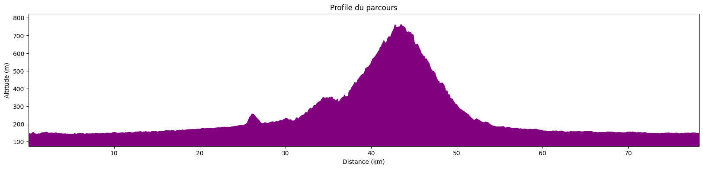
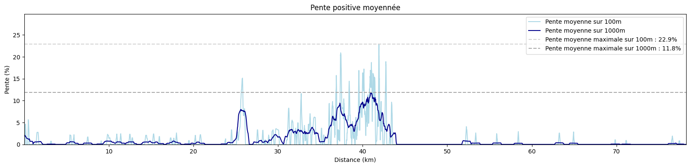

# Analyse de données de parcours vélo

## 1. Présentation du modèle de calcul de puissance

L'idée est de créer un outil d'analyse de performances à vélo a partir des données fournies par Garmin. Ce genre d'outils existe probablement déjà, mais je suis actuellement en stage et je dois bien m'occuper pendant la journée.

Le but est donc de créer, à l'aide d'un Notebook, une interface simple pour enregistrer ses données de courses et en afficher l'analyse. Le principal enjeux de ce projet est l'analyse de la puissance développée par le coureur. En effet, les capteurs de puissance sont un dispositif moderne qui permet d'estimer, en calculant la pression exercée par le coureur sur la pédale et la cadence de pédalage, la puissance développée par le coureur en Watts. Ce dispositif est depuis quelques années déjà présent sur les vélos des cyclistes professionnels, car ils peuvent servir à estimer leur état de fatigue.

En effet, un cycliste connait sa fréquence cardiaque en fonction de la puissance qu'il développe. Lorsque le coureur atteint un stade de fatigue avancé, la fréquence cardiaque chute drastiquement, ce qui permet aux coureurs de savoir s'ils ont *les jambes* pour attaquer.

Toutefois, ce dispositif extrêmement important à haut niveau coûte encore très cher (1400€). Or, cette puissance dévelopée peut être estimée  gratuitement (après la lecture de nombreux papier scientifiques à ce sujet) de manière relativement précise (si on ne tiens pas compte du fait qu'un cycliste peut être dans l'aspiration d'un autre cycliste devant lui, ce qui n'a de toute façon que peu d'importance dans la montagne, là où le capteur est le plus important).

### 1.1. Calculs d'energies

La puissance est une grandeur qui quantifie les transfert d'energie au cours du temps. Par exemple, lorsqu'un vélo descend une pente, son énergie potentielle (proportionnelle à son altitude) est transformée en énergie cinétique (proportionnelle au carré de sa vitesse). A cela s'ajoute les forces de frottement qui transfèrent l'énergie cinétique du cycliste (qui est donc ralentit par les frottements) à l'air (l'air est mis en mouvement par le passage du cycliste).

Pour cette raison, notre estimation de la puissance développée par un cycliste se base sur des bilans énergétiques.

#### 1.1.1. Bilan énergétique et bilan de puissance

Faisons un bilan des forces à notre cycliste.

$$
m*a = F_{pédalage} + F_{gravité} + F_{frottements} 
$$
avec $m$ la *masse* du cycliste, $a$ son accélération et $F$ les forces qu'il subit.

Cette équation se traduit de la manière suivante pour faire apparaître des puissances :

$$
\Delta E_c + \Delta E_p = (P_{pédalage} + P_{frottements})*t
$$

avec :
- $E_c = \frac{1}{2}mv^2$ l'énergie cinétique du cycliste (v étant la *vitesse* du cycliste)
- $E_p = mgz$ l'énerige potentielle de pesanteur (g est l'*accélération* de la pesanteur, soit l'accélération que subit un objet en chute libre, et a est l'altitude du cycliste)
- $P_{pédalage}$ le nombre de Watt produits par le cycliste
- $P_{frottements} = -F_{frottements}*v$ la puissance des forces de frottements (négative)
- t le temps
  
Ainsi, si les forces de frottements son plus importantes que la puissance développée par le cycliste, celui-ci aura tendance à perdre de l'énergie et ralentir. Puisque la montre Garmin fourni la vitesse et l'altitude du cycliste, les énergies cinétique et potentielle sont aisées à déterminer. 

Afin de résoudre notre bilan de puissance et déterminer $P_{pédalage}$, il suffit donc de déterminer $F_{frottements}$.

#### 1.1.2. Estimation de la trainée

Pour déterminer les forces de frottements (aussi appelée *trainée*, ou *drag* en anglais), on utilise les résultats de la mécanique des fluides : 

$$F_{drag}=\frac{1}{2}*C_d*\rho*v^2*A$$

avec:
- $\rho$ la densité volumique de l'air
- $A$ la *projected frontal area* autrement dit la surface que le cycliste offre au vent
- $C_d$ le coefficient de trainée

La thermodynamique permet d'estimer la densité volumique de l'air en fonction de l'altitude du cycliste. Quand à $A$ et $C_d$, ce sont des facteurs aérodynamiques qui dépendent de la taille et de la position du coureur sur le vélo.

#### 1.1.3. Estimation de la *projected frontal area*

La *projected frontal area* (PFA) est la surface que le cycliste offre au vent. Un cycliste que se tient droit sur son vélo offre plus de prise au vent est est plus ralentit, ce qui se traduit dans les équations par un $A$ plus important, ce qui augmente la force de frottement. Un cycliste en position aérodynamique, recroquevillé sur lui-même, présente une moins importante surface au vent, est moins ralenti et va donc plus vite.

Toutefois, cette surface n'est pas évidente à déterminer. Il est possible de l'estimer à partir d'une photo du cycliste prise de face, mais l'utilisation d'un tel procédé serait un peu fastidieuse. Heureusement, puisque la question de l'aérodynamisme d'un cycliste est très étudiée aujourd'hui, différents modèles ont été développés pour estimer la PFA à partir de la taille et du poids du cycliste. La formule qui donne ce résultat est la suivante :
0.0293 * (size**0.725) * (mass**0.425) + 0.0604

$$
PFA = 0.0293*taille^{0.725}*masse^{0.425} + 0.0604
$$

#### 1.1.4. Estimation du coefficient de trainée

Enfin, il reste à estimer le coefficient de trainée. Celui-ci ne peut être approximé que très grossièrement car il dépend grandement de la position du cycliste. En effet, la force de frottement est créée par les turbulences que le cycliste génère dans son sillage. Une position qui *fend* l'air produit moins de turbulance et réduit donc la force de frottements.

Un autre exemple intéressant est la position des jambes. Des simulations et des essais dans des souffleries montrent qu'avoir les pédale à l'horizontal (et donc avoir les deux jambes pliées de manière similaire) permet l'émergence d'un flux symétrique qui réduit les turbulences, et donc le coefficient de frottement, à l'inverse d'une position avec une jambe tendue et une jambe pliée.

Le coefficient de frottement dépend aussi de la forme du cadre du vélo, de la forme des roues (roue pleine ou non), des vêtements du cycliste... Dans la suite on choisira $C_d=1.0$ et on s'en contentera. Il s'agit du coefficient en position relevée ou en position *dropped*. En position *time-trial*, avec des prolongateurs, ce coefficient descend à $C_d=0.8$.

### 1.2. Limites du modèle

Notre modèle se base donc sur l'estimation de différents coefficients clefs à l'aide des résultats obtenus par des testes en souffleries et des simulations informatiques. Certaines approximations sont peut-être un peu brutales, ce qui justifie l'utilisation de capteurs de puissance au niveau des pédales, qui, eux, donnent toujours un résultat exact, mais notre approximation reste de relativement bonne qualité.

Toutefois deux facteurs on été ommis dans cette étude, et sont d'une grande importance et faussent les résultats. Premièrement le vent n'est pas considéré ici. Un cycliste qui roule à 20km/h avec un vent de face de 20km/h subit la même force de frottement qu'un cycliste qui roule à 40km/h. Malheureusement il est impossible de prendre le vent en compte dans cette étude. Deuxièmement, le coefficient de trainée d'un coureur qui dans l'aspiration d'un autre coureur est jusqu'à deux fois inférieur à la normale. De même, impossible de prendre cet effet en compte.

On ommet aussi des facteurs moins importants, comme les frottements dus au contact entre le vélo et la route, ainsi qu'entre les différentes pièces mécaniques du vélo, mais ceci représentent une part suffisamment minime du bilan énergétique pour qu'elles soient ignorées. On néglige aussi l'énergie liée à la mise en rotation de la roue pour la même raison.

En résumé, ce modèle est un très bon indicateur de la puissance du cycliste à part quand il y a un fort vent ou quand le cycliste prend l'aspiration d'un autre cycliste sur du plat (en montée, la vitesse des coureurs est suffisamment faible pour que l'impact des forces de frottements soient moins importante). Mais même dans ce cas là, les données devraient nous permettre d'obtenir des analyses cohérentes des zones de puissance.

## 2. Analyse des performances

A l'aide de ces données, il va être possible d'estimer certain indicateurs qui peuvent être utilisés pour quantifier la forme physique ou la fatigue du cycliste. Ces indicateurs se basent sur les données présentes dans le fichier *.fit*, à savoir la fréquence cardiaque ainsi que la puissance. Il est difficile de créer des indicateurs de bonne qualité sans avoir accès à plus de données, et sur une simple sortie vélo (ces indicateurs sont souvent censés être calculés lors de tests bien définis). A la place, nous disposons généralement d'une longue sortie vélo, où le cycliste conserve sont énergies, ce qui conduit à une sous-estimation des indicateurs basés sur des puissances maximales.

### 2.1. Peak Power Output

La *Peak Power Output* (PPO) est une mesure de la puissance maximale qu'un cycliste peu produire. Techniquement, le test pour déterminer cette grandeur est le suivant : faire effectuer une série de tests de 150s où le cycliste doit maintenir une certaine puissance, augmenter cette puissance au fur et à mesure, et lorsque le cycliste ne peut plus c'est qu'on a atteint la PPO. A défaut d'être dans les conditions optimales pour effectuer le test, on se contentera dand le suite d'estimer la PPO en cherchant le maximum de puissance maintenu pendant 150s.

Les meilleurs sprinteurs peuvent produire jusqu'à 2000W.

### 2.2. $\text{VO}_{\text{2 MAX}}$

La $\text{VO}_{\text{2 MAX}}$ est la *consommation maximale d'oxygène*, soit le volume d'oxygène que le corps peu consommer lors d'un effort maximal. Cette grandeur s'exprime en L/min, mais pour tenir compte de la morphologie du sportif celle-ci est en réalité généralement exprimée en L/min/kg (après avoir divisé par la masse du cycliste). La $\text{VO}_{\text{2 MAX}}$ n'est en réalité par le meilleur indicateur de l'endurance d'un cycliste, mais il s'agit d'un indicateur couramment utilisé. Or il existe une forte corrélation entre la PPo et la $\text{VO}_{\text{2 MAX}}$, ce qui va nous permettre de l'estimer, grâce à la formule suivante:
$$\text{VO}_{\text{2 MAX}} = 0.01141*W_{\text{peak}} + 0.435$$

En divisant par la masse du cycliste et en convertissant en mL/min, il est ainsi possible d'estimer la $\text{VO}_{\text{2 MAX}}$. Toutefois, dû à la suite d'approximation dans l'estimation de cet indicateur, il n'est pas de très bonne qualité.

### 2.3. Functional Power Treshold

La *Fonctionnal Power Treshold* (FTP) est la puissance maximale qu'un cycliste peut produire pendant 1h. Ici, nous l'avons estimée en considérant qu'elle vaut 95% de la puissance maximale soutenue pendant 20 minutes. Toutefois, lorsqu'on étudie la production de watts, on préfère en général calculer les indicateurs en W/kg. Il existe des tests bien définis pour calculer la FTP de manière précise, mais nous ne disposons encore une fois pas de ces tests ici.

A titre de comparaison, la FTP d'un cycliste amateur se situe entre 1.5 et 2.5 W/kg, alors qu'un cycliste expérimenté à une FTP entre 3.0 et 4.5 W/kg. Les cycliste du tour de France, eux, possèdent une FTP de jusqu'à 7.0 W/kg.

## 3. Sources

1. <a href='https://www.researchgate.net/publication/51660070_Aerodynamic_drag_in_cycling_Methods_of_assessment'>Aerodynamic drag in cycling: Methods of assessment</a>
2. <a href='https://www.researchgate.net/publication/259742352_An_experimental_study_of_bicycle_aerodynamics'>An experimental study of bicycle aerodynamics</a>
3. <a href='https://link.springer.com/article/10.1007/s12283-017-0234-1'>Riding against the wind: a review of competition cycling aerodynamics</a>
4. <a href='https://www.researchgate.net/publication/225161766_The_understanding_and_development_of_cycling_aerodynamics'>The understanding and development of cycling aerodynamics</a>
5. <a href='https://link.springer.com/article/10.2165/00007256-200535040-00002'>The Science of Cycling — Physiology and Training — Part 1</a>
6. <a href='https://link.springer.com/article/10.1007/bf01466278'>Peak power output predicts maximal oxygen uptake and performance time in trained cyclists</a>

## 4. Graphiques

Il est temps d'appliquer cette belle théorie à des sorties vélo. Les graphes suivants sont similaires à ceux qu'on peut obtenir à partir de Garmin Connect, mais des données de puissance y sont ajoutées.

### 4.1. Collecte des données

Avant de commencer l'analyse, il faut enregistrer le fichier *.fit* qui contient les données de la sortie vélo dans <a href='activites'>ce dossier</a>. Ce fichier *.fit* peut être téléchargé depuis <a href='https://connect.garmin.com/modern/activities?activityType=cycling'>Garmin Connect</a> (sélectionner l'activité à télécharger, et chercher *Exporter au format original* ou *Exporter en FIT*).

Une fois que le fichier est présent dans le dossier, executer la cellule ci-dessous en la modifiant de la manière suivante : 

```python
filename = "nom_du_fichier.fit"
poids = 70 # poids du cycliste en kg
taille = 180 # taille du cycliste en cm
```


```python
filename = "st_odile_2021.fit"
poids = 70
taille = 180
```

Ensuite, exécuter les cellules suivantes pour obtenir l'analyse de la sortie vélo.


```python
from cycling_data import CyclingData
CyclingData.set_cyclist(poids,taille/100)
cd = CyclingData(filename)
```

### 4.2. Informations globales


```python
cd.show_map()
cd.show_global_informations()
```


<div style="width:50vw;margin:auto;<div style="width:100%;"><div style="position:relative;width:100%;height:0;padding-bottom:60%;"><span style="color:#565656">Make this Notebook Trusted to load map: File -> Trust Notebook</span><iframe srcdoc="&lt;!DOCTYPE html&gt;
&lt;html&gt;
&lt;head&gt;

    &lt;meta http-equiv=&quot;content-type&quot; content=&quot;text/html; charset=UTF-8&quot; /&gt;

        &lt;script&gt;
            L_NO_TOUCH = false;
            L_DISABLE_3D = false;
        &lt;/script&gt;

    &lt;style&gt;html, body {width: 100%;height: 100%;margin: 0;padding: 0;}&lt;/style&gt;
    &lt;style&gt;#map {position:absolute;top:0;bottom:0;right:0;left:0;}&lt;/style&gt;
    &lt;script src=&quot;https://cdn.jsdelivr.net/npm/leaflet@1.9.3/dist/leaflet.js&quot;&gt;&lt;/script&gt;
    &lt;script src=&quot;https://code.jquery.com/jquery-1.12.4.min.js&quot;&gt;&lt;/script&gt;
    &lt;script src=&quot;https://cdn.jsdelivr.net/npm/bootstrap@5.2.2/dist/js/bootstrap.bundle.min.js&quot;&gt;&lt;/script&gt;
    &lt;script src=&quot;https://cdnjs.cloudflare.com/ajax/libs/Leaflet.awesome-markers/2.0.2/leaflet.awesome-markers.js&quot;&gt;&lt;/script&gt;
    &lt;link rel=&quot;stylesheet&quot; href=&quot;https://cdn.jsdelivr.net/npm/leaflet@1.9.3/dist/leaflet.css&quot;/&gt;
    &lt;link rel=&quot;stylesheet&quot; href=&quot;https://cdn.jsdelivr.net/npm/bootstrap@5.2.2/dist/css/bootstrap.min.css&quot;/&gt;
    &lt;link rel=&quot;stylesheet&quot; href=&quot;https://netdna.bootstrapcdn.com/bootstrap/3.0.0/css/bootstrap.min.css&quot;/&gt;
    &lt;link rel=&quot;stylesheet&quot; href=&quot;https://cdn.jsdelivr.net/npm/@fortawesome/fontawesome-free@6.2.0/css/all.min.css&quot;/&gt;
    &lt;link rel=&quot;stylesheet&quot; href=&quot;https://cdnjs.cloudflare.com/ajax/libs/Leaflet.awesome-markers/2.0.2/leaflet.awesome-markers.css&quot;/&gt;
    &lt;link rel=&quot;stylesheet&quot; href=&quot;https://cdn.jsdelivr.net/gh/python-visualization/folium/folium/templates/leaflet.awesome.rotate.min.css&quot;/&gt;

            &lt;meta name=&quot;viewport&quot; content=&quot;width=device-width,
                initial-scale=1.0, maximum-scale=1.0, user-scalable=no&quot; /&gt;
            &lt;style&gt;
                #map_dfa05e946bd79aed7fbad4808162e5e5 {
                    position: relative;
                    width: 100.0%;
                    height: 100.0%;
                    left: 0.0%;
                    top: 0.0%;
                }
                .leaflet-container { font-size: 1rem; }
            &lt;/style&gt;

&lt;/head&gt;
&lt;body&gt;


            &lt;div class=&quot;folium-map&quot; id=&quot;map_dfa05e946bd79aed7fbad4808162e5e5&quot; &gt;&lt;/div&gt;

&lt;/body&gt;
&lt;script&gt;


            var map_dfa05e946bd79aed7fbad4808162e5e5 = L.map(
                &quot;map_dfa05e946bd79aed7fbad4808162e5e5&quot;,
                {
                    center: [48.58136384457772, 7.738151782013526],
                    crs: L.CRS.EPSG3857,
                    zoom: 18,
                    zoomControl: true,
                    preferCanvas: false,
                }
            );


            var tile_layer_b4c395c0b644daa40b86e6f1c86d5c3c = L.tileLayer(
                &quot;https://server.arcgisonline.com/ArcGIS/rest/services/World_Imagery/MapServer/tile/{z}/{y}/{x}&quot;,
                {&quot;attribution&quot;: &quot;Esri&quot;, &quot;detectRetina&quot;: false, &quot;maxNativeZoom&quot;: 18, &quot;maxZoom&quot;: 18, &quot;minZoom&quot;: 0, &quot;noWrap&quot;: false, &quot;opacity&quot;: 1, &quot;subdomains&quot;: &quot;abc&quot;, &quot;tms&quot;: false}
            ).addTo(map_dfa05e946bd79aed7fbad4808162e5e5);


            var poly_line_3d87c7933cf334eea1c49225976132c4 = L.polyline(
                [[48.58136384457772, 7.738396785037297], [48.58139083430528, 7.738151782013526]],
                {&quot;bubblingMouseEvents&quot;: true, &quot;color&quot;: &quot;#a7d300&quot;, &quot;dashArray&quot;: null, &quot;dashOffset&quot;: null, &quot;fill&quot;: false, &quot;fillColor&quot;: &quot;#a7d300&quot;, &quot;fillOpacity&quot;: 0.2, &quot;fillRule&quot;: &quot;evenodd&quot;, &quot;lineCap&quot;: &quot;round&quot;, &quot;lineJoin&quot;: &quot;round&quot;, &quot;noClip&quot;: false, &quot;opacity&quot;: 1.0, &quot;smoothFactor&quot;: 1.0, &quot;stroke&quot;: true, &quot;weight&quot;: 3}
            ).addTo(map_dfa05e946bd79aed7fbad4808162e5e5);


            var poly_line_959123ecbde6a5384d23828456a3b3f6 = L.polyline(
                [[48.58139083430528, 7.738151782013526], [48.58142679266902, 7.737959836435546]],
                {&quot;bubblingMouseEvents&quot;: true, &quot;color&quot;: &quot;#a7d300&quot;, &quot;dashArray&quot;: null, &quot;dashOffset&quot;: null, &quot;fill&quot;: false, &quot;fillColor&quot;: &quot;#a7d300&quot;, &quot;fillOpacity&quot;: 0.2, &quot;fillRule&quot;: &quot;evenodd&quot;, &quot;lineCap&quot;: &quot;round&quot;, &quot;lineJoin&quot;: &quot;round&quot;, &quot;noClip&quot;: false, &quot;opacity&quot;: 1.0, &quot;smoothFactor&quot;: 1.0, &quot;stroke&quot;: true, &quot;weight&quot;: 3}
            ).addTo(map_dfa05e946bd79aed7fbad4808162e5e5);


            var poly_line_45427dd936b4b8eaa341bbaf8cd1cb5d = L.polyline(
                [[48.58142679266902, 7.737959836435546], [48.581470797659605, 7.737897810353578]],
                {&quot;bubblingMouseEvents&quot;: true, &quot;color&quot;: &quot;#a7d300&quot;, &quot;dashArray&quot;: null, &quot;dashOffset&quot;: null, &quot;fill&quot;: false, &quot;fillColor&quot;: &quot;#a7d300&quot;, &quot;fillOpacity&quot;: 0.2, &quot;fillRule&quot;: &quot;evenodd&quot;, &quot;lineCap&quot;: &quot;round&quot;, &quot;lineJoin&quot;: &quot;round&quot;, &quot;noClip&quot;: false, &quot;opacity&quot;: 1.0, &quot;smoothFactor&quot;: 1.0, &quot;stroke&quot;: true, &quot;weight&quot;: 3}
            ).addTo(map_dfa05e946bd79aed7fbad4808162e5e5);


            var poly_line_4b21957ef59f126e0cf449780088e3e4 = L.polyline(
                [[48.581470797659605, 7.737897810353578], [48.58144682541712, 7.73778783978663]],
                {&quot;bubblingMouseEvents&quot;: true, &quot;color&quot;: &quot;#a7d300&quot;, &quot;dashArray&quot;: null, &quot;dashOffset&quot;: null, &quot;fill&quot;: false, &quot;fillColor&quot;: &quot;#a7d300&quot;, &quot;fillOpacity&quot;: 0.2, &quot;fillRule&quot;: &quot;evenodd&quot;, &quot;lineCap&quot;: &quot;round&quot;, &quot;lineJoin&quot;: &quot;round&quot;, &quot;noClip&quot;: false, &quot;opacity&quot;: 1.0, &quot;smoothFactor&quot;: 1.0, &quot;stroke&quot;: true, &quot;weight&quot;: 3}
            ).addTo(map_dfa05e946bd79aed7fbad4808162e5e5);


            var poly_line_65cb55b473fa920326638f2774694b38 = L.polyline(
                [[48.58144682541712, 7.73778783978663], [48.58135579795088, 7.7374648012462215]],
                {&quot;bubblingMouseEvents&quot;: true, &quot;color&quot;: &quot;#a7d300&quot;, &quot;dashArray&quot;: null, &quot;dashOffset&quot;: null, &quot;fill&quot;: false, &quot;fillColor&quot;: &quot;#a7d300&quot;, &quot;fillOpacity&quot;: 0.2, &quot;fillRule&quot;: &quot;evenodd&quot;, &quot;lineCap&quot;: &quot;round&quot;, &quot;lineJoin&quot;: &quot;round&quot;, &quot;noClip&quot;: false, &quot;opacity&quot;: 1.0, &quot;smoothFactor&quot;: 1.0, &quot;stroke&quot;: true, &quot;weight&quot;: 3}
            ).addTo(map_dfa05e946bd79aed7fbad4808162e5e5);


            var poly_line_26ebcedbbc1cca85ce985ec50aebc45a = L.polyline(
                [[48.58135579795088, 7.7374648012462215], [48.581316822102075, 7.737127848746884]],
                {&quot;bubblingMouseEvents&quot;: true, &quot;color&quot;: &quot;#a7d300&quot;, &quot;dashArray&quot;: null, &quot;dashOffset&quot;: null, &quot;fill&quot;: false, &quot;fillColor&quot;: &quot;#a7d300&quot;, &quot;fillOpacity&quot;: 0.2, &quot;fillRule&quot;: &quot;evenodd&quot;, &quot;lineCap&quot;: &quot;round&quot;, &quot;lineJoin&quot;: &quot;round&quot;, &quot;noClip&quot;: false, &quot;opacity&quot;: 1.0, &quot;smoothFactor&quot;: 1.0, &quot;stroke&quot;: true, &quot;weight&quot;: 3}
            ).addTo(map_dfa05e946bd79aed7fbad4808162e5e5);


            var poly_line_969e68383dc549aa6160cbad479e4193 = L.polyline(
                [[48.581316822102075, 7.737127848746884], [48.581315816273715, 7.736779832135629]],
                {&quot;bubblingMouseEvents&quot;: true, &quot;color&quot;: &quot;#a7d300&quot;, &quot;dashArray&quot;: null, &quot;dashOffset&quot;: null, &quot;fill&quot;: false, &quot;fillColor&quot;: &quot;#a7d300&quot;, &quot;fillOpacity&quot;: 0.2, &quot;fillRule&quot;: &quot;evenodd&quot;, &quot;lineCap&quot;: &quot;round&quot;, &quot;lineJoin&quot;: &quot;round&quot;, &quot;noClip&quot;: false, &quot;opacity&quot;: 1.0, &quot;smoothFactor&quot;: 1.0, &quot;stroke&quot;: true, &quot;weight&quot;: 3}
            ).addTo(map_dfa05e946bd79aed7fbad4808162e5e5);


            var poly_line_3832de02dc6cfc439d9816afe32d027c = L.polyline(
                [[48.581315816273715, 7.736779832135629], [48.58128178574766, 7.736532817455145]],
                {&quot;bubblingMouseEvents&quot;: true, &quot;color&quot;: &quot;#85c200&quot;, &quot;dashArray&quot;: null, &quot;dashOffset&quot;: null, &quot;fill&quot;: false, &quot;fillColor&quot;: &quot;#85c200&quot;, &quot;fillOpacity&quot;: 0.2, &quot;fillRule&quot;: &quot;evenodd&quot;, &quot;lineCap&quot;: &quot;round&quot;, &quot;lineJoin&quot;: &quot;round&quot;, &quot;noClip&quot;: false, &quot;opacity&quot;: 1.0, &quot;smoothFactor&quot;: 1.0, &quot;stroke&quot;: true, &quot;weight&quot;: 3}
            ).addTo(map_dfa05e946bd79aed7fbad4808162e5e5);


            var poly_line_5efd81bb826088b8b336dc77ae65da43 = L.polyline(
                [[48.58128178574766, 7.736532817455145], [48.581221855141436, 7.736491829949629]],
                {&quot;bubblingMouseEvents&quot;: true, &quot;color&quot;: &quot;#85c200&quot;, &quot;dashArray&quot;: null, &quot;dashOffset&quot;: null, &quot;fill&quot;: false, &quot;fillColor&quot;: &quot;#85c200&quot;, &quot;fillOpacity&quot;: 0.2, &quot;fillRule&quot;: &quot;evenodd&quot;, &quot;lineCap&quot;: &quot;round&quot;, &quot;lineJoin&quot;: &quot;round&quot;, &quot;noClip&quot;: false, &quot;opacity&quot;: 1.0, &quot;smoothFactor&quot;: 1.0, &quot;stroke&quot;: true, &quot;weight&quot;: 3}
            ).addTo(map_dfa05e946bd79aed7fbad4808162e5e5);


            var poly_line_fc61b6957fc8d2d3a1ece3f3be9b9441 = L.polyline(
                [[48.581221855141436, 7.736491829949629], [48.581158823231114, 7.736387810533789]],
                {&quot;bubblingMouseEvents&quot;: true, &quot;color&quot;: &quot;#85c200&quot;, &quot;dashArray&quot;: null, &quot;dashOffset&quot;: null, &quot;fill&quot;: false, &quot;fillColor&quot;: &quot;#85c200&quot;, &quot;fillOpacity&quot;: 0.2, &quot;fillRule&quot;: &quot;evenodd&quot;, &quot;lineCap&quot;: &quot;round&quot;, &quot;lineJoin&quot;: &quot;round&quot;, &quot;noClip&quot;: false, &quot;opacity&quot;: 1.0, &quot;smoothFactor&quot;: 1.0, &quot;stroke&quot;: true, &quot;weight&quot;: 3}
            ).addTo(map_dfa05e946bd79aed7fbad4808162e5e5);


            var poly_line_2a9b170eabd90166bcbcad7a7e44b761 = L.polyline(
                [[48.581158823231114, 7.736387810533789], [48.581105849604356, 7.7361448191667295]],
                {&quot;bubblingMouseEvents&quot;: true, &quot;color&quot;: &quot;#85c200&quot;, &quot;dashArray&quot;: null, &quot;dashOffset&quot;: null, &quot;fill&quot;: false, &quot;fillColor&quot;: &quot;#85c200&quot;, &quot;fillOpacity&quot;: 0.2, &quot;fillRule&quot;: &quot;evenodd&quot;, &quot;lineCap&quot;: &quot;round&quot;, &quot;lineJoin&quot;: &quot;round&quot;, &quot;noClip&quot;: false, &quot;opacity&quot;: 1.0, &quot;smoothFactor&quot;: 1.0, &quot;stroke&quot;: true, &quot;weight&quot;: 3}
            ).addTo(map_dfa05e946bd79aed7fbad4808162e5e5);


            var poly_line_bdca781118ca98d708ba13579b99015c = L.polyline(
                [[48.581105849604356, 7.7361448191667295], [48.58099084989563, 7.735921776728736]],
                {&quot;bubblingMouseEvents&quot;: true, &quot;color&quot;: &quot;#85c200&quot;, &quot;dashArray&quot;: null, &quot;dashOffset&quot;: null, &quot;fill&quot;: false, &quot;fillColor&quot;: &quot;#85c200&quot;, &quot;fillOpacity&quot;: 0.2, &quot;fillRule&quot;: &quot;evenodd&quot;, &quot;lineCap&quot;: &quot;round&quot;, &quot;lineJoin&quot;: &quot;round&quot;, &quot;noClip&quot;: false, &quot;opacity&quot;: 1.0, &quot;smoothFactor&quot;: 1.0, &quot;stroke&quot;: true, &quot;weight&quot;: 3}
            ).addTo(map_dfa05e946bd79aed7fbad4808162e5e5);


            var poly_line_ba3814646e865b11bfacf1b93b6f3d25 = L.polyline(
                [[48.58099084989563, 7.735921776728736], [48.580673846325354, 7.735826809768102]],
                {&quot;bubblingMouseEvents&quot;: true, &quot;color&quot;: &quot;#64b200&quot;, &quot;dashArray&quot;: null, &quot;dashOffset&quot;: null, &quot;fill&quot;: false, &quot;fillColor&quot;: &quot;#64b200&quot;, &quot;fillOpacity&quot;: 0.2, &quot;fillRule&quot;: &quot;evenodd&quot;, &quot;lineCap&quot;: &quot;round&quot;, &quot;lineJoin&quot;: &quot;round&quot;, &quot;noClip&quot;: false, &quot;opacity&quot;: 1.0, &quot;smoothFactor&quot;: 1.0, &quot;stroke&quot;: true, &quot;weight&quot;: 3}
            ).addTo(map_dfa05e946bd79aed7fbad4808162e5e5);


            var poly_line_ff46efa389c338c487ac79acaabad272 = L.polyline(
                [[48.580673846325354, 7.735826809768102], [48.58029079335969, 7.735742823100357]],
                {&quot;bubblingMouseEvents&quot;: true, &quot;color&quot;: &quot;#43a100&quot;, &quot;dashArray&quot;: null, &quot;dashOffset&quot;: null, &quot;fill&quot;: false, &quot;fillColor&quot;: &quot;#43a100&quot;, &quot;fillOpacity&quot;: 0.2, &quot;fillRule&quot;: &quot;evenodd&quot;, &quot;lineCap&quot;: &quot;round&quot;, &quot;lineJoin&quot;: &quot;round&quot;, &quot;noClip&quot;: false, &quot;opacity&quot;: 1.0, &quot;smoothFactor&quot;: 1.0, &quot;stroke&quot;: true, &quot;weight&quot;: 3}
            ).addTo(map_dfa05e946bd79aed7fbad4808162e5e5);


            var poly_line_e054ab62cf8960a451e6964ce0b54f07 = L.polyline(
                [[48.58029079335969, 7.735742823100357], [48.579953840860355, 7.73559278703722]],
                {&quot;bubblingMouseEvents&quot;: true, &quot;color&quot;: &quot;#85c200&quot;, &quot;dashArray&quot;: null, &quot;dashOffset&quot;: null, &quot;fill&quot;: false, &quot;fillColor&quot;: &quot;#85c200&quot;, &quot;fillOpacity&quot;: 0.2, &quot;fillRule&quot;: &quot;evenodd&quot;, &quot;lineCap&quot;: &quot;round&quot;, &quot;lineJoin&quot;: &quot;round&quot;, &quot;noClip&quot;: false, &quot;opacity&quot;: 1.0, &quot;smoothFactor&quot;: 1.0, &quot;stroke&quot;: true, &quot;weight&quot;: 3}
            ).addTo(map_dfa05e946bd79aed7fbad4808162e5e5);


            var poly_line_da67907a5a3b29b0248dac836e37f5ff = L.polyline(
                [[48.579953840860355, 7.73559278703722], [48.579651840896396, 7.735311825649712]],
                {&quot;bubblingMouseEvents&quot;: true, &quot;color&quot;: &quot;#c8e400&quot;, &quot;dashArray&quot;: null, &quot;dashOffset&quot;: null, &quot;fill&quot;: false, &quot;fillColor&quot;: &quot;#c8e400&quot;, &quot;fillOpacity&quot;: 0.2, &quot;fillRule&quot;: &quot;evenodd&quot;, &quot;lineCap&quot;: &quot;round&quot;, &quot;lineJoin&quot;: &quot;round&quot;, &quot;noClip&quot;: false, &quot;opacity&quot;: 1.0, &quot;smoothFactor&quot;: 1.0, &quot;stroke&quot;: true, &quot;weight&quot;: 3}
            ).addTo(map_dfa05e946bd79aed7fbad4808162e5e5);


            var poly_line_74ba39cc4cdb8d266f668be9e437d21c = L.polyline(
                [[48.579651840896396, 7.735311825649712], [48.579405832044266, 7.73510982178817]],
                {&quot;bubblingMouseEvents&quot;: true, &quot;color&quot;: &quot;#c8e400&quot;, &quot;dashArray&quot;: null, &quot;dashOffset&quot;: null, &quot;fill&quot;: false, &quot;fillColor&quot;: &quot;#c8e400&quot;, &quot;fillOpacity&quot;: 0.2, &quot;fillRule&quot;: &quot;evenodd&quot;, &quot;lineCap&quot;: &quot;round&quot;, &quot;lineJoin&quot;: &quot;round&quot;, &quot;noClip&quot;: false, &quot;opacity&quot;: 1.0, &quot;smoothFactor&quot;: 1.0, &quot;stroke&quot;: true, &quot;weight&quot;: 3}
            ).addTo(map_dfa05e946bd79aed7fbad4808162e5e5);


            var poly_line_cfa36d5471e974defe7d9c684fc35c9a = L.polyline(
                [[48.579405832044266, 7.73510982178817], [48.57919385371819, 7.7349368193108985]],
                {&quot;bubblingMouseEvents&quot;: true, &quot;color&quot;: &quot;#a7d300&quot;, &quot;dashArray&quot;: null, &quot;dashOffset&quot;: null, &quot;fill&quot;: false, &quot;fillColor&quot;: &quot;#a7d300&quot;, &quot;fillOpacity&quot;: 0.2, &quot;fillRule&quot;: &quot;evenodd&quot;, &quot;lineCap&quot;: &quot;round&quot;, &quot;lineJoin&quot;: &quot;round&quot;, &quot;noClip&quot;: false, &quot;opacity&quot;: 1.0, &quot;smoothFactor&quot;: 1.0, &quot;stroke&quot;: true, &quot;weight&quot;: 3}
            ).addTo(map_dfa05e946bd79aed7fbad4808162e5e5);


            var poly_line_8f470bb867cdd3ea13e44de50ce4a9e8 = L.polyline(
                [[48.57919385371819, 7.7349368193108985], [48.57908379933222, 7.734656779932719]],
                {&quot;bubblingMouseEvents&quot;: true, &quot;color&quot;: &quot;#85c200&quot;, &quot;dashArray&quot;: null, &quot;dashOffset&quot;: null, &quot;fill&quot;: false, &quot;fillColor&quot;: &quot;#85c200&quot;, &quot;fillOpacity&quot;: 0.2, &quot;fillRule&quot;: &quot;evenodd&quot;, &quot;lineCap&quot;: &quot;round&quot;, &quot;lineJoin&quot;: &quot;round&quot;, &quot;noClip&quot;: false, &quot;opacity&quot;: 1.0, &quot;smoothFactor&quot;: 1.0, &quot;stroke&quot;: true, &quot;weight&quot;: 3}
            ).addTo(map_dfa05e946bd79aed7fbad4808162e5e5);


            var poly_line_809c6b3a450a91fd3b45caaa063e2c9b = L.polyline(
                [[48.57908379933222, 7.734656779932719], [48.579101820423595, 7.734269787472659]],
                {&quot;bubblingMouseEvents&quot;: true, &quot;color&quot;: &quot;#64b200&quot;, &quot;dashArray&quot;: null, &quot;dashOffset&quot;: null, &quot;fill&quot;: false, &quot;fillColor&quot;: &quot;#64b200&quot;, &quot;fillOpacity&quot;: 0.2, &quot;fillRule&quot;: &quot;evenodd&quot;, &quot;lineCap&quot;: &quot;round&quot;, &quot;lineJoin&quot;: &quot;round&quot;, &quot;noClip&quot;: false, &quot;opacity&quot;: 1.0, &quot;smoothFactor&quot;: 1.0, &quot;stroke&quot;: true, &quot;weight&quot;: 3}
            ).addTo(map_dfa05e946bd79aed7fbad4808162e5e5);


            var poly_line_c51c451bcd5e83d7205400f9f53c6887 = L.polyline(
                [[48.579101820423595, 7.734269787472659], [48.57914683124254, 7.733909784740159]],
                {&quot;bubblingMouseEvents&quot;: true, &quot;color&quot;: &quot;#219100&quot;, &quot;dashArray&quot;: null, &quot;dashOffset&quot;: null, &quot;fill&quot;: false, &quot;fillColor&quot;: &quot;#219100&quot;, &quot;fillOpacity&quot;: 0.2, &quot;fillRule&quot;: &quot;evenodd&quot;, &quot;lineCap&quot;: &quot;round&quot;, &quot;lineJoin&quot;: &quot;round&quot;, &quot;noClip&quot;: false, &quot;opacity&quot;: 1.0, &quot;smoothFactor&quot;: 1.0, &quot;stroke&quot;: true, &quot;weight&quot;: 3}
            ).addTo(map_dfa05e946bd79aed7fbad4808162e5e5);


            var poly_line_79f60a65b8601b0e3ddefc32a9336b89 = L.polyline(
                [[48.57914683124254, 7.733909784740159], [48.57917885011188, 7.733651789766786]],
                {&quot;bubblingMouseEvents&quot;: true, &quot;color&quot;: &quot;#219100&quot;, &quot;dashArray&quot;: null, &quot;dashOffset&quot;: null, &quot;fill&quot;: false, &quot;fillColor&quot;: &quot;#219100&quot;, &quot;fillOpacity&quot;: 0.2, &quot;fillRule&quot;: &quot;evenodd&quot;, &quot;lineCap&quot;: &quot;round&quot;, &quot;lineJoin&quot;: &quot;round&quot;, &quot;noClip&quot;: false, &quot;opacity&quot;: 1.0, &quot;smoothFactor&quot;: 1.0, &quot;stroke&quot;: true, &quot;weight&quot;: 3}
            ).addTo(map_dfa05e946bd79aed7fbad4808162e5e5);


            var poly_line_75ad00264b660ddd44d2e218f81f0f4b = L.polyline(
                [[48.57917885011188, 7.733651789766786], [48.57918379543463, 7.733557828634509]],
                {&quot;bubblingMouseEvents&quot;: true, &quot;color&quot;: &quot;#219100&quot;, &quot;dashArray&quot;: null, &quot;dashOffset&quot;: null, &quot;fill&quot;: false, &quot;fillColor&quot;: &quot;#219100&quot;, &quot;fillOpacity&quot;: 0.2, &quot;fillRule&quot;: &quot;evenodd&quot;, &quot;lineCap&quot;: &quot;round&quot;, &quot;lineJoin&quot;: &quot;round&quot;, &quot;noClip&quot;: false, &quot;opacity&quot;: 1.0, &quot;smoothFactor&quot;: 1.0, &quot;stroke&quot;: true, &quot;weight&quot;: 3}
            ).addTo(map_dfa05e946bd79aed7fbad4808162e5e5);


            var poly_line_1a45ef9bdaae63a14a51e4bd77e24a89 = L.polyline(
                [[48.57918379543463, 7.733557828634509], [48.57919678738423, 7.733441823097423]],
                {&quot;bubblingMouseEvents&quot;: true, &quot;color&quot;: &quot;#219100&quot;, &quot;dashArray&quot;: null, &quot;dashOffset&quot;: null, &quot;fill&quot;: false, &quot;fillColor&quot;: &quot;#219100&quot;, &quot;fillOpacity&quot;: 0.2, &quot;fillRule&quot;: &quot;evenodd&quot;, &quot;lineCap&quot;: &quot;round&quot;, &quot;lineJoin&quot;: &quot;round&quot;, &quot;noClip&quot;: false, &quot;opacity&quot;: 1.0, &quot;smoothFactor&quot;: 1.0, &quot;stroke&quot;: true, &quot;weight&quot;: 3}
            ).addTo(map_dfa05e946bd79aed7fbad4808162e5e5);


            var poly_line_d5fbafaf33bdd81b1654229bb6cf78f8 = L.polyline(
                [[48.57919678738423, 7.733441823097423], [48.579253784324415, 7.733139823133466]],
                {&quot;bubblingMouseEvents&quot;: true, &quot;color&quot;: &quot;#219100&quot;, &quot;dashArray&quot;: null, &quot;dashOffset&quot;: null, &quot;fill&quot;: false, &quot;fillColor&quot;: &quot;#219100&quot;, &quot;fillOpacity&quot;: 0.2, &quot;fillRule&quot;: &quot;evenodd&quot;, &quot;lineCap&quot;: &quot;round&quot;, &quot;lineJoin&quot;: &quot;round&quot;, &quot;noClip&quot;: false, &quot;opacity&quot;: 1.0, &quot;smoothFactor&quot;: 1.0, &quot;stroke&quot;: true, &quot;weight&quot;: 3}
            ).addTo(map_dfa05e946bd79aed7fbad4808162e5e5);


            var poly_line_e6a3401319b297ea2fc8f45ad820a509 = L.polyline(
                [[48.579253784324415, 7.733139823133466], [48.5792718054158, 7.732874787361599]],
                {&quot;bubblingMouseEvents&quot;: true, &quot;color&quot;: &quot;#219100&quot;, &quot;dashArray&quot;: null, &quot;dashOffset&quot;: null, &quot;fill&quot;: false, &quot;fillColor&quot;: &quot;#219100&quot;, &quot;fillOpacity&quot;: 0.2, &quot;fillRule&quot;: &quot;evenodd&quot;, &quot;lineCap&quot;: &quot;round&quot;, &quot;lineJoin&quot;: &quot;round&quot;, &quot;noClip&quot;: false, &quot;opacity&quot;: 1.0, &quot;smoothFactor&quot;: 1.0, &quot;stroke&quot;: true, &quot;weight&quot;: 3}
            ).addTo(map_dfa05e946bd79aed7fbad4808162e5e5);


            var poly_line_b63f4b3d038884f4deef90300548ca7d = L.polyline(
                [[48.5792718054158, 7.732874787361599], [48.57929879514336, 7.732334825172363]],
                {&quot;bubblingMouseEvents&quot;: true, &quot;color&quot;: &quot;#219100&quot;, &quot;dashArray&quot;: null, &quot;dashOffset&quot;: null, &quot;fill&quot;: false, &quot;fillColor&quot;: &quot;#219100&quot;, &quot;fillOpacity&quot;: 0.2, &quot;fillRule&quot;: &quot;evenodd&quot;, &quot;lineCap&quot;: &quot;round&quot;, &quot;lineJoin&quot;: &quot;round&quot;, &quot;noClip&quot;: false, &quot;opacity&quot;: 1.0, &quot;smoothFactor&quot;: 1.0, &quot;stroke&quot;: true, &quot;weight&quot;: 3}
            ).addTo(map_dfa05e946bd79aed7fbad4808162e5e5);


            var poly_line_9caed3ed9ea28fc5c3b39df6818ece93 = L.polyline(
                [[48.57929879514336, 7.732334825172363], [48.579336848982834, 7.731872814680735]],
                {&quot;bubblingMouseEvents&quot;: true, &quot;color&quot;: &quot;#219100&quot;, &quot;dashArray&quot;: null, &quot;dashOffset&quot;: null, &quot;fill&quot;: false, &quot;fillColor&quot;: &quot;#219100&quot;, &quot;fillOpacity&quot;: 0.2, &quot;fillRule&quot;: &quot;evenodd&quot;, &quot;lineCap&quot;: &quot;round&quot;, &quot;lineJoin&quot;: &quot;round&quot;, &quot;noClip&quot;: false, &quot;opacity&quot;: 1.0, &quot;smoothFactor&quot;: 1.0, &quot;stroke&quot;: true, &quot;weight&quot;: 3}
            ).addTo(map_dfa05e946bd79aed7fbad4808162e5e5);


            var poly_line_35ac09fe7837ad2e4ea16d805396b543 = L.polyline(
                [[48.579336848982834, 7.731872814680735], [48.579376830659996, 7.731591853293229]],
                {&quot;bubblingMouseEvents&quot;: true, &quot;color&quot;: &quot;#219100&quot;, &quot;dashArray&quot;: null, &quot;dashOffset&quot;: null, &quot;fill&quot;: false, &quot;fillColor&quot;: &quot;#219100&quot;, &quot;fillOpacity&quot;: 0.2, &quot;fillRule&quot;: &quot;evenodd&quot;, &quot;lineCap&quot;: &quot;round&quot;, &quot;lineJoin&quot;: &quot;round&quot;, &quot;noClip&quot;: false, &quot;opacity&quot;: 1.0, &quot;smoothFactor&quot;: 1.0, &quot;stroke&quot;: true, &quot;weight&quot;: 3}
            ).addTo(map_dfa05e946bd79aed7fbad4808162e5e5);


            var poly_line_560a0e2b005c4a25934bccf621647f10 = L.polyline(
                [[48.579376830659996, 7.731591853293229], [48.57945578818596, 7.731357830562346]],
                {&quot;bubblingMouseEvents&quot;: true, &quot;color&quot;: &quot;#219100&quot;, &quot;dashArray&quot;: null, &quot;dashOffset&quot;: null, &quot;fill&quot;: false, &quot;fillColor&quot;: &quot;#219100&quot;, &quot;fillOpacity&quot;: 0.2, &quot;fillRule&quot;: &quot;evenodd&quot;, &quot;lineCap&quot;: &quot;round&quot;, &quot;lineJoin&quot;: &quot;round&quot;, &quot;noClip&quot;: false, &quot;opacity&quot;: 1.0, &quot;smoothFactor&quot;: 1.0, &quot;stroke&quot;: true, &quot;weight&quot;: 3}
            ).addTo(map_dfa05e946bd79aed7fbad4808162e5e5);


            var poly_line_b4cf9cbe8e3f92ee5c4f167153277430 = L.polyline(
                [[48.57945578818596, 7.731357830562346], [48.579490824540365, 7.731182816428362]],
                {&quot;bubblingMouseEvents&quot;: true, &quot;color&quot;: &quot;#219100&quot;, &quot;dashArray&quot;: null, &quot;dashOffset&quot;: null, &quot;fill&quot;: false, &quot;fillColor&quot;: &quot;#219100&quot;, &quot;fillOpacity&quot;: 0.2, &quot;fillRule&quot;: &quot;evenodd&quot;, &quot;lineCap&quot;: &quot;round&quot;, &quot;lineJoin&quot;: &quot;round&quot;, &quot;noClip&quot;: false, &quot;opacity&quot;: 1.0, &quot;smoothFactor&quot;: 1.0, &quot;stroke&quot;: true, &quot;weight&quot;: 3}
            ).addTo(map_dfa05e946bd79aed7fbad4808162e5e5);


            var poly_line_3566b9a5a75da0adef58813a56b21538 = L.polyline(
                [[48.579490824540365, 7.731182816428362], [48.57953583535931, 7.73112481365982]],
                {&quot;bubblingMouseEvents&quot;: true, &quot;color&quot;: &quot;#219100&quot;, &quot;dashArray&quot;: null, &quot;dashOffset&quot;: null, &quot;fill&quot;: false, &quot;fillColor&quot;: &quot;#219100&quot;, &quot;fillOpacity&quot;: 0.2, &quot;fillRule&quot;: &quot;evenodd&quot;, &quot;lineCap&quot;: &quot;round&quot;, &quot;lineJoin&quot;: &quot;round&quot;, &quot;noClip&quot;: false, &quot;opacity&quot;: 1.0, &quot;smoothFactor&quot;: 1.0, &quot;stroke&quot;: true, &quot;weight&quot;: 3}
            ).addTo(map_dfa05e946bd79aed7fbad4808162e5e5);


            var poly_line_3bbf2978a01cbd85e9c21903f3abf38a = L.polyline(
                [[48.57953583535931, 7.73112481365982], [48.57957179372305, 7.731057842255101]],
                {&quot;bubblingMouseEvents&quot;: true, &quot;color&quot;: &quot;#219100&quot;, &quot;dashArray&quot;: null, &quot;dashOffset&quot;: null, &quot;fill&quot;: false, &quot;fillColor&quot;: &quot;#219100&quot;, &quot;fillOpacity&quot;: 0.2, &quot;fillRule&quot;: &quot;evenodd&quot;, &quot;lineCap&quot;: &quot;round&quot;, &quot;lineJoin&quot;: &quot;round&quot;, &quot;noClip&quot;: false, &quot;opacity&quot;: 1.0, &quot;smoothFactor&quot;: 1.0, &quot;stroke&quot;: true, &quot;weight&quot;: 3}
            ).addTo(map_dfa05e946bd79aed7fbad4808162e5e5);


            var poly_line_91eff8e727157a7da5c27ee567dfc822 = L.polyline(
                [[48.57957179372305, 7.731057842255101], [48.579698863372045, 7.730884839777829]],
                {&quot;bubblingMouseEvents&quot;: true, &quot;color&quot;: &quot;#219100&quot;, &quot;dashArray&quot;: null, &quot;dashOffset&quot;: null, &quot;fill&quot;: false, &quot;fillColor&quot;: &quot;#219100&quot;, &quot;fillOpacity&quot;: 0.2, &quot;fillRule&quot;: &quot;evenodd&quot;, &quot;lineCap&quot;: &quot;round&quot;, &quot;lineJoin&quot;: &quot;round&quot;, &quot;noClip&quot;: false, &quot;opacity&quot;: 1.0, &quot;smoothFactor&quot;: 1.0, &quot;stroke&quot;: true, &quot;weight&quot;: 3}
            ).addTo(map_dfa05e946bd79aed7fbad4808162e5e5);


            var poly_line_ec1d232b9bb42f4e53b1e7b5a69ec17a = L.polyline(
                [[48.579698863372045, 7.730884839777829], [48.57968385976574, 7.7306818300879305]],
                {&quot;bubblingMouseEvents&quot;: true, &quot;color&quot;: &quot;#008000&quot;, &quot;dashArray&quot;: null, &quot;dashOffset&quot;: null, &quot;fill&quot;: false, &quot;fillColor&quot;: &quot;#008000&quot;, &quot;fillOpacity&quot;: 0.2, &quot;fillRule&quot;: &quot;evenodd&quot;, &quot;lineCap&quot;: &quot;round&quot;, &quot;lineJoin&quot;: &quot;round&quot;, &quot;noClip&quot;: false, &quot;opacity&quot;: 1.0, &quot;smoothFactor&quot;: 1.0, &quot;stroke&quot;: true, &quot;weight&quot;: 3}
            ).addTo(map_dfa05e946bd79aed7fbad4808162e5e5);


            var poly_line_efa846b7d01a5a853973368b81af6893 = L.polyline(
                [[48.57968385976574, 7.7306818300879305], [48.57973180425071, 7.73028184567827]],
                {&quot;bubblingMouseEvents&quot;: true, &quot;color&quot;: &quot;#008000&quot;, &quot;dashArray&quot;: null, &quot;dashOffset&quot;: null, &quot;fill&quot;: false, &quot;fillColor&quot;: &quot;#008000&quot;, &quot;fillOpacity&quot;: 0.2, &quot;fillRule&quot;: &quot;evenodd&quot;, &quot;lineCap&quot;: &quot;round&quot;, &quot;lineJoin&quot;: &quot;round&quot;, &quot;noClip&quot;: false, &quot;opacity&quot;: 1.0, &quot;smoothFactor&quot;: 1.0, &quot;stroke&quot;: true, &quot;weight&quot;: 3}
            ).addTo(map_dfa05e946bd79aed7fbad4808162e5e5);


            var poly_line_038fc1f30b98afdabcf66cde53b4eaf0 = L.polyline(
                [[48.57973180425071, 7.73028184567827], [48.579771785927875, 7.729842801600776]],
                {&quot;bubblingMouseEvents&quot;: true, &quot;color&quot;: &quot;#219100&quot;, &quot;dashArray&quot;: null, &quot;dashOffset&quot;: null, &quot;fill&quot;: false, &quot;fillColor&quot;: &quot;#219100&quot;, &quot;fillOpacity&quot;: 0.2, &quot;fillRule&quot;: &quot;evenodd&quot;, &quot;lineCap&quot;: &quot;round&quot;, &quot;lineJoin&quot;: &quot;round&quot;, &quot;noClip&quot;: false, &quot;opacity&quot;: 1.0, &quot;smoothFactor&quot;: 1.0, &quot;stroke&quot;: true, &quot;weight&quot;: 3}
            ).addTo(map_dfa05e946bd79aed7fbad4808162e5e5);


            var poly_line_1acc029c8ba5613e41eee74665ec6416 = L.polyline(
                [[48.579771785927875, 7.729842801600776], [48.579891814778385, 7.7294077808367065]],
                {&quot;bubblingMouseEvents&quot;: true, &quot;color&quot;: &quot;#219100&quot;, &quot;dashArray&quot;: null, &quot;dashOffset&quot;: null, &quot;fill&quot;: false, &quot;fillColor&quot;: &quot;#219100&quot;, &quot;fillOpacity&quot;: 0.2, &quot;fillRule&quot;: &quot;evenodd&quot;, &quot;lineCap&quot;: &quot;round&quot;, &quot;lineJoin&quot;: &quot;round&quot;, &quot;noClip&quot;: false, &quot;opacity&quot;: 1.0, &quot;smoothFactor&quot;: 1.0, &quot;stroke&quot;: true, &quot;weight&quot;: 3}
            ).addTo(map_dfa05e946bd79aed7fbad4808162e5e5);


            var poly_line_bdd9edfe0ed7da9714b296e4ab6bef03 = L.polyline(
                [[48.579891814778385, 7.7294077808367065], [48.58001578312329, 7.729089771438079]],
                {&quot;bubblingMouseEvents&quot;: true, &quot;color&quot;: &quot;#219100&quot;, &quot;dashArray&quot;: null, &quot;dashOffset&quot;: null, &quot;fill&quot;: false, &quot;fillColor&quot;: &quot;#219100&quot;, &quot;fillOpacity&quot;: 0.2, &quot;fillRule&quot;: &quot;evenodd&quot;, &quot;lineCap&quot;: &quot;round&quot;, &quot;lineJoin&quot;: &quot;round&quot;, &quot;noClip&quot;: false, &quot;opacity&quot;: 1.0, &quot;smoothFactor&quot;: 1.0, &quot;stroke&quot;: true, &quot;weight&quot;: 3}
            ).addTo(map_dfa05e946bd79aed7fbad4808162e5e5);


            var poly_line_7bc9716e22d9f5f585aabbe30d88bf0e = L.polyline(
                [[48.58001578312329, 7.729089771438079], [48.58015182140847, 7.728752818938742]],
                {&quot;bubblingMouseEvents&quot;: true, &quot;color&quot;: &quot;#219100&quot;, &quot;dashArray&quot;: null, &quot;dashOffset&quot;: null, &quot;fill&quot;: false, &quot;fillColor&quot;: &quot;#219100&quot;, &quot;fillOpacity&quot;: 0.2, &quot;fillRule&quot;: &quot;evenodd&quot;, &quot;lineCap&quot;: &quot;round&quot;, &quot;lineJoin&quot;: &quot;round&quot;, &quot;noClip&quot;: false, &quot;opacity&quot;: 1.0, &quot;smoothFactor&quot;: 1.0, &quot;stroke&quot;: true, &quot;weight&quot;: 3}
            ).addTo(map_dfa05e946bd79aed7fbad4808162e5e5);


            var poly_line_0bae8d654fe949e5a5d1ace15d8fa1f6 = L.polyline(
                [[48.58015182140847, 7.728752818938742], [48.580341839148765, 7.728392816206242]],
                {&quot;bubblingMouseEvents&quot;: true, &quot;color&quot;: &quot;#219100&quot;, &quot;dashArray&quot;: null, &quot;dashOffset&quot;: null, &quot;fill&quot;: false, &quot;fillColor&quot;: &quot;#219100&quot;, &quot;fillOpacity&quot;: 0.2, &quot;fillRule&quot;: &quot;evenodd&quot;, &quot;lineCap&quot;: &quot;round&quot;, &quot;lineJoin&quot;: &quot;round&quot;, &quot;noClip&quot;: false, &quot;opacity&quot;: 1.0, &quot;smoothFactor&quot;: 1.0, &quot;stroke&quot;: true, &quot;weight&quot;: 3}
            ).addTo(map_dfa05e946bd79aed7fbad4808162e5e5);


            var poly_line_5992b46231ba11b9cca545f04a7d7ea3 = L.polyline(
                [[48.580341839148765, 7.728392816206242], [48.58047879944328, 7.7280847812721465]],
                {&quot;bubblingMouseEvents&quot;: true, &quot;color&quot;: &quot;#219100&quot;, &quot;dashArray&quot;: null, &quot;dashOffset&quot;: null, &quot;fill&quot;: false, &quot;fillColor&quot;: &quot;#219100&quot;, &quot;fillOpacity&quot;: 0.2, &quot;fillRule&quot;: &quot;evenodd&quot;, &quot;lineCap&quot;: &quot;round&quot;, &quot;lineJoin&quot;: &quot;round&quot;, &quot;noClip&quot;: false, &quot;opacity&quot;: 1.0, &quot;smoothFactor&quot;: 1.0, &quot;stroke&quot;: true, &quot;weight&quot;: 3}
            ).addTo(map_dfa05e946bd79aed7fbad4808162e5e5);


            var poly_line_2ee70da8b53d47fec0d605ee50d09115 = L.polyline(
                [[48.58047879944328, 7.7280847812721465], [48.58061886104188, 7.727852854017006]],
                {&quot;bubblingMouseEvents&quot;: true, &quot;color&quot;: &quot;#008000&quot;, &quot;dashArray&quot;: null, &quot;dashOffset&quot;: null, &quot;fill&quot;: false, &quot;fillColor&quot;: &quot;#008000&quot;, &quot;fillOpacity&quot;: 0.2, &quot;fillRule&quot;: &quot;evenodd&quot;, &quot;lineCap&quot;: &quot;round&quot;, &quot;lineJoin&quot;: &quot;round&quot;, &quot;noClip&quot;: false, &quot;opacity&quot;: 1.0, &quot;smoothFactor&quot;: 1.0, &quot;stroke&quot;: true, &quot;weight&quot;: 3}
            ).addTo(map_dfa05e946bd79aed7fbad4808162e5e5);


            var poly_line_82e84420ac320c63f33429f9aa7d8dcc = L.polyline(
                [[48.58061886104188, 7.727852854017006], [48.580740817730074, 7.7277417938026725]],
                {&quot;bubblingMouseEvents&quot;: true, &quot;color&quot;: &quot;#008000&quot;, &quot;dashArray&quot;: null, &quot;dashOffset&quot;: null, &quot;fill&quot;: false, &quot;fillColor&quot;: &quot;#008000&quot;, &quot;fillOpacity&quot;: 0.2, &quot;fillRule&quot;: &quot;evenodd&quot;, &quot;lineCap&quot;: &quot;round&quot;, &quot;lineJoin&quot;: &quot;round&quot;, &quot;noClip&quot;: false, &quot;opacity&quot;: 1.0, &quot;smoothFactor&quot;: 1.0, &quot;stroke&quot;: true, &quot;weight&quot;: 3}
            ).addTo(map_dfa05e946bd79aed7fbad4808162e5e5);


            var poly_line_f853da6ad2261e58dbefc9e05baf2fbe = L.polyline(
                [[48.580740817730074, 7.7277417938026725], [48.580795803013544, 7.727601816023097]],
                {&quot;bubblingMouseEvents&quot;: true, &quot;color&quot;: &quot;#008000&quot;, &quot;dashArray&quot;: null, &quot;dashOffset&quot;: null, &quot;fill&quot;: false, &quot;fillColor&quot;: &quot;#008000&quot;, &quot;fillOpacity&quot;: 0.2, &quot;fillRule&quot;: &quot;evenodd&quot;, &quot;lineCap&quot;: &quot;round&quot;, &quot;lineJoin&quot;: &quot;round&quot;, &quot;noClip&quot;: false, &quot;opacity&quot;: 1.0, &quot;smoothFactor&quot;: 1.0, &quot;stroke&quot;: true, &quot;weight&quot;: 3}
            ).addTo(map_dfa05e946bd79aed7fbad4808162e5e5);


            var poly_line_ecf8f39e803e327fb72d908eea77daaa = L.polyline(
                [[48.580795803013544, 7.727601816023097], [48.580833856853026, 7.727359830484394]],
                {&quot;bubblingMouseEvents&quot;: true, &quot;color&quot;: &quot;#008000&quot;, &quot;dashArray&quot;: null, &quot;dashOffset&quot;: null, &quot;fill&quot;: false, &quot;fillColor&quot;: &quot;#008000&quot;, &quot;fillOpacity&quot;: 0.2, &quot;fillRule&quot;: &quot;evenodd&quot;, &quot;lineCap&quot;: &quot;round&quot;, &quot;lineJoin&quot;: &quot;round&quot;, &quot;noClip&quot;: false, &quot;opacity&quot;: 1.0, &quot;smoothFactor&quot;: 1.0, &quot;stroke&quot;: true, &quot;weight&quot;: 3}
            ).addTo(map_dfa05e946bd79aed7fbad4808162e5e5);


            var poly_line_1386e30fea96954cbeeb418aaf42aa97 = L.polyline(
                [[48.580833856853026, 7.727359830484394], [48.58093385295544, 7.727074845783463]],
                {&quot;bubblingMouseEvents&quot;: true, &quot;color&quot;: &quot;#008000&quot;, &quot;dashArray&quot;: null, &quot;dashOffset&quot;: null, &quot;fill&quot;: false, &quot;fillColor&quot;: &quot;#008000&quot;, &quot;fillOpacity&quot;: 0.2, &quot;fillRule&quot;: &quot;evenodd&quot;, &quot;lineCap&quot;: &quot;round&quot;, &quot;lineJoin&quot;: &quot;round&quot;, &quot;noClip&quot;: false, &quot;opacity&quot;: 1.0, &quot;smoothFactor&quot;: 1.0, &quot;stroke&quot;: true, &quot;weight&quot;: 3}
            ).addTo(map_dfa05e946bd79aed7fbad4808162e5e5);


            var poly_line_212919505edbe793dc013a4981eee22c = L.polyline(
                [[48.58093385295544, 7.727074845783463], [48.58101884545154, 7.72681685081009]],
                {&quot;bubblingMouseEvents&quot;: true, &quot;color&quot;: &quot;#008000&quot;, &quot;dashArray&quot;: null, &quot;dashOffset&quot;: null, &quot;fill&quot;: false, &quot;fillColor&quot;: &quot;#008000&quot;, &quot;fillOpacity&quot;: 0.2, &quot;fillRule&quot;: &quot;evenodd&quot;, &quot;lineCap&quot;: &quot;round&quot;, &quot;lineJoin&quot;: &quot;round&quot;, &quot;noClip&quot;: false, &quot;opacity&quot;: 1.0, &quot;smoothFactor&quot;: 1.0, &quot;stroke&quot;: true, &quot;weight&quot;: 3}
            ).addTo(map_dfa05e946bd79aed7fbad4808162e5e5);


            var poly_line_5ac99408e625addc9449aaafdb5450f7 = L.polyline(
                [[48.58101884545154, 7.72681685081009], [48.58100183018851, 7.726639825019394]],
                {&quot;bubblingMouseEvents&quot;: true, &quot;color&quot;: &quot;#008000&quot;, &quot;dashArray&quot;: null, &quot;dashOffset&quot;: null, &quot;fill&quot;: false, &quot;fillColor&quot;: &quot;#008000&quot;, &quot;fillOpacity&quot;: 0.2, &quot;fillRule&quot;: &quot;evenodd&quot;, &quot;lineCap&quot;: &quot;round&quot;, &quot;lineJoin&quot;: &quot;round&quot;, &quot;noClip&quot;: false, &quot;opacity&quot;: 1.0, &quot;smoothFactor&quot;: 1.0, &quot;stroke&quot;: true, &quot;weight&quot;: 3}
            ).addTo(map_dfa05e946bd79aed7fbad4808162e5e5);


            var poly_line_aea15a5938f2f96b29397d2e3bedd5b4 = L.polyline(
                [[48.58100183018851, 7.726639825019394], [48.58108682268461, 7.7263447820349]],
                {&quot;bubblingMouseEvents&quot;: true, &quot;color&quot;: &quot;#008000&quot;, &quot;dashArray&quot;: null, &quot;dashOffset&quot;: null, &quot;fill&quot;: false, &quot;fillColor&quot;: &quot;#008000&quot;, &quot;fillOpacity&quot;: 0.2, &quot;fillRule&quot;: &quot;evenodd&quot;, &quot;lineCap&quot;: &quot;round&quot;, &quot;lineJoin&quot;: &quot;round&quot;, &quot;noClip&quot;: false, &quot;opacity&quot;: 1.0, &quot;smoothFactor&quot;: 1.0, &quot;stroke&quot;: true, &quot;weight&quot;: 3}
            ).addTo(map_dfa05e946bd79aed7fbad4808162e5e5);


            var poly_line_2be9a7a7daa2b599fb59dcfe5cd0c278 = L.polyline(
                [[48.58108682268461, 7.7263447820349], [48.581081793542836, 7.72594982676702]],
                {&quot;bubblingMouseEvents&quot;: true, &quot;color&quot;: &quot;#008000&quot;, &quot;dashArray&quot;: null, &quot;dashOffset&quot;: null, &quot;fill&quot;: false, &quot;fillColor&quot;: &quot;#008000&quot;, &quot;fillOpacity&quot;: 0.2, &quot;fillRule&quot;: &quot;evenodd&quot;, &quot;lineCap&quot;: &quot;round&quot;, &quot;lineJoin&quot;: &quot;round&quot;, &quot;noClip&quot;: false, &quot;opacity&quot;: 1.0, &quot;smoothFactor&quot;: 1.0, &quot;stroke&quot;: true, &quot;weight&quot;: 3}
            ).addTo(map_dfa05e946bd79aed7fbad4808162e5e5);


            var poly_line_fd73ee2b21165f6b30cb87d7072012d6 = L.polyline(
                [[48.581081793542836, 7.72594982676702], [48.58106880159323, 7.7255478307006475]],
                {&quot;bubblingMouseEvents&quot;: true, &quot;color&quot;: &quot;#008000&quot;, &quot;dashArray&quot;: null, &quot;dashOffset&quot;: null, &quot;fill&quot;: false, &quot;fillColor&quot;: &quot;#008000&quot;, &quot;fillOpacity&quot;: 0.2, &quot;fillRule&quot;: &quot;evenodd&quot;, &quot;lineCap&quot;: &quot;round&quot;, &quot;lineJoin&quot;: &quot;round&quot;, &quot;noClip&quot;: false, &quot;opacity&quot;: 1.0, &quot;smoothFactor&quot;: 1.0, &quot;stroke&quot;: true, &quot;weight&quot;: 3}
            ).addTo(map_dfa05e946bd79aed7fbad4808162e5e5);


            var poly_line_5bd685d25dbf226b7fad24f62a4c0dbf = L.polyline(
                [[48.58106880159323, 7.7255478307006475], [48.581075842391726, 7.725122784401111]],
                {&quot;bubblingMouseEvents&quot;: true, &quot;color&quot;: &quot;#008000&quot;, &quot;dashArray&quot;: null, &quot;dashOffset&quot;: null, &quot;fill&quot;: false, &quot;fillColor&quot;: &quot;#008000&quot;, &quot;fillOpacity&quot;: 0.2, &quot;fillRule&quot;: &quot;evenodd&quot;, &quot;lineCap&quot;: &quot;round&quot;, &quot;lineJoin&quot;: &quot;round&quot;, &quot;noClip&quot;: false, &quot;opacity&quot;: 1.0, &quot;smoothFactor&quot;: 1.0, &quot;stroke&quot;: true, &quot;weight&quot;: 3}
            ).addTo(map_dfa05e946bd79aed7fbad4808162e5e5);


            var poly_line_5af265b0dc135b41eaf5e881d3fdbaac = L.polyline(
                [[48.581075842391726, 7.725122784401111], [48.581073830735015, 7.724682818314291]],
                {&quot;bubblingMouseEvents&quot;: true, &quot;color&quot;: &quot;#008000&quot;, &quot;dashArray&quot;: null, &quot;dashOffset&quot;: null, &quot;fill&quot;: false, &quot;fillColor&quot;: &quot;#008000&quot;, &quot;fillOpacity&quot;: 0.2, &quot;fillRule&quot;: &quot;evenodd&quot;, &quot;lineCap&quot;: &quot;round&quot;, &quot;lineJoin&quot;: &quot;round&quot;, &quot;noClip&quot;: false, &quot;opacity&quot;: 1.0, &quot;smoothFactor&quot;: 1.0, &quot;stroke&quot;: true, &quot;weight&quot;: 3}
            ).addTo(map_dfa05e946bd79aed7fbad4808162e5e5);


            var poly_line_32654b8c0e230d704420f0d774e35db1 = L.polyline(
                [[48.581073830735015, 7.724682818314291], [48.58105580964363, 7.7242968316825875]],
                {&quot;bubblingMouseEvents&quot;: true, &quot;color&quot;: &quot;#008000&quot;, &quot;dashArray&quot;: null, &quot;dashOffset&quot;: null, &quot;fill&quot;: false, &quot;fillColor&quot;: &quot;#008000&quot;, &quot;fillOpacity&quot;: 0.2, &quot;fillRule&quot;: &quot;evenodd&quot;, &quot;lineCap&quot;: &quot;round&quot;, &quot;lineJoin&quot;: &quot;round&quot;, &quot;noClip&quot;: false, &quot;opacity&quot;: 1.0, &quot;smoothFactor&quot;: 1.0, &quot;stroke&quot;: true, &quot;weight&quot;: 3}
            ).addTo(map_dfa05e946bd79aed7fbad4808162e5e5);


            var poly_line_a5d345e788a9fcb68fc44be77aff9270 = L.polyline(
                [[48.58105580964363, 7.7242968316825875], [48.581081793542836, 7.723916796201992]],
                {&quot;bubblingMouseEvents&quot;: true, &quot;color&quot;: &quot;#008000&quot;, &quot;dashArray&quot;: null, &quot;dashOffset&quot;: null, &quot;fill&quot;: false, &quot;fillColor&quot;: &quot;#008000&quot;, &quot;fillOpacity&quot;: 0.2, &quot;fillRule&quot;: &quot;evenodd&quot;, &quot;lineCap&quot;: &quot;round&quot;, &quot;lineJoin&quot;: &quot;round&quot;, &quot;noClip&quot;: false, &quot;opacity&quot;: 1.0, &quot;smoothFactor&quot;: 1.0, &quot;stroke&quot;: true, &quot;weight&quot;: 3}
            ).addTo(map_dfa05e946bd79aed7fbad4808162e5e5);


            var poly_line_76427c7c5ad8f2ed606f0719f6257a58 = L.polyline(
                [[48.581081793542836, 7.723916796201992], [48.5810588271287, 7.723534832883714]],
                {&quot;bubblingMouseEvents&quot;: true, &quot;color&quot;: &quot;#219100&quot;, &quot;dashArray&quot;: null, &quot;dashOffset&quot;: null, &quot;fill&quot;: false, &quot;fillColor&quot;: &quot;#219100&quot;, &quot;fillOpacity&quot;: 0.2, &quot;fillRule&quot;: &quot;evenodd&quot;, &quot;lineCap&quot;: &quot;round&quot;, &quot;lineJoin&quot;: &quot;round&quot;, &quot;noClip&quot;: false, &quot;opacity&quot;: 1.0, &quot;smoothFactor&quot;: 1.0, &quot;stroke&quot;: true, &quot;weight&quot;: 3}
            ).addTo(map_dfa05e946bd79aed7fbad4808162e5e5);


            var poly_line_9d3237208ac1e5144cec9b48dcd5439b = L.polyline(
                [[48.5810588271287, 7.723534832883714], [48.58100082436016, 7.723137782140093]],
                {&quot;bubblingMouseEvents&quot;: true, &quot;color&quot;: &quot;#219100&quot;, &quot;dashArray&quot;: null, &quot;dashOffset&quot;: null, &quot;fill&quot;: false, &quot;fillColor&quot;: &quot;#219100&quot;, &quot;fillOpacity&quot;: 0.2, &quot;fillRule&quot;: &quot;evenodd&quot;, &quot;lineCap&quot;: &quot;round&quot;, &quot;lineJoin&quot;: &quot;round&quot;, &quot;noClip&quot;: false, &quot;opacity&quot;: 1.0, &quot;smoothFactor&quot;: 1.0, &quot;stroke&quot;: true, &quot;weight&quot;: 3}
            ).addTo(map_dfa05e946bd79aed7fbad4808162e5e5);


            var poly_line_2eebbcf194d5820347008320e9f6ba71 = L.polyline(
                [[48.58100082436016, 7.723137782140093], [48.58093678662148, 7.722662779698863]],
                {&quot;bubblingMouseEvents&quot;: true, &quot;color&quot;: &quot;#43a100&quot;, &quot;dashArray&quot;: null, &quot;dashOffset&quot;: null, &quot;fill&quot;: false, &quot;fillColor&quot;: &quot;#43a100&quot;, &quot;fillOpacity&quot;: 0.2, &quot;fillRule&quot;: &quot;evenodd&quot;, &quot;lineCap&quot;: &quot;round&quot;, &quot;lineJoin&quot;: &quot;round&quot;, &quot;noClip&quot;: false, &quot;opacity&quot;: 1.0, &quot;smoothFactor&quot;: 1.0, &quot;stroke&quot;: true, &quot;weight&quot;: 3}
            ).addTo(map_dfa05e946bd79aed7fbad4808162e5e5);


            var poly_line_d6c3a571d271a932137592515057cecc = L.polyline(
                [[48.58093678662148, 7.722662779698863], [48.58084181966084, 7.72217277365132]],
                {&quot;bubblingMouseEvents&quot;: true, &quot;color&quot;: &quot;#43a100&quot;, &quot;dashArray&quot;: null, &quot;dashOffset&quot;: null, &quot;fill&quot;: false, &quot;fillColor&quot;: &quot;#43a100&quot;, &quot;fillOpacity&quot;: 0.2, &quot;fillRule&quot;: &quot;evenodd&quot;, &quot;lineCap&quot;: &quot;round&quot;, &quot;lineJoin&quot;: &quot;round&quot;, &quot;noClip&quot;: false, &quot;opacity&quot;: 1.0, &quot;smoothFactor&quot;: 1.0, &quot;stroke&quot;: true, &quot;weight&quot;: 3}
            ).addTo(map_dfa05e946bd79aed7fbad4808162e5e5);


            var poly_line_32620bd7338b2d2ee663127dcb29d880 = L.polyline(
                [[48.58084181966084, 7.72217277365132], [48.580731849093894, 7.721697771210091]],
                {&quot;bubblingMouseEvents&quot;: true, &quot;color&quot;: &quot;#64b200&quot;, &quot;dashArray&quot;: null, &quot;dashOffset&quot;: null, &quot;fill&quot;: false, &quot;fillColor&quot;: &quot;#64b200&quot;, &quot;fillOpacity&quot;: 0.2, &quot;fillRule&quot;: &quot;evenodd&quot;, &quot;lineCap&quot;: &quot;round&quot;, &quot;lineJoin&quot;: &quot;round&quot;, &quot;noClip&quot;: false, &quot;opacity&quot;: 1.0, &quot;smoothFactor&quot;: 1.0, &quot;stroke&quot;: true, &quot;weight&quot;: 3}
            ).addTo(map_dfa05e946bd79aed7fbad4808162e5e5);


            var poly_line_ecae5eda2262252f350c1cacec953e24 = L.polyline(
                [[48.580731849093894, 7.721697771210091], [48.58051584745439, 7.721342797619372]],
                {&quot;bubblingMouseEvents&quot;: true, &quot;color&quot;: &quot;#64b200&quot;, &quot;dashArray&quot;: null, &quot;dashOffset&quot;: null, &quot;fill&quot;: false, &quot;fillColor&quot;: &quot;#64b200&quot;, &quot;fillOpacity&quot;: 0.2, &quot;fillRule&quot;: &quot;evenodd&quot;, &quot;lineCap&quot;: &quot;round&quot;, &quot;lineJoin&quot;: &quot;round&quot;, &quot;noClip&quot;: false, &quot;opacity&quot;: 1.0, &quot;smoothFactor&quot;: 1.0, &quot;stroke&quot;: true, &quot;weight&quot;: 3}
            ).addTo(map_dfa05e946bd79aed7fbad4808162e5e5);


            var poly_line_df2cbae83fbc3048447d54950c828974 = L.polyline(
                [[48.58051584745439, 7.721342797619372], [48.58039883608895, 7.7208817929561]],
                {&quot;bubblingMouseEvents&quot;: true, &quot;color&quot;: &quot;#64b200&quot;, &quot;dashArray&quot;: null, &quot;dashOffset&quot;: null, &quot;fill&quot;: false, &quot;fillColor&quot;: &quot;#64b200&quot;, &quot;fillOpacity&quot;: 0.2, &quot;fillRule&quot;: &quot;evenodd&quot;, &quot;lineCap&quot;: &quot;round&quot;, &quot;lineJoin&quot;: &quot;round&quot;, &quot;noClip&quot;: false, &quot;opacity&quot;: 1.0, &quot;smoothFactor&quot;: 1.0, &quot;stroke&quot;: true, &quot;weight&quot;: 3}
            ).addTo(map_dfa05e946bd79aed7fbad4808162e5e5);


            var poly_line_2718c785066c13f8193edf20f20f5537 = L.polyline(
                [[48.58039883608895, 7.7208817929561], [48.58035382527001, 7.720487843516577]],
                {&quot;bubblingMouseEvents&quot;: true, &quot;color&quot;: &quot;#64b200&quot;, &quot;dashArray&quot;: null, &quot;dashOffset&quot;: null, &quot;fill&quot;: false, &quot;fillColor&quot;: &quot;#64b200&quot;, &quot;fillOpacity&quot;: 0.2, &quot;fillRule&quot;: &quot;evenodd&quot;, &quot;lineCap&quot;: &quot;round&quot;, &quot;lineJoin&quot;: &quot;round&quot;, &quot;noClip&quot;: false, &quot;opacity&quot;: 1.0, &quot;smoothFactor&quot;: 1.0, &quot;stroke&quot;: true, &quot;weight&quot;: 3}
            ).addTo(map_dfa05e946bd79aed7fbad4808162e5e5);


            var poly_line_4997d33dd743707d79eb9831971174d7 = L.polyline(
                [[48.58035382527001, 7.720487843516577], [48.580320800572316, 7.720009823590279]],
                {&quot;bubblingMouseEvents&quot;: true, &quot;color&quot;: &quot;#64b200&quot;, &quot;dashArray&quot;: null, &quot;dashOffset&quot;: null, &quot;fill&quot;: false, &quot;fillColor&quot;: &quot;#64b200&quot;, &quot;fillOpacity&quot;: 0.2, &quot;fillRule&quot;: &quot;evenodd&quot;, &quot;lineCap&quot;: &quot;round&quot;, &quot;lineJoin&quot;: &quot;round&quot;, &quot;noClip&quot;: false, &quot;opacity&quot;: 1.0, &quot;smoothFactor&quot;: 1.0, &quot;stroke&quot;: true, &quot;weight&quot;: 3}
            ).addTo(map_dfa05e946bd79aed7fbad4808162e5e5);


            var poly_line_16597dd0995f5412a88abfd6adbe587f = L.polyline(
                [[48.580320800572316, 7.720009823590279], [48.580248800025814, 7.719519817542736]],
                {&quot;bubblingMouseEvents&quot;: true, &quot;color&quot;: &quot;#64b200&quot;, &quot;dashArray&quot;: null, &quot;dashOffset&quot;: null, &quot;fill&quot;: false, &quot;fillColor&quot;: &quot;#64b200&quot;, &quot;fillOpacity&quot;: 0.2, &quot;fillRule&quot;: &quot;evenodd&quot;, &quot;lineCap&quot;: &quot;round&quot;, &quot;lineJoin&quot;: &quot;round&quot;, &quot;noClip&quot;: false, &quot;opacity&quot;: 1.0, &quot;smoothFactor&quot;: 1.0, &quot;stroke&quot;: true, &quot;weight&quot;: 3}
            ).addTo(map_dfa05e946bd79aed7fbad4808162e5e5);


            var poly_line_4df74c15af732ddb76897e7cdc0e8859 = L.polyline(
                [[48.580248800025814, 7.719519817542736], [48.5801488039234, 7.719004833424346]],
                {&quot;bubblingMouseEvents&quot;: true, &quot;color&quot;: &quot;#64b200&quot;, &quot;dashArray&quot;: null, &quot;dashOffset&quot;: null, &quot;fill&quot;: false, &quot;fillColor&quot;: &quot;#64b200&quot;, &quot;fillOpacity&quot;: 0.2, &quot;fillRule&quot;: &quot;evenodd&quot;, &quot;lineCap&quot;: &quot;round&quot;, &quot;lineJoin&quot;: &quot;round&quot;, &quot;noClip&quot;: false, &quot;opacity&quot;: 1.0, &quot;smoothFactor&quot;: 1.0, &quot;stroke&quot;: true, &quot;weight&quot;: 3}
            ).addTo(map_dfa05e946bd79aed7fbad4808162e5e5);


            var poly_line_be2142f8180e820600968f47d37a1879 = L.polyline(
                [[48.5801488039234, 7.719004833424346], [48.580100859438424, 7.718719848723415]],
                {&quot;bubblingMouseEvents&quot;: true, &quot;color&quot;: &quot;#64b200&quot;, &quot;dashArray&quot;: null, &quot;dashOffset&quot;: null, &quot;fill&quot;: false, &quot;fillColor&quot;: &quot;#64b200&quot;, &quot;fillOpacity&quot;: 0.2, &quot;fillRule&quot;: &quot;evenodd&quot;, &quot;lineCap&quot;: &quot;round&quot;, &quot;lineJoin&quot;: &quot;round&quot;, &quot;noClip&quot;: false, &quot;opacity&quot;: 1.0, &quot;smoothFactor&quot;: 1.0, &quot;stroke&quot;: true, &quot;weight&quot;: 3}
            ).addTo(map_dfa05e946bd79aed7fbad4808162e5e5);


            var poly_line_8180e7dde3099a2dbee99fa8281fe2f6 = L.polyline(
                [[48.580100859438424, 7.718719848723415], [48.580016788951646, 7.718177791058437]],
                {&quot;bubblingMouseEvents&quot;: true, &quot;color&quot;: &quot;#64b200&quot;, &quot;dashArray&quot;: null, &quot;dashOffset&quot;: null, &quot;fill&quot;: false, &quot;fillColor&quot;: &quot;#64b200&quot;, &quot;fillOpacity&quot;: 0.2, &quot;fillRule&quot;: &quot;evenodd&quot;, &quot;lineCap&quot;: &quot;round&quot;, &quot;lineJoin&quot;: &quot;round&quot;, &quot;noClip&quot;: false, &quot;opacity&quot;: 1.0, &quot;smoothFactor&quot;: 1.0, &quot;stroke&quot;: true, &quot;weight&quot;: 3}
            ).addTo(map_dfa05e946bd79aed7fbad4808162e5e5);


            var poly_line_be2d062d6775c1bcb5cbc9aa9a4feb2b = L.polyline(
                [[48.580016788951646, 7.718177791058437], [48.57993682559733, 7.717616790292751]],
                {&quot;bubblingMouseEvents&quot;: true, &quot;color&quot;: &quot;#43a100&quot;, &quot;dashArray&quot;: null, &quot;dashOffset&quot;: null, &quot;fill&quot;: false, &quot;fillColor&quot;: &quot;#43a100&quot;, &quot;fillOpacity&quot;: 0.2, &quot;fillRule&quot;: &quot;evenodd&quot;, &quot;lineCap&quot;: &quot;round&quot;, &quot;lineJoin&quot;: &quot;round&quot;, &quot;noClip&quot;: false, &quot;opacity&quot;: 1.0, &quot;smoothFactor&quot;: 1.0, &quot;stroke&quot;: true, &quot;weight&quot;: 3}
            ).addTo(map_dfa05e946bd79aed7fbad4808162e5e5);


            var poly_line_da353435eda30b9a40815adff7990227 = L.polyline(
                [[48.57993682559733, 7.717616790292751], [48.57984881561615, 7.717079845588583]],
                {&quot;bubblingMouseEvents&quot;: true, &quot;color&quot;: &quot;#43a100&quot;, &quot;dashArray&quot;: null, &quot;dashOffset&quot;: null, &quot;fill&quot;: false, &quot;fillColor&quot;: &quot;#43a100&quot;, &quot;fillOpacity&quot;: 0.2, &quot;fillRule&quot;: &quot;evenodd&quot;, &quot;lineCap&quot;: &quot;round&quot;, &quot;lineJoin&quot;: &quot;round&quot;, &quot;noClip&quot;: false, &quot;opacity&quot;: 1.0, &quot;smoothFactor&quot;: 1.0, &quot;stroke&quot;: true, &quot;weight&quot;: 3}
            ).addTo(map_dfa05e946bd79aed7fbad4808162e5e5);


            var poly_line_bc8e1040ce29bb8df9b4424cfe3c1361 = L.polyline(
                [[48.57984881561615, 7.717079845588583], [48.579826855030376, 7.716539799580318]],
                {&quot;bubblingMouseEvents&quot;: true, &quot;color&quot;: &quot;#219100&quot;, &quot;dashArray&quot;: null, &quot;dashOffset&quot;: null, &quot;fill&quot;: false, &quot;fillColor&quot;: &quot;#219100&quot;, &quot;fillOpacity&quot;: 0.2, &quot;fillRule&quot;: &quot;evenodd&quot;, &quot;lineCap&quot;: &quot;round&quot;, &quot;lineJoin&quot;: &quot;round&quot;, &quot;noClip&quot;: false, &quot;opacity&quot;: 1.0, &quot;smoothFactor&quot;: 1.0, &quot;stroke&quot;: true, &quot;weight&quot;: 3}
            ).addTo(map_dfa05e946bd79aed7fbad4808162e5e5);


            var poly_line_21e37ff9c589d14b9c99c2ee829e18ce = L.polyline(
                [[48.579826855030376, 7.716539799580318], [48.57978083838308, 7.716026827118641]],
                {&quot;bubblingMouseEvents&quot;: true, &quot;color&quot;: &quot;#008000&quot;, &quot;dashArray&quot;: null, &quot;dashOffset&quot;: null, &quot;fill&quot;: false, &quot;fillColor&quot;: &quot;#008000&quot;, &quot;fillOpacity&quot;: 0.2, &quot;fillRule&quot;: &quot;evenodd&quot;, &quot;lineCap&quot;: &quot;round&quot;, &quot;lineJoin&quot;: &quot;round&quot;, &quot;noClip&quot;: false, &quot;opacity&quot;: 1.0, &quot;smoothFactor&quot;: 1.0, &quot;stroke&quot;: true, &quot;weight&quot;: 3}
            ).addTo(map_dfa05e946bd79aed7fbad4808162e5e5);


            var poly_line_2faa100f6b8b7f6ba5123506e1ae7d1b = L.polyline(
                [[48.57978083838308, 7.716026827118641], [48.57972685892796, 7.715754834367311]],
                {&quot;bubblingMouseEvents&quot;: true, &quot;color&quot;: &quot;#008000&quot;, &quot;dashArray&quot;: null, &quot;dashOffset&quot;: null, &quot;fill&quot;: false, &quot;fillColor&quot;: &quot;#008000&quot;, &quot;fillOpacity&quot;: 0.2, &quot;fillRule&quot;: &quot;evenodd&quot;, &quot;lineCap&quot;: &quot;round&quot;, &quot;lineJoin&quot;: &quot;round&quot;, &quot;noClip&quot;: false, &quot;opacity&quot;: 1.0, &quot;smoothFactor&quot;: 1.0, &quot;stroke&quot;: true, &quot;weight&quot;: 3}
            ).addTo(map_dfa05e946bd79aed7fbad4808162e5e5);


            var poly_line_5fdea07a2f970a3b610549489b315b6c = L.polyline(
                [[48.57972685892796, 7.715754834367311], [48.57968578760342, 7.715577808576614]],
                {&quot;bubblingMouseEvents&quot;: true, &quot;color&quot;: &quot;#008000&quot;, &quot;dashArray&quot;: null, &quot;dashOffset&quot;: null, &quot;fill&quot;: false, &quot;fillColor&quot;: &quot;#008000&quot;, &quot;fillOpacity&quot;: 0.2, &quot;fillRule&quot;: &quot;evenodd&quot;, &quot;lineCap&quot;: &quot;round&quot;, &quot;lineJoin&quot;: &quot;round&quot;, &quot;noClip&quot;: false, &quot;opacity&quot;: 1.0, &quot;smoothFactor&quot;: 1.0, &quot;stroke&quot;: true, &quot;weight&quot;: 3}
            ).addTo(map_dfa05e946bd79aed7fbad4808162e5e5);


            var poly_line_2e293bc6db9d3271cd283b3714e25e84 = L.polyline(
                [[48.57968578760342, 7.715577808576614], [48.57960079510732, 7.715257787521274]],
                {&quot;bubblingMouseEvents&quot;: true, &quot;color&quot;: &quot;#008000&quot;, &quot;dashArray&quot;: null, &quot;dashOffset&quot;: null, &quot;fill&quot;: false, &quot;fillColor&quot;: &quot;#008000&quot;, &quot;fillOpacity&quot;: 0.2, &quot;fillRule&quot;: &quot;evenodd&quot;, &quot;lineCap&quot;: &quot;round&quot;, &quot;lineJoin&quot;: &quot;round&quot;, &quot;noClip&quot;: false, &quot;opacity&quot;: 1.0, &quot;smoothFactor&quot;: 1.0, &quot;stroke&quot;: true, &quot;weight&quot;: 3}
            ).addTo(map_dfa05e946bd79aed7fbad4808162e5e5);


            var poly_line_cf12066dbb3e0ed9ce4182b3774a013f = L.polyline(
                [[48.57960079510732, 7.715257787521274], [48.57954178651042, 7.714846822818725]],
                {&quot;bubblingMouseEvents&quot;: true, &quot;color&quot;: &quot;#008000&quot;, &quot;dashArray&quot;: null, &quot;dashOffset&quot;: null, &quot;fill&quot;: false, &quot;fillColor&quot;: &quot;#008000&quot;, &quot;fillOpacity&quot;: 0.2, &quot;fillRule&quot;: &quot;evenodd&quot;, &quot;lineCap&quot;: &quot;round&quot;, &quot;lineJoin&quot;: &quot;round&quot;, &quot;noClip&quot;: false, &quot;opacity&quot;: 1.0, &quot;smoothFactor&quot;: 1.0, &quot;stroke&quot;: true, &quot;weight&quot;: 3}
            ).addTo(map_dfa05e946bd79aed7fbad4808162e5e5);


            var poly_line_0ca1474b332b82cc6e8c3b81279f4bd4 = L.polyline(
                [[48.57954178651042, 7.714846822818725], [48.57947380927734, 7.714507774843646]],
                {&quot;bubblingMouseEvents&quot;: true, &quot;color&quot;: &quot;#008000&quot;, &quot;dashArray&quot;: null, &quot;dashOffset&quot;: null, &quot;fill&quot;: false, &quot;fillColor&quot;: &quot;#008000&quot;, &quot;fillOpacity&quot;: 0.2, &quot;fillRule&quot;: &quot;evenodd&quot;, &quot;lineCap&quot;: &quot;round&quot;, &quot;lineJoin&quot;: &quot;round&quot;, &quot;noClip&quot;: false, &quot;opacity&quot;: 1.0, &quot;smoothFactor&quot;: 1.0, &quot;stroke&quot;: true, &quot;weight&quot;: 3}
            ).addTo(map_dfa05e946bd79aed7fbad4808162e5e5);


            var poly_line_ffb167cb1ec98aecc7845023d36893c6 = L.polyline(
                [[48.57947380927734, 7.714507774843646], [48.57941882399387, 7.714117848717548]],
                {&quot;bubblingMouseEvents&quot;: true, &quot;color&quot;: &quot;#008000&quot;, &quot;dashArray&quot;: null, &quot;dashOffset&quot;: null, &quot;fill&quot;: false, &quot;fillColor&quot;: &quot;#008000&quot;, &quot;fillOpacity&quot;: 0.2, &quot;fillRule&quot;: &quot;evenodd&quot;, &quot;lineCap&quot;: &quot;round&quot;, &quot;lineJoin&quot;: &quot;round&quot;, &quot;noClip&quot;: false, &quot;opacity&quot;: 1.0, &quot;smoothFactor&quot;: 1.0, &quot;stroke&quot;: true, &quot;weight&quot;: 3}
            ).addTo(map_dfa05e946bd79aed7fbad4808162e5e5);


            var poly_line_fe3c84d22e844dad1a38a2b91abd4da3 = L.polyline(
                [[48.57941882399387, 7.714117848717548], [48.579346823447366, 7.713724821287351]],
                {&quot;bubblingMouseEvents&quot;: true, &quot;color&quot;: &quot;#008000&quot;, &quot;dashArray&quot;: null, &quot;dashOffset&quot;: null, &quot;fill&quot;: false, &quot;fillColor&quot;: &quot;#008000&quot;, &quot;fillOpacity&quot;: 0.2, &quot;fillRule&quot;: &quot;evenodd&quot;, &quot;lineCap&quot;: &quot;round&quot;, &quot;lineJoin&quot;: &quot;round&quot;, &quot;noClip&quot;: false, &quot;opacity&quot;: 1.0, &quot;smoothFactor&quot;: 1.0, &quot;stroke&quot;: true, &quot;weight&quot;: 3}
            ).addTo(map_dfa05e946bd79aed7fbad4808162e5e5);


            var poly_line_ae67b6bb7c8c68c1ffddafedfa752427 = L.polyline(
                [[48.579346823447366, 7.713724821287351], [48.57929384982061, 7.713436819101351]],
                {&quot;bubblingMouseEvents&quot;: true, &quot;color&quot;: &quot;#008000&quot;, &quot;dashArray&quot;: null, &quot;dashOffset&quot;: null, &quot;fill&quot;: false, &quot;fillColor&quot;: &quot;#008000&quot;, &quot;fillOpacity&quot;: 0.2, &quot;fillRule&quot;: &quot;evenodd&quot;, &quot;lineCap&quot;: &quot;round&quot;, &quot;lineJoin&quot;: &quot;round&quot;, &quot;noClip&quot;: false, &quot;opacity&quot;: 1.0, &quot;smoothFactor&quot;: 1.0, &quot;stroke&quot;: true, &quot;weight&quot;: 3}
            ).addTo(map_dfa05e946bd79aed7fbad4808162e5e5);


            var poly_line_94cbba59936e93cb4dfb630279b03f5f = L.polyline(
                [[48.57929384982061, 7.713436819101351], [48.57915186038432, 7.712982771417543]],
                {&quot;bubblingMouseEvents&quot;: true, &quot;color&quot;: &quot;#219100&quot;, &quot;dashArray&quot;: null, &quot;dashOffset&quot;: null, &quot;fill&quot;: false, &quot;fillColor&quot;: &quot;#219100&quot;, &quot;fillOpacity&quot;: 0.2, &quot;fillRule&quot;: &quot;evenodd&quot;, &quot;lineCap&quot;: &quot;round&quot;, &quot;lineJoin&quot;: &quot;round&quot;, &quot;noClip&quot;: false, &quot;opacity&quot;: 1.0, &quot;smoothFactor&quot;: 1.0, &quot;stroke&quot;: true, &quot;weight&quot;: 3}
            ).addTo(map_dfa05e946bd79aed7fbad4808162e5e5);


            var poly_line_b73ffcd0c6bc822f4addae9850ff851d = L.polyline(
                [[48.57915186038432, 7.712982771417543], [48.57907885400946, 7.712474828097648]],
                {&quot;bubblingMouseEvents&quot;: true, &quot;color&quot;: &quot;#219100&quot;, &quot;dashArray&quot;: null, &quot;dashOffset&quot;: null, &quot;fill&quot;: false, &quot;fillColor&quot;: &quot;#219100&quot;, &quot;fillOpacity&quot;: 0.2, &quot;fillRule&quot;: &quot;evenodd&quot;, &quot;lineCap&quot;: &quot;round&quot;, &quot;lineJoin&quot;: &quot;round&quot;, &quot;noClip&quot;: false, &quot;opacity&quot;: 1.0, &quot;smoothFactor&quot;: 1.0, &quot;stroke&quot;: true, &quot;weight&quot;: 3}
            ).addTo(map_dfa05e946bd79aed7fbad4808162e5e5);


            var poly_line_7eeb1a35f426dbf10f0e322815aa78af = L.polyline(
                [[48.57907885400946, 7.712474828097648], [48.5789708112802, 7.711939811231163]],
                {&quot;bubblingMouseEvents&quot;: true, &quot;color&quot;: &quot;#43a100&quot;, &quot;dashArray&quot;: null, &quot;dashOffset&quot;: null, &quot;fill&quot;: false, &quot;fillColor&quot;: &quot;#43a100&quot;, &quot;fillOpacity&quot;: 0.2, &quot;fillRule&quot;: &quot;evenodd&quot;, &quot;lineCap&quot;: &quot;round&quot;, &quot;lineJoin&quot;: &quot;round&quot;, &quot;noClip&quot;: false, &quot;opacity&quot;: 1.0, &quot;smoothFactor&quot;: 1.0, &quot;stroke&quot;: true, &quot;weight&quot;: 3}
            ).addTo(map_dfa05e946bd79aed7fbad4808162e5e5);


            var poly_line_a8fc9356491e3ded0180e93d0a8a7956 = L.polyline(
                [[48.5789708112802, 7.711939811231163], [48.578925800461256, 7.711487775204068]],
                {&quot;bubblingMouseEvents&quot;: true, &quot;color&quot;: &quot;#43a100&quot;, &quot;dashArray&quot;: null, &quot;dashOffset&quot;: null, &quot;fill&quot;: false, &quot;fillColor&quot;: &quot;#43a100&quot;, &quot;fillOpacity&quot;: 0.2, &quot;fillRule&quot;: &quot;evenodd&quot;, &quot;lineCap&quot;: &quot;round&quot;, &quot;lineJoin&quot;: &quot;round&quot;, &quot;noClip&quot;: false, &quot;opacity&quot;: 1.0, &quot;smoothFactor&quot;: 1.0, &quot;stroke&quot;: true, &quot;weight&quot;: 3}
            ).addTo(map_dfa05e946bd79aed7fbad4808162e5e5);


            var poly_line_d16c847abba1b29b286492a1a9a2138d = L.polyline(
                [[48.578925800461256, 7.711487775204068], [48.57885178825804, 7.7109618107927895]],
                {&quot;bubblingMouseEvents&quot;: true, &quot;color&quot;: &quot;#43a100&quot;, &quot;dashArray&quot;: null, &quot;dashOffset&quot;: null, &quot;fill&quot;: false, &quot;fillColor&quot;: &quot;#43a100&quot;, &quot;fillOpacity&quot;: 0.2, &quot;fillRule&quot;: &quot;evenodd&quot;, &quot;lineCap&quot;: &quot;round&quot;, &quot;lineJoin&quot;: &quot;round&quot;, &quot;noClip&quot;: false, &quot;opacity&quot;: 1.0, &quot;smoothFactor&quot;: 1.0, &quot;stroke&quot;: true, &quot;weight&quot;: 3}
            ).addTo(map_dfa05e946bd79aed7fbad4808162e5e5);


            var poly_line_6cf99bef61408de0fe2d312a9a5a5a6e = L.polyline(
                [[48.57885178825804, 7.7109618107927895], [48.57876185043919, 7.710322774510465]],
                {&quot;bubblingMouseEvents&quot;: true, &quot;color&quot;: &quot;#43a100&quot;, &quot;dashArray&quot;: null, &quot;dashOffset&quot;: null, &quot;fill&quot;: false, &quot;fillColor&quot;: &quot;#43a100&quot;, &quot;fillOpacity&quot;: 0.2, &quot;fillRule&quot;: &quot;evenodd&quot;, &quot;lineCap&quot;: &quot;round&quot;, &quot;lineJoin&quot;: &quot;round&quot;, &quot;noClip&quot;: false, &quot;opacity&quot;: 1.0, &quot;smoothFactor&quot;: 1.0, &quot;stroke&quot;: true, &quot;weight&quot;: 3}
            ).addTo(map_dfa05e946bd79aed7fbad4808162e5e5);


            var poly_line_ebecfa415285ea4591c53a1a8500fd67 = L.polyline(
                [[48.57876185043919, 7.710322774510465], [48.5786918615494, 7.709896806201602]],
                {&quot;bubblingMouseEvents&quot;: true, &quot;color&quot;: &quot;#43a100&quot;, &quot;dashArray&quot;: null, &quot;dashOffset&quot;: null, &quot;fill&quot;: false, &quot;fillColor&quot;: &quot;#43a100&quot;, &quot;fillOpacity&quot;: 0.2, &quot;fillRule&quot;: &quot;evenodd&quot;, &quot;lineCap&quot;: &quot;round&quot;, &quot;lineJoin&quot;: &quot;round&quot;, &quot;noClip&quot;: false, &quot;opacity&quot;: 1.0, &quot;smoothFactor&quot;: 1.0, &quot;stroke&quot;: true, &quot;weight&quot;: 3}
            ).addTo(map_dfa05e946bd79aed7fbad4808162e5e5);


            var poly_line_cd116f85d792b7c0b31b21e5bd382e20 = L.polyline(
                [[48.5786918615494, 7.709896806201602], [48.57863184712415, 7.709406800154059]],
                {&quot;bubblingMouseEvents&quot;: true, &quot;color&quot;: &quot;#43a100&quot;, &quot;dashArray&quot;: null, &quot;dashOffset&quot;: null, &quot;fill&quot;: false, &quot;fillColor&quot;: &quot;#43a100&quot;, &quot;fillOpacity&quot;: 0.2, &quot;fillRule&quot;: &quot;evenodd&quot;, &quot;lineCap&quot;: &quot;round&quot;, &quot;lineJoin&quot;: &quot;round&quot;, &quot;noClip&quot;: false, &quot;opacity&quot;: 1.0, &quot;smoothFactor&quot;: 1.0, &quot;stroke&quot;: true, &quot;weight&quot;: 3}
            ).addTo(map_dfa05e946bd79aed7fbad4808162e5e5);


            var poly_line_5a928100a52965728a3abe9aa590f587 = L.polyline(
                [[48.57863184712415, 7.709406800154059], [48.578585830476854, 7.708981837673552]],
                {&quot;bubblingMouseEvents&quot;: true, &quot;color&quot;: &quot;#43a100&quot;, &quot;dashArray&quot;: null, &quot;dashOffset&quot;: null, &quot;fill&quot;: false, &quot;fillColor&quot;: &quot;#43a100&quot;, &quot;fillOpacity&quot;: 0.2, &quot;fillRule&quot;: &quot;evenodd&quot;, &quot;lineCap&quot;: &quot;round&quot;, &quot;lineJoin&quot;: &quot;round&quot;, &quot;noClip&quot;: false, &quot;opacity&quot;: 1.0, &quot;smoothFactor&quot;: 1.0, &quot;stroke&quot;: true, &quot;weight&quot;: 3}
            ).addTo(map_dfa05e946bd79aed7fbad4808162e5e5);


            var poly_line_fbc96578f36c01ed998a49c966773503 = L.polyline(
                [[48.578585830476854, 7.708981837673552], [48.5785388080012, 7.708669779426033]],
                {&quot;bubblingMouseEvents&quot;: true, &quot;color&quot;: &quot;#43a100&quot;, &quot;dashArray&quot;: null, &quot;dashOffset&quot;: null, &quot;fill&quot;: false, &quot;fillColor&quot;: &quot;#43a100&quot;, &quot;fillOpacity&quot;: 0.2, &quot;fillRule&quot;: &quot;evenodd&quot;, &quot;lineCap&quot;: &quot;round&quot;, &quot;lineJoin&quot;: &quot;round&quot;, &quot;noClip&quot;: false, &quot;opacity&quot;: 1.0, &quot;smoothFactor&quot;: 1.0, &quot;stroke&quot;: true, &quot;weight&quot;: 3}
            ).addTo(map_dfa05e946bd79aed7fbad4808162e5e5);


            var poly_line_d4c8a8f57b0c763f98a759f46fa52294 = L.polyline(
                [[48.5785388080012, 7.708669779426033], [48.5785057833035, 7.708386806381813]],
                {&quot;bubblingMouseEvents&quot;: true, &quot;color&quot;: &quot;#43a100&quot;, &quot;dashArray&quot;: null, &quot;dashOffset&quot;: null, &quot;fill&quot;: false, &quot;fillColor&quot;: &quot;#43a100&quot;, &quot;fillOpacity&quot;: 0.2, &quot;fillRule&quot;: &quot;evenodd&quot;, &quot;lineCap&quot;: &quot;round&quot;, &quot;lineJoin&quot;: &quot;round&quot;, &quot;noClip&quot;: false, &quot;opacity&quot;: 1.0, &quot;smoothFactor&quot;: 1.0, &quot;stroke&quot;: true, &quot;weight&quot;: 3}
            ).addTo(map_dfa05e946bd79aed7fbad4808162e5e5);


            var poly_line_35aaf1a7866fb534585afcfd8ebf4936 = L.polyline(
                [[48.5785057833035, 7.708386806381813], [48.5784207908074, 7.7079148214256525]],
                {&quot;bubblingMouseEvents&quot;: true, &quot;color&quot;: &quot;#43a100&quot;, &quot;dashArray&quot;: null, &quot;dashOffset&quot;: null, &quot;fill&quot;: false, &quot;fillColor&quot;: &quot;#43a100&quot;, &quot;fillOpacity&quot;: 0.2, &quot;fillRule&quot;: &quot;evenodd&quot;, &quot;lineCap&quot;: &quot;round&quot;, &quot;lineJoin&quot;: &quot;round&quot;, &quot;noClip&quot;: false, &quot;opacity&quot;: 1.0, &quot;smoothFactor&quot;: 1.0, &quot;stroke&quot;: true, &quot;weight&quot;: 3}
            ).addTo(map_dfa05e946bd79aed7fbad4808162e5e5);


            var poly_line_c3443800fbe1febbe4864aeeb22f212a = L.polyline(
                [[48.5784207908074, 7.7079148214256525], [48.57834686242322, 7.707366812609568]],
                {&quot;bubblingMouseEvents&quot;: true, &quot;color&quot;: &quot;#219100&quot;, &quot;dashArray&quot;: null, &quot;dashOffset&quot;: null, &quot;fill&quot;: false, &quot;fillColor&quot;: &quot;#219100&quot;, &quot;fillOpacity&quot;: 0.2, &quot;fillRule&quot;: &quot;evenodd&quot;, &quot;lineCap&quot;: &quot;round&quot;, &quot;lineJoin&quot;: &quot;round&quot;, &quot;noClip&quot;: false, &quot;opacity&quot;: 1.0, &quot;smoothFactor&quot;: 1.0, &quot;stroke&quot;: true, &quot;weight&quot;: 3}
            ).addTo(map_dfa05e946bd79aed7fbad4808162e5e5);


            var poly_line_125f317c1c9da4d187b7bc358bbf68f9 = L.polyline(
                [[48.57834686242322, 7.707366812609568], [48.578285842169606, 7.706977808492796]],
                {&quot;bubblingMouseEvents&quot;: true, &quot;color&quot;: &quot;#219100&quot;, &quot;dashArray&quot;: null, &quot;dashOffset&quot;: null, &quot;fill&quot;: false, &quot;fillColor&quot;: &quot;#219100&quot;, &quot;fillOpacity&quot;: 0.2, &quot;fillRule&quot;: &quot;evenodd&quot;, &quot;lineCap&quot;: &quot;round&quot;, &quot;lineJoin&quot;: &quot;round&quot;, &quot;noClip&quot;: false, &quot;opacity&quot;: 1.0, &quot;smoothFactor&quot;: 1.0, &quot;stroke&quot;: true, &quot;weight&quot;: 3}
            ).addTo(map_dfa05e946bd79aed7fbad4808162e5e5);


            var poly_line_75aad93e607c6caa027205ab39aeb676 = L.polyline(
                [[48.578285842169606, 7.706977808492796], [48.578218786945854, 7.706576818254779]],
                {&quot;bubblingMouseEvents&quot;: true, &quot;color&quot;: &quot;#008000&quot;, &quot;dashArray&quot;: null, &quot;dashOffset&quot;: null, &quot;fill&quot;: false, &quot;fillColor&quot;: &quot;#008000&quot;, &quot;fillOpacity&quot;: 0.2, &quot;fillRule&quot;: &quot;evenodd&quot;, &quot;lineCap&quot;: &quot;round&quot;, &quot;lineJoin&quot;: &quot;round&quot;, &quot;noClip&quot;: false, &quot;opacity&quot;: 1.0, &quot;smoothFactor&quot;: 1.0, &quot;stroke&quot;: true, &quot;weight&quot;: 3}
            ).addTo(map_dfa05e946bd79aed7fbad4808162e5e5);


            var poly_line_d49e642ea72acbd3126e15ba357bbdfb = L.polyline(
                [[48.578218786945854, 7.706576818254779], [48.57813882359154, 7.7060928471773735]],
                {&quot;bubblingMouseEvents&quot;: true, &quot;color&quot;: &quot;#008000&quot;, &quot;dashArray&quot;: null, &quot;dashOffset&quot;: null, &quot;fill&quot;: false, &quot;fillColor&quot;: &quot;#008000&quot;, &quot;fillOpacity&quot;: 0.2, &quot;fillRule&quot;: &quot;evenodd&quot;, &quot;lineCap&quot;: &quot;round&quot;, &quot;lineJoin&quot;: &quot;round&quot;, &quot;noClip&quot;: false, &quot;opacity&quot;: 1.0, &quot;smoothFactor&quot;: 1.0, &quot;stroke&quot;: true, &quot;weight&quot;: 3}
            ).addTo(map_dfa05e946bd79aed7fbad4808162e5e5);


            var poly_line_42eae5445a28380c1e843cbf6ffe6446 = L.polyline(
                [[48.57813882359154, 7.7060928471773735], [48.57805584275215, 7.705537797562794]],
                {&quot;bubblingMouseEvents&quot;: true, &quot;color&quot;: &quot;#008000&quot;, &quot;dashArray&quot;: null, &quot;dashOffset&quot;: null, &quot;fill&quot;: false, &quot;fillColor&quot;: &quot;#008000&quot;, &quot;fillOpacity&quot;: 0.2, &quot;fillRule&quot;: &quot;evenodd&quot;, &quot;lineCap&quot;: &quot;round&quot;, &quot;lineJoin&quot;: &quot;round&quot;, &quot;noClip&quot;: false, &quot;opacity&quot;: 1.0, &quot;smoothFactor&quot;: 1.0, &quot;stroke&quot;: true, &quot;weight&quot;: 3}
            ).addTo(map_dfa05e946bd79aed7fbad4808162e5e5);


            var poly_line_7d3bbd5717bc6610566bf9b9adc4fa67 = L.polyline(
                [[48.57805584275215, 7.705537797562794], [48.578005802791424, 7.704999847030271]],
                {&quot;bubblingMouseEvents&quot;: true, &quot;color&quot;: &quot;#008000&quot;, &quot;dashArray&quot;: null, &quot;dashOffset&quot;: null, &quot;fill&quot;: false, &quot;fillColor&quot;: &quot;#008000&quot;, &quot;fillOpacity&quot;: 0.2, &quot;fillRule&quot;: &quot;evenodd&quot;, &quot;lineCap&quot;: &quot;round&quot;, &quot;lineJoin&quot;: &quot;round&quot;, &quot;noClip&quot;: false, &quot;opacity&quot;: 1.0, &quot;smoothFactor&quot;: 1.0, &quot;stroke&quot;: true, &quot;weight&quot;: 3}
            ).addTo(map_dfa05e946bd79aed7fbad4808162e5e5);


            var poly_line_477d55decd819d0f2bbed5eeea19a482 = L.polyline(
                [[48.578005802791424, 7.704999847030271], [48.57796380945755, 7.704536830710286]],
                {&quot;bubblingMouseEvents&quot;: true, &quot;color&quot;: &quot;#008000&quot;, &quot;dashArray&quot;: null, &quot;dashOffset&quot;: null, &quot;fill&quot;: false, &quot;fillColor&quot;: &quot;#008000&quot;, &quot;fillOpacity&quot;: 0.2, &quot;fillRule&quot;: &quot;evenodd&quot;, &quot;lineCap&quot;: &quot;round&quot;, &quot;lineJoin&quot;: &quot;round&quot;, &quot;noClip&quot;: false, &quot;opacity&quot;: 1.0, &quot;smoothFactor&quot;: 1.0, &quot;stroke&quot;: true, &quot;weight&quot;: 3}
            ).addTo(map_dfa05e946bd79aed7fbad4808162e5e5);


            var poly_line_e298e76ee64653ee8eef0b7019dd5315 = L.polyline(
                [[48.57796380945755, 7.704536830710286], [48.5779388313867, 7.704252851837711]],
                {&quot;bubblingMouseEvents&quot;: true, &quot;color&quot;: &quot;#008000&quot;, &quot;dashArray&quot;: null, &quot;dashOffset&quot;: null, &quot;fill&quot;: false, &quot;fillColor&quot;: &quot;#008000&quot;, &quot;fillOpacity&quot;: 0.2, &quot;fillRule&quot;: &quot;evenodd&quot;, &quot;lineCap&quot;: &quot;round&quot;, &quot;lineJoin&quot;: &quot;round&quot;, &quot;noClip&quot;: false, &quot;opacity&quot;: 1.0, &quot;smoothFactor&quot;: 1.0, &quot;stroke&quot;: true, &quot;weight&quot;: 3}
            ).addTo(map_dfa05e946bd79aed7fbad4808162e5e5);


            var poly_line_b1db2176854b5426518d53740bc4b75c = L.polyline(
                [[48.5779388313867, 7.704252851837711], [48.57791879863861, 7.704146820765159]],
                {&quot;bubblingMouseEvents&quot;: true, &quot;color&quot;: &quot;#008000&quot;, &quot;dashArray&quot;: null, &quot;dashOffset&quot;: null, &quot;fill&quot;: false, &quot;fillColor&quot;: &quot;#008000&quot;, &quot;fillOpacity&quot;: 0.2, &quot;fillRule&quot;: &quot;evenodd&quot;, &quot;lineCap&quot;: &quot;round&quot;, &quot;lineJoin&quot;: &quot;round&quot;, &quot;noClip&quot;: false, &quot;opacity&quot;: 1.0, &quot;smoothFactor&quot;: 1.0, &quot;stroke&quot;: true, &quot;weight&quot;: 3}
            ).addTo(map_dfa05e946bd79aed7fbad4808162e5e5);


            var poly_line_a278db4581bf962e30108f4f98a4eb97 = L.polyline(
                [[48.57791879863861, 7.704146820765159], [48.577890803082695, 7.703921850489482]],
                {&quot;bubblingMouseEvents&quot;: true, &quot;color&quot;: &quot;#008000&quot;, &quot;dashArray&quot;: null, &quot;dashOffset&quot;: null, &quot;fill&quot;: false, &quot;fillColor&quot;: &quot;#008000&quot;, &quot;fillOpacity&quot;: 0.2, &quot;fillRule&quot;: &quot;evenodd&quot;, &quot;lineCap&quot;: &quot;round&quot;, &quot;lineJoin&quot;: &quot;round&quot;, &quot;noClip&quot;: false, &quot;opacity&quot;: 1.0, &quot;smoothFactor&quot;: 1.0, &quot;stroke&quot;: true, &quot;weight&quot;: 3}
            ).addTo(map_dfa05e946bd79aed7fbad4808162e5e5);


            var poly_line_c0e53752b5ba5420ae7782b4e7097031 = L.polyline(
                [[48.577890803082695, 7.703921850489482], [48.577733810040094, 7.7036878277586]],
                {&quot;bubblingMouseEvents&quot;: true, &quot;color&quot;: &quot;#008000&quot;, &quot;dashArray&quot;: null, &quot;dashOffset&quot;: null, &quot;fill&quot;: false, &quot;fillColor&quot;: &quot;#008000&quot;, &quot;fillOpacity&quot;: 0.2, &quot;fillRule&quot;: &quot;evenodd&quot;, &quot;lineCap&quot;: &quot;round&quot;, &quot;lineJoin&quot;: &quot;round&quot;, &quot;noClip&quot;: false, &quot;opacity&quot;: 1.0, &quot;smoothFactor&quot;: 1.0, &quot;stroke&quot;: true, &quot;weight&quot;: 3}
            ).addTo(map_dfa05e946bd79aed7fbad4808162e5e5);


            var poly_line_26fefad08eed1a50cc2487d904d987cb = L.polyline(
                [[48.577733810040094, 7.7036878277586], [48.577611853351904, 7.70323679755986]],
                {&quot;bubblingMouseEvents&quot;: true, &quot;color&quot;: &quot;#008000&quot;, &quot;dashArray&quot;: null, &quot;dashOffset&quot;: null, &quot;fill&quot;: false, &quot;fillColor&quot;: &quot;#008000&quot;, &quot;fillOpacity&quot;: 0.2, &quot;fillRule&quot;: &quot;evenodd&quot;, &quot;lineCap&quot;: &quot;round&quot;, &quot;lineJoin&quot;: &quot;round&quot;, &quot;noClip&quot;: false, &quot;opacity&quot;: 1.0, &quot;smoothFactor&quot;: 1.0, &quot;stroke&quot;: true, &quot;weight&quot;: 3}
            ).addTo(map_dfa05e946bd79aed7fbad4808162e5e5);


            var poly_line_99eed40c3e9f5192defff47209352ef3 = L.polyline(
                [[48.577611853351904, 7.70323679755986], [48.57750883976442, 7.702701780693376]],
                {&quot;bubblingMouseEvents&quot;: true, &quot;color&quot;: &quot;#008000&quot;, &quot;dashArray&quot;: null, &quot;dashOffset&quot;: null, &quot;fill&quot;: false, &quot;fillColor&quot;: &quot;#008000&quot;, &quot;fillOpacity&quot;: 0.2, &quot;fillRule&quot;: &quot;evenodd&quot;, &quot;lineCap&quot;: &quot;round&quot;, &quot;lineJoin&quot;: &quot;round&quot;, &quot;noClip&quot;: false, &quot;opacity&quot;: 1.0, &quot;smoothFactor&quot;: 1.0, &quot;stroke&quot;: true, &quot;weight&quot;: 3}
            ).addTo(map_dfa05e946bd79aed7fbad4808162e5e5);


            var poly_line_51c4840934e25edfc0597ea746292a14 = L.polyline(
                [[48.57750883976442, 7.702701780693376], [48.577426864753384, 7.702111778543418]],
                {&quot;bubblingMouseEvents&quot;: true, &quot;color&quot;: &quot;#008000&quot;, &quot;dashArray&quot;: null, &quot;dashOffset&quot;: null, &quot;fill&quot;: false, &quot;fillColor&quot;: &quot;#008000&quot;, &quot;fillOpacity&quot;: 0.2, &quot;fillRule&quot;: &quot;evenodd&quot;, &quot;lineCap&quot;: &quot;round&quot;, &quot;lineJoin&quot;: &quot;round&quot;, &quot;noClip&quot;: false, &quot;opacity&quot;: 1.0, &quot;smoothFactor&quot;: 1.0, &quot;stroke&quot;: true, &quot;weight&quot;: 3}
            ).addTo(map_dfa05e946bd79aed7fbad4808162e5e5);


            var poly_line_88c68de18dfdb91e90b7f640dfbbe373 = L.polyline(
                [[48.577426864753384, 7.702111778543418], [48.57735184672182, 7.701557818576225]],
                {&quot;bubblingMouseEvents&quot;: true, &quot;color&quot;: &quot;#008000&quot;, &quot;dashArray&quot;: null, &quot;dashOffset&quot;: null, &quot;fill&quot;: false, &quot;fillColor&quot;: &quot;#008000&quot;, &quot;fillOpacity&quot;: 0.2, &quot;fillRule&quot;: &quot;evenodd&quot;, &quot;lineCap&quot;: &quot;round&quot;, &quot;lineJoin&quot;: &quot;round&quot;, &quot;noClip&quot;: false, &quot;opacity&quot;: 1.0, &quot;smoothFactor&quot;: 1.0, &quot;stroke&quot;: true, &quot;weight&quot;: 3}
            ).addTo(map_dfa05e946bd79aed7fbad4808162e5e5);


            var poly_line_faa02384e51c4cfcfa3b5f45f1d45383 = L.polyline(
                [[48.57735184672182, 7.701557818576225], [48.577276828690245, 7.7009878491743615]],
                {&quot;bubblingMouseEvents&quot;: true, &quot;color&quot;: &quot;#008000&quot;, &quot;dashArray&quot;: null, &quot;dashOffset&quot;: null, &quot;fill&quot;: false, &quot;fillColor&quot;: &quot;#008000&quot;, &quot;fillOpacity&quot;: 0.2, &quot;fillRule&quot;: &quot;evenodd&quot;, &quot;lineCap&quot;: &quot;round&quot;, &quot;lineJoin&quot;: &quot;round&quot;, &quot;noClip&quot;: false, &quot;opacity&quot;: 1.0, &quot;smoothFactor&quot;: 1.0, &quot;stroke&quot;: true, &quot;weight&quot;: 3}
            ).addTo(map_dfa05e946bd79aed7fbad4808162e5e5);


            var poly_line_e24af420852304933b7e454b843062e1 = L.polyline(
                [[48.577276828690245, 7.7009878491743615], [48.57720683980046, 7.700444785681028]],
                {&quot;bubblingMouseEvents&quot;: true, &quot;color&quot;: &quot;#008000&quot;, &quot;dashArray&quot;: null, &quot;dashOffset&quot;: null, &quot;fill&quot;: false, &quot;fillColor&quot;: &quot;#008000&quot;, &quot;fillOpacity&quot;: 0.2, &quot;fillRule&quot;: &quot;evenodd&quot;, &quot;lineCap&quot;: &quot;round&quot;, &quot;lineJoin&quot;: &quot;round&quot;, &quot;noClip&quot;: false, &quot;opacity&quot;: 1.0, &quot;smoothFactor&quot;: 1.0, &quot;stroke&quot;: true, &quot;weight&quot;: 3}
            ).addTo(map_dfa05e946bd79aed7fbad4808162e5e5);


            var poly_line_61ab4a2f712f786b1a57e0892e641f36 = L.polyline(
                [[48.57720683980046, 7.700444785681028], [48.57714883703192, 7.700017811543808]],
                {&quot;bubblingMouseEvents&quot;: true, &quot;color&quot;: &quot;#008000&quot;, &quot;dashArray&quot;: null, &quot;dashOffset&quot;: null, &quot;fill&quot;: false, &quot;fillColor&quot;: &quot;#008000&quot;, &quot;fillOpacity&quot;: 0.2, &quot;fillRule&quot;: &quot;evenodd&quot;, &quot;lineCap&quot;: &quot;round&quot;, &quot;lineJoin&quot;: &quot;round&quot;, &quot;noClip&quot;: false, &quot;opacity&quot;: 1.0, &quot;smoothFactor&quot;: 1.0, &quot;stroke&quot;: true, &quot;weight&quot;: 3}
            ).addTo(map_dfa05e946bd79aed7fbad4808162e5e5);


            var poly_line_9e979a56174c25754d14328a95562d93 = L.polyline(
                [[48.57714883703192, 7.700017811543808], [48.577098797071194, 7.699392773039442]],
                {&quot;bubblingMouseEvents&quot;: true, &quot;color&quot;: &quot;#008000&quot;, &quot;dashArray&quot;: null, &quot;dashOffset&quot;: null, &quot;fill&quot;: false, &quot;fillColor&quot;: &quot;#008000&quot;, &quot;fillOpacity&quot;: 0.2, &quot;fillRule&quot;: &quot;evenodd&quot;, &quot;lineCap&quot;: &quot;round&quot;, &quot;lineJoin&quot;: &quot;round&quot;, &quot;noClip&quot;: false, &quot;opacity&quot;: 1.0, &quot;smoothFactor&quot;: 1.0, &quot;stroke&quot;: true, &quot;weight&quot;: 3}
            ).addTo(map_dfa05e946bd79aed7fbad4808162e5e5);


            var poly_line_89b9622e56fa0b2f4d97f95d86d70bef = L.polyline(
                [[48.577098797071194, 7.699392773039442], [48.577063844535814, 7.698991782801425]],
                {&quot;bubblingMouseEvents&quot;: true, &quot;color&quot;: &quot;#008000&quot;, &quot;dashArray&quot;: null, &quot;dashOffset&quot;: null, &quot;fill&quot;: false, &quot;fillColor&quot;: &quot;#008000&quot;, &quot;fillOpacity&quot;: 0.2, &quot;fillRule&quot;: &quot;evenodd&quot;, &quot;lineCap&quot;: &quot;round&quot;, &quot;lineJoin&quot;: &quot;round&quot;, &quot;noClip&quot;: false, &quot;opacity&quot;: 1.0, &quot;smoothFactor&quot;: 1.0, &quot;stroke&quot;: true, &quot;weight&quot;: 3}
            ).addTo(map_dfa05e946bd79aed7fbad4808162e5e5);


            var poly_line_559c7eaddbf62aff65a3267bc2d6dddb = L.polyline(
                [[48.577063844535814, 7.698991782801425], [48.57696183677669, 7.698562797007493]],
                {&quot;bubblingMouseEvents&quot;: true, &quot;color&quot;: &quot;#008000&quot;, &quot;dashArray&quot;: null, &quot;dashOffset&quot;: null, &quot;fill&quot;: false, &quot;fillColor&quot;: &quot;#008000&quot;, &quot;fillOpacity&quot;: 0.2, &quot;fillRule&quot;: &quot;evenodd&quot;, &quot;lineCap&quot;: &quot;round&quot;, &quot;lineJoin&quot;: &quot;round&quot;, &quot;noClip&quot;: false, &quot;opacity&quot;: 1.0, &quot;smoothFactor&quot;: 1.0, &quot;stroke&quot;: true, &quot;weight&quot;: 3}
            ).addTo(map_dfa05e946bd79aed7fbad4808162e5e5);


            var poly_line_79bb11953d5db1f33f3d0185fba2ed72 = L.polyline(
                [[48.57696183677669, 7.698562797007493], [48.57678380515764, 7.698117801778891]],
                {&quot;bubblingMouseEvents&quot;: true, &quot;color&quot;: &quot;#008000&quot;, &quot;dashArray&quot;: null, &quot;dashOffset&quot;: null, &quot;fill&quot;: false, &quot;fillColor&quot;: &quot;#008000&quot;, &quot;fillOpacity&quot;: 0.2, &quot;fillRule&quot;: &quot;evenodd&quot;, &quot;lineCap&quot;: &quot;round&quot;, &quot;lineJoin&quot;: &quot;round&quot;, &quot;noClip&quot;: false, &quot;opacity&quot;: 1.0, &quot;smoothFactor&quot;: 1.0, &quot;stroke&quot;: true, &quot;weight&quot;: 3}
            ).addTo(map_dfa05e946bd79aed7fbad4808162e5e5);


            var poly_line_f07da0d261592bdd5f4a551311eb33cb = L.polyline(
                [[48.57678380515764, 7.698117801778891], [48.57661180850872, 7.69755780684156]],
                {&quot;bubblingMouseEvents&quot;: true, &quot;color&quot;: &quot;#008000&quot;, &quot;dashArray&quot;: null, &quot;dashOffset&quot;: null, &quot;fill&quot;: false, &quot;fillColor&quot;: &quot;#008000&quot;, &quot;fillOpacity&quot;: 0.2, &quot;fillRule&quot;: &quot;evenodd&quot;, &quot;lineCap&quot;: &quot;round&quot;, &quot;lineJoin&quot;: &quot;round&quot;, &quot;noClip&quot;: false, &quot;opacity&quot;: 1.0, &quot;smoothFactor&quot;: 1.0, &quot;stroke&quot;: true, &quot;weight&quot;: 3}
            ).addTo(map_dfa05e946bd79aed7fbad4808162e5e5);


            var poly_line_5fbf975e1e72952fddfd5d9709951aca = L.polyline(
                [[48.57661180850872, 7.69755780684156], [48.57648884599217, 7.697132844361054]],
                {&quot;bubblingMouseEvents&quot;: true, &quot;color&quot;: &quot;#008000&quot;, &quot;dashArray&quot;: null, &quot;dashOffset&quot;: null, &quot;fill&quot;: false, &quot;fillColor&quot;: &quot;#008000&quot;, &quot;fillOpacity&quot;: 0.2, &quot;fillRule&quot;: &quot;evenodd&quot;, &quot;lineCap&quot;: &quot;round&quot;, &quot;lineJoin&quot;: &quot;round&quot;, &quot;noClip&quot;: false, &quot;opacity&quot;: 1.0, &quot;smoothFactor&quot;: 1.0, &quot;stroke&quot;: true, &quot;weight&quot;: 3}
            ).addTo(map_dfa05e946bd79aed7fbad4808162e5e5);


            var poly_line_b9b351885f648c22622aa8193c490b99 = L.polyline(
                [[48.57648884599217, 7.697132844361054], [48.57633679827232, 7.696586847201681]],
                {&quot;bubblingMouseEvents&quot;: true, &quot;color&quot;: &quot;#008000&quot;, &quot;dashArray&quot;: null, &quot;dashOffset&quot;: null, &quot;fill&quot;: false, &quot;fillColor&quot;: &quot;#008000&quot;, &quot;fillOpacity&quot;: 0.2, &quot;fillRule&quot;: &quot;evenodd&quot;, &quot;lineCap&quot;: &quot;round&quot;, &quot;lineJoin&quot;: &quot;round&quot;, &quot;noClip&quot;: false, &quot;opacity&quot;: 1.0, &quot;smoothFactor&quot;: 1.0, &quot;stroke&quot;: true, &quot;weight&quot;: 3}
            ).addTo(map_dfa05e946bd79aed7fbad4808162e5e5);


            var poly_line_794163de0473efa5c70cf6eb6795259e = L.polyline(
                [[48.57633679827232, 7.696586847201681], [48.5761757819163, 7.696022828950925]],
                {&quot;bubblingMouseEvents&quot;: true, &quot;color&quot;: &quot;#008000&quot;, &quot;dashArray&quot;: null, &quot;dashOffset&quot;: null, &quot;fill&quot;: false, &quot;fillColor&quot;: &quot;#008000&quot;, &quot;fillOpacity&quot;: 0.2, &quot;fillRule&quot;: &quot;evenodd&quot;, &quot;lineCap&quot;: &quot;round&quot;, &quot;lineJoin&quot;: &quot;round&quot;, &quot;noClip&quot;: false, &quot;opacity&quot;: 1.0, &quot;smoothFactor&quot;: 1.0, &quot;stroke&quot;: true, &quot;weight&quot;: 3}
            ).addTo(map_dfa05e946bd79aed7fbad4808162e5e5);


            var poly_line_0f9a11f5807499c7aaeef032974c5ca6 = L.polyline(
                [[48.5761757819163, 7.696022828950925], [48.576130854916386, 7.69540281958834]],
                {&quot;bubblingMouseEvents&quot;: true, &quot;color&quot;: &quot;#219100&quot;, &quot;dashArray&quot;: null, &quot;dashOffset&quot;: null, &quot;fill&quot;: false, &quot;fillColor&quot;: &quot;#219100&quot;, &quot;fillOpacity&quot;: 0.2, &quot;fillRule&quot;: &quot;evenodd&quot;, &quot;lineCap&quot;: &quot;round&quot;, &quot;lineJoin&quot;: &quot;round&quot;, &quot;noClip&quot;: false, &quot;opacity&quot;: 1.0, &quot;smoothFactor&quot;: 1.0, &quot;stroke&quot;: true, &quot;weight&quot;: 3}
            ).addTo(map_dfa05e946bd79aed7fbad4808162e5e5);


            var poly_line_090366c3ccaaa3f78ab1441f0e53d7fa = L.polyline(
                [[48.576130854916386, 7.69540281958834], [48.576136806067495, 7.694917842682578]],
                {&quot;bubblingMouseEvents&quot;: true, &quot;color&quot;: &quot;#219100&quot;, &quot;dashArray&quot;: null, &quot;dashOffset&quot;: null, &quot;fill&quot;: false, &quot;fillColor&quot;: &quot;#219100&quot;, &quot;fillOpacity&quot;: 0.2, &quot;fillRule&quot;: &quot;evenodd&quot;, &quot;lineCap&quot;: &quot;round&quot;, &quot;lineJoin&quot;: &quot;round&quot;, &quot;noClip&quot;: false, &quot;opacity&quot;: 1.0, &quot;smoothFactor&quot;: 1.0, &quot;stroke&quot;: true, &quot;weight&quot;: 3}
            ).addTo(map_dfa05e946bd79aed7fbad4808162e5e5);


            var poly_line_43964378627e71e23fb6667b021c4472 = L.polyline(
                [[48.576136806067495, 7.694917842682578], [48.57617385407861, 7.694491790554685]],
                {&quot;bubblingMouseEvents&quot;: true, &quot;color&quot;: &quot;#219100&quot;, &quot;dashArray&quot;: null, &quot;dashOffset&quot;: null, &quot;fill&quot;: false, &quot;fillColor&quot;: &quot;#219100&quot;, &quot;fillOpacity&quot;: 0.2, &quot;fillRule&quot;: &quot;evenodd&quot;, &quot;lineCap&quot;: &quot;round&quot;, &quot;lineJoin&quot;: &quot;round&quot;, &quot;noClip&quot;: false, &quot;opacity&quot;: 1.0, &quot;smoothFactor&quot;: 1.0, &quot;stroke&quot;: true, &quot;weight&quot;: 3}
            ).addTo(map_dfa05e946bd79aed7fbad4808162e5e5);


            var poly_line_c84a11a0927be754e7d325baf601adc6 = L.polyline(
                [[48.57617385407861, 7.694491790554685], [48.5762108182707, 7.6940577756189725]],
                {&quot;bubblingMouseEvents&quot;: true, &quot;color&quot;: &quot;#219100&quot;, &quot;dashArray&quot;: null, &quot;dashOffset&quot;: null, &quot;fill&quot;: false, &quot;fillColor&quot;: &quot;#219100&quot;, &quot;fillOpacity&quot;: 0.2, &quot;fillRule&quot;: &quot;evenodd&quot;, &quot;lineCap&quot;: &quot;round&quot;, &quot;lineJoin&quot;: &quot;round&quot;, &quot;noClip&quot;: false, &quot;opacity&quot;: 1.0, &quot;smoothFactor&quot;: 1.0, &quot;stroke&quot;: true, &quot;weight&quot;: 3}
            ).addTo(map_dfa05e946bd79aed7fbad4808162e5e5);


            var poly_line_d287c7189d2174f4c90cc1e269c574c9 = L.polyline(
                [[48.5762108182707, 7.6940577756189725], [48.57623680216991, 7.693667849492874]],
                {&quot;bubblingMouseEvents&quot;: true, &quot;color&quot;: &quot;#219100&quot;, &quot;dashArray&quot;: null, &quot;dashOffset&quot;: null, &quot;fill&quot;: false, &quot;fillColor&quot;: &quot;#219100&quot;, &quot;fillOpacity&quot;: 0.2, &quot;fillRule&quot;: &quot;evenodd&quot;, &quot;lineCap&quot;: &quot;round&quot;, &quot;lineJoin&quot;: &quot;round&quot;, &quot;noClip&quot;: false, &quot;opacity&quot;: 1.0, &quot;smoothFactor&quot;: 1.0, &quot;stroke&quot;: true, &quot;weight&quot;: 3}
            ).addTo(map_dfa05e946bd79aed7fbad4808162e5e5);


            var poly_line_143abdd671d9b5f23aec1ad686a01b15 = L.polyline(
                [[48.57623680216991, 7.693667849492874], [48.57602180635876, 7.693559806763609]],
                {&quot;bubblingMouseEvents&quot;: true, &quot;color&quot;: &quot;#219100&quot;, &quot;dashArray&quot;: null, &quot;dashOffset&quot;: null, &quot;fill&quot;: false, &quot;fillColor&quot;: &quot;#219100&quot;, &quot;fillOpacity&quot;: 0.2, &quot;fillRule&quot;: &quot;evenodd&quot;, &quot;lineCap&quot;: &quot;round&quot;, &quot;lineJoin&quot;: &quot;round&quot;, &quot;noClip&quot;: false, &quot;opacity&quot;: 1.0, &quot;smoothFactor&quot;: 1.0, &quot;stroke&quot;: true, &quot;weight&quot;: 3}
            ).addTo(map_dfa05e946bd79aed7fbad4808162e5e5);


            var poly_line_098b40ab0c94b8bb0c5575c4d8e599dc = L.polyline(
                [[48.57602180635876, 7.693559806763609], [48.575698851637384, 7.69351680760138]],
                {&quot;bubblingMouseEvents&quot;: true, &quot;color&quot;: &quot;#219100&quot;, &quot;dashArray&quot;: null, &quot;dashOffset&quot;: null, &quot;fill&quot;: false, &quot;fillColor&quot;: &quot;#219100&quot;, &quot;fillOpacity&quot;: 0.2, &quot;fillRule&quot;: &quot;evenodd&quot;, &quot;lineCap&quot;: &quot;round&quot;, &quot;lineJoin&quot;: &quot;round&quot;, &quot;noClip&quot;: false, &quot;opacity&quot;: 1.0, &quot;smoothFactor&quot;: 1.0, &quot;stroke&quot;: true, &quot;weight&quot;: 3}
            ).addTo(map_dfa05e946bd79aed7fbad4808162e5e5);


            var poly_line_bf69f4462e057416572798a1d84f3787 = L.polyline(
                [[48.575698851637384, 7.69351680760138], [48.57535879783395, 7.693464839802975]],
                {&quot;bubblingMouseEvents&quot;: true, &quot;color&quot;: &quot;#219100&quot;, &quot;dashArray&quot;: null, &quot;dashOffset&quot;: null, &quot;fill&quot;: false, &quot;fillColor&quot;: &quot;#219100&quot;, &quot;fillOpacity&quot;: 0.2, &quot;fillRule&quot;: &quot;evenodd&quot;, &quot;lineCap&quot;: &quot;round&quot;, &quot;lineJoin&quot;: &quot;round&quot;, &quot;noClip&quot;: false, &quot;opacity&quot;: 1.0, &quot;smoothFactor&quot;: 1.0, &quot;stroke&quot;: true, &quot;weight&quot;: 3}
            ).addTo(map_dfa05e946bd79aed7fbad4808162e5e5);


            var poly_line_4a19aff10ad86d7d96a96276ca627dec = L.polyline(
                [[48.57535879783395, 7.693464839802975], [48.574986808980206, 7.6934267859634975]],
                {&quot;bubblingMouseEvents&quot;: true, &quot;color&quot;: &quot;#008000&quot;, &quot;dashArray&quot;: null, &quot;dashOffset&quot;: null, &quot;fill&quot;: false, &quot;fillColor&quot;: &quot;#008000&quot;, &quot;fillOpacity&quot;: 0.2, &quot;fillRule&quot;: &quot;evenodd&quot;, &quot;lineCap&quot;: &quot;round&quot;, &quot;lineJoin&quot;: &quot;round&quot;, &quot;noClip&quot;: false, &quot;opacity&quot;: 1.0, &quot;smoothFactor&quot;: 1.0, &quot;stroke&quot;: true, &quot;weight&quot;: 3}
            ).addTo(map_dfa05e946bd79aed7fbad4808162e5e5);


            var poly_line_5c606bf0960eb98ca1d152ef808db790 = L.polyline(
                [[48.574986808980206, 7.6934267859634975], [48.5746268062477, 7.693389821771406]],
                {&quot;bubblingMouseEvents&quot;: true, &quot;color&quot;: &quot;#008000&quot;, &quot;dashArray&quot;: null, &quot;dashOffset&quot;: null, &quot;fill&quot;: false, &quot;fillColor&quot;: &quot;#008000&quot;, &quot;fillOpacity&quot;: 0.2, &quot;fillRule&quot;: &quot;evenodd&quot;, &quot;lineCap&quot;: &quot;round&quot;, &quot;lineJoin&quot;: &quot;round&quot;, &quot;noClip&quot;: false, &quot;opacity&quot;: 1.0, &quot;smoothFactor&quot;: 1.0, &quot;stroke&quot;: true, &quot;weight&quot;: 3}
            ).addTo(map_dfa05e946bd79aed7fbad4808162e5e5);


            var poly_line_a5cb45b895349f7ec52d90b5b9fe18f4 = L.polyline(
                [[48.5746268062477, 7.693389821771406], [48.57436378213255, 7.693389821771406]],
                {&quot;bubblingMouseEvents&quot;: true, &quot;color&quot;: &quot;#008000&quot;, &quot;dashArray&quot;: null, &quot;dashOffset&quot;: null, &quot;fill&quot;: false, &quot;fillColor&quot;: &quot;#008000&quot;, &quot;fillOpacity&quot;: 0.2, &quot;fillRule&quot;: &quot;evenodd&quot;, &quot;lineCap&quot;: &quot;round&quot;, &quot;lineJoin&quot;: &quot;round&quot;, &quot;noClip&quot;: false, &quot;opacity&quot;: 1.0, &quot;smoothFactor&quot;: 1.0, &quot;stroke&quot;: true, &quot;weight&quot;: 3}
            ).addTo(map_dfa05e946bd79aed7fbad4808162e5e5);


            var poly_line_2166bed2a03c25741ea00e54ffeb7ab8 = L.polyline(
                [[48.57436378213255, 7.693389821771406], [48.574223804352975, 7.693389821771406]],
                {&quot;bubblingMouseEvents&quot;: true, &quot;color&quot;: &quot;#008000&quot;, &quot;dashArray&quot;: null, &quot;dashOffset&quot;: null, &quot;fill&quot;: false, &quot;fillColor&quot;: &quot;#008000&quot;, &quot;fillOpacity&quot;: 0.2, &quot;fillRule&quot;: &quot;evenodd&quot;, &quot;lineCap&quot;: &quot;round&quot;, &quot;lineJoin&quot;: &quot;round&quot;, &quot;noClip&quot;: false, &quot;opacity&quot;: 1.0, &quot;smoothFactor&quot;: 1.0, &quot;stroke&quot;: true, &quot;weight&quot;: 3}
            ).addTo(map_dfa05e946bd79aed7fbad4808162e5e5);


            var poly_line_7429be2937090b22d7b9e3ebf428e605 = L.polyline(
                [[48.574223804352975, 7.693389821771406], [48.57425884070738, 7.693236852042229]],
                {&quot;bubblingMouseEvents&quot;: true, &quot;color&quot;: &quot;#008000&quot;, &quot;dashArray&quot;: null, &quot;dashOffset&quot;: null, &quot;fill&quot;: false, &quot;fillColor&quot;: &quot;#008000&quot;, &quot;fillOpacity&quot;: 0.2, &quot;fillRule&quot;: &quot;evenodd&quot;, &quot;lineCap&quot;: &quot;round&quot;, &quot;lineJoin&quot;: &quot;round&quot;, &quot;noClip&quot;: false, &quot;opacity&quot;: 1.0, &quot;smoothFactor&quot;: 1.0, &quot;stroke&quot;: true, &quot;weight&quot;: 3}
            ).addTo(map_dfa05e946bd79aed7fbad4808162e5e5);


            var poly_line_29509191ece0308fb70f6fd4d8f61a76 = L.polyline(
                [[48.57425884070738, 7.693236852042229], [48.574378785738865, 7.692969804613651]],
                {&quot;bubblingMouseEvents&quot;: true, &quot;color&quot;: &quot;#008000&quot;, &quot;dashArray&quot;: null, &quot;dashOffset&quot;: null, &quot;fill&quot;: false, &quot;fillColor&quot;: &quot;#008000&quot;, &quot;fillOpacity&quot;: 0.2, &quot;fillRule&quot;: &quot;evenodd&quot;, &quot;lineCap&quot;: &quot;round&quot;, &quot;lineJoin&quot;: &quot;round&quot;, &quot;noClip&quot;: false, &quot;opacity&quot;: 1.0, &quot;smoothFactor&quot;: 1.0, &quot;stroke&quot;: true, &quot;weight&quot;: 3}
            ).addTo(map_dfa05e946bd79aed7fbad4808162e5e5);


            var poly_line_a33528336191581f36fb64e12a22aa80 = L.polyline(
                [[48.574378785738865, 7.692969804613651], [48.57459185371233, 7.692591780789768]],
                {&quot;bubblingMouseEvents&quot;: true, &quot;color&quot;: &quot;#008000&quot;, &quot;dashArray&quot;: null, &quot;dashOffset&quot;: null, &quot;fill&quot;: false, &quot;fillColor&quot;: &quot;#008000&quot;, &quot;fillOpacity&quot;: 0.2, &quot;fillRule&quot;: &quot;evenodd&quot;, &quot;lineCap&quot;: &quot;round&quot;, &quot;lineJoin&quot;: &quot;round&quot;, &quot;noClip&quot;: false, &quot;opacity&quot;: 1.0, &quot;smoothFactor&quot;: 1.0, &quot;stroke&quot;: true, &quot;weight&quot;: 3}
            ).addTo(map_dfa05e946bd79aed7fbad4808162e5e5);


            var poly_line_df71b66e51d29ae5239c0861eb2c3842 = L.polyline(
                [[48.57459185371233, 7.692591780789768], [48.57469184981474, 7.69208978862098]],
                {&quot;bubblingMouseEvents&quot;: true, &quot;color&quot;: &quot;#008000&quot;, &quot;dashArray&quot;: null, &quot;dashOffset&quot;: null, &quot;fill&quot;: false, &quot;fillColor&quot;: &quot;#008000&quot;, &quot;fillOpacity&quot;: 0.2, &quot;fillRule&quot;: &quot;evenodd&quot;, &quot;lineCap&quot;: &quot;round&quot;, &quot;lineJoin&quot;: &quot;round&quot;, &quot;noClip&quot;: false, &quot;opacity&quot;: 1.0, &quot;smoothFactor&quot;: 1.0, &quot;stroke&quot;: true, &quot;weight&quot;: 3}
            ).addTo(map_dfa05e946bd79aed7fbad4808162e5e5);


            var poly_line_da188c0c611b5ca053ce0d154c435bc2 = L.polyline(
                [[48.57469184981474, 7.69208978862098], [48.57456385815641, 7.691644793392379]],
                {&quot;bubblingMouseEvents&quot;: true, &quot;color&quot;: &quot;#008000&quot;, &quot;dashArray&quot;: null, &quot;dashOffset&quot;: null, &quot;fill&quot;: false, &quot;fillColor&quot;: &quot;#008000&quot;, &quot;fillOpacity&quot;: 0.2, &quot;fillRule&quot;: &quot;evenodd&quot;, &quot;lineCap&quot;: &quot;round&quot;, &quot;lineJoin&quot;: &quot;round&quot;, &quot;noClip&quot;: false, &quot;opacity&quot;: 1.0, &quot;smoothFactor&quot;: 1.0, &quot;stroke&quot;: true, &quot;weight&quot;: 3}
            ).addTo(map_dfa05e946bd79aed7fbad4808162e5e5);


            var poly_line_7a8dd281409a7c7c53596da200bf3949 = L.polyline(
                [[48.57456385815641, 7.691644793392379], [48.5743458448602, 7.691249838124499]],
                {&quot;bubblingMouseEvents&quot;: true, &quot;color&quot;: &quot;#008000&quot;, &quot;dashArray&quot;: null, &quot;dashOffset&quot;: null, &quot;fill&quot;: false, &quot;fillColor&quot;: &quot;#008000&quot;, &quot;fillOpacity&quot;: 0.2, &quot;fillRule&quot;: &quot;evenodd&quot;, &quot;lineCap&quot;: &quot;round&quot;, &quot;lineJoin&quot;: &quot;round&quot;, &quot;noClip&quot;: false, &quot;opacity&quot;: 1.0, &quot;smoothFactor&quot;: 1.0, &quot;stroke&quot;: true, &quot;weight&quot;: 3}
            ).addTo(map_dfa05e946bd79aed7fbad4808162e5e5);


            var poly_line_ad016df85bba1d489cbdfa384643ea14 = L.polyline(
                [[48.5743458448602, 7.691249838124499], [48.574341821546774, 7.690724795722547]],
                {&quot;bubblingMouseEvents&quot;: true, &quot;color&quot;: &quot;#008000&quot;, &quot;dashArray&quot;: null, &quot;dashOffset&quot;: null, &quot;fill&quot;: false, &quot;fillColor&quot;: &quot;#008000&quot;, &quot;fillOpacity&quot;: 0.2, &quot;fillRule&quot;: &quot;evenodd&quot;, &quot;lineCap&quot;: &quot;round&quot;, &quot;lineJoin&quot;: &quot;round&quot;, &quot;noClip&quot;: false, &quot;opacity&quot;: 1.0, &quot;smoothFactor&quot;: 1.0, &quot;stroke&quot;: true, &quot;weight&quot;: 3}
            ).addTo(map_dfa05e946bd79aed7fbad4808162e5e5);


            var poly_line_17ac12f185d81f5df122d6e581956c24 = L.polyline(
                [[48.574341821546774, 7.690724795722547], [48.574401835972026, 7.690266808544345]],
                {&quot;bubblingMouseEvents&quot;: true, &quot;color&quot;: &quot;#008000&quot;, &quot;dashArray&quot;: null, &quot;dashOffset&quot;: null, &quot;fill&quot;: false, &quot;fillColor&quot;: &quot;#008000&quot;, &quot;fillOpacity&quot;: 0.2, &quot;fillRule&quot;: &quot;evenodd&quot;, &quot;lineCap&quot;: &quot;round&quot;, &quot;lineJoin&quot;: &quot;round&quot;, &quot;noClip&quot;: false, &quot;opacity&quot;: 1.0, &quot;smoothFactor&quot;: 1.0, &quot;stroke&quot;: true, &quot;weight&quot;: 3}
            ).addTo(map_dfa05e946bd79aed7fbad4808162e5e5);


            var poly_line_3f21203357d401869aa4624e8214fba9 = L.polyline(
                [[48.574401835972026, 7.690266808544345], [48.57447584817524, 7.689682841364523]],
                {&quot;bubblingMouseEvents&quot;: true, &quot;color&quot;: &quot;#008000&quot;, &quot;dashArray&quot;: null, &quot;dashOffset&quot;: null, &quot;fill&quot;: false, &quot;fillColor&quot;: &quot;#008000&quot;, &quot;fillOpacity&quot;: 0.2, &quot;fillRule&quot;: &quot;evenodd&quot;, &quot;lineCap&quot;: &quot;round&quot;, &quot;lineJoin&quot;: &quot;round&quot;, &quot;noClip&quot;: false, &quot;opacity&quot;: 1.0, &quot;smoothFactor&quot;: 1.0, &quot;stroke&quot;: true, &quot;weight&quot;: 3}
            ).addTo(map_dfa05e946bd79aed7fbad4808162e5e5);


            var poly_line_240ccf2414aa1cae3e9e498bf318bf8c = L.polyline(
                [[48.57447584817524, 7.689682841364523], [48.57456578599409, 7.689129803406657]],
                {&quot;bubblingMouseEvents&quot;: true, &quot;color&quot;: &quot;#008000&quot;, &quot;dashArray&quot;: null, &quot;dashOffset&quot;: null, &quot;fill&quot;: false, &quot;fillColor&quot;: &quot;#008000&quot;, &quot;fillOpacity&quot;: 0.2, &quot;fillRule&quot;: &quot;evenodd&quot;, &quot;lineCap&quot;: &quot;round&quot;, &quot;lineJoin&quot;: &quot;round&quot;, &quot;noClip&quot;: false, &quot;opacity&quot;: 1.0, &quot;smoothFactor&quot;: 1.0, &quot;stroke&quot;: true, &quot;weight&quot;: 3}
            ).addTo(map_dfa05e946bd79aed7fbad4808162e5e5);


            var poly_line_e9c150ade384a9f2a7e06bf2f6a702ef = L.polyline(
                [[48.57456578599409, 7.689129803406657], [48.57462580041935, 7.68853678377163]],
                {&quot;bubblingMouseEvents&quot;: true, &quot;color&quot;: &quot;#008000&quot;, &quot;dashArray&quot;: null, &quot;dashOffset&quot;: null, &quot;fill&quot;: false, &quot;fillColor&quot;: &quot;#008000&quot;, &quot;fillOpacity&quot;: 0.2, &quot;fillRule&quot;: &quot;evenodd&quot;, &quot;lineCap&quot;: &quot;round&quot;, &quot;lineJoin&quot;: &quot;round&quot;, &quot;noClip&quot;: false, &quot;opacity&quot;: 1.0, &quot;smoothFactor&quot;: 1.0, &quot;stroke&quot;: true, &quot;weight&quot;: 3}
            ).addTo(map_dfa05e946bd79aed7fbad4808162e5e5);


            var poly_line_0a9cf5b080c2e59351af3dd28efe04fd = L.polyline(
                [[48.57462580041935, 7.68853678377163], [48.57468078570282, 7.6879467816216716]],
                {&quot;bubblingMouseEvents&quot;: true, &quot;color&quot;: &quot;#008000&quot;, &quot;dashArray&quot;: null, &quot;dashOffset&quot;: null, &quot;fill&quot;: false, &quot;fillColor&quot;: &quot;#008000&quot;, &quot;fillOpacity&quot;: 0.2, &quot;fillRule&quot;: &quot;evenodd&quot;, &quot;lineCap&quot;: &quot;round&quot;, &quot;lineJoin&quot;: &quot;round&quot;, &quot;noClip&quot;: false, &quot;opacity&quot;: 1.0, &quot;smoothFactor&quot;: 1.0, &quot;stroke&quot;: true, &quot;weight&quot;: 3}
            ).addTo(map_dfa05e946bd79aed7fbad4808162e5e5);


            var poly_line_a227df947f4ec182a4cabcff2fb9c00c = L.polyline(
                [[48.57468078570282, 7.6879467816216716], [48.57473082566354, 7.6873818413615895]],
                {&quot;bubblingMouseEvents&quot;: true, &quot;color&quot;: &quot;#219100&quot;, &quot;dashArray&quot;: null, &quot;dashOffset&quot;: null, &quot;fill&quot;: false, &quot;fillColor&quot;: &quot;#219100&quot;, &quot;fillOpacity&quot;: 0.2, &quot;fillRule&quot;: &quot;evenodd&quot;, &quot;lineCap&quot;: &quot;round&quot;, &quot;lineJoin&quot;: &quot;round&quot;, &quot;noClip&quot;: false, &quot;opacity&quot;: 1.0, &quot;smoothFactor&quot;: 1.0, &quot;stroke&quot;: true, &quot;weight&quot;: 3}
            ).addTo(map_dfa05e946bd79aed7fbad4808162e5e5);


            var poly_line_bd23dcce99aeb28223089b56973aeeb9 = L.polyline(
                [[48.57473082566354, 7.6873818413615895], [48.57476385036124, 7.686919830869962]],
                {&quot;bubblingMouseEvents&quot;: true, &quot;color&quot;: &quot;#219100&quot;, &quot;dashArray&quot;: null, &quot;dashOffset&quot;: null, &quot;fill&quot;: false, &quot;fillColor&quot;: &quot;#219100&quot;, &quot;fillOpacity&quot;: 0.2, &quot;fillRule&quot;: &quot;evenodd&quot;, &quot;lineCap&quot;: &quot;round&quot;, &quot;lineJoin&quot;: &quot;round&quot;, &quot;noClip&quot;: false, &quot;opacity&quot;: 1.0, &quot;smoothFactor&quot;: 1.0, &quot;stroke&quot;: true, &quot;weight&quot;: 3}
            ).addTo(map_dfa05e946bd79aed7fbad4808162e5e5);


            var poly_line_e3fa4cc928b5929fdd3369e209a77782 = L.polyline(
                [[48.57476385036124, 7.686919830869962], [48.57481179484622, 7.686512805661808]],
                {&quot;bubblingMouseEvents&quot;: true, &quot;color&quot;: &quot;#219100&quot;, &quot;dashArray&quot;: null, &quot;dashOffset&quot;: null, &quot;fill&quot;: false, &quot;fillColor&quot;: &quot;#219100&quot;, &quot;fillOpacity&quot;: 0.2, &quot;fillRule&quot;: &quot;evenodd&quot;, &quot;lineCap&quot;: &quot;round&quot;, &quot;lineJoin&quot;: &quot;round&quot;, &quot;noClip&quot;: false, &quot;opacity&quot;: 1.0, &quot;smoothFactor&quot;: 1.0, &quot;stroke&quot;: true, &quot;weight&quot;: 3}
            ).addTo(map_dfa05e946bd79aed7fbad4808162e5e5);


            var poly_line_cf333d655753f0ccd984686dd8aad45e = L.polyline(
                [[48.57481179484622, 7.686512805661808], [48.57487382092819, 7.685969825987503]],
                {&quot;bubblingMouseEvents&quot;: true, &quot;color&quot;: &quot;#219100&quot;, &quot;dashArray&quot;: null, &quot;dashOffset&quot;: null, &quot;fill&quot;: false, &quot;fillColor&quot;: &quot;#219100&quot;, &quot;fillOpacity&quot;: 0.2, &quot;fillRule&quot;: &quot;evenodd&quot;, &quot;lineCap&quot;: &quot;round&quot;, &quot;lineJoin&quot;: &quot;round&quot;, &quot;noClip&quot;: false, &quot;opacity&quot;: 1.0, &quot;smoothFactor&quot;: 1.0, &quot;stroke&quot;: true, &quot;weight&quot;: 3}
            ).addTo(map_dfa05e946bd79aed7fbad4808162e5e5);


            var poly_line_a43d0adc4d1789693f38f9150ac6faa5 = L.polyline(
                [[48.57487382092819, 7.685969825987503], [48.57488379539272, 7.685409831050173]],
                {&quot;bubblingMouseEvents&quot;: true, &quot;color&quot;: &quot;#219100&quot;, &quot;dashArray&quot;: null, &quot;dashOffset&quot;: null, &quot;fill&quot;: false, &quot;fillColor&quot;: &quot;#219100&quot;, &quot;fillOpacity&quot;: 0.2, &quot;fillRule&quot;: &quot;evenodd&quot;, &quot;lineCap&quot;: &quot;round&quot;, &quot;lineJoin&quot;: &quot;round&quot;, &quot;noClip&quot;: false, &quot;opacity&quot;: 1.0, &quot;smoothFactor&quot;: 1.0, &quot;stroke&quot;: true, &quot;weight&quot;: 3}
            ).addTo(map_dfa05e946bd79aed7fbad4808162e5e5);


            var poly_line_c40838a5df1cb015b30fc24bd216b315 = L.polyline(
                [[48.57488379539272, 7.685409831050173], [48.57495881342429, 7.684859810577374]],
                {&quot;bubblingMouseEvents&quot;: true, &quot;color&quot;: &quot;#219100&quot;, &quot;dashArray&quot;: null, &quot;dashOffset&quot;: null, &quot;fill&quot;: false, &quot;fillColor&quot;: &quot;#219100&quot;, &quot;fillOpacity&quot;: 0.2, &quot;fillRule&quot;: &quot;evenodd&quot;, &quot;lineCap&quot;: &quot;round&quot;, &quot;lineJoin&quot;: &quot;round&quot;, &quot;noClip&quot;: false, &quot;opacity&quot;: 1.0, &quot;smoothFactor&quot;: 1.0, &quot;stroke&quot;: true, &quot;weight&quot;: 3}
            ).addTo(map_dfa05e946bd79aed7fbad4808162e5e5);


            var poly_line_bc8069489949b0e6e8db4e2733919bee = L.polyline(
                [[48.57495881342429, 7.684859810577374], [48.575068783991235, 7.684289841175511]],
                {&quot;bubblingMouseEvents&quot;: true, &quot;color&quot;: &quot;#219100&quot;, &quot;dashArray&quot;: null, &quot;dashOffset&quot;: null, &quot;fill&quot;: false, &quot;fillColor&quot;: &quot;#219100&quot;, &quot;fillOpacity&quot;: 0.2, &quot;fillRule&quot;: &quot;evenodd&quot;, &quot;lineCap&quot;: &quot;round&quot;, &quot;lineJoin&quot;: &quot;round&quot;, &quot;noClip&quot;: false, &quot;opacity&quot;: 1.0, &quot;smoothFactor&quot;: 1.0, &quot;stroke&quot;: true, &quot;weight&quot;: 3}
            ).addTo(map_dfa05e946bd79aed7fbad4808162e5e5);


            var poly_line_825ae3d35f5939c65714a887ac66c843 = L.polyline(
                [[48.575068783991235, 7.684289841175511], [48.57528386362141, 7.68375683596574]],
                {&quot;bubblingMouseEvents&quot;: true, &quot;color&quot;: &quot;#219100&quot;, &quot;dashArray&quot;: null, &quot;dashOffset&quot;: null, &quot;fill&quot;: false, &quot;fillColor&quot;: &quot;#219100&quot;, &quot;fillOpacity&quot;: 0.2, &quot;fillRule&quot;: &quot;evenodd&quot;, &quot;lineCap&quot;: &quot;round&quot;, &quot;lineJoin&quot;: &quot;round&quot;, &quot;noClip&quot;: false, &quot;opacity&quot;: 1.0, &quot;smoothFactor&quot;: 1.0, &quot;stroke&quot;: true, &quot;weight&quot;: 3}
            ).addTo(map_dfa05e946bd79aed7fbad4808162e5e5);


            var poly_line_761a473dcce998e2726d3220e7ceab9e = L.polyline(
                [[48.57528386362141, 7.68375683596574], [48.57555585637274, 7.6831297858046605]],
                {&quot;bubblingMouseEvents&quot;: true, &quot;color&quot;: &quot;#219100&quot;, &quot;dashArray&quot;: null, &quot;dashOffset&quot;: null, &quot;fill&quot;: false, &quot;fillColor&quot;: &quot;#219100&quot;, &quot;fillOpacity&quot;: 0.2, &quot;fillRule&quot;: &quot;evenodd&quot;, &quot;lineCap&quot;: &quot;round&quot;, &quot;lineJoin&quot;: &quot;round&quot;, &quot;noClip&quot;: false, &quot;opacity&quot;: 1.0, &quot;smoothFactor&quot;: 1.0, &quot;stroke&quot;: true, &quot;weight&quot;: 3}
            ).addTo(map_dfa05e946bd79aed7fbad4808162e5e5);


            var poly_line_ea28a1284ac112be3d58f63301a32af4 = L.polyline(
                [[48.57555585637274, 7.6831297858046605], [48.57574386245633, 7.682726783909931]],
                {&quot;bubblingMouseEvents&quot;: true, &quot;color&quot;: &quot;#43a100&quot;, &quot;dashArray&quot;: null, &quot;dashOffset&quot;: null, &quot;fill&quot;: false, &quot;fillColor&quot;: &quot;#43a100&quot;, &quot;fillOpacity&quot;: 0.2, &quot;fillRule&quot;: &quot;evenodd&quot;, &quot;lineCap&quot;: &quot;round&quot;, &quot;lineJoin&quot;: &quot;round&quot;, &quot;noClip&quot;: false, &quot;opacity&quot;: 1.0, &quot;smoothFactor&quot;: 1.0, &quot;stroke&quot;: true, &quot;weight&quot;: 3}
            ).addTo(map_dfa05e946bd79aed7fbad4808162e5e5);


            var poly_line_91145d9a1066e84d90dd7c98442bb490 = L.polyline(
                [[48.57574386245633, 7.682726783909931], [48.57601686103601, 7.682114821174196]],
                {&quot;bubblingMouseEvents&quot;: true, &quot;color&quot;: &quot;#219100&quot;, &quot;dashArray&quot;: null, &quot;dashOffset&quot;: null, &quot;fill&quot;: false, &quot;fillColor&quot;: &quot;#219100&quot;, &quot;fillOpacity&quot;: 0.2, &quot;fillRule&quot;: &quot;evenodd&quot;, &quot;lineCap&quot;: &quot;round&quot;, &quot;lineJoin&quot;: &quot;round&quot;, &quot;noClip&quot;: false, &quot;opacity&quot;: 1.0, &quot;smoothFactor&quot;: 1.0, &quot;stroke&quot;: true, &quot;weight&quot;: 3}
            ).addTo(map_dfa05e946bd79aed7fbad4808162e5e5);


            var poly_line_c4a1b118c35906b4935900886b88e6f5 = L.polyline(
                [[48.57601686103601, 7.682114821174196], [48.57623680216991, 7.681592796257313]],
                {&quot;bubblingMouseEvents&quot;: true, &quot;color&quot;: &quot;#008000&quot;, &quot;dashArray&quot;: null, &quot;dashOffset&quot;: null, &quot;fill&quot;: false, &quot;fillColor&quot;: &quot;#008000&quot;, &quot;fillOpacity&quot;: 0.2, &quot;fillRule&quot;: &quot;evenodd&quot;, &quot;lineCap&quot;: &quot;round&quot;, &quot;lineJoin&quot;: &quot;round&quot;, &quot;noClip&quot;: false, &quot;opacity&quot;: 1.0, &quot;smoothFactor&quot;: 1.0, &quot;stroke&quot;: true, &quot;weight&quot;: 3}
            ).addTo(map_dfa05e946bd79aed7fbad4808162e5e5);


            var poly_line_18967dfcf96fc9060366a3be3e36d245 = L.polyline(
                [[48.57623680216991, 7.681592796257313], [48.57645380963776, 7.681069849331103]],
                {&quot;bubblingMouseEvents&quot;: true, &quot;color&quot;: &quot;#008000&quot;, &quot;dashArray&quot;: null, &quot;dashOffset&quot;: null, &quot;fill&quot;: false, &quot;fillColor&quot;: &quot;#008000&quot;, &quot;fillOpacity&quot;: 0.2, &quot;fillRule&quot;: &quot;evenodd&quot;, &quot;lineCap&quot;: &quot;round&quot;, &quot;lineJoin&quot;: &quot;round&quot;, &quot;noClip&quot;: false, &quot;opacity&quot;: 1.0, &quot;smoothFactor&quot;: 1.0, &quot;stroke&quot;: true, &quot;weight&quot;: 3}
            ).addTo(map_dfa05e946bd79aed7fbad4808162e5e5);


            var poly_line_fbf0a2d8c53b21715bcf84c4242dffd6 = L.polyline(
                [[48.57645380963776, 7.681069849331103], [48.57666578796384, 7.680541789444083]],
                {&quot;bubblingMouseEvents&quot;: true, &quot;color&quot;: &quot;#008000&quot;, &quot;dashArray&quot;: null, &quot;dashOffset&quot;: null, &quot;fill&quot;: false, &quot;fillColor&quot;: &quot;#008000&quot;, &quot;fillOpacity&quot;: 0.2, &quot;fillRule&quot;: &quot;evenodd&quot;, &quot;lineCap&quot;: &quot;round&quot;, &quot;lineJoin&quot;: &quot;round&quot;, &quot;noClip&quot;: false, &quot;opacity&quot;: 1.0, &quot;smoothFactor&quot;: 1.0, &quot;stroke&quot;: true, &quot;weight&quot;: 3}
            ).addTo(map_dfa05e946bd79aed7fbad4808162e5e5);


            var poly_line_46edcba553d2194e97c0a2823f4a7c25 = L.polyline(
                [[48.57666578796384, 7.680541789444083], [48.57688178960334, 7.680012807547736]],
                {&quot;bubblingMouseEvents&quot;: true, &quot;color&quot;: &quot;#008000&quot;, &quot;dashArray&quot;: null, &quot;dashOffset&quot;: null, &quot;fill&quot;: false, &quot;fillColor&quot;: &quot;#008000&quot;, &quot;fillOpacity&quot;: 0.2, &quot;fillRule&quot;: &quot;evenodd&quot;, &quot;lineCap&quot;: &quot;round&quot;, &quot;lineJoin&quot;: &quot;round&quot;, &quot;noClip&quot;: false, &quot;opacity&quot;: 1.0, &quot;smoothFactor&quot;: 1.0, &quot;stroke&quot;: true, &quot;weight&quot;: 3}
            ).addTo(map_dfa05e946bd79aed7fbad4808162e5e5);


            var poly_line_f33b8da351c6cad6d3dddcc59497d55f = L.polyline(
                [[48.57688178960334, 7.680012807547736], [48.577045823444436, 7.679459853408899]],
                {&quot;bubblingMouseEvents&quot;: true, &quot;color&quot;: &quot;#008000&quot;, &quot;dashArray&quot;: null, &quot;dashOffset&quot;: null, &quot;fill&quot;: false, &quot;fillColor&quot;: &quot;#008000&quot;, &quot;fillOpacity&quot;: 0.2, &quot;fillRule&quot;: &quot;evenodd&quot;, &quot;lineCap&quot;: &quot;round&quot;, &quot;lineJoin&quot;: &quot;round&quot;, &quot;noClip&quot;: false, &quot;opacity&quot;: 1.0, &quot;smoothFactor&quot;: 1.0, &quot;stroke&quot;: true, &quot;weight&quot;: 3}
            ).addTo(map_dfa05e946bd79aed7fbad4808162e5e5);


            var poly_line_fbea691b143689f42da26d5fafe2177e = L.polyline(
                [[48.577045823444436, 7.679459853408899], [48.57717582675948, 7.678884854865254]],
                {&quot;bubblingMouseEvents&quot;: true, &quot;color&quot;: &quot;#008000&quot;, &quot;dashArray&quot;: null, &quot;dashOffset&quot;: null, &quot;fill&quot;: false, &quot;fillColor&quot;: &quot;#008000&quot;, &quot;fillOpacity&quot;: 0.2, &quot;fillRule&quot;: &quot;evenodd&quot;, &quot;lineCap&quot;: &quot;round&quot;, &quot;lineJoin&quot;: &quot;round&quot;, &quot;noClip&quot;: false, &quot;opacity&quot;: 1.0, &quot;smoothFactor&quot;: 1.0, &quot;stroke&quot;: true, &quot;weight&quot;: 3}
            ).addTo(map_dfa05e946bd79aed7fbad4808162e5e5);


            var poly_line_8e77822a7591838d5fdbfcba68f7e381 = L.polyline(
                [[48.57717582675948, 7.678884854865254], [48.57729686143834, 7.6783127899876495]],
                {&quot;bubblingMouseEvents&quot;: true, &quot;color&quot;: &quot;#008000&quot;, &quot;dashArray&quot;: null, &quot;dashOffset&quot;: null, &quot;fill&quot;: false, &quot;fillColor&quot;: &quot;#008000&quot;, &quot;fillOpacity&quot;: 0.2, &quot;fillRule&quot;: &quot;evenodd&quot;, &quot;lineCap&quot;: &quot;round&quot;, &quot;lineJoin&quot;: &quot;round&quot;, &quot;noClip&quot;: false, &quot;opacity&quot;: 1.0, &quot;smoothFactor&quot;: 1.0, &quot;stroke&quot;: true, &quot;weight&quot;: 3}
            ).addTo(map_dfa05e946bd79aed7fbad4808162e5e5);


            var poly_line_a37dbd59869884e73b82d7a7d862a4a1 = L.polyline(
                [[48.57729686143834, 7.6783127899876495], [48.57739878537844, 7.677872823900828]],
                {&quot;bubblingMouseEvents&quot;: true, &quot;color&quot;: &quot;#008000&quot;, &quot;dashArray&quot;: null, &quot;dashOffset&quot;: null, &quot;fill&quot;: false, &quot;fillColor&quot;: &quot;#008000&quot;, &quot;fillOpacity&quot;: 0.2, &quot;fillRule&quot;: &quot;evenodd&quot;, &quot;lineCap&quot;: &quot;round&quot;, &quot;lineJoin&quot;: &quot;round&quot;, &quot;noClip&quot;: false, &quot;opacity&quot;: 1.0, &quot;smoothFactor&quot;: 1.0, &quot;stroke&quot;: true, &quot;weight&quot;: 3}
            ).addTo(map_dfa05e946bd79aed7fbad4808162e5e5);


            var poly_line_18a5025b580b80f34779afd0135ea4fe = L.polyline(
                [[48.57739878537844, 7.677872823900828], [48.577530800350196, 7.6773327778925635]],
                {&quot;bubblingMouseEvents&quot;: true, &quot;color&quot;: &quot;#008000&quot;, &quot;dashArray&quot;: null, &quot;dashOffset&quot;: null, &quot;fill&quot;: false, &quot;fillColor&quot;: &quot;#008000&quot;, &quot;fillOpacity&quot;: 0.2, &quot;fillRule&quot;: &quot;evenodd&quot;, &quot;lineCap&quot;: &quot;round&quot;, &quot;lineJoin&quot;: &quot;round&quot;, &quot;noClip&quot;: false, &quot;opacity&quot;: 1.0, &quot;smoothFactor&quot;: 1.0, &quot;stroke&quot;: true, &quot;weight&quot;: 3}
            ).addTo(map_dfa05e946bd79aed7fbad4808162e5e5);


            var poly_line_458da0ba34bc51d3ff66dd58d6a817b3 = L.polyline(
                [[48.577530800350196, 7.6773327778925635], [48.57765585834249, 7.676764820147413]],
                {&quot;bubblingMouseEvents&quot;: true, &quot;color&quot;: &quot;#008000&quot;, &quot;dashArray&quot;: null, &quot;dashOffset&quot;: null, &quot;fill&quot;: false, &quot;fillColor&quot;: &quot;#008000&quot;, &quot;fillOpacity&quot;: 0.2, &quot;fillRule&quot;: &quot;evenodd&quot;, &quot;lineCap&quot;: &quot;round&quot;, &quot;lineJoin&quot;: &quot;round&quot;, &quot;noClip&quot;: false, &quot;opacity&quot;: 1.0, &quot;smoothFactor&quot;: 1.0, &quot;stroke&quot;: true, &quot;weight&quot;: 3}
            ).addTo(map_dfa05e946bd79aed7fbad4808162e5e5);


            var poly_line_d930f2019660f34ecae1aa02a332b2c8 = L.polyline(
                [[48.57765585834249, 7.676764820147413], [48.57778083251575, 7.676197784411588]],
                {&quot;bubblingMouseEvents&quot;: true, &quot;color&quot;: &quot;#008000&quot;, &quot;dashArray&quot;: null, &quot;dashOffset&quot;: null, &quot;fill&quot;: false, &quot;fillColor&quot;: &quot;#008000&quot;, &quot;fillOpacity&quot;: 0.2, &quot;fillRule&quot;: &quot;evenodd&quot;, &quot;lineCap&quot;: &quot;round&quot;, &quot;lineJoin&quot;: &quot;round&quot;, &quot;noClip&quot;: false, &quot;opacity&quot;: 1.0, &quot;smoothFactor&quot;: 1.0, &quot;stroke&quot;: true, &quot;weight&quot;: 3}
            ).addTo(map_dfa05e946bd79aed7fbad4808162e5e5);


            var poly_line_73162979ba430cf35b4ee7fe895d46af = L.polyline(
                [[48.57778083251575, 7.676197784411588], [48.577915864972574, 7.6756468419294634]],
                {&quot;bubblingMouseEvents&quot;: true, &quot;color&quot;: &quot;#219100&quot;, &quot;dashArray&quot;: null, &quot;dashOffset&quot;: null, &quot;fill&quot;: false, &quot;fillColor&quot;: &quot;#219100&quot;, &quot;fillOpacity&quot;: 0.2, &quot;fillRule&quot;: &quot;evenodd&quot;, &quot;lineCap&quot;: &quot;round&quot;, &quot;lineJoin&quot;: &quot;round&quot;, &quot;noClip&quot;: false, &quot;opacity&quot;: 1.0, &quot;smoothFactor&quot;: 1.0, &quot;stroke&quot;: true, &quot;weight&quot;: 3}
            ).addTo(map_dfa05e946bd79aed7fbad4808162e5e5);


            var poly_line_77bd0531d51bd4a9fb8105ce3ad9ce0d = L.polyline(
                [[48.577915864972574, 7.6756468419294634], [48.57804184497419, 7.675089780658173]],
                {&quot;bubblingMouseEvents&quot;: true, &quot;color&quot;: &quot;#219100&quot;, &quot;dashArray&quot;: null, &quot;dashOffset&quot;: null, &quot;fill&quot;: false, &quot;fillColor&quot;: &quot;#219100&quot;, &quot;fillOpacity&quot;: 0.2, &quot;fillRule&quot;: &quot;evenodd&quot;, &quot;lineCap&quot;: &quot;round&quot;, &quot;lineJoin&quot;: &quot;round&quot;, &quot;noClip&quot;: false, &quot;opacity&quot;: 1.0, &quot;smoothFactor&quot;: 1.0, &quot;stroke&quot;: true, &quot;weight&quot;: 3}
            ).addTo(map_dfa05e946bd79aed7fbad4808162e5e5);


            var poly_line_ba05890221f2f9ad8f476b21d767fe1a = L.polyline(
                [[48.57804184497419, 7.675089780658173], [48.57815583885456, 7.67452484039809]],
                {&quot;bubblingMouseEvents&quot;: true, &quot;color&quot;: &quot;#219100&quot;, &quot;dashArray&quot;: null, &quot;dashOffset&quot;: null, &quot;fill&quot;: false, &quot;fillColor&quot;: &quot;#219100&quot;, &quot;fillOpacity&quot;: 0.2, &quot;fillRule&quot;: &quot;evenodd&quot;, &quot;lineCap&quot;: &quot;round&quot;, &quot;lineJoin&quot;: &quot;round&quot;, &quot;noClip&quot;: false, &quot;opacity&quot;: 1.0, &quot;smoothFactor&quot;: 1.0, &quot;stroke&quot;: true, &quot;weight&quot;: 3}
            ).addTo(map_dfa05e946bd79aed7fbad4808162e5e5);


            var poly_line_9963dd2c163e309aae53ecddf84da85b = L.polyline(
                [[48.57815583885456, 7.67452484039809], [48.5782767897144, 7.673864849358345]],
                {&quot;bubblingMouseEvents&quot;: true, &quot;color&quot;: &quot;#219100&quot;, &quot;dashArray&quot;: null, &quot;dashOffset&quot;: null, &quot;fill&quot;: false, &quot;fillColor&quot;: &quot;#219100&quot;, &quot;fillOpacity&quot;: 0.2, &quot;fillRule&quot;: &quot;evenodd&quot;, &quot;lineCap&quot;: &quot;round&quot;, &quot;lineJoin&quot;: &quot;round&quot;, &quot;noClip&quot;: false, &quot;opacity&quot;: 1.0, &quot;smoothFactor&quot;: 1.0, &quot;stroke&quot;: true, &quot;weight&quot;: 3}
            ).addTo(map_dfa05e946bd79aed7fbad4808162e5e5);


            var poly_line_25a449bbfe129380ef65269d929bb08c = L.polyline(
                [[48.5782767897144, 7.673864849358345], [48.578373852150776, 7.673437791402096]],
                {&quot;bubblingMouseEvents&quot;: true, &quot;color&quot;: &quot;#219100&quot;, &quot;dashArray&quot;: null, &quot;dashOffset&quot;: null, &quot;fill&quot;: false, &quot;fillColor&quot;: &quot;#219100&quot;, &quot;fillOpacity&quot;: 0.2, &quot;fillRule&quot;: &quot;evenodd&quot;, &quot;lineCap&quot;: &quot;round&quot;, &quot;lineJoin&quot;: &quot;round&quot;, &quot;noClip&quot;: false, &quot;opacity&quot;: 1.0, &quot;smoothFactor&quot;: 1.0, &quot;stroke&quot;: true, &quot;weight&quot;: 3}
            ).addTo(map_dfa05e946bd79aed7fbad4808162e5e5);


            var poly_line_3d79cd210c53fe596be2267429dca7fc = L.polyline(
                [[48.578373852150776, 7.673437791402096], [48.57848684020279, 7.672871845313657]],
                {&quot;bubblingMouseEvents&quot;: true, &quot;color&quot;: &quot;#008000&quot;, &quot;dashArray&quot;: null, &quot;dashOffset&quot;: null, &quot;fill&quot;: false, &quot;fillColor&quot;: &quot;#008000&quot;, &quot;fillOpacity&quot;: 0.2, &quot;fillRule&quot;: &quot;evenodd&quot;, &quot;lineCap&quot;: &quot;round&quot;, &quot;lineJoin&quot;: &quot;round&quot;, &quot;noClip&quot;: false, &quot;opacity&quot;: 1.0, &quot;smoothFactor&quot;: 1.0, &quot;stroke&quot;: true, &quot;weight&quot;: 3}
            ).addTo(map_dfa05e946bd79aed7fbad4808162e5e5);


            var poly_line_c42063d855a71f3e00f5f183424d1e0d = L.polyline(
                [[48.57848684020279, 7.672871845313657], [48.57860678523427, 7.672296846770013]],
                {&quot;bubblingMouseEvents&quot;: true, &quot;color&quot;: &quot;#008000&quot;, &quot;dashArray&quot;: null, &quot;dashOffset&quot;: null, &quot;fill&quot;: false, &quot;fillColor&quot;: &quot;#008000&quot;, &quot;fillOpacity&quot;: 0.2, &quot;fillRule&quot;: &quot;evenodd&quot;, &quot;lineCap&quot;: &quot;round&quot;, &quot;lineJoin&quot;: &quot;round&quot;, &quot;noClip&quot;: false, &quot;opacity&quot;: 1.0, &quot;smoothFactor&quot;: 1.0, &quot;stroke&quot;: true, &quot;weight&quot;: 3}
            ).addTo(map_dfa05e946bd79aed7fbad4808162e5e5);


            var poly_line_cd9f593faaa90d4609fbe8b24ef54cdc = L.polyline(
                [[48.57860678523427, 7.672296846770013], [48.57874885848959, 7.671609782183679]],
                {&quot;bubblingMouseEvents&quot;: true, &quot;color&quot;: &quot;#008000&quot;, &quot;dashArray&quot;: null, &quot;dashOffset&quot;: null, &quot;fill&quot;: false, &quot;fillColor&quot;: &quot;#008000&quot;, &quot;fillOpacity&quot;: 0.2, &quot;fillRule&quot;: &quot;evenodd&quot;, &quot;lineCap&quot;: &quot;round&quot;, &quot;lineJoin&quot;: &quot;round&quot;, &quot;noClip&quot;: false, &quot;opacity&quot;: 1.0, &quot;smoothFactor&quot;: 1.0, &quot;stroke&quot;: true, &quot;weight&quot;: 3}
            ).addTo(map_dfa05e946bd79aed7fbad4808162e5e5);


            var poly_line_05d71515b71011fa5f75e30c8faa9827 = L.polyline(
                [[48.57874885848959, 7.671609782183679], [48.57884583710693, 7.671137797227518]],
                {&quot;bubblingMouseEvents&quot;: true, &quot;color&quot;: &quot;#008000&quot;, &quot;dashArray&quot;: null, &quot;dashOffset&quot;: null, &quot;fill&quot;: false, &quot;fillColor&quot;: &quot;#008000&quot;, &quot;fillOpacity&quot;: 0.2, &quot;fillRule&quot;: &quot;evenodd&quot;, &quot;lineCap&quot;: &quot;round&quot;, &quot;lineJoin&quot;: &quot;round&quot;, &quot;noClip&quot;: false, &quot;opacity&quot;: 1.0, &quot;smoothFactor&quot;: 1.0, &quot;stroke&quot;: true, &quot;weight&quot;: 3}
            ).addTo(map_dfa05e946bd79aed7fbad4808162e5e5);


            var poly_line_2a973d4ff2a66d835ac9ef29813eda99 = L.polyline(
                [[48.57884583710693, 7.671137797227518], [48.5789838032298, 7.670559781198805]],
                {&quot;bubblingMouseEvents&quot;: true, &quot;color&quot;: &quot;#219100&quot;, &quot;dashArray&quot;: null, &quot;dashOffset&quot;: null, &quot;fill&quot;: false, &quot;fillColor&quot;: &quot;#219100&quot;, &quot;fillOpacity&quot;: 0.2, &quot;fillRule&quot;: &quot;evenodd&quot;, &quot;lineCap&quot;: &quot;round&quot;, &quot;lineJoin&quot;: &quot;round&quot;, &quot;noClip&quot;: false, &quot;opacity&quot;: 1.0, &quot;smoothFactor&quot;: 1.0, &quot;stroke&quot;: true, &quot;weight&quot;: 3}
            ).addTo(map_dfa05e946bd79aed7fbad4808162e5e5);


            var poly_line_a72f4d043301a80f7b9412f42a2a1394 = L.polyline(
                [[48.5789838032298, 7.670559781198805], [48.579131827636225, 7.669969779048847]],
                {&quot;bubblingMouseEvents&quot;: true, &quot;color&quot;: &quot;#219100&quot;, &quot;dashArray&quot;: null, &quot;dashOffset&quot;: null, &quot;fill&quot;: false, &quot;fillColor&quot;: &quot;#219100&quot;, &quot;fillOpacity&quot;: 0.2, &quot;fillRule&quot;: &quot;evenodd&quot;, &quot;lineCap&quot;: &quot;round&quot;, &quot;lineJoin&quot;: &quot;round&quot;, &quot;noClip&quot;: false, &quot;opacity&quot;: 1.0, &quot;smoothFactor&quot;: 1.0, &quot;stroke&quot;: true, &quot;weight&quot;: 3}
            ).addTo(map_dfa05e946bd79aed7fbad4808162e5e5);


            var poly_line_e23a91033ef73ecd6bc073f4c4fa505e = L.polyline(
                [[48.579131827636225, 7.669969779048847], [48.579256801809485, 7.669397797990271]],
                {&quot;bubblingMouseEvents&quot;: true, &quot;color&quot;: &quot;#219100&quot;, &quot;dashArray&quot;: null, &quot;dashOffset&quot;: null, &quot;fill&quot;: false, &quot;fillColor&quot;: &quot;#219100&quot;, &quot;fillOpacity&quot;: 0.2, &quot;fillRule&quot;: &quot;evenodd&quot;, &quot;lineCap&quot;: &quot;round&quot;, &quot;lineJoin&quot;: &quot;round&quot;, &quot;noClip&quot;: false, &quot;opacity&quot;: 1.0, &quot;smoothFactor&quot;: 1.0, &quot;stroke&quot;: true, &quot;weight&quot;: 3}
            ).addTo(map_dfa05e946bd79aed7fbad4808162e5e5);


            var poly_line_f499bf89b43beea88c7b935cbb0069ff = L.polyline(
                [[48.579256801809485, 7.669397797990271], [48.579406837872625, 7.668712828879679]],
                {&quot;bubblingMouseEvents&quot;: true, &quot;color&quot;: &quot;#008000&quot;, &quot;dashArray&quot;: null, &quot;dashOffset&quot;: null, &quot;fill&quot;: false, &quot;fillColor&quot;: &quot;#008000&quot;, &quot;fillOpacity&quot;: 0.2, &quot;fillRule&quot;: &quot;evenodd&quot;, &quot;lineCap&quot;: &quot;round&quot;, &quot;lineJoin&quot;: &quot;round&quot;, &quot;noClip&quot;: false, &quot;opacity&quot;: 1.0, &quot;smoothFactor&quot;: 1.0, &quot;stroke&quot;: true, &quot;weight&quot;: 3}
            ).addTo(map_dfa05e946bd79aed7fbad4808162e5e5);


            var poly_line_97038e7057a6f6c1b70c9c96eb68f519 = L.polyline(
                [[48.579406837872625, 7.668712828879679], [48.57953583535931, 7.668164820063594]],
                {&quot;bubblingMouseEvents&quot;: true, &quot;color&quot;: &quot;#008000&quot;, &quot;dashArray&quot;: null, &quot;dashOffset&quot;: null, &quot;fill&quot;: false, &quot;fillColor&quot;: &quot;#008000&quot;, &quot;fillOpacity&quot;: 0.2, &quot;fillRule&quot;: &quot;evenodd&quot;, &quot;lineCap&quot;: &quot;round&quot;, &quot;lineJoin&quot;: &quot;round&quot;, &quot;noClip&quot;: false, &quot;opacity&quot;: 1.0, &quot;smoothFactor&quot;: 1.0, &quot;stroke&quot;: true, &quot;weight&quot;: 3}
            ).addTo(map_dfa05e946bd79aed7fbad4808162e5e5);


            var poly_line_d937d9213979d47dbf6d7976fdb426c4 = L.polyline(
                [[48.57953583535931, 7.668164820063594], [48.57963583146172, 7.667634832338891]],
                {&quot;bubblingMouseEvents&quot;: true, &quot;color&quot;: &quot;#008000&quot;, &quot;dashArray&quot;: null, &quot;dashOffset&quot;: null, &quot;fill&quot;: false, &quot;fillColor&quot;: &quot;#008000&quot;, &quot;fillOpacity&quot;: 0.2, &quot;fillRule&quot;: &quot;evenodd&quot;, &quot;lineCap&quot;: &quot;round&quot;, &quot;lineJoin&quot;: &quot;round&quot;, &quot;noClip&quot;: false, &quot;opacity&quot;: 1.0, &quot;smoothFactor&quot;: 1.0, &quot;stroke&quot;: true, &quot;weight&quot;: 3}
            ).addTo(map_dfa05e946bd79aed7fbad4808162e5e5);


            var poly_line_ee46a99237ce18a50e4d03f2ec46d520 = L.polyline(
                [[48.57963583146172, 7.667634832338891], [48.57974186253428, 7.667191848767001]],
                {&quot;bubblingMouseEvents&quot;: true, &quot;color&quot;: &quot;#008000&quot;, &quot;dashArray&quot;: null, &quot;dashOffset&quot;: null, &quot;fill&quot;: false, &quot;fillColor&quot;: &quot;#008000&quot;, &quot;fillOpacity&quot;: 0.2, &quot;fillRule&quot;: &quot;evenodd&quot;, &quot;lineCap&quot;: &quot;round&quot;, &quot;lineJoin&quot;: &quot;round&quot;, &quot;noClip&quot;: false, &quot;opacity&quot;: 1.0, &quot;smoothFactor&quot;: 1.0, &quot;stroke&quot;: true, &quot;weight&quot;: 3}
            ).addTo(map_dfa05e946bd79aed7fbad4808162e5e5);


            var poly_line_c24a31590d80de7650edf2039a16da65 = L.polyline(
                [[48.57974186253428, 7.667191848767001], [48.579798859474465, 7.666867804398236]],
                {&quot;bubblingMouseEvents&quot;: true, &quot;color&quot;: &quot;#219100&quot;, &quot;dashArray&quot;: null, &quot;dashOffset&quot;: null, &quot;fill&quot;: false, &quot;fillColor&quot;: &quot;#219100&quot;, &quot;fillOpacity&quot;: 0.2, &quot;fillRule&quot;: &quot;evenodd&quot;, &quot;lineCap&quot;: &quot;round&quot;, &quot;lineJoin&quot;: &quot;round&quot;, &quot;noClip&quot;: false, &quot;opacity&quot;: 1.0, &quot;smoothFactor&quot;: 1.0, &quot;stroke&quot;: true, &quot;weight&quot;: 3}
            ).addTo(map_dfa05e946bd79aed7fbad4808162e5e5);


            var poly_line_b5c3acf32336c545b1fa95e6ba96c50f = L.polyline(
                [[48.579798859474465, 7.666867804398236], [48.57982082006024, 7.6667468535384]],
                {&quot;bubblingMouseEvents&quot;: true, &quot;color&quot;: &quot;#219100&quot;, &quot;dashArray&quot;: null, &quot;dashOffset&quot;: null, &quot;fill&quot;: false, &quot;fillColor&quot;: &quot;#219100&quot;, &quot;fillOpacity&quot;: 0.2, &quot;fillRule&quot;: &quot;evenodd&quot;, &quot;lineCap&quot;: &quot;round&quot;, &quot;lineJoin&quot;: &quot;round&quot;, &quot;noClip&quot;: false, &quot;opacity&quot;: 1.0, &quot;smoothFactor&quot;: 1.0, &quot;stroke&quot;: true, &quot;weight&quot;: 3}
            ).addTo(map_dfa05e946bd79aed7fbad4808162e5e5);


            var poly_line_c9e5e0111fe880301fe53a4a816f8815 = L.polyline(
                [[48.57982082006024, 7.6667468535384], [48.57987580534371, 7.666507801665736]],
                {&quot;bubblingMouseEvents&quot;: true, &quot;color&quot;: &quot;#219100&quot;, &quot;dashArray&quot;: null, &quot;dashOffset&quot;: null, &quot;fill&quot;: false, &quot;fillColor&quot;: &quot;#219100&quot;, &quot;fillOpacity&quot;: 0.2, &quot;fillRule&quot;: &quot;evenodd&quot;, &quot;lineCap&quot;: &quot;round&quot;, &quot;lineJoin&quot;: &quot;round&quot;, &quot;noClip&quot;: false, &quot;opacity&quot;: 1.0, &quot;smoothFactor&quot;: 1.0, &quot;stroke&quot;: true, &quot;weight&quot;: 3}
            ).addTo(map_dfa05e946bd79aed7fbad4808162e5e5);


            var poly_line_2d1c57f39bfd488bf04d393c184e9c04 = L.polyline(
                [[48.57987580534371, 7.666507801665736], [48.57996079783982, 7.666172777004082]],
                {&quot;bubblingMouseEvents&quot;: true, &quot;color&quot;: &quot;#219100&quot;, &quot;dashArray&quot;: null, &quot;dashOffset&quot;: null, &quot;fill&quot;: false, &quot;fillColor&quot;: &quot;#219100&quot;, &quot;fillOpacity&quot;: 0.2, &quot;fillRule&quot;: &quot;evenodd&quot;, &quot;lineCap&quot;: &quot;round&quot;, &quot;lineJoin&quot;: &quot;round&quot;, &quot;noClip&quot;: false, &quot;opacity&quot;: 1.0, &quot;smoothFactor&quot;: 1.0, &quot;stroke&quot;: true, &quot;weight&quot;: 3}
            ).addTo(map_dfa05e946bd79aed7fbad4808162e5e5);


            var poly_line_f17d6a8a678e79af260a9dd2f10ce04f = L.polyline(
                [[48.57996079783982, 7.666172777004082], [48.58008183251868, 7.665621834521957]],
                {&quot;bubblingMouseEvents&quot;: true, &quot;color&quot;: &quot;#219100&quot;, &quot;dashArray&quot;: null, &quot;dashOffset&quot;: null, &quot;fill&quot;: false, &quot;fillColor&quot;: &quot;#219100&quot;, &quot;fillOpacity&quot;: 0.2, &quot;fillRule&quot;: &quot;evenodd&quot;, &quot;lineCap&quot;: &quot;round&quot;, &quot;lineJoin&quot;: &quot;round&quot;, &quot;noClip&quot;: false, &quot;opacity&quot;: 1.0, &quot;smoothFactor&quot;: 1.0, &quot;stroke&quot;: true, &quot;weight&quot;: 3}
            ).addTo(map_dfa05e946bd79aed7fbad4808162e5e5);


            var poly_line_7b01afa98e369d77abe865e44beb8145 = L.polyline(
                [[48.58008183251868, 7.665621834521957], [48.58022382195497, 7.665064773250665]],
                {&quot;bubblingMouseEvents&quot;: true, &quot;color&quot;: &quot;#219100&quot;, &quot;dashArray&quot;: null, &quot;dashOffset&quot;: null, &quot;fill&quot;: false, &quot;fillColor&quot;: &quot;#219100&quot;, &quot;fillOpacity&quot;: 0.2, &quot;fillRule&quot;: &quot;evenodd&quot;, &quot;lineCap&quot;: &quot;round&quot;, &quot;lineJoin&quot;: &quot;round&quot;, &quot;noClip&quot;: false, &quot;opacity&quot;: 1.0, &quot;smoothFactor&quot;: 1.0, &quot;stroke&quot;: true, &quot;weight&quot;: 3}
            ).addTo(map_dfa05e946bd79aed7fbad4808162e5e5);


            var poly_line_2c7b39f80c8ff150e8b7d68e88c3bd7c = L.polyline(
                [[48.58022382195497, 7.665064773250665], [48.58038182082593, 7.664422803302302]],
                {&quot;bubblingMouseEvents&quot;: true, &quot;color&quot;: &quot;#219100&quot;, &quot;dashArray&quot;: null, &quot;dashOffset&quot;: null, &quot;fill&quot;: false, &quot;fillColor&quot;: &quot;#219100&quot;, &quot;fillOpacity&quot;: 0.2, &quot;fillRule&quot;: &quot;evenodd&quot;, &quot;lineCap&quot;: &quot;round&quot;, &quot;lineJoin&quot;: &quot;round&quot;, &quot;noClip&quot;: false, &quot;opacity&quot;: 1.0, &quot;smoothFactor&quot;: 1.0, &quot;stroke&quot;: true, &quot;weight&quot;: 3}
            ).addTo(map_dfa05e946bd79aed7fbad4808162e5e5);


            var poly_line_d51cd5fb552c09707c587451a0e86011 = L.polyline(
                [[48.58038182082593, 7.664422803302302], [48.580470836635456, 7.663987782538233]],
                {&quot;bubblingMouseEvents&quot;: true, &quot;color&quot;: &quot;#008000&quot;, &quot;dashArray&quot;: null, &quot;dashOffset&quot;: null, &quot;fill&quot;: false, &quot;fillColor&quot;: &quot;#008000&quot;, &quot;fillOpacity&quot;: 0.2, &quot;fillRule&quot;: &quot;evenodd&quot;, &quot;lineCap&quot;: &quot;round&quot;, &quot;lineJoin&quot;: &quot;round&quot;, &quot;noClip&quot;: false, &quot;opacity&quot;: 1.0, &quot;smoothFactor&quot;: 1.0, &quot;stroke&quot;: true, &quot;weight&quot;: 3}
            ).addTo(map_dfa05e946bd79aed7fbad4808162e5e5);


            var poly_line_992b98a3e684181615e2bd1321355172 = L.polyline(
                [[48.580470836635456, 7.663987782538233], [48.58049179139287, 7.663419824793082]],
                {&quot;bubblingMouseEvents&quot;: true, &quot;color&quot;: &quot;#008000&quot;, &quot;dashArray&quot;: null, &quot;dashOffset&quot;: null, &quot;fill&quot;: false, &quot;fillColor&quot;: &quot;#008000&quot;, &quot;fillOpacity&quot;: 0.2, &quot;fillRule&quot;: &quot;evenodd&quot;, &quot;lineCap&quot;: &quot;round&quot;, &quot;lineJoin&quot;: &quot;round&quot;, &quot;noClip&quot;: false, &quot;opacity&quot;: 1.0, &quot;smoothFactor&quot;: 1.0, &quot;stroke&quot;: true, &quot;weight&quot;: 3}
            ).addTo(map_dfa05e946bd79aed7fbad4808162e5e5);


            var poly_line_a243f0b9be4379ac403107bb84b128a3 = L.polyline(
                [[48.58049179139287, 7.663419824793082], [48.58042582581651, 7.662834851784905]],
                {&quot;bubblingMouseEvents&quot;: true, &quot;color&quot;: &quot;#008000&quot;, &quot;dashArray&quot;: null, &quot;dashOffset&quot;: null, &quot;fill&quot;: false, &quot;fillColor&quot;: &quot;#008000&quot;, &quot;fillOpacity&quot;: 0.2, &quot;fillRule&quot;: &quot;evenodd&quot;, &quot;lineCap&quot;: &quot;round&quot;, &quot;lineJoin&quot;: &quot;round&quot;, &quot;noClip&quot;: false, &quot;opacity&quot;: 1.0, &quot;smoothFactor&quot;: 1.0, &quot;stroke&quot;: true, &quot;weight&quot;: 3}
            ).addTo(map_dfa05e946bd79aed7fbad4808162e5e5);


            var poly_line_dd88d4c602d3c2ef8c1e18acc49ab0e1 = L.polyline(
                [[48.58042582581651, 7.662834851784905], [48.58035583692673, 7.662284831312108]],
                {&quot;bubblingMouseEvents&quot;: true, &quot;color&quot;: &quot;#008000&quot;, &quot;dashArray&quot;: null, &quot;dashOffset&quot;: null, &quot;fill&quot;: false, &quot;fillColor&quot;: &quot;#008000&quot;, &quot;fillOpacity&quot;: 0.2, &quot;fillRule&quot;: &quot;evenodd&quot;, &quot;lineCap&quot;: &quot;round&quot;, &quot;lineJoin&quot;: &quot;round&quot;, &quot;noClip&quot;: false, &quot;opacity&quot;: 1.0, &quot;smoothFactor&quot;: 1.0, &quot;stroke&quot;: true, &quot;weight&quot;: 3}
            ).addTo(map_dfa05e946bd79aed7fbad4808162e5e5);


            var poly_line_f8c529902c6ecf2ff11e9ba474e2bdb8 = L.polyline(
                [[48.58035583692673, 7.662284831312108], [48.58028886552201, 7.6617147780912145]],
                {&quot;bubblingMouseEvents&quot;: true, &quot;color&quot;: &quot;#008000&quot;, &quot;dashArray&quot;: null, &quot;dashOffset&quot;: null, &quot;fill&quot;: false, &quot;fillColor&quot;: &quot;#008000&quot;, &quot;fillOpacity&quot;: 0.2, &quot;fillRule&quot;: &quot;evenodd&quot;, &quot;lineCap&quot;: &quot;round&quot;, &quot;lineJoin&quot;: &quot;round&quot;, &quot;noClip&quot;: false, &quot;opacity&quot;: 1.0, &quot;smoothFactor&quot;: 1.0, &quot;stroke&quot;: true, &quot;weight&quot;: 3}
            ).addTo(map_dfa05e946bd79aed7fbad4808162e5e5);


            var poly_line_82388aad797ff6e55be7a85f23fab3c9 = L.polyline(
                [[48.58028886552201, 7.6617147780912145], [48.58017378199425, 7.661162829780734]],
                {&quot;bubblingMouseEvents&quot;: true, &quot;color&quot;: &quot;#008000&quot;, &quot;dashArray&quot;: null, &quot;dashOffset&quot;: null, &quot;fill&quot;: false, &quot;fillColor&quot;: &quot;#008000&quot;, &quot;fillOpacity&quot;: 0.2, &quot;fillRule&quot;: &quot;evenodd&quot;, &quot;lineCap&quot;: &quot;round&quot;, &quot;lineJoin&quot;: &quot;round&quot;, &quot;noClip&quot;: false, &quot;opacity&quot;: 1.0, &quot;smoothFactor&quot;: 1.0, &quot;stroke&quot;: true, &quot;weight&quot;: 3}
            ).addTo(map_dfa05e946bd79aed7fbad4808162e5e5);


            var poly_line_628f5cc587640b4b71e8b871f28bb3f0 = L.polyline(
                [[48.58017378199425, 7.661162829780734], [48.57990581255634, 7.6606827981977235]],
                {&quot;bubblingMouseEvents&quot;: true, &quot;color&quot;: &quot;#008000&quot;, &quot;dashArray&quot;: null, &quot;dashOffset&quot;: null, &quot;fill&quot;: false, &quot;fillColor&quot;: &quot;#008000&quot;, &quot;fillOpacity&quot;: 0.2, &quot;fillRule&quot;: &quot;evenodd&quot;, &quot;lineCap&quot;: &quot;round&quot;, &quot;lineJoin&quot;: &quot;round&quot;, &quot;noClip&quot;: false, &quot;opacity&quot;: 1.0, &quot;smoothFactor&quot;: 1.0, &quot;stroke&quot;: true, &quot;weight&quot;: 3}
            ).addTo(map_dfa05e946bd79aed7fbad4808162e5e5);


            var poly_line_da62866eee2ffe77cfe48f3a38638474 = L.polyline(
                [[48.57990581255634, 7.6606827981977235], [48.57965385255311, 7.660181811857291]],
                {&quot;bubblingMouseEvents&quot;: true, &quot;color&quot;: &quot;#008000&quot;, &quot;dashArray&quot;: null, &quot;dashOffset&quot;: null, &quot;fill&quot;: false, &quot;fillColor&quot;: &quot;#008000&quot;, &quot;fillOpacity&quot;: 0.2, &quot;fillRule&quot;: &quot;evenodd&quot;, &quot;lineCap&quot;: &quot;round&quot;, &quot;lineJoin&quot;: &quot;round&quot;, &quot;noClip&quot;: false, &quot;opacity&quot;: 1.0, &quot;smoothFactor&quot;: 1.0, &quot;stroke&quot;: true, &quot;weight&quot;: 3}
            ).addTo(map_dfa05e946bd79aed7fbad4808162e5e5);


            var poly_line_8f3214afc659ebb4926fd59f4c2c1eb1 = L.polyline(
                [[48.57965385255311, 7.660181811857291], [48.57948378374187, 7.659681831345216]],
                {&quot;bubblingMouseEvents&quot;: true, &quot;color&quot;: &quot;#008000&quot;, &quot;dashArray&quot;: null, &quot;dashOffset&quot;: null, &quot;fill&quot;: false, &quot;fillColor&quot;: &quot;#008000&quot;, &quot;fillOpacity&quot;: 0.2, &quot;fillRule&quot;: &quot;evenodd&quot;, &quot;lineCap&quot;: &quot;round&quot;, &quot;lineJoin&quot;: &quot;round&quot;, &quot;noClip&quot;: false, &quot;opacity&quot;: 1.0, &quot;smoothFactor&quot;: 1.0, &quot;stroke&quot;: true, &quot;weight&quot;: 3}
            ).addTo(map_dfa05e946bd79aed7fbad4808162e5e5);


            var poly_line_1b713da7aa11c47221453f7b1254f492 = L.polyline(
                [[48.57948378374187, 7.659681831345216], [48.5794158065088, 7.659097780346365]],
                {&quot;bubblingMouseEvents&quot;: true, &quot;color&quot;: &quot;#008000&quot;, &quot;dashArray&quot;: null, &quot;dashOffset&quot;: null, &quot;fill&quot;: false, &quot;fillColor&quot;: &quot;#008000&quot;, &quot;fillOpacity&quot;: 0.2, &quot;fillRule&quot;: &quot;evenodd&quot;, &quot;lineCap&quot;: &quot;round&quot;, &quot;lineJoin&quot;: &quot;round&quot;, &quot;noClip&quot;: false, &quot;opacity&quot;: 1.0, &quot;smoothFactor&quot;: 1.0, &quot;stroke&quot;: true, &quot;weight&quot;: 3}
            ).addTo(map_dfa05e946bd79aed7fbad4808162e5e5);


            var poly_line_730cb5e1e99ff2dbd0bcf4eb71ad47d4 = L.polyline(
                [[48.5794158065088, 7.659097780346365], [48.57947380927734, 7.658532840086283]],
                {&quot;bubblingMouseEvents&quot;: true, &quot;color&quot;: &quot;#008000&quot;, &quot;dashArray&quot;: null, &quot;dashOffset&quot;: null, &quot;fill&quot;: false, &quot;fillColor&quot;: &quot;#008000&quot;, &quot;fillOpacity&quot;: 0.2, &quot;fillRule&quot;: &quot;evenodd&quot;, &quot;lineCap&quot;: &quot;round&quot;, &quot;lineJoin&quot;: &quot;round&quot;, &quot;noClip&quot;: false, &quot;opacity&quot;: 1.0, &quot;smoothFactor&quot;: 1.0, &quot;stroke&quot;: true, &quot;weight&quot;: 3}
            ).addTo(map_dfa05e946bd79aed7fbad4808162e5e5);


            var poly_line_0cc9efb4e0468a07750e7f81d925de45 = L.polyline(
                [[48.57947380927734, 7.658532840086283], [48.57936685619546, 7.657982819613485]],
                {&quot;bubblingMouseEvents&quot;: true, &quot;color&quot;: &quot;#008000&quot;, &quot;dashArray&quot;: null, &quot;dashOffset&quot;: null, &quot;fill&quot;: false, &quot;fillColor&quot;: &quot;#008000&quot;, &quot;fillOpacity&quot;: 0.2, &quot;fillRule&quot;: &quot;evenodd&quot;, &quot;lineCap&quot;: &quot;round&quot;, &quot;lineJoin&quot;: &quot;round&quot;, &quot;noClip&quot;: false, &quot;opacity&quot;: 1.0, &quot;smoothFactor&quot;: 1.0, &quot;stroke&quot;: true, &quot;weight&quot;: 3}
            ).addTo(map_dfa05e946bd79aed7fbad4808162e5e5);


            var poly_line_19ac1ab5fa5e60e3fac36681f7b73fa6 = L.polyline(
                [[48.57936685619546, 7.657982819613485], [48.57936182705368, 7.657429781655619]],
                {&quot;bubblingMouseEvents&quot;: true, &quot;color&quot;: &quot;#008000&quot;, &quot;dashArray&quot;: null, &quot;dashOffset&quot;: null, &quot;fill&quot;: false, &quot;fillColor&quot;: &quot;#008000&quot;, &quot;fillOpacity&quot;: 0.2, &quot;fillRule&quot;: &quot;evenodd&quot;, &quot;lineCap&quot;: &quot;round&quot;, &quot;lineJoin&quot;: &quot;round&quot;, &quot;noClip&quot;: false, &quot;opacity&quot;: 1.0, &quot;smoothFactor&quot;: 1.0, &quot;stroke&quot;: true, &quot;weight&quot;: 3}
            ).addTo(map_dfa05e946bd79aed7fbad4808162e5e5);


            var poly_line_51cb2c9c6a37314eed2e1e97da590b3b = L.polyline(
                [[48.57936182705368, 7.657429781655619], [48.57959383812785, 7.656806838626994]],
                {&quot;bubblingMouseEvents&quot;: true, &quot;color&quot;: &quot;#008000&quot;, &quot;dashArray&quot;: null, &quot;dashOffset&quot;: null, &quot;fill&quot;: false, &quot;fillColor&quot;: &quot;#008000&quot;, &quot;fillOpacity&quot;: 0.2, &quot;fillRule&quot;: &quot;evenodd&quot;, &quot;lineCap&quot;: &quot;round&quot;, &quot;lineJoin&quot;: &quot;round&quot;, &quot;noClip&quot;: false, &quot;opacity&quot;: 1.0, &quot;smoothFactor&quot;: 1.0, &quot;stroke&quot;: true, &quot;weight&quot;: 3}
            ).addTo(map_dfa05e946bd79aed7fbad4808162e5e5);


            var poly_line_e26ecd4aee2537b1b46a199aed817021 = L.polyline(
                [[48.57959383812785, 7.656806838626994], [48.57965586420982, 7.656212813163611]],
                {&quot;bubblingMouseEvents&quot;: true, &quot;color&quot;: &quot;#008000&quot;, &quot;dashArray&quot;: null, &quot;dashOffset&quot;: null, &quot;fill&quot;: false, &quot;fillColor&quot;: &quot;#008000&quot;, &quot;fillOpacity&quot;: 0.2, &quot;fillRule&quot;: &quot;evenodd&quot;, &quot;lineCap&quot;: &quot;round&quot;, &quot;lineJoin&quot;: &quot;round&quot;, &quot;noClip&quot;: false, &quot;opacity&quot;: 1.0, &quot;smoothFactor&quot;: 1.0, &quot;stroke&quot;: true, &quot;weight&quot;: 3}
            ).addTo(map_dfa05e946bd79aed7fbad4808162e5e5);


            var poly_line_6d2dd6bb1ee82bb29342ce4943f0e227 = L.polyline(
                [[48.57965586420982, 7.656212813163611], [48.57964178261283, 7.65572481877278]],
                {&quot;bubblingMouseEvents&quot;: true, &quot;color&quot;: &quot;#008000&quot;, &quot;dashArray&quot;: null, &quot;dashOffset&quot;: null, &quot;fill&quot;: false, &quot;fillColor&quot;: &quot;#008000&quot;, &quot;fillOpacity&quot;: 0.2, &quot;fillRule&quot;: &quot;evenodd&quot;, &quot;lineCap&quot;: &quot;round&quot;, &quot;lineJoin&quot;: &quot;round&quot;, &quot;noClip&quot;: false, &quot;opacity&quot;: 1.0, &quot;smoothFactor&quot;: 1.0, &quot;stroke&quot;: true, &quot;weight&quot;: 3}
            ).addTo(map_dfa05e946bd79aed7fbad4808162e5e5);


            var poly_line_5acd89e1cfcad6dfa2c6a064ca721233 = L.polyline(
                [[48.57964178261283, 7.65572481877278], [48.57957380537976, 7.655167841320519]],
                {&quot;bubblingMouseEvents&quot;: true, &quot;color&quot;: &quot;#008000&quot;, &quot;dashArray&quot;: null, &quot;dashOffset&quot;: null, &quot;fill&quot;: false, &quot;fillColor&quot;: &quot;#008000&quot;, &quot;fillOpacity&quot;: 0.2, &quot;fillRule&quot;: &quot;evenodd&quot;, &quot;lineCap&quot;: &quot;round&quot;, &quot;lineJoin&quot;: &quot;round&quot;, &quot;noClip&quot;: false, &quot;opacity&quot;: 1.0, &quot;smoothFactor&quot;: 1.0, &quot;stroke&quot;: true, &quot;weight&quot;: 3}
            ).addTo(map_dfa05e946bd79aed7fbad4808162e5e5);


            var poly_line_026d371f6ae907283d44e8e1168c22dd = L.polyline(
                [[48.57957380537976, 7.655167841320519], [48.57936182705368, 7.654576833342205]],
                {&quot;bubblingMouseEvents&quot;: true, &quot;color&quot;: &quot;#008000&quot;, &quot;dashArray&quot;: null, &quot;dashOffset&quot;: null, &quot;fill&quot;: false, &quot;fillColor&quot;: &quot;#008000&quot;, &quot;fillOpacity&quot;: 0.2, &quot;fillRule&quot;: &quot;evenodd&quot;, &quot;lineCap&quot;: &quot;round&quot;, &quot;lineJoin&quot;: &quot;round&quot;, &quot;noClip&quot;: false, &quot;opacity&quot;: 1.0, &quot;smoothFactor&quot;: 1.0, &quot;stroke&quot;: true, &quot;weight&quot;: 3}
            ).addTo(map_dfa05e946bd79aed7fbad4808162e5e5);


            var poly_line_cc27361d6a2583d3dd52a683f5779d09 = L.polyline(
                [[48.57936182705368, 7.654576833342205], [48.57931379874967, 7.654126808971822]],
                {&quot;bubblingMouseEvents&quot;: true, &quot;color&quot;: &quot;#008000&quot;, &quot;dashArray&quot;: null, &quot;dashOffset&quot;: null, &quot;fill&quot;: false, &quot;fillColor&quot;: &quot;#008000&quot;, &quot;fillOpacity&quot;: 0.2, &quot;fillRule&quot;: &quot;evenodd&quot;, &quot;lineCap&quot;: &quot;round&quot;, &quot;lineJoin&quot;: &quot;round&quot;, &quot;noClip&quot;: false, &quot;opacity&quot;: 1.0, &quot;smoothFactor&quot;: 1.0, &quot;stroke&quot;: true, &quot;weight&quot;: 3}
            ).addTo(map_dfa05e946bd79aed7fbad4808162e5e5);


            var poly_line_06613700fbb08ce532ae3738236f3252 = L.polyline(
                [[48.57931379874967, 7.654126808971822], [48.57937884231671, 7.653544853448713]],
                {&quot;bubblingMouseEvents&quot;: true, &quot;color&quot;: &quot;#008000&quot;, &quot;dashArray&quot;: null, &quot;dashOffset&quot;: null, &quot;fill&quot;: false, &quot;fillColor&quot;: &quot;#008000&quot;, &quot;fillOpacity&quot;: 0.2, &quot;fillRule&quot;: &quot;evenodd&quot;, &quot;lineCap&quot;: &quot;round&quot;, &quot;lineJoin&quot;: &quot;round&quot;, &quot;noClip&quot;: false, &quot;opacity&quot;: 1.0, &quot;smoothFactor&quot;: 1.0, &quot;stroke&quot;: true, &quot;weight&quot;: 3}
            ).addTo(map_dfa05e946bd79aed7fbad4808162e5e5);


            var poly_line_bfa84c77e449d826d5e7115d90a8e737 = L.polyline(
                [[48.57937884231671, 7.653544853448713], [48.57943684508525, 7.652961808278219]],
                {&quot;bubblingMouseEvents&quot;: true, &quot;color&quot;: &quot;#008000&quot;, &quot;dashArray&quot;: null, &quot;dashOffset&quot;: null, &quot;fill&quot;: false, &quot;fillColor&quot;: &quot;#008000&quot;, &quot;fillOpacity&quot;: 0.2, &quot;fillRule&quot;: &quot;evenodd&quot;, &quot;lineCap&quot;: &quot;round&quot;, &quot;lineJoin&quot;: &quot;round&quot;, &quot;noClip&quot;: false, &quot;opacity&quot;: 1.0, &quot;smoothFactor&quot;: 1.0, &quot;stroke&quot;: true, &quot;weight&quot;: 3}
            ).addTo(map_dfa05e946bd79aed7fbad4808162e5e5);


            var poly_line_f12d8879933dcf5f3125491d26fde727 = L.polyline(
                [[48.57943684508525, 7.652961808278219], [48.57948881288365, 7.652412793633777]],
                {&quot;bubblingMouseEvents&quot;: true, &quot;color&quot;: &quot;#008000&quot;, &quot;dashArray&quot;: null, &quot;dashOffset&quot;: null, &quot;fill&quot;: false, &quot;fillColor&quot;: &quot;#008000&quot;, &quot;fillOpacity&quot;: 0.2, &quot;fillRule&quot;: &quot;evenodd&quot;, &quot;lineCap&quot;: &quot;round&quot;, &quot;lineJoin&quot;: &quot;round&quot;, &quot;noClip&quot;: false, &quot;opacity&quot;: 1.0, &quot;smoothFactor&quot;: 1.0, &quot;stroke&quot;: true, &quot;weight&quot;: 3}
            ).addTo(map_dfa05e946bd79aed7fbad4808162e5e5);


            var poly_line_28b366e37aa879033da6fe6abe6e77f6 = L.polyline(
                [[48.57948881288365, 7.652412793633777], [48.57955083896562, 7.651871825616185]],
                {&quot;bubblingMouseEvents&quot;: true, &quot;color&quot;: &quot;#008000&quot;, &quot;dashArray&quot;: null, &quot;dashOffset&quot;: null, &quot;fill&quot;: false, &quot;fillColor&quot;: &quot;#008000&quot;, &quot;fillOpacity&quot;: 0.2, &quot;fillRule&quot;: &quot;evenodd&quot;, &quot;lineCap&quot;: &quot;round&quot;, &quot;lineJoin&quot;: &quot;round&quot;, &quot;noClip&quot;: false, &quot;opacity&quot;: 1.0, &quot;smoothFactor&quot;: 1.0, &quot;stroke&quot;: true, &quot;weight&quot;: 3}
            ).addTo(map_dfa05e946bd79aed7fbad4808162e5e5);


            var poly_line_50ab179375975152ac776e2223ccf23f = L.polyline(
                [[48.57955083896562, 7.651871825616185], [48.57960683007745, 7.651321805143387]],
                {&quot;bubblingMouseEvents&quot;: true, &quot;color&quot;: &quot;#008000&quot;, &quot;dashArray&quot;: null, &quot;dashOffset&quot;: null, &quot;fill&quot;: false, &quot;fillColor&quot;: &quot;#008000&quot;, &quot;fillOpacity&quot;: 0.2, &quot;fillRule&quot;: &quot;evenodd&quot;, &quot;lineCap&quot;: &quot;round&quot;, &quot;lineJoin&quot;: &quot;round&quot;, &quot;noClip&quot;: false, &quot;opacity&quot;: 1.0, &quot;smoothFactor&quot;: 1.0, &quot;stroke&quot;: true, &quot;weight&quot;: 3}
            ).addTo(map_dfa05e946bd79aed7fbad4808162e5e5);


            var poly_line_1986dae63db4655bf6b97125d0b66d6a = L.polyline(
                [[48.57960683007745, 7.651321805143387], [48.5796707839971, 7.6507867882769025]],
                {&quot;bubblingMouseEvents&quot;: true, &quot;color&quot;: &quot;#008000&quot;, &quot;dashArray&quot;: null, &quot;dashOffset&quot;: null, &quot;fill&quot;: false, &quot;fillColor&quot;: &quot;#008000&quot;, &quot;fillOpacity&quot;: 0.2, &quot;fillRule&quot;: &quot;evenodd&quot;, &quot;lineCap&quot;: &quot;round&quot;, &quot;lineJoin&quot;: &quot;round&quot;, &quot;noClip&quot;: false, &quot;opacity&quot;: 1.0, &quot;smoothFactor&quot;: 1.0, &quot;stroke&quot;: true, &quot;weight&quot;: 3}
            ).addTo(map_dfa05e946bd79aed7fbad4808162e5e5);


            var poly_line_5079197a0f6999d235ee8f1c7d395de0 = L.polyline(
                [[48.5796707839971, 7.6507867882769025], [48.57972384144289, 7.650189829147481]],
                {&quot;bubblingMouseEvents&quot;: true, &quot;color&quot;: &quot;#008000&quot;, &quot;dashArray&quot;: null, &quot;dashOffset&quot;: null, &quot;fill&quot;: false, &quot;fillColor&quot;: &quot;#008000&quot;, &quot;fillOpacity&quot;: 0.2, &quot;fillRule&quot;: &quot;evenodd&quot;, &quot;lineCap&quot;: &quot;round&quot;, &quot;lineJoin&quot;: &quot;round&quot;, &quot;noClip&quot;: false, &quot;opacity&quot;: 1.0, &quot;smoothFactor&quot;: 1.0, &quot;stroke&quot;: true, &quot;weight&quot;: 3}
            ).addTo(map_dfa05e946bd79aed7fbad4808162e5e5);


            var poly_line_61dde86842e25a13b3faa9ad638d0474 = L.polyline(
                [[48.57972384144289, 7.650189829147481], [48.579766840605124, 7.649592786199029]],
                {&quot;bubblingMouseEvents&quot;: true, &quot;color&quot;: &quot;#008000&quot;, &quot;dashArray&quot;: null, &quot;dashOffset&quot;: null, &quot;fill&quot;: false, &quot;fillColor&quot;: &quot;#008000&quot;, &quot;fillOpacity&quot;: 0.2, &quot;fillRule&quot;: &quot;evenodd&quot;, &quot;lineCap&quot;: &quot;round&quot;, &quot;lineJoin&quot;: &quot;round&quot;, &quot;noClip&quot;: false, &quot;opacity&quot;: 1.0, &quot;smoothFactor&quot;: 1.0, &quot;stroke&quot;: true, &quot;weight&quot;: 3}
            ).addTo(map_dfa05e946bd79aed7fbad4808162e5e5);


            var poly_line_d511e64fe2a37c34c1767cfec229173f = L.polyline(
                [[48.579766840605124, 7.649592786199029], [48.579821825888594, 7.648999850383032]],
                {&quot;bubblingMouseEvents&quot;: true, &quot;color&quot;: &quot;#219100&quot;, &quot;dashArray&quot;: null, &quot;dashOffset&quot;: null, &quot;fill&quot;: false, &quot;fillColor&quot;: &quot;#219100&quot;, &quot;fillOpacity&quot;: 0.2, &quot;fillRule&quot;: &quot;evenodd&quot;, &quot;lineCap&quot;: &quot;round&quot;, &quot;lineJoin&quot;: &quot;round&quot;, &quot;noClip&quot;: false, &quot;opacity&quot;: 1.0, &quot;smoothFactor&quot;: 1.0, &quot;stroke&quot;: true, &quot;weight&quot;: 3}
            ).addTo(map_dfa05e946bd79aed7fbad4808162e5e5);


            var poly_line_f4be28fbcebcfba047ae354ad390f3fe = L.polyline(
                [[48.579821825888594, 7.648999850383032], [48.579890808950026, 7.648299793847096]],
                {&quot;bubblingMouseEvents&quot;: true, &quot;color&quot;: &quot;#219100&quot;, &quot;dashArray&quot;: null, &quot;dashOffset&quot;: null, &quot;fill&quot;: false, &quot;fillColor&quot;: &quot;#219100&quot;, &quot;fillOpacity&quot;: 0.2, &quot;fillRule&quot;: &quot;evenodd&quot;, &quot;lineCap&quot;: &quot;round&quot;, &quot;lineJoin&quot;: &quot;round&quot;, &quot;noClip&quot;: false, &quot;opacity&quot;: 1.0, &quot;smoothFactor&quot;: 1.0, &quot;stroke&quot;: true, &quot;weight&quot;: 3}
            ).addTo(map_dfa05e946bd79aed7fbad4808162e5e5);


            var poly_line_79742f5e303b6a4279bd9a357e30719e = L.polyline(
                [[48.579890808950026, 7.648299793847096], [48.57994680006186, 7.647772823607462]],
                {&quot;bubblingMouseEvents&quot;: true, &quot;color&quot;: &quot;#219100&quot;, &quot;dashArray&quot;: null, &quot;dashOffset&quot;: null, &quot;fill&quot;: false, &quot;fillColor&quot;: &quot;#219100&quot;, &quot;fillOpacity&quot;: 0.2, &quot;fillRule&quot;: &quot;evenodd&quot;, &quot;lineCap&quot;: &quot;round&quot;, &quot;lineJoin&quot;: &quot;round&quot;, &quot;noClip&quot;: false, &quot;opacity&quot;: 1.0, &quot;smoothFactor&quot;: 1.0, &quot;stroke&quot;: true, &quot;weight&quot;: 3}
            ).addTo(map_dfa05e946bd79aed7fbad4808162e5e5);


            var poly_line_2000ff4d96710a06cd05a227cce122c0 = L.polyline(
                [[48.57994680006186, 7.647772823607462], [48.57999684002258, 7.647254822004004]],
                {&quot;bubblingMouseEvents&quot;: true, &quot;color&quot;: &quot;#219100&quot;, &quot;dashArray&quot;: null, &quot;dashOffset&quot;: null, &quot;fill&quot;: false, &quot;fillColor&quot;: &quot;#219100&quot;, &quot;fillOpacity&quot;: 0.2, &quot;fillRule&quot;: &quot;evenodd&quot;, &quot;lineCap&quot;: &quot;round&quot;, &quot;lineJoin&quot;: &quot;round&quot;, &quot;noClip&quot;: false, &quot;opacity&quot;: 1.0, &quot;smoothFactor&quot;: 1.0, &quot;stroke&quot;: true, &quot;weight&quot;: 3}
            ).addTo(map_dfa05e946bd79aed7fbad4808162e5e5);


            var poly_line_cbbadd833e69af2a2bb33e02af32d785 = L.polyline(
                [[48.57999684002258, 7.647254822004004], [48.58003581587138, 7.646891801786435]],
                {&quot;bubblingMouseEvents&quot;: true, &quot;color&quot;: &quot;#219100&quot;, &quot;dashArray&quot;: null, &quot;dashOffset&quot;: null, &quot;fill&quot;: false, &quot;fillColor&quot;: &quot;#219100&quot;, &quot;fillOpacity&quot;: 0.2, &quot;fillRule&quot;: &quot;evenodd&quot;, &quot;lineCap&quot;: &quot;round&quot;, &quot;lineJoin&quot;: &quot;round&quot;, &quot;noClip&quot;: false, &quot;opacity&quot;: 1.0, &quot;smoothFactor&quot;: 1.0, &quot;stroke&quot;: true, &quot;weight&quot;: 3}
            ).addTo(map_dfa05e946bd79aed7fbad4808162e5e5);


            var poly_line_0e9c5ca86ff5f618b853d9d138b41f79 = L.polyline(
                [[48.58003581587138, 7.646891801786435], [48.580073785891834, 7.646507826811445]],
                {&quot;bubblingMouseEvents&quot;: true, &quot;color&quot;: &quot;#219100&quot;, &quot;dashArray&quot;: null, &quot;dashOffset&quot;: null, &quot;fill&quot;: false, &quot;fillColor&quot;: &quot;#219100&quot;, &quot;fillOpacity&quot;: 0.2, &quot;fillRule&quot;: &quot;evenodd&quot;, &quot;lineCap&quot;: &quot;round&quot;, &quot;lineJoin&quot;: &quot;round&quot;, &quot;noClip&quot;: false, &quot;opacity&quot;: 1.0, &quot;smoothFactor&quot;: 1.0, &quot;stroke&quot;: true, &quot;weight&quot;: 3}
            ).addTo(map_dfa05e946bd79aed7fbad4808162e5e5);


            var poly_line_62d7b67243849c1f4b5817308d185a9d = L.polyline(
                [[48.580073785891834, 7.646507826811445], [48.58012382585255, 7.646094850452183]],
                {&quot;bubblingMouseEvents&quot;: true, &quot;color&quot;: &quot;#219100&quot;, &quot;dashArray&quot;: null, &quot;dashOffset&quot;: null, &quot;fill&quot;: false, &quot;fillColor&quot;: &quot;#219100&quot;, &quot;fillOpacity&quot;: 0.2, &quot;fillRule&quot;: &quot;evenodd&quot;, &quot;lineCap&quot;: &quot;round&quot;, &quot;lineJoin&quot;: &quot;round&quot;, &quot;noClip&quot;: false, &quot;opacity&quot;: 1.0, &quot;smoothFactor&quot;: 1.0, &quot;stroke&quot;: true, &quot;weight&quot;: 3}
            ).addTo(map_dfa05e946bd79aed7fbad4808162e5e5);


            var poly_line_2fc698be65149dac1bc0a69dd071edfa = L.polyline(
                [[48.58012382585255, 7.646094850452183], [48.58019079725727, 7.645541812494316]],
                {&quot;bubblingMouseEvents&quot;: true, &quot;color&quot;: &quot;#219100&quot;, &quot;dashArray&quot;: null, &quot;dashOffset&quot;: null, &quot;fill&quot;: false, &quot;fillColor&quot;: &quot;#219100&quot;, &quot;fillOpacity&quot;: 0.2, &quot;fillRule&quot;: &quot;evenodd&quot;, &quot;lineCap&quot;: &quot;round&quot;, &quot;lineJoin&quot;: &quot;round&quot;, &quot;noClip&quot;: false, &quot;opacity&quot;: 1.0, &quot;smoothFactor&quot;: 1.0, &quot;stroke&quot;: true, &quot;weight&quot;: 3}
            ).addTo(map_dfa05e946bd79aed7fbad4808162e5e5);


            var poly_line_898cd3a94de8d353b14db580ea761b65 = L.polyline(
                [[48.58019079725727, 7.645541812494316], [48.5802467883691, 7.644951810344358]],
                {&quot;bubblingMouseEvents&quot;: true, &quot;color&quot;: &quot;#219100&quot;, &quot;dashArray&quot;: null, &quot;dashOffset&quot;: null, &quot;fill&quot;: false, &quot;fillColor&quot;: &quot;#219100&quot;, &quot;fillOpacity&quot;: 0.2, &quot;fillRule&quot;: &quot;evenodd&quot;, &quot;lineCap&quot;: &quot;round&quot;, &quot;lineJoin&quot;: &quot;round&quot;, &quot;noClip&quot;: false, &quot;opacity&quot;: 1.0, &quot;smoothFactor&quot;: 1.0, &quot;stroke&quot;: true, &quot;weight&quot;: 3}
            ).addTo(map_dfa05e946bd79aed7fbad4808162e5e5);


            var poly_line_0ad434f7839d13bdba6107ef4aba0335 = L.polyline(
                [[48.5802467883691, 7.644951810344358], [48.580310826107784, 7.644351833729867]],
                {&quot;bubblingMouseEvents&quot;: true, &quot;color&quot;: &quot;#219100&quot;, &quot;dashArray&quot;: null, &quot;dashOffset&quot;: null, &quot;fill&quot;: false, &quot;fillColor&quot;: &quot;#219100&quot;, &quot;fillOpacity&quot;: 0.2, &quot;fillRule&quot;: &quot;evenodd&quot;, &quot;lineCap&quot;: &quot;round&quot;, &quot;lineJoin&quot;: &quot;round&quot;, &quot;noClip&quot;: false, &quot;opacity&quot;: 1.0, &quot;smoothFactor&quot;: 1.0, &quot;stroke&quot;: true, &quot;weight&quot;: 3}
            ).addTo(map_dfa05e946bd79aed7fbad4808162e5e5);


            var poly_line_fd395ee6f9ec9385eda501a7cabbe09b = L.polyline(
                [[48.580310826107784, 7.644351833729867], [48.580376791684145, 7.64377482352951]],
                {&quot;bubblingMouseEvents&quot;: true, &quot;color&quot;: &quot;#219100&quot;, &quot;dashArray&quot;: null, &quot;dashOffset&quot;: null, &quot;fill&quot;: false, &quot;fillColor&quot;: &quot;#219100&quot;, &quot;fillOpacity&quot;: 0.2, &quot;fillRule&quot;: &quot;evenodd&quot;, &quot;lineCap&quot;: &quot;round&quot;, &quot;lineJoin&quot;: &quot;round&quot;, &quot;noClip&quot;: false, &quot;opacity&quot;: 1.0, &quot;smoothFactor&quot;: 1.0, &quot;stroke&quot;: true, &quot;weight&quot;: 3}
            ).addTo(map_dfa05e946bd79aed7fbad4808162e5e5);


            var poly_line_0998aea7bfe0eb619281f50abc539bb4 = L.polyline(
                [[48.580376791684145, 7.64377482352951], [48.580430854958294, 7.643204854127647]],
                {&quot;bubblingMouseEvents&quot;: true, &quot;color&quot;: &quot;#219100&quot;, &quot;dashArray&quot;: null, &quot;dashOffset&quot;: null, &quot;fill&quot;: false, &quot;fillColor&quot;: &quot;#219100&quot;, &quot;fillOpacity&quot;: 0.2, &quot;fillRule&quot;: &quot;evenodd&quot;, &quot;lineCap&quot;: &quot;round&quot;, &quot;lineJoin&quot;: &quot;round&quot;, &quot;noClip&quot;: false, &quot;opacity&quot;: 1.0, &quot;smoothFactor&quot;: 1.0, &quot;stroke&quot;: true, &quot;weight&quot;: 3}
            ).addTo(map_dfa05e946bd79aed7fbad4808162e5e5);


            var poly_line_e861f1cd4a8e92199e483cd5cf0b100e = L.polyline(
                [[48.580430854958294, 7.643204854127647], [48.580441835251186, 7.642649804513068]],
                {&quot;bubblingMouseEvents&quot;: true, &quot;color&quot;: &quot;#219100&quot;, &quot;dashArray&quot;: null, &quot;dashOffset&quot;: null, &quot;fill&quot;: false, &quot;fillColor&quot;: &quot;#219100&quot;, &quot;fillOpacity&quot;: 0.2, &quot;fillRule&quot;: &quot;evenodd&quot;, &quot;lineCap&quot;: &quot;round&quot;, &quot;lineJoin&quot;: &quot;round&quot;, &quot;noClip&quot;: false, &quot;opacity&quot;: 1.0, &quot;smoothFactor&quot;: 1.0, &quot;stroke&quot;: true, &quot;weight&quot;: 3}
            ).addTo(map_dfa05e946bd79aed7fbad4808162e5e5);


            var poly_line_ad6725a40b2d12d5a89e2d60d94cb9cb = L.polyline(
                [[48.580441835251186, 7.642649804513068], [48.580430854958294, 7.641981850665502]],
                {&quot;bubblingMouseEvents&quot;: true, &quot;color&quot;: &quot;#008000&quot;, &quot;dashArray&quot;: null, &quot;dashOffset&quot;: null, &quot;fill&quot;: false, &quot;fillColor&quot;: &quot;#008000&quot;, &quot;fillOpacity&quot;: 0.2, &quot;fillRule&quot;: &quot;evenodd&quot;, &quot;lineCap&quot;: &quot;round&quot;, &quot;lineJoin&quot;: &quot;round&quot;, &quot;noClip&quot;: false, &quot;opacity&quot;: 1.0, &quot;smoothFactor&quot;: 1.0, &quot;stroke&quot;: true, &quot;weight&quot;: 3}
            ).addTo(map_dfa05e946bd79aed7fbad4808162e5e5);


            var poly_line_9d080fe3adeaa3fe7b64ee88a7f455a4 = L.polyline(
                [[48.580430854958294, 7.641981850665502], [48.5804238141598, 7.641557810194322]],
                {&quot;bubblingMouseEvents&quot;: true, &quot;color&quot;: &quot;#008000&quot;, &quot;dashArray&quot;: null, &quot;dashOffset&quot;: null, &quot;fill&quot;: false, &quot;fillColor&quot;: &quot;#008000&quot;, &quot;fillOpacity&quot;: 0.2, &quot;fillRule&quot;: &quot;evenodd&quot;, &quot;lineCap&quot;: &quot;round&quot;, &quot;lineJoin&quot;: &quot;round&quot;, &quot;noClip&quot;: false, &quot;opacity&quot;: 1.0, &quot;smoothFactor&quot;: 1.0, &quot;stroke&quot;: true, &quot;weight&quot;: 3}
            ).addTo(map_dfa05e946bd79aed7fbad4808162e5e5);


            var poly_line_bdc446b8e23ec06985bb1159fe5535b4 = L.polyline(
                [[48.5804238141598, 7.641557810194322], [48.58041585135198, 7.641029834126331]],
                {&quot;bubblingMouseEvents&quot;: true, &quot;color&quot;: &quot;#008000&quot;, &quot;dashArray&quot;: null, &quot;dashOffset&quot;: null, &quot;fill&quot;: false, &quot;fillColor&quot;: &quot;#008000&quot;, &quot;fillOpacity&quot;: 0.2, &quot;fillRule&quot;: &quot;evenodd&quot;, &quot;lineCap&quot;: &quot;round&quot;, &quot;lineJoin&quot;: &quot;round&quot;, &quot;noClip&quot;: false, &quot;opacity&quot;: 1.0, &quot;smoothFactor&quot;: 1.0, &quot;stroke&quot;: true, &quot;weight&quot;: 3}
            ).addTo(map_dfa05e946bd79aed7fbad4808162e5e5);


            var poly_line_0dfc4f217f9bff810cd74d54d76832a7 = L.polyline(
                [[48.58041585135198, 7.641029834126331], [48.5804238141598, 7.640384846692899]],
                {&quot;bubblingMouseEvents&quot;: true, &quot;color&quot;: &quot;#008000&quot;, &quot;dashArray&quot;: null, &quot;dashOffset&quot;: null, &quot;fill&quot;: false, &quot;fillColor&quot;: &quot;#008000&quot;, &quot;fillOpacity&quot;: 0.2, &quot;fillRule&quot;: &quot;evenodd&quot;, &quot;lineCap&quot;: &quot;round&quot;, &quot;lineJoin&quot;: &quot;round&quot;, &quot;noClip&quot;: false, &quot;opacity&quot;: 1.0, &quot;smoothFactor&quot;: 1.0, &quot;stroke&quot;: true, &quot;weight&quot;: 3}
            ).addTo(map_dfa05e946bd79aed7fbad4808162e5e5);


            var poly_line_21f873a310342b2254cd18c63ebe3518 = L.polyline(
                [[48.5804238141598, 7.640384846692899], [48.58039883608895, 7.639787803744447]],
                {&quot;bubblingMouseEvents&quot;: true, &quot;color&quot;: &quot;#008000&quot;, &quot;dashArray&quot;: null, &quot;dashOffset&quot;: null, &quot;fill&quot;: false, &quot;fillColor&quot;: &quot;#008000&quot;, &quot;fillOpacity&quot;: 0.2, &quot;fillRule&quot;: &quot;evenodd&quot;, &quot;lineCap&quot;: &quot;round&quot;, &quot;lineJoin&quot;: &quot;round&quot;, &quot;noClip&quot;: false, &quot;opacity&quot;: 1.0, &quot;smoothFactor&quot;: 1.0, &quot;stroke&quot;: true, &quot;weight&quot;: 3}
            ).addTo(map_dfa05e946bd79aed7fbad4808162e5e5);


            var poly_line_1c7169ddf6f605685d7797f6592b12c1 = L.polyline(
                [[48.58039883608895, 7.639787803744447], [48.580376791684145, 7.639292852374153]],
                {&quot;bubblingMouseEvents&quot;: true, &quot;color&quot;: &quot;#008000&quot;, &quot;dashArray&quot;: null, &quot;dashOffset&quot;: null, &quot;fill&quot;: false, &quot;fillColor&quot;: &quot;#008000&quot;, &quot;fillOpacity&quot;: 0.2, &quot;fillRule&quot;: &quot;evenodd&quot;, &quot;lineCap&quot;: &quot;round&quot;, &quot;lineJoin&quot;: &quot;round&quot;, &quot;noClip&quot;: false, &quot;opacity&quot;: 1.0, &quot;smoothFactor&quot;: 1.0, &quot;stroke&quot;: true, &quot;weight&quot;: 3}
            ).addTo(map_dfa05e946bd79aed7fbad4808162e5e5);


            var poly_line_88284dc1531674ac5a2d8e4458e2f1b5 = L.polyline(
                [[48.580376791684145, 7.639292852374153], [48.58035382527001, 7.63867485466828]],
                {&quot;bubblingMouseEvents&quot;: true, &quot;color&quot;: &quot;#008000&quot;, &quot;dashArray&quot;: null, &quot;dashOffset&quot;: null, &quot;fill&quot;: false, &quot;fillColor&quot;: &quot;#008000&quot;, &quot;fillOpacity&quot;: 0.2, &quot;fillRule&quot;: &quot;evenodd&quot;, &quot;lineCap&quot;: &quot;round&quot;, &quot;lineJoin&quot;: &quot;round&quot;, &quot;noClip&quot;: false, &quot;opacity&quot;: 1.0, &quot;smoothFactor&quot;: 1.0, &quot;stroke&quot;: true, &quot;weight&quot;: 3}
            ).addTo(map_dfa05e946bd79aed7fbad4808162e5e5);


            var poly_line_adb3e2f368410dfc444f0fd3e2bfe1f7 = L.polyline(
                [[48.58035382527001, 7.63867485466828], [48.58027084443062, 7.638079823376541]],
                {&quot;bubblingMouseEvents&quot;: true, &quot;color&quot;: &quot;#008000&quot;, &quot;dashArray&quot;: null, &quot;dashOffset&quot;: null, &quot;fill&quot;: false, &quot;fillColor&quot;: &quot;#008000&quot;, &quot;fillOpacity&quot;: 0.2, &quot;fillRule&quot;: &quot;evenodd&quot;, &quot;lineCap&quot;: &quot;round&quot;, &quot;lineJoin&quot;: &quot;round&quot;, &quot;noClip&quot;: false, &quot;opacity&quot;: 1.0, &quot;smoothFactor&quot;: 1.0, &quot;stroke&quot;: true, &quot;weight&quot;: 3}
            ).addTo(map_dfa05e946bd79aed7fbad4808162e5e5);


            var poly_line_58f5210b6499641224609f8f069646ed = L.polyline(
                [[48.58027084443062, 7.638079823376541], [48.58026883277391, 7.637461825670668]],
                {&quot;bubblingMouseEvents&quot;: true, &quot;color&quot;: &quot;#008000&quot;, &quot;dashArray&quot;: null, &quot;dashOffset&quot;: null, &quot;fill&quot;: false, &quot;fillColor&quot;: &quot;#008000&quot;, &quot;fillOpacity&quot;: 0.2, &quot;fillRule&quot;: &quot;evenodd&quot;, &quot;lineCap&quot;: &quot;round&quot;, &quot;lineJoin&quot;: &quot;round&quot;, &quot;noClip&quot;: false, &quot;opacity&quot;: 1.0, &quot;smoothFactor&quot;: 1.0, &quot;stroke&quot;: true, &quot;weight&quot;: 3}
            ).addTo(map_dfa05e946bd79aed7fbad4808162e5e5);


            var poly_line_f4a5a1023fbb52c30dd075dde6159888 = L.polyline(
                [[48.58026883277391, 7.637461825670668], [48.58032381805739, 7.636864782722216]],
                {&quot;bubblingMouseEvents&quot;: true, &quot;color&quot;: &quot;#008000&quot;, &quot;dashArray&quot;: null, &quot;dashOffset&quot;: null, &quot;fill&quot;: false, &quot;fillColor&quot;: &quot;#008000&quot;, &quot;fillOpacity&quot;: 0.2, &quot;fillRule&quot;: &quot;evenodd&quot;, &quot;lineCap&quot;: &quot;round&quot;, &quot;lineJoin&quot;: &quot;round&quot;, &quot;noClip&quot;: false, &quot;opacity&quot;: 1.0, &quot;smoothFactor&quot;: 1.0, &quot;stroke&quot;: true, &quot;weight&quot;: 3}
            ).addTo(map_dfa05e946bd79aed7fbad4808162e5e5);


            var poly_line_0709010772ea75f5cd5c80ead9174e39 = L.polyline(
                [[48.58032381805739, 7.636864782722216], [48.580320800572316, 7.636261788622656]],
                {&quot;bubblingMouseEvents&quot;: true, &quot;color&quot;: &quot;#008000&quot;, &quot;dashArray&quot;: null, &quot;dashOffset&quot;: null, &quot;fill&quot;: false, &quot;fillColor&quot;: &quot;#008000&quot;, &quot;fillOpacity&quot;: 0.2, &quot;fillRule&quot;: &quot;evenodd&quot;, &quot;lineCap&quot;: &quot;round&quot;, &quot;lineJoin&quot;: &quot;round&quot;, &quot;noClip&quot;: false, &quot;opacity&quot;: 1.0, &quot;smoothFactor&quot;: 1.0, &quot;stroke&quot;: true, &quot;weight&quot;: 3}
            ).addTo(map_dfa05e946bd79aed7fbad4808162e5e5);


            var poly_line_6964856e9f62a2aba1ffac205f46fdce = L.polyline(
                [[48.580320800572316, 7.636261788622656], [48.58031183193614, 7.635654855028702]],
                {&quot;bubblingMouseEvents&quot;: true, &quot;color&quot;: &quot;#008000&quot;, &quot;dashArray&quot;: null, &quot;dashOffset&quot;: null, &quot;fill&quot;: false, &quot;fillColor&quot;: &quot;#008000&quot;, &quot;fillOpacity&quot;: 0.2, &quot;fillRule&quot;: &quot;evenodd&quot;, &quot;lineCap&quot;: &quot;round&quot;, &quot;lineJoin&quot;: &quot;round&quot;, &quot;noClip&quot;: false, &quot;opacity&quot;: 1.0, &quot;smoothFactor&quot;: 1.0, &quot;stroke&quot;: true, &quot;weight&quot;: 3}
            ).addTo(map_dfa05e946bd79aed7fbad4808162e5e5);


            var poly_line_53dfdc25d240fe74af330fde808eac0b = L.polyline(
                [[48.58031183193614, 7.635654855028702], [48.58032683554245, 7.635061835393675]],
                {&quot;bubblingMouseEvents&quot;: true, &quot;color&quot;: &quot;#008000&quot;, &quot;dashArray&quot;: null, &quot;dashOffset&quot;: null, &quot;fill&quot;: false, &quot;fillColor&quot;: &quot;#008000&quot;, &quot;fillOpacity&quot;: 0.2, &quot;fillRule&quot;: &quot;evenodd&quot;, &quot;lineCap&quot;: &quot;round&quot;, &quot;lineJoin&quot;: &quot;round&quot;, &quot;noClip&quot;: false, &quot;opacity&quot;: 1.0, &quot;smoothFactor&quot;: 1.0, &quot;stroke&quot;: true, &quot;weight&quot;: 3}
            ).addTo(map_dfa05e946bd79aed7fbad4808162e5e5);


            var poly_line_99e06f7f1e3404a7419a04b8c99c25fe = L.polyline(
                [[48.58032683554245, 7.635061835393675], [48.5804958147063, 7.634537798820079]],
                {&quot;bubblingMouseEvents&quot;: true, &quot;color&quot;: &quot;#008000&quot;, &quot;dashArray&quot;: null, &quot;dashOffset&quot;: null, &quot;fill&quot;: false, &quot;fillColor&quot;: &quot;#008000&quot;, &quot;fillOpacity&quot;: 0.2, &quot;fillRule&quot;: &quot;evenodd&quot;, &quot;lineCap&quot;: &quot;round&quot;, &quot;lineJoin&quot;: &quot;round&quot;, &quot;noClip&quot;: false, &quot;opacity&quot;: 1.0, &quot;smoothFactor&quot;: 1.0, &quot;stroke&quot;: true, &quot;weight&quot;: 3}
            ).addTo(map_dfa05e946bd79aed7fbad4808162e5e5);


            var poly_line_4a84619dd3ed36732c90e579e77fecc2 = L.polyline(
                [[48.5804958147063, 7.634537798820079], [48.580731849093894, 7.634051816085962]],
                {&quot;bubblingMouseEvents&quot;: true, &quot;color&quot;: &quot;#008000&quot;, &quot;dashArray&quot;: null, &quot;dashOffset&quot;: null, &quot;fill&quot;: false, &quot;fillColor&quot;: &quot;#008000&quot;, &quot;fillOpacity&quot;: 0.2, &quot;fillRule&quot;: &quot;evenodd&quot;, &quot;lineCap&quot;: &quot;round&quot;, &quot;lineJoin&quot;: &quot;round&quot;, &quot;noClip&quot;: false, &quot;opacity&quot;: 1.0, &quot;smoothFactor&quot;: 1.0, &quot;stroke&quot;: true, &quot;weight&quot;: 3}
            ).addTo(map_dfa05e946bd79aed7fbad4808162e5e5);


            var poly_line_cb1a171d823aa6a88c6da41d39299efb = L.polyline(
                [[48.580731849093894, 7.634051816085962], [48.58081583576164, 7.633499783956451]],
                {&quot;bubblingMouseEvents&quot;: true, &quot;color&quot;: &quot;#008000&quot;, &quot;dashArray&quot;: null, &quot;dashOffset&quot;: null, &quot;fill&quot;: false, &quot;fillColor&quot;: &quot;#008000&quot;, &quot;fillOpacity&quot;: 0.2, &quot;fillRule&quot;: &quot;evenodd&quot;, &quot;lineCap&quot;: &quot;round&quot;, &quot;lineJoin&quot;: &quot;round&quot;, &quot;noClip&quot;: false, &quot;opacity&quot;: 1.0, &quot;smoothFactor&quot;: 1.0, &quot;stroke&quot;: true, &quot;weight&quot;: 3}
            ).addTo(map_dfa05e946bd79aed7fbad4808162e5e5);


            var poly_line_3c5c5469a8f81b0a497a1f671c3c2b5e = L.polyline(
                [[48.58081583576164, 7.633499783956451], [48.58054686049538, 7.633064847011411]],
                {&quot;bubblingMouseEvents&quot;: true, &quot;color&quot;: &quot;#008000&quot;, &quot;dashArray&quot;: null, &quot;dashOffset&quot;: null, &quot;fill&quot;: false, &quot;fillColor&quot;: &quot;#008000&quot;, &quot;fillOpacity&quot;: 0.2, &quot;fillRule&quot;: &quot;evenodd&quot;, &quot;lineCap&quot;: &quot;round&quot;, &quot;lineJoin&quot;: &quot;round&quot;, &quot;noClip&quot;: false, &quot;opacity&quot;: 1.0, &quot;smoothFactor&quot;: 1.0, &quot;stroke&quot;: true, &quot;weight&quot;: 3}
            ).addTo(map_dfa05e946bd79aed7fbad4808162e5e5);


            var poly_line_7ce2ac4a604a62e432d915e3f35eabc1 = L.polyline(
                [[48.58054686049538, 7.633064847011411], [48.58022885109675, 7.632674837066284]],
                {&quot;bubblingMouseEvents&quot;: true, &quot;color&quot;: &quot;#008000&quot;, &quot;dashArray&quot;: null, &quot;dashOffset&quot;: null, &quot;fill&quot;: false, &quot;fillColor&quot;: &quot;#008000&quot;, &quot;fillOpacity&quot;: 0.2, &quot;fillRule&quot;: &quot;evenodd&quot;, &quot;lineCap&quot;: &quot;round&quot;, &quot;lineJoin&quot;: &quot;round&quot;, &quot;noClip&quot;: false, &quot;opacity&quot;: 1.0, &quot;smoothFactor&quot;: 1.0, &quot;stroke&quot;: true, &quot;weight&quot;: 3}
            ).addTo(map_dfa05e946bd79aed7fbad4808162e5e5);


            var poly_line_b6370fabdd02464a15a2122242975cf4 = L.polyline(
                [[48.58022885109675, 7.632674837066284], [48.57990178924292, 7.632306787706933]],
                {&quot;bubblingMouseEvents&quot;: true, &quot;color&quot;: &quot;#008000&quot;, &quot;dashArray&quot;: null, &quot;dashOffset&quot;: null, &quot;fill&quot;: false, &quot;fillColor&quot;: &quot;#008000&quot;, &quot;fillOpacity&quot;: 0.2, &quot;fillRule&quot;: &quot;evenodd&quot;, &quot;lineCap&quot;: &quot;round&quot;, &quot;lineJoin&quot;: &quot;round&quot;, &quot;noClip&quot;: false, &quot;opacity&quot;: 1.0, &quot;smoothFactor&quot;: 1.0, &quot;stroke&quot;: true, &quot;weight&quot;: 3}
            ).addTo(map_dfa05e946bd79aed7fbad4808162e5e5);


            var poly_line_5e194a3d93e6fadc9495af3207599e4c = L.polyline(
                [[48.57990178924292, 7.632306787706933], [48.57955083896562, 7.631984838813911]],
                {&quot;bubblingMouseEvents&quot;: true, &quot;color&quot;: &quot;#008000&quot;, &quot;dashArray&quot;: null, &quot;dashOffset&quot;: null, &quot;fill&quot;: false, &quot;fillColor&quot;: &quot;#008000&quot;, &quot;fillOpacity&quot;: 0.2, &quot;fillRule&quot;: &quot;evenodd&quot;, &quot;lineCap&quot;: &quot;round&quot;, &quot;lineJoin&quot;: &quot;round&quot;, &quot;noClip&quot;: false, &quot;opacity&quot;: 1.0, &quot;smoothFactor&quot;: 1.0, &quot;stroke&quot;: true, &quot;weight&quot;: 3}
            ).addTo(map_dfa05e946bd79aed7fbad4808162e5e5);


            var poly_line_bc1078dc480dccf2b4438d5251feb0a7 = L.polyline(
                [[48.57955083896562, 7.631984838813911], [48.57915881736378, 7.6315768077774]],
                {&quot;bubblingMouseEvents&quot;: true, &quot;color&quot;: &quot;#219100&quot;, &quot;dashArray&quot;: null, &quot;dashOffset&quot;: null, &quot;fill&quot;: false, &quot;fillColor&quot;: &quot;#219100&quot;, &quot;fillOpacity&quot;: 0.2, &quot;fillRule&quot;: &quot;evenodd&quot;, &quot;lineCap&quot;: &quot;round&quot;, &quot;lineJoin&quot;: &quot;round&quot;, &quot;noClip&quot;: false, &quot;opacity&quot;: 1.0, &quot;smoothFactor&quot;: 1.0, &quot;stroke&quot;: true, &quot;weight&quot;: 3}
            ).addTo(map_dfa05e946bd79aed7fbad4808162e5e5);


            var poly_line_c016fb39f3b1c139dee11a18b7b085b4 = L.polyline(
                [[48.57915881736378, 7.6315768077774], [48.57883183932898, 7.631201801438586]],
                {&quot;bubblingMouseEvents&quot;: true, &quot;color&quot;: &quot;#219100&quot;, &quot;dashArray&quot;: null, &quot;dashOffset&quot;: null, &quot;fill&quot;: false, &quot;fillColor&quot;: &quot;#219100&quot;, &quot;fillOpacity&quot;: 0.2, &quot;fillRule&quot;: &quot;evenodd&quot;, &quot;lineCap&quot;: &quot;round&quot;, &quot;lineJoin&quot;: &quot;round&quot;, &quot;noClip&quot;: false, &quot;opacity&quot;: 1.0, &quot;smoothFactor&quot;: 1.0, &quot;stroke&quot;: true, &quot;weight&quot;: 3}
            ).addTo(map_dfa05e946bd79aed7fbad4808162e5e5);


            var poly_line_f83a91de9d879bfb808fed622fb76f74 = L.polyline(
                [[48.57883183932898, 7.631201801438586], [48.57856680355711, 7.630909775939161]],
                {&quot;bubblingMouseEvents&quot;: true, &quot;color&quot;: &quot;#219100&quot;, &quot;dashArray&quot;: null, &quot;dashOffset&quot;: null, &quot;fill&quot;: false, &quot;fillColor&quot;: &quot;#219100&quot;, &quot;fillOpacity&quot;: 0.2, &quot;fillRule&quot;: &quot;evenodd&quot;, &quot;lineCap&quot;: &quot;round&quot;, &quot;lineJoin&quot;: &quot;round&quot;, &quot;noClip&quot;: false, &quot;opacity&quot;: 1.0, &quot;smoothFactor&quot;: 1.0, &quot;stroke&quot;: true, &quot;weight&quot;: 3}
            ).addTo(map_dfa05e946bd79aed7fbad4808162e5e5);


            var poly_line_444012215b910425719f535724c0fc7d = L.polyline(
                [[48.57856680355711, 7.630909775939161], [48.578245860492444, 7.63055781983351]],
                {&quot;bubblingMouseEvents&quot;: true, &quot;color&quot;: &quot;#219100&quot;, &quot;dashArray&quot;: null, &quot;dashOffset&quot;: null, &quot;fill&quot;: false, &quot;fillColor&quot;: &quot;#219100&quot;, &quot;fillOpacity&quot;: 0.2, &quot;fillRule&quot;: &quot;evenodd&quot;, &quot;lineCap&quot;: &quot;round&quot;, &quot;lineJoin&quot;: &quot;round&quot;, &quot;noClip&quot;: false, &quot;opacity&quot;: 1.0, &quot;smoothFactor&quot;: 1.0, &quot;stroke&quot;: true, &quot;weight&quot;: 3}
            ).addTo(map_dfa05e946bd79aed7fbad4808162e5e5);


            var poly_line_838b60dea204120628fdeedb56c9d266 = L.polyline(
                [[48.578245860492444, 7.63055781983351], [48.57793078475986, 7.6302248068285685]],
                {&quot;bubblingMouseEvents&quot;: true, &quot;color&quot;: &quot;#219100&quot;, &quot;dashArray&quot;: null, &quot;dashOffset&quot;: null, &quot;fill&quot;: false, &quot;fillColor&quot;: &quot;#219100&quot;, &quot;fillOpacity&quot;: 0.2, &quot;fillRule&quot;: &quot;evenodd&quot;, &quot;lineCap&quot;: &quot;round&quot;, &quot;lineJoin&quot;: &quot;round&quot;, &quot;noClip&quot;: false, &quot;opacity&quot;: 1.0, &quot;smoothFactor&quot;: 1.0, &quot;stroke&quot;: true, &quot;weight&quot;: 3}
            ).addTo(map_dfa05e946bd79aed7fbad4808162e5e5);


            var poly_line_9d49df13c45c36818483346f0273172b = L.polyline(
                [[48.57793078475986, 7.6302248068285685], [48.57762182781644, 7.629889782166915]],
                {&quot;bubblingMouseEvents&quot;: true, &quot;color&quot;: &quot;#008000&quot;, &quot;dashArray&quot;: null, &quot;dashOffset&quot;: null, &quot;fill&quot;: false, &quot;fillColor&quot;: &quot;#008000&quot;, &quot;fillOpacity&quot;: 0.2, &quot;fillRule&quot;: &quot;evenodd&quot;, &quot;lineCap&quot;: &quot;round&quot;, &quot;lineJoin&quot;: &quot;round&quot;, &quot;noClip&quot;: false, &quot;opacity&quot;: 1.0, &quot;smoothFactor&quot;: 1.0, &quot;stroke&quot;: true, &quot;weight&quot;: 3}
            ).addTo(map_dfa05e946bd79aed7fbad4808162e5e5);


            var poly_line_420fb1c0ceaf77d73921d44577f20e84 = L.polyline(
                [[48.57762182781644, 7.629889782166915], [48.57732586282261, 7.629559786647042]],
                {&quot;bubblingMouseEvents&quot;: true, &quot;color&quot;: &quot;#008000&quot;, &quot;dashArray&quot;: null, &quot;dashOffset&quot;: null, &quot;fill&quot;: false, &quot;fillColor&quot;: &quot;#008000&quot;, &quot;fillOpacity&quot;: 0.2, &quot;fillRule&quot;: &quot;evenodd&quot;, &quot;lineCap&quot;: &quot;round&quot;, &quot;lineJoin&quot;: &quot;round&quot;, &quot;noClip&quot;: false, &quot;opacity&quot;: 1.0, &quot;smoothFactor&quot;: 1.0, &quot;stroke&quot;: true, &quot;weight&quot;: 3}
            ).addTo(map_dfa05e946bd79aed7fbad4808162e5e5);


            var poly_line_4566091ad8439bcf57ebad5941855cdf = L.polyline(
                [[48.57732586282261, 7.629559786647042], [48.57702386285866, 7.629252841360333]],
                {&quot;bubblingMouseEvents&quot;: true, &quot;color&quot;: &quot;#008000&quot;, &quot;dashArray&quot;: null, &quot;dashOffset&quot;: null, &quot;fill&quot;: false, &quot;fillColor&quot;: &quot;#008000&quot;, &quot;fillOpacity&quot;: 0.2, &quot;fillRule&quot;: &quot;evenodd&quot;, &quot;lineCap&quot;: &quot;round&quot;, &quot;lineJoin&quot;: &quot;round&quot;, &quot;noClip&quot;: false, &quot;opacity&quot;: 1.0, &quot;smoothFactor&quot;: 1.0, &quot;stroke&quot;: true, &quot;weight&quot;: 3}
            ).addTo(map_dfa05e946bd79aed7fbad4808162e5e5);


            var poly_line_db9006d99d4e303be58fb25ca2ad6cbc = L.polyline(
                [[48.57702386285866, 7.629252841360333], [48.57672379073238, 7.628969784497084]],
                {&quot;bubblingMouseEvents&quot;: true, &quot;color&quot;: &quot;#008000&quot;, &quot;dashArray&quot;: null, &quot;dashOffset&quot;: null, &quot;fill&quot;: false, &quot;fillColor&quot;: &quot;#008000&quot;, &quot;fillOpacity&quot;: 0.2, &quot;fillRule&quot;: &quot;evenodd&quot;, &quot;lineCap&quot;: &quot;round&quot;, &quot;lineJoin&quot;: &quot;round&quot;, &quot;noClip&quot;: false, &quot;opacity&quot;: 1.0, &quot;smoothFactor&quot;: 1.0, &quot;stroke&quot;: true, &quot;weight&quot;: 3}
            ).addTo(map_dfa05e946bd79aed7fbad4808162e5e5);


            var poly_line_a1c936c6d77bcf98a3de15ce41a843ca = L.polyline(
                [[48.57672379073238, 7.628969784497084], [48.5764468526583, 7.628721847807273]],
                {&quot;bubblingMouseEvents&quot;: true, &quot;color&quot;: &quot;#008000&quot;, &quot;dashArray&quot;: null, &quot;dashOffset&quot;: null, &quot;fill&quot;: false, &quot;fillColor&quot;: &quot;#008000&quot;, &quot;fillOpacity&quot;: 0.2, &quot;fillRule&quot;: &quot;evenodd&quot;, &quot;lineCap&quot;: &quot;round&quot;, &quot;lineJoin&quot;: &quot;round&quot;, &quot;noClip&quot;: false, &quot;opacity&quot;: 1.0, &quot;smoothFactor&quot;: 1.0, &quot;stroke&quot;: true, &quot;weight&quot;: 3}
            ).addTo(map_dfa05e946bd79aed7fbad4808162e5e5);


            var poly_line_b1d05e9e15c0ad8a03c6840393b176d2 = L.polyline(
                [[48.5764468526583, 7.628721847807273], [48.576320788837656, 7.628602824785119]],
                {&quot;bubblingMouseEvents&quot;: true, &quot;color&quot;: &quot;#008000&quot;, &quot;dashArray&quot;: null, &quot;dashOffset&quot;: null, &quot;fill&quot;: false, &quot;fillColor&quot;: &quot;#008000&quot;, &quot;fillOpacity&quot;: 0.2, &quot;fillRule&quot;: &quot;evenodd&quot;, &quot;lineCap&quot;: &quot;round&quot;, &quot;lineJoin&quot;: &quot;round&quot;, &quot;noClip&quot;: false, &quot;opacity&quot;: 1.0, &quot;smoothFactor&quot;: 1.0, &quot;stroke&quot;: true, &quot;weight&quot;: 3}
            ).addTo(map_dfa05e946bd79aed7fbad4808162e5e5);


            var poly_line_61c93f5b4f012a8938caa43ea9782b21 = L.polyline(
                [[48.576320788837656, 7.628602824785119], [48.5761718424219, 7.62852277761177]],
                {&quot;bubblingMouseEvents&quot;: true, &quot;color&quot;: &quot;#008000&quot;, &quot;dashArray&quot;: null, &quot;dashOffset&quot;: null, &quot;fill&quot;: false, &quot;fillColor&quot;: &quot;#008000&quot;, &quot;fillOpacity&quot;: 0.2, &quot;fillRule&quot;: &quot;evenodd&quot;, &quot;lineCap&quot;: &quot;round&quot;, &quot;lineJoin&quot;: &quot;round&quot;, &quot;noClip&quot;: false, &quot;opacity&quot;: 1.0, &quot;smoothFactor&quot;: 1.0, &quot;stroke&quot;: true, &quot;weight&quot;: 3}
            ).addTo(map_dfa05e946bd79aed7fbad4808162e5e5);


            var poly_line_80db8eae0f1f6c9a33d0f76b54a75fd5 = L.polyline(
                [[48.5761718424219, 7.62852277761177], [48.57580681054762, 7.6282647826383965]],
                {&quot;bubblingMouseEvents&quot;: true, &quot;color&quot;: &quot;#008000&quot;, &quot;dashArray&quot;: null, &quot;dashOffset&quot;: null, &quot;fill&quot;: false, &quot;fillColor&quot;: &quot;#008000&quot;, &quot;fillOpacity&quot;: 0.2, &quot;fillRule&quot;: &quot;evenodd&quot;, &quot;lineCap&quot;: &quot;round&quot;, &quot;lineJoin&quot;: &quot;round&quot;, &quot;noClip&quot;: false, &quot;opacity&quot;: 1.0, &quot;smoothFactor&quot;: 1.0, &quot;stroke&quot;: true, &quot;weight&quot;: 3}
            ).addTo(map_dfa05e946bd79aed7fbad4808162e5e5);


            var poly_line_0ed775fa462a22bc995c1c2e76ea5db6 = L.polyline(
                [[48.57580681054762, 7.6282647826383965], [48.57555879003878, 7.628051798483965]],
                {&quot;bubblingMouseEvents&quot;: true, &quot;color&quot;: &quot;#008000&quot;, &quot;dashArray&quot;: null, &quot;dashOffset&quot;: null, &quot;fill&quot;: false, &quot;fillColor&quot;: &quot;#008000&quot;, &quot;fillOpacity&quot;: 0.2, &quot;fillRule&quot;: &quot;evenodd&quot;, &quot;lineCap&quot;: &quot;round&quot;, &quot;lineJoin&quot;: &quot;round&quot;, &quot;noClip&quot;: false, &quot;opacity&quot;: 1.0, &quot;smoothFactor&quot;: 1.0, &quot;stroke&quot;: true, &quot;weight&quot;: 3}
            ).addTo(map_dfa05e946bd79aed7fbad4808162e5e5);


            var poly_line_b1f6d122205df23b2b4631af9ccc5e09 = L.polyline(
                [[48.57555879003878, 7.628051798483965], [48.57529082060088, 7.627602779941938]],
                {&quot;bubblingMouseEvents&quot;: true, &quot;color&quot;: &quot;#008000&quot;, &quot;dashArray&quot;: null, &quot;dashOffset&quot;: null, &quot;fill&quot;: false, &quot;fillColor&quot;: &quot;#008000&quot;, &quot;fillOpacity&quot;: 0.2, &quot;fillRule&quot;: &quot;evenodd&quot;, &quot;lineCap&quot;: &quot;round&quot;, &quot;lineJoin&quot;: &quot;round&quot;, &quot;noClip&quot;: false, &quot;opacity&quot;: 1.0, &quot;smoothFactor&quot;: 1.0, &quot;stroke&quot;: true, &quot;weight&quot;: 3}
            ).addTo(map_dfa05e946bd79aed7fbad4808162e5e5);


            var poly_line_57e27e15f4a1aedac117d90b07af015c = L.polyline(
                [[48.57529082060088, 7.627602779941938], [48.57503181979914, 7.627126855491383]],
                {&quot;bubblingMouseEvents&quot;: true, &quot;color&quot;: &quot;#008000&quot;, &quot;dashArray&quot;: null, &quot;dashOffset&quot;: null, &quot;fill&quot;: false, &quot;fillColor&quot;: &quot;#008000&quot;, &quot;fillOpacity&quot;: 0.2, &quot;fillRule&quot;: &quot;evenodd&quot;, &quot;lineCap&quot;: &quot;round&quot;, &quot;lineJoin&quot;: &quot;round&quot;, &quot;noClip&quot;: false, &quot;opacity&quot;: 1.0, &quot;smoothFactor&quot;: 1.0, &quot;stroke&quot;: true, &quot;weight&quot;: 3}
            ).addTo(map_dfa05e946bd79aed7fbad4808162e5e5);


            var poly_line_87c430bd2dae4245e81b73d37e340c86 = L.polyline(
                [[48.57503181979914, 7.627126855491383], [48.574705847592696, 7.626816808900575]],
                {&quot;bubblingMouseEvents&quot;: true, &quot;color&quot;: &quot;#008000&quot;, &quot;dashArray&quot;: null, &quot;dashOffset&quot;: null, &quot;fill&quot;: false, &quot;fillColor&quot;: &quot;#008000&quot;, &quot;fillOpacity&quot;: 0.2, &quot;fillRule&quot;: &quot;evenodd&quot;, &quot;lineCap&quot;: &quot;round&quot;, &quot;lineJoin&quot;: &quot;round&quot;, &quot;noClip&quot;: false, &quot;opacity&quot;: 1.0, &quot;smoothFactor&quot;: 1.0, &quot;stroke&quot;: true, &quot;weight&quot;: 3}
            ).addTo(map_dfa05e946bd79aed7fbad4808162e5e5);


            var poly_line_62971761306baa4b89faed10445f8da2 = L.polyline(
                [[48.574705847592696, 7.626816808900575], [48.57431583764757, 7.626624779503565]],
                {&quot;bubblingMouseEvents&quot;: true, &quot;color&quot;: &quot;#008000&quot;, &quot;dashArray&quot;: null, &quot;dashOffset&quot;: null, &quot;fill&quot;: false, &quot;fillColor&quot;: &quot;#008000&quot;, &quot;fillOpacity&quot;: 0.2, &quot;fillRule&quot;: &quot;evenodd&quot;, &quot;lineCap&quot;: &quot;round&quot;, &quot;lineJoin&quot;: &quot;round&quot;, &quot;noClip&quot;: false, &quot;opacity&quot;: 1.0, &quot;smoothFactor&quot;: 1.0, &quot;stroke&quot;: true, &quot;weight&quot;: 3}
            ).addTo(map_dfa05e946bd79aed7fbad4808162e5e5);


            var poly_line_0ba5c3ae8b6cac91b278fa1ac68940c5 = L.polyline(
                [[48.57431583764757, 7.626624779503565], [48.573921804389016, 7.6264428083901175]],
                {&quot;bubblingMouseEvents&quot;: true, &quot;color&quot;: &quot;#008000&quot;, &quot;dashArray&quot;: null, &quot;dashOffset&quot;: null, &quot;fill&quot;: false, &quot;fillColor&quot;: &quot;#008000&quot;, &quot;fillOpacity&quot;: 0.2, &quot;fillRule&quot;: &quot;evenodd&quot;, &quot;lineCap&quot;: &quot;round&quot;, &quot;lineJoin&quot;: &quot;round&quot;, &quot;noClip&quot;: false, &quot;opacity&quot;: 1.0, &quot;smoothFactor&quot;: 1.0, &quot;stroke&quot;: true, &quot;weight&quot;: 3}
            ).addTo(map_dfa05e946bd79aed7fbad4808162e5e5);


            var poly_line_a204decaf930cdec1b48f99e1b0cf8ec = L.polyline(
                [[48.573921804389016, 7.6264428083901175], [48.57352886077785, 7.6262667884277775]],
                {&quot;bubblingMouseEvents&quot;: true, &quot;color&quot;: &quot;#008000&quot;, &quot;dashArray&quot;: null, &quot;dashOffset&quot;: null, &quot;fill&quot;: false, &quot;fillColor&quot;: &quot;#008000&quot;, &quot;fillOpacity&quot;: 0.2, &quot;fillRule&quot;: &quot;evenodd&quot;, &quot;lineCap&quot;: &quot;round&quot;, &quot;lineJoin&quot;: &quot;round&quot;, &quot;noClip&quot;: false, &quot;opacity&quot;: 1.0, &quot;smoothFactor&quot;: 1.0, &quot;stroke&quot;: true, &quot;weight&quot;: 3}
            ).addTo(map_dfa05e946bd79aed7fbad4808162e5e5);


            var poly_line_70120c7c24222d4bfc12a38739feb875 = L.polyline(
                [[48.57352886077785, 7.6262667884277775], [48.57314379615547, 7.626091774293793]],
                {&quot;bubblingMouseEvents&quot;: true, &quot;color&quot;: &quot;#008000&quot;, &quot;dashArray&quot;: null, &quot;dashOffset&quot;: null, &quot;fill&quot;: false, &quot;fillColor&quot;: &quot;#008000&quot;, &quot;fillOpacity&quot;: 0.2, &quot;fillRule&quot;: &quot;evenodd&quot;, &quot;lineCap&quot;: &quot;round&quot;, &quot;lineJoin&quot;: &quot;round&quot;, &quot;noClip&quot;: false, &quot;opacity&quot;: 1.0, &quot;smoothFactor&quot;: 1.0, &quot;stroke&quot;: true, &quot;weight&quot;: 3}
            ).addTo(map_dfa05e946bd79aed7fbad4808162e5e5);


            var poly_line_5014eedba51c6a1760e22f7202af927f = L.polyline(
                [[48.57314379615547, 7.626091774293793], [48.572760827008835, 7.625917849807196]],
                {&quot;bubblingMouseEvents&quot;: true, &quot;color&quot;: &quot;#008000&quot;, &quot;dashArray&quot;: null, &quot;dashOffset&quot;: null, &quot;fill&quot;: false, &quot;fillColor&quot;: &quot;#008000&quot;, &quot;fillOpacity&quot;: 0.2, &quot;fillRule&quot;: &quot;evenodd&quot;, &quot;lineCap&quot;: &quot;round&quot;, &quot;lineJoin&quot;: &quot;round&quot;, &quot;noClip&quot;: false, &quot;opacity&quot;: 1.0, &quot;smoothFactor&quot;: 1.0, &quot;stroke&quot;: true, &quot;weight&quot;: 3}
            ).addTo(map_dfa05e946bd79aed7fbad4808162e5e5);


            var poly_line_cbe5fdb33fb5ce740be63dc02edc1cc0 = L.polyline(
                [[48.572760827008835, 7.625917849807196], [48.57238582067002, 7.625742835673211]],
                {&quot;bubblingMouseEvents&quot;: true, &quot;color&quot;: &quot;#008000&quot;, &quot;dashArray&quot;: null, &quot;dashOffset&quot;: null, &quot;fill&quot;: false, &quot;fillColor&quot;: &quot;#008000&quot;, &quot;fillOpacity&quot;: 0.2, &quot;fillRule&quot;: &quot;evenodd&quot;, &quot;lineCap&quot;: &quot;round&quot;, &quot;lineJoin&quot;: &quot;round&quot;, &quot;noClip&quot;: false, &quot;opacity&quot;: 1.0, &quot;smoothFactor&quot;: 1.0, &quot;stroke&quot;: true, &quot;weight&quot;: 3}
            ).addTo(map_dfa05e946bd79aed7fbad4808162e5e5);


            var poly_line_8af465a56f026e5a6fb190a681ce12f6 = L.polyline(
                [[48.57238582067002, 7.625742835673211], [48.57201886095806, 7.6255777960037605]],
                {&quot;bubblingMouseEvents&quot;: true, &quot;color&quot;: &quot;#008000&quot;, &quot;dashArray&quot;: null, &quot;dashOffset&quot;: null, &quot;fill&quot;: false, &quot;fillColor&quot;: &quot;#008000&quot;, &quot;fillOpacity&quot;: 0.2, &quot;fillRule&quot;: &quot;evenodd&quot;, &quot;lineCap&quot;: &quot;round&quot;, &quot;lineJoin&quot;: &quot;round&quot;, &quot;noClip&quot;: false, &quot;opacity&quot;: 1.0, &quot;smoothFactor&quot;: 1.0, &quot;stroke&quot;: true, &quot;weight&quot;: 3}
            ).addTo(map_dfa05e946bd79aed7fbad4808162e5e5);


            var poly_line_ee646f8b93b7a7a367d000c29419cc11 = L.polyline(
                [[48.57201886095806, 7.6255777960037605], [48.57168584795312, 7.625412840153339]],
                {&quot;bubblingMouseEvents&quot;: true, &quot;color&quot;: &quot;#219100&quot;, &quot;dashArray&quot;: null, &quot;dashOffset&quot;: null, &quot;fill&quot;: false, &quot;fillColor&quot;: &quot;#219100&quot;, &quot;fillOpacity&quot;: 0.2, &quot;fillRule&quot;: &quot;evenodd&quot;, &quot;lineCap&quot;: &quot;round&quot;, &quot;lineJoin&quot;: &quot;round&quot;, &quot;noClip&quot;: false, &quot;opacity&quot;: 1.0, &quot;smoothFactor&quot;: 1.0, &quot;stroke&quot;: true, &quot;weight&quot;: 3}
            ).addTo(map_dfa05e946bd79aed7fbad4808162e5e5);


            var poly_line_14d839180db0dc1bb59da840b70b26b2 = L.polyline(
                [[48.57168584795312, 7.625412840153339], [48.57126080165358, 7.625219804927972]],
                {&quot;bubblingMouseEvents&quot;: true, &quot;color&quot;: &quot;#219100&quot;, &quot;dashArray&quot;: null, &quot;dashOffset&quot;: null, &quot;fill&quot;: false, &quot;fillColor&quot;: &quot;#219100&quot;, &quot;fillOpacity&quot;: 0.2, &quot;fillRule&quot;: &quot;evenodd&quot;, &quot;lineCap&quot;: &quot;round&quot;, &quot;lineJoin&quot;: &quot;round&quot;, &quot;noClip&quot;: false, &quot;opacity&quot;: 1.0, &quot;smoothFactor&quot;: 1.0, &quot;stroke&quot;: true, &quot;weight&quot;: 3}
            ).addTo(map_dfa05e946bd79aed7fbad4808162e5e5);


            var poly_line_73a2907aaa30b81fdd16c7dbb889fbed = L.polyline(
                [[48.57126080165358, 7.625219804927972], [48.57097078781087, 7.6251167913404885]],
                {&quot;bubblingMouseEvents&quot;: true, &quot;color&quot;: &quot;#219100&quot;, &quot;dashArray&quot;: null, &quot;dashOffset&quot;: null, &quot;fill&quot;: false, &quot;fillColor&quot;: &quot;#219100&quot;, &quot;fillOpacity&quot;: 0.2, &quot;fillRule&quot;: &quot;evenodd&quot;, &quot;lineCap&quot;: &quot;round&quot;, &quot;lineJoin&quot;: &quot;round&quot;, &quot;noClip&quot;: false, &quot;opacity&quot;: 1.0, &quot;smoothFactor&quot;: 1.0, &quot;stroke&quot;: true, &quot;weight&quot;: 3}
            ).addTo(map_dfa05e946bd79aed7fbad4808162e5e5);


            var poly_line_aca141387cbcf853763227a9bc711e46 = L.polyline(
                [[48.57097078781087, 7.6251167913404885], [48.5706537842406, 7.624826777497776]],
                {&quot;bubblingMouseEvents&quot;: true, &quot;color&quot;: &quot;#43a100&quot;, &quot;dashArray&quot;: null, &quot;dashOffset&quot;: null, &quot;fill&quot;: false, &quot;fillColor&quot;: &quot;#43a100&quot;, &quot;fillOpacity&quot;: 0.2, &quot;fillRule&quot;: &quot;evenodd&quot;, &quot;lineCap&quot;: &quot;round&quot;, &quot;lineJoin&quot;: &quot;round&quot;, &quot;noClip&quot;: false, &quot;opacity&quot;: 1.0, &quot;smoothFactor&quot;: 1.0, &quot;stroke&quot;: true, &quot;weight&quot;: 3}
            ).addTo(map_dfa05e946bd79aed7fbad4808162e5e5);


            var poly_line_03d9f5d1e41551c5d654b01c0dde7f7e = L.polyline(
                [[48.5706537842406, 7.624826777497776], [48.5703488506106, 7.624362839168465]],
                {&quot;bubblingMouseEvents&quot;: true, &quot;color&quot;: &quot;#43a100&quot;, &quot;dashArray&quot;: null, &quot;dashOffset&quot;: null, &quot;fill&quot;: false, &quot;fillColor&quot;: &quot;#43a100&quot;, &quot;fillOpacity&quot;: 0.2, &quot;fillRule&quot;: &quot;evenodd&quot;, &quot;lineCap&quot;: &quot;round&quot;, &quot;lineJoin&quot;: &quot;round&quot;, &quot;noClip&quot;: false, &quot;opacity&quot;: 1.0, &quot;smoothFactor&quot;: 1.0, &quot;stroke&quot;: true, &quot;weight&quot;: 3}
            ).addTo(map_dfa05e946bd79aed7fbad4808162e5e5);


            var poly_line_729a92f6c0dbc681e5d0d352049d8a00 = L.polyline(
                [[48.5703488506106, 7.624362839168465], [48.5701458409207, 7.624044829769837]],
                {&quot;bubblingMouseEvents&quot;: true, &quot;color&quot;: &quot;#43a100&quot;, &quot;dashArray&quot;: null, &quot;dashOffset&quot;: null, &quot;fill&quot;: false, &quot;fillColor&quot;: &quot;#43a100&quot;, &quot;fillOpacity&quot;: 0.2, &quot;fillRule&quot;: &quot;evenodd&quot;, &quot;lineCap&quot;: &quot;round&quot;, &quot;lineJoin&quot;: &quot;round&quot;, &quot;noClip&quot;: false, &quot;opacity&quot;: 1.0, &quot;smoothFactor&quot;: 1.0, &quot;stroke&quot;: true, &quot;weight&quot;: 3}
            ).addTo(map_dfa05e946bd79aed7fbad4808162e5e5);


            var poly_line_8d8b18b88cef9bbaf3ff3bb2b5b735f6 = L.polyline(
                [[48.5701458409207, 7.624044829769837], [48.56990184372528, 7.62366278263253]],
                {&quot;bubblingMouseEvents&quot;: true, &quot;color&quot;: &quot;#64b200&quot;, &quot;dashArray&quot;: null, &quot;dashOffset&quot;: null, &quot;fill&quot;: false, &quot;fillColor&quot;: &quot;#64b200&quot;, &quot;fillOpacity&quot;: 0.2, &quot;fillRule&quot;: &quot;evenodd&quot;, &quot;lineCap&quot;: &quot;round&quot;, &quot;lineJoin&quot;: &quot;round&quot;, &quot;noClip&quot;: false, &quot;opacity&quot;: 1.0, &quot;smoothFactor&quot;: 1.0, &quot;stroke&quot;: true, &quot;weight&quot;: 3}
            ).addTo(map_dfa05e946bd79aed7fbad4808162e5e5);


            var poly_line_08431ce438ae4cac44c559a707bf2995 = L.polyline(
                [[48.56990184372528, 7.62366278263253], [48.569666815166045, 7.623286854284388]],
                {&quot;bubblingMouseEvents&quot;: true, &quot;color&quot;: &quot;#64b200&quot;, &quot;dashArray&quot;: null, &quot;dashOffset&quot;: null, &quot;fill&quot;: false, &quot;fillColor&quot;: &quot;#64b200&quot;, &quot;fillOpacity&quot;: 0.2, &quot;fillRule&quot;: &quot;evenodd&quot;, &quot;lineCap&quot;: &quot;round&quot;, &quot;lineJoin&quot;: &quot;round&quot;, &quot;noClip&quot;: false, &quot;opacity&quot;: 1.0, &quot;smoothFactor&quot;: 1.0, &quot;stroke&quot;: true, &quot;weight&quot;: 3}
            ).addTo(map_dfa05e946bd79aed7fbad4808162e5e5);


            var poly_line_bcdfd4067245a7e507771812e6c6eddc = L.polyline(
                [[48.569666815166045, 7.623286854284388], [48.56938384212183, 7.622927773561215]],
                {&quot;bubblingMouseEvents&quot;: true, &quot;color&quot;: &quot;#43a100&quot;, &quot;dashArray&quot;: null, &quot;dashOffset&quot;: null, &quot;fill&quot;: false, &quot;fillColor&quot;: &quot;#43a100&quot;, &quot;fillOpacity&quot;: 0.2, &quot;fillRule&quot;: &quot;evenodd&quot;, &quot;lineCap&quot;: &quot;round&quot;, &quot;lineJoin&quot;: &quot;round&quot;, &quot;noClip&quot;: false, &quot;opacity&quot;: 1.0, &quot;smoothFactor&quot;: 1.0, &quot;stroke&quot;: true, &quot;weight&quot;: 3}
            ).addTo(map_dfa05e946bd79aed7fbad4808162e5e5);


            var poly_line_8a2dd583c374957cbacff4fbc68a945d = L.polyline(
                [[48.56938384212183, 7.622927773561215], [48.569031802197145, 7.6226378435375315]],
                {&quot;bubblingMouseEvents&quot;: true, &quot;color&quot;: &quot;#43a100&quot;, &quot;dashArray&quot;: null, &quot;dashOffset&quot;: null, &quot;fill&quot;: false, &quot;fillColor&quot;: &quot;#43a100&quot;, &quot;fillOpacity&quot;: 0.2, &quot;fillRule&quot;: &quot;evenodd&quot;, &quot;lineCap&quot;: &quot;round&quot;, &quot;lineJoin&quot;: &quot;round&quot;, &quot;noClip&quot;: false, &quot;opacity&quot;: 1.0, &quot;smoothFactor&quot;: 1.0, &quot;stroke&quot;: true, &quot;weight&quot;: 3}
            ).addTo(map_dfa05e946bd79aed7fbad4808162e5e5);


            var poly_line_cf18712d30a0f39181c54fb96912e4ac = L.polyline(
                [[48.569031802197145, 7.6226378435375315], [48.56866886579861, 7.622404826635005]],
                {&quot;bubblingMouseEvents&quot;: true, &quot;color&quot;: &quot;#43a100&quot;, &quot;dashArray&quot;: null, &quot;dashOffset&quot;: null, &quot;fill&quot;: false, &quot;fillColor&quot;: &quot;#43a100&quot;, &quot;fillOpacity&quot;: 0.2, &quot;fillRule&quot;: &quot;evenodd&quot;, &quot;lineCap&quot;: &quot;round&quot;, &quot;lineJoin&quot;: &quot;round&quot;, &quot;noClip&quot;: false, &quot;opacity&quot;: 1.0, &quot;smoothFactor&quot;: 1.0, &quot;stroke&quot;: true, &quot;weight&quot;: 3}
            ).addTo(map_dfa05e946bd79aed7fbad4808162e5e5);


            var poly_line_cd3133e888d1144d092637acce810cee = L.polyline(
                [[48.56866886579861, 7.622404826635005], [48.56832084918735, 7.622217826379776]],
                {&quot;bubblingMouseEvents&quot;: true, &quot;color&quot;: &quot;#219100&quot;, &quot;dashArray&quot;: null, &quot;dashOffset&quot;: null, &quot;fill&quot;: false, &quot;fillColor&quot;: &quot;#219100&quot;, &quot;fillOpacity&quot;: 0.2, &quot;fillRule&quot;: &quot;evenodd&quot;, &quot;lineCap&quot;: &quot;round&quot;, &quot;lineJoin&quot;: &quot;round&quot;, &quot;noClip&quot;: false, &quot;opacity&quot;: 1.0, &quot;smoothFactor&quot;: 1.0, &quot;stroke&quot;: true, &quot;weight&quot;: 3}
            ).addTo(map_dfa05e946bd79aed7fbad4808162e5e5);


            var poly_line_4db312ea9aef899eff36ad697a7c0cf1 = L.polyline(
                [[48.56832084918735, 7.622217826379776], [48.56796386393992, 7.6219947839417825]],
                {&quot;bubblingMouseEvents&quot;: true, &quot;color&quot;: &quot;#008000&quot;, &quot;dashArray&quot;: null, &quot;dashOffset&quot;: null, &quot;fill&quot;: false, &quot;fillColor&quot;: &quot;#008000&quot;, &quot;fillOpacity&quot;: 0.2, &quot;fillRule&quot;: &quot;evenodd&quot;, &quot;lineCap&quot;: &quot;round&quot;, &quot;lineJoin&quot;: &quot;round&quot;, &quot;noClip&quot;: false, &quot;opacity&quot;: 1.0, &quot;smoothFactor&quot;: 1.0, &quot;stroke&quot;: true, &quot;weight&quot;: 3}
            ).addTo(map_dfa05e946bd79aed7fbad4808162e5e5);


            var poly_line_4c0533e96e5d20e49c8d2925e3066bd6 = L.polyline(
                [[48.56796386393992, 7.6219947839417825], [48.56764686036965, 7.621739806453479]],
                {&quot;bubblingMouseEvents&quot;: true, &quot;color&quot;: &quot;#008000&quot;, &quot;dashArray&quot;: null, &quot;dashOffset&quot;: null, &quot;fill&quot;: false, &quot;fillColor&quot;: &quot;#008000&quot;, &quot;fillOpacity&quot;: 0.2, &quot;fillRule&quot;: &quot;evenodd&quot;, &quot;lineCap&quot;: &quot;round&quot;, &quot;lineJoin&quot;: &quot;round&quot;, &quot;noClip&quot;: false, &quot;opacity&quot;: 1.0, &quot;smoothFactor&quot;: 1.0, &quot;stroke&quot;: true, &quot;weight&quot;: 3}
            ).addTo(map_dfa05e946bd79aed7fbad4808162e5e5);


            var poly_line_2404690e432607e2cc5bd5e740ab8586 = L.polyline(
                [[48.56764686036965, 7.621739806453479], [48.56732382182924, 7.621294811224876]],
                {&quot;bubblingMouseEvents&quot;: true, &quot;color&quot;: &quot;#219100&quot;, &quot;dashArray&quot;: null, &quot;dashOffset&quot;: null, &quot;fill&quot;: false, &quot;fillColor&quot;: &quot;#219100&quot;, &quot;fillOpacity&quot;: 0.2, &quot;fillRule&quot;: &quot;evenodd&quot;, &quot;lineCap&quot;: &quot;round&quot;, &quot;lineJoin&quot;: &quot;round&quot;, &quot;noClip&quot;: false, &quot;opacity&quot;: 1.0, &quot;smoothFactor&quot;: 1.0, &quot;stroke&quot;: true, &quot;weight&quot;: 3}
            ).addTo(map_dfa05e946bd79aed7fbad4808162e5e5);


            var poly_line_842b7cecebae674bd61c329c860dd02a = L.polyline(
                [[48.56732382182924, 7.621294811224876], [48.567025845178705, 7.62094184929087]],
                {&quot;bubblingMouseEvents&quot;: true, &quot;color&quot;: &quot;#43a100&quot;, &quot;dashArray&quot;: null, &quot;dashOffset&quot;: null, &quot;fill&quot;: false, &quot;fillColor&quot;: &quot;#43a100&quot;, &quot;fillOpacity&quot;: 0.2, &quot;fillRule&quot;: &quot;evenodd&quot;, &quot;lineCap&quot;: &quot;round&quot;, &quot;lineJoin&quot;: &quot;round&quot;, &quot;noClip&quot;: false, &quot;opacity&quot;: 1.0, &quot;smoothFactor&quot;: 1.0, &quot;stroke&quot;: true, &quot;weight&quot;: 3}
            ).addTo(map_dfa05e946bd79aed7fbad4808162e5e5);


            var poly_line_08faeaffac1729895cf33dd3507caf68 = L.polyline(
                [[48.567025845178705, 7.62094184929087], [48.56668880886034, 7.62066985653954]],
                {&quot;bubblingMouseEvents&quot;: true, &quot;color&quot;: &quot;#43a100&quot;, &quot;dashArray&quot;: null, &quot;dashOffset&quot;: null, &quot;fill&quot;: false, &quot;fillColor&quot;: &quot;#43a100&quot;, &quot;fillOpacity&quot;: 0.2, &quot;fillRule&quot;: &quot;evenodd&quot;, &quot;lineCap&quot;: &quot;round&quot;, &quot;lineJoin&quot;: &quot;round&quot;, &quot;noClip&quot;: false, &quot;opacity&quot;: 1.0, &quot;smoothFactor&quot;: 1.0, &quot;stroke&quot;: true, &quot;weight&quot;: 3}
            ).addTo(map_dfa05e946bd79aed7fbad4808162e5e5);


            var poly_line_f81dff8a3ed17ef174cf33f26177b7fd = L.polyline(
                [[48.56668880886034, 7.62066985653954], [48.56631078503646, 7.620389817161359]],
                {&quot;bubblingMouseEvents&quot;: true, &quot;color&quot;: &quot;#64b200&quot;, &quot;dashArray&quot;: null, &quot;dashOffset&quot;: null, &quot;fill&quot;: false, &quot;fillColor&quot;: &quot;#64b200&quot;, &quot;fillOpacity&quot;: 0.2, &quot;fillRule&quot;: &quot;evenodd&quot;, &quot;lineCap&quot;: &quot;round&quot;, &quot;lineJoin&quot;: &quot;round&quot;, &quot;noClip&quot;: false, &quot;opacity&quot;: 1.0, &quot;smoothFactor&quot;: 1.0, &quot;stroke&quot;: true, &quot;weight&quot;: 3}
            ).addTo(map_dfa05e946bd79aed7fbad4808162e5e5);


            var poly_line_3089eebf258c8c5a02e567df6bb3c640 = L.polyline(
                [[48.56631078503646, 7.620389817161359], [48.56600685723482, 7.620162835228971]],
                {&quot;bubblingMouseEvents&quot;: true, &quot;color&quot;: &quot;#64b200&quot;, &quot;dashArray&quot;: null, &quot;dashOffset&quot;: null, &quot;fill&quot;: false, &quot;fillColor&quot;: &quot;#64b200&quot;, &quot;fillOpacity&quot;: 0.2, &quot;fillRule&quot;: &quot;evenodd&quot;, &quot;lineCap&quot;: &quot;round&quot;, &quot;lineJoin&quot;: &quot;round&quot;, &quot;noClip&quot;: false, &quot;opacity&quot;: 1.0, &quot;smoothFactor&quot;: 1.0, &quot;stroke&quot;: true, &quot;weight&quot;: 3}
            ).addTo(map_dfa05e946bd79aed7fbad4808162e5e5);


            var poly_line_afea497ada7b070120d7c38987f87383 = L.polyline(
                [[48.56600685723482, 7.620162835228971], [48.56564685450232, 7.619879778365721]],
                {&quot;bubblingMouseEvents&quot;: true, &quot;color&quot;: &quot;#64b200&quot;, &quot;dashArray&quot;: null, &quot;dashOffset&quot;: null, &quot;fill&quot;: false, &quot;fillColor&quot;: &quot;#64b200&quot;, &quot;fillOpacity&quot;: 0.2, &quot;fillRule&quot;: &quot;evenodd&quot;, &quot;lineCap&quot;: &quot;round&quot;, &quot;lineJoin&quot;: &quot;round&quot;, &quot;noClip&quot;: false, &quot;opacity&quot;: 1.0, &quot;smoothFactor&quot;: 1.0, &quot;stroke&quot;: true, &quot;weight&quot;: 3}
            ).addTo(map_dfa05e946bd79aed7fbad4808162e5e5);


            var poly_line_583abf7772a14a13fcfad4d69b9800a4 = L.polyline(
                [[48.56564685450232, 7.619879778365721], [48.56528584594146, 7.61960284029164]],
                {&quot;bubblingMouseEvents&quot;: true, &quot;color&quot;: &quot;#43a100&quot;, &quot;dashArray&quot;: null, &quot;dashOffset&quot;: null, &quot;fill&quot;: false, &quot;fillColor&quot;: &quot;#43a100&quot;, &quot;fillOpacity&quot;: 0.2, &quot;fillRule&quot;: &quot;evenodd&quot;, &quot;lineCap&quot;: &quot;round&quot;, &quot;lineJoin&quot;: &quot;round&quot;, &quot;noClip&quot;: false, &quot;opacity&quot;: 1.0, &quot;smoothFactor&quot;: 1.0, &quot;stroke&quot;: true, &quot;weight&quot;: 3}
            ).addTo(map_dfa05e946bd79aed7fbad4808162e5e5);


            var poly_line_74ef56b9235de9403283b7fa01cb3d3f = L.polyline(
                [[48.56528584594146, 7.61960284029164], [48.56493682350185, 7.619326824226885]],
                {&quot;bubblingMouseEvents&quot;: true, &quot;color&quot;: &quot;#43a100&quot;, &quot;dashArray&quot;: null, &quot;dashOffset&quot;: null, &quot;fill&quot;: false, &quot;fillColor&quot;: &quot;#43a100&quot;, &quot;fillOpacity&quot;: 0.2, &quot;fillRule&quot;: &quot;evenodd&quot;, &quot;lineCap&quot;: &quot;round&quot;, &quot;lineJoin&quot;: &quot;round&quot;, &quot;noClip&quot;: false, &quot;opacity&quot;: 1.0, &quot;smoothFactor&quot;: 1.0, &quot;stroke&quot;: true, &quot;weight&quot;: 3}
            ).addTo(map_dfa05e946bd79aed7fbad4808162e5e5);


            var poly_line_b5220ce2ca4c42d43725ee16082fd1a0 = L.polyline(
                [[48.56493682350185, 7.619326824226885], [48.56458386156784, 7.619052819818842]],
                {&quot;bubblingMouseEvents&quot;: true, &quot;color&quot;: &quot;#43a100&quot;, &quot;dashArray&quot;: null, &quot;dashOffset&quot;: null, &quot;fill&quot;: false, &quot;fillColor&quot;: &quot;#43a100&quot;, &quot;fillOpacity&quot;: 0.2, &quot;fillRule&quot;: &quot;evenodd&quot;, &quot;lineCap&quot;: &quot;round&quot;, &quot;lineJoin&quot;: &quot;round&quot;, &quot;noClip&quot;: false, &quot;opacity&quot;: 1.0, &quot;smoothFactor&quot;: 1.0, &quot;stroke&quot;: true, &quot;weight&quot;: 3}
            ).addTo(map_dfa05e946bd79aed7fbad4808162e5e5);


            var poly_line_da3db32b0be719bb968606209efe460a = L.polyline(
                [[48.56458386156784, 7.619052819818842], [48.56425881137072, 7.618781832895868]],
                {&quot;bubblingMouseEvents&quot;: true, &quot;color&quot;: &quot;#219100&quot;, &quot;dashArray&quot;: null, &quot;dashOffset&quot;: null, &quot;fill&quot;: false, &quot;fillColor&quot;: &quot;#219100&quot;, &quot;fillOpacity&quot;: 0.2, &quot;fillRule&quot;: &quot;evenodd&quot;, &quot;lineCap&quot;: &quot;round&quot;, &quot;lineJoin&quot;: &quot;round&quot;, &quot;noClip&quot;: false, &quot;opacity&quot;: 1.0, &quot;smoothFactor&quot;: 1.0, &quot;stroke&quot;: true, &quot;weight&quot;: 3}
            ).addTo(map_dfa05e946bd79aed7fbad4808162e5e5);


            var poly_line_86e775975100b2d2ac6b7dfac73df3a5 = L.polyline(
                [[48.56425881137072, 7.618781832895868], [48.5638908458304, 7.618397774101847]],
                {&quot;bubblingMouseEvents&quot;: true, &quot;color&quot;: &quot;#008000&quot;, &quot;dashArray&quot;: null, &quot;dashOffset&quot;: null, &quot;fill&quot;: false, &quot;fillColor&quot;: &quot;#008000&quot;, &quot;fillOpacity&quot;: 0.2, &quot;fillRule&quot;: &quot;evenodd&quot;, &quot;lineCap&quot;: &quot;round&quot;, &quot;lineJoin&quot;: &quot;round&quot;, &quot;noClip&quot;: false, &quot;opacity&quot;: 1.0, &quot;smoothFactor&quot;: 1.0, &quot;stroke&quot;: true, &quot;weight&quot;: 3}
            ).addTo(map_dfa05e946bd79aed7fbad4808162e5e5);


            var poly_line_683b3332d69fc96573c7bd7748b4a34f = L.polyline(
                [[48.5638908458304, 7.618397774101847], [48.56354081756243, 7.618182778290704]],
                {&quot;bubblingMouseEvents&quot;: true, &quot;color&quot;: &quot;#008000&quot;, &quot;dashArray&quot;: null, &quot;dashOffset&quot;: null, &quot;fill&quot;: false, &quot;fillColor&quot;: &quot;#008000&quot;, &quot;fillOpacity&quot;: 0.2, &quot;fillRule&quot;: &quot;evenodd&quot;, &quot;lineCap&quot;: &quot;round&quot;, &quot;lineJoin&quot;: &quot;round&quot;, &quot;noClip&quot;: false, &quot;opacity&quot;: 1.0, &quot;smoothFactor&quot;: 1.0, &quot;stroke&quot;: true, &quot;weight&quot;: 3}
            ).addTo(map_dfa05e946bd79aed7fbad4808162e5e5);


            var poly_line_3b6eaf84b96552e5f490a22e4cf433a8 = L.polyline(
                [[48.56354081756243, 7.618182778290704], [48.563153825102376, 7.618131816320655]],
                {&quot;bubblingMouseEvents&quot;: true, &quot;color&quot;: &quot;#219100&quot;, &quot;dashArray&quot;: null, &quot;dashOffset&quot;: null, &quot;fill&quot;: false, &quot;fillColor&quot;: &quot;#219100&quot;, &quot;fillOpacity&quot;: 0.2, &quot;fillRule&quot;: &quot;evenodd&quot;, &quot;lineCap&quot;: &quot;round&quot;, &quot;lineJoin&quot;: &quot;round&quot;, &quot;noClip&quot;: false, &quot;opacity&quot;: 1.0, &quot;smoothFactor&quot;: 1.0, &quot;stroke&quot;: true, &quot;weight&quot;: 3}
            ).addTo(map_dfa05e946bd79aed7fbad4808162e5e5);


            var poly_line_1c067ecabe6bf7ddc9cd61ba11af484b = L.polyline(
                [[48.563153825102376, 7.618131816320655], [48.562881832351046, 7.6183048187979265]],
                {&quot;bubblingMouseEvents&quot;: true, &quot;color&quot;: &quot;#219100&quot;, &quot;dashArray&quot;: null, &quot;dashOffset&quot;: null, &quot;fill&quot;: false, &quot;fillColor&quot;: &quot;#219100&quot;, &quot;fillOpacity&quot;: 0.2, &quot;fillRule&quot;: &quot;evenodd&quot;, &quot;lineCap&quot;: &quot;round&quot;, &quot;lineJoin&quot;: &quot;round&quot;, &quot;noClip&quot;: false, &quot;opacity&quot;: 1.0, &quot;smoothFactor&quot;: 1.0, &quot;stroke&quot;: true, &quot;weight&quot;: 3}
            ).addTo(map_dfa05e946bd79aed7fbad4808162e5e5);


            var poly_line_59d2be1dd6ac99c8e757c9402d8573d0 = L.polyline(
                [[48.562881832351046, 7.6183048187979265], [48.562518812133476, 7.618701785722518]],
                {&quot;bubblingMouseEvents&quot;: true, &quot;color&quot;: &quot;#219100&quot;, &quot;dashArray&quot;: null, &quot;dashOffset&quot;: null, &quot;fill&quot;: false, &quot;fillColor&quot;: &quot;#219100&quot;, &quot;fillOpacity&quot;: 0.2, &quot;fillRule&quot;: &quot;evenodd&quot;, &quot;lineCap&quot;: &quot;round&quot;, &quot;lineJoin&quot;: &quot;round&quot;, &quot;noClip&quot;: false, &quot;opacity&quot;: 1.0, &quot;smoothFactor&quot;: 1.0, &quot;stroke&quot;: true, &quot;weight&quot;: 3}
            ).addTo(map_dfa05e946bd79aed7fbad4808162e5e5);


            var poly_line_410f9d8598a58f46c455c2881a6089b7 = L.polyline(
                [[48.562518812133476, 7.618701785722518], [48.56216182688604, 7.618902783755704]],
                {&quot;bubblingMouseEvents&quot;: true, &quot;color&quot;: &quot;#219100&quot;, &quot;dashArray&quot;: null, &quot;dashOffset&quot;: null, &quot;fill&quot;: false, &quot;fillColor&quot;: &quot;#219100&quot;, &quot;fillOpacity&quot;: 0.2, &quot;fillRule&quot;: &quot;evenodd&quot;, &quot;lineCap&quot;: &quot;round&quot;, &quot;lineJoin&quot;: &quot;round&quot;, &quot;noClip&quot;: false, &quot;opacity&quot;: 1.0, &quot;smoothFactor&quot;: 1.0, &quot;stroke&quot;: true, &quot;weight&quot;: 3}
            ).addTo(map_dfa05e946bd79aed7fbad4808162e5e5);


            var poly_line_e4920ef369db1f77b888a472595eaaa1 = L.polyline(
                [[48.56216182688604, 7.618902783755704], [48.5618618385788, 7.619017783464433]],
                {&quot;bubblingMouseEvents&quot;: true, &quot;color&quot;: &quot;#219100&quot;, &quot;dashArray&quot;: null, &quot;dashOffset&quot;: null, &quot;fill&quot;: false, &quot;fillColor&quot;: &quot;#219100&quot;, &quot;fillOpacity&quot;: 0.2, &quot;fillRule&quot;: &quot;evenodd&quot;, &quot;lineCap&quot;: &quot;round&quot;, &quot;lineJoin&quot;: &quot;round&quot;, &quot;noClip&quot;: false, &quot;opacity&quot;: 1.0, &quot;smoothFactor&quot;: 1.0, &quot;stroke&quot;: true, &quot;weight&quot;: 3}
            ).addTo(map_dfa05e946bd79aed7fbad4808162e5e5);


            var poly_line_0d539caf6f09884f5c468f5f5dfa698e = L.polyline(
                [[48.5618618385788, 7.619017783464433], [48.561486832239986, 7.619092801496002]],
                {&quot;bubblingMouseEvents&quot;: true, &quot;color&quot;: &quot;#219100&quot;, &quot;dashArray&quot;: null, &quot;dashOffset&quot;: null, &quot;fill&quot;: false, &quot;fillColor&quot;: &quot;#219100&quot;, &quot;fillOpacity&quot;: 0.2, &quot;fillRule&quot;: &quot;evenodd&quot;, &quot;lineCap&quot;: &quot;round&quot;, &quot;lineJoin&quot;: &quot;round&quot;, &quot;noClip&quot;: false, &quot;opacity&quot;: 1.0, &quot;smoothFactor&quot;: 1.0, &quot;stroke&quot;: true, &quot;weight&quot;: 3}
            ).addTo(map_dfa05e946bd79aed7fbad4808162e5e5);


            var poly_line_107d7bb1112bf1382f94ca564b0f79d4 = L.polyline(
                [[48.561486832239986, 7.619092801496002], [48.56112682950749, 7.619007808999901]],
                {&quot;bubblingMouseEvents&quot;: true, &quot;color&quot;: &quot;#219100&quot;, &quot;dashArray&quot;: null, &quot;dashOffset&quot;: null, &quot;fill&quot;: false, &quot;fillColor&quot;: &quot;#219100&quot;, &quot;fillOpacity&quot;: 0.2, &quot;fillRule&quot;: &quot;evenodd&quot;, &quot;lineCap&quot;: &quot;round&quot;, &quot;lineJoin&quot;: &quot;round&quot;, &quot;noClip&quot;: false, &quot;opacity&quot;: 1.0, &quot;smoothFactor&quot;: 1.0, &quot;stroke&quot;: true, &quot;weight&quot;: 3}
            ).addTo(map_dfa05e946bd79aed7fbad4808162e5e5);


            var poly_line_c4da9c61cd629bd2635d1b349abda944 = L.polyline(
                [[48.56112682950749, 7.619007808999901], [48.560755846482095, 7.618882834826639]],
                {&quot;bubblingMouseEvents&quot;: true, &quot;color&quot;: &quot;#219100&quot;, &quot;dashArray&quot;: null, &quot;dashOffset&quot;: null, &quot;fill&quot;: false, &quot;fillColor&quot;: &quot;#219100&quot;, &quot;fillOpacity&quot;: 0.2, &quot;fillRule&quot;: &quot;evenodd&quot;, &quot;lineCap&quot;: &quot;round&quot;, &quot;lineJoin&quot;: &quot;round&quot;, &quot;noClip&quot;: false, &quot;opacity&quot;: 1.0, &quot;smoothFactor&quot;: 1.0, &quot;stroke&quot;: true, &quot;weight&quot;: 3}
            ).addTo(map_dfa05e946bd79aed7fbad4808162e5e5);


            var poly_line_377e996d542c7f7aa341a44de5f930e0 = L.polyline(
                [[48.560755846482095, 7.618882834826639], [48.56037882848657, 7.618929857302293]],
                {&quot;bubblingMouseEvents&quot;: true, &quot;color&quot;: &quot;#219100&quot;, &quot;dashArray&quot;: null, &quot;dashOffset&quot;: null, &quot;fill&quot;: false, &quot;fillColor&quot;: &quot;#219100&quot;, &quot;fillOpacity&quot;: 0.2, &quot;fillRule&quot;: &quot;evenodd&quot;, &quot;lineCap&quot;: &quot;round&quot;, &quot;lineJoin&quot;: &quot;round&quot;, &quot;noClip&quot;: false, &quot;opacity&quot;: 1.0, &quot;smoothFactor&quot;: 1.0, &quot;stroke&quot;: true, &quot;weight&quot;: 3}
            ).addTo(map_dfa05e946bd79aed7fbad4808162e5e5);


            var poly_line_8415cf36f3e301fc6a3590ecd68e8a50 = L.polyline(
                [[48.56037882848657, 7.618929857302293], [48.55993182160125, 7.6189798134439854]],
                {&quot;bubblingMouseEvents&quot;: true, &quot;color&quot;: &quot;#219100&quot;, &quot;dashArray&quot;: null, &quot;dashOffset&quot;: null, &quot;fill&quot;: false, &quot;fillColor&quot;: &quot;#219100&quot;, &quot;fillOpacity&quot;: 0.2, &quot;fillRule&quot;: &quot;evenodd&quot;, &quot;lineCap&quot;: &quot;round&quot;, &quot;lineJoin&quot;: &quot;round&quot;, &quot;noClip&quot;: false, &quot;opacity&quot;: 1.0, &quot;smoothFactor&quot;: 1.0, &quot;stroke&quot;: true, &quot;weight&quot;: 3}
            ).addTo(map_dfa05e946bd79aed7fbad4808162e5e5);


            var poly_line_eff9f5bba3236a6503045fa362eb4007 = L.polyline(
                [[48.55993182160125, 7.6189798134439854], [48.55962881580894, 7.618964809837672]],
                {&quot;bubblingMouseEvents&quot;: true, &quot;color&quot;: &quot;#43a100&quot;, &quot;dashArray&quot;: null, &quot;dashOffset&quot;: null, &quot;fill&quot;: false, &quot;fillColor&quot;: &quot;#43a100&quot;, &quot;fillOpacity&quot;: 0.2, &quot;fillRule&quot;: &quot;evenodd&quot;, &quot;lineCap&quot;: &quot;round&quot;, &quot;lineJoin&quot;: &quot;round&quot;, &quot;noClip&quot;: false, &quot;opacity&quot;: 1.0, &quot;smoothFactor&quot;: 1.0, &quot;stroke&quot;: true, &quot;weight&quot;: 3}
            ).addTo(map_dfa05e946bd79aed7fbad4808162e5e5);


            var poly_line_50bf1bc4de241b2baca04666e1080a52 = L.polyline(
                [[48.55962881580894, 7.618964809837672], [48.559205864985145, 7.6187948248454695]],
                {&quot;bubblingMouseEvents&quot;: true, &quot;color&quot;: &quot;#219100&quot;, &quot;dashArray&quot;: null, &quot;dashOffset&quot;: null, &quot;fill&quot;: false, &quot;fillColor&quot;: &quot;#219100&quot;, &quot;fillOpacity&quot;: 0.2, &quot;fillRule&quot;: &quot;evenodd&quot;, &quot;lineCap&quot;: &quot;round&quot;, &quot;lineJoin&quot;: &quot;round&quot;, &quot;noClip&quot;: false, &quot;opacity&quot;: 1.0, &quot;smoothFactor&quot;: 1.0, &quot;stroke&quot;: true, &quot;weight&quot;: 3}
            ).addTo(map_dfa05e946bd79aed7fbad4808162e5e5);


            var poly_line_ec35f844ae1cbf861a4821c608a795e6 = L.polyline(
                [[48.559205864985145, 7.6187948248454695], [48.55888584392981, 7.61859977796339]],
                {&quot;bubblingMouseEvents&quot;: true, &quot;color&quot;: &quot;#219100&quot;, &quot;dashArray&quot;: null, &quot;dashOffset&quot;: null, &quot;fill&quot;: false, &quot;fillColor&quot;: &quot;#219100&quot;, &quot;fillOpacity&quot;: 0.2, &quot;fillRule&quot;: &quot;evenodd&quot;, &quot;lineCap&quot;: &quot;round&quot;, &quot;lineJoin&quot;: &quot;round&quot;, &quot;noClip&quot;: false, &quot;opacity&quot;: 1.0, &quot;smoothFactor&quot;: 1.0, &quot;stroke&quot;: true, &quot;weight&quot;: 3}
            ).addTo(map_dfa05e946bd79aed7fbad4808162e5e5);


            var poly_line_21bd90d402b75e731d64c4c0eab9db71 = L.polyline(
                [[48.55888584392981, 7.61859977796339], [48.55854880761144, 7.6184118556988345]],
                {&quot;bubblingMouseEvents&quot;: true, &quot;color&quot;: &quot;#219100&quot;, &quot;dashArray&quot;: null, &quot;dashOffset&quot;: null, &quot;fill&quot;: false, &quot;fillColor&quot;: &quot;#219100&quot;, &quot;fillOpacity&quot;: 0.2, &quot;fillRule&quot;: &quot;evenodd&quot;, &quot;lineCap&quot;: &quot;round&quot;, &quot;lineJoin&quot;: &quot;round&quot;, &quot;noClip&quot;: false, &quot;opacity&quot;: 1.0, &quot;smoothFactor&quot;: 1.0, &quot;stroke&quot;: true, &quot;weight&quot;: 3}
            ).addTo(map_dfa05e946bd79aed7fbad4808162e5e5);


            var poly_line_85537844484b5fa081aea5161e27aa24 = L.polyline(
                [[48.55854880761144, 7.6184118556988345], [48.55820079100018, 7.618216808816756]],
                {&quot;bubblingMouseEvents&quot;: true, &quot;color&quot;: &quot;#219100&quot;, &quot;dashArray&quot;: null, &quot;dashOffset&quot;: null, &quot;fill&quot;: false, &quot;fillColor&quot;: &quot;#219100&quot;, &quot;fillOpacity&quot;: 0.2, &quot;fillRule&quot;: &quot;evenodd&quot;, &quot;lineCap&quot;: &quot;round&quot;, &quot;lineJoin&quot;: &quot;round&quot;, &quot;noClip&quot;: false, &quot;opacity&quot;: 1.0, &quot;smoothFactor&quot;: 1.0, &quot;stroke&quot;: true, &quot;weight&quot;: 3}
            ).addTo(map_dfa05e946bd79aed7fbad4808162e5e5);


            var poly_line_d8d68b8b693d666930dd3cd3445ebc9b = L.polyline(
                [[48.55820079100018, 7.618216808816756], [48.55783886043, 7.617989826884367]],
                {&quot;bubblingMouseEvents&quot;: true, &quot;color&quot;: &quot;#219100&quot;, &quot;dashArray&quot;: null, &quot;dashOffset&quot;: null, &quot;fill&quot;: false, &quot;fillColor&quot;: &quot;#219100&quot;, &quot;fillOpacity&quot;: 0.2, &quot;fillRule&quot;: &quot;evenodd&quot;, &quot;lineCap&quot;: &quot;round&quot;, &quot;lineJoin&quot;: &quot;round&quot;, &quot;noClip&quot;: false, &quot;opacity&quot;: 1.0, &quot;smoothFactor&quot;: 1.0, &quot;stroke&quot;: true, &quot;weight&quot;: 3}
            ).addTo(map_dfa05e946bd79aed7fbad4808162e5e5);


            var poly_line_c673d0e39df1748a2d033c5de5db1fbe = L.polyline(
                [[48.55783886043, 7.617989826884367], [48.5574788576975, 7.617779776395975]],
                {&quot;bubblingMouseEvents&quot;: true, &quot;color&quot;: &quot;#219100&quot;, &quot;dashArray&quot;: null, &quot;dashOffset&quot;: null, &quot;fill&quot;: false, &quot;fillColor&quot;: &quot;#219100&quot;, &quot;fillOpacity&quot;: 0.2, &quot;fillRule&quot;: &quot;evenodd&quot;, &quot;lineCap&quot;: &quot;round&quot;, &quot;lineJoin&quot;: &quot;round&quot;, &quot;noClip&quot;: false, &quot;opacity&quot;: 1.0, &quot;smoothFactor&quot;: 1.0, &quot;stroke&quot;: true, &quot;weight&quot;: 3}
            ).addTo(map_dfa05e946bd79aed7fbad4808162e5e5);


            var poly_line_b0582502a3146edeccd5db5d77727160 = L.polyline(
                [[48.5574788576975, 7.617779776395975], [48.557205859117815, 7.617611803060484]],
                {&quot;bubblingMouseEvents&quot;: true, &quot;color&quot;: &quot;#219100&quot;, &quot;dashArray&quot;: null, &quot;dashOffset&quot;: null, &quot;fill&quot;: false, &quot;fillColor&quot;: &quot;#219100&quot;, &quot;fillOpacity&quot;: 0.2, &quot;fillRule&quot;: &quot;evenodd&quot;, &quot;lineCap&quot;: &quot;round&quot;, &quot;lineJoin&quot;: &quot;round&quot;, &quot;noClip&quot;: false, &quot;opacity&quot;: 1.0, &quot;smoothFactor&quot;: 1.0, &quot;stroke&quot;: true, &quot;weight&quot;: 3}
            ).addTo(map_dfa05e946bd79aed7fbad4808162e5e5);


            var poly_line_1482ab348d719c5e9a600001f25ba756 = L.polyline(
                [[48.557205859117815, 7.617611803060484], [48.55692179642621, 7.617442823896638]],
                {&quot;bubblingMouseEvents&quot;: true, &quot;color&quot;: &quot;#219100&quot;, &quot;dashArray&quot;: null, &quot;dashOffset&quot;: null, &quot;fill&quot;: false, &quot;fillColor&quot;: &quot;#219100&quot;, &quot;fillOpacity&quot;: 0.2, &quot;fillRule&quot;: &quot;evenodd&quot;, &quot;lineCap&quot;: &quot;round&quot;, &quot;lineJoin&quot;: &quot;round&quot;, &quot;noClip&quot;: false, &quot;opacity&quot;: 1.0, &quot;smoothFactor&quot;: 1.0, &quot;stroke&quot;: true, &quot;weight&quot;: 3}
            ).addTo(map_dfa05e946bd79aed7fbad4808162e5e5);


            var poly_line_22f7bf726f77ba570ca420b47e808b0d = L.polyline(
                [[48.55692179642621, 7.617442823896638], [48.55671878673631, 7.617346851107648]],
                {&quot;bubblingMouseEvents&quot;: true, &quot;color&quot;: &quot;#219100&quot;, &quot;dashArray&quot;: null, &quot;dashOffset&quot;: null, &quot;fill&quot;: false, &quot;fillColor&quot;: &quot;#219100&quot;, &quot;fillOpacity&quot;: 0.2, &quot;fillRule&quot;: &quot;evenodd&quot;, &quot;lineCap&quot;: &quot;round&quot;, &quot;lineJoin&quot;: &quot;round&quot;, &quot;noClip&quot;: false, &quot;opacity&quot;: 1.0, &quot;smoothFactor&quot;: 1.0, &quot;stroke&quot;: true, &quot;weight&quot;: 3}
            ).addTo(map_dfa05e946bd79aed7fbad4808162e5e5);


            var poly_line_511a37a827ca571cecea4d478b67fa76 = L.polyline(
                [[48.55671878673631, 7.617346851107648], [48.55656581700713, 7.6173767745012455]],
                {&quot;bubblingMouseEvents&quot;: true, &quot;color&quot;: &quot;#219100&quot;, &quot;dashArray&quot;: null, &quot;dashOffset&quot;: null, &quot;fill&quot;: false, &quot;fillColor&quot;: &quot;#219100&quot;, &quot;fillOpacity&quot;: 0.2, &quot;fillRule&quot;: &quot;evenodd&quot;, &quot;lineCap&quot;: &quot;round&quot;, &quot;lineJoin&quot;: &quot;round&quot;, &quot;noClip&quot;: false, &quot;opacity&quot;: 1.0, &quot;smoothFactor&quot;: 1.0, &quot;stroke&quot;: true, &quot;weight&quot;: 3}
            ).addTo(map_dfa05e946bd79aed7fbad4808162e5e5);


            var poly_line_dbe8ca3bfc09fac1e17b8ab59e330918 = L.polyline(
                [[48.55656581700713, 7.6173767745012455], [48.55634880953927, 7.617144847246105]],
                {&quot;bubblingMouseEvents&quot;: true, &quot;color&quot;: &quot;#219100&quot;, &quot;dashArray&quot;: null, &quot;dashOffset&quot;: null, &quot;fill&quot;: false, &quot;fillColor&quot;: &quot;#219100&quot;, &quot;fillOpacity&quot;: 0.2, &quot;fillRule&quot;: &quot;evenodd&quot;, &quot;lineCap&quot;: &quot;round&quot;, &quot;lineJoin&quot;: &quot;round&quot;, &quot;noClip&quot;: false, &quot;opacity&quot;: 1.0, &quot;smoothFactor&quot;: 1.0, &quot;stroke&quot;: true, &quot;weight&quot;: 3}
            ).addTo(map_dfa05e946bd79aed7fbad4808162e5e5);


            var poly_line_a758bb2e6282c69b94f31f9f4c5c1dd4 = L.polyline(
                [[48.55634880953927, 7.617144847246105], [48.55607581095959, 7.61680479344267]],
                {&quot;bubblingMouseEvents&quot;: true, &quot;color&quot;: &quot;#219100&quot;, &quot;dashArray&quot;: null, &quot;dashOffset&quot;: null, &quot;fill&quot;: false, &quot;fillColor&quot;: &quot;#219100&quot;, &quot;fillOpacity&quot;: 0.2, &quot;fillRule&quot;: &quot;evenodd&quot;, &quot;lineCap&quot;: &quot;round&quot;, &quot;lineJoin&quot;: &quot;round&quot;, &quot;noClip&quot;: false, &quot;opacity&quot;: 1.0, &quot;smoothFactor&quot;: 1.0, &quot;stroke&quot;: true, &quot;weight&quot;: 3}
            ).addTo(map_dfa05e946bd79aed7fbad4808162e5e5);


            var poly_line_36441eadc0908737c058a728e0f2bc66 = L.polyline(
                [[48.55607581095959, 7.61680479344267], [48.55590180265396, 7.616326857335402]],
                {&quot;bubblingMouseEvents&quot;: true, &quot;color&quot;: &quot;#008000&quot;, &quot;dashArray&quot;: null, &quot;dashOffset&quot;: null, &quot;fill&quot;: false, &quot;fillColor&quot;: &quot;#008000&quot;, &quot;fillOpacity&quot;: 0.2, &quot;fillRule&quot;: &quot;evenodd&quot;, &quot;lineCap&quot;: &quot;round&quot;, &quot;lineJoin&quot;: &quot;round&quot;, &quot;noClip&quot;: false, &quot;opacity&quot;: 1.0, &quot;smoothFactor&quot;: 1.0, &quot;stroke&quot;: true, &quot;weight&quot;: 3}
            ).addTo(map_dfa05e946bd79aed7fbad4808162e5e5);


            var poly_line_a06c5168beab823981f6502d7462d7e3 = L.polyline(
                [[48.55590180265396, 7.616326857335402], [48.55573684680354, 7.615837857116214]],
                {&quot;bubblingMouseEvents&quot;: true, &quot;color&quot;: &quot;#008000&quot;, &quot;dashArray&quot;: null, &quot;dashOffset&quot;: null, &quot;fill&quot;: false, &quot;fillColor&quot;: &quot;#008000&quot;, &quot;fillOpacity&quot;: 0.2, &quot;fillRule&quot;: &quot;evenodd&quot;, &quot;lineCap&quot;: &quot;round&quot;, &quot;lineJoin&quot;: &quot;round&quot;, &quot;noClip&quot;: false, &quot;opacity&quot;: 1.0, &quot;smoothFactor&quot;: 1.0, &quot;stroke&quot;: true, &quot;weight&quot;: 3}
            ).addTo(map_dfa05e946bd79aed7fbad4808162e5e5);


            var poly_line_d3c1a5286282fbece430ceb398c01c1e = L.polyline(
                [[48.55573684680354, 7.615837857116214], [48.555476840173455, 7.615392778068583]],
                {&quot;bubblingMouseEvents&quot;: true, &quot;color&quot;: &quot;#008000&quot;, &quot;dashArray&quot;: null, &quot;dashOffset&quot;: null, &quot;fill&quot;: false, &quot;fillColor&quot;: &quot;#008000&quot;, &quot;fillOpacity&quot;: 0.2, &quot;fillRule&quot;: &quot;evenodd&quot;, &quot;lineCap&quot;: &quot;round&quot;, &quot;lineJoin&quot;: &quot;round&quot;, &quot;noClip&quot;: false, &quot;opacity&quot;: 1.0, &quot;smoothFactor&quot;: 1.0, &quot;stroke&quot;: true, &quot;weight&quot;: 3}
            ).addTo(map_dfa05e946bd79aed7fbad4808162e5e5);


            var poly_line_631adddefc17b806008bf2b4176af217 = L.polyline(
                [[48.555476840173455, 7.615392778068583], [48.55527383048356, 7.6148718427990865]],
                {&quot;bubblingMouseEvents&quot;: true, &quot;color&quot;: &quot;#008000&quot;, &quot;dashArray&quot;: null, &quot;dashOffset&quot;: null, &quot;fill&quot;: false, &quot;fillColor&quot;: &quot;#008000&quot;, &quot;fillOpacity&quot;: 0.2, &quot;fillRule&quot;: &quot;evenodd&quot;, &quot;lineCap&quot;: &quot;round&quot;, &quot;lineJoin&quot;: &quot;round&quot;, &quot;noClip&quot;: false, &quot;opacity&quot;: 1.0, &quot;smoothFactor&quot;: 1.0, &quot;stroke&quot;: true, &quot;weight&quot;: 3}
            ).addTo(map_dfa05e946bd79aed7fbad4808162e5e5);


            var poly_line_fa366d287126a627556828a2d1ecc1e2 = L.polyline(
                [[48.55527383048356, 7.6148718427990865], [48.55507182662201, 7.614354847023985]],
                {&quot;bubblingMouseEvents&quot;: true, &quot;color&quot;: &quot;#008000&quot;, &quot;dashArray&quot;: null, &quot;dashOffset&quot;: null, &quot;fill&quot;: false, &quot;fillColor&quot;: &quot;#008000&quot;, &quot;fillOpacity&quot;: 0.2, &quot;fillRule&quot;: &quot;evenodd&quot;, &quot;lineCap&quot;: &quot;round&quot;, &quot;lineJoin&quot;: &quot;round&quot;, &quot;noClip&quot;: false, &quot;opacity&quot;: 1.0, &quot;smoothFactor&quot;: 1.0, &quot;stroke&quot;: true, &quot;weight&quot;: 3}
            ).addTo(map_dfa05e946bd79aed7fbad4808162e5e5);


            var poly_line_add10ba76d9bebce4236ae541181357d = L.polyline(
                [[48.55507182662201, 7.614354847023985], [48.554938805821905, 7.613801809066118]],
                {&quot;bubblingMouseEvents&quot;: true, &quot;color&quot;: &quot;#008000&quot;, &quot;dashArray&quot;: null, &quot;dashOffset&quot;: null, &quot;fill&quot;: false, &quot;fillColor&quot;: &quot;#008000&quot;, &quot;fillOpacity&quot;: 0.2, &quot;fillRule&quot;: &quot;evenodd&quot;, &quot;lineCap&quot;: &quot;round&quot;, &quot;lineJoin&quot;: &quot;round&quot;, &quot;noClip&quot;: false, &quot;opacity&quot;: 1.0, &quot;smoothFactor&quot;: 1.0, &quot;stroke&quot;: true, &quot;weight&quot;: 3}
            ).addTo(map_dfa05e946bd79aed7fbad4808162e5e5);


            var poly_line_2a7f9cabde9a1ad3c4503f5db37df571 = L.polyline(
                [[48.554938805821905, 7.613801809066118], [48.55483084691166, 7.6132548060783884]],
                {&quot;bubblingMouseEvents&quot;: true, &quot;color&quot;: &quot;#219100&quot;, &quot;dashArray&quot;: null, &quot;dashOffset&quot;: null, &quot;fill&quot;: false, &quot;fillColor&quot;: &quot;#219100&quot;, &quot;fillOpacity&quot;: 0.2, &quot;fillRule&quot;: &quot;evenodd&quot;, &quot;lineCap&quot;: &quot;round&quot;, &quot;lineJoin&quot;: &quot;round&quot;, &quot;noClip&quot;: false, &quot;opacity&quot;: 1.0, &quot;smoothFactor&quot;: 1.0, &quot;stroke&quot;: true, &quot;weight&quot;: 3}
            ).addTo(map_dfa05e946bd79aed7fbad4808162e5e5);


            var poly_line_fdffc7433903856b856b3a87b584d614 = L.polyline(
                [[48.55483084691166, 7.6132548060783884], [48.55464384665644, 7.61262482225127]],
                {&quot;bubblingMouseEvents&quot;: true, &quot;color&quot;: &quot;#219100&quot;, &quot;dashArray&quot;: null, &quot;dashOffset&quot;: null, &quot;fill&quot;: false, &quot;fillColor&quot;: &quot;#219100&quot;, &quot;fillOpacity&quot;: 0.2, &quot;fillRule&quot;: &quot;evenodd&quot;, &quot;lineCap&quot;: &quot;round&quot;, &quot;lineJoin&quot;: &quot;round&quot;, &quot;noClip&quot;: false, &quot;opacity&quot;: 1.0, &quot;smoothFactor&quot;: 1.0, &quot;stroke&quot;: true, &quot;weight&quot;: 3}
            ).addTo(map_dfa05e946bd79aed7fbad4808162e5e5);


            var poly_line_9c22907745997355b3f963a8f922057d = L.polyline(
                [[48.55464384665644, 7.61262482225127], [48.55451686082647, 7.612197848114051]],
                {&quot;bubblingMouseEvents&quot;: true, &quot;color&quot;: &quot;#219100&quot;, &quot;dashArray&quot;: null, &quot;dashOffset&quot;: null, &quot;fill&quot;: false, &quot;fillColor&quot;: &quot;#219100&quot;, &quot;fillOpacity&quot;: 0.2, &quot;fillRule&quot;: &quot;evenodd&quot;, &quot;lineCap&quot;: &quot;round&quot;, &quot;lineJoin&quot;: &quot;round&quot;, &quot;noClip&quot;: false, &quot;opacity&quot;: 1.0, &quot;smoothFactor&quot;: 1.0, &quot;stroke&quot;: true, &quot;weight&quot;: 3}
            ).addTo(map_dfa05e946bd79aed7fbad4808162e5e5);


            var poly_line_4241de9de4b1a05943bccda1cda21b2f = L.polyline(
                [[48.55451686082647, 7.612197848114051], [48.554335811722346, 7.611542802397056]],
                {&quot;bubblingMouseEvents&quot;: true, &quot;color&quot;: &quot;#219100&quot;, &quot;dashArray&quot;: null, &quot;dashOffset&quot;: null, &quot;fill&quot;: false, &quot;fillColor&quot;: &quot;#219100&quot;, &quot;fillOpacity&quot;: 0.2, &quot;fillRule&quot;: &quot;evenodd&quot;, &quot;lineCap&quot;: &quot;round&quot;, &quot;lineJoin&quot;: &quot;round&quot;, &quot;noClip&quot;: false, &quot;opacity&quot;: 1.0, &quot;smoothFactor&quot;: 1.0, &quot;stroke&quot;: true, &quot;weight&quot;: 3}
            ).addTo(map_dfa05e946bd79aed7fbad4808162e5e5);


            var poly_line_e141d2e9c0260c584f2581b722f112b8 = L.polyline(
                [[48.554335811722346, 7.611542802397056], [48.55418183616481, 7.611019855470847]],
                {&quot;bubblingMouseEvents&quot;: true, &quot;color&quot;: &quot;#219100&quot;, &quot;dashArray&quot;: null, &quot;dashOffset&quot;: null, &quot;fill&quot;: false, &quot;fillColor&quot;: &quot;#219100&quot;, &quot;fillOpacity&quot;: 0.2, &quot;fillRule&quot;: &quot;evenodd&quot;, &quot;lineCap&quot;: &quot;round&quot;, &quot;lineJoin&quot;: &quot;round&quot;, &quot;noClip&quot;: false, &quot;opacity&quot;: 1.0, &quot;smoothFactor&quot;: 1.0, &quot;stroke&quot;: true, &quot;weight&quot;: 3}
            ).addTo(map_dfa05e946bd79aed7fbad4808162e5e5);


            var poly_line_fb0801bb64c261ec2593f339fcbef5c7 = L.polyline(
                [[48.55418183616481, 7.611019855470847], [48.554060801485946, 7.610591791686242]],
                {&quot;bubblingMouseEvents&quot;: true, &quot;color&quot;: &quot;#219100&quot;, &quot;dashArray&quot;: null, &quot;dashOffset&quot;: null, &quot;fill&quot;: false, &quot;fillColor&quot;: &quot;#219100&quot;, &quot;fillOpacity&quot;: 0.2, &quot;fillRule&quot;: &quot;evenodd&quot;, &quot;lineCap&quot;: &quot;round&quot;, &quot;lineJoin&quot;: &quot;round&quot;, &quot;noClip&quot;: false, &quot;opacity&quot;: 1.0, &quot;smoothFactor&quot;: 1.0, &quot;stroke&quot;: true, &quot;weight&quot;: 3}
            ).addTo(map_dfa05e946bd79aed7fbad4808162e5e5);


            var poly_line_c00fa5adef7f8a69779f0c6101f658e7 = L.polyline(
                [[48.554060801485946, 7.610591791686242], [48.55391579456459, 7.609921826181964]],
                {&quot;bubblingMouseEvents&quot;: true, &quot;color&quot;: &quot;#219100&quot;, &quot;dashArray&quot;: null, &quot;dashOffset&quot;: null, &quot;fill&quot;: false, &quot;fillColor&quot;: &quot;#219100&quot;, &quot;fillOpacity&quot;: 0.2, &quot;fillRule&quot;: &quot;evenodd&quot;, &quot;lineCap&quot;: &quot;round&quot;, &quot;lineJoin&quot;: &quot;round&quot;, &quot;noClip&quot;: false, &quot;opacity&quot;: 1.0, &quot;smoothFactor&quot;: 1.0, &quot;stroke&quot;: true, &quot;weight&quot;: 3}
            ).addTo(map_dfa05e946bd79aed7fbad4808162e5e5);


            var poly_line_eb80497d73ce8a31f486911a2ab96e49 = L.polyline(
                [[48.55391579456459, 7.609921826181964], [48.553868855907965, 7.609376834850947]],
                {&quot;bubblingMouseEvents&quot;: true, &quot;color&quot;: &quot;#219100&quot;, &quot;dashArray&quot;: null, &quot;dashOffset&quot;: null, &quot;fill&quot;: false, &quot;fillColor&quot;: &quot;#219100&quot;, &quot;fillOpacity&quot;: 0.2, &quot;fillRule&quot;: &quot;evenodd&quot;, &quot;lineCap&quot;: &quot;round&quot;, &quot;lineJoin&quot;: &quot;round&quot;, &quot;noClip&quot;: false, &quot;opacity&quot;: 1.0, &quot;smoothFactor&quot;: 1.0, &quot;stroke&quot;: true, &quot;weight&quot;: 3}
            ).addTo(map_dfa05e946bd79aed7fbad4808162e5e5);


            var poly_line_9fca5b9fe719baa536ae99e5feb62eb8 = L.polyline(
                [[48.553868855907965, 7.609376834850947], [48.55381881594724, 7.608836788842681]],
                {&quot;bubblingMouseEvents&quot;: true, &quot;color&quot;: &quot;#008000&quot;, &quot;dashArray&quot;: null, &quot;dashOffset&quot;: null, &quot;fill&quot;: false, &quot;fillColor&quot;: &quot;#008000&quot;, &quot;fillOpacity&quot;: 0.2, &quot;fillRule&quot;: &quot;evenodd&quot;, &quot;lineCap&quot;: &quot;round&quot;, &quot;lineJoin&quot;: &quot;round&quot;, &quot;noClip&quot;: false, &quot;opacity&quot;: 1.0, &quot;smoothFactor&quot;: 1.0, &quot;stroke&quot;: true, &quot;weight&quot;: 3}
            ).addTo(map_dfa05e946bd79aed7fbad4808162e5e5);


            var poly_line_361696f20b99eefe61ce3d8bf57954d8 = L.polyline(
                [[48.55381881594724, 7.608836788842681], [48.55377179347159, 7.608282828875488]],
                {&quot;bubblingMouseEvents&quot;: true, &quot;color&quot;: &quot;#008000&quot;, &quot;dashArray&quot;: null, &quot;dashOffset&quot;: null, &quot;fill&quot;: false, &quot;fillColor&quot;: &quot;#008000&quot;, &quot;fillOpacity&quot;: 0.2, &quot;fillRule&quot;: &quot;evenodd&quot;, &quot;lineCap&quot;: &quot;round&quot;, &quot;lineJoin&quot;: &quot;round&quot;, &quot;noClip&quot;: false, &quot;opacity&quot;: 1.0, &quot;smoothFactor&quot;: 1.0, &quot;stroke&quot;: true, &quot;weight&quot;: 3}
            ).addTo(map_dfa05e946bd79aed7fbad4808162e5e5);


            var poly_line_ecf93aa9d0465ff4b48a4760e7e35bab = L.polyline(
                [[48.55377179347159, 7.608282828875488], [48.55375880152199, 7.60769282672553]],
                {&quot;bubblingMouseEvents&quot;: true, &quot;color&quot;: &quot;#008000&quot;, &quot;dashArray&quot;: null, &quot;dashOffset&quot;: null, &quot;fill&quot;: false, &quot;fillColor&quot;: &quot;#008000&quot;, &quot;fillOpacity&quot;: 0.2, &quot;fillRule&quot;: &quot;evenodd&quot;, &quot;lineCap&quot;: &quot;round&quot;, &quot;lineJoin&quot;: &quot;round&quot;, &quot;noClip&quot;: false, &quot;opacity&quot;: 1.0, &quot;smoothFactor&quot;: 1.0, &quot;stroke&quot;: true, &quot;weight&quot;: 3}
            ).addTo(map_dfa05e946bd79aed7fbad4808162e5e5);


            var poly_line_af02b4ceabf4537bc5a4cfa364922ac6 = L.polyline(
                [[48.55375880152199, 7.60769282672553], [48.553755784036916, 7.607099807090504]],
                {&quot;bubblingMouseEvents&quot;: true, &quot;color&quot;: &quot;#219100&quot;, &quot;dashArray&quot;: null, &quot;dashOffset&quot;: null, &quot;fill&quot;: false, &quot;fillColor&quot;: &quot;#219100&quot;, &quot;fillOpacity&quot;: 0.2, &quot;fillRule&quot;: &quot;evenodd&quot;, &quot;lineCap&quot;: &quot;round&quot;, &quot;lineJoin&quot;: &quot;round&quot;, &quot;noClip&quot;: false, &quot;opacity&quot;: 1.0, &quot;smoothFactor&quot;: 1.0, &quot;stroke&quot;: true, &quot;weight&quot;: 3}
            ).addTo(map_dfa05e946bd79aed7fbad4808162e5e5);


            var poly_line_ad94c1180814898779ebf7870c110c2e = L.polyline(
                [[48.553755784036916, 7.607099807090504], [48.55371680818811, 7.606557833244555]],
                {&quot;bubblingMouseEvents&quot;: true, &quot;color&quot;: &quot;#219100&quot;, &quot;dashArray&quot;: null, &quot;dashOffset&quot;: null, &quot;fill&quot;: false, &quot;fillColor&quot;: &quot;#219100&quot;, &quot;fillOpacity&quot;: 0.2, &quot;fillRule&quot;: &quot;evenodd&quot;, &quot;lineCap&quot;: &quot;round&quot;, &quot;lineJoin&quot;: &quot;round&quot;, &quot;noClip&quot;: false, &quot;opacity&quot;: 1.0, &quot;smoothFactor&quot;: 1.0, &quot;stroke&quot;: true, &quot;weight&quot;: 3}
            ).addTo(map_dfa05e946bd79aed7fbad4808162e5e5);


            var poly_line_4a7312bc12335775f7a54f9067c6bb49 = L.polyline(
                [[48.55371680818811, 7.606557833244555], [48.55374178625896, 7.606162794157646]],
                {&quot;bubblingMouseEvents&quot;: true, &quot;color&quot;: &quot;#219100&quot;, &quot;dashArray&quot;: null, &quot;dashOffset&quot;: null, &quot;fill&quot;: false, &quot;fillColor&quot;: &quot;#219100&quot;, &quot;fillOpacity&quot;: 0.2, &quot;fillRule&quot;: &quot;evenodd&quot;, &quot;lineCap&quot;: &quot;round&quot;, &quot;lineJoin&quot;: &quot;round&quot;, &quot;noClip&quot;: false, &quot;opacity&quot;: 1.0, &quot;smoothFactor&quot;: 1.0, &quot;stroke&quot;: true, &quot;weight&quot;: 3}
            ).addTo(map_dfa05e946bd79aed7fbad4808162e5e5);


            var poly_line_3ec9ae93779119cfa9aa0bbf7839a03b = L.polyline(
                [[48.55374178625896, 7.606162794157646], [48.55376383066377, 7.605492828653368]],
                {&quot;bubblingMouseEvents&quot;: true, &quot;color&quot;: &quot;#219100&quot;, &quot;dashArray&quot;: null, &quot;dashOffset&quot;: null, &quot;fill&quot;: false, &quot;fillColor&quot;: &quot;#219100&quot;, &quot;fillOpacity&quot;: 0.2, &quot;fillRule&quot;: &quot;evenodd&quot;, &quot;lineCap&quot;: &quot;round&quot;, &quot;lineJoin&quot;: &quot;round&quot;, &quot;noClip&quot;: false, &quot;opacity&quot;: 1.0, &quot;smoothFactor&quot;: 1.0, &quot;stroke&quot;: true, &quot;weight&quot;: 3}
            ).addTo(map_dfa05e946bd79aed7fbad4808162e5e5);


            var poly_line_5bba54ba5b44ba9d406e50eb4681cb4a = L.polyline(
                [[48.55376383066377, 7.605492828653368], [48.553751844542525, 7.605041798454629]],
                {&quot;bubblingMouseEvents&quot;: true, &quot;color&quot;: &quot;#43a100&quot;, &quot;dashArray&quot;: null, &quot;dashOffset&quot;: null, &quot;fill&quot;: false, &quot;fillColor&quot;: &quot;#43a100&quot;, &quot;fillOpacity&quot;: 0.2, &quot;fillRule&quot;: &quot;evenodd&quot;, &quot;lineCap&quot;: &quot;round&quot;, &quot;lineJoin&quot;: &quot;round&quot;, &quot;noClip&quot;: false, &quot;opacity&quot;: 1.0, &quot;smoothFactor&quot;: 1.0, &quot;stroke&quot;: true, &quot;weight&quot;: 3}
            ).addTo(map_dfa05e946bd79aed7fbad4808162e5e5);


            var poly_line_99f0a55bb27b1b377b14944b4fc3645f = L.polyline(
                [[48.553751844542525, 7.605041798454629], [48.55374379791567, 7.60445984293152]],
                {&quot;bubblingMouseEvents&quot;: true, &quot;color&quot;: &quot;#43a100&quot;, &quot;dashArray&quot;: null, &quot;dashOffset&quot;: null, &quot;fill&quot;: false, &quot;fillColor&quot;: &quot;#43a100&quot;, &quot;fillOpacity&quot;: 0.2, &quot;fillRule&quot;: &quot;evenodd&quot;, &quot;lineCap&quot;: &quot;round&quot;, &quot;lineJoin&quot;: &quot;round&quot;, &quot;noClip&quot;: false, &quot;opacity&quot;: 1.0, &quot;smoothFactor&quot;: 1.0, &quot;stroke&quot;: true, &quot;weight&quot;: 3}
            ).addTo(map_dfa05e946bd79aed7fbad4808162e5e5);


            var poly_line_618a76a40868f8ca49223baaf13c68b5 = L.polyline(
                [[48.55374379791567, 7.60445984293152], [48.55376383066377, 7.603896830509121]],
                {&quot;bubblingMouseEvents&quot;: true, &quot;color&quot;: &quot;#43a100&quot;, &quot;dashArray&quot;: null, &quot;dashOffset&quot;: null, &quot;fill&quot;: false, &quot;fillColor&quot;: &quot;#43a100&quot;, &quot;fillOpacity&quot;: 0.2, &quot;fillRule&quot;: &quot;evenodd&quot;, &quot;lineCap&quot;: &quot;round&quot;, &quot;lineJoin&quot;: &quot;round&quot;, &quot;noClip&quot;: false, &quot;opacity&quot;: 1.0, &quot;smoothFactor&quot;: 1.0, &quot;stroke&quot;: true, &quot;weight&quot;: 3}
            ).addTo(map_dfa05e946bd79aed7fbad4808162e5e5);


            var poly_line_fa2b03ae79a8e15e8bdb08a0e451db80 = L.polyline(
                [[48.55376383066377, 7.603896830509121], [48.553788808734616, 7.603359801985924]],
                {&quot;bubblingMouseEvents&quot;: true, &quot;color&quot;: &quot;#43a100&quot;, &quot;dashArray&quot;: null, &quot;dashOffset&quot;: null, &quot;fill&quot;: false, &quot;fillColor&quot;: &quot;#43a100&quot;, &quot;fillOpacity&quot;: 0.2, &quot;fillRule&quot;: &quot;evenodd&quot;, &quot;lineCap&quot;: &quot;round&quot;, &quot;lineJoin&quot;: &quot;round&quot;, &quot;noClip&quot;: false, &quot;opacity&quot;: 1.0, &quot;smoothFactor&quot;: 1.0, &quot;stroke&quot;: true, &quot;weight&quot;: 3}
            ).addTo(map_dfa05e946bd79aed7fbad4808162e5e5);


            var poly_line_03a1104e23aa694a1f4a3f92c04dc755 = L.polyline(
                [[48.553788808734616, 7.603359801985924], [48.55381680429053, 7.60278480344228]],
                {&quot;bubblingMouseEvents&quot;: true, &quot;color&quot;: &quot;#43a100&quot;, &quot;dashArray&quot;: null, &quot;dashOffset&quot;: null, &quot;fill&quot;: false, &quot;fillColor&quot;: &quot;#43a100&quot;, &quot;fillOpacity&quot;: 0.2, &quot;fillRule&quot;: &quot;evenodd&quot;, &quot;lineCap&quot;: &quot;round&quot;, &quot;lineJoin&quot;: &quot;round&quot;, &quot;noClip&quot;: false, &quot;opacity&quot;: 1.0, &quot;smoothFactor&quot;: 1.0, &quot;stroke&quot;: true, &quot;weight&quot;: 3}
            ).addTo(map_dfa05e946bd79aed7fbad4808162e5e5);


            var poly_line_7ad49aed09ed1e57b9199f4026c6ea88 = L.polyline(
                [[48.55381680429053, 7.60278480344228], [48.55386684425125, 7.602194801292322]],
                {&quot;bubblingMouseEvents&quot;: true, &quot;color&quot;: &quot;#43a100&quot;, &quot;dashArray&quot;: null, &quot;dashOffset&quot;: null, &quot;fill&quot;: false, &quot;fillColor&quot;: &quot;#43a100&quot;, &quot;fillOpacity&quot;: 0.2, &quot;fillRule&quot;: &quot;evenodd&quot;, &quot;lineCap&quot;: &quot;round&quot;, &quot;lineJoin&quot;: &quot;round&quot;, &quot;noClip&quot;: false, &quot;opacity&quot;: 1.0, &quot;smoothFactor&quot;: 1.0, &quot;stroke&quot;: true, &quot;weight&quot;: 3}
            ).addTo(map_dfa05e946bd79aed7fbad4808162e5e5);


            var poly_line_b6d69e517fa91a64a69f7e9d82e81bd4 = L.polyline(
                [[48.55386684425125, 7.602194801292322], [48.553903808443344, 7.601612845769213]],
                {&quot;bubblingMouseEvents&quot;: true, &quot;color&quot;: &quot;#219100&quot;, &quot;dashArray&quot;: null, &quot;dashOffset&quot;: null, &quot;fill&quot;: false, &quot;fillColor&quot;: &quot;#219100&quot;, &quot;fillOpacity&quot;: 0.2, &quot;fillRule&quot;: &quot;evenodd&quot;, &quot;lineCap&quot;: &quot;round&quot;, &quot;lineJoin&quot;: &quot;round&quot;, &quot;noClip&quot;: false, &quot;opacity&quot;: 1.0, &quot;smoothFactor&quot;: 1.0, &quot;stroke&quot;: true, &quot;weight&quot;: 3}
            ).addTo(map_dfa05e946bd79aed7fbad4808162e5e5);


            var poly_line_7b69a151b27ef3b7fcd33bc944db765a = L.polyline(
                [[48.553903808443344, 7.601612845769213], [48.55393683314104, 7.601019826134187]],
                {&quot;bubblingMouseEvents&quot;: true, &quot;color&quot;: &quot;#219100&quot;, &quot;dashArray&quot;: null, &quot;dashOffset&quot;: null, &quot;fill&quot;: false, &quot;fillColor&quot;: &quot;#219100&quot;, &quot;fillOpacity&quot;: 0.2, &quot;fillRule&quot;: &quot;evenodd&quot;, &quot;lineCap&quot;: &quot;round&quot;, &quot;lineJoin&quot;: &quot;round&quot;, &quot;noClip&quot;: false, &quot;opacity&quot;: 1.0, &quot;smoothFactor&quot;: 1.0, &quot;stroke&quot;: true, &quot;weight&quot;: 3}
            ).addTo(map_dfa05e946bd79aed7fbad4808162e5e5);


            var poly_line_7beaad70e97be980548e53ba56a41206 = L.polyline(
                [[48.55393683314104, 7.601019826134187], [48.55394881926228, 7.600422783185735]],
                {&quot;bubblingMouseEvents&quot;: true, &quot;color&quot;: &quot;#219100&quot;, &quot;dashArray&quot;: null, &quot;dashOffset&quot;: null, &quot;fill&quot;: false, &quot;fillColor&quot;: &quot;#219100&quot;, &quot;fillOpacity&quot;: 0.2, &quot;fillRule&quot;: &quot;evenodd&quot;, &quot;lineCap&quot;: &quot;round&quot;, &quot;lineJoin&quot;: &quot;round&quot;, &quot;noClip&quot;: false, &quot;opacity&quot;: 1.0, &quot;smoothFactor&quot;: 1.0, &quot;stroke&quot;: true, &quot;weight&quot;: 3}
            ).addTo(map_dfa05e946bd79aed7fbad4808162e5e5);


            var poly_line_82fc7b6790dfdd7dcc8796b77813009a = L.polyline(
                [[48.55394881926228, 7.600422783185735], [48.5538458056748, 7.599856837097296]],
                {&quot;bubblingMouseEvents&quot;: true, &quot;color&quot;: &quot;#219100&quot;, &quot;dashArray&quot;: null, &quot;dashOffset&quot;: null, &quot;fill&quot;: false, &quot;fillColor&quot;: &quot;#219100&quot;, &quot;fillOpacity&quot;: 0.2, &quot;fillRule&quot;: &quot;evenodd&quot;, &quot;lineCap&quot;: &quot;round&quot;, &quot;lineJoin&quot;: &quot;round&quot;, &quot;noClip&quot;: false, &quot;opacity&quot;: 1.0, &quot;smoothFactor&quot;: 1.0, &quot;stroke&quot;: true, &quot;weight&quot;: 3}
            ).addTo(map_dfa05e946bd79aed7fbad4808162e5e5);


            var poly_line_78f85f0acd9580a61903767defca56ab = L.polyline(
                [[48.5538458056748, 7.599856837097296], [48.55376181900706, 7.599282844382008]],
                {&quot;bubblingMouseEvents&quot;: true, &quot;color&quot;: &quot;#219100&quot;, &quot;dashArray&quot;: null, &quot;dashOffset&quot;: null, &quot;fill&quot;: false, &quot;fillColor&quot;: &quot;#219100&quot;, &quot;fillOpacity&quot;: 0.2, &quot;fillRule&quot;: &quot;evenodd&quot;, &quot;lineCap&quot;: &quot;round&quot;, &quot;lineJoin&quot;: &quot;round&quot;, &quot;noClip&quot;: false, &quot;opacity&quot;: 1.0, &quot;smoothFactor&quot;: 1.0, &quot;stroke&quot;: true, &quot;weight&quot;: 3}
            ).addTo(map_dfa05e946bd79aed7fbad4808162e5e5);


            var poly_line_b295aea6558b9b12abf8ff32c06e1085 = L.polyline(
                [[48.55376181900706, 7.599282844382008], [48.55374178625896, 7.598714802817828]],
                {&quot;bubblingMouseEvents&quot;: true, &quot;color&quot;: &quot;#219100&quot;, &quot;dashArray&quot;: null, &quot;dashOffset&quot;: null, &quot;fill&quot;: false, &quot;fillColor&quot;: &quot;#219100&quot;, &quot;fillOpacity&quot;: 0.2, &quot;fillRule&quot;: &quot;evenodd&quot;, &quot;lineCap&quot;: &quot;round&quot;, &quot;lineJoin&quot;: &quot;round&quot;, &quot;noClip&quot;: false, &quot;opacity&quot;: 1.0, &quot;smoothFactor&quot;: 1.0, &quot;stroke&quot;: true, &quot;weight&quot;: 3}
            ).addTo(map_dfa05e946bd79aed7fbad4808162e5e5);


            var poly_line_3ddd2429f2a5ae061fa2146727f7d54f = L.polyline(
                [[48.55374178625896, 7.598714802817828], [48.55360683762117, 7.598187832578193]],
                {&quot;bubblingMouseEvents&quot;: true, &quot;color&quot;: &quot;#008000&quot;, &quot;dashArray&quot;: null, &quot;dashOffset&quot;: null, &quot;fill&quot;: false, &quot;fillColor&quot;: &quot;#008000&quot;, &quot;fillOpacity&quot;: 0.2, &quot;fillRule&quot;: &quot;evenodd&quot;, &quot;lineCap&quot;: &quot;round&quot;, &quot;lineJoin&quot;: &quot;round&quot;, &quot;noClip&quot;: false, &quot;opacity&quot;: 1.0, &quot;smoothFactor&quot;: 1.0, &quot;stroke&quot;: true, &quot;weight&quot;: 3}
            ).addTo(map_dfa05e946bd79aed7fbad4808162e5e5);


            var poly_line_8a36bc313818e5ace76e7f94ea9ae0d0 = L.polyline(
                [[48.55360683762117, 7.598187832578193], [48.55326678381773, 7.597641835418821]],
                {&quot;bubblingMouseEvents&quot;: true, &quot;color&quot;: &quot;#219100&quot;, &quot;dashArray&quot;: null, &quot;dashOffset&quot;: null, &quot;fill&quot;: false, &quot;fillColor&quot;: &quot;#219100&quot;, &quot;fillOpacity&quot;: 0.2, &quot;fillRule&quot;: &quot;evenodd&quot;, &quot;lineCap&quot;: &quot;round&quot;, &quot;lineJoin&quot;: &quot;round&quot;, &quot;noClip&quot;: false, &quot;opacity&quot;: 1.0, &quot;smoothFactor&quot;: 1.0, &quot;stroke&quot;: true, &quot;weight&quot;: 3}
            ).addTo(map_dfa05e946bd79aed7fbad4808162e5e5);


            var poly_line_da1e6d02bb98f36e8b381e6afa48b6f4 = L.polyline(
                [[48.55326678381773, 7.597641835418821], [48.55298079328844, 7.597187787735013]],
                {&quot;bubblingMouseEvents&quot;: true, &quot;color&quot;: &quot;#219100&quot;, &quot;dashArray&quot;: null, &quot;dashOffset&quot;: null, &quot;fill&quot;: false, &quot;fillColor&quot;: &quot;#219100&quot;, &quot;fillOpacity&quot;: 0.2, &quot;fillRule&quot;: &quot;evenodd&quot;, &quot;lineCap&quot;: &quot;round&quot;, &quot;lineJoin&quot;: &quot;round&quot;, &quot;noClip&quot;: false, &quot;opacity&quot;: 1.0, &quot;smoothFactor&quot;: 1.0, &quot;stroke&quot;: true, &quot;weight&quot;: 3}
            ).addTo(map_dfa05e946bd79aed7fbad4808162e5e5);


            var poly_line_e9c7c0d1cc55c97fbc43a0eb180eb3d9 = L.polyline(
                [[48.55298079328844, 7.597187787735013], [48.55273679609303, 7.596751844961617]],
                {&quot;bubblingMouseEvents&quot;: true, &quot;color&quot;: &quot;#219100&quot;, &quot;dashArray&quot;: null, &quot;dashOffset&quot;: null, &quot;fill&quot;: false, &quot;fillColor&quot;: &quot;#219100&quot;, &quot;fillOpacity&quot;: 0.2, &quot;fillRule&quot;: &quot;evenodd&quot;, &quot;lineCap&quot;: &quot;round&quot;, &quot;lineJoin&quot;: &quot;round&quot;, &quot;noClip&quot;: false, &quot;opacity&quot;: 1.0, &quot;smoothFactor&quot;: 1.0, &quot;stroke&quot;: true, &quot;weight&quot;: 3}
            ).addTo(map_dfa05e946bd79aed7fbad4808162e5e5);


            var poly_line_e818988dab2949f52af078636891f28f = L.polyline(
                [[48.55273679609303, 7.596751844961617], [48.55265582691035, 7.596216828095133]],
                {&quot;bubblingMouseEvents&quot;: true, &quot;color&quot;: &quot;#219100&quot;, &quot;dashArray&quot;: null, &quot;dashOffset&quot;: null, &quot;fill&quot;: false, &quot;fillColor&quot;: &quot;#219100&quot;, &quot;fillOpacity&quot;: 0.2, &quot;fillRule&quot;: &quot;evenodd&quot;, &quot;lineCap&quot;: &quot;round&quot;, &quot;lineJoin&quot;: &quot;round&quot;, &quot;noClip&quot;: false, &quot;opacity&quot;: 1.0, &quot;smoothFactor&quot;: 1.0, &quot;stroke&quot;: true, &quot;weight&quot;: 3}
            ).addTo(map_dfa05e946bd79aed7fbad4808162e5e5);


            var poly_line_a1f6fd4cbd245472ca028cb180418198 = L.polyline(
                [[48.55265582691035, 7.596216828095133], [48.55263185466786, 7.595671836764116]],
                {&quot;bubblingMouseEvents&quot;: true, &quot;color&quot;: &quot;#219100&quot;, &quot;dashArray&quot;: null, &quot;dashOffset&quot;: null, &quot;fill&quot;: false, &quot;fillColor&quot;: &quot;#219100&quot;, &quot;fillOpacity&quot;: 0.2, &quot;fillRule&quot;: &quot;evenodd&quot;, &quot;lineCap&quot;: &quot;round&quot;, &quot;lineJoin&quot;: &quot;round&quot;, &quot;noClip&quot;: false, &quot;opacity&quot;: 1.0, &quot;smoothFactor&quot;: 1.0, &quot;stroke&quot;: true, &quot;weight&quot;: 3}
            ).addTo(map_dfa05e946bd79aed7fbad4808162e5e5);


            var poly_line_9737c7dccab06dde7a7ee60233551d29 = L.polyline(
                [[48.55263185466786, 7.595671836764116], [48.55265180359692, 7.595231786858266]],
                {&quot;bubblingMouseEvents&quot;: true, &quot;color&quot;: &quot;#219100&quot;, &quot;dashArray&quot;: null, &quot;dashOffset&quot;: null, &quot;fill&quot;: false, &quot;fillColor&quot;: &quot;#219100&quot;, &quot;fillOpacity&quot;: 0.2, &quot;fillRule&quot;: &quot;evenodd&quot;, &quot;lineCap&quot;: &quot;round&quot;, &quot;lineJoin&quot;: &quot;round&quot;, &quot;noClip&quot;: false, &quot;opacity&quot;: 1.0, &quot;smoothFactor&quot;: 1.0, &quot;stroke&quot;: true, &quot;weight&quot;: 3}
            ).addTo(map_dfa05e946bd79aed7fbad4808162e5e5);


            var poly_line_2d6def6fb8f93d81584694c9215d2310 = L.polyline(
                [[48.55265180359692, 7.595231786858266], [48.55272883328521, 7.594706828275344]],
                {&quot;bubblingMouseEvents&quot;: true, &quot;color&quot;: &quot;#219100&quot;, &quot;dashArray&quot;: null, &quot;dashOffset&quot;: null, &quot;fill&quot;: false, &quot;fillColor&quot;: &quot;#219100&quot;, &quot;fillOpacity&quot;: 0.2, &quot;fillRule&quot;: &quot;evenodd&quot;, &quot;lineCap&quot;: &quot;round&quot;, &quot;lineJoin&quot;: &quot;round&quot;, &quot;noClip&quot;: false, &quot;opacity&quot;: 1.0, &quot;smoothFactor&quot;: 1.0, &quot;stroke&quot;: true, &quot;weight&quot;: 3}
            ).addTo(map_dfa05e946bd79aed7fbad4808162e5e5);


            var poly_line_1b869a0d8fabb346b79d31f85941b044 = L.polyline(
                [[48.55272883328521, 7.594706828275344], [48.55279379303322, 7.59417977421668]],
                {&quot;bubblingMouseEvents&quot;: true, &quot;color&quot;: &quot;#219100&quot;, &quot;dashArray&quot;: null, &quot;dashOffset&quot;: null, &quot;fill&quot;: false, &quot;fillColor&quot;: &quot;#219100&quot;, &quot;fillOpacity&quot;: 0.2, &quot;fillRule&quot;: &quot;evenodd&quot;, &quot;lineCap&quot;: &quot;round&quot;, &quot;lineJoin&quot;: &quot;round&quot;, &quot;noClip&quot;: false, &quot;opacity&quot;: 1.0, &quot;smoothFactor&quot;: 1.0, &quot;stroke&quot;: true, &quot;weight&quot;: 3}
            ).addTo(map_dfa05e946bd79aed7fbad4808162e5e5);


            var poly_line_76462b7aa85be04cd8b47c47f4973173 = L.polyline(
                [[48.55279379303322, 7.59417977421668], [48.55284886213572, 7.5936468528259375]],
                {&quot;bubblingMouseEvents&quot;: true, &quot;color&quot;: &quot;#219100&quot;, &quot;dashArray&quot;: null, &quot;dashOffset&quot;: null, &quot;fill&quot;: false, &quot;fillColor&quot;: &quot;#219100&quot;, &quot;fillOpacity&quot;: 0.2, &quot;fillRule&quot;: &quot;evenodd&quot;, &quot;lineCap&quot;: &quot;round&quot;, &quot;lineJoin&quot;: &quot;round&quot;, &quot;noClip&quot;: false, &quot;opacity&quot;: 1.0, &quot;smoothFactor&quot;: 1.0, &quot;stroke&quot;: true, &quot;weight&quot;: 3}
            ).addTo(map_dfa05e946bd79aed7fbad4808162e5e5);


            var poly_line_566d4dec7e5970b9f9fca6d5fc7ab88c = L.polyline(
                [[48.55284886213572, 7.5936468528259375], [48.55291080439866, 7.593094820696427]],
                {&quot;bubblingMouseEvents&quot;: true, &quot;color&quot;: &quot;#219100&quot;, &quot;dashArray&quot;: null, &quot;dashOffset&quot;: null, &quot;fill&quot;: false, &quot;fillColor&quot;: &quot;#219100&quot;, &quot;fillOpacity&quot;: 0.2, &quot;fillRule&quot;: &quot;evenodd&quot;, &quot;lineCap&quot;: &quot;round&quot;, &quot;lineJoin&quot;: &quot;round&quot;, &quot;noClip&quot;: false, &quot;opacity&quot;: 1.0, &quot;smoothFactor&quot;: 1.0, &quot;stroke&quot;: true, &quot;weight&quot;: 3}
            ).addTo(map_dfa05e946bd79aed7fbad4808162e5e5);


            var poly_line_7ffcf634b71ace82bd273123779881c3 = L.polyline(
                [[48.55291080439866, 7.593094820696427], [48.55309679882553, 7.592604814648884]],
                {&quot;bubblingMouseEvents&quot;: true, &quot;color&quot;: &quot;#219100&quot;, &quot;dashArray&quot;: null, &quot;dashOffset&quot;: null, &quot;fill&quot;: false, &quot;fillColor&quot;: &quot;#219100&quot;, &quot;fillOpacity&quot;: 0.2, &quot;fillRule&quot;: &quot;evenodd&quot;, &quot;lineCap&quot;: &quot;round&quot;, &quot;lineJoin&quot;: &quot;round&quot;, &quot;noClip&quot;: false, &quot;opacity&quot;: 1.0, &quot;smoothFactor&quot;: 1.0, &quot;stroke&quot;: true, &quot;weight&quot;: 3}
            ).addTo(map_dfa05e946bd79aed7fbad4808162e5e5);


            var poly_line_3d0cf1ddcef76872b1133d3251768373 = L.polyline(
                [[48.55309679882553, 7.592604814648884], [48.553385806839884, 7.592206841895936]],
                {&quot;bubblingMouseEvents&quot;: true, &quot;color&quot;: &quot;#219100&quot;, &quot;dashArray&quot;: null, &quot;dashOffset&quot;: null, &quot;fill&quot;: false, &quot;fillColor&quot;: &quot;#219100&quot;, &quot;fillOpacity&quot;: 0.2, &quot;fillRule&quot;: &quot;evenodd&quot;, &quot;lineCap&quot;: &quot;round&quot;, &quot;lineJoin&quot;: &quot;round&quot;, &quot;noClip&quot;: false, &quot;opacity&quot;: 1.0, &quot;smoothFactor&quot;: 1.0, &quot;stroke&quot;: true, &quot;weight&quot;: 3}
            ).addTo(map_dfa05e946bd79aed7fbad4808162e5e5);


            var poly_line_7507fe33020ec3ce39965d07efbd8eb5 = L.polyline(
                [[48.553385806839884, 7.592206841895936], [48.55367682651095, 7.591811802809027]],
                {&quot;bubblingMouseEvents&quot;: true, &quot;color&quot;: &quot;#008000&quot;, &quot;dashArray&quot;: null, &quot;dashOffset&quot;: null, &quot;fill&quot;: false, &quot;fillColor&quot;: &quot;#008000&quot;, &quot;fillOpacity&quot;: 0.2, &quot;fillRule&quot;: &quot;evenodd&quot;, &quot;lineCap&quot;: &quot;round&quot;, &quot;lineJoin&quot;: &quot;round&quot;, &quot;noClip&quot;: false, &quot;opacity&quot;: 1.0, &quot;smoothFactor&quot;: 1.0, &quot;stroke&quot;: true, &quot;weight&quot;: 3}
            ).addTo(map_dfa05e946bd79aed7fbad4808162e5e5);


            var poly_line_9dccc5b91884d8ca28b5fe96a93dddfa = L.polyline(
                [[48.55367682651095, 7.591811802809027], [48.553961811211884, 7.591421792863899]],
                {&quot;bubblingMouseEvents&quot;: true, &quot;color&quot;: &quot;#008000&quot;, &quot;dashArray&quot;: null, &quot;dashOffset&quot;: null, &quot;fill&quot;: false, &quot;fillColor&quot;: &quot;#008000&quot;, &quot;fillOpacity&quot;: 0.2, &quot;fillRule&quot;: &quot;evenodd&quot;, &quot;lineCap&quot;: &quot;round&quot;, &quot;lineJoin&quot;: &quot;round&quot;, &quot;noClip&quot;: false, &quot;opacity&quot;: 1.0, &quot;smoothFactor&quot;: 1.0, &quot;stroke&quot;: true, &quot;weight&quot;: 3}
            ).addTo(map_dfa05e946bd79aed7fbad4808162e5e5);


            var poly_line_e713cee529585f3a51b37c92014cf5d7 = L.polyline(
                [[48.553961811211884, 7.591421792863899], [48.55424386224678, 7.59103480040384]],
                {&quot;bubblingMouseEvents&quot;: true, &quot;color&quot;: &quot;#008000&quot;, &quot;dashArray&quot;: null, &quot;dashOffset&quot;: null, &quot;fill&quot;: false, &quot;fillColor&quot;: &quot;#008000&quot;, &quot;fillOpacity&quot;: 0.2, &quot;fillRule&quot;: &quot;evenodd&quot;, &quot;lineCap&quot;: &quot;round&quot;, &quot;lineJoin&quot;: &quot;round&quot;, &quot;noClip&quot;: false, &quot;opacity&quot;: 1.0, &quot;smoothFactor&quot;: 1.0, &quot;stroke&quot;: true, &quot;weight&quot;: 3}
            ).addTo(map_dfa05e946bd79aed7fbad4808162e5e5);


            var poly_line_6711341ec51a7bd5427a24e92246d02b = L.polyline(
                [[48.55424386224678, 7.59103480040384], [48.55451878866415, 7.590656776579957]],
                {&quot;bubblingMouseEvents&quot;: true, &quot;color&quot;: &quot;#008000&quot;, &quot;dashArray&quot;: null, &quot;dashOffset&quot;: null, &quot;fill&quot;: false, &quot;fillColor&quot;: &quot;#008000&quot;, &quot;fillOpacity&quot;: 0.2, &quot;fillRule&quot;: &quot;evenodd&quot;, &quot;lineCap&quot;: &quot;round&quot;, &quot;lineJoin&quot;: &quot;round&quot;, &quot;noClip&quot;: false, &quot;opacity&quot;: 1.0, &quot;smoothFactor&quot;: 1.0, &quot;stroke&quot;: true, &quot;weight&quot;: 3}
            ).addTo(map_dfa05e946bd79aed7fbad4808162e5e5);


            var poly_line_39afe197ad056f0d6130492fda5c1506 = L.polyline(
                [[48.55451878866415, 7.590656776579957], [48.554783824436015, 7.590286799382924]],
                {&quot;bubblingMouseEvents&quot;: true, &quot;color&quot;: &quot;#008000&quot;, &quot;dashArray&quot;: null, &quot;dashOffset&quot;: null, &quot;fill&quot;: false, &quot;fillColor&quot;: &quot;#008000&quot;, &quot;fillOpacity&quot;: 0.2, &quot;fillRule&quot;: &quot;evenodd&quot;, &quot;lineCap&quot;: &quot;round&quot;, &quot;lineJoin&quot;: &quot;round&quot;, &quot;noClip&quot;: false, &quot;opacity&quot;: 1.0, &quot;smoothFactor&quot;: 1.0, &quot;stroke&quot;: true, &quot;weight&quot;: 3}
            ).addTo(map_dfa05e946bd79aed7fbad4808162e5e5);


            var poly_line_a1fd4b345a7a8349cb323999bdac235f = L.polyline(
                [[48.554783824436015, 7.590286799382924], [48.5549258138723, 7.58996778415594]],
                {&quot;bubblingMouseEvents&quot;: true, &quot;color&quot;: &quot;#008000&quot;, &quot;dashArray&quot;: null, &quot;dashOffset&quot;: null, &quot;fill&quot;: false, &quot;fillColor&quot;: &quot;#008000&quot;, &quot;fillOpacity&quot;: 0.2, &quot;fillRule&quot;: &quot;evenodd&quot;, &quot;lineCap&quot;: &quot;round&quot;, &quot;lineJoin&quot;: &quot;round&quot;, &quot;noClip&quot;: false, &quot;opacity&quot;: 1.0, &quot;smoothFactor&quot;: 1.0, &quot;stroke&quot;: true, &quot;weight&quot;: 3}
            ).addTo(map_dfa05e946bd79aed7fbad4808162e5e5);


            var poly_line_de1ff8b9ba78c04db431d1145185720e = L.polyline(
                [[48.5549258138723, 7.58996778415594], [48.55509085354175, 7.589631837484959]],
                {&quot;bubblingMouseEvents&quot;: true, &quot;color&quot;: &quot;#008000&quot;, &quot;dashArray&quot;: null, &quot;dashOffset&quot;: null, &quot;fill&quot;: false, &quot;fillColor&quot;: &quot;#008000&quot;, &quot;fillOpacity&quot;: 0.2, &quot;fillRule&quot;: &quot;evenodd&quot;, &quot;lineCap&quot;: &quot;round&quot;, &quot;lineJoin&quot;: &quot;round&quot;, &quot;noClip&quot;: false, &quot;opacity&quot;: 1.0, &quot;smoothFactor&quot;: 1.0, &quot;stroke&quot;: true, &quot;weight&quot;: 3}
            ).addTo(map_dfa05e946bd79aed7fbad4808162e5e5);


            var poly_line_cf4647054be4084d1d86ab867071f974 = L.polyline(
                [[48.55509085354175, 7.589631837484959], [48.55535580549459, 7.58923679839805]],
                {&quot;bubblingMouseEvents&quot;: true, &quot;color&quot;: &quot;#008000&quot;, &quot;dashArray&quot;: null, &quot;dashOffset&quot;: null, &quot;fill&quot;: false, &quot;fillColor&quot;: &quot;#008000&quot;, &quot;fillOpacity&quot;: 0.2, &quot;fillRule&quot;: &quot;evenodd&quot;, &quot;lineCap&quot;: &quot;round&quot;, &quot;lineJoin&quot;: &quot;round&quot;, &quot;noClip&quot;: false, &quot;opacity&quot;: 1.0, &quot;smoothFactor&quot;: 1.0, &quot;stroke&quot;: true, &quot;weight&quot;: 3}
            ).addTo(map_dfa05e946bd79aed7fbad4808162e5e5);


            var poly_line_bca6db46a7d0f3e8b1f4b3fac3ca6844 = L.polyline(
                [[48.55535580549459, 7.58923679839805], [48.555628804074274, 7.588791803169449]],
                {&quot;bubblingMouseEvents&quot;: true, &quot;color&quot;: &quot;#008000&quot;, &quot;dashArray&quot;: null, &quot;dashOffset&quot;: null, &quot;fill&quot;: false, &quot;fillColor&quot;: &quot;#008000&quot;, &quot;fillOpacity&quot;: 0.2, &quot;fillRule&quot;: &quot;evenodd&quot;, &quot;lineCap&quot;: &quot;round&quot;, &quot;lineJoin&quot;: &quot;round&quot;, &quot;noClip&quot;: false, &quot;opacity&quot;: 1.0, &quot;smoothFactor&quot;: 1.0, &quot;stroke&quot;: true, &quot;weight&quot;: 3}
            ).addTo(map_dfa05e946bd79aed7fbad4808162e5e5);


            var poly_line_1b3e9630c84a352211fa7760d27cec52 = L.polyline(
                [[48.555628804074274, 7.588791803169449], [48.555873807098045, 7.588322835698357]],
                {&quot;bubblingMouseEvents&quot;: true, &quot;color&quot;: &quot;#008000&quot;, &quot;dashArray&quot;: null, &quot;dashOffset&quot;: null, &quot;fill&quot;: false, &quot;fillColor&quot;: &quot;#008000&quot;, &quot;fillOpacity&quot;: 0.2, &quot;fillRule&quot;: &quot;evenodd&quot;, &quot;lineCap&quot;: &quot;round&quot;, &quot;lineJoin&quot;: &quot;round&quot;, &quot;noClip&quot;: false, &quot;opacity&quot;: 1.0, &quot;smoothFactor&quot;: 1.0, &quot;stroke&quot;: true, &quot;weight&quot;: 3}
            ).addTo(map_dfa05e946bd79aed7fbad4808162e5e5);


            var poly_line_d1f01801b863220631f575d84aa15b85 = L.polyline(
                [[48.555873807098045, 7.588322835698357], [48.556060807353276, 7.587776838538984]],
                {&quot;bubblingMouseEvents&quot;: true, &quot;color&quot;: &quot;#008000&quot;, &quot;dashArray&quot;: null, &quot;dashOffset&quot;: null, &quot;fill&quot;: false, &quot;fillColor&quot;: &quot;#008000&quot;, &quot;fillOpacity&quot;: 0.2, &quot;fillRule&quot;: &quot;evenodd&quot;, &quot;lineCap&quot;: &quot;round&quot;, &quot;lineJoin&quot;: &quot;round&quot;, &quot;noClip&quot;: false, &quot;opacity&quot;: 1.0, &quot;smoothFactor&quot;: 1.0, &quot;stroke&quot;: true, &quot;weight&quot;: 3}
            ).addTo(map_dfa05e946bd79aed7fbad4808162e5e5);


            var poly_line_260b0b8b384bb257233aac5535504dea = L.polyline(
                [[48.556060807353276, 7.587776838538984], [48.55624680178015, 7.587112824185813]],
                {&quot;bubblingMouseEvents&quot;: true, &quot;color&quot;: &quot;#008000&quot;, &quot;dashArray&quot;: null, &quot;dashOffset&quot;: null, &quot;fill&quot;: false, &quot;fillColor&quot;: &quot;#008000&quot;, &quot;fillOpacity&quot;: 0.2, &quot;fillRule&quot;: &quot;evenodd&quot;, &quot;lineCap&quot;: &quot;round&quot;, &quot;lineJoin&quot;: &quot;round&quot;, &quot;noClip&quot;: false, &quot;opacity&quot;: 1.0, &quot;smoothFactor&quot;: 1.0, &quot;stroke&quot;: true, &quot;weight&quot;: 3}
            ).addTo(map_dfa05e946bd79aed7fbad4808162e5e5);


            var poly_line_f0a040e317d6be0c17f156fa793bbab6 = L.polyline(
                [[48.55624680178015, 7.587112824185813], [48.55642583922756, 7.586569844511509]],
                {&quot;bubblingMouseEvents&quot;: true, &quot;color&quot;: &quot;#008000&quot;, &quot;dashArray&quot;: null, &quot;dashOffset&quot;: null, &quot;fill&quot;: false, &quot;fillColor&quot;: &quot;#008000&quot;, &quot;fillOpacity&quot;: 0.2, &quot;fillRule&quot;: &quot;evenodd&quot;, &quot;lineCap&quot;: &quot;round&quot;, &quot;lineJoin&quot;: &quot;round&quot;, &quot;noClip&quot;: false, &quot;opacity&quot;: 1.0, &quot;smoothFactor&quot;: 1.0, &quot;stroke&quot;: true, &quot;weight&quot;: 3}
            ).addTo(map_dfa05e946bd79aed7fbad4808162e5e5);


            var poly_line_4c5583cd5a412af7af196ec802792215 = L.polyline(
                [[48.55642583922756, 7.586569844511509], [48.556570846148915, 7.586029798503244]],
                {&quot;bubblingMouseEvents&quot;: true, &quot;color&quot;: &quot;#008000&quot;, &quot;dashArray&quot;: null, &quot;dashOffset&quot;: null, &quot;fill&quot;: false, &quot;fillColor&quot;: &quot;#008000&quot;, &quot;fillOpacity&quot;: 0.2, &quot;fillRule&quot;: &quot;evenodd&quot;, &quot;lineCap&quot;: &quot;round&quot;, &quot;lineJoin&quot;: &quot;round&quot;, &quot;noClip&quot;: false, &quot;opacity&quot;: 1.0, &quot;smoothFactor&quot;: 1.0, &quot;stroke&quot;: true, &quot;weight&quot;: 3}
            ).addTo(map_dfa05e946bd79aed7fbad4808162e5e5);


            var poly_line_f06fc387121819cc1b537cce5b6c6ee6 = L.polyline(
                [[48.556570846148915, 7.586029798503244], [48.5566538269883, 7.585601818537668]],
                {&quot;bubblingMouseEvents&quot;: true, &quot;color&quot;: &quot;#008000&quot;, &quot;dashArray&quot;: null, &quot;dashOffset&quot;: null, &quot;fill&quot;: false, &quot;fillColor&quot;: &quot;#008000&quot;, &quot;fillOpacity&quot;: 0.2, &quot;fillRule&quot;: &quot;evenodd&quot;, &quot;lineCap&quot;: &quot;round&quot;, &quot;lineJoin&quot;: &quot;round&quot;, &quot;noClip&quot;: false, &quot;opacity&quot;: 1.0, &quot;smoothFactor&quot;: 1.0, &quot;stroke&quot;: true, &quot;weight&quot;: 3}
            ).addTo(map_dfa05e946bd79aed7fbad4808162e5e5);


            var poly_line_3d5f563e1e7c12f44040dbf08b392177 = L.polyline(
                [[48.5566538269883, 7.585601818537668], [48.556815849172686, 7.58486781529471]],
                {&quot;bubblingMouseEvents&quot;: true, &quot;color&quot;: &quot;#219100&quot;, &quot;dashArray&quot;: null, &quot;dashOffset&quot;: null, &quot;fill&quot;: false, &quot;fillColor&quot;: &quot;#219100&quot;, &quot;fillOpacity&quot;: 0.2, &quot;fillRule&quot;: &quot;evenodd&quot;, &quot;lineCap&quot;: &quot;round&quot;, &quot;lineJoin&quot;: &quot;round&quot;, &quot;noClip&quot;: false, &quot;opacity&quot;: 1.0, &quot;smoothFactor&quot;: 1.0, &quot;stroke&quot;: true, &quot;weight&quot;: 3}
            ).addTo(map_dfa05e946bd79aed7fbad4808162e5e5);


            var poly_line_ee5fa2446e205790c7d810072e537dc8 = L.polyline(
                [[48.556815849172686, 7.58486781529471], [48.556970830558576, 7.584406810631438]],
                {&quot;bubblingMouseEvents&quot;: true, &quot;color&quot;: &quot;#219100&quot;, &quot;dashArray&quot;: null, &quot;dashOffset&quot;: null, &quot;fill&quot;: false, &quot;fillColor&quot;: &quot;#219100&quot;, &quot;fillOpacity&quot;: 0.2, &quot;fillRule&quot;: &quot;evenodd&quot;, &quot;lineCap&quot;: &quot;round&quot;, &quot;lineJoin&quot;: &quot;round&quot;, &quot;noClip&quot;: false, &quot;opacity&quot;: 1.0, &quot;smoothFactor&quot;: 1.0, &quot;stroke&quot;: true, &quot;weight&quot;: 3}
            ).addTo(map_dfa05e946bd79aed7fbad4808162e5e5);


            var poly_line_795cf6e74a6979a0fdc57be4ee6f72a0 = L.polyline(
                [[48.556970830558576, 7.584406810631438], [48.557205859117815, 7.58385679015864]],
                {&quot;bubblingMouseEvents&quot;: true, &quot;color&quot;: &quot;#43a100&quot;, &quot;dashArray&quot;: null, &quot;dashOffset&quot;: null, &quot;fill&quot;: false, &quot;fillColor&quot;: &quot;#43a100&quot;, &quot;fillOpacity&quot;: 0.2, &quot;fillRule&quot;: &quot;evenodd&quot;, &quot;lineCap&quot;: &quot;round&quot;, &quot;lineJoin&quot;: &quot;round&quot;, &quot;noClip&quot;: false, &quot;opacity&quot;: 1.0, &quot;smoothFactor&quot;: 1.0, &quot;stroke&quot;: true, &quot;weight&quot;: 3}
            ).addTo(map_dfa05e946bd79aed7fbad4808162e5e5);


            var poly_line_9fff519fa80b8196a359a0fd314a7cf4 = L.polyline(
                [[48.557205859117815, 7.58385679015864], [48.557471816899, 7.583367789939453]],
                {&quot;bubblingMouseEvents&quot;: true, &quot;color&quot;: &quot;#43a100&quot;, &quot;dashArray&quot;: null, &quot;dashOffset&quot;: null, &quot;fill&quot;: false, &quot;fillColor&quot;: &quot;#43a100&quot;, &quot;fillOpacity&quot;: 0.2, &quot;fillRule&quot;: &quot;evenodd&quot;, &quot;lineCap&quot;: &quot;round&quot;, &quot;lineJoin&quot;: &quot;round&quot;, &quot;noClip&quot;: false, &quot;opacity&quot;: 1.0, &quot;smoothFactor&quot;: 1.0, &quot;stroke&quot;: true, &quot;weight&quot;: 3}
            ).addTo(map_dfa05e946bd79aed7fbad4808162e5e5);


            var poly_line_f94907e62e75da2c7c03175a378b0aee = L.polyline(
                [[48.557471816899, 7.583367789939453], [48.557818827681906, 7.582987838277888]],
                {&quot;bubblingMouseEvents&quot;: true, &quot;color&quot;: &quot;#43a100&quot;, &quot;dashArray&quot;: null, &quot;dashOffset&quot;: null, &quot;fill&quot;: false, &quot;fillColor&quot;: &quot;#43a100&quot;, &quot;fillOpacity&quot;: 0.2, &quot;fillRule&quot;: &quot;evenodd&quot;, &quot;lineCap&quot;: &quot;round&quot;, &quot;lineJoin&quot;: &quot;round&quot;, &quot;noClip&quot;: false, &quot;opacity&quot;: 1.0, &quot;smoothFactor&quot;: 1.0, &quot;stroke&quot;: true, &quot;weight&quot;: 3}
            ).addTo(map_dfa05e946bd79aed7fbad4808162e5e5);


            var poly_line_fdcf0343b393cde774213b45ac7d9ce6 = L.polyline(
                [[48.557818827681906, 7.582987838277888], [48.55810079489777, 7.582556840827244]],
                {&quot;bubblingMouseEvents&quot;: true, &quot;color&quot;: &quot;#43a100&quot;, &quot;dashArray&quot;: null, &quot;dashOffset&quot;: null, &quot;fill&quot;: false, &quot;fillColor&quot;: &quot;#43a100&quot;, &quot;fillOpacity&quot;: 0.2, &quot;fillRule&quot;: &quot;evenodd&quot;, &quot;lineCap&quot;: &quot;round&quot;, &quot;lineJoin&quot;: &quot;round&quot;, &quot;noClip&quot;: false, &quot;opacity&quot;: 1.0, &quot;smoothFactor&quot;: 1.0, &quot;stroke&quot;: true, &quot;weight&quot;: 3}
            ).addTo(map_dfa05e946bd79aed7fbad4808162e5e5);


            var poly_line_c9696e3b12a5bdce5bc68c384fc29c41 = L.polyline(
                [[48.55810079489777, 7.582556840827244], [48.55811085318133, 7.581982848111956]],
                {&quot;bubblingMouseEvents&quot;: true, &quot;color&quot;: &quot;#43a100&quot;, &quot;dashArray&quot;: null, &quot;dashOffset&quot;: null, &quot;fill&quot;: false, &quot;fillColor&quot;: &quot;#43a100&quot;, &quot;fillOpacity&quot;: 0.2, &quot;fillRule&quot;: &quot;evenodd&quot;, &quot;lineCap&quot;: &quot;round&quot;, &quot;lineJoin&quot;: &quot;round&quot;, &quot;noClip&quot;: false, &quot;opacity&quot;: 1.0, &quot;smoothFactor&quot;: 1.0, &quot;stroke&quot;: true, &quot;weight&quot;: 3}
            ).addTo(map_dfa05e946bd79aed7fbad4808162e5e5);


            var poly_line_29098a921be69fe5889a51f108c852e7 = L.polyline(
                [[48.55811085318133, 7.581982848111956], [48.557965846259975, 7.581451854558896]],
                {&quot;bubblingMouseEvents&quot;: true, &quot;color&quot;: &quot;#43a100&quot;, &quot;dashArray&quot;: null, &quot;dashOffset&quot;: null, &quot;fill&quot;: false, &quot;fillColor&quot;: &quot;#43a100&quot;, &quot;fillOpacity&quot;: 0.2, &quot;fillRule&quot;: &quot;evenodd&quot;, &quot;lineCap&quot;: &quot;round&quot;, &quot;lineJoin&quot;: &quot;round&quot;, &quot;noClip&quot;: false, &quot;opacity&quot;: 1.0, &quot;smoothFactor&quot;: 1.0, &quot;stroke&quot;: true, &quot;weight&quot;: 3}
            ).addTo(map_dfa05e946bd79aed7fbad4808162e5e5);


            var poly_line_764ffb6a42e02ede6a63719d240c0cf6 = L.polyline(
                [[48.557965846259975, 7.581451854558896], [48.557818827681906, 7.580906779408849]],
                {&quot;bubblingMouseEvents&quot;: true, &quot;color&quot;: &quot;#43a100&quot;, &quot;dashArray&quot;: null, &quot;dashOffset&quot;: null, &quot;fill&quot;: false, &quot;fillColor&quot;: &quot;#43a100&quot;, &quot;fillOpacity&quot;: 0.2, &quot;fillRule&quot;: &quot;evenodd&quot;, &quot;lineCap&quot;: &quot;round&quot;, &quot;lineJoin&quot;: &quot;round&quot;, &quot;noClip&quot;: false, &quot;opacity&quot;: 1.0, &quot;smoothFactor&quot;: 1.0, &quot;stroke&quot;: true, &quot;weight&quot;: 3}
            ).addTo(map_dfa05e946bd79aed7fbad4808162e5e5);


            var poly_line_f24e1333dda8cf6f884575596542a43d = L.polyline(
                [[48.557818827681906, 7.580906779408849], [48.557693853508646, 7.580364805562901]],
                {&quot;bubblingMouseEvents&quot;: true, &quot;color&quot;: &quot;#43a100&quot;, &quot;dashArray&quot;: null, &quot;dashOffset&quot;: null, &quot;fill&quot;: false, &quot;fillColor&quot;: &quot;#43a100&quot;, &quot;fillOpacity&quot;: 0.2, &quot;fillRule&quot;: &quot;evenodd&quot;, &quot;lineCap&quot;: &quot;round&quot;, &quot;lineJoin&quot;: &quot;round&quot;, &quot;noClip&quot;: false, &quot;opacity&quot;: 1.0, &quot;smoothFactor&quot;: 1.0, &quot;stroke&quot;: true, &quot;weight&quot;: 3}
            ).addTo(map_dfa05e946bd79aed7fbad4808162e5e5);


            var poly_line_ccd8b6cd7bf4804541eb8616c582cdcc = L.polyline(
                [[48.557693853508646, 7.580364805562901], [48.5575638501936, 7.5798248433736655]],
                {&quot;bubblingMouseEvents&quot;: true, &quot;color&quot;: &quot;#219100&quot;, &quot;dashArray&quot;: null, &quot;dashOffset&quot;: null, &quot;fill&quot;: false, &quot;fillColor&quot;: &quot;#219100&quot;, &quot;fillOpacity&quot;: 0.2, &quot;fillRule&quot;: &quot;evenodd&quot;, &quot;lineCap&quot;: &quot;round&quot;, &quot;lineJoin&quot;: &quot;round&quot;, &quot;noClip&quot;: false, &quot;opacity&quot;: 1.0, &quot;smoothFactor&quot;: 1.0, &quot;stroke&quot;: true, &quot;weight&quot;: 3}
            ).addTo(map_dfa05e946bd79aed7fbad4808162e5e5);


            var poly_line_1594b709eca48531434c348f4b2208b8 = L.polyline(
                [[48.5575638501936, 7.5798248433736655], [48.557423788594996, 7.57929284399225]],
                {&quot;bubblingMouseEvents&quot;: true, &quot;color&quot;: &quot;#219100&quot;, &quot;dashArray&quot;: null, &quot;dashOffset&quot;: null, &quot;fill&quot;: false, &quot;fillColor&quot;: &quot;#219100&quot;, &quot;fillOpacity&quot;: 0.2, &quot;fillRule&quot;: &quot;evenodd&quot;, &quot;lineCap&quot;: &quot;round&quot;, &quot;lineJoin&quot;: &quot;round&quot;, &quot;noClip&quot;: false, &quot;opacity&quot;: 1.0, &quot;smoothFactor&quot;: 1.0, &quot;stroke&quot;: true, &quot;weight&quot;: 3}
            ).addTo(map_dfa05e946bd79aed7fbad4808162e5e5);


            var poly_line_f8f4e728c8ae7be25d8c3fb86f0a0094 = L.polyline(
                [[48.557423788594996, 7.57929284399225], [48.5572888399572, 7.57876478410523]],
                {&quot;bubblingMouseEvents&quot;: true, &quot;color&quot;: &quot;#008000&quot;, &quot;dashArray&quot;: null, &quot;dashOffset&quot;: null, &quot;fill&quot;: false, &quot;fillColor&quot;: &quot;#008000&quot;, &quot;fillOpacity&quot;: 0.2, &quot;fillRule&quot;: &quot;evenodd&quot;, &quot;lineCap&quot;: &quot;round&quot;, &quot;lineJoin&quot;: &quot;round&quot;, &quot;noClip&quot;: false, &quot;opacity&quot;: 1.0, &quot;smoothFactor&quot;: 1.0, &quot;stroke&quot;: true, &quot;weight&quot;: 3}
            ).addTo(map_dfa05e946bd79aed7fbad4808162e5e5);


            var poly_line_7fdc90a5b8ae1df4dc456fc2a78d936c = L.polyline(
                [[48.5572888399572, 7.57876478410523], [48.55715581915709, 7.578237813865595]],
                {&quot;bubblingMouseEvents&quot;: true, &quot;color&quot;: &quot;#008000&quot;, &quot;dashArray&quot;: null, &quot;dashOffset&quot;: null, &quot;fill&quot;: false, &quot;fillColor&quot;: &quot;#008000&quot;, &quot;fillOpacity&quot;: 0.2, &quot;fillRule&quot;: &quot;evenodd&quot;, &quot;lineCap&quot;: &quot;round&quot;, &quot;lineJoin&quot;: &quot;round&quot;, &quot;noClip&quot;: false, &quot;opacity&quot;: 1.0, &quot;smoothFactor&quot;: 1.0, &quot;stroke&quot;: true, &quot;weight&quot;: 3}
            ).addTo(map_dfa05e946bd79aed7fbad4808162e5e5);


            var poly_line_96549d06f2185631aa079517704aec20 = L.polyline(
                [[48.55715581915709, 7.578237813865595], [48.5569787933664, 7.577722829747206]],
                {&quot;bubblingMouseEvents&quot;: true, &quot;color&quot;: &quot;#008000&quot;, &quot;dashArray&quot;: null, &quot;dashOffset&quot;: null, &quot;fill&quot;: false, &quot;fillColor&quot;: &quot;#008000&quot;, &quot;fillOpacity&quot;: 0.2, &quot;fillRule&quot;: &quot;evenodd&quot;, &quot;lineCap&quot;: &quot;round&quot;, &quot;lineJoin&quot;: &quot;round&quot;, &quot;noClip&quot;: false, &quot;opacity&quot;: 1.0, &quot;smoothFactor&quot;: 1.0, &quot;stroke&quot;: true, &quot;weight&quot;: 3}
            ).addTo(map_dfa05e946bd79aed7fbad4808162e5e5);


            var poly_line_4d81c1ccef172a9759b3bcc29d4c43ce = L.polyline(
                [[48.5569787933664, 7.577722829747206], [48.55671082392849, 7.577174820931121]],
                {&quot;bubblingMouseEvents&quot;: true, &quot;color&quot;: &quot;#219100&quot;, &quot;dashArray&quot;: null, &quot;dashOffset&quot;: null, &quot;fill&quot;: false, &quot;fillColor&quot;: &quot;#219100&quot;, &quot;fillOpacity&quot;: 0.2, &quot;fillRule&quot;: &quot;evenodd&quot;, &quot;lineCap&quot;: &quot;round&quot;, &quot;lineJoin&quot;: &quot;round&quot;, &quot;noClip&quot;: false, &quot;opacity&quot;: 1.0, &quot;smoothFactor&quot;: 1.0, &quot;stroke&quot;: true, &quot;weight&quot;: 3}
            ).addTo(map_dfa05e946bd79aed7fbad4808162e5e5);


            var poly_line_8b5913e8626896d5df520bf53fa043d5 = L.polyline(
                [[48.55671082392849, 7.577174820931121], [48.5566408350387, 7.576666793792195]],
                {&quot;bubblingMouseEvents&quot;: true, &quot;color&quot;: &quot;#219100&quot;, &quot;dashArray&quot;: null, &quot;dashOffset&quot;: null, &quot;fill&quot;: false, &quot;fillColor&quot;: &quot;#219100&quot;, &quot;fillOpacity&quot;: 0.2, &quot;fillRule&quot;: &quot;evenodd&quot;, &quot;lineCap&quot;: &quot;round&quot;, &quot;lineJoin&quot;: &quot;round&quot;, &quot;noClip&quot;: false, &quot;opacity&quot;: 1.0, &quot;smoothFactor&quot;: 1.0, &quot;stroke&quot;: true, &quot;weight&quot;: 3}
            ).addTo(map_dfa05e946bd79aed7fbad4808162e5e5);


            var poly_line_6ab73faf6412ae7961af4354e7458589 = L.polyline(
                [[48.5566408350387, 7.576666793792195], [48.55677678950485, 7.576152815502162]],
                {&quot;bubblingMouseEvents&quot;: true, &quot;color&quot;: &quot;#219100&quot;, &quot;dashArray&quot;: null, &quot;dashOffset&quot;: null, &quot;fill&quot;: false, &quot;fillColor&quot;: &quot;#219100&quot;, &quot;fillOpacity&quot;: 0.2, &quot;fillRule&quot;: &quot;evenodd&quot;, &quot;lineCap&quot;: &quot;round&quot;, &quot;lineJoin&quot;: &quot;round&quot;, &quot;noClip&quot;: false, &quot;opacity&quot;: 1.0, &quot;smoothFactor&quot;: 1.0, &quot;stroke&quot;: true, &quot;weight&quot;: 3}
            ).addTo(map_dfa05e946bd79aed7fbad4808162e5e5);


            var poly_line_2cf6a94c506b05531777908ed0b1855d = L.polyline(
                [[48.55677678950485, 7.576152815502162], [48.556903859153856, 7.575632802241992]],
                {&quot;bubblingMouseEvents&quot;: true, &quot;color&quot;: &quot;#219100&quot;, &quot;dashArray&quot;: null, &quot;dashOffset&quot;: null, &quot;fill&quot;: false, &quot;fillColor&quot;: &quot;#219100&quot;, &quot;fillOpacity&quot;: 0.2, &quot;fillRule&quot;: &quot;evenodd&quot;, &quot;lineCap&quot;: &quot;round&quot;, &quot;lineJoin&quot;: &quot;round&quot;, &quot;noClip&quot;: false, &quot;opacity&quot;: 1.0, &quot;smoothFactor&quot;: 1.0, &quot;stroke&quot;: true, &quot;weight&quot;: 3}
            ).addTo(map_dfa05e946bd79aed7fbad4808162e5e5);


            var poly_line_7715fc5558a6a47d5cede375f125355e = L.polyline(
                [[48.556903859153856, 7.575632802241992], [48.55699580862942, 7.57525980755989]],
                {&quot;bubblingMouseEvents&quot;: true, &quot;color&quot;: &quot;#008000&quot;, &quot;dashArray&quot;: null, &quot;dashOffset&quot;: null, &quot;fill&quot;: false, &quot;fillColor&quot;: &quot;#008000&quot;, &quot;fillOpacity&quot;: 0.2, &quot;fillRule&quot;: &quot;evenodd&quot;, &quot;lineCap&quot;: &quot;round&quot;, &quot;lineJoin&quot;: &quot;round&quot;, &quot;noClip&quot;: false, &quot;opacity&quot;: 1.0, &quot;smoothFactor&quot;: 1.0, &quot;stroke&quot;: true, &quot;weight&quot;: 3}
            ).addTo(map_dfa05e946bd79aed7fbad4808162e5e5);


            var poly_line_6cb6b35f1393704e5071d680b380e2c6 = L.polyline(
                [[48.55699580862942, 7.57525980755989], [48.55710678502472, 7.574947833131399]],
                {&quot;bubblingMouseEvents&quot;: true, &quot;color&quot;: &quot;#008000&quot;, &quot;dashArray&quot;: null, &quot;dashOffset&quot;: null, &quot;fill&quot;: false, &quot;fillColor&quot;: &quot;#008000&quot;, &quot;fillOpacity&quot;: 0.2, &quot;fillRule&quot;: &quot;evenodd&quot;, &quot;lineCap&quot;: &quot;round&quot;, &quot;lineJoin&quot;: &quot;round&quot;, &quot;noClip&quot;: false, &quot;opacity&quot;: 1.0, &quot;smoothFactor&quot;: 1.0, &quot;stroke&quot;: true, &quot;weight&quot;: 3}
            ).addTo(map_dfa05e946bd79aed7fbad4808162e5e5);


            var poly_line_d4eb8801f5cc1917357543a313395283 = L.polyline(
                [[48.55710678502472, 7.574947833131399], [48.55728079333035, 7.5744628562256375]],
                {&quot;bubblingMouseEvents&quot;: true, &quot;color&quot;: &quot;#008000&quot;, &quot;dashArray&quot;: null, &quot;dashOffset&quot;: null, &quot;fill&quot;: false, &quot;fillColor&quot;: &quot;#008000&quot;, &quot;fillOpacity&quot;: 0.2, &quot;fillRule&quot;: &quot;evenodd&quot;, &quot;lineCap&quot;: &quot;round&quot;, &quot;lineJoin&quot;: &quot;round&quot;, &quot;noClip&quot;: false, &quot;opacity&quot;: 1.0, &quot;smoothFactor&quot;: 1.0, &quot;stroke&quot;: true, &quot;weight&quot;: 3}
            ).addTo(map_dfa05e946bd79aed7fbad4808162e5e5);


            var poly_line_67ca67a298816e764ec0afc2347306ab = L.polyline(
                [[48.55728079333035, 7.5744628562256375], [48.557450862141586, 7.573951811601644]],
                {&quot;bubblingMouseEvents&quot;: true, &quot;color&quot;: &quot;#008000&quot;, &quot;dashArray&quot;: null, &quot;dashOffset&quot;: null, &quot;fill&quot;: false, &quot;fillColor&quot;: &quot;#008000&quot;, &quot;fillOpacity&quot;: 0.2, &quot;fillRule&quot;: &quot;evenodd&quot;, &quot;lineCap&quot;: &quot;round&quot;, &quot;lineJoin&quot;: &quot;round&quot;, &quot;noClip&quot;: false, &quot;opacity&quot;: 1.0, &quot;smoothFactor&quot;: 1.0, &quot;stroke&quot;: true, &quot;weight&quot;: 3}
            ).addTo(map_dfa05e946bd79aed7fbad4808162e5e5);


            var poly_line_433d9ff865714df54f0f9a9a8de743c3 = L.polyline(
                [[48.557450862141586, 7.573951811601644], [48.55762579245654, 7.5734567764123195]],
                {&quot;bubblingMouseEvents&quot;: true, &quot;color&quot;: &quot;#008000&quot;, &quot;dashArray&quot;: null, &quot;dashOffset&quot;: null, &quot;fill&quot;: false, &quot;fillColor&quot;: &quot;#008000&quot;, &quot;fillOpacity&quot;: 0.2, &quot;fillRule&quot;: &quot;evenodd&quot;, &quot;lineCap&quot;: &quot;round&quot;, &quot;lineJoin&quot;: &quot;round&quot;, &quot;noClip&quot;: false, &quot;opacity&quot;: 1.0, &quot;smoothFactor&quot;: 1.0, &quot;stroke&quot;: true, &quot;weight&quot;: 3}
            ).addTo(map_dfa05e946bd79aed7fbad4808162e5e5);


            var poly_line_04882788dd262531848a30e4f9fa94f5 = L.polyline(
                [[48.55762579245654, 7.5734567764123195], [48.557721849064556, 7.572921843364865]],
                {&quot;bubblingMouseEvents&quot;: true, &quot;color&quot;: &quot;#008000&quot;, &quot;dashArray&quot;: null, &quot;dashOffset&quot;: null, &quot;fill&quot;: false, &quot;fillColor&quot;: &quot;#008000&quot;, &quot;fillOpacity&quot;: 0.2, &quot;fillRule&quot;: &quot;evenodd&quot;, &quot;lineCap&quot;: &quot;round&quot;, &quot;lineJoin&quot;: &quot;round&quot;, &quot;noClip&quot;: false, &quot;opacity&quot;: 1.0, &quot;smoothFactor&quot;: 1.0, &quot;stroke&quot;: true, &quot;weight&quot;: 3}
            ).addTo(map_dfa05e946bd79aed7fbad4808162e5e5);


            var poly_line_91329c59df61be5f14b56c5c55b0608b = L.polyline(
                [[48.557721849064556, 7.572921843364865], [48.55768580688179, 7.572372828720423]],
                {&quot;bubblingMouseEvents&quot;: true, &quot;color&quot;: &quot;#008000&quot;, &quot;dashArray&quot;: null, &quot;dashOffset&quot;: null, &quot;fill&quot;: false, &quot;fillColor&quot;: &quot;#008000&quot;, &quot;fillOpacity&quot;: 0.2, &quot;fillRule&quot;: &quot;evenodd&quot;, &quot;lineCap&quot;: &quot;round&quot;, &quot;lineJoin&quot;: &quot;round&quot;, &quot;noClip&quot;: false, &quot;opacity&quot;: 1.0, &quot;smoothFactor&quot;: 1.0, &quot;stroke&quot;: true, &quot;weight&quot;: 3}
            ).addTo(map_dfa05e946bd79aed7fbad4808162e5e5);


            var poly_line_b02214ffc24eca214c261084a23ee62e = L.polyline(
                [[48.55768580688179, 7.572372828720423], [48.557661834639305, 7.57180277549953]],
                {&quot;bubblingMouseEvents&quot;: true, &quot;color&quot;: &quot;#008000&quot;, &quot;dashArray&quot;: null, &quot;dashOffset&quot;: null, &quot;fill&quot;: false, &quot;fillColor&quot;: &quot;#008000&quot;, &quot;fillOpacity&quot;: 0.2, &quot;fillRule&quot;: &quot;evenodd&quot;, &quot;lineCap&quot;: &quot;round&quot;, &quot;lineJoin&quot;: &quot;round&quot;, &quot;noClip&quot;: false, &quot;opacity&quot;: 1.0, &quot;smoothFactor&quot;: 1.0, &quot;stroke&quot;: true, &quot;weight&quot;: 3}
            ).addTo(map_dfa05e946bd79aed7fbad4808162e5e5);


            var poly_line_0bf59f83aff30c0262ba78b61281b351 = L.polyline(
                [[48.557661834639305, 7.57180277549953], [48.55773182352909, 7.571257784168513]],
                {&quot;bubblingMouseEvents&quot;: true, &quot;color&quot;: &quot;#219100&quot;, &quot;dashArray&quot;: null, &quot;dashOffset&quot;: null, &quot;fill&quot;: false, &quot;fillColor&quot;: &quot;#219100&quot;, &quot;fillOpacity&quot;: 0.2, &quot;fillRule&quot;: &quot;evenodd&quot;, &quot;lineCap&quot;: &quot;round&quot;, &quot;lineJoin&quot;: &quot;round&quot;, &quot;noClip&quot;: false, &quot;opacity&quot;: 1.0, &quot;smoothFactor&quot;: 1.0, &quot;stroke&quot;: true, &quot;weight&quot;: 3}
            ).addTo(map_dfa05e946bd79aed7fbad4808162e5e5);


            var poly_line_83f4f33fc6497779461dbaeb7bdab38d = L.polyline(
                [[48.55773182352909, 7.571257784168513], [48.5578687838236, 7.570746823363549]],
                {&quot;bubblingMouseEvents&quot;: true, &quot;color&quot;: &quot;#219100&quot;, &quot;dashArray&quot;: null, &quot;dashOffset&quot;: null, &quot;fill&quot;: false, &quot;fillColor&quot;: &quot;#219100&quot;, &quot;fillOpacity&quot;: 0.2, &quot;fillRule&quot;: &quot;evenodd&quot;, &quot;lineCap&quot;: &quot;round&quot;, &quot;lineJoin&quot;: &quot;round&quot;, &quot;noClip&quot;: false, &quot;opacity&quot;: 1.0, &quot;smoothFactor&quot;: 1.0, &quot;stroke&quot;: true, &quot;weight&quot;: 3}
            ).addTo(map_dfa05e946bd79aed7fbad4808162e5e5);


            var poly_line_fc5987e1e902a635fec003fa01b378df = L.polyline(
                [[48.5578687838236, 7.570746823363549], [48.55798680101739, 7.570251788174224]],
                {&quot;bubblingMouseEvents&quot;: true, &quot;color&quot;: &quot;#219100&quot;, &quot;dashArray&quot;: null, &quot;dashOffset&quot;: null, &quot;fill&quot;: false, &quot;fillColor&quot;: &quot;#219100&quot;, &quot;fillOpacity&quot;: 0.2, &quot;fillRule&quot;: &quot;evenodd&quot;, &quot;lineCap&quot;: &quot;round&quot;, &quot;lineJoin&quot;: &quot;round&quot;, &quot;noClip&quot;: false, &quot;opacity&quot;: 1.0, &quot;smoothFactor&quot;: 1.0, &quot;stroke&quot;: true, &quot;weight&quot;: 3}
            ).addTo(map_dfa05e946bd79aed7fbad4808162e5e5);


            var poly_line_10949b5b813a4e474c1d58d9a46074a8 = L.polyline(
                [[48.55798680101739, 7.570251788174224], [48.55810079489777, 7.5697497960054365]],
                {&quot;bubblingMouseEvents&quot;: true, &quot;color&quot;: &quot;#219100&quot;, &quot;dashArray&quot;: null, &quot;dashOffset&quot;: null, &quot;fill&quot;: false, &quot;fillColor&quot;: &quot;#219100&quot;, &quot;fillOpacity&quot;: 0.2, &quot;fillRule&quot;: &quot;evenodd&quot;, &quot;lineCap&quot;: &quot;round&quot;, &quot;lineJoin&quot;: &quot;round&quot;, &quot;noClip&quot;: false, &quot;opacity&quot;: 1.0, &quot;smoothFactor&quot;: 1.0, &quot;stroke&quot;: true, &quot;weight&quot;: 3}
            ).addTo(map_dfa05e946bd79aed7fbad4808162e5e5);


            var poly_line_d5bd426ba1446643023e3d39f5ca01c9 = L.polyline(
                [[48.55810079489777, 7.5697497960054365], [48.558205820141964, 7.5692568562918545]],
                {&quot;bubblingMouseEvents&quot;: true, &quot;color&quot;: &quot;#219100&quot;, &quot;dashArray&quot;: null, &quot;dashOffset&quot;: null, &quot;fill&quot;: false, &quot;fillColor&quot;: &quot;#219100&quot;, &quot;fillOpacity&quot;: 0.2, &quot;fillRule&quot;: &quot;evenodd&quot;, &quot;lineCap&quot;: &quot;round&quot;, &quot;lineJoin&quot;: &quot;round&quot;, &quot;noClip&quot;: false, &quot;opacity&quot;: 1.0, &quot;smoothFactor&quot;: 1.0, &quot;stroke&quot;: true, &quot;weight&quot;: 3}
            ).addTo(map_dfa05e946bd79aed7fbad4808162e5e5);


            var poly_line_a403448fc330e2a8ead9978410b2abf6 = L.polyline(
                [[48.558205820141964, 7.5692568562918545], [48.55833582345701, 7.568756791960749]],
                {&quot;bubblingMouseEvents&quot;: true, &quot;color&quot;: &quot;#219100&quot;, &quot;dashArray&quot;: null, &quot;dashOffset&quot;: null, &quot;fill&quot;: false, &quot;fillColor&quot;: &quot;#219100&quot;, &quot;fillOpacity&quot;: 0.2, &quot;fillRule&quot;: &quot;evenodd&quot;, &quot;lineCap&quot;: &quot;round&quot;, &quot;lineJoin&quot;: &quot;round&quot;, &quot;noClip&quot;: false, &quot;opacity&quot;: 1.0, &quot;smoothFactor&quot;: 1.0, &quot;stroke&quot;: true, &quot;weight&quot;: 3}
            ).addTo(map_dfa05e946bd79aed7fbad4808162e5e5);


            var poly_line_06230e4bfd70954a4cc7fffd61a4c9f6 = L.polyline(
                [[48.55833582345701, 7.568756791960749], [48.558450823165735, 7.5682478428124975]],
                {&quot;bubblingMouseEvents&quot;: true, &quot;color&quot;: &quot;#008000&quot;, &quot;dashArray&quot;: null, &quot;dashOffset&quot;: null, &quot;fill&quot;: false, &quot;fillColor&quot;: &quot;#008000&quot;, &quot;fillOpacity&quot;: 0.2, &quot;fillRule&quot;: &quot;evenodd&quot;, &quot;lineCap&quot;: &quot;round&quot;, &quot;lineJoin&quot;: &quot;round&quot;, &quot;noClip&quot;: false, &quot;opacity&quot;: 1.0, &quot;smoothFactor&quot;: 1.0, &quot;stroke&quot;: true, &quot;weight&quot;: 3}
            ).addTo(map_dfa05e946bd79aed7fbad4808162e5e5);


            var poly_line_d321ce5ba98e8b3b0dcfb1bc04e5d412 = L.polyline(
                [[48.558450823165735, 7.5682478428124975], [48.558600859228875, 7.567671838440496]],
                {&quot;bubblingMouseEvents&quot;: true, &quot;color&quot;: &quot;#008000&quot;, &quot;dashArray&quot;: null, &quot;dashOffset&quot;: null, &quot;fill&quot;: false, &quot;fillColor&quot;: &quot;#008000&quot;, &quot;fillOpacity&quot;: 0.2, &quot;fillRule&quot;: &quot;evenodd&quot;, &quot;lineCap&quot;: &quot;round&quot;, &quot;lineJoin&quot;: &quot;round&quot;, &quot;noClip&quot;: false, &quot;opacity&quot;: 1.0, &quot;smoothFactor&quot;: 1.0, &quot;stroke&quot;: true, &quot;weight&quot;: 3}
            ).addTo(map_dfa05e946bd79aed7fbad4808162e5e5);


            var poly_line_d7be2b75cd02d96e74c5dd422b954529 = L.polyline(
                [[48.558600859228875, 7.567671838440496], [48.55868878539101, 7.567314853193065]],
                {&quot;bubblingMouseEvents&quot;: true, &quot;color&quot;: &quot;#008000&quot;, &quot;dashArray&quot;: null, &quot;dashOffset&quot;: null, &quot;fill&quot;: false, &quot;fillColor&quot;: &quot;#008000&quot;, &quot;fillOpacity&quot;: 0.2, &quot;fillRule&quot;: &quot;evenodd&quot;, &quot;lineCap&quot;: &quot;round&quot;, &quot;lineJoin&quot;: &quot;round&quot;, &quot;noClip&quot;: false, &quot;opacity&quot;: 1.0, &quot;smoothFactor&quot;: 1.0, &quot;stroke&quot;: true, &quot;weight&quot;: 3}
            ).addTo(map_dfa05e946bd79aed7fbad4808162e5e5);


            var poly_line_df0424a1001667431e46c3ea54c6f822 = L.polyline(
                [[48.55868878539101, 7.567314853193065], [48.55883379231237, 7.566816800518672]],
                {&quot;bubblingMouseEvents&quot;: true, &quot;color&quot;: &quot;#008000&quot;, &quot;dashArray&quot;: null, &quot;dashOffset&quot;: null, &quot;fill&quot;: false, &quot;fillColor&quot;: &quot;#008000&quot;, &quot;fillOpacity&quot;: 0.2, &quot;fillRule&quot;: &quot;evenodd&quot;, &quot;lineCap&quot;: &quot;round&quot;, &quot;lineJoin&quot;: &quot;round&quot;, &quot;noClip&quot;: false, &quot;opacity&quot;: 1.0, &quot;smoothFactor&quot;: 1.0, &quot;stroke&quot;: true, &quot;weight&quot;: 3}
            ).addTo(map_dfa05e946bd79aed7fbad4808162e5e5);


            var poly_line_1829225501633d88a6ff389639013717 = L.polyline(
                [[48.55883379231237, 7.566816800518672], [48.55875885809983, 7.56661982579891]],
                {&quot;bubblingMouseEvents&quot;: true, &quot;color&quot;: &quot;#008000&quot;, &quot;dashArray&quot;: null, &quot;dashOffset&quot;: null, &quot;fill&quot;: false, &quot;fillColor&quot;: &quot;#008000&quot;, &quot;fillOpacity&quot;: 0.2, &quot;fillRule&quot;: &quot;evenodd&quot;, &quot;lineCap&quot;: &quot;round&quot;, &quot;lineJoin&quot;: &quot;round&quot;, &quot;noClip&quot;: false, &quot;opacity&quot;: 1.0, &quot;smoothFactor&quot;: 1.0, &quot;stroke&quot;: true, &quot;weight&quot;: 3}
            ).addTo(map_dfa05e946bd79aed7fbad4808162e5e5);


            var poly_line_d656893eb93ec273f4634249161865c2 = L.polyline(
                [[48.55875885809983, 7.56661982579891], [48.55853682149019, 7.566487810827155]],
                {&quot;bubblingMouseEvents&quot;: true, &quot;color&quot;: &quot;#008000&quot;, &quot;dashArray&quot;: null, &quot;dashOffset&quot;: null, &quot;fill&quot;: false, &quot;fillColor&quot;: &quot;#008000&quot;, &quot;fillOpacity&quot;: 0.2, &quot;fillRule&quot;: &quot;evenodd&quot;, &quot;lineCap&quot;: &quot;round&quot;, &quot;lineJoin&quot;: &quot;round&quot;, &quot;noClip&quot;: false, &quot;opacity&quot;: 1.0, &quot;smoothFactor&quot;: 1.0, &quot;stroke&quot;: true, &quot;weight&quot;: 3}
            ).addTo(map_dfa05e946bd79aed7fbad4808162e5e5);


            var poly_line_18f7af8d99113daac01adf2ac3497e15 = L.polyline(
                [[48.55853682149019, 7.566487810827155], [48.55833582345701, 7.566372811118427]],
                {&quot;bubblingMouseEvents&quot;: true, &quot;color&quot;: &quot;#008000&quot;, &quot;dashArray&quot;: null, &quot;dashOffset&quot;: null, &quot;fill&quot;: false, &quot;fillColor&quot;: &quot;#008000&quot;, &quot;fillOpacity&quot;: 0.2, &quot;fillRule&quot;: &quot;evenodd&quot;, &quot;lineCap&quot;: &quot;round&quot;, &quot;lineJoin&quot;: &quot;round&quot;, &quot;noClip&quot;: false, &quot;opacity&quot;: 1.0, &quot;smoothFactor&quot;: 1.0, &quot;stroke&quot;: true, &quot;weight&quot;: 3}
            ).addTo(map_dfa05e946bd79aed7fbad4808162e5e5);


            var poly_line_35f2996f856a37b5d15d6a89179cfac2 = L.polyline(
                [[48.55833582345701, 7.566372811118427], [48.55804086429154, 7.5662418019750275]],
                {&quot;bubblingMouseEvents&quot;: true, &quot;color&quot;: &quot;#008000&quot;, &quot;dashArray&quot;: null, &quot;dashOffset&quot;: null, &quot;fill&quot;: false, &quot;fillColor&quot;: &quot;#008000&quot;, &quot;fillOpacity&quot;: 0.2, &quot;fillRule&quot;: &quot;evenodd&quot;, &quot;lineCap&quot;: &quot;round&quot;, &quot;lineJoin&quot;: &quot;round&quot;, &quot;noClip&quot;: false, &quot;opacity&quot;: 1.0, &quot;smoothFactor&quot;: 1.0, &quot;stroke&quot;: true, &quot;weight&quot;: 3}
            ).addTo(map_dfa05e946bd79aed7fbad4808162e5e5);


            var poly_line_f233dbcdfc7838e6ff4981556f115862 = L.polyline(
                [[48.55804086429154, 7.5662418019750275], [48.55772679438731, 7.566222775055289]],
                {&quot;bubblingMouseEvents&quot;: true, &quot;color&quot;: &quot;#008000&quot;, &quot;dashArray&quot;: null, &quot;dashOffset&quot;: null, &quot;fill&quot;: false, &quot;fillColor&quot;: &quot;#008000&quot;, &quot;fillOpacity&quot;: 0.2, &quot;fillRule&quot;: &quot;evenodd&quot;, &quot;lineCap&quot;: &quot;round&quot;, &quot;lineJoin&quot;: &quot;round&quot;, &quot;noClip&quot;: false, &quot;opacity&quot;: 1.0, &quot;smoothFactor&quot;: 1.0, &quot;stroke&quot;: true, &quot;weight&quot;: 3}
            ).addTo(map_dfa05e946bd79aed7fbad4808162e5e5);


            var poly_line_7f8f153e0f498869312ec5fb2c66c6cd = L.polyline(
                [[48.55772679438731, 7.566222775055289], [48.55740082218086, 7.566281783652188]],
                {&quot;bubblingMouseEvents&quot;: true, &quot;color&quot;: &quot;#008000&quot;, &quot;dashArray&quot;: null, &quot;dashOffset&quot;: null, &quot;fill&quot;: false, &quot;fillColor&quot;: &quot;#008000&quot;, &quot;fillOpacity&quot;: 0.2, &quot;fillRule&quot;: &quot;evenodd&quot;, &quot;lineCap&quot;: &quot;round&quot;, &quot;lineJoin&quot;: &quot;round&quot;, &quot;noClip&quot;: false, &quot;opacity&quot;: 1.0, &quot;smoothFactor&quot;: 1.0, &quot;stroke&quot;: true, &quot;weight&quot;: 3}
            ).addTo(map_dfa05e946bd79aed7fbad4808162e5e5);


            var poly_line_ce04d33625fad71ccc4f1d4bf6fdf043 = L.polyline(
                [[48.55740082218086, 7.566281783652188], [48.55708683609566, 7.566471801392486]],
                {&quot;bubblingMouseEvents&quot;: true, &quot;color&quot;: &quot;#008000&quot;, &quot;dashArray&quot;: null, &quot;dashOffset&quot;: null, &quot;fill&quot;: false, &quot;fillColor&quot;: &quot;#008000&quot;, &quot;fillOpacity&quot;: 0.2, &quot;fillRule&quot;: &quot;evenodd&quot;, &quot;lineCap&quot;: &quot;round&quot;, &quot;lineJoin&quot;: &quot;round&quot;, &quot;noClip&quot;: false, &quot;opacity&quot;: 1.0, &quot;smoothFactor&quot;: 1.0, &quot;stroke&quot;: true, &quot;weight&quot;: 3}
            ).addTo(map_dfa05e946bd79aed7fbad4808162e5e5);


            var poly_line_9244f747bfd10d04cb627405863e3789 = L.polyline(
                [[48.55708683609566, 7.566471801392486], [48.5567718441821, 7.566717810244613]],
                {&quot;bubblingMouseEvents&quot;: true, &quot;color&quot;: &quot;#008000&quot;, &quot;dashArray&quot;: null, &quot;dashOffset&quot;: null, &quot;fill&quot;: false, &quot;fillColor&quot;: &quot;#008000&quot;, &quot;fillOpacity&quot;: 0.2, &quot;fillRule&quot;: &quot;evenodd&quot;, &quot;lineCap&quot;: &quot;round&quot;, &quot;lineJoin&quot;: &quot;round&quot;, &quot;noClip&quot;: false, &quot;opacity&quot;: 1.0, &quot;smoothFactor&quot;: 1.0, &quot;stroke&quot;: true, &quot;weight&quot;: 3}
            ).addTo(map_dfa05e946bd79aed7fbad4808162e5e5);


            var poly_line_fbd127c12d86b6efd3b2ac53b1c14c1e = L.polyline(
                [[48.5567718441821, 7.566717810244613], [48.55647579536925, 7.566946803833715]],
                {&quot;bubblingMouseEvents&quot;: true, &quot;color&quot;: &quot;#008000&quot;, &quot;dashArray&quot;: null, &quot;dashOffset&quot;: null, &quot;fill&quot;: false, &quot;fillColor&quot;: &quot;#008000&quot;, &quot;fillOpacity&quot;: 0.2, &quot;fillRule&quot;: &quot;evenodd&quot;, &quot;lineCap&quot;: &quot;round&quot;, &quot;lineJoin&quot;: &quot;round&quot;, &quot;noClip&quot;: false, &quot;opacity&quot;: 1.0, &quot;smoothFactor&quot;: 1.0, &quot;stroke&quot;: true, &quot;weight&quot;: 3}
            ).addTo(map_dfa05e946bd79aed7fbad4808162e5e5);


            var poly_line_889044861a5006e55b6138a50896127e = L.polyline(
                [[48.55647579536925, 7.566946803833715], [48.55617379540529, 7.567114777169205]],
                {&quot;bubblingMouseEvents&quot;: true, &quot;color&quot;: &quot;#008000&quot;, &quot;dashArray&quot;: null, &quot;dashOffset&quot;: null, &quot;fill&quot;: false, &quot;fillColor&quot;: &quot;#008000&quot;, &quot;fillOpacity&quot;: 0.2, &quot;fillRule&quot;: &quot;evenodd&quot;, &quot;lineCap&quot;: &quot;round&quot;, &quot;lineJoin&quot;: &quot;round&quot;, &quot;noClip&quot;: false, &quot;opacity&quot;: 1.0, &quot;smoothFactor&quot;: 1.0, &quot;stroke&quot;: true, &quot;weight&quot;: 3}
            ).addTo(map_dfa05e946bd79aed7fbad4808162e5e5);


            var poly_line_c70b802f47b234aebc38c9ed9c972720 = L.polyline(
                [[48.55617379540529, 7.567114777169205], [48.5558618209768, 7.567256850424522]],
                {&quot;bubblingMouseEvents&quot;: true, &quot;color&quot;: &quot;#219100&quot;, &quot;dashArray&quot;: null, &quot;dashOffset&quot;: null, &quot;fill&quot;: false, &quot;fillColor&quot;: &quot;#219100&quot;, &quot;fillOpacity&quot;: 0.2, &quot;fillRule&quot;: &quot;evenodd&quot;, &quot;lineCap&quot;: &quot;round&quot;, &quot;lineJoin&quot;: &quot;round&quot;, &quot;noClip&quot;: false, &quot;opacity&quot;: 1.0, &quot;smoothFactor&quot;: 1.0, &quot;stroke&quot;: true, &quot;weight&quot;: 3}
            ).addTo(map_dfa05e946bd79aed7fbad4808162e5e5);


            var poly_line_01e6560ca6d2bbbbd230d999338ae967 = L.polyline(
                [[48.5558618209768, 7.567256850424522], [48.555541799921464, 7.567359780192977]],
                {&quot;bubblingMouseEvents&quot;: true, &quot;color&quot;: &quot;#008000&quot;, &quot;dashArray&quot;: null, &quot;dashOffset&quot;: null, &quot;fill&quot;: false, &quot;fillColor&quot;: &quot;#008000&quot;, &quot;fillOpacity&quot;: 0.2, &quot;fillRule&quot;: &quot;evenodd&quot;, &quot;lineCap&quot;: &quot;round&quot;, &quot;lineJoin&quot;: &quot;round&quot;, &quot;noClip&quot;: false, &quot;opacity&quot;: 1.0, &quot;smoothFactor&quot;: 1.0, &quot;stroke&quot;: true, &quot;weight&quot;: 3}
            ).addTo(map_dfa05e946bd79aed7fbad4808162e5e5);


            var poly_line_67f9b9ff1a6f7b1efe5d4280537cd5d8 = L.polyline(
                [[48.555541799921464, 7.567359780192977], [48.55520878691652, 7.567372855961607]],
                {&quot;bubblingMouseEvents&quot;: true, &quot;color&quot;: &quot;#219100&quot;, &quot;dashArray&quot;: null, &quot;dashOffset&quot;: null, &quot;fill&quot;: false, &quot;fillColor&quot;: &quot;#219100&quot;, &quot;fillOpacity&quot;: 0.2, &quot;fillRule&quot;: &quot;evenodd&quot;, &quot;lineCap&quot;: &quot;round&quot;, &quot;lineJoin&quot;: &quot;round&quot;, &quot;noClip&quot;: false, &quot;opacity&quot;: 1.0, &quot;smoothFactor&quot;: 1.0, &quot;stroke&quot;: true, &quot;weight&quot;: 3}
            ).addTo(map_dfa05e946bd79aed7fbad4808162e5e5);


            var poly_line_29886f8fb6c32343a616711d9627b8fb = L.polyline(
                [[48.55520878691652, 7.567372855961607], [48.5548538133258, 7.567381824597784]],
                {&quot;bubblingMouseEvents&quot;: true, &quot;color&quot;: &quot;#008000&quot;, &quot;dashArray&quot;: null, &quot;dashOffset&quot;: null, &quot;fill&quot;: false, &quot;fillColor&quot;: &quot;#008000&quot;, &quot;fillOpacity&quot;: 0.2, &quot;fillRule&quot;: &quot;evenodd&quot;, &quot;lineCap&quot;: &quot;round&quot;, &quot;lineJoin&quot;: &quot;round&quot;, &quot;noClip&quot;: false, &quot;opacity&quot;: 1.0, &quot;smoothFactor&quot;: 1.0, &quot;stroke&quot;: true, &quot;weight&quot;: 3}
            ).addTo(map_dfa05e946bd79aed7fbad4808162e5e5);


            var poly_line_36966c25fa2072337017575228385b9f = L.polyline(
                [[48.5548538133258, 7.567381824597784], [48.554443854451605, 7.5673627976780455]],
                {&quot;bubblingMouseEvents&quot;: true, &quot;color&quot;: &quot;#008000&quot;, &quot;dashArray&quot;: null, &quot;dashOffset&quot;: null, &quot;fill&quot;: false, &quot;fillColor&quot;: &quot;#008000&quot;, &quot;fillOpacity&quot;: 0.2, &quot;fillRule&quot;: &quot;evenodd&quot;, &quot;lineCap&quot;: &quot;round&quot;, &quot;lineJoin&quot;: &quot;round&quot;, &quot;noClip&quot;: false, &quot;opacity&quot;: 1.0, &quot;smoothFactor&quot;: 1.0, &quot;stroke&quot;: true, &quot;weight&quot;: 3}
            ).addTo(map_dfa05e946bd79aed7fbad4808162e5e5);


            var poly_line_e5b2cd42a0439e86c4f99a3c548a1e59 = L.polyline(
                [[48.554443854451605, 7.5673627976780455], [48.55413682534587, 7.5673398312639115]],
                {&quot;bubblingMouseEvents&quot;: true, &quot;color&quot;: &quot;#008000&quot;, &quot;dashArray&quot;: null, &quot;dashOffset&quot;: null, &quot;fill&quot;: false, &quot;fillColor&quot;: &quot;#008000&quot;, &quot;fillOpacity&quot;: 0.2, &quot;fillRule&quot;: &quot;evenodd&quot;, &quot;lineCap&quot;: &quot;round&quot;, &quot;lineJoin&quot;: &quot;round&quot;, &quot;noClip&quot;: false, &quot;opacity&quot;: 1.0, &quot;smoothFactor&quot;: 1.0, &quot;stroke&quot;: true, &quot;weight&quot;: 3}
            ).addTo(map_dfa05e946bd79aed7fbad4808162e5e5);


            var poly_line_9e064bccf4144b99ec48c3aa6971479a = L.polyline(
                [[48.55413682534587, 7.5673398312639115], [48.55391579456459, 7.567309824051284]],
                {&quot;bubblingMouseEvents&quot;: true, &quot;color&quot;: &quot;#008000&quot;, &quot;dashArray&quot;: null, &quot;dashOffset&quot;: null, &quot;fill&quot;: false, &quot;fillColor&quot;: &quot;#008000&quot;, &quot;fillOpacity&quot;: 0.2, &quot;fillRule&quot;: &quot;evenodd&quot;, &quot;lineCap&quot;: &quot;round&quot;, &quot;lineJoin&quot;: &quot;round&quot;, &quot;noClip&quot;: false, &quot;opacity&quot;: 1.0, &quot;smoothFactor&quot;: 1.0, &quot;stroke&quot;: true, &quot;weight&quot;: 3}
            ).addTo(map_dfa05e946bd79aed7fbad4808162e5e5);


            var poly_line_35f6eff4d13a35b6280e638ee3391340 = L.polyline(
                [[48.55391579456459, 7.567309824051284], [48.55362678655023, 7.567264813232343]],
                {&quot;bubblingMouseEvents&quot;: true, &quot;color&quot;: &quot;#008000&quot;, &quot;dashArray&quot;: null, &quot;dashOffset&quot;: null, &quot;fill&quot;: false, &quot;fillColor&quot;: &quot;#008000&quot;, &quot;fillOpacity&quot;: 0.2, &quot;fillRule&quot;: &quot;evenodd&quot;, &quot;lineCap&quot;: &quot;round&quot;, &quot;lineJoin&quot;: &quot;round&quot;, &quot;noClip&quot;: false, &quot;opacity&quot;: 1.0, &quot;smoothFactor&quot;: 1.0, &quot;stroke&quot;: true, &quot;weight&quot;: 3}
            ).addTo(map_dfa05e946bd79aed7fbad4808162e5e5);


            var poly_line_ced9afd239c7f6d063062eefa5d0a55d = L.polyline(
                [[48.55362678655023, 7.567264813232343], [48.55330182017214, 7.56718283822131]],
                {&quot;bubblingMouseEvents&quot;: true, &quot;color&quot;: &quot;#008000&quot;, &quot;dashArray&quot;: null, &quot;dashOffset&quot;: null, &quot;fill&quot;: false, &quot;fillColor&quot;: &quot;#008000&quot;, &quot;fillOpacity&quot;: 0.2, &quot;fillRule&quot;: &quot;evenodd&quot;, &quot;lineCap&quot;: &quot;round&quot;, &quot;lineJoin&quot;: &quot;round&quot;, &quot;noClip&quot;: false, &quot;opacity&quot;: 1.0, &quot;smoothFactor&quot;: 1.0, &quot;stroke&quot;: true, &quot;weight&quot;: 3}
            ).addTo(map_dfa05e946bd79aed7fbad4808162e5e5);


            var poly_line_539a734051ea311c0a6ad77cb4b22f82 = L.polyline(
                [[48.55330182017214, 7.56718283822131], [48.55321883933275, 7.567061803542444]],
                {&quot;bubblingMouseEvents&quot;: true, &quot;color&quot;: &quot;#008000&quot;, &quot;dashArray&quot;: null, &quot;dashOffset&quot;: null, &quot;fill&quot;: false, &quot;fillColor&quot;: &quot;#008000&quot;, &quot;fillOpacity&quot;: 0.2, &quot;fillRule&quot;: &quot;evenodd&quot;, &quot;lineCap&quot;: &quot;round&quot;, &quot;lineJoin&quot;: &quot;round&quot;, &quot;noClip&quot;: false, &quot;opacity&quot;: 1.0, &quot;smoothFactor&quot;: 1.0, &quot;stroke&quot;: true, &quot;weight&quot;: 3}
            ).addTo(map_dfa05e946bd79aed7fbad4808162e5e5);


            var poly_line_87e8169ddb6041ff2132139122e986de = L.polyline(
                [[48.55321883933275, 7.567061803542444], [48.5531938612619, 7.566749829113953]],
                {&quot;bubblingMouseEvents&quot;: true, &quot;color&quot;: &quot;#008000&quot;, &quot;dashArray&quot;: null, &quot;dashOffset&quot;: null, &quot;fill&quot;: false, &quot;fillColor&quot;: &quot;#008000&quot;, &quot;fillOpacity&quot;: 0.2, &quot;fillRule&quot;: &quot;evenodd&quot;, &quot;lineCap&quot;: &quot;round&quot;, &quot;lineJoin&quot;: &quot;round&quot;, &quot;noClip&quot;: false, &quot;opacity&quot;: 1.0, &quot;smoothFactor&quot;: 1.0, &quot;stroke&quot;: true, &quot;weight&quot;: 3}
            ).addTo(map_dfa05e946bd79aed7fbad4808162e5e5);


            var poly_line_acec9622a1a8389b7ca6bfdbe30a8eb8 = L.polyline(
                [[48.5531938612619, 7.566749829113953], [48.55303183907752, 7.566421845250793]],
                {&quot;bubblingMouseEvents&quot;: true, &quot;color&quot;: &quot;#008000&quot;, &quot;dashArray&quot;: null, &quot;dashOffset&quot;: null, &quot;fill&quot;: false, &quot;fillColor&quot;: &quot;#008000&quot;, &quot;fillOpacity&quot;: 0.2, &quot;fillRule&quot;: &quot;evenodd&quot;, &quot;lineCap&quot;: &quot;round&quot;, &quot;lineJoin&quot;: &quot;round&quot;, &quot;noClip&quot;: false, &quot;opacity&quot;: 1.0, &quot;smoothFactor&quot;: 1.0, &quot;stroke&quot;: true, &quot;weight&quot;: 3}
            ).addTo(map_dfa05e946bd79aed7fbad4808162e5e5);


            var poly_line_97760ec3f7932af3e867995acbb3669d = L.polyline(
                [[48.55303183907752, 7.566421845250793], [48.55301180632943, 7.565917841425292]],
                {&quot;bubblingMouseEvents&quot;: true, &quot;color&quot;: &quot;#008000&quot;, &quot;dashArray&quot;: null, &quot;dashOffset&quot;: null, &quot;fill&quot;: false, &quot;fillColor&quot;: &quot;#008000&quot;, &quot;fillOpacity&quot;: 0.2, &quot;fillRule&quot;: &quot;evenodd&quot;, &quot;lineCap&quot;: &quot;round&quot;, &quot;lineJoin&quot;: &quot;round&quot;, &quot;noClip&quot;: false, &quot;opacity&quot;: 1.0, &quot;smoothFactor&quot;: 1.0, &quot;stroke&quot;: true, &quot;weight&quot;: 3}
            ).addTo(map_dfa05e946bd79aed7fbad4808162e5e5);


            var poly_line_216fb438ba51f26233967b2971cde03b = L.polyline(
                [[48.55301180632943, 7.565917841425292], [48.55300686100667, 7.5653568406596055]],
                {&quot;bubblingMouseEvents&quot;: true, &quot;color&quot;: &quot;#008000&quot;, &quot;dashArray&quot;: null, &quot;dashOffset&quot;: null, &quot;fill&quot;: false, &quot;fillColor&quot;: &quot;#008000&quot;, &quot;fillOpacity&quot;: 0.2, &quot;fillRule&quot;: &quot;evenodd&quot;, &quot;lineCap&quot;: &quot;round&quot;, &quot;lineJoin&quot;: &quot;round&quot;, &quot;noClip&quot;: false, &quot;opacity&quot;: 1.0, &quot;smoothFactor&quot;: 1.0, &quot;stroke&quot;: true, &quot;weight&quot;: 3}
            ).addTo(map_dfa05e946bd79aed7fbad4808162e5e5);


            var poly_line_c3021d9b2fd7b183d61941a8f149edec = L.polyline(
                [[48.55300686100667, 7.5653568406596055], [48.552991857400364, 7.564786787438712]],
                {&quot;bubblingMouseEvents&quot;: true, &quot;color&quot;: &quot;#008000&quot;, &quot;dashArray&quot;: null, &quot;dashOffset&quot;: null, &quot;fill&quot;: false, &quot;fillColor&quot;: &quot;#008000&quot;, &quot;fillOpacity&quot;: 0.2, &quot;fillRule&quot;: &quot;evenodd&quot;, &quot;lineCap&quot;: &quot;round&quot;, &quot;lineJoin&quot;: &quot;round&quot;, &quot;noClip&quot;: false, &quot;opacity&quot;: 1.0, &quot;smoothFactor&quot;: 1.0, &quot;stroke&quot;: true, &quot;weight&quot;: 3}
            ).addTo(map_dfa05e946bd79aed7fbad4808162e5e5);


            var poly_line_abf86fe1ed2b246e76f4b6810831cbb4 = L.polyline(
                [[48.552991857400364, 7.564786787438712], [48.552926813833324, 7.564219835521918]],
                {&quot;bubblingMouseEvents&quot;: true, &quot;color&quot;: &quot;#008000&quot;, &quot;dashArray&quot;: null, &quot;dashOffset&quot;: null, &quot;fill&quot;: false, &quot;fillColor&quot;: &quot;#008000&quot;, &quot;fillOpacity&quot;: 0.2, &quot;fillRule&quot;: &quot;evenodd&quot;, &quot;lineCap&quot;: &quot;round&quot;, &quot;lineJoin&quot;: &quot;round&quot;, &quot;noClip&quot;: false, &quot;opacity&quot;: 1.0, &quot;smoothFactor&quot;: 1.0, &quot;stroke&quot;: true, &quot;weight&quot;: 3}
            ).addTo(map_dfa05e946bd79aed7fbad4808162e5e5);


            var poly_line_738668ba161347b139c38708c3e27174 = L.polyline(
                [[48.552926813833324, 7.564219835521918], [48.552773844104145, 7.563697810605035]],
                {&quot;bubblingMouseEvents&quot;: true, &quot;color&quot;: &quot;#008000&quot;, &quot;dashArray&quot;: null, &quot;dashOffset&quot;: null, &quot;fill&quot;: false, &quot;fillColor&quot;: &quot;#008000&quot;, &quot;fillOpacity&quot;: 0.2, &quot;fillRule&quot;: &quot;evenodd&quot;, &quot;lineCap&quot;: &quot;round&quot;, &quot;lineJoin&quot;: &quot;round&quot;, &quot;noClip&quot;: false, &quot;opacity&quot;: 1.0, &quot;smoothFactor&quot;: 1.0, &quot;stroke&quot;: true, &quot;weight&quot;: 3}
            ).addTo(map_dfa05e946bd79aed7fbad4808162e5e5);


            var poly_line_eda74a33d7493995b8eb83148ffeba6b = L.polyline(
                [[48.552773844104145, 7.563697810605035], [48.55261383357648, 7.563192800951178]],
                {&quot;bubblingMouseEvents&quot;: true, &quot;color&quot;: &quot;#008000&quot;, &quot;dashArray&quot;: null, &quot;dashOffset&quot;: null, &quot;fill&quot;: false, &quot;fillColor&quot;: &quot;#008000&quot;, &quot;fillOpacity&quot;: 0.2, &quot;fillRule&quot;: &quot;evenodd&quot;, &quot;lineCap&quot;: &quot;round&quot;, &quot;lineJoin&quot;: &quot;round&quot;, &quot;noClip&quot;: false, &quot;opacity&quot;: 1.0, &quot;smoothFactor&quot;: 1.0, &quot;stroke&quot;: true, &quot;weight&quot;: 3}
            ).addTo(map_dfa05e946bd79aed7fbad4808162e5e5);


            var poly_line_7a1071f43b5b7c87e368067f0aa037a3 = L.polyline(
                [[48.55261383357648, 7.563192800951178], [48.55245885219059, 7.562702794903635]],
                {&quot;bubblingMouseEvents&quot;: true, &quot;color&quot;: &quot;#008000&quot;, &quot;dashArray&quot;: null, &quot;dashOffset&quot;: null, &quot;fill&quot;: false, &quot;fillColor&quot;: &quot;#008000&quot;, &quot;fillOpacity&quot;: 0.2, &quot;fillRule&quot;: &quot;evenodd&quot;, &quot;lineCap&quot;: &quot;round&quot;, &quot;lineJoin&quot;: &quot;round&quot;, &quot;noClip&quot;: false, &quot;opacity&quot;: 1.0, &quot;smoothFactor&quot;: 1.0, &quot;stroke&quot;: true, &quot;weight&quot;: 3}
            ).addTo(map_dfa05e946bd79aed7fbad4808162e5e5);


            var poly_line_31dae2b195215944d327c480176f5ee9 = L.polyline(
                [[48.55245885219059, 7.562702794903635], [48.55231082778416, 7.562229804119118]],
                {&quot;bubblingMouseEvents&quot;: true, &quot;color&quot;: &quot;#008000&quot;, &quot;dashArray&quot;: null, &quot;dashOffset&quot;: null, &quot;fill&quot;: false, &quot;fillColor&quot;: &quot;#008000&quot;, &quot;fillOpacity&quot;: 0.2, &quot;fillRule&quot;: &quot;evenodd&quot;, &quot;lineCap&quot;: &quot;round&quot;, &quot;lineJoin&quot;: &quot;round&quot;, &quot;noClip&quot;: false, &quot;opacity&quot;: 1.0, &quot;smoothFactor&quot;: 1.0, &quot;stroke&quot;: true, &quot;weight&quot;: 3}
            ).addTo(map_dfa05e946bd79aed7fbad4808162e5e5);


            var poly_line_82e6058e661cd893eff77a22b28e57e7 = L.polyline(
                [[48.55231082778416, 7.562229804119118], [48.55216079172103, 7.561761842476383]],
                {&quot;bubblingMouseEvents&quot;: true, &quot;color&quot;: &quot;#008000&quot;, &quot;dashArray&quot;: null, &quot;dashOffset&quot;: null, &quot;fill&quot;: false, &quot;fillColor&quot;: &quot;#008000&quot;, &quot;fillOpacity&quot;: 0.2, &quot;fillRule&quot;: &quot;evenodd&quot;, &quot;lineCap&quot;: &quot;round&quot;, &quot;lineJoin&quot;: &quot;round&quot;, &quot;noClip&quot;: false, &quot;opacity&quot;: 1.0, &quot;smoothFactor&quot;: 1.0, &quot;stroke&quot;: true, &quot;weight&quot;: 3}
            ).addTo(map_dfa05e946bd79aed7fbad4808162e5e5);


            var poly_line_3eb47928154b1c89fd46432b86670316 = L.polyline(
                [[48.55216079172103, 7.561761842476383], [48.55201083947692, 7.561282816721729]],
                {&quot;bubblingMouseEvents&quot;: true, &quot;color&quot;: &quot;#008000&quot;, &quot;dashArray&quot;: null, &quot;dashOffset&quot;: null, &quot;fill&quot;: false, &quot;fillColor&quot;: &quot;#008000&quot;, &quot;fillOpacity&quot;: 0.2, &quot;fillRule&quot;: &quot;evenodd&quot;, &quot;lineCap&quot;: &quot;round&quot;, &quot;lineJoin&quot;: &quot;round&quot;, &quot;noClip&quot;: false, &quot;opacity&quot;: 1.0, &quot;smoothFactor&quot;: 1.0, &quot;stroke&quot;: true, &quot;weight&quot;: 3}
            ).addTo(map_dfa05e946bd79aed7fbad4808162e5e5);


            var poly_line_c7b7954489f8ef0a0586d4437cda7902 = L.polyline(
                [[48.55201083947692, 7.561282816721729], [48.55186080341378, 7.5608078142804995]],
                {&quot;bubblingMouseEvents&quot;: true, &quot;color&quot;: &quot;#008000&quot;, &quot;dashArray&quot;: null, &quot;dashOffset&quot;: null, &quot;fill&quot;: false, &quot;fillColor&quot;: &quot;#008000&quot;, &quot;fillOpacity&quot;: 0.2, &quot;fillRule&quot;: &quot;evenodd&quot;, &quot;lineCap&quot;: &quot;round&quot;, &quot;lineJoin&quot;: &quot;round&quot;, &quot;noClip&quot;: false, &quot;opacity&quot;: 1.0, &quot;smoothFactor&quot;: 1.0, &quot;stroke&quot;: true, &quot;weight&quot;: 3}
            ).addTo(map_dfa05e946bd79aed7fbad4808162e5e5);


            var poly_line_a8007250b135b034067746ef98cb46ac = L.polyline(
                [[48.55186080341378, 7.5608078142804995], [48.551721831462565, 7.560361813223541]],
                {&quot;bubblingMouseEvents&quot;: true, &quot;color&quot;: &quot;#008000&quot;, &quot;dashArray&quot;: null, &quot;dashOffset&quot;: null, &quot;fill&quot;: false, &quot;fillColor&quot;: &quot;#008000&quot;, &quot;fillOpacity&quot;: 0.2, &quot;fillRule&quot;: &quot;evenodd&quot;, &quot;lineCap&quot;: &quot;round&quot;, &quot;lineJoin&quot;: &quot;round&quot;, &quot;noClip&quot;: false, &quot;opacity&quot;: 1.0, &quot;smoothFactor&quot;: 1.0, &quot;stroke&quot;: true, &quot;weight&quot;: 3}
            ).addTo(map_dfa05e946bd79aed7fbad4808162e5e5);


            var poly_line_acc4d0367ef712fa2f7236c8e878e72e = L.polyline(
                [[48.551721831462565, 7.560361813223541], [48.55157682454121, 7.559907849358764]],
                {&quot;bubblingMouseEvents&quot;: true, &quot;color&quot;: &quot;#008000&quot;, &quot;dashArray&quot;: null, &quot;dashOffset&quot;: null, &quot;fill&quot;: false, &quot;fillColor&quot;: &quot;#008000&quot;, &quot;fillOpacity&quot;: 0.2, &quot;fillRule&quot;: &quot;evenodd&quot;, &quot;lineCap&quot;: &quot;round&quot;, &quot;lineJoin&quot;: &quot;round&quot;, &quot;noClip&quot;: false, &quot;opacity&quot;: 1.0, &quot;smoothFactor&quot;: 1.0, &quot;stroke&quot;: true, &quot;weight&quot;: 3}
            ).addTo(map_dfa05e946bd79aed7fbad4808162e5e5);


            var poly_line_60fed9bdee150002a25f901303fcc21f = L.polyline(
                [[48.55157682454121, 7.559907849358764], [48.55143382927656, 7.559459836645093]],
                {&quot;bubblingMouseEvents&quot;: true, &quot;color&quot;: &quot;#219100&quot;, &quot;dashArray&quot;: null, &quot;dashOffset&quot;: null, &quot;fill&quot;: false, &quot;fillColor&quot;: &quot;#219100&quot;, &quot;fillOpacity&quot;: 0.2, &quot;fillRule&quot;: &quot;evenodd&quot;, &quot;lineCap&quot;: &quot;round&quot;, &quot;lineJoin&quot;: &quot;round&quot;, &quot;noClip&quot;: false, &quot;opacity&quot;: 1.0, &quot;smoothFactor&quot;: 1.0, &quot;stroke&quot;: true, &quot;weight&quot;: 3}
            ).addTo(map_dfa05e946bd79aed7fbad4808162e5e5);


            var poly_line_44661519c32d1608e4c9976608c51985 = L.polyline(
                [[48.55143382927656, 7.559459836645093], [48.55128681069849, 7.5590177750825305]],
                {&quot;bubblingMouseEvents&quot;: true, &quot;color&quot;: &quot;#219100&quot;, &quot;dashArray&quot;: null, &quot;dashOffset&quot;: null, &quot;fill&quot;: false, &quot;fillColor&quot;: &quot;#219100&quot;, &quot;fillOpacity&quot;: 0.2, &quot;fillRule&quot;: &quot;evenodd&quot;, &quot;lineCap&quot;: &quot;round&quot;, &quot;lineJoin&quot;: &quot;round&quot;, &quot;noClip&quot;: false, &quot;opacity&quot;: 1.0, &quot;smoothFactor&quot;: 1.0, &quot;stroke&quot;: true, &quot;weight&quot;: 3}
            ).addTo(map_dfa05e946bd79aed7fbad4808162e5e5);


            var poly_line_ce853bc0b6dfb5a2e4232fc63f0011ee = L.polyline(
                [[48.55128681069849, 7.5590177750825305], [48.551145827090565, 7.558584849794204]],
                {&quot;bubblingMouseEvents&quot;: true, &quot;color&quot;: &quot;#219100&quot;, &quot;dashArray&quot;: null, &quot;dashOffset&quot;: null, &quot;fill&quot;: false, &quot;fillColor&quot;: &quot;#219100&quot;, &quot;fillOpacity&quot;: 0.2, &quot;fillRule&quot;: &quot;evenodd&quot;, &quot;lineCap&quot;: &quot;round&quot;, &quot;lineJoin&quot;: &quot;round&quot;, &quot;noClip&quot;: false, &quot;opacity&quot;: 1.0, &quot;smoothFactor&quot;: 1.0, &quot;stroke&quot;: true, &quot;weight&quot;: 3}
            ).addTo(map_dfa05e946bd79aed7fbad4808162e5e5);


            var poly_line_6c97a07ec1b63e10a4812df352adf359 = L.polyline(
                [[48.551145827090565, 7.558584849794204], [48.550986822391245, 7.558136837080533]],
                {&quot;bubblingMouseEvents&quot;: true, &quot;color&quot;: &quot;#219100&quot;, &quot;dashArray&quot;: null, &quot;dashOffset&quot;: null, &quot;fill&quot;: false, &quot;fillColor&quot;: &quot;#219100&quot;, &quot;fillOpacity&quot;: 0.2, &quot;fillRule&quot;: &quot;evenodd&quot;, &quot;lineCap&quot;: &quot;round&quot;, &quot;lineJoin&quot;: &quot;round&quot;, &quot;noClip&quot;: false, &quot;opacity&quot;: 1.0, &quot;smoothFactor&quot;: 1.0, &quot;stroke&quot;: true, &quot;weight&quot;: 3}
            ).addTo(map_dfa05e946bd79aed7fbad4808162e5e5);


            var poly_line_41a5ba163cf8eb7d780b36b5499a556a = L.polyline(
                [[48.550986822391245, 7.558136837080533], [48.55082681186358, 7.557681783568369]],
                {&quot;bubblingMouseEvents&quot;: true, &quot;color&quot;: &quot;#008000&quot;, &quot;dashArray&quot;: null, &quot;dashOffset&quot;: null, &quot;fill&quot;: false, &quot;fillColor&quot;: &quot;#008000&quot;, &quot;fillOpacity&quot;: 0.2, &quot;fillRule&quot;: &quot;evenodd&quot;, &quot;lineCap&quot;: &quot;round&quot;, &quot;lineJoin&quot;: &quot;round&quot;, &quot;noClip&quot;: false, &quot;opacity&quot;: 1.0, &quot;smoothFactor&quot;: 1.0, &quot;stroke&quot;: true, &quot;weight&quot;: 3}
            ).addTo(map_dfa05e946bd79aed7fbad4808162e5e5);


            var poly_line_e4efd55e23c1fe79d6e8a59597343d1f = L.polyline(
                [[48.55082681186358, 7.557681783568369], [48.55066378385084, 7.557217845239058]],
                {&quot;bubblingMouseEvents&quot;: true, &quot;color&quot;: &quot;#008000&quot;, &quot;dashArray&quot;: null, &quot;dashOffset&quot;: null, &quot;fill&quot;: false, &quot;fillColor&quot;: &quot;#008000&quot;, &quot;fillOpacity&quot;: 0.2, &quot;fillRule&quot;: &quot;evenodd&quot;, &quot;lineCap&quot;: &quot;round&quot;, &quot;lineJoin&quot;: &quot;round&quot;, &quot;noClip&quot;: false, &quot;opacity&quot;: 1.0, &quot;smoothFactor&quot;: 1.0, &quot;stroke&quot;: true, &quot;weight&quot;: 3}
            ).addTo(map_dfa05e946bd79aed7fbad4808162e5e5);


            var poly_line_c88568fef508f92ff58282a2c8390b3e = L.polyline(
                [[48.55066378385084, 7.557217845239058], [48.55050083965713, 7.556752817262361]],
                {&quot;bubblingMouseEvents&quot;: true, &quot;color&quot;: &quot;#008000&quot;, &quot;dashArray&quot;: null, &quot;dashOffset&quot;: null, &quot;fill&quot;: false, &quot;fillColor&quot;: &quot;#008000&quot;, &quot;fillOpacity&quot;: 0.2, &quot;fillRule&quot;: &quot;evenodd&quot;, &quot;lineCap&quot;: &quot;round&quot;, &quot;lineJoin&quot;: &quot;round&quot;, &quot;noClip&quot;: false, &quot;opacity&quot;: 1.0, &quot;smoothFactor&quot;: 1.0, &quot;stroke&quot;: true, &quot;weight&quot;: 3}
            ).addTo(map_dfa05e946bd79aed7fbad4808162e5e5);


            var poly_line_906682fd1a35ed9202bbbe57602f5320 = L.polyline(
                [[48.55050083965713, 7.556752817262361], [48.55033579998768, 7.556292818427446]],
                {&quot;bubblingMouseEvents&quot;: true, &quot;color&quot;: &quot;#008000&quot;, &quot;dashArray&quot;: null, &quot;dashOffset&quot;: null, &quot;fill&quot;: false, &quot;fillColor&quot;: &quot;#008000&quot;, &quot;fillOpacity&quot;: 0.2, &quot;fillRule&quot;: &quot;evenodd&quot;, &quot;lineCap&quot;: &quot;round&quot;, &quot;lineJoin&quot;: &quot;round&quot;, &quot;noClip&quot;: false, &quot;opacity&quot;: 1.0, &quot;smoothFactor&quot;: 1.0, &quot;stroke&quot;: true, &quot;weight&quot;: 3}
            ).addTo(map_dfa05e946bd79aed7fbad4808162e5e5);


            var poly_line_8b552669b12e346272a1b4d9b8766d3a = L.polyline(
                [[48.55033579998768, 7.556292818427446], [48.55014586606641, 7.555749838753141]],
                {&quot;bubblingMouseEvents&quot;: true, &quot;color&quot;: &quot;#008000&quot;, &quot;dashArray&quot;: null, &quot;dashOffset&quot;: null, &quot;fill&quot;: false, &quot;fillColor&quot;: &quot;#008000&quot;, &quot;fillOpacity&quot;: 0.2, &quot;fillRule&quot;: &quot;evenodd&quot;, &quot;lineCap&quot;: &quot;round&quot;, &quot;lineJoin&quot;: &quot;round&quot;, &quot;noClip&quot;: false, &quot;opacity&quot;: 1.0, &quot;smoothFactor&quot;: 1.0, &quot;stroke&quot;: true, &quot;weight&quot;: 3}
            ).addTo(map_dfa05e946bd79aed7fbad4808162e5e5);


            var poly_line_e5504e309e22a66e9f1b8667994ae80b = L.polyline(
                [[48.55014586606641, 7.555749838753141], [48.55001183943794, 7.555357817151301]],
                {&quot;bubblingMouseEvents&quot;: true, &quot;color&quot;: &quot;#008000&quot;, &quot;dashArray&quot;: null, &quot;dashOffset&quot;: null, &quot;fill&quot;: false, &quot;fillColor&quot;: &quot;#008000&quot;, &quot;fillOpacity&quot;: 0.2, &quot;fillRule&quot;: &quot;evenodd&quot;, &quot;lineCap&quot;: &quot;round&quot;, &quot;lineJoin&quot;: &quot;round&quot;, &quot;noClip&quot;: false, &quot;opacity&quot;: 1.0, &quot;smoothFactor&quot;: 1.0, &quot;stroke&quot;: true, &quot;weight&quot;: 3}
            ).addTo(map_dfa05e946bd79aed7fbad4808162e5e5);


            var poly_line_4e484c1419797f9d138a9f2b91f61be4 = L.polyline(
                [[48.55001183943794, 7.555357817151301], [48.54985182891027, 7.554842833032912]],
                {&quot;bubblingMouseEvents&quot;: true, &quot;color&quot;: &quot;#008000&quot;, &quot;dashArray&quot;: null, &quot;dashOffset&quot;: null, &quot;fill&quot;: false, &quot;fillColor&quot;: &quot;#008000&quot;, &quot;fillOpacity&quot;: 0.2, &quot;fillRule&quot;: &quot;evenodd&quot;, &quot;lineCap&quot;: &quot;round&quot;, &quot;lineJoin&quot;: &quot;round&quot;, &quot;noClip&quot;: false, &quot;opacity&quot;: 1.0, &quot;smoothFactor&quot;: 1.0, &quot;stroke&quot;: true, &quot;weight&quot;: 3}
            ).addTo(map_dfa05e946bd79aed7fbad4808162e5e5);


            var poly_line_0abec895a4506afe79c94a1ad9af77c4 = L.polyline(
                [[48.54985182891027, 7.554842833032912], [48.549691818382605, 7.554329776752206]],
                {&quot;bubblingMouseEvents&quot;: true, &quot;color&quot;: &quot;#008000&quot;, &quot;dashArray&quot;: null, &quot;dashOffset&quot;: null, &quot;fill&quot;: false, &quot;fillColor&quot;: &quot;#008000&quot;, &quot;fillOpacity&quot;: 0.2, &quot;fillRule&quot;: &quot;evenodd&quot;, &quot;lineCap&quot;: &quot;round&quot;, &quot;lineJoin&quot;: &quot;round&quot;, &quot;noClip&quot;: false, &quot;opacity&quot;: 1.0, &quot;smoothFactor&quot;: 1.0, &quot;stroke&quot;: true, &quot;weight&quot;: 3}
            ).addTo(map_dfa05e946bd79aed7fbad4808162e5e5);


            var poly_line_19a8513715e38abba63bd8fa5eb43809 = L.polyline(
                [[48.549691818382605, 7.554329776752206], [48.549533819511645, 7.553812780977103]],
                {&quot;bubblingMouseEvents&quot;: true, &quot;color&quot;: &quot;#008000&quot;, &quot;dashArray&quot;: null, &quot;dashOffset&quot;: null, &quot;fill&quot;: false, &quot;fillColor&quot;: &quot;#008000&quot;, &quot;fillOpacity&quot;: 0.2, &quot;fillRule&quot;: &quot;evenodd&quot;, &quot;lineCap&quot;: &quot;round&quot;, &quot;lineJoin&quot;: &quot;round&quot;, &quot;noClip&quot;: false, &quot;opacity&quot;: 1.0, &quot;smoothFactor&quot;: 1.0, &quot;stroke&quot;: true, &quot;weight&quot;: 3}
            ).addTo(map_dfa05e946bd79aed7fbad4808162e5e5);


            var poly_line_a050c6903cf8076bcf3e63261fa078d3 = L.polyline(
                [[48.549533819511645, 7.553812780977103], [48.54937582064069, 7.553287822394181]],
                {&quot;bubblingMouseEvents&quot;: true, &quot;color&quot;: &quot;#219100&quot;, &quot;dashArray&quot;: null, &quot;dashOffset&quot;: null, &quot;fill&quot;: false, &quot;fillColor&quot;: &quot;#219100&quot;, &quot;fillOpacity&quot;: 0.2, &quot;fillRule&quot;: &quot;evenodd&quot;, &quot;lineCap&quot;: &quot;round&quot;, &quot;lineJoin&quot;: &quot;round&quot;, &quot;noClip&quot;: false, &quot;opacity&quot;: 1.0, &quot;smoothFactor&quot;: 1.0, &quot;stroke&quot;: true, &quot;weight&quot;: 3}
            ).addTo(map_dfa05e946bd79aed7fbad4808162e5e5);


            var poly_line_90b403e46199571713d7ff973466f47a = L.polyline(
                [[48.54937582064069, 7.553287822394181], [48.54920684147684, 7.552737801921384]],
                {&quot;bubblingMouseEvents&quot;: true, &quot;color&quot;: &quot;#43a100&quot;, &quot;dashArray&quot;: null, &quot;dashOffset&quot;: null, &quot;fill&quot;: false, &quot;fillColor&quot;: &quot;#43a100&quot;, &quot;fillOpacity&quot;: 0.2, &quot;fillRule&quot;: &quot;evenodd&quot;, &quot;lineCap&quot;: &quot;round&quot;, &quot;lineJoin&quot;: &quot;round&quot;, &quot;noClip&quot;: false, &quot;opacity&quot;: 1.0, &quot;smoothFactor&quot;: 1.0, &quot;stroke&quot;: true, &quot;weight&quot;: 3}
            ).addTo(map_dfa05e946bd79aed7fbad4808162e5e5);


            var poly_line_3f5d78a0f379cdad8ce1e57db7d555e1 = L.polyline(
                [[48.54920684147684, 7.552737801921384], [48.549018835393255, 7.552122821700579]],
                {&quot;bubblingMouseEvents&quot;: true, &quot;color&quot;: &quot;#43a100&quot;, &quot;dashArray&quot;: null, &quot;dashOffset&quot;: null, &quot;fill&quot;: false, &quot;fillColor&quot;: &quot;#43a100&quot;, &quot;fillOpacity&quot;: 0.2, &quot;fillRule&quot;: &quot;evenodd&quot;, &quot;lineCap&quot;: &quot;round&quot;, &quot;lineJoin&quot;: &quot;round&quot;, &quot;noClip&quot;: false, &quot;opacity&quot;: 1.0, &quot;smoothFactor&quot;: 1.0, &quot;stroke&quot;: true, &quot;weight&quot;: 3}
            ).addTo(map_dfa05e946bd79aed7fbad4808162e5e5);


            var poly_line_f5e888b95152223d696c4340b30bc315 = L.polyline(
                [[48.549018835393255, 7.552122821700579], [48.548840803774205, 7.551546817328578]],
                {&quot;bubblingMouseEvents&quot;: true, &quot;color&quot;: &quot;#008000&quot;, &quot;dashArray&quot;: null, &quot;dashOffset&quot;: null, &quot;fill&quot;: false, &quot;fillColor&quot;: &quot;#008000&quot;, &quot;fillOpacity&quot;: 0.2, &quot;fillRule&quot;: &quot;evenodd&quot;, &quot;lineCap&quot;: &quot;round&quot;, &quot;lineJoin&quot;: &quot;round&quot;, &quot;noClip&quot;: false, &quot;opacity&quot;: 1.0, &quot;smoothFactor&quot;: 1.0, &quot;stroke&quot;: true, &quot;weight&quot;: 3}
            ).addTo(map_dfa05e946bd79aed7fbad4808162e5e5);


            var poly_line_4273791673df5f61a618a94405ff218d = L.polyline(
                [[48.548840803774205, 7.551546817328578], [48.54867685375214, 7.5510097888053815]],
                {&quot;bubblingMouseEvents&quot;: true, &quot;color&quot;: &quot;#008000&quot;, &quot;dashArray&quot;: null, &quot;dashOffset&quot;: null, &quot;fill&quot;: false, &quot;fillColor&quot;: &quot;#008000&quot;, &quot;fillOpacity&quot;: 0.2, &quot;fillRule&quot;: &quot;evenodd&quot;, &quot;lineCap&quot;: &quot;round&quot;, &quot;lineJoin&quot;: &quot;round&quot;, &quot;noClip&quot;: false, &quot;opacity&quot;: 1.0, &quot;smoothFactor&quot;: 1.0, &quot;stroke&quot;: true, &quot;weight&quot;: 3}
            ).addTo(map_dfa05e946bd79aed7fbad4808162e5e5);


            var poly_line_d382daf61af4c1c29f5e107f6384dd89 = L.polyline(
                [[48.54867685375214, 7.5510097888053815], [48.54851684322447, 7.550504779151525]],
                {&quot;bubblingMouseEvents&quot;: true, &quot;color&quot;: &quot;#008000&quot;, &quot;dashArray&quot;: null, &quot;dashOffset&quot;: null, &quot;fill&quot;: false, &quot;fillColor&quot;: &quot;#008000&quot;, &quot;fillOpacity&quot;: 0.2, &quot;fillRule&quot;: &quot;evenodd&quot;, &quot;lineCap&quot;: &quot;round&quot;, &quot;lineJoin&quot;: &quot;round&quot;, &quot;noClip&quot;: false, &quot;opacity&quot;: 1.0, &quot;smoothFactor&quot;: 1.0, &quot;stroke&quot;: true, &quot;weight&quot;: 3}
            ).addTo(map_dfa05e946bd79aed7fbad4808162e5e5);


            var poly_line_8e98641ea7603aaf9f8d4b982911ae8c = L.polyline(
                [[48.54851684322447, 7.550504779151525], [48.54832682548417, 7.5500528269434595]],
                {&quot;bubblingMouseEvents&quot;: true, &quot;color&quot;: &quot;#008000&quot;, &quot;dashArray&quot;: null, &quot;dashOffset&quot;: null, &quot;fill&quot;: false, &quot;fillColor&quot;: &quot;#008000&quot;, &quot;fillOpacity&quot;: 0.2, &quot;fillRule&quot;: &quot;evenodd&quot;, &quot;lineCap&quot;: &quot;round&quot;, &quot;lineJoin&quot;: &quot;round&quot;, &quot;noClip&quot;: false, &quot;opacity&quot;: 1.0, &quot;smoothFactor&quot;: 1.0, &quot;stroke&quot;: true, &quot;weight&quot;: 3}
            ).addTo(map_dfa05e946bd79aed7fbad4808162e5e5);


            var poly_line_bb3cb687ae4c552ae7c50d04c6ea8ec1 = L.polyline(
                [[48.54832682548417, 7.5500528269434595], [48.54813085659276, 7.549674803119577]],
                {&quot;bubblingMouseEvents&quot;: true, &quot;color&quot;: &quot;#008000&quot;, &quot;dashArray&quot;: null, &quot;dashOffset&quot;: null, &quot;fill&quot;: false, &quot;fillColor&quot;: &quot;#008000&quot;, &quot;fillOpacity&quot;: 0.2, &quot;fillRule&quot;: &quot;evenodd&quot;, &quot;lineCap&quot;: &quot;round&quot;, &quot;lineJoin&quot;: &quot;round&quot;, &quot;noClip&quot;: false, &quot;opacity&quot;: 1.0, &quot;smoothFactor&quot;: 1.0, &quot;stroke&quot;: true, &quot;weight&quot;: 3}
            ).addTo(map_dfa05e946bd79aed7fbad4808162e5e5);


            var poly_line_0a0ef1093fa60d9b561e88b0c1a075b7 = L.polyline(
                [[48.54813085659276, 7.549674803119577], [48.54794385633753, 7.54932184118557]],
                {&quot;bubblingMouseEvents&quot;: true, &quot;color&quot;: &quot;#008000&quot;, &quot;dashArray&quot;: null, &quot;dashOffset&quot;: null, &quot;fill&quot;: false, &quot;fillColor&quot;: &quot;#008000&quot;, &quot;fillOpacity&quot;: 0.2, &quot;fillRule&quot;: &quot;evenodd&quot;, &quot;lineCap&quot;: &quot;round&quot;, &quot;lineJoin&quot;: &quot;round&quot;, &quot;noClip&quot;: false, &quot;opacity&quot;: 1.0, &quot;smoothFactor&quot;: 1.0, &quot;stroke&quot;: true, &quot;weight&quot;: 3}
            ).addTo(map_dfa05e946bd79aed7fbad4808162e5e5);


            var poly_line_986ddc2111c5e5e432d11cdf964d0357 = L.polyline(
                [[48.54794385633753, 7.54932184118557], [48.547741852475994, 7.5489397940482625]],
                {&quot;bubblingMouseEvents&quot;: true, &quot;color&quot;: &quot;#008000&quot;, &quot;dashArray&quot;: null, &quot;dashOffset&quot;: null, &quot;fill&quot;: false, &quot;fillColor&quot;: &quot;#008000&quot;, &quot;fillOpacity&quot;: 0.2, &quot;fillRule&quot;: &quot;evenodd&quot;, &quot;lineCap&quot;: &quot;round&quot;, &quot;lineJoin&quot;: &quot;round&quot;, &quot;noClip&quot;: false, &quot;opacity&quot;: 1.0, &quot;smoothFactor&quot;: 1.0, &quot;stroke&quot;: true, &quot;weight&quot;: 3}
            ).addTo(map_dfa05e946bd79aed7fbad4808162e5e5);


            var poly_line_1040da441871f1f199f57937e3b7eae9 = L.polyline(
                [[48.547741852475994, 7.5489397940482625], [48.547536831129385, 7.548544838780383]],
                {&quot;bubblingMouseEvents&quot;: true, &quot;color&quot;: &quot;#008000&quot;, &quot;dashArray&quot;: null, &quot;dashOffset&quot;: null, &quot;fill&quot;: false, &quot;fillColor&quot;: &quot;#008000&quot;, &quot;fillOpacity&quot;: 0.2, &quot;fillRule&quot;: &quot;evenodd&quot;, &quot;lineCap&quot;: &quot;round&quot;, &quot;lineJoin&quot;: &quot;round&quot;, &quot;noClip&quot;: false, &quot;opacity&quot;: 1.0, &quot;smoothFactor&quot;: 1.0, &quot;stroke&quot;: true, &quot;weight&quot;: 3}
            ).addTo(map_dfa05e946bd79aed7fbad4808162e5e5);


            var poly_line_a24b4ef2fc48a37a47aeb07e9b3768cc = L.polyline(
                [[48.547536831129385, 7.548544838780383], [48.547321835318236, 7.548139825228941]],
                {&quot;bubblingMouseEvents&quot;: true, &quot;color&quot;: &quot;#008000&quot;, &quot;dashArray&quot;: null, &quot;dashOffset&quot;: null, &quot;fill&quot;: false, &quot;fillColor&quot;: &quot;#008000&quot;, &quot;fillOpacity&quot;: 0.2, &quot;fillRule&quot;: &quot;evenodd&quot;, &quot;lineCap&quot;: &quot;round&quot;, &quot;lineJoin&quot;: &quot;round&quot;, &quot;noClip&quot;: false, &quot;opacity&quot;: 1.0, &quot;smoothFactor&quot;: 1.0, &quot;stroke&quot;: true, &quot;weight&quot;: 3}
            ).addTo(map_dfa05e946bd79aed7fbad4808162e5e5);


            var poly_line_7f799fb7ba72a9ab02625b5ca1d697bb = L.polyline(
                [[48.547321835318236, 7.548139825228941], [48.547111784829845, 7.547724837212967]],
                {&quot;bubblingMouseEvents&quot;: true, &quot;color&quot;: &quot;#008000&quot;, &quot;dashArray&quot;: null, &quot;dashOffset&quot;: null, &quot;fill&quot;: false, &quot;fillColor&quot;: &quot;#008000&quot;, &quot;fillOpacity&quot;: 0.2, &quot;fillRule&quot;: &quot;evenodd&quot;, &quot;lineCap&quot;: &quot;round&quot;, &quot;lineJoin&quot;: &quot;round&quot;, &quot;noClip&quot;: false, &quot;opacity&quot;: 1.0, &quot;smoothFactor&quot;: 1.0, &quot;stroke&quot;: true, &quot;weight&quot;: 3}
            ).addTo(map_dfa05e946bd79aed7fbad4808162e5e5);


            var poly_line_c76e1bcd4b252490bb8edfd8c0b60457 = L.polyline(
                [[48.547111784829845, 7.547724837212967], [48.54691883342351, 7.547304820055212]],
                {&quot;bubblingMouseEvents&quot;: true, &quot;color&quot;: &quot;#008000&quot;, &quot;dashArray&quot;: null, &quot;dashOffset&quot;: null, &quot;fill&quot;: false, &quot;fillColor&quot;: &quot;#008000&quot;, &quot;fillOpacity&quot;: 0.2, &quot;fillRule&quot;: &quot;evenodd&quot;, &quot;lineCap&quot;: &quot;round&quot;, &quot;lineJoin&quot;: &quot;round&quot;, &quot;noClip&quot;: false, &quot;opacity&quot;: 1.0, &quot;smoothFactor&quot;: 1.0, &quot;stroke&quot;: true, &quot;weight&quot;: 3}
            ).addTo(map_dfa05e946bd79aed7fbad4808162e5e5);


            var poly_line_e9fee9b754144f6920aa4509d5f4ff1e = L.polyline(
                [[48.54691883342351, 7.547304820055212], [48.54675681123913, 7.546842809563584]],
                {&quot;bubblingMouseEvents&quot;: true, &quot;color&quot;: &quot;#008000&quot;, &quot;dashArray&quot;: null, &quot;dashOffset&quot;: null, &quot;fill&quot;: false, &quot;fillColor&quot;: &quot;#008000&quot;, &quot;fillOpacity&quot;: 0.2, &quot;fillRule&quot;: &quot;evenodd&quot;, &quot;lineCap&quot;: &quot;round&quot;, &quot;lineJoin&quot;: &quot;round&quot;, &quot;noClip&quot;: false, &quot;opacity&quot;: 1.0, &quot;smoothFactor&quot;: 1.0, &quot;stroke&quot;: true, &quot;weight&quot;: 3}
            ).addTo(map_dfa05e946bd79aed7fbad4808162e5e5);


            var poly_line_5de0f5a37f783c46fc076f62192d2547 = L.polyline(
                [[48.54675681123913, 7.546842809563584], [48.546625802095726, 7.5463598443145345]],
                {&quot;bubblingMouseEvents&quot;: true, &quot;color&quot;: &quot;#008000&quot;, &quot;dashArray&quot;: null, &quot;dashOffset&quot;: null, &quot;fill&quot;: false, &quot;fillColor&quot;: &quot;#008000&quot;, &quot;fillOpacity&quot;: 0.2, &quot;fillRule&quot;: &quot;evenodd&quot;, &quot;lineCap&quot;: &quot;round&quot;, &quot;lineJoin&quot;: &quot;round&quot;, &quot;noClip&quot;: false, &quot;opacity&quot;: 1.0, &quot;smoothFactor&quot;: 1.0, &quot;stroke&quot;: true, &quot;weight&quot;: 3}
            ).addTo(map_dfa05e946bd79aed7fbad4808162e5e5);


            var poly_line_fe5fc05bf5b32d3503519ff280543d84 = L.polyline(
                [[48.546625802095726, 7.5463598443145345], [48.54651884901385, 7.545851817175609]],
                {&quot;bubblingMouseEvents&quot;: true, &quot;color&quot;: &quot;#219100&quot;, &quot;dashArray&quot;: null, &quot;dashOffset&quot;: null, &quot;fill&quot;: false, &quot;fillColor&quot;: &quot;#219100&quot;, &quot;fillOpacity&quot;: 0.2, &quot;fillRule&quot;: &quot;evenodd&quot;, &quot;lineCap&quot;: &quot;round&quot;, &quot;lineJoin&quot;: &quot;round&quot;, &quot;noClip&quot;: false, &quot;opacity&quot;: 1.0, &quot;smoothFactor&quot;: 1.0, &quot;stroke&quot;: true, &quot;weight&quot;: 3}
            ).addTo(map_dfa05e946bd79aed7fbad4808162e5e5);


            var poly_line_807bfba5a235561d1b24c6074a722970 = L.polyline(
                [[48.54651884901385, 7.545851817175609], [48.54642086456815, 7.545329792258726]],
                {&quot;bubblingMouseEvents&quot;: true, &quot;color&quot;: &quot;#219100&quot;, &quot;dashArray&quot;: null, &quot;dashOffset&quot;: null, &quot;fill&quot;: false, &quot;fillColor&quot;: &quot;#219100&quot;, &quot;fillOpacity&quot;: 0.2, &quot;fillRule&quot;: &quot;evenodd&quot;, &quot;lineCap&quot;: &quot;round&quot;, &quot;lineJoin&quot;: &quot;round&quot;, &quot;noClip&quot;: false, &quot;opacity&quot;: 1.0, &quot;smoothFactor&quot;: 1.0, &quot;stroke&quot;: true, &quot;weight&quot;: 3}
            ).addTo(map_dfa05e946bd79aed7fbad4808162e5e5);


            var poly_line_576493710e668db8428c39e8303be576 = L.polyline(
                [[48.54642086456815, 7.545329792258726], [48.54632681961684, 7.544802822019092]],
                {&quot;bubblingMouseEvents&quot;: true, &quot;color&quot;: &quot;#219100&quot;, &quot;dashArray&quot;: null, &quot;dashOffset&quot;: null, &quot;fill&quot;: false, &quot;fillColor&quot;: &quot;#219100&quot;, &quot;fillOpacity&quot;: 0.2, &quot;fillRule&quot;: &quot;evenodd&quot;, &quot;lineCap&quot;: &quot;round&quot;, &quot;lineJoin&quot;: &quot;round&quot;, &quot;noClip&quot;: false, &quot;opacity&quot;: 1.0, &quot;smoothFactor&quot;: 1.0, &quot;stroke&quot;: true, &quot;weight&quot;: 3}
            ).addTo(map_dfa05e946bd79aed7fbad4808162e5e5);


            var poly_line_49153b46afdbba4b8bd177a4a0bad639 = L.polyline(
                [[48.54632681961684, 7.544802822019092], [48.546236797978956, 7.544276857607813]],
                {&quot;bubblingMouseEvents&quot;: true, &quot;color&quot;: &quot;#219100&quot;, &quot;dashArray&quot;: null, &quot;dashOffset&quot;: null, &quot;fill&quot;: false, &quot;fillColor&quot;: &quot;#219100&quot;, &quot;fillOpacity&quot;: 0.2, &quot;fillRule&quot;: &quot;evenodd&quot;, &quot;lineCap&quot;: &quot;round&quot;, &quot;lineJoin&quot;: &quot;round&quot;, &quot;noClip&quot;: false, &quot;opacity&quot;: 1.0, &quot;smoothFactor&quot;: 1.0, &quot;stroke&quot;: true, &quot;weight&quot;: 3}
            ).addTo(map_dfa05e946bd79aed7fbad4808162e5e5);


            var poly_line_d24273e2ab15525daa7ac3db5b65a4ac = L.polyline(
                [[48.546236797978956, 7.544276857607813], [48.546140825189966, 7.543742846569685]],
                {&quot;bubblingMouseEvents&quot;: true, &quot;color&quot;: &quot;#219100&quot;, &quot;dashArray&quot;: null, &quot;dashOffset&quot;: null, &quot;fill&quot;: false, &quot;fillColor&quot;: &quot;#219100&quot;, &quot;fillOpacity&quot;: 0.2, &quot;fillRule&quot;: &quot;evenodd&quot;, &quot;lineCap&quot;: &quot;round&quot;, &quot;lineJoin&quot;: &quot;round&quot;, &quot;noClip&quot;: false, &quot;opacity&quot;: 1.0, &quot;smoothFactor&quot;: 1.0, &quot;stroke&quot;: true, &quot;weight&quot;: 3}
            ).addTo(map_dfa05e946bd79aed7fbad4808162e5e5);


            var poly_line_fa378f51620d4b45635185e479df9176 = L.polyline(
                [[48.546140825189966, 7.543742846569685], [48.546046864057686, 7.5431978552386685]],
                {&quot;bubblingMouseEvents&quot;: true, &quot;color&quot;: &quot;#008000&quot;, &quot;dashArray&quot;: null, &quot;dashOffset&quot;: null, &quot;fill&quot;: false, &quot;fillColor&quot;: &quot;#008000&quot;, &quot;fillOpacity&quot;: 0.2, &quot;fillRule&quot;: &quot;evenodd&quot;, &quot;lineCap&quot;: &quot;round&quot;, &quot;lineJoin&quot;: &quot;round&quot;, &quot;noClip&quot;: false, &quot;opacity&quot;: 1.0, &quot;smoothFactor&quot;: 1.0, &quot;stroke&quot;: true, &quot;weight&quot;: 3}
            ).addTo(map_dfa05e946bd79aed7fbad4808162e5e5);


            var poly_line_42789495bdb4297ffac4725f607df854 = L.polyline(
                [[48.546046864057686, 7.5431978552386685], [48.54595080744967, 7.542642805624089]],
                {&quot;bubblingMouseEvents&quot;: true, &quot;color&quot;: &quot;#008000&quot;, &quot;dashArray&quot;: null, &quot;dashOffset&quot;: null, &quot;fill&quot;: false, &quot;fillColor&quot;: &quot;#008000&quot;, &quot;fillOpacity&quot;: 0.2, &quot;fillRule&quot;: &quot;evenodd&quot;, &quot;lineCap&quot;: &quot;round&quot;, &quot;lineJoin&quot;: &quot;round&quot;, &quot;noClip&quot;: false, &quot;opacity&quot;: 1.0, &quot;smoothFactor&quot;: 1.0, &quot;stroke&quot;: true, &quot;weight&quot;: 3}
            ).addTo(map_dfa05e946bd79aed7fbad4808162e5e5);


            var poly_line_0de3c7f8651094155444f799f5efb5fc = L.polyline(
                [[48.54595080744967, 7.542642805624089], [48.5458458660245, 7.542104855091566]],
                {&quot;bubblingMouseEvents&quot;: true, &quot;color&quot;: &quot;#008000&quot;, &quot;dashArray&quot;: null, &quot;dashOffset&quot;: null, &quot;fill&quot;: false, &quot;fillColor&quot;: &quot;#008000&quot;, &quot;fillOpacity&quot;: 0.2, &quot;fillRule&quot;: &quot;evenodd&quot;, &quot;lineCap&quot;: &quot;round&quot;, &quot;lineJoin&quot;: &quot;round&quot;, &quot;noClip&quot;: false, &quot;opacity&quot;: 1.0, &quot;smoothFactor&quot;: 1.0, &quot;stroke&quot;: true, &quot;weight&quot;: 3}
            ).addTo(map_dfa05e946bd79aed7fbad4808162e5e5);


            var poly_line_7a73a39e994346a280db08348b759bce = L.polyline(
                [[48.5458458660245, 7.542104855091566], [48.54570681025425, 7.541611831558955]],
                {&quot;bubblingMouseEvents&quot;: true, &quot;color&quot;: &quot;#008000&quot;, &quot;dashArray&quot;: null, &quot;dashOffset&quot;: null, &quot;fill&quot;: false, &quot;fillColor&quot;: &quot;#008000&quot;, &quot;fillOpacity&quot;: 0.2, &quot;fillRule&quot;: &quot;evenodd&quot;, &quot;lineCap&quot;: &quot;round&quot;, &quot;lineJoin&quot;: &quot;round&quot;, &quot;noClip&quot;: false, &quot;opacity&quot;: 1.0, &quot;smoothFactor&quot;: 1.0, &quot;stroke&quot;: true, &quot;weight&quot;: 3}
            ).addTo(map_dfa05e946bd79aed7fbad4808162e5e5);


            var poly_line_c961e2ac985e608da905d5015aaf3a25 = L.polyline(
                [[48.54570681025425, 7.541611831558955], [48.545555852181785, 7.5411398466027935]],
                {&quot;bubblingMouseEvents&quot;: true, &quot;color&quot;: &quot;#008000&quot;, &quot;dashArray&quot;: null, &quot;dashOffset&quot;: null, &quot;fill&quot;: false, &quot;fillColor&quot;: &quot;#008000&quot;, &quot;fillOpacity&quot;: 0.2, &quot;fillRule&quot;: &quot;evenodd&quot;, &quot;lineCap&quot;: &quot;round&quot;, &quot;lineJoin&quot;: &quot;round&quot;, &quot;noClip&quot;: false, &quot;opacity&quot;: 1.0, &quot;smoothFactor&quot;: 1.0, &quot;stroke&quot;: true, &quot;weight&quot;: 3}
            ).addTo(map_dfa05e946bd79aed7fbad4808162e5e5);


            var poly_line_7c908a1359ba3484ead59b533e3cf637 = L.polyline(
                [[48.545555852181785, 7.5411398466027935], [48.54540078697687, 7.540657803363071]],
                {&quot;bubblingMouseEvents&quot;: true, &quot;color&quot;: &quot;#008000&quot;, &quot;dashArray&quot;: null, &quot;dashOffset&quot;: null, &quot;fill&quot;: false, &quot;fillColor&quot;: &quot;#008000&quot;, &quot;fillOpacity&quot;: 0.2, &quot;fillRule&quot;: &quot;evenodd&quot;, &quot;lineCap&quot;: &quot;round&quot;, &quot;lineJoin&quot;: &quot;round&quot;, &quot;noClip&quot;: false, &quot;opacity&quot;: 1.0, &quot;smoothFactor&quot;: 1.0, &quot;stroke&quot;: true, &quot;weight&quot;: 3}
            ).addTo(map_dfa05e946bd79aed7fbad4808162e5e5);


            var poly_line_559f9ccfe19e0c3c9974dfd34e92c98f = L.polyline(
                [[48.54540078697687, 7.540657803363071], [48.54524186609659, 7.540197804528155]],
                {&quot;bubblingMouseEvents&quot;: true, &quot;color&quot;: &quot;#008000&quot;, &quot;dashArray&quot;: null, &quot;dashOffset&quot;: null, &quot;fill&quot;: false, &quot;fillColor&quot;: &quot;#008000&quot;, &quot;fillOpacity&quot;: 0.2, &quot;fillRule&quot;: &quot;evenodd&quot;, &quot;lineCap&quot;: &quot;round&quot;, &quot;lineJoin&quot;: &quot;round&quot;, &quot;noClip&quot;: false, &quot;opacity&quot;: 1.0, &quot;smoothFactor&quot;: 1.0, &quot;stroke&quot;: true, &quot;weight&quot;: 3}
            ).addTo(map_dfa05e946bd79aed7fbad4808162e5e5);


            var poly_line_aa2da247e4afa238f88298ce0240fb1c = L.polyline(
                [[48.54524186609659, 7.540197804528155], [48.54506081699247, 7.539734788208171]],
                {&quot;bubblingMouseEvents&quot;: true, &quot;color&quot;: &quot;#008000&quot;, &quot;dashArray&quot;: null, &quot;dashOffset&quot;: null, &quot;fill&quot;: false, &quot;fillColor&quot;: &quot;#008000&quot;, &quot;fillOpacity&quot;: 0.2, &quot;fillRule&quot;: &quot;evenodd&quot;, &quot;lineCap&quot;: &quot;round&quot;, &quot;lineJoin&quot;: &quot;round&quot;, &quot;noClip&quot;: false, &quot;opacity&quot;: 1.0, &quot;smoothFactor&quot;: 1.0, &quot;stroke&quot;: true, &quot;weight&quot;: 3}
            ).addTo(map_dfa05e946bd79aed7fbad4808162e5e5);


            var poly_line_84e6621ba049755e2f3ab0e606b7b5bd = L.polyline(
                [[48.54506081699247, 7.539734788208171], [48.54492083921289, 7.539226844888275]],
                {&quot;bubblingMouseEvents&quot;: true, &quot;color&quot;: &quot;#008000&quot;, &quot;dashArray&quot;: null, &quot;dashOffset&quot;: null, &quot;fill&quot;: false, &quot;fillColor&quot;: &quot;#008000&quot;, &quot;fillOpacity&quot;: 0.2, &quot;fillRule&quot;: &quot;evenodd&quot;, &quot;lineCap&quot;: &quot;round&quot;, &quot;lineJoin&quot;: &quot;round&quot;, &quot;noClip&quot;: false, &quot;opacity&quot;: 1.0, &quot;smoothFactor&quot;: 1.0, &quot;stroke&quot;: true, &quot;weight&quot;: 3}
            ).addTo(map_dfa05e946bd79aed7fbad4808162e5e5);


            var poly_line_0e9880c5e0cd5b4ac52b224874829649 = L.polyline(
                [[48.54492083921289, 7.539226844888275], [48.544713806209565, 7.53878285548803]],
                {&quot;bubblingMouseEvents&quot;: true, &quot;color&quot;: &quot;#008000&quot;, &quot;dashArray&quot;: null, &quot;dashOffset&quot;: null, &quot;fill&quot;: false, &quot;fillColor&quot;: &quot;#008000&quot;, &quot;fillOpacity&quot;: 0.2, &quot;fillRule&quot;: &quot;evenodd&quot;, &quot;lineCap&quot;: &quot;round&quot;, &quot;lineJoin&quot;: &quot;round&quot;, &quot;noClip&quot;: false, &quot;opacity&quot;: 1.0, &quot;smoothFactor&quot;: 1.0, &quot;stroke&quot;: true, &quot;weight&quot;: 3}
            ).addTo(map_dfa05e946bd79aed7fbad4808162e5e5);


            var poly_line_5abef0214970c86257e25368e76d68b7 = L.polyline(
                [[48.544713806209565, 7.53878285548803], [48.54456586562217, 7.538316821682977]],
                {&quot;bubblingMouseEvents&quot;: true, &quot;color&quot;: &quot;#008000&quot;, &quot;dashArray&quot;: null, &quot;dashOffset&quot;: null, &quot;fill&quot;: false, &quot;fillColor&quot;: &quot;#008000&quot;, &quot;fillOpacity&quot;: 0.2, &quot;fillRule&quot;: &quot;evenodd&quot;, &quot;lineCap&quot;: &quot;round&quot;, &quot;lineJoin&quot;: &quot;round&quot;, &quot;noClip&quot;: false, &quot;opacity&quot;: 1.0, &quot;smoothFactor&quot;: 1.0, &quot;stroke&quot;: true, &quot;weight&quot;: 3}
            ).addTo(map_dfa05e946bd79aed7fbad4808162e5e5);


            var poly_line_5aa8cb59bd15e4dcda21012e4d126fd4 = L.polyline(
                [[48.54456586562217, 7.538316821682977], [48.544468803185794, 7.537832850605572]],
                {&quot;bubblingMouseEvents&quot;: true, &quot;color&quot;: &quot;#008000&quot;, &quot;dashArray&quot;: null, &quot;dashOffset&quot;: null, &quot;fill&quot;: false, &quot;fillColor&quot;: &quot;#008000&quot;, &quot;fillOpacity&quot;: 0.2, &quot;fillRule&quot;: &quot;evenodd&quot;, &quot;lineCap&quot;: &quot;round&quot;, &quot;lineJoin&quot;: &quot;round&quot;, &quot;noClip&quot;: false, &quot;opacity&quot;: 1.0, &quot;smoothFactor&quot;: 1.0, &quot;stroke&quot;: true, &quot;weight&quot;: 3}
            ).addTo(map_dfa05e946bd79aed7fbad4808162e5e5);


            var poly_line_4625be0ab5972dd43ead66f673c2e2de = L.polyline(
                [[48.544468803185794, 7.537832850605572], [48.544348858154315, 7.53733982707296]],
                {&quot;bubblingMouseEvents&quot;: true, &quot;color&quot;: &quot;#008000&quot;, &quot;dashArray&quot;: null, &quot;dashOffset&quot;: null, &quot;fill&quot;: false, &quot;fillColor&quot;: &quot;#008000&quot;, &quot;fillOpacity&quot;: 0.2, &quot;fillRule&quot;: &quot;evenodd&quot;, &quot;lineCap&quot;: &quot;round&quot;, &quot;lineJoin&quot;: &quot;round&quot;, &quot;noClip&quot;: false, &quot;opacity&quot;: 1.0, &quot;smoothFactor&quot;: 1.0, &quot;stroke&quot;: true, &quot;weight&quot;: 3}
            ).addTo(map_dfa05e946bd79aed7fbad4808162e5e5);


            var poly_line_c54710d65a4e1e5604696185bc0c1109 = L.polyline(
                [[48.544348858154315, 7.53733982707296], [48.544236792111626, 7.536851832682129]],
                {&quot;bubblingMouseEvents&quot;: true, &quot;color&quot;: &quot;#008000&quot;, &quot;dashArray&quot;: null, &quot;dashOffset&quot;: null, &quot;fill&quot;: false, &quot;fillColor&quot;: &quot;#008000&quot;, &quot;fillOpacity&quot;: 0.2, &quot;fillRule&quot;: &quot;evenodd&quot;, &quot;lineCap&quot;: &quot;round&quot;, &quot;lineJoin&quot;: &quot;round&quot;, &quot;noClip&quot;: false, &quot;opacity&quot;: 1.0, &quot;smoothFactor&quot;: 1.0, &quot;stroke&quot;: true, &quot;weight&quot;: 3}
            ).addTo(map_dfa05e946bd79aed7fbad4808162e5e5);


            var poly_line_bc17750401b1f77be7ee7b3ba2d67c80 = L.polyline(
                [[48.544236792111626, 7.536851832682129], [48.54414685429277, 7.536359814977874]],
                {&quot;bubblingMouseEvents&quot;: true, &quot;color&quot;: &quot;#008000&quot;, &quot;dashArray&quot;: null, &quot;dashOffset&quot;: null, &quot;fill&quot;: false, &quot;fillColor&quot;: &quot;#008000&quot;, &quot;fillOpacity&quot;: 0.2, &quot;fillRule&quot;: &quot;evenodd&quot;, &quot;lineCap&quot;: &quot;round&quot;, &quot;lineJoin&quot;: &quot;round&quot;, &quot;noClip&quot;: false, &quot;opacity&quot;: 1.0, &quot;smoothFactor&quot;: 1.0, &quot;stroke&quot;: true, &quot;weight&quot;: 3}
            ).addTo(map_dfa05e946bd79aed7fbad4808162e5e5);


            var poly_line_57f9ed240627b84fe7e61925a412656e = L.polyline(
                [[48.54414685429277, 7.536359814977874], [48.544046858190356, 7.535867797273618]],
                {&quot;bubblingMouseEvents&quot;: true, &quot;color&quot;: &quot;#008000&quot;, &quot;dashArray&quot;: null, &quot;dashOffset&quot;: null, &quot;fill&quot;: false, &quot;fillColor&quot;: &quot;#008000&quot;, &quot;fillOpacity&quot;: 0.2, &quot;fillRule&quot;: &quot;evenodd&quot;, &quot;lineCap&quot;: &quot;round&quot;, &quot;lineJoin&quot;: &quot;round&quot;, &quot;noClip&quot;: false, &quot;opacity&quot;: 1.0, &quot;smoothFactor&quot;: 1.0, &quot;stroke&quot;: true, &quot;weight&quot;: 3}
            ).addTo(map_dfa05e946bd79aed7fbad4808162e5e5);


            var poly_line_af812b8b1f52d96432d2616705b1dec7 = L.polyline(
                [[48.544046858190356, 7.535867797273618], [48.54400184737141, 7.535342838690696]],
                {&quot;bubblingMouseEvents&quot;: true, &quot;color&quot;: &quot;#008000&quot;, &quot;dashArray&quot;: null, &quot;dashOffset&quot;: null, &quot;fill&quot;: false, &quot;fillColor&quot;: &quot;#008000&quot;, &quot;fillOpacity&quot;: 0.2, &quot;fillRule&quot;: &quot;evenodd&quot;, &quot;lineCap&quot;: &quot;round&quot;, &quot;lineJoin&quot;: &quot;round&quot;, &quot;noClip&quot;: false, &quot;opacity&quot;: 1.0, &quot;smoothFactor&quot;: 1.0, &quot;stroke&quot;: true, &quot;weight&quot;: 3}
            ).addTo(map_dfa05e946bd79aed7fbad4808162e5e5);


            var poly_line_144c72aa4ea9508ddb34e0177b97c93f = L.polyline(
                [[48.54400184737141, 7.535342838690696], [48.5439738518155, 7.534822825430526]],
                {&quot;bubblingMouseEvents&quot;: true, &quot;color&quot;: &quot;#008000&quot;, &quot;dashArray&quot;: null, &quot;dashOffset&quot;: null, &quot;fill&quot;: false, &quot;fillColor&quot;: &quot;#008000&quot;, &quot;fillOpacity&quot;: 0.2, &quot;fillRule&quot;: &quot;evenodd&quot;, &quot;lineCap&quot;: &quot;round&quot;, &quot;lineJoin&quot;: &quot;round&quot;, &quot;noClip&quot;: false, &quot;opacity&quot;: 1.0, &quot;smoothFactor&quot;: 1.0, &quot;stroke&quot;: true, &quot;weight&quot;: 3}
            ).addTo(map_dfa05e946bd79aed7fbad4808162e5e5);


            var poly_line_cc8736009b337e0b63f9889c28b50b33 = L.polyline(
                [[48.5439738518155, 7.534822825430526], [48.54394878992562, 7.534332819382983]],
                {&quot;bubblingMouseEvents&quot;: true, &quot;color&quot;: &quot;#008000&quot;, &quot;dashArray&quot;: null, &quot;dashOffset&quot;: null, &quot;fill&quot;: false, &quot;fillColor&quot;: &quot;#008000&quot;, &quot;fillOpacity&quot;: 0.2, &quot;fillRule&quot;: &quot;evenodd&quot;, &quot;lineCap&quot;: &quot;round&quot;, &quot;lineJoin&quot;: &quot;round&quot;, &quot;noClip&quot;: false, &quot;opacity&quot;: 1.0, &quot;smoothFactor&quot;: 1.0, &quot;stroke&quot;: true, &quot;weight&quot;: 3}
            ).addTo(map_dfa05e946bd79aed7fbad4808162e5e5);


            var poly_line_a4b048ea03e2fffce82360d686f5662f = L.polyline(
                [[48.54394878992562, 7.534332819382983], [48.543915849046954, 7.533862846083535]],
                {&quot;bubblingMouseEvents&quot;: true, &quot;color&quot;: &quot;#008000&quot;, &quot;dashArray&quot;: null, &quot;dashOffset&quot;: null, &quot;fill&quot;: false, &quot;fillColor&quot;: &quot;#008000&quot;, &quot;fillOpacity&quot;: 0.2, &quot;fillRule&quot;: &quot;evenodd&quot;, &quot;lineCap&quot;: &quot;round&quot;, &quot;lineJoin&quot;: &quot;round&quot;, &quot;noClip&quot;: false, &quot;opacity&quot;: 1.0, &quot;smoothFactor&quot;: 1.0, &quot;stroke&quot;: true, &quot;weight&quot;: 3}
            ).addTo(map_dfa05e946bd79aed7fbad4808162e5e5);


            var poly_line_3b2e7fb56d3a62bbebfaee2f82157105 = L.polyline(
                [[48.543915849046954, 7.533862846083535], [48.54385382296499, 7.533382814500524]],
                {&quot;bubblingMouseEvents&quot;: true, &quot;color&quot;: &quot;#008000&quot;, &quot;dashArray&quot;: null, &quot;dashOffset&quot;: null, &quot;fill&quot;: false, &quot;fillColor&quot;: &quot;#008000&quot;, &quot;fillOpacity&quot;: 0.2, &quot;fillRule&quot;: &quot;evenodd&quot;, &quot;lineCap&quot;: &quot;round&quot;, &quot;lineJoin&quot;: &quot;round&quot;, &quot;noClip&quot;: false, &quot;opacity&quot;: 1.0, &quot;smoothFactor&quot;: 1.0, &quot;stroke&quot;: true, &quot;weight&quot;: 3}
            ).addTo(map_dfa05e946bd79aed7fbad4808162e5e5);


            var poly_line_dddfcc217761938ced653c11e0ceab2c = L.polyline(
                [[48.54385382296499, 7.533382814500524], [48.54379582019644, 7.532921809837252]],
                {&quot;bubblingMouseEvents&quot;: true, &quot;color&quot;: &quot;#008000&quot;, &quot;dashArray&quot;: null, &quot;dashOffset&quot;: null, &quot;fill&quot;: false, &quot;fillColor&quot;: &quot;#008000&quot;, &quot;fillOpacity&quot;: 0.2, &quot;fillRule&quot;: &quot;evenodd&quot;, &quot;lineCap&quot;: &quot;round&quot;, &quot;lineJoin&quot;: &quot;round&quot;, &quot;noClip&quot;: false, &quot;opacity&quot;: 1.0, &quot;smoothFactor&quot;: 1.0, &quot;stroke&quot;: true, &quot;weight&quot;: 3}
            ).addTo(map_dfa05e946bd79aed7fbad4808162e5e5);


            var poly_line_fd82a552ab980733557eeb4a48f681d8 = L.polyline(
                [[48.54379582019644, 7.532921809837252], [48.5437968260248, 7.532516796285811]],
                {&quot;bubblingMouseEvents&quot;: true, &quot;color&quot;: &quot;#008000&quot;, &quot;dashArray&quot;: null, &quot;dashOffset&quot;: null, &quot;fill&quot;: false, &quot;fillColor&quot;: &quot;#008000&quot;, &quot;fillOpacity&quot;: 0.2, &quot;fillRule&quot;: &quot;evenodd&quot;, &quot;lineCap&quot;: &quot;round&quot;, &quot;lineJoin&quot;: &quot;round&quot;, &quot;noClip&quot;: false, &quot;opacity&quot;: 1.0, &quot;smoothFactor&quot;: 1.0, &quot;stroke&quot;: true, &quot;weight&quot;: 3}
            ).addTo(map_dfa05e946bd79aed7fbad4808162e5e5);


            var poly_line_ea5e7806851e4f32c7e972bb2c93d3d8 = L.polyline(
                [[48.5437968260248, 7.532516796285811], [48.543683837972786, 7.532117817704507]],
                {&quot;bubblingMouseEvents&quot;: true, &quot;color&quot;: &quot;#008000&quot;, &quot;dashArray&quot;: null, &quot;dashOffset&quot;: null, &quot;fill&quot;: false, &quot;fillColor&quot;: &quot;#008000&quot;, &quot;fillOpacity&quot;: 0.2, &quot;fillRule&quot;: &quot;evenodd&quot;, &quot;lineCap&quot;: &quot;round&quot;, &quot;lineJoin&quot;: &quot;round&quot;, &quot;noClip&quot;: false, &quot;opacity&quot;: 1.0, &quot;smoothFactor&quot;: 1.0, &quot;stroke&quot;: true, &quot;weight&quot;: 3}
            ).addTo(map_dfa05e946bd79aed7fbad4808162e5e5);


            var poly_line_da0c7193ef91c1b4791a4285172ff8b9 = L.polyline(
                [[48.543683837972786, 7.532117817704507], [48.54357680107188, 7.531637786121497]],
                {&quot;bubblingMouseEvents&quot;: true, &quot;color&quot;: &quot;#008000&quot;, &quot;dashArray&quot;: null, &quot;dashOffset&quot;: null, &quot;fill&quot;: false, &quot;fillColor&quot;: &quot;#008000&quot;, &quot;fillOpacity&quot;: 0.2, &quot;fillRule&quot;: &quot;evenodd&quot;, &quot;lineCap&quot;: &quot;round&quot;, &quot;lineJoin&quot;: &quot;round&quot;, &quot;noClip&quot;: false, &quot;opacity&quot;: 1.0, &quot;smoothFactor&quot;: 1.0, &quot;stroke&quot;: true, &quot;weight&quot;: 3}
            ).addTo(map_dfa05e946bd79aed7fbad4808162e5e5);


            var poly_line_13dda2225a31127df98571c826802b02 = L.polyline(
                [[48.54357680107188, 7.531637786121497], [48.543470853818356, 7.531134788124352]],
                {&quot;bubblingMouseEvents&quot;: true, &quot;color&quot;: &quot;#008000&quot;, &quot;dashArray&quot;: null, &quot;dashOffset&quot;: null, &quot;fill&quot;: false, &quot;fillColor&quot;: &quot;#008000&quot;, &quot;fillOpacity&quot;: 0.2, &quot;fillRule&quot;: &quot;evenodd&quot;, &quot;lineCap&quot;: &quot;round&quot;, &quot;lineJoin&quot;: &quot;round&quot;, &quot;noClip&quot;: false, &quot;opacity&quot;: 1.0, &quot;smoothFactor&quot;: 1.0, &quot;stroke&quot;: true, &quot;weight&quot;: 3}
            ).addTo(map_dfa05e946bd79aed7fbad4808162e5e5);


            var poly_line_5f9a3ebff51ed3d40af026bb273fe43d = L.polyline(
                [[48.543470853818356, 7.531134788124352], [48.54336079943238, 7.530637825097346]],
                {&quot;bubblingMouseEvents&quot;: true, &quot;color&quot;: &quot;#008000&quot;, &quot;dashArray&quot;: null, &quot;dashOffset&quot;: null, &quot;fill&quot;: false, &quot;fillColor&quot;: &quot;#008000&quot;, &quot;fillOpacity&quot;: 0.2, &quot;fillRule&quot;: &quot;evenodd&quot;, &quot;lineCap&quot;: &quot;round&quot;, &quot;lineJoin&quot;: &quot;round&quot;, &quot;noClip&quot;: false, &quot;opacity&quot;: 1.0, &quot;smoothFactor&quot;: 1.0, &quot;stroke&quot;: true, &quot;weight&quot;: 3}
            ).addTo(map_dfa05e946bd79aed7fbad4808162e5e5);


            var poly_line_46fa10ed8fa27dcb794edbef22e6596a = L.polyline(
                [[48.54336079943238, 7.530637825097346], [48.54325879167325, 7.530171791292292]],
                {&quot;bubblingMouseEvents&quot;: true, &quot;color&quot;: &quot;#008000&quot;, &quot;dashArray&quot;: null, &quot;dashOffset&quot;: null, &quot;fill&quot;: false, &quot;fillColor&quot;: &quot;#008000&quot;, &quot;fillOpacity&quot;: 0.2, &quot;fillRule&quot;: &quot;evenodd&quot;, &quot;lineCap&quot;: &quot;round&quot;, &quot;lineJoin&quot;: &quot;round&quot;, &quot;noClip&quot;: false, &quot;opacity&quot;: 1.0, &quot;smoothFactor&quot;: 1.0, &quot;stroke&quot;: true, &quot;weight&quot;: 3}
            ).addTo(map_dfa05e946bd79aed7fbad4808162e5e5);


            var poly_line_6515de1672e1e65f4cd1d718fb4d75e9 = L.polyline(
                [[48.54325879167325, 7.530171791292292], [48.54323683108747, 7.529797790781835]],
                {&quot;bubblingMouseEvents&quot;: true, &quot;color&quot;: &quot;#008000&quot;, &quot;dashArray&quot;: null, &quot;dashOffset&quot;: null, &quot;fill&quot;: false, &quot;fillColor&quot;: &quot;#008000&quot;, &quot;fillOpacity&quot;: 0.2, &quot;fillRule&quot;: &quot;evenodd&quot;, &quot;lineCap&quot;: &quot;round&quot;, &quot;lineJoin&quot;: &quot;round&quot;, &quot;noClip&quot;: false, &quot;opacity&quot;: 1.0, &quot;smoothFactor&quot;: 1.0, &quot;stroke&quot;: true, &quot;weight&quot;: 3}
            ).addTo(map_dfa05e946bd79aed7fbad4808162e5e5);


            var poly_line_ae9f4b269524678cc20a86a4d246b013 = L.polyline(
                [[48.54323683108747, 7.529797790781835], [48.54315083276301, 7.529336786118563]],
                {&quot;bubblingMouseEvents&quot;: true, &quot;color&quot;: &quot;#008000&quot;, &quot;dashArray&quot;: null, &quot;dashOffset&quot;: null, &quot;fill&quot;: false, &quot;fillColor&quot;: &quot;#008000&quot;, &quot;fillOpacity&quot;: 0.2, &quot;fillRule&quot;: &quot;evenodd&quot;, &quot;lineCap&quot;: &quot;round&quot;, &quot;lineJoin&quot;: &quot;round&quot;, &quot;noClip&quot;: false, &quot;opacity&quot;: 1.0, &quot;smoothFactor&quot;: 1.0, &quot;stroke&quot;: true, &quot;weight&quot;: 3}
            ).addTo(map_dfa05e946bd79aed7fbad4808162e5e5);


            var poly_line_6645e3b95814b175e9e41abcbe8b79db = L.polyline(
                [[48.54315083276301, 7.529336786118563], [48.54307078558966, 7.528841834748269]],
                {&quot;bubblingMouseEvents&quot;: true, &quot;color&quot;: &quot;#008000&quot;, &quot;dashArray&quot;: null, &quot;dashOffset&quot;: null, &quot;fill&quot;: false, &quot;fillColor&quot;: &quot;#008000&quot;, &quot;fillOpacity&quot;: 0.2, &quot;fillRule&quot;: &quot;evenodd&quot;, &quot;lineCap&quot;: &quot;round&quot;, &quot;lineJoin&quot;: &quot;round&quot;, &quot;noClip&quot;: false, &quot;opacity&quot;: 1.0, &quot;smoothFactor&quot;: 1.0, &quot;stroke&quot;: true, &quot;weight&quot;: 3}
            ).addTo(map_dfa05e946bd79aed7fbad4808162e5e5);


            var poly_line_6843198c1d0031153dd7cde3b37e6de6 = L.polyline(
                [[48.54307078558966, 7.528841834748269], [48.54300381418495, 7.5283548461857945]],
                {&quot;bubblingMouseEvents&quot;: true, &quot;color&quot;: &quot;#008000&quot;, &quot;dashArray&quot;: null, &quot;dashOffset&quot;: null, &quot;fill&quot;: false, &quot;fillColor&quot;: &quot;#008000&quot;, &quot;fillOpacity&quot;: 0.2, &quot;fillRule&quot;: &quot;evenodd&quot;, &quot;lineCap&quot;: &quot;round&quot;, &quot;lineJoin&quot;: &quot;round&quot;, &quot;noClip&quot;: false, &quot;opacity&quot;: 1.0, &quot;smoothFactor&quot;: 1.0, &quot;stroke&quot;: true, &quot;weight&quot;: 3}
            ).addTo(map_dfa05e946bd79aed7fbad4808162e5e5);


            var poly_line_bc60b34676f6a65312c3cbf37babb6e5 = L.polyline(
                [[48.54300381418495, 7.5283548461857945], [48.54293684278023, 7.527869785461003]],
                {&quot;bubblingMouseEvents&quot;: true, &quot;color&quot;: &quot;#008000&quot;, &quot;dashArray&quot;: null, &quot;dashOffset&quot;: null, &quot;fill&quot;: false, &quot;fillColor&quot;: &quot;#008000&quot;, &quot;fillOpacity&quot;: 0.2, &quot;fillRule&quot;: &quot;evenodd&quot;, &quot;lineCap&quot;: &quot;round&quot;, &quot;lineJoin&quot;: &quot;round&quot;, &quot;noClip&quot;: false, &quot;opacity&quot;: 1.0, &quot;smoothFactor&quot;: 1.0, &quot;stroke&quot;: true, &quot;weight&quot;: 3}
            ).addTo(map_dfa05e946bd79aed7fbad4808162e5e5);


            var poly_line_c0ed0256b68f97666f50bc8536e5c848 = L.polyline(
                [[48.54293684278023, 7.527869785461003], [48.54287582252662, 7.527382796898528]],
                {&quot;bubblingMouseEvents&quot;: true, &quot;color&quot;: &quot;#008000&quot;, &quot;dashArray&quot;: null, &quot;dashOffset&quot;: null, &quot;fill&quot;: false, &quot;fillColor&quot;: &quot;#008000&quot;, &quot;fillOpacity&quot;: 0.2, &quot;fillRule&quot;: &quot;evenodd&quot;, &quot;lineCap&quot;: &quot;round&quot;, &quot;lineJoin&quot;: &quot;round&quot;, &quot;noClip&quot;: false, &quot;opacity&quot;: 1.0, &quot;smoothFactor&quot;: 1.0, &quot;stroke&quot;: true, &quot;weight&quot;: 3}
            ).addTo(map_dfa05e946bd79aed7fbad4808162e5e5);


            var poly_line_a2b91af895503c1e8d26316ed9a3ba43 = L.polyline(
                [[48.54287582252662, 7.527382796898528], [48.54281882558643, 7.526902849134547]],
                {&quot;bubblingMouseEvents&quot;: true, &quot;color&quot;: &quot;#008000&quot;, &quot;dashArray&quot;: null, &quot;dashOffset&quot;: null, &quot;fill&quot;: false, &quot;fillColor&quot;: &quot;#008000&quot;, &quot;fillOpacity&quot;: 0.2, &quot;fillRule&quot;: &quot;evenodd&quot;, &quot;lineCap&quot;: &quot;round&quot;, &quot;lineJoin&quot;: &quot;round&quot;, &quot;noClip&quot;: false, &quot;opacity&quot;: 1.0, &quot;smoothFactor&quot;: 1.0, &quot;stroke&quot;: true, &quot;weight&quot;: 3}
            ).addTo(map_dfa05e946bd79aed7fbad4808162e5e5);


            var poly_line_2d221e94b31d59c0a6658a233641e8eb = L.polyline(
                [[48.54281882558643, 7.526902849134547], [48.542771803110774, 7.526427846693318]],
                {&quot;bubblingMouseEvents&quot;: true, &quot;color&quot;: &quot;#008000&quot;, &quot;dashArray&quot;: null, &quot;dashOffset&quot;: null, &quot;fill&quot;: false, &quot;fillColor&quot;: &quot;#008000&quot;, &quot;fillOpacity&quot;: 0.2, &quot;fillRule&quot;: &quot;evenodd&quot;, &quot;lineCap&quot;: &quot;round&quot;, &quot;lineJoin&quot;: &quot;round&quot;, &quot;noClip&quot;: false, &quot;opacity&quot;: 1.0, &quot;smoothFactor&quot;: 1.0, &quot;stroke&quot;: true, &quot;weight&quot;: 3}
            ).addTo(map_dfa05e946bd79aed7fbad4808162e5e5);


            var poly_line_5cf73211f4efb5b261c62d2812af7385 = L.polyline(
                [[48.542771803110774, 7.526427846693318], [48.54273182143361, 7.5259567837464845]],
                {&quot;bubblingMouseEvents&quot;: true, &quot;color&quot;: &quot;#008000&quot;, &quot;dashArray&quot;: null, &quot;dashOffset&quot;: null, &quot;fill&quot;: false, &quot;fillColor&quot;: &quot;#008000&quot;, &quot;fillOpacity&quot;: 0.2, &quot;fillRule&quot;: &quot;evenodd&quot;, &quot;lineCap&quot;: &quot;round&quot;, &quot;lineJoin&quot;: &quot;round&quot;, &quot;noClip&quot;: false, &quot;opacity&quot;: 1.0, &quot;smoothFactor&quot;: 1.0, &quot;stroke&quot;: true, &quot;weight&quot;: 3}
            ).addTo(map_dfa05e946bd79aed7fbad4808162e5e5);


            var poly_line_da344f26b5f60c625ee7351260fd35d9 = L.polyline(
                [[48.54273182143361, 7.5259567837464845], [48.54272084114073, 7.5257318134708076]],
                {&quot;bubblingMouseEvents&quot;: true, &quot;color&quot;: &quot;#008000&quot;, &quot;dashArray&quot;: null, &quot;dashOffset&quot;: null, &quot;fill&quot;: false, &quot;fillColor&quot;: &quot;#008000&quot;, &quot;fillOpacity&quot;: 0.2, &quot;fillRule&quot;: &quot;evenodd&quot;, &quot;lineCap&quot;: &quot;round&quot;, &quot;lineJoin&quot;: &quot;round&quot;, &quot;noClip&quot;: false, &quot;opacity&quot;: 1.0, &quot;smoothFactor&quot;: 1.0, &quot;stroke&quot;: true, &quot;weight&quot;: 3}
            ).addTo(map_dfa05e946bd79aed7fbad4808162e5e5);


            var poly_line_9bef31cf398c6964e385bdf6dc23801f = L.polyline(
                [[48.54272084114073, 7.5257318134708076], [48.54269586306988, 7.525502819881706]],
                {&quot;bubblingMouseEvents&quot;: true, &quot;color&quot;: &quot;#008000&quot;, &quot;dashArray&quot;: null, &quot;dashOffset&quot;: null, &quot;fill&quot;: false, &quot;fillColor&quot;: &quot;#008000&quot;, &quot;fillOpacity&quot;: 0.2, &quot;fillRule&quot;: &quot;evenodd&quot;, &quot;lineCap&quot;: &quot;round&quot;, &quot;lineJoin&quot;: &quot;round&quot;, &quot;noClip&quot;: false, &quot;opacity&quot;: 1.0, &quot;smoothFactor&quot;: 1.0, &quot;stroke&quot;: true, &quot;weight&quot;: 3}
            ).addTo(map_dfa05e946bd79aed7fbad4808162e5e5);


            var poly_line_a472c3b32b8a7aab243bbb764110b35b = L.polyline(
                [[48.54269586306988, 7.525502819881706], [48.542651858079296, 7.525176847675258]],
                {&quot;bubblingMouseEvents&quot;: true, &quot;color&quot;: &quot;#008000&quot;, &quot;dashArray&quot;: null, &quot;dashOffset&quot;: null, &quot;fill&quot;: false, &quot;fillColor&quot;: &quot;#008000&quot;, &quot;fillOpacity&quot;: 0.2, &quot;fillRule&quot;: &quot;evenodd&quot;, &quot;lineCap&quot;: &quot;round&quot;, &quot;lineJoin&quot;: &quot;round&quot;, &quot;noClip&quot;: false, &quot;opacity&quot;: 1.0, &quot;smoothFactor&quot;: 1.0, &quot;stroke&quot;: true, &quot;weight&quot;: 3}
            ).addTo(map_dfa05e946bd79aed7fbad4808162e5e5);


            var poly_line_c6226c56f51f6dd293110ef7ef57d7e8 = L.polyline(
                [[48.542651858079296, 7.525176847675258], [48.54257382256266, 7.524784826073418]],
                {&quot;bubblingMouseEvents&quot;: true, &quot;color&quot;: &quot;#008000&quot;, &quot;dashArray&quot;: null, &quot;dashOffset&quot;: null, &quot;fill&quot;: false, &quot;fillColor&quot;: &quot;#008000&quot;, &quot;fillOpacity&quot;: 0.2, &quot;fillRule&quot;: &quot;evenodd&quot;, &quot;lineCap&quot;: &quot;round&quot;, &quot;lineJoin&quot;: &quot;round&quot;, &quot;noClip&quot;: false, &quot;opacity&quot;: 1.0, &quot;smoothFactor&quot;: 1.0, &quot;stroke&quot;: true, &quot;weight&quot;: 3}
            ).addTo(map_dfa05e946bd79aed7fbad4808162e5e5);


            var poly_line_de6710e71517d0cd82fec5a0079fff99 = L.polyline(
                [[48.54257382256266, 7.524784826073418], [48.542505845329586, 7.524417782542424]],
                {&quot;bubblingMouseEvents&quot;: true, &quot;color&quot;: &quot;#008000&quot;, &quot;dashArray&quot;: null, &quot;dashOffset&quot;: null, &quot;fill&quot;: false, &quot;fillColor&quot;: &quot;#008000&quot;, &quot;fillOpacity&quot;: 0.2, &quot;fillRule&quot;: &quot;evenodd&quot;, &quot;lineCap&quot;: &quot;round&quot;, &quot;lineJoin&quot;: &quot;round&quot;, &quot;noClip&quot;: false, &quot;opacity&quot;: 1.0, &quot;smoothFactor&quot;: 1.0, &quot;stroke&quot;: true, &quot;weight&quot;: 3}
            ).addTo(map_dfa05e946bd79aed7fbad4808162e5e5);


            var poly_line_4b8e2be178da7649511a8af800b5a139 = L.polyline(
                [[48.542505845329586, 7.524417782542424], [48.54247181480353, 7.524054846143884]],
                {&quot;bubblingMouseEvents&quot;: true, &quot;color&quot;: &quot;#008000&quot;, &quot;dashArray&quot;: null, &quot;dashOffset&quot;: null, &quot;fill&quot;: false, &quot;fillColor&quot;: &quot;#008000&quot;, &quot;fillOpacity&quot;: 0.2, &quot;fillRule&quot;: &quot;evenodd&quot;, &quot;lineCap&quot;: &quot;round&quot;, &quot;lineJoin&quot;: &quot;round&quot;, &quot;noClip&quot;: false, &quot;opacity&quot;: 1.0, &quot;smoothFactor&quot;: 1.0, &quot;stroke&quot;: true, &quot;weight&quot;: 3}
            ).addTo(map_dfa05e946bd79aed7fbad4808162e5e5);


            var poly_line_b0006ba1e238eef5a3a767c040f72d75 = L.polyline(
                [[48.54247181480353, 7.524054846143884], [48.54244583090433, 7.523609850915283]],
                {&quot;bubblingMouseEvents&quot;: true, &quot;color&quot;: &quot;#008000&quot;, &quot;dashArray&quot;: null, &quot;dashOffset&quot;: null, &quot;fill&quot;: false, &quot;fillColor&quot;: &quot;#008000&quot;, &quot;fillOpacity&quot;: 0.2, &quot;fillRule&quot;: &quot;evenodd&quot;, &quot;lineCap&quot;: &quot;round&quot;, &quot;lineJoin&quot;: &quot;round&quot;, &quot;noClip&quot;: false, &quot;opacity&quot;: 1.0, &quot;smoothFactor&quot;: 1.0, &quot;stroke&quot;: true, &quot;weight&quot;: 3}
            ).addTo(map_dfa05e946bd79aed7fbad4808162e5e5);


            var poly_line_cfebacae1c8c579d0489fd9c9b5b947f = L.polyline(
                [[48.54244583090433, 7.523609850915283], [48.542411800378275, 7.52311179824089]],
                {&quot;bubblingMouseEvents&quot;: true, &quot;color&quot;: &quot;#008000&quot;, &quot;dashArray&quot;: null, &quot;dashOffset&quot;: null, &quot;fill&quot;: false, &quot;fillColor&quot;: &quot;#008000&quot;, &quot;fillOpacity&quot;: 0.2, &quot;fillRule&quot;: &quot;evenodd&quot;, &quot;lineCap&quot;: &quot;round&quot;, &quot;lineJoin&quot;: &quot;round&quot;, &quot;noClip&quot;: false, &quot;opacity&quot;: 1.0, &quot;smoothFactor&quot;: 1.0, &quot;stroke&quot;: true, &quot;weight&quot;: 3}
            ).addTo(map_dfa05e946bd79aed7fbad4808162e5e5);


            var poly_line_0cb822e65c6f1d10dda210bb27a9614b = L.polyline(
                [[48.542411800378275, 7.52311179824089], [48.54227886339719, 7.522766799114703]],
                {&quot;bubblingMouseEvents&quot;: true, &quot;color&quot;: &quot;#008000&quot;, &quot;dashArray&quot;: null, &quot;dashOffset&quot;: null, &quot;fill&quot;: false, &quot;fillColor&quot;: &quot;#008000&quot;, &quot;fillOpacity&quot;: 0.2, &quot;fillRule&quot;: &quot;evenodd&quot;, &quot;lineCap&quot;: &quot;round&quot;, &quot;lineJoin&quot;: &quot;round&quot;, &quot;noClip&quot;: false, &quot;opacity&quot;: 1.0, &quot;smoothFactor&quot;: 1.0, &quot;stroke&quot;: true, &quot;weight&quot;: 3}
            ).addTo(map_dfa05e946bd79aed7fbad4808162e5e5);


            var poly_line_39021afe7a87a7aa77e2a3e36901c89e = L.polyline(
                [[48.54227886339719, 7.522766799114703], [48.54211885286952, 7.522521796090932]],
                {&quot;bubblingMouseEvents&quot;: true, &quot;color&quot;: &quot;#008000&quot;, &quot;dashArray&quot;: null, &quot;dashOffset&quot;: null, &quot;fill&quot;: false, &quot;fillColor&quot;: &quot;#008000&quot;, &quot;fillOpacity&quot;: 0.2, &quot;fillRule&quot;: &quot;evenodd&quot;, &quot;lineCap&quot;: &quot;round&quot;, &quot;lineJoin&quot;: &quot;round&quot;, &quot;noClip&quot;: false, &quot;opacity&quot;: 1.0, &quot;smoothFactor&quot;: 1.0, &quot;stroke&quot;: true, &quot;weight&quot;: 3}
            ).addTo(map_dfa05e946bd79aed7fbad4808162e5e5);


            var poly_line_27181ae8897113150b15ae257dfc143b = L.polyline(
                [[48.54211885286952, 7.522521796090932], [48.54215682288997, 7.522149807237186]],
                {&quot;bubblingMouseEvents&quot;: true, &quot;color&quot;: &quot;#008000&quot;, &quot;dashArray&quot;: null, &quot;dashOffset&quot;: null, &quot;fill&quot;: false, &quot;fillColor&quot;: &quot;#008000&quot;, &quot;fillOpacity&quot;: 0.2, &quot;fillRule&quot;: &quot;evenodd&quot;, &quot;lineCap&quot;: &quot;round&quot;, &quot;lineJoin&quot;: &quot;round&quot;, &quot;noClip&quot;: false, &quot;opacity&quot;: 1.0, &quot;smoothFactor&quot;: 1.0, &quot;stroke&quot;: true, &quot;weight&quot;: 3}
            ).addTo(map_dfa05e946bd79aed7fbad4808162e5e5);


            var poly_line_1e5253c5113b7d6498c9fa22b872d321 = L.polyline(
                [[48.54215682288997, 7.522149807237186], [48.542171826496286, 7.521666841988137]],
                {&quot;bubblingMouseEvents&quot;: true, &quot;color&quot;: &quot;#008000&quot;, &quot;dashArray&quot;: null, &quot;dashOffset&quot;: null, &quot;fill&quot;: false, &quot;fillColor&quot;: &quot;#008000&quot;, &quot;fillOpacity&quot;: 0.2, &quot;fillRule&quot;: &quot;evenodd&quot;, &quot;lineCap&quot;: &quot;round&quot;, &quot;lineJoin&quot;: &quot;round&quot;, &quot;noClip&quot;: false, &quot;opacity&quot;: 1.0, &quot;smoothFactor&quot;: 1.0, &quot;stroke&quot;: true, &quot;weight&quot;: 3}
            ).addTo(map_dfa05e946bd79aed7fbad4808162e5e5);


            var poly_line_2eeba7da310ddfc41f6687248986bda5 = L.polyline(
                [[48.542171826496286, 7.521666841988137], [48.54220585702234, 7.5211428054145415]],
                {&quot;bubblingMouseEvents&quot;: true, &quot;color&quot;: &quot;#008000&quot;, &quot;dashArray&quot;: null, &quot;dashOffset&quot;: null, &quot;fill&quot;: false, &quot;fillColor&quot;: &quot;#008000&quot;, &quot;fillOpacity&quot;: 0.2, &quot;fillRule&quot;: &quot;evenodd&quot;, &quot;lineCap&quot;: &quot;round&quot;, &quot;lineJoin&quot;: &quot;round&quot;, &quot;noClip&quot;: false, &quot;opacity&quot;: 1.0, &quot;smoothFactor&quot;: 1.0, &quot;stroke&quot;: true, &quot;weight&quot;: 3}
            ).addTo(map_dfa05e946bd79aed7fbad4808162e5e5);


            var poly_line_10c3ec86a0091e3db2491f2ef702efa7 = L.polyline(
                [[48.54220585702234, 7.5211428054145415], [48.54226184813417, 7.520604854882018]],
                {&quot;bubblingMouseEvents&quot;: true, &quot;color&quot;: &quot;#219100&quot;, &quot;dashArray&quot;: null, &quot;dashOffset&quot;: null, &quot;fill&quot;: false, &quot;fillColor&quot;: &quot;#219100&quot;, &quot;fillOpacity&quot;: 0.2, &quot;fillRule&quot;: &quot;evenodd&quot;, &quot;lineCap&quot;: &quot;round&quot;, &quot;lineJoin&quot;: &quot;round&quot;, &quot;noClip&quot;: false, &quot;opacity&quot;: 1.0, &quot;smoothFactor&quot;: 1.0, &quot;stroke&quot;: true, &quot;weight&quot;: 3}
            ).addTo(map_dfa05e946bd79aed7fbad4808162e5e5);


            var poly_line_5ac5106c0f84f04d348876a0a1bf53ce = L.polyline(
                [[48.54226184813417, 7.520604854882018], [48.542318845074355, 7.519956849963518]],
                {&quot;bubblingMouseEvents&quot;: true, &quot;color&quot;: &quot;#219100&quot;, &quot;dashArray&quot;: null, &quot;dashOffset&quot;: null, &quot;fill&quot;: false, &quot;fillColor&quot;: &quot;#219100&quot;, &quot;fillOpacity&quot;: 0.2, &quot;fillRule&quot;: &quot;evenodd&quot;, &quot;lineCap&quot;: &quot;round&quot;, &quot;lineJoin&quot;: &quot;round&quot;, &quot;noClip&quot;: false, &quot;opacity&quot;: 1.0, &quot;smoothFactor&quot;: 1.0, &quot;stroke&quot;: true, &quot;weight&quot;: 3}
            ).addTo(map_dfa05e946bd79aed7fbad4808162e5e5);


            var poly_line_994d806914b8edab047d7ddecabdebe9 = L.polyline(
                [[48.542318845074355, 7.519956849963518], [48.54236184423658, 7.5194218330970335]],
                {&quot;bubblingMouseEvents&quot;: true, &quot;color&quot;: &quot;#219100&quot;, &quot;dashArray&quot;: null, &quot;dashOffset&quot;: null, &quot;fill&quot;: false, &quot;fillColor&quot;: &quot;#219100&quot;, &quot;fillOpacity&quot;: 0.2, &quot;fillRule&quot;: &quot;evenodd&quot;, &quot;lineCap&quot;: &quot;round&quot;, &quot;lineJoin&quot;: &quot;round&quot;, &quot;noClip&quot;: false, &quot;opacity&quot;: 1.0, &quot;smoothFactor&quot;: 1.0, &quot;stroke&quot;: true, &quot;weight&quot;: 3}
            ).addTo(map_dfa05e946bd79aed7fbad4808162e5e5);


            var poly_line_f5876e5d0e4501086393aaa8db5ae578 = L.polyline(
                [[48.54236184423658, 7.5194218330970335], [48.542373830357825, 7.518907854807001]],
                {&quot;bubblingMouseEvents&quot;: true, &quot;color&quot;: &quot;#219100&quot;, &quot;dashArray&quot;: null, &quot;dashOffset&quot;: null, &quot;fill&quot;: false, &quot;fillColor&quot;: &quot;#219100&quot;, &quot;fillOpacity&quot;: 0.2, &quot;fillRule&quot;: &quot;evenodd&quot;, &quot;lineCap&quot;: &quot;round&quot;, &quot;lineJoin&quot;: &quot;round&quot;, &quot;noClip&quot;: false, &quot;opacity&quot;: 1.0, &quot;smoothFactor&quot;: 1.0, &quot;stroke&quot;: true, &quot;weight&quot;: 3}
            ).addTo(map_dfa05e946bd79aed7fbad4808162e5e5);


            var poly_line_51904e9267b15ac58d2ad5a442acf39e = L.polyline(
                [[48.542373830357825, 7.518907854807001], [48.5423568150948, 7.518311817686905]],
                {&quot;bubblingMouseEvents&quot;: true, &quot;color&quot;: &quot;#219100&quot;, &quot;dashArray&quot;: null, &quot;dashOffset&quot;: null, &quot;fill&quot;: false, &quot;fillColor&quot;: &quot;#219100&quot;, &quot;fillOpacity&quot;: 0.2, &quot;fillRule&quot;: &quot;evenodd&quot;, &quot;lineCap&quot;: &quot;round&quot;, &quot;lineJoin&quot;: &quot;round&quot;, &quot;noClip&quot;: false, &quot;opacity&quot;: 1.0, &quot;smoothFactor&quot;: 1.0, &quot;stroke&quot;: true, &quot;weight&quot;: 3}
            ).addTo(map_dfa05e946bd79aed7fbad4808162e5e5);


            var poly_line_a4ffcb1f1435dc45754daecf7536a851 = L.polyline(
                [[48.5423568150948, 7.518311817686905], [48.54234181148849, 7.51785684799377]],
                {&quot;bubblingMouseEvents&quot;: true, &quot;color&quot;: &quot;#219100&quot;, &quot;dashArray&quot;: null, &quot;dashOffset&quot;: null, &quot;fill&quot;: false, &quot;fillColor&quot;: &quot;#219100&quot;, &quot;fillOpacity&quot;: 0.2, &quot;fillRule&quot;: &quot;evenodd&quot;, &quot;lineCap&quot;: &quot;round&quot;, &quot;lineJoin&quot;: &quot;round&quot;, &quot;noClip&quot;: false, &quot;opacity&quot;: 1.0, &quot;smoothFactor&quot;: 1.0, &quot;stroke&quot;: true, &quot;weight&quot;: 3}
            ).addTo(map_dfa05e946bd79aed7fbad4808162e5e5);


            var poly_line_9306d40b3b216807c200d4470522b2e6 = L.polyline(
                [[48.54234181148849, 7.51785684799377], [48.54232085673107, 7.517477818341532]],
                {&quot;bubblingMouseEvents&quot;: true, &quot;color&quot;: &quot;#219100&quot;, &quot;dashArray&quot;: null, &quot;dashOffset&quot;: null, &quot;fill&quot;: false, &quot;fillColor&quot;: &quot;#219100&quot;, &quot;fillOpacity&quot;: 0.2, &quot;fillRule&quot;: &quot;evenodd&quot;, &quot;lineCap&quot;: &quot;round&quot;, &quot;lineJoin&quot;: &quot;round&quot;, &quot;noClip&quot;: false, &quot;opacity&quot;: 1.0, &quot;smoothFactor&quot;: 1.0, &quot;stroke&quot;: true, &quot;weight&quot;: 3}
            ).addTo(map_dfa05e946bd79aed7fbad4808162e5e5);


            var poly_line_87c214a42b994f63b0c83fd7e96f6f42 = L.polyline(
                [[48.54232085673107, 7.517477818341532], [48.542385816479076, 7.51714480533659]],
                {&quot;bubblingMouseEvents&quot;: true, &quot;color&quot;: &quot;#219100&quot;, &quot;dashArray&quot;: null, &quot;dashOffset&quot;: null, &quot;fill&quot;: false, &quot;fillColor&quot;: &quot;#219100&quot;, &quot;fillOpacity&quot;: 0.2, &quot;fillRule&quot;: &quot;evenodd&quot;, &quot;lineCap&quot;: &quot;round&quot;, &quot;lineJoin&quot;: &quot;round&quot;, &quot;noClip&quot;: false, &quot;opacity&quot;: 1.0, &quot;smoothFactor&quot;: 1.0, &quot;stroke&quot;: true, &quot;weight&quot;: 3}
            ).addTo(map_dfa05e946bd79aed7fbad4808162e5e5);


            var poly_line_cc14087a28def2576a9c8b786eeed986 = L.polyline(
                [[48.542385816479076, 7.51714480533659], [48.54225078402225, 7.516974820344387]],
                {&quot;bubblingMouseEvents&quot;: true, &quot;color&quot;: &quot;#219100&quot;, &quot;dashArray&quot;: null, &quot;dashOffset&quot;: null, &quot;fill&quot;: false, &quot;fillColor&quot;: &quot;#219100&quot;, &quot;fillOpacity&quot;: 0.2, &quot;fillRule&quot;: &quot;evenodd&quot;, &quot;lineCap&quot;: &quot;round&quot;, &quot;lineJoin&quot;: &quot;round&quot;, &quot;noClip&quot;: false, &quot;opacity&quot;: 1.0, &quot;smoothFactor&quot;: 1.0, &quot;stroke&quot;: true, &quot;weight&quot;: 3}
            ).addTo(map_dfa05e946bd79aed7fbad4808162e5e5);


            var poly_line_665951f3f324248bdb66029cd09bca38 = L.polyline(
                [[48.54225078402225, 7.516974820344387], [48.54221180817345, 7.51662479207642]],
                {&quot;bubblingMouseEvents&quot;: true, &quot;color&quot;: &quot;#008000&quot;, &quot;dashArray&quot;: null, &quot;dashOffset&quot;: null, &quot;fill&quot;: false, &quot;fillColor&quot;: &quot;#008000&quot;, &quot;fillOpacity&quot;: 0.2, &quot;fillRule&quot;: &quot;evenodd&quot;, &quot;lineCap&quot;: &quot;round&quot;, &quot;lineJoin&quot;: &quot;round&quot;, &quot;noClip&quot;: false, &quot;opacity&quot;: 1.0, &quot;smoothFactor&quot;: 1.0, &quot;stroke&quot;: true, &quot;weight&quot;: 3}
            ).addTo(map_dfa05e946bd79aed7fbad4808162e5e5);


            var poly_line_dcbcea7c292b7e99edf68a3d13102d8b = L.polyline(
                [[48.54221180817345, 7.51662479207642], [48.542165791526145, 7.516136797685589]],
                {&quot;bubblingMouseEvents&quot;: true, &quot;color&quot;: &quot;#008000&quot;, &quot;dashArray&quot;: null, &quot;dashOffset&quot;: null, &quot;fill&quot;: false, &quot;fillColor&quot;: &quot;#008000&quot;, &quot;fillOpacity&quot;: 0.2, &quot;fillRule&quot;: &quot;evenodd&quot;, &quot;lineCap&quot;: &quot;round&quot;, &quot;lineJoin&quot;: &quot;round&quot;, &quot;noClip&quot;: false, &quot;opacity&quot;: 1.0, &quot;smoothFactor&quot;: 1.0, &quot;stroke&quot;: true, &quot;weight&quot;: 3}
            ).addTo(map_dfa05e946bd79aed7fbad4808162e5e5);


            var poly_line_15159ca2e9fcfc521e869cf0691f52bf = L.polyline(
                [[48.542165791526145, 7.516136797685589], [48.542110806242675, 7.515634805516801]],
                {&quot;bubblingMouseEvents&quot;: true, &quot;color&quot;: &quot;#008000&quot;, &quot;dashArray&quot;: null, &quot;dashOffset&quot;: null, &quot;fill&quot;: false, &quot;fillColor&quot;: &quot;#008000&quot;, &quot;fillOpacity&quot;: 0.2, &quot;fillRule&quot;: &quot;evenodd&quot;, &quot;lineCap&quot;: &quot;round&quot;, &quot;lineJoin&quot;: &quot;round&quot;, &quot;noClip&quot;: false, &quot;opacity&quot;: 1.0, &quot;smoothFactor&quot;: 1.0, &quot;stroke&quot;: true, &quot;weight&quot;: 3}
            ).addTo(map_dfa05e946bd79aed7fbad4808162e5e5);


            var poly_line_4ea0303661e0e857cde5fa277cd4f1ba = L.polyline(
                [[48.542110806242675, 7.515634805516801], [48.54207183039387, 7.515179835823667]],
                {&quot;bubblingMouseEvents&quot;: true, &quot;color&quot;: &quot;#008000&quot;, &quot;dashArray&quot;: null, &quot;dashOffset&quot;: null, &quot;fill&quot;: false, &quot;fillColor&quot;: &quot;#008000&quot;, &quot;fillOpacity&quot;: 0.2, &quot;fillRule&quot;: &quot;evenodd&quot;, &quot;lineCap&quot;: &quot;round&quot;, &quot;lineJoin&quot;: &quot;round&quot;, &quot;noClip&quot;: false, &quot;opacity&quot;: 1.0, &quot;smoothFactor&quot;: 1.0, &quot;stroke&quot;: true, &quot;weight&quot;: 3}
            ).addTo(map_dfa05e946bd79aed7fbad4808162e5e5);


            var poly_line_f19ec34c661f56080d610f504db481f0 = L.polyline(
                [[48.54207183039387, 7.515179835823667], [48.54202681957493, 7.514557814804369]],
                {&quot;bubblingMouseEvents&quot;: true, &quot;color&quot;: &quot;#008000&quot;, &quot;dashArray&quot;: null, &quot;dashOffset&quot;: null, &quot;fill&quot;: false, &quot;fillColor&quot;: &quot;#008000&quot;, &quot;fillOpacity&quot;: 0.2, &quot;fillRule&quot;: &quot;evenodd&quot;, &quot;lineCap&quot;: &quot;round&quot;, &quot;lineJoin&quot;: &quot;round&quot;, &quot;noClip&quot;: false, &quot;opacity&quot;: 1.0, &quot;smoothFactor&quot;: 1.0, &quot;stroke&quot;: true, &quot;weight&quot;: 3}
            ).addTo(map_dfa05e946bd79aed7fbad4808162e5e5);


            var poly_line_63b6751b65cbcc8f3a76c2c4b9acd65e = L.polyline(
                [[48.54202681957493, 7.514557814804369], [48.54198080292763, 7.514159842051421]],
                {&quot;bubblingMouseEvents&quot;: true, &quot;color&quot;: &quot;#008000&quot;, &quot;dashArray&quot;: null, &quot;dashOffset&quot;: null, &quot;fill&quot;: false, &quot;fillColor&quot;: &quot;#008000&quot;, &quot;fillOpacity&quot;: 0.2, &quot;fillRule&quot;: &quot;evenodd&quot;, &quot;lineCap&quot;: &quot;round&quot;, &quot;lineJoin&quot;: &quot;round&quot;, &quot;noClip&quot;: false, &quot;opacity&quot;: 1.0, &quot;smoothFactor&quot;: 1.0, &quot;stroke&quot;: true, &quot;weight&quot;: 3}
            ).addTo(map_dfa05e946bd79aed7fbad4808162e5e5);


            var poly_line_6f1f9d7f08a729dc3cb4dc0246e4e188 = L.polyline(
                [[48.54198080292763, 7.514159842051421], [48.541950795715, 7.514052805150512]],
                {&quot;bubblingMouseEvents&quot;: true, &quot;color&quot;: &quot;#008000&quot;, &quot;dashArray&quot;: null, &quot;dashOffset&quot;: null, &quot;fill&quot;: false, &quot;fillColor&quot;: &quot;#008000&quot;, &quot;fillOpacity&quot;: 0.2, &quot;fillRule&quot;: &quot;evenodd&quot;, &quot;lineCap&quot;: &quot;round&quot;, &quot;lineJoin&quot;: &quot;round&quot;, &quot;noClip&quot;: false, &quot;opacity&quot;: 1.0, &quot;smoothFactor&quot;: 1.0, &quot;stroke&quot;: true, &quot;weight&quot;: 3}
            ).addTo(map_dfa05e946bd79aed7fbad4808162e5e5);


            var poly_line_0ab8ee0c7d064e67827998ec323b3a98 = L.polyline(
                [[48.541950795715, 7.514052805150512], [48.54193386427101, 7.513981810432368]],
                {&quot;bubblingMouseEvents&quot;: true, &quot;color&quot;: &quot;#008000&quot;, &quot;dashArray&quot;: null, &quot;dashOffset&quot;: null, &quot;fill&quot;: false, &quot;fillColor&quot;: &quot;#008000&quot;, &quot;fillOpacity&quot;: 0.2, &quot;fillRule&quot;: &quot;evenodd&quot;, &quot;lineCap&quot;: &quot;round&quot;, &quot;lineJoin&quot;: &quot;round&quot;, &quot;noClip&quot;: false, &quot;opacity&quot;: 1.0, &quot;smoothFactor&quot;: 1.0, &quot;stroke&quot;: true, &quot;weight&quot;: 3}
            ).addTo(map_dfa05e946bd79aed7fbad4808162e5e5);


            var poly_line_955a8ae61e5b3edea8d3cf2888b04fd8 = L.polyline(
                [[48.54193386427101, 7.513981810432368], [48.54191684900798, 7.513801850975632]],
                {&quot;bubblingMouseEvents&quot;: true, &quot;color&quot;: &quot;#008000&quot;, &quot;dashArray&quot;: null, &quot;dashOffset&quot;: null, &quot;fill&quot;: false, &quot;fillColor&quot;: &quot;#008000&quot;, &quot;fillOpacity&quot;: 0.2, &quot;fillRule&quot;: &quot;evenodd&quot;, &quot;lineCap&quot;: &quot;round&quot;, &quot;lineJoin&quot;: &quot;round&quot;, &quot;noClip&quot;: false, &quot;opacity&quot;: 1.0, &quot;smoothFactor&quot;: 1.0, &quot;stroke&quot;: true, &quot;weight&quot;: 3}
            ).addTo(map_dfa05e946bd79aed7fbad4808162e5e5);


            var poly_line_ac4148bac1adaa2cdee7c6ba814a05b6 = L.polyline(
                [[48.54191684900798, 7.513801850975632], [48.54187083236069, 7.513481829920292]],
                {&quot;bubblingMouseEvents&quot;: true, &quot;color&quot;: &quot;#008000&quot;, &quot;dashArray&quot;: null, &quot;dashOffset&quot;: null, &quot;fill&quot;: false, &quot;fillColor&quot;: &quot;#008000&quot;, &quot;fillOpacity&quot;: 0.2, &quot;fillRule&quot;: &quot;evenodd&quot;, &quot;lineCap&quot;: &quot;round&quot;, &quot;lineJoin&quot;: &quot;round&quot;, &quot;noClip&quot;: false, &quot;opacity&quot;: 1.0, &quot;smoothFactor&quot;: 1.0, &quot;stroke&quot;: true, &quot;weight&quot;: 3}
            ).addTo(map_dfa05e946bd79aed7fbad4808162e5e5);


            var poly_line_815dc3d035230adb15329662308b892e = L.polyline(
                [[48.54187083236069, 7.513481829920292], [48.54181886456228, 7.5130078333074195]],
                {&quot;bubblingMouseEvents&quot;: true, &quot;color&quot;: &quot;#008000&quot;, &quot;dashArray&quot;: null, &quot;dashOffset&quot;: null, &quot;fill&quot;: false, &quot;fillColor&quot;: &quot;#008000&quot;, &quot;fillOpacity&quot;: 0.2, &quot;fillRule&quot;: &quot;evenodd&quot;, &quot;lineCap&quot;: &quot;round&quot;, &quot;lineJoin&quot;: &quot;round&quot;, &quot;noClip&quot;: false, &quot;opacity&quot;: 1.0, &quot;smoothFactor&quot;: 1.0, &quot;stroke&quot;: true, &quot;weight&quot;: 3}
            ).addTo(map_dfa05e946bd79aed7fbad4808162e5e5);


            var poly_line_ee19075da199bbda837ccad8d4cf072c = L.polyline(
                [[48.54181886456228, 7.5130078333074195], [48.54176379545977, 7.512482790905468]],
                {&quot;bubblingMouseEvents&quot;: true, &quot;color&quot;: &quot;#219100&quot;, &quot;dashArray&quot;: null, &quot;dashOffset&quot;: null, &quot;fill&quot;: false, &quot;fillColor&quot;: &quot;#219100&quot;, &quot;fillOpacity&quot;: 0.2, &quot;fillRule&quot;: &quot;evenodd&quot;, &quot;lineCap&quot;: &quot;round&quot;, &quot;lineJoin&quot;: &quot;round&quot;, &quot;noClip&quot;: false, &quot;opacity&quot;: 1.0, &quot;smoothFactor&quot;: 1.0, &quot;stroke&quot;: true, &quot;weight&quot;: 3}
            ).addTo(map_dfa05e946bd79aed7fbad4808162e5e5);


            var poly_line_0b2002625dacf2d457293dbf2f0264be = L.polyline(
                [[48.54176379545977, 7.512482790905468], [48.54173186040946, 7.511921790139781]],
                {&quot;bubblingMouseEvents&quot;: true, &quot;color&quot;: &quot;#219100&quot;, &quot;dashArray&quot;: null, &quot;dashOffset&quot;: null, &quot;fill&quot;: false, &quot;fillColor&quot;: &quot;#219100&quot;, &quot;fillOpacity&quot;: 0.2, &quot;fillRule&quot;: &quot;evenodd&quot;, &quot;lineCap&quot;: &quot;round&quot;, &quot;lineJoin&quot;: &quot;round&quot;, &quot;noClip&quot;: false, &quot;opacity&quot;: 1.0, &quot;smoothFactor&quot;: 1.0, &quot;stroke&quot;: true, &quot;weight&quot;: 3}
            ).addTo(map_dfa05e946bd79aed7fbad4808162e5e5);


            var poly_line_461e3a4d933beffd6e9e232bfb62db65 = L.polyline(
                [[48.54173186040946, 7.511921790139781], [48.54172381378262, 7.511314856545826]],
                {&quot;bubblingMouseEvents&quot;: true, &quot;color&quot;: &quot;#219100&quot;, &quot;dashArray&quot;: null, &quot;dashOffset&quot;: null, &quot;fill&quot;: false, &quot;fillColor&quot;: &quot;#219100&quot;, &quot;fillOpacity&quot;: 0.2, &quot;fillRule&quot;: &quot;evenodd&quot;, &quot;lineCap&quot;: &quot;round&quot;, &quot;lineJoin&quot;: &quot;round&quot;, &quot;noClip&quot;: false, &quot;opacity&quot;: 1.0, &quot;smoothFactor&quot;: 1.0, &quot;stroke&quot;: true, &quot;weight&quot;: 3}
            ).addTo(map_dfa05e946bd79aed7fbad4808162e5e5);


            var poly_line_7daf9b80eddf467b4d0082b6b1ccdfb0 = L.polyline(
                [[48.54172381378262, 7.511314856545826], [48.54173378824715, 7.510711778627237]],
                {&quot;bubblingMouseEvents&quot;: true, &quot;color&quot;: &quot;#219100&quot;, &quot;dashArray&quot;: null, &quot;dashOffset&quot;: null, &quot;fill&quot;: false, &quot;fillColor&quot;: &quot;#219100&quot;, &quot;fillOpacity&quot;: 0.2, &quot;fillRule&quot;: &quot;evenodd&quot;, &quot;lineCap&quot;: &quot;round&quot;, &quot;lineJoin&quot;: &quot;round&quot;, &quot;noClip&quot;: false, &quot;opacity&quot;: 1.0, &quot;smoothFactor&quot;: 1.0, &quot;stroke&quot;: true, &quot;weight&quot;: 3}
            ).addTo(map_dfa05e946bd79aed7fbad4808162e5e5);


            var poly_line_37cff4fe0969005102c454101d52e46a = L.polyline(
                [[48.54173378824715, 7.510711778627237], [48.54174585818742, 7.5100878297702565]],
                {&quot;bubblingMouseEvents&quot;: true, &quot;color&quot;: &quot;#219100&quot;, &quot;dashArray&quot;: null, &quot;dashOffset&quot;: null, &quot;fill&quot;: false, &quot;fillColor&quot;: &quot;#219100&quot;, &quot;fillOpacity&quot;: 0.2, &quot;fillRule&quot;: &quot;evenodd&quot;, &quot;lineCap&quot;: &quot;round&quot;, &quot;lineJoin&quot;: &quot;round&quot;, &quot;noClip&quot;: false, &quot;opacity&quot;: 1.0, &quot;smoothFactor&quot;: 1.0, &quot;stroke&quot;: true, &quot;weight&quot;: 3}
            ).addTo(map_dfa05e946bd79aed7fbad4808162e5e5);


            var poly_line_1387162b7ff91576196f195dcbaf2bd4 = L.polyline(
                [[48.54174585818742, 7.5100878297702565], [48.541741834873996, 7.509474777387134]],
                {&quot;bubblingMouseEvents&quot;: true, &quot;color&quot;: &quot;#43a100&quot;, &quot;dashArray&quot;: null, &quot;dashOffset&quot;: null, &quot;fill&quot;: false, &quot;fillColor&quot;: &quot;#43a100&quot;, &quot;fillOpacity&quot;: 0.2, &quot;fillRule&quot;: &quot;evenodd&quot;, &quot;lineCap&quot;: &quot;round&quot;, &quot;lineJoin&quot;: &quot;round&quot;, &quot;noClip&quot;: false, &quot;opacity&quot;: 1.0, &quot;smoothFactor&quot;: 1.0, &quot;stroke&quot;: true, &quot;weight&quot;: 3}
            ).addTo(map_dfa05e946bd79aed7fbad4808162e5e5);


            var poly_line_0c0c247466943e98328253dbe7660e43 = L.polyline(
                [[48.541741834873996, 7.509474777387134], [48.54175583265195, 7.508854851843578]],
                {&quot;bubblingMouseEvents&quot;: true, &quot;color&quot;: &quot;#219100&quot;, &quot;dashArray&quot;: null, &quot;dashOffset&quot;: null, &quot;fill&quot;: false, &quot;fillColor&quot;: &quot;#219100&quot;, &quot;fillOpacity&quot;: 0.2, &quot;fillRule&quot;: &quot;evenodd&quot;, &quot;lineCap&quot;: &quot;round&quot;, &quot;lineJoin&quot;: &quot;round&quot;, &quot;noClip&quot;: false, &quot;opacity&quot;: 1.0, &quot;smoothFactor&quot;: 1.0, &quot;stroke&quot;: true, &quot;weight&quot;: 3}
            ).addTo(map_dfa05e946bd79aed7fbad4808162e5e5);


            var poly_line_dc773d885d85a84fef49fc05907a430e = L.polyline(
                [[48.54175583265195, 7.508854851843578], [48.54176379545977, 7.508256803066771]],
                {&quot;bubblingMouseEvents&quot;: true, &quot;color&quot;: &quot;#219100&quot;, &quot;dashArray&quot;: null, &quot;dashOffset&quot;: null, &quot;fill&quot;: false, &quot;fillColor&quot;: &quot;#219100&quot;, &quot;fillOpacity&quot;: 0.2, &quot;fillRule&quot;: &quot;evenodd&quot;, &quot;lineCap&quot;: &quot;round&quot;, &quot;lineJoin&quot;: &quot;round&quot;, &quot;noClip&quot;: false, &quot;opacity&quot;: 1.0, &quot;smoothFactor&quot;: 1.0, &quot;stroke&quot;: true, &quot;weight&quot;: 3}
            ).addTo(map_dfa05e946bd79aed7fbad4808162e5e5);


            var poly_line_74466341fc6f082f8840810ca79c505e = L.polyline(
                [[48.54176379545977, 7.508256803066771], [48.54177586540005, 7.507676859200375]],
                {&quot;bubblingMouseEvents&quot;: true, &quot;color&quot;: &quot;#219100&quot;, &quot;dashArray&quot;: null, &quot;dashOffset&quot;: null, &quot;fill&quot;: false, &quot;fillColor&quot;: &quot;#219100&quot;, &quot;fillOpacity&quot;: 0.2, &quot;fillRule&quot;: &quot;evenodd&quot;, &quot;lineCap&quot;: &quot;round&quot;, &quot;lineJoin&quot;: &quot;round&quot;, &quot;noClip&quot;: false, &quot;opacity&quot;: 1.0, &quot;smoothFactor&quot;: 1.0, &quot;stroke&quot;: true, &quot;weight&quot;: 3}
            ).addTo(map_dfa05e946bd79aed7fbad4808162e5e5);


            var poly_line_d55ea3990e6a3ee663218c2c8bd20e51 = L.polyline(
                [[48.54177586540005, 7.507676859200375], [48.54178684569294, 7.507149805141711]],
                {&quot;bubblingMouseEvents&quot;: true, &quot;color&quot;: &quot;#219100&quot;, &quot;dashArray&quot;: null, &quot;dashOffset&quot;: null, &quot;fill&quot;: false, &quot;fillColor&quot;: &quot;#219100&quot;, &quot;fillOpacity&quot;: 0.2, &quot;fillRule&quot;: &quot;evenodd&quot;, &quot;lineCap&quot;: &quot;round&quot;, &quot;lineJoin&quot;: &quot;round&quot;, &quot;noClip&quot;: false, &quot;opacity&quot;: 1.0, &quot;smoothFactor&quot;: 1.0, &quot;stroke&quot;: true, &quot;weight&quot;: 3}
            ).addTo(map_dfa05e946bd79aed7fbad4808162e5e5);


            var poly_line_5a16e0c38053befcccb8560eedc0a33c = L.polyline(
                [[48.54178684569294, 7.507149805141711], [48.541800843470895, 7.506647812972923]],
                {&quot;bubblingMouseEvents&quot;: true, &quot;color&quot;: &quot;#008000&quot;, &quot;dashArray&quot;: null, &quot;dashOffset&quot;: null, &quot;fill&quot;: false, &quot;fillColor&quot;: &quot;#008000&quot;, &quot;fillOpacity&quot;: 0.2, &quot;fillRule&quot;: &quot;evenodd&quot;, &quot;lineCap&quot;: &quot;round&quot;, &quot;lineJoin&quot;: &quot;round&quot;, &quot;noClip&quot;: false, &quot;opacity&quot;: 1.0, &quot;smoothFactor&quot;: 1.0, &quot;stroke&quot;: true, &quot;weight&quot;: 3}
            ).addTo(map_dfa05e946bd79aed7fbad4808162e5e5);


            var poly_line_b4ecb67d418d0d0d681330b7ead1ef1d = L.polyline(
                [[48.541800843470895, 7.506647812972923], [48.54188181265357, 7.506177839673475]],
                {&quot;bubblingMouseEvents&quot;: true, &quot;color&quot;: &quot;#008000&quot;, &quot;dashArray&quot;: null, &quot;dashOffset&quot;: null, &quot;fill&quot;: false, &quot;fillColor&quot;: &quot;#008000&quot;, &quot;fillOpacity&quot;: 0.2, &quot;fillRule&quot;: &quot;evenodd&quot;, &quot;lineCap&quot;: &quot;round&quot;, &quot;lineJoin&quot;: &quot;round&quot;, &quot;noClip&quot;: false, &quot;opacity&quot;: 1.0, &quot;smoothFactor&quot;: 1.0, &quot;stroke&quot;: true, &quot;weight&quot;: 3}
            ).addTo(map_dfa05e946bd79aed7fbad4808162e5e5);


            var poly_line_7447c4f28bb8270282438b90142e1e5b = L.polyline(
                [[48.54188181265357, 7.506177839673475], [48.54206680125209, 7.505827811405507]],
                {&quot;bubblingMouseEvents&quot;: true, &quot;color&quot;: &quot;#008000&quot;, &quot;dashArray&quot;: null, &quot;dashOffset&quot;: null, &quot;fill&quot;: false, &quot;fillColor&quot;: &quot;#008000&quot;, &quot;fillOpacity&quot;: 0.2, &quot;fillRule&quot;: &quot;evenodd&quot;, &quot;lineCap&quot;: &quot;round&quot;, &quot;lineJoin&quot;: &quot;round&quot;, &quot;noClip&quot;: false, &quot;opacity&quot;: 1.0, &quot;smoothFactor&quot;: 1.0, &quot;stroke&quot;: true, &quot;weight&quot;: 3}
            ).addTo(map_dfa05e946bd79aed7fbad4808162e5e5);


            var poly_line_9de4716482e9c9c73ad71d0123c30c04 = L.polyline(
                [[48.54206680125209, 7.505827811405507], [48.54227584591212, 7.505564787290353]],
                {&quot;bubblingMouseEvents&quot;: true, &quot;color&quot;: &quot;#008000&quot;, &quot;dashArray&quot;: null, &quot;dashOffset&quot;: null, &quot;fill&quot;: false, &quot;fillColor&quot;: &quot;#008000&quot;, &quot;fillOpacity&quot;: 0.2, &quot;fillRule&quot;: &quot;evenodd&quot;, &quot;lineCap&quot;: &quot;round&quot;, &quot;lineJoin&quot;: &quot;round&quot;, &quot;noClip&quot;: false, &quot;opacity&quot;: 1.0, &quot;smoothFactor&quot;: 1.0, &quot;stroke&quot;: true, &quot;weight&quot;: 3}
            ).addTo(map_dfa05e946bd79aed7fbad4808162e5e5);


            var poly_line_62b374debf35d17d7f0bd1f141e916da = L.polyline(
                [[48.54227584591212, 7.505564787290353], [48.542461840338994, 7.5055018391990584]],
                {&quot;bubblingMouseEvents&quot;: true, &quot;color&quot;: &quot;#008000&quot;, &quot;dashArray&quot;: null, &quot;dashOffset&quot;: null, &quot;fill&quot;: false, &quot;fillColor&quot;: &quot;#008000&quot;, &quot;fillOpacity&quot;: 0.2, &quot;fillRule&quot;: &quot;evenodd&quot;, &quot;lineCap&quot;: &quot;round&quot;, &quot;lineJoin&quot;: &quot;round&quot;, &quot;noClip&quot;: false, &quot;opacity&quot;: 1.0, &quot;smoothFactor&quot;: 1.0, &quot;stroke&quot;: true, &quot;weight&quot;: 3}
            ).addTo(map_dfa05e946bd79aed7fbad4808162e5e5);


            var poly_line_fd47441ddc40fa3d0ca9e26bc18f4797 = L.polyline(
                [[48.542461840338994, 7.5055018391990584], [48.54254381535003, 7.505454816723405]],
                {&quot;bubblingMouseEvents&quot;: true, &quot;color&quot;: &quot;#008000&quot;, &quot;dashArray&quot;: null, &quot;dashOffset&quot;: null, &quot;fill&quot;: false, &quot;fillColor&quot;: &quot;#008000&quot;, &quot;fillOpacity&quot;: 0.2, &quot;fillRule&quot;: &quot;evenodd&quot;, &quot;lineCap&quot;: &quot;round&quot;, &quot;lineJoin&quot;: &quot;round&quot;, &quot;noClip&quot;: false, &quot;opacity&quot;: 1.0, &quot;smoothFactor&quot;: 1.0, &quot;stroke&quot;: true, &quot;weight&quot;: 3}
            ).addTo(map_dfa05e946bd79aed7fbad4808162e5e5);


            var poly_line_f578c05b4af49ae995bdc011e51cd1e8 = L.polyline(
                [[48.54254381535003, 7.505454816723405], [48.54257382256266, 7.5052477837200815]],
                {&quot;bubblingMouseEvents&quot;: true, &quot;color&quot;: &quot;#008000&quot;, &quot;dashArray&quot;: null, &quot;dashOffset&quot;: null, &quot;fill&quot;: false, &quot;fillColor&quot;: &quot;#008000&quot;, &quot;fillOpacity&quot;: 0.2, &quot;fillRule&quot;: &quot;evenodd&quot;, &quot;lineCap&quot;: &quot;round&quot;, &quot;lineJoin&quot;: &quot;round&quot;, &quot;noClip&quot;: false, &quot;opacity&quot;: 1.0, &quot;smoothFactor&quot;: 1.0, &quot;stroke&quot;: true, &quot;weight&quot;: 3}
            ).addTo(map_dfa05e946bd79aed7fbad4808162e5e5);


            var poly_line_4c3a85c0f2c6fdcc2ecd58d0ce61e07d = L.polyline(
                [[48.54257382256266, 7.5052477837200815], [48.5425338408855, 7.505059777636496]],
                {&quot;bubblingMouseEvents&quot;: true, &quot;color&quot;: &quot;#008000&quot;, &quot;dashArray&quot;: null, &quot;dashOffset&quot;: null, &quot;fill&quot;: false, &quot;fillColor&quot;: &quot;#008000&quot;, &quot;fillOpacity&quot;: 0.2, &quot;fillRule&quot;: &quot;evenodd&quot;, &quot;lineCap&quot;: &quot;round&quot;, &quot;lineJoin&quot;: &quot;round&quot;, &quot;noClip&quot;: false, &quot;opacity&quot;: 1.0, &quot;smoothFactor&quot;: 1.0, &quot;stroke&quot;: true, &quot;weight&quot;: 3}
            ).addTo(map_dfa05e946bd79aed7fbad4808162e5e5);


            var poly_line_57c8b1153fffbd867468a3e1a1d056cb = L.polyline(
                [[48.5425338408855, 7.505059777636496], [48.5424158236917, 7.504919799856921]],
                {&quot;bubblingMouseEvents&quot;: true, &quot;color&quot;: &quot;#008000&quot;, &quot;dashArray&quot;: null, &quot;dashOffset&quot;: null, &quot;fill&quot;: false, &quot;fillColor&quot;: &quot;#008000&quot;, &quot;fillOpacity&quot;: 0.2, &quot;fillRule&quot;: &quot;evenodd&quot;, &quot;lineCap&quot;: &quot;round&quot;, &quot;lineJoin&quot;: &quot;round&quot;, &quot;noClip&quot;: false, &quot;opacity&quot;: 1.0, &quot;smoothFactor&quot;: 1.0, &quot;stroke&quot;: true, &quot;weight&quot;: 3}
            ).addTo(map_dfa05e946bd79aed7fbad4808162e5e5);


            var poly_line_939489a15a0a2d53cbc657eeaac698f3 = L.polyline(
                [[48.5424158236917, 7.504919799856921], [48.54230082398297, 7.504861797088378]],
                {&quot;bubblingMouseEvents&quot;: true, &quot;color&quot;: &quot;#008000&quot;, &quot;dashArray&quot;: null, &quot;dashOffset&quot;: null, &quot;fill&quot;: false, &quot;fillColor&quot;: &quot;#008000&quot;, &quot;fillOpacity&quot;: 0.2, &quot;fillRule&quot;: &quot;evenodd&quot;, &quot;lineCap&quot;: &quot;round&quot;, &quot;lineJoin&quot;: &quot;round&quot;, &quot;noClip&quot;: false, &quot;opacity&quot;: 1.0, &quot;smoothFactor&quot;: 1.0, &quot;stroke&quot;: true, &quot;weight&quot;: 3}
            ).addTo(map_dfa05e946bd79aed7fbad4808162e5e5);


            var poly_line_8d120e027ee41e096203d80626e9fd0e = L.polyline(
                [[48.54230082398297, 7.504861797088378], [48.54222379429469, 7.504896833442787]],
                {&quot;bubblingMouseEvents&quot;: true, &quot;color&quot;: &quot;#008000&quot;, &quot;dashArray&quot;: null, &quot;dashOffset&quot;: null, &quot;fill&quot;: false, &quot;fillColor&quot;: &quot;#008000&quot;, &quot;fillOpacity&quot;: 0.2, &quot;fillRule&quot;: &quot;evenodd&quot;, &quot;lineCap&quot;: &quot;round&quot;, &quot;lineJoin&quot;: &quot;round&quot;, &quot;noClip&quot;: false, &quot;opacity&quot;: 1.0, &quot;smoothFactor&quot;: 1.0, &quot;stroke&quot;: true, &quot;weight&quot;: 3}
            ).addTo(map_dfa05e946bd79aed7fbad4808162e5e5);


            var poly_line_32c241034a9c0e9f4da2f3fb49d6bf20 = L.polyline(
                [[48.54222379429469, 7.504896833442787], [48.542128827334054, 7.504831789875751]],
                {&quot;bubblingMouseEvents&quot;: true, &quot;color&quot;: &quot;#008000&quot;, &quot;dashArray&quot;: null, &quot;dashOffset&quot;: null, &quot;fill&quot;: false, &quot;fillColor&quot;: &quot;#008000&quot;, &quot;fillOpacity&quot;: 0.2, &quot;fillRule&quot;: &quot;evenodd&quot;, &quot;lineCap&quot;: &quot;round&quot;, &quot;lineJoin&quot;: &quot;round&quot;, &quot;noClip&quot;: false, &quot;opacity&quot;: 1.0, &quot;smoothFactor&quot;: 1.0, &quot;stroke&quot;: true, &quot;weight&quot;: 3}
            ).addTo(map_dfa05e946bd79aed7fbad4808162e5e5);


            var poly_line_124a49a435b3dd04f5e9421ef3082dfd = L.polyline(
                [[48.542128827334054, 7.504831789875751], [48.5420888456569, 7.504549822659888]],
                {&quot;bubblingMouseEvents&quot;: true, &quot;color&quot;: &quot;#008000&quot;, &quot;dashArray&quot;: null, &quot;dashOffset&quot;: null, &quot;fill&quot;: false, &quot;fillColor&quot;: &quot;#008000&quot;, &quot;fillOpacity&quot;: 0.2, &quot;fillRule&quot;: &quot;evenodd&quot;, &quot;lineCap&quot;: &quot;round&quot;, &quot;lineJoin&quot;: &quot;round&quot;, &quot;noClip&quot;: false, &quot;opacity&quot;: 1.0, &quot;smoothFactor&quot;: 1.0, &quot;stroke&quot;: true, &quot;weight&quot;: 3}
            ).addTo(map_dfa05e946bd79aed7fbad4808162e5e5);


            var poly_line_acac27adaf327cec70673e9e98a88eec = L.polyline(
                [[48.5420888456569, 7.504549822659888], [48.54199882401901, 7.50436785154644]],
                {&quot;bubblingMouseEvents&quot;: true, &quot;color&quot;: &quot;#008000&quot;, &quot;dashArray&quot;: null, &quot;dashOffset&quot;: null, &quot;fill&quot;: false, &quot;fillColor&quot;: &quot;#008000&quot;, &quot;fillOpacity&quot;: 0.2, &quot;fillRule&quot;: &quot;evenodd&quot;, &quot;lineCap&quot;: &quot;round&quot;, &quot;lineJoin&quot;: &quot;round&quot;, &quot;noClip&quot;: false, &quot;opacity&quot;: 1.0, &quot;smoothFactor&quot;: 1.0, &quot;stroke&quot;: true, &quot;weight&quot;: 3}
            ).addTo(map_dfa05e946bd79aed7fbad4808162e5e5);


            var poly_line_0976e67ba9fe60e22ec726ae185d4502 = L.polyline(
                [[48.54199882401901, 7.50436785154644], [48.541835796006275, 7.504374808525904]],
                {&quot;bubblingMouseEvents&quot;: true, &quot;color&quot;: &quot;#008000&quot;, &quot;dashArray&quot;: null, &quot;dashOffset&quot;: null, &quot;fill&quot;: false, &quot;fillColor&quot;: &quot;#008000&quot;, &quot;fillOpacity&quot;: 0.2, &quot;fillRule&quot;: &quot;evenodd&quot;, &quot;lineCap&quot;: &quot;round&quot;, &quot;lineJoin&quot;: &quot;round&quot;, &quot;noClip&quot;: false, &quot;opacity&quot;: 1.0, &quot;smoothFactor&quot;: 1.0, &quot;stroke&quot;: true, &quot;weight&quot;: 3}
            ).addTo(map_dfa05e946bd79aed7fbad4808162e5e5);


            var poly_line_915f5fbe649179e7eccb5b5344ad033a = L.polyline(
                [[48.541835796006275, 7.504374808525904], [48.541555840447124, 7.504386794647149]],
                {&quot;bubblingMouseEvents&quot;: true, &quot;color&quot;: &quot;#008000&quot;, &quot;dashArray&quot;: null, &quot;dashOffset&quot;: null, &quot;fill&quot;: false, &quot;fillColor&quot;: &quot;#008000&quot;, &quot;fillOpacity&quot;: 0.2, &quot;fillRule&quot;: &quot;evenodd&quot;, &quot;lineCap&quot;: &quot;round&quot;, &quot;lineJoin&quot;: &quot;round&quot;, &quot;noClip&quot;: false, &quot;opacity&quot;: 1.0, &quot;smoothFactor&quot;: 1.0, &quot;stroke&quot;: true, &quot;weight&quot;: 3}
            ).addTo(map_dfa05e946bd79aed7fbad4808162e5e5);


            var poly_line_bfc4d78055be95e7e60823cee82ce857 = L.polyline(
                [[48.541555840447124, 7.504386794647149], [48.541226850755606, 7.504376820182617]],
                {&quot;bubblingMouseEvents&quot;: true, &quot;color&quot;: &quot;#008000&quot;, &quot;dashArray&quot;: null, &quot;dashOffset&quot;: null, &quot;fill&quot;: false, &quot;fillColor&quot;: &quot;#008000&quot;, &quot;fillOpacity&quot;: 0.2, &quot;fillRule&quot;: &quot;evenodd&quot;, &quot;lineCap&quot;: &quot;round&quot;, &quot;lineJoin&quot;: &quot;round&quot;, &quot;noClip&quot;: false, &quot;opacity&quot;: 1.0, &quot;smoothFactor&quot;: 1.0, &quot;stroke&quot;: true, &quot;weight&quot;: 3}
            ).addTo(map_dfa05e946bd79aed7fbad4808162e5e5);


            var poly_line_897165bca25fa74e3ea7444e06d0e691 = L.polyline(
                [[48.541226850755606, 7.504376820182617], [48.54090884135698, 7.5043078371211855]],
                {&quot;bubblingMouseEvents&quot;: true, &quot;color&quot;: &quot;#008000&quot;, &quot;dashArray&quot;: null, &quot;dashOffset&quot;: null, &quot;fill&quot;: false, &quot;fillColor&quot;: &quot;#008000&quot;, &quot;fillOpacity&quot;: 0.2, &quot;fillRule&quot;: &quot;evenodd&quot;, &quot;lineCap&quot;: &quot;round&quot;, &quot;lineJoin&quot;: &quot;round&quot;, &quot;noClip&quot;: false, &quot;opacity&quot;: 1.0, &quot;smoothFactor&quot;: 1.0, &quot;stroke&quot;: true, &quot;weight&quot;: 3}
            ).addTo(map_dfa05e946bd79aed7fbad4808162e5e5);


            var poly_line_107acfcb94ce17b2d95e3212c3f38675 = L.polyline(
                [[48.54090884135698, 7.5043078371211855], [48.54058085749382, 7.504194849069169]],
                {&quot;bubblingMouseEvents&quot;: true, &quot;color&quot;: &quot;#008000&quot;, &quot;dashArray&quot;: null, &quot;dashOffset&quot;: null, &quot;fill&quot;: false, &quot;fillColor&quot;: &quot;#008000&quot;, &quot;fillOpacity&quot;: 0.2, &quot;fillRule&quot;: &quot;evenodd&quot;, &quot;lineCap&quot;: &quot;round&quot;, &quot;lineJoin&quot;: &quot;round&quot;, &quot;noClip&quot;: false, &quot;opacity&quot;: 1.0, &quot;smoothFactor&quot;: 1.0, &quot;stroke&quot;: true, &quot;weight&quot;: 3}
            ).addTo(map_dfa05e946bd79aed7fbad4808162e5e5);


            var poly_line_7f18c5a407e6b62bb08b069dfcb623f5 = L.polyline(
                [[48.54058085749382, 7.504194849069169], [48.540258824781766, 7.503984798580777]],
                {&quot;bubblingMouseEvents&quot;: true, &quot;color&quot;: &quot;#008000&quot;, &quot;dashArray&quot;: null, &quot;dashOffset&quot;: null, &quot;fill&quot;: false, &quot;fillColor&quot;: &quot;#008000&quot;, &quot;fillOpacity&quot;: 0.2, &quot;fillRule&quot;: &quot;evenodd&quot;, &quot;lineCap&quot;: &quot;round&quot;, &quot;lineJoin&quot;: &quot;round&quot;, &quot;noClip&quot;: false, &quot;opacity&quot;: 1.0, &quot;smoothFactor&quot;: 1.0, &quot;stroke&quot;: true, &quot;weight&quot;: 3}
            ).addTo(map_dfa05e946bd79aed7fbad4808162e5e5);


            var poly_line_772387e91d5319990cea5e24152726c2 = L.polyline(
                [[48.540258824781766, 7.503984798580777], [48.53993578624136, 7.503741807213717]],
                {&quot;bubblingMouseEvents&quot;: true, &quot;color&quot;: &quot;#008000&quot;, &quot;dashArray&quot;: null, &quot;dashOffset&quot;: null, &quot;fill&quot;: false, &quot;fillColor&quot;: &quot;#008000&quot;, &quot;fillOpacity&quot;: 0.2, &quot;fillRule&quot;: &quot;evenodd&quot;, &quot;lineCap&quot;: &quot;round&quot;, &quot;lineJoin&quot;: &quot;round&quot;, &quot;noClip&quot;: false, &quot;opacity&quot;: 1.0, &quot;smoothFactor&quot;: 1.0, &quot;stroke&quot;: true, &quot;weight&quot;: 3}
            ).addTo(map_dfa05e946bd79aed7fbad4808162e5e5);


            var poly_line_ed1c4e55cb39b7db546ec929bb16bc9e = L.polyline(
                [[48.53993578624136, 7.503741807213717], [48.539648789883714, 7.503391778945749]],
                {&quot;bubblingMouseEvents&quot;: true, &quot;color&quot;: &quot;#008000&quot;, &quot;dashArray&quot;: null, &quot;dashOffset&quot;: null, &quot;fill&quot;: false, &quot;fillColor&quot;: &quot;#008000&quot;, &quot;fillOpacity&quot;: 0.2, &quot;fillRule&quot;: &quot;evenodd&quot;, &quot;lineCap&quot;: &quot;round&quot;, &quot;lineJoin&quot;: &quot;round&quot;, &quot;noClip&quot;: false, &quot;opacity&quot;: 1.0, &quot;smoothFactor&quot;: 1.0, &quot;stroke&quot;: true, &quot;weight&quot;: 3}
            ).addTo(map_dfa05e946bd79aed7fbad4808162e5e5);


            var poly_line_8bf39ad2bf2adaa8de458d793f93f70d = L.polyline(
                [[48.539648789883714, 7.503391778945749], [48.539400853193904, 7.503042840325167]],
                {&quot;bubblingMouseEvents&quot;: true, &quot;color&quot;: &quot;#008000&quot;, &quot;dashArray&quot;: null, &quot;dashOffset&quot;: null, &quot;fill&quot;: false, &quot;fillColor&quot;: &quot;#008000&quot;, &quot;fillOpacity&quot;: 0.2, &quot;fillRule&quot;: &quot;evenodd&quot;, &quot;lineCap&quot;: &quot;round&quot;, &quot;lineJoin&quot;: &quot;round&quot;, &quot;noClip&quot;: false, &quot;opacity&quot;: 1.0, &quot;smoothFactor&quot;: 1.0, &quot;stroke&quot;: true, &quot;weight&quot;: 3}
            ).addTo(map_dfa05e946bd79aed7fbad4808162e5e5);


            var poly_line_d9aaa699f69bc6cd077bf4052d4b89e8 = L.polyline(
                [[48.539400853193904, 7.503042840325167], [48.53917085377645, 7.5027198017847585]],
                {&quot;bubblingMouseEvents&quot;: true, &quot;color&quot;: &quot;#008000&quot;, &quot;dashArray&quot;: null, &quot;dashOffset&quot;: null, &quot;fill&quot;: false, &quot;fillColor&quot;: &quot;#008000&quot;, &quot;fillOpacity&quot;: 0.2, &quot;fillRule&quot;: &quot;evenodd&quot;, &quot;lineCap&quot;: &quot;round&quot;, &quot;lineJoin&quot;: &quot;round&quot;, &quot;noClip&quot;: false, &quot;opacity&quot;: 1.0, &quot;smoothFactor&quot;: 1.0, &quot;stroke&quot;: true, &quot;weight&quot;: 3}
            ).addTo(map_dfa05e946bd79aed7fbad4808162e5e5);


            var poly_line_ba8e2f65f48ece0eb0bab17f21652773 = L.polyline(
                [[48.53917085377645, 7.5027198017847585], [48.53894085435899, 7.502331803496343]],
                {&quot;bubblingMouseEvents&quot;: true, &quot;color&quot;: &quot;#008000&quot;, &quot;dashArray&quot;: null, &quot;dashOffset&quot;: null, &quot;fill&quot;: false, &quot;fillColor&quot;: &quot;#008000&quot;, &quot;fillOpacity&quot;: 0.2, &quot;fillRule&quot;: &quot;evenodd&quot;, &quot;lineCap&quot;: &quot;round&quot;, &quot;lineJoin&quot;: &quot;round&quot;, &quot;noClip&quot;: false, &quot;opacity&quot;: 1.0, &quot;smoothFactor&quot;: 1.0, &quot;stroke&quot;: true, &quot;weight&quot;: 3}
            ).addTo(map_dfa05e946bd79aed7fbad4808162e5e5);


            var poly_line_bf125e43b5335f49abc33efeb9a15f9d = L.polyline(
                [[48.53894085435899, 7.502331803496343], [48.53872384689113, 7.501912792166944]],
                {&quot;bubblingMouseEvents&quot;: true, &quot;color&quot;: &quot;#008000&quot;, &quot;dashArray&quot;: null, &quot;dashOffset&quot;: null, &quot;fill&quot;: false, &quot;fillColor&quot;: &quot;#008000&quot;, &quot;fillOpacity&quot;: 0.2, &quot;fillRule&quot;: &quot;evenodd&quot;, &quot;lineCap&quot;: &quot;round&quot;, &quot;lineJoin&quot;: &quot;round&quot;, &quot;noClip&quot;: false, &quot;opacity&quot;: 1.0, &quot;smoothFactor&quot;: 1.0, &quot;stroke&quot;: true, &quot;weight&quot;: 3}
            ).addTo(map_dfa05e946bd79aed7fbad4808162e5e5);


            var poly_line_4e55e2beb6293bae09b371b526912c04 = L.polyline(
                [[48.53872384689113, 7.501912792166944], [48.53850382193821, 7.501547844111692]],
                {&quot;bubblingMouseEvents&quot;: true, &quot;color&quot;: &quot;#008000&quot;, &quot;dashArray&quot;: null, &quot;dashOffset&quot;: null, &quot;fill&quot;: false, &quot;fillColor&quot;: &quot;#008000&quot;, &quot;fillOpacity&quot;: 0.2, &quot;fillRule&quot;: &quot;evenodd&quot;, &quot;lineCap&quot;: &quot;round&quot;, &quot;lineJoin&quot;: &quot;round&quot;, &quot;noClip&quot;: false, &quot;opacity&quot;: 1.0, &quot;smoothFactor&quot;: 1.0, &quot;stroke&quot;: true, &quot;weight&quot;: 3}
            ).addTo(map_dfa05e946bd79aed7fbad4808162e5e5);


            var poly_line_af4f1b57876d1fed70f99e83e7e630f2 = L.polyline(
                [[48.53850382193821, 7.501547844111692], [48.53828681447035, 7.501189853035904]],
                {&quot;bubblingMouseEvents&quot;: true, &quot;color&quot;: &quot;#008000&quot;, &quot;dashArray&quot;: null, &quot;dashOffset&quot;: null, &quot;fill&quot;: false, &quot;fillColor&quot;: &quot;#008000&quot;, &quot;fillOpacity&quot;: 0.2, &quot;fillRule&quot;: &quot;evenodd&quot;, &quot;lineCap&quot;: &quot;round&quot;, &quot;lineJoin&quot;: &quot;round&quot;, &quot;noClip&quot;: false, &quot;opacity&quot;: 1.0, &quot;smoothFactor&quot;: 1.0, &quot;stroke&quot;: true, &quot;weight&quot;: 3}
            ).addTo(map_dfa05e946bd79aed7fbad4808162e5e5);


            var poly_line_122d01877f4e32fa4f8f8cb5040c9c57 = L.polyline(
                [[48.53828681447035, 7.501189853035904], [48.538063855851384, 7.500816858353803]],
                {&quot;bubblingMouseEvents&quot;: true, &quot;color&quot;: &quot;#008000&quot;, &quot;dashArray&quot;: null, &quot;dashOffset&quot;: null, &quot;fill&quot;: false, &quot;fillColor&quot;: &quot;#008000&quot;, &quot;fillOpacity&quot;: 0.2, &quot;fillRule&quot;: &quot;evenodd&quot;, &quot;lineCap&quot;: &quot;round&quot;, &quot;lineJoin&quot;: &quot;round&quot;, &quot;noClip&quot;: false, &quot;opacity&quot;: 1.0, &quot;smoothFactor&quot;: 1.0, &quot;stroke&quot;: true, &quot;weight&quot;: 3}
            ).addTo(map_dfa05e946bd79aed7fbad4808162e5e5);


            var poly_line_76f42546fff3383b072eb15abfd56b6e = L.polyline(
                [[48.538063855851384, 7.500816858353803], [48.53780879454405, 7.50053480731891]],
                {&quot;bubblingMouseEvents&quot;: true, &quot;color&quot;: &quot;#008000&quot;, &quot;dashArray&quot;: null, &quot;dashOffset&quot;: null, &quot;fill&quot;: false, &quot;fillColor&quot;: &quot;#008000&quot;, &quot;fillOpacity&quot;: 0.2, &quot;fillRule&quot;: &quot;evenodd&quot;, &quot;lineCap&quot;: &quot;round&quot;, &quot;lineJoin&quot;: &quot;round&quot;, &quot;noClip&quot;: false, &quot;opacity&quot;: 1.0, &quot;smoothFactor&quot;: 1.0, &quot;stroke&quot;: true, &quot;weight&quot;: 3}
            ).addTo(map_dfa05e946bd79aed7fbad4808162e5e5);


            var poly_line_b1a26970e13712e09589c029bf1a9d22 = L.polyline(
                [[48.53780879454405, 7.50053480731891], [48.53759681621798, 7.500179833728191]],
                {&quot;bubblingMouseEvents&quot;: true, &quot;color&quot;: &quot;#008000&quot;, &quot;dashArray&quot;: null, &quot;dashOffset&quot;: null, &quot;fill&quot;: false, &quot;fillColor&quot;: &quot;#008000&quot;, &quot;fillOpacity&quot;: 0.2, &quot;fillRule&quot;: &quot;evenodd&quot;, &quot;lineCap&quot;: &quot;round&quot;, &quot;lineJoin&quot;: &quot;round&quot;, &quot;noClip&quot;: false, &quot;opacity&quot;: 1.0, &quot;smoothFactor&quot;: 1.0, &quot;stroke&quot;: true, &quot;weight&quot;: 3}
            ).addTo(map_dfa05e946bd79aed7fbad4808162e5e5);


            var poly_line_c1fc80090ad4aa3a77932c799e36ce3f = L.polyline(
                [[48.53759681621798, 7.500179833728191], [48.53740386481164, 7.499839779924756]],
                {&quot;bubblingMouseEvents&quot;: true, &quot;color&quot;: &quot;#008000&quot;, &quot;dashArray&quot;: null, &quot;dashOffset&quot;: null, &quot;fill&quot;: false, &quot;fillColor&quot;: &quot;#008000&quot;, &quot;fillOpacity&quot;: 0.2, &quot;fillRule&quot;: &quot;evenodd&quot;, &quot;lineCap&quot;: &quot;round&quot;, &quot;lineJoin&quot;: &quot;round&quot;, &quot;noClip&quot;: false, &quot;opacity&quot;: 1.0, &quot;smoothFactor&quot;: 1.0, &quot;stroke&quot;: true, &quot;weight&quot;: 3}
            ).addTo(map_dfa05e946bd79aed7fbad4808162e5e5);


            var poly_line_387e0043052710b623c5867aed853e93 = L.polyline(
                [[48.53740386481164, 7.499839779924756], [48.53723882514219, 7.499596788557697]],
                {&quot;bubblingMouseEvents&quot;: true, &quot;color&quot;: &quot;#008000&quot;, &quot;dashArray&quot;: null, &quot;dashOffset&quot;: null, &quot;fill&quot;: false, &quot;fillColor&quot;: &quot;#008000&quot;, &quot;fillOpacity&quot;: 0.2, &quot;fillRule&quot;: &quot;evenodd&quot;, &quot;lineCap&quot;: &quot;round&quot;, &quot;lineJoin&quot;: &quot;round&quot;, &quot;noClip&quot;: false, &quot;opacity&quot;: 1.0, &quot;smoothFactor&quot;: 1.0, &quot;stroke&quot;: true, &quot;weight&quot;: 3}
            ).addTo(map_dfa05e946bd79aed7fbad4808162e5e5);


            var poly_line_db3f38dd79937d8939c4bc242a9a2c02 = L.polyline(
                [[48.53723882514219, 7.499596788557697], [48.53707881461452, 7.49941179995918]],
                {&quot;bubblingMouseEvents&quot;: true, &quot;color&quot;: &quot;#008000&quot;, &quot;dashArray&quot;: null, &quot;dashOffset&quot;: null, &quot;fill&quot;: false, &quot;fillColor&quot;: &quot;#008000&quot;, &quot;fillOpacity&quot;: 0.2, &quot;fillRule&quot;: &quot;evenodd&quot;, &quot;lineCap&quot;: &quot;round&quot;, &quot;lineJoin&quot;: &quot;round&quot;, &quot;noClip&quot;: false, &quot;opacity&quot;: 1.0, &quot;smoothFactor&quot;: 1.0, &quot;stroke&quot;: true, &quot;weight&quot;: 3}
            ).addTo(map_dfa05e946bd79aed7fbad4808162e5e5);


            var poly_line_e49ab11f558d3f5d5326a792e307e524 = L.polyline(
                [[48.53707881461452, 7.49941179995918], [48.5369068179656, 7.499149781672382]],
                {&quot;bubblingMouseEvents&quot;: true, &quot;color&quot;: &quot;#008000&quot;, &quot;dashArray&quot;: null, &quot;dashOffset&quot;: null, &quot;fill&quot;: false, &quot;fillColor&quot;: &quot;#008000&quot;, &quot;fillOpacity&quot;: 0.2, &quot;fillRule&quot;: &quot;evenodd&quot;, &quot;lineCap&quot;: &quot;round&quot;, &quot;lineJoin&quot;: &quot;round&quot;, &quot;noClip&quot;: false, &quot;opacity&quot;: 1.0, &quot;smoothFactor&quot;: 1.0, &quot;stroke&quot;: true, &quot;weight&quot;: 3}
            ).addTo(map_dfa05e946bd79aed7fbad4808162e5e5);


            var poly_line_eec3ba3f08b86b1b71e787d9ccc0ad5d = L.polyline(
                [[48.5369068179656, 7.499149781672382], [48.5367038082757, 7.498822803637578]],
                {&quot;bubblingMouseEvents&quot;: true, &quot;color&quot;: &quot;#008000&quot;, &quot;dashArray&quot;: null, &quot;dashOffset&quot;: null, &quot;fill&quot;: false, &quot;fillColor&quot;: &quot;#008000&quot;, &quot;fillOpacity&quot;: 0.2, &quot;fillRule&quot;: &quot;evenodd&quot;, &quot;lineCap&quot;: &quot;round&quot;, &quot;lineJoin&quot;: &quot;round&quot;, &quot;noClip&quot;: false, &quot;opacity&quot;: 1.0, &quot;smoothFactor&quot;: 1.0, &quot;stroke&quot;: true, &quot;weight&quot;: 3}
            ).addTo(map_dfa05e946bd79aed7fbad4808162e5e5);


            var poly_line_b802d9b6b80bae84f40bfc3027460b04 = L.polyline(
                [[48.5367038082757, 7.498822803637578], [48.53647682634332, 7.498446791470408]],
                {&quot;bubblingMouseEvents&quot;: true, &quot;color&quot;: &quot;#008000&quot;, &quot;dashArray&quot;: null, &quot;dashOffset&quot;: null, &quot;fill&quot;: false, &quot;fillColor&quot;: &quot;#008000&quot;, &quot;fillOpacity&quot;: 0.2, &quot;fillRule&quot;: &quot;evenodd&quot;, &quot;lineCap&quot;: &quot;round&quot;, &quot;lineJoin&quot;: &quot;round&quot;, &quot;noClip&quot;: false, &quot;opacity&quot;: 1.0, &quot;smoothFactor&quot;: 1.0, &quot;stroke&quot;: true, &quot;weight&quot;: 3}
            ).addTo(map_dfa05e946bd79aed7fbad4808162e5e5);


            var poly_line_5582d7b57638b02259c662f681930704 = L.polyline(
                [[48.53647682634332, 7.498446791470408], [48.53623584663297, 7.498036832596215]],
                {&quot;bubblingMouseEvents&quot;: true, &quot;color&quot;: &quot;#008000&quot;, &quot;dashArray&quot;: null, &quot;dashOffset&quot;: null, &quot;fill&quot;: false, &quot;fillColor&quot;: &quot;#008000&quot;, &quot;fillOpacity&quot;: 0.2, &quot;fillRule&quot;: &quot;evenodd&quot;, &quot;lineCap&quot;: &quot;round&quot;, &quot;lineJoin&quot;: &quot;round&quot;, &quot;noClip&quot;: false, &quot;opacity&quot;: 1.0, &quot;smoothFactor&quot;: 1.0, &quot;stroke&quot;: true, &quot;weight&quot;: 3}
            ).addTo(map_dfa05e946bd79aed7fbad4808162e5e5);


            var poly_line_f641a14d16900ad61294815c7ebb7e91 = L.polyline(
                [[48.53623584663297, 7.498036832596215], [48.535985814467416, 7.497629807388061]],
                {&quot;bubblingMouseEvents&quot;: true, &quot;color&quot;: &quot;#008000&quot;, &quot;dashArray&quot;: null, &quot;dashOffset&quot;: null, &quot;fill&quot;: false, &quot;fillColor&quot;: &quot;#008000&quot;, &quot;fillOpacity&quot;: 0.2, &quot;fillRule&quot;: &quot;evenodd&quot;, &quot;lineCap&quot;: &quot;round&quot;, &quot;lineJoin&quot;: &quot;round&quot;, &quot;noClip&quot;: false, &quot;opacity&quot;: 1.0, &quot;smoothFactor&quot;: 1.0, &quot;stroke&quot;: true, &quot;weight&quot;: 3}
            ).addTo(map_dfa05e946bd79aed7fbad4808162e5e5);


            var poly_line_5659c5585682427b0f778cbc56586a06 = L.polyline(
                [[48.535985814467416, 7.497629807388061], [48.535731842807465, 7.497199815765772]],
                {&quot;bubblingMouseEvents&quot;: true, &quot;color&quot;: &quot;#008000&quot;, &quot;dashArray&quot;: null, &quot;dashOffset&quot;: null, &quot;fill&quot;: false, &quot;fillColor&quot;: &quot;#008000&quot;, &quot;fillOpacity&quot;: 0.2, &quot;fillRule&quot;: &quot;evenodd&quot;, &quot;lineCap&quot;: &quot;round&quot;, &quot;lineJoin&quot;: &quot;round&quot;, &quot;noClip&quot;: false, &quot;opacity&quot;: 1.0, &quot;smoothFactor&quot;: 1.0, &quot;stroke&quot;: true, &quot;weight&quot;: 3}
            ).addTo(map_dfa05e946bd79aed7fbad4808162e5e5);


            var poly_line_154e6f681fce5e8d6fbefa2f974ff7b3 = L.polyline(
                [[48.535731842807465, 7.497199815765772], [48.53547879315685, 7.496766806658416]],
                {&quot;bubblingMouseEvents&quot;: true, &quot;color&quot;: &quot;#008000&quot;, &quot;dashArray&quot;: null, &quot;dashOffset&quot;: null, &quot;fill&quot;: false, &quot;fillColor&quot;: &quot;#008000&quot;, &quot;fillOpacity&quot;: 0.2, &quot;fillRule&quot;: &quot;evenodd&quot;, &quot;lineCap&quot;: &quot;round&quot;, &quot;lineJoin&quot;: &quot;round&quot;, &quot;noClip&quot;: false, &quot;opacity&quot;: 1.0, &quot;smoothFactor&quot;: 1.0, &quot;stroke&quot;: true, &quot;weight&quot;: 3}
            ).addTo(map_dfa05e946bd79aed7fbad4808162e5e5);


            var poly_line_79ef860c8873b107e07f0aa1690c4406 = L.polyline(
                [[48.53547879315685, 7.496766806658416], [48.535223815668544, 7.496341844177909]],
                {&quot;bubblingMouseEvents&quot;: true, &quot;color&quot;: &quot;#008000&quot;, &quot;dashArray&quot;: null, &quot;dashOffset&quot;: null, &quot;fill&quot;: false, &quot;fillColor&quot;: &quot;#008000&quot;, &quot;fillOpacity&quot;: 0.2, &quot;fillRule&quot;: &quot;evenodd&quot;, &quot;lineCap&quot;: &quot;round&quot;, &quot;lineJoin&quot;: &quot;round&quot;, &quot;noClip&quot;: false, &quot;opacity&quot;: 1.0, &quot;smoothFactor&quot;: 1.0, &quot;stroke&quot;: true, &quot;weight&quot;: 3}
            ).addTo(map_dfa05e946bd79aed7fbad4808162e5e5);


            var poly_line_290bb3475c0f5b7b79139db757fc6711 = L.polyline(
                [[48.535223815668544, 7.496341844177909], [48.53497680098806, 7.495909840898909]],
                {&quot;bubblingMouseEvents&quot;: true, &quot;color&quot;: &quot;#008000&quot;, &quot;dashArray&quot;: null, &quot;dashOffset&quot;: null, &quot;fill&quot;: false, &quot;fillColor&quot;: &quot;#008000&quot;, &quot;fillOpacity&quot;: 0.2, &quot;fillRule&quot;: &quot;evenodd&quot;, &quot;lineCap&quot;: &quot;round&quot;, &quot;lineJoin&quot;: &quot;round&quot;, &quot;noClip&quot;: false, &quot;opacity&quot;: 1.0, &quot;smoothFactor&quot;: 1.0, &quot;stroke&quot;: true, &quot;weight&quot;: 3}
            ).addTo(map_dfa05e946bd79aed7fbad4808162e5e5);


            var poly_line_8ea660db5a3626ab831e5eef387e7d2c = L.polyline(
                [[48.53497680098806, 7.495909840898909], [48.53472584681318, 7.495481777114303]],
                {&quot;bubblingMouseEvents&quot;: true, &quot;color&quot;: &quot;#008000&quot;, &quot;dashArray&quot;: null, &quot;dashOffset&quot;: null, &quot;fill&quot;: false, &quot;fillColor&quot;: &quot;#008000&quot;, &quot;fillOpacity&quot;: 0.2, &quot;fillRule&quot;: &quot;evenodd&quot;, &quot;lineCap&quot;: &quot;round&quot;, &quot;lineJoin&quot;: &quot;round&quot;, &quot;noClip&quot;: false, &quot;opacity&quot;: 1.0, &quot;smoothFactor&quot;: 1.0, &quot;stroke&quot;: true, &quot;weight&quot;: 3}
            ).addTo(map_dfa05e946bd79aed7fbad4808162e5e5);


            var poly_line_92f5c6bc2e1d0f48ad5052b5bf554d11 = L.polyline(
                [[48.53472584681318, 7.495481777114303], [48.53448578911216, 7.495056814633797]],
                {&quot;bubblingMouseEvents&quot;: true, &quot;color&quot;: &quot;#008000&quot;, &quot;dashArray&quot;: null, &quot;dashOffset&quot;: null, &quot;fill&quot;: false, &quot;fillColor&quot;: &quot;#008000&quot;, &quot;fillOpacity&quot;: 0.2, &quot;fillRule&quot;: &quot;evenodd&quot;, &quot;lineCap&quot;: &quot;round&quot;, &quot;lineJoin&quot;: &quot;round&quot;, &quot;noClip&quot;: false, &quot;opacity&quot;: 1.0, &quot;smoothFactor&quot;: 1.0, &quot;stroke&quot;: true, &quot;weight&quot;: 3}
            ).addTo(map_dfa05e946bd79aed7fbad4808162e5e5);


            var poly_line_f53f6111548f6b9293c66c08cc81fb56 = L.polyline(
                [[48.53448578911216, 7.495056814633797], [48.534251850200306, 7.4946367974760415]],
                {&quot;bubblingMouseEvents&quot;: true, &quot;color&quot;: &quot;#008000&quot;, &quot;dashArray&quot;: null, &quot;dashOffset&quot;: null, &quot;fill&quot;: false, &quot;fillColor&quot;: &quot;#008000&quot;, &quot;fillOpacity&quot;: 0.2, &quot;fillRule&quot;: &quot;evenodd&quot;, &quot;lineCap&quot;: &quot;round&quot;, &quot;lineJoin&quot;: &quot;round&quot;, &quot;noClip&quot;: false, &quot;opacity&quot;: 1.0, &quot;smoothFactor&quot;: 1.0, &quot;stroke&quot;: true, &quot;weight&quot;: 3}
            ).addTo(map_dfa05e946bd79aed7fbad4808162e5e5);


            var poly_line_60a43c6a2720215e024403eec46ad05c = L.polyline(
                [[48.534251850200306, 7.4946367974760415], [48.534035848560805, 7.494199848874289]],
                {&quot;bubblingMouseEvents&quot;: true, &quot;color&quot;: &quot;#008000&quot;, &quot;dashArray&quot;: null, &quot;dashOffset&quot;: null, &quot;fill&quot;: false, &quot;fillColor&quot;: &quot;#008000&quot;, &quot;fillOpacity&quot;: 0.2, &quot;fillRule&quot;: &quot;evenodd&quot;, &quot;lineCap&quot;: &quot;round&quot;, &quot;lineJoin&quot;: &quot;round&quot;, &quot;noClip&quot;: false, &quot;opacity&quot;: 1.0, &quot;smoothFactor&quot;: 1.0, &quot;stroke&quot;: true, &quot;weight&quot;: 3}
            ).addTo(map_dfa05e946bd79aed7fbad4808162e5e5);


            var poly_line_77fa21c03f51b351e4815abbb635c2d3 = L.polyline(
                [[48.534035848560805, 7.494199848874289], [48.53383183304255, 7.493741777877057]],
                {&quot;bubblingMouseEvents&quot;: true, &quot;color&quot;: &quot;#008000&quot;, &quot;dashArray&quot;: null, &quot;dashOffset&quot;: null, &quot;fill&quot;: false, &quot;fillColor&quot;: &quot;#008000&quot;, &quot;fillOpacity&quot;: 0.2, &quot;fillRule&quot;: &quot;evenodd&quot;, &quot;lineCap&quot;: &quot;round&quot;, &quot;lineJoin&quot;: &quot;round&quot;, &quot;noClip&quot;: false, &quot;opacity&quot;: 1.0, &quot;smoothFactor&quot;: 1.0, &quot;stroke&quot;: true, &quot;weight&quot;: 3}
            ).addTo(map_dfa05e946bd79aed7fbad4808162e5e5);


            var poly_line_4111e5fc016b8e3105afc8adc4c783b3 = L.polyline(
                [[48.53383183304255, 7.493741777877057], [48.53364885610075, 7.493269792920896]],
                {&quot;bubblingMouseEvents&quot;: true, &quot;color&quot;: &quot;#008000&quot;, &quot;dashArray&quot;: null, &quot;dashOffset&quot;: null, &quot;fill&quot;: false, &quot;fillColor&quot;: &quot;#008000&quot;, &quot;fillOpacity&quot;: 0.2, &quot;fillRule&quot;: &quot;evenodd&quot;, &quot;lineCap&quot;: &quot;round&quot;, &quot;lineJoin&quot;: &quot;round&quot;, &quot;noClip&quot;: false, &quot;opacity&quot;: 1.0, &quot;smoothFactor&quot;: 1.0, &quot;stroke&quot;: true, &quot;weight&quot;: 3}
            ).addTo(map_dfa05e946bd79aed7fbad4808162e5e5);


            var poly_line_e117fc5fb0a2cadd9e818e7548c691ff = L.polyline(
                [[48.53364885610075, 7.493269792920896], [48.533495802552544, 7.4927978079647355]],
                {&quot;bubblingMouseEvents&quot;: true, &quot;color&quot;: &quot;#008000&quot;, &quot;dashArray&quot;: null, &quot;dashOffset&quot;: null, &quot;fill&quot;: false, &quot;fillColor&quot;: &quot;#008000&quot;, &quot;fillOpacity&quot;: 0.2, &quot;fillRule&quot;: &quot;evenodd&quot;, &quot;lineCap&quot;: &quot;round&quot;, &quot;lineJoin&quot;: &quot;round&quot;, &quot;noClip&quot;: false, &quot;opacity&quot;: 1.0, &quot;smoothFactor&quot;: 1.0, &quot;stroke&quot;: true, &quot;weight&quot;: 3}
            ).addTo(map_dfa05e946bd79aed7fbad4808162e5e5);


            var poly_line_3f8f4bcf5c6530121c8a2bfe0337cb79 = L.polyline(
                [[48.533495802552544, 7.4927978079647355], [48.533370828379276, 7.492324817180219]],
                {&quot;bubblingMouseEvents&quot;: true, &quot;color&quot;: &quot;#008000&quot;, &quot;dashArray&quot;: null, &quot;dashOffset&quot;: null, &quot;fill&quot;: false, &quot;fillColor&quot;: &quot;#008000&quot;, &quot;fillOpacity&quot;: 0.2, &quot;fillRule&quot;: &quot;evenodd&quot;, &quot;lineCap&quot;: &quot;round&quot;, &quot;lineJoin&quot;: &quot;round&quot;, &quot;noClip&quot;: false, &quot;opacity&quot;: 1.0, &quot;smoothFactor&quot;: 1.0, &quot;stroke&quot;: true, &quot;weight&quot;: 3}
            ).addTo(map_dfa05e946bd79aed7fbad4808162e5e5);


            var poly_line_499a7ab11e677bab288de16f5b9ec1e5 = L.polyline(
                [[48.533370828379276, 7.492324817180219], [48.53326085781233, 7.491897843043]],
                {&quot;bubblingMouseEvents&quot;: true, &quot;color&quot;: &quot;#008000&quot;, &quot;dashArray&quot;: null, &quot;dashOffset&quot;: null, &quot;fill&quot;: false, &quot;fillColor&quot;: &quot;#008000&quot;, &quot;fillOpacity&quot;: 0.2, &quot;fillRule&quot;: &quot;evenodd&quot;, &quot;lineCap&quot;: &quot;round&quot;, &quot;lineJoin&quot;: &quot;round&quot;, &quot;noClip&quot;: false, &quot;opacity&quot;: 1.0, &quot;smoothFactor&quot;: 1.0, &quot;stroke&quot;: true, &quot;weight&quot;: 3}
            ).addTo(map_dfa05e946bd79aed7fbad4808162e5e5);


            var poly_line_0de576d491cc7ee6777d29273790332b = L.polyline(
                [[48.53326085781233, 7.491897843043], [48.53318181646734, 7.491569859179839]],
                {&quot;bubblingMouseEvents&quot;: true, &quot;color&quot;: &quot;#008000&quot;, &quot;dashArray&quot;: null, &quot;dashOffset&quot;: null, &quot;fill&quot;: false, &quot;fillColor&quot;: &quot;#008000&quot;, &quot;fillOpacity&quot;: 0.2, &quot;fillRule&quot;: &quot;evenodd&quot;, &quot;lineCap&quot;: &quot;round&quot;, &quot;lineJoin&quot;: &quot;round&quot;, &quot;noClip&quot;: false, &quot;opacity&quot;: 1.0, &quot;smoothFactor&quot;: 1.0, &quot;stroke&quot;: true, &quot;weight&quot;: 3}
            ).addTo(map_dfa05e946bd79aed7fbad4808162e5e5);


            var poly_line_00d7d720849a798823ce1e3e79c2ecdf = L.polyline(
                [[48.53318181646734, 7.491569859179839], [48.533105792607415, 7.491426780096165]],
                {&quot;bubblingMouseEvents&quot;: true, &quot;color&quot;: &quot;#008000&quot;, &quot;dashArray&quot;: null, &quot;dashOffset&quot;: null, &quot;fill&quot;: false, &quot;fillColor&quot;: &quot;#008000&quot;, &quot;fillOpacity&quot;: 0.2, &quot;fillRule&quot;: &quot;evenodd&quot;, &quot;lineCap&quot;: &quot;round&quot;, &quot;lineJoin&quot;: &quot;round&quot;, &quot;noClip&quot;: false, &quot;opacity&quot;: 1.0, &quot;smoothFactor&quot;: 1.0, &quot;stroke&quot;: true, &quot;weight&quot;: 3}
            ).addTo(map_dfa05e946bd79aed7fbad4808162e5e5);


            var poly_line_a56ed386bfdea381793b564c75b83595 = L.polyline(
                [[48.533105792607415, 7.491426780096165], [48.532980818434154, 7.491467851420712]],
                {&quot;bubblingMouseEvents&quot;: true, &quot;color&quot;: &quot;#008000&quot;, &quot;dashArray&quot;: null, &quot;dashOffset&quot;: null, &quot;fill&quot;: false, &quot;fillColor&quot;: &quot;#008000&quot;, &quot;fillOpacity&quot;: 0.2, &quot;fillRule&quot;: &quot;evenodd&quot;, &quot;lineCap&quot;: &quot;round&quot;, &quot;lineJoin&quot;: &quot;round&quot;, &quot;noClip&quot;: false, &quot;opacity&quot;: 1.0, &quot;smoothFactor&quot;: 1.0, &quot;stroke&quot;: true, &quot;weight&quot;: 3}
            ).addTo(map_dfa05e946bd79aed7fbad4808162e5e5);


            var poly_line_7af39f5c6451f6b55d94c2130dd99533 = L.polyline(
                [[48.532980818434154, 7.491467851420712], [48.53278082622932, 7.491464833935643]],
                {&quot;bubblingMouseEvents&quot;: true, &quot;color&quot;: &quot;#008000&quot;, &quot;dashArray&quot;: null, &quot;dashOffset&quot;: null, &quot;fill&quot;: false, &quot;fillColor&quot;: &quot;#008000&quot;, &quot;fillOpacity&quot;: 0.2, &quot;fillRule&quot;: &quot;evenodd&quot;, &quot;lineCap&quot;: &quot;round&quot;, &quot;lineJoin&quot;: &quot;round&quot;, &quot;noClip&quot;: false, &quot;opacity&quot;: 1.0, &quot;smoothFactor&quot;: 1.0, &quot;stroke&quot;: true, &quot;weight&quot;: 3}
            ).addTo(map_dfa05e946bd79aed7fbad4808162e5e5);


            var poly_line_95190024d86cfcf0ba6ae11d2ad12b3f = L.polyline(
                [[48.53278082622932, 7.491464833935643], [48.532526854569376, 7.4915898081089045]],
                {&quot;bubblingMouseEvents&quot;: true, &quot;color&quot;: &quot;#008000&quot;, &quot;dashArray&quot;: null, &quot;dashOffset&quot;: null, &quot;fill&quot;: false, &quot;fillColor&quot;: &quot;#008000&quot;, &quot;fillOpacity&quot;: 0.2, &quot;fillRule&quot;: &quot;evenodd&quot;, &quot;lineCap&quot;: &quot;round&quot;, &quot;lineJoin&quot;: &quot;round&quot;, &quot;noClip&quot;: false, &quot;opacity&quot;: 1.0, &quot;smoothFactor&quot;: 1.0, &quot;stroke&quot;: true, &quot;weight&quot;: 3}
            ).addTo(map_dfa05e946bd79aed7fbad4808162e5e5);


            var poly_line_7f6c9dfd41dab2c501d433c7fd1a414e = L.polyline(
                [[48.532526854569376, 7.4915898081089045], [48.532371789364454, 7.49161780366482]],
                {&quot;bubblingMouseEvents&quot;: true, &quot;color&quot;: &quot;#008000&quot;, &quot;dashArray&quot;: null, &quot;dashOffset&quot;: null, &quot;fill&quot;: false, &quot;fillColor&quot;: &quot;#008000&quot;, &quot;fillOpacity&quot;: 0.2, &quot;fillRule&quot;: &quot;evenodd&quot;, &quot;lineCap&quot;: &quot;round&quot;, &quot;lineJoin&quot;: &quot;round&quot;, &quot;noClip&quot;: false, &quot;opacity&quot;: 1.0, &quot;smoothFactor&quot;: 1.0, &quot;stroke&quot;: true, &quot;weight&quot;: 3}
            ).addTo(map_dfa05e946bd79aed7fbad4808162e5e5);


            var poly_line_760a79dc31553581321747b6cd829d12 = L.polyline(
                [[48.532371789364454, 7.49161780366482], [48.532318815737696, 7.491364837833228]],
                {&quot;bubblingMouseEvents&quot;: true, &quot;color&quot;: &quot;#008000&quot;, &quot;dashArray&quot;: null, &quot;dashOffset&quot;: null, &quot;fill&quot;: false, &quot;fillColor&quot;: &quot;#008000&quot;, &quot;fillOpacity&quot;: 0.2, &quot;fillRule&quot;: &quot;evenodd&quot;, &quot;lineCap&quot;: &quot;round&quot;, &quot;lineJoin&quot;: &quot;round&quot;, &quot;noClip&quot;: false, &quot;opacity&quot;: 1.0, &quot;smoothFactor&quot;: 1.0, &quot;stroke&quot;: true, &quot;weight&quot;: 3}
            ).addTo(map_dfa05e946bd79aed7fbad4808162e5e5);


            var poly_line_90fd72319704b44f07d5c2e538ec252f = L.polyline(
                [[48.532318815737696, 7.491364837833228], [48.53225880131244, 7.4910278015148615]],
                {&quot;bubblingMouseEvents&quot;: true, &quot;color&quot;: &quot;#008000&quot;, &quot;dashArray&quot;: null, &quot;dashOffset&quot;: null, &quot;fill&quot;: false, &quot;fillColor&quot;: &quot;#008000&quot;, &quot;fillOpacity&quot;: 0.2, &quot;fillRule&quot;: &quot;evenodd&quot;, &quot;lineCap&quot;: &quot;round&quot;, &quot;lineJoin&quot;: &quot;round&quot;, &quot;noClip&quot;: false, &quot;opacity&quot;: 1.0, &quot;smoothFactor&quot;: 1.0, &quot;stroke&quot;: true, &quot;weight&quot;: 3}
            ).addTo(map_dfa05e946bd79aed7fbad4808162e5e5);


            var poly_line_18f370111c280088059ffccaaa85f070 = L.polyline(
                [[48.53225880131244, 7.4910278015148615], [48.53223181158488, 7.490651789347691]],
                {&quot;bubblingMouseEvents&quot;: true, &quot;color&quot;: &quot;#008000&quot;, &quot;dashArray&quot;: null, &quot;dashOffset&quot;: null, &quot;fill&quot;: false, &quot;fillColor&quot;: &quot;#008000&quot;, &quot;fillOpacity&quot;: 0.2, &quot;fillRule&quot;: &quot;evenodd&quot;, &quot;lineCap&quot;: &quot;round&quot;, &quot;lineJoin&quot;: &quot;round&quot;, &quot;noClip&quot;: false, &quot;opacity&quot;: 1.0, &quot;smoothFactor&quot;: 1.0, &quot;stroke&quot;: true, &quot;weight&quot;: 3}
            ).addTo(map_dfa05e946bd79aed7fbad4808162e5e5);


            var poly_line_c929ff2f2a83757daaf2a06d2bca099c = L.polyline(
                [[48.53223181158488, 7.490651789347691], [48.53227380491875, 7.490287847120795]],
                {&quot;bubblingMouseEvents&quot;: true, &quot;color&quot;: &quot;#008000&quot;, &quot;dashArray&quot;: null, &quot;dashOffset&quot;: null, &quot;fill&quot;: false, &quot;fillColor&quot;: &quot;#008000&quot;, &quot;fillOpacity&quot;: 0.2, &quot;fillRule&quot;: &quot;evenodd&quot;, &quot;lineCap&quot;: &quot;round&quot;, &quot;lineJoin&quot;: &quot;round&quot;, &quot;noClip&quot;: false, &quot;opacity&quot;: 1.0, &quot;smoothFactor&quot;: 1.0, &quot;stroke&quot;: true, &quot;weight&quot;: 3}
            ).addTo(map_dfa05e946bd79aed7fbad4808162e5e5);


            var poly_line_932227a57ea4cc025b7cf9ef43755381 = L.polyline(
                [[48.53227380491875, 7.490287847120795], [48.53217883795812, 7.490016860197821]],
                {&quot;bubblingMouseEvents&quot;: true, &quot;color&quot;: &quot;#008000&quot;, &quot;dashArray&quot;: null, &quot;dashOffset&quot;: null, &quot;fill&quot;: false, &quot;fillColor&quot;: &quot;#008000&quot;, &quot;fillOpacity&quot;: 0.2, &quot;fillRule&quot;: &quot;evenodd&quot;, &quot;lineCap&quot;: &quot;round&quot;, &quot;lineJoin&quot;: &quot;round&quot;, &quot;noClip&quot;: false, &quot;opacity&quot;: 1.0, &quot;smoothFactor&quot;: 1.0, &quot;stroke&quot;: true, &quot;weight&quot;: 3}
            ).addTo(map_dfa05e946bd79aed7fbad4808162e5e5);


            var poly_line_1f18c583d6c0b95bf702e614d5d42657 = L.polyline(
                [[48.53217883795812, 7.490016860197821], [48.531953783863415, 7.489842851892194]],
                {&quot;bubblingMouseEvents&quot;: true, &quot;color&quot;: &quot;#008000&quot;, &quot;dashArray&quot;: null, &quot;dashOffset&quot;: null, &quot;fill&quot;: false, &quot;fillColor&quot;: &quot;#008000&quot;, &quot;fillOpacity&quot;: 0.2, &quot;fillRule&quot;: &quot;evenodd&quot;, &quot;lineCap&quot;: &quot;round&quot;, &quot;lineJoin&quot;: &quot;round&quot;, &quot;noClip&quot;: false, &quot;opacity&quot;: 1.0, &quot;smoothFactor&quot;: 1.0, &quot;stroke&quot;: true, &quot;weight&quot;: 3}
            ).addTo(map_dfa05e946bd79aed7fbad4808162e5e5);


            var poly_line_2f457ab645bfc3291a6ee83a1613bc72 = L.polyline(
                [[48.531953783863415, 7.489842851892194], [48.531681791112085, 7.489664820273141]],
                {&quot;bubblingMouseEvents&quot;: true, &quot;color&quot;: &quot;#008000&quot;, &quot;dashArray&quot;: null, &quot;dashOffset&quot;: null, &quot;fill&quot;: false, &quot;fillColor&quot;: &quot;#008000&quot;, &quot;fillOpacity&quot;: 0.2, &quot;fillRule&quot;: &quot;evenodd&quot;, &quot;lineCap&quot;: &quot;round&quot;, &quot;lineJoin&quot;: &quot;round&quot;, &quot;noClip&quot;: false, &quot;opacity&quot;: 1.0, &quot;smoothFactor&quot;: 1.0, &quot;stroke&quot;: true, &quot;weight&quot;: 3}
            ).addTo(map_dfa05e946bd79aed7fbad4808162e5e5);


            var poly_line_da74a8c689f1bbf47e5ceedb9bb27f45 = L.polyline(
                [[48.531681791112085, 7.489664820273141], [48.53137878531977, 7.489476814189556]],
                {&quot;bubblingMouseEvents&quot;: true, &quot;color&quot;: &quot;#008000&quot;, &quot;dashArray&quot;: null, &quot;dashOffset&quot;: null, &quot;fill&quot;: false, &quot;fillColor&quot;: &quot;#008000&quot;, &quot;fillOpacity&quot;: 0.2, &quot;fillRule&quot;: &quot;evenodd&quot;, &quot;lineCap&quot;: &quot;round&quot;, &quot;lineJoin&quot;: &quot;round&quot;, &quot;noClip&quot;: false, &quot;opacity&quot;: 1.0, &quot;smoothFactor&quot;: 1.0, &quot;stroke&quot;: true, &quot;weight&quot;: 3}
            ).addTo(map_dfa05e946bd79aed7fbad4808162e5e5);


            var poly_line_dfc0ec5e6e2bfc14cda9342d42bf1281 = L.polyline(
                [[48.53137878531977, 7.489476814189556], [48.53108080866924, 7.489271792842945]],
                {&quot;bubblingMouseEvents&quot;: true, &quot;color&quot;: &quot;#008000&quot;, &quot;dashArray&quot;: null, &quot;dashOffset&quot;: null, &quot;fill&quot;: false, &quot;fillColor&quot;: &quot;#008000&quot;, &quot;fillOpacity&quot;: 0.2, &quot;fillRule&quot;: &quot;evenodd&quot;, &quot;lineCap&quot;: &quot;round&quot;, &quot;lineJoin&quot;: &quot;round&quot;, &quot;noClip&quot;: false, &quot;opacity&quot;: 1.0, &quot;smoothFactor&quot;: 1.0, &quot;stroke&quot;: true, &quot;weight&quot;: 3}
            ).addTo(map_dfa05e946bd79aed7fbad4808162e5e5);


            var poly_line_29c6ef98c94e119e87c64ded095e3ada = L.polyline(
                [[48.53108080866924, 7.489271792842945], [48.53078082036199, 7.489079847264964]],
                {&quot;bubblingMouseEvents&quot;: true, &quot;color&quot;: &quot;#008000&quot;, &quot;dashArray&quot;: null, &quot;dashOffset&quot;: null, &quot;fill&quot;: false, &quot;fillColor&quot;: &quot;#008000&quot;, &quot;fillOpacity&quot;: 0.2, &quot;fillRule&quot;: &quot;evenodd&quot;, &quot;lineCap&quot;: &quot;round&quot;, &quot;lineJoin&quot;: &quot;round&quot;, &quot;noClip&quot;: false, &quot;opacity&quot;: 1.0, &quot;smoothFactor&quot;: 1.0, &quot;stroke&quot;: true, &quot;weight&quot;: 3}
            ).addTo(map_dfa05e946bd79aed7fbad4808162e5e5);


            var poly_line_cea55ef512cd793f96795a0c8e8f4226 = L.polyline(
                [[48.53078082036199, 7.489079847264964], [48.530493824004346, 7.488894858666447]],
                {&quot;bubblingMouseEvents&quot;: true, &quot;color&quot;: &quot;#008000&quot;, &quot;dashArray&quot;: null, &quot;dashOffset&quot;: null, &quot;fill&quot;: false, &quot;fillColor&quot;: &quot;#008000&quot;, &quot;fillOpacity&quot;: 0.2, &quot;fillRule&quot;: &quot;evenodd&quot;, &quot;lineCap&quot;: &quot;round&quot;, &quot;lineJoin&quot;: &quot;round&quot;, &quot;noClip&quot;: false, &quot;opacity&quot;: 1.0, &quot;smoothFactor&quot;: 1.0, &quot;stroke&quot;: true, &quot;weight&quot;: 3}
            ).addTo(map_dfa05e946bd79aed7fbad4808162e5e5);


            var poly_line_1b82e0014763d671fd6305accf2d0a80 = L.polyline(
                [[48.530493824004346, 7.488894858666447], [48.5303118528909, 7.488772818159225]],
                {&quot;bubblingMouseEvents&quot;: true, &quot;color&quot;: &quot;#008000&quot;, &quot;dashArray&quot;: null, &quot;dashOffset&quot;: null, &quot;fill&quot;: false, &quot;fillColor&quot;: &quot;#008000&quot;, &quot;fillOpacity&quot;: 0.2, &quot;fillRule&quot;: &quot;evenodd&quot;, &quot;lineCap&quot;: &quot;round&quot;, &quot;lineJoin&quot;: &quot;round&quot;, &quot;noClip&quot;: false, &quot;opacity&quot;: 1.0, &quot;smoothFactor&quot;: 1.0, &quot;stroke&quot;: true, &quot;weight&quot;: 3}
            ).addTo(map_dfa05e946bd79aed7fbad4808162e5e5);


            var poly_line_a77f1b6aec0a56556c09de2a364fdb35 = L.polyline(
                [[48.5303118528909, 7.488772818159225], [48.53008386513015, 7.488644826500895]],
                {&quot;bubblingMouseEvents&quot;: true, &quot;color&quot;: &quot;#008000&quot;, &quot;dashArray&quot;: null, &quot;dashOffset&quot;: null, &quot;fill&quot;: false, &quot;fillColor&quot;: &quot;#008000&quot;, &quot;fillOpacity&quot;: 0.2, &quot;fillRule&quot;: &quot;evenodd&quot;, &quot;lineCap&quot;: &quot;round&quot;, &quot;lineJoin&quot;: &quot;round&quot;, &quot;noClip&quot;: false, &quot;opacity&quot;: 1.0, &quot;smoothFactor&quot;: 1.0, &quot;stroke&quot;: true, &quot;weight&quot;: 3}
            ).addTo(map_dfa05e946bd79aed7fbad4808162e5e5);


            var poly_line_9b4d628520f3dff10eae9870ce4d0acc = L.polyline(
                [[48.53008386513015, 7.488644826500895], [48.52977381853935, 7.488442822639352]],
                {&quot;bubblingMouseEvents&quot;: true, &quot;color&quot;: &quot;#008000&quot;, &quot;dashArray&quot;: null, &quot;dashOffset&quot;: null, &quot;fill&quot;: false, &quot;fillColor&quot;: &quot;#008000&quot;, &quot;fillOpacity&quot;: 0.2, &quot;fillRule&quot;: &quot;evenodd&quot;, &quot;lineCap&quot;: &quot;round&quot;, &quot;lineJoin&quot;: &quot;round&quot;, &quot;noClip&quot;: false, &quot;opacity&quot;: 1.0, &quot;smoothFactor&quot;: 1.0, &quot;stroke&quot;: true, &quot;weight&quot;: 3}
            ).addTo(map_dfa05e946bd79aed7fbad4808162e5e5);


            var poly_line_f09cbe4cdccf0d1c78108f4f9fb9f951 = L.polyline(
                [[48.52977381853935, 7.488442822639352], [48.529455809140714, 7.488236795464385]],
                {&quot;bubblingMouseEvents&quot;: true, &quot;color&quot;: &quot;#008000&quot;, &quot;dashArray&quot;: null, &quot;dashOffset&quot;: null, &quot;fill&quot;: false, &quot;fillColor&quot;: &quot;#008000&quot;, &quot;fillOpacity&quot;: 0.2, &quot;fillRule&quot;: &quot;evenodd&quot;, &quot;lineCap&quot;: &quot;round&quot;, &quot;lineJoin&quot;: &quot;round&quot;, &quot;noClip&quot;: false, &quot;opacity&quot;: 1.0, &quot;smoothFactor&quot;: 1.0, &quot;stroke&quot;: true, &quot;weight&quot;: 3}
            ).addTo(map_dfa05e946bd79aed7fbad4808162e5e5);


            var poly_line_888e762695d11c5c41aca93fac20cb42 = L.polyline(
                [[48.529455809140714, 7.488236795464385], [48.529136793913736, 7.488034791602842]],
                {&quot;bubblingMouseEvents&quot;: true, &quot;color&quot;: &quot;#008000&quot;, &quot;dashArray&quot;: null, &quot;dashOffset&quot;: null, &quot;fill&quot;: false, &quot;fillColor&quot;: &quot;#008000&quot;, &quot;fillOpacity&quot;: 0.2, &quot;fillRule&quot;: &quot;evenodd&quot;, &quot;lineCap&quot;: &quot;round&quot;, &quot;lineJoin&quot;: &quot;round&quot;, &quot;noClip&quot;: false, &quot;opacity&quot;: 1.0, &quot;smoothFactor&quot;: 1.0, &quot;stroke&quot;: true, &quot;weight&quot;: 3}
            ).addTo(map_dfa05e946bd79aed7fbad4808162e5e5);


            var poly_line_6361478b3685ed499c54f1650561e52f = L.polyline(
                [[48.529136793913736, 7.488034791602842], [48.5288258253136, 7.487836811054724]],
                {&quot;bubblingMouseEvents&quot;: true, &quot;color&quot;: &quot;#008000&quot;, &quot;dashArray&quot;: null, &quot;dashOffset&quot;: null, &quot;fill&quot;: false, &quot;fillColor&quot;: &quot;#008000&quot;, &quot;fillOpacity&quot;: 0.2, &quot;fillRule&quot;: &quot;evenodd&quot;, &quot;lineCap&quot;: &quot;round&quot;, &quot;lineJoin&quot;: &quot;round&quot;, &quot;noClip&quot;: false, &quot;opacity&quot;: 1.0, &quot;smoothFactor&quot;: 1.0, &quot;stroke&quot;: true, &quot;weight&quot;: 3}
            ).addTo(map_dfa05e946bd79aed7fbad4808162e5e5);


            var poly_line_4a7cc938f8a34f5496dc55d55dcde9c3 = L.polyline(
                [[48.5288258253136, 7.487836811054724], [48.528521813692926, 7.487631789708113]],
                {&quot;bubblingMouseEvents&quot;: true, &quot;color&quot;: &quot;#008000&quot;, &quot;dashArray&quot;: null, &quot;dashOffset&quot;: null, &quot;fill&quot;: false, &quot;fillColor&quot;: &quot;#008000&quot;, &quot;fillOpacity&quot;: 0.2, &quot;fillRule&quot;: &quot;evenodd&quot;, &quot;lineCap&quot;: &quot;round&quot;, &quot;lineJoin&quot;: &quot;round&quot;, &quot;noClip&quot;: false, &quot;opacity&quot;: 1.0, &quot;smoothFactor&quot;: 1.0, &quot;stroke&quot;: true, &quot;weight&quot;: 3}
            ).addTo(map_dfa05e946bd79aed7fbad4808162e5e5);


            var poly_line_bc8b49668d76dddac1be2b34a3ac7103 = L.polyline(
                [[48.528521813692926, 7.487631789708113], [48.52822584869911, 7.487431797503283]],
                {&quot;bubblingMouseEvents&quot;: true, &quot;color&quot;: &quot;#008000&quot;, &quot;dashArray&quot;: null, &quot;dashOffset&quot;: null, &quot;fill&quot;: false, &quot;fillColor&quot;: &quot;#008000&quot;, &quot;fillOpacity&quot;: 0.2, &quot;fillRule&quot;: &quot;evenodd&quot;, &quot;lineCap&quot;: &quot;round&quot;, &quot;lineJoin&quot;: &quot;round&quot;, &quot;noClip&quot;: false, &quot;opacity&quot;: 1.0, &quot;smoothFactor&quot;: 1.0, &quot;stroke&quot;: true, &quot;weight&quot;: 3}
            ).addTo(map_dfa05e946bd79aed7fbad4808162e5e5);


            var poly_line_5ea22156c697b0781ea27caae74e3909 = L.polyline(
                [[48.52822584869911, 7.487431797503283], [48.52792384873515, 7.48726985913793]],
                {&quot;bubblingMouseEvents&quot;: true, &quot;color&quot;: &quot;#008000&quot;, &quot;dashArray&quot;: null, &quot;dashOffset&quot;: null, &quot;fill&quot;: false, &quot;fillColor&quot;: &quot;#008000&quot;, &quot;fillOpacity&quot;: 0.2, &quot;fillRule&quot;: &quot;evenodd&quot;, &quot;lineCap&quot;: &quot;round&quot;, &quot;lineJoin&quot;: &quot;round&quot;, &quot;noClip&quot;: false, &quot;opacity&quot;: 1.0, &quot;smoothFactor&quot;: 1.0, &quot;stroke&quot;: true, &quot;weight&quot;: 3}
            ).addTo(map_dfa05e946bd79aed7fbad4808162e5e5);


            var poly_line_63d6e4da1e4d833e7fd2ca6024612635 = L.polyline(
                [[48.52792384873515, 7.48726985913793], [48.52760382767981, 7.4872398519253025]],
                {&quot;bubblingMouseEvents&quot;: true, &quot;color&quot;: &quot;#008000&quot;, &quot;dashArray&quot;: null, &quot;dashOffset&quot;: null, &quot;fill&quot;: false, &quot;fillColor&quot;: &quot;#008000&quot;, &quot;fillOpacity&quot;: 0.2, &quot;fillRule&quot;: &quot;evenodd&quot;, &quot;lineCap&quot;: &quot;round&quot;, &quot;lineJoin&quot;: &quot;round&quot;, &quot;noClip&quot;: false, &quot;opacity&quot;: 1.0, &quot;smoothFactor&quot;: 1.0, &quot;stroke&quot;: true, &quot;weight&quot;: 3}
            ).addTo(map_dfa05e946bd79aed7fbad4808162e5e5);


            var poly_line_037c3486325491c1da89575d58661cac = L.polyline(
                [[48.52760382767981, 7.4872398519253025], [48.52727182050322, 7.487279833602463]],
                {&quot;bubblingMouseEvents&quot;: true, &quot;color&quot;: &quot;#008000&quot;, &quot;dashArray&quot;: null, &quot;dashOffset&quot;: null, &quot;fill&quot;: false, &quot;fillColor&quot;: &quot;#008000&quot;, &quot;fillOpacity&quot;: 0.2, &quot;fillRule&quot;: &quot;evenodd&quot;, &quot;lineCap&quot;: &quot;round&quot;, &quot;lineJoin&quot;: &quot;round&quot;, &quot;noClip&quot;: false, &quot;opacity&quot;: 1.0, &quot;smoothFactor&quot;: 1.0, &quot;stroke&quot;: true, &quot;weight&quot;: 3}
            ).addTo(map_dfa05e946bd79aed7fbad4808162e5e5);


            var poly_line_040ab8a7c43e252cdce64fd0133cd42c = L.polyline(
                [[48.52727182050322, 7.487279833602463], [48.527061853833864, 7.4871648338937336]],
                {&quot;bubblingMouseEvents&quot;: true, &quot;color&quot;: &quot;#008000&quot;, &quot;dashArray&quot;: null, &quot;dashOffset&quot;: null, &quot;fill&quot;: false, &quot;fillColor&quot;: &quot;#008000&quot;, &quot;fillOpacity&quot;: 0.2, &quot;fillRule&quot;: &quot;evenodd&quot;, &quot;lineCap&quot;: &quot;round&quot;, &quot;lineJoin&quot;: &quot;round&quot;, &quot;noClip&quot;: false, &quot;opacity&quot;: 1.0, &quot;smoothFactor&quot;: 1.0, &quot;stroke&quot;: true, &quot;weight&quot;: 3}
            ).addTo(map_dfa05e946bd79aed7fbad4808162e5e5);


            var poly_line_e4fe3801f780a2204c157728ab808d57 = L.polyline(
                [[48.527061853833864, 7.4871648338937336], [48.52707585161182, 7.486814805625766]],
                {&quot;bubblingMouseEvents&quot;: true, &quot;color&quot;: &quot;#008000&quot;, &quot;dashArray&quot;: null, &quot;dashOffset&quot;: null, &quot;fill&quot;: false, &quot;fillColor&quot;: &quot;#008000&quot;, &quot;fillOpacity&quot;: 0.2, &quot;fillRule&quot;: &quot;evenodd&quot;, &quot;lineCap&quot;: &quot;round&quot;, &quot;lineJoin&quot;: &quot;round&quot;, &quot;noClip&quot;: false, &quot;opacity&quot;: 1.0, &quot;smoothFactor&quot;: 1.0, &quot;stroke&quot;: true, &quot;weight&quot;: 3}
            ).addTo(map_dfa05e946bd79aed7fbad4808162e5e5);


            var poly_line_947af337c3bcfba5e8b752fe030c099b = L.polyline(
                [[48.52707585161182, 7.486814805625766], [48.52707585161182, 7.486547842016217]],
                {&quot;bubblingMouseEvents&quot;: true, &quot;color&quot;: &quot;#008000&quot;, &quot;dashArray&quot;: null, &quot;dashOffset&quot;: null, &quot;fill&quot;: false, &quot;fillColor&quot;: &quot;#008000&quot;, &quot;fillOpacity&quot;: 0.2, &quot;fillRule&quot;: &quot;evenodd&quot;, &quot;lineCap&quot;: &quot;round&quot;, &quot;lineJoin&quot;: &quot;round&quot;, &quot;noClip&quot;: false, &quot;opacity&quot;: 1.0, &quot;smoothFactor&quot;: 1.0, &quot;stroke&quot;: true, &quot;weight&quot;: 3}
            ).addTo(map_dfa05e946bd79aed7fbad4808162e5e5);


            var poly_line_0f0988f8a24c69b74bd668369ede0dba = L.polyline(
                [[48.52707585161182, 7.486547842016217], [48.527095800540884, 7.486596792329553]],
                {&quot;bubblingMouseEvents&quot;: true, &quot;color&quot;: &quot;#008000&quot;, &quot;dashArray&quot;: null, &quot;dashOffset&quot;: null, &quot;fill&quot;: false, &quot;fillColor&quot;: &quot;#008000&quot;, &quot;fillOpacity&quot;: 0.2, &quot;fillRule&quot;: &quot;evenodd&quot;, &quot;lineCap&quot;: &quot;round&quot;, &quot;lineJoin&quot;: &quot;round&quot;, &quot;noClip&quot;: false, &quot;opacity&quot;: 1.0, &quot;smoothFactor&quot;: 1.0, &quot;stroke&quot;: true, &quot;weight&quot;: 3}
            ).addTo(map_dfa05e946bd79aed7fbad4808162e5e5);


            var poly_line_aad94d4b0da1c5b4f6281a7384a82e4d = L.polyline(
                [[48.527095800540884, 7.486596792329553], [48.52707383995511, 7.486811788140697]],
                {&quot;bubblingMouseEvents&quot;: true, &quot;color&quot;: &quot;#008000&quot;, &quot;dashArray&quot;: null, &quot;dashOffset&quot;: null, &quot;fill&quot;: false, &quot;fillColor&quot;: &quot;#008000&quot;, &quot;fillOpacity&quot;: 0.2, &quot;fillRule&quot;: &quot;evenodd&quot;, &quot;lineCap&quot;: &quot;round&quot;, &quot;lineJoin&quot;: &quot;round&quot;, &quot;noClip&quot;: false, &quot;opacity&quot;: 1.0, &quot;smoothFactor&quot;: 1.0, &quot;stroke&quot;: true, &quot;weight&quot;: 3}
            ).addTo(map_dfa05e946bd79aed7fbad4808162e5e5);


            var poly_line_ffe968ca22bbc4ea686667d0dd9b4a13 = L.polyline(
                [[48.52707383995511, 7.486811788140697], [48.52705078972194, 7.4871648338937336]],
                {&quot;bubblingMouseEvents&quot;: true, &quot;color&quot;: &quot;#008000&quot;, &quot;dashArray&quot;: null, &quot;dashOffset&quot;: null, &quot;fill&quot;: false, &quot;fillColor&quot;: &quot;#008000&quot;, &quot;fillOpacity&quot;: 0.2, &quot;fillRule&quot;: &quot;evenodd&quot;, &quot;lineCap&quot;: &quot;round&quot;, &quot;lineJoin&quot;: &quot;round&quot;, &quot;noClip&quot;: false, &quot;opacity&quot;: 1.0, &quot;smoothFactor&quot;: 1.0, &quot;stroke&quot;: true, &quot;weight&quot;: 3}
            ).addTo(map_dfa05e946bd79aed7fbad4808162e5e5);


            var poly_line_b1c4e334f8210b89364fcffd12a2339a = L.polyline(
                [[48.52705078972194, 7.4871648338937336], [48.52685884414396, 7.487252843874903]],
                {&quot;bubblingMouseEvents&quot;: true, &quot;color&quot;: &quot;#008000&quot;, &quot;dashArray&quot;: null, &quot;dashOffset&quot;: null, &quot;fill&quot;: false, &quot;fillColor&quot;: &quot;#008000&quot;, &quot;fillOpacity&quot;: 0.2, &quot;fillRule&quot;: &quot;evenodd&quot;, &quot;lineCap&quot;: &quot;round&quot;, &quot;lineJoin&quot;: &quot;round&quot;, &quot;noClip&quot;: false, &quot;opacity&quot;: 1.0, &quot;smoothFactor&quot;: 1.0, &quot;stroke&quot;: true, &quot;weight&quot;: 3}
            ).addTo(map_dfa05e946bd79aed7fbad4808162e5e5);


            var poly_line_c7125dc0f9c9b42e6c08e83f29f03b6d = L.polyline(
                [[48.52685884414396, 7.487252843874903], [48.52671383722261, 7.487154859429201]],
                {&quot;bubblingMouseEvents&quot;: true, &quot;color&quot;: &quot;#008000&quot;, &quot;dashArray&quot;: null, &quot;dashOffset&quot;: null, &quot;fill&quot;: false, &quot;fillColor&quot;: &quot;#008000&quot;, &quot;fillOpacity&quot;: 0.2, &quot;fillRule&quot;: &quot;evenodd&quot;, &quot;lineCap&quot;: &quot;round&quot;, &quot;lineJoin&quot;: &quot;round&quot;, &quot;noClip&quot;: false, &quot;opacity&quot;: 1.0, &quot;smoothFactor&quot;: 1.0, &quot;stroke&quot;: true, &quot;weight&quot;: 3}
            ).addTo(map_dfa05e946bd79aed7fbad4808162e5e5);


            var poly_line_70e5a0a16bb8d81f15014f8b5f29d950 = L.polyline(
                [[48.52671383722261, 7.487154859429201], [48.52672582334385, 7.4868448128383935]],
                {&quot;bubblingMouseEvents&quot;: true, &quot;color&quot;: &quot;#008000&quot;, &quot;dashArray&quot;: null, &quot;dashOffset&quot;: null, &quot;fill&quot;: false, &quot;fillColor&quot;: &quot;#008000&quot;, &quot;fillOpacity&quot;: 0.2, &quot;fillRule&quot;: &quot;evenodd&quot;, &quot;lineCap&quot;: &quot;round&quot;, &quot;lineJoin&quot;: &quot;round&quot;, &quot;noClip&quot;: false, &quot;opacity&quot;: 1.0, &quot;smoothFactor&quot;: 1.0, &quot;stroke&quot;: true, &quot;weight&quot;: 3}
            ).addTo(map_dfa05e946bd79aed7fbad4808162e5e5);


            var poly_line_da7af44d3067c7606d7f633e42f24f7e = L.polyline(
                [[48.52672582334385, 7.4868448128383935], [48.52655684418001, 7.4866748278461905]],
                {&quot;bubblingMouseEvents&quot;: true, &quot;color&quot;: &quot;#008000&quot;, &quot;dashArray&quot;: null, &quot;dashOffset&quot;: null, &quot;fill&quot;: false, &quot;fillColor&quot;: &quot;#008000&quot;, &quot;fillOpacity&quot;: 0.2, &quot;fillRule&quot;: &quot;evenodd&quot;, &quot;lineCap&quot;: &quot;round&quot;, &quot;lineJoin&quot;: &quot;round&quot;, &quot;noClip&quot;: false, &quot;opacity&quot;: 1.0, &quot;smoothFactor&quot;: 1.0, &quot;stroke&quot;: true, &quot;weight&quot;: 3}
            ).addTo(map_dfa05e946bd79aed7fbad4808162e5e5);


            var poly_line_e6d509a8c1d021bb16e6969100200a47 = L.polyline(
                [[48.52655684418001, 7.4866748278461905], [48.5263018666917, 7.486629817027249]],
                {&quot;bubblingMouseEvents&quot;: true, &quot;color&quot;: &quot;#008000&quot;, &quot;dashArray&quot;: null, &quot;dashOffset&quot;: null, &quot;fill&quot;: false, &quot;fillColor&quot;: &quot;#008000&quot;, &quot;fillOpacity&quot;: 0.2, &quot;fillRule&quot;: &quot;evenodd&quot;, &quot;lineCap&quot;: &quot;round&quot;, &quot;lineJoin&quot;: &quot;round&quot;, &quot;noClip&quot;: false, &quot;opacity&quot;: 1.0, &quot;smoothFactor&quot;: 1.0, &quot;stroke&quot;: true, &quot;weight&quot;: 3}
            ).addTo(map_dfa05e946bd79aed7fbad4808162e5e5);


            var poly_line_df90a957bec26965a258b24810bd5ad0 = L.polyline(
                [[48.5263018666917, 7.486629817027249], [48.52604186006162, 7.486589835350089]],
                {&quot;bubblingMouseEvents&quot;: true, &quot;color&quot;: &quot;#008000&quot;, &quot;dashArray&quot;: null, &quot;dashOffset&quot;: null, &quot;fill&quot;: false, &quot;fillColor&quot;: &quot;#008000&quot;, &quot;fillOpacity&quot;: 0.2, &quot;fillRule&quot;: &quot;evenodd&quot;, &quot;lineCap&quot;: &quot;round&quot;, &quot;lineJoin&quot;: &quot;round&quot;, &quot;noClip&quot;: false, &quot;opacity&quot;: 1.0, &quot;smoothFactor&quot;: 1.0, &quot;stroke&quot;: true, &quot;weight&quot;: 3}
            ).addTo(map_dfa05e946bd79aed7fbad4808162e5e5);


            var poly_line_ba7baad58456414bede9a204f37aca61 = L.polyline(
                [[48.52604186006162, 7.486589835350089], [48.525758803198364, 7.486534850066615]],
                {&quot;bubblingMouseEvents&quot;: true, &quot;color&quot;: &quot;#008000&quot;, &quot;dashArray&quot;: null, &quot;dashOffset&quot;: null, &quot;fill&quot;: false, &quot;fillColor&quot;: &quot;#008000&quot;, &quot;fillOpacity&quot;: 0.2, &quot;fillRule&quot;: &quot;evenodd&quot;, &quot;lineCap&quot;: &quot;round&quot;, &quot;lineJoin&quot;: &quot;round&quot;, &quot;noClip&quot;: false, &quot;opacity&quot;: 1.0, &quot;smoothFactor&quot;: 1.0, &quot;stroke&quot;: true, &quot;weight&quot;: 3}
            ).addTo(map_dfa05e946bd79aed7fbad4808162e5e5);


            var poly_line_171e83dc0512d4c7d4a9bff324da6892 = L.polyline(
                [[48.525758803198364, 7.486534850066615], [48.525431825163565, 7.486427813165706]],
                {&quot;bubblingMouseEvents&quot;: true, &quot;color&quot;: &quot;#008000&quot;, &quot;dashArray&quot;: null, &quot;dashOffset&quot;: null, &quot;fill&quot;: false, &quot;fillColor&quot;: &quot;#008000&quot;, &quot;fillOpacity&quot;: 0.2, &quot;fillRule&quot;: &quot;evenodd&quot;, &quot;lineCap&quot;: &quot;round&quot;, &quot;lineJoin&quot;: &quot;round&quot;, &quot;noClip&quot;: false, &quot;opacity&quot;: 1.0, &quot;smoothFactor&quot;: 1.0, &quot;stroke&quot;: true, &quot;weight&quot;: 3}
            ).addTo(map_dfa05e946bd79aed7fbad4808162e5e5);


            var poly_line_a977970f46acc9b049b876b5c36d5745 = L.polyline(
                [[48.525431825163565, 7.486427813165706], [48.52512881937125, 7.486249781546654]],
                {&quot;bubblingMouseEvents&quot;: true, &quot;color&quot;: &quot;#008000&quot;, &quot;dashArray&quot;: null, &quot;dashOffset&quot;: null, &quot;fill&quot;: false, &quot;fillColor&quot;: &quot;#008000&quot;, &quot;fillOpacity&quot;: 0.2, &quot;fillRule&quot;: &quot;evenodd&quot;, &quot;lineCap&quot;: &quot;round&quot;, &quot;lineJoin&quot;: &quot;round&quot;, &quot;noClip&quot;: false, &quot;opacity&quot;: 1.0, &quot;smoothFactor&quot;: 1.0, &quot;stroke&quot;: true, &quot;weight&quot;: 3}
            ).addTo(map_dfa05e946bd79aed7fbad4808162e5e5);


            var poly_line_a12c8da7945e6383cd4172e607f79a5f = L.polyline(
                [[48.52512881937125, 7.486249781546654], [48.52485883827663, 7.486191778778111]],
                {&quot;bubblingMouseEvents&quot;: true, &quot;color&quot;: &quot;#008000&quot;, &quot;dashArray&quot;: null, &quot;dashOffset&quot;: null, &quot;fill&quot;: false, &quot;fillColor&quot;: &quot;#008000&quot;, &quot;fillOpacity&quot;: 0.2, &quot;fillRule&quot;: &quot;evenodd&quot;, &quot;lineCap&quot;: &quot;round&quot;, &quot;lineJoin&quot;: &quot;round&quot;, &quot;noClip&quot;: false, &quot;opacity&quot;: 1.0, &quot;smoothFactor&quot;: 1.0, &quot;stroke&quot;: true, &quot;weight&quot;: 3}
            ).addTo(map_dfa05e946bd79aed7fbad4808162e5e5);


            var poly_line_b80559c8cd10b9e862bab2c1d58fad25 = L.polyline(
                [[48.52485883827663, 7.486191778778111], [48.52477082829546, 7.486041826534003]],
                {&quot;bubblingMouseEvents&quot;: true, &quot;color&quot;: &quot;#008000&quot;, &quot;dashArray&quot;: null, &quot;dashOffset&quot;: null, &quot;fill&quot;: false, &quot;fillColor&quot;: &quot;#008000&quot;, &quot;fillOpacity&quot;: 0.2, &quot;fillRule&quot;: &quot;evenodd&quot;, &quot;lineCap&quot;: &quot;round&quot;, &quot;lineJoin&quot;: &quot;round&quot;, &quot;noClip&quot;: false, &quot;opacity&quot;: 1.0, &quot;smoothFactor&quot;: 1.0, &quot;stroke&quot;: true, &quot;weight&quot;: 3}
            ).addTo(map_dfa05e946bd79aed7fbad4808162e5e5);


            var poly_line_768ec46083bb424f31995f8cb0254d35 = L.polyline(
                [[48.52477082829546, 7.486041826534003], [48.52472179416309, 7.48583479353068]],
                {&quot;bubblingMouseEvents&quot;: true, &quot;color&quot;: &quot;#008000&quot;, &quot;dashArray&quot;: null, &quot;dashOffset&quot;: null, &quot;fill&quot;: false, &quot;fillColor&quot;: &quot;#008000&quot;, &quot;fillOpacity&quot;: 0.2, &quot;fillRule&quot;: &quot;evenodd&quot;, &quot;lineCap&quot;: &quot;round&quot;, &quot;lineJoin&quot;: &quot;round&quot;, &quot;noClip&quot;: false, &quot;opacity&quot;: 1.0, &quot;smoothFactor&quot;: 1.0, &quot;stroke&quot;: true, &quot;weight&quot;: 3}
            ).addTo(map_dfa05e946bd79aed7fbad4808162e5e5);


            var poly_line_dba5fdc4a4bdbeda48d0b0973d2a929b = L.polyline(
                [[48.52472179416309, 7.48583479353068], [48.524726823304874, 7.485442855747869]],
                {&quot;bubblingMouseEvents&quot;: true, &quot;color&quot;: &quot;#008000&quot;, &quot;dashArray&quot;: null, &quot;dashOffset&quot;: null, &quot;fill&quot;: false, &quot;fillColor&quot;: &quot;#008000&quot;, &quot;fillOpacity&quot;: 0.2, &quot;fillRule&quot;: &quot;evenodd&quot;, &quot;lineCap&quot;: &quot;round&quot;, &quot;lineJoin&quot;: &quot;round&quot;, &quot;noClip&quot;: false, &quot;opacity&quot;: 1.0, &quot;smoothFactor&quot;: 1.0, &quot;stroke&quot;: true, &quot;weight&quot;: 3}
            ).addTo(map_dfa05e946bd79aed7fbad4808162e5e5);


            var poly_line_8423e29f4360bd2eec5cc5d8c9bb6d2d = L.polyline(
                [[48.524726823304874, 7.485442855747869], [48.52471383135527, 7.484979839427885]],
                {&quot;bubblingMouseEvents&quot;: true, &quot;color&quot;: &quot;#008000&quot;, &quot;dashArray&quot;: null, &quot;dashOffset&quot;: null, &quot;fill&quot;: false, &quot;fillColor&quot;: &quot;#008000&quot;, &quot;fillOpacity&quot;: 0.2, &quot;fillRule&quot;: &quot;evenodd&quot;, &quot;lineCap&quot;: &quot;round&quot;, &quot;lineJoin&quot;: &quot;round&quot;, &quot;noClip&quot;: false, &quot;opacity&quot;: 1.0, &quot;smoothFactor&quot;: 1.0, &quot;stroke&quot;: true, &quot;weight&quot;: 3}
            ).addTo(map_dfa05e946bd79aed7fbad4808162e5e5);


            var poly_line_b799aaa58e7258587419392a6b456915 = L.polyline(
                [[48.52471383135527, 7.484979839427885], [48.52468885328443, 7.484487821723629]],
                {&quot;bubblingMouseEvents&quot;: true, &quot;color&quot;: &quot;#008000&quot;, &quot;dashArray&quot;: null, &quot;dashOffset&quot;: null, &quot;fill&quot;: false, &quot;fillColor&quot;: &quot;#008000&quot;, &quot;fillOpacity&quot;: 0.2, &quot;fillRule&quot;: &quot;evenodd&quot;, &quot;lineCap&quot;: &quot;round&quot;, &quot;lineJoin&quot;: &quot;round&quot;, &quot;noClip&quot;: false, &quot;opacity&quot;: 1.0, &quot;smoothFactor&quot;: 1.0, &quot;stroke&quot;: true, &quot;weight&quot;: 3}
            ).addTo(map_dfa05e946bd79aed7fbad4808162e5e5);


            var poly_line_d6e97e0cdb12c8c21f99bca4ff1678c4 = L.polyline(
                [[48.52468885328443, 7.484487821723629], [48.52465683441509, 7.4839797945847035]],
                {&quot;bubblingMouseEvents&quot;: true, &quot;color&quot;: &quot;#008000&quot;, &quot;dashArray&quot;: null, &quot;dashOffset&quot;: null, &quot;fill&quot;: false, &quot;fillColor&quot;: &quot;#008000&quot;, &quot;fillOpacity&quot;: 0.2, &quot;fillRule&quot;: &quot;evenodd&quot;, &quot;lineCap&quot;: &quot;round&quot;, &quot;lineJoin&quot;: &quot;round&quot;, &quot;noClip&quot;: false, &quot;opacity&quot;: 1.0, &quot;smoothFactor&quot;: 1.0, &quot;stroke&quot;: true, &quot;weight&quot;: 3}
            ).addTo(map_dfa05e946bd79aed7fbad4808162e5e5);


            var poly_line_e4b1912295209aad7bebf9c8b46e39c1 = L.polyline(
                [[48.52465683441509, 7.4839797945847035], [48.5246258213741, 7.4834868548711215]],
                {&quot;bubblingMouseEvents&quot;: true, &quot;color&quot;: &quot;#008000&quot;, &quot;dashArray&quot;: null, &quot;dashOffset&quot;: null, &quot;fill&quot;: false, &quot;fillColor&quot;: &quot;#008000&quot;, &quot;fillOpacity&quot;: 0.2, &quot;fillRule&quot;: &quot;evenodd&quot;, &quot;lineCap&quot;: &quot;round&quot;, &quot;lineJoin&quot;: &quot;round&quot;, &quot;noClip&quot;: false, &quot;opacity&quot;: 1.0, &quot;smoothFactor&quot;: 1.0, &quot;stroke&quot;: true, &quot;weight&quot;: 3}
            ).addTo(map_dfa05e946bd79aed7fbad4808162e5e5);


            var poly_line_945d2fc2c35699df274357653e6c3717 = L.polyline(
                [[48.5246258213741, 7.4834868548711215], [48.524603860788325, 7.483044793308559]],
                {&quot;bubblingMouseEvents&quot;: true, &quot;color&quot;: &quot;#008000&quot;, &quot;dashArray&quot;: null, &quot;dashOffset&quot;: null, &quot;fill&quot;: false, &quot;fillColor&quot;: &quot;#008000&quot;, &quot;fillOpacity&quot;: 0.2, &quot;fillRule&quot;: &quot;evenodd&quot;, &quot;lineCap&quot;: &quot;round&quot;, &quot;lineJoin&quot;: &quot;round&quot;, &quot;noClip&quot;: false, &quot;opacity&quot;: 1.0, &quot;smoothFactor&quot;: 1.0, &quot;stroke&quot;: true, &quot;weight&quot;: 3}
            ).addTo(map_dfa05e946bd79aed7fbad4808162e5e5);


            var poly_line_2851eb9e18b14c9c69e31c3008ae9fa9 = L.polyline(
                [[48.524603860788325, 7.483044793308559], [48.52461383525286, 7.482762826092697]],
                {&quot;bubblingMouseEvents&quot;: true, &quot;color&quot;: &quot;#008000&quot;, &quot;dashArray&quot;: null, &quot;dashOffset&quot;: null, &quot;fill&quot;: false, &quot;fillColor&quot;: &quot;#008000&quot;, &quot;fillOpacity&quot;: 0.2, &quot;fillRule&quot;: &quot;evenodd&quot;, &quot;lineCap&quot;: &quot;round&quot;, &quot;lineJoin&quot;: &quot;round&quot;, &quot;noClip&quot;: false, &quot;opacity&quot;: 1.0, &quot;smoothFactor&quot;: 1.0, &quot;stroke&quot;: true, &quot;weight&quot;: 3}
            ).addTo(map_dfa05e946bd79aed7fbad4808162e5e5);


            var poly_line_37f6b2f7afb228ec1c9caa400ad776ad = L.polyline(
                [[48.52461383525286, 7.482762826092697], [48.52458181638352, 7.482626787807516]],
                {&quot;bubblingMouseEvents&quot;: true, &quot;color&quot;: &quot;#008000&quot;, &quot;dashArray&quot;: null, &quot;dashOffset&quot;: null, &quot;fill&quot;: false, &quot;fillColor&quot;: &quot;#008000&quot;, &quot;fillOpacity&quot;: 0.2, &quot;fillRule&quot;: &quot;evenodd&quot;, &quot;lineCap&quot;: &quot;round&quot;, &quot;lineJoin&quot;: &quot;round&quot;, &quot;noClip&quot;: false, &quot;opacity&quot;: 1.0, &quot;smoothFactor&quot;: 1.0, &quot;stroke&quot;: true, &quot;weight&quot;: 3}
            ).addTo(map_dfa05e946bd79aed7fbad4808162e5e5);


            var poly_line_c70e6a1e48ca494883cd7615eb34f7f2 = L.polyline(
                [[48.52458181638352, 7.482626787807516], [48.524363803087304, 7.482639779757117]],
                {&quot;bubblingMouseEvents&quot;: true, &quot;color&quot;: &quot;#008000&quot;, &quot;dashArray&quot;: null, &quot;dashOffset&quot;: null, &quot;fill&quot;: false, &quot;fillColor&quot;: &quot;#008000&quot;, &quot;fillOpacity&quot;: 0.2, &quot;fillRule&quot;: &quot;evenodd&quot;, &quot;lineCap&quot;: &quot;round&quot;, &quot;lineJoin&quot;: &quot;round&quot;, &quot;noClip&quot;: false, &quot;opacity&quot;: 1.0, &quot;smoothFactor&quot;: 1.0, &quot;stroke&quot;: true, &quot;weight&quot;: 3}
            ).addTo(map_dfa05e946bd79aed7fbad4808162e5e5);


            var poly_line_68825af15a64e200ec2f2e5da22d00ce = L.polyline(
                [[48.524363803087304, 7.482639779757117], [48.52407186140691, 7.482674816111526]],
                {&quot;bubblingMouseEvents&quot;: true, &quot;color&quot;: &quot;#219100&quot;, &quot;dashArray&quot;: null, &quot;dashOffset&quot;: null, &quot;fill&quot;: false, &quot;fillColor&quot;: &quot;#219100&quot;, &quot;fillOpacity&quot;: 0.2, &quot;fillRule&quot;: &quot;evenodd&quot;, &quot;lineCap&quot;: &quot;round&quot;, &quot;lineJoin&quot;: &quot;round&quot;, &quot;noClip&quot;: false, &quot;opacity&quot;: 1.0, &quot;smoothFactor&quot;: 1.0, &quot;stroke&quot;: true, &quot;weight&quot;: 3}
            ).addTo(map_dfa05e946bd79aed7fbad4808162e5e5);


            var poly_line_094901b3b7f6b5f201df4eb06a4de7e4 = L.polyline(
                [[48.52407186140691, 7.482674816111526], [48.52381881175629, 7.48268185691002]],
                {&quot;bubblingMouseEvents&quot;: true, &quot;color&quot;: &quot;#219100&quot;, &quot;dashArray&quot;: null, &quot;dashOffset&quot;: null, &quot;fill&quot;: false, &quot;fillColor&quot;: &quot;#219100&quot;, &quot;fillOpacity&quot;: 0.2, &quot;fillRule&quot;: &quot;evenodd&quot;, &quot;lineCap&quot;: &quot;round&quot;, &quot;lineJoin&quot;: &quot;round&quot;, &quot;noClip&quot;: false, &quot;opacity&quot;: 1.0, &quot;smoothFactor&quot;: 1.0, &quot;stroke&quot;: true, &quot;weight&quot;: 3}
            ).addTo(map_dfa05e946bd79aed7fbad4808162e5e5);


            var poly_line_fad66bd7b4c06d63c83f5ee83a41cd20 = L.polyline(
                [[48.52381881175629, 7.48268185691002], [48.523608845086926, 7.482534838331951]],
                {&quot;bubblingMouseEvents&quot;: true, &quot;color&quot;: &quot;#43a100&quot;, &quot;dashArray&quot;: null, &quot;dashOffset&quot;: null, &quot;fill&quot;: false, &quot;fillColor&quot;: &quot;#43a100&quot;, &quot;fillOpacity&quot;: 0.2, &quot;fillRule&quot;: &quot;evenodd&quot;, &quot;lineCap&quot;: &quot;round&quot;, &quot;lineJoin&quot;: &quot;round&quot;, &quot;noClip&quot;: false, &quot;opacity&quot;: 1.0, &quot;smoothFactor&quot;: 1.0, &quot;stroke&quot;: true, &quot;weight&quot;: 3}
            ).addTo(map_dfa05e946bd79aed7fbad4808162e5e5);


            var poly_line_103741aadff575d5142d8f384f90b97d = L.polyline(
                [[48.523608845086926, 7.482534838331951], [48.523421844831695, 7.482286817823111]],
                {&quot;bubblingMouseEvents&quot;: true, &quot;color&quot;: &quot;#43a100&quot;, &quot;dashArray&quot;: null, &quot;dashOffset&quot;: null, &quot;fill&quot;: false, &quot;fillColor&quot;: &quot;#43a100&quot;, &quot;fillOpacity&quot;: 0.2, &quot;fillRule&quot;: &quot;evenodd&quot;, &quot;lineCap&quot;: &quot;round&quot;, &quot;lineJoin&quot;: &quot;round&quot;, &quot;noClip&quot;: false, &quot;opacity&quot;: 1.0, &quot;smoothFactor&quot;: 1.0, &quot;stroke&quot;: true, &quot;weight&quot;: 3}
            ).addTo(map_dfa05e946bd79aed7fbad4808162e5e5);


            var poly_line_450e23ad71b59196d2fb4fb5016bc626 = L.polyline(
                [[48.523421844831695, 7.482286817823111], [48.52322185262687, 7.48204181479934]],
                {&quot;bubblingMouseEvents&quot;: true, &quot;color&quot;: &quot;#219100&quot;, &quot;dashArray&quot;: null, &quot;dashOffset&quot;: null, &quot;fill&quot;: false, &quot;fillColor&quot;: &quot;#219100&quot;, &quot;fillOpacity&quot;: 0.2, &quot;fillRule&quot;: &quot;evenodd&quot;, &quot;lineCap&quot;: &quot;round&quot;, &quot;lineJoin&quot;: &quot;round&quot;, &quot;noClip&quot;: false, &quot;opacity&quot;: 1.0, &quot;smoothFactor&quot;: 1.0, &quot;stroke&quot;: true, &quot;weight&quot;: 3}
            ).addTo(map_dfa05e946bd79aed7fbad4808162e5e5);


            var poly_line_b89d61daafc741ff7e874df80789706f = L.polyline(
                [[48.52322185262687, 7.48204181479934], [48.52300685681573, 7.481796811775568]],
                {&quot;bubblingMouseEvents&quot;: true, &quot;color&quot;: &quot;#219100&quot;, &quot;dashArray&quot;: null, &quot;dashOffset&quot;: null, &quot;fill&quot;: false, &quot;fillColor&quot;: &quot;#219100&quot;, &quot;fillOpacity&quot;: 0.2, &quot;fillRule&quot;: &quot;evenodd&quot;, &quot;lineCap&quot;: &quot;round&quot;, &quot;lineJoin&quot;: &quot;round&quot;, &quot;noClip&quot;: false, &quot;opacity&quot;: 1.0, &quot;smoothFactor&quot;: 1.0, &quot;stroke&quot;: true, &quot;weight&quot;: 3}
            ).addTo(map_dfa05e946bd79aed7fbad4808162e5e5);


            var poly_line_0e8d6d9fe49505bf2e417e276784eda3 = L.polyline(
                [[48.52300685681573, 7.481796811775568], [48.52280686461089, 7.48154284011562]],
                {&quot;bubblingMouseEvents&quot;: true, &quot;color&quot;: &quot;#219100&quot;, &quot;dashArray&quot;: null, &quot;dashOffset&quot;: null, &quot;fill&quot;: false, &quot;fillColor&quot;: &quot;#219100&quot;, &quot;fillOpacity&quot;: 0.2, &quot;fillRule&quot;: &quot;evenodd&quot;, &quot;lineCap&quot;: &quot;round&quot;, &quot;lineJoin&quot;: &quot;round&quot;, &quot;noClip&quot;: false, &quot;opacity&quot;: 1.0, &quot;smoothFactor&quot;: 1.0, &quot;stroke&quot;: true, &quot;weight&quot;: 3}
            ).addTo(map_dfa05e946bd79aed7fbad4808162e5e5);


            var poly_line_8f911a375387d6f7d6408ffce100ee27 = L.polyline(
                [[48.52280686461089, 7.48154284011562], [48.52262078636499, 7.481277804343754]],
                {&quot;bubblingMouseEvents&quot;: true, &quot;color&quot;: &quot;#219100&quot;, &quot;dashArray&quot;: null, &quot;dashOffset&quot;: null, &quot;fill&quot;: false, &quot;fillColor&quot;: &quot;#219100&quot;, &quot;fillOpacity&quot;: 0.2, &quot;fillRule&quot;: &quot;evenodd&quot;, &quot;lineCap&quot;: &quot;round&quot;, &quot;lineJoin&quot;: &quot;round&quot;, &quot;noClip&quot;: false, &quot;opacity&quot;: 1.0, &quot;smoothFactor&quot;: 1.0, &quot;stroke&quot;: true, &quot;weight&quot;: 3}
            ).addTo(map_dfa05e946bd79aed7fbad4808162e5e5);


            var poly_line_305d2226635a879e7b3797496755cf11 = L.polyline(
                [[48.52262078636499, 7.481277804343754], [48.52246882246417, 7.480967841571975]],
                {&quot;bubblingMouseEvents&quot;: true, &quot;color&quot;: &quot;#43a100&quot;, &quot;dashArray&quot;: null, &quot;dashOffset&quot;: null, &quot;fill&quot;: false, &quot;fillColor&quot;: &quot;#43a100&quot;, &quot;fillOpacity&quot;: 0.2, &quot;fillRule&quot;: &quot;evenodd&quot;, &quot;lineCap&quot;: &quot;round&quot;, &quot;lineJoin&quot;: &quot;round&quot;, &quot;noClip&quot;: false, &quot;opacity&quot;: 1.0, &quot;smoothFactor&quot;: 1.0, &quot;stroke&quot;: true, &quot;weight&quot;: 3}
            ).addTo(map_dfa05e946bd79aed7fbad4808162e5e5);


            var poly_line_48c5242aca99fe7e710c8e4559a1176d = L.polyline(
                [[48.52246882246417, 7.480967841571975], [48.52232381554281, 7.480641785546498]],
                {&quot;bubblingMouseEvents&quot;: true, &quot;color&quot;: &quot;#43a100&quot;, &quot;dashArray&quot;: null, &quot;dashOffset&quot;: null, &quot;fill&quot;: false, &quot;fillColor&quot;: &quot;#43a100&quot;, &quot;fillOpacity&quot;: 0.2, &quot;fillRule&quot;: &quot;evenodd&quot;, &quot;lineCap&quot;: &quot;round&quot;, &quot;lineJoin&quot;: &quot;round&quot;, &quot;noClip&quot;: false, &quot;opacity&quot;: 1.0, &quot;smoothFactor&quot;: 1.0, &quot;stroke&quot;: true, &quot;weight&quot;: 3}
            ).addTo(map_dfa05e946bd79aed7fbad4808162e5e5);


            var poly_line_a9dbf3f762ab7bb1f84121da532b54b6 = L.polyline(
                [[48.52232381554281, 7.480641785546498], [48.52220085302626, 7.48029184109756]],
                {&quot;bubblingMouseEvents&quot;: true, &quot;color&quot;: &quot;#43a100&quot;, &quot;dashArray&quot;: null, &quot;dashOffset&quot;: null, &quot;fill&quot;: false, &quot;fillColor&quot;: &quot;#43a100&quot;, &quot;fillOpacity&quot;: 0.2, &quot;fillRule&quot;: &quot;evenodd&quot;, &quot;lineCap&quot;: &quot;round&quot;, &quot;lineJoin&quot;: &quot;round&quot;, &quot;noClip&quot;: false, &quot;opacity&quot;: 1.0, &quot;smoothFactor&quot;: 1.0, &quot;stroke&quot;: true, &quot;weight&quot;: 3}
            ).addTo(map_dfa05e946bd79aed7fbad4808162e5e5);


            var poly_line_8296f480a48d4a2a7eeae6fe6c314fb0 = L.polyline(
                [[48.52220085302626, 7.48029184109756], [48.52211384887345, 7.479912811445321]],
                {&quot;bubblingMouseEvents&quot;: true, &quot;color&quot;: &quot;#43a100&quot;, &quot;dashArray&quot;: null, &quot;dashOffset&quot;: null, &quot;fill&quot;: false, &quot;fillColor&quot;: &quot;#43a100&quot;, &quot;fillOpacity&quot;: 0.2, &quot;fillRule&quot;: &quot;evenodd&quot;, &quot;lineCap&quot;: &quot;round&quot;, &quot;lineJoin&quot;: &quot;round&quot;, &quot;noClip&quot;: false, &quot;opacity&quot;: 1.0, &quot;smoothFactor&quot;: 1.0, &quot;stroke&quot;: true, &quot;weight&quot;: 3}
            ).addTo(map_dfa05e946bd79aed7fbad4808162e5e5);


            var poly_line_b03be7396894755f4ca3ff5a867ab0ef = L.polyline(
                [[48.52211384887345, 7.479912811445321], [48.522033801700104, 7.479516850349086]],
                {&quot;bubblingMouseEvents&quot;: true, &quot;color&quot;: &quot;#43a100&quot;, &quot;dashArray&quot;: null, &quot;dashOffset&quot;: null, &quot;fill&quot;: false, &quot;fillColor&quot;: &quot;#43a100&quot;, &quot;fillOpacity&quot;: 0.2, &quot;fillRule&quot;: &quot;evenodd&quot;, &quot;lineCap&quot;: &quot;round&quot;, &quot;lineJoin&quot;: &quot;round&quot;, &quot;noClip&quot;: false, &quot;opacity&quot;: 1.0, &quot;smoothFactor&quot;: 1.0, &quot;stroke&quot;: true, &quot;weight&quot;: 3}
            ).addTo(map_dfa05e946bd79aed7fbad4808162e5e5);


            var poly_line_c403f82b0e26e174482508ef0df91504 = L.polyline(
                [[48.522033801700104, 7.479516850349086], [48.52198879088116, 7.479134803211777]],
                {&quot;bubblingMouseEvents&quot;: true, &quot;color&quot;: &quot;#43a100&quot;, &quot;dashArray&quot;: null, &quot;dashOffset&quot;: null, &quot;fill&quot;: false, &quot;fillColor&quot;: &quot;#43a100&quot;, &quot;fillOpacity&quot;: 0.2, &quot;fillRule&quot;: &quot;evenodd&quot;, &quot;lineCap&quot;: &quot;round&quot;, &quot;lineJoin&quot;: &quot;round&quot;, &quot;noClip&quot;: false, &quot;opacity&quot;: 1.0, &quot;smoothFactor&quot;: 1.0, &quot;stroke&quot;: true, &quot;weight&quot;: 3}
            ).addTo(map_dfa05e946bd79aed7fbad4808162e5e5);


            var poly_line_c898df99b00e972d78fe96747ab5c4a4 = L.polyline(
                [[48.52198879088116, 7.479134803211777], [48.52195585000249, 7.4787218268525155]],
                {&quot;bubblingMouseEvents&quot;: true, &quot;color&quot;: &quot;#43a100&quot;, &quot;dashArray&quot;: null, &quot;dashOffset&quot;: null, &quot;fill&quot;: false, &quot;fillColor&quot;: &quot;#43a100&quot;, &quot;fillOpacity&quot;: 0.2, &quot;fillRule&quot;: &quot;evenodd&quot;, &quot;lineCap&quot;: &quot;round&quot;, &quot;lineJoin&quot;: &quot;round&quot;, &quot;noClip&quot;: false, &quot;opacity&quot;: 1.0, &quot;smoothFactor&quot;: 1.0, &quot;stroke&quot;: true, &quot;weight&quot;: 3}
            ).addTo(map_dfa05e946bd79aed7fbad4808162e5e5);


            var poly_line_70ac4b600d571276b99a02fe07de515f = L.polyline(
                [[48.52195585000249, 7.4787218268525155], [48.52192584278987, 7.478282782775022]],
                {&quot;bubblingMouseEvents&quot;: true, &quot;color&quot;: &quot;#43a100&quot;, &quot;dashArray&quot;: null, &quot;dashOffset&quot;: null, &quot;fill&quot;: false, &quot;fillColor&quot;: &quot;#43a100&quot;, &quot;fillOpacity&quot;: 0.2, &quot;fillRule&quot;: &quot;evenodd&quot;, &quot;lineCap&quot;: &quot;round&quot;, &quot;lineJoin&quot;: &quot;round&quot;, &quot;noClip&quot;: false, &quot;opacity&quot;: 1.0, &quot;smoothFactor&quot;: 1.0, &quot;stroke&quot;: true, &quot;weight&quot;: 3}
            ).addTo(map_dfa05e946bd79aed7fbad4808162e5e5);


            var poly_line_a22ee99e3e6e70dd2a1e2fd49a0e8f82 = L.polyline(
                [[48.52192584278987, 7.478282782775022], [48.52190086471902, 7.477884810022074]],
                {&quot;bubblingMouseEvents&quot;: true, &quot;color&quot;: &quot;#219100&quot;, &quot;dashArray&quot;: null, &quot;dashOffset&quot;: null, &quot;fill&quot;: false, &quot;fillColor&quot;: &quot;#219100&quot;, &quot;fillOpacity&quot;: 0.2, &quot;fillRule&quot;: &quot;evenodd&quot;, &quot;lineCap&quot;: &quot;round&quot;, &quot;lineJoin&quot;: &quot;round&quot;, &quot;noClip&quot;: false, &quot;opacity&quot;: 1.0, &quot;smoothFactor&quot;: 1.0, &quot;stroke&quot;: true, &quot;weight&quot;: 3}
            ).addTo(map_dfa05e946bd79aed7fbad4808162e5e5);


            var poly_line_ae9ef94dcb7781307237fd957066fe76 = L.polyline(
                [[48.52190086471902, 7.477884810022074], [48.521693831715695, 7.477771821970057]],
                {&quot;bubblingMouseEvents&quot;: true, &quot;color&quot;: &quot;#219100&quot;, &quot;dashArray&quot;: null, &quot;dashOffset&quot;: null, &quot;fill&quot;: false, &quot;fillColor&quot;: &quot;#219100&quot;, &quot;fillOpacity&quot;: 0.2, &quot;fillRule&quot;: &quot;evenodd&quot;, &quot;lineCap&quot;: &quot;round&quot;, &quot;lineJoin&quot;: &quot;round&quot;, &quot;noClip&quot;: false, &quot;opacity&quot;: 1.0, &quot;smoothFactor&quot;: 1.0, &quot;stroke&quot;: true, &quot;weight&quot;: 3}
            ).addTo(map_dfa05e946bd79aed7fbad4808162e5e5);


            var poly_line_7f4083de1fc59cd514994ebc7d36634a = L.polyline(
                [[48.521693831715695, 7.477771821970057], [48.521400800387916, 7.477887827507143]],
                {&quot;bubblingMouseEvents&quot;: true, &quot;color&quot;: &quot;#008000&quot;, &quot;dashArray&quot;: null, &quot;dashOffset&quot;: null, &quot;fill&quot;: false, &quot;fillColor&quot;: &quot;#008000&quot;, &quot;fillOpacity&quot;: 0.2, &quot;fillRule&quot;: &quot;evenodd&quot;, &quot;lineCap&quot;: &quot;round&quot;, &quot;lineJoin&quot;: &quot;round&quot;, &quot;noClip&quot;: false, &quot;opacity&quot;: 1.0, &quot;smoothFactor&quot;: 1.0, &quot;stroke&quot;: true, &quot;weight&quot;: 3}
            ).addTo(map_dfa05e946bd79aed7fbad4808162e5e5);


            var poly_line_63117e68483539245a7eada5c06bcdf7 = L.polyline(
                [[48.521400800387916, 7.477887827507143], [48.52107885149489, 7.478019842478898]],
                {&quot;bubblingMouseEvents&quot;: true, &quot;color&quot;: &quot;#008000&quot;, &quot;dashArray&quot;: null, &quot;dashOffset&quot;: null, &quot;fill&quot;: false, &quot;fillColor&quot;: &quot;#008000&quot;, &quot;fillOpacity&quot;: 0.2, &quot;fillRule&quot;: &quot;evenodd&quot;, &quot;lineCap&quot;: &quot;round&quot;, &quot;lineJoin&quot;: &quot;round&quot;, &quot;noClip&quot;: false, &quot;opacity&quot;: 1.0, &quot;smoothFactor&quot;: 1.0, &quot;stroke&quot;: true, &quot;weight&quot;: 3}
            ).addTo(map_dfa05e946bd79aed7fbad4808162e5e5);


            var poly_line_14717aa9840cc83e0ea32a53a9aa225e = L.polyline(
                [[48.52107885149489, 7.478019842478898], [48.52083586012783, 7.477984806124489]],
                {&quot;bubblingMouseEvents&quot;: true, &quot;color&quot;: &quot;#008000&quot;, &quot;dashArray&quot;: null, &quot;dashOffset&quot;: null, &quot;fill&quot;: false, &quot;fillColor&quot;: &quot;#008000&quot;, &quot;fillOpacity&quot;: 0.2, &quot;fillRule&quot;: &quot;evenodd&quot;, &quot;lineCap&quot;: &quot;round&quot;, &quot;lineJoin&quot;: &quot;round&quot;, &quot;noClip&quot;: false, &quot;opacity&quot;: 1.0, &quot;smoothFactor&quot;: 1.0, &quot;stroke&quot;: true, &quot;weight&quot;: 3}
            ).addTo(map_dfa05e946bd79aed7fbad4808162e5e5);


            var poly_line_71e57aaffbf255c63629f6ff3d1819cb = L.polyline(
                [[48.52083586012783, 7.477984806124489], [48.52071583127732, 7.477851785324377]],
                {&quot;bubblingMouseEvents&quot;: true, &quot;color&quot;: &quot;#008000&quot;, &quot;dashArray&quot;: null, &quot;dashOffset&quot;: null, &quot;fill&quot;: false, &quot;fillColor&quot;: &quot;#008000&quot;, &quot;fillOpacity&quot;: 0.2, &quot;fillRule&quot;: &quot;evenodd&quot;, &quot;lineCap&quot;: &quot;round&quot;, &quot;lineJoin&quot;: &quot;round&quot;, &quot;noClip&quot;: false, &quot;opacity&quot;: 1.0, &quot;smoothFactor&quot;: 1.0, &quot;stroke&quot;: true, &quot;weight&quot;: 3}
            ).addTo(map_dfa05e946bd79aed7fbad4808162e5e5);


            var poly_line_99466cbf7ac8e5db8045909a830f6ec5 = L.polyline(
                [[48.52071583127732, 7.477851785324377], [48.520578787163785, 7.477607788128962]],
                {&quot;bubblingMouseEvents&quot;: true, &quot;color&quot;: &quot;#008000&quot;, &quot;dashArray&quot;: null, &quot;dashOffset&quot;: null, &quot;fill&quot;: false, &quot;fillColor&quot;: &quot;#008000&quot;, &quot;fillOpacity&quot;: 0.2, &quot;fillRule&quot;: &quot;evenodd&quot;, &quot;lineCap&quot;: &quot;round&quot;, &quot;lineJoin&quot;: &quot;round&quot;, &quot;noClip&quot;: false, &quot;opacity&quot;: 1.0, &quot;smoothFactor&quot;: 1.0, &quot;stroke&quot;: true, &quot;weight&quot;: 3}
            ).addTo(map_dfa05e946bd79aed7fbad4808162e5e5);


            var poly_line_38531c1e70fce19c9652b6980b8786d8 = L.polyline(
                [[48.520578787163785, 7.477607788128962], [48.52035381688811, 7.477289778730334]],
                {&quot;bubblingMouseEvents&quot;: true, &quot;color&quot;: &quot;#008000&quot;, &quot;dashArray&quot;: null, &quot;dashOffset&quot;: null, &quot;fill&quot;: false, &quot;fillColor&quot;: &quot;#008000&quot;, &quot;fillOpacity&quot;: 0.2, &quot;fillRule&quot;: &quot;evenodd&quot;, &quot;lineCap&quot;: &quot;round&quot;, &quot;lineJoin&quot;: &quot;round&quot;, &quot;noClip&quot;: false, &quot;opacity&quot;: 1.0, &quot;smoothFactor&quot;: 1.0, &quot;stroke&quot;: true, &quot;weight&quot;: 3}
            ).addTo(map_dfa05e946bd79aed7fbad4808162e5e5);


            var poly_line_045e1dbd4bdd72424403a862384baa2c = L.polyline(
                [[48.52035381688811, 7.477289778730334], [48.520090792772955, 7.476927848160152]],
                {&quot;bubblingMouseEvents&quot;: true, &quot;color&quot;: &quot;#219100&quot;, &quot;dashArray&quot;: null, &quot;dashOffset&quot;: null, &quot;fill&quot;: false, &quot;fillColor&quot;: &quot;#219100&quot;, &quot;fillOpacity&quot;: 0.2, &quot;fillRule&quot;: &quot;evenodd&quot;, &quot;lineCap&quot;: &quot;round&quot;, &quot;lineJoin&quot;: &quot;round&quot;, &quot;noClip&quot;: false, &quot;opacity&quot;: 1.0, &quot;smoothFactor&quot;: 1.0, &quot;stroke&quot;: true, &quot;weight&quot;: 3}
            ).addTo(map_dfa05e946bd79aed7fbad4808162e5e5);


            var poly_line_68eb504031c3a78300127626d6eaadf7 = L.polyline(
                [[48.520090792772955, 7.476927848160152], [48.51982885830519, 7.476577819892183]],
                {&quot;bubblingMouseEvents&quot;: true, &quot;color&quot;: &quot;#219100&quot;, &quot;dashArray&quot;: null, &quot;dashOffset&quot;: null, &quot;fill&quot;: false, &quot;fillColor&quot;: &quot;#219100&quot;, &quot;fillOpacity&quot;: 0.2, &quot;fillRule&quot;: &quot;evenodd&quot;, &quot;lineCap&quot;: &quot;round&quot;, &quot;lineJoin&quot;: &quot;round&quot;, &quot;noClip&quot;: false, &quot;opacity&quot;: 1.0, &quot;smoothFactor&quot;: 1.0, &quot;stroke&quot;: true, &quot;weight&quot;: 3}
            ).addTo(map_dfa05e946bd79aed7fbad4808162e5e5);


            var poly_line_f41a8912dad99a1a1520743a0ba38b2b = L.polyline(
                [[48.51982885830519, 7.476577819892183], [48.519546807270295, 7.476309850454278]],
                {&quot;bubblingMouseEvents&quot;: true, &quot;color&quot;: &quot;#43a100&quot;, &quot;dashArray&quot;: null, &quot;dashOffset&quot;: null, &quot;fill&quot;: false, &quot;fillColor&quot;: &quot;#43a100&quot;, &quot;fillOpacity&quot;: 0.2, &quot;fillRule&quot;: &quot;evenodd&quot;, &quot;lineCap&quot;: &quot;round&quot;, &quot;lineJoin&quot;: &quot;round&quot;, &quot;noClip&quot;: false, &quot;opacity&quot;: 1.0, &quot;smoothFactor&quot;: 1.0, &quot;stroke&quot;: true, &quot;weight&quot;: 3}
            ).addTo(map_dfa05e946bd79aed7fbad4808162e5e5);


            var poly_line_ab66070052fca057640b4587dc291332 = L.polyline(
                [[48.519546807270295, 7.476309850454278], [48.519238856155226, 7.476171800512386]],
                {&quot;bubblingMouseEvents&quot;: true, &quot;color&quot;: &quot;#43a100&quot;, &quot;dashArray&quot;: null, &quot;dashOffset&quot;: null, &quot;fill&quot;: false, &quot;fillColor&quot;: &quot;#43a100&quot;, &quot;fillOpacity&quot;: 0.2, &quot;fillRule&quot;: &quot;evenodd&quot;, &quot;lineCap&quot;: &quot;round&quot;, &quot;lineJoin&quot;: &quot;round&quot;, &quot;noClip&quot;: false, &quot;opacity&quot;: 1.0, &quot;smoothFactor&quot;: 1.0, &quot;stroke&quot;: true, &quot;weight&quot;: 3}
            ).addTo(map_dfa05e946bd79aed7fbad4808162e5e5);


            var poly_line_c22ac9d3351bc2ddbbbd33aad947d960 = L.polyline(
                [[48.519238856155226, 7.476171800512386], [48.518943813170736, 7.476041797197343]],
                {&quot;bubblingMouseEvents&quot;: true, &quot;color&quot;: &quot;#43a100&quot;, &quot;dashArray&quot;: null, &quot;dashOffset&quot;: null, &quot;fill&quot;: false, &quot;fillColor&quot;: &quot;#43a100&quot;, &quot;fillOpacity&quot;: 0.2, &quot;fillRule&quot;: &quot;evenodd&quot;, &quot;lineCap&quot;: &quot;round&quot;, &quot;lineJoin&quot;: &quot;round&quot;, &quot;noClip&quot;: false, &quot;opacity&quot;: 1.0, &quot;smoothFactor&quot;: 1.0, &quot;stroke&quot;: true, &quot;weight&quot;: 3}
            ).addTo(map_dfa05e946bd79aed7fbad4808162e5e5);


            var poly_line_105a70399e3d5567dbee54e84551382f = L.polyline(
                [[48.518943813170736, 7.476041797197343], [48.51867383207612, 7.475881786669673]],
                {&quot;bubblingMouseEvents&quot;: true, &quot;color&quot;: &quot;#64b200&quot;, &quot;dashArray&quot;: null, &quot;dashOffset&quot;: null, &quot;fill&quot;: false, &quot;fillColor&quot;: &quot;#64b200&quot;, &quot;fillOpacity&quot;: 0.2, &quot;fillRule&quot;: &quot;evenodd&quot;, &quot;lineCap&quot;: &quot;round&quot;, &quot;lineJoin&quot;: &quot;round&quot;, &quot;noClip&quot;: false, &quot;opacity&quot;: 1.0, &quot;smoothFactor&quot;: 1.0, &quot;stroke&quot;: true, &quot;weight&quot;: 3}
            ).addTo(map_dfa05e946bd79aed7fbad4808162e5e5);


            var poly_line_1044e6c500f6acda9c3aa17e849c8ead = L.polyline(
                [[48.51867383207612, 7.475881786669673], [48.518475851528, 7.475761841638192]],
                {&quot;bubblingMouseEvents&quot;: true, &quot;color&quot;: &quot;#64b200&quot;, &quot;dashArray&quot;: null, &quot;dashOffset&quot;: null, &quot;fill&quot;: false, &quot;fillColor&quot;: &quot;#64b200&quot;, &quot;fillOpacity&quot;: 0.2, &quot;fillRule&quot;: &quot;evenodd&quot;, &quot;lineCap&quot;: &quot;round&quot;, &quot;lineJoin&quot;: &quot;round&quot;, &quot;noClip&quot;: false, &quot;opacity&quot;: 1.0, &quot;smoothFactor&quot;: 1.0, &quot;stroke&quot;: true, &quot;weight&quot;: 3}
            ).addTo(map_dfa05e946bd79aed7fbad4808162e5e5);


            var poly_line_d04ccdb347783c20d0532f54a696e624 = L.polyline(
                [[48.518475851528, 7.475761841638192], [48.51826085571685, 7.475614823060123]],
                {&quot;bubblingMouseEvents&quot;: true, &quot;color&quot;: &quot;#85c200&quot;, &quot;dashArray&quot;: null, &quot;dashOffset&quot;: null, &quot;fill&quot;: false, &quot;fillColor&quot;: &quot;#85c200&quot;, &quot;fillOpacity&quot;: 0.2, &quot;fillRule&quot;: &quot;evenodd&quot;, &quot;lineCap&quot;: &quot;round&quot;, &quot;lineJoin&quot;: &quot;round&quot;, &quot;noClip&quot;: false, &quot;opacity&quot;: 1.0, &quot;smoothFactor&quot;: 1.0, &quot;stroke&quot;: true, &quot;weight&quot;: 3}
            ).addTo(map_dfa05e946bd79aed7fbad4808162e5e5);


            var poly_line_4fd6171936ff8adb14b2f1c7ecaced92 = L.polyline(
                [[48.51826085571685, 7.475614823060123], [48.518023815500904, 7.475384823642666]],
                {&quot;bubblingMouseEvents&quot;: true, &quot;color&quot;: &quot;#85c200&quot;, &quot;dashArray&quot;: null, &quot;dashOffset&quot;: null, &quot;fill&quot;: false, &quot;fillColor&quot;: &quot;#85c200&quot;, &quot;fillOpacity&quot;: 0.2, &quot;fillRule&quot;: &quot;evenodd&quot;, &quot;lineCap&quot;: &quot;round&quot;, &quot;lineJoin&quot;: &quot;round&quot;, &quot;noClip&quot;: false, &quot;opacity&quot;: 1.0, &quot;smoothFactor&quot;: 1.0, &quot;stroke&quot;: true, &quot;weight&quot;: 3}
            ).addTo(map_dfa05e946bd79aed7fbad4808162e5e5);


            var poly_line_4a0ec2274cefe2ca0e549ec03ceb7f5c = L.polyline(
                [[48.518023815500904, 7.475384823642666], [48.51777881247713, 7.4750347953746985]],
                {&quot;bubblingMouseEvents&quot;: true, &quot;color&quot;: &quot;#a7d300&quot;, &quot;dashArray&quot;: null, &quot;dashOffset&quot;: null, &quot;fill&quot;: false, &quot;fillColor&quot;: &quot;#a7d300&quot;, &quot;fillOpacity&quot;: 0.2, &quot;fillRule&quot;: &quot;evenodd&quot;, &quot;lineCap&quot;: &quot;round&quot;, &quot;lineJoin&quot;: &quot;round&quot;, &quot;noClip&quot;: false, &quot;opacity&quot;: 1.0, &quot;smoothFactor&quot;: 1.0, &quot;stroke&quot;: true, &quot;weight&quot;: 3}
            ).addTo(map_dfa05e946bd79aed7fbad4808162e5e5);


            var poly_line_e16498023cd10efa4192f9cf33690462 = L.polyline(
                [[48.51777881247713, 7.4750347953746985], [48.51752182333212, 7.47475685147226]],
                {&quot;bubblingMouseEvents&quot;: true, &quot;color&quot;: &quot;#c8e400&quot;, &quot;dashArray&quot;: null, &quot;dashOffset&quot;: null, &quot;fill&quot;: false, &quot;fillColor&quot;: &quot;#c8e400&quot;, &quot;fillOpacity&quot;: 0.2, &quot;fillRule&quot;: &quot;evenodd&quot;, &quot;lineCap&quot;: &quot;round&quot;, &quot;lineJoin&quot;: &quot;round&quot;, &quot;noClip&quot;: false, &quot;opacity&quot;: 1.0, &quot;smoothFactor&quot;: 1.0, &quot;stroke&quot;: true, &quot;weight&quot;: 3}
            ).addTo(map_dfa05e946bd79aed7fbad4808162e5e5);


            var poly_line_8cd1fc1ccdfbe823f47be5093667a4bb = L.polyline(
                [[48.51752182333212, 7.47475685147226], [48.51725678756025, 7.474579825681564]],
                {&quot;bubblingMouseEvents&quot;: true, &quot;color&quot;: &quot;#e9f400&quot;, &quot;dashArray&quot;: null, &quot;dashOffset&quot;: null, &quot;fill&quot;: false, &quot;fillColor&quot;: &quot;#e9f400&quot;, &quot;fillOpacity&quot;: 0.2, &quot;fillRule&quot;: &quot;evenodd&quot;, &quot;lineCap&quot;: &quot;round&quot;, &quot;lineJoin&quot;: &quot;round&quot;, &quot;noClip&quot;: false, &quot;opacity&quot;: 1.0, &quot;smoothFactor&quot;: 1.0, &quot;stroke&quot;: true, &quot;weight&quot;: 3}
            ).addTo(map_dfa05e946bd79aed7fbad4808162e5e5);


            var poly_line_3c87b47fa6d11085c12b7fe3778cb1f4 = L.polyline(
                [[48.51725678756025, 7.474579825681564], [48.51700382172866, 7.474454851508303]],
                {&quot;bubblingMouseEvents&quot;: true, &quot;color&quot;: &quot;#ffef00&quot;, &quot;dashArray&quot;: null, &quot;dashOffset&quot;: null, &quot;fill&quot;: false, &quot;fillColor&quot;: &quot;#ffef00&quot;, &quot;fillOpacity&quot;: 0.2, &quot;fillRule&quot;: &quot;evenodd&quot;, &quot;lineCap&quot;: &quot;round&quot;, &quot;lineJoin&quot;: &quot;round&quot;, &quot;noClip&quot;: false, &quot;opacity&quot;: 1.0, &quot;smoothFactor&quot;: 1.0, &quot;stroke&quot;: true, &quot;weight&quot;: 3}
            ).addTo(map_dfa05e946bd79aed7fbad4808162e5e5);


            var poly_line_32dfe6e349444dc31e0faff70854999f = L.polyline(
                [[48.51700382172866, 7.474454851508303], [48.51677080482613, 7.474342785465613]],
                {&quot;bubblingMouseEvents&quot;: true, &quot;color&quot;: &quot;#ffd800&quot;, &quot;dashArray&quot;: null, &quot;dashOffset&quot;: null, &quot;fill&quot;: false, &quot;fillColor&quot;: &quot;#ffd800&quot;, &quot;fillOpacity&quot;: 0.2, &quot;fillRule&quot;: &quot;evenodd&quot;, &quot;lineCap&quot;: &quot;round&quot;, &quot;lineJoin&quot;: &quot;round&quot;, &quot;noClip&quot;: false, &quot;opacity&quot;: 1.0, &quot;smoothFactor&quot;: 1.0, &quot;stroke&quot;: true, &quot;weight&quot;: 3}
            ).addTo(map_dfa05e946bd79aed7fbad4808162e5e5);


            var poly_line_5e609d06f390f7937e1a9e877ce90b6d = L.polyline(
                [[48.51677080482613, 7.474342785465613], [48.51655580901499, 7.474237844040446]],
                {&quot;bubblingMouseEvents&quot;: true, &quot;color&quot;: &quot;#ffc000&quot;, &quot;dashArray&quot;: null, &quot;dashOffset&quot;: null, &quot;fill&quot;: false, &quot;fillColor&quot;: &quot;#ffc000&quot;, &quot;fillOpacity&quot;: 0.2, &quot;fillRule&quot;: &quot;evenodd&quot;, &quot;lineCap&quot;: &quot;round&quot;, &quot;lineJoin&quot;: &quot;round&quot;, &quot;noClip&quot;: false, &quot;opacity&quot;: 1.0, &quot;smoothFactor&quot;: 1.0, &quot;stroke&quot;: true, &quot;weight&quot;: 3}
            ).addTo(map_dfa05e946bd79aed7fbad4808162e5e5);


            var poly_line_3185a1a8f0ed15351e5530d163ff637b = L.polyline(
                [[48.51655580901499, 7.474237844040446], [48.51634684817398, 7.4741468165742075]],
                {&quot;bubblingMouseEvents&quot;: true, &quot;color&quot;: &quot;#ffb400&quot;, &quot;dashArray&quot;: null, &quot;dashOffset&quot;: null, &quot;fill&quot;: false, &quot;fillColor&quot;: &quot;#ffb400&quot;, &quot;fillOpacity&quot;: 0.2, &quot;fillRule&quot;: &quot;evenodd&quot;, &quot;lineCap&quot;: &quot;round&quot;, &quot;lineJoin&quot;: &quot;round&quot;, &quot;noClip&quot;: false, &quot;opacity&quot;: 1.0, &quot;smoothFactor&quot;: 1.0, &quot;stroke&quot;: true, &quot;weight&quot;: 3}
            ).addTo(map_dfa05e946bd79aed7fbad4808162e5e5);


            var poly_line_0daa0bf32ee843f4454fb64fbda08c05 = L.polyline(
                [[48.51634684817398, 7.4741468165742075], [48.51614082099901, 7.4741098523821154]],
                {&quot;bubblingMouseEvents&quot;: true, &quot;color&quot;: &quot;#ff9600&quot;, &quot;dashArray&quot;: null, &quot;dashOffset&quot;: null, &quot;fill&quot;: false, &quot;fillColor&quot;: &quot;#ff9600&quot;, &quot;fillOpacity&quot;: 0.2, &quot;fillRule&quot;: &quot;evenodd&quot;, &quot;lineCap&quot;: &quot;round&quot;, &quot;lineJoin&quot;: &quot;round&quot;, &quot;noClip&quot;: false, &quot;opacity&quot;: 1.0, &quot;smoothFactor&quot;: 1.0, &quot;stroke&quot;: true, &quot;weight&quot;: 3}
            ).addTo(map_dfa05e946bd79aed7fbad4808162e5e5);


            var poly_line_a15f27eee673124e0afd03a8e52a7aeb = L.polyline(
                [[48.51614082099901, 7.4741098523821154], [48.515931860158005, 7.474096860432515]],
                {&quot;bubblingMouseEvents&quot;: true, &quot;color&quot;: &quot;#ff6b00&quot;, &quot;dashArray&quot;: null, &quot;dashOffset&quot;: null, &quot;fill&quot;: false, &quot;fillColor&quot;: &quot;#ff6b00&quot;, &quot;fillOpacity&quot;: 0.2, &quot;fillRule&quot;: &quot;evenodd&quot;, &quot;lineCap&quot;: &quot;round&quot;, &quot;lineJoin&quot;: &quot;round&quot;, &quot;noClip&quot;: false, &quot;opacity&quot;: 1.0, &quot;smoothFactor&quot;: 1.0, &quot;stroke&quot;: true, &quot;weight&quot;: 3}
            ).addTo(map_dfa05e946bd79aed7fbad4808162e5e5);


            var poly_line_3062f48235b663dcd51c2d24cc7efba7 = L.polyline(
                [[48.515931860158005, 7.474096860432515], [48.51573681327593, 7.4740318168654785]],
                {&quot;bubblingMouseEvents&quot;: true, &quot;color&quot;: &quot;#ff5500&quot;, &quot;dashArray&quot;: null, &quot;dashOffset&quot;: null, &quot;fill&quot;: false, &quot;fillColor&quot;: &quot;#ff5500&quot;, &quot;fillOpacity&quot;: 0.2, &quot;fillRule&quot;: &quot;evenodd&quot;, &quot;lineCap&quot;: &quot;round&quot;, &quot;lineJoin&quot;: &quot;round&quot;, &quot;noClip&quot;: false, &quot;opacity&quot;: 1.0, &quot;smoothFactor&quot;: 1.0, &quot;stroke&quot;: true, &quot;weight&quot;: 3}
            ).addTo(map_dfa05e946bd79aed7fbad4808162e5e5);


            var poly_line_a4d4193810555ec9c95d3a064700549f = L.polyline(
                [[48.51573681327593, 7.4740318168654785], [48.51558082606169, 7.473912793843325]],
                {&quot;bubblingMouseEvents&quot;: true, &quot;color&quot;: &quot;#ff2a00&quot;, &quot;dashArray&quot;: null, &quot;dashOffset&quot;: null, &quot;fill&quot;: false, &quot;fillColor&quot;: &quot;#ff2a00&quot;, &quot;fillOpacity&quot;: 0.2, &quot;fillRule&quot;: &quot;evenodd&quot;, &quot;lineCap&quot;: &quot;round&quot;, &quot;lineJoin&quot;: &quot;round&quot;, &quot;noClip&quot;: false, &quot;opacity&quot;: 1.0, &quot;smoothFactor&quot;: 1.0, &quot;stroke&quot;: true, &quot;weight&quot;: 3}
            ).addTo(map_dfa05e946bd79aed7fbad4808162e5e5);


            var poly_line_b073c1be1e957741c15f5d48b06cefe5 = L.polyline(
                [[48.51558082606169, 7.473912793843325], [48.515446799433214, 7.473774827720462]],
                {&quot;bubblingMouseEvents&quot;: true, &quot;color&quot;: &quot;#fe0000&quot;, &quot;dashArray&quot;: null, &quot;dashOffset&quot;: null, &quot;fill&quot;: false, &quot;fillColor&quot;: &quot;#fe0000&quot;, &quot;fillOpacity&quot;: 0.2, &quot;fillRule&quot;: &quot;evenodd&quot;, &quot;lineCap&quot;: &quot;round&quot;, &quot;lineJoin&quot;: &quot;round&quot;, &quot;noClip&quot;: false, &quot;opacity&quot;: 1.0, &quot;smoothFactor&quot;: 1.0, &quot;stroke&quot;: true, &quot;weight&quot;: 3}
            ).addTo(map_dfa05e946bd79aed7fbad4808162e5e5);


            var poly_line_4e7759ab0a45acb34b7055816a4b93b2 = L.polyline(
                [[48.515446799433214, 7.473774827720462], [48.51533682886627, 7.473627809142393]],
                {&quot;bubblingMouseEvents&quot;: true, &quot;color&quot;: &quot;#f30606&quot;, &quot;dashArray&quot;: null, &quot;dashOffset&quot;: null, &quot;fill&quot;: false, &quot;fillColor&quot;: &quot;#f30606&quot;, &quot;fillOpacity&quot;: 0.2, &quot;fillRule&quot;: &quot;evenodd&quot;, &quot;lineCap&quot;: &quot;round&quot;, &quot;lineJoin&quot;: &quot;round&quot;, &quot;noClip&quot;: false, &quot;opacity&quot;: 1.0, &quot;smoothFactor&quot;: 1.0, &quot;stroke&quot;: true, &quot;weight&quot;: 3}
            ).addTo(map_dfa05e946bd79aed7fbad4808162e5e5);


            var poly_line_21d3237c66e02c4b69c51546c962c8d2 = L.polyline(
                [[48.51533682886627, 7.473627809142393], [48.515228786137, 7.473482802221037]],
                {&quot;bubblingMouseEvents&quot;: true, &quot;color&quot;: &quot;#e70b0b&quot;, &quot;dashArray&quot;: null, &quot;dashOffset&quot;: null, &quot;fill&quot;: false, &quot;fillColor&quot;: &quot;#e70b0b&quot;, &quot;fillOpacity&quot;: 0.2, &quot;fillRule&quot;: &quot;evenodd&quot;, &quot;lineCap&quot;: &quot;round&quot;, &quot;lineJoin&quot;: &quot;round&quot;, &quot;noClip&quot;: false, &quot;opacity&quot;: 1.0, &quot;smoothFactor&quot;: 1.0, &quot;stroke&quot;: true, &quot;weight&quot;: 3}
            ).addTo(map_dfa05e946bd79aed7fbad4808162e5e5);


            var poly_line_93c6b1b545396a8adef1bca8cda5c44e = L.polyline(
                [[48.515228786137, 7.473482802221037], [48.51512384471184, 7.473351793077637]],
                {&quot;bubblingMouseEvents&quot;: true, &quot;color&quot;: &quot;#e70b0b&quot;, &quot;dashArray&quot;: null, &quot;dashOffset&quot;: null, &quot;fill&quot;: false, &quot;fillColor&quot;: &quot;#e70b0b&quot;, &quot;fillOpacity&quot;: 0.2, &quot;fillRule&quot;: &quot;evenodd&quot;, &quot;lineCap&quot;: &quot;round&quot;, &quot;lineJoin&quot;: &quot;round&quot;, &quot;noClip&quot;: false, &quot;opacity&quot;: 1.0, &quot;smoothFactor&quot;: 1.0, &quot;stroke&quot;: true, &quot;weight&quot;: 3}
            ).addTo(map_dfa05e946bd79aed7fbad4808162e5e5);


            var poly_line_1a654f78efa9ed2e3ed57bf27d902c6f = L.polyline(
                [[48.51512384471184, 7.473351793077637], [48.51501379032586, 7.473242828339046]],
                {&quot;bubblingMouseEvents&quot;: true, &quot;color&quot;: &quot;#e70b0b&quot;, &quot;dashArray&quot;: null, &quot;dashOffset&quot;: null, &quot;fill&quot;: false, &quot;fillColor&quot;: &quot;#e70b0b&quot;, &quot;fillOpacity&quot;: 0.2, &quot;fillRule&quot;: &quot;evenodd&quot;, &quot;lineCap&quot;: &quot;round&quot;, &quot;lineJoin&quot;: &quot;round&quot;, &quot;noClip&quot;: false, &quot;opacity&quot;: 1.0, &quot;smoothFactor&quot;: 1.0, &quot;stroke&quot;: true, &quot;weight&quot;: 3}
            ).addTo(map_dfa05e946bd79aed7fbad4808162e5e5);


            var poly_line_5d9edf7c4a47a81e700088639a35060c = L.polyline(
                [[48.51501379032586, 7.473242828339046], [48.51488378701082, 7.473146855550056]],
                {&quot;bubblingMouseEvents&quot;: true, &quot;color&quot;: &quot;#e70b0b&quot;, &quot;dashArray&quot;: null, &quot;dashOffset&quot;: null, &quot;fill&quot;: false, &quot;fillColor&quot;: &quot;#e70b0b&quot;, &quot;fillOpacity&quot;: 0.2, &quot;fillRule&quot;: &quot;evenodd&quot;, &quot;lineCap&quot;: &quot;round&quot;, &quot;lineJoin&quot;: &quot;round&quot;, &quot;noClip&quot;: false, &quot;opacity&quot;: 1.0, &quot;smoothFactor&quot;: 1.0, &quot;stroke&quot;: true, &quot;weight&quot;: 3}
            ).addTo(map_dfa05e946bd79aed7fbad4808162e5e5);


            var poly_line_6c3c46d600836e6de6f4852d54b26f4a = L.polyline(
                [[48.51488378701082, 7.473146855550056], [48.514751855858094, 7.47304979311368]],
                {&quot;bubblingMouseEvents&quot;: true, &quot;color&quot;: &quot;#e70b0b&quot;, &quot;dashArray&quot;: null, &quot;dashOffset&quot;: null, &quot;fill&quot;: false, &quot;fillColor&quot;: &quot;#e70b0b&quot;, &quot;fillOpacity&quot;: 0.2, &quot;fillRule&quot;: &quot;evenodd&quot;, &quot;lineCap&quot;: &quot;round&quot;, &quot;lineJoin&quot;: &quot;round&quot;, &quot;noClip&quot;: false, &quot;opacity&quot;: 1.0, &quot;smoothFactor&quot;: 1.0, &quot;stroke&quot;: true, &quot;weight&quot;: 3}
            ).addTo(map_dfa05e946bd79aed7fbad4808162e5e5);


            var poly_line_6f12a5e6614f3061cd2895f27be56fe1 = L.polyline(
                [[48.514751855858094, 7.47304979311368], [48.51462880952251, 7.472939822546732]],
                {&quot;bubblingMouseEvents&quot;: true, &quot;color&quot;: &quot;#e70b0b&quot;, &quot;dashArray&quot;: null, &quot;dashOffset&quot;: null, &quot;fill&quot;: false, &quot;fillColor&quot;: &quot;#e70b0b&quot;, &quot;fillOpacity&quot;: 0.2, &quot;fillRule&quot;: &quot;evenodd&quot;, &quot;lineCap&quot;: &quot;round&quot;, &quot;lineJoin&quot;: &quot;round&quot;, &quot;noClip&quot;: false, &quot;opacity&quot;: 1.0, &quot;smoothFactor&quot;: 1.0, &quot;stroke&quot;: true, &quot;weight&quot;: 3}
            ).addTo(map_dfa05e946bd79aed7fbad4808162e5e5);


            var poly_line_8e1cf3615c9c17fa76ac81ed5698f7f6 = L.polyline(
                [[48.51462880952251, 7.472939822546732], [48.51450685283432, 7.472812836716758]],
                {&quot;bubblingMouseEvents&quot;: true, &quot;color&quot;: &quot;#e70b0b&quot;, &quot;dashArray&quot;: null, &quot;dashOffset&quot;: null, &quot;fill&quot;: false, &quot;fillColor&quot;: &quot;#e70b0b&quot;, &quot;fillOpacity&quot;: 0.2, &quot;fillRule&quot;: &quot;evenodd&quot;, &quot;lineCap&quot;: &quot;round&quot;, &quot;lineJoin&quot;: &quot;round&quot;, &quot;noClip&quot;: false, &quot;opacity&quot;: 1.0, &quot;smoothFactor&quot;: 1.0, &quot;stroke&quot;: true, &quot;weight&quot;: 3}
            ).addTo(map_dfa05e946bd79aed7fbad4808162e5e5);


            var poly_line_d9eb5e84d6a98efdfccb9fc60ac4832d = L.polyline(
                [[48.51450685283432, 7.472812836716758], [48.51439881010506, 7.4726767984315785]],
                {&quot;bubblingMouseEvents&quot;: true, &quot;color&quot;: &quot;#db1111&quot;, &quot;dashArray&quot;: null, &quot;dashOffset&quot;: null, &quot;fill&quot;: false, &quot;fillColor&quot;: &quot;#db1111&quot;, &quot;fillOpacity&quot;: 0.2, &quot;fillRule&quot;: &quot;evenodd&quot;, &quot;lineCap&quot;: &quot;round&quot;, &quot;lineJoin&quot;: &quot;round&quot;, &quot;noClip&quot;: false, &quot;opacity&quot;: 1.0, &quot;smoothFactor&quot;: 1.0, &quot;stroke&quot;: true, &quot;weight&quot;: 3}
            ).addTo(map_dfa05e946bd79aed7fbad4808162e5e5);


            var poly_line_0c6b58b2834cf05eaaa0edccba38cb81 = L.polyline(
                [[48.51439881010506, 7.4726767984315785], [48.51431683509402, 7.4725528300866735]],
                {&quot;bubblingMouseEvents&quot;: true, &quot;color&quot;: &quot;#e70b0b&quot;, &quot;dashArray&quot;: null, &quot;dashOffset&quot;: null, &quot;fill&quot;: false, &quot;fillColor&quot;: &quot;#e70b0b&quot;, &quot;fillOpacity&quot;: 0.2, &quot;fillRule&quot;: &quot;evenodd&quot;, &quot;lineCap&quot;: &quot;round&quot;, &quot;lineJoin&quot;: &quot;round&quot;, &quot;noClip&quot;: false, &quot;opacity&quot;: 1.0, &quot;smoothFactor&quot;: 1.0, &quot;stroke&quot;: true, &quot;weight&quot;: 3}
            ).addTo(map_dfa05e946bd79aed7fbad4808162e5e5);


            var poly_line_06233b8be755ca9f4edc22f5883cc748 = L.polyline(
                [[48.51431683509402, 7.4725528300866735], [48.514241817062455, 7.472437830377944]],
                {&quot;bubblingMouseEvents&quot;: true, &quot;color&quot;: &quot;#db1111&quot;, &quot;dashArray&quot;: null, &quot;dashOffset&quot;: null, &quot;fill&quot;: false, &quot;fillColor&quot;: &quot;#db1111&quot;, &quot;fillOpacity&quot;: 0.2, &quot;fillRule&quot;: &quot;evenodd&quot;, &quot;lineCap&quot;: &quot;round&quot;, &quot;lineJoin&quot;: &quot;round&quot;, &quot;noClip&quot;: false, &quot;opacity&quot;: 1.0, &quot;smoothFactor&quot;: 1.0, &quot;stroke&quot;: true, &quot;weight&quot;: 3}
            ).addTo(map_dfa05e946bd79aed7fbad4808162e5e5);


            var poly_line_77b94995b594b9537c747d79b716d076 = L.polyline(
                [[48.514241817062455, 7.472437830377944], [48.51416579320253, 7.472327859810997]],
                {&quot;bubblingMouseEvents&quot;: true, &quot;color&quot;: &quot;#e70b0b&quot;, &quot;dashArray&quot;: null, &quot;dashOffset&quot;: null, &quot;fill&quot;: false, &quot;fillColor&quot;: &quot;#e70b0b&quot;, &quot;fillOpacity&quot;: 0.2, &quot;fillRule&quot;: &quot;evenodd&quot;, &quot;lineCap&quot;: &quot;round&quot;, &quot;lineJoin&quot;: &quot;round&quot;, &quot;noClip&quot;: false, &quot;opacity&quot;: 1.0, &quot;smoothFactor&quot;: 1.0, &quot;stroke&quot;: true, &quot;weight&quot;: 3}
            ).addTo(map_dfa05e946bd79aed7fbad4808162e5e5);


            var poly_line_e45998b4994f4173aae3e2df08b66774 = L.polyline(
                [[48.51416579320253, 7.472327859810997], [48.514080800706424, 7.472226857880226]],
                {&quot;bubblingMouseEvents&quot;: true, &quot;color&quot;: &quot;#db1111&quot;, &quot;dashArray&quot;: null, &quot;dashOffset&quot;: null, &quot;fill&quot;: false, &quot;fillColor&quot;: &quot;#db1111&quot;, &quot;fillOpacity&quot;: 0.2, &quot;fillRule&quot;: &quot;evenodd&quot;, &quot;lineCap&quot;: &quot;round&quot;, &quot;lineJoin&quot;: &quot;round&quot;, &quot;noClip&quot;: false, &quot;opacity&quot;: 1.0, &quot;smoothFactor&quot;: 1.0, &quot;stroke&quot;: true, &quot;weight&quot;: 3}
            ).addTo(map_dfa05e946bd79aed7fbad4808162e5e5);


            var poly_line_1fc4f793309589cc407be9140b2cc0ad = L.polyline(
                [[48.514080800706424, 7.472226857880226], [48.51398885123086, 7.472124850121098]],
                {&quot;bubblingMouseEvents&quot;: true, &quot;color&quot;: &quot;#db1111&quot;, &quot;dashArray&quot;: null, &quot;dashOffset&quot;: null, &quot;fill&quot;: false, &quot;fillColor&quot;: &quot;#db1111&quot;, &quot;fillOpacity&quot;: 0.2, &quot;fillRule&quot;: &quot;evenodd&quot;, &quot;lineCap&quot;: &quot;round&quot;, &quot;lineJoin&quot;: &quot;round&quot;, &quot;noClip&quot;: false, &quot;opacity&quot;: 1.0, &quot;smoothFactor&quot;: 1.0, &quot;stroke&quot;: true, &quot;weight&quot;: 3}
            ).addTo(map_dfa05e946bd79aed7fbad4808162e5e5);


            var poly_line_91f322ff5a2141c3873998c25338f1a7 = L.polyline(
                [[48.51398885123086, 7.472124850121098], [48.513906792400796, 7.47202284236197]],
                {&quot;bubblingMouseEvents&quot;: true, &quot;color&quot;: &quot;#db1111&quot;, &quot;dashArray&quot;: null, &quot;dashOffset&quot;: null, &quot;fill&quot;: false, &quot;fillColor&quot;: &quot;#db1111&quot;, &quot;fillOpacity&quot;: 0.2, &quot;fillRule&quot;: &quot;evenodd&quot;, &quot;lineCap&quot;: &quot;round&quot;, &quot;lineJoin&quot;: &quot;round&quot;, &quot;noClip&quot;: false, &quot;opacity&quot;: 1.0, &quot;smoothFactor&quot;: 1.0, &quot;stroke&quot;: true, &quot;weight&quot;: 3}
            ).addTo(map_dfa05e946bd79aed7fbad4808162e5e5);


            var poly_line_5478013fefe6a084edddb04f8af6c07b = L.polyline(
                [[48.513906792400796, 7.47202284236197], [48.513820794076345, 7.471917817117774]],
                {&quot;bubblingMouseEvents&quot;: true, &quot;color&quot;: &quot;#db1111&quot;, &quot;dashArray&quot;: null, &quot;dashOffset&quot;: null, &quot;fill&quot;: false, &quot;fillColor&quot;: &quot;#db1111&quot;, &quot;fillOpacity&quot;: 0.2, &quot;fillRule&quot;: &quot;evenodd&quot;, &quot;lineCap&quot;: &quot;round&quot;, &quot;lineJoin&quot;: &quot;round&quot;, &quot;noClip&quot;: false, &quot;opacity&quot;: 1.0, &quot;smoothFactor&quot;: 1.0, &quot;stroke&quot;: true, &quot;weight&quot;: 3}
            ).addTo(map_dfa05e946bd79aed7fbad4808162e5e5);


            var poly_line_58bab04c4d5da39de0ada34c314870ca = L.polyline(
                [[48.513820794076345, 7.471917817117774], [48.51372884460078, 7.471832824621672]],
                {&quot;bubblingMouseEvents&quot;: true, &quot;color&quot;: &quot;#db1111&quot;, &quot;dashArray&quot;: null, &quot;dashOffset&quot;: null, &quot;fill&quot;: false, &quot;fillColor&quot;: &quot;#db1111&quot;, &quot;fillOpacity&quot;: 0.2, &quot;fillRule&quot;: &quot;evenodd&quot;, &quot;lineCap&quot;: &quot;round&quot;, &quot;lineJoin&quot;: &quot;round&quot;, &quot;noClip&quot;: false, &quot;opacity&quot;: 1.0, &quot;smoothFactor&quot;: 1.0, &quot;stroke&quot;: true, &quot;weight&quot;: 3}
            ).addTo(map_dfa05e946bd79aed7fbad4808162e5e5);


            var poly_line_16f2263041172ddd658c41d36b578677 = L.polyline(
                [[48.51372884460078, 7.471832824621672], [48.51362381935658, 7.471752777448322]],
                {&quot;bubblingMouseEvents&quot;: true, &quot;color&quot;: &quot;#db1111&quot;, &quot;dashArray&quot;: null, &quot;dashOffset&quot;: null, &quot;fill&quot;: false, &quot;fillColor&quot;: &quot;#db1111&quot;, &quot;fillOpacity&quot;: 0.2, &quot;fillRule&quot;: &quot;evenodd&quot;, &quot;lineCap&quot;: &quot;round&quot;, &quot;lineJoin&quot;: &quot;round&quot;, &quot;noClip&quot;: false, &quot;opacity&quot;: 1.0, &quot;smoothFactor&quot;: 1.0, &quot;stroke&quot;: true, &quot;weight&quot;: 3}
            ).addTo(map_dfa05e946bd79aed7fbad4808162e5e5);


            var poly_line_3bff18d093e50f799881d16e83a80d84 = L.polyline(
                [[48.51362381935658, 7.471752777448322], [48.51351183713292, 7.471694858498809]],
                {&quot;bubblingMouseEvents&quot;: true, &quot;color&quot;: &quot;#db1111&quot;, &quot;dashArray&quot;: null, &quot;dashOffset&quot;: null, &quot;fill&quot;: false, &quot;fillColor&quot;: &quot;#db1111&quot;, &quot;fillOpacity&quot;: 0.2, &quot;fillRule&quot;: &quot;evenodd&quot;, &quot;lineCap&quot;: &quot;round&quot;, &quot;lineJoin&quot;: &quot;round&quot;, &quot;noClip&quot;: false, &quot;opacity&quot;: 1.0, &quot;smoothFactor&quot;: 1.0, &quot;stroke&quot;: true, &quot;weight&quot;: 3}
            ).addTo(map_dfa05e946bd79aed7fbad4808162e5e5);


            var poly_line_56eb75e2990d71ca9949d0931c79a5d8 = L.polyline(
                [[48.51351183713292, 7.471694858498809], [48.51339683742419, 7.471656804659332]],
                {&quot;bubblingMouseEvents&quot;: true, &quot;color&quot;: &quot;#db1111&quot;, &quot;dashArray&quot;: null, &quot;dashOffset&quot;: null, &quot;fill&quot;: false, &quot;fillColor&quot;: &quot;#db1111&quot;, &quot;fillOpacity&quot;: 0.2, &quot;fillRule&quot;: &quot;evenodd&quot;, &quot;lineCap&quot;: &quot;round&quot;, &quot;lineJoin&quot;: &quot;round&quot;, &quot;noClip&quot;: false, &quot;opacity&quot;: 1.0, &quot;smoothFactor&quot;: 1.0, &quot;stroke&quot;: true, &quot;weight&quot;: 3}
            ).addTo(map_dfa05e946bd79aed7fbad4808162e5e5);


            var poly_line_bca3175b0835cb8ca2c88b4d487e3989 = L.polyline(
                [[48.51339683742419, 7.471656804659332], [48.513270857422576, 7.471689829357029]],
                {&quot;bubblingMouseEvents&quot;: true, &quot;color&quot;: &quot;#db1111&quot;, &quot;dashArray&quot;: null, &quot;dashOffset&quot;: null, &quot;fill&quot;: false, &quot;fillColor&quot;: &quot;#db1111&quot;, &quot;fillOpacity&quot;: 0.2, &quot;fillRule&quot;: &quot;evenodd&quot;, &quot;lineCap&quot;: &quot;round&quot;, &quot;lineJoin&quot;: &quot;round&quot;, &quot;noClip&quot;: false, &quot;opacity&quot;: 1.0, &quot;smoothFactor&quot;: 1.0, &quot;stroke&quot;: true, &quot;weight&quot;: 3}
            ).addTo(map_dfa05e946bd79aed7fbad4808162e5e5);


            var poly_line_549de27f94cf8663b6124966da486231 = L.polyline(
                [[48.513270857422576, 7.471689829357029], [48.513146805258636, 7.471741797155434]],
                {&quot;bubblingMouseEvents&quot;: true, &quot;color&quot;: &quot;#e70b0b&quot;, &quot;dashArray&quot;: null, &quot;dashOffset&quot;: null, &quot;fill&quot;: false, &quot;fillColor&quot;: &quot;#e70b0b&quot;, &quot;fillOpacity&quot;: 0.2, &quot;fillRule&quot;: &quot;evenodd&quot;, &quot;lineCap&quot;: &quot;round&quot;, &quot;lineJoin&quot;: &quot;round&quot;, &quot;noClip&quot;: false, &quot;opacity&quot;: 1.0, &quot;smoothFactor&quot;: 1.0, &quot;stroke&quot;: true, &quot;weight&quot;: 3}
            ).addTo(map_dfa05e946bd79aed7fbad4808162e5e5);


            var poly_line_a9b79fb77d3b4f99780510d438cc6a46 = L.polyline(
                [[48.513146805258636, 7.471741797155434], [48.51301579611524, 7.471809858207538]],
                {&quot;bubblingMouseEvents&quot;: true, &quot;color&quot;: &quot;#e70b0b&quot;, &quot;dashArray&quot;: null, &quot;dashOffset&quot;: null, &quot;fill&quot;: false, &quot;fillColor&quot;: &quot;#e70b0b&quot;, &quot;fillOpacity&quot;: 0.2, &quot;fillRule&quot;: &quot;evenodd&quot;, &quot;lineCap&quot;: &quot;round&quot;, &quot;lineJoin&quot;: &quot;round&quot;, &quot;noClip&quot;: false, &quot;opacity&quot;: 1.0, &quot;smoothFactor&quot;: 1.0, &quot;stroke&quot;: true, &quot;weight&quot;: 3}
            ).addTo(map_dfa05e946bd79aed7fbad4808162e5e5);


            var poly_line_b4e583b8bade10c036a7405583a911f6 = L.polyline(
                [[48.51301579611524, 7.471809858207538], [48.51288084747745, 7.471874817955545]],
                {&quot;bubblingMouseEvents&quot;: true, &quot;color&quot;: &quot;#e70b0b&quot;, &quot;dashArray&quot;: null, &quot;dashOffset&quot;: null, &quot;fill&quot;: false, &quot;fillColor&quot;: &quot;#e70b0b&quot;, &quot;fillOpacity&quot;: 0.2, &quot;fillRule&quot;: &quot;evenodd&quot;, &quot;lineCap&quot;: &quot;round&quot;, &quot;lineJoin&quot;: &quot;round&quot;, &quot;noClip&quot;: false, &quot;opacity&quot;: 1.0, &quot;smoothFactor&quot;: 1.0, &quot;stroke&quot;: true, &quot;weight&quot;: 3}
            ).addTo(map_dfa05e946bd79aed7fbad4808162e5e5);


            var poly_line_cba4be082a3d099f1fc2b53d9ea6d6e2 = L.polyline(
                [[48.51288084747745, 7.471874817955545], [48.512750844162404, 7.4719417893602635]],
                {&quot;bubblingMouseEvents&quot;: true, &quot;color&quot;: &quot;#f30606&quot;, &quot;dashArray&quot;: null, &quot;dashOffset&quot;: null, &quot;fill&quot;: false, &quot;fillColor&quot;: &quot;#f30606&quot;, &quot;fillOpacity&quot;: 0.2, &quot;fillRule&quot;: &quot;evenodd&quot;, &quot;lineCap&quot;: &quot;round&quot;, &quot;lineJoin&quot;: &quot;round&quot;, &quot;noClip&quot;: false, &quot;opacity&quot;: 1.0, &quot;smoothFactor&quot;: 1.0, &quot;stroke&quot;: true, &quot;weight&quot;: 3}
            ).addTo(map_dfa05e946bd79aed7fbad4808162e5e5);


            var poly_line_84bddfd9caedfe2ba7680a03dd469fa0 = L.polyline(
                [[48.512750844162404, 7.4719417893602635], [48.51261882919065, 7.471992835149343]],
                {&quot;bubblingMouseEvents&quot;: true, &quot;color&quot;: &quot;#fe0000&quot;, &quot;dashArray&quot;: null, &quot;dashOffset&quot;: null, &quot;fill&quot;: false, &quot;fillColor&quot;: &quot;#fe0000&quot;, &quot;fillOpacity&quot;: 0.2, &quot;fillRule&quot;: &quot;evenodd&quot;, &quot;lineCap&quot;: &quot;round&quot;, &quot;lineJoin&quot;: &quot;round&quot;, &quot;noClip&quot;: false, &quot;opacity&quot;: 1.0, &quot;smoothFactor&quot;: 1.0, &quot;stroke&quot;: true, &quot;weight&quot;: 3}
            ).addTo(map_dfa05e946bd79aed7fbad4808162e5e5);


            var poly_line_1e36ad0ffbccee29cdbcb7412788fa41 = L.polyline(
                [[48.51261882919065, 7.471992835149343], [48.51249083753232, 7.472034828483215]],
                {&quot;bubblingMouseEvents&quot;: true, &quot;color&quot;: &quot;#ff1400&quot;, &quot;dashArray&quot;: null, &quot;dashOffset&quot;: null, &quot;fill&quot;: false, &quot;fillColor&quot;: &quot;#ff1400&quot;, &quot;fillOpacity&quot;: 0.2, &quot;fillRule&quot;: &quot;evenodd&quot;, &quot;lineCap&quot;: &quot;round&quot;, &quot;lineJoin&quot;: &quot;round&quot;, &quot;noClip&quot;: false, &quot;opacity&quot;: 1.0, &quot;smoothFactor&quot;: 1.0, &quot;stroke&quot;: true, &quot;weight&quot;: 3}
            ).addTo(map_dfa05e946bd79aed7fbad4808162e5e5);


            var poly_line_74a0f01d49ee476a64f250f6db502bf8 = L.polyline(
                [[48.51249083753232, 7.472034828483215], [48.51236385170235, 7.472051843746241]],
                {&quot;bubblingMouseEvents&quot;: true, &quot;color&quot;: &quot;#ff1400&quot;, &quot;dashArray&quot;: null, &quot;dashOffset&quot;: null, &quot;fill&quot;: false, &quot;fillColor&quot;: &quot;#ff1400&quot;, &quot;fillOpacity&quot;: 0.2, &quot;fillRule&quot;: &quot;evenodd&quot;, &quot;lineCap&quot;: &quot;round&quot;, &quot;lineJoin&quot;: &quot;round&quot;, &quot;noClip&quot;: false, &quot;opacity&quot;: 1.0, &quot;smoothFactor&quot;: 1.0, &quot;stroke&quot;: true, &quot;weight&quot;: 3}
            ).addTo(map_dfa05e946bd79aed7fbad4808162e5e5);


            var poly_line_be7d0b5052b607e9302bdcd849356428 = L.polyline(
                [[48.51236385170235, 7.472051843746241], [48.51225379731637, 7.472056789068993]],
                {&quot;bubblingMouseEvents&quot;: true, &quot;color&quot;: &quot;#ff2a00&quot;, &quot;dashArray&quot;: null, &quot;dashOffset&quot;: null, &quot;fill&quot;: false, &quot;fillColor&quot;: &quot;#ff2a00&quot;, &quot;fillOpacity&quot;: 0.2, &quot;fillRule&quot;: &quot;evenodd&quot;, &quot;lineCap&quot;: &quot;round&quot;, &quot;lineJoin&quot;: &quot;round&quot;, &quot;noClip&quot;: false, &quot;opacity&quot;: 1.0, &quot;smoothFactor&quot;: 1.0, &quot;stroke&quot;: true, &quot;weight&quot;: 3}
            ).addTo(map_dfa05e946bd79aed7fbad4808162e5e5);


            var poly_line_1495cef92bf92a1adbf78386fec85946 = L.polyline(
                [[48.51225379731637, 7.472056789068993], [48.512150783728885, 7.472041785462679]],
                {&quot;bubblingMouseEvents&quot;: true, &quot;color&quot;: &quot;#ff2a00&quot;, &quot;dashArray&quot;: null, &quot;dashOffset&quot;: null, &quot;fill&quot;: false, &quot;fillColor&quot;: &quot;#ff2a00&quot;, &quot;fillOpacity&quot;: 0.2, &quot;fillRule&quot;: &quot;evenodd&quot;, &quot;lineCap&quot;: &quot;round&quot;, &quot;lineJoin&quot;: &quot;round&quot;, &quot;noClip&quot;: false, &quot;opacity&quot;: 1.0, &quot;smoothFactor&quot;: 1.0, &quot;stroke&quot;: true, &quot;weight&quot;: 3}
            ).addTo(map_dfa05e946bd79aed7fbad4808162e5e5);


            var poly_line_0d44cf4d7eadd774ad8f219ae1a3c98f = L.polyline(
                [[48.512150783728885, 7.472041785462679], [48.51204181899029, 7.472017813220189]],
                {&quot;bubblingMouseEvents&quot;: true, &quot;color&quot;: &quot;#ff2a00&quot;, &quot;dashArray&quot;: null, &quot;dashOffset&quot;: null, &quot;fill&quot;: false, &quot;fillColor&quot;: &quot;#ff2a00&quot;, &quot;fillOpacity&quot;: 0.2, &quot;fillRule&quot;: &quot;evenodd&quot;, &quot;lineCap&quot;: &quot;round&quot;, &quot;lineJoin&quot;: &quot;round&quot;, &quot;noClip&quot;: false, &quot;opacity&quot;: 1.0, &quot;smoothFactor&quot;: 1.0, &quot;stroke&quot;: true, &quot;weight&quot;: 3}
            ).addTo(map_dfa05e946bd79aed7fbad4808162e5e5);


            var poly_line_34a830f81a22e703b8f21609318602ce = L.polyline(
                [[48.51204181899029, 7.472017813220189], [48.511930842594985, 7.471979843199741]],
                {&quot;bubblingMouseEvents&quot;: true, &quot;color&quot;: &quot;#ff5500&quot;, &quot;dashArray&quot;: null, &quot;dashOffset&quot;: null, &quot;fill&quot;: false, &quot;fillColor&quot;: &quot;#ff5500&quot;, &quot;fillOpacity&quot;: 0.2, &quot;fillRule&quot;: &quot;evenodd&quot;, &quot;lineCap&quot;: &quot;round&quot;, &quot;lineJoin&quot;: &quot;round&quot;, &quot;noClip&quot;: false, &quot;opacity&quot;: 1.0, &quot;smoothFactor&quot;: 1.0, &quot;stroke&quot;: true, &quot;weight&quot;: 3}
            ).addTo(map_dfa05e946bd79aed7fbad4808162e5e5);


            var poly_line_e1609828b3c1879d9fd406121ecfde81 = L.polyline(
                [[48.511930842594985, 7.471979843199741], [48.511813831229546, 7.471929803239019]],
                {&quot;bubblingMouseEvents&quot;: true, &quot;color&quot;: &quot;#ff6b00&quot;, &quot;dashArray&quot;: null, &quot;dashOffset&quot;: null, &quot;fill&quot;: false, &quot;fillColor&quot;: &quot;#ff6b00&quot;, &quot;fillOpacity&quot;: 0.2, &quot;fillRule&quot;: &quot;evenodd&quot;, &quot;lineCap&quot;: &quot;round&quot;, &quot;lineJoin&quot;: &quot;round&quot;, &quot;noClip&quot;: false, &quot;opacity&quot;: 1.0, &quot;smoothFactor&quot;: 1.0, &quot;stroke&quot;: true, &quot;weight&quot;: 3}
            ).addTo(map_dfa05e946bd79aed7fbad4808162e5e5);


            var poly_line_7d7a281013ed4d97514b9b877f1e87f5 = L.polyline(
                [[48.511813831229546, 7.471929803239019], [48.511693802379035, 7.471852857369767]],
                {&quot;bubblingMouseEvents&quot;: true, &quot;color&quot;: &quot;#ff6b00&quot;, &quot;dashArray&quot;: null, &quot;dashOffset&quot;: null, &quot;fill&quot;: false, &quot;fillColor&quot;: &quot;#ff6b00&quot;, &quot;fillOpacity&quot;: 0.2, &quot;fillRule&quot;: &quot;evenodd&quot;, &quot;lineCap&quot;: &quot;round&quot;, &quot;lineJoin&quot;: &quot;round&quot;, &quot;noClip&quot;: false, &quot;opacity&quot;: 1.0, &quot;smoothFactor&quot;: 1.0, &quot;stroke&quot;: true, &quot;weight&quot;: 3}
            ).addTo(map_dfa05e946bd79aed7fbad4808162e5e5);


            var poly_line_54b34a1b2c15e4a47f347032b6aeb54b = L.polyline(
                [[48.511693802379035, 7.471852857369767], [48.51158383181209, 7.4717748218531295]],
                {&quot;bubblingMouseEvents&quot;: true, &quot;color&quot;: &quot;#ff9600&quot;, &quot;dashArray&quot;: null, &quot;dashOffset&quot;: null, &quot;fill&quot;: false, &quot;fillColor&quot;: &quot;#ff9600&quot;, &quot;fillOpacity&quot;: 0.2, &quot;fillRule&quot;: &quot;evenodd&quot;, &quot;lineCap&quot;: &quot;round&quot;, &quot;lineJoin&quot;: &quot;round&quot;, &quot;noClip&quot;: false, &quot;opacity&quot;: 1.0, &quot;smoothFactor&quot;: 1.0, &quot;stroke&quot;: true, &quot;weight&quot;: 3}
            ).addTo(map_dfa05e946bd79aed7fbad4808162e5e5);


            var poly_line_b96636493cf1a76fe57229b44b1452e3 = L.polyline(
                [[48.51158383181209, 7.4717748218531295], [48.51146078547651, 7.471714807427875]],
                {&quot;bubblingMouseEvents&quot;: true, &quot;color&quot;: &quot;#ffa900&quot;, &quot;dashArray&quot;: null, &quot;dashOffset&quot;: null, &quot;fill&quot;: false, &quot;fillColor&quot;: &quot;#ffa900&quot;, &quot;fillOpacity&quot;: 0.2, &quot;fillRule&quot;: &quot;evenodd&quot;, &quot;lineCap&quot;: &quot;round&quot;, &quot;lineJoin&quot;: &quot;round&quot;, &quot;noClip&quot;: false, &quot;opacity&quot;: 1.0, &quot;smoothFactor&quot;: 1.0, &quot;stroke&quot;: true, &quot;weight&quot;: 3}
            ).addTo(map_dfa05e946bd79aed7fbad4808162e5e5);


            var poly_line_558446f3469f9d38bd52a4095cc5f82e = L.polyline(
                [[48.51146078547651, 7.471714807427875], [48.51132181352529, 7.4716448185380875]],
                {&quot;bubblingMouseEvents&quot;: true, &quot;color&quot;: &quot;#ffb400&quot;, &quot;dashArray&quot;: null, &quot;dashOffset&quot;: null, &quot;fill&quot;: false, &quot;fillColor&quot;: &quot;#ffb400&quot;, &quot;fillOpacity&quot;: 0.2, &quot;fillRule&quot;: &quot;evenodd&quot;, &quot;lineCap&quot;: &quot;round&quot;, &quot;lineJoin&quot;: &quot;round&quot;, &quot;noClip&quot;: false, &quot;opacity&quot;: 1.0, &quot;smoothFactor&quot;: 1.0, &quot;stroke&quot;: true, &quot;weight&quot;: 3}
            ).addTo(map_dfa05e946bd79aed7fbad4808162e5e5);


            var poly_line_9e5d168a25554b38875e4b4370901260 = L.polyline(
                [[48.51132181352529, 7.4716448185380875], [48.511171861281184, 7.47156678302145]],
                {&quot;bubblingMouseEvents&quot;: true, &quot;color&quot;: &quot;#ffcc00&quot;, &quot;dashArray&quot;: null, &quot;dashOffset&quot;: null, &quot;fill&quot;: false, &quot;fillColor&quot;: &quot;#ffcc00&quot;, &quot;fillOpacity&quot;: 0.2, &quot;fillRule&quot;: &quot;evenodd&quot;, &quot;lineCap&quot;: &quot;round&quot;, &quot;lineJoin&quot;: &quot;round&quot;, &quot;noClip&quot;: false, &quot;opacity&quot;: 1.0, &quot;smoothFactor&quot;: 1.0, &quot;stroke&quot;: true, &quot;weight&quot;: 3}
            ).addTo(map_dfa05e946bd79aed7fbad4808162e5e5);


            var poly_line_481c0bdc256e3a0197d931ac3e049399 = L.polyline(
                [[48.511171861281184, 7.47156678302145], [48.510991818005415, 7.4714748335458845]],
                {&quot;bubblingMouseEvents&quot;: true, &quot;color&quot;: &quot;#ffd800&quot;, &quot;dashArray&quot;: null, &quot;dashOffset&quot;: null, &quot;fill&quot;: false, &quot;fillColor&quot;: &quot;#ffd800&quot;, &quot;fillOpacity&quot;: 0.2, &quot;fillRule&quot;: &quot;evenodd&quot;, &quot;lineCap&quot;: &quot;round&quot;, &quot;lineJoin&quot;: &quot;round&quot;, &quot;noClip&quot;: false, &quot;opacity&quot;: 1.0, &quot;smoothFactor&quot;: 1.0, &quot;stroke&quot;: true, &quot;weight&quot;: 3}
            ).addTo(map_dfa05e946bd79aed7fbad4808162e5e5);


            var poly_line_05fffbade8b4af6bcc51acb3c22b4f48 = L.polyline(
                [[48.510991818005415, 7.4714748335458845], [48.51076584190138, 7.471354804695374]],
                {&quot;bubblingMouseEvents&quot;: true, &quot;color&quot;: &quot;#ffd800&quot;, &quot;dashArray&quot;: null, &quot;dashOffset&quot;: null, &quot;fill&quot;: false, &quot;fillColor&quot;: &quot;#ffd800&quot;, &quot;fillOpacity&quot;: 0.2, &quot;fillRule&quot;: &quot;evenodd&quot;, &quot;lineCap&quot;: &quot;round&quot;, &quot;lineJoin&quot;: &quot;round&quot;, &quot;noClip&quot;: false, &quot;opacity&quot;: 1.0, &quot;smoothFactor&quot;: 1.0, &quot;stroke&quot;: true, &quot;weight&quot;: 3}
            ).addTo(map_dfa05e946bd79aed7fbad4808162e5e5);


            var poly_line_72da0e915cd5e455c0b593d8b0982f63 = L.polyline(
                [[48.51076584190138, 7.471354804695374], [48.51051379807912, 7.47121985605758]],
                {&quot;bubblingMouseEvents&quot;: true, &quot;color&quot;: &quot;#ffe300&quot;, &quot;dashArray&quot;: null, &quot;dashOffset&quot;: null, &quot;fill&quot;: false, &quot;fillColor&quot;: &quot;#ffe300&quot;, &quot;fillOpacity&quot;: 0.2, &quot;fillRule&quot;: &quot;evenodd&quot;, &quot;lineCap&quot;: &quot;round&quot;, &quot;lineJoin&quot;: &quot;round&quot;, &quot;noClip&quot;: false, &quot;opacity&quot;: 1.0, &quot;smoothFactor&quot;: 1.0, &quot;stroke&quot;: true, &quot;weight&quot;: 3}
            ).addTo(map_dfa05e946bd79aed7fbad4808162e5e5);


            var poly_line_0ecd7507e6a4e6b2690055718d63fb8e = L.polyline(
                [[48.51051379807912, 7.47121985605758], [48.510240799499435, 7.471087841085825]],
                {&quot;bubblingMouseEvents&quot;: true, &quot;color&quot;: &quot;#fffb00&quot;, &quot;dashArray&quot;: null, &quot;dashOffset&quot;: null, &quot;fill&quot;: false, &quot;fillColor&quot;: &quot;#fffb00&quot;, &quot;fillOpacity&quot;: 0.2, &quot;fillRule&quot;: &quot;evenodd&quot;, &quot;lineCap&quot;: &quot;round&quot;, &quot;lineJoin&quot;: &quot;round&quot;, &quot;noClip&quot;: false, &quot;opacity&quot;: 1.0, &quot;smoothFactor&quot;: 1.0, &quot;stroke&quot;: true, &quot;weight&quot;: 3}
            ).addTo(map_dfa05e946bd79aed7fbad4808162e5e5);


            var poly_line_5912203cd1feb6400099a9d81d6e0b0a = L.polyline(
                [[48.510240799499435, 7.471087841085825], [48.50992681341423, 7.470986839155054]],
                {&quot;bubblingMouseEvents&quot;: true, &quot;color&quot;: &quot;#e9f400&quot;, &quot;dashArray&quot;: null, &quot;dashOffset&quot;: null, &quot;fill&quot;: false, &quot;fillColor&quot;: &quot;#e9f400&quot;, &quot;fillOpacity&quot;: 0.2, &quot;fillRule&quot;: &quot;evenodd&quot;, &quot;lineCap&quot;: &quot;round&quot;, &quot;lineJoin&quot;: &quot;round&quot;, &quot;noClip&quot;: false, &quot;opacity&quot;: 1.0, &quot;smoothFactor&quot;: 1.0, &quot;stroke&quot;: true, &quot;weight&quot;: 3}
            ).addTo(map_dfa05e946bd79aed7fbad4808162e5e5);


            var poly_line_7a678b374e83ea58ccf05304c1cfdd4d = L.polyline(
                [[48.50992681341423, 7.470986839155054], [48.509600841207785, 7.470934787537619]],
                {&quot;bubblingMouseEvents&quot;: true, &quot;color&quot;: &quot;#85c200&quot;, &quot;dashArray&quot;: null, &quot;dashOffset&quot;: null, &quot;fill&quot;: false, &quot;fillColor&quot;: &quot;#85c200&quot;, &quot;fillOpacity&quot;: 0.2, &quot;fillRule&quot;: &quot;evenodd&quot;, &quot;lineCap&quot;: &quot;round&quot;, &quot;lineJoin&quot;: &quot;round&quot;, &quot;noClip&quot;: false, &quot;opacity&quot;: 1.0, &quot;smoothFactor&quot;: 1.0, &quot;stroke&quot;: true, &quot;weight&quot;: 3}
            ).addTo(map_dfa05e946bd79aed7fbad4808162e5e5);


            var poly_line_ce6c693e8e6e0446cb7a93a35bc4edc3 = L.polyline(
                [[48.509600841207785, 7.470934787537619], [48.50929079461697, 7.470964794750246]],
                {&quot;bubblingMouseEvents&quot;: true, &quot;color&quot;: &quot;#008000&quot;, &quot;dashArray&quot;: null, &quot;dashOffset&quot;: null, &quot;fill&quot;: false, &quot;fillColor&quot;: &quot;#008000&quot;, &quot;fillOpacity&quot;: 0.2, &quot;fillRule&quot;: &quot;evenodd&quot;, &quot;lineCap&quot;: &quot;round&quot;, &quot;lineJoin&quot;: &quot;round&quot;, &quot;noClip&quot;: false, &quot;opacity&quot;: 1.0, &quot;smoothFactor&quot;: 1.0, &quot;stroke&quot;: true, &quot;weight&quot;: 3}
            ).addTo(map_dfa05e946bd79aed7fbad4808162e5e5);


            var poly_line_3b4fc09aa4df20aa9446b43bc51febf1 = L.polyline(
                [[48.50929079461697, 7.470964794750246], [48.50904185209881, 7.470887848880995]],
                {&quot;bubblingMouseEvents&quot;: true, &quot;color&quot;: &quot;#85c200&quot;, &quot;dashArray&quot;: null, &quot;dashOffset&quot;: null, &quot;fill&quot;: false, &quot;fillColor&quot;: &quot;#85c200&quot;, &quot;fillOpacity&quot;: 0.2, &quot;fillRule&quot;: &quot;evenodd&quot;, &quot;lineCap&quot;: &quot;round&quot;, &quot;lineJoin&quot;: &quot;round&quot;, &quot;noClip&quot;: false, &quot;opacity&quot;: 1.0, &quot;smoothFactor&quot;: 1.0, &quot;stroke&quot;: true, &quot;weight&quot;: 3}
            ).addTo(map_dfa05e946bd79aed7fbad4808162e5e5);


            var poly_line_bbe50a23fa1c0207c7e750a0d914d42d = L.polyline(
                [[48.50904185209881, 7.470887848880995], [48.508775810498584, 7.470697831140697]],
                {&quot;bubblingMouseEvents&quot;: true, &quot;color&quot;: &quot;#e9f400&quot;, &quot;dashArray&quot;: null, &quot;dashOffset&quot;: null, &quot;fill&quot;: false, &quot;fillColor&quot;: &quot;#e9f400&quot;, &quot;fillOpacity&quot;: 0.2, &quot;fillRule&quot;: &quot;evenodd&quot;, &quot;lineCap&quot;: &quot;round&quot;, &quot;lineJoin&quot;: &quot;round&quot;, &quot;noClip&quot;: false, &quot;opacity&quot;: 1.0, &quot;smoothFactor&quot;: 1.0, &quot;stroke&quot;: true, &quot;weight&quot;: 3}
            ).addTo(map_dfa05e946bd79aed7fbad4808162e5e5);


            var poly_line_4537f43305085d86592d461e0fe92f1d = L.polyline(
                [[48.508775810498584, 7.470697831140697], [48.50848185716148, 7.470414858096478]],
                {&quot;bubblingMouseEvents&quot;: true, &quot;color&quot;: &quot;#fffb00&quot;, &quot;dashArray&quot;: null, &quot;dashOffset&quot;: null, &quot;fill&quot;: false, &quot;fillColor&quot;: &quot;#fffb00&quot;, &quot;fillOpacity&quot;: 0.2, &quot;fillRule&quot;: &quot;evenodd&quot;, &quot;lineCap&quot;: &quot;round&quot;, &quot;lineJoin&quot;: &quot;round&quot;, &quot;noClip&quot;: false, &quot;opacity&quot;: 1.0, &quot;smoothFactor&quot;: 1.0, &quot;stroke&quot;: true, &quot;weight&quot;: 3}
            ).addTo(map_dfa05e946bd79aed7fbad4808162e5e5);


            var poly_line_488dcbf9f55bed529b80dacc04503072 = L.polyline(
                [[48.50848185716148, 7.470414858096478], [48.508143815014755, 7.470136830375011]],
                {&quot;bubblingMouseEvents&quot;: true, &quot;color&quot;: &quot;#ffef00&quot;, &quot;dashArray&quot;: null, &quot;dashOffset&quot;: null, &quot;fill&quot;: false, &quot;fillColor&quot;: &quot;#ffef00&quot;, &quot;fillOpacity&quot;: 0.2, &quot;fillRule&quot;: &quot;evenodd&quot;, &quot;lineCap&quot;: &quot;round&quot;, &quot;lineJoin&quot;: &quot;round&quot;, &quot;noClip&quot;: false, &quot;opacity&quot;: 1.0, &quot;smoothFactor&quot;: 1.0, &quot;stroke&quot;: true, &quot;weight&quot;: 3}
            ).addTo(map_dfa05e946bd79aed7fbad4808162e5e5);


            var poly_line_b4784559d5f47f164a8b6b11acd53304 = L.polyline(
                [[48.508143815014755, 7.470136830375011], [48.50776880867594, 7.470109840647452]],
                {&quot;bubblingMouseEvents&quot;: true, &quot;color&quot;: &quot;#ffd800&quot;, &quot;dashArray&quot;: null, &quot;dashOffset&quot;: null, &quot;fill&quot;: false, &quot;fillColor&quot;: &quot;#ffd800&quot;, &quot;fillOpacity&quot;: 0.2, &quot;fillRule&quot;: &quot;evenodd&quot;, &quot;lineCap&quot;: &quot;round&quot;, &quot;lineJoin&quot;: &quot;round&quot;, &quot;noClip&quot;: false, &quot;opacity&quot;: 1.0, &quot;smoothFactor&quot;: 1.0, &quot;stroke&quot;: true, &quot;weight&quot;: 3}
            ).addTo(map_dfa05e946bd79aed7fbad4808162e5e5);


            var poly_line_511dc6d912edb1d89e837d401ce7f2d9 = L.polyline(
                [[48.50776880867594, 7.470109840647452], [48.507380810387524, 7.470252835912095]],
                {&quot;bubblingMouseEvents&quot;: true, &quot;color&quot;: &quot;#ffcc00&quot;, &quot;dashArray&quot;: null, &quot;dashOffset&quot;: null, &quot;fill&quot;: false, &quot;fillColor&quot;: &quot;#ffcc00&quot;, &quot;fillOpacity&quot;: 0.2, &quot;fillRule&quot;: &quot;evenodd&quot;, &quot;lineCap&quot;: &quot;round&quot;, &quot;lineJoin&quot;: &quot;round&quot;, &quot;noClip&quot;: false, &quot;opacity&quot;: 1.0, &quot;smoothFactor&quot;: 1.0, &quot;stroke&quot;: true, &quot;weight&quot;: 3}
            ).addTo(map_dfa05e946bd79aed7fbad4808162e5e5);


            var poly_line_8ea913eedaf440adb51e7e12e509ccdf = L.polyline(
                [[48.507380810387524, 7.470252835912095], [48.506956853735375, 7.470232803164]],
                {&quot;bubblingMouseEvents&quot;: true, &quot;color&quot;: &quot;#ffc000&quot;, &quot;dashArray&quot;: null, &quot;dashOffset&quot;: null, &quot;fill&quot;: false, &quot;fillColor&quot;: &quot;#ffc000&quot;, &quot;fillOpacity&quot;: 0.2, &quot;fillRule&quot;: &quot;evenodd&quot;, &quot;lineCap&quot;: &quot;round&quot;, &quot;lineJoin&quot;: &quot;round&quot;, &quot;noClip&quot;: false, &quot;opacity&quot;: 1.0, &quot;smoothFactor&quot;: 1.0, &quot;stroke&quot;: true, &quot;weight&quot;: 3}
            ).addTo(map_dfa05e946bd79aed7fbad4808162e5e5);


            var poly_line_d8f8636ad8eee253f1d1155348419f9f = L.polyline(
                [[48.506956853735375, 7.470232803164], [48.506593833517805, 7.469881852886706]],
                {&quot;bubblingMouseEvents&quot;: true, &quot;color&quot;: &quot;#ffb400&quot;, &quot;dashArray&quot;: null, &quot;dashOffset&quot;: null, &quot;fill&quot;: false, &quot;fillColor&quot;: &quot;#ffb400&quot;, &quot;fillOpacity&quot;: 0.2, &quot;fillRule&quot;: &quot;evenodd&quot;, &quot;lineCap&quot;: &quot;round&quot;, &quot;lineJoin&quot;: &quot;round&quot;, &quot;noClip&quot;: false, &quot;opacity&quot;: 1.0, &quot;smoothFactor&quot;: 1.0, &quot;stroke&quot;: true, &quot;weight&quot;: 3}
            ).addTo(map_dfa05e946bd79aed7fbad4808162e5e5);


            var poly_line_bc53fe6873c7a90c4d38ac230c684360 = L.polyline(
                [[48.506593833517805, 7.469881852886706], [48.50622578415845, 7.469469798536771]],
                {&quot;bubblingMouseEvents&quot;: true, &quot;color&quot;: &quot;#ffa900&quot;, &quot;dashArray&quot;: null, &quot;dashOffset&quot;: null, &quot;fill&quot;: false, &quot;fillColor&quot;: &quot;#ffa900&quot;, &quot;fillOpacity&quot;: 0.2, &quot;fillRule&quot;: &quot;evenodd&quot;, &quot;lineCap&quot;: &quot;round&quot;, &quot;lineJoin&quot;: &quot;round&quot;, &quot;noClip&quot;: false, &quot;opacity&quot;: 1.0, &quot;smoothFactor&quot;: 1.0, &quot;stroke&quot;: true, &quot;weight&quot;: 3}
            ).addTo(map_dfa05e946bd79aed7fbad4808162e5e5);


            var poly_line_254334f2346e812a57f27fdcfbbab3e7 = L.polyline(
                [[48.50622578415845, 7.469469798536771], [48.50580082167795, 7.46914483215868]],
                {&quot;bubblingMouseEvents&quot;: true, &quot;color&quot;: &quot;#ffa900&quot;, &quot;dashArray&quot;: null, &quot;dashOffset&quot;: null, &quot;fill&quot;: false, &quot;fillColor&quot;: &quot;#ffa900&quot;, &quot;fillOpacity&quot;: 0.2, &quot;fillRule&quot;: &quot;evenodd&quot;, &quot;lineCap&quot;: &quot;round&quot;, &quot;lineJoin&quot;: &quot;round&quot;, &quot;noClip&quot;: false, &quot;opacity&quot;: 1.0, &quot;smoothFactor&quot;: 1.0, &quot;stroke&quot;: true, &quot;weight&quot;: 3}
            ).addTo(map_dfa05e946bd79aed7fbad4808162e5e5);


            var poly_line_84543a92eabc55e4e1248ae7de4ac478 = L.polyline(
                [[48.50580082167795, 7.46914483215868], [48.50535180313592, 7.468881808043526]],
                {&quot;bubblingMouseEvents&quot;: true, &quot;color&quot;: &quot;#ffa900&quot;, &quot;dashArray&quot;: null, &quot;dashOffset&quot;: null, &quot;fill&quot;: false, &quot;fillColor&quot;: &quot;#ffa900&quot;, &quot;fillOpacity&quot;: 0.2, &quot;fillRule&quot;: &quot;evenodd&quot;, &quot;lineCap&quot;: &quot;round&quot;, &quot;lineJoin&quot;: &quot;round&quot;, &quot;noClip&quot;: false, &quot;opacity&quot;: 1.0, &quot;smoothFactor&quot;: 1.0, &quot;stroke&quot;: true, &quot;weight&quot;: 3}
            ).addTo(map_dfa05e946bd79aed7fbad4808162e5e5);


            var poly_line_836e52bdb8f71b7b60c8f06bdc7de794 = L.polyline(
                [[48.50535180313592, 7.468881808043526], [48.50487579486634, 7.468674858859232]],
                {&quot;bubblingMouseEvents&quot;: true, &quot;color&quot;: &quot;#ffb400&quot;, &quot;dashArray&quot;: null, &quot;dashOffset&quot;: null, &quot;fill&quot;: false, &quot;fillColor&quot;: &quot;#ffb400&quot;, &quot;fillOpacity&quot;: 0.2, &quot;fillRule&quot;: &quot;evenodd&quot;, &quot;lineCap&quot;: &quot;round&quot;, &quot;lineJoin&quot;: &quot;round&quot;, &quot;noClip&quot;: false, &quot;opacity&quot;: 1.0, &quot;smoothFactor&quot;: 1.0, &quot;stroke&quot;: true, &quot;weight&quot;: 3}
            ).addTo(map_dfa05e946bd79aed7fbad4808162e5e5);


            var poly_line_76003fd2757985e990469c2a640da62c = L.polyline(
                [[48.50487579486634, 7.468674858859232], [48.504380843496044, 7.468524822796094]],
                {&quot;bubblingMouseEvents&quot;: true, &quot;color&quot;: &quot;#ffb400&quot;, &quot;dashArray&quot;: null, &quot;dashOffset&quot;: null, &quot;fill&quot;: false, &quot;fillColor&quot;: &quot;#ffb400&quot;, &quot;fillOpacity&quot;: 0.2, &quot;fillRule&quot;: &quot;evenodd&quot;, &quot;lineCap&quot;: &quot;round&quot;, &quot;lineJoin&quot;: &quot;round&quot;, &quot;noClip&quot;: false, &quot;opacity&quot;: 1.0, &quot;smoothFactor&quot;: 1.0, &quot;stroke&quot;: true, &quot;weight&quot;: 3}
            ).addTo(map_dfa05e946bd79aed7fbad4808162e5e5);


            var poly_line_511947596c7753ff2569d182f37eb14f = L.polyline(
                [[48.504380843496044, 7.468524822796094], [48.50400382550051, 7.468337822540865]],
                {&quot;bubblingMouseEvents&quot;: true, &quot;color&quot;: &quot;#ffb400&quot;, &quot;dashArray&quot;: null, &quot;dashOffset&quot;: null, &quot;fill&quot;: false, &quot;fillColor&quot;: &quot;#ffb400&quot;, &quot;fillOpacity&quot;: 0.2, &quot;fillRule&quot;: &quot;evenodd&quot;, &quot;lineCap&quot;: &quot;round&quot;, &quot;lineJoin&quot;: &quot;round&quot;, &quot;noClip&quot;: false, &quot;opacity&quot;: 1.0, &quot;smoothFactor&quot;: 1.0, &quot;stroke&quot;: true, &quot;weight&quot;: 3}
            ).addTo(map_dfa05e946bd79aed7fbad4808162e5e5);


            var poly_line_098a183678c7cb0d4999bcd3d76aa428 = L.polyline(
                [[48.50400382550051, 7.468337822540865], [48.503565787251375, 7.468334805055796]],
                {&quot;bubblingMouseEvents&quot;: true, &quot;color&quot;: &quot;#ffc000&quot;, &quot;dashArray&quot;: null, &quot;dashOffset&quot;: null, &quot;fill&quot;: false, &quot;fillColor&quot;: &quot;#ffc000&quot;, &quot;fillOpacity&quot;: 0.2, &quot;fillRule&quot;: &quot;evenodd&quot;, &quot;lineCap&quot;: &quot;round&quot;, &quot;lineJoin&quot;: &quot;round&quot;, &quot;noClip&quot;: false, &quot;opacity&quot;: 1.0, &quot;smoothFactor&quot;: 1.0, &quot;stroke&quot;: true, &quot;weight&quot;: 3}
            ).addTo(map_dfa05e946bd79aed7fbad4808162e5e5);


            var poly_line_ef0cfb6d51bba5a25db7cbce8c253de7 = L.polyline(
                [[48.503565787251375, 7.468334805055796], [48.50312883864962, 7.46839783696612]],
                {&quot;bubblingMouseEvents&quot;: true, &quot;color&quot;: &quot;#ffc000&quot;, &quot;dashArray&quot;: null, &quot;dashOffset&quot;: null, &quot;fill&quot;: false, &quot;fillColor&quot;: &quot;#ffc000&quot;, &quot;fillOpacity&quot;: 0.2, &quot;fillRule&quot;: &quot;evenodd&quot;, &quot;lineCap&quot;: &quot;round&quot;, &quot;lineJoin&quot;: &quot;round&quot;, &quot;noClip&quot;: false, &quot;opacity&quot;: 1.0, &quot;smoothFactor&quot;: 1.0, &quot;stroke&quot;: true, &quot;weight&quot;: 3}
            ).addTo(map_dfa05e946bd79aed7fbad4808162e5e5);


            var poly_line_5d06be2444f7893a174fb08b7a2f23da = L.polyline(
                [[48.50312883864962, 7.46839783696612], [48.50270085868405, 7.468462796714126]],
                {&quot;bubblingMouseEvents&quot;: true, &quot;color&quot;: &quot;#ffe300&quot;, &quot;dashArray&quot;: null, &quot;dashOffset&quot;: null, &quot;fill&quot;: false, &quot;fillColor&quot;: &quot;#ffe300&quot;, &quot;fillOpacity&quot;: 0.2, &quot;fillRule&quot;: &quot;evenodd&quot;, &quot;lineCap&quot;: &quot;round&quot;, &quot;lineJoin&quot;: &quot;round&quot;, &quot;noClip&quot;: false, &quot;opacity&quot;: 1.0, &quot;smoothFactor&quot;: 1.0, &quot;stroke&quot;: true, &quot;weight&quot;: 3}
            ).addTo(map_dfa05e946bd79aed7fbad4808162e5e5);


            var poly_line_8288879bc5f60890e9755addf27d9e34 = L.polyline(
                [[48.50270085868405, 7.468462796714126], [48.50228084152629, 7.4685317797755575]],
                {&quot;bubblingMouseEvents&quot;: true, &quot;color&quot;: &quot;#ffef00&quot;, &quot;dashArray&quot;: null, &quot;dashOffset&quot;: null, &quot;fill&quot;: false, &quot;fillColor&quot;: &quot;#ffef00&quot;, &quot;fillOpacity&quot;: 0.2, &quot;fillRule&quot;: &quot;evenodd&quot;, &quot;lineCap&quot;: &quot;round&quot;, &quot;lineJoin&quot;: &quot;round&quot;, &quot;noClip&quot;: false, &quot;opacity&quot;: 1.0, &quot;smoothFactor&quot;: 1.0, &quot;stroke&quot;: true, &quot;weight&quot;: 3}
            ).addTo(map_dfa05e946bd79aed7fbad4808162e5e5);


            var poly_line_21846e474b3fda22283f02fef99579be = L.polyline(
                [[48.50228084152629, 7.4685317797755575], [48.501863841853606, 7.468627836383578]],
                {&quot;bubblingMouseEvents&quot;: true, &quot;color&quot;: &quot;#e9f400&quot;, &quot;dashArray&quot;: null, &quot;dashOffset&quot;: null, &quot;fill&quot;: false, &quot;fillColor&quot;: &quot;#e9f400&quot;, &quot;fillOpacity&quot;: 0.2, &quot;fillRule&quot;: &quot;evenodd&quot;, &quot;lineCap&quot;: &quot;round&quot;, &quot;lineJoin&quot;: &quot;round&quot;, &quot;noClip&quot;: false, &quot;opacity&quot;: 1.0, &quot;smoothFactor&quot;: 1.0, &quot;stroke&quot;: true, &quot;weight&quot;: 3}
            ).addTo(map_dfa05e946bd79aed7fbad4808162e5e5);


            var poly_line_31132a557e301f40468030b5abbc2aa2 = L.polyline(
                [[48.501863841853606, 7.468627836383578], [48.50148581802973, 7.468827828588408]],
                {&quot;bubblingMouseEvents&quot;: true, &quot;color&quot;: &quot;#c8e400&quot;, &quot;dashArray&quot;: null, &quot;dashOffset&quot;: null, &quot;fill&quot;: false, &quot;fillColor&quot;: &quot;#c8e400&quot;, &quot;fillOpacity&quot;: 0.2, &quot;fillRule&quot;: &quot;evenodd&quot;, &quot;lineCap&quot;: &quot;round&quot;, &quot;lineJoin&quot;: &quot;round&quot;, &quot;noClip&quot;: false, &quot;opacity&quot;: 1.0, &quot;smoothFactor&quot;: 1.0, &quot;stroke&quot;: true, &quot;weight&quot;: 3}
            ).addTo(map_dfa05e946bd79aed7fbad4808162e5e5);


            var poly_line_75804f2fa1f61c10290919a524cb9f94 = L.polyline(
                [[48.50148581802973, 7.468827828588408], [48.50119580418701, 7.469027820793238]],
                {&quot;bubblingMouseEvents&quot;: true, &quot;color&quot;: &quot;#a7d300&quot;, &quot;dashArray&quot;: null, &quot;dashOffset&quot;: null, &quot;fill&quot;: false, &quot;fillColor&quot;: &quot;#a7d300&quot;, &quot;fillOpacity&quot;: 0.2, &quot;fillRule&quot;: &quot;evenodd&quot;, &quot;lineCap&quot;: &quot;round&quot;, &quot;lineJoin&quot;: &quot;round&quot;, &quot;noClip&quot;: false, &quot;opacity&quot;: 1.0, &quot;smoothFactor&quot;: 1.0, &quot;stroke&quot;: true, &quot;weight&quot;: 3}
            ).addTo(map_dfa05e946bd79aed7fbad4808162e5e5);


            var poly_line_8d9a939e2e30fd5aabf7e311eedb8ba1 = L.polyline(
                [[48.50119580418701, 7.469027820793238], [48.501100837226375, 7.4690448360562645]],
                {&quot;bubblingMouseEvents&quot;: true, &quot;color&quot;: &quot;#85c200&quot;, &quot;dashArray&quot;: null, &quot;dashOffset&quot;: null, &quot;fill&quot;: false, &quot;fillColor&quot;: &quot;#85c200&quot;, &quot;fillOpacity&quot;: 0.2, &quot;fillRule&quot;: &quot;evenodd&quot;, &quot;lineCap&quot;: &quot;round&quot;, &quot;lineJoin&quot;: &quot;round&quot;, &quot;noClip&quot;: false, &quot;opacity&quot;: 1.0, &quot;smoothFactor&quot;: 1.0, &quot;stroke&quot;: true, &quot;weight&quot;: 3}
            ).addTo(map_dfa05e946bd79aed7fbad4808162e5e5);


            var poly_line_d6db5c6ce8c1083ae0d4df3ecdfb226c = L.polyline(
                [[48.501100837226375, 7.4690448360562645], [48.50110586636816, 7.4690418185711955]],
                {&quot;bubblingMouseEvents&quot;: true, &quot;color&quot;: &quot;#85c200&quot;, &quot;dashArray&quot;: null, &quot;dashOffset&quot;: null, &quot;fill&quot;: false, &quot;fillColor&quot;: &quot;#85c200&quot;, &quot;fillOpacity&quot;: 0.2, &quot;fillRule&quot;: &quot;evenodd&quot;, &quot;lineCap&quot;: &quot;round&quot;, &quot;lineJoin&quot;: &quot;round&quot;, &quot;noClip&quot;: false, &quot;opacity&quot;: 1.0, &quot;smoothFactor&quot;: 1.0, &quot;stroke&quot;: true, &quot;weight&quot;: 3}
            ).addTo(map_dfa05e946bd79aed7fbad4808162e5e5);


            var poly_line_c7eb7d77731382c65677660a8f8623d4 = L.polyline(
                [[48.50110586636816, 7.4690418185711955], [48.50109882556966, 7.469031844106663]],
                {&quot;bubblingMouseEvents&quot;: true, &quot;color&quot;: &quot;#85c200&quot;, &quot;dashArray&quot;: null, &quot;dashOffset&quot;: null, &quot;fill&quot;: false, &quot;fillColor&quot;: &quot;#85c200&quot;, &quot;fillOpacity&quot;: 0.2, &quot;fillRule&quot;: &quot;evenodd&quot;, &quot;lineCap&quot;: &quot;round&quot;, &quot;lineJoin&quot;: &quot;round&quot;, &quot;noClip&quot;: false, &quot;opacity&quot;: 1.0, &quot;smoothFactor&quot;: 1.0, &quot;stroke&quot;: true, &quot;weight&quot;: 3}
            ).addTo(map_dfa05e946bd79aed7fbad4808162e5e5);


            var poly_line_aab4294ac3ce086a066450623dcc2b82 = L.polyline(
                [[48.50109882556966, 7.469031844106663], [48.501043840286194, 7.468839814709653]],
                {&quot;bubblingMouseEvents&quot;: true, &quot;color&quot;: &quot;#85c200&quot;, &quot;dashArray&quot;: null, &quot;dashOffset&quot;: null, &quot;fill&quot;: false, &quot;fillColor&quot;: &quot;#85c200&quot;, &quot;fillOpacity&quot;: 0.2, &quot;fillRule&quot;: &quot;evenodd&quot;, &quot;lineCap&quot;: &quot;round&quot;, &quot;lineJoin&quot;: &quot;round&quot;, &quot;noClip&quot;: false, &quot;opacity&quot;: 1.0, &quot;smoothFactor&quot;: 1.0, &quot;stroke&quot;: true, &quot;weight&quot;: 3}
            ).addTo(map_dfa05e946bd79aed7fbad4808162e5e5);


            var poly_line_7b48f575243295963342f9276e9f9391 = L.polyline(
                [[48.501043840286194, 7.468839814709653], [48.501016850558635, 7.468507807533068]],
                {&quot;bubblingMouseEvents&quot;: true, &quot;color&quot;: &quot;#43a100&quot;, &quot;dashArray&quot;: null, &quot;dashOffset&quot;: null, &quot;fill&quot;: false, &quot;fillColor&quot;: &quot;#43a100&quot;, &quot;fillOpacity&quot;: 0.2, &quot;fillRule&quot;: &quot;evenodd&quot;, &quot;lineCap&quot;: &quot;round&quot;, &quot;lineJoin&quot;: &quot;round&quot;, &quot;noClip&quot;: false, &quot;opacity&quot;: 1.0, &quot;smoothFactor&quot;: 1.0, &quot;stroke&quot;: true, &quot;weight&quot;: 3}
            ).addTo(map_dfa05e946bd79aed7fbad4808162e5e5);


            var poly_line_52dea9c0cd22fa3c53572c8ca80f5006 = L.polyline(
                [[48.501016850558635, 7.468507807533068], [48.500960859446806, 7.4680877903753125]],
                {&quot;bubblingMouseEvents&quot;: true, &quot;color&quot;: &quot;#43a100&quot;, &quot;dashArray&quot;: null, &quot;dashOffset&quot;: null, &quot;fill&quot;: false, &quot;fillColor&quot;: &quot;#43a100&quot;, &quot;fillOpacity&quot;: 0.2, &quot;fillRule&quot;: &quot;evenodd&quot;, &quot;lineCap&quot;: &quot;round&quot;, &quot;lineJoin&quot;: &quot;round&quot;, &quot;noClip&quot;: false, &quot;opacity&quot;: 1.0, &quot;smoothFactor&quot;: 1.0, &quot;stroke&quot;: true, &quot;weight&quot;: 3}
            ).addTo(map_dfa05e946bd79aed7fbad4808162e5e5);


            var poly_line_bda07391dc5c0184abbcc6df6eae332d = L.polyline(
                [[48.500960859446806, 7.4680877903753125], [48.500863797010425, 7.467656792924668]],
                {&quot;bubblingMouseEvents&quot;: true, &quot;color&quot;: &quot;#219100&quot;, &quot;dashArray&quot;: null, &quot;dashOffset&quot;: null, &quot;fill&quot;: false, &quot;fillColor&quot;: &quot;#219100&quot;, &quot;fillOpacity&quot;: 0.2, &quot;fillRule&quot;: &quot;evenodd&quot;, &quot;lineCap&quot;: &quot;round&quot;, &quot;lineJoin&quot;: &quot;round&quot;, &quot;noClip&quot;: false, &quot;opacity&quot;: 1.0, &quot;smoothFactor&quot;: 1.0, &quot;stroke&quot;: true, &quot;weight&quot;: 3}
            ).addTo(map_dfa05e946bd79aed7fbad4808162e5e5);


            var poly_line_fdce63154a85bb26c0c3ecd1ca4ad481 = L.polyline(
                [[48.500863797010425, 7.467656792924668], [48.50063379759297, 7.467301819333949]],
                {&quot;bubblingMouseEvents&quot;: true, &quot;color&quot;: &quot;#008000&quot;, &quot;dashArray&quot;: null, &quot;dashOffset&quot;: null, &quot;fill&quot;: false, &quot;fillColor&quot;: &quot;#008000&quot;, &quot;fillOpacity&quot;: 0.2, &quot;fillRule&quot;: &quot;evenodd&quot;, &quot;lineCap&quot;: &quot;round&quot;, &quot;lineJoin&quot;: &quot;round&quot;, &quot;noClip&quot;: false, &quot;opacity&quot;: 1.0, &quot;smoothFactor&quot;: 1.0, &quot;stroke&quot;: true, &quot;weight&quot;: 3}
            ).addTo(map_dfa05e946bd79aed7fbad4808162e5e5);


            var poly_line_5daa88bcf525d560a3299b6588d72463 = L.polyline(
                [[48.50063379759297, 7.467301819333949], [48.50043179373143, 7.467022785784125]],
                {&quot;bubblingMouseEvents&quot;: true, &quot;color&quot;: &quot;#008000&quot;, &quot;dashArray&quot;: null, &quot;dashOffset&quot;: null, &quot;fill&quot;: false, &quot;fillColor&quot;: &quot;#008000&quot;, &quot;fillOpacity&quot;: 0.2, &quot;fillRule&quot;: &quot;evenodd&quot;, &quot;lineCap&quot;: &quot;round&quot;, &quot;lineJoin&quot;: &quot;round&quot;, &quot;noClip&quot;: false, &quot;opacity&quot;: 1.0, &quot;smoothFactor&quot;: 1.0, &quot;stroke&quot;: true, &quot;weight&quot;: 3}
            ).addTo(map_dfa05e946bd79aed7fbad4808162e5e5);


            var poly_line_e1eee9772b971f0c19dc75c508a5fe83 = L.polyline(
                [[48.50043179373143, 7.467022785784125], [48.500196848991216, 7.466874845196729]],
                {&quot;bubblingMouseEvents&quot;: true, &quot;color&quot;: &quot;#219100&quot;, &quot;dashArray&quot;: null, &quot;dashOffset&quot;: null, &quot;fill&quot;: false, &quot;fillColor&quot;: &quot;#219100&quot;, &quot;fillOpacity&quot;: 0.2, &quot;fillRule&quot;: &quot;evenodd&quot;, &quot;lineCap&quot;: &quot;round&quot;, &quot;lineJoin&quot;: &quot;round&quot;, &quot;noClip&quot;: false, &quot;opacity&quot;: 1.0, &quot;smoothFactor&quot;: 1.0, &quot;stroke&quot;: true, &quot;weight&quot;: 3}
            ).addTo(map_dfa05e946bd79aed7fbad4808162e5e5);


            var poly_line_e8bb9c5422611363b397bf1a04658e12 = L.polyline(
                [[48.500196848991216, 7.466874845196729], [48.4999437993406, 7.466749787204439]],
                {&quot;bubblingMouseEvents&quot;: true, &quot;color&quot;: &quot;#008000&quot;, &quot;dashArray&quot;: null, &quot;dashOffset&quot;: null, &quot;fill&quot;: false, &quot;fillColor&quot;: &quot;#008000&quot;, &quot;fillOpacity&quot;: 0.2, &quot;fillRule&quot;: &quot;evenodd&quot;, &quot;lineCap&quot;: &quot;round&quot;, &quot;lineJoin&quot;: &quot;round&quot;, &quot;noClip&quot;: false, &quot;opacity&quot;: 1.0, &quot;smoothFactor&quot;: 1.0, &quot;stroke&quot;: true, &quot;weight&quot;: 3}
            ).addTo(map_dfa05e946bd79aed7fbad4808162e5e5);


            var poly_line_40be4d14ced432d7e4c3457ea3a98ee0 = L.polyline(
                [[48.4999437993406, 7.466749787204439], [48.49969183933736, 7.466652808587092]],
                {&quot;bubblingMouseEvents&quot;: true, &quot;color&quot;: &quot;#219100&quot;, &quot;dashArray&quot;: null, &quot;dashOffset&quot;: null, &quot;fill&quot;: false, &quot;fillColor&quot;: &quot;#219100&quot;, &quot;fillOpacity&quot;: 0.2, &quot;fillRule&quot;: &quot;evenodd&quot;, &quot;lineCap&quot;: &quot;round&quot;, &quot;lineJoin&quot;: &quot;round&quot;, &quot;noClip&quot;: false, &quot;opacity&quot;: 1.0, &quot;smoothFactor&quot;: 1.0, &quot;stroke&quot;: true, &quot;weight&quot;: 3}
            ).addTo(map_dfa05e946bd79aed7fbad4808162e5e5);


            var poly_line_0766a1e902559280f4e6758aa5f40b58 = L.polyline(
                [[48.49969183933736, 7.466652808587092], [48.499386821888336, 7.466526828585474]],
                {&quot;bubblingMouseEvents&quot;: true, &quot;color&quot;: &quot;#219100&quot;, &quot;dashArray&quot;: null, &quot;dashOffset&quot;: null, &quot;fill&quot;: false, &quot;fillColor&quot;: &quot;#219100&quot;, &quot;fillOpacity&quot;: 0.2, &quot;fillRule&quot;: &quot;evenodd&quot;, &quot;lineCap&quot;: &quot;round&quot;, &quot;lineJoin&quot;: &quot;round&quot;, &quot;noClip&quot;: false, &quot;opacity&quot;: 1.0, &quot;smoothFactor&quot;: 1.0, &quot;stroke&quot;: true, &quot;weight&quot;: 3}
            ).addTo(map_dfa05e946bd79aed7fbad4808162e5e5);


            var poly_line_4f1be84854d8bdefeadd09ea87cd29b2 = L.polyline(
                [[48.499386821888336, 7.466526828585474], [48.4991018371874, 7.4663998427555]],
                {&quot;bubblingMouseEvents&quot;: true, &quot;color&quot;: &quot;#219100&quot;, &quot;dashArray&quot;: null, &quot;dashOffset&quot;: null, &quot;fill&quot;: false, &quot;fillColor&quot;: &quot;#219100&quot;, &quot;fillOpacity&quot;: 0.2, &quot;fillRule&quot;: &quot;evenodd&quot;, &quot;lineCap&quot;: &quot;round&quot;, &quot;lineJoin&quot;: &quot;round&quot;, &quot;noClip&quot;: false, &quot;opacity&quot;: 1.0, &quot;smoothFactor&quot;: 1.0, &quot;stroke&quot;: true, &quot;weight&quot;: 3}
            ).addTo(map_dfa05e946bd79aed7fbad4808162e5e5);


            var poly_line_7668c21c02847290441762bfc2009e38 = L.polyline(
                [[48.4991018371874, 7.4663998427555], [48.49885582833527, 7.466357849421628]],
                {&quot;bubblingMouseEvents&quot;: true, &quot;color&quot;: &quot;#219100&quot;, &quot;dashArray&quot;: null, &quot;dashOffset&quot;: null, &quot;fill&quot;: false, &quot;fillColor&quot;: &quot;#219100&quot;, &quot;fillOpacity&quot;: 0.2, &quot;fillRule&quot;: &quot;evenodd&quot;, &quot;lineCap&quot;: &quot;round&quot;, &quot;lineJoin&quot;: &quot;round&quot;, &quot;noClip&quot;: false, &quot;opacity&quot;: 1.0, &quot;smoothFactor&quot;: 1.0, &quot;stroke&quot;: true, &quot;weight&quot;: 3}
            ).addTo(map_dfa05e946bd79aed7fbad4808162e5e5);


            var poly_line_c76c493654e6e90240017af8501e120d = L.polyline(
                [[48.49885582833527, 7.466357849421628], [48.498773853324245, 7.4661418477821275]],
                {&quot;bubblingMouseEvents&quot;: true, &quot;color&quot;: &quot;#219100&quot;, &quot;dashArray&quot;: null, &quot;dashOffset&quot;: null, &quot;fill&quot;: false, &quot;fillColor&quot;: &quot;#219100&quot;, &quot;fillOpacity&quot;: 0.2, &quot;fillRule&quot;: &quot;evenodd&quot;, &quot;lineCap&quot;: &quot;round&quot;, &quot;lineJoin&quot;: &quot;round&quot;, &quot;noClip&quot;: false, &quot;opacity&quot;: 1.0, &quot;smoothFactor&quot;: 1.0, &quot;stroke&quot;: true, &quot;weight&quot;: 3}
            ).addTo(map_dfa05e946bd79aed7fbad4808162e5e5);


            var poly_line_d37880615f59172e6e6d09b41d6627ff = L.polyline(
                [[48.498773853324245, 7.4661418477821275], [48.49870185277774, 7.466017795618193]],
                {&quot;bubblingMouseEvents&quot;: true, &quot;color&quot;: &quot;#219100&quot;, &quot;dashArray&quot;: null, &quot;dashOffset&quot;: null, &quot;fill&quot;: false, &quot;fillColor&quot;: &quot;#219100&quot;, &quot;fillOpacity&quot;: 0.2, &quot;fillRule&quot;: &quot;evenodd&quot;, &quot;lineCap&quot;: &quot;round&quot;, &quot;lineJoin&quot;: &quot;round&quot;, &quot;noClip&quot;: false, &quot;opacity&quot;: 1.0, &quot;smoothFactor&quot;: 1.0, &quot;stroke&quot;: true, &quot;weight&quot;: 3}
            ).addTo(map_dfa05e946bd79aed7fbad4808162e5e5);


            var poly_line_75fb5856d7276b31b46cb636f25a0002 = L.polyline(
                [[48.49870185277774, 7.466017795618193], [48.49851879201691, 7.466076804215091]],
                {&quot;bubblingMouseEvents&quot;: true, &quot;color&quot;: &quot;#219100&quot;, &quot;dashArray&quot;: null, &quot;dashOffset&quot;: null, &quot;fill&quot;: false, &quot;fillColor&quot;: &quot;#219100&quot;, &quot;fillOpacity&quot;: 0.2, &quot;fillRule&quot;: &quot;evenodd&quot;, &quot;lineCap&quot;: &quot;round&quot;, &quot;lineJoin&quot;: &quot;round&quot;, &quot;noClip&quot;: false, &quot;opacity&quot;: 1.0, &quot;smoothFactor&quot;: 1.0, &quot;stroke&quot;: true, &quot;weight&quot;: 3}
            ).addTo(map_dfa05e946bd79aed7fbad4808162e5e5);


            var poly_line_640121503c9b5b148b6ef7bc3a7ca19c = L.polyline(
                [[48.49851879201691, 7.466076804215091], [48.498258785386824, 7.466134806983634]],
                {&quot;bubblingMouseEvents&quot;: true, &quot;color&quot;: &quot;#219100&quot;, &quot;dashArray&quot;: null, &quot;dashOffset&quot;: null, &quot;fill&quot;: false, &quot;fillColor&quot;: &quot;#219100&quot;, &quot;fillOpacity&quot;: 0.2, &quot;fillRule&quot;: &quot;evenodd&quot;, &quot;lineCap&quot;: &quot;round&quot;, &quot;lineJoin&quot;: &quot;round&quot;, &quot;noClip&quot;: false, &quot;opacity&quot;: 1.0, &quot;smoothFactor&quot;: 1.0, &quot;stroke&quot;: true, &quot;weight&quot;: 3}
            ).addTo(map_dfa05e946bd79aed7fbad4808162e5e5);


            var poly_line_ef6bc3a154fe0f1f589a71560a085282 = L.polyline(
                [[48.498258785386824, 7.466134806983634], [48.49796583787807, 7.466177806145863]],
                {&quot;bubblingMouseEvents&quot;: true, &quot;color&quot;: &quot;#219100&quot;, &quot;dashArray&quot;: null, &quot;dashOffset&quot;: null, &quot;fill&quot;: false, &quot;fillColor&quot;: &quot;#219100&quot;, &quot;fillOpacity&quot;: 0.2, &quot;fillRule&quot;: &quot;evenodd&quot;, &quot;lineCap&quot;: &quot;round&quot;, &quot;lineJoin&quot;: &quot;round&quot;, &quot;noClip&quot;: false, &quot;opacity&quot;: 1.0, &quot;smoothFactor&quot;: 1.0, &quot;stroke&quot;: true, &quot;weight&quot;: 3}
            ).addTo(map_dfa05e946bd79aed7fbad4808162e5e5);


            var poly_line_1231cc0241cf24798727df2faa324028 = L.polyline(
                [[48.49796583787807, 7.466177806145863], [48.49773684428897, 7.466272856925526]],
                {&quot;bubblingMouseEvents&quot;: true, &quot;color&quot;: &quot;#219100&quot;, &quot;dashArray&quot;: null, &quot;dashOffset&quot;: null, &quot;fill&quot;: false, &quot;fillColor&quot;: &quot;#219100&quot;, &quot;fillOpacity&quot;: 0.2, &quot;fillRule&quot;: &quot;evenodd&quot;, &quot;lineCap&quot;: &quot;round&quot;, &quot;lineJoin&quot;: &quot;round&quot;, &quot;noClip&quot;: false, &quot;opacity&quot;: 1.0, &quot;smoothFactor&quot;: 1.0, &quot;stroke&quot;: true, &quot;weight&quot;: 3}
            ).addTo(map_dfa05e946bd79aed7fbad4808162e5e5);


            var poly_line_44692c63acdbbe114f5a1819fcd1a12c = L.polyline(
                [[48.49773684428897, 7.466272856925526], [48.49761681543846, 7.466086778679624]],
                {&quot;bubblingMouseEvents&quot;: true, &quot;color&quot;: &quot;#008000&quot;, &quot;dashArray&quot;: null, &quot;dashOffset&quot;: null, &quot;fill&quot;: false, &quot;fillColor&quot;: &quot;#008000&quot;, &quot;fillOpacity&quot;: 0.2, &quot;fillRule&quot;: &quot;evenodd&quot;, &quot;lineCap&quot;: &quot;round&quot;, &quot;lineJoin&quot;: &quot;round&quot;, &quot;noClip&quot;: false, &quot;opacity&quot;: 1.0, &quot;smoothFactor&quot;: 1.0, &quot;stroke&quot;: true, &quot;weight&quot;: 3}
            ).addTo(map_dfa05e946bd79aed7fbad4808162e5e5);


            var poly_line_c3445d161e2ff74086f819885ea9ddb4 = L.polyline(
                [[48.49761681543846, 7.466086778679624], [48.49751078436591, 7.465724848109441]],
                {&quot;bubblingMouseEvents&quot;: true, &quot;color&quot;: &quot;#008000&quot;, &quot;dashArray&quot;: null, &quot;dashOffset&quot;: null, &quot;fill&quot;: false, &quot;fillColor&quot;: &quot;#008000&quot;, &quot;fillOpacity&quot;: 0.2, &quot;fillRule&quot;: &quot;evenodd&quot;, &quot;lineCap&quot;: &quot;round&quot;, &quot;lineJoin&quot;: &quot;round&quot;, &quot;noClip&quot;: false, &quot;opacity&quot;: 1.0, &quot;smoothFactor&quot;: 1.0, &quot;stroke&quot;: true, &quot;weight&quot;: 3}
            ).addTo(map_dfa05e946bd79aed7fbad4808162e5e5);


            var poly_line_36c97036e5420d7a96412d1aa9ecf530 = L.polyline(
                [[48.49751078436591, 7.465724848109441], [48.49739083933443, 7.465327797365819]],
                {&quot;bubblingMouseEvents&quot;: true, &quot;color&quot;: &quot;#008000&quot;, &quot;dashArray&quot;: null, &quot;dashOffset&quot;: null, &quot;fill&quot;: false, &quot;fillColor&quot;: &quot;#008000&quot;, &quot;fillOpacity&quot;: 0.2, &quot;fillRule&quot;: &quot;evenodd&quot;, &quot;lineCap&quot;: &quot;round&quot;, &quot;lineJoin&quot;: &quot;round&quot;, &quot;noClip&quot;: false, &quot;opacity&quot;: 1.0, &quot;smoothFactor&quot;: 1.0, &quot;stroke&quot;: true, &quot;weight&quot;: 3}
            ).addTo(map_dfa05e946bd79aed7fbad4808162e5e5);


            var poly_line_71ff062c7a2e47b46b827d3f2411bd42 = L.polyline(
                [[48.49739083933443, 7.465327797365819], [48.49728581409023, 7.464901829056957]],
                {&quot;bubblingMouseEvents&quot;: true, &quot;color&quot;: &quot;#008000&quot;, &quot;dashArray&quot;: null, &quot;dashOffset&quot;: null, &quot;fill&quot;: false, &quot;fillColor&quot;: &quot;#008000&quot;, &quot;fillOpacity&quot;: 0.2, &quot;fillRule&quot;: &quot;evenodd&quot;, &quot;lineCap&quot;: &quot;round&quot;, &quot;lineJoin&quot;: &quot;round&quot;, &quot;noClip&quot;: false, &quot;opacity&quot;: 1.0, &quot;smoothFactor&quot;: 1.0, &quot;stroke&quot;: true, &quot;weight&quot;: 3}
            ).addTo(map_dfa05e946bd79aed7fbad4808162e5e5);


            var poly_line_9777a831e27e4532205bca579ecdd3aa = L.polyline(
                [[48.49728581409023, 7.464901829056957], [48.497160839916965, 7.464456833828354]],
                {&quot;bubblingMouseEvents&quot;: true, &quot;color&quot;: &quot;#008000&quot;, &quot;dashArray&quot;: null, &quot;dashOffset&quot;: null, &quot;fill&quot;: false, &quot;fillColor&quot;: &quot;#008000&quot;, &quot;fillOpacity&quot;: 0.2, &quot;fillRule&quot;: &quot;evenodd&quot;, &quot;lineCap&quot;: &quot;round&quot;, &quot;lineJoin&quot;: &quot;round&quot;, &quot;noClip&quot;: false, &quot;opacity&quot;: 1.0, &quot;smoothFactor&quot;: 1.0, &quot;stroke&quot;: true, &quot;weight&quot;: 3}
            ).addTo(map_dfa05e946bd79aed7fbad4808162e5e5);


            var poly_line_a0e2246f314649b436b317c46dc7e5dd = L.polyline(
                [[48.497160839916965, 7.464456833828354], [48.49703678775303, 7.464032793357174]],
                {&quot;bubblingMouseEvents&quot;: true, &quot;color&quot;: &quot;#008000&quot;, &quot;dashArray&quot;: null, &quot;dashOffset&quot;: null, &quot;fill&quot;: false, &quot;fillColor&quot;: &quot;#008000&quot;, &quot;fillOpacity&quot;: 0.2, &quot;fillRule&quot;: &quot;evenodd&quot;, &quot;lineCap&quot;: &quot;round&quot;, &quot;lineJoin&quot;: &quot;round&quot;, &quot;noClip&quot;: false, &quot;opacity&quot;: 1.0, &quot;smoothFactor&quot;: 1.0, &quot;stroke&quot;: true, &quot;weight&quot;: 3}
            ).addTo(map_dfa05e946bd79aed7fbad4808162e5e5);


            var poly_line_28637a13260c3ba23eb75506bf52fb17 = L.polyline(
                [[48.49703678775303, 7.464032793357174], [48.496926817186086, 7.463629791462445]],
                {&quot;bubblingMouseEvents&quot;: true, &quot;color&quot;: &quot;#008000&quot;, &quot;dashArray&quot;: null, &quot;dashOffset&quot;: null, &quot;fill&quot;: false, &quot;fillColor&quot;: &quot;#008000&quot;, &quot;fillOpacity&quot;: 0.2, &quot;fillRule&quot;: &quot;evenodd&quot;, &quot;lineCap&quot;: &quot;round&quot;, &quot;lineJoin&quot;: &quot;round&quot;, &quot;noClip&quot;: false, &quot;opacity&quot;: 1.0, &quot;smoothFactor&quot;: 1.0, &quot;stroke&quot;: true, &quot;weight&quot;: 3}
            ).addTo(map_dfa05e946bd79aed7fbad4808162e5e5);


            var poly_line_0a6f6cbbafda701a2c645e440fb02d1a = L.polyline(
                [[48.496926817186086, 7.463629791462445], [48.49682078611353, 7.463269788729945]],
                {&quot;bubblingMouseEvents&quot;: true, &quot;color&quot;: &quot;#219100&quot;, &quot;dashArray&quot;: null, &quot;dashOffset&quot;: null, &quot;fill&quot;: false, &quot;fillColor&quot;: &quot;#219100&quot;, &quot;fillOpacity&quot;: 0.2, &quot;fillRule&quot;: &quot;evenodd&quot;, &quot;lineCap&quot;: &quot;round&quot;, &quot;lineJoin&quot;: &quot;round&quot;, &quot;noClip&quot;: false, &quot;opacity&quot;: 1.0, &quot;smoothFactor&quot;: 1.0, &quot;stroke&quot;: true, &quot;weight&quot;: 3}
            ).addTo(map_dfa05e946bd79aed7fbad4808162e5e5);


            var poly_line_98eba708e121b55e1b1d41d297a748ed = L.polyline(
                [[48.49682078611353, 7.463269788729945], [48.49672179583948, 7.462914815139226]],
                {&quot;bubblingMouseEvents&quot;: true, &quot;color&quot;: &quot;#219100&quot;, &quot;dashArray&quot;: null, &quot;dashOffset&quot;: null, &quot;fill&quot;: false, &quot;fillColor&quot;: &quot;#219100&quot;, &quot;fillOpacity&quot;: 0.2, &quot;fillRule&quot;: &quot;evenodd&quot;, &quot;lineCap&quot;: &quot;round&quot;, &quot;lineJoin&quot;: &quot;round&quot;, &quot;noClip&quot;: false, &quot;opacity&quot;: 1.0, &quot;smoothFactor&quot;: 1.0, &quot;stroke&quot;: true, &quot;weight&quot;: 3}
            ).addTo(map_dfa05e946bd79aed7fbad4808162e5e5);


            var poly_line_a092a1b3516d9efb5c650e2601f96e91 = L.polyline(
                [[48.49672179583948, 7.462914815139226], [48.49660579030239, 7.4625098015877835]],
                {&quot;bubblingMouseEvents&quot;: true, &quot;color&quot;: &quot;#43a100&quot;, &quot;dashArray&quot;: null, &quot;dashOffset&quot;: null, &quot;fill&quot;: false, &quot;fillColor&quot;: &quot;#43a100&quot;, &quot;fillOpacity&quot;: 0.2, &quot;fillRule&quot;: &quot;evenodd&quot;, &quot;lineCap&quot;: &quot;round&quot;, &quot;lineJoin&quot;: &quot;round&quot;, &quot;noClip&quot;: false, &quot;opacity&quot;: 1.0, &quot;smoothFactor&quot;: 1.0, &quot;stroke&quot;: true, &quot;weight&quot;: 3}
            ).addTo(map_dfa05e946bd79aed7fbad4808162e5e5);


            var poly_line_e115f0e7d23e78484792504081755235 = L.polyline(
                [[48.49660579030239, 7.4625098015877835], [48.49648886275598, 7.462097831056878]],
                {&quot;bubblingMouseEvents&quot;: true, &quot;color&quot;: &quot;#43a100&quot;, &quot;dashArray&quot;: null, &quot;dashOffset&quot;: null, &quot;fill&quot;: false, &quot;fillColor&quot;: &quot;#43a100&quot;, &quot;fillOpacity&quot;: 0.2, &quot;fillRule&quot;: &quot;evenodd&quot;, &quot;lineCap&quot;: &quot;round&quot;, &quot;lineJoin&quot;: &quot;round&quot;, &quot;noClip&quot;: false, &quot;opacity&quot;: 1.0, &quot;smoothFactor&quot;: 1.0, &quot;stroke&quot;: true, &quot;weight&quot;: 3}
            ).addTo(map_dfa05e946bd79aed7fbad4808162e5e5);


            var poly_line_44f37b8c46dbfae86731e8b1e0cba5b0 = L.polyline(
                [[48.49648886275598, 7.462097831056878], [48.4963858491685, 7.461712850253532]],
                {&quot;bubblingMouseEvents&quot;: true, &quot;color&quot;: &quot;#43a100&quot;, &quot;dashArray&quot;: null, &quot;dashOffset&quot;: null, &quot;fill&quot;: false, &quot;fillColor&quot;: &quot;#43a100&quot;, &quot;fillOpacity&quot;: 0.2, &quot;fillRule&quot;: &quot;evenodd&quot;, &quot;lineCap&quot;: &quot;round&quot;, &quot;lineJoin&quot;: &quot;round&quot;, &quot;noClip&quot;: false, &quot;opacity&quot;: 1.0, &quot;smoothFactor&quot;: 1.0, &quot;stroke&quot;: true, &quot;weight&quot;: 3}
            ).addTo(map_dfa05e946bd79aed7fbad4808162e5e5);


            var poly_line_0736e3a851e95486149a9952a6ef0ee9 = L.polyline(
                [[48.4963858491685, 7.461712850253532], [48.49626682614634, 7.461309848358803]],
                {&quot;bubblingMouseEvents&quot;: true, &quot;color&quot;: &quot;#43a100&quot;, &quot;dashArray&quot;: null, &quot;dashOffset&quot;: null, &quot;fill&quot;: false, &quot;fillColor&quot;: &quot;#43a100&quot;, &quot;fillOpacity&quot;: 0.2, &quot;fillRule&quot;: &quot;evenodd&quot;, &quot;lineCap&quot;: &quot;round&quot;, &quot;lineJoin&quot;: &quot;round&quot;, &quot;noClip&quot;: false, &quot;opacity&quot;: 1.0, &quot;smoothFactor&quot;: 1.0, &quot;stroke&quot;: true, &quot;weight&quot;: 3}
            ).addTo(map_dfa05e946bd79aed7fbad4808162e5e5);


            var poly_line_72ec474ad1b5d3a932702b309d9c493b = L.polyline(
                [[48.49626682614634, 7.461309848358803], [48.49612383088169, 7.460927801221494]],
                {&quot;bubblingMouseEvents&quot;: true, &quot;color&quot;: &quot;#43a100&quot;, &quot;dashArray&quot;: null, &quot;dashOffset&quot;: null, &quot;fill&quot;: false, &quot;fillColor&quot;: &quot;#43a100&quot;, &quot;fillOpacity&quot;: 0.2, &quot;fillRule&quot;: &quot;evenodd&quot;, &quot;lineCap&quot;: &quot;round&quot;, &quot;lineJoin&quot;: &quot;round&quot;, &quot;noClip&quot;: false, &quot;opacity&quot;: 1.0, &quot;smoothFactor&quot;: 1.0, &quot;stroke&quot;: true, &quot;weight&quot;: 3}
            ).addTo(map_dfa05e946bd79aed7fbad4808162e5e5);


            var poly_line_fd2017aec66af314786c216736e85818 = L.polyline(
                [[48.49612383088169, 7.460927801221494], [48.49596583201074, 7.460601829015046]],
                {&quot;bubblingMouseEvents&quot;: true, &quot;color&quot;: &quot;#43a100&quot;, &quot;dashArray&quot;: null, &quot;dashOffset&quot;: null, &quot;fill&quot;: false, &quot;fillColor&quot;: &quot;#43a100&quot;, &quot;fillOpacity&quot;: 0.2, &quot;fillRule&quot;: &quot;evenodd&quot;, &quot;lineCap&quot;: &quot;round&quot;, &quot;lineJoin&quot;: &quot;round&quot;, &quot;noClip&quot;: false, &quot;opacity&quot;: 1.0, &quot;smoothFactor&quot;: 1.0, &quot;stroke&quot;: true, &quot;weight&quot;: 3}
            ).addTo(map_dfa05e946bd79aed7fbad4808162e5e5);


            var poly_line_c3e4f5399e2b92ae6113ad395e49124f = L.polyline(
                [[48.49596583201074, 7.460601829015046], [48.49584186366583, 7.460356825991275]],
                {&quot;bubblingMouseEvents&quot;: true, &quot;color&quot;: &quot;#43a100&quot;, &quot;dashArray&quot;: null, &quot;dashOffset&quot;: null, &quot;fill&quot;: false, &quot;fillColor&quot;: &quot;#43a100&quot;, &quot;fillOpacity&quot;: 0.2, &quot;fillRule&quot;: &quot;evenodd&quot;, &quot;lineCap&quot;: &quot;round&quot;, &quot;lineJoin&quot;: &quot;round&quot;, &quot;noClip&quot;: false, &quot;opacity&quot;: 1.0, &quot;smoothFactor&quot;: 1.0, &quot;stroke&quot;: true, &quot;weight&quot;: 3}
            ).addTo(map_dfa05e946bd79aed7fbad4808162e5e5);


            var poly_line_2367bbd34b90b621441e86bdd7db8d87 = L.polyline(
                [[48.49584186366583, 7.460356825991275], [48.49569878458216, 7.4600728471187]],
                {&quot;bubblingMouseEvents&quot;: true, &quot;color&quot;: &quot;#43a100&quot;, &quot;dashArray&quot;: null, &quot;dashOffset&quot;: null, &quot;fill&quot;: false, &quot;fillColor&quot;: &quot;#43a100&quot;, &quot;fillOpacity&quot;: 0.2, &quot;fillRule&quot;: &quot;evenodd&quot;, &quot;lineCap&quot;: &quot;round&quot;, &quot;lineJoin&quot;: &quot;round&quot;, &quot;noClip&quot;: false, &quot;opacity&quot;: 1.0, &quot;smoothFactor&quot;: 1.0, &quot;stroke&quot;: true, &quot;weight&quot;: 3}
            ).addTo(map_dfa05e946bd79aed7fbad4808162e5e5);


            var poly_line_efe4b8919a42a759f205869024d3bd61 = L.polyline(
                [[48.49569878458216, 7.4600728471187], [48.495525865923916, 7.459732793315265]],
                {&quot;bubblingMouseEvents&quot;: true, &quot;color&quot;: &quot;#43a100&quot;, &quot;dashArray&quot;: null, &quot;dashOffset&quot;: null, &quot;fill&quot;: false, &quot;fillColor&quot;: &quot;#43a100&quot;, &quot;fillOpacity&quot;: 0.2, &quot;fillRule&quot;: &quot;evenodd&quot;, &quot;lineCap&quot;: &quot;round&quot;, &quot;lineJoin&quot;: &quot;round&quot;, &quot;noClip&quot;: false, &quot;opacity&quot;: 1.0, &quot;smoothFactor&quot;: 1.0, &quot;stroke&quot;: true, &quot;weight&quot;: 3}
            ).addTo(map_dfa05e946bd79aed7fbad4808162e5e5);


            var poly_line_c531e49504fe7119f0ef98cc6153ceca = L.polyline(
                [[48.495525865923916, 7.459732793315265], [48.495371806547354, 7.4593618102898755]],
                {&quot;bubblingMouseEvents&quot;: true, &quot;color&quot;: &quot;#43a100&quot;, &quot;dashArray&quot;: null, &quot;dashOffset&quot;: null, &quot;fill&quot;: false, &quot;fillColor&quot;: &quot;#43a100&quot;, &quot;fillOpacity&quot;: 0.2, &quot;fillRule&quot;: &quot;evenodd&quot;, &quot;lineCap&quot;: &quot;round&quot;, &quot;lineJoin&quot;: &quot;round&quot;, &quot;noClip&quot;: false, &quot;opacity&quot;: 1.0, &quot;smoothFactor&quot;: 1.0, &quot;stroke&quot;: true, &quot;weight&quot;: 3}
            ).addTo(map_dfa05e946bd79aed7fbad4808162e5e5);


            var poly_line_a33bcce5fe05e26778d2c78fc34dd20a = L.polyline(
                [[48.495371806547354, 7.4593618102898755], [48.495225793797644, 7.458982780637636]],
                {&quot;bubblingMouseEvents&quot;: true, &quot;color&quot;: &quot;#43a100&quot;, &quot;dashArray&quot;: null, &quot;dashOffset&quot;: null, &quot;fill&quot;: false, &quot;fillColor&quot;: &quot;#43a100&quot;, &quot;fillOpacity&quot;: 0.2, &quot;fillRule&quot;: &quot;evenodd&quot;, &quot;lineCap&quot;: &quot;round&quot;, &quot;lineJoin&quot;: &quot;round&quot;, &quot;noClip&quot;: false, &quot;opacity&quot;: 1.0, &quot;smoothFactor&quot;: 1.0, &quot;stroke&quot;: true, &quot;weight&quot;: 3}
            ).addTo(map_dfa05e946bd79aed7fbad4808162e5e5);


            var poly_line_2529e7eaaa646c7f29df6bd438e1dfc3 = L.polyline(
                [[48.495225793797644, 7.458982780637636], [48.49507684738189, 7.45858179039962]],
                {&quot;bubblingMouseEvents&quot;: true, &quot;color&quot;: &quot;#43a100&quot;, &quot;dashArray&quot;: null, &quot;dashOffset&quot;: null, &quot;fill&quot;: false, &quot;fillColor&quot;: &quot;#43a100&quot;, &quot;fillOpacity&quot;: 0.2, &quot;fillRule&quot;: &quot;evenodd&quot;, &quot;lineCap&quot;: &quot;round&quot;, &quot;lineJoin&quot;: &quot;round&quot;, &quot;noClip&quot;: false, &quot;opacity&quot;: 1.0, &quot;smoothFactor&quot;: 1.0, &quot;stroke&quot;: true, &quot;weight&quot;: 3}
            ).addTo(map_dfa05e946bd79aed7fbad4808162e5e5);


            var poly_line_d4f4868c8fd777e453ab57ef908e9374 = L.polyline(
                [[48.49507684738189, 7.45858179039962], [48.49493184046054, 7.458212819030943]],
                {&quot;bubblingMouseEvents&quot;: true, &quot;color&quot;: &quot;#43a100&quot;, &quot;dashArray&quot;: null, &quot;dashOffset&quot;: null, &quot;fill&quot;: false, &quot;fillColor&quot;: &quot;#43a100&quot;, &quot;fillOpacity&quot;: 0.2, &quot;fillRule&quot;: &quot;evenodd&quot;, &quot;lineCap&quot;: &quot;round&quot;, &quot;lineJoin&quot;: &quot;round&quot;, &quot;noClip&quot;: false, &quot;opacity&quot;: 1.0, &quot;smoothFactor&quot;: 1.0, &quot;stroke&quot;: true, &quot;weight&quot;: 3}
            ).addTo(map_dfa05e946bd79aed7fbad4808162e5e5);


            var poly_line_4b836020670e935ff4fa3e788b9cd212 = L.polyline(
                [[48.49493184046054, 7.458212819030943], [48.49484181882265, 7.457817779944034]],
                {&quot;bubblingMouseEvents&quot;: true, &quot;color&quot;: &quot;#219100&quot;, &quot;dashArray&quot;: null, &quot;dashOffset&quot;: null, &quot;fill&quot;: false, &quot;fillColor&quot;: &quot;#219100&quot;, &quot;fillOpacity&quot;: 0.2, &quot;fillRule&quot;: &quot;evenodd&quot;, &quot;lineCap&quot;: &quot;round&quot;, &quot;lineJoin&quot;: &quot;round&quot;, &quot;noClip&quot;: false, &quot;opacity&quot;: 1.0, &quot;smoothFactor&quot;: 1.0, &quot;stroke&quot;: true, &quot;weight&quot;: 3}
            ).addTo(map_dfa05e946bd79aed7fbad4808162e5e5);


            var poly_line_cbc31a3cc4ba70f3b347ab1953df52e0 = L.polyline(
                [[48.49484181882265, 7.457817779944034], [48.49474584603366, 7.457489796080874]],
                {&quot;bubblingMouseEvents&quot;: true, &quot;color&quot;: &quot;#219100&quot;, &quot;dashArray&quot;: null, &quot;dashOffset&quot;: null, &quot;fill&quot;: false, &quot;fillColor&quot;: &quot;#219100&quot;, &quot;fillOpacity&quot;: 0.2, &quot;fillRule&quot;: &quot;evenodd&quot;, &quot;lineCap&quot;: &quot;round&quot;, &quot;lineJoin&quot;: &quot;round&quot;, &quot;noClip&quot;: false, &quot;opacity&quot;: 1.0, &quot;smoothFactor&quot;: 1.0, &quot;stroke&quot;: true, &quot;weight&quot;: 3}
            ).addTo(map_dfa05e946bd79aed7fbad4808162e5e5);


            var poly_line_3ec0380faa98398d26079d68ea009ef5 = L.polyline(
                [[48.49474584603366, 7.457489796080874], [48.49457183772803, 7.457192825258697]],
                {&quot;bubblingMouseEvents&quot;: true, &quot;color&quot;: &quot;#008000&quot;, &quot;dashArray&quot;: null, &quot;dashOffset&quot;: null, &quot;fill&quot;: false, &quot;fillColor&quot;: &quot;#008000&quot;, &quot;fillOpacity&quot;: 0.2, &quot;fillRule&quot;: &quot;evenodd&quot;, &quot;lineCap&quot;: &quot;round&quot;, &quot;lineJoin&quot;: &quot;round&quot;, &quot;noClip&quot;: false, &quot;opacity&quot;: 1.0, &quot;smoothFactor&quot;: 1.0, &quot;stroke&quot;: true, &quot;weight&quot;: 3}
            ).addTo(map_dfa05e946bd79aed7fbad4808162e5e5);


            var poly_line_fc858f16b6f565f1f4ab0bcc6cb57422 = L.polyline(
                [[48.49457183772803, 7.457192825258697], [48.494406798058584, 7.456777837242723]],
                {&quot;bubblingMouseEvents&quot;: true, &quot;color&quot;: &quot;#008000&quot;, &quot;dashArray&quot;: null, &quot;dashOffset&quot;: null, &quot;fill&quot;: false, &quot;fillColor&quot;: &quot;#008000&quot;, &quot;fillOpacity&quot;: 0.2, &quot;fillRule&quot;: &quot;evenodd&quot;, &quot;lineCap&quot;: &quot;round&quot;, &quot;lineJoin&quot;: &quot;round&quot;, &quot;noClip&quot;: false, &quot;opacity&quot;: 1.0, &quot;smoothFactor&quot;: 1.0, &quot;stroke&quot;: true, &quot;weight&quot;: 3}
            ).addTo(map_dfa05e946bd79aed7fbad4808162e5e5);


            var poly_line_533a4dcf0e1d2cdd1c4a0b3a6d2b2486 = L.polyline(
                [[48.494406798058584, 7.456777837242723], [48.49423882472309, 7.456362849226749]],
                {&quot;bubblingMouseEvents&quot;: true, &quot;color&quot;: &quot;#008000&quot;, &quot;dashArray&quot;: null, &quot;dashOffset&quot;: null, &quot;fill&quot;: false, &quot;fillColor&quot;: &quot;#008000&quot;, &quot;fillOpacity&quot;: 0.2, &quot;fillRule&quot;: &quot;evenodd&quot;, &quot;lineCap&quot;: &quot;round&quot;, &quot;lineJoin&quot;: &quot;round&quot;, &quot;noClip&quot;: false, &quot;opacity&quot;: 1.0, &quot;smoothFactor&quot;: 1.0, &quot;stroke&quot;: true, &quot;weight&quot;: 3}
            ).addTo(map_dfa05e946bd79aed7fbad4808162e5e5);


            var poly_line_12d9388ff8474f1e15fde7ee5210c24d = L.polyline(
                [[48.49423882472309, 7.456362849226749], [48.494078814195426, 7.4559428320689936]],
                {&quot;bubblingMouseEvents&quot;: true, &quot;color&quot;: &quot;#008000&quot;, &quot;dashArray&quot;: null, &quot;dashOffset&quot;: null, &quot;fill&quot;: false, &quot;fillColor&quot;: &quot;#008000&quot;, &quot;fillOpacity&quot;: 0.2, &quot;fillRule&quot;: &quot;evenodd&quot;, &quot;lineCap&quot;: &quot;round&quot;, &quot;lineJoin&quot;: &quot;round&quot;, &quot;noClip&quot;: false, &quot;opacity&quot;: 1.0, &quot;smoothFactor&quot;: 1.0, &quot;stroke&quot;: true, &quot;weight&quot;: 3}
            ).addTo(map_dfa05e946bd79aed7fbad4808162e5e5);


            var poly_line_b3a97c62b58dab6817b1f5e97d3dac0f = L.polyline(
                [[48.494078814195426, 7.4559428320689936], [48.493913858345, 7.455542847659332]],
                {&quot;bubblingMouseEvents&quot;: true, &quot;color&quot;: &quot;#219100&quot;, &quot;dashArray&quot;: null, &quot;dashOffset&quot;: null, &quot;fill&quot;: false, &quot;fillColor&quot;: &quot;#219100&quot;, &quot;fillOpacity&quot;: 0.2, &quot;fillRule&quot;: &quot;evenodd&quot;, &quot;lineCap&quot;: &quot;round&quot;, &quot;lineJoin&quot;: &quot;round&quot;, &quot;noClip&quot;: false, &quot;opacity&quot;: 1.0, &quot;smoothFactor&quot;: 1.0, &quot;stroke&quot;: true, &quot;weight&quot;: 3}
            ).addTo(map_dfa05e946bd79aed7fbad4808162e5e5);


            var poly_line_63955af405c532434e797c8c7568515c = L.polyline(
                [[48.493913858345, 7.455542847659332], [48.49375384781733, 7.455231795240168]],
                {&quot;bubblingMouseEvents&quot;: true, &quot;color&quot;: &quot;#219100&quot;, &quot;dashArray&quot;: null, &quot;dashOffset&quot;: null, &quot;fill&quot;: false, &quot;fillColor&quot;: &quot;#219100&quot;, &quot;fillOpacity&quot;: 0.2, &quot;fillRule&quot;: &quot;evenodd&quot;, &quot;lineCap&quot;: &quot;round&quot;, &quot;lineJoin&quot;: &quot;round&quot;, &quot;noClip&quot;: false, &quot;opacity&quot;: 1.0, &quot;smoothFactor&quot;: 1.0, &quot;stroke&quot;: true, &quot;weight&quot;: 3}
            ).addTo(map_dfa05e946bd79aed7fbad4808162e5e5);


            var poly_line_60426d002327a0d522409886f150a089 = L.polyline(
                [[48.49375384781733, 7.455231795240168], [48.493555867269215, 7.454914791669897]],
                {&quot;bubblingMouseEvents&quot;: true, &quot;color&quot;: &quot;#219100&quot;, &quot;dashArray&quot;: null, &quot;dashOffset&quot;: null, &quot;fill&quot;: false, &quot;fillColor&quot;: &quot;#219100&quot;, &quot;fillOpacity&quot;: 0.2, &quot;fillRule&quot;: &quot;evenodd&quot;, &quot;lineCap&quot;: &quot;round&quot;, &quot;lineJoin&quot;: &quot;round&quot;, &quot;noClip&quot;: false, &quot;opacity&quot;: 1.0, &quot;smoothFactor&quot;: 1.0, &quot;stroke&quot;: true, &quot;weight&quot;: 3}
            ).addTo(map_dfa05e946bd79aed7fbad4808162e5e5);


            var poly_line_b836bb1ccea99d7fb4f65ca8200b6506 = L.polyline(
                [[48.493555867269215, 7.454914791669897], [48.493336848144644, 7.454586807806737]],
                {&quot;bubblingMouseEvents&quot;: true, &quot;color&quot;: &quot;#219100&quot;, &quot;dashArray&quot;: null, &quot;dashOffset&quot;: null, &quot;fill&quot;: false, &quot;fillColor&quot;: &quot;#219100&quot;, &quot;fillOpacity&quot;: 0.2, &quot;fillRule&quot;: &quot;evenodd&quot;, &quot;lineCap&quot;: &quot;round&quot;, &quot;lineJoin&quot;: &quot;round&quot;, &quot;noClip&quot;: false, &quot;opacity&quot;: 1.0, &quot;smoothFactor&quot;: 1.0, &quot;stroke&quot;: true, &quot;weight&quot;: 3}
            ).addTo(map_dfa05e946bd79aed7fbad4808162e5e5);


            var poly_line_7e45d386e0c3e1c5269dbf6037c65c7a = L.polyline(
                [[48.493336848144644, 7.454586807806737], [48.49311581736336, 7.454254800630151]],
                {&quot;bubblingMouseEvents&quot;: true, &quot;color&quot;: &quot;#008000&quot;, &quot;dashArray&quot;: null, &quot;dashOffset&quot;: null, &quot;fill&quot;: false, &quot;fillColor&quot;: &quot;#008000&quot;, &quot;fillOpacity&quot;: 0.2, &quot;fillRule&quot;: &quot;evenodd&quot;, &quot;lineCap&quot;: &quot;round&quot;, &quot;lineJoin&quot;: &quot;round&quot;, &quot;noClip&quot;: false, &quot;opacity&quot;: 1.0, &quot;smoothFactor&quot;: 1.0, &quot;stroke&quot;: true, &quot;weight&quot;: 3}
            ).addTo(map_dfa05e946bd79aed7fbad4808162e5e5);


            var poly_line_ec54df79325eb15aa34025fd3898f707 = L.polyline(
                [[48.49311581736336, 7.454254800630151], [48.49288682377426, 7.453924805110279]],
                {&quot;bubblingMouseEvents&quot;: true, &quot;color&quot;: &quot;#008000&quot;, &quot;dashArray&quot;: null, &quot;dashOffset&quot;: null, &quot;fill&quot;: false, &quot;fillColor&quot;: &quot;#008000&quot;, &quot;fillOpacity&quot;: 0.2, &quot;fillRule&quot;: &quot;evenodd&quot;, &quot;lineCap&quot;: &quot;round&quot;, &quot;lineJoin&quot;: &quot;round&quot;, &quot;noClip&quot;: false, &quot;opacity&quot;: 1.0, &quot;smoothFactor&quot;: 1.0, &quot;stroke&quot;: true, &quot;weight&quot;: 3}
            ).addTo(map_dfa05e946bd79aed7fbad4808162e5e5);


            var poly_line_bcf01fa56506dbe84a50d09f272025d6 = L.polyline(
                [[48.49288682377426, 7.453924805110279], [48.49267082213476, 7.4536428378944155]],
                {&quot;bubblingMouseEvents&quot;: true, &quot;color&quot;: &quot;#008000&quot;, &quot;dashArray&quot;: null, &quot;dashOffset&quot;: null, &quot;fill&quot;: false, &quot;fillColor&quot;: &quot;#008000&quot;, &quot;fillOpacity&quot;: 0.2, &quot;fillRule&quot;: &quot;evenodd&quot;, &quot;lineCap&quot;: &quot;round&quot;, &quot;lineJoin&quot;: &quot;round&quot;, &quot;noClip&quot;: false, &quot;opacity&quot;: 1.0, &quot;smoothFactor&quot;: 1.0, &quot;stroke&quot;: true, &quot;weight&quot;: 3}
            ).addTo(map_dfa05e946bd79aed7fbad4808162e5e5);


            var poly_line_0683fae00a363eb121dcd0ca066438ad = L.polyline(
                [[48.49267082213476, 7.4536428378944155], [48.492581806325234, 7.453471847073857]],
                {&quot;bubblingMouseEvents&quot;: true, &quot;color&quot;: &quot;#008000&quot;, &quot;dashArray&quot;: null, &quot;dashOffset&quot;: null, &quot;fill&quot;: false, &quot;fillColor&quot;: &quot;#008000&quot;, &quot;fillOpacity&quot;: 0.2, &quot;fillRule&quot;: &quot;evenodd&quot;, &quot;lineCap&quot;: &quot;round&quot;, &quot;lineJoin&quot;: &quot;round&quot;, &quot;noClip&quot;: false, &quot;opacity&quot;: 1.0, &quot;smoothFactor&quot;: 1.0, &quot;stroke&quot;: true, &quot;weight&quot;: 3}
            ).addTo(map_dfa05e946bd79aed7fbad4808162e5e5);


            var poly_line_b20d759098819982e18e7417fe7a7373 = L.polyline(
                [[48.492581806325234, 7.453471847073857], [48.49241081550468, 7.453396829042288]],
                {&quot;bubblingMouseEvents&quot;: true, &quot;color&quot;: &quot;#008000&quot;, &quot;dashArray&quot;: null, &quot;dashOffset&quot;: null, &quot;fill&quot;: false, &quot;fillColor&quot;: &quot;#008000&quot;, &quot;fillOpacity&quot;: 0.2, &quot;fillRule&quot;: &quot;evenodd&quot;, &quot;lineCap&quot;: &quot;round&quot;, &quot;lineJoin&quot;: &quot;round&quot;, &quot;noClip&quot;: false, &quot;opacity&quot;: 1.0, &quot;smoothFactor&quot;: 1.0, &quot;stroke&quot;: true, &quot;weight&quot;: 3}
            ).addTo(map_dfa05e946bd79aed7fbad4808162e5e5);


            var poly_line_aa481b3dc1c52dc329b33e53a2d7957e = L.polyline(
                [[48.49241081550468, 7.453396829042288], [48.49234585575667, 7.4532047996452775]],
                {&quot;bubblingMouseEvents&quot;: true, &quot;color&quot;: &quot;#008000&quot;, &quot;dashArray&quot;: null, &quot;dashOffset&quot;: null, &quot;fill&quot;: false, &quot;fillColor&quot;: &quot;#008000&quot;, &quot;fillOpacity&quot;: 0.2, &quot;fillRule&quot;: &quot;evenodd&quot;, &quot;lineCap&quot;: &quot;round&quot;, &quot;lineJoin&quot;: &quot;round&quot;, &quot;noClip&quot;: false, &quot;opacity&quot;: 1.0, &quot;smoothFactor&quot;: 1.0, &quot;stroke&quot;: true, &quot;weight&quot;: 3}
            ).addTo(map_dfa05e946bd79aed7fbad4808162e5e5);


            var poly_line_e9b604420f1a9eae35f46b39921bc712 = L.polyline(
                [[48.49234585575667, 7.4532047996452775], [48.49220579415807, 7.45297480022782]],
                {&quot;bubblingMouseEvents&quot;: true, &quot;color&quot;: &quot;#008000&quot;, &quot;dashArray&quot;: null, &quot;dashOffset&quot;: null, &quot;fill&quot;: false, &quot;fillColor&quot;: &quot;#008000&quot;, &quot;fillOpacity&quot;: 0.2, &quot;fillRule&quot;: &quot;evenodd&quot;, &quot;lineCap&quot;: &quot;round&quot;, &quot;lineJoin&quot;: &quot;round&quot;, &quot;noClip&quot;: false, &quot;opacity&quot;: 1.0, &quot;smoothFactor&quot;: 1.0, &quot;stroke&quot;: true, &quot;weight&quot;: 3}
            ).addTo(map_dfa05e946bd79aed7fbad4808162e5e5);


            var poly_line_a04d9fb67e215d3797847726152e3ae5 = L.polyline(
                [[48.49220579415807, 7.45297480022782], [48.492043855792716, 7.4526598083142614]],
                {&quot;bubblingMouseEvents&quot;: true, &quot;color&quot;: &quot;#008000&quot;, &quot;dashArray&quot;: null, &quot;dashOffset&quot;: null, &quot;fill&quot;: false, &quot;fillColor&quot;: &quot;#008000&quot;, &quot;fillOpacity&quot;: 0.2, &quot;fillRule&quot;: &quot;evenodd&quot;, &quot;lineCap&quot;: &quot;round&quot;, &quot;lineJoin&quot;: &quot;round&quot;, &quot;noClip&quot;: false, &quot;opacity&quot;: 1.0, &quot;smoothFactor&quot;: 1.0, &quot;stroke&quot;: true, &quot;weight&quot;: 3}
            ).addTo(map_dfa05e946bd79aed7fbad4808162e5e5);


            var poly_line_0bb1f1e31cf3fad387a890989b6b6636 = L.polyline(
                [[48.492043855792716, 7.4526598083142614], [48.491885856921755, 7.452292848602297]],
                {&quot;bubblingMouseEvents&quot;: true, &quot;color&quot;: &quot;#008000&quot;, &quot;dashArray&quot;: null, &quot;dashOffset&quot;: null, &quot;fill&quot;: false, &quot;fillColor&quot;: &quot;#008000&quot;, &quot;fillOpacity&quot;: 0.2, &quot;fillRule&quot;: &quot;evenodd&quot;, &quot;lineCap&quot;: &quot;round&quot;, &quot;lineJoin&quot;: &quot;round&quot;, &quot;noClip&quot;: false, &quot;opacity&quot;: 1.0, &quot;smoothFactor&quot;: 1.0, &quot;stroke&quot;: true, &quot;weight&quot;: 3}
            ).addTo(map_dfa05e946bd79aed7fbad4808162e5e5);


            var poly_line_576afd5c76072514f5f8d76e340c014d = L.polyline(
                [[48.491885856921755, 7.452292848602297], [48.4917208172523, 7.4518998211721]],
                {&quot;bubblingMouseEvents&quot;: true, &quot;color&quot;: &quot;#219100&quot;, &quot;dashArray&quot;: null, &quot;dashOffset&quot;: null, &quot;fill&quot;: false, &quot;fillColor&quot;: &quot;#219100&quot;, &quot;fillOpacity&quot;: 0.2, &quot;fillRule&quot;: &quot;evenodd&quot;, &quot;lineCap&quot;: &quot;round&quot;, &quot;lineJoin&quot;: &quot;round&quot;, &quot;noClip&quot;: false, &quot;opacity&quot;: 1.0, &quot;smoothFactor&quot;: 1.0, &quot;stroke&quot;: true, &quot;weight&quot;: 3}
            ).addTo(map_dfa05e946bd79aed7fbad4808162e5e5);


            var poly_line_9b340d378cd5a48baee08fc1dda1fe8e = L.polyline(
                [[48.4917208172523, 7.4518998211721], [48.49151579590569, 7.451536800954531]],
                {&quot;bubblingMouseEvents&quot;: true, &quot;color&quot;: &quot;#219100&quot;, &quot;dashArray&quot;: null, &quot;dashOffset&quot;: null, &quot;fill&quot;: false, &quot;fillColor&quot;: &quot;#219100&quot;, &quot;fillOpacity&quot;: 0.2, &quot;fillRule&quot;: &quot;evenodd&quot;, &quot;lineCap&quot;: &quot;round&quot;, &quot;lineJoin&quot;: &quot;round&quot;, &quot;noClip&quot;: false, &quot;opacity&quot;: 1.0, &quot;smoothFactor&quot;: 1.0, &quot;stroke&quot;: true, &quot;weight&quot;: 3}
            ).addTo(map_dfa05e946bd79aed7fbad4808162e5e5);


            var poly_line_6756820304041383d9b0b17395d445cb = L.polyline(
                [[48.49151579590569, 7.451536800954531], [48.49129183145837, 7.45121183457644]],
                {&quot;bubblingMouseEvents&quot;: true, &quot;color&quot;: &quot;#43a100&quot;, &quot;dashArray&quot;: null, &quot;dashOffset&quot;: null, &quot;fill&quot;: false, &quot;fillColor&quot;: &quot;#43a100&quot;, &quot;fillOpacity&quot;: 0.2, &quot;fillRule&quot;: &quot;evenodd&quot;, &quot;lineCap&quot;: &quot;round&quot;, &quot;lineJoin&quot;: &quot;round&quot;, &quot;noClip&quot;: false, &quot;opacity&quot;: 1.0, &quot;smoothFactor&quot;: 1.0, &quot;stroke&quot;: true, &quot;weight&quot;: 3}
            ).addTo(map_dfa05e946bd79aed7fbad4808162e5e5);


            var poly_line_b810cab37245d0f00ddcdaedb87258c3 = L.polyline(
                [[48.49129183145837, 7.45121183457644], [48.49105185757638, 7.450922826562083]],
                {&quot;bubblingMouseEvents&quot;: true, &quot;color&quot;: &quot;#43a100&quot;, &quot;dashArray&quot;: null, &quot;dashOffset&quot;: null, &quot;fill&quot;: false, &quot;fillColor&quot;: &quot;#43a100&quot;, &quot;fillOpacity&quot;: 0.2, &quot;fillRule&quot;: &quot;evenodd&quot;, &quot;lineCap&quot;: &quot;round&quot;, &quot;lineJoin&quot;: &quot;round&quot;, &quot;noClip&quot;: false, &quot;opacity&quot;: 1.0, &quot;smoothFactor&quot;: 1.0, &quot;stroke&quot;: true, &quot;weight&quot;: 3}
            ).addTo(map_dfa05e946bd79aed7fbad4808162e5e5);


            var poly_line_678a664b4694d29bbe1c9b3666d92ef7 = L.polyline(
                [[48.49105185757638, 7.450922826562083], [48.490796796269045, 7.450666843245423]],
                {&quot;bubblingMouseEvents&quot;: true, &quot;color&quot;: &quot;#43a100&quot;, &quot;dashArray&quot;: null, &quot;dashOffset&quot;: null, &quot;fill&quot;: false, &quot;fillColor&quot;: &quot;#43a100&quot;, &quot;fillOpacity&quot;: 0.2, &quot;fillRule&quot;: &quot;evenodd&quot;, &quot;lineCap&quot;: &quot;round&quot;, &quot;lineJoin&quot;: &quot;round&quot;, &quot;noClip&quot;: false, &quot;opacity&quot;: 1.0, &quot;smoothFactor&quot;: 1.0, &quot;stroke&quot;: true, &quot;weight&quot;: 3}
            ).addTo(map_dfa05e946bd79aed7fbad4808162e5e5);


            var poly_line_95855bd044f9ce2f606f6dba250837de = L.polyline(
                [[48.490796796269045, 7.450666843245423], [48.49053184431621, 7.450462827727168]],
                {&quot;bubblingMouseEvents&quot;: true, &quot;color&quot;: &quot;#43a100&quot;, &quot;dashArray&quot;: null, &quot;dashOffset&quot;: null, &quot;fill&quot;: false, &quot;fillColor&quot;: &quot;#43a100&quot;, &quot;fillOpacity&quot;: 0.2, &quot;fillRule&quot;: &quot;evenodd&quot;, &quot;lineCap&quot;: &quot;round&quot;, &quot;lineJoin&quot;: &quot;round&quot;, &quot;noClip&quot;: false, &quot;opacity&quot;: 1.0, &quot;smoothFactor&quot;: 1.0, &quot;stroke&quot;: true, &quot;weight&quot;: 3}
            ).addTo(map_dfa05e946bd79aed7fbad4808162e5e5);


            var poly_line_006611297e4bf27a3f163925fdb2b891 = L.polyline(
                [[48.49053184431621, 7.450462827727168], [48.490255828251456, 7.450292842734965]],
                {&quot;bubblingMouseEvents&quot;: true, &quot;color&quot;: &quot;#64b200&quot;, &quot;dashArray&quot;: null, &quot;dashOffset&quot;: null, &quot;fill&quot;: false, &quot;fillColor&quot;: &quot;#64b200&quot;, &quot;fillOpacity&quot;: 0.2, &quot;fillRule&quot;: &quot;evenodd&quot;, &quot;lineCap&quot;: &quot;round&quot;, &quot;lineJoin&quot;: &quot;round&quot;, &quot;noClip&quot;: false, &quot;opacity&quot;: 1.0, &quot;smoothFactor&quot;: 1.0, &quot;stroke&quot;: true, &quot;weight&quot;: 3}
            ).addTo(map_dfa05e946bd79aed7fbad4808162e5e5);


            var poly_line_73ca575d9eb90dcbf5d4afeb9a99e25b = L.polyline(
                [[48.490255828251456, 7.450292842734965], [48.489975788873274, 7.450171808056099]],
                {&quot;bubblingMouseEvents&quot;: true, &quot;color&quot;: &quot;#64b200&quot;, &quot;dashArray&quot;: null, &quot;dashOffset&quot;: null, &quot;fill&quot;: false, &quot;fillColor&quot;: &quot;#64b200&quot;, &quot;fillOpacity&quot;: 0.2, &quot;fillRule&quot;: &quot;evenodd&quot;, &quot;lineCap&quot;: &quot;round&quot;, &quot;lineJoin&quot;: &quot;round&quot;, &quot;noClip&quot;: false, &quot;opacity&quot;: 1.0, &quot;smoothFactor&quot;: 1.0, &quot;stroke&quot;: true, &quot;weight&quot;: 3}
            ).addTo(map_dfa05e946bd79aed7fbad4808162e5e5);


            var poly_line_7d4997792a4aa764a885504a7de72b41 = L.polyline(
                [[48.489975788873274, 7.450171808056099], [48.48969683914248, 7.450101819166311]],
                {&quot;bubblingMouseEvents&quot;: true, &quot;color&quot;: &quot;#64b200&quot;, &quot;dashArray&quot;: null, &quot;dashOffset&quot;: null, &quot;fill&quot;: false, &quot;fillColor&quot;: &quot;#64b200&quot;, &quot;fillOpacity&quot;: 0.2, &quot;fillRule&quot;: &quot;evenodd&quot;, &quot;lineCap&quot;: &quot;round&quot;, &quot;lineJoin&quot;: &quot;round&quot;, &quot;noClip&quot;: false, &quot;opacity&quot;: 1.0, &quot;smoothFactor&quot;: 1.0, &quot;stroke&quot;: true, &quot;weight&quot;: 3}
            ).addTo(map_dfa05e946bd79aed7fbad4808162e5e5);


            var poly_line_93cf6c8f4376bcafc8dd60a5fe4c6b69 = L.polyline(
                [[48.48969683914248, 7.450101819166311], [48.489431803370614, 7.450037781427631]],
                {&quot;bubblingMouseEvents&quot;: true, &quot;color&quot;: &quot;#64b200&quot;, &quot;dashArray&quot;: null, &quot;dashOffset&quot;: null, &quot;fill&quot;: false, &quot;fillColor&quot;: &quot;#64b200&quot;, &quot;fillOpacity&quot;: 0.2, &quot;fillRule&quot;: &quot;evenodd&quot;, &quot;lineCap&quot;: &quot;round&quot;, &quot;lineJoin&quot;: &quot;round&quot;, &quot;noClip&quot;: false, &quot;opacity&quot;: 1.0, &quot;smoothFactor&quot;: 1.0, &quot;stroke&quot;: true, &quot;weight&quot;: 3}
            ).addTo(map_dfa05e946bd79aed7fbad4808162e5e5);


            var poly_line_3198df03b8307d8967e6b8678962d246 = L.polyline(
                [[48.489431803370614, 7.450037781427631], [48.489170790912176, 7.449976844993049]],
                {&quot;bubblingMouseEvents&quot;: true, &quot;color&quot;: &quot;#64b200&quot;, &quot;dashArray&quot;: null, &quot;dashOffset&quot;: null, &quot;fill&quot;: false, &quot;fillColor&quot;: &quot;#64b200&quot;, &quot;fillOpacity&quot;: 0.2, &quot;fillRule&quot;: &quot;evenodd&quot;, &quot;lineCap&quot;: &quot;round&quot;, &quot;lineJoin&quot;: &quot;round&quot;, &quot;noClip&quot;: false, &quot;opacity&quot;: 1.0, &quot;smoothFactor&quot;: 1.0, &quot;stroke&quot;: true, &quot;weight&quot;: 3}
            ).addTo(map_dfa05e946bd79aed7fbad4808162e5e5);


            var poly_line_b46c59195e38795c17596bce69b226bf = L.polyline(
                [[48.489170790912176, 7.449976844993049], [48.48890583895933, 7.449954800588242]],
                {&quot;bubblingMouseEvents&quot;: true, &quot;color&quot;: &quot;#64b200&quot;, &quot;dashArray&quot;: null, &quot;dashOffset&quot;: null, &quot;fill&quot;: false, &quot;fillColor&quot;: &quot;#64b200&quot;, &quot;fillOpacity&quot;: 0.2, &quot;fillRule&quot;: &quot;evenodd&quot;, &quot;lineCap&quot;: &quot;round&quot;, &quot;lineJoin&quot;: &quot;round&quot;, &quot;noClip&quot;: false, &quot;opacity&quot;: 1.0, &quot;smoothFactor&quot;: 1.0, &quot;stroke&quot;: true, &quot;weight&quot;: 3}
            ).addTo(map_dfa05e946bd79aed7fbad4808162e5e5);


            var poly_line_53c742c321a8a79ed4c4c5eb50675442 = L.polyline(
                [[48.48890583895933, 7.449954800588242], [48.48862186008676, 7.449969804194556]],
                {&quot;bubblingMouseEvents&quot;: true, &quot;color&quot;: &quot;#64b200&quot;, &quot;dashArray&quot;: null, &quot;dashOffset&quot;: null, &quot;fill&quot;: false, &quot;fillColor&quot;: &quot;#64b200&quot;, &quot;fillOpacity&quot;: 0.2, &quot;fillRule&quot;: &quot;evenodd&quot;, &quot;lineCap&quot;: &quot;round&quot;, &quot;lineJoin&quot;: &quot;round&quot;, &quot;noClip&quot;: false, &quot;opacity&quot;: 1.0, &quot;smoothFactor&quot;: 1.0, &quot;stroke&quot;: true, &quot;weight&quot;: 3}
            ).addTo(map_dfa05e946bd79aed7fbad4808162e5e5);


            var poly_line_3ac498899e560d13676bcd5c4e110894 = L.polyline(
                [[48.48862186008676, 7.449969804194556], [48.48832581127391, 7.450016826670209]],
                {&quot;bubblingMouseEvents&quot;: true, &quot;color&quot;: &quot;#85c200&quot;, &quot;dashArray&quot;: null, &quot;dashOffset&quot;: null, &quot;fill&quot;: false, &quot;fillColor&quot;: &quot;#85c200&quot;, &quot;fillOpacity&quot;: 0.2, &quot;fillRule&quot;: &quot;evenodd&quot;, &quot;lineCap&quot;: &quot;round&quot;, &quot;lineJoin&quot;: &quot;round&quot;, &quot;noClip&quot;: false, &quot;opacity&quot;: 1.0, &quot;smoothFactor&quot;: 1.0, &quot;stroke&quot;: true, &quot;weight&quot;: 3}
            ).addTo(map_dfa05e946bd79aed7fbad4808162e5e5);


            var poly_line_3bba361d700429f6b52b10ae9efd924f = L.polyline(
                [[48.48832581127391, 7.450016826670209], [48.48802682879502, 7.450089833045066]],
                {&quot;bubblingMouseEvents&quot;: true, &quot;color&quot;: &quot;#85c200&quot;, &quot;dashArray&quot;: null, &quot;dashOffset&quot;: null, &quot;fill&quot;: false, &quot;fillColor&quot;: &quot;#85c200&quot;, &quot;fillOpacity&quot;: 0.2, &quot;fillRule&quot;: &quot;evenodd&quot;, &quot;lineCap&quot;: &quot;round&quot;, &quot;lineJoin&quot;: &quot;round&quot;, &quot;noClip&quot;: false, &quot;opacity&quot;: 1.0, &quot;smoothFactor&quot;: 1.0, &quot;stroke&quot;: true, &quot;weight&quot;: 3}
            ).addTo(map_dfa05e946bd79aed7fbad4808162e5e5);


            var poly_line_60cc5531dfce2cb7cc44b33d156daefe = L.polyline(
                [[48.48802682879502, 7.450089833045066], [48.48774678941684, 7.450204832753794]],
                {&quot;bubblingMouseEvents&quot;: true, &quot;color&quot;: &quot;#85c200&quot;, &quot;dashArray&quot;: null, &quot;dashOffset&quot;: null, &quot;fill&quot;: false, &quot;fillColor&quot;: &quot;#85c200&quot;, &quot;fillOpacity&quot;: 0.2, &quot;fillRule&quot;: &quot;evenodd&quot;, &quot;lineCap&quot;: &quot;round&quot;, &quot;lineJoin&quot;: &quot;round&quot;, &quot;noClip&quot;: false, &quot;opacity&quot;: 1.0, &quot;smoothFactor&quot;: 1.0, &quot;stroke&quot;: true, &quot;weight&quot;: 3}
            ).addTo(map_dfa05e946bd79aed7fbad4808162e5e5);


            var poly_line_32f0fd9567e7ca5ad0b874334b80dfaf = L.polyline(
                [[48.48774678941684, 7.450204832753794], [48.487481837464, 7.450332824412125]],
                {&quot;bubblingMouseEvents&quot;: true, &quot;color&quot;: &quot;#85c200&quot;, &quot;dashArray&quot;: null, &quot;dashOffset&quot;: null, &quot;fill&quot;: false, &quot;fillColor&quot;: &quot;#85c200&quot;, &quot;fillOpacity&quot;: 0.2, &quot;fillRule&quot;: &quot;evenodd&quot;, &quot;lineCap&quot;: &quot;round&quot;, &quot;lineJoin&quot;: &quot;round&quot;, &quot;noClip&quot;: false, &quot;opacity&quot;: 1.0, &quot;smoothFactor&quot;: 1.0, &quot;stroke&quot;: true, &quot;weight&quot;: 3}
            ).addTo(map_dfa05e946bd79aed7fbad4808162e5e5);


            var poly_line_b7ad0394a0c3a24ba2b3217d1d410e0b = L.polyline(
                [[48.487481837464, 7.450332824412125], [48.48726080668273, 7.450479842990194]],
                {&quot;bubblingMouseEvents&quot;: true, &quot;color&quot;: &quot;#85c200&quot;, &quot;dashArray&quot;: null, &quot;dashOffset&quot;: null, &quot;fill&quot;: false, &quot;fillColor&quot;: &quot;#85c200&quot;, &quot;fillOpacity&quot;: 0.2, &quot;fillRule&quot;: &quot;evenodd&quot;, &quot;lineCap&quot;: &quot;round&quot;, &quot;lineJoin&quot;: &quot;round&quot;, &quot;noClip&quot;: false, &quot;opacity&quot;: 1.0, &quot;smoothFactor&quot;: 1.0, &quot;stroke&quot;: true, &quot;weight&quot;: 3}
            ).addTo(map_dfa05e946bd79aed7fbad4808162e5e5);


            var poly_line_0038fcb857fd0cf1acfe9b97444d87a9 = L.polyline(
                [[48.48726080668273, 7.450479842990194], [48.48704379921487, 7.450661814103642]],
                {&quot;bubblingMouseEvents&quot;: true, &quot;color&quot;: &quot;#a7d300&quot;, &quot;dashArray&quot;: null, &quot;dashOffset&quot;: null, &quot;fill&quot;: false, &quot;fillColor&quot;: &quot;#a7d300&quot;, &quot;fillOpacity&quot;: 0.2, &quot;fillRule&quot;: &quot;evenodd&quot;, &quot;lineCap&quot;: &quot;round&quot;, &quot;lineJoin&quot;: &quot;round&quot;, &quot;noClip&quot;: false, &quot;opacity&quot;: 1.0, &quot;smoothFactor&quot;: 1.0, &quot;stroke&quot;: true, &quot;weight&quot;: 3}
            ).addTo(map_dfa05e946bd79aed7fbad4808162e5e5);


            var poly_line_8595215c5c2abdcea1c646c93ab2f118 = L.polyline(
                [[48.48704379921487, 7.450661814103642], [48.486821846424256, 7.450857782995047]],
                {&quot;bubblingMouseEvents&quot;: true, &quot;color&quot;: &quot;#a7d300&quot;, &quot;dashArray&quot;: null, &quot;dashOffset&quot;: null, &quot;fill&quot;: false, &quot;fillColor&quot;: &quot;#a7d300&quot;, &quot;fillOpacity&quot;: 0.2, &quot;fillRule&quot;: &quot;evenodd&quot;, &quot;lineCap&quot;: &quot;round&quot;, &quot;lineJoin&quot;: &quot;round&quot;, &quot;noClip&quot;: false, &quot;opacity&quot;: 1.0, &quot;smoothFactor&quot;: 1.0, &quot;stroke&quot;: true, &quot;weight&quot;: 3}
            ).addTo(map_dfa05e946bd79aed7fbad4808162e5e5);


            var poly_line_79c409bc509077ce6d8e4c0032404e85 = L.polyline(
                [[48.486821846424256, 7.450857782995047], [48.486606850613114, 7.4510597868565895]],
                {&quot;bubblingMouseEvents&quot;: true, &quot;color&quot;: &quot;#a7d300&quot;, &quot;dashArray&quot;: null, &quot;dashOffset&quot;: null, &quot;fill&quot;: false, &quot;fillColor&quot;: &quot;#a7d300&quot;, &quot;fillOpacity&quot;: 0.2, &quot;fillRule&quot;: &quot;evenodd&quot;, &quot;lineCap&quot;: &quot;round&quot;, &quot;lineJoin&quot;: &quot;round&quot;, &quot;noClip&quot;: false, &quot;opacity&quot;: 1.0, &quot;smoothFactor&quot;: 1.0, &quot;stroke&quot;: true, &quot;weight&quot;: 3}
            ).addTo(map_dfa05e946bd79aed7fbad4808162e5e5);


            var poly_line_e3fbad05b3ef294d7607d49b6d6ced84 = L.polyline(
                [[48.486606850613114, 7.4510597868565895], [48.48639680012472, 7.45125684539538]],
                {&quot;bubblingMouseEvents&quot;: true, &quot;color&quot;: &quot;#a7d300&quot;, &quot;dashArray&quot;: null, &quot;dashOffset&quot;: null, &quot;fill&quot;: false, &quot;fillColor&quot;: &quot;#a7d300&quot;, &quot;fillOpacity&quot;: 0.2, &quot;fillRule&quot;: &quot;evenodd&quot;, &quot;lineCap&quot;: &quot;round&quot;, &quot;lineJoin&quot;: &quot;round&quot;, &quot;noClip&quot;: false, &quot;opacity&quot;: 1.0, &quot;smoothFactor&quot;: 1.0, &quot;stroke&quot;: true, &quot;weight&quot;: 3}
            ).addTo(map_dfa05e946bd79aed7fbad4808162e5e5);


            var poly_line_223784e2a1d71749da8ea6487f847f83 = L.polyline(
                [[48.48639680012472, 7.45125684539538], [48.48617878682851, 7.451441833993897]],
                {&quot;bubblingMouseEvents&quot;: true, &quot;color&quot;: &quot;#a7d300&quot;, &quot;dashArray&quot;: null, &quot;dashOffset&quot;: null, &quot;fill&quot;: false, &quot;fillColor&quot;: &quot;#a7d300&quot;, &quot;fillOpacity&quot;: 0.2, &quot;fillRule&quot;: &quot;evenodd&quot;, &quot;lineCap&quot;: &quot;round&quot;, &quot;lineJoin&quot;: &quot;round&quot;, &quot;noClip&quot;: false, &quot;opacity&quot;: 1.0, &quot;smoothFactor&quot;: 1.0, &quot;stroke&quot;: true, &quot;weight&quot;: 3}
            ).addTo(map_dfa05e946bd79aed7fbad4808162e5e5);


            var poly_line_45f9596a28033fea5d42bcd971c754b6 = L.polyline(
                [[48.48617878682851, 7.451441833993897], [48.48598181210875, 7.4516118189861]],
                {&quot;bubblingMouseEvents&quot;: true, &quot;color&quot;: &quot;#a7d300&quot;, &quot;dashArray&quot;: null, &quot;dashOffset&quot;: null, &quot;fill&quot;: false, &quot;fillColor&quot;: &quot;#a7d300&quot;, &quot;fillOpacity&quot;: 0.2, &quot;fillRule&quot;: &quot;evenodd&quot;, &quot;lineCap&quot;: &quot;round&quot;, &quot;lineJoin&quot;: &quot;round&quot;, &quot;noClip&quot;: false, &quot;opacity&quot;: 1.0, &quot;smoothFactor&quot;: 1.0, &quot;stroke&quot;: true, &quot;weight&quot;: 3}
            ).addTo(map_dfa05e946bd79aed7fbad4808162e5e5);


            var poly_line_a8c53cf8ea836865f42dd6d21692cb17 = L.polyline(
                [[48.48598181210875, 7.4516118189861], [48.485763798812535, 7.4518268147972435]],
                {&quot;bubblingMouseEvents&quot;: true, &quot;color&quot;: &quot;#c8e400&quot;, &quot;dashArray&quot;: null, &quot;dashOffset&quot;: null, &quot;fill&quot;: false, &quot;fillColor&quot;: &quot;#c8e400&quot;, &quot;fillOpacity&quot;: 0.2, &quot;fillRule&quot;: &quot;evenodd&quot;, &quot;lineCap&quot;: &quot;round&quot;, &quot;lineJoin&quot;: &quot;round&quot;, &quot;noClip&quot;: false, &quot;opacity&quot;: 1.0, &quot;smoothFactor&quot;: 1.0, &quot;stroke&quot;: true, &quot;weight&quot;: 3}
            ).addTo(map_dfa05e946bd79aed7fbad4808162e5e5);


            var poly_line_c6adea2ed709aacfa22e8a411fb7c692 = L.polyline(
                [[48.485763798812535, 7.4518268147972435], [48.48554184602193, 7.452037787294963]],
                {&quot;bubblingMouseEvents&quot;: true, &quot;color&quot;: &quot;#c8e400&quot;, &quot;dashArray&quot;: null, &quot;dashOffset&quot;: null, &quot;fill&quot;: false, &quot;fillColor&quot;: &quot;#c8e400&quot;, &quot;fillOpacity&quot;: 0.2, &quot;fillRule&quot;: &quot;evenodd&quot;, &quot;lineCap&quot;: &quot;round&quot;, &quot;lineJoin&quot;: &quot;round&quot;, &quot;noClip&quot;: false, &quot;opacity&quot;: 1.0, &quot;smoothFactor&quot;: 1.0, &quot;stroke&quot;: true, &quot;weight&quot;: 3}
            ).addTo(map_dfa05e946bd79aed7fbad4808162e5e5);


            var poly_line_34e9f03711af095f8bf96a24d855a403 = L.polyline(
                [[48.48554184602193, 7.452037787294963], [48.48531880358394, 7.452247837783355]],
                {&quot;bubblingMouseEvents&quot;: true, &quot;color&quot;: &quot;#e9f400&quot;, &quot;dashArray&quot;: null, &quot;dashOffset&quot;: null, &quot;fill&quot;: false, &quot;fillColor&quot;: &quot;#e9f400&quot;, &quot;fillOpacity&quot;: 0.2, &quot;fillRule&quot;: &quot;evenodd&quot;, &quot;lineCap&quot;: &quot;round&quot;, &quot;lineJoin&quot;: &quot;round&quot;, &quot;noClip&quot;: false, &quot;opacity&quot;: 1.0, &quot;smoothFactor&quot;: 1.0, &quot;stroke&quot;: true, &quot;weight&quot;: 3}
            ).addTo(map_dfa05e946bd79aed7fbad4808162e5e5);


            var poly_line_9b2699358dacbfadb149b6055e0acb1a = L.polyline(
                [[48.48531880358394, 7.452247837783355], [48.485093833308255, 7.452431820553516]],
                {&quot;bubblingMouseEvents&quot;: true, &quot;color&quot;: &quot;#e9f400&quot;, &quot;dashArray&quot;: null, &quot;dashOffset&quot;: null, &quot;fill&quot;: false, &quot;fillColor&quot;: &quot;#e9f400&quot;, &quot;fillOpacity&quot;: 0.2, &quot;fillRule&quot;: &quot;evenodd&quot;, &quot;lineCap&quot;: &quot;round&quot;, &quot;lineJoin&quot;: &quot;round&quot;, &quot;noClip&quot;: false, &quot;opacity&quot;: 1.0, &quot;smoothFactor&quot;: 1.0, &quot;stroke&quot;: true, &quot;weight&quot;: 3}
            ).addTo(map_dfa05e946bd79aed7fbad4808162e5e5);


            var poly_line_40f19fe79769b13b7afef7e6c53da00f = L.polyline(
                [[48.485093833308255, 7.452431820553516], [48.484853859426266, 7.452629801101634]],
                {&quot;bubblingMouseEvents&quot;: true, &quot;color&quot;: &quot;#e9f400&quot;, &quot;dashArray&quot;: null, &quot;dashOffset&quot;: null, &quot;fill&quot;: false, &quot;fillColor&quot;: &quot;#e9f400&quot;, &quot;fillOpacity&quot;: 0.2, &quot;fillRule&quot;: &quot;evenodd&quot;, &quot;lineCap&quot;: &quot;round&quot;, &quot;lineJoin&quot;: &quot;round&quot;, &quot;noClip&quot;: false, &quot;opacity&quot;: 1.0, &quot;smoothFactor&quot;: 1.0, &quot;stroke&quot;: true, &quot;weight&quot;: 3}
            ).addTo(map_dfa05e946bd79aed7fbad4808162e5e5);


            var poly_line_28713ec2e3986b825e9299a0ddc53ffe = L.polyline(
                [[48.484853859426266, 7.452629801101634], [48.484611790068534, 7.452779837164771]],
                {&quot;bubblingMouseEvents&quot;: true, &quot;color&quot;: &quot;#fffb00&quot;, &quot;dashArray&quot;: null, &quot;dashOffset&quot;: null, &quot;fill&quot;: false, &quot;fillColor&quot;: &quot;#fffb00&quot;, &quot;fillOpacity&quot;: 0.2, &quot;fillRule&quot;: &quot;evenodd&quot;, &quot;lineCap&quot;: &quot;round&quot;, &quot;lineJoin&quot;: &quot;round&quot;, &quot;noClip&quot;: false, &quot;opacity&quot;: 1.0, &quot;smoothFactor&quot;: 1.0, &quot;stroke&quot;: true, &quot;weight&quot;: 3}
            ).addTo(map_dfa05e946bd79aed7fbad4808162e5e5);


            var poly_line_474db3210b60151da8c0032985a6a3f6 = L.polyline(
                [[48.484611790068534, 7.452779837164771], [48.48435379509516, 7.45290279968132]],
                {&quot;bubblingMouseEvents&quot;: true, &quot;color&quot;: &quot;#e9f400&quot;, &quot;dashArray&quot;: null, &quot;dashOffset&quot;: null, &quot;fill&quot;: false, &quot;fillColor&quot;: &quot;#e9f400&quot;, &quot;fillOpacity&quot;: 0.2, &quot;fillRule&quot;: &quot;evenodd&quot;, &quot;lineCap&quot;: &quot;round&quot;, &quot;lineJoin&quot;: &quot;round&quot;, &quot;noClip&quot;: false, &quot;opacity&quot;: 1.0, &quot;smoothFactor&quot;: 1.0, &quot;stroke&quot;: true, &quot;weight&quot;: 3}
            ).addTo(map_dfa05e946bd79aed7fbad4808162e5e5);


            var poly_line_77004713f46c97bf8ba5b2b5053cac55 = L.polyline(
                [[48.48435379509516, 7.45290279968132], [48.48408582565725, 7.453009836582229]],
                {&quot;bubblingMouseEvents&quot;: true, &quot;color&quot;: &quot;#c8e400&quot;, &quot;dashArray&quot;: null, &quot;dashOffset&quot;: null, &quot;fill&quot;: false, &quot;fillColor&quot;: &quot;#c8e400&quot;, &quot;fillOpacity&quot;: 0.2, &quot;fillRule&quot;: &quot;evenodd&quot;, &quot;lineCap&quot;: &quot;round&quot;, &quot;lineJoin&quot;: &quot;round&quot;, &quot;noClip&quot;: false, &quot;opacity&quot;: 1.0, &quot;smoothFactor&quot;: 1.0, &quot;stroke&quot;: true, &quot;weight&quot;: 3}
            ).addTo(map_dfa05e946bd79aed7fbad4808162e5e5);


            var poly_line_163fb5efab019b1df25dc497e8f51d9e = L.polyline(
                [[48.48408582565725, 7.453009836582229], [48.48381182124921, 7.453076807986948]],
                {&quot;bubblingMouseEvents&quot;: true, &quot;color&quot;: &quot;#a7d300&quot;, &quot;dashArray&quot;: null, &quot;dashOffset&quot;: null, &quot;fill&quot;: false, &quot;fillColor&quot;: &quot;#a7d300&quot;, &quot;fillOpacity&quot;: 0.2, &quot;fillRule&quot;: &quot;evenodd&quot;, &quot;lineCap&quot;: &quot;round&quot;, &quot;lineJoin&quot;: &quot;round&quot;, &quot;noClip&quot;: false, &quot;opacity&quot;: 1.0, &quot;smoothFactor&quot;: 1.0, &quot;stroke&quot;: true, &quot;weight&quot;: 3}
            ).addTo(map_dfa05e946bd79aed7fbad4808162e5e5);


            var poly_line_9c14eeb04ea482ebecddd076f52478cf = L.polyline(
                [[48.48381182124921, 7.453076807986948], [48.48351183294197, 7.453101786057794]],
                {&quot;bubblingMouseEvents&quot;: true, &quot;color&quot;: &quot;#a7d300&quot;, &quot;dashArray&quot;: null, &quot;dashOffset&quot;: null, &quot;fill&quot;: false, &quot;fillColor&quot;: &quot;#a7d300&quot;, &quot;fillOpacity&quot;: 0.2, &quot;fillRule&quot;: &quot;evenodd&quot;, &quot;lineCap&quot;: &quot;round&quot;, &quot;lineJoin&quot;: &quot;round&quot;, &quot;noClip&quot;: false, &quot;opacity&quot;: 1.0, &quot;smoothFactor&quot;: 1.0, &quot;stroke&quot;: true, &quot;weight&quot;: 3}
            ).addTo(map_dfa05e946bd79aed7fbad4808162e5e5);


            var poly_line_06ef284306e3528ec7f78352b47dae0b = L.polyline(
                [[48.48351183294197, 7.453101786057794], [48.4832538379686, 7.453109832684644]],
                {&quot;bubblingMouseEvents&quot;: true, &quot;color&quot;: &quot;#85c200&quot;, &quot;dashArray&quot;: null, &quot;dashOffset&quot;: null, &quot;fill&quot;: false, &quot;fillColor&quot;: &quot;#85c200&quot;, &quot;fillOpacity&quot;: 0.2, &quot;fillRule&quot;: &quot;evenodd&quot;, &quot;lineCap&quot;: &quot;round&quot;, &quot;lineJoin&quot;: &quot;round&quot;, &quot;noClip&quot;: false, &quot;opacity&quot;: 1.0, &quot;smoothFactor&quot;: 1.0, &quot;stroke&quot;: true, &quot;weight&quot;: 3}
            ).addTo(map_dfa05e946bd79aed7fbad4808162e5e5);


            var poly_line_2c737160053ee359326bc7715c52125b = L.polyline(
                [[48.4832538379686, 7.453109832684644], [48.4829587949841, 7.453106815199575]],
                {&quot;bubblingMouseEvents&quot;: true, &quot;color&quot;: &quot;#64b200&quot;, &quot;dashArray&quot;: null, &quot;dashOffset&quot;: null, &quot;fill&quot;: false, &quot;fillColor&quot;: &quot;#64b200&quot;, &quot;fillOpacity&quot;: 0.2, &quot;fillRule&quot;: &quot;evenodd&quot;, &quot;lineCap&quot;: &quot;round&quot;, &quot;lineJoin&quot;: &quot;round&quot;, &quot;noClip&quot;: false, &quot;opacity&quot;: 1.0, &quot;smoothFactor&quot;: 1.0, &quot;stroke&quot;: true, &quot;weight&quot;: 3}
            ).addTo(map_dfa05e946bd79aed7fbad4808162e5e5);


            var poly_line_b3a22cd6062dd2a1f54981aba1a58899 = L.polyline(
                [[48.4829587949841, 7.453106815199575], [48.48265184969739, 7.453099858220111]],
                {&quot;bubblingMouseEvents&quot;: true, &quot;color&quot;: &quot;#43a100&quot;, &quot;dashArray&quot;: null, &quot;dashOffset&quot;: null, &quot;fill&quot;: false, &quot;fillColor&quot;: &quot;#43a100&quot;, &quot;fillOpacity&quot;: 0.2, &quot;fillRule&quot;: &quot;evenodd&quot;, &quot;lineCap&quot;: &quot;round&quot;, &quot;lineJoin&quot;: &quot;round&quot;, &quot;noClip&quot;: false, &quot;opacity&quot;: 1.0, &quot;smoothFactor&quot;: 1.0, &quot;stroke&quot;: true, &quot;weight&quot;: 3}
            ).addTo(map_dfa05e946bd79aed7fbad4808162e5e5);


            var poly_line_2d21e2255f025a8a3e50e494a84dd6eb = L.polyline(
                [[48.48265184969739, 7.453099858220111], [48.48230886222792, 7.453042861279925]],
                {&quot;bubblingMouseEvents&quot;: true, &quot;color&quot;: &quot;#219100&quot;, &quot;dashArray&quot;: null, &quot;dashOffset&quot;: null, &quot;fill&quot;: false, &quot;fillColor&quot;: &quot;#219100&quot;, &quot;fillOpacity&quot;: 0.2, &quot;fillRule&quot;: &quot;evenodd&quot;, &quot;lineCap&quot;: &quot;round&quot;, &quot;lineJoin&quot;: &quot;round&quot;, &quot;noClip&quot;: false, &quot;opacity&quot;: 1.0, &quot;smoothFactor&quot;: 1.0, &quot;stroke&quot;: true, &quot;weight&quot;: 3}
            ).addTo(map_dfa05e946bd79aed7fbad4808162e5e5);


            var poly_line_26636fe7972fe4c833d0adbd9c19707a = L.polyline(
                [[48.48230886222792, 7.453042861279925], [48.4819507873331, 7.452912857964883]],
                {&quot;bubblingMouseEvents&quot;: true, &quot;color&quot;: &quot;#008000&quot;, &quot;dashArray&quot;: null, &quot;dashOffset&quot;: null, &quot;fill&quot;: false, &quot;fillColor&quot;: &quot;#008000&quot;, &quot;fillOpacity&quot;: 0.2, &quot;fillRule&quot;: &quot;evenodd&quot;, &quot;lineCap&quot;: &quot;round&quot;, &quot;lineJoin&quot;: &quot;round&quot;, &quot;noClip&quot;: false, &quot;opacity&quot;: 1.0, &quot;smoothFactor&quot;: 1.0, &quot;stroke&quot;: true, &quot;weight&quot;: 3}
            ).addTo(map_dfa05e946bd79aed7fbad4808162e5e5);


            var poly_line_7f45ed5fad6d445ebc4b3b2fbac4ccd6 = L.polyline(
                [[48.4819507873331, 7.452912857964883], [48.48158684510621, 7.4527318088607615]],
                {&quot;bubblingMouseEvents&quot;: true, &quot;color&quot;: &quot;#219100&quot;, &quot;dashArray&quot;: null, &quot;dashOffset&quot;: null, &quot;fill&quot;: false, &quot;fillColor&quot;: &quot;#219100&quot;, &quot;fillOpacity&quot;: 0.2, &quot;fillRule&quot;: &quot;evenodd&quot;, &quot;lineCap&quot;: &quot;round&quot;, &quot;lineJoin&quot;: &quot;round&quot;, &quot;noClip&quot;: false, &quot;opacity&quot;: 1.0, &quot;smoothFactor&quot;: 1.0, &quot;stroke&quot;: true, &quot;weight&quot;: 3}
            ).addTo(map_dfa05e946bd79aed7fbad4808162e5e5);


            var poly_line_b84a60959f1d888dcc11827f29218121 = L.polyline(
                [[48.48158684510621, 7.4527318088607615], [48.481245785474414, 7.452499797786591]],
                {&quot;bubblingMouseEvents&quot;: true, &quot;color&quot;: &quot;#43a100&quot;, &quot;dashArray&quot;: null, &quot;dashOffset&quot;: null, &quot;fill&quot;: false, &quot;fillColor&quot;: &quot;#43a100&quot;, &quot;fillOpacity&quot;: 0.2, &quot;fillRule&quot;: &quot;evenodd&quot;, &quot;lineCap&quot;: &quot;round&quot;, &quot;lineJoin&quot;: &quot;round&quot;, &quot;noClip&quot;: false, &quot;opacity&quot;: 1.0, &quot;smoothFactor&quot;: 1.0, &quot;stroke&quot;: true, &quot;weight&quot;: 3}
            ).addTo(map_dfa05e946bd79aed7fbad4808162e5e5);


            var poly_line_eab7df57d96800049248f0723e9f6285 = L.polyline(
                [[48.481245785474414, 7.452499797786591], [48.480911850460146, 7.452194780337565]],
                {&quot;bubblingMouseEvents&quot;: true, &quot;color&quot;: &quot;#64b200&quot;, &quot;dashArray&quot;: null, &quot;dashOffset&quot;: null, &quot;fill&quot;: false, &quot;fillColor&quot;: &quot;#64b200&quot;, &quot;fillOpacity&quot;: 0.2, &quot;fillRule&quot;: &quot;evenodd&quot;, &quot;lineCap&quot;: &quot;round&quot;, &quot;lineJoin&quot;: &quot;round&quot;, &quot;noClip&quot;: false, &quot;opacity&quot;: 1.0, &quot;smoothFactor&quot;: 1.0, &quot;stroke&quot;: true, &quot;weight&quot;: 3}
            ).addTo(map_dfa05e946bd79aed7fbad4808162e5e5);


            var poly_line_95ebd5e5a96a9c0054f1057d83b045d9 = L.polyline(
                [[48.480911850460146, 7.452194780337565], [48.48058881191974, 7.451834861424094]],
                {&quot;bubblingMouseEvents&quot;: true, &quot;color&quot;: &quot;#64b200&quot;, &quot;dashArray&quot;: null, &quot;dashOffset&quot;: null, &quot;fill&quot;: false, &quot;fillColor&quot;: &quot;#64b200&quot;, &quot;fillOpacity&quot;: 0.2, &quot;fillRule&quot;: &quot;evenodd&quot;, &quot;lineCap&quot;: &quot;round&quot;, &quot;lineJoin&quot;: &quot;round&quot;, &quot;noClip&quot;: false, &quot;opacity&quot;: 1.0, &quot;smoothFactor&quot;: 1.0, &quot;stroke&quot;: true, &quot;weight&quot;: 3}
            ).addTo(map_dfa05e946bd79aed7fbad4808162e5e5);


            var poly_line_93565b09d744c098dd0990529393e287 = L.polyline(
                [[48.48058881191974, 7.451834861424094], [48.48028186663303, 7.4514777923576325]],
                {&quot;bubblingMouseEvents&quot;: true, &quot;color&quot;: &quot;#64b200&quot;, &quot;dashArray&quot;: null, &quot;dashOffset&quot;: null, &quot;fill&quot;: false, &quot;fillColor&quot;: &quot;#64b200&quot;, &quot;fillOpacity&quot;: 0.2, &quot;fillRule&quot;: &quot;evenodd&quot;, &quot;lineCap&quot;: &quot;round&quot;, &quot;lineJoin&quot;: &quot;round&quot;, &quot;noClip&quot;: false, &quot;opacity&quot;: 1.0, &quot;smoothFactor&quot;: 1.0, &quot;stroke&quot;: true, &quot;weight&quot;: 3}
            ).addTo(map_dfa05e946bd79aed7fbad4808162e5e5);


            var poly_line_686f48da33674047da676ddc5ef634f2 = L.polyline(
                [[48.48028186663303, 7.4514777923576325], [48.479976849184, 7.451162800444073]],
                {&quot;bubblingMouseEvents&quot;: true, &quot;color&quot;: &quot;#64b200&quot;, &quot;dashArray&quot;: null, &quot;dashOffset&quot;: null, &quot;fill&quot;: false, &quot;fillColor&quot;: &quot;#64b200&quot;, &quot;fillOpacity&quot;: 0.2, &quot;fillRule&quot;: &quot;evenodd&quot;, &quot;lineCap&quot;: &quot;round&quot;, &quot;lineJoin&quot;: &quot;round&quot;, &quot;noClip&quot;: false, &quot;opacity&quot;: 1.0, &quot;smoothFactor&quot;: 1.0, &quot;stroke&quot;: true, &quot;weight&quot;: 3}
            ).addTo(map_dfa05e946bd79aed7fbad4808162e5e5);


            var poly_line_f8f1d858d223e5a2766c87117bdd1b88 = L.polyline(
                [[48.479976849184, 7.451162800444073], [48.47970385060432, 7.450844791045445]],
                {&quot;bubblingMouseEvents&quot;: true, &quot;color&quot;: &quot;#64b200&quot;, &quot;dashArray&quot;: null, &quot;dashOffset&quot;: null, &quot;fill&quot;: false, &quot;fillColor&quot;: &quot;#64b200&quot;, &quot;fillOpacity&quot;: 0.2, &quot;fillRule&quot;: &quot;evenodd&quot;, &quot;lineCap&quot;: &quot;round&quot;, &quot;lineJoin&quot;: &quot;round&quot;, &quot;noClip&quot;: false, &quot;opacity&quot;: 1.0, &quot;smoothFactor&quot;: 1.0, &quot;stroke&quot;: true, &quot;weight&quot;: 3}
            ).addTo(map_dfa05e946bd79aed7fbad4808162e5e5);


            var poly_line_d6e2b0747d50af8c9b4983d1c87ad27a = L.polyline(
                [[48.47970385060432, 7.450844791045445], [48.479400844812, 7.450511778040504]],
                {&quot;bubblingMouseEvents&quot;: true, &quot;color&quot;: &quot;#64b200&quot;, &quot;dashArray&quot;: null, &quot;dashOffset&quot;: null, &quot;fill&quot;: false, &quot;fillColor&quot;: &quot;#64b200&quot;, &quot;fillOpacity&quot;: 0.2, &quot;fillRule&quot;: &quot;evenodd&quot;, &quot;lineCap&quot;: &quot;round&quot;, &quot;lineJoin&quot;: &quot;round&quot;, &quot;noClip&quot;: false, &quot;opacity&quot;: 1.0, &quot;smoothFactor&quot;: 1.0, &quot;stroke&quot;: true, &quot;weight&quot;: 3}
            ).addTo(map_dfa05e946bd79aed7fbad4808162e5e5);


            var poly_line_7df529dfc13d6b1d5f676f383571b6e3 = L.polyline(
                [[48.479400844812, 7.450511778040504], [48.47910085650476, 7.4501778430262355]],
                {&quot;bubblingMouseEvents&quot;: true, &quot;color&quot;: &quot;#64b200&quot;, &quot;dashArray&quot;: null, &quot;dashOffset&quot;: null, &quot;fill&quot;: false, &quot;fillColor&quot;: &quot;#64b200&quot;, &quot;fillOpacity&quot;: 0.2, &quot;fillRule&quot;: &quot;evenodd&quot;, &quot;lineCap&quot;: &quot;round&quot;, &quot;lineJoin&quot;: &quot;round&quot;, &quot;noClip&quot;: false, &quot;opacity&quot;: 1.0, &quot;smoothFactor&quot;: 1.0, &quot;stroke&quot;: true, &quot;weight&quot;: 3}
            ).addTo(map_dfa05e946bd79aed7fbad4808162e5e5);


            var poly_line_3330fddf2bef2b4b52bce3052050f53a = L.polyline(
                [[48.47910085650476, 7.4501778430262355], [48.47877580630763, 7.44990182696148]],
                {&quot;bubblingMouseEvents&quot;: true, &quot;color&quot;: &quot;#85c200&quot;, &quot;dashArray&quot;: null, &quot;dashOffset&quot;: null, &quot;fill&quot;: false, &quot;fillColor&quot;: &quot;#85c200&quot;, &quot;fillOpacity&quot;: 0.2, &quot;fillRule&quot;: &quot;evenodd&quot;, &quot;lineCap&quot;: &quot;round&quot;, &quot;lineJoin&quot;: &quot;round&quot;, &quot;noClip&quot;: false, &quot;opacity&quot;: 1.0, &quot;smoothFactor&quot;: 1.0, &quot;stroke&quot;: true, &quot;weight&quot;: 3}
            ).addTo(map_dfa05e946bd79aed7fbad4808162e5e5);


            var poly_line_26b94ce48f1255ee3006a2d93e749401 = L.polyline(
                [[48.47877580630763, 7.44990182696148], [48.47853382076893, 7.449744833918879]],
                {&quot;bubblingMouseEvents&quot;: true, &quot;color&quot;: &quot;#64b200&quot;, &quot;dashArray&quot;: null, &quot;dashOffset&quot;: null, &quot;fill&quot;: false, &quot;fillColor&quot;: &quot;#64b200&quot;, &quot;fillOpacity&quot;: 0.2, &quot;fillRule&quot;: &quot;evenodd&quot;, &quot;lineCap&quot;: &quot;round&quot;, &quot;lineJoin&quot;: &quot;round&quot;, &quot;noClip&quot;: false, &quot;opacity&quot;: 1.0, &quot;smoothFactor&quot;: 1.0, &quot;stroke&quot;: true, &quot;weight&quot;: 3}
            ).addTo(map_dfa05e946bd79aed7fbad4808162e5e5);


            var poly_line_f3b82f3f4038cfb8e384c9fa5728b920 = L.polyline(
                [[48.47853382076893, 7.449744833918879], [48.4782618280176, 7.449626816725082]],
                {&quot;bubblingMouseEvents&quot;: true, &quot;color&quot;: &quot;#64b200&quot;, &quot;dashArray&quot;: null, &quot;dashOffset&quot;: null, &quot;fill&quot;: false, &quot;fillColor&quot;: &quot;#64b200&quot;, &quot;fillOpacity&quot;: 0.2, &quot;fillRule&quot;: &quot;evenodd&quot;, &quot;lineCap&quot;: &quot;round&quot;, &quot;lineJoin&quot;: &quot;round&quot;, &quot;noClip&quot;: false, &quot;opacity&quot;: 1.0, &quot;smoothFactor&quot;: 1.0, &quot;stroke&quot;: true, &quot;weight&quot;: 3}
            ).addTo(map_dfa05e946bd79aed7fbad4808162e5e5);


            var poly_line_e62e53257d52b4c0c8431559d4ac5a6e = L.polyline(
                [[48.4782618280176, 7.449626816725082], [48.477940801133904, 7.449532855592804]],
                {&quot;bubblingMouseEvents&quot;: true, &quot;color&quot;: &quot;#64b200&quot;, &quot;dashArray&quot;: null, &quot;dashOffset&quot;: null, &quot;fill&quot;: false, &quot;fillColor&quot;: &quot;#64b200&quot;, &quot;fillOpacity&quot;: 0.2, &quot;fillRule&quot;: &quot;evenodd&quot;, &quot;lineCap&quot;: &quot;round&quot;, &quot;lineJoin&quot;: &quot;round&quot;, &quot;noClip&quot;: false, &quot;opacity&quot;: 1.0, &quot;smoothFactor&quot;: 1.0, &quot;stroke&quot;: true, &quot;weight&quot;: 3}
            ).addTo(map_dfa05e946bd79aed7fbad4808162e5e5);


            var poly_line_c7dcc938222f2628f0bf87eba7eb36fa = L.polyline(
                [[48.477940801133904, 7.449532855592804], [48.47759881949278, 7.4495148345014215]],
                {&quot;bubblingMouseEvents&quot;: true, &quot;color&quot;: &quot;#64b200&quot;, &quot;dashArray&quot;: null, &quot;dashOffset&quot;: null, &quot;fill&quot;: false, &quot;fillColor&quot;: &quot;#64b200&quot;, &quot;fillOpacity&quot;: 0.2, &quot;fillRule&quot;: &quot;evenodd&quot;, &quot;lineCap&quot;: &quot;round&quot;, &quot;lineJoin&quot;: &quot;round&quot;, &quot;noClip&quot;: false, &quot;opacity&quot;: 1.0, &quot;smoothFactor&quot;: 1.0, &quot;stroke&quot;: true, &quot;weight&quot;: 3}
            ).addTo(map_dfa05e946bd79aed7fbad4808162e5e5);


            var poly_line_c2a9cb4aee0ea4949d7e70dc916d5533 = L.polyline(
                [[48.47759881949278, 7.4495148345014215], [48.47725180870989, 7.449552804521869]],
                {&quot;bubblingMouseEvents&quot;: true, &quot;color&quot;: &quot;#43a100&quot;, &quot;dashArray&quot;: null, &quot;dashOffset&quot;: null, &quot;fill&quot;: false, &quot;fillColor&quot;: &quot;#43a100&quot;, &quot;fillOpacity&quot;: 0.2, &quot;fillRule&quot;: &quot;evenodd&quot;, &quot;lineCap&quot;: &quot;round&quot;, &quot;lineJoin&quot;: &quot;round&quot;, &quot;noClip&quot;: false, &quot;opacity&quot;: 1.0, &quot;smoothFactor&quot;: 1.0, &quot;stroke&quot;: true, &quot;weight&quot;: 3}
            ).addTo(map_dfa05e946bd79aed7fbad4808162e5e5);


            var poly_line_36526abfcbdec2eea6ede392b2f85bc3 = L.polyline(
                [[48.47725180870989, 7.449552804521869], [48.476975792645135, 7.449607789805343]],
                {&quot;bubblingMouseEvents&quot;: true, &quot;color&quot;: &quot;#43a100&quot;, &quot;dashArray&quot;: null, &quot;dashOffset&quot;: null, &quot;fill&quot;: false, &quot;fillColor&quot;: &quot;#43a100&quot;, &quot;fillOpacity&quot;: 0.2, &quot;fillRule&quot;: &quot;evenodd&quot;, &quot;lineCap&quot;: &quot;round&quot;, &quot;lineJoin&quot;: &quot;round&quot;, &quot;noClip&quot;: false, &quot;opacity&quot;: 1.0, &quot;smoothFactor&quot;: 1.0, &quot;stroke&quot;: true, &quot;weight&quot;: 3}
            ).addTo(map_dfa05e946bd79aed7fbad4808162e5e5);


            var poly_line_81d799b55d3bab5816521ceb43df1390 = L.polyline(
                [[48.476975792645135, 7.449607789805343], [48.47681083679471, 7.449602844482591]],
                {&quot;bubblingMouseEvents&quot;: true, &quot;color&quot;: &quot;#43a100&quot;, &quot;dashArray&quot;: null, &quot;dashOffset&quot;: null, &quot;fill&quot;: false, &quot;fillColor&quot;: &quot;#43a100&quot;, &quot;fillOpacity&quot;: 0.2, &quot;fillRule&quot;: &quot;evenodd&quot;, &quot;lineCap&quot;: &quot;round&quot;, &quot;lineJoin&quot;: &quot;round&quot;, &quot;noClip&quot;: false, &quot;opacity&quot;: 1.0, &quot;smoothFactor&quot;: 1.0, &quot;stroke&quot;: true, &quot;weight&quot;: 3}
            ).addTo(map_dfa05e946bd79aed7fbad4808162e5e5);


            var poly_line_1b180c0d152e888a97ab34f54be5c2eb = L.polyline(
                [[48.47681083679471, 7.449602844482591], [48.47679885067347, 7.449334791225656]],
                {&quot;bubblingMouseEvents&quot;: true, &quot;color&quot;: &quot;#219100&quot;, &quot;dashArray&quot;: null, &quot;dashOffset&quot;: null, &quot;fill&quot;: false, &quot;fillColor&quot;: &quot;#219100&quot;, &quot;fillOpacity&quot;: 0.2, &quot;fillRule&quot;: &quot;evenodd&quot;, &quot;lineCap&quot;: &quot;round&quot;, &quot;lineJoin&quot;: &quot;round&quot;, &quot;noClip&quot;: false, &quot;opacity&quot;: 1.0, &quot;smoothFactor&quot;: 1.0, &quot;stroke&quot;: true, &quot;weight&quot;: 3}
            ).addTo(map_dfa05e946bd79aed7fbad4808162e5e5);


            var poly_line_b93a4f819fdba7d403f9c333313534bd = L.polyline(
                [[48.47679885067347, 7.449334791225656], [48.476788792389904, 7.448936818472708]],
                {&quot;bubblingMouseEvents&quot;: true, &quot;color&quot;: &quot;#219100&quot;, &quot;dashArray&quot;: null, &quot;dashOffset&quot;: null, &quot;fill&quot;: false, &quot;fillColor&quot;: &quot;#219100&quot;, &quot;fillOpacity&quot;: 0.2, &quot;fillRule&quot;: &quot;evenodd&quot;, &quot;lineCap&quot;: &quot;round&quot;, &quot;lineJoin&quot;: &quot;round&quot;, &quot;noClip&quot;: false, &quot;opacity&quot;: 1.0, &quot;smoothFactor&quot;: 1.0, &quot;stroke&quot;: true, &quot;weight&quot;: 3}
            ).addTo(map_dfa05e946bd79aed7fbad4808162e5e5);


            var poly_line_3fb585ac6e82a80ac7b4c41f94a3ae77 = L.polyline(
                [[48.476788792389904, 7.448936818472708], [48.47677680626866, 7.44851478965824]],
                {&quot;bubblingMouseEvents&quot;: true, &quot;color&quot;: &quot;#219100&quot;, &quot;dashArray&quot;: null, &quot;dashOffset&quot;: null, &quot;fill&quot;: false, &quot;fillColor&quot;: &quot;#219100&quot;, &quot;fillOpacity&quot;: 0.2, &quot;fillRule&quot;: &quot;evenodd&quot;, &quot;lineCap&quot;: &quot;round&quot;, &quot;lineJoin&quot;: &quot;round&quot;, &quot;noClip&quot;: false, &quot;opacity&quot;: 1.0, &quot;smoothFactor&quot;: 1.0, &quot;stroke&quot;: true, &quot;weight&quot;: 3}
            ).addTo(map_dfa05e946bd79aed7fbad4808162e5e5);


            var poly_line_d2be11ef0100556c86500f91ba14d7fb = L.polyline(
                [[48.47677680626866, 7.44851478965824], [48.47674579322767, 7.448077841056489]],
                {&quot;bubblingMouseEvents&quot;: true, &quot;color&quot;: &quot;#008000&quot;, &quot;dashArray&quot;: null, &quot;dashOffset&quot;: null, &quot;fill&quot;: false, &quot;fillColor&quot;: &quot;#008000&quot;, &quot;fillOpacity&quot;: 0.2, &quot;fillRule&quot;: &quot;evenodd&quot;, &quot;lineCap&quot;: &quot;round&quot;, &quot;lineJoin&quot;: &quot;round&quot;, &quot;noClip&quot;: false, &quot;opacity&quot;: 1.0, &quot;smoothFactor&quot;: 1.0, &quot;stroke&quot;: true, &quot;weight&quot;: 3}
            ).addTo(map_dfa05e946bd79aed7fbad4808162e5e5);


            var poly_line_4768c10bed43cabc940c27e8595be06e = L.polyline(
                [[48.47674579322767, 7.448077841056489], [48.47668183930802, 7.4476468436058445]],
                {&quot;bubblingMouseEvents&quot;: true, &quot;color&quot;: &quot;#43a100&quot;, &quot;dashArray&quot;: null, &quot;dashOffset&quot;: null, &quot;fill&quot;: false, &quot;fillColor&quot;: &quot;#43a100&quot;, &quot;fillOpacity&quot;: 0.2, &quot;fillRule&quot;: &quot;evenodd&quot;, &quot;lineCap&quot;: &quot;round&quot;, &quot;lineJoin&quot;: &quot;round&quot;, &quot;noClip&quot;: false, &quot;opacity&quot;: 1.0, &quot;smoothFactor&quot;: 1.0, &quot;stroke&quot;: true, &quot;weight&quot;: 3}
            ).addTo(map_dfa05e946bd79aed7fbad4808162e5e5);


            var poly_line_a544306af44ca14a7cfe4284c812996b = L.polyline(
                [[48.47668183930802, 7.4476468436058445], [48.47661084458988, 7.447214840326844]],
                {&quot;bubblingMouseEvents&quot;: true, &quot;color&quot;: &quot;#85c200&quot;, &quot;dashArray&quot;: null, &quot;dashOffset&quot;: null, &quot;fill&quot;: false, &quot;fillColor&quot;: &quot;#85c200&quot;, &quot;fillOpacity&quot;: 0.2, &quot;fillRule&quot;: &quot;evenodd&quot;, &quot;lineCap&quot;: &quot;round&quot;, &quot;lineJoin&quot;: &quot;round&quot;, &quot;noClip&quot;: false, &quot;opacity&quot;: 1.0, &quot;smoothFactor&quot;: 1.0, &quot;stroke&quot;: true, &quot;weight&quot;: 3}
            ).addTo(map_dfa05e946bd79aed7fbad4808162e5e5);


            var poly_line_594f9fe8e7d2b456c1d41204046f30bb = L.polyline(
                [[48.47661084458988, 7.447214840326844], [48.476540855700094, 7.446777807906062]],
                {&quot;bubblingMouseEvents&quot;: true, &quot;color&quot;: &quot;#a7d300&quot;, &quot;dashArray&quot;: null, &quot;dashOffset&quot;: null, &quot;fill&quot;: false, &quot;fillColor&quot;: &quot;#a7d300&quot;, &quot;fillOpacity&quot;: 0.2, &quot;fillRule&quot;: &quot;evenodd&quot;, &quot;lineCap&quot;: &quot;round&quot;, &quot;lineJoin&quot;: &quot;round&quot;, &quot;noClip&quot;: false, &quot;opacity&quot;: 1.0, &quot;smoothFactor&quot;: 1.0, &quot;stroke&quot;: true, &quot;weight&quot;: 3}
            ).addTo(map_dfa05e946bd79aed7fbad4808162e5e5);


            var poly_line_68acd7ae14a446dda74d3dadc1dc8551 = L.polyline(
                [[48.476540855700094, 7.446777807906062], [48.4765007902039, 7.44633281267746]],
                {&quot;bubblingMouseEvents&quot;: true, &quot;color&quot;: &quot;#e9f400&quot;, &quot;dashArray&quot;: null, &quot;dashOffset&quot;: null, &quot;fill&quot;: false, &quot;fillColor&quot;: &quot;#e9f400&quot;, &quot;fillOpacity&quot;: 0.2, &quot;fillRule&quot;: &quot;evenodd&quot;, &quot;lineCap&quot;: &quot;round&quot;, &quot;lineJoin&quot;: &quot;round&quot;, &quot;noClip&quot;: false, &quot;opacity&quot;: 1.0, &quot;smoothFactor&quot;: 1.0, &quot;stroke&quot;: true, &quot;weight&quot;: 3}
            ).addTo(map_dfa05e946bd79aed7fbad4808162e5e5);


            var poly_line_2234f3d51aa01a3c840581557a26b5c5 = L.polyline(
                [[48.4765007902039, 7.44633281267746], [48.47647681796141, 7.445877842984326]],
                {&quot;bubblingMouseEvents&quot;: true, &quot;color&quot;: &quot;#fffb00&quot;, &quot;dashArray&quot;: null, &quot;dashOffset&quot;: null, &quot;fill&quot;: false, &quot;fillColor&quot;: &quot;#fffb00&quot;, &quot;fillOpacity&quot;: 0.2, &quot;fillRule&quot;: &quot;evenodd&quot;, &quot;lineCap&quot;: &quot;round&quot;, &quot;lineJoin&quot;: &quot;round&quot;, &quot;noClip&quot;: false, &quot;opacity&quot;: 1.0, &quot;smoothFactor&quot;: 1.0, &quot;stroke&quot;: true, &quot;weight&quot;: 3}
            ).addTo(map_dfa05e946bd79aed7fbad4808162e5e5);


            var poly_line_c7af701a6966cb2f6cd3fb9b27d1f027 = L.polyline(
                [[48.47647681796141, 7.445877842984326], [48.47645385154728, 7.445447851362038]],
                {&quot;bubblingMouseEvents&quot;: true, &quot;color&quot;: &quot;#fffb00&quot;, &quot;dashArray&quot;: null, &quot;dashOffset&quot;: null, &quot;fill&quot;: false, &quot;fillColor&quot;: &quot;#fffb00&quot;, &quot;fillOpacity&quot;: 0.2, &quot;fillRule&quot;: &quot;evenodd&quot;, &quot;lineCap&quot;: &quot;round&quot;, &quot;lineJoin&quot;: &quot;round&quot;, &quot;noClip&quot;: false, &quot;opacity&quot;: 1.0, &quot;smoothFactor&quot;: 1.0, &quot;stroke&quot;: true, &quot;weight&quot;: 3}
            ).addTo(map_dfa05e946bd79aed7fbad4808162e5e5);


            var poly_line_3d62351f25ad11874e6d1e98bf6a467b = L.polyline(
                [[48.47645385154728, 7.445447851362038], [48.476478829618124, 7.445111820872028]],
                {&quot;bubblingMouseEvents&quot;: true, &quot;color&quot;: &quot;#e9f400&quot;, &quot;dashArray&quot;: null, &quot;dashOffset&quot;: null, &quot;fill&quot;: false, &quot;fillColor&quot;: &quot;#e9f400&quot;, &quot;fillOpacity&quot;: 0.2, &quot;fillRule&quot;: &quot;evenodd&quot;, &quot;lineCap&quot;: &quot;round&quot;, &quot;lineJoin&quot;: &quot;round&quot;, &quot;noClip&quot;: false, &quot;opacity&quot;: 1.0, &quot;smoothFactor&quot;: 1.0, &quot;stroke&quot;: true, &quot;weight&quot;: 3}
            ).addTo(map_dfa05e946bd79aed7fbad4808162e5e5);


            var poly_line_99045cb7d4536e34c4f4c71a25e3517b = L.polyline(
                [[48.476478829618124, 7.445111820872028], [48.47662685402455, 7.444856843383724]],
                {&quot;bubblingMouseEvents&quot;: true, &quot;color&quot;: &quot;#c8e400&quot;, &quot;dashArray&quot;: null, &quot;dashOffset&quot;: null, &quot;fill&quot;: false, &quot;fillColor&quot;: &quot;#c8e400&quot;, &quot;fillOpacity&quot;: 0.2, &quot;fillRule&quot;: &quot;evenodd&quot;, &quot;lineCap&quot;: &quot;round&quot;, &quot;lineJoin&quot;: &quot;round&quot;, &quot;noClip&quot;: false, &quot;opacity&quot;: 1.0, &quot;smoothFactor&quot;: 1.0, &quot;stroke&quot;: true, &quot;weight&quot;: 3}
            ).addTo(map_dfa05e946bd79aed7fbad4808162e5e5);


            var poly_line_ad11cdf2e88a9dc1922d3b52772d6e46 = L.polyline(
                [[48.47662685402455, 7.444856843383724], [48.4767368245915, 7.4444818370449095]],
                {&quot;bubblingMouseEvents&quot;: true, &quot;color&quot;: &quot;#a7d300&quot;, &quot;dashArray&quot;: null, &quot;dashOffset&quot;: null, &quot;fill&quot;: false, &quot;fillColor&quot;: &quot;#a7d300&quot;, &quot;fillOpacity&quot;: 0.2, &quot;fillRule&quot;: &quot;evenodd&quot;, &quot;lineCap&quot;: &quot;round&quot;, &quot;lineJoin&quot;: &quot;round&quot;, &quot;noClip&quot;: false, &quot;opacity&quot;: 1.0, &quot;smoothFactor&quot;: 1.0, &quot;stroke&quot;: true, &quot;weight&quot;: 3}
            ).addTo(map_dfa05e946bd79aed7fbad4808162e5e5);


            var poly_line_20f1e096fade2494595914804e23382f = L.polyline(
                [[48.4767368245915, 7.4444818370449095], [48.47687185704832, 7.444087803786357]],
                {&quot;bubblingMouseEvents&quot;: true, &quot;color&quot;: &quot;#a7d300&quot;, &quot;dashArray&quot;: null, &quot;dashOffset&quot;: null, &quot;fill&quot;: false, &quot;fillColor&quot;: &quot;#a7d300&quot;, &quot;fillOpacity&quot;: 0.2, &quot;fillRule&quot;: &quot;evenodd&quot;, &quot;lineCap&quot;: &quot;round&quot;, &quot;lineJoin&quot;: &quot;round&quot;, &quot;noClip&quot;: false, &quot;opacity&quot;: 1.0, &quot;smoothFactor&quot;: 1.0, &quot;stroke&quot;: true, &quot;weight&quot;: 3}
            ).addTo(map_dfa05e946bd79aed7fbad4808162e5e5);


            var poly_line_e8e090101d0ff1cd29684490c4f22846 = L.polyline(
                [[48.47687185704832, 7.444087803786357], [48.47699381373651, 7.443731824367282]],
                {&quot;bubblingMouseEvents&quot;: true, &quot;color&quot;: &quot;#85c200&quot;, &quot;dashArray&quot;: null, &quot;dashOffset&quot;: null, &quot;fill&quot;: false, &quot;fillColor&quot;: &quot;#85c200&quot;, &quot;fillOpacity&quot;: 0.2, &quot;fillRule&quot;: &quot;evenodd&quot;, &quot;lineCap&quot;: &quot;round&quot;, &quot;lineJoin&quot;: &quot;round&quot;, &quot;noClip&quot;: false, &quot;opacity&quot;: 1.0, &quot;smoothFactor&quot;: 1.0, &quot;stroke&quot;: true, &quot;weight&quot;: 3}
            ).addTo(map_dfa05e946bd79aed7fbad4808162e5e5);


            var poly_line_7a4855db34022a58a38a15f9a5a1628c = L.polyline(
                [[48.47699381373651, 7.443731824367282], [48.477061790969586, 7.4435448241120525]],
                {&quot;bubblingMouseEvents&quot;: true, &quot;color&quot;: &quot;#a7d300&quot;, &quot;dashArray&quot;: null, &quot;dashOffset&quot;: null, &quot;fill&quot;: false, &quot;fillColor&quot;: &quot;#a7d300&quot;, &quot;fillOpacity&quot;: 0.2, &quot;fillRule&quot;: &quot;evenodd&quot;, &quot;lineCap&quot;: &quot;round&quot;, &quot;lineJoin&quot;: &quot;round&quot;, &quot;noClip&quot;: false, &quot;opacity&quot;: 1.0, &quot;smoothFactor&quot;: 1.0, &quot;stroke&quot;: true, &quot;weight&quot;: 3}
            ).addTo(map_dfa05e946bd79aed7fbad4808162e5e5);


            var poly_line_e68f305bb637f44108f9f43dd5a0f31a = L.polyline(
                [[48.477061790969586, 7.4435448241120525], [48.47698383927198, 7.443637779415974]],
                {&quot;bubblingMouseEvents&quot;: true, &quot;color&quot;: &quot;#a7d300&quot;, &quot;dashArray&quot;: null, &quot;dashOffset&quot;: null, &quot;fill&quot;: false, &quot;fillColor&quot;: &quot;#a7d300&quot;, &quot;fillOpacity&quot;: 0.2, &quot;fillRule&quot;: &quot;evenodd&quot;, &quot;lineCap&quot;: &quot;round&quot;, &quot;lineJoin&quot;: &quot;round&quot;, &quot;noClip&quot;: false, &quot;opacity&quot;: 1.0, &quot;smoothFactor&quot;: 1.0, &quot;stroke&quot;: true, &quot;weight&quot;: 3}
            ).addTo(map_dfa05e946bd79aed7fbad4808162e5e5);


            var poly_line_fb197b458927c71dc1784a270248320b = L.polyline(
                [[48.47698383927198, 7.443637779415974], [48.47688686065464, 7.443844812419298]],
                {&quot;bubblingMouseEvents&quot;: true, &quot;color&quot;: &quot;#c8e400&quot;, &quot;dashArray&quot;: null, &quot;dashOffset&quot;: null, &quot;fill&quot;: false, &quot;fillColor&quot;: &quot;#c8e400&quot;, &quot;fillOpacity&quot;: 0.2, &quot;fillRule&quot;: &quot;evenodd&quot;, &quot;lineCap&quot;: &quot;round&quot;, &quot;lineJoin&quot;: &quot;round&quot;, &quot;noClip&quot;: false, &quot;opacity&quot;: 1.0, &quot;smoothFactor&quot;: 1.0, &quot;stroke&quot;: true, &quot;weight&quot;: 3}
            ).addTo(map_dfa05e946bd79aed7fbad4808162e5e5);


            var poly_line_71970baf1e664ff99929d492fc380121 = L.polyline(
                [[48.47688686065464, 7.443844812419298], [48.47670086622776, 7.443732830195637]],
                {&quot;bubblingMouseEvents&quot;: true, &quot;color&quot;: &quot;#c8e400&quot;, &quot;dashArray&quot;: null, &quot;dashOffset&quot;: null, &quot;fill&quot;: false, &quot;fillColor&quot;: &quot;#c8e400&quot;, &quot;fillOpacity&quot;: 0.2, &quot;fillRule&quot;: &quot;evenodd&quot;, &quot;lineCap&quot;: &quot;round&quot;, &quot;lineJoin&quot;: &quot;round&quot;, &quot;noClip&quot;: false, &quot;opacity&quot;: 1.0, &quot;smoothFactor&quot;: 1.0, &quot;stroke&quot;: true, &quot;weight&quot;: 3}
            ).addTo(map_dfa05e946bd79aed7fbad4808162e5e5);


            var poly_line_aad8c3bbaf2c7ecee4be939ceaf8f66f = L.polyline(
                [[48.47670086622776, 7.443732830195637], [48.476478829618124, 7.443577848809749]],
                {&quot;bubblingMouseEvents&quot;: true, &quot;color&quot;: &quot;#c8e400&quot;, &quot;dashArray&quot;: null, &quot;dashOffset&quot;: null, &quot;fill&quot;: false, &quot;fillColor&quot;: &quot;#c8e400&quot;, &quot;fillOpacity&quot;: 0.2, &quot;fillRule&quot;: &quot;evenodd&quot;, &quot;lineCap&quot;: &quot;round&quot;, &quot;lineJoin&quot;: &quot;round&quot;, &quot;noClip&quot;: false, &quot;opacity&quot;: 1.0, &quot;smoothFactor&quot;: 1.0, &quot;stroke&quot;: true, &quot;weight&quot;: 3}
            ).addTo(map_dfa05e946bd79aed7fbad4808162e5e5);


            var poly_line_8357ce11dbfabc0139e0a8137a252454 = L.polyline(
                [[48.476478829618124, 7.443577848809749], [48.4762788374133, 7.443432841888392]],
                {&quot;bubblingMouseEvents&quot;: true, &quot;color&quot;: &quot;#e9f400&quot;, &quot;dashArray&quot;: null, &quot;dashOffset&quot;: null, &quot;fill&quot;: false, &quot;fillColor&quot;: &quot;#e9f400&quot;, &quot;fillOpacity&quot;: 0.2, &quot;fillRule&quot;: &quot;evenodd&quot;, &quot;lineCap&quot;: &quot;round&quot;, &quot;lineJoin&quot;: &quot;round&quot;, &quot;noClip&quot;: false, &quot;opacity&quot;: 1.0, &quot;smoothFactor&quot;: 1.0, &quot;stroke&quot;: true, &quot;weight&quot;: 3}
            ).addTo(map_dfa05e946bd79aed7fbad4808162e5e5);


            var poly_line_0f7b66e42efa27186ce42e471586125d = L.polyline(
                [[48.4762788374133, 7.443432841888392], [48.47609384881478, 7.443319853836376]],
                {&quot;bubblingMouseEvents&quot;: true, &quot;color&quot;: &quot;#e9f400&quot;, &quot;dashArray&quot;: null, &quot;dashOffset&quot;: null, &quot;fill&quot;: false, &quot;fillColor&quot;: &quot;#e9f400&quot;, &quot;fillOpacity&quot;: 0.2, &quot;fillRule&quot;: &quot;evenodd&quot;, &quot;lineCap&quot;: &quot;round&quot;, &quot;lineJoin&quot;: &quot;round&quot;, &quot;noClip&quot;: false, &quot;opacity&quot;: 1.0, &quot;smoothFactor&quot;: 1.0, &quot;stroke&quot;: true, &quot;weight&quot;: 3}
            ).addTo(map_dfa05e946bd79aed7fbad4808162e5e5);


            var poly_line_1eded084af0ae018ee5921de28501307 = L.polyline(
                [[48.47609384881478, 7.443319853836376], [48.475940795266574, 7.443184821379552]],
                {&quot;bubblingMouseEvents&quot;: true, &quot;color&quot;: &quot;#e9f400&quot;, &quot;dashArray&quot;: null, &quot;dashOffset&quot;: null, &quot;fill&quot;: false, &quot;fillColor&quot;: &quot;#e9f400&quot;, &quot;fillOpacity&quot;: 0.2, &quot;fillRule&quot;: &quot;evenodd&quot;, &quot;lineCap&quot;: &quot;round&quot;, &quot;lineJoin&quot;: &quot;round&quot;, &quot;noClip&quot;: false, &quot;opacity&quot;: 1.0, &quot;smoothFactor&quot;: 1.0, &quot;stroke&quot;: true, &quot;weight&quot;: 3}
            ).addTo(map_dfa05e946bd79aed7fbad4808162e5e5);


            var poly_line_74fe7f65dc5a00e3e35d5b88718aade7 = L.polyline(
                [[48.475940795266574, 7.443184821379552], [48.47577885690122, 7.443039814458196]],
                {&quot;bubblingMouseEvents&quot;: true, &quot;color&quot;: &quot;#c8e400&quot;, &quot;dashArray&quot;: null, &quot;dashOffset&quot;: null, &quot;fill&quot;: false, &quot;fillColor&quot;: &quot;#c8e400&quot;, &quot;fillOpacity&quot;: 0.2, &quot;fillRule&quot;: &quot;evenodd&quot;, &quot;lineCap&quot;: &quot;round&quot;, &quot;lineJoin&quot;: &quot;round&quot;, &quot;noClip&quot;: false, &quot;opacity&quot;: 1.0, &quot;smoothFactor&quot;: 1.0, &quot;stroke&quot;: true, &quot;weight&quot;: 3}
            ).addTo(map_dfa05e946bd79aed7fbad4808162e5e5);


            var poly_line_6a5a3eea7656f29b231502e20b5a4f15 = L.polyline(
                [[48.47577885690122, 7.443039814458196], [48.47559085081763, 7.442911822799866]],
                {&quot;bubblingMouseEvents&quot;: true, &quot;color&quot;: &quot;#e9f400&quot;, &quot;dashArray&quot;: null, &quot;dashOffset&quot;: null, &quot;fill&quot;: false, &quot;fillColor&quot;: &quot;#e9f400&quot;, &quot;fillOpacity&quot;: 0.2, &quot;fillRule&quot;: &quot;evenodd&quot;, &quot;lineCap&quot;: &quot;round&quot;, &quot;lineJoin&quot;: &quot;round&quot;, &quot;noClip&quot;: false, &quot;opacity&quot;: 1.0, &quot;smoothFactor&quot;: 1.0, &quot;stroke&quot;: true, &quot;weight&quot;: 3}
            ).addTo(map_dfa05e946bd79aed7fbad4808162e5e5);


            var poly_line_441a1f52caa9eb601714d4b9bd8d1b02 = L.polyline(
                [[48.47559085081763, 7.442911822799866], [48.47541583668365, 7.442802858061274]],
                {&quot;bubblingMouseEvents&quot;: true, &quot;color&quot;: &quot;#c8e400&quot;, &quot;dashArray&quot;: null, &quot;dashOffset&quot;: null, &quot;fill&quot;: false, &quot;fillColor&quot;: &quot;#c8e400&quot;, &quot;fillOpacity&quot;: 0.2, &quot;fillRule&quot;: &quot;evenodd&quot;, &quot;lineCap&quot;: &quot;round&quot;, &quot;lineJoin&quot;: &quot;round&quot;, &quot;noClip&quot;: false, &quot;opacity&quot;: 1.0, &quot;smoothFactor&quot;: 1.0, &quot;stroke&quot;: true, &quot;weight&quot;: 3}
            ).addTo(map_dfa05e946bd79aed7fbad4808162e5e5);


            var poly_line_3112cedb2528a09c3cacc766018cd08e = L.polyline(
                [[48.47541583668365, 7.442802858061274], [48.47524685751981, 7.442667825604451]],
                {&quot;bubblingMouseEvents&quot;: true, &quot;color&quot;: &quot;#c8e400&quot;, &quot;dashArray&quot;: null, &quot;dashOffset&quot;: null, &quot;fill&quot;: false, &quot;fillColor&quot;: &quot;#c8e400&quot;, &quot;fillOpacity&quot;: 0.2, &quot;fillRule&quot;: &quot;evenodd&quot;, &quot;lineCap&quot;: &quot;round&quot;, &quot;lineJoin&quot;: &quot;round&quot;, &quot;noClip&quot;: false, &quot;opacity&quot;: 1.0, &quot;smoothFactor&quot;: 1.0, &quot;stroke&quot;: true, &quot;weight&quot;: 3}
            ).addTo(map_dfa05e946bd79aed7fbad4808162e5e5);


            var poly_line_fd023e5633dec9ae2100495d0c263d73 = L.polyline(
                [[48.47524685751981, 7.442667825604451], [48.47518684309455, 7.4424148597728585]],
                {&quot;bubblingMouseEvents&quot;: true, &quot;color&quot;: &quot;#c8e400&quot;, &quot;dashArray&quot;: null, &quot;dashOffset&quot;: null, &quot;fill&quot;: false, &quot;fillColor&quot;: &quot;#c8e400&quot;, &quot;fillOpacity&quot;: 0.2, &quot;fillRule&quot;: &quot;evenodd&quot;, &quot;lineCap&quot;: &quot;round&quot;, &quot;lineJoin&quot;: &quot;round&quot;, &quot;noClip&quot;: false, &quot;opacity&quot;: 1.0, &quot;smoothFactor&quot;: 1.0, &quot;stroke&quot;: true, &quot;weight&quot;: 3}
            ).addTo(map_dfa05e946bd79aed7fbad4808162e5e5);


            var poly_line_291c773f1d447f607fe401cdecb7c1a0 = L.polyline(
                [[48.47518684309455, 7.4424148597728585], [48.475203858357574, 7.442167845092375]],
                {&quot;bubblingMouseEvents&quot;: true, &quot;color&quot;: &quot;#a7d300&quot;, &quot;dashArray&quot;: null, &quot;dashOffset&quot;: null, &quot;fill&quot;: false, &quot;fillColor&quot;: &quot;#a7d300&quot;, &quot;fillOpacity&quot;: 0.2, &quot;fillRule&quot;: &quot;evenodd&quot;, &quot;lineCap&quot;: &quot;round&quot;, &quot;lineJoin&quot;: &quot;round&quot;, &quot;noClip&quot;: false, &quot;opacity&quot;: 1.0, &quot;smoothFactor&quot;: 1.0, &quot;stroke&quot;: true, &quot;weight&quot;: 3}
            ).addTo(map_dfa05e946bd79aed7fbad4808162e5e5);


            var poly_line_f31e9e165e6cc69eba7a980b01cf2741 = L.polyline(
                [[48.475203858357574, 7.442167845092375], [48.47522078980157, 7.441944802654381]],
                {&quot;bubblingMouseEvents&quot;: true, &quot;color&quot;: &quot;#c8e400&quot;, &quot;dashArray&quot;: null, &quot;dashOffset&quot;: null, &quot;fill&quot;: false, &quot;fillColor&quot;: &quot;#c8e400&quot;, &quot;fillOpacity&quot;: 0.2, &quot;fillRule&quot;: &quot;evenodd&quot;, &quot;lineCap&quot;: &quot;round&quot;, &quot;lineJoin&quot;: &quot;round&quot;, &quot;noClip&quot;: false, &quot;opacity&quot;: 1.0, &quot;smoothFactor&quot;: 1.0, &quot;stroke&quot;: true, &quot;weight&quot;: 3}
            ).addTo(map_dfa05e946bd79aed7fbad4808162e5e5);


            var poly_line_258bf7c0ec19a5c38b71bdf5a5c842d5 = L.polyline(
                [[48.47522078980157, 7.441944802654381], [48.47522581894335, 7.441704828772391]],
                {&quot;bubblingMouseEvents&quot;: true, &quot;color&quot;: &quot;#c8e400&quot;, &quot;dashArray&quot;: null, &quot;dashOffset&quot;: null, &quot;fill&quot;: false, &quot;fillColor&quot;: &quot;#c8e400&quot;, &quot;fillOpacity&quot;: 0.2, &quot;fillRule&quot;: &quot;evenodd&quot;, &quot;lineCap&quot;: &quot;round&quot;, &quot;lineJoin&quot;: &quot;round&quot;, &quot;noClip&quot;: false, &quot;opacity&quot;: 1.0, &quot;smoothFactor&quot;: 1.0, &quot;stroke&quot;: true, &quot;weight&quot;: 3}
            ).addTo(map_dfa05e946bd79aed7fbad4808162e5e5);


            var poly_line_56ca0231f5098f80d6af1764c110f3c6 = L.polyline(
                [[48.47522581894335, 7.441704828772391], [48.4752338655702, 7.441441804657237]],
                {&quot;bubblingMouseEvents&quot;: true, &quot;color&quot;: &quot;#c8e400&quot;, &quot;dashArray&quot;: null, &quot;dashOffset&quot;: null, &quot;fill&quot;: false, &quot;fillColor&quot;: &quot;#c8e400&quot;, &quot;fillOpacity&quot;: 0.2, &quot;fillRule&quot;: &quot;evenodd&quot;, &quot;lineCap&quot;: &quot;round&quot;, &quot;lineJoin&quot;: &quot;round&quot;, &quot;noClip&quot;: false, &quot;opacity&quot;: 1.0, &quot;smoothFactor&quot;: 1.0, &quot;stroke&quot;: true, &quot;weight&quot;: 3}
            ).addTo(map_dfa05e946bd79aed7fbad4808162e5e5);


            var poly_line_221d4ed28c19dba3ec883ca2454be0be = L.polyline(
                [[48.4752338655702, 7.441441804657237], [48.47523679923624, 7.441162854926443]],
                {&quot;bubblingMouseEvents&quot;: true, &quot;color&quot;: &quot;#c8e400&quot;, &quot;dashArray&quot;: null, &quot;dashOffset&quot;: null, &quot;fill&quot;: false, &quot;fillColor&quot;: &quot;#c8e400&quot;, &quot;fillOpacity&quot;: 0.2, &quot;fillRule&quot;: &quot;evenodd&quot;, &quot;lineCap&quot;: &quot;round&quot;, &quot;lineJoin&quot;: &quot;round&quot;, &quot;noClip&quot;: false, &quot;opacity&quot;: 1.0, &quot;smoothFactor&quot;: 1.0, &quot;stroke&quot;: true, &quot;weight&quot;: 3}
            ).addTo(map_dfa05e946bd79aed7fbad4808162e5e5);


            var poly_line_de6951dee9cd7566f059f81f32e73319 = L.polyline(
                [[48.47523679923624, 7.441162854926443], [48.475243840034736, 7.44095280443805]],
                {&quot;bubblingMouseEvents&quot;: true, &quot;color&quot;: &quot;#e9f400&quot;, &quot;dashArray&quot;: null, &quot;dashOffset&quot;: null, &quot;fill&quot;: false, &quot;fillColor&quot;: &quot;#e9f400&quot;, &quot;fillOpacity&quot;: 0.2, &quot;fillRule&quot;: &quot;evenodd&quot;, &quot;lineCap&quot;: &quot;round&quot;, &quot;lineJoin&quot;: &quot;round&quot;, &quot;noClip&quot;: false, &quot;opacity&quot;: 1.0, &quot;smoothFactor&quot;: 1.0, &quot;stroke&quot;: true, &quot;weight&quot;: 3}
            ).addTo(map_dfa05e946bd79aed7fbad4808162e5e5);


            var poly_line_fab37aec7143c46afde776dd071e843b = L.polyline(
                [[48.475243840034736, 7.44095280443805], [48.47524685751981, 7.4407448494254]],
                {&quot;bubblingMouseEvents&quot;: true, &quot;color&quot;: &quot;#fffb00&quot;, &quot;dashArray&quot;: null, &quot;dashOffset&quot;: null, &quot;fill&quot;: false, &quot;fillColor&quot;: &quot;#fffb00&quot;, &quot;fillOpacity&quot;: 0.2, &quot;fillRule&quot;: &quot;evenodd&quot;, &quot;lineCap&quot;: &quot;round&quot;, &quot;lineJoin&quot;: &quot;round&quot;, &quot;noClip&quot;: false, &quot;opacity&quot;: 1.0, &quot;smoothFactor&quot;: 1.0, &quot;stroke&quot;: true, &quot;weight&quot;: 3}
            ).addTo(map_dfa05e946bd79aed7fbad4808162e5e5);


            var poly_line_cebd849a84311217a5d58c6b15fa7536 = L.polyline(
                [[48.47524685751981, 7.4407448494254], [48.47525180284256, 7.44050185805834]],
                {&quot;bubblingMouseEvents&quot;: true, &quot;color&quot;: &quot;#e9f400&quot;, &quot;dashArray&quot;: null, &quot;dashOffset&quot;: null, &quot;fill&quot;: false, &quot;fillColor&quot;: &quot;#e9f400&quot;, &quot;fillOpacity&quot;: 0.2, &quot;fillRule&quot;: &quot;evenodd&quot;, &quot;lineCap&quot;: &quot;round&quot;, &quot;lineJoin&quot;: &quot;round&quot;, &quot;noClip&quot;: false, &quot;opacity&quot;: 1.0, &quot;smoothFactor&quot;: 1.0, &quot;stroke&quot;: true, &quot;weight&quot;: 3}
            ).addTo(map_dfa05e946bd79aed7fbad4808162e5e5);


            var poly_line_0b07f00023d0e4c9893d92d948ee818a = L.polyline(
                [[48.47525180284256, 7.44050185805834], [48.47527183559065, 7.440256855034569]],
                {&quot;bubblingMouseEvents&quot;: true, &quot;color&quot;: &quot;#fffb00&quot;, &quot;dashArray&quot;: null, &quot;dashOffset&quot;: null, &quot;fill&quot;: false, &quot;fillColor&quot;: &quot;#fffb00&quot;, &quot;fillOpacity&quot;: 0.2, &quot;fillRule&quot;: &quot;evenodd&quot;, &quot;lineCap&quot;: &quot;round&quot;, &quot;lineJoin&quot;: &quot;round&quot;, &quot;noClip&quot;: false, &quot;opacity&quot;: 1.0, &quot;smoothFactor&quot;: 1.0, &quot;stroke&quot;: true, &quot;weight&quot;: 3}
            ).addTo(map_dfa05e946bd79aed7fbad4808162e5e5);


            var poly_line_1ba1290d90955c229547ea8f1e27284b = L.polyline(
                [[48.47527183559065, 7.440256855034569], [48.47528683919696, 7.440034818424931]],
                {&quot;bubblingMouseEvents&quot;: true, &quot;color&quot;: &quot;#fffb00&quot;, &quot;dashArray&quot;: null, &quot;dashOffset&quot;: null, &quot;fill&quot;: false, &quot;fillColor&quot;: &quot;#fffb00&quot;, &quot;fillOpacity&quot;: 0.2, &quot;fillRule&quot;: &quot;evenodd&quot;, &quot;lineCap&quot;: &quot;round&quot;, &quot;lineJoin&quot;: &quot;round&quot;, &quot;noClip&quot;: false, &quot;opacity&quot;: 1.0, &quot;smoothFactor&quot;: 1.0, &quot;stroke&quot;: true, &quot;weight&quot;: 3}
            ).addTo(map_dfa05e946bd79aed7fbad4808162e5e5);


            var poly_line_56e0fc0350f06aebb9d515c90dfc5fd5 = L.polyline(
                [[48.47528683919696, 7.440034818424931], [48.47529379617643, 7.4398218342705]],
                {&quot;bubblingMouseEvents&quot;: true, &quot;color&quot;: &quot;#fffb00&quot;, &quot;dashArray&quot;: null, &quot;dashOffset&quot;: null, &quot;fill&quot;: false, &quot;fillColor&quot;: &quot;#fffb00&quot;, &quot;fillOpacity&quot;: 0.2, &quot;fillRule&quot;: &quot;evenodd&quot;, &quot;lineCap&quot;: &quot;round&quot;, &quot;lineJoin&quot;: &quot;round&quot;, &quot;noClip&quot;: false, &quot;opacity&quot;: 1.0, &quot;smoothFactor&quot;: 1.0, &quot;stroke&quot;: true, &quot;weight&quot;: 3}
            ).addTo(map_dfa05e946bd79aed7fbad4808162e5e5);


            var poly_line_d63fb6e1c4f8334addd6f49e6f814849 = L.polyline(
                [[48.47529379617643, 7.4398218342705], [48.47528683919696, 7.439681856490925]],
                {&quot;bubblingMouseEvents&quot;: true, &quot;color&quot;: &quot;#ffef00&quot;, &quot;dashArray&quot;: null, &quot;dashOffset&quot;: null, &quot;fill&quot;: false, &quot;fillColor&quot;: &quot;#ffef00&quot;, &quot;fillOpacity&quot;: 0.2, &quot;fillRule&quot;: &quot;evenodd&quot;, &quot;lineCap&quot;: &quot;round&quot;, &quot;lineJoin&quot;: &quot;round&quot;, &quot;noClip&quot;: false, &quot;opacity&quot;: 1.0, &quot;smoothFactor&quot;: 1.0, &quot;stroke&quot;: true, &quot;weight&quot;: 3}
            ).addTo(map_dfa05e946bd79aed7fbad4808162e5e5);


            var poly_line_44df4d436fe78c21fb66e3d152406b28 = L.polyline(
                [[48.47528683919696, 7.439681856490925], [48.47529580783314, 7.439632822358559]],
                {&quot;bubblingMouseEvents&quot;: true, &quot;color&quot;: &quot;#ffef00&quot;, &quot;dashArray&quot;: null, &quot;dashOffset&quot;: null, &quot;fill&quot;: false, &quot;fillColor&quot;: &quot;#ffef00&quot;, &quot;fillOpacity&quot;: 0.2, &quot;fillRule&quot;: &quot;evenodd&quot;, &quot;lineCap&quot;: &quot;round&quot;, &quot;lineJoin&quot;: &quot;round&quot;, &quot;noClip&quot;: false, &quot;opacity&quot;: 1.0, &quot;smoothFactor&quot;: 1.0, &quot;stroke&quot;: true, &quot;weight&quot;: 3}
            ).addTo(map_dfa05e946bd79aed7fbad4808162e5e5);


            var poly_line_fc96feeb65b23e638fabedec39dba12a = L.polyline(
                [[48.47529580783314, 7.439632822358559], [48.47528885085367, 7.439606838459356]],
                {&quot;bubblingMouseEvents&quot;: true, &quot;color&quot;: &quot;#ffef00&quot;, &quot;dashArray&quot;: null, &quot;dashOffset&quot;: null, &quot;fill&quot;: false, &quot;fillColor&quot;: &quot;#ffef00&quot;, &quot;fillOpacity&quot;: 0.2, &quot;fillRule&quot;: &quot;evenodd&quot;, &quot;lineCap&quot;: &quot;round&quot;, &quot;lineJoin&quot;: &quot;round&quot;, &quot;noClip&quot;: false, &quot;opacity&quot;: 1.0, &quot;smoothFactor&quot;: 1.0, &quot;stroke&quot;: true, &quot;weight&quot;: 3}
            ).addTo(map_dfa05e946bd79aed7fbad4808162e5e5);


            var poly_line_d93dbeb8fe25fed04ea9f6774cdf331a = L.polyline(
                [[48.47528885085367, 7.439606838459356], [48.47529580783314, 7.439487815437202]],
                {&quot;bubblingMouseEvents&quot;: true, &quot;color&quot;: &quot;#ffef00&quot;, &quot;dashArray&quot;: null, &quot;dashOffset&quot;: null, &quot;fill&quot;: false, &quot;fillColor&quot;: &quot;#ffef00&quot;, &quot;fillOpacity&quot;: 0.2, &quot;fillRule&quot;: &quot;evenodd&quot;, &quot;lineCap&quot;: &quot;round&quot;, &quot;lineJoin&quot;: &quot;round&quot;, &quot;noClip&quot;: false, &quot;opacity&quot;: 1.0, &quot;smoothFactor&quot;: 1.0, &quot;stroke&quot;: true, &quot;weight&quot;: 3}
            ).addTo(map_dfa05e946bd79aed7fbad4808162e5e5);


            var poly_line_6dd7cc084035d6031a083d164ca99fb4 = L.polyline(
                [[48.47529580783314, 7.439487815437202], [48.4753058661167, 7.43932285958678]],
                {&quot;bubblingMouseEvents&quot;: true, &quot;color&quot;: &quot;#ffef00&quot;, &quot;dashArray&quot;: null, &quot;dashOffset&quot;: null, &quot;fill&quot;: false, &quot;fillColor&quot;: &quot;#ffef00&quot;, &quot;fillOpacity&quot;: 0.2, &quot;fillRule&quot;: &quot;evenodd&quot;, &quot;lineCap&quot;: &quot;round&quot;, &quot;lineJoin&quot;: &quot;round&quot;, &quot;noClip&quot;: false, &quot;opacity&quot;: 1.0, &quot;smoothFactor&quot;: 1.0, &quot;stroke&quot;: true, &quot;weight&quot;: 3}
            ).addTo(map_dfa05e946bd79aed7fbad4808162e5e5);


            var poly_line_bb32009687d664a48948819e991dfee3 = L.polyline(
                [[48.4753058661167, 7.43932285958678], [48.475296813661494, 7.439086825199185]],
                {&quot;bubblingMouseEvents&quot;: true, &quot;color&quot;: &quot;#ffef00&quot;, &quot;dashArray&quot;: null, &quot;dashOffset&quot;: null, &quot;fill&quot;: false, &quot;fillColor&quot;: &quot;#ffef00&quot;, &quot;fillOpacity&quot;: 0.2, &quot;fillRule&quot;: &quot;evenodd&quot;, &quot;lineCap&quot;: &quot;round&quot;, &quot;lineJoin&quot;: &quot;round&quot;, &quot;noClip&quot;: false, &quot;opacity&quot;: 1.0, &quot;smoothFactor&quot;: 1.0, &quot;stroke&quot;: true, &quot;weight&quot;: 3}
            ).addTo(map_dfa05e946bd79aed7fbad4808162e5e5);


            var poly_line_fd037e9c5bc7a24e79551016468b0d0a = L.polyline(
                [[48.475296813661494, 7.439086825199185], [48.47529580783314, 7.438789854377009]],
                {&quot;bubblingMouseEvents&quot;: true, &quot;color&quot;: &quot;#ffef00&quot;, &quot;dashArray&quot;: null, &quot;dashOffset&quot;: null, &quot;fill&quot;: false, &quot;fillColor&quot;: &quot;#ffef00&quot;, &quot;fillOpacity&quot;: 0.2, &quot;fillRule&quot;: &quot;evenodd&quot;, &quot;lineCap&quot;: &quot;round&quot;, &quot;lineJoin&quot;: &quot;round&quot;, &quot;noClip&quot;: false, &quot;opacity&quot;: 1.0, &quot;smoothFactor&quot;: 1.0, &quot;stroke&quot;: true, &quot;weight&quot;: 3}
            ).addTo(map_dfa05e946bd79aed7fbad4808162e5e5);


            var poly_line_d782f2dc1380e48d6456104ec643fc17 = L.polyline(
                [[48.47529580783314, 7.438789854377009], [48.475310811439456, 7.438491793907446]],
                {&quot;bubblingMouseEvents&quot;: true, &quot;color&quot;: &quot;#fffb00&quot;, &quot;dashArray&quot;: null, &quot;dashOffset&quot;: null, &quot;fill&quot;: false, &quot;fillColor&quot;: &quot;#fffb00&quot;, &quot;fillOpacity&quot;: 0.2, &quot;fillRule&quot;: &quot;evenodd&quot;, &quot;lineCap&quot;: &quot;round&quot;, &quot;lineJoin&quot;: &quot;round&quot;, &quot;noClip&quot;: false, &quot;opacity&quot;: 1.0, &quot;smoothFactor&quot;: 1.0, &quot;stroke&quot;: true, &quot;weight&quot;: 3}
            ).addTo(map_dfa05e946bd79aed7fbad4808162e5e5);


            var poly_line_90ce373c21ab2da7c2021f9f29fb2e61 = L.polyline(
                [[48.475310811439456, 7.438491793907446], [48.47535179894497, 7.438189793943488]],
                {&quot;bubblingMouseEvents&quot;: true, &quot;color&quot;: &quot;#fffb00&quot;, &quot;dashArray&quot;: null, &quot;dashOffset&quot;: null, &quot;fill&quot;: false, &quot;fillColor&quot;: &quot;#fffb00&quot;, &quot;fillOpacity&quot;: 0.2, &quot;fillRule&quot;: &quot;evenodd&quot;, &quot;lineCap&quot;: &quot;round&quot;, &quot;lineJoin&quot;: &quot;round&quot;, &quot;noClip&quot;: false, &quot;opacity&quot;: 1.0, &quot;smoothFactor&quot;: 1.0, &quot;stroke&quot;: true, &quot;weight&quot;: 3}
            ).addTo(map_dfa05e946bd79aed7fbad4808162e5e5);


            var poly_line_1e5031f452d4eb09bf0dd2298a720151 = L.polyline(
                [[48.47535179894497, 7.438189793943488], [48.47542882863325, 7.437886788151174]],
                {&quot;bubblingMouseEvents&quot;: true, &quot;color&quot;: &quot;#e9f400&quot;, &quot;dashArray&quot;: null, &quot;dashOffset&quot;: null, &quot;fill&quot;: false, &quot;fillColor&quot;: &quot;#e9f400&quot;, &quot;fillOpacity&quot;: 0.2, &quot;fillRule&quot;: &quot;evenodd&quot;, &quot;lineCap&quot;: &quot;round&quot;, &quot;lineJoin&quot;: &quot;round&quot;, &quot;noClip&quot;: false, &quot;opacity&quot;: 1.0, &quot;smoothFactor&quot;: 1.0, &quot;stroke&quot;: true, &quot;weight&quot;: 3}
            ).addTo(map_dfa05e946bd79aed7fbad4808162e5e5);


            var poly_line_d802c36086c8952a26891edd49c3d8d4 = L.polyline(
                [[48.47542882863325, 7.437886788151174], [48.47550879198757, 7.4375717962376156]],
                {&quot;bubblingMouseEvents&quot;: true, &quot;color&quot;: &quot;#e9f400&quot;, &quot;dashArray&quot;: null, &quot;dashOffset&quot;: null, &quot;fill&quot;: false, &quot;fillColor&quot;: &quot;#e9f400&quot;, &quot;fillOpacity&quot;: 0.2, &quot;fillRule&quot;: &quot;evenodd&quot;, &quot;lineCap&quot;: &quot;round&quot;, &quot;lineJoin&quot;: &quot;round&quot;, &quot;noClip&quot;: false, &quot;opacity&quot;: 1.0, &quot;smoothFactor&quot;: 1.0, &quot;stroke&quot;: true, &quot;weight&quot;: 3}
            ).addTo(map_dfa05e946bd79aed7fbad4808162e5e5);


            var poly_line_26380753e9cebba62fb8abbf5e71d000 = L.polyline(
                [[48.47550879198757, 7.4375717962376156], [48.47555581446323, 7.437246829859523]],
                {&quot;bubblingMouseEvents&quot;: true, &quot;color&quot;: &quot;#c8e400&quot;, &quot;dashArray&quot;: null, &quot;dashOffset&quot;: null, &quot;fill&quot;: false, &quot;fillColor&quot;: &quot;#c8e400&quot;, &quot;fillOpacity&quot;: 0.2, &quot;fillRule&quot;: &quot;evenodd&quot;, &quot;lineCap&quot;: &quot;round&quot;, &quot;lineJoin&quot;: &quot;round&quot;, &quot;noClip&quot;: false, &quot;opacity&quot;: 1.0, &quot;smoothFactor&quot;: 1.0, &quot;stroke&quot;: true, &quot;weight&quot;: 3}
            ).addTo(map_dfa05e946bd79aed7fbad4808162e5e5);


            var poly_line_ea4b938061c4ff3b0b28c461dd830ad9 = L.polyline(
                [[48.47555581446323, 7.437246829859523], [48.47558582167585, 7.436902836561693]],
                {&quot;bubblingMouseEvents&quot;: true, &quot;color&quot;: &quot;#c8e400&quot;, &quot;dashArray&quot;: null, &quot;dashOffset&quot;: null, &quot;fill&quot;: false, &quot;fillColor&quot;: &quot;#c8e400&quot;, &quot;fillOpacity&quot;: 0.2, &quot;fillRule&quot;: &quot;evenodd&quot;, &quot;lineCap&quot;: &quot;round&quot;, &quot;lineJoin&quot;: &quot;round&quot;, &quot;noClip&quot;: false, &quot;opacity&quot;: 1.0, &quot;smoothFactor&quot;: 1.0, &quot;stroke&quot;: true, &quot;weight&quot;: 3}
            ).addTo(map_dfa05e946bd79aed7fbad4808162e5e5);


            var poly_line_9bc15ebcab88a84d6570ca3671f287d5 = L.polyline(
                [[48.47558582167585, 7.436902836561693], [48.475630832494794, 7.436542833829193]],
                {&quot;bubblingMouseEvents&quot;: true, &quot;color&quot;: &quot;#a7d300&quot;, &quot;dashArray&quot;: null, &quot;dashOffset&quot;: null, &quot;fill&quot;: false, &quot;fillColor&quot;: &quot;#a7d300&quot;, &quot;fillOpacity&quot;: 0.2, &quot;fillRule&quot;: &quot;evenodd&quot;, &quot;lineCap&quot;: &quot;round&quot;, &quot;lineJoin&quot;: &quot;round&quot;, &quot;noClip&quot;: false, &quot;opacity&quot;: 1.0, &quot;smoothFactor&quot;: 1.0, &quot;stroke&quot;: true, &quot;weight&quot;: 3}
            ).addTo(map_dfa05e946bd79aed7fbad4808162e5e5);


            var poly_line_d5979099e9c2246baef7d289066746c1 = L.polyline(
                [[48.475630832494794, 7.436542833829193], [48.47570585052636, 7.43619682887465]],
                {&quot;bubblingMouseEvents&quot;: true, &quot;color&quot;: &quot;#a7d300&quot;, &quot;dashArray&quot;: null, &quot;dashOffset&quot;: null, &quot;fill&quot;: false, &quot;fillColor&quot;: &quot;#a7d300&quot;, &quot;fillOpacity&quot;: 0.2, &quot;fillRule&quot;: &quot;evenodd&quot;, &quot;lineCap&quot;: &quot;round&quot;, &quot;lineJoin&quot;: &quot;round&quot;, &quot;noClip&quot;: false, &quot;opacity&quot;: 1.0, &quot;smoothFactor&quot;: 1.0, &quot;stroke&quot;: true, &quot;weight&quot;: 3}
            ).addTo(map_dfa05e946bd79aed7fbad4808162e5e5);


            var poly_line_d7cf2a3a623027d89334f5f3b57a1a50 = L.polyline(
                [[48.47570585052636, 7.43619682887465], [48.475785813880684, 7.435839843627218]],
                {&quot;bubblingMouseEvents&quot;: true, &quot;color&quot;: &quot;#85c200&quot;, &quot;dashArray&quot;: null, &quot;dashOffset&quot;: null, &quot;fill&quot;: false, &quot;fillColor&quot;: &quot;#85c200&quot;, &quot;fillOpacity&quot;: 0.2, &quot;fillRule&quot;: &quot;evenodd&quot;, &quot;lineCap&quot;: &quot;round&quot;, &quot;lineJoin&quot;: &quot;round&quot;, &quot;noClip&quot;: false, &quot;opacity&quot;: 1.0, &quot;smoothFactor&quot;: 1.0, &quot;stroke&quot;: true, &quot;weight&quot;: 3}
            ).addTo(map_dfa05e946bd79aed7fbad4808162e5e5);


            var poly_line_48df7b153bf41138df4b1d696de3ed31 = L.polyline(
                [[48.475785813880684, 7.435839843627218], [48.4758358538414, 7.435607832553048]],
                {&quot;bubblingMouseEvents&quot;: true, &quot;color&quot;: &quot;#a7d300&quot;, &quot;dashArray&quot;: null, &quot;dashOffset&quot;: null, &quot;fill&quot;: false, &quot;fillColor&quot;: &quot;#a7d300&quot;, &quot;fillOpacity&quot;: 0.2, &quot;fillRule&quot;: &quot;evenodd&quot;, &quot;lineCap&quot;: &quot;round&quot;, &quot;lineJoin&quot;: &quot;round&quot;, &quot;noClip&quot;: false, &quot;opacity&quot;: 1.0, &quot;smoothFactor&quot;: 1.0, &quot;stroke&quot;: true, &quot;weight&quot;: 3}
            ).addTo(map_dfa05e946bd79aed7fbad4808162e5e5);


            var poly_line_eabc7865cba1f892505bf3feb8a7a113 = L.polyline(
                [[48.4758358538414, 7.435607832553048], [48.47582881304291, 7.435502807308851]],
                {&quot;bubblingMouseEvents&quot;: true, &quot;color&quot;: &quot;#c8e400&quot;, &quot;dashArray&quot;: null, &quot;dashOffset&quot;: null, &quot;fill&quot;: false, &quot;fillColor&quot;: &quot;#c8e400&quot;, &quot;fillOpacity&quot;: 0.2, &quot;fillRule&quot;: &quot;evenodd&quot;, &quot;lineCap&quot;: &quot;round&quot;, &quot;lineJoin&quot;: &quot;round&quot;, &quot;noClip&quot;: false, &quot;opacity&quot;: 1.0, &quot;smoothFactor&quot;: 1.0, &quot;stroke&quot;: true, &quot;weight&quot;: 3}
            ).addTo(map_dfa05e946bd79aed7fbad4808162e5e5);


            var poly_line_5b2478d0fc3d0b518ce1a4cdbfd2c18a = L.polyline(
                [[48.47582881304291, 7.435502807308851], [48.47581582109331, 7.43532184202376]],
                {&quot;bubblingMouseEvents&quot;: true, &quot;color&quot;: &quot;#a7d300&quot;, &quot;dashArray&quot;: null, &quot;dashOffset&quot;: null, &quot;fill&quot;: false, &quot;fillColor&quot;: &quot;#a7d300&quot;, &quot;fillOpacity&quot;: 0.2, &quot;fillRule&quot;: &quot;evenodd&quot;, &quot;lineCap&quot;: &quot;round&quot;, &quot;lineJoin&quot;: &quot;round&quot;, &quot;noClip&quot;: false, &quot;opacity&quot;: 1.0, &quot;smoothFactor&quot;: 1.0, &quot;stroke&quot;: true, &quot;weight&quot;: 3}
            ).addTo(map_dfa05e946bd79aed7fbad4808162e5e5);


            var poly_line_50e7f54301a5fcdb20ff35dde375a0fc = L.polyline(
                [[48.47581582109331, 7.43532184202376], [48.47579880583029, 7.43500182096842]],
                {&quot;bubblingMouseEvents&quot;: true, &quot;color&quot;: &quot;#c8e400&quot;, &quot;dashArray&quot;: null, &quot;dashOffset&quot;: null, &quot;fill&quot;: false, &quot;fillColor&quot;: &quot;#c8e400&quot;, &quot;fillOpacity&quot;: 0.2, &quot;fillRule&quot;: &quot;evenodd&quot;, &quot;lineCap&quot;: &quot;round&quot;, &quot;lineJoin&quot;: &quot;round&quot;, &quot;noClip&quot;: false, &quot;opacity&quot;: 1.0, &quot;smoothFactor&quot;: 1.0, &quot;stroke&quot;: true, &quot;weight&quot;: 3}
            ).addTo(map_dfa05e946bd79aed7fbad4808162e5e5);


            var poly_line_e541db4ecc0eda2e672f56fe299cdced = L.polyline(
                [[48.47579880583029, 7.43500182096842], [48.475785813880684, 7.434637794922494]],
                {&quot;bubblingMouseEvents&quot;: true, &quot;color&quot;: &quot;#a7d300&quot;, &quot;dashArray&quot;: null, &quot;dashOffset&quot;: null, &quot;fill&quot;: false, &quot;fillColor&quot;: &quot;#a7d300&quot;, &quot;fillOpacity&quot;: 0.2, &quot;fillRule&quot;: &quot;evenodd&quot;, &quot;lineCap&quot;: &quot;round&quot;, &quot;lineJoin&quot;: &quot;round&quot;, &quot;noClip&quot;: false, &quot;opacity&quot;: 1.0, &quot;smoothFactor&quot;: 1.0, &quot;stroke&quot;: true, &quot;weight&quot;: 3}
            ).addTo(map_dfa05e946bd79aed7fbad4808162e5e5);


            var poly_line_35349690f2c7a745eb846ce12fc38366 = L.polyline(
                [[48.475785813880684, 7.434637794922494], [48.47577181610273, 7.434271841038886]],
                {&quot;bubblingMouseEvents&quot;: true, &quot;color&quot;: &quot;#a7d300&quot;, &quot;dashArray&quot;: null, &quot;dashOffset&quot;: null, &quot;fill&quot;: false, &quot;fillColor&quot;: &quot;#a7d300&quot;, &quot;fillOpacity&quot;: 0.2, &quot;fillRule&quot;: &quot;evenodd&quot;, &quot;lineCap&quot;: &quot;round&quot;, &quot;lineJoin&quot;: &quot;round&quot;, &quot;noClip&quot;: false, &quot;opacity&quot;: 1.0, &quot;smoothFactor&quot;: 1.0, &quot;stroke&quot;: true, &quot;weight&quot;: 3}
            ).addTo(map_dfa05e946bd79aed7fbad4808162e5e5);


            var poly_line_721f903cd729354fc7fd5f6d87bc3b36 = L.polyline(
                [[48.47577181610273, 7.434271841038886], [48.47576385329491, 7.433901780022824]],
                {&quot;bubblingMouseEvents&quot;: true, &quot;color&quot;: &quot;#a7d300&quot;, &quot;dashArray&quot;: null, &quot;dashOffset&quot;: null, &quot;fill&quot;: false, &quot;fillColor&quot;: &quot;#a7d300&quot;, &quot;fillOpacity&quot;: 0.2, &quot;fillRule&quot;: &quot;evenodd&quot;, &quot;lineCap&quot;: &quot;round&quot;, &quot;lineJoin&quot;: &quot;round&quot;, &quot;noClip&quot;: false, &quot;opacity&quot;: 1.0, &quot;smoothFactor&quot;: 1.0, &quot;stroke&quot;: true, &quot;weight&quot;: 3}
            ).addTo(map_dfa05e946bd79aed7fbad4808162e5e5);


            var poly_line_f1fd5f53c9229b73060a885a737411b2 = L.polyline(
                [[48.47576385329491, 7.433901780022824], [48.4757807847389, 7.43353984945264]],
                {&quot;bubblingMouseEvents&quot;: true, &quot;color&quot;: &quot;#a7d300&quot;, &quot;dashArray&quot;: null, &quot;dashOffset&quot;: null, &quot;fill&quot;: false, &quot;fillColor&quot;: &quot;#a7d300&quot;, &quot;fillOpacity&quot;: 0.2, &quot;fillRule&quot;: &quot;evenodd&quot;, &quot;lineCap&quot;: &quot;round&quot;, &quot;lineJoin&quot;: &quot;round&quot;, &quot;noClip&quot;: false, &quot;opacity&quot;: 1.0, &quot;smoothFactor&quot;: 1.0, &quot;stroke&quot;: true, &quot;weight&quot;: 3}
            ).addTo(map_dfa05e946bd79aed7fbad4808162e5e5);


            var poly_line_5a00d28a524cfa32009f10329b75937c = L.polyline(
                [[48.4757807847389, 7.43353984945264], [48.475816826921665, 7.433182780386179]],
                {&quot;bubblingMouseEvents&quot;: true, &quot;color&quot;: &quot;#a7d300&quot;, &quot;dashArray&quot;: null, &quot;dashOffset&quot;: null, &quot;fill&quot;: false, &quot;fillColor&quot;: &quot;#a7d300&quot;, &quot;fillOpacity&quot;: 0.2, &quot;fillRule&quot;: &quot;evenodd&quot;, &quot;lineCap&quot;: &quot;round&quot;, &quot;lineJoin&quot;: &quot;round&quot;, &quot;noClip&quot;: false, &quot;opacity&quot;: 1.0, &quot;smoothFactor&quot;: 1.0, &quot;stroke&quot;: true, &quot;weight&quot;: 3}
            ).addTo(map_dfa05e946bd79aed7fbad4808162e5e5);


            var poly_line_9b5295739968a39977ca585d13aca70e = L.polyline(
                [[48.475816826921665, 7.433182780386179], [48.475881786669675, 7.432817832330928]],
                {&quot;bubblingMouseEvents&quot;: true, &quot;color&quot;: &quot;#85c200&quot;, &quot;dashArray&quot;: null, &quot;dashOffset&quot;: null, &quot;fill&quot;: false, &quot;fillColor&quot;: &quot;#85c200&quot;, &quot;fillOpacity&quot;: 0.2, &quot;fillRule&quot;: &quot;evenodd&quot;, &quot;lineCap&quot;: &quot;round&quot;, &quot;lineJoin&quot;: &quot;round&quot;, &quot;noClip&quot;: false, &quot;opacity&quot;: 1.0, &quot;smoothFactor&quot;: 1.0, &quot;stroke&quot;: true, &quot;weight&quot;: 3}
            ).addTo(map_dfa05e946bd79aed7fbad4808162e5e5);


            var poly_line_77c668244a4267d84071598b6c76378e = L.polyline(
                [[48.475881786669675, 7.432817832330928], [48.475963845499734, 7.432464786577891]],
                {&quot;bubblingMouseEvents&quot;: true, &quot;color&quot;: &quot;#64b200&quot;, &quot;dashArray&quot;: null, &quot;dashOffset&quot;: null, &quot;fill&quot;: false, &quot;fillColor&quot;: &quot;#64b200&quot;, &quot;fillOpacity&quot;: 0.2, &quot;fillRule&quot;: &quot;evenodd&quot;, &quot;lineCap&quot;: &quot;round&quot;, &quot;lineJoin&quot;: &quot;round&quot;, &quot;noClip&quot;: false, &quot;opacity&quot;: 1.0, &quot;smoothFactor&quot;: 1.0, &quot;stroke&quot;: true, &quot;weight&quot;: 3}
            ).addTo(map_dfa05e946bd79aed7fbad4808162e5e5);


            var poly_line_dfbdab62e7841d996bc766a82a5efd57 = L.polyline(
                [[48.475963845499734, 7.432464786577891], [48.47604582051077, 7.432081817431257]],
                {&quot;bubblingMouseEvents&quot;: true, &quot;color&quot;: &quot;#64b200&quot;, &quot;dashArray&quot;: null, &quot;dashOffset&quot;: null, &quot;fill&quot;: false, &quot;fillColor&quot;: &quot;#64b200&quot;, &quot;fillOpacity&quot;: 0.2, &quot;fillRule&quot;: &quot;evenodd&quot;, &quot;lineCap&quot;: &quot;round&quot;, &quot;lineJoin&quot;: &quot;round&quot;, &quot;noClip&quot;: false, &quot;opacity&quot;: 1.0, &quot;smoothFactor&quot;: 1.0, &quot;stroke&quot;: true, &quot;weight&quot;: 3}
            ).addTo(map_dfa05e946bd79aed7fbad4808162e5e5);


            var poly_line_54f1753e8a3409fbc328983a604274c1 = L.polyline(
                [[48.47604582051077, 7.432081817431257], [48.47613885963372, 7.43171284606258]],
                {&quot;bubblingMouseEvents&quot;: true, &quot;color&quot;: &quot;#43a100&quot;, &quot;dashArray&quot;: null, &quot;dashOffset&quot;: null, &quot;fill&quot;: false, &quot;fillColor&quot;: &quot;#43a100&quot;, &quot;fillOpacity&quot;: 0.2, &quot;fillRule&quot;: &quot;evenodd&quot;, &quot;lineCap&quot;: &quot;round&quot;, &quot;lineJoin&quot;: &quot;round&quot;, &quot;noClip&quot;: false, &quot;opacity&quot;: 1.0, &quot;smoothFactor&quot;: 1.0, &quot;stroke&quot;: true, &quot;weight&quot;: 3}
            ).addTo(map_dfa05e946bd79aed7fbad4808162e5e5);


            var poly_line_60dfdee3e218d431275ef45b9059fe5f = L.polyline(
                [[48.47613885963372, 7.43171284606258], [48.47623684407942, 7.431349825845011]],
                {&quot;bubblingMouseEvents&quot;: true, &quot;color&quot;: &quot;#64b200&quot;, &quot;dashArray&quot;: null, &quot;dashOffset&quot;: null, &quot;fill&quot;: false, &quot;fillColor&quot;: &quot;#64b200&quot;, &quot;fillOpacity&quot;: 0.2, &quot;fillRule&quot;: &quot;evenodd&quot;, &quot;lineCap&quot;: &quot;round&quot;, &quot;lineJoin&quot;: &quot;round&quot;, &quot;noClip&quot;: false, &quot;opacity&quot;: 1.0, &quot;smoothFactor&quot;: 1.0, &quot;stroke&quot;: true, &quot;weight&quot;: 3}
            ).addTo(map_dfa05e946bd79aed7fbad4808162e5e5);


            var poly_line_8e6cf86305a87cf9438db8d11d1a488b = L.polyline(
                [[48.47623684407942, 7.431349825845011], [48.47631680743374, 7.43098479397073]],
                {&quot;bubblingMouseEvents&quot;: true, &quot;color&quot;: &quot;#64b200&quot;, &quot;dashArray&quot;: null, &quot;dashOffset&quot;: null, &quot;fill&quot;: false, &quot;fillColor&quot;: &quot;#64b200&quot;, &quot;fillOpacity&quot;: 0.2, &quot;fillRule&quot;: &quot;evenodd&quot;, &quot;lineCap&quot;: &quot;round&quot;, &quot;lineJoin&quot;: &quot;round&quot;, &quot;noClip&quot;: false, &quot;opacity&quot;: 1.0, &quot;smoothFactor&quot;: 1.0, &quot;stroke&quot;: true, &quot;weight&quot;: 3}
            ).addTo(map_dfa05e946bd79aed7fbad4808162e5e5);


            var poly_line_698b8e20752c4c96850887b131a50675 = L.polyline(
                [[48.47631680743374, 7.43098479397073], [48.47640381158656, 7.430636861178504]],
                {&quot;bubblingMouseEvents&quot;: true, &quot;color&quot;: &quot;#fffb00&quot;, &quot;dashArray&quot;: null, &quot;dashOffset&quot;: null, &quot;fill&quot;: false, &quot;fillColor&quot;: &quot;#fffb00&quot;, &quot;fillOpacity&quot;: 0.2, &quot;fillRule&quot;: &quot;evenodd&quot;, &quot;lineCap&quot;: &quot;round&quot;, &quot;lineJoin&quot;: &quot;round&quot;, &quot;noClip&quot;: false, &quot;opacity&quot;: 1.0, &quot;smoothFactor&quot;: 1.0, &quot;stroke&quot;: true, &quot;weight&quot;: 3}
            ).addTo(map_dfa05e946bd79aed7fbad4808162e5e5);


            var poly_line_5d07b69a0219574b282c583f54812d00 = L.polyline(
                [[48.47640381158656, 7.430636861178504], [48.47650883683075, 7.4303077876679575]],
                {&quot;bubblingMouseEvents&quot;: true, &quot;color&quot;: &quot;#ffef00&quot;, &quot;dashArray&quot;: null, &quot;dashOffset&quot;: null, &quot;fill&quot;: false, &quot;fillColor&quot;: &quot;#ffef00&quot;, &quot;fillOpacity&quot;: 0.2, &quot;fillRule&quot;: &quot;evenodd&quot;, &quot;lineCap&quot;: &quot;round&quot;, &quot;lineJoin&quot;: &quot;round&quot;, &quot;noClip&quot;: false, &quot;opacity&quot;: 1.0, &quot;smoothFactor&quot;: 1.0, &quot;stroke&quot;: true, &quot;weight&quot;: 3}
            ).addTo(map_dfa05e946bd79aed7fbad4808162e5e5);


            var poly_line_5f7dc3fe7c6a705edc00e98dcc908cfa = L.polyline(
                [[48.47650883683075, 7.4303077876679575], [48.47660078630632, 7.429982821289866]],
                {&quot;bubblingMouseEvents&quot;: true, &quot;color&quot;: &quot;#ffef00&quot;, &quot;dashArray&quot;: null, &quot;dashOffset&quot;: null, &quot;fill&quot;: false, &quot;fillColor&quot;: &quot;#ffef00&quot;, &quot;fillOpacity&quot;: 0.2, &quot;fillRule&quot;: &quot;evenodd&quot;, &quot;lineCap&quot;: &quot;round&quot;, &quot;lineJoin&quot;: &quot;round&quot;, &quot;noClip&quot;: false, &quot;opacity&quot;: 1.0, &quot;smoothFactor&quot;: 1.0, &quot;stroke&quot;: true, &quot;weight&quot;: 3}
            ).addTo(map_dfa05e946bd79aed7fbad4808162e5e5);


            var poly_line_1b5171f5a1b477739dd1d3c6f269a84c = L.polyline(
                [[48.47660078630632, 7.429982821289866], [48.47670581155052, 7.429681827154265]],
                {&quot;bubblingMouseEvents&quot;: true, &quot;color&quot;: &quot;#ffe300&quot;, &quot;dashArray&quot;: null, &quot;dashOffset&quot;: null, &quot;fill&quot;: false, &quot;fillColor&quot;: &quot;#ffe300&quot;, &quot;fillOpacity&quot;: 0.2, &quot;fillRule&quot;: &quot;evenodd&quot;, &quot;lineCap&quot;: &quot;round&quot;, &quot;lineJoin&quot;: &quot;round&quot;, &quot;noClip&quot;: false, &quot;opacity&quot;: 1.0, &quot;smoothFactor&quot;: 1.0, &quot;stroke&quot;: true, &quot;weight&quot;: 3}
            ).addTo(map_dfa05e946bd79aed7fbad4808162e5e5);


            var poly_line_af3d61833b8cda16fd791dd42e1902c0 = L.polyline(
                [[48.47670581155052, 7.429681827154265], [48.476790804046615, 7.429401787776084]],
                {&quot;bubblingMouseEvents&quot;: true, &quot;color&quot;: &quot;#ffe300&quot;, &quot;dashArray&quot;: null, &quot;dashOffset&quot;: null, &quot;fill&quot;: false, &quot;fillColor&quot;: &quot;#ffe300&quot;, &quot;fillOpacity&quot;: 0.2, &quot;fillRule&quot;: &quot;evenodd&quot;, &quot;lineCap&quot;: &quot;round&quot;, &quot;lineJoin&quot;: &quot;round&quot;, &quot;noClip&quot;: false, &quot;opacity&quot;: 1.0, &quot;smoothFactor&quot;: 1.0, &quot;stroke&quot;: true, &quot;weight&quot;: 3}
            ).addTo(map_dfa05e946bd79aed7fbad4808162e5e5);


            var poly_line_8fc2bddfac9d0a110cee41f990e745d0 = L.polyline(
                [[48.476790804046615, 7.429401787776084], [48.476846795158444, 7.42906684693346]],
                {&quot;bubblingMouseEvents&quot;: true, &quot;color&quot;: &quot;#ffe300&quot;, &quot;dashArray&quot;: null, &quot;dashOffset&quot;: null, &quot;fill&quot;: false, &quot;fillColor&quot;: &quot;#ffe300&quot;, &quot;fillOpacity&quot;: 0.2, &quot;fillRule&quot;: &quot;evenodd&quot;, &quot;lineCap&quot;: &quot;round&quot;, &quot;lineJoin&quot;: &quot;round&quot;, &quot;noClip&quot;: false, &quot;opacity&quot;: 1.0, &quot;smoothFactor&quot;: 1.0, &quot;stroke&quot;: true, &quot;weight&quot;: 3}
            ).addTo(map_dfa05e946bd79aed7fbad4808162e5e5);


            var poly_line_aa4fd6d0b006d1980ef3bb4966872c13 = L.polyline(
                [[48.476846795158444, 7.42906684693346], [48.476880825684496, 7.428729810615093]],
                {&quot;bubblingMouseEvents&quot;: true, &quot;color&quot;: &quot;#ffe300&quot;, &quot;dashArray&quot;: null, &quot;dashOffset&quot;: null, &quot;fill&quot;: false, &quot;fillColor&quot;: &quot;#ffe300&quot;, &quot;fillOpacity&quot;: 0.2, &quot;fillRule&quot;: &quot;evenodd&quot;, &quot;lineCap&quot;: &quot;round&quot;, &quot;lineJoin&quot;: &quot;round&quot;, &quot;noClip&quot;: false, &quot;opacity&quot;: 1.0, &quot;smoothFactor&quot;: 1.0, &quot;stroke&quot;: true, &quot;weight&quot;: 3}
            ).addTo(map_dfa05e946bd79aed7fbad4808162e5e5);


            var poly_line_a54416d9c96a0759b883432485e8729a = L.polyline(
                [[48.476880825684496, 7.428729810615093], [48.47694184593811, 7.428422781509354]],
                {&quot;bubblingMouseEvents&quot;: true, &quot;color&quot;: &quot;#ffe300&quot;, &quot;dashArray&quot;: null, &quot;dashOffset&quot;: null, &quot;fill&quot;: false, &quot;fillColor&quot;: &quot;#ffe300&quot;, &quot;fillOpacity&quot;: 0.2, &quot;fillRule&quot;: &quot;evenodd&quot;, &quot;lineCap&quot;: &quot;round&quot;, &quot;lineJoin&quot;: &quot;round&quot;, &quot;noClip&quot;: false, &quot;opacity&quot;: 1.0, &quot;smoothFactor&quot;: 1.0, &quot;stroke&quot;: true, &quot;weight&quot;: 3}
            ).addTo(map_dfa05e946bd79aed7fbad4808162e5e5);


            var poly_line_37b5a8ac780badc521e2d23124b316c2 = L.polyline(
                [[48.47694184593811, 7.428422781509354], [48.477006805686116, 7.4281168420510015]],
                {&quot;bubblingMouseEvents&quot;: true, &quot;color&quot;: &quot;#ffe300&quot;, &quot;dashArray&quot;: null, &quot;dashOffset&quot;: null, &quot;fill&quot;: false, &quot;fillColor&quot;: &quot;#ffe300&quot;, &quot;fillOpacity&quot;: 0.2, &quot;fillRule&quot;: &quot;evenodd&quot;, &quot;lineCap&quot;: &quot;round&quot;, &quot;lineJoin&quot;: &quot;round&quot;, &quot;noClip&quot;: false, &quot;opacity&quot;: 1.0, &quot;smoothFactor&quot;: 1.0, &quot;stroke&quot;: true, &quot;weight&quot;: 3}
            ).addTo(map_dfa05e946bd79aed7fbad4808162e5e5);


            var poly_line_7c5945c071e4fdd8ccf2ac7c5d2b0be7 = L.polyline(
                [[48.477006805686116, 7.4281168420510015], [48.477063802626304, 7.427826828208288]],
                {&quot;bubblingMouseEvents&quot;: true, &quot;color&quot;: &quot;#ffe300&quot;, &quot;dashArray&quot;: null, &quot;dashOffset&quot;: null, &quot;fill&quot;: false, &quot;fillColor&quot;: &quot;#ffe300&quot;, &quot;fillOpacity&quot;: 0.2, &quot;fillRule&quot;: &quot;evenodd&quot;, &quot;lineCap&quot;: &quot;round&quot;, &quot;lineJoin&quot;: &quot;round&quot;, &quot;noClip&quot;: false, &quot;opacity&quot;: 1.0, &quot;smoothFactor&quot;: 1.0, &quot;stroke&quot;: true, &quot;weight&quot;: 3}
            ).addTo(map_dfa05e946bd79aed7fbad4808162e5e5);


            var poly_line_510552ed7d7faa8e491bc22fc21ef9e0 = L.polyline(
                [[48.477063802626304, 7.427826828208288], [48.47713186367841, 7.427526839901043]],
                {&quot;bubblingMouseEvents&quot;: true, &quot;color&quot;: &quot;#ffef00&quot;, &quot;dashArray&quot;: null, &quot;dashOffset&quot;: null, &quot;fill&quot;: false, &quot;fillColor&quot;: &quot;#ffef00&quot;, &quot;fillOpacity&quot;: 0.2, &quot;fillRule&quot;: &quot;evenodd&quot;, &quot;lineCap&quot;: &quot;round&quot;, &quot;lineJoin&quot;: &quot;round&quot;, &quot;noClip&quot;: false, &quot;opacity&quot;: 1.0, &quot;smoothFactor&quot;: 1.0, &quot;stroke&quot;: true, &quot;weight&quot;: 3}
            ).addTo(map_dfa05e946bd79aed7fbad4808162e5e5);


            var poly_line_cd127faf627a0b888e80bfa9e07caf73 = L.polyline(
                [[48.47713186367841, 7.427526839901043], [48.47719380594135, 7.4272348144016185]],
                {&quot;bubblingMouseEvents&quot;: true, &quot;color&quot;: &quot;#ffef00&quot;, &quot;dashArray&quot;: null, &quot;dashOffset&quot;: null, &quot;fill&quot;: false, &quot;fillColor&quot;: &quot;#ffef00&quot;, &quot;fillOpacity&quot;: 0.2, &quot;fillRule&quot;: &quot;evenodd&quot;, &quot;lineCap&quot;: &quot;round&quot;, &quot;lineJoin&quot;: &quot;round&quot;, &quot;noClip&quot;: false, &quot;opacity&quot;: 1.0, &quot;smoothFactor&quot;: 1.0, &quot;stroke&quot;: true, &quot;weight&quot;: 3}
            ).addTo(map_dfa05e946bd79aed7fbad4808162e5e5);


            var poly_line_f70a48c96165af03bbf982f7c814e826 = L.polyline(
                [[48.47719380594135, 7.4272348144016185], [48.47725683785167, 7.426981848570026]],
                {&quot;bubblingMouseEvents&quot;: true, &quot;color&quot;: &quot;#ffef00&quot;, &quot;dashArray&quot;: null, &quot;dashOffset&quot;: null, &quot;fill&quot;: false, &quot;fillColor&quot;: &quot;#ffef00&quot;, &quot;fillOpacity&quot;: 0.2, &quot;fillRule&quot;: &quot;evenodd&quot;, &quot;lineCap&quot;: &quot;round&quot;, &quot;lineJoin&quot;: &quot;round&quot;, &quot;noClip&quot;: false, &quot;opacity&quot;: 1.0, &quot;smoothFactor&quot;: 1.0, &quot;stroke&quot;: true, &quot;weight&quot;: 3}
            ).addTo(map_dfa05e946bd79aed7fbad4808162e5e5);


            var poly_line_52d1f21fc4b46fca3addde5e70c619ad = L.polyline(
                [[48.47725683785167, 7.426981848570026], [48.477328838398165, 7.4267248594250095]],
                {&quot;bubblingMouseEvents&quot;: true, &quot;color&quot;: &quot;#ffef00&quot;, &quot;dashArray&quot;: null, &quot;dashOffset&quot;: null, &quot;fill&quot;: false, &quot;fillColor&quot;: &quot;#ffef00&quot;, &quot;fillOpacity&quot;: 0.2, &quot;fillRule&quot;: &quot;evenodd&quot;, &quot;lineCap&quot;: &quot;round&quot;, &quot;lineJoin&quot;: &quot;round&quot;, &quot;noClip&quot;: false, &quot;opacity&quot;: 1.0, &quot;smoothFactor&quot;: 1.0, &quot;stroke&quot;: true, &quot;weight&quot;: 3}
            ).addTo(map_dfa05e946bd79aed7fbad4808162e5e5);


            var poly_line_bc76c98125c3383a0d35e7ce32529b91 = L.polyline(
                [[48.477328838398165, 7.4267248594250095], [48.47738583533835, 7.42645278285465]],
                {&quot;bubblingMouseEvents&quot;: true, &quot;color&quot;: &quot;#e9f400&quot;, &quot;dashArray&quot;: null, &quot;dashOffset&quot;: null, &quot;fill&quot;: false, &quot;fillColor&quot;: &quot;#e9f400&quot;, &quot;fillOpacity&quot;: 0.2, &quot;fillRule&quot;: &quot;evenodd&quot;, &quot;lineCap&quot;: &quot;round&quot;, &quot;lineJoin&quot;: &quot;round&quot;, &quot;noClip&quot;: false, &quot;opacity&quot;: 1.0, &quot;smoothFactor&quot;: 1.0, &quot;stroke&quot;: true, &quot;weight&quot;: 3}
            ).addTo(map_dfa05e946bd79aed7fbad4808162e5e5);


            var poly_line_5456c5e3bd82f7ec152167cdfbb1dea6 = L.polyline(
                [[48.47738583533835, 7.42645278285465], [48.47747384531952, 7.4261797842749635]],
                {&quot;bubblingMouseEvents&quot;: true, &quot;color&quot;: &quot;#e9f400&quot;, &quot;dashArray&quot;: null, &quot;dashOffset&quot;: null, &quot;fill&quot;: false, &quot;fillColor&quot;: &quot;#e9f400&quot;, &quot;fillOpacity&quot;: 0.2, &quot;fillRule&quot;: &quot;evenodd&quot;, &quot;lineCap&quot;: &quot;round&quot;, &quot;lineJoin&quot;: &quot;round&quot;, &quot;noClip&quot;: false, &quot;opacity&quot;: 1.0, &quot;smoothFactor&quot;: 1.0, &quot;stroke&quot;: true, &quot;weight&quot;: 3}
            ).addTo(map_dfa05e946bd79aed7fbad4808162e5e5);


            var poly_line_7cc612ff6ed6b114a48f2d00c3cbef79 = L.polyline(
                [[48.47747384531952, 7.4261797842749635], [48.47757082393687, 7.425939810392973]],
                {&quot;bubblingMouseEvents&quot;: true, &quot;color&quot;: &quot;#fffb00&quot;, &quot;dashArray&quot;: null, &quot;dashOffset&quot;: null, &quot;fill&quot;: false, &quot;fillColor&quot;: &quot;#fffb00&quot;, &quot;fillOpacity&quot;: 0.2, &quot;fillRule&quot;: &quot;evenodd&quot;, &quot;lineCap&quot;: &quot;round&quot;, &quot;lineJoin&quot;: &quot;round&quot;, &quot;noClip&quot;: false, &quot;opacity&quot;: 1.0, &quot;smoothFactor&quot;: 1.0, &quot;stroke&quot;: true, &quot;weight&quot;: 3}
            ).addTo(map_dfa05e946bd79aed7fbad4808162e5e5);


            var poly_line_37b956e3971ddfed1854f2138524a2bb = L.polyline(
                [[48.47757082393687, 7.425939810392973], [48.47765883391804, 7.425694807369202]],
                {&quot;bubblingMouseEvents&quot;: true, &quot;color&quot;: &quot;#fffb00&quot;, &quot;dashArray&quot;: null, &quot;dashOffset&quot;: null, &quot;fill&quot;: false, &quot;fillColor&quot;: &quot;#fffb00&quot;, &quot;fillOpacity&quot;: 0.2, &quot;fillRule&quot;: &quot;evenodd&quot;, &quot;lineCap&quot;: &quot;round&quot;, &quot;lineJoin&quot;: &quot;round&quot;, &quot;noClip&quot;: false, &quot;opacity&quot;: 1.0, &quot;smoothFactor&quot;: 1.0, &quot;stroke&quot;: true, &quot;weight&quot;: 3}
            ).addTo(map_dfa05e946bd79aed7fbad4808162e5e5);


            var poly_line_c0b9d2efe64b1e4be951a2e32f79db0f = L.polyline(
                [[48.47765883391804, 7.425694807369202], [48.47773678561565, 7.42545785097228]],
                {&quot;bubblingMouseEvents&quot;: true, &quot;color&quot;: &quot;#fffb00&quot;, &quot;dashArray&quot;: null, &quot;dashOffset&quot;: null, &quot;fill&quot;: false, &quot;fillColor&quot;: &quot;#fffb00&quot;, &quot;fillOpacity&quot;: 0.2, &quot;fillRule&quot;: &quot;evenodd&quot;, &quot;lineCap&quot;: &quot;round&quot;, &quot;lineJoin&quot;: &quot;round&quot;, &quot;noClip&quot;: false, &quot;opacity&quot;: 1.0, &quot;smoothFactor&quot;: 1.0, &quot;stroke&quot;: true, &quot;weight&quot;: 3}
            ).addTo(map_dfa05e946bd79aed7fbad4808162e5e5);


            var poly_line_fb5c633d79039f5d89c9d7cf921a1d2b = L.polyline(
                [[48.47773678561565, 7.42545785097228], [48.47780585249611, 7.425224834069754]],
                {&quot;bubblingMouseEvents&quot;: true, &quot;color&quot;: &quot;#fffb00&quot;, &quot;dashArray&quot;: null, &quot;dashOffset&quot;: null, &quot;fill&quot;: false, &quot;fillColor&quot;: &quot;#fffb00&quot;, &quot;fillOpacity&quot;: 0.2, &quot;fillRule&quot;: &quot;evenodd&quot;, &quot;lineCap&quot;: &quot;round&quot;, &quot;lineJoin&quot;: &quot;round&quot;, &quot;noClip&quot;: false, &quot;opacity&quot;: 1.0, &quot;smoothFactor&quot;: 1.0, &quot;stroke&quot;: true, &quot;weight&quot;: 3}
            ).addTo(map_dfa05e946bd79aed7fbad4808162e5e5);


            var poly_line_c2bc5a8a08d4f49f16d31924bb489f87 = L.polyline(
                [[48.47780585249611, 7.425224834069754], [48.477851785324376, 7.424987793853802]],
                {&quot;bubblingMouseEvents&quot;: true, &quot;color&quot;: &quot;#fffb00&quot;, &quot;dashArray&quot;: null, &quot;dashOffset&quot;: null, &quot;fill&quot;: false, &quot;fillColor&quot;: &quot;#fffb00&quot;, &quot;fillOpacity&quot;: 0.2, &quot;fillRule&quot;: &quot;evenodd&quot;, &quot;lineCap&quot;: &quot;round&quot;, &quot;lineJoin&quot;: &quot;round&quot;, &quot;noClip&quot;: false, &quot;opacity&quot;: 1.0, &quot;smoothFactor&quot;: 1.0, &quot;stroke&quot;: true, &quot;weight&quot;: 3}
            ).addTo(map_dfa05e946bd79aed7fbad4808162e5e5);


            var poly_line_2f7216057974ba82e5647030c6583cc0 = L.polyline(
                [[48.477851785324376, 7.424987793853802], [48.477936861639506, 7.424752849113593]],
                {&quot;bubblingMouseEvents&quot;: true, &quot;color&quot;: &quot;#e9f400&quot;, &quot;dashArray&quot;: null, &quot;dashOffset&quot;: null, &quot;fill&quot;: false, &quot;fillColor&quot;: &quot;#e9f400&quot;, &quot;fillOpacity&quot;: 0.2, &quot;fillRule&quot;: &quot;evenodd&quot;, &quot;lineCap&quot;: &quot;round&quot;, &quot;lineJoin&quot;: &quot;round&quot;, &quot;noClip&quot;: false, &quot;opacity&quot;: 1.0, &quot;smoothFactor&quot;: 1.0, &quot;stroke&quot;: true, &quot;weight&quot;: 3}
            ).addTo(map_dfa05e946bd79aed7fbad4808162e5e5);


            var poly_line_c731952f754ef4ffec483736f1b741fe = L.polyline(
                [[48.477936861639506, 7.424752849113593], [48.47802185413561, 7.424529806675599]],
                {&quot;bubblingMouseEvents&quot;: true, &quot;color&quot;: &quot;#c8e400&quot;, &quot;dashArray&quot;: null, &quot;dashOffset&quot;: null, &quot;fill&quot;: false, &quot;fillColor&quot;: &quot;#c8e400&quot;, &quot;fillOpacity&quot;: 0.2, &quot;fillRule&quot;: &quot;evenodd&quot;, &quot;lineCap&quot;: &quot;round&quot;, &quot;lineJoin&quot;: &quot;round&quot;, &quot;noClip&quot;: false, &quot;opacity&quot;: 1.0, &quot;smoothFactor&quot;: 1.0, &quot;stroke&quot;: true, &quot;weight&quot;: 3}
            ).addTo(map_dfa05e946bd79aed7fbad4808162e5e5);


            var poly_line_8297468eaba6400bdac729edb14ca1bf = L.polyline(
                [[48.47802185413561, 7.424529806675599], [48.47809678834815, 7.424316822521168]],
                {&quot;bubblingMouseEvents&quot;: true, &quot;color&quot;: &quot;#a7d300&quot;, &quot;dashArray&quot;: null, &quot;dashOffset&quot;: null, &quot;fill&quot;: false, &quot;fillColor&quot;: &quot;#a7d300&quot;, &quot;fillOpacity&quot;: 0.2, &quot;fillRule&quot;: &quot;evenodd&quot;, &quot;lineCap&quot;: &quot;round&quot;, &quot;lineJoin&quot;: &quot;round&quot;, &quot;noClip&quot;: false, &quot;opacity&quot;: 1.0, &quot;smoothFactor&quot;: 1.0, &quot;stroke&quot;: true, &quot;weight&quot;: 3}
            ).addTo(map_dfa05e946bd79aed7fbad4808162e5e5);


            var poly_line_1728478238a5fa0829a88aa8c10a668c = L.polyline(
                [[48.47809678834815, 7.424316822521168], [48.47817180637972, 7.424124793124157]],
                {&quot;bubblingMouseEvents&quot;: true, &quot;color&quot;: &quot;#85c200&quot;, &quot;dashArray&quot;: null, &quot;dashOffset&quot;: null, &quot;fill&quot;: false, &quot;fillColor&quot;: &quot;#85c200&quot;, &quot;fillOpacity&quot;: 0.2, &quot;fillRule&quot;: &quot;evenodd&quot;, &quot;lineCap&quot;: &quot;round&quot;, &quot;lineJoin&quot;: &quot;round&quot;, &quot;noClip&quot;: false, &quot;opacity&quot;: 1.0, &quot;smoothFactor&quot;: 1.0, &quot;stroke&quot;: true, &quot;weight&quot;: 3}
            ).addTo(map_dfa05e946bd79aed7fbad4808162e5e5);


            var poly_line_e5bceb406e6ec65b8035e50f89dd8ea9 = L.polyline(
                [[48.47817180637972, 7.424124793124157], [48.478236849946754, 7.423914826454794]],
                {&quot;bubblingMouseEvents&quot;: true, &quot;color&quot;: &quot;#64b200&quot;, &quot;dashArray&quot;: null, &quot;dashOffset&quot;: null, &quot;fill&quot;: false, &quot;fillColor&quot;: &quot;#64b200&quot;, &quot;fillOpacity&quot;: 0.2, &quot;fillRule&quot;: &quot;evenodd&quot;, &quot;lineCap&quot;: &quot;round&quot;, &quot;lineJoin&quot;: &quot;round&quot;, &quot;noClip&quot;: false, &quot;opacity&quot;: 1.0, &quot;smoothFactor&quot;: 1.0, &quot;stroke&quot;: true, &quot;weight&quot;: 3}
            ).addTo(map_dfa05e946bd79aed7fbad4808162e5e5);


            var poly_line_da55e615c04323069a66a53ec2c1dd82 = L.polyline(
                [[48.478236849946754, 7.423914826454794], [48.47829879220969, 7.423724808714497]],
                {&quot;bubblingMouseEvents&quot;: true, &quot;color&quot;: &quot;#43a100&quot;, &quot;dashArray&quot;: null, &quot;dashOffset&quot;: null, &quot;fill&quot;: false, &quot;fillColor&quot;: &quot;#43a100&quot;, &quot;fillOpacity&quot;: 0.2, &quot;fillRule&quot;: &quot;evenodd&quot;, &quot;lineCap&quot;: &quot;round&quot;, &quot;lineJoin&quot;: &quot;round&quot;, &quot;noClip&quot;: false, &quot;opacity&quot;: 1.0, &quot;smoothFactor&quot;: 1.0, &quot;stroke&quot;: true, &quot;weight&quot;: 3}
            ).addTo(map_dfa05e946bd79aed7fbad4808162e5e5);


            var poly_line_218a7aab8fd131fdc6bdf2f27aaa5ad1 = L.polyline(
                [[48.47829879220969, 7.423724808714497], [48.47836584743344, 7.42357183898532]],
                {&quot;bubblingMouseEvents&quot;: true, &quot;color&quot;: &quot;#64b200&quot;, &quot;dashArray&quot;: null, &quot;dashOffset&quot;: null, &quot;fill&quot;: false, &quot;fillColor&quot;: &quot;#64b200&quot;, &quot;fillOpacity&quot;: 0.2, &quot;fillRule&quot;: &quot;evenodd&quot;, &quot;lineCap&quot;: &quot;round&quot;, &quot;lineJoin&quot;: &quot;round&quot;, &quot;noClip&quot;: false, &quot;opacity&quot;: 1.0, &quot;smoothFactor&quot;: 1.0, &quot;stroke&quot;: true, &quot;weight&quot;: 3}
            ).addTo(map_dfa05e946bd79aed7fbad4808162e5e5);


            var poly_line_3bb02cb2dc53a638da2c06574e6a42b5 = L.polyline(
                [[48.47836584743344, 7.42357183898532], [48.47837179858455, 7.423354831517464]],
                {&quot;bubblingMouseEvents&quot;: true, &quot;color&quot;: &quot;#64b200&quot;, &quot;dashArray&quot;: null, &quot;dashOffset&quot;: null, &quot;fill&quot;: false, &quot;fillColor&quot;: &quot;#64b200&quot;, &quot;fillOpacity&quot;: 0.2, &quot;fillRule&quot;: &quot;evenodd&quot;, &quot;lineCap&quot;: &quot;round&quot;, &quot;lineJoin&quot;: &quot;round&quot;, &quot;noClip&quot;: false, &quot;opacity&quot;: 1.0, &quot;smoothFactor&quot;: 1.0, &quot;stroke&quot;: true, &quot;weight&quot;: 3}
            ).addTo(map_dfa05e946bd79aed7fbad4808162e5e5);


            var poly_line_c88a63967f82ef5ffeed2c549b0aabc7 = L.polyline(
                [[48.47837179858455, 7.423354831517464], [48.47835386131219, 7.4231098284936925]],
                {&quot;bubblingMouseEvents&quot;: true, &quot;color&quot;: &quot;#43a100&quot;, &quot;dashArray&quot;: null, &quot;dashOffset&quot;: null, &quot;fill&quot;: false, &quot;fillColor&quot;: &quot;#43a100&quot;, &quot;fillOpacity&quot;: 0.2, &quot;fillRule&quot;: &quot;evenodd&quot;, &quot;lineCap&quot;: &quot;round&quot;, &quot;lineJoin&quot;: &quot;round&quot;, &quot;noClip&quot;: false, &quot;opacity&quot;: 1.0, &quot;smoothFactor&quot;: 1.0, &quot;stroke&quot;: true, &quot;weight&quot;: 3}
            ).addTo(map_dfa05e946bd79aed7fbad4808162e5e5);


            var poly_line_0269d99174b8306084b128ce8e312771 = L.polyline(
                [[48.47835386131219, 7.4231098284936925], [48.47831580747272, 7.42285979632814]],
                {&quot;bubblingMouseEvents&quot;: true, &quot;color&quot;: &quot;#43a100&quot;, &quot;dashArray&quot;: null, &quot;dashOffset&quot;: null, &quot;fill&quot;: false, &quot;fillColor&quot;: &quot;#43a100&quot;, &quot;fillOpacity&quot;: 0.2, &quot;fillRule&quot;: &quot;evenodd&quot;, &quot;lineCap&quot;: &quot;round&quot;, &quot;lineJoin&quot;: &quot;round&quot;, &quot;noClip&quot;: false, &quot;opacity&quot;: 1.0, &quot;smoothFactor&quot;: 1.0, &quot;stroke&quot;: true, &quot;weight&quot;: 3}
            ).addTo(map_dfa05e946bd79aed7fbad4808162e5e5);


            var poly_line_970b3b07273fa9be09bcc0144d2234da = L.polyline(
                [[48.47831580747272, 7.42285979632814], [48.47828580026009, 7.422634826052463]],
                {&quot;bubblingMouseEvents&quot;: true, &quot;color&quot;: &quot;#43a100&quot;, &quot;dashArray&quot;: null, &quot;dashOffset&quot;: null, &quot;fill&quot;: false, &quot;fillColor&quot;: &quot;#43a100&quot;, &quot;fillOpacity&quot;: 0.2, &quot;fillRule&quot;: &quot;evenodd&quot;, &quot;lineCap&quot;: &quot;round&quot;, &quot;lineJoin&quot;: &quot;round&quot;, &quot;noClip&quot;: false, &quot;opacity&quot;: 1.0, &quot;smoothFactor&quot;: 1.0, &quot;stroke&quot;: true, &quot;weight&quot;: 3}
            ).addTo(map_dfa05e946bd79aed7fbad4808162e5e5);


            var poly_line_d4a1c5037e2ea0c95102aa59d62c2944 = L.polyline(
                [[48.47828580026009, 7.422634826052463], [48.47826383967431, 7.422457800261767]],
                {&quot;bubblingMouseEvents&quot;: true, &quot;color&quot;: &quot;#43a100&quot;, &quot;dashArray&quot;: null, &quot;dashOffset&quot;: null, &quot;fill&quot;: false, &quot;fillColor&quot;: &quot;#43a100&quot;, &quot;fillOpacity&quot;: 0.2, &quot;fillRule&quot;: &quot;evenodd&quot;, &quot;lineCap&quot;: &quot;round&quot;, &quot;lineJoin&quot;: &quot;round&quot;, &quot;noClip&quot;: false, &quot;opacity&quot;: 1.0, &quot;smoothFactor&quot;: 1.0, &quot;stroke&quot;: true, &quot;weight&quot;: 3}
            ).addTo(map_dfa05e946bd79aed7fbad4808162e5e5);


            var poly_line_ac6cbfa40ccec7c6986672bc4b7976b1 = L.polyline(
                [[48.47826383967431, 7.422457800261767], [48.47822679166319, 7.422319834138904]],
                {&quot;bubblingMouseEvents&quot;: true, &quot;color&quot;: &quot;#219100&quot;, &quot;dashArray&quot;: null, &quot;dashOffset&quot;: null, &quot;fill&quot;: false, &quot;fillColor&quot;: &quot;#219100&quot;, &quot;fillOpacity&quot;: 0.2, &quot;fillRule&quot;: &quot;evenodd&quot;, &quot;lineCap&quot;: &quot;round&quot;, &quot;lineJoin&quot;: &quot;round&quot;, &quot;noClip&quot;: false, &quot;opacity&quot;: 1.0, &quot;smoothFactor&quot;: 1.0, &quot;stroke&quot;: true, &quot;weight&quot;: 3}
            ).addTo(map_dfa05e946bd79aed7fbad4808162e5e5);


            var poly_line_e60c362f17df2eeee86c80e38dd2e0b6 = L.polyline(
                [[48.47822679166319, 7.422319834138904], [48.478185804157675, 7.42211280113558]],
                {&quot;bubblingMouseEvents&quot;: true, &quot;color&quot;: &quot;#43a100&quot;, &quot;dashArray&quot;: null, &quot;dashOffset&quot;: null, &quot;fill&quot;: false, &quot;fillColor&quot;: &quot;#43a100&quot;, &quot;fillOpacity&quot;: 0.2, &quot;fillRule&quot;: &quot;evenodd&quot;, &quot;lineCap&quot;: &quot;round&quot;, &quot;lineJoin&quot;: &quot;round&quot;, &quot;noClip&quot;: false, &quot;opacity&quot;: 1.0, &quot;smoothFactor&quot;: 1.0, &quot;stroke&quot;: true, &quot;weight&quot;: 3}
            ).addTo(map_dfa05e946bd79aed7fbad4808162e5e5);


            var poly_line_e051e29ee08199b941d29f9bea24268a = L.polyline(
                [[48.478185804157675, 7.42211280113558], [48.478153785288335, 7.421937787001596]],
                {&quot;bubblingMouseEvents&quot;: true, &quot;color&quot;: &quot;#219100&quot;, &quot;dashArray&quot;: null, &quot;dashOffset&quot;: null, &quot;fill&quot;: false, &quot;fillColor&quot;: &quot;#219100&quot;, &quot;fillOpacity&quot;: 0.2, &quot;fillRule&quot;: &quot;evenodd&quot;, &quot;lineCap&quot;: &quot;round&quot;, &quot;lineJoin&quot;: &quot;round&quot;, &quot;noClip&quot;: false, &quot;opacity&quot;: 1.0, &quot;smoothFactor&quot;: 1.0, &quot;stroke&quot;: true, &quot;weight&quot;: 3}
            ).addTo(map_dfa05e946bd79aed7fbad4808162e5e5);


            var poly_line_f597165c00fa82bdcb4a2516c3635e7c = L.polyline(
                [[48.478153785288335, 7.421937787001596], [48.47811078612611, 7.421732849474014]],
                {&quot;bubblingMouseEvents&quot;: true, &quot;color&quot;: &quot;#219100&quot;, &quot;dashArray&quot;: null, &quot;dashOffset&quot;: null, &quot;fill&quot;: false, &quot;fillColor&quot;: &quot;#219100&quot;, &quot;fillOpacity&quot;: 0.2, &quot;fillRule&quot;: &quot;evenodd&quot;, &quot;lineCap&quot;: &quot;round&quot;, &quot;lineJoin&quot;: &quot;round&quot;, &quot;noClip&quot;: false, &quot;opacity&quot;: 1.0, &quot;smoothFactor&quot;: 1.0, &quot;stroke&quot;: true, &quot;weight&quot;: 3}
            ).addTo(map_dfa05e946bd79aed7fbad4808162e5e5);


            var poly_line_d1224bf3ae55b0c6d9c3bf48860cab65 = L.polyline(
                [[48.47811078612611, 7.421732849474014], [48.478060829984415, 7.4215328572691845]],
                {&quot;bubblingMouseEvents&quot;: true, &quot;color&quot;: &quot;#219100&quot;, &quot;dashArray&quot;: null, &quot;dashOffset&quot;: null, &quot;fill&quot;: false, &quot;fillColor&quot;: &quot;#219100&quot;, &quot;fillOpacity&quot;: 0.2, &quot;fillRule&quot;: &quot;evenodd&quot;, &quot;lineCap&quot;: &quot;round&quot;, &quot;lineJoin&quot;: &quot;round&quot;, &quot;noClip&quot;: false, &quot;opacity&quot;: 1.0, &quot;smoothFactor&quot;: 1.0, &quot;stroke&quot;: true, &quot;weight&quot;: 3}
            ).addTo(map_dfa05e946bd79aed7fbad4808162e5e5);


            var poly_line_6a0048b758a867b76af46dce124de637 = L.polyline(
                [[48.478060829984415, 7.4215328572691845], [48.47804079723632, 7.421351808165063]],
                {&quot;bubblingMouseEvents&quot;: true, &quot;color&quot;: &quot;#219100&quot;, &quot;dashArray&quot;: null, &quot;dashOffset&quot;: null, &quot;fill&quot;: false, &quot;fillColor&quot;: &quot;#219100&quot;, &quot;fillOpacity&quot;: 0.2, &quot;fillRule&quot;: &quot;evenodd&quot;, &quot;lineCap&quot;: &quot;round&quot;, &quot;lineJoin&quot;: &quot;round&quot;, &quot;noClip&quot;: false, &quot;opacity&quot;: 1.0, &quot;smoothFactor&quot;: 1.0, &quot;stroke&quot;: true, &quot;weight&quot;: 3}
            ).addTo(map_dfa05e946bd79aed7fbad4808162e5e5);


            var poly_line_1710b57d7199d078b9c52f3e680cfa8a = L.polyline(
                [[48.47804079723632, 7.421351808165063], [48.47799578641738, 7.421147792646808]],
                {&quot;bubblingMouseEvents&quot;: true, &quot;color&quot;: &quot;#008000&quot;, &quot;dashArray&quot;: null, &quot;dashOffset&quot;: null, &quot;fill&quot;: false, &quot;fillColor&quot;: &quot;#008000&quot;, &quot;fillOpacity&quot;: 0.2, &quot;fillRule&quot;: &quot;evenodd&quot;, &quot;lineCap&quot;: &quot;round&quot;, &quot;lineJoin&quot;: &quot;round&quot;, &quot;noClip&quot;: false, &quot;opacity&quot;: 1.0, &quot;smoothFactor&quot;: 1.0, &quot;stroke&quot;: true, &quot;weight&quot;: 3}
            ).addTo(map_dfa05e946bd79aed7fbad4808162e5e5);


            var poly_line_06f9bbe4f03141be0e73e464b2a59bd1 = L.polyline(
                [[48.47799578641738, 7.421147792646808], [48.47798086663009, 7.420942855119226]],
                {&quot;bubblingMouseEvents&quot;: true, &quot;color&quot;: &quot;#008000&quot;, &quot;dashArray&quot;: null, &quot;dashOffset&quot;: null, &quot;fill&quot;: false, &quot;fillColor&quot;: &quot;#008000&quot;, &quot;fillOpacity&quot;: 0.2, &quot;fillRule&quot;: &quot;evenodd&quot;, &quot;lineCap&quot;: &quot;round&quot;, &quot;lineJoin&quot;: &quot;round&quot;, &quot;noClip&quot;: false, &quot;opacity&quot;: 1.0, &quot;smoothFactor&quot;: 1.0, &quot;stroke&quot;: true, &quot;weight&quot;: 3}
            ).addTo(map_dfa05e946bd79aed7fbad4808162e5e5);


            var poly_line_357a7d12708002942742cf727ed6e086 = L.polyline(
                [[48.47798086663009, 7.420942855119226], [48.47794884776076, 7.420726853479726]],
                {&quot;bubblingMouseEvents&quot;: true, &quot;color&quot;: &quot;#008000&quot;, &quot;dashArray&quot;: null, &quot;dashOffset&quot;: null, &quot;fill&quot;: false, &quot;fillColor&quot;: &quot;#008000&quot;, &quot;fillOpacity&quot;: 0.2, &quot;fillRule&quot;: &quot;evenodd&quot;, &quot;lineCap&quot;: &quot;round&quot;, &quot;lineJoin&quot;: &quot;round&quot;, &quot;noClip&quot;: false, &quot;opacity&quot;: 1.0, &quot;smoothFactor&quot;: 1.0, &quot;stroke&quot;: true, &quot;weight&quot;: 3}
            ).addTo(map_dfa05e946bd79aed7fbad4808162e5e5);


            var poly_line_1819d4d388d405ba72f6835a8196ab09 = L.polyline(
                [[48.47794884776076, 7.420726853479726], [48.4779018252851, 7.4205068285268005]],
                {&quot;bubblingMouseEvents&quot;: true, &quot;color&quot;: &quot;#008000&quot;, &quot;dashArray&quot;: null, &quot;dashOffset&quot;: null, &quot;fill&quot;: false, &quot;fillColor&quot;: &quot;#008000&quot;, &quot;fillOpacity&quot;: 0.2, &quot;fillRule&quot;: &quot;evenodd&quot;, &quot;lineCap&quot;: &quot;round&quot;, &quot;lineJoin&quot;: &quot;round&quot;, &quot;noClip&quot;: false, &quot;opacity&quot;: 1.0, &quot;smoothFactor&quot;: 1.0, &quot;stroke&quot;: true, &quot;weight&quot;: 3}
            ).addTo(map_dfa05e946bd79aed7fbad4808162e5e5);


            var poly_line_58adad6773e79558c36944bfcc8cb598 = L.polyline(
                [[48.4779018252851, 7.4205068285268005], [48.47784181085984, 7.420267860473166]],
                {&quot;bubblingMouseEvents&quot;: true, &quot;color&quot;: &quot;#219100&quot;, &quot;dashArray&quot;: null, &quot;dashOffset&quot;: null, &quot;fill&quot;: false, &quot;fillColor&quot;: &quot;#219100&quot;, &quot;fillOpacity&quot;: 0.2, &quot;fillRule&quot;: &quot;evenodd&quot;, &quot;lineCap&quot;: &quot;round&quot;, &quot;lineJoin&quot;: &quot;round&quot;, &quot;noClip&quot;: false, &quot;opacity&quot;: 1.0, &quot;smoothFactor&quot;: 1.0, &quot;stroke&quot;: true, &quot;weight&quot;: 3}
            ).addTo(map_dfa05e946bd79aed7fbad4808162e5e5);


            var poly_line_f0d8343334f589d971f2737a35d20153 = L.polyline(
                [[48.47784181085984, 7.420267860473166], [48.4778038408394, 7.420052780842993]],
                {&quot;bubblingMouseEvents&quot;: true, &quot;color&quot;: &quot;#43a100&quot;, &quot;dashArray&quot;: null, &quot;dashOffset&quot;: null, &quot;fill&quot;: false, &quot;fillColor&quot;: &quot;#43a100&quot;, &quot;fillOpacity&quot;: 0.2, &quot;fillRule&quot;: &quot;evenodd&quot;, &quot;lineCap&quot;: &quot;round&quot;, &quot;lineJoin&quot;: &quot;round&quot;, &quot;noClip&quot;: false, &quot;opacity&quot;: 1.0, &quot;smoothFactor&quot;: 1.0, &quot;stroke&quot;: true, &quot;weight&quot;: 3}
            ).addTo(map_dfa05e946bd79aed7fbad4808162e5e5);


            var poly_line_620a7fbf7f76ba8205ee4718201109a9 = L.polyline(
                [[48.4778038408394, 7.420052780842993], [48.477758830020456, 7.419777854425623]],
                {&quot;bubblingMouseEvents&quot;: true, &quot;color&quot;: &quot;#43a100&quot;, &quot;dashArray&quot;: null, &quot;dashOffset&quot;: null, &quot;fill&quot;: false, &quot;fillColor&quot;: &quot;#43a100&quot;, &quot;fillOpacity&quot;: 0.2, &quot;fillRule&quot;: &quot;evenodd&quot;, &quot;lineCap&quot;: &quot;round&quot;, &quot;lineJoin&quot;: &quot;round&quot;, &quot;noClip&quot;: false, &quot;opacity&quot;: 1.0, &quot;smoothFactor&quot;: 1.0, &quot;stroke&quot;: true, &quot;weight&quot;: 3}
            ).addTo(map_dfa05e946bd79aed7fbad4808162e5e5);


            var poly_line_cd7aa40491b6c46f333851fec28f3f8d = L.polyline(
                [[48.477758830020456, 7.419777854425623], [48.47771381920151, 7.419507789511976]],
                {&quot;bubblingMouseEvents&quot;: true, &quot;color&quot;: &quot;#43a100&quot;, &quot;dashArray&quot;: null, &quot;dashOffset&quot;: null, &quot;fill&quot;: false, &quot;fillColor&quot;: &quot;#43a100&quot;, &quot;fillOpacity&quot;: 0.2, &quot;fillRule&quot;: &quot;evenodd&quot;, &quot;lineCap&quot;: &quot;round&quot;, &quot;lineJoin&quot;: &quot;round&quot;, &quot;noClip&quot;: false, &quot;opacity&quot;: 1.0, &quot;smoothFactor&quot;: 1.0, &quot;stroke&quot;: true, &quot;weight&quot;: 3}
            ).addTo(map_dfa05e946bd79aed7fbad4808162e5e5);


            var poly_line_3c5eb175619c98cebffd6bb23c0fbdb3 = L.polyline(
                [[48.47771381920151, 7.419507789511976], [48.477671825867645, 7.419246860872565]],
                {&quot;bubblingMouseEvents&quot;: true, &quot;color&quot;: &quot;#64b200&quot;, &quot;dashArray&quot;: null, &quot;dashOffset&quot;: null, &quot;fill&quot;: false, &quot;fillColor&quot;: &quot;#64b200&quot;, &quot;fillOpacity&quot;: 0.2, &quot;fillRule&quot;: &quot;evenodd&quot;, &quot;lineCap&quot;: &quot;round&quot;, &quot;lineJoin&quot;: &quot;round&quot;, &quot;noClip&quot;: false, &quot;opacity&quot;: 1.0, &quot;smoothFactor&quot;: 1.0, &quot;stroke&quot;: true, &quot;weight&quot;: 3}
            ).addTo(map_dfa05e946bd79aed7fbad4808162e5e5);


            var poly_line_093200fb283bdc5a368760fa4fd60834 = L.polyline(
                [[48.477671825867645, 7.419246860872565], [48.47762580922034, 7.419002779858119]],
                {&quot;bubblingMouseEvents&quot;: true, &quot;color&quot;: &quot;#43a100&quot;, &quot;dashArray&quot;: null, &quot;dashOffset&quot;: null, &quot;fill&quot;: false, &quot;fillColor&quot;: &quot;#43a100&quot;, &quot;fillOpacity&quot;: 0.2, &quot;fillRule&quot;: &quot;evenodd&quot;, &quot;lineCap&quot;: &quot;round&quot;, &quot;lineJoin&quot;: &quot;round&quot;, &quot;noClip&quot;: false, &quot;opacity&quot;: 1.0, &quot;smoothFactor&quot;: 1.0, &quot;stroke&quot;: true, &quot;weight&quot;: 3}
            ).addTo(map_dfa05e946bd79aed7fbad4808162e5e5);


            var poly_line_e4fc32d74bb5cd4bb51b92d7d81449b9 = L.polyline(
                [[48.47762580922034, 7.419002779858119], [48.477593790351, 7.418807816795071]],
                {&quot;bubblingMouseEvents&quot;: true, &quot;color&quot;: &quot;#43a100&quot;, &quot;dashArray&quot;: null, &quot;dashOffset&quot;: null, &quot;fill&quot;: false, &quot;fillColor&quot;: &quot;#43a100&quot;, &quot;fillOpacity&quot;: 0.2, &quot;fillRule&quot;: &quot;evenodd&quot;, &quot;lineCap&quot;: &quot;round&quot;, &quot;lineJoin&quot;: &quot;round&quot;, &quot;noClip&quot;: false, &quot;opacity&quot;: 1.0, &quot;smoothFactor&quot;: 1.0, &quot;stroke&quot;: true, &quot;weight&quot;: 3}
            ).addTo(map_dfa05e946bd79aed7fbad4808162e5e5);


            var poly_line_69941aba49b467e7d7b6f9d67397172c = L.polyline(
                [[48.477593790351, 7.418807816795071], [48.477545845866025, 7.41859181515557]],
                {&quot;bubblingMouseEvents&quot;: true, &quot;color&quot;: &quot;#64b200&quot;, &quot;dashArray&quot;: null, &quot;dashOffset&quot;: null, &quot;fill&quot;: false, &quot;fillColor&quot;: &quot;#64b200&quot;, &quot;fillOpacity&quot;: 0.2, &quot;fillRule&quot;: &quot;evenodd&quot;, &quot;lineCap&quot;: &quot;round&quot;, &quot;lineJoin&quot;: &quot;round&quot;, &quot;noClip&quot;: false, &quot;opacity&quot;: 1.0, &quot;smoothFactor&quot;: 1.0, &quot;stroke&quot;: true, &quot;weight&quot;: 3}
            ).addTo(map_dfa05e946bd79aed7fbad4808162e5e5);


            var poly_line_e16c647af951c5d385ad136412f40df7 = L.polyline(
                [[48.477545845866025, 7.41859181515557], [48.47752086779518, 7.418352847101936]],
                {&quot;bubblingMouseEvents&quot;: true, &quot;color&quot;: &quot;#64b200&quot;, &quot;dashArray&quot;: null, &quot;dashOffset&quot;: null, &quot;fill&quot;: false, &quot;fillColor&quot;: &quot;#64b200&quot;, &quot;fillOpacity&quot;: 0.2, &quot;fillRule&quot;: &quot;evenodd&quot;, &quot;lineCap&quot;: &quot;round&quot;, &quot;lineJoin&quot;: &quot;round&quot;, &quot;noClip&quot;: false, &quot;opacity&quot;: 1.0, &quot;smoothFactor&quot;: 1.0, &quot;stroke&quot;: true, &quot;weight&quot;: 3}
            ).addTo(map_dfa05e946bd79aed7fbad4808162e5e5);


            var poly_line_b83d706b8fe07f50ee7ea89b8a0c7934 = L.polyline(
                [[48.47752086779518, 7.418352847101936], [48.47750678619819, 7.418131816320654]],
                {&quot;bubblingMouseEvents&quot;: true, &quot;color&quot;: &quot;#64b200&quot;, &quot;dashArray&quot;: null, &quot;dashOffset&quot;: null, &quot;fill&quot;: false, &quot;fillColor&quot;: &quot;#64b200&quot;, &quot;fillOpacity&quot;: 0.2, &quot;fillRule&quot;: &quot;evenodd&quot;, &quot;lineCap&quot;: &quot;round&quot;, &quot;lineJoin&quot;: &quot;round&quot;, &quot;noClip&quot;: false, &quot;opacity&quot;: 1.0, &quot;smoothFactor&quot;: 1.0, &quot;stroke&quot;: true, &quot;weight&quot;: 3}
            ).addTo(map_dfa05e946bd79aed7fbad4808162e5e5);


            var poly_line_88dd3c91a8960caeadfcda707c0d58ee = L.polyline(
                [[48.47750678619819, 7.418131816320654], [48.47748080229899, 7.417917826337867]],
                {&quot;bubblingMouseEvents&quot;: true, &quot;color&quot;: &quot;#64b200&quot;, &quot;dashArray&quot;: null, &quot;dashOffset&quot;: null, &quot;fill&quot;: false, &quot;fillColor&quot;: &quot;#64b200&quot;, &quot;fillOpacity&quot;: 0.2, &quot;fillRule&quot;: &quot;evenodd&quot;, &quot;lineCap&quot;: &quot;round&quot;, &quot;lineJoin&quot;: &quot;round&quot;, &quot;noClip&quot;: false, &quot;opacity&quot;: 1.0, &quot;smoothFactor&quot;: 1.0, &quot;stroke&quot;: true, &quot;weight&quot;: 3}
            ).addTo(map_dfa05e946bd79aed7fbad4808162e5e5);


            var poly_line_038bbcf06b861f358bafb73d3d0712d4 = L.polyline(
                [[48.47748080229899, 7.417917826337867], [48.4774568300565, 7.417734849396063]],
                {&quot;bubblingMouseEvents&quot;: true, &quot;color&quot;: &quot;#85c200&quot;, &quot;dashArray&quot;: null, &quot;dashOffset&quot;: null, &quot;fill&quot;: false, &quot;fillColor&quot;: &quot;#85c200&quot;, &quot;fillOpacity&quot;: 0.2, &quot;fillRule&quot;: &quot;evenodd&quot;, &quot;lineCap&quot;: &quot;round&quot;, &quot;lineJoin&quot;: &quot;round&quot;, &quot;noClip&quot;: false, &quot;opacity&quot;: 1.0, &quot;smoothFactor&quot;: 1.0, &quot;stroke&quot;: true, &quot;weight&quot;: 3}
            ).addTo(map_dfa05e946bd79aed7fbad4808162e5e5);


            var poly_line_02defc3e38b4b66152d337fc50f369eb = L.polyline(
                [[48.4774568300565, 7.417734849396063], [48.47743679730841, 7.4175148244431375]],
                {&quot;bubblingMouseEvents&quot;: true, &quot;color&quot;: &quot;#85c200&quot;, &quot;dashArray&quot;: null, &quot;dashOffset&quot;: null, &quot;fill&quot;: false, &quot;fillColor&quot;: &quot;#85c200&quot;, &quot;fillOpacity&quot;: 0.2, &quot;fillRule&quot;: &quot;evenodd&quot;, &quot;lineCap&quot;: &quot;round&quot;, &quot;lineJoin&quot;: &quot;round&quot;, &quot;noClip&quot;: false, &quot;opacity&quot;: 1.0, &quot;smoothFactor&quot;: 1.0, &quot;stroke&quot;: true, &quot;weight&quot;: 3}
            ).addTo(map_dfa05e946bd79aed7fbad4808162e5e5);


            var poly_line_9839ef987470cc9ea5837f3401209739 = L.polyline(
                [[48.47743679730841, 7.4175148244431375], [48.47740578426742, 7.417306785611458]],
                {&quot;bubblingMouseEvents&quot;: true, &quot;color&quot;: &quot;#a7d300&quot;, &quot;dashArray&quot;: null, &quot;dashOffset&quot;: null, &quot;fill&quot;: false, &quot;fillColor&quot;: &quot;#a7d300&quot;, &quot;fillOpacity&quot;: 0.2, &quot;fillRule&quot;: &quot;evenodd&quot;, &quot;lineCap&quot;: &quot;round&quot;, &quot;lineJoin&quot;: &quot;round&quot;, &quot;noClip&quot;: false, &quot;opacity&quot;: 1.0, &quot;smoothFactor&quot;: 1.0, &quot;stroke&quot;: true, &quot;weight&quot;: 3}
            ).addTo(map_dfa05e946bd79aed7fbad4808162e5e5);


            var poly_line_3eabd21f9a14deeaf5e8677bfd54b3da = L.polyline(
                [[48.47740578426742, 7.417306785611458], [48.477388852823424, 7.417117857518546]],
                {&quot;bubblingMouseEvents&quot;: true, &quot;color&quot;: &quot;#c8e400&quot;, &quot;dashArray&quot;: null, &quot;dashOffset&quot;: null, &quot;fill&quot;: false, &quot;fillColor&quot;: &quot;#c8e400&quot;, &quot;fillOpacity&quot;: 0.2, &quot;fillRule&quot;: &quot;evenodd&quot;, &quot;lineCap&quot;: &quot;round&quot;, &quot;lineJoin&quot;: &quot;round&quot;, &quot;noClip&quot;: false, &quot;opacity&quot;: 1.0, &quot;smoothFactor&quot;: 1.0, &quot;stroke&quot;: true, &quot;weight&quot;: 3}
            ).addTo(map_dfa05e946bd79aed7fbad4808162e5e5);


            var poly_line_429fde0e8b98290e71010f70250f3dfb = L.polyline(
                [[48.477388852823424, 7.417117857518546], [48.47738080619657, 7.416937814242781]],
                {&quot;bubblingMouseEvents&quot;: true, &quot;color&quot;: &quot;#c8e400&quot;, &quot;dashArray&quot;: null, &quot;dashOffset&quot;: null, &quot;fill&quot;: false, &quot;fillColor&quot;: &quot;#c8e400&quot;, &quot;fillOpacity&quot;: 0.2, &quot;fillRule&quot;: &quot;evenodd&quot;, &quot;lineCap&quot;: &quot;round&quot;, &quot;lineJoin&quot;: &quot;round&quot;, &quot;noClip&quot;: false, &quot;opacity&quot;: 1.0, &quot;smoothFactor&quot;: 1.0, &quot;stroke&quot;: true, &quot;weight&quot;: 3}
            ).addTo(map_dfa05e946bd79aed7fbad4808162e5e5);


            var poly_line_a69b221e5c8518c5895d801701186b35 = L.polyline(
                [[48.47738080619657, 7.416937814242781], [48.47734183034777, 7.416734804552882]],
                {&quot;bubblingMouseEvents&quot;: true, &quot;color&quot;: &quot;#e9f400&quot;, &quot;dashArray&quot;: null, &quot;dashOffset&quot;: null, &quot;fill&quot;: false, &quot;fillColor&quot;: &quot;#e9f400&quot;, &quot;fillOpacity&quot;: 0.2, &quot;fillRule&quot;: &quot;evenodd&quot;, &quot;lineCap&quot;: &quot;round&quot;, &quot;lineJoin&quot;: &quot;round&quot;, &quot;noClip&quot;: false, &quot;opacity&quot;: 1.0, &quot;smoothFactor&quot;: 1.0, &quot;stroke&quot;: true, &quot;weight&quot;: 3}
            ).addTo(map_dfa05e946bd79aed7fbad4808162e5e5);


            var poly_line_e02e74ae0d9227825d7c0696923a8283 = L.polyline(
                [[48.47734183034777, 7.416734804552882], [48.47726186699345, 7.416481838721291]],
                {&quot;bubblingMouseEvents&quot;: true, &quot;color&quot;: &quot;#e9f400&quot;, &quot;dashArray&quot;: null, &quot;dashOffset&quot;: null, &quot;fill&quot;: false, &quot;fillColor&quot;: &quot;#e9f400&quot;, &quot;fillOpacity&quot;: 0.2, &quot;fillRule&quot;: &quot;evenodd&quot;, &quot;lineCap&quot;: &quot;round&quot;, &quot;lineJoin&quot;: &quot;round&quot;, &quot;noClip&quot;: false, &quot;opacity&quot;: 1.0, &quot;smoothFactor&quot;: 1.0, &quot;stroke&quot;: true, &quot;weight&quot;: 3}
            ).addTo(map_dfa05e946bd79aed7fbad4808162e5e5);


            var poly_line_279608fda6e1b02077da24cea8ecb016 = L.polyline(
                [[48.47726186699345, 7.416481838721291], [48.477220795668906, 7.416264831253434]],
                {&quot;bubblingMouseEvents&quot;: true, &quot;color&quot;: &quot;#e9f400&quot;, &quot;dashArray&quot;: null, &quot;dashOffset&quot;: null, &quot;fill&quot;: false, &quot;fillColor&quot;: &quot;#e9f400&quot;, &quot;fillOpacity&quot;: 0.2, &quot;fillRule&quot;: &quot;evenodd&quot;, &quot;lineCap&quot;: &quot;round&quot;, &quot;lineJoin&quot;: &quot;round&quot;, &quot;noClip&quot;: false, &quot;opacity&quot;: 1.0, &quot;smoothFactor&quot;: 1.0, &quot;stroke&quot;: true, &quot;weight&quot;: 3}
            ).addTo(map_dfa05e946bd79aed7fbad4808162e5e5);


            var poly_line_0466e7e3f34f2f51b32d12b2ae7d1a83 = L.polyline(
                [[48.477220795668906, 7.416264831253434], [48.47719682342641, 7.4161168068470085]],
                {&quot;bubblingMouseEvents&quot;: true, &quot;color&quot;: &quot;#e9f400&quot;, &quot;dashArray&quot;: null, &quot;dashOffset&quot;: null, &quot;fill&quot;: false, &quot;fillColor&quot;: &quot;#e9f400&quot;, &quot;fillOpacity&quot;: 0.2, &quot;fillRule&quot;: &quot;evenodd&quot;, &quot;lineCap&quot;: &quot;round&quot;, &quot;lineJoin&quot;: &quot;round&quot;, &quot;noClip&quot;: false, &quot;opacity&quot;: 1.0, &quot;smoothFactor&quot;: 1.0, &quot;stroke&quot;: true, &quot;weight&quot;: 3}
            ).addTo(map_dfa05e946bd79aed7fbad4808162e5e5);


            var poly_line_d3a541dd95c4a2a1d73845b40036e27b = L.polyline(
                [[48.47719682342641, 7.4161168068470085], [48.47718886061859, 7.415974817410722]],
                {&quot;bubblingMouseEvents&quot;: true, &quot;color&quot;: &quot;#e9f400&quot;, &quot;dashArray&quot;: null, &quot;dashOffset&quot;: null, &quot;fill&quot;: false, &quot;fillColor&quot;: &quot;#e9f400&quot;, &quot;fillOpacity&quot;: 0.2, &quot;fillRule&quot;: &quot;evenodd&quot;, &quot;lineCap&quot;: &quot;round&quot;, &quot;lineJoin&quot;: &quot;round&quot;, &quot;noClip&quot;: false, &quot;opacity&quot;: 1.0, &quot;smoothFactor&quot;: 1.0, &quot;stroke&quot;: true, &quot;weight&quot;: 3}
            ).addTo(map_dfa05e946bd79aed7fbad4808162e5e5);


            var poly_line_ac39d16704c168fb86a3d3d2fd81a304 = L.polyline(
                [[48.47718886061859, 7.415974817410722], [48.4771358031728, 7.415776836862603]],
                {&quot;bubblingMouseEvents&quot;: true, &quot;color&quot;: &quot;#e9f400&quot;, &quot;dashArray&quot;: null, &quot;dashOffset&quot;: null, &quot;fill&quot;: false, &quot;fillColor&quot;: &quot;#e9f400&quot;, &quot;fillOpacity&quot;: 0.2, &quot;fillRule&quot;: &quot;evenodd&quot;, &quot;lineCap&quot;: &quot;round&quot;, &quot;lineJoin&quot;: &quot;round&quot;, &quot;noClip&quot;: false, &quot;opacity&quot;: 1.0, &quot;smoothFactor&quot;: 1.0, &quot;stroke&quot;: true, &quot;weight&quot;: 3}
            ).addTo(map_dfa05e946bd79aed7fbad4808162e5e5);


            var poly_line_a17312f0ac22ff9ba3333115f553cbeb = L.polyline(
                [[48.4771358031728, 7.415776836862603], [48.47710680178853, 7.415614814678221]],
                {&quot;bubblingMouseEvents&quot;: true, &quot;color&quot;: &quot;#c8e400&quot;, &quot;dashArray&quot;: null, &quot;dashOffset&quot;: null, &quot;fill&quot;: false, &quot;fillColor&quot;: &quot;#c8e400&quot;, &quot;fillOpacity&quot;: 0.2, &quot;fillRule&quot;: &quot;evenodd&quot;, &quot;lineCap&quot;: &quot;round&quot;, &quot;lineJoin&quot;: &quot;round&quot;, &quot;noClip&quot;: false, &quot;opacity&quot;: 1.0, &quot;smoothFactor&quot;: 1.0, &quot;stroke&quot;: true, &quot;weight&quot;: 3}
            ).addTo(map_dfa05e946bd79aed7fbad4808162e5e5);


            var poly_line_fc4ad82ae3b4b54e9cc40bcb81c75b90 = L.polyline(
                [[48.47710680178853, 7.415614814678221], [48.47705382816177, 7.415401830523789]],
                {&quot;bubblingMouseEvents&quot;: true, &quot;color&quot;: &quot;#e9f400&quot;, &quot;dashArray&quot;: null, &quot;dashOffset&quot;: null, &quot;fill&quot;: false, &quot;fillColor&quot;: &quot;#e9f400&quot;, &quot;fillOpacity&quot;: 0.2, &quot;fillRule&quot;: &quot;evenodd&quot;, &quot;lineCap&quot;: &quot;round&quot;, &quot;lineJoin&quot;: &quot;round&quot;, &quot;noClip&quot;: false, &quot;opacity&quot;: 1.0, &quot;smoothFactor&quot;: 1.0, &quot;stroke&quot;: true, &quot;weight&quot;: 3}
            ).addTo(map_dfa05e946bd79aed7fbad4808162e5e5);


            var poly_line_dd0176266636a439f4a9ed622c6d6e1e = L.polyline(
                [[48.47705382816177, 7.415401830523789], [48.47699079625144, 7.415141823893704]],
                {&quot;bubblingMouseEvents&quot;: true, &quot;color&quot;: &quot;#e9f400&quot;, &quot;dashArray&quot;: null, &quot;dashOffset&quot;: null, &quot;fill&quot;: false, &quot;fillColor&quot;: &quot;#e9f400&quot;, &quot;fillOpacity&quot;: 0.2, &quot;fillRule&quot;: &quot;evenodd&quot;, &quot;lineCap&quot;: &quot;round&quot;, &quot;lineJoin&quot;: &quot;round&quot;, &quot;noClip&quot;: false, &quot;opacity&quot;: 1.0, &quot;smoothFactor&quot;: 1.0, &quot;stroke&quot;: true, &quot;weight&quot;: 3}
            ).addTo(map_dfa05e946bd79aed7fbad4808162e5e5);


            var poly_line_8b50303a9e46480d6197d75c2984207f = L.polyline(
                [[48.47699079625144, 7.415141823893704], [48.47694184593811, 7.414947782839982]],
                {&quot;bubblingMouseEvents&quot;: true, &quot;color&quot;: &quot;#e9f400&quot;, &quot;dashArray&quot;: null, &quot;dashOffset&quot;: null, &quot;fill&quot;: false, &quot;fillColor&quot;: &quot;#e9f400&quot;, &quot;fillOpacity&quot;: 0.2, &quot;fillRule&quot;: &quot;evenodd&quot;, &quot;lineCap&quot;: &quot;round&quot;, &quot;lineJoin&quot;: &quot;round&quot;, &quot;noClip&quot;: false, &quot;opacity&quot;: 1.0, &quot;smoothFactor&quot;: 1.0, &quot;stroke&quot;: true, &quot;weight&quot;: 3}
            ).addTo(map_dfa05e946bd79aed7fbad4808162e5e5);


            var poly_line_8dcf1f5771bff47e749a28733e01c504 = L.polyline(
                [[48.47694184593811, 7.414947782839982], [48.47688585482628, 7.414779809504491]],
                {&quot;bubblingMouseEvents&quot;: true, &quot;color&quot;: &quot;#e9f400&quot;, &quot;dashArray&quot;: null, &quot;dashOffset&quot;: null, &quot;fill&quot;: false, &quot;fillColor&quot;: &quot;#e9f400&quot;, &quot;fillOpacity&quot;: 0.2, &quot;fillRule&quot;: &quot;evenodd&quot;, &quot;lineCap&quot;: &quot;round&quot;, &quot;lineJoin&quot;: &quot;round&quot;, &quot;noClip&quot;: false, &quot;opacity&quot;: 1.0, &quot;smoothFactor&quot;: 1.0, &quot;stroke&quot;: true, &quot;weight&quot;: 3}
            ).addTo(map_dfa05e946bd79aed7fbad4808162e5e5);


            var poly_line_07c7e28d38f42acd38e8c544ff44656a = L.polyline(
                [[48.47688585482628, 7.414779809504491], [48.47683682069391, 7.414591803420906]],
                {&quot;bubblingMouseEvents&quot;: true, &quot;color&quot;: &quot;#fffb00&quot;, &quot;dashArray&quot;: null, &quot;dashOffset&quot;: null, &quot;fill&quot;: false, &quot;fillColor&quot;: &quot;#fffb00&quot;, &quot;fillOpacity&quot;: 0.2, &quot;fillRule&quot;: &quot;evenodd&quot;, &quot;lineCap&quot;: &quot;round&quot;, &quot;lineJoin&quot;: &quot;round&quot;, &quot;noClip&quot;: false, &quot;opacity&quot;: 1.0, &quot;smoothFactor&quot;: 1.0, &quot;stroke&quot;: true, &quot;weight&quot;: 3}
            ).addTo(map_dfa05e946bd79aed7fbad4808162e5e5);


            var poly_line_aef7dc3eaa9237a45ee0f53c9cf70d77 = L.polyline(
                [[48.47683682069391, 7.414591803420906], [48.4767958331884, 7.414411843964171]],
                {&quot;bubblingMouseEvents&quot;: true, &quot;color&quot;: &quot;#fffb00&quot;, &quot;dashArray&quot;: null, &quot;dashOffset&quot;: null, &quot;fill&quot;: false, &quot;fillColor&quot;: &quot;#fffb00&quot;, &quot;fillOpacity&quot;: 0.2, &quot;fillRule&quot;: &quot;evenodd&quot;, &quot;lineCap&quot;: &quot;round&quot;, &quot;lineJoin&quot;: &quot;round&quot;, &quot;noClip&quot;: false, &quot;opacity&quot;: 1.0, &quot;smoothFactor&quot;: 1.0, &quot;stroke&quot;: true, &quot;weight&quot;: 3}
            ).addTo(map_dfa05e946bd79aed7fbad4808162e5e5);


            var poly_line_55e64691d81e1abbbfbee9822521f7d5 = L.polyline(
                [[48.4767958331884, 7.414411843964171], [48.476761802662345, 7.414256778759252]],
                {&quot;bubblingMouseEvents&quot;: true, &quot;color&quot;: &quot;#fffb00&quot;, &quot;dashArray&quot;: null, &quot;dashOffset&quot;: null, &quot;fill&quot;: false, &quot;fillColor&quot;: &quot;#fffb00&quot;, &quot;fillOpacity&quot;: 0.2, &quot;fillRule&quot;: &quot;evenodd&quot;, &quot;lineCap&quot;: &quot;round&quot;, &quot;lineJoin&quot;: &quot;round&quot;, &quot;noClip&quot;: false, &quot;opacity&quot;: 1.0, &quot;smoothFactor&quot;: 1.0, &quot;stroke&quot;: true, &quot;weight&quot;: 3}
            ).addTo(map_dfa05e946bd79aed7fbad4808162e5e5);


            var poly_line_b9b31fed4f1d9f7f9e5b3366caf0f0e0 = L.polyline(
                [[48.476761802662345, 7.414256778759252], [48.476731795449716, 7.414114789322964]],
                {&quot;bubblingMouseEvents&quot;: true, &quot;color&quot;: &quot;#ffef00&quot;, &quot;dashArray&quot;: null, &quot;dashOffset&quot;: null, &quot;fill&quot;: false, &quot;fillColor&quot;: &quot;#ffef00&quot;, &quot;fillOpacity&quot;: 0.2, &quot;fillRule&quot;: &quot;evenodd&quot;, &quot;lineCap&quot;: &quot;round&quot;, &quot;lineJoin&quot;: &quot;round&quot;, &quot;noClip&quot;: false, &quot;opacity&quot;: 1.0, &quot;smoothFactor&quot;: 1.0, &quot;stroke&quot;: true, &quot;weight&quot;: 3}
            ).addTo(map_dfa05e946bd79aed7fbad4808162e5e5);


            var poly_line_0c1e880c73e1e6dd20a8df84e5c65294 = L.polyline(
                [[48.476731795449716, 7.414114789322964], [48.47667681016624, 7.413934829866229]],
                {&quot;bubblingMouseEvents&quot;: true, &quot;color&quot;: &quot;#ffef00&quot;, &quot;dashArray&quot;: null, &quot;dashOffset&quot;: null, &quot;fill&quot;: false, &quot;fillColor&quot;: &quot;#ffef00&quot;, &quot;fillOpacity&quot;: 0.2, &quot;fillRule&quot;: &quot;evenodd&quot;, &quot;lineCap&quot;: &quot;round&quot;, &quot;lineJoin&quot;: &quot;round&quot;, &quot;noClip&quot;: false, &quot;opacity&quot;: 1.0, &quot;smoothFactor&quot;: 1.0, &quot;stroke&quot;: true, &quot;weight&quot;: 3}
            ).addTo(map_dfa05e946bd79aed7fbad4808162e5e5);


            var poly_line_cafce9753e80595f62916f6e68f22909 = L.polyline(
                [[48.47667681016624, 7.413934829866229], [48.47664185763087, 7.413776830995271]],
                {&quot;bubblingMouseEvents&quot;: true, &quot;color&quot;: &quot;#ffef00&quot;, &quot;dashArray&quot;: null, &quot;dashOffset&quot;: null, &quot;fill&quot;: false, &quot;fillColor&quot;: &quot;#ffef00&quot;, &quot;fillOpacity&quot;: 0.2, &quot;fillRule&quot;: &quot;evenodd&quot;, &quot;lineCap&quot;: &quot;round&quot;, &quot;lineJoin&quot;: &quot;round&quot;, &quot;noClip&quot;: false, &quot;opacity&quot;: 1.0, &quot;smoothFactor&quot;: 1.0, &quot;stroke&quot;: true, &quot;weight&quot;: 3}
            ).addTo(map_dfa05e946bd79aed7fbad4808162e5e5);


            var poly_line_501fc5b803ee257bafa9d9f15390fbb7 = L.polyline(
                [[48.47664185763087, 7.413776830995271], [48.47661578991263, 7.413614808810888]],
                {&quot;bubblingMouseEvents&quot;: true, &quot;color&quot;: &quot;#ffef00&quot;, &quot;dashArray&quot;: null, &quot;dashOffset&quot;: null, &quot;fill&quot;: false, &quot;fillColor&quot;: &quot;#ffef00&quot;, &quot;fillOpacity&quot;: 0.2, &quot;fillRule&quot;: &quot;evenodd&quot;, &quot;lineCap&quot;: &quot;round&quot;, &quot;lineJoin&quot;: &quot;round&quot;, &quot;noClip&quot;: false, &quot;opacity&quot;: 1.0, &quot;smoothFactor&quot;: 1.0, &quot;stroke&quot;: true, &quot;weight&quot;: 3}
            ).addTo(map_dfa05e946bd79aed7fbad4808162e5e5);


            var poly_line_bd4ba93669762304a5485a099e89b9b0 = L.polyline(
                [[48.47661578991263, 7.413614808810888], [48.47658385486232, 7.413482793839134]],
                {&quot;bubblingMouseEvents&quot;: true, &quot;color&quot;: &quot;#fffb00&quot;, &quot;dashArray&quot;: null, &quot;dashOffset&quot;: null, &quot;fill&quot;: false, &quot;fillColor&quot;: &quot;#fffb00&quot;, &quot;fillOpacity&quot;: 0.2, &quot;fillRule&quot;: &quot;evenodd&quot;, &quot;lineCap&quot;: &quot;round&quot;, &quot;lineJoin&quot;: &quot;round&quot;, &quot;noClip&quot;: false, &quot;opacity&quot;: 1.0, &quot;smoothFactor&quot;: 1.0, &quot;stroke&quot;: true, &quot;weight&quot;: 3}
            ).addTo(map_dfa05e946bd79aed7fbad4808162e5e5);


            var poly_line_cded05afd68e38499439198cdd483727 = L.polyline(
                [[48.47658385486232, 7.413482793839134], [48.476536832386664, 7.41330777970515]],
                {&quot;bubblingMouseEvents&quot;: true, &quot;color&quot;: &quot;#fffb00&quot;, &quot;dashArray&quot;: null, &quot;dashOffset&quot;: null, &quot;fill&quot;: false, &quot;fillColor&quot;: &quot;#fffb00&quot;, &quot;fillOpacity&quot;: 0.2, &quot;fillRule&quot;: &quot;evenodd&quot;, &quot;lineCap&quot;: &quot;round&quot;, &quot;lineJoin&quot;: &quot;round&quot;, &quot;noClip&quot;: false, &quot;opacity&quot;: 1.0, &quot;smoothFactor&quot;: 1.0, &quot;stroke&quot;: true, &quot;weight&quot;: 3}
            ).addTo(map_dfa05e946bd79aed7fbad4808162e5e5);


            var poly_line_e627738437b6e8d10d14d5d4bf191e8f = L.polyline(
                [[48.476536832386664, 7.41330777970515], [48.476485786597586, 7.413062860500408]],
                {&quot;bubblingMouseEvents&quot;: true, &quot;color&quot;: &quot;#fffb00&quot;, &quot;dashArray&quot;: null, &quot;dashOffset&quot;: null, &quot;fill&quot;: false, &quot;fillColor&quot;: &quot;#fffb00&quot;, &quot;fillOpacity&quot;: 0.2, &quot;fillRule&quot;: &quot;evenodd&quot;, &quot;lineCap&quot;: &quot;round&quot;, &quot;lineJoin&quot;: &quot;round&quot;, &quot;noClip&quot;: false, &quot;opacity&quot;: 1.0, &quot;smoothFactor&quot;: 1.0, &quot;stroke&quot;: true, &quot;weight&quot;: 3}
            ).addTo(map_dfa05e946bd79aed7fbad4808162e5e5);


            var poly_line_63945dcb1bca80e2821d0b9910508631 = L.polyline(
                [[48.476485786597586, 7.413062860500408], [48.47640884072834, 7.412836800577345]],
                {&quot;bubblingMouseEvents&quot;: true, &quot;color&quot;: &quot;#e9f400&quot;, &quot;dashArray&quot;: null, &quot;dashOffset&quot;: null, &quot;fill&quot;: false, &quot;fillColor&quot;: &quot;#e9f400&quot;, &quot;fillOpacity&quot;: 0.2, &quot;fillRule&quot;: &quot;evenodd&quot;, &quot;lineCap&quot;: &quot;round&quot;, &quot;lineJoin&quot;: &quot;round&quot;, &quot;noClip&quot;: false, &quot;opacity&quot;: 1.0, &quot;smoothFactor&quot;: 1.0, &quot;stroke&quot;: true, &quot;weight&quot;: 3}
            ).addTo(map_dfa05e946bd79aed7fbad4808162e5e5);


            var poly_line_e921f8df3fa6ab16927d27397205b351 = L.polyline(
                [[48.47640884072834, 7.412836800577345], [48.47633885183855, 7.412649800322116]],
                {&quot;bubblingMouseEvents&quot;: true, &quot;color&quot;: &quot;#fffb00&quot;, &quot;dashArray&quot;: null, &quot;dashOffset&quot;: null, &quot;fill&quot;: false, &quot;fillColor&quot;: &quot;#fffb00&quot;, &quot;fillOpacity&quot;: 0.2, &quot;fillRule&quot;: &quot;evenodd&quot;, &quot;lineCap&quot;: &quot;round&quot;, &quot;lineJoin&quot;: &quot;round&quot;, &quot;noClip&quot;: false, &quot;opacity&quot;: 1.0, &quot;smoothFactor&quot;: 1.0, &quot;stroke&quot;: true, &quot;weight&quot;: 3}
            ).addTo(map_dfa05e946bd79aed7fbad4808162e5e5);


            var poly_line_71f791d33fdd2ab331a262b1f7455f12 = L.polyline(
                [[48.47633885183855, 7.412649800322116], [48.4762717966148, 7.41247285835045]],
                {&quot;bubblingMouseEvents&quot;: true, &quot;color&quot;: &quot;#fffb00&quot;, &quot;dashArray&quot;: null, &quot;dashOffset&quot;: null, &quot;fill&quot;: false, &quot;fillColor&quot;: &quot;#fffb00&quot;, &quot;fillOpacity&quot;: 0.2, &quot;fillRule&quot;: &quot;evenodd&quot;, &quot;lineCap&quot;: &quot;round&quot;, &quot;lineJoin&quot;: &quot;round&quot;, &quot;noClip&quot;: false, &quot;opacity&quot;: 1.0, &quot;smoothFactor&quot;: 1.0, &quot;stroke&quot;: true, &quot;weight&quot;: 3}
            ).addTo(map_dfa05e946bd79aed7fbad4808162e5e5);


            var poly_line_519563f0182e2486cf07fc125bbce293 = L.polyline(
                [[48.4762717966148, 7.41247285835045], [48.47621580550297, 7.41229683838811]],
                {&quot;bubblingMouseEvents&quot;: true, &quot;color&quot;: &quot;#fffb00&quot;, &quot;dashArray&quot;: null, &quot;dashOffset&quot;: null, &quot;fill&quot;: false, &quot;fillColor&quot;: &quot;#fffb00&quot;, &quot;fillOpacity&quot;: 0.2, &quot;fillRule&quot;: &quot;evenodd&quot;, &quot;lineCap&quot;: &quot;round&quot;, &quot;lineJoin&quot;: &quot;round&quot;, &quot;noClip&quot;: false, &quot;opacity&quot;: 1.0, &quot;smoothFactor&quot;: 1.0, &quot;stroke&quot;: true, &quot;weight&quot;: 3}
            ).addTo(map_dfa05e946bd79aed7fbad4808162e5e5);


            var poly_line_3a48214a91cb4e5686e531474e639fb0 = L.polyline(
                [[48.47621580550297, 7.41229683838811], [48.47611178608713, 7.412097852011636]],
                {&quot;bubblingMouseEvents&quot;: true, &quot;color&quot;: &quot;#fffb00&quot;, &quot;dashArray&quot;: null, &quot;dashOffset&quot;: null, &quot;fill&quot;: false, &quot;fillColor&quot;: &quot;#fffb00&quot;, &quot;fillOpacity&quot;: 0.2, &quot;fillRule&quot;: &quot;evenodd&quot;, &quot;lineCap&quot;: &quot;round&quot;, &quot;lineJoin&quot;: &quot;round&quot;, &quot;noClip&quot;: false, &quot;opacity&quot;: 1.0, &quot;smoothFactor&quot;: 1.0, &quot;stroke&quot;: true, &quot;weight&quot;: 3}
            ).addTo(map_dfa05e946bd79aed7fbad4808162e5e5);


            var poly_line_a602bbe66caa331c99941a7e6ac22ec2 = L.polyline(
                [[48.47611178608713, 7.412097852011636], [48.47604079136899, 7.411899787644488]],
                {&quot;bubblingMouseEvents&quot;: true, &quot;color&quot;: &quot;#fffb00&quot;, &quot;dashArray&quot;: null, &quot;dashOffset&quot;: null, &quot;fill&quot;: false, &quot;fillColor&quot;: &quot;#fffb00&quot;, &quot;fillOpacity&quot;: 0.2, &quot;fillRule&quot;: &quot;evenodd&quot;, &quot;lineCap&quot;: &quot;round&quot;, &quot;lineJoin&quot;: &quot;round&quot;, &quot;noClip&quot;: false, &quot;opacity&quot;: 1.0, &quot;smoothFactor&quot;: 1.0, &quot;stroke&quot;: true, &quot;weight&quot;: 3}
            ).addTo(map_dfa05e946bd79aed7fbad4808162e5e5);


            var poly_line_411d999de5af59b809d38c3036a606e8 = L.polyline(
                [[48.47604079136899, 7.411899787644488], [48.475971808307555, 7.411681858167305]],
                {&quot;bubblingMouseEvents&quot;: true, &quot;color&quot;: &quot;#fffb00&quot;, &quot;dashArray&quot;: null, &quot;dashOffset&quot;: null, &quot;fill&quot;: false, &quot;fillColor&quot;: &quot;#fffb00&quot;, &quot;fillOpacity&quot;: 0.2, &quot;fillRule&quot;: &quot;evenodd&quot;, &quot;lineCap&quot;: &quot;round&quot;, &quot;lineJoin&quot;: &quot;round&quot;, &quot;noClip&quot;: false, &quot;opacity&quot;: 1.0, &quot;smoothFactor&quot;: 1.0, &quot;stroke&quot;: true, &quot;weight&quot;: 3}
            ).addTo(map_dfa05e946bd79aed7fbad4808162e5e5);


            var poly_line_db4a65d9b678d507a90874905d0ae3fe = L.polyline(
                [[48.475971808307555, 7.411681858167305], [48.475908860216265, 7.4114697960222005]],
                {&quot;bubblingMouseEvents&quot;: true, &quot;color&quot;: &quot;#fffb00&quot;, &quot;dashArray&quot;: null, &quot;dashOffset&quot;: null, &quot;fill&quot;: false, &quot;fillColor&quot;: &quot;#fffb00&quot;, &quot;fillOpacity&quot;: 0.2, &quot;fillRule&quot;: &quot;evenodd&quot;, &quot;lineCap&quot;: &quot;round&quot;, &quot;lineJoin&quot;: &quot;round&quot;, &quot;noClip&quot;: false, &quot;opacity&quot;: 1.0, &quot;smoothFactor&quot;: 1.0, &quot;stroke&quot;: true, &quot;weight&quot;: 3}
            ).addTo(map_dfa05e946bd79aed7fbad4808162e5e5);


            var poly_line_2da3a26a2aac08e008e7c5e45bf77d87 = L.polyline(
                [[48.475908860216265, 7.4114697960222005], [48.47585186327608, 7.411256811867768]],
                {&quot;bubblingMouseEvents&quot;: true, &quot;color&quot;: &quot;#fffb00&quot;, &quot;dashArray&quot;: null, &quot;dashOffset&quot;: null, &quot;fill&quot;: false, &quot;fillColor&quot;: &quot;#fffb00&quot;, &quot;fillOpacity&quot;: 0.2, &quot;fillRule&quot;: &quot;evenodd&quot;, &quot;lineCap&quot;: &quot;round&quot;, &quot;lineJoin&quot;: &quot;round&quot;, &quot;noClip&quot;: false, &quot;opacity&quot;: 1.0, &quot;smoothFactor&quot;: 1.0, &quot;stroke&quot;: true, &quot;weight&quot;: 3}
            ).addTo(map_dfa05e946bd79aed7fbad4808162e5e5);


            var poly_line_18c5a01f2c289ecd395a00fd3ce257bf = L.polyline(
                [[48.47585186327608, 7.411256811867768], [48.47579184885082, 7.411062854633076]],
                {&quot;bubblingMouseEvents&quot;: true, &quot;color&quot;: &quot;#fffb00&quot;, &quot;dashArray&quot;: null, &quot;dashOffset&quot;: null, &quot;fill&quot;: false, &quot;fillColor&quot;: &quot;#fffb00&quot;, &quot;fillOpacity&quot;: 0.2, &quot;fillRule&quot;: &quot;evenodd&quot;, &quot;lineCap&quot;: &quot;round&quot;, &quot;lineJoin&quot;: &quot;round&quot;, &quot;noClip&quot;: false, &quot;opacity&quot;: 1.0, &quot;smoothFactor&quot;: 1.0, &quot;stroke&quot;: true, &quot;weight&quot;: 3}
            ).addTo(map_dfa05e946bd79aed7fbad4808162e5e5);


            var poly_line_66612e130f03684053e4fd3d49c3b8c2 = L.polyline(
                [[48.47579184885082, 7.411062854633076], [48.47571884247596, 7.410864790265928]],
                {&quot;bubblingMouseEvents&quot;: true, &quot;color&quot;: &quot;#fffb00&quot;, &quot;dashArray&quot;: null, &quot;dashOffset&quot;: null, &quot;fill&quot;: false, &quot;fillColor&quot;: &quot;#fffb00&quot;, &quot;fillOpacity&quot;: 0.2, &quot;fillRule&quot;: &quot;evenodd&quot;, &quot;lineCap&quot;: &quot;round&quot;, &quot;lineJoin&quot;: &quot;round&quot;, &quot;noClip&quot;: false, &quot;opacity&quot;: 1.0, &quot;smoothFactor&quot;: 1.0, &quot;stroke&quot;: true, &quot;weight&quot;: 3}
            ).addTo(map_dfa05e946bd79aed7fbad4808162e5e5);


            var poly_line_1f81e8106edba28061dca24c01895703 = L.polyline(
                [[48.47571884247596, 7.410864790265928], [48.47565681639399, 7.410631857182432]],
                {&quot;bubblingMouseEvents&quot;: true, &quot;color&quot;: &quot;#fffb00&quot;, &quot;dashArray&quot;: null, &quot;dashOffset&quot;: null, &quot;fill&quot;: false, &quot;fillColor&quot;: &quot;#fffb00&quot;, &quot;fillOpacity&quot;: 0.2, &quot;fillRule&quot;: &quot;evenodd&quot;, &quot;lineCap&quot;: &quot;round&quot;, &quot;lineJoin&quot;: &quot;round&quot;, &quot;noClip&quot;: false, &quot;opacity&quot;: 1.0, &quot;smoothFactor&quot;: 1.0, &quot;stroke&quot;: true, &quot;weight&quot;: 3}
            ).addTo(map_dfa05e946bd79aed7fbad4808162e5e5);


            var poly_line_b44dc1332c7234963d1cad063ce847ff = L.polyline(
                [[48.47565681639399, 7.410631857182432], [48.47559579614038, 7.41038685415866]],
                {&quot;bubblingMouseEvents&quot;: true, &quot;color&quot;: &quot;#e9f400&quot;, &quot;dashArray&quot;: null, &quot;dashOffset&quot;: null, &quot;fill&quot;: false, &quot;fillColor&quot;: &quot;#e9f400&quot;, &quot;fillOpacity&quot;: 0.2, &quot;fillRule&quot;: &quot;evenodd&quot;, &quot;lineCap&quot;: &quot;round&quot;, &quot;lineJoin&quot;: &quot;round&quot;, &quot;noClip&quot;: false, &quot;opacity&quot;: 1.0, &quot;smoothFactor&quot;: 1.0, &quot;stroke&quot;: true, &quot;weight&quot;: 3}
            ).addTo(map_dfa05e946bd79aed7fbad4808162e5e5);


            var poly_line_9aa292dc7810bfd397cba1b0abf0a393 = L.polyline(
                [[48.47559579614038, 7.41038685415866], [48.475513821129354, 7.410204799226182]],
                {&quot;bubblingMouseEvents&quot;: true, &quot;color&quot;: &quot;#e9f400&quot;, &quot;dashArray&quot;: null, &quot;dashOffset&quot;: null, &quot;fill&quot;: false, &quot;fillColor&quot;: &quot;#e9f400&quot;, &quot;fillOpacity&quot;: 0.2, &quot;fillRule&quot;: &quot;evenodd&quot;, &quot;lineCap&quot;: &quot;round&quot;, &quot;lineJoin&quot;: &quot;round&quot;, &quot;noClip&quot;: false, &quot;opacity&quot;: 1.0, &quot;smoothFactor&quot;: 1.0, &quot;stroke&quot;: true, &quot;weight&quot;: 3}
            ).addTo(map_dfa05e946bd79aed7fbad4808162e5e5);


            var poly_line_908b00d7b41d6ac1b27cf673debc6afa = L.polyline(
                [[48.475513821129354, 7.410204799226182], [48.475418854168716, 7.410076807567853]],
                {&quot;bubblingMouseEvents&quot;: true, &quot;color&quot;: &quot;#fffb00&quot;, &quot;dashArray&quot;: null, &quot;dashOffset&quot;: null, &quot;fill&quot;: false, &quot;fillColor&quot;: &quot;#fffb00&quot;, &quot;fillOpacity&quot;: 0.2, &quot;fillRule&quot;: &quot;evenodd&quot;, &quot;lineCap&quot;: &quot;round&quot;, &quot;lineJoin&quot;: &quot;round&quot;, &quot;noClip&quot;: false, &quot;opacity&quot;: 1.0, &quot;smoothFactor&quot;: 1.0, &quot;stroke&quot;: true, &quot;weight&quot;: 3}
            ).addTo(map_dfa05e946bd79aed7fbad4808162e5e5);


            var poly_line_d30ee1e402e0e5f16a46c22aa845e83d = L.polyline(
                [[48.475418854168716, 7.410076807567853], [48.475361857228535, 7.410009836163134]],
                {&quot;bubblingMouseEvents&quot;: true, &quot;color&quot;: &quot;#fffb00&quot;, &quot;dashArray&quot;: null, &quot;dashOffset&quot;: null, &quot;fill&quot;: false, &quot;fillColor&quot;: &quot;#fffb00&quot;, &quot;fillOpacity&quot;: 0.2, &quot;fillRule&quot;: &quot;evenodd&quot;, &quot;lineCap&quot;: &quot;round&quot;, &quot;lineJoin&quot;: &quot;round&quot;, &quot;noClip&quot;: false, &quot;opacity&quot;: 1.0, &quot;smoothFactor&quot;: 1.0, &quot;stroke&quot;: true, &quot;weight&quot;: 3}
            ).addTo(map_dfa05e946bd79aed7fbad4808162e5e5);


            var poly_line_2c4daf2fb1c543c0dfe7eee0aa5f050f = L.polyline(
                [[48.475361857228535, 7.410009836163134], [48.4746838450974, 7.40995485087966]],
                {&quot;bubblingMouseEvents&quot;: true, &quot;color&quot;: &quot;#fffb00&quot;, &quot;dashArray&quot;: null, &quot;dashOffset&quot;: null, &quot;fill&quot;: false, &quot;fillColor&quot;: &quot;#fffb00&quot;, &quot;fillOpacity&quot;: 0.2, &quot;fillRule&quot;: &quot;evenodd&quot;, &quot;lineCap&quot;: &quot;round&quot;, &quot;lineJoin&quot;: &quot;round&quot;, &quot;noClip&quot;: false, &quot;opacity&quot;: 1.0, &quot;smoothFactor&quot;: 1.0, &quot;stroke&quot;: true, &quot;weight&quot;: 3}
            ).addTo(map_dfa05e946bd79aed7fbad4808162e5e5);


            var poly_line_18e814a58c9c765146b939f1472238c8 = L.polyline(
                [[48.4746838450974, 7.40995485087966], [48.474538838176045, 7.409959796202411]],
                {&quot;bubblingMouseEvents&quot;: true, &quot;color&quot;: &quot;#ffe300&quot;, &quot;dashArray&quot;: null, &quot;dashOffset&quot;: null, &quot;fill&quot;: false, &quot;fillColor&quot;: &quot;#ffe300&quot;, &quot;fillOpacity&quot;: 0.2, &quot;fillRule&quot;: &quot;evenodd&quot;, &quot;lineCap&quot;: &quot;round&quot;, &quot;lineJoin&quot;: &quot;round&quot;, &quot;noClip&quot;: false, &quot;opacity&quot;: 1.0, &quot;smoothFactor&quot;: 1.0, &quot;stroke&quot;: true, &quot;weight&quot;: 3}
            ).addTo(map_dfa05e946bd79aed7fbad4808162e5e5);


            var poly_line_3b15dae45ecdfb86a950c697e228b3bc = L.polyline(
                [[48.474538838176045, 7.409959796202411], [48.474393831254694, 7.409956778717342]],
                {&quot;bubblingMouseEvents&quot;: true, &quot;color&quot;: &quot;#ffd800&quot;, &quot;dashArray&quot;: null, &quot;dashOffset&quot;: null, &quot;fill&quot;: false, &quot;fillColor&quot;: &quot;#ffd800&quot;, &quot;fillOpacity&quot;: 0.2, &quot;fillRule&quot;: &quot;evenodd&quot;, &quot;lineCap&quot;: &quot;round&quot;, &quot;lineJoin&quot;: &quot;round&quot;, &quot;noClip&quot;: false, &quot;opacity&quot;: 1.0, &quot;smoothFactor&quot;: 1.0, &quot;stroke&quot;: true, &quot;weight&quot;: 3}
            ).addTo(map_dfa05e946bd79aed7fbad4808162e5e5);


            var poly_line_541da8c345b7892e93963e67e9d51f0c = L.polyline(
                [[48.474393831254694, 7.409956778717342], [48.4742518418184, 7.409916797040182]],
                {&quot;bubblingMouseEvents&quot;: true, &quot;color&quot;: &quot;#ffd800&quot;, &quot;dashArray&quot;: null, &quot;dashOffset&quot;: null, &quot;fill&quot;: false, &quot;fillColor&quot;: &quot;#ffd800&quot;, &quot;fillOpacity&quot;: 0.2, &quot;fillRule&quot;: &quot;evenodd&quot;, &quot;lineCap&quot;: &quot;round&quot;, &quot;lineJoin&quot;: &quot;round&quot;, &quot;noClip&quot;: false, &quot;opacity&quot;: 1.0, &quot;smoothFactor&quot;: 1.0, &quot;stroke&quot;: true, &quot;weight&quot;: 3}
            ).addTo(map_dfa05e946bd79aed7fbad4808162e5e5);


            var poly_line_b980b2c30ea76ce72423eecc6f60496e = L.polyline(
                [[48.4742518418184, 7.409916797040182], [48.47410884655376, 7.409817806766124]],
                {&quot;bubblingMouseEvents&quot;: true, &quot;color&quot;: &quot;#ffd800&quot;, &quot;dashArray&quot;: null, &quot;dashOffset&quot;: null, &quot;fill&quot;: false, &quot;fillColor&quot;: &quot;#ffd800&quot;, &quot;fillOpacity&quot;: 0.2, &quot;fillRule&quot;: &quot;evenodd&quot;, &quot;lineCap&quot;: &quot;round&quot;, &quot;lineJoin&quot;: &quot;round&quot;, &quot;noClip&quot;: false, &quot;opacity&quot;: 1.0, &quot;smoothFactor&quot;: 1.0, &quot;stroke&quot;: true, &quot;weight&quot;: 3}
            ).addTo(map_dfa05e946bd79aed7fbad4808162e5e5);


            var poly_line_f64ea47ca1a7166f79ddbb07fca4dc0b = L.polyline(
                [[48.47410884655376, 7.409817806766124], [48.47399082935996, 7.409691826764506]],
                {&quot;bubblingMouseEvents&quot;: true, &quot;color&quot;: &quot;#ffd800&quot;, &quot;dashArray&quot;: null, &quot;dashOffset&quot;: null, &quot;fill&quot;: false, &quot;fillColor&quot;: &quot;#ffd800&quot;, &quot;fillOpacity&quot;: 0.2, &quot;fillRule&quot;: &quot;evenodd&quot;, &quot;lineCap&quot;: &quot;round&quot;, &quot;lineJoin&quot;: &quot;round&quot;, &quot;noClip&quot;: false, &quot;opacity&quot;: 1.0, &quot;smoothFactor&quot;: 1.0, &quot;stroke&quot;: true, &quot;weight&quot;: 3}
            ).addTo(map_dfa05e946bd79aed7fbad4808162e5e5);


            var poly_line_cd7e6143745407821e9263ed4a4424ab = L.polyline(
                [[48.47399082935996, 7.409691826764506], [48.47387381799452, 7.409542796529725]],
                {&quot;bubblingMouseEvents&quot;: true, &quot;color&quot;: &quot;#ffe300&quot;, &quot;dashArray&quot;: null, &quot;dashOffset&quot;: null, &quot;fill&quot;: false, &quot;fillColor&quot;: &quot;#ffe300&quot;, &quot;fillOpacity&quot;: 0.2, &quot;fillRule&quot;: &quot;evenodd&quot;, &quot;lineCap&quot;: &quot;round&quot;, &quot;lineJoin&quot;: &quot;round&quot;, &quot;noClip&quot;: false, &quot;opacity&quot;: 1.0, &quot;smoothFactor&quot;: 1.0, &quot;stroke&quot;: true, &quot;weight&quot;: 3}
            ).addTo(map_dfa05e946bd79aed7fbad4808162e5e5);


            var poly_line_5303354f4fc47e66e76f57f12933bad0 = L.polyline(
                [[48.47387381799452, 7.409542796529725], [48.473783796356635, 7.409427796820996]],
                {&quot;bubblingMouseEvents&quot;: true, &quot;color&quot;: &quot;#ffef00&quot;, &quot;dashArray&quot;: null, &quot;dashOffset&quot;: null, &quot;fill&quot;: false, &quot;fillColor&quot;: &quot;#ffef00&quot;, &quot;fillOpacity&quot;: 0.2, &quot;fillRule&quot;: &quot;evenodd&quot;, &quot;lineCap&quot;: &quot;round&quot;, &quot;lineJoin&quot;: &quot;round&quot;, &quot;noClip&quot;: false, &quot;opacity&quot;: 1.0, &quot;smoothFactor&quot;: 1.0, &quot;stroke&quot;: true, &quot;weight&quot;: 3}
            ).addTo(map_dfa05e946bd79aed7fbad4808162e5e5);


            var poly_line_a28bdd31a36830fceebb9159ba7c2873 = L.polyline(
                [[48.473783796356635, 7.409427796820996], [48.473661839668445, 7.409282789899639]],
                {&quot;bubblingMouseEvents&quot;: true, &quot;color&quot;: &quot;#ffe300&quot;, &quot;dashArray&quot;: null, &quot;dashOffset&quot;: null, &quot;fill&quot;: false, &quot;fillColor&quot;: &quot;#ffe300&quot;, &quot;fillOpacity&quot;: 0.2, &quot;fillRule&quot;: &quot;evenodd&quot;, &quot;lineCap&quot;: &quot;round&quot;, &quot;lineJoin&quot;: &quot;round&quot;, &quot;noClip&quot;: false, &quot;opacity&quot;: 1.0, &quot;smoothFactor&quot;: 1.0, &quot;stroke&quot;: true, &quot;weight&quot;: 3}
            ).addTo(map_dfa05e946bd79aed7fbad4808162e5e5);


            var poly_line_7b1d18d9becfd0ee244f2ed079798f05 = L.polyline(
                [[48.473661839668445, 7.409282789899639], [48.47355086327314, 7.409146835433489]],
                {&quot;bubblingMouseEvents&quot;: true, &quot;color&quot;: &quot;#ffef00&quot;, &quot;dashArray&quot;: null, &quot;dashOffset&quot;: null, &quot;fill&quot;: false, &quot;fillColor&quot;: &quot;#ffef00&quot;, &quot;fillOpacity&quot;: 0.2, &quot;fillRule&quot;: &quot;evenodd&quot;, &quot;lineCap&quot;: &quot;round&quot;, &quot;lineJoin&quot;: &quot;round&quot;, &quot;noClip&quot;: false, &quot;opacity&quot;: 1.0, &quot;smoothFactor&quot;: 1.0, &quot;stroke&quot;: true, &quot;weight&quot;: 3}
            ).addTo(map_dfa05e946bd79aed7fbad4808162e5e5);


            var poly_line_60d9cb01496ff62e90b6f9fe1a9bc0b0 = L.polyline(
                [[48.47355086327314, 7.409146835433489], [48.47340183303836, 7.408979784107325]],
                {&quot;bubblingMouseEvents&quot;: true, &quot;color&quot;: &quot;#fffb00&quot;, &quot;dashArray&quot;: null, &quot;dashOffset&quot;: null, &quot;fill&quot;: false, &quot;fillColor&quot;: &quot;#fffb00&quot;, &quot;fillOpacity&quot;: 0.2, &quot;fillRule&quot;: &quot;evenodd&quot;, &quot;lineCap&quot;: &quot;round&quot;, &quot;lineJoin&quot;: &quot;round&quot;, &quot;noClip&quot;: false, &quot;opacity&quot;: 1.0, &quot;smoothFactor&quot;: 1.0, &quot;stroke&quot;: true, &quot;weight&quot;: 3}
            ).addTo(map_dfa05e946bd79aed7fbad4808162e5e5);


            var poly_line_3ea5672413fc3846b6d0e1265253ab8b = L.polyline(
                [[48.47340183303836, 7.408979784107325], [48.47322581307602, 7.408816839913616]],
                {&quot;bubblingMouseEvents&quot;: true, &quot;color&quot;: &quot;#ffef00&quot;, &quot;dashArray&quot;: null, &quot;dashOffset&quot;: null, &quot;fill&quot;: false, &quot;fillColor&quot;: &quot;#ffef00&quot;, &quot;fillOpacity&quot;: 0.2, &quot;fillRule&quot;: &quot;evenodd&quot;, &quot;lineCap&quot;: &quot;round&quot;, &quot;lineJoin&quot;: &quot;round&quot;, &quot;noClip&quot;: false, &quot;opacity&quot;: 1.0, &quot;smoothFactor&quot;: 1.0, &quot;stroke&quot;: true, &quot;weight&quot;: 3}
            ).addTo(map_dfa05e946bd79aed7fbad4808162e5e5);


            var poly_line_de4718d2289b50df40bedef34c8dbf0b = L.polyline(
                [[48.47322581307602, 7.408816839913616], [48.47301383474994, 7.40863981412292]],
                {&quot;bubblingMouseEvents&quot;: true, &quot;color&quot;: &quot;#e9f400&quot;, &quot;dashArray&quot;: null, &quot;dashOffset&quot;: null, &quot;fill&quot;: false, &quot;fillColor&quot;: &quot;#e9f400&quot;, &quot;fillOpacity&quot;: 0.2, &quot;fillRule&quot;: &quot;evenodd&quot;, &quot;lineCap&quot;: &quot;round&quot;, &quot;lineJoin&quot;: &quot;round&quot;, &quot;noClip&quot;: false, &quot;opacity&quot;: 1.0, &quot;smoothFactor&quot;: 1.0, &quot;stroke&quot;: true, &quot;weight&quot;: 3}
            ).addTo(map_dfa05e946bd79aed7fbad4808162e5e5);


            var poly_line_4b8f07089e1a31960904c6b1d47721e4 = L.polyline(
                [[48.47301383474994, 7.40863981412292], [48.47276380258439, 7.408434792776308]],
                {&quot;bubblingMouseEvents&quot;: true, &quot;color&quot;: &quot;#e9f400&quot;, &quot;dashArray&quot;: null, &quot;dashOffset&quot;: null, &quot;fill&quot;: false, &quot;fillColor&quot;: &quot;#e9f400&quot;, &quot;fillOpacity&quot;: 0.2, &quot;fillRule&quot;: &quot;evenodd&quot;, &quot;lineCap&quot;: &quot;round&quot;, &quot;lineJoin&quot;: &quot;round&quot;, &quot;noClip&quot;: false, &quot;opacity&quot;: 1.0, &quot;smoothFactor&quot;: 1.0, &quot;stroke&quot;: true, &quot;weight&quot;: 3}
            ).addTo(map_dfa05e946bd79aed7fbad4808162e5e5);


            var poly_line_96e64c14dedf08c3a2a95fe5ea4b75ce = L.polyline(
                [[48.47276380258439, 7.408434792776308], [48.47249885063155, 7.408209822500631]],
                {&quot;bubblingMouseEvents&quot;: true, &quot;color&quot;: &quot;#c8e400&quot;, &quot;dashArray&quot;: null, &quot;dashOffset&quot;: null, &quot;fill&quot;: false, &quot;fillColor&quot;: &quot;#c8e400&quot;, &quot;fillOpacity&quot;: 0.2, &quot;fillRule&quot;: &quot;evenodd&quot;, &quot;lineCap&quot;: &quot;round&quot;, &quot;lineJoin&quot;: &quot;round&quot;, &quot;noClip&quot;: false, &quot;opacity&quot;: 1.0, &quot;smoothFactor&quot;: 1.0, &quot;stroke&quot;: true, &quot;weight&quot;: 3}
            ).addTo(map_dfa05e946bd79aed7fbad4808162e5e5);


            var poly_line_ee642f63d5e8b0ba363e0536e095941c = L.polyline(
                [[48.47249885063155, 7.408209822500631], [48.472268851214096, 7.407999855831269]],
                {&quot;bubblingMouseEvents&quot;: true, &quot;color&quot;: &quot;#a7d300&quot;, &quot;dashArray&quot;: null, &quot;dashOffset&quot;: null, &quot;fill&quot;: false, &quot;fillColor&quot;: &quot;#a7d300&quot;, &quot;fillOpacity&quot;: 0.2, &quot;fillRule&quot;: &quot;evenodd&quot;, &quot;lineCap&quot;: &quot;round&quot;, &quot;lineJoin&quot;: &quot;round&quot;, &quot;noClip&quot;: false, &quot;opacity&quot;: 1.0, &quot;smoothFactor&quot;: 1.0, &quot;stroke&quot;: true, &quot;weight&quot;: 3}
            ).addTo(map_dfa05e946bd79aed7fbad4808162e5e5);


            var poly_line_c7bb7ed1066b75b8c99245f7782b0c17 = L.polyline(
                [[48.472268851214096, 7.407999855831269], [48.47205184374624, 7.407794834484657]],
                {&quot;bubblingMouseEvents&quot;: true, &quot;color&quot;: &quot;#85c200&quot;, &quot;dashArray&quot;: null, &quot;dashOffset&quot;: null, &quot;fill&quot;: false, &quot;fillColor&quot;: &quot;#85c200&quot;, &quot;fillOpacity&quot;: 0.2, &quot;fillRule&quot;: &quot;evenodd&quot;, &quot;lineCap&quot;: &quot;round&quot;, &quot;lineJoin&quot;: &quot;round&quot;, &quot;noClip&quot;: false, &quot;opacity&quot;: 1.0, &quot;smoothFactor&quot;: 1.0, &quot;stroke&quot;: true, &quot;weight&quot;: 3}
            ).addTo(map_dfa05e946bd79aed7fbad4808162e5e5);


            var poly_line_4431dc610b5e3ff55e4f82cc2d949d11 = L.polyline(
                [[48.47205184374624, 7.407794834484657], [48.47186082017759, 7.407582856158582]],
                {&quot;bubblingMouseEvents&quot;: true, &quot;color&quot;: &quot;#43a100&quot;, &quot;dashArray&quot;: null, &quot;dashOffset&quot;: null, &quot;fill&quot;: false, &quot;fillColor&quot;: &quot;#43a100&quot;, &quot;fillOpacity&quot;: 0.2, &quot;fillRule&quot;: &quot;evenodd&quot;, &quot;lineCap&quot;: &quot;round&quot;, &quot;lineJoin&quot;: &quot;round&quot;, &quot;noClip&quot;: false, &quot;opacity&quot;: 1.0, &quot;smoothFactor&quot;: 1.0, &quot;stroke&quot;: true, &quot;weight&quot;: 3}
            ).addTo(map_dfa05e946bd79aed7fbad4808162e5e5);


            var poly_line_b27231fe564ae440fc6008af294b1893 = L.polyline(
                [[48.47186082017759, 7.407582856158582], [48.47167683740743, 7.407359813720588]],
                {&quot;bubblingMouseEvents&quot;: true, &quot;color&quot;: &quot;#219100&quot;, &quot;dashArray&quot;: null, &quot;dashOffset&quot;: null, &quot;fill&quot;: false, &quot;fillColor&quot;: &quot;#219100&quot;, &quot;fillOpacity&quot;: 0.2, &quot;fillRule&quot;: &quot;evenodd&quot;, &quot;lineCap&quot;: &quot;round&quot;, &quot;lineJoin&quot;: &quot;round&quot;, &quot;noClip&quot;: false, &quot;opacity&quot;: 1.0, &quot;smoothFactor&quot;: 1.0, &quot;stroke&quot;: true, &quot;weight&quot;: 3}
            ).addTo(map_dfa05e946bd79aed7fbad4808162e5e5);


            var poly_line_f6a014707b85dd13fbc252d9bd42f927 = L.polyline(
                [[48.47167683740743, 7.407359813720588], [48.47149386046562, 7.407134843444912]],
                {&quot;bubblingMouseEvents&quot;: true, &quot;color&quot;: &quot;#008000&quot;, &quot;dashArray&quot;: null, &quot;dashOffset&quot;: null, &quot;fill&quot;: false, &quot;fillColor&quot;: &quot;#008000&quot;, &quot;fillOpacity&quot;: 0.2, &quot;fillRule&quot;: &quot;evenodd&quot;, &quot;lineCap&quot;: &quot;round&quot;, &quot;lineJoin&quot;: &quot;round&quot;, &quot;noClip&quot;: false, &quot;opacity&quot;: 1.0, &quot;smoothFactor&quot;: 1.0, &quot;stroke&quot;: true, &quot;weight&quot;: 3}
            ).addTo(map_dfa05e946bd79aed7fbad4808162e5e5);


            var poly_line_65979a1e47ea05d3c9a7317bdcac2eec = L.polyline(
                [[48.47149386046562, 7.407134843444912], [48.471271823855986, 7.406866790187976]],
                {&quot;bubblingMouseEvents&quot;: true, &quot;color&quot;: &quot;#43a100&quot;, &quot;dashArray&quot;: null, &quot;dashOffset&quot;: null, &quot;fill&quot;: false, &quot;fillColor&quot;: &quot;#43a100&quot;, &quot;fillOpacity&quot;: 0.2, &quot;fillRule&quot;: &quot;evenodd&quot;, &quot;lineCap&quot;: &quot;round&quot;, &quot;lineJoin&quot;: &quot;round&quot;, &quot;noClip&quot;: false, &quot;opacity&quot;: 1.0, &quot;smoothFactor&quot;: 1.0, &quot;stroke&quot;: true, &quot;weight&quot;: 3}
            ).addTo(map_dfa05e946bd79aed7fbad4808162e5e5);


            var poly_line_58323466ed8b983484608bce51bcf366 = L.polyline(
                [[48.471271823855986, 7.406866790187976], [48.47108080028733, 7.406672832953284]],
                {&quot;bubblingMouseEvents&quot;: true, &quot;color&quot;: &quot;#64b200&quot;, &quot;dashArray&quot;: null, &quot;dashOffset&quot;: null, &quot;fill&quot;: false, &quot;fillColor&quot;: &quot;#64b200&quot;, &quot;fillOpacity&quot;: 0.2, &quot;fillRule&quot;: &quot;evenodd&quot;, &quot;lineCap&quot;: &quot;round&quot;, &quot;lineJoin&quot;: &quot;round&quot;, &quot;noClip&quot;: false, &quot;opacity&quot;: 1.0, &quot;smoothFactor&quot;: 1.0, &quot;stroke&quot;: true, &quot;weight&quot;: 3}
            ).addTo(map_dfa05e946bd79aed7fbad4808162e5e5);


            var poly_line_924fadc5c26023d5026992137f5677d2 = L.polyline(
                [[48.47108080028733, 7.406672832953284], [48.47082381114232, 7.406462782464891]],
                {&quot;bubblingMouseEvents&quot;: true, &quot;color&quot;: &quot;#a7d300&quot;, &quot;dashArray&quot;: null, &quot;dashOffset&quot;: null, &quot;fill&quot;: false, &quot;fillColor&quot;: &quot;#a7d300&quot;, &quot;fillOpacity&quot;: 0.2, &quot;fillRule&quot;: &quot;evenodd&quot;, &quot;lineCap&quot;: &quot;round&quot;, &quot;lineJoin&quot;: &quot;round&quot;, &quot;noClip&quot;: false, &quot;opacity&quot;: 1.0, &quot;smoothFactor&quot;: 1.0, &quot;stroke&quot;: true, &quot;weight&quot;: 3}
            ).addTo(map_dfa05e946bd79aed7fbad4808162e5e5);


            var poly_line_14e8c4e709e5038542e513ec94bdc565 = L.polyline(
                [[48.47082381114232, 7.406462782464891], [48.47055584170441, 7.406157848834894]],
                {&quot;bubblingMouseEvents&quot;: true, &quot;color&quot;: &quot;#a7d300&quot;, &quot;dashArray&quot;: null, &quot;dashOffset&quot;: null, &quot;fill&quot;: false, &quot;fillColor&quot;: &quot;#a7d300&quot;, &quot;fillOpacity&quot;: 0.2, &quot;fillRule&quot;: &quot;evenodd&quot;, &quot;lineCap&quot;: &quot;round&quot;, &quot;lineJoin&quot;: &quot;round&quot;, &quot;noClip&quot;: false, &quot;opacity&quot;: 1.0, &quot;smoothFactor&quot;: 1.0, &quot;stroke&quot;: true, &quot;weight&quot;: 3}
            ).addTo(map_dfa05e946bd79aed7fbad4808162e5e5);


            var poly_line_2866626b5e2de73682450d9dbef272d0 = L.polyline(
                [[48.47055584170441, 7.406157848834894], [48.47029080593254, 7.405794828617325]],
                {&quot;bubblingMouseEvents&quot;: true, &quot;color&quot;: &quot;#c8e400&quot;, &quot;dashArray&quot;: null, &quot;dashOffset&quot;: null, &quot;fill&quot;: false, &quot;fillColor&quot;: &quot;#c8e400&quot;, &quot;fillOpacity&quot;: 0.2, &quot;fillRule&quot;: &quot;evenodd&quot;, &quot;lineCap&quot;: &quot;round&quot;, &quot;lineJoin&quot;: &quot;round&quot;, &quot;noClip&quot;: false, &quot;opacity&quot;: 1.0, &quot;smoothFactor&quot;: 1.0, &quot;stroke&quot;: true, &quot;weight&quot;: 3}
            ).addTo(map_dfa05e946bd79aed7fbad4808162e5e5);


            var poly_line_cc6c43a239ad5443319ef63872dcae5b = L.polyline(
                [[48.47029080593254, 7.405794828617325], [48.470020824837924, 7.40544681200607]],
                {&quot;bubblingMouseEvents&quot;: true, &quot;color&quot;: &quot;#c8e400&quot;, &quot;dashArray&quot;: null, &quot;dashOffset&quot;: null, &quot;fill&quot;: false, &quot;fillColor&quot;: &quot;#c8e400&quot;, &quot;fillOpacity&quot;: 0.2, &quot;fillRule&quot;: &quot;evenodd&quot;, &quot;lineCap&quot;: &quot;round&quot;, &quot;lineJoin&quot;: &quot;round&quot;, &quot;noClip&quot;: false, &quot;opacity&quot;: 1.0, &quot;smoothFactor&quot;: 1.0, &quot;stroke&quot;: true, &quot;weight&quot;: 3}
            ).addTo(map_dfa05e946bd79aed7fbad4808162e5e5);


            var poly_line_fe8d17091f81bab0281bb4ec95a1b010 = L.polyline(
                [[48.470020824837924, 7.40544681200607], [48.46973684596535, 7.405164844790208]],
                {&quot;bubblingMouseEvents&quot;: true, &quot;color&quot;: &quot;#c8e400&quot;, &quot;dashArray&quot;: null, &quot;dashOffset&quot;: null, &quot;fill&quot;: false, &quot;fillColor&quot;: &quot;#c8e400&quot;, &quot;fillOpacity&quot;: 0.2, &quot;fillRule&quot;: &quot;evenodd&quot;, &quot;lineCap&quot;: &quot;round&quot;, &quot;lineJoin&quot;: &quot;round&quot;, &quot;noClip&quot;: false, &quot;opacity&quot;: 1.0, &quot;smoothFactor&quot;: 1.0, &quot;stroke&quot;: true, &quot;weight&quot;: 3}
            ).addTo(map_dfa05e946bd79aed7fbad4808162e5e5);


            var poly_line_273af5aa2b3a3c4ea65fd3e2b2dadae1 = L.polyline(
                [[48.46973684596535, 7.405164844790208], [48.46951883266914, 7.405001816777468]],
                {&quot;bubblingMouseEvents&quot;: true, &quot;color&quot;: &quot;#85c200&quot;, &quot;dashArray&quot;: null, &quot;dashOffset&quot;: null, &quot;fill&quot;: false, &quot;fillColor&quot;: &quot;#85c200&quot;, &quot;fillOpacity&quot;: 0.2, &quot;fillRule&quot;: &quot;evenodd&quot;, &quot;lineCap&quot;: &quot;round&quot;, &quot;lineJoin&quot;: &quot;round&quot;, &quot;noClip&quot;: false, &quot;opacity&quot;: 1.0, &quot;smoothFactor&quot;: 1.0, &quot;stroke&quot;: true, &quot;weight&quot;: 3}
            ).addTo(map_dfa05e946bd79aed7fbad4808162e5e5);


            var poly_line_cb117a952990194da6ba5327d56e3e6e = L.polyline(
                [[48.46951883266914, 7.405001816777468], [48.469291850736745, 7.404826802643485]],
                {&quot;bubblingMouseEvents&quot;: true, &quot;color&quot;: &quot;#64b200&quot;, &quot;dashArray&quot;: null, &quot;dashOffset&quot;: null, &quot;fill&quot;: false, &quot;fillColor&quot;: &quot;#64b200&quot;, &quot;fillOpacity&quot;: 0.2, &quot;fillRule&quot;: &quot;evenodd&quot;, &quot;lineCap&quot;: &quot;round&quot;, &quot;lineJoin&quot;: &quot;round&quot;, &quot;noClip&quot;: false, &quot;opacity&quot;: 1.0, &quot;smoothFactor&quot;: 1.0, &quot;stroke&quot;: true, &quot;weight&quot;: 3}
            ).addTo(map_dfa05e946bd79aed7fbad4808162e5e5);


            var poly_line_eb42156967a7849daa7acf7f2541137f = L.polyline(
                [[48.469291850736745, 7.404826802643485], [48.46898180414594, 7.404526814336239]],
                {&quot;bubblingMouseEvents&quot;: true, &quot;color&quot;: &quot;#43a100&quot;, &quot;dashArray&quot;: null, &quot;dashOffset&quot;: null, &quot;fill&quot;: false, &quot;fillColor&quot;: &quot;#43a100&quot;, &quot;fillOpacity&quot;: 0.2, &quot;fillRule&quot;: &quot;evenodd&quot;, &quot;lineCap&quot;: &quot;round&quot;, &quot;lineJoin&quot;: &quot;round&quot;, &quot;noClip&quot;: false, &quot;opacity&quot;: 1.0, &quot;smoothFactor&quot;: 1.0, &quot;stroke&quot;: true, &quot;weight&quot;: 3}
            ).addTo(map_dfa05e946bd79aed7fbad4808162e5e5);


            var poly_line_c9f42cfd33ce91fec06c38ccb5f5adb6 = L.polyline(
                [[48.46898180414594, 7.404526814336239], [48.468750798900125, 7.40409179357217]],
                {&quot;bubblingMouseEvents&quot;: true, &quot;color&quot;: &quot;#43a100&quot;, &quot;dashArray&quot;: null, &quot;dashOffset&quot;: null, &quot;fill&quot;: false, &quot;fillColor&quot;: &quot;#43a100&quot;, &quot;fillOpacity&quot;: 0.2, &quot;fillRule&quot;: &quot;evenodd&quot;, &quot;lineCap&quot;: &quot;round&quot;, &quot;lineJoin&quot;: &quot;round&quot;, &quot;noClip&quot;: false, &quot;opacity&quot;: 1.0, &quot;smoothFactor&quot;: 1.0, &quot;stroke&quot;: true, &quot;weight&quot;: 3}
            ).addTo(map_dfa05e946bd79aed7fbad4808162e5e5);


            var poly_line_671ff18e1f17004c14da9305b9a9bf18 = L.polyline(
                [[48.468750798900125, 7.40409179357217], [48.468633787534685, 7.403591813060094]],
                {&quot;bubblingMouseEvents&quot;: true, &quot;color&quot;: &quot;#43a100&quot;, &quot;dashArray&quot;: null, &quot;dashOffset&quot;: null, &quot;fill&quot;: false, &quot;fillColor&quot;: &quot;#43a100&quot;, &quot;fillOpacity&quot;: 0.2, &quot;fillRule&quot;: &quot;evenodd&quot;, &quot;lineCap&quot;: &quot;round&quot;, &quot;lineJoin&quot;: &quot;round&quot;, &quot;noClip&quot;: false, &quot;opacity&quot;: 1.0, &quot;smoothFactor&quot;: 1.0, &quot;stroke&quot;: true, &quot;weight&quot;: 3}
            ).addTo(map_dfa05e946bd79aed7fbad4808162e5e5);


            var poly_line_40d985c4e9e004203dd8a8c0161222ee = L.polyline(
                [[48.468633787534685, 7.403591813060094], [48.468575784766145, 7.403116810618865]],
                {&quot;bubblingMouseEvents&quot;: true, &quot;color&quot;: &quot;#219100&quot;, &quot;dashArray&quot;: null, &quot;dashOffset&quot;: null, &quot;fill&quot;: false, &quot;fillColor&quot;: &quot;#219100&quot;, &quot;fillOpacity&quot;: 0.2, &quot;fillRule&quot;: &quot;evenodd&quot;, &quot;lineCap&quot;: &quot;round&quot;, &quot;lineJoin&quot;: &quot;round&quot;, &quot;noClip&quot;: false, &quot;opacity&quot;: 1.0, &quot;smoothFactor&quot;: 1.0, &quot;stroke&quot;: true, &quot;weight&quot;: 3}
            ).addTo(map_dfa05e946bd79aed7fbad4808162e5e5);


            var poly_line_f58f5a9442bb4ddcf62f98c2585fb136 = L.polyline(
                [[48.468575784766145, 7.403116810618865], [48.46842583252204, 7.40270484008796]],
                {&quot;bubblingMouseEvents&quot;: true, &quot;color&quot;: &quot;#219100&quot;, &quot;dashArray&quot;: null, &quot;dashOffset&quot;: null, &quot;fill&quot;: false, &quot;fillColor&quot;: &quot;#219100&quot;, &quot;fillOpacity&quot;: 0.2, &quot;fillRule&quot;: &quot;evenodd&quot;, &quot;lineCap&quot;: &quot;round&quot;, &quot;lineJoin&quot;: &quot;round&quot;, &quot;noClip&quot;: false, &quot;opacity&quot;: 1.0, &quot;smoothFactor&quot;: 1.0, &quot;stroke&quot;: true, &quot;weight&quot;: 3}
            ).addTo(map_dfa05e946bd79aed7fbad4808162e5e5);


            var poly_line_6367e1d64c5a6ce7f03e1991118a8055 = L.polyline(
                [[48.46842583252204, 7.40270484008796], [48.46826079285258, 7.402286834586917]],
                {&quot;bubblingMouseEvents&quot;: true, &quot;color&quot;: &quot;#219100&quot;, &quot;dashArray&quot;: null, &quot;dashOffset&quot;: null, &quot;fill&quot;: false, &quot;fillColor&quot;: &quot;#219100&quot;, &quot;fillOpacity&quot;: 0.2, &quot;fillRule&quot;: &quot;evenodd&quot;, &quot;lineCap&quot;: &quot;round&quot;, &quot;lineJoin&quot;: &quot;round&quot;, &quot;noClip&quot;: false, &quot;opacity&quot;: 1.0, &quot;smoothFactor&quot;: 1.0, &quot;stroke&quot;: true, &quot;weight&quot;: 3}
            ).addTo(map_dfa05e946bd79aed7fbad4808162e5e5);


            var poly_line_d6ae007070c770d4a0f2f8a78685d382 = L.polyline(
                [[48.46826079285258, 7.402286834586917], [48.46809181368874, 7.401897830470145]],
                {&quot;bubblingMouseEvents&quot;: true, &quot;color&quot;: &quot;#008000&quot;, &quot;dashArray&quot;: null, &quot;dashOffset&quot;: null, &quot;fill&quot;: false, &quot;fillColor&quot;: &quot;#008000&quot;, &quot;fillOpacity&quot;: 0.2, &quot;fillRule&quot;: &quot;evenodd&quot;, &quot;lineCap&quot;: &quot;round&quot;, &quot;lineJoin&quot;: &quot;round&quot;, &quot;noClip&quot;: false, &quot;opacity&quot;: 1.0, &quot;smoothFactor&quot;: 1.0, &quot;stroke&quot;: true, &quot;weight&quot;: 3}
            ).addTo(map_dfa05e946bd79aed7fbad4808162e5e5);


            var poly_line_e4a2a161d20dfd147d02c3c60c411747 = L.polyline(
                [[48.46809181368874, 7.401897830470145], [48.46794186144463, 7.401582838556586]],
                {&quot;bubblingMouseEvents&quot;: true, &quot;color&quot;: &quot;#219100&quot;, &quot;dashArray&quot;: null, &quot;dashOffset&quot;: null, &quot;fill&quot;: false, &quot;fillColor&quot;: &quot;#219100&quot;, &quot;fillOpacity&quot;: 0.2, &quot;fillRule&quot;: &quot;evenodd&quot;, &quot;lineCap&quot;: &quot;round&quot;, &quot;lineJoin&quot;: &quot;round&quot;, &quot;noClip&quot;: false, &quot;opacity&quot;: 1.0, &quot;smoothFactor&quot;: 1.0, &quot;stroke&quot;: true, &quot;weight&quot;: 3}
            ).addTo(map_dfa05e946bd79aed7fbad4808162e5e5);


            var poly_line_90aaae5b0ec9b51cec831055f860b132 = L.polyline(
                [[48.46794186144463, 7.401582838556586], [48.467846810664966, 7.401206826389416]],
                {&quot;bubblingMouseEvents&quot;: true, &quot;color&quot;: &quot;#43a100&quot;, &quot;dashArray&quot;: null, &quot;dashOffset&quot;: null, &quot;fill&quot;: false, &quot;fillColor&quot;: &quot;#43a100&quot;, &quot;fillOpacity&quot;: 0.2, &quot;fillRule&quot;: &quot;evenodd&quot;, &quot;lineCap&quot;: &quot;round&quot;, &quot;lineJoin&quot;: &quot;round&quot;, &quot;noClip&quot;: false, &quot;opacity&quot;: 1.0, &quot;smoothFactor&quot;: 1.0, &quot;stroke&quot;: true, &quot;weight&quot;: 3}
            ).addTo(map_dfa05e946bd79aed7fbad4808162e5e5);


            var poly_line_484bea13f137a23c943ab3278162a09e = L.polyline(
                [[48.467846810664966, 7.401206826389416], [48.46781881510905, 7.400791838373442]],
                {&quot;bubblingMouseEvents&quot;: true, &quot;color&quot;: &quot;#43a100&quot;, &quot;dashArray&quot;: null, &quot;dashOffset&quot;: null, &quot;fill&quot;: false, &quot;fillColor&quot;: &quot;#43a100&quot;, &quot;fillOpacity&quot;: 0.2, &quot;fillRule&quot;: &quot;evenodd&quot;, &quot;lineCap&quot;: &quot;round&quot;, &quot;lineJoin&quot;: &quot;round&quot;, &quot;noClip&quot;: false, &quot;opacity&quot;: 1.0, &quot;smoothFactor&quot;: 1.0, &quot;stroke&quot;: true, &quot;weight&quot;: 3}
            ).addTo(map_dfa05e946bd79aed7fbad4808162e5e5);


            var poly_line_41ceb34f593c3a74592baae7595d9aef = L.polyline(
                [[48.46781881510905, 7.400791838373442], [48.46782384425083, 7.400376850357468]],
                {&quot;bubblingMouseEvents&quot;: true, &quot;color&quot;: &quot;#43a100&quot;, &quot;dashArray&quot;: null, &quot;dashOffset&quot;: null, &quot;fill&quot;: false, &quot;fillColor&quot;: &quot;#43a100&quot;, &quot;fillOpacity&quot;: 0.2, &quot;fillRule&quot;: &quot;evenodd&quot;, &quot;lineCap&quot;: &quot;round&quot;, &quot;lineJoin&quot;: &quot;round&quot;, &quot;noClip&quot;: false, &quot;opacity&quot;: 1.0, &quot;smoothFactor&quot;: 1.0, &quot;stroke&quot;: true, &quot;weight&quot;: 3}
            ).addTo(map_dfa05e946bd79aed7fbad4808162e5e5);


            var poly_line_9842a472056a906a6cae7387913afebb = L.polyline(
                [[48.46782384425083, 7.400376850357468], [48.46788184701938, 7.399929843472153]],
                {&quot;bubblingMouseEvents&quot;: true, &quot;color&quot;: &quot;#43a100&quot;, &quot;dashArray&quot;: null, &quot;dashOffset&quot;: null, &quot;fill&quot;: false, &quot;fillColor&quot;: &quot;#43a100&quot;, &quot;fillOpacity&quot;: 0.2, &quot;fillRule&quot;: &quot;evenodd&quot;, &quot;lineCap&quot;: &quot;round&quot;, &quot;lineJoin&quot;: &quot;round&quot;, &quot;noClip&quot;: false, &quot;opacity&quot;: 1.0, &quot;smoothFactor&quot;: 1.0, &quot;stroke&quot;: true, &quot;weight&quot;: 3}
            ).addTo(map_dfa05e946bd79aed7fbad4808162e5e5);


            var poly_line_4e1369aa4bd695c8f206c762f998658f = L.polyline(
                [[48.46788184701938, 7.399929843472153], [48.4679508300808, 7.399419804676515]],
                {&quot;bubblingMouseEvents&quot;: true, &quot;color&quot;: &quot;#43a100&quot;, &quot;dashArray&quot;: null, &quot;dashOffset&quot;: null, &quot;fill&quot;: false, &quot;fillColor&quot;: &quot;#43a100&quot;, &quot;fillOpacity&quot;: 0.2, &quot;fillRule&quot;: &quot;evenodd&quot;, &quot;lineCap&quot;: &quot;round&quot;, &quot;lineJoin&quot;: &quot;round&quot;, &quot;noClip&quot;: false, &quot;opacity&quot;: 1.0, &quot;smoothFactor&quot;: 1.0, &quot;stroke&quot;: true, &quot;weight&quot;: 3}
            ).addTo(map_dfa05e946bd79aed7fbad4808162e5e5);


            var poly_line_b7aea015939df1de2228bee23e57d278 = L.polyline(
                [[48.4679508300808, 7.399419804676515], [48.46802886559745, 7.398916806679371]],
                {&quot;bubblingMouseEvents&quot;: true, &quot;color&quot;: &quot;#219100&quot;, &quot;dashArray&quot;: null, &quot;dashOffset&quot;: null, &quot;fill&quot;: false, &quot;fillColor&quot;: &quot;#219100&quot;, &quot;fillOpacity&quot;: 0.2, &quot;fillRule&quot;: &quot;evenodd&quot;, &quot;lineCap&quot;: &quot;round&quot;, &quot;lineJoin&quot;: &quot;round&quot;, &quot;noClip&quot;: false, &quot;opacity&quot;: 1.0, &quot;smoothFactor&quot;: 1.0, &quot;stroke&quot;: true, &quot;weight&quot;: 3}
            ).addTo(map_dfa05e946bd79aed7fbad4808162e5e5);


            var poly_line_fc6d1126ff4d52fe1a9e549e02a503d0 = L.polyline(
                [[48.46802886559745, 7.398916806679371], [48.46803682840526, 7.398367792034929]],
                {&quot;bubblingMouseEvents&quot;: true, &quot;color&quot;: &quot;#008000&quot;, &quot;dashArray&quot;: null, &quot;dashOffset&quot;: null, &quot;fill&quot;: false, &quot;fillColor&quot;: &quot;#008000&quot;, &quot;fillOpacity&quot;: 0.2, &quot;fillRule&quot;: &quot;evenodd&quot;, &quot;lineCap&quot;: &quot;round&quot;, &quot;lineJoin&quot;: &quot;round&quot;, &quot;noClip&quot;: false, &quot;opacity&quot;: 1.0, &quot;smoothFactor&quot;: 1.0, &quot;stroke&quot;: true, &quot;weight&quot;: 3}
            ).addTo(map_dfa05e946bd79aed7fbad4808162e5e5);


            var poly_line_2cabf66251a5f4c8cdb7d924742878a2 = L.polyline(
                [[48.46803682840526, 7.398367792034929], [48.46798880010125, 7.397794805147997]],
                {&quot;bubblingMouseEvents&quot;: true, &quot;color&quot;: &quot;#008000&quot;, &quot;dashArray&quot;: null, &quot;dashOffset&quot;: null, &quot;fill&quot;: false, &quot;fillColor&quot;: &quot;#008000&quot;, &quot;fillOpacity&quot;: 0.2, &quot;fillRule&quot;: &quot;evenodd&quot;, &quot;lineCap&quot;: &quot;round&quot;, &quot;lineJoin&quot;: &quot;round&quot;, &quot;noClip&quot;: false, &quot;opacity&quot;: 1.0, &quot;smoothFactor&quot;: 1.0, &quot;stroke&quot;: true, &quot;weight&quot;: 3}
            ).addTo(map_dfa05e946bd79aed7fbad4808162e5e5);


            var poly_line_1804fd7244de2791c9d82dd3c4f93ef9 = L.polyline(
                [[48.46798880010125, 7.397794805147997], [48.467923840353244, 7.397219806604353]],
                {&quot;bubblingMouseEvents&quot;: true, &quot;color&quot;: &quot;#008000&quot;, &quot;dashArray&quot;: null, &quot;dashOffset&quot;: null, &quot;fill&quot;: false, &quot;fillColor&quot;: &quot;#008000&quot;, &quot;fillOpacity&quot;: 0.2, &quot;fillRule&quot;: &quot;evenodd&quot;, &quot;lineCap&quot;: &quot;round&quot;, &quot;lineJoin&quot;: &quot;round&quot;, &quot;noClip&quot;: false, &quot;opacity&quot;: 1.0, &quot;smoothFactor&quot;: 1.0, &quot;stroke&quot;: true, &quot;weight&quot;: 3}
            ).addTo(map_dfa05e946bd79aed7fbad4808162e5e5);


            var poly_line_94ffbcb394bb049745003b02bb8d17fc = L.polyline(
                [[48.467923840353244, 7.397219806604353], [48.4678308012303, 7.396644808060708]],
                {&quot;bubblingMouseEvents&quot;: true, &quot;color&quot;: &quot;#43a100&quot;, &quot;dashArray&quot;: null, &quot;dashOffset&quot;: null, &quot;fill&quot;: false, &quot;fillColor&quot;: &quot;#43a100&quot;, &quot;fillOpacity&quot;: 0.2, &quot;fillRule&quot;: &quot;evenodd&quot;, &quot;lineCap&quot;: &quot;round&quot;, &quot;lineJoin&quot;: &quot;round&quot;, &quot;noClip&quot;: false, &quot;opacity&quot;: 1.0, &quot;smoothFactor&quot;: 1.0, &quot;stroke&quot;: true, &quot;weight&quot;: 3}
            ).addTo(map_dfa05e946bd79aed7fbad4808162e5e5);


            var poly_line_346028ba51e6fc3411edd6dc0aaedb07 = L.polyline(
                [[48.4678308012303, 7.396644808060708], [48.46767179653098, 7.396129823942319]],
                {&quot;bubblingMouseEvents&quot;: true, &quot;color&quot;: &quot;#64b200&quot;, &quot;dashArray&quot;: null, &quot;dashOffset&quot;: null, &quot;fill&quot;: false, &quot;fillColor&quot;: &quot;#64b200&quot;, &quot;fillOpacity&quot;: 0.2, &quot;fillRule&quot;: &quot;evenodd&quot;, &quot;lineCap&quot;: &quot;round&quot;, &quot;lineJoin&quot;: &quot;round&quot;, &quot;noClip&quot;: false, &quot;opacity&quot;: 1.0, &quot;smoothFactor&quot;: 1.0, &quot;stroke&quot;: true, &quot;weight&quot;: 3}
            ).addTo(map_dfa05e946bd79aed7fbad4808162e5e5);


            var poly_line_ca8c8d5f645a4c90ceb9c8d66abc13b0 = L.polyline(
                [[48.46767179653098, 7.396129823942319], [48.46749384873096, 7.395651804016021]],
                {&quot;bubblingMouseEvents&quot;: true, &quot;color&quot;: &quot;#a7d300&quot;, &quot;dashArray&quot;: null, &quot;dashOffset&quot;: null, &quot;fill&quot;: false, &quot;fillColor&quot;: &quot;#a7d300&quot;, &quot;fillOpacity&quot;: 0.2, &quot;fillRule&quot;: &quot;evenodd&quot;, &quot;lineCap&quot;: &quot;round&quot;, &quot;lineJoin&quot;: &quot;round&quot;, &quot;noClip&quot;: false, &quot;opacity&quot;: 1.0, &quot;smoothFactor&quot;: 1.0, &quot;stroke&quot;: true, &quot;weight&quot;: 3}
            ).addTo(map_dfa05e946bd79aed7fbad4808162e5e5);


            var poly_line_d413d53bf14f714304a1143632b3b5b6 = L.polyline(
                [[48.46749384873096, 7.395651804016021], [48.46731883459697, 7.395174789918079]],
                {&quot;bubblingMouseEvents&quot;: true, &quot;color&quot;: &quot;#e9f400&quot;, &quot;dashArray&quot;: null, &quot;dashOffset&quot;: null, &quot;fill&quot;: false, &quot;fillColor&quot;: &quot;#e9f400&quot;, &quot;fillOpacity&quot;: 0.2, &quot;fillRule&quot;: &quot;evenodd&quot;, &quot;lineCap&quot;: &quot;round&quot;, &quot;lineJoin&quot;: &quot;round&quot;, &quot;noClip&quot;: false, &quot;opacity&quot;: 1.0, &quot;smoothFactor&quot;: 1.0, &quot;stroke&quot;: true, &quot;weight&quot;: 3}
            ).addTo(map_dfa05e946bd79aed7fbad4808162e5e5);


            var poly_line_69f5e81f71587c792e2350008f52172e = L.polyline(
                [[48.46731883459697, 7.395174789918079], [48.46715086126149, 7.394772793851707]],
                {&quot;bubblingMouseEvents&quot;: true, &quot;color&quot;: &quot;#e9f400&quot;, &quot;dashArray&quot;: null, &quot;dashOffset&quot;: null, &quot;fill&quot;: false, &quot;fillColor&quot;: &quot;#e9f400&quot;, &quot;fillOpacity&quot;: 0.2, &quot;fillRule&quot;: &quot;evenodd&quot;, &quot;lineCap&quot;: &quot;round&quot;, &quot;lineJoin&quot;: &quot;round&quot;, &quot;noClip&quot;: false, &quot;opacity&quot;: 1.0, &quot;smoothFactor&quot;: 1.0, &quot;stroke&quot;: true, &quot;weight&quot;: 3}
            ).addTo(map_dfa05e946bd79aed7fbad4808162e5e5);


            var poly_line_a9290bfb55696faf8e001a28411403b1 = L.polyline(
                [[48.46715086126149, 7.394772793851707], [48.46697383547079, 7.3944678602217095]],
                {&quot;bubblingMouseEvents&quot;: true, &quot;color&quot;: &quot;#c8e400&quot;, &quot;dashArray&quot;: null, &quot;dashOffset&quot;: null, &quot;fill&quot;: false, &quot;fillColor&quot;: &quot;#c8e400&quot;, &quot;fillOpacity&quot;: 0.2, &quot;fillRule&quot;: &quot;evenodd&quot;, &quot;lineCap&quot;: &quot;round&quot;, &quot;lineJoin&quot;: &quot;round&quot;, &quot;noClip&quot;: false, &quot;opacity&quot;: 1.0, &quot;smoothFactor&quot;: 1.0, &quot;stroke&quot;: true, &quot;weight&quot;: 3}
            ).addTo(map_dfa05e946bd79aed7fbad4808162e5e5);


            var poly_line_7cae7c5598967a90b032b6b530b9cc5f = L.polyline(
                [[48.46697383547079, 7.3944678602217095], [48.46676881412418, 7.394144821681301]],
                {&quot;bubblingMouseEvents&quot;: true, &quot;color&quot;: &quot;#85c200&quot;, &quot;dashArray&quot;: null, &quot;dashOffset&quot;: null, &quot;fill&quot;: false, &quot;fillColor&quot;: &quot;#85c200&quot;, &quot;fillOpacity&quot;: 0.2, &quot;fillRule&quot;: &quot;evenodd&quot;, &quot;lineCap&quot;: &quot;round&quot;, &quot;lineJoin&quot;: &quot;round&quot;, &quot;noClip&quot;: false, &quot;opacity&quot;: 1.0, &quot;smoothFactor&quot;: 1.0, &quot;stroke&quot;: true, &quot;weight&quot;: 3}
            ).addTo(map_dfa05e946bd79aed7fbad4808162e5e5);


            var poly_line_a09dac7b8c17e501d66d0bd3820f05cf = L.polyline(
                [[48.46676881412418, 7.394144821681301], [48.46654183219179, 7.393809797019647]],
                {&quot;bubblingMouseEvents&quot;: true, &quot;color&quot;: &quot;#008000&quot;, &quot;dashArray&quot;: null, &quot;dashOffset&quot;: null, &quot;fill&quot;: false, &quot;fillColor&quot;: &quot;#008000&quot;, &quot;fillOpacity&quot;: 0.2, &quot;fillRule&quot;: &quot;evenodd&quot;, &quot;lineCap&quot;: &quot;round&quot;, &quot;lineJoin&quot;: &quot;round&quot;, &quot;noClip&quot;: false, &quot;opacity&quot;: 1.0, &quot;smoothFactor&quot;: 1.0, &quot;stroke&quot;: true, &quot;weight&quot;: 3}
            ).addTo(map_dfa05e946bd79aed7fbad4808162e5e5);


            var poly_line_687d142c6fdaf907c39b9796a9c417ef = L.polyline(
                [[48.46654183219179, 7.393809797019647], [48.466320801410504, 7.393507797055689]],
                {&quot;bubblingMouseEvents&quot;: true, &quot;color&quot;: &quot;#008000&quot;, &quot;dashArray&quot;: null, &quot;dashOffset&quot;: null, &quot;fill&quot;: false, &quot;fillColor&quot;: &quot;#008000&quot;, &quot;fillOpacity&quot;: 0.2, &quot;fillRule&quot;: &quot;evenodd&quot;, &quot;lineCap&quot;: &quot;round&quot;, &quot;lineJoin&quot;: &quot;round&quot;, &quot;noClip&quot;: false, &quot;opacity&quot;: 1.0, &quot;smoothFactor&quot;: 1.0, &quot;stroke&quot;: true, &quot;weight&quot;: 3}
            ).addTo(map_dfa05e946bd79aed7fbad4808162e5e5);


            var poly_line_70a72015fa9e964ccc632d1815d15846 = L.polyline(
                [[48.466320801410504, 7.393507797055689], [48.466121815034036, 7.393201857597336]],
                {&quot;bubblingMouseEvents&quot;: true, &quot;color&quot;: &quot;#008000&quot;, &quot;dashArray&quot;: null, &quot;dashOffset&quot;: null, &quot;fill&quot;: false, &quot;fillColor&quot;: &quot;#008000&quot;, &quot;fillOpacity&quot;: 0.2, &quot;fillRule&quot;: &quot;evenodd&quot;, &quot;lineCap&quot;: &quot;round&quot;, &quot;lineJoin&quot;: &quot;round&quot;, &quot;noClip&quot;: false, &quot;opacity&quot;: 1.0, &quot;smoothFactor&quot;: 1.0, &quot;stroke&quot;: true, &quot;weight&quot;: 3}
            ).addTo(map_dfa05e946bd79aed7fbad4808162e5e5);


            var poly_line_024372dc2bce7cb41a6864d5002ec0ae = L.polyline(
                [[48.466121815034036, 7.393201857597336], [48.46595384169854, 7.392882842370351]],
                {&quot;bubblingMouseEvents&quot;: true, &quot;color&quot;: &quot;#219100&quot;, &quot;dashArray&quot;: null, &quot;dashOffset&quot;: null, &quot;fill&quot;: false, &quot;fillColor&quot;: &quot;#219100&quot;, &quot;fillOpacity&quot;: 0.2, &quot;fillRule&quot;: &quot;evenodd&quot;, &quot;lineCap&quot;: &quot;round&quot;, &quot;lineJoin&quot;: &quot;round&quot;, &quot;noClip&quot;: false, &quot;opacity&quot;: 1.0, &quot;smoothFactor&quot;: 1.0, &quot;stroke&quot;: true, &quot;weight&quot;: 3}
            ).addTo(map_dfa05e946bd79aed7fbad4808162e5e5);


            var poly_line_5e54c1635a94ca3c7b1c4878a47cabb7 = L.polyline(
                [[48.46595384169854, 7.392882842370351], [48.465778827564556, 7.392542788566916]],
                {&quot;bubblingMouseEvents&quot;: true, &quot;color&quot;: &quot;#219100&quot;, &quot;dashArray&quot;: null, &quot;dashOffset&quot;: null, &quot;fill&quot;: false, &quot;fillColor&quot;: &quot;#219100&quot;, &quot;fillOpacity&quot;: 0.2, &quot;fillRule&quot;: &quot;evenodd&quot;, &quot;lineCap&quot;: &quot;round&quot;, &quot;lineJoin&quot;: &quot;round&quot;, &quot;noClip&quot;: false, &quot;opacity&quot;: 1.0, &quot;smoothFactor&quot;: 1.0, &quot;stroke&quot;: true, &quot;weight&quot;: 3}
            ).addTo(map_dfa05e946bd79aed7fbad4808162e5e5);


            var poly_line_ec02d2ba77480950523502cc8168dbd4 = L.polyline(
                [[48.465778827564556, 7.392542788566916], [48.46560884257236, 7.3922397827746025]],
                {&quot;bubblingMouseEvents&quot;: true, &quot;color&quot;: &quot;#43a100&quot;, &quot;dashArray&quot;: null, &quot;dashOffset&quot;: null, &quot;fill&quot;: false, &quot;fillColor&quot;: &quot;#43a100&quot;, &quot;fillOpacity&quot;: 0.2, &quot;fillRule&quot;: &quot;evenodd&quot;, &quot;lineCap&quot;: &quot;round&quot;, &quot;lineJoin&quot;: &quot;round&quot;, &quot;noClip&quot;: false, &quot;opacity&quot;: 1.0, &quot;smoothFactor&quot;: 1.0, &quot;stroke&quot;: true, &quot;weight&quot;: 3}
            ).addTo(map_dfa05e946bd79aed7fbad4808162e5e5);


            var poly_line_0ddb82cf575c6f3950d646c77385ded5 = L.polyline(
                [[48.46560884257236, 7.3922397827746025], [48.46544078541783, 7.391986816943011]],
                {&quot;bubblingMouseEvents&quot;: true, &quot;color&quot;: &quot;#64b200&quot;, &quot;dashArray&quot;: null, &quot;dashOffset&quot;: null, &quot;fill&quot;: false, &quot;fillColor&quot;: &quot;#64b200&quot;, &quot;fillOpacity&quot;: 0.2, &quot;fillRule&quot;: &quot;evenodd&quot;, &quot;lineCap&quot;: &quot;round&quot;, &quot;lineJoin&quot;: &quot;round&quot;, &quot;noClip&quot;: false, &quot;opacity&quot;: 1.0, &quot;smoothFactor&quot;: 1.0, &quot;stroke&quot;: true, &quot;weight&quot;: 3}
            ).addTo(map_dfa05e946bd79aed7fbad4808162e5e5);


            var poly_line_df7aa9a3f9204f3c69d5c61793b60786 = L.polyline(
                [[48.46544078541783, 7.391986816943011], [48.46519184289967, 7.391782801424756]],
                {&quot;bubblingMouseEvents&quot;: true, &quot;color&quot;: &quot;#43a100&quot;, &quot;dashArray&quot;: null, &quot;dashOffset&quot;: null, &quot;fill&quot;: false, &quot;fillColor&quot;: &quot;#43a100&quot;, &quot;fillOpacity&quot;: 0.2, &quot;fillRule&quot;: &quot;evenodd&quot;, &quot;lineCap&quot;: &quot;round&quot;, &quot;lineJoin&quot;: &quot;round&quot;, &quot;noClip&quot;: false, &quot;opacity&quot;: 1.0, &quot;smoothFactor&quot;: 1.0, &quot;stroke&quot;: true, &quot;weight&quot;: 3}
            ).addTo(map_dfa05e946bd79aed7fbad4808162e5e5);


            var poly_line_03e6d99b8ba900bb6bb95f1b065d8b09 = L.polyline(
                [[48.46519184289967, 7.391782801424756], [48.46491683266327, 7.39160284196802]],
                {&quot;bubblingMouseEvents&quot;: true, &quot;color&quot;: &quot;#219100&quot;, &quot;dashArray&quot;: null, &quot;dashOffset&quot;: null, &quot;fill&quot;: false, &quot;fillColor&quot;: &quot;#219100&quot;, &quot;fillOpacity&quot;: 0.2, &quot;fillRule&quot;: &quot;evenodd&quot;, &quot;lineCap&quot;: &quot;round&quot;, &quot;lineJoin&quot;: &quot;round&quot;, &quot;noClip&quot;: false, &quot;opacity&quot;: 1.0, &quot;smoothFactor&quot;: 1.0, &quot;stroke&quot;: true, &quot;weight&quot;: 3}
            ).addTo(map_dfa05e946bd79aed7fbad4808162e5e5);


            var poly_line_26583b419e56311411df91460bcb8457 = L.polyline(
                [[48.46491683266327, 7.39160284196802], [48.46460385240643, 7.391519861128631]],
                {&quot;bubblingMouseEvents&quot;: true, &quot;color&quot;: &quot;#008000&quot;, &quot;dashArray&quot;: null, &quot;dashOffset&quot;: null, &quot;fill&quot;: false, &quot;fillColor&quot;: &quot;#008000&quot;, &quot;fillOpacity&quot;: 0.2, &quot;fillRule&quot;: &quot;evenodd&quot;, &quot;lineCap&quot;: &quot;round&quot;, &quot;lineJoin&quot;: &quot;round&quot;, &quot;noClip&quot;: false, &quot;opacity&quot;: 1.0, &quot;smoothFactor&quot;: 1.0, &quot;stroke&quot;: true, &quot;weight&quot;: 3}
            ).addTo(map_dfa05e946bd79aed7fbad4808162e5e5);


            var poly_line_e89661a623525a1c50ff7d0787cec242 = L.polyline(
                [[48.46460385240643, 7.391519861128631], [48.4642988349574, 7.391552802007298]],
                {&quot;bubblingMouseEvents&quot;: true, &quot;color&quot;: &quot;#64b200&quot;, &quot;dashArray&quot;: null, &quot;dashOffset&quot;: null, &quot;fill&quot;: false, &quot;fillColor&quot;: &quot;#64b200&quot;, &quot;fillOpacity&quot;: 0.2, &quot;fillRule&quot;: &quot;evenodd&quot;, &quot;lineCap&quot;: &quot;round&quot;, &quot;lineJoin&quot;: &quot;round&quot;, &quot;noClip&quot;: false, &quot;opacity&quot;: 1.0, &quot;smoothFactor&quot;: 1.0, &quot;stroke&quot;: true, &quot;weight&quot;: 3}
            ).addTo(map_dfa05e946bd79aed7fbad4808162e5e5);


            var poly_line_458fc427728a94be589bb9fa95f354df = L.polyline(
                [[48.4642988349574, 7.391552802007298], [48.464051820276914, 7.39154978452223]],
                {&quot;bubblingMouseEvents&quot;: true, &quot;color&quot;: &quot;#a7d300&quot;, &quot;dashArray&quot;: null, &quot;dashOffset&quot;: null, &quot;fill&quot;: false, &quot;fillColor&quot;: &quot;#a7d300&quot;, &quot;fillOpacity&quot;: 0.2, &quot;fillRule&quot;: &quot;evenodd&quot;, &quot;lineCap&quot;: &quot;round&quot;, &quot;lineJoin&quot;: &quot;round&quot;, &quot;noClip&quot;: false, &quot;opacity&quot;: 1.0, &quot;smoothFactor&quot;: 1.0, &quot;stroke&quot;: true, &quot;weight&quot;: 3}
            ).addTo(map_dfa05e946bd79aed7fbad4808162e5e5);


            var poly_line_d73239760bfe5a05b27945e598ba1144 = L.polyline(
                [[48.464051820276914, 7.39154978452223], [48.4638338069807, 7.391476861966403]],
                {&quot;bubblingMouseEvents&quot;: true, &quot;color&quot;: &quot;#e9f400&quot;, &quot;dashArray&quot;: null, &quot;dashOffset&quot;: null, &quot;fill&quot;: false, &quot;fillColor&quot;: &quot;#e9f400&quot;, &quot;fillOpacity&quot;: 0.2, &quot;fillRule&quot;: &quot;evenodd&quot;, &quot;lineCap&quot;: &quot;round&quot;, &quot;lineJoin&quot;: &quot;round&quot;, &quot;noClip&quot;: false, &quot;opacity&quot;: 1.0, &quot;smoothFactor&quot;: 1.0, &quot;stroke&quot;: true, &quot;weight&quot;: 3}
            ).addTo(map_dfa05e946bd79aed7fbad4808162e5e5);


            var poly_line_125fb67021f07624081083394153aa0a = L.polyline(
                [[48.4638338069807, 7.391476861966403], [48.46360179590653, 7.39135482145918]],
                {&quot;bubblingMouseEvents&quot;: true, &quot;color&quot;: &quot;#ffef00&quot;, &quot;dashArray&quot;: null, &quot;dashOffset&quot;: null, &quot;fill&quot;: false, &quot;fillColor&quot;: &quot;#ffef00&quot;, &quot;fillOpacity&quot;: 0.2, &quot;fillRule&quot;: &quot;evenodd&quot;, &quot;lineCap&quot;: &quot;round&quot;, &quot;lineJoin&quot;: &quot;round&quot;, &quot;noClip&quot;: false, &quot;opacity&quot;: 1.0, &quot;smoothFactor&quot;: 1.0, &quot;stroke&quot;: true, &quot;weight&quot;: 3}
            ).addTo(map_dfa05e946bd79aed7fbad4808162e5e5);


            var poly_line_10aef79ac5804551e249a027090af94b = L.polyline(
                [[48.46360179590653, 7.39135482145918], [48.4633758198025, 7.39123479260867]],
                {&quot;bubblingMouseEvents&quot;: true, &quot;color&quot;: &quot;#ffe300&quot;, &quot;dashArray&quot;: null, &quot;dashOffset&quot;: null, &quot;fill&quot;: false, &quot;fillColor&quot;: &quot;#ffe300&quot;, &quot;fillOpacity&quot;: 0.2, &quot;fillRule&quot;: &quot;evenodd&quot;, &quot;lineCap&quot;: &quot;round&quot;, &quot;lineJoin&quot;: &quot;round&quot;, &quot;noClip&quot;: false, &quot;opacity&quot;: 1.0, &quot;smoothFactor&quot;: 1.0, &quot;stroke&quot;: true, &quot;weight&quot;: 3}
            ).addTo(map_dfa05e946bd79aed7fbad4808162e5e5);


            var poly_line_349f207223ad01c377b3baff987e48cc = L.polyline(
                [[48.4633758198025, 7.39123479260867], [48.46322880122443, 7.391091797344027]],
                {&quot;bubblingMouseEvents&quot;: true, &quot;color&quot;: &quot;#ffef00&quot;, &quot;dashArray&quot;: null, &quot;dashOffset&quot;: null, &quot;fill&quot;: false, &quot;fillColor&quot;: &quot;#ffef00&quot;, &quot;fillOpacity&quot;: 0.2, &quot;fillRule&quot;: &quot;evenodd&quot;, &quot;lineCap&quot;: &quot;round&quot;, &quot;lineJoin&quot;: &quot;round&quot;, &quot;noClip&quot;: false, &quot;opacity&quot;: 1.0, &quot;smoothFactor&quot;: 1.0, &quot;stroke&quot;: true, &quot;weight&quot;: 3}
            ).addTo(map_dfa05e946bd79aed7fbad4808162e5e5);


            var poly_line_87effea66a17fc0eb7776d2a4e4b6bb3 = L.polyline(
                [[48.46322880122443, 7.391091797344027], [48.46309678625267, 7.39090680874551]],
                {&quot;bubblingMouseEvents&quot;: true, &quot;color&quot;: &quot;#ffef00&quot;, &quot;dashArray&quot;: null, &quot;dashOffset&quot;: null, &quot;fill&quot;: false, &quot;fillColor&quot;: &quot;#ffef00&quot;, &quot;fillOpacity&quot;: 0.2, &quot;fillRule&quot;: &quot;evenodd&quot;, &quot;lineCap&quot;: &quot;round&quot;, &quot;lineJoin&quot;: &quot;round&quot;, &quot;noClip&quot;: false, &quot;opacity&quot;: 1.0, &quot;smoothFactor&quot;: 1.0, &quot;stroke&quot;: true, &quot;weight&quot;: 3}
            ).addTo(map_dfa05e946bd79aed7fbad4808162e5e5);


            var poly_line_d9c32571331b081a03f422c25df91848 = L.polyline(
                [[48.46309678625267, 7.39090680874551], [48.46297382373612, 7.390679826813121]],
                {&quot;bubblingMouseEvents&quot;: true, &quot;color&quot;: &quot;#fffb00&quot;, &quot;dashArray&quot;: null, &quot;dashOffset&quot;: null, &quot;fill&quot;: false, &quot;fillColor&quot;: &quot;#fffb00&quot;, &quot;fillOpacity&quot;: 0.2, &quot;fillRule&quot;: &quot;evenodd&quot;, &quot;lineCap&quot;: &quot;round&quot;, &quot;lineJoin&quot;: &quot;round&quot;, &quot;noClip&quot;: false, &quot;opacity&quot;: 1.0, &quot;smoothFactor&quot;: 1.0, &quot;stroke&quot;: true, &quot;weight&quot;: 3}
            ).addTo(map_dfa05e946bd79aed7fbad4808162e5e5);


            var poly_line_1688f2dc76a6d944290d8cf493535be9 = L.polyline(
                [[48.46297382373612, 7.390679826813121], [48.462840802936014, 7.390447815738951]],
                {&quot;bubblingMouseEvents&quot;: true, &quot;color&quot;: &quot;#fffb00&quot;, &quot;dashArray&quot;: null, &quot;dashOffset&quot;: null, &quot;fill&quot;: false, &quot;fillColor&quot;: &quot;#fffb00&quot;, &quot;fillOpacity&quot;: 0.2, &quot;fillRule&quot;: &quot;evenodd&quot;, &quot;lineCap&quot;: &quot;round&quot;, &quot;lineJoin&quot;: &quot;round&quot;, &quot;noClip&quot;: false, &quot;opacity&quot;: 1.0, &quot;smoothFactor&quot;: 1.0, &quot;stroke&quot;: true, &quot;weight&quot;: 3}
            ).addTo(map_dfa05e946bd79aed7fbad4808162e5e5);


            var poly_line_c42ab8d692094993bd0cdb357764b18c = L.polyline(
                [[48.462840802936014, 7.390447815738951], [48.46267685291395, 7.390269784119898]],
                {&quot;bubblingMouseEvents&quot;: true, &quot;color&quot;: &quot;#e9f400&quot;, &quot;dashArray&quot;: null, &quot;dashOffset&quot;: null, &quot;fill&quot;: false, &quot;fillColor&quot;: &quot;#e9f400&quot;, &quot;fillOpacity&quot;: 0.2, &quot;fillRule&quot;: &quot;evenodd&quot;, &quot;lineCap&quot;: &quot;round&quot;, &quot;lineJoin&quot;: &quot;round&quot;, &quot;noClip&quot;: false, &quot;opacity&quot;: 1.0, &quot;smoothFactor&quot;: 1.0, &quot;stroke&quot;: true, &quot;weight&quot;: 3}
            ).addTo(map_dfa05e946bd79aed7fbad4808162e5e5);


            var poly_line_d11ceb88d0593ebb69ef56a547120c54 = L.polyline(
                [[48.46267685291395, 7.390269784119898], [48.46251583655792, 7.390097787470983]],
                {&quot;bubblingMouseEvents&quot;: true, &quot;color&quot;: &quot;#fffb00&quot;, &quot;dashArray&quot;: null, &quot;dashOffset&quot;: null, &quot;fill&quot;: false, &quot;fillColor&quot;: &quot;#fffb00&quot;, &quot;fillOpacity&quot;: 0.2, &quot;fillRule&quot;: &quot;evenodd&quot;, &quot;lineCap&quot;: &quot;round&quot;, &quot;lineJoin&quot;: &quot;round&quot;, &quot;noClip&quot;: false, &quot;opacity&quot;: 1.0, &quot;smoothFactor&quot;: 1.0, &quot;stroke&quot;: true, &quot;weight&quot;: 3}
            ).addTo(map_dfa05e946bd79aed7fbad4808162e5e5);


            var poly_line_33707e5caa855d6020ce4b1a2b836a25 = L.polyline(
                [[48.46251583655792, 7.390097787470983], [48.46239186821302, 7.389956803863051]],
                {&quot;bubblingMouseEvents&quot;: true, &quot;color&quot;: &quot;#ffef00&quot;, &quot;dashArray&quot;: null, &quot;dashOffset&quot;: null, &quot;fill&quot;: false, &quot;fillColor&quot;: &quot;#ffef00&quot;, &quot;fillOpacity&quot;: 0.2, &quot;fillRule&quot;: &quot;evenodd&quot;, &quot;lineCap&quot;: &quot;round&quot;, &quot;lineJoin&quot;: &quot;round&quot;, &quot;noClip&quot;: false, &quot;opacity&quot;: 1.0, &quot;smoothFactor&quot;: 1.0, &quot;stroke&quot;: true, &quot;weight&quot;: 3}
            ).addTo(map_dfa05e946bd79aed7fbad4808162e5e5);


            var poly_line_a491aba250b24b8dae87a36c3c9be49f = L.polyline(
                [[48.46239186821302, 7.389956803863051], [48.46224082632152, 7.3898498507811725]],
                {&quot;bubblingMouseEvents&quot;: true, &quot;color&quot;: &quot;#ffe300&quot;, &quot;dashArray&quot;: null, &quot;dashOffset&quot;: null, &quot;fill&quot;: false, &quot;fillColor&quot;: &quot;#ffe300&quot;, &quot;fillOpacity&quot;: 0.2, &quot;fillRule&quot;: &quot;evenodd&quot;, &quot;lineCap&quot;: &quot;round&quot;, &quot;lineJoin&quot;: &quot;round&quot;, &quot;noClip&quot;: false, &quot;opacity&quot;: 1.0, &quot;smoothFactor&quot;: 1.0, &quot;stroke&quot;: true, &quot;weight&quot;: 3}
            ).addTo(map_dfa05e946bd79aed7fbad4808162e5e5);


            var poly_line_5ab514e24f80a9139ac95ee3723326ec = L.polyline(
                [[48.46224082632152, 7.3898498507811725], [48.46211384049155, 7.389739796395195]],
                {&quot;bubblingMouseEvents&quot;: true, &quot;color&quot;: &quot;#ffe300&quot;, &quot;dashArray&quot;: null, &quot;dashOffset&quot;: null, &quot;fill&quot;: false, &quot;fillColor&quot;: &quot;#ffe300&quot;, &quot;fillOpacity&quot;: 0.2, &quot;fillRule&quot;: &quot;evenodd&quot;, &quot;lineCap&quot;: &quot;round&quot;, &quot;lineJoin&quot;: &quot;round&quot;, &quot;noClip&quot;: false, &quot;opacity&quot;: 1.0, &quot;smoothFactor&quot;: 1.0, &quot;stroke&quot;: true, &quot;weight&quot;: 3}
            ).addTo(map_dfa05e946bd79aed7fbad4808162e5e5);


            var poly_line_188f1d4b1286efd22ea5ef8cbd5b080e = L.polyline(
                [[48.46211384049155, 7.389739796395195], [48.461986854661575, 7.389657821384162]],
                {&quot;bubblingMouseEvents&quot;: true, &quot;color&quot;: &quot;#ffcc00&quot;, &quot;dashArray&quot;: null, &quot;dashOffset&quot;: null, &quot;fill&quot;: false, &quot;fillColor&quot;: &quot;#ffcc00&quot;, &quot;fillOpacity&quot;: 0.2, &quot;fillRule&quot;: &quot;evenodd&quot;, &quot;lineCap&quot;: &quot;round&quot;, &quot;lineJoin&quot;: &quot;round&quot;, &quot;noClip&quot;: false, &quot;opacity&quot;: 1.0, &quot;smoothFactor&quot;: 1.0, &quot;stroke&quot;: true, &quot;weight&quot;: 3}
            ).addTo(map_dfa05e946bd79aed7fbad4808162e5e5);


            var poly_line_56f09574064d8b002e9147f1af891866 = L.polyline(
                [[48.461986854661575, 7.389657821384162], [48.46185182220475, 7.3895878324943745]],
                {&quot;bubblingMouseEvents&quot;: true, &quot;color&quot;: &quot;#ffd800&quot;, &quot;dashArray&quot;: null, &quot;dashOffset&quot;: null, &quot;fill&quot;: false, &quot;fillColor&quot;: &quot;#ffd800&quot;, &quot;fillOpacity&quot;: 0.2, &quot;fillRule&quot;: &quot;evenodd&quot;, &quot;lineCap&quot;: &quot;round&quot;, &quot;lineJoin&quot;: &quot;round&quot;, &quot;noClip&quot;: false, &quot;opacity&quot;: 1.0, &quot;smoothFactor&quot;: 1.0, &quot;stroke&quot;: true, &quot;weight&quot;: 3}
            ).addTo(map_dfa05e946bd79aed7fbad4808162e5e5);


            var poly_line_c6c016f49daacc1f9101e0e1e36e1ec4 = L.polyline(
                [[48.46185182220475, 7.3895878324943745], [48.461713856081886, 7.389502839998273]],
                {&quot;bubblingMouseEvents&quot;: true, &quot;color&quot;: &quot;#ffcc00&quot;, &quot;dashArray&quot;: null, &quot;dashOffset&quot;: null, &quot;fill&quot;: false, &quot;fillColor&quot;: &quot;#ffcc00&quot;, &quot;fillOpacity&quot;: 0.2, &quot;fillRule&quot;: &quot;evenodd&quot;, &quot;lineCap&quot;: &quot;round&quot;, &quot;lineJoin&quot;: &quot;round&quot;, &quot;noClip&quot;: false, &quot;opacity&quot;: 1.0, &quot;smoothFactor&quot;: 1.0, &quot;stroke&quot;: true, &quot;weight&quot;: 3}
            ).addTo(map_dfa05e946bd79aed7fbad4808162e5e5);


            var poly_line_8353d8bcbe721b2a08c3841719b7c791 = L.polyline(
                [[48.461713856081886, 7.389502839998273], [48.46158083528178, 7.389424804481636]],
                {&quot;bubblingMouseEvents&quot;: true, &quot;color&quot;: &quot;#ffcc00&quot;, &quot;dashArray&quot;: null, &quot;dashOffset&quot;: null, &quot;fill&quot;: false, &quot;fillColor&quot;: &quot;#ffcc00&quot;, &quot;fillOpacity&quot;: 0.2, &quot;fillRule&quot;: &quot;evenodd&quot;, &quot;lineCap&quot;: &quot;round&quot;, &quot;lineJoin&quot;: &quot;round&quot;, &quot;noClip&quot;: false, &quot;opacity&quot;: 1.0, &quot;smoothFactor&quot;: 1.0, &quot;stroke&quot;: true, &quot;weight&quot;: 3}
            ).addTo(map_dfa05e946bd79aed7fbad4808162e5e5);


            var poly_line_1a6e3f2ce85bbdf96b47314e9f10c487 = L.polyline(
                [[48.46158083528178, 7.389424804481636], [48.46145183779509, 7.389317851399757]],
                {&quot;bubblingMouseEvents&quot;: true, &quot;color&quot;: &quot;#ffcc00&quot;, &quot;dashArray&quot;: null, &quot;dashOffset&quot;: null, &quot;fill&quot;: false, &quot;fillColor&quot;: &quot;#ffcc00&quot;, &quot;fillOpacity&quot;: 0.2, &quot;fillRule&quot;: &quot;evenodd&quot;, &quot;lineCap&quot;: &quot;round&quot;, &quot;lineJoin&quot;: &quot;round&quot;, &quot;noClip&quot;: false, &quot;opacity&quot;: 1.0, &quot;smoothFactor&quot;: 1.0, &quot;stroke&quot;: true, &quot;weight&quot;: 3}
            ).addTo(map_dfa05e946bd79aed7fbad4808162e5e5);


            var poly_line_e71bc80710ab617d7acbf58bb3d9e406 = L.polyline(
                [[48.46145183779509, 7.389317851399757], [48.46131085418716, 7.389202851691028]],
                {&quot;bubblingMouseEvents&quot;: true, &quot;color&quot;: &quot;#ffcc00&quot;, &quot;dashArray&quot;: null, &quot;dashOffset&quot;: null, &quot;fill&quot;: false, &quot;fillColor&quot;: &quot;#ffcc00&quot;, &quot;fillOpacity&quot;: 0.2, &quot;fillRule&quot;: &quot;evenodd&quot;, &quot;lineCap&quot;: &quot;round&quot;, &quot;lineJoin&quot;: &quot;round&quot;, &quot;noClip&quot;: false, &quot;opacity&quot;: 1.0, &quot;smoothFactor&quot;: 1.0, &quot;stroke&quot;: true, &quot;weight&quot;: 3}
            ).addTo(map_dfa05e946bd79aed7fbad4808162e5e5);


            var poly_line_574cb3443e7ab782309c8f2e59b01f88 = L.polyline(
                [[48.46131085418716, 7.389202851691028], [48.46115084365949, 7.389076787870381]],
                {&quot;bubblingMouseEvents&quot;: true, &quot;color&quot;: &quot;#ffb400&quot;, &quot;dashArray&quot;: null, &quot;dashOffset&quot;: null, &quot;fill&quot;: false, &quot;fillColor&quot;: &quot;#ffb400&quot;, &quot;fillOpacity&quot;: 0.2, &quot;fillRule&quot;: &quot;evenodd&quot;, &quot;lineCap&quot;: &quot;round&quot;, &quot;lineJoin&quot;: &quot;round&quot;, &quot;noClip&quot;: false, &quot;opacity&quot;: 1.0, &quot;smoothFactor&quot;: 1.0, &quot;stroke&quot;: true, &quot;weight&quot;: 3}
            ).addTo(map_dfa05e946bd79aed7fbad4808162e5e5);


            var poly_line_3a67d23488273bda7513d1057f116873 = L.polyline(
                [[48.46115084365949, 7.389076787870381], [48.46100181342471, 7.388904791221465]],
                {&quot;bubblingMouseEvents&quot;: true, &quot;color&quot;: &quot;#ffa900&quot;, &quot;dashArray&quot;: null, &quot;dashOffset&quot;: null, &quot;fill&quot;: false, &quot;fillColor&quot;: &quot;#ffa900&quot;, &quot;fillOpacity&quot;: 0.2, &quot;fillRule&quot;: &quot;evenodd&quot;, &quot;lineCap&quot;: &quot;round&quot;, &quot;lineJoin&quot;: &quot;round&quot;, &quot;noClip&quot;: false, &quot;opacity&quot;: 1.0, &quot;smoothFactor&quot;: 1.0, &quot;stroke&quot;: true, &quot;weight&quot;: 3}
            ).addTo(map_dfa05e946bd79aed7fbad4808162e5e5);


            var poly_line_7acb4baf5beb41bfb7e36afa33f15ed7 = L.polyline(
                [[48.46100181342471, 7.388904791221465], [48.460863847301844, 7.388767830926959]],
                {&quot;bubblingMouseEvents&quot;: true, &quot;color&quot;: &quot;#ffa900&quot;, &quot;dashArray&quot;: null, &quot;dashOffset&quot;: null, &quot;fill&quot;: false, &quot;fillColor&quot;: &quot;#ffa900&quot;, &quot;fillOpacity&quot;: 0.2, &quot;fillRule&quot;: &quot;evenodd&quot;, &quot;lineCap&quot;: &quot;round&quot;, &quot;lineJoin&quot;: &quot;round&quot;, &quot;noClip&quot;: false, &quot;opacity&quot;: 1.0, &quot;smoothFactor&quot;: 1.0, &quot;stroke&quot;: true, &quot;weight&quot;: 3}
            ).addTo(map_dfa05e946bd79aed7fbad4808162e5e5);


            var poly_line_768a20dc824742ef1c3d529d8a7c6b2c = L.polyline(
                [[48.460863847301844, 7.388767830926959], [48.46069880763239, 7.388589799307907]],
                {&quot;bubblingMouseEvents&quot;: true, &quot;color&quot;: &quot;#ffa900&quot;, &quot;dashArray&quot;: null, &quot;dashOffset&quot;: null, &quot;fill&quot;: false, &quot;fillColor&quot;: &quot;#ffa900&quot;, &quot;fillOpacity&quot;: 0.2, &quot;fillRule&quot;: &quot;evenodd&quot;, &quot;lineCap&quot;: &quot;round&quot;, &quot;lineJoin&quot;: &quot;round&quot;, &quot;noClip&quot;: false, &quot;opacity&quot;: 1.0, &quot;smoothFactor&quot;: 1.0, &quot;stroke&quot;: true, &quot;weight&quot;: 3}
            ).addTo(map_dfa05e946bd79aed7fbad4808162e5e5);


            var poly_line_eff3a223d9a718f451fc62217fa2edf0 = L.polyline(
                [[48.46069880763239, 7.388589799307907], [48.46052580515512, 7.388369858174011]],
                {&quot;bubblingMouseEvents&quot;: true, &quot;color&quot;: &quot;#ff9600&quot;, &quot;dashArray&quot;: null, &quot;dashOffset&quot;: null, &quot;fill&quot;: false, &quot;fillColor&quot;: &quot;#ff9600&quot;, &quot;fillOpacity&quot;: 0.2, &quot;fillRule&quot;: &quot;evenodd&quot;, &quot;lineCap&quot;: &quot;round&quot;, &quot;lineJoin&quot;: &quot;round&quot;, &quot;noClip&quot;: false, &quot;opacity&quot;: 1.0, &quot;smoothFactor&quot;: 1.0, &quot;stroke&quot;: true, &quot;weight&quot;: 3}
            ).addTo(map_dfa05e946bd79aed7fbad4808162e5e5);


            var poly_line_6f8bb1b1d9e966b48023dd1de85b8475 = L.polyline(
                [[48.46052580515512, 7.388369858174011], [48.46034383404167, 7.38811680852339]],
                {&quot;bubblingMouseEvents&quot;: true, &quot;color&quot;: &quot;#ff6b00&quot;, &quot;dashArray&quot;: null, &quot;dashOffset&quot;: null, &quot;fill&quot;: false, &quot;fillColor&quot;: &quot;#ff6b00&quot;, &quot;fillOpacity&quot;: 0.2, &quot;fillRule&quot;: &quot;evenodd&quot;, &quot;lineCap&quot;: &quot;round&quot;, &quot;lineJoin&quot;: &quot;round&quot;, &quot;noClip&quot;: false, &quot;opacity&quot;: 1.0, &quot;smoothFactor&quot;: 1.0, &quot;stroke&quot;: true, &quot;weight&quot;: 3}
            ).addTo(map_dfa05e946bd79aed7fbad4808162e5e5);


            var poly_line_c47261dcde200c13bcd03aba07620a2b = L.polyline(
                [[48.46034383404167, 7.38811680852339], [48.460201844605386, 7.387906841854027]],
                {&quot;bubblingMouseEvents&quot;: true, &quot;color&quot;: &quot;#ff6b00&quot;, &quot;dashArray&quot;: null, &quot;dashOffset&quot;: null, &quot;fill&quot;: false, &quot;fillColor&quot;: &quot;#ff6b00&quot;, &quot;fillOpacity&quot;: 0.2, &quot;fillRule&quot;: &quot;evenodd&quot;, &quot;lineCap&quot;: &quot;round&quot;, &quot;lineJoin&quot;: &quot;round&quot;, &quot;noClip&quot;: false, &quot;opacity&quot;: 1.0, &quot;smoothFactor&quot;: 1.0, &quot;stroke&quot;: true, &quot;weight&quot;: 3}
            ).addTo(map_dfa05e946bd79aed7fbad4808162e5e5);


            var poly_line_76ad2d090e05481283be37389082a661 = L.polyline(
                [[48.460201844605386, 7.387906841854027], [48.46009581353283, 7.387754794134176]],
                {&quot;bubblingMouseEvents&quot;: true, &quot;color&quot;: &quot;#ff9600&quot;, &quot;dashArray&quot;: null, &quot;dashOffset&quot;: null, &quot;fill&quot;: false, &quot;fillColor&quot;: &quot;#ff9600&quot;, &quot;fillOpacity&quot;: 0.2, &quot;fillRule&quot;: &quot;evenodd&quot;, &quot;lineCap&quot;: &quot;round&quot;, &quot;lineJoin&quot;: &quot;round&quot;, &quot;noClip&quot;: false, &quot;opacity&quot;: 1.0, &quot;smoothFactor&quot;: 1.0, &quot;stroke&quot;: true, &quot;weight&quot;: 3}
            ).addTo(map_dfa05e946bd79aed7fbad4808162e5e5);


            var poly_line_9f3197698cd648189bdbf2bcee627e81 = L.polyline(
                [[48.46009581353283, 7.387754794134176], [48.46001182686509, 7.38764985270901]],
                {&quot;bubblingMouseEvents&quot;: true, &quot;color&quot;: &quot;#ff9600&quot;, &quot;dashArray&quot;: null, &quot;dashOffset&quot;: null, &quot;fill&quot;: false, &quot;fillColor&quot;: &quot;#ff9600&quot;, &quot;fillOpacity&quot;: 0.2, &quot;fillRule&quot;: &quot;evenodd&quot;, &quot;lineCap&quot;: &quot;round&quot;, &quot;lineJoin&quot;: &quot;round&quot;, &quot;noClip&quot;: false, &quot;opacity&quot;: 1.0, &quot;smoothFactor&quot;: 1.0, &quot;stroke&quot;: true, &quot;weight&quot;: 3}
            ).addTo(map_dfa05e946bd79aed7fbad4808162e5e5);


            var poly_line_59d488cd7261fb2181f9a373e7b6221f = L.polyline(
                [[48.46001182686509, 7.38764985270901], [48.459926834368986, 7.387526806373431]],
                {&quot;bubblingMouseEvents&quot;: true, &quot;color&quot;: &quot;#ffa900&quot;, &quot;dashArray&quot;: null, &quot;dashOffset&quot;: null, &quot;fill&quot;: false, &quot;fillColor&quot;: &quot;#ffa900&quot;, &quot;fillOpacity&quot;: 0.2, &quot;fillRule&quot;: &quot;evenodd&quot;, &quot;lineCap&quot;: &quot;round&quot;, &quot;lineJoin&quot;: &quot;round&quot;, &quot;noClip&quot;: false, &quot;opacity&quot;: 1.0, &quot;smoothFactor&quot;: 1.0, &quot;stroke&quot;: true, &quot;weight&quot;: 3}
            ).addTo(map_dfa05e946bd79aed7fbad4808162e5e5);


            var poly_line_d65e0100536fd44726c6b16bceab5142 = L.polyline(
                [[48.459926834368986, 7.387526806373431], [48.45984678719564, 7.387411806664702]],
                {&quot;bubblingMouseEvents&quot;: true, &quot;color&quot;: &quot;#ffb400&quot;, &quot;dashArray&quot;: null, &quot;dashOffset&quot;: null, &quot;fill&quot;: false, &quot;fillColor&quot;: &quot;#ffb400&quot;, &quot;fillOpacity&quot;: 0.2, &quot;fillRule&quot;: &quot;evenodd&quot;, &quot;lineCap&quot;: &quot;round&quot;, &quot;lineJoin&quot;: &quot;round&quot;, &quot;noClip&quot;: false, &quot;opacity&quot;: 1.0, &quot;smoothFactor&quot;: 1.0, &quot;stroke&quot;: true, &quot;weight&quot;: 3}
            ).addTo(map_dfa05e946bd79aed7fbad4808162e5e5);


            var poly_line_b3d3658d9f086581695b4173cb9b234c = L.polyline(
                [[48.45984678719564, 7.387411806664702], [48.45978182744763, 7.387211814459873]],
                {&quot;bubblingMouseEvents&quot;: true, &quot;color&quot;: &quot;#ffc000&quot;, &quot;dashArray&quot;: null, &quot;dashOffset&quot;: null, &quot;fill&quot;: false, &quot;fillColor&quot;: &quot;#ffc000&quot;, &quot;fillOpacity&quot;: 0.2, &quot;fillRule&quot;: &quot;evenodd&quot;, &quot;lineCap&quot;: &quot;round&quot;, &quot;lineJoin&quot;: &quot;round&quot;, &quot;noClip&quot;: false, &quot;opacity&quot;: 1.0, &quot;smoothFactor&quot;: 1.0, &quot;stroke&quot;: true, &quot;weight&quot;: 3}
            ).addTo(map_dfa05e946bd79aed7fbad4808162e5e5);


            var poly_line_6fb92de01c818cb7c03359f97e0fbdaf = L.polyline(
                [[48.45978182744763, 7.387211814459873], [48.45972684216416, 7.387011822255042]],
                {&quot;bubblingMouseEvents&quot;: true, &quot;color&quot;: &quot;#ffa900&quot;, &quot;dashArray&quot;: null, &quot;dashOffset&quot;: null, &quot;fill&quot;: false, &quot;fillColor&quot;: &quot;#ffa900&quot;, &quot;fillOpacity&quot;: 0.2, &quot;fillRule&quot;: &quot;evenodd&quot;, &quot;lineCap&quot;: &quot;round&quot;, &quot;lineJoin&quot;: &quot;round&quot;, &quot;noClip&quot;: false, &quot;opacity&quot;: 1.0, &quot;smoothFactor&quot;: 1.0, &quot;stroke&quot;: true, &quot;weight&quot;: 3}
            ).addTo(map_dfa05e946bd79aed7fbad4808162e5e5);


            var poly_line_be9e0960a51516c52823c8f5e8c33223 = L.polyline(
                [[48.45972684216416, 7.387011822255042], [48.45968082551686, 7.386836808121058]],
                {&quot;bubblingMouseEvents&quot;: true, &quot;color&quot;: &quot;#ffcc00&quot;, &quot;dashArray&quot;: null, &quot;dashOffset&quot;: null, &quot;fill&quot;: false, &quot;fillColor&quot;: &quot;#ffcc00&quot;, &quot;fillOpacity&quot;: 0.2, &quot;fillRule&quot;: &quot;evenodd&quot;, &quot;lineCap&quot;: &quot;round&quot;, &quot;lineJoin&quot;: &quot;round&quot;, &quot;noClip&quot;: false, &quot;opacity&quot;: 1.0, &quot;smoothFactor&quot;: 1.0, &quot;stroke&quot;: true, &quot;weight&quot;: 3}
            ).addTo(map_dfa05e946bd79aed7fbad4808162e5e5);


            var poly_line_9d80193070f1ff94161eaa108262d981 = L.polyline(
                [[48.45968082551686, 7.386836808121058], [48.45962885771846, 7.386651819522542]],
                {&quot;bubblingMouseEvents&quot;: true, &quot;color&quot;: &quot;#ffc000&quot;, &quot;dashArray&quot;: null, &quot;dashOffset&quot;: null, &quot;fill&quot;: false, &quot;fillColor&quot;: &quot;#ffc000&quot;, &quot;fillOpacity&quot;: 0.2, &quot;fillRule&quot;: &quot;evenodd&quot;, &quot;lineCap&quot;: &quot;round&quot;, &quot;lineJoin&quot;: &quot;round&quot;, &quot;noClip&quot;: false, &quot;opacity&quot;: 1.0, &quot;smoothFactor&quot;: 1.0, &quot;stroke&quot;: true, &quot;weight&quot;: 3}
            ).addTo(map_dfa05e946bd79aed7fbad4808162e5e5);


            var poly_line_a14b41bf912754ed88eb599251988506 = L.polyline(
                [[48.45962885771846, 7.386651819522542], [48.45957881775773, 7.386464819267313]],
                {&quot;bubblingMouseEvents&quot;: true, &quot;color&quot;: &quot;#ffcc00&quot;, &quot;dashArray&quot;: null, &quot;dashOffset&quot;: null, &quot;fill&quot;: false, &quot;fillColor&quot;: &quot;#ffcc00&quot;, &quot;fillOpacity&quot;: 0.2, &quot;fillRule&quot;: &quot;evenodd&quot;, &quot;lineCap&quot;: &quot;round&quot;, &quot;lineJoin&quot;: &quot;round&quot;, &quot;noClip&quot;: false, &quot;opacity&quot;: 1.0, &quot;smoothFactor&quot;: 1.0, &quot;stroke&quot;: true, &quot;weight&quot;: 3}
            ).addTo(map_dfa05e946bd79aed7fbad4808162e5e5);


            var poly_line_24c1e5e4457098e7abcdb16123050dd2 = L.polyline(
                [[48.45957881775773, 7.386464819267313], [48.459531795282075, 7.386271784041947]],
                {&quot;bubblingMouseEvents&quot;: true, &quot;color&quot;: &quot;#ffd800&quot;, &quot;dashArray&quot;: null, &quot;dashOffset&quot;: null, &quot;fill&quot;: false, &quot;fillColor&quot;: &quot;#ffd800&quot;, &quot;fillOpacity&quot;: 0.2, &quot;fillRule&quot;: &quot;evenodd&quot;, &quot;lineCap&quot;: &quot;round&quot;, &quot;lineJoin&quot;: &quot;round&quot;, &quot;noClip&quot;: false, &quot;opacity&quot;: 1.0, &quot;smoothFactor&quot;: 1.0, &quot;stroke&quot;: true, &quot;weight&quot;: 3}
            ).addTo(map_dfa05e946bd79aed7fbad4808162e5e5);


            var poly_line_7546c44d07bd9f493a4c205421d03523 = L.polyline(
                [[48.459531795282075, 7.386271784041947], [48.459500866060125, 7.386081850120679]],
                {&quot;bubblingMouseEvents&quot;: true, &quot;color&quot;: &quot;#ffd800&quot;, &quot;dashArray&quot;: null, &quot;dashOffset&quot;: null, &quot;fill&quot;: false, &quot;fillColor&quot;: &quot;#ffd800&quot;, &quot;fillOpacity&quot;: 0.2, &quot;fillRule&quot;: &quot;evenodd&quot;, &quot;lineCap&quot;: &quot;round&quot;, &quot;lineJoin&quot;: &quot;round&quot;, &quot;noClip&quot;: false, &quot;opacity&quot;: 1.0, &quot;smoothFactor&quot;: 1.0, &quot;stroke&quot;: true, &quot;weight&quot;: 3}
            ).addTo(map_dfa05e946bd79aed7fbad4808162e5e5);


            var poly_line_eb34c223b74e24b2c8a659c0887aed8c = L.polyline(
                [[48.459500866060125, 7.386081850120679], [48.45941679557335, 7.385896861522162]],
                {&quot;bubblingMouseEvents&quot;: true, &quot;color&quot;: &quot;#ffd800&quot;, &quot;dashArray&quot;: null, &quot;dashOffset&quot;: null, &quot;fill&quot;: false, &quot;fillColor&quot;: &quot;#ffd800&quot;, &quot;fillOpacity&quot;: 0.2, &quot;fillRule&quot;: &quot;evenodd&quot;, &quot;lineCap&quot;: &quot;round&quot;, &quot;lineJoin&quot;: &quot;round&quot;, &quot;noClip&quot;: false, &quot;opacity&quot;: 1.0, &quot;smoothFactor&quot;: 1.0, &quot;stroke&quot;: true, &quot;weight&quot;: 3}
            ).addTo(map_dfa05e946bd79aed7fbad4808162e5e5);


            var poly_line_bf87079cdebbdd73af87ea2c20afd26e = L.polyline(
                [[48.45941679557335, 7.385896861522162], [48.459443785300905, 7.3860448021095575]],
                {&quot;bubblingMouseEvents&quot;: true, &quot;color&quot;: &quot;#ffd800&quot;, &quot;dashArray&quot;: null, &quot;dashOffset&quot;: null, &quot;fill&quot;: false, &quot;fillColor&quot;: &quot;#ffd800&quot;, &quot;fillOpacity&quot;: 0.2, &quot;fillRule&quot;: &quot;evenodd&quot;, &quot;lineCap&quot;: &quot;round&quot;, &quot;lineJoin&quot;: &quot;round&quot;, &quot;noClip&quot;: false, &quot;opacity&quot;: 1.0, &quot;smoothFactor&quot;: 1.0, &quot;stroke&quot;: true, &quot;weight&quot;: 3}
            ).addTo(map_dfa05e946bd79aed7fbad4808162e5e5);


            var poly_line_c05bce6c049640ad7d36597e01f8ce47 = L.polyline(
                [[48.459443785300905, 7.3860448021095575], [48.459531795282075, 7.38636683482161]],
                {&quot;bubblingMouseEvents&quot;: true, &quot;color&quot;: &quot;#ffd800&quot;, &quot;dashArray&quot;: null, &quot;dashOffset&quot;: null, &quot;fill&quot;: false, &quot;fillColor&quot;: &quot;#ffd800&quot;, &quot;fillOpacity&quot;: 0.2, &quot;fillRule&quot;: &quot;evenodd&quot;, &quot;lineCap&quot;: &quot;round&quot;, &quot;lineJoin&quot;: &quot;round&quot;, &quot;noClip&quot;: false, &quot;opacity&quot;: 1.0, &quot;smoothFactor&quot;: 1.0, &quot;stroke&quot;: true, &quot;weight&quot;: 3}
            ).addTo(map_dfa05e946bd79aed7fbad4808162e5e5);


            var poly_line_adc35fde1648d695bb581b3d9b0231cc = L.polyline(
                [[48.459531795282075, 7.38636683482161], [48.459653835789304, 7.386824821999813]],
                {&quot;bubblingMouseEvents&quot;: true, &quot;color&quot;: &quot;#ffe300&quot;, &quot;dashArray&quot;: null, &quot;dashOffset&quot;: null, &quot;fill&quot;: false, &quot;fillColor&quot;: &quot;#ffe300&quot;, &quot;fillOpacity&quot;: 0.2, &quot;fillRule&quot;: &quot;evenodd&quot;, &quot;lineCap&quot;: &quot;round&quot;, &quot;lineJoin&quot;: &quot;round&quot;, &quot;noClip&quot;: false, &quot;opacity&quot;: 1.0, &quot;smoothFactor&quot;: 1.0, &quot;stroke&quot;: true, &quot;weight&quot;: 3}
            ).addTo(map_dfa05e946bd79aed7fbad4808162e5e5);


            var poly_line_efbaf22a0353f5dca078a3ccb0a77719 = L.polyline(
                [[48.459653835789304, 7.386824821999813], [48.45975584354843, 7.387356821381228]],
                {&quot;bubblingMouseEvents&quot;: true, &quot;color&quot;: &quot;#ffef00&quot;, &quot;dashArray&quot;: null, &quot;dashOffset&quot;: null, &quot;fill&quot;: false, &quot;fillColor&quot;: &quot;#ffef00&quot;, &quot;fillOpacity&quot;: 0.2, &quot;fillRule&quot;: &quot;evenodd&quot;, &quot;lineCap&quot;: &quot;round&quot;, &quot;lineJoin&quot;: &quot;round&quot;, &quot;noClip&quot;: false, &quot;opacity&quot;: 1.0, &quot;smoothFactor&quot;: 1.0, &quot;stroke&quot;: true, &quot;weight&quot;: 3}
            ).addTo(map_dfa05e946bd79aed7fbad4808162e5e5);


            var poly_line_6d8281c01c1485e95225b6e8a33f879e = L.polyline(
                [[48.45975584354843, 7.387356821381228], [48.45966582191055, 7.387816820216144]],
                {&quot;bubblingMouseEvents&quot;: true, &quot;color&quot;: &quot;#ffe300&quot;, &quot;dashArray&quot;: null, &quot;dashOffset&quot;: null, &quot;fill&quot;: false, &quot;fillColor&quot;: &quot;#ffe300&quot;, &quot;fillOpacity&quot;: 0.2, &quot;fillRule&quot;: &quot;evenodd&quot;, &quot;lineCap&quot;: &quot;round&quot;, &quot;lineJoin&quot;: &quot;round&quot;, &quot;noClip&quot;: false, &quot;opacity&quot;: 1.0, &quot;smoothFactor&quot;: 1.0, &quot;stroke&quot;: true, &quot;weight&quot;: 3}
            ).addTo(map_dfa05e946bd79aed7fbad4808162e5e5);


            var poly_line_5e0fd8d7050ef6cd63ac1b7aa480f64d = L.polyline(
                [[48.45966582191055, 7.387816820216144], [48.45949382526163, 7.388199789362778]],
                {&quot;bubblingMouseEvents&quot;: true, &quot;color&quot;: &quot;#ffef00&quot;, &quot;dashArray&quot;: null, &quot;dashOffset&quot;: null, &quot;fill&quot;: false, &quot;fillColor&quot;: &quot;#ffef00&quot;, &quot;fillOpacity&quot;: 0.2, &quot;fillRule&quot;: &quot;evenodd&quot;, &quot;lineCap&quot;: &quot;round&quot;, &quot;lineJoin&quot;: &quot;round&quot;, &quot;noClip&quot;: false, &quot;opacity&quot;: 1.0, &quot;smoothFactor&quot;: 1.0, &quot;stroke&quot;: true, &quot;weight&quot;: 3}
            ).addTo(map_dfa05e946bd79aed7fbad4808162e5e5);


            var poly_line_10e55c45cc86c0c623bf9b2bfe28839b = L.polyline(
                [[48.45949382526163, 7.388199789362778], [48.459383854694686, 7.388176822948645]],
                {&quot;bubblingMouseEvents&quot;: true, &quot;color&quot;: &quot;#c8e400&quot;, &quot;dashArray&quot;: null, &quot;dashOffset&quot;: null, &quot;fill&quot;: false, &quot;fillColor&quot;: &quot;#c8e400&quot;, &quot;fillOpacity&quot;: 0.2, &quot;fillRule&quot;: &quot;evenodd&quot;, &quot;lineCap&quot;: &quot;round&quot;, &quot;lineJoin&quot;: &quot;round&quot;, &quot;noClip&quot;: false, &quot;opacity&quot;: 1.0, &quot;smoothFactor&quot;: 1.0, &quot;stroke&quot;: true, &quot;weight&quot;: 3}
            ).addTo(map_dfa05e946bd79aed7fbad4808162e5e5);


            var poly_line_dbe9180e05206a745eb64740bf241b2d = L.polyline(
                [[48.459383854694686, 7.388176822948645], [48.45934085553245, 7.387979848228883]],
                {&quot;bubblingMouseEvents&quot;: true, &quot;color&quot;: &quot;#a7d300&quot;, &quot;dashArray&quot;: null, &quot;dashOffset&quot;: null, &quot;fill&quot;: false, &quot;fillColor&quot;: &quot;#a7d300&quot;, &quot;fillOpacity&quot;: 0.2, &quot;fillRule&quot;: &quot;evenodd&quot;, &quot;lineCap&quot;: &quot;round&quot;, &quot;lineJoin&quot;: &quot;round&quot;, &quot;noClip&quot;: false, &quot;opacity&quot;: 1.0, &quot;smoothFactor&quot;: 1.0, &quot;stroke&quot;: true, &quot;weight&quot;: 3}
            ).addTo(map_dfa05e946bd79aed7fbad4808162e5e5);


            var poly_line_e082f572de677323a7cf7f4d0776c96d = L.polyline(
                [[48.45934085553245, 7.387979848228883], [48.4593268577545, 7.387804834094899]],
                {&quot;bubblingMouseEvents&quot;: true, &quot;color&quot;: &quot;#a7d300&quot;, &quot;dashArray&quot;: null, &quot;dashOffset&quot;: null, &quot;fill&quot;: false, &quot;fillColor&quot;: &quot;#a7d300&quot;, &quot;fillOpacity&quot;: 0.2, &quot;fillRule&quot;: &quot;evenodd&quot;, &quot;lineCap&quot;: &quot;round&quot;, &quot;lineJoin&quot;: &quot;round&quot;, &quot;noClip&quot;: false, &quot;opacity&quot;: 1.0, &quot;smoothFactor&quot;: 1.0, &quot;stroke&quot;: true, &quot;weight&quot;: 3}
            ).addTo(map_dfa05e946bd79aed7fbad4808162e5e5);


            var poly_line_12ebb39ecdd984e565bf3c7502982146 = L.polyline(
                [[48.4593268577545, 7.387804834094899], [48.4592938330568, 7.387636860759409]],
                {&quot;bubblingMouseEvents&quot;: true, &quot;color&quot;: &quot;#a7d300&quot;, &quot;dashArray&quot;: null, &quot;dashOffset&quot;: null, &quot;fill&quot;: false, &quot;fillColor&quot;: &quot;#a7d300&quot;, &quot;fillOpacity&quot;: 0.2, &quot;fillRule&quot;: &quot;evenodd&quot;, &quot;lineCap&quot;: &quot;round&quot;, &quot;lineJoin&quot;: &quot;round&quot;, &quot;noClip&quot;: false, &quot;opacity&quot;: 1.0, &quot;smoothFactor&quot;: 1.0, &quot;stroke&quot;: true, &quot;weight&quot;: 3}
            ).addTo(map_dfa05e946bd79aed7fbad4808162e5e5);


            var poly_line_834d3ccee7b335f5bdb13ea74f783560 = L.polyline(
                [[48.4592938330568, 7.387636860759409], [48.459226861652084, 7.3874628524537815]],
                {&quot;bubblingMouseEvents&quot;: true, &quot;color&quot;: &quot;#c8e400&quot;, &quot;dashArray&quot;: null, &quot;dashOffset&quot;: null, &quot;fill&quot;: false, &quot;fillColor&quot;: &quot;#c8e400&quot;, &quot;fillOpacity&quot;: 0.2, &quot;fillRule&quot;: &quot;evenodd&quot;, &quot;lineCap&quot;: &quot;round&quot;, &quot;lineJoin&quot;: &quot;round&quot;, &quot;noClip&quot;: false, &quot;opacity&quot;: 1.0, &quot;smoothFactor&quot;: 1.0, &quot;stroke&quot;: true, &quot;weight&quot;: 3}
            ).addTo(map_dfa05e946bd79aed7fbad4808162e5e5);


            var poly_line_9ade414a10502bbb7ca83239e8abd7ff = L.polyline(
                [[48.459226861652084, 7.3874628524537815], [48.45911580143775, 7.387261854420594]],
                {&quot;bubblingMouseEvents&quot;: true, &quot;color&quot;: &quot;#c8e400&quot;, &quot;dashArray&quot;: null, &quot;dashOffset&quot;: null, &quot;fill&quot;: false, &quot;fillColor&quot;: &quot;#c8e400&quot;, &quot;fillOpacity&quot;: 0.2, &quot;fillRule&quot;: &quot;evenodd&quot;, &quot;lineCap&quot;: &quot;round&quot;, &quot;lineJoin&quot;: &quot;round&quot;, &quot;noClip&quot;: false, &quot;opacity&quot;: 1.0, &quot;smoothFactor&quot;: 1.0, &quot;stroke&quot;: true, &quot;weight&quot;: 3}
            ).addTo(map_dfa05e946bd79aed7fbad4808162e5e5);


            var poly_line_c49bfb789a00ea105e1ad24524ecacd2 = L.polyline(
                [[48.45911580143775, 7.387261854420594], [48.45897682948653, 7.387084828629899]],
                {&quot;bubblingMouseEvents&quot;: true, &quot;color&quot;: &quot;#ffef00&quot;, &quot;dashArray&quot;: null, &quot;dashOffset&quot;: null, &quot;fill&quot;: false, &quot;fillColor&quot;: &quot;#ffef00&quot;, &quot;fillOpacity&quot;: 0.2, &quot;fillRule&quot;: &quot;evenodd&quot;, &quot;lineCap&quot;: &quot;round&quot;, &quot;lineJoin&quot;: &quot;round&quot;, &quot;noClip&quot;: false, &quot;opacity&quot;: 1.0, &quot;smoothFactor&quot;: 1.0, &quot;stroke&quot;: true, &quot;weight&quot;: 3}
            ).addTo(map_dfa05e946bd79aed7fbad4808162e5e5);


            var poly_line_b4e361ebf55dcefdbcacf22b52d849df = L.polyline(
                [[48.45897682948653, 7.387084828629899], [48.45884582034313, 7.386927835587297]],
                {&quot;bubblingMouseEvents&quot;: true, &quot;color&quot;: &quot;#ffef00&quot;, &quot;dashArray&quot;: null, &quot;dashOffset&quot;: null, &quot;fill&quot;: false, &quot;fillColor&quot;: &quot;#ffef00&quot;, &quot;fillOpacity&quot;: 0.2, &quot;fillRule&quot;: &quot;evenodd&quot;, &quot;lineCap&quot;: &quot;round&quot;, &quot;lineJoin&quot;: &quot;round&quot;, &quot;noClip&quot;: false, &quot;opacity&quot;: 1.0, &quot;smoothFactor&quot;: 1.0, &quot;stroke&quot;: true, &quot;weight&quot;: 3}
            ).addTo(map_dfa05e946bd79aed7fbad4808162e5e5);


            var poly_line_985e7ce40b73f45a78ac463ae3608d29 = L.polyline(
                [[48.45884582034313, 7.386927835587297], [48.458708860048624, 7.386772854201408]],
                {&quot;bubblingMouseEvents&quot;: true, &quot;color&quot;: &quot;#ffcc00&quot;, &quot;dashArray&quot;: null, &quot;dashOffset&quot;: null, &quot;fill&quot;: false, &quot;fillColor&quot;: &quot;#ffcc00&quot;, &quot;fillOpacity&quot;: 0.2, &quot;fillRule&quot;: &quot;evenodd&quot;, &quot;lineCap&quot;: &quot;round&quot;, &quot;lineJoin&quot;: &quot;round&quot;, &quot;noClip&quot;: false, &quot;opacity&quot;: 1.0, &quot;smoothFactor&quot;: 1.0, &quot;stroke&quot;: true, &quot;weight&quot;: 3}
            ).addTo(map_dfa05e946bd79aed7fbad4808162e5e5);


            var poly_line_dad0212843fb5cd88e8609662a7344b6 = L.polyline(
                [[48.458708860048624, 7.386772854201408], [48.45858086839029, 7.386659782330362]],
                {&quot;bubblingMouseEvents&quot;: true, &quot;color&quot;: &quot;#ff9600&quot;, &quot;dashArray&quot;: null, &quot;dashOffset&quot;: null, &quot;fill&quot;: false, &quot;fillColor&quot;: &quot;#ff9600&quot;, &quot;fillOpacity&quot;: 0.2, &quot;fillRule&quot;: &quot;evenodd&quot;, &quot;lineCap&quot;: &quot;round&quot;, &quot;lineJoin&quot;: &quot;round&quot;, &quot;noClip&quot;: false, &quot;opacity&quot;: 1.0, &quot;smoothFactor&quot;: 1.0, &quot;stroke&quot;: true, &quot;weight&quot;: 3}
            ).addTo(map_dfa05e946bd79aed7fbad4808162e5e5);


            var poly_line_685cbe15e8de8e31ff9cf96f54c4b525 = L.polyline(
                [[48.45858086839029, 7.386659782330362], [48.45845178708458, 7.386521816207499]],
                {&quot;bubblingMouseEvents&quot;: true, &quot;color&quot;: &quot;#ff8000&quot;, &quot;dashArray&quot;: null, &quot;dashOffset&quot;: null, &quot;fill&quot;: false, &quot;fillColor&quot;: &quot;#ff8000&quot;, &quot;fillOpacity&quot;: 0.2, &quot;fillRule&quot;: &quot;evenodd&quot;, &quot;lineCap&quot;: &quot;round&quot;, &quot;lineJoin&quot;: &quot;round&quot;, &quot;noClip&quot;: false, &quot;opacity&quot;: 1.0, &quot;smoothFactor&quot;: 1.0, &quot;stroke&quot;: true, &quot;weight&quot;: 3}
            ).addTo(map_dfa05e946bd79aed7fbad4808162e5e5);


            var poly_line_57e0f9e2dc3d1a4169dd517b970ecf52 = L.polyline(
                [[48.45845178708458, 7.386521816207499], [48.45833385370981, 7.3863418567507635]],
                {&quot;bubblingMouseEvents&quot;: true, &quot;color&quot;: &quot;#ff5500&quot;, &quot;dashArray&quot;: null, &quot;dashOffset&quot;: null, &quot;fill&quot;: false, &quot;fillColor&quot;: &quot;#ff5500&quot;, &quot;fillOpacity&quot;: 0.2, &quot;fillRule&quot;: &quot;evenodd&quot;, &quot;lineCap&quot;: &quot;round&quot;, &quot;lineJoin&quot;: &quot;round&quot;, &quot;noClip&quot;: false, &quot;opacity&quot;: 1.0, &quot;smoothFactor&quot;: 1.0, &quot;stroke&quot;: true, &quot;weight&quot;: 3}
            ).addTo(map_dfa05e946bd79aed7fbad4808162e5e5);


            var poly_line_8b768594827b1845e018e656cb54aec6 = L.polyline(
                [[48.45833385370981, 7.3863418567507635], [48.45828180209237, 7.386157790161573]],
                {&quot;bubblingMouseEvents&quot;: true, &quot;color&quot;: &quot;#ff2a00&quot;, &quot;dashArray&quot;: null, &quot;dashOffset&quot;: null, &quot;fill&quot;: false, &quot;fillColor&quot;: &quot;#ff2a00&quot;, &quot;fillOpacity&quot;: 0.2, &quot;fillRule&quot;: &quot;evenodd&quot;, &quot;lineCap&quot;: &quot;round&quot;, &quot;lineJoin&quot;: &quot;round&quot;, &quot;noClip&quot;: false, &quot;opacity&quot;: 1.0, &quot;smoothFactor&quot;: 1.0, &quot;stroke&quot;: true, &quot;weight&quot;: 3}
            ).addTo(map_dfa05e946bd79aed7fbad4808162e5e5);


            var poly_line_127013c8f823afb5ff25b4585bf6edba = L.polyline(
                [[48.45828180209237, 7.386157790161573], [48.45820586205148, 7.386012783240218]],
                {&quot;bubblingMouseEvents&quot;: true, &quot;color&quot;: &quot;#ff2a00&quot;, &quot;dashArray&quot;: null, &quot;dashOffset&quot;: null, &quot;fill&quot;: false, &quot;fillColor&quot;: &quot;#ff2a00&quot;, &quot;fillOpacity&quot;: 0.2, &quot;fillRule&quot;: &quot;evenodd&quot;, &quot;lineCap&quot;: &quot;round&quot;, &quot;lineJoin&quot;: &quot;round&quot;, &quot;noClip&quot;: false, &quot;opacity&quot;: 1.0, &quot;smoothFactor&quot;: 1.0, &quot;stroke&quot;: true, &quot;weight&quot;: 3}
            ).addTo(map_dfa05e946bd79aed7fbad4808162e5e5);


            var poly_line_9647e847a4fb7d3262b1f29ec16fc5ee = L.polyline(
                [[48.45820586205148, 7.386012783240218], [48.45812380322142, 7.385891832380381]],
                {&quot;bubblingMouseEvents&quot;: true, &quot;color&quot;: &quot;#ff1400&quot;, &quot;dashArray&quot;: null, &quot;dashOffset&quot;: null, &quot;fill&quot;: false, &quot;fillColor&quot;: &quot;#ff1400&quot;, &quot;fillOpacity&quot;: 0.2, &quot;fillRule&quot;: &quot;evenodd&quot;, &quot;lineCap&quot;: &quot;round&quot;, &quot;lineJoin&quot;: &quot;round&quot;, &quot;noClip&quot;: false, &quot;opacity&quot;: 1.0, &quot;smoothFactor&quot;: 1.0, &quot;stroke&quot;: true, &quot;weight&quot;: 3}
            ).addTo(map_dfa05e946bd79aed7fbad4808162e5e5);


            var poly_line_712ddd960691dfae9fe3b5d499552ea7 = L.polyline(
                [[48.45812380322142, 7.385891832380381], [48.458020789633935, 7.385782783822759]],
                {&quot;bubblingMouseEvents&quot;: true, &quot;color&quot;: &quot;#ff1400&quot;, &quot;dashArray&quot;: null, &quot;dashOffset&quot;: null, &quot;fill&quot;: false, &quot;fillColor&quot;: &quot;#ff1400&quot;, &quot;fillOpacity&quot;: 0.2, &quot;fillRule&quot;: &quot;evenodd&quot;, &quot;lineCap&quot;: &quot;round&quot;, &quot;lineJoin&quot;: &quot;round&quot;, &quot;noClip&quot;: false, &quot;opacity&quot;: 1.0, &quot;smoothFactor&quot;: 1.0, &quot;stroke&quot;: true, &quot;weight&quot;: 3}
            ).addTo(map_dfa05e946bd79aed7fbad4808162e5e5);


            var poly_line_b0847d72647837422bc44dfaa5cba724 = L.polyline(
                [[48.458020789633935, 7.385782783822759], [48.45791383655205, 7.38568681103377]],
                {&quot;bubblingMouseEvents&quot;: true, &quot;color&quot;: &quot;#fe0000&quot;, &quot;dashArray&quot;: null, &quot;dashOffset&quot;: null, &quot;fill&quot;: false, &quot;fillColor&quot;: &quot;#fe0000&quot;, &quot;fillOpacity&quot;: 0.2, &quot;fillRule&quot;: &quot;evenodd&quot;, &quot;lineCap&quot;: &quot;round&quot;, &quot;lineJoin&quot;: &quot;round&quot;, &quot;noClip&quot;: false, &quot;opacity&quot;: 1.0, &quot;smoothFactor&quot;: 1.0, &quot;stroke&quot;: true, &quot;weight&quot;: 3}
            ).addTo(map_dfa05e946bd79aed7fbad4808162e5e5);


            var poly_line_4edaf93c6f3b72d2b47449195eda04b7 = L.polyline(
                [[48.45791383655205, 7.38568681103377], [48.457805793822786, 7.385606847679449]],
                {&quot;bubblingMouseEvents&quot;: true, &quot;color&quot;: &quot;#f30606&quot;, &quot;dashArray&quot;: null, &quot;dashOffset&quot;: null, &quot;fill&quot;: false, &quot;fillColor&quot;: &quot;#f30606&quot;, &quot;fillOpacity&quot;: 0.2, &quot;fillRule&quot;: &quot;evenodd&quot;, &quot;lineCap&quot;: &quot;round&quot;, &quot;lineJoin&quot;: &quot;round&quot;, &quot;noClip&quot;: false, &quot;opacity&quot;: 1.0, &quot;smoothFactor&quot;: 1.0, &quot;stroke&quot;: true, &quot;weight&quot;: 3}
            ).addTo(map_dfa05e946bd79aed7fbad4808162e5e5);


            var poly_line_576c183f53f5857a82af882a667d1004 = L.polyline(
                [[48.457805793822786, 7.385606847679449], [48.4576968290842, 7.385536858789662]],
                {&quot;bubblingMouseEvents&quot;: true, &quot;color&quot;: &quot;#f30606&quot;, &quot;dashArray&quot;: null, &quot;dashOffset&quot;: null, &quot;fill&quot;: false, &quot;fillColor&quot;: &quot;#f30606&quot;, &quot;fillOpacity&quot;: 0.2, &quot;fillRule&quot;: &quot;evenodd&quot;, &quot;lineCap&quot;: &quot;round&quot;, &quot;lineJoin&quot;: &quot;round&quot;, &quot;noClip&quot;: false, &quot;opacity&quot;: 1.0, &quot;smoothFactor&quot;: 1.0, &quot;stroke&quot;: true, &quot;weight&quot;: 3}
            ).addTo(map_dfa05e946bd79aed7fbad4808162e5e5);


            var poly_line_e683a0dd488b39b473f246a24df5a20f = L.polyline(
                [[48.4576968290842, 7.385536858789662], [48.45757386656765, 7.385471815222625]],
                {&quot;bubblingMouseEvents&quot;: true, &quot;color&quot;: &quot;#f30606&quot;, &quot;dashArray&quot;: null, &quot;dashOffset&quot;: null, &quot;fill&quot;: false, &quot;fillColor&quot;: &quot;#f30606&quot;, &quot;fillOpacity&quot;: 0.2, &quot;fillRule&quot;: &quot;evenodd&quot;, &quot;lineCap&quot;: &quot;round&quot;, &quot;lineJoin&quot;: &quot;round&quot;, &quot;noClip&quot;: false, &quot;opacity&quot;: 1.0, &quot;smoothFactor&quot;: 1.0, &quot;stroke&quot;: true, &quot;weight&quot;: 3}
            ).addTo(map_dfa05e946bd79aed7fbad4808162e5e5);


            var poly_line_8026f89408c4b4a5f20634186d36b245 = L.polyline(
                [[48.45757386656765, 7.385471815222625], [48.45747881578799, 7.385434851030534]],
                {&quot;bubblingMouseEvents&quot;: true, &quot;color&quot;: &quot;#f30606&quot;, &quot;dashArray&quot;: null, &quot;dashOffset&quot;: null, &quot;fill&quot;: false, &quot;fillColor&quot;: &quot;#f30606&quot;, &quot;fillOpacity&quot;: 0.2, &quot;fillRule&quot;: &quot;evenodd&quot;, &quot;lineCap&quot;: &quot;round&quot;, &quot;lineJoin&quot;: &quot;round&quot;, &quot;noClip&quot;: false, &quot;opacity&quot;: 1.0, &quot;smoothFactor&quot;: 1.0, &quot;stroke&quot;: true, &quot;weight&quot;: 3}
            ).addTo(map_dfa05e946bd79aed7fbad4808162e5e5);


            var poly_line_1102880f0bc3943b53fcf42126390a2e = L.polyline(
                [[48.45747881578799, 7.385434851030534], [48.45738183717064, 7.3853848110698115]],
                {&quot;bubblingMouseEvents&quot;: true, &quot;color&quot;: &quot;#e70b0b&quot;, &quot;dashArray&quot;: null, &quot;dashOffset&quot;: null, &quot;fill&quot;: false, &quot;fillColor&quot;: &quot;#e70b0b&quot;, &quot;fillOpacity&quot;: 0.2, &quot;fillRule&quot;: &quot;evenodd&quot;, &quot;lineCap&quot;: &quot;round&quot;, &quot;lineJoin&quot;: &quot;round&quot;, &quot;noClip&quot;: false, &quot;opacity&quot;: 1.0, &quot;smoothFactor&quot;: 1.0, &quot;stroke&quot;: true, &quot;weight&quot;: 3}
            ).addTo(map_dfa05e946bd79aed7fbad4808162e5e5);


            var poly_line_cf34563684799455da0b6354a9a03ae7 = L.polyline(
                [[48.45738183717064, 7.3853848110698115], [48.45725082802724, 7.38537181912021]],
                {&quot;bubblingMouseEvents&quot;: true, &quot;color&quot;: &quot;#e70b0b&quot;, &quot;dashArray&quot;: null, &quot;dashOffset&quot;: null, &quot;fill&quot;: false, &quot;fillColor&quot;: &quot;#e70b0b&quot;, &quot;fillOpacity&quot;: 0.2, &quot;fillRule&quot;: &quot;evenodd&quot;, &quot;lineCap&quot;: &quot;round&quot;, &quot;lineJoin&quot;: &quot;round&quot;, &quot;noClip&quot;: false, &quot;opacity&quot;: 1.0, &quot;smoothFactor&quot;: 1.0, &quot;stroke&quot;: true, &quot;weight&quot;: 3}
            ).addTo(map_dfa05e946bd79aed7fbad4808162e5e5);


            var poly_line_6d1b36794dcaeaec338ed72b605bec24 = L.polyline(
                [[48.45725082802724, 7.38537181912021], [48.45713884580358, 7.385406855474619]],
                {&quot;bubblingMouseEvents&quot;: true, &quot;color&quot;: &quot;#e70b0b&quot;, &quot;dashArray&quot;: null, &quot;dashOffset&quot;: null, &quot;fill&quot;: false, &quot;fillColor&quot;: &quot;#e70b0b&quot;, &quot;fillOpacity&quot;: 0.2, &quot;fillRule&quot;: &quot;evenodd&quot;, &quot;lineCap&quot;: &quot;round&quot;, &quot;lineJoin&quot;: &quot;round&quot;, &quot;noClip&quot;: false, &quot;opacity&quot;: 1.0, &quot;smoothFactor&quot;: 1.0, &quot;stroke&quot;: true, &quot;weight&quot;: 3}
            ).addTo(map_dfa05e946bd79aed7fbad4808162e5e5);


            var poly_line_391312c774ece7cb607c257c760ad4ba = L.polyline(
                [[48.45713884580358, 7.385406855474619], [48.457040861357875, 7.385441808009998]],
                {&quot;bubblingMouseEvents&quot;: true, &quot;color&quot;: &quot;#db1111&quot;, &quot;dashArray&quot;: null, &quot;dashOffset&quot;: null, &quot;fill&quot;: false, &quot;fillColor&quot;: &quot;#db1111&quot;, &quot;fillOpacity&quot;: 0.2, &quot;fillRule&quot;: &quot;evenodd&quot;, &quot;lineCap&quot;: &quot;round&quot;, &quot;lineJoin&quot;: &quot;round&quot;, &quot;noClip&quot;: false, &quot;opacity&quot;: 1.0, &quot;smoothFactor&quot;: 1.0, &quot;stroke&quot;: true, &quot;weight&quot;: 3}
            ).addTo(map_dfa05e946bd79aed7fbad4808162e5e5);


            var poly_line_e790e95421cf3a00aebc1ac6ebc549d6 = L.polyline(
                [[48.457040861357875, 7.385441808009998], [48.456956790871104, 7.385469803565913]],
                {&quot;bubblingMouseEvents&quot;: true, &quot;color&quot;: &quot;#db1111&quot;, &quot;dashArray&quot;: null, &quot;dashOffset&quot;: null, &quot;fill&quot;: false, &quot;fillColor&quot;: &quot;#db1111&quot;, &quot;fillOpacity&quot;: 0.2, &quot;fillRule&quot;: &quot;evenodd&quot;, &quot;lineCap&quot;: &quot;round&quot;, &quot;lineJoin&quot;: &quot;round&quot;, &quot;noClip&quot;: false, &quot;opacity&quot;: 1.0, &quot;smoothFactor&quot;: 1.0, &quot;stroke&quot;: true, &quot;weight&quot;: 3}
            ).addTo(map_dfa05e946bd79aed7fbad4808162e5e5);


            var poly_line_02d2193a57ac8ed0e7b715ffd23cde59 = L.polyline(
                [[48.456956790871104, 7.385469803565913], [48.456870792546646, 7.385504839920322]],
                {&quot;bubblingMouseEvents&quot;: true, &quot;color&quot;: &quot;#cf1616&quot;, &quot;dashArray&quot;: null, &quot;dashOffset&quot;: null, &quot;fill&quot;: false, &quot;fillColor&quot;: &quot;#cf1616&quot;, &quot;fillOpacity&quot;: 0.2, &quot;fillRule&quot;: &quot;evenodd&quot;, &quot;lineCap&quot;: &quot;round&quot;, &quot;lineJoin&quot;: &quot;round&quot;, &quot;noClip&quot;: false, &quot;opacity&quot;: 1.0, &quot;smoothFactor&quot;: 1.0, &quot;stroke&quot;: true, &quot;weight&quot;: 3}
            ).addTo(map_dfa05e946bd79aed7fbad4808162e5e5);


            var poly_line_19d16e4799be81a092f3267ee3ff3cba = L.polyline(
                [[48.456870792546646, 7.385504839920322], [48.45677079644423, 7.385532835476237]],
                {&quot;bubblingMouseEvents&quot;: true, &quot;color&quot;: &quot;#cf1616&quot;, &quot;dashArray&quot;: null, &quot;dashOffset&quot;: null, &quot;fill&quot;: false, &quot;fillColor&quot;: &quot;#cf1616&quot;, &quot;fillOpacity&quot;: 0.2, &quot;fillRule&quot;: &quot;evenodd&quot;, &quot;lineCap&quot;: &quot;round&quot;, &quot;lineJoin&quot;: &quot;round&quot;, &quot;noClip&quot;: false, &quot;opacity&quot;: 1.0, &quot;smoothFactor&quot;: 1.0, &quot;stroke&quot;: true, &quot;weight&quot;: 3}
            ).addTo(map_dfa05e946bd79aed7fbad4808162e5e5);


            var poly_line_4a5b54aa23626837e9461ef6bb7467b2 = L.polyline(
                [[48.45677079644423, 7.385532835476237], [48.45667381782688, 7.385559825203796]],
                {&quot;bubblingMouseEvents&quot;: true, &quot;color&quot;: &quot;#cf1616&quot;, &quot;dashArray&quot;: null, &quot;dashOffset&quot;: null, &quot;fill&quot;: false, &quot;fillColor&quot;: &quot;#cf1616&quot;, &quot;fillOpacity&quot;: 0.2, &quot;fillRule&quot;: &quot;evenodd&quot;, &quot;lineCap&quot;: &quot;round&quot;, &quot;lineJoin&quot;: &quot;round&quot;, &quot;noClip&quot;: false, &quot;opacity&quot;: 1.0, &quot;smoothFactor&quot;: 1.0, &quot;stroke&quot;: true, &quot;weight&quot;: 3}
            ).addTo(map_dfa05e946bd79aed7fbad4808162e5e5);


            var poly_line_81438f108efe6f4e7e26acd3b36b4e7a = L.polyline(
                [[48.45667381782688, 7.385559825203796], [48.45657382172447, 7.385601818537668]],
                {&quot;bubblingMouseEvents&quot;: true, &quot;color&quot;: &quot;#cf1616&quot;, &quot;dashArray&quot;: null, &quot;dashOffset&quot;: null, &quot;fill&quot;: false, &quot;fillColor&quot;: &quot;#cf1616&quot;, &quot;fillOpacity&quot;: 0.2, &quot;fillRule&quot;: &quot;evenodd&quot;, &quot;lineCap&quot;: &quot;round&quot;, &quot;lineJoin&quot;: &quot;round&quot;, &quot;noClip&quot;: false, &quot;opacity&quot;: 1.0, &quot;smoothFactor&quot;: 1.0, &quot;stroke&quot;: true, &quot;weight&quot;: 3}
            ).addTo(map_dfa05e946bd79aed7fbad4808162e5e5);


            var poly_line_7d45e45c0e1d7d2c7cc735f79c413dac = L.polyline(
                [[48.45657382172447, 7.385601818537668], [48.456473825622055, 7.385631825750296]],
                {&quot;bubblingMouseEvents&quot;: true, &quot;color&quot;: &quot;#cf1616&quot;, &quot;dashArray&quot;: null, &quot;dashOffset&quot;: null, &quot;fill&quot;: false, &quot;fillColor&quot;: &quot;#cf1616&quot;, &quot;fillOpacity&quot;: 0.2, &quot;fillRule&quot;: &quot;evenodd&quot;, &quot;lineCap&quot;: &quot;round&quot;, &quot;lineJoin&quot;: &quot;round&quot;, &quot;noClip&quot;: false, &quot;opacity&quot;: 1.0, &quot;smoothFactor&quot;: 1.0, &quot;stroke&quot;: true, &quot;weight&quot;: 3}
            ).addTo(map_dfa05e946bd79aed7fbad4808162e5e5);


            var poly_line_690f881b5c7f9e72cb480383395d8d86 = L.polyline(
                [[48.456473825622055, 7.385631825750296], [48.45637181786292, 7.385662838791279]],
                {&quot;bubblingMouseEvents&quot;: true, &quot;color&quot;: &quot;#cf1616&quot;, &quot;dashArray&quot;: null, &quot;dashOffset&quot;: null, &quot;fill&quot;: false, &quot;fillColor&quot;: &quot;#cf1616&quot;, &quot;fillOpacity&quot;: 0.2, &quot;fillRule&quot;: &quot;evenodd&quot;, &quot;lineCap&quot;: &quot;round&quot;, &quot;lineJoin&quot;: &quot;round&quot;, &quot;noClip&quot;: false, &quot;opacity&quot;: 1.0, &quot;smoothFactor&quot;: 1.0, &quot;stroke&quot;: true, &quot;weight&quot;: 3}
            ).addTo(map_dfa05e946bd79aed7fbad4808162e5e5);


            var poly_line_f7bf292b119d888db7ffc624780c9426 = L.polyline(
                [[48.45637181786292, 7.385662838791279], [48.45623879706282, 7.38568681103377]],
                {&quot;bubblingMouseEvents&quot;: true, &quot;color&quot;: &quot;#cf1616&quot;, &quot;dashArray&quot;: null, &quot;dashOffset&quot;: null, &quot;fill&quot;: false, &quot;fillColor&quot;: &quot;#cf1616&quot;, &quot;fillOpacity&quot;: 0.2, &quot;fillRule&quot;: &quot;evenodd&quot;, &quot;lineCap&quot;: &quot;round&quot;, &quot;lineJoin&quot;: &quot;round&quot;, &quot;noClip&quot;: false, &quot;opacity&quot;: 1.0, &quot;smoothFactor&quot;: 1.0, &quot;stroke&quot;: true, &quot;weight&quot;: 3}
            ).addTo(map_dfa05e946bd79aed7fbad4808162e5e5);


            var poly_line_4c3b00b2f0d42806ca25e22a2c051683 = L.polyline(
                [[48.45623879706282, 7.38568681103377], [48.456138800960396, 7.385706843781865]],
                {&quot;bubblingMouseEvents&quot;: true, &quot;color&quot;: &quot;#cf1616&quot;, &quot;dashArray&quot;: null, &quot;dashOffset&quot;: null, &quot;fill&quot;: false, &quot;fillColor&quot;: &quot;#cf1616&quot;, &quot;fillOpacity&quot;: 0.2, &quot;fillRule&quot;: &quot;evenodd&quot;, &quot;lineCap&quot;: &quot;round&quot;, &quot;lineJoin&quot;: &quot;round&quot;, &quot;noClip&quot;: false, &quot;opacity&quot;: 1.0, &quot;smoothFactor&quot;: 1.0, &quot;stroke&quot;: true, &quot;weight&quot;: 3}
            ).addTo(map_dfa05e946bd79aed7fbad4808162e5e5);


            var poly_line_c8ce47afd79f3e8671b6cddcc94b8536 = L.polyline(
                [[48.456138800960396, 7.385706843781865], [48.456046851484835, 7.385734839337779]],
                {&quot;bubblingMouseEvents&quot;: true, &quot;color&quot;: &quot;#c41c1c&quot;, &quot;dashArray&quot;: null, &quot;dashOffset&quot;: null, &quot;fill&quot;: false, &quot;fillColor&quot;: &quot;#c41c1c&quot;, &quot;fillOpacity&quot;: 0.2, &quot;fillRule&quot;: &quot;evenodd&quot;, &quot;lineCap&quot;: &quot;round&quot;, &quot;lineJoin&quot;: &quot;round&quot;, &quot;noClip&quot;: false, &quot;opacity&quot;: 1.0, &quot;smoothFactor&quot;: 1.0, &quot;stroke&quot;: true, &quot;weight&quot;: 3}
            ).addTo(map_dfa05e946bd79aed7fbad4808162e5e5);


            var poly_line_d6724a6ae7865ece8427add22ca27893 = L.polyline(
                [[48.456046851484835, 7.385734839337779], [48.45595180070517, 7.385757805751913]],
                {&quot;bubblingMouseEvents&quot;: true, &quot;color&quot;: &quot;#b82121&quot;, &quot;dashArray&quot;: null, &quot;dashOffset&quot;: null, &quot;fill&quot;: false, &quot;fillColor&quot;: &quot;#b82121&quot;, &quot;fillOpacity&quot;: 0.2, &quot;fillRule&quot;: &quot;evenodd&quot;, &quot;lineCap&quot;: &quot;round&quot;, &quot;lineJoin&quot;: &quot;round&quot;, &quot;noClip&quot;: false, &quot;opacity&quot;: 1.0, &quot;smoothFactor&quot;: 1.0, &quot;stroke&quot;: true, &quot;weight&quot;: 3}
            ).addTo(map_dfa05e946bd79aed7fbad4808162e5e5);


            var poly_line_91b1d6a6d8701d9db2221b485f866931 = L.polyline(
                [[48.45595180070517, 7.385757805751913], [48.45584878711769, 7.385769791873158]],
                {&quot;bubblingMouseEvents&quot;: true, &quot;color&quot;: &quot;#9c2828&quot;, &quot;dashArray&quot;: null, &quot;dashOffset&quot;: null, &quot;fill&quot;: false, &quot;fillColor&quot;: &quot;#9c2828&quot;, &quot;fillOpacity&quot;: 0.2, &quot;fillRule&quot;: &quot;evenodd&quot;, &quot;lineCap&quot;: &quot;round&quot;, &quot;lineJoin&quot;: &quot;round&quot;, &quot;noClip&quot;: false, &quot;opacity&quot;: 1.0, &quot;smoothFactor&quot;: 1.0, &quot;stroke&quot;: true, &quot;weight&quot;: 3}
            ).addTo(map_dfa05e946bd79aed7fbad4808162e5e5);


            var poly_line_c887251b4c1795e2319c825f2768e8b1 = L.polyline(
                [[48.45584878711769, 7.385769791873158], [48.45570386401536, 7.385816814348812]],
                {&quot;bubblingMouseEvents&quot;: true, &quot;color&quot;: &quot;#872222&quot;, &quot;dashArray&quot;: null, &quot;dashOffset&quot;: null, &quot;fill&quot;: false, &quot;fillColor&quot;: &quot;#872222&quot;, &quot;fillOpacity&quot;: 0.2, &quot;fillRule&quot;: &quot;evenodd&quot;, &quot;lineCap&quot;: &quot;round&quot;, &quot;lineJoin&quot;: &quot;round&quot;, &quot;noClip&quot;: false, &quot;opacity&quot;: 1.0, &quot;smoothFactor&quot;: 1.0, &quot;stroke&quot;: true, &quot;weight&quot;: 3}
            ).addTo(map_dfa05e946bd79aed7fbad4808162e5e5);


            var poly_line_aef792077dc6c0dab26d02fba4162bbe = L.polyline(
                [[48.45570386401536, 7.385816814348812], [48.455586852649915, 7.3858318179551254]],
                {&quot;bubblingMouseEvents&quot;: true, &quot;color&quot;: &quot;#872222&quot;, &quot;dashArray&quot;: null, &quot;dashOffset&quot;: null, &quot;fill&quot;: false, &quot;fillColor&quot;: &quot;#872222&quot;, &quot;fillOpacity&quot;: 0.2, &quot;fillRule&quot;: &quot;evenodd&quot;, &quot;lineCap&quot;: &quot;round&quot;, &quot;lineJoin&quot;: &quot;round&quot;, &quot;noClip&quot;: false, &quot;opacity&quot;: 1.0, &quot;smoothFactor&quot;: 1.0, &quot;stroke&quot;: true, &quot;weight&quot;: 3}
            ).addTo(map_dfa05e946bd79aed7fbad4808162e5e5);


            var poly_line_bcc99fc205a9b354a381d8b7c0c2b2c8 = L.polyline(
                [[48.455586852649915, 7.3858318179551254], [48.45548182740572, 7.385842798248015]],
                {&quot;bubblingMouseEvents&quot;: true, &quot;color&quot;: &quot;#9c2828&quot;, &quot;dashArray&quot;: null, &quot;dashOffset&quot;: null, &quot;fill&quot;: false, &quot;fillColor&quot;: &quot;#9c2828&quot;, &quot;fillOpacity&quot;: 0.2, &quot;fillRule&quot;: &quot;evenodd&quot;, &quot;lineCap&quot;: &quot;round&quot;, &quot;lineJoin&quot;: &quot;round&quot;, &quot;noClip&quot;: false, &quot;opacity&quot;: 1.0, &quot;smoothFactor&quot;: 1.0, &quot;stroke&quot;: true, &quot;weight&quot;: 3}
            ).addTo(map_dfa05e946bd79aed7fbad4808162e5e5);


            var poly_line_4cedd5aabad70217374131b7acc84dd1 = L.polyline(
                [[48.45548182740572, 7.385842798248015], [48.455373868495485, 7.385859813511041]],
                {&quot;bubblingMouseEvents&quot;: true, &quot;color&quot;: &quot;#ac2727&quot;, &quot;dashArray&quot;: null, &quot;dashOffset&quot;: null, &quot;fill&quot;: false, &quot;fillColor&quot;: &quot;#ac2727&quot;, &quot;fillOpacity&quot;: 0.2, &quot;fillRule&quot;: &quot;evenodd&quot;, &quot;lineCap&quot;: &quot;round&quot;, &quot;lineJoin&quot;: &quot;round&quot;, &quot;noClip&quot;: false, &quot;opacity&quot;: 1.0, &quot;smoothFactor&quot;: 1.0, &quot;stroke&quot;: true, &quot;weight&quot;: 3}
            ).addTo(map_dfa05e946bd79aed7fbad4808162e5e5);


            var poly_line_557f114a132b2f30b65dd67a0496223a = L.polyline(
                [[48.455373868495485, 7.385859813511041], [48.45526582576622, 7.385856796025972]],
                {&quot;bubblingMouseEvents&quot;: true, &quot;color&quot;: &quot;#c41c1c&quot;, &quot;dashArray&quot;: null, &quot;dashOffset&quot;: null, &quot;fill&quot;: false, &quot;fillColor&quot;: &quot;#c41c1c&quot;, &quot;fillOpacity&quot;: 0.2, &quot;fillRule&quot;: &quot;evenodd&quot;, &quot;lineCap&quot;: &quot;round&quot;, &quot;lineJoin&quot;: &quot;round&quot;, &quot;noClip&quot;: false, &quot;opacity&quot;: 1.0, &quot;smoothFactor&quot;: 1.0, &quot;stroke&quot;: true, &quot;weight&quot;: 3}
            ).addTo(map_dfa05e946bd79aed7fbad4808162e5e5);


            var poly_line_60883661f2619f5169597f543e347099 = L.polyline(
                [[48.45526582576622, 7.385856796025972], [48.455168847148876, 7.385846821561439]],
                {&quot;bubblingMouseEvents&quot;: true, &quot;color&quot;: &quot;#e70b0b&quot;, &quot;dashArray&quot;: null, &quot;dashOffset&quot;: null, &quot;fill&quot;: false, &quot;fillColor&quot;: &quot;#e70b0b&quot;, &quot;fillOpacity&quot;: 0.2, &quot;fillRule&quot;: &quot;evenodd&quot;, &quot;lineCap&quot;: &quot;round&quot;, &quot;lineJoin&quot;: &quot;round&quot;, &quot;noClip&quot;: false, &quot;opacity&quot;: 1.0, &quot;smoothFactor&quot;: 1.0, &quot;stroke&quot;: true, &quot;weight&quot;: 3}
            ).addTo(map_dfa05e946bd79aed7fbad4808162e5e5);


            var poly_line_6bd41063caaaf2235b2fe0d937d037c9 = L.polyline(
                [[48.455168847148876, 7.385846821561439], [48.455078825510995, 7.385836847096907]],
                {&quot;bubblingMouseEvents&quot;: true, &quot;color&quot;: &quot;#fe0000&quot;, &quot;dashArray&quot;: null, &quot;dashOffset&quot;: null, &quot;fill&quot;: false, &quot;fillColor&quot;: &quot;#fe0000&quot;, &quot;fillOpacity&quot;: 0.2, &quot;fillRule&quot;: &quot;evenodd&quot;, &quot;lineCap&quot;: &quot;round&quot;, &quot;lineJoin&quot;: &quot;round&quot;, &quot;noClip&quot;: false, &quot;opacity&quot;: 1.0, &quot;smoothFactor&quot;: 1.0, &quot;stroke&quot;: true, &quot;weight&quot;: 3}
            ).addTo(map_dfa05e946bd79aed7fbad4808162e5e5);


            var poly_line_7808c2830012f00e7ad831027b945cc4 = L.polyline(
                [[48.455078825510995, 7.385836847096907], [48.45496382580227, 7.3857997990857855]],
                {&quot;bubblingMouseEvents&quot;: true, &quot;color&quot;: &quot;#ff1400&quot;, &quot;dashArray&quot;: null, &quot;dashOffset&quot;: null, &quot;fill&quot;: false, &quot;fillColor&quot;: &quot;#ff1400&quot;, &quot;fillOpacity&quot;: 0.2, &quot;fillRule&quot;: &quot;evenodd&quot;, &quot;lineCap&quot;: &quot;round&quot;, &quot;lineJoin&quot;: &quot;round&quot;, &quot;noClip&quot;: false, &quot;opacity&quot;: 1.0, &quot;smoothFactor&quot;: 1.0, &quot;stroke&quot;: true, &quot;weight&quot;: 3}
            ).addTo(map_dfa05e946bd79aed7fbad4808162e5e5);


            var poly_line_da2d0121271071bcb7897ca54651bcb1 = L.polyline(
                [[48.45496382580227, 7.3857997990857855], [48.454858800558064, 7.385772809358227]],
                {&quot;bubblingMouseEvents&quot;: true, &quot;color&quot;: &quot;#ff2a00&quot;, &quot;dashArray&quot;: null, &quot;dashOffset&quot;: null, &quot;fill&quot;: false, &quot;fillColor&quot;: &quot;#ff2a00&quot;, &quot;fillOpacity&quot;: 0.2, &quot;fillRule&quot;: &quot;evenodd&quot;, &quot;lineCap&quot;: &quot;round&quot;, &quot;lineJoin&quot;: &quot;round&quot;, &quot;noClip&quot;: false, &quot;opacity&quot;: 1.0, &quot;smoothFactor&quot;: 1.0, &quot;stroke&quot;: true, &quot;weight&quot;: 3}
            ).addTo(map_dfa05e946bd79aed7fbad4808162e5e5);


            var poly_line_3ddcfd9f1b5aec2e2a194424c9ad5963 = L.polyline(
                [[48.454858800558064, 7.385772809358227], [48.45475084164783, 7.385722853216534]],
                {&quot;bubblingMouseEvents&quot;: true, &quot;color&quot;: &quot;#ff5500&quot;, &quot;dashArray&quot;: null, &quot;dashOffset&quot;: null, &quot;fill&quot;: false, &quot;fillColor&quot;: &quot;#ff5500&quot;, &quot;fillOpacity&quot;: 0.2, &quot;fillRule&quot;: &quot;evenodd&quot;, &quot;lineCap&quot;: &quot;round&quot;, &quot;lineJoin&quot;: &quot;round&quot;, &quot;noClip&quot;: false, &quot;opacity&quot;: 1.0, &quot;smoothFactor&quot;: 1.0, &quot;stroke&quot;: true, &quot;weight&quot;: 3}
            ).addTo(map_dfa05e946bd79aed7fbad4808162e5e5);


            var poly_line_ddcbf85591a2ca23c1c9b2be2f763877 = L.polyline(
                [[48.45475084164783, 7.385722853216534], [48.45463684776746, 7.38565479216443]],
                {&quot;bubblingMouseEvents&quot;: true, &quot;color&quot;: &quot;#ff6b00&quot;, &quot;dashArray&quot;: null, &quot;dashOffset&quot;: null, &quot;fill&quot;: false, &quot;fillColor&quot;: &quot;#ff6b00&quot;, &quot;fillOpacity&quot;: 0.2, &quot;fillRule&quot;: &quot;evenodd&quot;, &quot;lineCap&quot;: &quot;round&quot;, &quot;lineJoin&quot;: &quot;round&quot;, &quot;noClip&quot;: false, &quot;opacity&quot;: 1.0, &quot;smoothFactor&quot;: 1.0, &quot;stroke&quot;: true, &quot;weight&quot;: 3}
            ).addTo(map_dfa05e946bd79aed7fbad4808162e5e5);


            var poly_line_9d300d47a003be7472f364ef5867102c = L.polyline(
                [[48.45463684776746, 7.38565479216443], [48.454531822523265, 7.385576840466822]],
                {&quot;bubblingMouseEvents&quot;: true, &quot;color&quot;: &quot;#ff9600&quot;, &quot;dashArray&quot;: null, &quot;dashOffset&quot;: null, &quot;fill&quot;: false, &quot;fillColor&quot;: &quot;#ff9600&quot;, &quot;fillOpacity&quot;: 0.2, &quot;fillRule&quot;: &quot;evenodd&quot;, &quot;lineCap&quot;: &quot;round&quot;, &quot;lineJoin&quot;: &quot;round&quot;, &quot;noClip&quot;: false, &quot;opacity&quot;: 1.0, &quot;smoothFactor&quot;: 1.0, &quot;stroke&quot;: true, &quot;weight&quot;: 3}
            ).addTo(map_dfa05e946bd79aed7fbad4808162e5e5);


            var poly_line_1ccbbc66f3c2cf2d12c807ab1a9351a3 = L.polyline(
                [[48.454531822523265, 7.385576840466822], [48.45442386361303, 7.38549184797072]],
                {&quot;bubblingMouseEvents&quot;: true, &quot;color&quot;: &quot;#ffc000&quot;, &quot;dashArray&quot;: null, &quot;dashOffset&quot;: null, &quot;fill&quot;: false, &quot;fillColor&quot;: &quot;#ffc000&quot;, &quot;fillOpacity&quot;: 0.2, &quot;fillRule&quot;: &quot;evenodd&quot;, &quot;lineCap&quot;: &quot;round&quot;, &quot;lineJoin&quot;: &quot;round&quot;, &quot;noClip&quot;: false, &quot;opacity&quot;: 1.0, &quot;smoothFactor&quot;: 1.0, &quot;stroke&quot;: true, &quot;weight&quot;: 3}
            ).addTo(map_dfa05e946bd79aed7fbad4808162e5e5);


            var poly_line_fc986b786676a1170b2ce40e24304968 = L.polyline(
                [[48.45442386361303, 7.38549184797072], [48.45431079174198, 7.385429821888753]],
                {&quot;bubblingMouseEvents&quot;: true, &quot;color&quot;: &quot;#ffcc00&quot;, &quot;dashArray&quot;: null, &quot;dashOffset&quot;: null, &quot;fill&quot;: false, &quot;fillColor&quot;: &quot;#ffcc00&quot;, &quot;fillOpacity&quot;: 0.2, &quot;fillRule&quot;: &quot;evenodd&quot;, &quot;lineCap&quot;: &quot;round&quot;, &quot;lineJoin&quot;: &quot;round&quot;, &quot;noClip&quot;: false, &quot;opacity&quot;: 1.0, &quot;smoothFactor&quot;: 1.0, &quot;stroke&quot;: true, &quot;weight&quot;: 3}
            ).addTo(map_dfa05e946bd79aed7fbad4808162e5e5);


            var poly_line_ba40d9b1a69c2a23d96319e2dd3deef2 = L.polyline(
                [[48.45431079174198, 7.385429821888753], [48.454195792033254, 7.385316833836736]],
                {&quot;bubblingMouseEvents&quot;: true, &quot;color&quot;: &quot;#ffe300&quot;, &quot;dashArray&quot;: null, &quot;dashOffset&quot;: null, &quot;fill&quot;: false, &quot;fillColor&quot;: &quot;#ffe300&quot;, &quot;fillOpacity&quot;: 0.2, &quot;fillRule&quot;: &quot;evenodd&quot;, &quot;lineCap&quot;: &quot;round&quot;, &quot;lineJoin&quot;: &quot;round&quot;, &quot;noClip&quot;: false, &quot;opacity&quot;: 1.0, &quot;smoothFactor&quot;: 1.0, &quot;stroke&quot;: true, &quot;weight&quot;: 3}
            ).addTo(map_dfa05e946bd79aed7fbad4808162e5e5);


            var poly_line_cd23fe59d9991ba4dbe11310766a9df2 = L.polyline(
                [[48.454195792033254, 7.385316833836736], [48.45409085060809, 7.385174844400448]],
                {&quot;bubblingMouseEvents&quot;: true, &quot;color&quot;: &quot;#ffef00&quot;, &quot;dashArray&quot;: null, &quot;dashOffset&quot;: null, &quot;fill&quot;: false, &quot;fillColor&quot;: &quot;#ffef00&quot;, &quot;fillOpacity&quot;: 0.2, &quot;fillRule&quot;: &quot;evenodd&quot;, &quot;lineCap&quot;: &quot;round&quot;, &quot;lineJoin&quot;: &quot;round&quot;, &quot;noClip&quot;: false, &quot;opacity&quot;: 1.0, &quot;smoothFactor&quot;: 1.0, &quot;stroke&quot;: true, &quot;weight&quot;: 3}
            ).addTo(map_dfa05e946bd79aed7fbad4808162e5e5);


            var poly_line_7646a15ca86fc8b7d8b05251e7f16670 = L.polyline(
                [[48.45409085060809, 7.385174844400448], [48.453986831192246, 7.385072836641321]],
                {&quot;bubblingMouseEvents&quot;: true, &quot;color&quot;: &quot;#e9f400&quot;, &quot;dashArray&quot;: null, &quot;dashOffset&quot;: null, &quot;fill&quot;: false, &quot;fillColor&quot;: &quot;#e9f400&quot;, &quot;fillOpacity&quot;: 0.2, &quot;fillRule&quot;: &quot;evenodd&quot;, &quot;lineCap&quot;: &quot;round&quot;, &quot;lineJoin&quot;: &quot;round&quot;, &quot;noClip&quot;: false, &quot;opacity&quot;: 1.0, &quot;smoothFactor&quot;: 1.0, &quot;stroke&quot;: true, &quot;weight&quot;: 3}
            ).addTo(map_dfa05e946bd79aed7fbad4808162e5e5);


            var poly_line_2e07b39d50306faea56b35b951726a52 = L.polyline(
                [[48.453986831192246, 7.385072836641321], [48.45388381760476, 7.384997818609753]],
                {&quot;bubblingMouseEvents&quot;: true, &quot;color&quot;: &quot;#e9f400&quot;, &quot;dashArray&quot;: null, &quot;dashOffset&quot;: null, &quot;fill&quot;: false, &quot;fillColor&quot;: &quot;#e9f400&quot;, &quot;fillOpacity&quot;: 0.2, &quot;fillRule&quot;: &quot;evenodd&quot;, &quot;lineCap&quot;: &quot;round&quot;, &quot;lineJoin&quot;: &quot;round&quot;, &quot;noClip&quot;: false, &quot;opacity&quot;: 1.0, &quot;smoothFactor&quot;: 1.0, &quot;stroke&quot;: true, &quot;weight&quot;: 3}
            ).addTo(map_dfa05e946bd79aed7fbad4808162e5e5);


            var poly_line_7aabbdfa516b2ad5d4b6847005ccd3fb = L.polyline(
                [[48.45388381760476, 7.384997818609753], [48.45378885064413, 7.384957836932593]],
                {&quot;bubblingMouseEvents&quot;: true, &quot;color&quot;: &quot;#c8e400&quot;, &quot;dashArray&quot;: null, &quot;dashOffset&quot;: null, &quot;fill&quot;: false, &quot;fillColor&quot;: &quot;#c8e400&quot;, &quot;fillOpacity&quot;: 0.2, &quot;fillRule&quot;: &quot;evenodd&quot;, &quot;lineCap&quot;: &quot;round&quot;, &quot;lineJoin&quot;: &quot;round&quot;, &quot;noClip&quot;: false, &quot;opacity&quot;: 1.0, &quot;smoothFactor&quot;: 1.0, &quot;stroke&quot;: true, &quot;weight&quot;: 3}
            ).addTo(map_dfa05e946bd79aed7fbad4808162e5e5);


            var poly_line_5f6df22256293da0fc16751e3f02c0d7 = L.polyline(
                [[48.45378885064413, 7.384957836932593], [48.45369379986447, 7.384916849427076]],
                {&quot;bubblingMouseEvents&quot;: true, &quot;color&quot;: &quot;#c8e400&quot;, &quot;dashArray&quot;: null, &quot;dashOffset&quot;: null, &quot;fill&quot;: false, &quot;fillColor&quot;: &quot;#c8e400&quot;, &quot;fillOpacity&quot;: 0.2, &quot;fillRule&quot;: &quot;evenodd&quot;, &quot;lineCap&quot;: &quot;round&quot;, &quot;lineJoin&quot;: &quot;round&quot;, &quot;noClip&quot;: false, &quot;opacity&quot;: 1.0, &quot;smoothFactor&quot;: 1.0, &quot;stroke&quot;: true, &quot;weight&quot;: 3}
            ).addTo(map_dfa05e946bd79aed7fbad4808162e5e5);


            var poly_line_b799bd9a8f39861a28f737244fa36ca5 = L.polyline(
                [[48.45369379986447, 7.384916849427076], [48.45359682124712, 7.384869826951422]],
                {&quot;bubblingMouseEvents&quot;: true, &quot;color&quot;: &quot;#a7d300&quot;, &quot;dashArray&quot;: null, &quot;dashOffset&quot;: null, &quot;fill&quot;: false, &quot;fillColor&quot;: &quot;#a7d300&quot;, &quot;fillOpacity&quot;: 0.2, &quot;fillRule&quot;: &quot;evenodd&quot;, &quot;lineCap&quot;: &quot;round&quot;, &quot;lineJoin&quot;: &quot;round&quot;, &quot;noClip&quot;: false, &quot;opacity&quot;: 1.0, &quot;smoothFactor&quot;: 1.0, &quot;stroke&quot;: true, &quot;weight&quot;: 3}
            ).addTo(map_dfa05e946bd79aed7fbad4808162e5e5);


            var poly_line_105f935b3ac1203f3d791b32e4e37ed0 = L.polyline(
                [[48.45359682124712, 7.384869826951422], [48.453495819316345, 7.384844848880576]],
                {&quot;bubblingMouseEvents&quot;: true, &quot;color&quot;: &quot;#a7d300&quot;, &quot;dashArray&quot;: null, &quot;dashOffset&quot;: null, &quot;fill&quot;: false, &quot;fillColor&quot;: &quot;#a7d300&quot;, &quot;fillOpacity&quot;: 0.2, &quot;fillRule&quot;: &quot;evenodd&quot;, &quot;lineCap&quot;: &quot;round&quot;, &quot;lineJoin&quot;: &quot;round&quot;, &quot;noClip&quot;: false, &quot;opacity&quot;: 1.0, &quot;smoothFactor&quot;: 1.0, &quot;stroke&quot;: true, &quot;weight&quot;: 3}
            ).addTo(map_dfa05e946bd79aed7fbad4808162e5e5);


            var poly_line_639b3207fc3941464360c1be0c1ea105 = L.polyline(
                [[48.453495819316345, 7.384844848880576], [48.45339682904229, 7.384814841667948]],
                {&quot;bubblingMouseEvents&quot;: true, &quot;color&quot;: &quot;#a7d300&quot;, &quot;dashArray&quot;: null, &quot;dashOffset&quot;: null, &quot;fill&quot;: false, &quot;fillColor&quot;: &quot;#a7d300&quot;, &quot;fillOpacity&quot;: 0.2, &quot;fillRule&quot;: &quot;evenodd&quot;, &quot;lineCap&quot;: &quot;round&quot;, &quot;lineJoin&quot;: &quot;round&quot;, &quot;noClip&quot;: false, &quot;opacity&quot;: 1.0, &quot;smoothFactor&quot;: 1.0, &quot;stroke&quot;: true, &quot;weight&quot;: 3}
            ).addTo(map_dfa05e946bd79aed7fbad4808162e5e5);


            var poly_line_7e878322116e46a7798acf2a6fd8e2f8 = L.polyline(
                [[48.45339682904229, 7.384814841667948], [48.453290797969736, 7.384781816970253]],
                {&quot;bubblingMouseEvents&quot;: true, &quot;color&quot;: &quot;#85c200&quot;, &quot;dashArray&quot;: null, &quot;dashOffset&quot;: null, &quot;fill&quot;: false, &quot;fillColor&quot;: &quot;#85c200&quot;, &quot;fillOpacity&quot;: 0.2, &quot;fillRule&quot;: &quot;evenodd&quot;, &quot;lineCap&quot;: &quot;round&quot;, &quot;lineJoin&quot;: &quot;round&quot;, &quot;noClip&quot;: false, &quot;opacity&quot;: 1.0, &quot;smoothFactor&quot;: 1.0, &quot;stroke&quot;: true, &quot;weight&quot;: 3}
            ).addTo(map_dfa05e946bd79aed7fbad4808162e5e5);


            var poly_line_418bb2132bfb81f4b577b61165201901 = L.polyline(
                [[48.453290797969736, 7.384781816970253], [48.45319080186732, 7.384721802544997]],
                {&quot;bubblingMouseEvents&quot;: true, &quot;color&quot;: &quot;#64b200&quot;, &quot;dashArray&quot;: null, &quot;dashOffset&quot;: null, &quot;fill&quot;: false, &quot;fillColor&quot;: &quot;#64b200&quot;, &quot;fillOpacity&quot;: 0.2, &quot;fillRule&quot;: &quot;evenodd&quot;, &quot;lineCap&quot;: &quot;round&quot;, &quot;lineJoin&quot;: &quot;round&quot;, &quot;noClip&quot;: false, &quot;opacity&quot;: 1.0, &quot;smoothFactor&quot;: 1.0, &quot;stroke&quot;: true, &quot;weight&quot;: 3}
            ).addTo(map_dfa05e946bd79aed7fbad4808162e5e5);


            var poly_line_26e07c9f3bde4ac533216ef57243ed1a = L.polyline(
                [[48.45319080186732, 7.384721802544997], [48.45307379050188, 7.3846467845134285]],
                {&quot;bubblingMouseEvents&quot;: true, &quot;color&quot;: &quot;#64b200&quot;, &quot;dashArray&quot;: null, &quot;dashOffset&quot;: null, &quot;fill&quot;: false, &quot;fillColor&quot;: &quot;#64b200&quot;, &quot;fillOpacity&quot;: 0.2, &quot;fillRule&quot;: &quot;evenodd&quot;, &quot;lineCap&quot;: &quot;round&quot;, &quot;lineJoin&quot;: &quot;round&quot;, &quot;noClip&quot;: false, &quot;opacity&quot;: 1.0, &quot;smoothFactor&quot;: 1.0, &quot;stroke&quot;: true, &quot;weight&quot;: 3}
            ).addTo(map_dfa05e946bd79aed7fbad4808162e5e5);


            var poly_line_9f2027a68ee654bb3b20d524ae39911c = L.polyline(
                [[48.45307379050188, 7.3846467845134285], [48.452981841026315, 7.384584842250491]],
                {&quot;bubblingMouseEvents&quot;: true, &quot;color&quot;: &quot;#64b200&quot;, &quot;dashArray&quot;: null, &quot;dashOffset&quot;: null, &quot;fill&quot;: false, &quot;fillColor&quot;: &quot;#64b200&quot;, &quot;fillOpacity&quot;: 0.2, &quot;fillRule&quot;: &quot;evenodd&quot;, &quot;lineCap&quot;: &quot;round&quot;, &quot;lineJoin&quot;: &quot;round&quot;, &quot;noClip&quot;: false, &quot;opacity&quot;: 1.0, &quot;smoothFactor&quot;: 1.0, &quot;stroke&quot;: true, &quot;weight&quot;: 3}
            ).addTo(map_dfa05e946bd79aed7fbad4808162e5e5);


            var poly_line_970e615784937566f88678f03ac879bc = L.polyline(
                [[48.452981841026315, 7.384584842250491], [48.45288385658061, 7.384501861411102]],
                {&quot;bubblingMouseEvents&quot;: true, &quot;color&quot;: &quot;#43a100&quot;, &quot;dashArray&quot;: null, &quot;dashOffset&quot;: null, &quot;fill&quot;: false, &quot;fillColor&quot;: &quot;#43a100&quot;, &quot;fillOpacity&quot;: 0.2, &quot;fillRule&quot;: &quot;evenodd&quot;, &quot;lineCap&quot;: &quot;round&quot;, &quot;lineJoin&quot;: &quot;round&quot;, &quot;noClip&quot;: false, &quot;opacity&quot;: 1.0, &quot;smoothFactor&quot;: 1.0, &quot;stroke&quot;: true, &quot;weight&quot;: 3}
            ).addTo(map_dfa05e946bd79aed7fbad4808162e5e5);


            var poly_line_9babf2e9d10d0d2aaf5ebf8e8c1e29d3 = L.polyline(
                [[48.45288385658061, 7.384501861411102], [48.45279383494273, 7.384457856420517]],
                {&quot;bubblingMouseEvents&quot;: true, &quot;color&quot;: &quot;#43a100&quot;, &quot;dashArray&quot;: null, &quot;dashOffset&quot;: null, &quot;fill&quot;: false, &quot;fillColor&quot;: &quot;#43a100&quot;, &quot;fillOpacity&quot;: 0.2, &quot;fillRule&quot;: &quot;evenodd&quot;, &quot;lineCap&quot;: &quot;round&quot;, &quot;lineJoin&quot;: &quot;round&quot;, &quot;noClip&quot;: false, &quot;opacity&quot;: 1.0, &quot;smoothFactor&quot;: 1.0, &quot;stroke&quot;: true, &quot;weight&quot;: 3}
            ).addTo(map_dfa05e946bd79aed7fbad4808162e5e5);


            var poly_line_9fc88ad063e8e2a2a8b013c4abf844db = L.polyline(
                [[48.45279383494273, 7.384457856420517], [48.45270180164813, 7.384406810631438]],
                {&quot;bubblingMouseEvents&quot;: true, &quot;color&quot;: &quot;#219100&quot;, &quot;dashArray&quot;: null, &quot;dashOffset&quot;: null, &quot;fill&quot;: false, &quot;fillColor&quot;: &quot;#219100&quot;, &quot;fillOpacity&quot;: 0.2, &quot;fillRule&quot;: &quot;evenodd&quot;, &quot;lineCap&quot;: &quot;round&quot;, &quot;lineJoin&quot;: &quot;round&quot;, &quot;noClip&quot;: false, &quot;opacity&quot;: 1.0, &quot;smoothFactor&quot;: 1.0, &quot;stroke&quot;: true, &quot;weight&quot;: 3}
            ).addTo(map_dfa05e946bd79aed7fbad4808162e5e5);


            var poly_line_4cd2fc3916d043320f1567a49bc7f390 = L.polyline(
                [[48.45270180164813, 7.384406810631438], [48.45262586160724, 7.384367834782634]],
                {&quot;bubblingMouseEvents&quot;: true, &quot;color&quot;: &quot;#219100&quot;, &quot;dashArray&quot;: null, &quot;dashOffset&quot;: null, &quot;fill&quot;: false, &quot;fillColor&quot;: &quot;#219100&quot;, &quot;fillOpacity&quot;: 0.2, &quot;fillRule&quot;: &quot;evenodd&quot;, &quot;lineCap&quot;: &quot;round&quot;, &quot;lineJoin&quot;: &quot;round&quot;, &quot;noClip&quot;: false, &quot;opacity&quot;: 1.0, &quot;smoothFactor&quot;: 1.0, &quot;stroke&quot;: true, &quot;weight&quot;: 3}
            ).addTo(map_dfa05e946bd79aed7fbad4808162e5e5);


            var poly_line_d28d77af418cb3ec90da59d550d3ff18 = L.polyline(
                [[48.45262586160724, 7.384367834782634], [48.452551849404024, 7.384332798428225]],
                {&quot;bubblingMouseEvents&quot;: true, &quot;color&quot;: &quot;#219100&quot;, &quot;dashArray&quot;: null, &quot;dashOffset&quot;: null, &quot;fill&quot;: false, &quot;fillColor&quot;: &quot;#219100&quot;, &quot;fillOpacity&quot;: 0.2, &quot;fillRule&quot;: &quot;evenodd&quot;, &quot;lineCap&quot;: &quot;round&quot;, &quot;lineJoin&quot;: &quot;round&quot;, &quot;noClip&quot;: false, &quot;opacity&quot;: 1.0, &quot;smoothFactor&quot;: 1.0, &quot;stroke&quot;: true, &quot;weight&quot;: 3}
            ).addTo(map_dfa05e946bd79aed7fbad4808162e5e5);


            var poly_line_1c92786a5aa03f7d6ea1fb095435ef12 = L.polyline(
                [[48.452551849404024, 7.384332798428225], [48.452493846635484, 7.384294828407778]],
                {&quot;bubblingMouseEvents&quot;: true, &quot;color&quot;: &quot;#219100&quot;, &quot;dashArray&quot;: null, &quot;dashOffset&quot;: null, &quot;fill&quot;: false, &quot;fillColor&quot;: &quot;#219100&quot;, &quot;fillOpacity&quot;: 0.2, &quot;fillRule&quot;: &quot;evenodd&quot;, &quot;lineCap&quot;: &quot;round&quot;, &quot;lineJoin&quot;: &quot;round&quot;, &quot;noClip&quot;: false, &quot;opacity&quot;: 1.0, &quot;smoothFactor&quot;: 1.0, &quot;stroke&quot;: true, &quot;weight&quot;: 3}
            ).addTo(map_dfa05e946bd79aed7fbad4808162e5e5);


            var poly_line_8077b5d100488f96cc8a87e7123691d1 = L.polyline(
                [[48.452493846635484, 7.384294828407778], [48.45241882860392, 7.38425685838733]],
                {&quot;bubblingMouseEvents&quot;: true, &quot;color&quot;: &quot;#219100&quot;, &quot;dashArray&quot;: null, &quot;dashOffset&quot;: null, &quot;fill&quot;: false, &quot;fillColor&quot;: &quot;#219100&quot;, &quot;fillOpacity&quot;: 0.2, &quot;fillRule&quot;: &quot;evenodd&quot;, &quot;lineCap&quot;: &quot;round&quot;, &quot;lineJoin&quot;: &quot;round&quot;, &quot;noClip&quot;: false, &quot;opacity&quot;: 1.0, &quot;smoothFactor&quot;: 1.0, &quot;stroke&quot;: true, &quot;weight&quot;: 3}
            ).addTo(map_dfa05e946bd79aed7fbad4808162e5e5);


            var poly_line_f44d4351dcf82e040689f5383981e437 = L.polyline(
                [[48.45241882860392, 7.38425685838733], [48.45233081862274, 7.384169854234516]],
                {&quot;bubblingMouseEvents&quot;: true, &quot;color&quot;: &quot;#219100&quot;, &quot;dashArray&quot;: null, &quot;dashOffset&quot;: null, &quot;fill&quot;: false, &quot;fillColor&quot;: &quot;#219100&quot;, &quot;fillOpacity&quot;: 0.2, &quot;fillRule&quot;: &quot;evenodd&quot;, &quot;lineCap&quot;: &quot;round&quot;, &quot;lineJoin&quot;: &quot;round&quot;, &quot;noClip&quot;: false, &quot;opacity&quot;: 1.0, &quot;smoothFactor&quot;: 1.0, &quot;stroke&quot;: true, &quot;weight&quot;: 3}
            ).addTo(map_dfa05e946bd79aed7fbad4808162e5e5);


            var poly_line_3b2f73c96e97bed286a1c934a8f89aba = L.polyline(
                [[48.45233081862274, 7.384169854234516], [48.452223865540866, 7.384076815111565]],
                {&quot;bubblingMouseEvents&quot;: true, &quot;color&quot;: &quot;#219100&quot;, &quot;dashArray&quot;: null, &quot;dashOffset&quot;: null, &quot;fill&quot;: false, &quot;fillColor&quot;: &quot;#219100&quot;, &quot;fillOpacity&quot;: 0.2, &quot;fillRule&quot;: &quot;evenodd&quot;, &quot;lineCap&quot;: &quot;round&quot;, &quot;lineJoin&quot;: &quot;round&quot;, &quot;noClip&quot;: false, &quot;opacity&quot;: 1.0, &quot;smoothFactor&quot;: 1.0, &quot;stroke&quot;: true, &quot;weight&quot;: 3}
            ).addTo(map_dfa05e946bd79aed7fbad4808162e5e5);


            var poly_line_48f0e02c8c71164e29342f1fd91c0a03 = L.polyline(
                [[48.452223865540866, 7.384076815111565], [48.45215085916601, 7.384019818171379]],
                {&quot;bubblingMouseEvents&quot;: true, &quot;color&quot;: &quot;#219100&quot;, &quot;dashArray&quot;: null, &quot;dashOffset&quot;: null, &quot;fill&quot;: false, &quot;fillColor&quot;: &quot;#219100&quot;, &quot;fillOpacity&quot;: 0.2, &quot;fillRule&quot;: &quot;evenodd&quot;, &quot;lineCap&quot;: &quot;round&quot;, &quot;lineJoin&quot;: &quot;round&quot;, &quot;noClip&quot;: false, &quot;opacity&quot;: 1.0, &quot;smoothFactor&quot;: 1.0, &quot;stroke&quot;: true, &quot;weight&quot;: 3}
            ).addTo(map_dfa05e946bd79aed7fbad4808162e5e5);


            var poly_line_2f33529e37d07672235cbeb1768fa3b6 = L.polyline(
                [[48.45215085916601, 7.384019818171379], [48.45207081199266, 7.383982853979288]],
                {&quot;bubblingMouseEvents&quot;: true, &quot;color&quot;: &quot;#219100&quot;, &quot;dashArray&quot;: null, &quot;dashOffset&quot;: null, &quot;fill&quot;: false, &quot;fillColor&quot;: &quot;#219100&quot;, &quot;fillOpacity&quot;: 0.2, &quot;fillRule&quot;: &quot;evenodd&quot;, &quot;lineCap&quot;: &quot;round&quot;, &quot;lineJoin&quot;: &quot;round&quot;, &quot;noClip&quot;: false, &quot;opacity&quot;: 1.0, &quot;smoothFactor&quot;: 1.0, &quot;stroke&quot;: true, &quot;weight&quot;: 3}
            ).addTo(map_dfa05e946bd79aed7fbad4808162e5e5);


            var poly_line_8b11796d0ab6a65062e49ba45867b53c = L.polyline(
                [[48.45207081199266, 7.383982853979288], [48.45198883698163, 7.383932814018565]],
                {&quot;bubblingMouseEvents&quot;: true, &quot;color&quot;: &quot;#43a100&quot;, &quot;dashArray&quot;: null, &quot;dashOffset&quot;: null, &quot;fill&quot;: false, &quot;fillColor&quot;: &quot;#43a100&quot;, &quot;fillOpacity&quot;: 0.2, &quot;fillRule&quot;: &quot;evenodd&quot;, &quot;lineCap&quot;: &quot;round&quot;, &quot;lineJoin&quot;: &quot;round&quot;, &quot;noClip&quot;: false, &quot;opacity&quot;: 1.0, &quot;smoothFactor&quot;: 1.0, &quot;stroke&quot;: true, &quot;weight&quot;: 3}
            ).addTo(map_dfa05e946bd79aed7fbad4808162e5e5);


            var poly_line_5f922d244c32b5575c40660e0093cea5 = L.polyline(
                [[48.45198883698163, 7.383932814018565], [48.45184885920205, 7.383887803199624]],
                {&quot;bubblingMouseEvents&quot;: true, &quot;color&quot;: &quot;#219100&quot;, &quot;dashArray&quot;: null, &quot;dashOffset&quot;: null, &quot;fill&quot;: false, &quot;fillColor&quot;: &quot;#219100&quot;, &quot;fillOpacity&quot;: 0.2, &quot;fillRule&quot;: &quot;evenodd&quot;, &quot;lineCap&quot;: &quot;round&quot;, &quot;lineJoin&quot;: &quot;round&quot;, &quot;noClip&quot;: false, &quot;opacity&quot;: 1.0, &quot;smoothFactor&quot;: 1.0, &quot;stroke&quot;: true, &quot;weight&quot;: 3}
            ).addTo(map_dfa05e946bd79aed7fbad4808162e5e5);


            var poly_line_317367eeef84241820cbb5bb5cbb2881 = L.polyline(
                [[48.45184885920205, 7.383887803199624], [48.45172086754372, 7.383851844835888]],
                {&quot;bubblingMouseEvents&quot;: true, &quot;color&quot;: &quot;#008000&quot;, &quot;dashArray&quot;: null, &quot;dashOffset&quot;: null, &quot;fill&quot;: false, &quot;fillColor&quot;: &quot;#008000&quot;, &quot;fillOpacity&quot;: 0.2, &quot;fillRule&quot;: &quot;evenodd&quot;, &quot;lineCap&quot;: &quot;round&quot;, &quot;lineJoin&quot;: &quot;round&quot;, &quot;noClip&quot;: false, &quot;opacity&quot;: 1.0, &quot;smoothFactor&quot;: 1.0, &quot;stroke&quot;: true, &quot;weight&quot;: 3}
            ).addTo(map_dfa05e946bd79aed7fbad4808162e5e5);


            var poly_line_e30a94e5176f053f273924db96463d6e = L.polyline(
                [[48.45172086754372, 7.383851844835888], [48.451588852571966, 7.383829800431081]],
                {&quot;bubblingMouseEvents&quot;: true, &quot;color&quot;: &quot;#008000&quot;, &quot;dashArray&quot;: null, &quot;dashOffset&quot;: null, &quot;fill&quot;: false, &quot;fillColor&quot;: &quot;#008000&quot;, &quot;fillOpacity&quot;: 0.2, &quot;fillRule&quot;: &quot;evenodd&quot;, &quot;lineCap&quot;: &quot;round&quot;, &quot;lineJoin&quot;: &quot;round&quot;, &quot;noClip&quot;: false, &quot;opacity&quot;: 1.0, &quot;smoothFactor&quot;: 1.0, &quot;stroke&quot;: true, &quot;weight&quot;: 3}
            ).addTo(map_dfa05e946bd79aed7fbad4808162e5e5);


            var poly_line_99c4fdbb86b95ad4a3ff04a9f2c4b7f3 = L.polyline(
                [[48.451588852571966, 7.383829800431081], [48.45145683760021, 7.383821837623261]],
                {&quot;bubblingMouseEvents&quot;: true, &quot;color&quot;: &quot;#008000&quot;, &quot;dashArray&quot;: null, &quot;dashOffset&quot;: null, &quot;fill&quot;: false, &quot;fillColor&quot;: &quot;#008000&quot;, &quot;fillOpacity&quot;: 0.2, &quot;fillRule&quot;: &quot;evenodd&quot;, &quot;lineCap&quot;: &quot;round&quot;, &quot;lineJoin&quot;: &quot;round&quot;, &quot;noClip&quot;: false, &quot;opacity&quot;: 1.0, &quot;smoothFactor&quot;: 1.0, &quot;stroke&quot;: true, &quot;weight&quot;: 3}
            ).addTo(map_dfa05e946bd79aed7fbad4808162e5e5);


            var poly_line_977f7a1efbe85e4f29730f500a603711 = L.polyline(
                [[48.45145683760021, 7.383821837623261], [48.451348794870945, 7.383841786552327]],
                {&quot;bubblingMouseEvents&quot;: true, &quot;color&quot;: &quot;#008000&quot;, &quot;dashArray&quot;: null, &quot;dashOffset&quot;: null, &quot;fill&quot;: false, &quot;fillColor&quot;: &quot;#008000&quot;, &quot;fillOpacity&quot;: 0.2, &quot;fillRule&quot;: &quot;evenodd&quot;, &quot;lineCap&quot;: &quot;round&quot;, &quot;lineJoin&quot;: &quot;round&quot;, &quot;noClip&quot;: false, &quot;opacity&quot;: 1.0, &quot;smoothFactor&quot;: 1.0, &quot;stroke&quot;: true, &quot;weight&quot;: 3}
            ).addTo(map_dfa05e946bd79aed7fbad4808162e5e5);


            var poly_line_d33282384e47a7e5c5f586ec29dfb94b = L.polyline(
                [[48.451348794870945, 7.383841786552327], [48.45123186732454, 7.383874811250022]],
                {&quot;bubblingMouseEvents&quot;: true, &quot;color&quot;: &quot;#008000&quot;, &quot;dashArray&quot;: null, &quot;dashOffset&quot;: null, &quot;fill&quot;: false, &quot;fillColor&quot;: &quot;#008000&quot;, &quot;fillOpacity&quot;: 0.2, &quot;fillRule&quot;: &quot;evenodd&quot;, &quot;lineCap&quot;: &quot;round&quot;, &quot;lineJoin&quot;: &quot;round&quot;, &quot;noClip&quot;: false, &quot;opacity&quot;: 1.0, &quot;smoothFactor&quot;: 1.0, &quot;stroke&quot;: true, &quot;weight&quot;: 3}
            ).addTo(map_dfa05e946bd79aed7fbad4808162e5e5);


            var poly_line_a72d12cbd12d811b7308cd12cc5b8e8e = L.polyline(
                [[48.45123186732454, 7.383874811250022], [48.451135810716515, 7.38390481846265]],
                {&quot;bubblingMouseEvents&quot;: true, &quot;color&quot;: &quot;#219100&quot;, &quot;dashArray&quot;: null, &quot;dashOffset&quot;: null, &quot;fill&quot;: false, &quot;fillColor&quot;: &quot;#219100&quot;, &quot;fillOpacity&quot;: 0.2, &quot;fillRule&quot;: &quot;evenodd&quot;, &quot;lineCap&quot;: &quot;round&quot;, &quot;lineJoin&quot;: &quot;round&quot;, &quot;noClip&quot;: false, &quot;opacity&quot;: 1.0, &quot;smoothFactor&quot;: 1.0, &quot;stroke&quot;: true, &quot;weight&quot;: 3}
            ).addTo(map_dfa05e946bd79aed7fbad4808162e5e5);


            var poly_line_3d58f2f54a9ef7087b2d443799fec52d = L.polyline(
                [[48.451135810716515, 7.38390481846265], [48.45103380295739, 7.383926862867457]],
                {&quot;bubblingMouseEvents&quot;: true, &quot;color&quot;: &quot;#43a100&quot;, &quot;dashArray&quot;: null, &quot;dashOffset&quot;: null, &quot;fill&quot;: false, &quot;fillColor&quot;: &quot;#43a100&quot;, &quot;fillOpacity&quot;: 0.2, &quot;fillRule&quot;: &quot;evenodd&quot;, &quot;lineCap&quot;: &quot;round&quot;, &quot;lineJoin&quot;: &quot;round&quot;, &quot;noClip&quot;: false, &quot;opacity&quot;: 1.0, &quot;smoothFactor&quot;: 1.0, &quot;stroke&quot;: true, &quot;weight&quot;: 3}
            ).addTo(map_dfa05e946bd79aed7fbad4808162e5e5);


            var poly_line_09cbd4a2f5ca2a8ab0cabc2fb1f5c955 = L.polyline(
                [[48.45103380295739, 7.383926862867457], [48.45095585125978, 7.3839577920894115]],
                {&quot;bubblingMouseEvents&quot;: true, &quot;color&quot;: &quot;#64b200&quot;, &quot;dashArray&quot;: null, &quot;dashOffset&quot;: null, &quot;fill&quot;: false, &quot;fillColor&quot;: &quot;#64b200&quot;, &quot;fillOpacity&quot;: 0.2, &quot;fillRule&quot;: &quot;evenodd&quot;, &quot;lineCap&quot;: &quot;round&quot;, &quot;lineJoin&quot;: &quot;round&quot;, &quot;noClip&quot;: false, &quot;opacity&quot;: 1.0, &quot;smoothFactor&quot;: 1.0, &quot;stroke&quot;: true, &quot;weight&quot;: 3}
            ).addTo(map_dfa05e946bd79aed7fbad4808162e5e5);


            var poly_line_b86585a82c63aa1c6e902f87e3b9b70b = L.polyline(
                [[48.45095585125978, 7.3839577920894115], [48.45084085155105, 7.38398478181697]],
                {&quot;bubblingMouseEvents&quot;: true, &quot;color&quot;: &quot;#85c200&quot;, &quot;dashArray&quot;: null, &quot;dashOffset&quot;: null, &quot;fill&quot;: false, &quot;fillColor&quot;: &quot;#85c200&quot;, &quot;fillOpacity&quot;: 0.2, &quot;fillRule&quot;: &quot;evenodd&quot;, &quot;lineCap&quot;: &quot;round&quot;, &quot;lineJoin&quot;: &quot;round&quot;, &quot;noClip&quot;: false, &quot;opacity&quot;: 1.0, &quot;smoothFactor&quot;: 1.0, &quot;stroke&quot;: true, &quot;weight&quot;: 3}
            ).addTo(map_dfa05e946bd79aed7fbad4808162e5e5);


            var poly_line_1f0a4d04ec55825b03b2b1a01a664956 = L.polyline(
                [[48.45084085155105, 7.38398478181697], [48.45072585184232, 7.384019818171379]],
                {&quot;bubblingMouseEvents&quot;: true, &quot;color&quot;: &quot;#a7d300&quot;, &quot;dashArray&quot;: null, &quot;dashOffset&quot;: null, &quot;fill&quot;: false, &quot;fillColor&quot;: &quot;#a7d300&quot;, &quot;fillOpacity&quot;: 0.2, &quot;fillRule&quot;: &quot;evenodd&quot;, &quot;lineCap&quot;: &quot;round&quot;, &quot;lineJoin&quot;: &quot;round&quot;, &quot;noClip&quot;: false, &quot;opacity&quot;: 1.0, &quot;smoothFactor&quot;: 1.0, &quot;stroke&quot;: true, &quot;weight&quot;: 3}
            ).addTo(map_dfa05e946bd79aed7fbad4808162e5e5);


            var poly_line_7bbb505a498eb0bb280c915dd9639d1c = L.polyline(
                [[48.45072585184232, 7.384019818171379], [48.45064379301226, 7.384014789029598]],
                {&quot;bubblingMouseEvents&quot;: true, &quot;color&quot;: &quot;#c8e400&quot;, &quot;dashArray&quot;: null, &quot;dashOffset&quot;: null, &quot;fill&quot;: false, &quot;fillColor&quot;: &quot;#c8e400&quot;, &quot;fillOpacity&quot;: 0.2, &quot;fillRule&quot;: &quot;evenodd&quot;, &quot;lineCap&quot;: &quot;round&quot;, &quot;lineJoin&quot;: &quot;round&quot;, &quot;noClip&quot;: false, &quot;opacity&quot;: 1.0, &quot;smoothFactor&quot;: 1.0, &quot;stroke&quot;: true, &quot;weight&quot;: 3}
            ).addTo(map_dfa05e946bd79aed7fbad4808162e5e5);


            var poly_line_8c7814b41e9a940f95e72989cd8d6bb3 = L.polyline(
                [[48.45064379301226, 7.384014789029598], [48.450551843536694, 7.384012861191915]],
                {&quot;bubblingMouseEvents&quot;: true, &quot;color&quot;: &quot;#e9f400&quot;, &quot;dashArray&quot;: null, &quot;dashOffset&quot;: null, &quot;fill&quot;: false, &quot;fillColor&quot;: &quot;#e9f400&quot;, &quot;fillOpacity&quot;: 0.2, &quot;fillRule&quot;: &quot;evenodd&quot;, &quot;lineCap&quot;: &quot;round&quot;, &quot;lineJoin&quot;: &quot;round&quot;, &quot;noClip&quot;: false, &quot;opacity&quot;: 1.0, &quot;smoothFactor&quot;: 1.0, &quot;stroke&quot;: true, &quot;weight&quot;: 3}
            ).addTo(map_dfa05e946bd79aed7fbad4808162e5e5);


            var poly_line_b3174f95c6758aa3bef7a6ffa37a5337 = L.polyline(
                [[48.450551843536694, 7.384012861191915], [48.45044581246414, 7.384022835656448]],
                {&quot;bubblingMouseEvents&quot;: true, &quot;color&quot;: &quot;#fffb00&quot;, &quot;dashArray&quot;: null, &quot;dashOffset&quot;: null, &quot;fill&quot;: false, &quot;fillColor&quot;: &quot;#fffb00&quot;, &quot;fillOpacity&quot;: 0.2, &quot;fillRule&quot;: &quot;evenodd&quot;, &quot;lineCap&quot;: &quot;round&quot;, &quot;lineJoin&quot;: &quot;round&quot;, &quot;noClip&quot;: false, &quot;opacity&quot;: 1.0, &quot;smoothFactor&quot;: 1.0, &quot;stroke&quot;: true, &quot;weight&quot;: 3}
            ).addTo(map_dfa05e946bd79aed7fbad4808162e5e5);


            var poly_line_56e4b9dde689c44b00ca39a9de4868c2 = L.polyline(
                [[48.45044581246414, 7.384022835656448], [48.450316814977455, 7.3840297926359115]],
                {&quot;bubblingMouseEvents&quot;: true, &quot;color&quot;: &quot;#ffef00&quot;, &quot;dashArray&quot;: null, &quot;dashOffset&quot;: null, &quot;fill&quot;: false, &quot;fillColor&quot;: &quot;#ffef00&quot;, &quot;fillOpacity&quot;: 0.2, &quot;fillRule&quot;: &quot;evenodd&quot;, &quot;lineCap&quot;: &quot;round&quot;, &quot;lineJoin&quot;: &quot;round&quot;, &quot;noClip&quot;: false, &quot;opacity&quot;: 1.0, &quot;smoothFactor&quot;: 1.0, &quot;stroke&quot;: true, &quot;weight&quot;: 3}
            ).addTo(map_dfa05e946bd79aed7fbad4808162e5e5);


            var poly_line_c9b89902af0d78cffc39a9d179184c83 = L.polyline(
                [[48.450316814977455, 7.3840297926359115], [48.45020080944037, 7.384046807898938]],
                {&quot;bubblingMouseEvents&quot;: true, &quot;color&quot;: &quot;#ffd800&quot;, &quot;dashArray&quot;: null, &quot;dashOffset&quot;: null, &quot;fill&quot;: false, &quot;fillColor&quot;: &quot;#ffd800&quot;, &quot;fillOpacity&quot;: 0.2, &quot;fillRule&quot;: &quot;evenodd&quot;, &quot;lineCap&quot;: &quot;round&quot;, &quot;lineJoin&quot;: &quot;round&quot;, &quot;noClip&quot;: false, &quot;opacity&quot;: 1.0, &quot;smoothFactor&quot;: 1.0, &quot;stroke&quot;: true, &quot;weight&quot;: 3}
            ).addTo(map_dfa05e946bd79aed7fbad4808162e5e5);


            var poly_line_42a94f096734cd0699ba01087a69c01e = L.polyline(
                [[48.45020080944037, 7.384046807898938], [48.45005882000408, 7.384046807898938]],
                {&quot;bubblingMouseEvents&quot;: true, &quot;color&quot;: &quot;#ffcc00&quot;, &quot;dashArray&quot;: null, &quot;dashOffset&quot;: null, &quot;fill&quot;: false, &quot;fillColor&quot;: &quot;#ffcc00&quot;, &quot;fillOpacity&quot;: 0.2, &quot;fillRule&quot;: &quot;evenodd&quot;, &quot;lineCap&quot;: &quot;round&quot;, &quot;lineJoin&quot;: &quot;round&quot;, &quot;noClip&quot;: false, &quot;opacity&quot;: 1.0, &quot;smoothFactor&quot;: 1.0, &quot;stroke&quot;: true, &quot;weight&quot;: 3}
            ).addTo(map_dfa05e946bd79aed7fbad4808162e5e5);


            var poly_line_ad60da8d5928ab131a1a7790aa916a7d = L.polyline(
                [[48.45005882000408, 7.384046807898938], [48.44992579920397, 7.384047813727294]],
                {&quot;bubblingMouseEvents&quot;: true, &quot;color&quot;: &quot;#ffc000&quot;, &quot;dashArray&quot;: null, &quot;dashOffset&quot;: null, &quot;fill&quot;: false, &quot;fillColor&quot;: &quot;#ffc000&quot;, &quot;fillOpacity&quot;: 0.2, &quot;fillRule&quot;: &quot;evenodd&quot;, &quot;lineCap&quot;: &quot;round&quot;, &quot;lineJoin&quot;: &quot;round&quot;, &quot;noClip&quot;: false, &quot;opacity&quot;: 1.0, &quot;smoothFactor&quot;: 1.0, &quot;stroke&quot;: true, &quot;weight&quot;: 3}
            ).addTo(map_dfa05e946bd79aed7fbad4808162e5e5);


            var poly_line_a9758592d64c08fd85db9dfa7cee8b30 = L.polyline(
                [[48.44992579920397, 7.384047813727294], [48.4498208577788, 7.384037839262762]],
                {&quot;bubblingMouseEvents&quot;: true, &quot;color&quot;: &quot;#ffa900&quot;, &quot;dashArray&quot;: null, &quot;dashOffset&quot;: null, &quot;fill&quot;: false, &quot;fillColor&quot;: &quot;#ffa900&quot;, &quot;fillOpacity&quot;: 0.2, &quot;fillRule&quot;: &quot;evenodd&quot;, &quot;lineCap&quot;: &quot;round&quot;, &quot;lineJoin&quot;: &quot;round&quot;, &quot;noClip&quot;: false, &quot;opacity&quot;: 1.0, &quot;smoothFactor&quot;: 1.0, &quot;stroke&quot;: true, &quot;weight&quot;: 3}
            ).addTo(map_dfa05e946bd79aed7fbad4808162e5e5);


            var poly_line_a94172a1596a16b40c0f3c711a081bff = L.polyline(
                [[48.4498208577788, 7.384037839262762], [48.449708791736114, 7.384027780979199]],
                {&quot;bubblingMouseEvents&quot;: true, &quot;color&quot;: &quot;#ff9600&quot;, &quot;dashArray&quot;: null, &quot;dashOffset&quot;: null, &quot;fill&quot;: false, &quot;fillColor&quot;: &quot;#ff9600&quot;, &quot;fillOpacity&quot;: 0.2, &quot;fillRule&quot;: &quot;evenodd&quot;, &quot;lineCap&quot;: &quot;round&quot;, &quot;lineJoin&quot;: &quot;round&quot;, &quot;noClip&quot;: false, &quot;opacity&quot;: 1.0, &quot;smoothFactor&quot;: 1.0, &quot;stroke&quot;: true, &quot;weight&quot;: 3}
            ).addTo(map_dfa05e946bd79aed7fbad4808162e5e5);


            var poly_line_274236d1feb53e4367bbc6aa156ff9f5 = L.polyline(
                [[48.449708791736114, 7.384027780979199], [48.449593792027386, 7.384019818171379]],
                {&quot;bubblingMouseEvents&quot;: true, &quot;color&quot;: &quot;#ff9600&quot;, &quot;dashArray&quot;: null, &quot;dashOffset&quot;: null, &quot;fill&quot;: false, &quot;fillColor&quot;: &quot;#ff9600&quot;, &quot;fillOpacity&quot;: 0.2, &quot;fillRule&quot;: &quot;evenodd&quot;, &quot;lineCap&quot;: &quot;round&quot;, &quot;lineJoin&quot;: &quot;round&quot;, &quot;noClip&quot;: false, &quot;opacity&quot;: 1.0, &quot;smoothFactor&quot;: 1.0, &quot;stroke&quot;: true, &quot;weight&quot;: 3}
            ).addTo(map_dfa05e946bd79aed7fbad4808162e5e5);


            var poly_line_26129621324abf4720d6e1d58c0b16f4 = L.polyline(
                [[48.449593792027386, 7.384019818171379], [48.44947082951084, 7.384021829828091]],
                {&quot;bubblingMouseEvents&quot;: true, &quot;color&quot;: &quot;#ff9600&quot;, &quot;dashArray&quot;: null, &quot;dashOffset&quot;: null, &quot;fill&quot;: false, &quot;fillColor&quot;: &quot;#ff9600&quot;, &quot;fillOpacity&quot;: 0.2, &quot;fillRule&quot;: &quot;evenodd&quot;, &quot;lineCap&quot;: &quot;round&quot;, &quot;lineJoin&quot;: &quot;round&quot;, &quot;noClip&quot;: false, &quot;opacity&quot;: 1.0, &quot;smoothFactor&quot;: 1.0, &quot;stroke&quot;: true, &quot;weight&quot;: 3}
            ).addTo(map_dfa05e946bd79aed7fbad4808162e5e5);


            var poly_line_9d6e04a9f0f3c54eeebb459e3c1d091d = L.polyline(
                [[48.44947082951084, 7.384021829828091], [48.44936186477224, 7.3840528428690755]],
                {&quot;bubblingMouseEvents&quot;: true, &quot;color&quot;: &quot;#ff9600&quot;, &quot;dashArray&quot;: null, &quot;dashOffset&quot;: null, &quot;fill&quot;: false, &quot;fillColor&quot;: &quot;#ff9600&quot;, &quot;fillOpacity&quot;: 0.2, &quot;fillRule&quot;: &quot;evenodd&quot;, &quot;lineCap&quot;: &quot;round&quot;, &quot;lineJoin&quot;: &quot;round&quot;, &quot;noClip&quot;: false, &quot;opacity&quot;: 1.0, &quot;smoothFactor&quot;: 1.0, &quot;stroke&quot;: true, &quot;weight&quot;: 3}
            ).addTo(map_dfa05e946bd79aed7fbad4808162e5e5);


            var poly_line_2a625ba12b0f1167dbbb293c36e512ed = L.polyline(
                [[48.44936186477224, 7.3840528428690755], [48.44924083009338, 7.384091818717879]],
                {&quot;bubblingMouseEvents&quot;: true, &quot;color&quot;: &quot;#ff9600&quot;, &quot;dashArray&quot;: null, &quot;dashOffset&quot;: null, &quot;fill&quot;: false, &quot;fillColor&quot;: &quot;#ff9600&quot;, &quot;fillOpacity&quot;: 0.2, &quot;fillRule&quot;: &quot;evenodd&quot;, &quot;lineCap&quot;: &quot;round&quot;, &quot;lineJoin&quot;: &quot;round&quot;, &quot;noClip&quot;: false, &quot;opacity&quot;: 1.0, &quot;smoothFactor&quot;: 1.0, &quot;stroke&quot;: true, &quot;weight&quot;: 3}
            ).addTo(map_dfa05e946bd79aed7fbad4808162e5e5);


            var poly_line_ff7c1ce631225e62d90dd8cf57c0d9e6 = L.polyline(
                [[48.44924083009338, 7.384091818717879], [48.44911585592012, 7.38409684785966]],
                {&quot;bubblingMouseEvents&quot;: true, &quot;color&quot;: &quot;#ff9600&quot;, &quot;dashArray&quot;: null, &quot;dashOffset&quot;: null, &quot;fill&quot;: false, &quot;fillColor&quot;: &quot;#ff9600&quot;, &quot;fillOpacity&quot;: 0.2, &quot;fillRule&quot;: &quot;evenodd&quot;, &quot;lineCap&quot;: &quot;round&quot;, &quot;lineJoin&quot;: &quot;round&quot;, &quot;noClip&quot;: false, &quot;opacity&quot;: 1.0, &quot;smoothFactor&quot;: 1.0, &quot;stroke&quot;: true, &quot;weight&quot;: 3}
            ).addTo(map_dfa05e946bd79aed7fbad4808162e5e5);


            var poly_line_8d6b4550ea7c0b4aba9d07727551c5b3 = L.polyline(
                [[48.44911585592012, 7.38409684785966], [48.44899180375618, 7.384121825930507]],
                {&quot;bubblingMouseEvents&quot;: true, &quot;color&quot;: &quot;#ff8000&quot;, &quot;dashArray&quot;: null, &quot;dashOffset&quot;: null, &quot;fill&quot;: false, &quot;fillColor&quot;: &quot;#ff8000&quot;, &quot;fillOpacity&quot;: 0.2, &quot;fillRule&quot;: &quot;evenodd&quot;, &quot;lineCap&quot;: &quot;round&quot;, &quot;lineJoin&quot;: &quot;round&quot;, &quot;noClip&quot;: false, &quot;opacity&quot;: 1.0, &quot;smoothFactor&quot;: 1.0, &quot;stroke&quot;: true, &quot;weight&quot;: 3}
            ).addTo(map_dfa05e946bd79aed7fbad4808162e5e5);


            var poly_line_982eb0ec883e8e16926d3a4db447db0b = L.polyline(
                [[48.44899180375618, 7.384121825930507], [48.4488757982191, 7.384186785678513]],
                {&quot;bubblingMouseEvents&quot;: true, &quot;color&quot;: &quot;#ff8000&quot;, &quot;dashArray&quot;: null, &quot;dashOffset&quot;: null, &quot;fill&quot;: false, &quot;fillColor&quot;: &quot;#ff8000&quot;, &quot;fillOpacity&quot;: 0.2, &quot;fillRule&quot;: &quot;evenodd&quot;, &quot;lineCap&quot;: &quot;round&quot;, &quot;lineJoin&quot;: &quot;round&quot;, &quot;noClip&quot;: false, &quot;opacity&quot;: 1.0, &quot;smoothFactor&quot;: 1.0, &quot;stroke&quot;: true, &quot;weight&quot;: 3}
            ).addTo(map_dfa05e946bd79aed7fbad4808162e5e5);


            var poly_line_5a7e8ef34f08fc8457e29be014fae050 = L.polyline(
                [[48.4488757982191, 7.384186785678513], [48.44877680794504, 7.38423280232581]],
                {&quot;bubblingMouseEvents&quot;: true, &quot;color&quot;: &quot;#ff9600&quot;, &quot;dashArray&quot;: null, &quot;dashOffset&quot;: null, &quot;fill&quot;: false, &quot;fillColor&quot;: &quot;#ff9600&quot;, &quot;fillOpacity&quot;: 0.2, &quot;fillRule&quot;: &quot;evenodd&quot;, &quot;lineCap&quot;: &quot;round&quot;, &quot;lineJoin&quot;: &quot;round&quot;, &quot;noClip&quot;: false, &quot;opacity&quot;: 1.0, &quot;smoothFactor&quot;: 1.0, &quot;stroke&quot;: true, &quot;weight&quot;: 3}
            ).addTo(map_dfa05e946bd79aed7fbad4808162e5e5);


            var poly_line_f9ff424b39477435ee2538714dde0924 = L.polyline(
                [[48.44877680794504, 7.38423280232581], [48.44869181544894, 7.384311843670804]],
                {&quot;bubblingMouseEvents&quot;: true, &quot;color&quot;: &quot;#ff9600&quot;, &quot;dashArray&quot;: null, &quot;dashOffset&quot;: null, &quot;fill&quot;: false, &quot;fillColor&quot;: &quot;#ff9600&quot;, &quot;fillOpacity&quot;: 0.2, &quot;fillRule&quot;: &quot;evenodd&quot;, &quot;lineCap&quot;: &quot;round&quot;, &quot;lineJoin&quot;: &quot;round&quot;, &quot;noClip&quot;: false, &quot;opacity&quot;: 1.0, &quot;smoothFactor&quot;: 1.0, &quot;stroke&quot;: true, &quot;weight&quot;: 3}
            ).addTo(map_dfa05e946bd79aed7fbad4808162e5e5);


            var poly_line_092bafa6ab3ded3fbfbc2a3232565708 = L.polyline(
                [[48.44869181544894, 7.384311843670804], [48.44857178659843, 7.384382838388948]],
                {&quot;bubblingMouseEvents&quot;: true, &quot;color&quot;: &quot;#ff8000&quot;, &quot;dashArray&quot;: null, &quot;dashOffset&quot;: null, &quot;fill&quot;: false, &quot;fillColor&quot;: &quot;#ff8000&quot;, &quot;fillOpacity&quot;: 0.2, &quot;fillRule&quot;: &quot;evenodd&quot;, &quot;lineCap&quot;: &quot;round&quot;, &quot;lineJoin&quot;: &quot;round&quot;, &quot;noClip&quot;: false, &quot;opacity&quot;: 1.0, &quot;smoothFactor&quot;: 1.0, &quot;stroke&quot;: true, &quot;weight&quot;: 3}
            ).addTo(map_dfa05e946bd79aed7fbad4808162e5e5);


            var poly_line_57ea073f53ed2a2f1d3a4f555f0070fa = L.polyline(
                [[48.44857178659843, 7.384382838388948], [48.44851680131495, 7.384441846985847]],
                {&quot;bubblingMouseEvents&quot;: true, &quot;color&quot;: &quot;#ff8000&quot;, &quot;dashArray&quot;: null, &quot;dashOffset&quot;: null, &quot;fill&quot;: false, &quot;fillColor&quot;: &quot;#ff8000&quot;, &quot;fillOpacity&quot;: 0.2, &quot;fillRule&quot;: &quot;evenodd&quot;, &quot;lineCap&quot;: &quot;round&quot;, &quot;lineJoin&quot;: &quot;round&quot;, &quot;noClip&quot;: false, &quot;opacity&quot;: 1.0, &quot;smoothFactor&quot;: 1.0, &quot;stroke&quot;: true, &quot;weight&quot;: 3}
            ).addTo(map_dfa05e946bd79aed7fbad4808162e5e5);


            var poly_line_b02f5d4988567bdc7728d4074c76d8f3 = L.polyline(
                [[48.44851680131495, 7.384441846985847], [48.44844186710242, 7.384454838935448]],
                {&quot;bubblingMouseEvents&quot;: true, &quot;color&quot;: &quot;#ff8000&quot;, &quot;dashArray&quot;: null, &quot;dashOffset&quot;: null, &quot;fill&quot;: false, &quot;fillColor&quot;: &quot;#ff8000&quot;, &quot;fillOpacity&quot;: 0.2, &quot;fillRule&quot;: &quot;evenodd&quot;, &quot;lineCap&quot;: &quot;round&quot;, &quot;lineJoin&quot;: &quot;round&quot;, &quot;noClip&quot;: false, &quot;opacity&quot;: 1.0, &quot;smoothFactor&quot;: 1.0, &quot;stroke&quot;: true, &quot;weight&quot;: 3}
            ).addTo(map_dfa05e946bd79aed7fbad4808162e5e5);


            var poly_line_324d335f851f0ce6ca797386e58a5c14 = L.polyline(
                [[48.44844186710242, 7.384454838935448], [48.448345810494395, 7.384477805349582]],
                {&quot;bubblingMouseEvents&quot;: true, &quot;color&quot;: &quot;#ff8000&quot;, &quot;dashArray&quot;: null, &quot;dashOffset&quot;: null, &quot;fill&quot;: false, &quot;fillColor&quot;: &quot;#ff8000&quot;, &quot;fillOpacity&quot;: 0.2, &quot;fillRule&quot;: &quot;evenodd&quot;, &quot;lineCap&quot;: &quot;round&quot;, &quot;lineJoin&quot;: &quot;round&quot;, &quot;noClip&quot;: false, &quot;opacity&quot;: 1.0, &quot;smoothFactor&quot;: 1.0, &quot;stroke&quot;: true, &quot;weight&quot;: 3}
            ).addTo(map_dfa05e946bd79aed7fbad4808162e5e5);


            var poly_line_ed3a5b8f566c6196cef3d44b29fd471d = L.polyline(
                [[48.448345810494395, 7.384477805349582], [48.448246820220334, 7.38450781256221]],
                {&quot;bubblingMouseEvents&quot;: true, &quot;color&quot;: &quot;#ff8000&quot;, &quot;dashArray&quot;: null, &quot;dashOffset&quot;: null, &quot;fill&quot;: false, &quot;fillColor&quot;: &quot;#ff8000&quot;, &quot;fillOpacity&quot;: 0.2, &quot;fillRule&quot;: &quot;evenodd&quot;, &quot;lineCap&quot;: &quot;round&quot;, &quot;lineJoin&quot;: &quot;round&quot;, &quot;noClip&quot;: false, &quot;opacity&quot;: 1.0, &quot;smoothFactor&quot;: 1.0, &quot;stroke&quot;: true, &quot;weight&quot;: 3}
            ).addTo(map_dfa05e946bd79aed7fbad4808162e5e5);


            var poly_line_596e7107c32b0d5e4506ed468fd1a4b4 = L.polyline(
                [[48.448246820220334, 7.38450781256221], [48.4481388613101, 7.384527845310305]],
                {&quot;bubblingMouseEvents&quot;: true, &quot;color&quot;: &quot;#ff9600&quot;, &quot;dashArray&quot;: null, &quot;dashOffset&quot;: null, &quot;fill&quot;: false, &quot;fillColor&quot;: &quot;#ff9600&quot;, &quot;fillOpacity&quot;: 0.2, &quot;fillRule&quot;: &quot;evenodd&quot;, &quot;lineCap&quot;: &quot;round&quot;, &quot;lineJoin&quot;: &quot;round&quot;, &quot;noClip&quot;: false, &quot;opacity&quot;: 1.0, &quot;smoothFactor&quot;: 1.0, &quot;stroke&quot;: true, &quot;weight&quot;: 3}
            ).addTo(map_dfa05e946bd79aed7fbad4808162e5e5);


            var poly_line_e76d51a65c8986f475cd7c1cfcd55f2b = L.polyline(
                [[48.4481388613101, 7.384527845310305], [48.44803081858083, 7.384509824218922]],
                {&quot;bubblingMouseEvents&quot;: true, &quot;color&quot;: &quot;#ff9600&quot;, &quot;dashArray&quot;: null, &quot;dashOffset&quot;: null, &quot;fill&quot;: false, &quot;fillColor&quot;: &quot;#ff9600&quot;, &quot;fillOpacity&quot;: 0.2, &quot;fillRule&quot;: &quot;evenodd&quot;, &quot;lineCap&quot;: &quot;round&quot;, &quot;lineJoin&quot;: &quot;round&quot;, &quot;noClip&quot;: false, &quot;opacity&quot;: 1.0, &quot;smoothFactor&quot;: 1.0, &quot;stroke&quot;: true, &quot;weight&quot;: 3}
            ).addTo(map_dfa05e946bd79aed7fbad4808162e5e5);


            var poly_line_d189c3f772ee27c02d35390593b6f68c = L.polyline(
                [[48.44803081858083, 7.384509824218922], [48.44794079694295, 7.384501861411102]],
                {&quot;bubblingMouseEvents&quot;: true, &quot;color&quot;: &quot;#ffa900&quot;, &quot;dashArray&quot;: null, &quot;dashOffset&quot;: null, &quot;fill&quot;: false, &quot;fillColor&quot;: &quot;#ffa900&quot;, &quot;fillOpacity&quot;: 0.2, &quot;fillRule&quot;: &quot;evenodd&quot;, &quot;lineCap&quot;: &quot;round&quot;, &quot;lineJoin&quot;: &quot;round&quot;, &quot;noClip&quot;: false, &quot;opacity&quot;: 1.0, &quot;smoothFactor&quot;: 1.0, &quot;stroke&quot;: true, &quot;weight&quot;: 3}
            ).addTo(map_dfa05e946bd79aed7fbad4808162e5e5);


            var poly_line_8e0543cfc50c6782c78c75539c808236 = L.polyline(
                [[48.44794079694295, 7.384501861411102], [48.44787885468001, 7.384491803127539]],
                {&quot;bubblingMouseEvents&quot;: true, &quot;color&quot;: &quot;#ffa900&quot;, &quot;dashArray&quot;: null, &quot;dashOffset&quot;: null, &quot;fill&quot;: false, &quot;fillColor&quot;: &quot;#ffa900&quot;, &quot;fillOpacity&quot;: 0.2, &quot;fillRule&quot;: &quot;evenodd&quot;, &quot;lineCap&quot;: &quot;round&quot;, &quot;lineJoin&quot;: &quot;round&quot;, &quot;noClip&quot;: false, &quot;opacity&quot;: 1.0, &quot;smoothFactor&quot;: 1.0, &quot;stroke&quot;: true, &quot;weight&quot;: 3}
            ).addTo(map_dfa05e946bd79aed7fbad4808162e5e5);


            var poly_line_1bff6bfd6a9daedb6f70dfec15854532 = L.polyline(
                [[48.44787885468001, 7.384491803127539], [48.447801824991735, 7.384491803127539]],
                {&quot;bubblingMouseEvents&quot;: true, &quot;color&quot;: &quot;#ffa900&quot;, &quot;dashArray&quot;: null, &quot;dashOffset&quot;: null, &quot;fill&quot;: false, &quot;fillColor&quot;: &quot;#ffa900&quot;, &quot;fillOpacity&quot;: 0.2, &quot;fillRule&quot;: &quot;evenodd&quot;, &quot;lineCap&quot;: &quot;round&quot;, &quot;lineJoin&quot;: &quot;round&quot;, &quot;noClip&quot;: false, &quot;opacity&quot;: 1.0, &quot;smoothFactor&quot;: 1.0, &quot;stroke&quot;: true, &quot;weight&quot;: 3}
            ).addTo(map_dfa05e946bd79aed7fbad4808162e5e5);


            var poly_line_04ae6a908274ed5fc1d7f6c3ff575128 = L.polyline(
                [[48.447801824991735, 7.384491803127539], [48.447710797525495, 7.384504795077141]],
                {&quot;bubblingMouseEvents&quot;: true, &quot;color&quot;: &quot;#ffa900&quot;, &quot;dashArray&quot;: null, &quot;dashOffset&quot;: null, &quot;fill&quot;: false, &quot;fillColor&quot;: &quot;#ffa900&quot;, &quot;fillOpacity&quot;: 0.2, &quot;fillRule&quot;: &quot;evenodd&quot;, &quot;lineCap&quot;: &quot;round&quot;, &quot;lineJoin&quot;: &quot;round&quot;, &quot;noClip&quot;: false, &quot;opacity&quot;: 1.0, &quot;smoothFactor&quot;: 1.0, &quot;stroke&quot;: true, &quot;weight&quot;: 3}
            ).addTo(map_dfa05e946bd79aed7fbad4808162e5e5);


            var poly_line_efebeaf46a90d819cc860c0204da6f0f = L.polyline(
                [[48.447710797525495, 7.384504795077141], [48.447615830564864, 7.384482834491363]],
                {&quot;bubblingMouseEvents&quot;: true, &quot;color&quot;: &quot;#ffb400&quot;, &quot;dashArray&quot;: null, &quot;dashOffset&quot;: null, &quot;fill&quot;: false, &quot;fillColor&quot;: &quot;#ffb400&quot;, &quot;fillOpacity&quot;: 0.2, &quot;fillRule&quot;: &quot;evenodd&quot;, &quot;lineCap&quot;: &quot;round&quot;, &quot;lineJoin&quot;: &quot;round&quot;, &quot;noClip&quot;: false, &quot;opacity&quot;: 1.0, &quot;smoothFactor&quot;: 1.0, &quot;stroke&quot;: true, &quot;weight&quot;: 3}
            ).addTo(map_dfa05e946bd79aed7fbad4808162e5e5);


            var poly_line_6221aae4b90fe5c24f3c14411409a641 = L.polyline(
                [[48.447615830564864, 7.384482834491363], [48.44750585999791, 7.384466825056693]],
                {&quot;bubblingMouseEvents&quot;: true, &quot;color&quot;: &quot;#ffb400&quot;, &quot;dashArray&quot;: null, &quot;dashOffset&quot;: null, &quot;fill&quot;: false, &quot;fillColor&quot;: &quot;#ffb400&quot;, &quot;fillOpacity&quot;: 0.2, &quot;fillRule&quot;: &quot;evenodd&quot;, &quot;lineCap&quot;: &quot;round&quot;, &quot;lineJoin&quot;: &quot;round&quot;, &quot;noClip&quot;: false, &quot;opacity&quot;: 1.0, &quot;smoothFactor&quot;: 1.0, &quot;stroke&quot;: true, &quot;weight&quot;: 3}
            ).addTo(map_dfa05e946bd79aed7fbad4808162e5e5);


            var poly_line_6665ac3565ef33bdfb752852fc5b69fc = L.polyline(
                [[48.44750585999791, 7.384466825056693], [48.44742086750181, 7.384439835329134]],
                {&quot;bubblingMouseEvents&quot;: true, &quot;color&quot;: &quot;#ffb400&quot;, &quot;dashArray&quot;: null, &quot;dashOffset&quot;: null, &quot;fill&quot;: false, &quot;fillColor&quot;: &quot;#ffb400&quot;, &quot;fillOpacity&quot;: 0.2, &quot;fillRule&quot;: &quot;evenodd&quot;, &quot;lineCap&quot;: &quot;round&quot;, &quot;lineJoin&quot;: &quot;round&quot;, &quot;noClip&quot;: false, &quot;opacity&quot;: 1.0, &quot;smoothFactor&quot;: 1.0, &quot;stroke&quot;: true, &quot;weight&quot;: 3}
            ).addTo(map_dfa05e946bd79aed7fbad4808162e5e5);


            var poly_line_b8e48a94bf78c45099832042b7ab711e = L.polyline(
                [[48.44742086750181, 7.384439835329134], [48.4473268225505, 7.384414857258288]],
                {&quot;bubblingMouseEvents&quot;: true, &quot;color&quot;: &quot;#ffa900&quot;, &quot;dashArray&quot;: null, &quot;dashOffset&quot;: null, &quot;fill&quot;: false, &quot;fillColor&quot;: &quot;#ffa900&quot;, &quot;fillOpacity&quot;: 0.2, &quot;fillRule&quot;: &quot;evenodd&quot;, &quot;lineCap&quot;: &quot;round&quot;, &quot;lineJoin&quot;: &quot;round&quot;, &quot;noClip&quot;: false, &quot;opacity&quot;: 1.0, &quot;smoothFactor&quot;: 1.0, &quot;stroke&quot;: true, &quot;weight&quot;: 3}
            ).addTo(map_dfa05e946bd79aed7fbad4808162e5e5);


            var poly_line_bd9c1553efea1a6d964f69f9832de988 = L.polyline(
                [[48.4473268225505, 7.384414857258288], [48.447251804518935, 7.384387783711699]],
                {&quot;bubblingMouseEvents&quot;: true, &quot;color&quot;: &quot;#ffa900&quot;, &quot;dashArray&quot;: null, &quot;dashOffset&quot;: null, &quot;fill&quot;: false, &quot;fillColor&quot;: &quot;#ffa900&quot;, &quot;fillOpacity&quot;: 0.2, &quot;fillRule&quot;: &quot;evenodd&quot;, &quot;lineCap&quot;: &quot;round&quot;, &quot;lineJoin&quot;: &quot;round&quot;, &quot;noClip&quot;: false, &quot;opacity&quot;: 1.0, &quot;smoothFactor&quot;: 1.0, &quot;stroke&quot;: true, &quot;weight&quot;: 3}
            ).addTo(map_dfa05e946bd79aed7fbad4808162e5e5);


            var poly_line_78886a2e705715c6ce2e140996787713 = L.polyline(
                [[48.447251804518935, 7.384387783711699], [48.44717184116462, 7.384342856711788]],
                {&quot;bubblingMouseEvents&quot;: true, &quot;color&quot;: &quot;#ffa900&quot;, &quot;dashArray&quot;: null, &quot;dashOffset&quot;: null, &quot;fill&quot;: false, &quot;fillColor&quot;: &quot;#ffa900&quot;, &quot;fillOpacity&quot;: 0.2, &quot;fillRule&quot;: &quot;evenodd&quot;, &quot;lineCap&quot;: &quot;round&quot;, &quot;lineJoin&quot;: &quot;round&quot;, &quot;noClip&quot;: false, &quot;opacity&quot;: 1.0, &quot;smoothFactor&quot;: 1.0, &quot;stroke&quot;: true, &quot;weight&quot;: 3}
            ).addTo(map_dfa05e946bd79aed7fbad4808162e5e5);


            var poly_line_f7b8a5d9a3bc31ac3984b590b7a5fb41 = L.polyline(
                [[48.44717184116462, 7.384342856711788], [48.44708383118345, 7.38429684006449]],
                {&quot;bubblingMouseEvents&quot;: true, &quot;color&quot;: &quot;#ffa900&quot;, &quot;dashArray&quot;: null, &quot;dashOffset&quot;: null, &quot;fill&quot;: false, &quot;fillColor&quot;: &quot;#ffa900&quot;, &quot;fillOpacity&quot;: 0.2, &quot;fillRule&quot;: &quot;evenodd&quot;, &quot;lineCap&quot;: &quot;round&quot;, &quot;lineJoin&quot;: &quot;round&quot;, &quot;noClip&quot;: false, &quot;opacity&quot;: 1.0, &quot;smoothFactor&quot;: 1.0, &quot;stroke&quot;: true, &quot;weight&quot;: 3}
            ).addTo(map_dfa05e946bd79aed7fbad4808162e5e5);


            var poly_line_b2a7fde1b1b3d6bb46dce50ab8c907c2 = L.polyline(
                [[48.44708383118345, 7.38429684006449], [48.447003867829125, 7.384231796497454]],
                {&quot;bubblingMouseEvents&quot;: true, &quot;color&quot;: &quot;#ffb400&quot;, &quot;dashArray&quot;: null, &quot;dashOffset&quot;: null, &quot;fill&quot;: false, &quot;fillColor&quot;: &quot;#ffb400&quot;, &quot;fillOpacity&quot;: 0.2, &quot;fillRule&quot;: &quot;evenodd&quot;, &quot;lineCap&quot;: &quot;round&quot;, &quot;lineJoin&quot;: &quot;round&quot;, &quot;noClip&quot;: false, &quot;opacity&quot;: 1.0, &quot;smoothFactor&quot;: 1.0, &quot;stroke&quot;: true, &quot;weight&quot;: 3}
            ).addTo(map_dfa05e946bd79aed7fbad4808162e5e5);


            var poly_line_8451ca848908f7c50e29c4de375f6cef = L.polyline(
                [[48.447003867829125, 7.384231796497454], [48.446883838978614, 7.384142780687928]],
                {&quot;bubblingMouseEvents&quot;: true, &quot;color&quot;: &quot;#ffb400&quot;, &quot;dashArray&quot;: null, &quot;dashOffset&quot;: null, &quot;fill&quot;: false, &quot;fillColor&quot;: &quot;#ffb400&quot;, &quot;fillOpacity&quot;: 0.2, &quot;fillRule&quot;: &quot;evenodd&quot;, &quot;lineCap&quot;: &quot;round&quot;, &quot;lineJoin&quot;: &quot;round&quot;, &quot;noClip&quot;: false, &quot;opacity&quot;: 1.0, &quot;smoothFactor&quot;: 1.0, &quot;stroke&quot;: true, &quot;weight&quot;: 3}
            ).addTo(map_dfa05e946bd79aed7fbad4808162e5e5);


            var poly_line_15986e3511cfc4c250ec4ef5bed97a55 = L.polyline(
                [[48.446883838978614, 7.384142780687928], [48.44675383566357, 7.384117802617082]],
                {&quot;bubblingMouseEvents&quot;: true, &quot;color&quot;: &quot;#ffb400&quot;, &quot;dashArray&quot;: null, &quot;dashOffset&quot;: null, &quot;fill&quot;: false, &quot;fillColor&quot;: &quot;#ffb400&quot;, &quot;fillOpacity&quot;: 0.2, &quot;fillRule&quot;: &quot;evenodd&quot;, &quot;lineCap&quot;: &quot;round&quot;, &quot;lineJoin&quot;: &quot;round&quot;, &quot;noClip&quot;: false, &quot;opacity&quot;: 1.0, &quot;smoothFactor&quot;: 1.0, &quot;stroke&quot;: true, &quot;weight&quot;: 3}
            ).addTo(map_dfa05e946bd79aed7fbad4808162e5e5);


            var poly_line_fa54c83ae15a93e9349cafd24a12345b = L.polyline(
                [[48.44675383566357, 7.384117802617082], [48.446645792934305, 7.384097853688016]],
                {&quot;bubblingMouseEvents&quot;: true, &quot;color&quot;: &quot;#ffb400&quot;, &quot;dashArray&quot;: null, &quot;dashOffset&quot;: null, &quot;fill&quot;: false, &quot;fillColor&quot;: &quot;#ffb400&quot;, &quot;fillOpacity&quot;: 0.2, &quot;fillRule&quot;: &quot;evenodd&quot;, &quot;lineCap&quot;: &quot;round&quot;, &quot;lineJoin&quot;: &quot;round&quot;, &quot;noClip&quot;: false, &quot;opacity&quot;: 1.0, &quot;smoothFactor&quot;: 1.0, &quot;stroke&quot;: true, &quot;weight&quot;: 3}
            ).addTo(map_dfa05e946bd79aed7fbad4808162e5e5);


            var poly_line_d8a7a21f26eff12a6922551231945250 = L.polyline(
                [[48.446645792934305, 7.384097853688016], [48.446520818761044, 7.384066840647033]],
                {&quot;bubblingMouseEvents&quot;: true, &quot;color&quot;: &quot;#ffc000&quot;, &quot;dashArray&quot;: null, &quot;dashOffset&quot;: null, &quot;fill&quot;: false, &quot;fillColor&quot;: &quot;#ffc000&quot;, &quot;fillOpacity&quot;: 0.2, &quot;fillRule&quot;: &quot;evenodd&quot;, &quot;lineCap&quot;: &quot;round&quot;, &quot;lineJoin&quot;: &quot;round&quot;, &quot;noClip&quot;: false, &quot;opacity&quot;: 1.0, &quot;smoothFactor&quot;: 1.0, &quot;stroke&quot;: true, &quot;weight&quot;: 3}
            ).addTo(map_dfa05e946bd79aed7fbad4808162e5e5);


            var poly_line_8b8eb4888f330f364b3dde0772ed1417 = L.polyline(
                [[48.446520818761044, 7.384066840647033], [48.44643180295152, 7.384034821777693]],
                {&quot;bubblingMouseEvents&quot;: true, &quot;color&quot;: &quot;#ffcc00&quot;, &quot;dashArray&quot;: null, &quot;dashOffset&quot;: null, &quot;fill&quot;: false, &quot;fillColor&quot;: &quot;#ffcc00&quot;, &quot;fillOpacity&quot;: 0.2, &quot;fillRule&quot;: &quot;evenodd&quot;, &quot;lineCap&quot;: &quot;round&quot;, &quot;lineJoin&quot;: &quot;round&quot;, &quot;noClip&quot;: false, &quot;opacity&quot;: 1.0, &quot;smoothFactor&quot;: 1.0, &quot;stroke&quot;: true, &quot;weight&quot;: 3}
            ).addTo(map_dfa05e946bd79aed7fbad4808162e5e5);


            var poly_line_b1c7b09872e508d1ab9e20d3a6568cee = L.polyline(
                [[48.44643180295152, 7.384034821777693], [48.44635879657666, 7.38401680068631]],
                {&quot;bubblingMouseEvents&quot;: true, &quot;color&quot;: &quot;#ffcc00&quot;, &quot;dashArray&quot;: null, &quot;dashOffset&quot;: null, &quot;fill&quot;: false, &quot;fillColor&quot;: &quot;#ffcc00&quot;, &quot;fillOpacity&quot;: 0.2, &quot;fillRule&quot;: &quot;evenodd&quot;, &quot;lineCap&quot;: &quot;round&quot;, &quot;lineJoin&quot;: &quot;round&quot;, &quot;noClip&quot;: false, &quot;opacity&quot;: 1.0, &quot;smoothFactor&quot;: 1.0, &quot;stroke&quot;: true, &quot;weight&quot;: 3}
            ).addTo(map_dfa05e946bd79aed7fbad4808162e5e5);


            var poly_line_e6429eb60e4a5228114a442923901376 = L.polyline(
                [[48.44635879657666, 7.38401680068631], [48.4463058229499, 7.3839778248375065]],
                {&quot;bubblingMouseEvents&quot;: true, &quot;color&quot;: &quot;#ffd800&quot;, &quot;dashArray&quot;: null, &quot;dashOffset&quot;: null, &quot;fill&quot;: false, &quot;fillColor&quot;: &quot;#ffd800&quot;, &quot;fillOpacity&quot;: 0.2, &quot;fillRule&quot;: &quot;evenodd&quot;, &quot;lineCap&quot;: &quot;round&quot;, &quot;lineJoin&quot;: &quot;round&quot;, &quot;noClip&quot;: false, &quot;opacity&quot;: 1.0, &quot;smoothFactor&quot;: 1.0, &quot;stroke&quot;: true, &quot;weight&quot;: 3}
            ).addTo(map_dfa05e946bd79aed7fbad4808162e5e5);


            var poly_line_5b948c760ffcb420c6c040fcba8ea03b = L.polyline(
                [[48.4463058229499, 7.3839778248375065], [48.446230804918336, 7.383956786261055]],
                {&quot;bubblingMouseEvents&quot;: true, &quot;color&quot;: &quot;#ffe300&quot;, &quot;dashArray&quot;: null, &quot;dashOffset&quot;: null, &quot;fill&quot;: false, &quot;fillColor&quot;: &quot;#ffe300&quot;, &quot;fillOpacity&quot;: 0.2, &quot;fillRule&quot;: &quot;evenodd&quot;, &quot;lineCap&quot;: &quot;round&quot;, &quot;lineJoin&quot;: &quot;round&quot;, &quot;noClip&quot;: false, &quot;opacity&quot;: 1.0, &quot;smoothFactor&quot;: 1.0, &quot;stroke&quot;: true, &quot;weight&quot;: 3}
            ).addTo(map_dfa05e946bd79aed7fbad4808162e5e5);


            var poly_line_dfa327711de7d9fd19e37cea0474f3f1 = L.polyline(
                [[48.446230804918336, 7.383956786261055], [48.44611882269467, 7.383961815402836]],
                {&quot;bubblingMouseEvents&quot;: true, &quot;color&quot;: &quot;#ffe300&quot;, &quot;dashArray&quot;: null, &quot;dashOffset&quot;: null, &quot;fill&quot;: false, &quot;fillColor&quot;: &quot;#ffe300&quot;, &quot;fillOpacity&quot;: 0.2, &quot;fillRule&quot;: &quot;evenodd&quot;, &quot;lineCap&quot;: &quot;round&quot;, &quot;lineJoin&quot;: &quot;round&quot;, &quot;noClip&quot;: false, &quot;opacity&quot;: 1.0, &quot;smoothFactor&quot;: 1.0, &quot;stroke&quot;: true, &quot;weight&quot;: 3}
            ).addTo(map_dfa05e946bd79aed7fbad4808162e5e5);


            var poly_line_82b9d3fa888870a90a1c3dbafbea3b41 = L.polyline(
                [[48.44611882269467, 7.383961815402836], [48.446046822148176, 7.383941782654741]],
                {&quot;bubblingMouseEvents&quot;: true, &quot;color&quot;: &quot;#ffef00&quot;, &quot;dashArray&quot;: null, &quot;dashOffset&quot;: null, &quot;fill&quot;: false, &quot;fillColor&quot;: &quot;#ffef00&quot;, &quot;fillOpacity&quot;: 0.2, &quot;fillRule&quot;: &quot;evenodd&quot;, &quot;lineCap&quot;: &quot;round&quot;, &quot;lineJoin&quot;: &quot;round&quot;, &quot;noClip&quot;: false, &quot;opacity&quot;: 1.0, &quot;smoothFactor&quot;: 1.0, &quot;stroke&quot;: true, &quot;weight&quot;: 3}
            ).addTo(map_dfa05e946bd79aed7fbad4808162e5e5);


            var poly_line_3ecf004aa3c80f12f5766eae9bcbdea3 = L.polyline(
                [[48.446046822148176, 7.383941782654741], [48.44596585296549, 7.383927784876784]],
                {&quot;bubblingMouseEvents&quot;: true, &quot;color&quot;: &quot;#fffb00&quot;, &quot;dashArray&quot;: null, &quot;dashOffset&quot;: null, &quot;fill&quot;: false, &quot;fillColor&quot;: &quot;#fffb00&quot;, &quot;fillOpacity&quot;: 0.2, &quot;fillRule&quot;: &quot;evenodd&quot;, &quot;lineCap&quot;: &quot;round&quot;, &quot;lineJoin&quot;: &quot;round&quot;, &quot;noClip&quot;: false, &quot;opacity&quot;: 1.0, &quot;smoothFactor&quot;: 1.0, &quot;stroke&quot;: true, &quot;weight&quot;: 3}
            ).addTo(map_dfa05e946bd79aed7fbad4808162e5e5);


            var poly_line_d7a75638b0b17a30975787bccac8f936 = L.polyline(
                [[48.44596585296549, 7.383927784876784], [48.44589879774175, 7.383909847604431]],
                {&quot;bubblingMouseEvents&quot;: true, &quot;color&quot;: &quot;#fffb00&quot;, &quot;dashArray&quot;: null, &quot;dashOffset&quot;: null, &quot;fill&quot;: false, &quot;fillColor&quot;: &quot;#fffb00&quot;, &quot;fillOpacity&quot;: 0.2, &quot;fillRule&quot;: &quot;evenodd&quot;, &quot;lineCap&quot;: &quot;round&quot;, &quot;lineJoin&quot;: &quot;round&quot;, &quot;noClip&quot;: false, &quot;opacity&quot;: 1.0, &quot;smoothFactor&quot;: 1.0, &quot;stroke&quot;: true, &quot;weight&quot;: 3}
            ).addTo(map_dfa05e946bd79aed7fbad4808162e5e5);


            var poly_line_79d13aa6350302055a02538a67e08fe2 = L.polyline(
                [[48.44589879774175, 7.383909847604431], [48.44575186298271, 7.383897861483186]],
                {&quot;bubblingMouseEvents&quot;: true, &quot;color&quot;: &quot;#fffb00&quot;, &quot;dashArray&quot;: null, &quot;dashOffset&quot;: null, &quot;fill&quot;: false, &quot;fillColor&quot;: &quot;#fffb00&quot;, &quot;fillOpacity&quot;: 0.2, &quot;fillRule&quot;: &quot;evenodd&quot;, &quot;lineCap&quot;: &quot;round&quot;, &quot;lineJoin&quot;: &quot;round&quot;, &quot;noClip&quot;: false, &quot;opacity&quot;: 1.0, &quot;smoothFactor&quot;: 1.0, &quot;stroke&quot;: true, &quot;weight&quot;: 3}
            ).addTo(map_dfa05e946bd79aed7fbad4808162e5e5);


            var poly_line_23339f4dd982fe30de96007316a993cf = L.polyline(
                [[48.44575186298271, 7.383897861483186], [48.44563686327398, 7.383874811250022]],
                {&quot;bubblingMouseEvents&quot;: true, &quot;color&quot;: &quot;#e9f400&quot;, &quot;dashArray&quot;: null, &quot;dashOffset&quot;: null, &quot;fill&quot;: false, &quot;fillColor&quot;: &quot;#e9f400&quot;, &quot;fillOpacity&quot;: 0.2, &quot;fillRule&quot;: &quot;evenodd&quot;, &quot;lineCap&quot;: &quot;round&quot;, &quot;lineJoin&quot;: &quot;round&quot;, &quot;noClip&quot;: false, &quot;opacity&quot;: 1.0, &quot;smoothFactor&quot;: 1.0, &quot;stroke&quot;: true, &quot;weight&quot;: 3}
            ).addTo(map_dfa05e946bd79aed7fbad4808162e5e5);


            var poly_line_9f0dc55f7f8549808bc57dcf06dc873e = L.polyline(
                [[48.44563686327398, 7.383874811250022], [48.44554181249432, 7.383834829572862]],
                {&quot;bubblingMouseEvents&quot;: true, &quot;color&quot;: &quot;#e9f400&quot;, &quot;dashArray&quot;: null, &quot;dashOffset&quot;: null, &quot;fill&quot;: false, &quot;fillColor&quot;: &quot;#e9f400&quot;, &quot;fillOpacity&quot;: 0.2, &quot;fillRule&quot;: &quot;evenodd&quot;, &quot;lineCap&quot;: &quot;round&quot;, &quot;lineJoin&quot;: &quot;round&quot;, &quot;noClip&quot;: false, &quot;opacity&quot;: 1.0, &quot;smoothFactor&quot;: 1.0, &quot;stroke&quot;: true, &quot;weight&quot;: 3}
            ).addTo(map_dfa05e946bd79aed7fbad4808162e5e5);


            var poly_line_64a1f570830940382bc865b803088223 = L.polyline(
                [[48.44554181249432, 7.383834829572862], [48.44545681999821, 7.383817814309836]],
                {&quot;bubblingMouseEvents&quot;: true, &quot;color&quot;: &quot;#e9f400&quot;, &quot;dashArray&quot;: null, &quot;dashOffset&quot;: null, &quot;fill&quot;: false, &quot;fillColor&quot;: &quot;#e9f400&quot;, &quot;fillOpacity&quot;: 0.2, &quot;fillRule&quot;: &quot;evenodd&quot;, &quot;lineCap&quot;: &quot;round&quot;, &quot;lineJoin&quot;: &quot;round&quot;, &quot;noClip&quot;: false, &quot;opacity&quot;: 1.0, &quot;smoothFactor&quot;: 1.0, &quot;stroke&quot;: true, &quot;weight&quot;: 3}
            ).addTo(map_dfa05e946bd79aed7fbad4808162e5e5);


            var poly_line_e6ed28101f6ddd63fa2d5bdaea4e13ba = L.polyline(
                [[48.44545681999821, 7.383817814309836], [48.44535380641073, 7.383777832632676]],
                {&quot;bubblingMouseEvents&quot;: true, &quot;color&quot;: &quot;#e9f400&quot;, &quot;dashArray&quot;: null, &quot;dashOffset&quot;: null, &quot;fill&quot;: false, &quot;fillColor&quot;: &quot;#e9f400&quot;, &quot;fillOpacity&quot;: 0.2, &quot;fillRule&quot;: &quot;evenodd&quot;, &quot;lineCap&quot;: &quot;round&quot;, &quot;lineJoin&quot;: &quot;round&quot;, &quot;noClip&quot;: false, &quot;opacity&quot;: 1.0, &quot;smoothFactor&quot;: 1.0, &quot;stroke&quot;: true, &quot;weight&quot;: 3}
            ).addTo(map_dfa05e946bd79aed7fbad4808162e5e5);


            var poly_line_ed9bf53f0d71681481ad29c502c7c118 = L.polyline(
                [[48.44535380641073, 7.383777832632676], [48.445256827793386, 7.383757799884581]],
                {&quot;bubblingMouseEvents&quot;: true, &quot;color&quot;: &quot;#e9f400&quot;, &quot;dashArray&quot;: null, &quot;dashOffset&quot;: null, &quot;fill&quot;: false, &quot;fillColor&quot;: &quot;#e9f400&quot;, &quot;fillOpacity&quot;: 0.2, &quot;fillRule&quot;: &quot;evenodd&quot;, &quot;lineCap&quot;: &quot;round&quot;, &quot;lineJoin&quot;: &quot;round&quot;, &quot;noClip&quot;: false, &quot;opacity&quot;: 1.0, &quot;smoothFactor&quot;: 1.0, &quot;stroke&quot;: true, &quot;weight&quot;: 3}
            ).addTo(map_dfa05e946bd79aed7fbad4808162e5e5);


            var poly_line_e7aa153232f3659f99c7299fc8ea0739 = L.polyline(
                [[48.445256827793386, 7.383757799884581], [48.445160855004396, 7.383727792671953]],
                {&quot;bubblingMouseEvents&quot;: true, &quot;color&quot;: &quot;#e9f400&quot;, &quot;dashArray&quot;: null, &quot;dashOffset&quot;: null, &quot;fill&quot;: false, &quot;fillColor&quot;: &quot;#e9f400&quot;, &quot;fillOpacity&quot;: 0.2, &quot;fillRule&quot;: &quot;evenodd&quot;, &quot;lineCap&quot;: &quot;round&quot;, &quot;lineJoin&quot;: &quot;round&quot;, &quot;noClip&quot;: false, &quot;opacity&quot;: 1.0, &quot;smoothFactor&quot;: 1.0, &quot;stroke&quot;: true, &quot;weight&quot;: 3}
            ).addTo(map_dfa05e946bd79aed7fbad4808162e5e5);


            var poly_line_93ea149dacfdb3748f349c53f2eb22f0 = L.polyline(
                [[48.445160855004396, 7.383727792671953], [48.445040826153885, 7.3837127890656395]],
                {&quot;bubblingMouseEvents&quot;: true, &quot;color&quot;: &quot;#c8e400&quot;, &quot;dashArray&quot;: null, &quot;dashOffset&quot;: null, &quot;fill&quot;: false, &quot;fillColor&quot;: &quot;#c8e400&quot;, &quot;fillOpacity&quot;: 0.2, &quot;fillRule&quot;: &quot;evenodd&quot;, &quot;lineCap&quot;: &quot;round&quot;, &quot;lineJoin&quot;: &quot;round&quot;, &quot;noClip&quot;: false, &quot;opacity&quot;: 1.0, &quot;smoothFactor&quot;: 1.0, &quot;stroke&quot;: true, &quot;weight&quot;: 3}
            ).addTo(map_dfa05e946bd79aed7fbad4808162e5e5);


            var poly_line_73ac11fe26a0e75bb934638a29484a26 = L.polyline(
                [[48.445040826153885, 7.3837127890656395], [48.44493680673804, 7.38369677963097]],
                {&quot;bubblingMouseEvents&quot;: true, &quot;color&quot;: &quot;#a7d300&quot;, &quot;dashArray&quot;: null, &quot;dashOffset&quot;: null, &quot;fill&quot;: false, &quot;fillColor&quot;: &quot;#a7d300&quot;, &quot;fillOpacity&quot;: 0.2, &quot;fillRule&quot;: &quot;evenodd&quot;, &quot;lineCap&quot;: &quot;round&quot;, &quot;lineJoin&quot;: &quot;round&quot;, &quot;noClip&quot;: false, &quot;opacity&quot;: 1.0, &quot;smoothFactor&quot;: 1.0, &quot;stroke&quot;: true, &quot;weight&quot;: 3}
            ).addTo(map_dfa05e946bd79aed7fbad4808162e5e5);


            var poly_line_7b79fc59b83b9cf7fee1030454d40c8e = L.polyline(
                [[48.44493680673804, 7.38369677963097], [48.444850808413584, 7.383661827095591]],
                {&quot;bubblingMouseEvents&quot;: true, &quot;color&quot;: &quot;#a7d300&quot;, &quot;dashArray&quot;: null, &quot;dashOffset&quot;: null, &quot;fill&quot;: false, &quot;fillColor&quot;: &quot;#a7d300&quot;, &quot;fillOpacity&quot;: 0.2, &quot;fillRule&quot;: &quot;evenodd&quot;, &quot;lineCap&quot;: &quot;round&quot;, &quot;lineJoin&quot;: &quot;round&quot;, &quot;noClip&quot;: false, &quot;opacity&quot;: 1.0, &quot;smoothFactor&quot;: 1.0, &quot;stroke&quot;: true, &quot;weight&quot;: 3}
            ).addTo(map_dfa05e946bd79aed7fbad4808162e5e5);


            var poly_line_e010ba4aab07ebfaadefd641c2401a15 = L.polyline(
                [[48.444850808413584, 7.383661827095591], [48.444733797048144, 7.383627796569539]],
                {&quot;bubblingMouseEvents&quot;: true, &quot;color&quot;: &quot;#a7d300&quot;, &quot;dashArray&quot;: null, &quot;dashOffset&quot;: null, &quot;fill&quot;: false, &quot;fillColor&quot;: &quot;#a7d300&quot;, &quot;fillOpacity&quot;: 0.2, &quot;fillRule&quot;: &quot;evenodd&quot;, &quot;lineCap&quot;: &quot;round&quot;, &quot;lineJoin&quot;: &quot;round&quot;, &quot;noClip&quot;: false, &quot;opacity&quot;: 1.0, &quot;smoothFactor&quot;: 1.0, &quot;stroke&quot;: true, &quot;weight&quot;: 3}
            ).addTo(map_dfa05e946bd79aed7fbad4808162e5e5);


            var poly_line_50bc3c944108ef062f453fb064e613a3 = L.polyline(
                [[48.444733797048144, 7.383627796569539], [48.44460086006706, 7.383592844034159]],
                {&quot;bubblingMouseEvents&quot;: true, &quot;color&quot;: &quot;#a7d300&quot;, &quot;dashArray&quot;: null, &quot;dashOffset&quot;: null, &quot;fill&quot;: false, &quot;fillColor&quot;: &quot;#a7d300&quot;, &quot;fillOpacity&quot;: 0.2, &quot;fillRule&quot;: &quot;evenodd&quot;, &quot;lineCap&quot;: &quot;round&quot;, &quot;lineJoin&quot;: &quot;round&quot;, &quot;noClip&quot;: false, &quot;opacity&quot;: 1.0, &quot;smoothFactor&quot;: 1.0, &quot;stroke&quot;: true, &quot;weight&quot;: 3}
            ).addTo(map_dfa05e946bd79aed7fbad4808162e5e5);


            var poly_line_2889a53da61172adc45915cbb7cce916 = L.polyline(
                [[48.44460086006706, 7.383592844034159], [48.44441184815512, 7.3836148046199375]],
                {&quot;bubblingMouseEvents&quot;: true, &quot;color&quot;: &quot;#a7d300&quot;, &quot;dashArray&quot;: null, &quot;dashOffset&quot;: null, &quot;fill&quot;: false, &quot;fillColor&quot;: &quot;#a7d300&quot;, &quot;fillOpacity&quot;: 0.2, &quot;fillRule&quot;: &quot;evenodd&quot;, &quot;lineCap&quot;: &quot;round&quot;, &quot;lineJoin&quot;: &quot;round&quot;, &quot;noClip&quot;: false, &quot;opacity&quot;: 1.0, &quot;smoothFactor&quot;: 1.0, &quot;stroke&quot;: true, &quot;weight&quot;: 3}
            ).addTo(map_dfa05e946bd79aed7fbad4808162e5e5);


            var poly_line_2212ffc7de720393a032da8b275c4dde = L.polyline(
                [[48.44441184815512, 7.3836148046199375], [48.44424680848567, 7.383626790741182]],
                {&quot;bubblingMouseEvents&quot;: true, &quot;color&quot;: &quot;#a7d300&quot;, &quot;dashArray&quot;: null, &quot;dashOffset&quot;: null, &quot;fill&quot;: false, &quot;fillColor&quot;: &quot;#a7d300&quot;, &quot;fillOpacity&quot;: 0.2, &quot;fillRule&quot;: &quot;evenodd&quot;, &quot;lineCap&quot;: &quot;round&quot;, &quot;lineJoin&quot;: &quot;round&quot;, &quot;noClip&quot;: false, &quot;opacity&quot;: 1.0, &quot;smoothFactor&quot;: 1.0, &quot;stroke&quot;: true, &quot;weight&quot;: 3}
            ).addTo(map_dfa05e946bd79aed7fbad4808162e5e5);


            var poly_line_6ea9e6a5b8a821006b9d607fb16e0355 = L.polyline(
                [[48.44424680848567, 7.383626790741182], [48.44411378768556, 7.383621845418431]],
                {&quot;bubblingMouseEvents&quot;: true, &quot;color&quot;: &quot;#85c200&quot;, &quot;dashArray&quot;: null, &quot;dashOffset&quot;: null, &quot;fill&quot;: false, &quot;fillColor&quot;: &quot;#85c200&quot;, &quot;fillOpacity&quot;: 0.2, &quot;fillRule&quot;: &quot;evenodd&quot;, &quot;lineCap&quot;: &quot;round&quot;, &quot;lineJoin&quot;: &quot;round&quot;, &quot;noClip&quot;: false, &quot;opacity&quot;: 1.0, &quot;smoothFactor&quot;: 1.0, &quot;stroke&quot;: true, &quot;weight&quot;: 3}
            ).addTo(map_dfa05e946bd79aed7fbad4808162e5e5);


            var poly_line_6e4ef52a2175a49c1087e6b07f90011c = L.polyline(
                [[48.44411378768556, 7.383621845418431], [48.444006834603684, 7.383627796569539]],
                {&quot;bubblingMouseEvents&quot;: true, &quot;color&quot;: &quot;#85c200&quot;, &quot;dashArray&quot;: null, &quot;dashOffset&quot;: null, &quot;fill&quot;: false, &quot;fillColor&quot;: &quot;#85c200&quot;, &quot;fillOpacity&quot;: 0.2, &quot;fillRule&quot;: &quot;evenodd&quot;, &quot;lineCap&quot;: &quot;round&quot;, &quot;lineJoin&quot;: &quot;round&quot;, &quot;noClip&quot;: false, &quot;opacity&quot;: 1.0, &quot;smoothFactor&quot;: 1.0, &quot;stroke&quot;: true, &quot;weight&quot;: 3}
            ).addTo(map_dfa05e946bd79aed7fbad4808162e5e5);


            var poly_line_f7457a853fc326a85eef9d0bebf0c262 = L.polyline(
                [[48.444006834603684, 7.383627796569539], [48.44391882462251, 7.3836348373680325]],
                {&quot;bubblingMouseEvents&quot;: true, &quot;color&quot;: &quot;#a7d300&quot;, &quot;dashArray&quot;: null, &quot;dashOffset&quot;: null, &quot;fill&quot;: false, &quot;fillColor&quot;: &quot;#a7d300&quot;, &quot;fillOpacity&quot;: 0.2, &quot;fillRule&quot;: &quot;evenodd&quot;, &quot;lineCap&quot;: &quot;round&quot;, &quot;lineJoin&quot;: &quot;round&quot;, &quot;noClip&quot;: false, &quot;opacity&quot;: 1.0, &quot;smoothFactor&quot;: 1.0, &quot;stroke&quot;: true, &quot;weight&quot;: 3}
            ).addTo(map_dfa05e946bd79aed7fbad4808162e5e5);


            var poly_line_491f3e713decb3123055d4f3dac12575 = L.polyline(
                [[48.44391882462251, 7.3836348373680325], [48.44383886126819, 7.383642800175853]],
                {&quot;bubblingMouseEvents&quot;: true, &quot;color&quot;: &quot;#a7d300&quot;, &quot;dashArray&quot;: null, &quot;dashOffset&quot;: null, &quot;fill&quot;: false, &quot;fillColor&quot;: &quot;#a7d300&quot;, &quot;fillOpacity&quot;: 0.2, &quot;fillRule&quot;: &quot;evenodd&quot;, &quot;lineCap&quot;: &quot;round&quot;, &quot;lineJoin&quot;: &quot;round&quot;, &quot;noClip&quot;: false, &quot;opacity&quot;: 1.0, &quot;smoothFactor&quot;: 1.0, &quot;stroke&quot;: true, &quot;weight&quot;: 3}
            ).addTo(map_dfa05e946bd79aed7fbad4808162e5e5);


            var poly_line_2d0db0297f5c8b39b2e0e78da417d77b = L.polyline(
                [[48.44383886126819, 7.383642800175853], [48.443730818538924, 7.383629808226251]],
                {&quot;bubblingMouseEvents&quot;: true, &quot;color&quot;: &quot;#c8e400&quot;, &quot;dashArray&quot;: null, &quot;dashOffset&quot;: null, &quot;fill&quot;: false, &quot;fillColor&quot;: &quot;#c8e400&quot;, &quot;fillOpacity&quot;: 0.2, &quot;fillRule&quot;: &quot;evenodd&quot;, &quot;lineCap&quot;: &quot;round&quot;, &quot;lineJoin&quot;: &quot;round&quot;, &quot;noClip&quot;: false, &quot;opacity&quot;: 1.0, &quot;smoothFactor&quot;: 1.0, &quot;stroke&quot;: true, &quot;weight&quot;: 3}
            ).addTo(map_dfa05e946bd79aed7fbad4808162e5e5);


            var poly_line_9cc77d0491e38b6274697fe8eb87f8e5 = L.polyline(
                [[48.443730818538924, 7.383629808226251], [48.4436288107798, 7.383617822105006]],
                {&quot;bubblingMouseEvents&quot;: true, &quot;color&quot;: &quot;#e9f400&quot;, &quot;dashArray&quot;: null, &quot;dashOffset&quot;: null, &quot;fill&quot;: false, &quot;fillColor&quot;: &quot;#e9f400&quot;, &quot;fillOpacity&quot;: 0.2, &quot;fillRule&quot;: &quot;evenodd&quot;, &quot;lineCap&quot;: &quot;round&quot;, &quot;lineJoin&quot;: &quot;round&quot;, &quot;noClip&quot;: false, &quot;opacity&quot;: 1.0, &quot;smoothFactor&quot;: 1.0, &quot;stroke&quot;: true, &quot;weight&quot;: 3}
            ).addTo(map_dfa05e946bd79aed7fbad4808162e5e5);


            var poly_line_1553d259f0ed080e360c2dfed4f01214 = L.polyline(
                [[48.4436288107798, 7.383617822105006], [48.44351582272778, 7.383631819882964]],
                {&quot;bubblingMouseEvents&quot;: true, &quot;color&quot;: &quot;#e9f400&quot;, &quot;dashArray&quot;: null, &quot;dashOffset&quot;: null, &quot;fill&quot;: false, &quot;fillColor&quot;: &quot;#e9f400&quot;, &quot;fillOpacity&quot;: 0.2, &quot;fillRule&quot;: &quot;evenodd&quot;, &quot;lineCap&quot;: &quot;round&quot;, &quot;lineJoin&quot;: &quot;round&quot;, &quot;noClip&quot;: false, &quot;opacity&quot;: 1.0, &quot;smoothFactor&quot;: 1.0, &quot;stroke&quot;: true, &quot;weight&quot;: 3}
            ).addTo(map_dfa05e946bd79aed7fbad4808162e5e5);


            var poly_line_bab4b89e086d6688539af846c7fe9cdb = L.polyline(
                [[48.44351582272778, 7.383631819882964], [48.44339084855452, 7.383646823489277]],
                {&quot;bubblingMouseEvents&quot;: true, &quot;color&quot;: &quot;#e9f400&quot;, &quot;dashArray&quot;: null, &quot;dashOffset&quot;: null, &quot;fill&quot;: false, &quot;fillColor&quot;: &quot;#e9f400&quot;, &quot;fillOpacity&quot;: 0.2, &quot;fillRule&quot;: &quot;evenodd&quot;, &quot;lineCap&quot;: &quot;round&quot;, &quot;lineJoin&quot;: &quot;round&quot;, &quot;noClip&quot;: false, &quot;opacity&quot;: 1.0, &quot;smoothFactor&quot;: 1.0, &quot;stroke&quot;: true, &quot;weight&quot;: 3}
            ).addTo(map_dfa05e946bd79aed7fbad4808162e5e5);


            var poly_line_20120c1d534af08412d384efc0f4e799 = L.polyline(
                [[48.44339084855452, 7.383646823489277], [48.44327584884579, 7.3836578037821665]],
                {&quot;bubblingMouseEvents&quot;: true, &quot;color&quot;: &quot;#e9f400&quot;, &quot;dashArray&quot;: null, &quot;dashOffset&quot;: null, &quot;fill&quot;: false, &quot;fillColor&quot;: &quot;#e9f400&quot;, &quot;fillOpacity&quot;: 0.2, &quot;fillRule&quot;: &quot;evenodd&quot;, &quot;lineCap&quot;: &quot;round&quot;, &quot;lineJoin&quot;: &quot;round&quot;, &quot;noClip&quot;: false, &quot;opacity&quot;: 1.0, &quot;smoothFactor&quot;: 1.0, &quot;stroke&quot;: true, &quot;weight&quot;: 3}
            ).addTo(map_dfa05e946bd79aed7fbad4808162e5e5);


            var poly_line_31d40a903f81dce38cc7f686bed592a7 = L.polyline(
                [[48.44327584884579, 7.3836578037821665], [48.44320686578436, 7.383646823489277]],
                {&quot;bubblingMouseEvents&quot;: true, &quot;color&quot;: &quot;#e9f400&quot;, &quot;dashArray&quot;: null, &quot;dashOffset&quot;: null, &quot;fill&quot;: false, &quot;fillColor&quot;: &quot;#e9f400&quot;, &quot;fillOpacity&quot;: 0.2, &quot;fillRule&quot;: &quot;evenodd&quot;, &quot;lineCap&quot;: &quot;round&quot;, &quot;lineJoin&quot;: &quot;round&quot;, &quot;noClip&quot;: false, &quot;opacity&quot;: 1.0, &quot;smoothFactor&quot;: 1.0, &quot;stroke&quot;: true, &quot;weight&quot;: 3}
            ).addTo(map_dfa05e946bd79aed7fbad4808162e5e5);


            var poly_line_e9f21c51291a9b044435e8905a2cbc3c = L.polyline(
                [[48.44320686578436, 7.383646823489277], [48.44310083471181, 7.383654786297098]],
                {&quot;bubblingMouseEvents&quot;: true, &quot;color&quot;: &quot;#e9f400&quot;, &quot;dashArray&quot;: null, &quot;dashOffset&quot;: null, &quot;fill&quot;: false, &quot;fillColor&quot;: &quot;#e9f400&quot;, &quot;fillOpacity&quot;: 0.2, &quot;fillRule&quot;: &quot;evenodd&quot;, &quot;lineCap&quot;: &quot;round&quot;, &quot;lineJoin&quot;: &quot;round&quot;, &quot;noClip&quot;: false, &quot;opacity&quot;: 1.0, &quot;smoothFactor&quot;: 1.0, &quot;stroke&quot;: true, &quot;weight&quot;: 3}
            ).addTo(map_dfa05e946bd79aed7fbad4808162e5e5);


            var poly_line_f61b4454ec405820d146098381479c90 = L.polyline(
                [[48.44310083471181, 7.383654786297098], [48.442978794204585, 7.383699797116039]],
                {&quot;bubblingMouseEvents&quot;: true, &quot;color&quot;: &quot;#c8e400&quot;, &quot;dashArray&quot;: null, &quot;dashOffset&quot;: null, &quot;fill&quot;: false, &quot;fillColor&quot;: &quot;#c8e400&quot;, &quot;fillOpacity&quot;: 0.2, &quot;fillRule&quot;: &quot;evenodd&quot;, &quot;lineCap&quot;: &quot;round&quot;, &quot;lineJoin&quot;: &quot;round&quot;, &quot;noClip&quot;: false, &quot;opacity&quot;: 1.0, &quot;smoothFactor&quot;: 1.0, &quot;stroke&quot;: true, &quot;weight&quot;: 3}
            ).addTo(map_dfa05e946bd79aed7fbad4808162e5e5);


            var poly_line_abba9392f81af0d8bfb5632e049dd286 = L.polyline(
                [[48.442978794204585, 7.383699797116039], [48.44287083529435, 7.3837068379145325]],
                {&quot;bubblingMouseEvents&quot;: true, &quot;color&quot;: &quot;#c8e400&quot;, &quot;dashArray&quot;: null, &quot;dashOffset&quot;: null, &quot;fill&quot;: false, &quot;fillColor&quot;: &quot;#c8e400&quot;, &quot;fillOpacity&quot;: 0.2, &quot;fillRule&quot;: &quot;evenodd&quot;, &quot;lineCap&quot;: &quot;round&quot;, &quot;lineJoin&quot;: &quot;round&quot;, &quot;noClip&quot;: false, &quot;opacity&quot;: 1.0, &quot;smoothFactor&quot;: 1.0, &quot;stroke&quot;: true, &quot;weight&quot;: 3}
            ).addTo(map_dfa05e946bd79aed7fbad4808162e5e5);


            var poly_line_8e480837b81c2afe76f874ac54756c6c = L.polyline(
                [[48.44287083529435, 7.3837068379145325], [48.442786848626604, 7.383722847349202]],
                {&quot;bubblingMouseEvents&quot;: true, &quot;color&quot;: &quot;#a7d300&quot;, &quot;dashArray&quot;: null, &quot;dashOffset&quot;: null, &quot;fill&quot;: false, &quot;fillColor&quot;: &quot;#a7d300&quot;, &quot;fillOpacity&quot;: 0.2, &quot;fillRule&quot;: &quot;evenodd&quot;, &quot;lineCap&quot;: &quot;round&quot;, &quot;lineJoin&quot;: &quot;round&quot;, &quot;noClip&quot;: false, &quot;opacity&quot;: 1.0, &quot;smoothFactor&quot;: 1.0, &quot;stroke&quot;: true, &quot;weight&quot;: 3}
            ).addTo(map_dfa05e946bd79aed7fbad4808162e5e5);


            var poly_line_04251d991f5424cd70a917a57a4a631b = L.polyline(
                [[48.442786848626604, 7.383722847349202], [48.442676794240626, 7.38378478961214]],
                {&quot;bubblingMouseEvents&quot;: true, &quot;color&quot;: &quot;#a7d300&quot;, &quot;dashArray&quot;: null, &quot;dashOffset&quot;: null, &quot;fill&quot;: false, &quot;fillColor&quot;: &quot;#a7d300&quot;, &quot;fillOpacity&quot;: 0.2, &quot;fillRule&quot;: &quot;evenodd&quot;, &quot;lineCap&quot;: &quot;round&quot;, &quot;lineJoin&quot;: &quot;round&quot;, &quot;noClip&quot;: false, &quot;opacity&quot;: 1.0, &quot;smoothFactor&quot;: 1.0, &quot;stroke&quot;: true, &quot;weight&quot;: 3}
            ).addTo(map_dfa05e946bd79aed7fbad4808162e5e5);


            var poly_line_6fa3e47da2f5db03765126e904e71e33 = L.polyline(
                [[48.442676794240626, 7.38378478961214], [48.44259180174453, 7.383839858714643]],
                {&quot;bubblingMouseEvents&quot;: true, &quot;color&quot;: &quot;#c8e400&quot;, &quot;dashArray&quot;: null, &quot;dashOffset&quot;: null, &quot;fill&quot;: false, &quot;fillColor&quot;: &quot;#c8e400&quot;, &quot;fillOpacity&quot;: 0.2, &quot;fillRule&quot;: &quot;evenodd&quot;, &quot;lineCap&quot;: &quot;round&quot;, &quot;lineJoin&quot;: &quot;round&quot;, &quot;noClip&quot;: false, &quot;opacity&quot;: 1.0, &quot;smoothFactor&quot;: 1.0, &quot;stroke&quot;: true, &quot;weight&quot;: 3}
            ).addTo(map_dfa05e946bd79aed7fbad4808162e5e5);


            var poly_line_eb6edcf2a5c495b0f38e16f8db6fb525 = L.polyline(
                [[48.44259180174453, 7.383839858714643], [48.44249683478389, 7.383871793764953]],
                {&quot;bubblingMouseEvents&quot;: true, &quot;color&quot;: &quot;#c8e400&quot;, &quot;dashArray&quot;: null, &quot;dashOffset&quot;: null, &quot;fill&quot;: false, &quot;fillColor&quot;: &quot;#c8e400&quot;, &quot;fillOpacity&quot;: 0.2, &quot;fillRule&quot;: &quot;evenodd&quot;, &quot;lineCap&quot;: &quot;round&quot;, &quot;lineJoin&quot;: &quot;round&quot;, &quot;noClip&quot;: false, &quot;opacity&quot;: 1.0, &quot;smoothFactor&quot;: 1.0, &quot;stroke&quot;: true, &quot;weight&quot;: 3}
            ).addTo(map_dfa05e946bd79aed7fbad4808162e5e5);


            var poly_line_267954f1d5e8385bc2e27673871468fe = L.polyline(
                [[48.44249683478389, 7.383871793764953], [48.44239180953969, 7.383874811250022]],
                {&quot;bubblingMouseEvents&quot;: true, &quot;color&quot;: &quot;#c8e400&quot;, &quot;dashArray&quot;: null, &quot;dashOffset&quot;: null, &quot;fill&quot;: false, &quot;fillColor&quot;: &quot;#c8e400&quot;, &quot;fillOpacity&quot;: 0.2, &quot;fillRule&quot;: &quot;evenodd&quot;, &quot;lineCap&quot;: &quot;round&quot;, &quot;lineJoin&quot;: &quot;round&quot;, &quot;noClip&quot;: false, &quot;opacity&quot;: 1.0, &quot;smoothFactor&quot;: 1.0, &quot;stroke&quot;: true, &quot;weight&quot;: 3}
            ).addTo(map_dfa05e946bd79aed7fbad4808162e5e5);


            var poly_line_177e8b61ba06827b256347108e92f782 = L.polyline(
                [[48.44239180953969, 7.383874811250022], [48.44230178790181, 7.383854862320957]],
                {&quot;bubblingMouseEvents&quot;: true, &quot;color&quot;: &quot;#c8e400&quot;, &quot;dashArray&quot;: null, &quot;dashOffset&quot;: null, &quot;fill&quot;: false, &quot;fillColor&quot;: &quot;#c8e400&quot;, &quot;fillOpacity&quot;: 0.2, &quot;fillRule&quot;: &quot;evenodd&quot;, &quot;lineCap&quot;: &quot;round&quot;, &quot;lineJoin&quot;: &quot;round&quot;, &quot;noClip&quot;: false, &quot;opacity&quot;: 1.0, &quot;smoothFactor&quot;: 1.0, &quot;stroke&quot;: true, &quot;weight&quot;: 3}
            ).addTo(map_dfa05e946bd79aed7fbad4808162e5e5);


            var poly_line_210523329981095d3a17b5d335dc308f = L.polyline(
                [[48.44230178790181, 7.383854862320957], [48.44219684647665, 7.383851844835888]],
                {&quot;bubblingMouseEvents&quot;: true, &quot;color&quot;: &quot;#c8e400&quot;, &quot;dashArray&quot;: null, &quot;dashOffset&quot;: null, &quot;fill&quot;: false, &quot;fillColor&quot;: &quot;#c8e400&quot;, &quot;fillOpacity&quot;: 0.2, &quot;fillRule&quot;: &quot;evenodd&quot;, &quot;lineCap&quot;: &quot;round&quot;, &quot;lineJoin&quot;: &quot;round&quot;, &quot;noClip&quot;: false, &quot;opacity&quot;: 1.0, &quot;smoothFactor&quot;: 1.0, &quot;stroke&quot;: true, &quot;weight&quot;: 3}
            ).addTo(map_dfa05e946bd79aed7fbad4808162e5e5);


            var poly_line_855c9536d387825e79426d18459b0998 = L.polyline(
                [[48.44219684647665, 7.383851844835888], [48.44212082261672, 7.38383281791615]],
                {&quot;bubblingMouseEvents&quot;: true, &quot;color&quot;: &quot;#a7d300&quot;, &quot;dashArray&quot;: null, &quot;dashOffset&quot;: null, &quot;fill&quot;: false, &quot;fillColor&quot;: &quot;#a7d300&quot;, &quot;fillOpacity&quot;: 0.2, &quot;fillRule&quot;: &quot;evenodd&quot;, &quot;lineCap&quot;: &quot;round&quot;, &quot;lineJoin&quot;: &quot;round&quot;, &quot;noClip&quot;: false, &quot;opacity&quot;: 1.0, &quot;smoothFactor&quot;: 1.0, &quot;stroke&quot;: true, &quot;weight&quot;: 3}
            ).addTo(map_dfa05e946bd79aed7fbad4808162e5e5);


            var poly_line_40190dbe43d5aca37259698decd3031f = L.polyline(
                [[48.44212082261672, 7.38383281791615], [48.44199081930168, 7.38379283623899]],
                {&quot;bubblingMouseEvents&quot;: true, &quot;color&quot;: &quot;#a7d300&quot;, &quot;dashArray&quot;: null, &quot;dashOffset&quot;: null, &quot;fill&quot;: false, &quot;fillColor&quot;: &quot;#a7d300&quot;, &quot;fillOpacity&quot;: 0.2, &quot;fillRule&quot;: &quot;evenodd&quot;, &quot;lineCap&quot;: &quot;round&quot;, &quot;lineJoin&quot;: &quot;round&quot;, &quot;noClip&quot;: false, &quot;opacity&quot;: 1.0, &quot;smoothFactor&quot;: 1.0, &quot;stroke&quot;: true, &quot;weight&quot;: 3}
            ).addTo(map_dfa05e946bd79aed7fbad4808162e5e5);


            var poly_line_bc344758d928c539babd24e7545aed34 = L.polyline(
                [[48.44199081930168, 7.38379283623899], [48.441890823199266, 7.383747825420048]],
                {&quot;bubblingMouseEvents&quot;: true, &quot;color&quot;: &quot;#c8e400&quot;, &quot;dashArray&quot;: null, &quot;dashOffset&quot;: null, &quot;fill&quot;: false, &quot;fillColor&quot;: &quot;#c8e400&quot;, &quot;fillOpacity&quot;: 0.2, &quot;fillRule&quot;: &quot;evenodd&quot;, &quot;lineCap&quot;: &quot;round&quot;, &quot;lineJoin&quot;: &quot;round&quot;, &quot;noClip&quot;: false, &quot;opacity&quot;: 1.0, &quot;smoothFactor&quot;: 1.0, &quot;stroke&quot;: true, &quot;weight&quot;: 3}
            ).addTo(map_dfa05e946bd79aed7fbad4808162e5e5);


            var poly_line_e99fcab4d776955b58ddee7d1115e663 = L.polyline(
                [[48.441890823199266, 7.383747825420048], [48.44181085984494, 7.383707843742888]],
                {&quot;bubblingMouseEvents&quot;: true, &quot;color&quot;: &quot;#c8e400&quot;, &quot;dashArray&quot;: null, &quot;dashOffset&quot;: null, &quot;fill&quot;: false, &quot;fillColor&quot;: &quot;#c8e400&quot;, &quot;fillOpacity&quot;: 0.2, &quot;fillRule&quot;: &quot;evenodd&quot;, &quot;lineCap&quot;: &quot;round&quot;, &quot;lineJoin&quot;: &quot;round&quot;, &quot;noClip&quot;: false, &quot;opacity&quot;: 1.0, &quot;smoothFactor&quot;: 1.0, &quot;stroke&quot;: true, &quot;weight&quot;: 3}
            ).addTo(map_dfa05e946bd79aed7fbad4808162e5e5);


            var poly_line_494c890c1bd7dc2038e2162840f7482e = L.polyline(
                [[48.44181085984494, 7.383707843742888], [48.44172678935817, 7.383646823489277]],
                {&quot;bubblingMouseEvents&quot;: true, &quot;color&quot;: &quot;#c8e400&quot;, &quot;dashArray&quot;: null, &quot;dashOffset&quot;: null, &quot;fill&quot;: false, &quot;fillColor&quot;: &quot;#c8e400&quot;, &quot;fillOpacity&quot;: 0.2, &quot;fillRule&quot;: &quot;evenodd&quot;, &quot;lineCap&quot;: &quot;round&quot;, &quot;lineJoin&quot;: &quot;round&quot;, &quot;noClip&quot;: false, &quot;opacity&quot;: 1.0, &quot;smoothFactor&quot;: 1.0, &quot;stroke&quot;: true, &quot;weight&quot;: 3}
            ).addTo(map_dfa05e946bd79aed7fbad4808162e5e5);


            var poly_line_50a0590fdcabc5c2e00eaeb89f05b0d2 = L.polyline(
                [[48.44172678935817, 7.383646823489277], [48.44165185514563, 7.383574822942777]],
                {&quot;bubblingMouseEvents&quot;: true, &quot;color&quot;: &quot;#e9f400&quot;, &quot;dashArray&quot;: null, &quot;dashOffset&quot;: null, &quot;fill&quot;: false, &quot;fillColor&quot;: &quot;#e9f400&quot;, &quot;fillOpacity&quot;: 0.2, &quot;fillRule&quot;: &quot;evenodd&quot;, &quot;lineCap&quot;: &quot;round&quot;, &quot;lineJoin&quot;: &quot;round&quot;, &quot;noClip&quot;: false, &quot;opacity&quot;: 1.0, &quot;smoothFactor&quot;: 1.0, &quot;stroke&quot;: true, &quot;weight&quot;: 3}
            ).addTo(map_dfa05e946bd79aed7fbad4808162e5e5);


            var poly_line_f20e5e33e8651f7927729aefb10dc301 = L.polyline(
                [[48.44165185514563, 7.383574822942777], [48.44158882323531, 7.38350483405299]],
                {&quot;bubblingMouseEvents&quot;: true, &quot;color&quot;: &quot;#e9f400&quot;, &quot;dashArray&quot;: null, &quot;dashOffset&quot;: null, &quot;fill&quot;: false, &quot;fillColor&quot;: &quot;#e9f400&quot;, &quot;fillOpacity&quot;: 0.2, &quot;fillRule&quot;: &quot;evenodd&quot;, &quot;lineCap&quot;: &quot;round&quot;, &quot;lineJoin&quot;: &quot;round&quot;, &quot;noClip&quot;: false, &quot;opacity&quot;: 1.0, &quot;smoothFactor&quot;: 1.0, &quot;stroke&quot;: true, &quot;weight&quot;: 3}
            ).addTo(map_dfa05e946bd79aed7fbad4808162e5e5);


            var poly_line_5f50df7a979700ff820f31db6c903ae8 = L.polyline(
                [[48.44158882323531, 7.38350483405299], [48.441516822688804, 7.383439790485953]],
                {&quot;bubblingMouseEvents&quot;: true, &quot;color&quot;: &quot;#e9f400&quot;, &quot;dashArray&quot;: null, &quot;dashOffset&quot;: null, &quot;fill&quot;: false, &quot;fillColor&quot;: &quot;#e9f400&quot;, &quot;fillOpacity&quot;: 0.2, &quot;fillRule&quot;: &quot;evenodd&quot;, &quot;lineCap&quot;: &quot;round&quot;, &quot;lineJoin&quot;: &quot;round&quot;, &quot;noClip&quot;: false, &quot;opacity&quot;: 1.0, &quot;smoothFactor&quot;: 1.0, &quot;stroke&quot;: true, &quot;weight&quot;: 3}
            ).addTo(map_dfa05e946bd79aed7fbad4808162e5e5);


            var poly_line_1c89ea6b666ac2f5f32e9bc9fce2f992 = L.polyline(
                [[48.441516822688804, 7.383439790485953], [48.44144683379902, 7.383361838788345]],
                {&quot;bubblingMouseEvents&quot;: true, &quot;color&quot;: &quot;#e9f400&quot;, &quot;dashArray&quot;: null, &quot;dashOffset&quot;: null, &quot;fill&quot;: false, &quot;fillColor&quot;: &quot;#e9f400&quot;, &quot;fillOpacity&quot;: 0.2, &quot;fillRule&quot;: &quot;evenodd&quot;, &quot;lineCap&quot;: &quot;round&quot;, &quot;lineJoin&quot;: &quot;round&quot;, &quot;noClip&quot;: false, &quot;opacity&quot;: 1.0, &quot;smoothFactor&quot;: 1.0, &quot;stroke&quot;: true, &quot;weight&quot;: 3}
            ).addTo(map_dfa05e946bd79aed7fbad4808162e5e5);


            var poly_line_d61d352453e7b7969279bc6b7511f91f = L.polyline(
                [[48.44144683379902, 7.383361838788345], [48.4413468376966, 7.3832978010496655]],
                {&quot;bubblingMouseEvents&quot;: true, &quot;color&quot;: &quot;#e9f400&quot;, &quot;dashArray&quot;: null, &quot;dashOffset&quot;: null, &quot;fill&quot;: false, &quot;fillColor&quot;: &quot;#e9f400&quot;, &quot;fillOpacity&quot;: 0.2, &quot;fillRule&quot;: &quot;evenodd&quot;, &quot;lineCap&quot;: &quot;round&quot;, &quot;lineJoin&quot;: &quot;round&quot;, &quot;noClip&quot;: false, &quot;opacity&quot;: 1.0, &quot;smoothFactor&quot;: 1.0, &quot;stroke&quot;: true, &quot;weight&quot;: 3}
            ).addTo(map_dfa05e946bd79aed7fbad4808162e5e5);


            var poly_line_3d6664e2539977282b71ee9fb41323ce = L.polyline(
                [[48.4413468376966, 7.3832978010496655], [48.441255810230366, 7.383227812159878]],
                {&quot;bubblingMouseEvents&quot;: true, &quot;color&quot;: &quot;#e9f400&quot;, &quot;dashArray&quot;: null, &quot;dashOffset&quot;: null, &quot;fill&quot;: false, &quot;fillColor&quot;: &quot;#e9f400&quot;, &quot;fillOpacity&quot;: 0.2, &quot;fillRule&quot;: &quot;evenodd&quot;, &quot;lineCap&quot;: &quot;round&quot;, &quot;lineJoin&quot;: &quot;round&quot;, &quot;noClip&quot;: false, &quot;opacity&quot;: 1.0, &quot;smoothFactor&quot;: 1.0, &quot;stroke&quot;: true, &quot;weight&quot;: 3}
            ).addTo(map_dfa05e946bd79aed7fbad4808162e5e5);


            var poly_line_5402488f4c70df3b678b0c0313471e88 = L.polyline(
                [[48.441255810230366, 7.383227812159878], [48.441153802471234, 7.38315782327009]],
                {&quot;bubblingMouseEvents&quot;: true, &quot;color&quot;: &quot;#fffb00&quot;, &quot;dashArray&quot;: null, &quot;dashOffset&quot;: null, &quot;fill&quot;: false, &quot;fillColor&quot;: &quot;#fffb00&quot;, &quot;fillOpacity&quot;: 0.2, &quot;fillRule&quot;: &quot;evenodd&quot;, &quot;lineCap&quot;: &quot;round&quot;, &quot;lineJoin&quot;: &quot;round&quot;, &quot;noClip&quot;: false, &quot;opacity&quot;: 1.0, &quot;smoothFactor&quot;: 1.0, &quot;stroke&quot;: true, &quot;weight&quot;: 3}
            ).addTo(map_dfa05e946bd79aed7fbad4808162e5e5);


            var poly_line_e4253ce74a14e11b08e697f8f0f41354 = L.polyline(
                [[48.441153802471234, 7.38315782327009], [48.44105078888375, 7.383079787753453]],
                {&quot;bubblingMouseEvents&quot;: true, &quot;color&quot;: &quot;#fffb00&quot;, &quot;dashArray&quot;: null, &quot;dashOffset&quot;: null, &quot;fill&quot;: false, &quot;fillColor&quot;: &quot;#fffb00&quot;, &quot;fillOpacity&quot;: 0.2, &quot;fillRule&quot;: &quot;evenodd&quot;, &quot;lineCap&quot;: &quot;round&quot;, &quot;lineJoin&quot;: &quot;round&quot;, &quot;noClip&quot;: false, &quot;opacity&quot;: 1.0, &quot;smoothFactor&quot;: 1.0, &quot;stroke&quot;: true, &quot;weight&quot;: 3}
            ).addTo(map_dfa05e946bd79aed7fbad4808162e5e5);


            var poly_line_d404a7453b57b7b131bf98de1535b17b = L.polyline(
                [[48.44105078888375, 7.383079787753453], [48.44095883940819, 7.383007787206953]],
                {&quot;bubblingMouseEvents&quot;: true, &quot;color&quot;: &quot;#fffb00&quot;, &quot;dashArray&quot;: null, &quot;dashOffset&quot;: null, &quot;fill&quot;: false, &quot;fillColor&quot;: &quot;#fffb00&quot;, &quot;fillOpacity&quot;: 0.2, &quot;fillRule&quot;: &quot;evenodd&quot;, &quot;lineCap&quot;: &quot;round&quot;, &quot;lineJoin&quot;: &quot;round&quot;, &quot;noClip&quot;: false, &quot;opacity&quot;: 1.0, &quot;smoothFactor&quot;: 1.0, &quot;stroke&quot;: true, &quot;weight&quot;: 3}
            ).addTo(map_dfa05e946bd79aed7fbad4808162e5e5);


            var poly_line_e70edcb8885dfa50cd3ea4978df6a039 = L.polyline(
                [[48.44095883940819, 7.383007787206953], [48.44085884330577, 7.3829748463282865]],
                {&quot;bubblingMouseEvents&quot;: true, &quot;color&quot;: &quot;#ffef00&quot;, &quot;dashArray&quot;: null, &quot;dashOffset&quot;: null, &quot;fill&quot;: false, &quot;fillColor&quot;: &quot;#ffef00&quot;, &quot;fillOpacity&quot;: 0.2, &quot;fillRule&quot;: &quot;evenodd&quot;, &quot;lineCap&quot;: &quot;round&quot;, &quot;lineJoin&quot;: &quot;round&quot;, &quot;noClip&quot;: false, &quot;opacity&quot;: 1.0, &quot;smoothFactor&quot;: 1.0, &quot;stroke&quot;: true, &quot;weight&quot;: 3}
            ).addTo(map_dfa05e946bd79aed7fbad4808162e5e5);


            var poly_line_cf8e5c0c56a20e58f76cb2245d794ee1 = L.polyline(
                [[48.44085884330577, 7.3829748463282865], [48.440766810011176, 7.382932852994414]],
                {&quot;bubblingMouseEvents&quot;: true, &quot;color&quot;: &quot;#ffe300&quot;, &quot;dashArray&quot;: null, &quot;dashOffset&quot;: null, &quot;fill&quot;: false, &quot;fillColor&quot;: &quot;#ffe300&quot;, &quot;fillOpacity&quot;: 0.2, &quot;fillRule&quot;: &quot;evenodd&quot;, &quot;lineCap&quot;: &quot;round&quot;, &quot;lineJoin&quot;: &quot;round&quot;, &quot;noClip&quot;: false, &quot;opacity&quot;: 1.0, &quot;smoothFactor&quot;: 1.0, &quot;stroke&quot;: true, &quot;weight&quot;: 3}
            ).addTo(map_dfa05e946bd79aed7fbad4808162e5e5);


            var poly_line_848230d9da836b1d21184b5282fc665b = L.polyline(
                [[48.440766810011176, 7.382932852994414], [48.44067880003001, 7.382881807205335]],
                {&quot;bubblingMouseEvents&quot;: true, &quot;color&quot;: &quot;#ffcc00&quot;, &quot;dashArray&quot;: null, &quot;dashOffset&quot;: null, &quot;fill&quot;: false, &quot;fillColor&quot;: &quot;#ffcc00&quot;, &quot;fillOpacity&quot;: 0.2, &quot;fillRule&quot;: &quot;evenodd&quot;, &quot;lineCap&quot;: &quot;round&quot;, &quot;lineJoin&quot;: &quot;round&quot;, &quot;noClip&quot;: false, &quot;opacity&quot;: 1.0, &quot;smoothFactor&quot;: 1.0, &quot;stroke&quot;: true, &quot;weight&quot;: 3}
            ).addTo(map_dfa05e946bd79aed7fbad4808162e5e5);


            var poly_line_866ae685f1a497e4d311ff3264955a94 = L.polyline(
                [[48.44067880003001, 7.382881807205335], [48.44059380753391, 7.382824810265149]],
                {&quot;bubblingMouseEvents&quot;: true, &quot;color&quot;: &quot;#ffc000&quot;, &quot;dashArray&quot;: null, &quot;dashOffset&quot;: null, &quot;fill&quot;: false, &quot;fillColor&quot;: &quot;#ffc000&quot;, &quot;fillOpacity&quot;: 0.2, &quot;fillRule&quot;: &quot;evenodd&quot;, &quot;lineCap&quot;: &quot;round&quot;, &quot;lineJoin&quot;: &quot;round&quot;, &quot;noClip&quot;: false, &quot;opacity&quot;: 1.0, &quot;smoothFactor&quot;: 1.0, &quot;stroke&quot;: true, &quot;weight&quot;: 3}
            ).addTo(map_dfa05e946bd79aed7fbad4808162e5e5);


            var poly_line_2fb41daa1f76adf8e78665f1721e5e7d = L.polyline(
                [[48.44059380753391, 7.382824810265149], [48.44052583030083, 7.382806789173767]],
                {&quot;bubblingMouseEvents&quot;: true, &quot;color&quot;: &quot;#ffb400&quot;, &quot;dashArray&quot;: null, &quot;dashOffset&quot;: null, &quot;fill&quot;: false, &quot;fillColor&quot;: &quot;#ffb400&quot;, &quot;fillOpacity&quot;: 0.2, &quot;fillRule&quot;: &quot;evenodd&quot;, &quot;lineCap&quot;: &quot;round&quot;, &quot;lineJoin&quot;: &quot;round&quot;, &quot;noClip&quot;: false, &quot;opacity&quot;: 1.0, &quot;smoothFactor&quot;: 1.0, &quot;stroke&quot;: true, &quot;weight&quot;: 3}
            ).addTo(map_dfa05e946bd79aed7fbad4808162e5e5);


            var poly_line_04e82d7c88fd679986a0bdee19fd1546 = L.polyline(
                [[48.44052583030083, 7.382806789173767], [48.44046682170393, 7.382791785567453]],
                {&quot;bubblingMouseEvents&quot;: true, &quot;color&quot;: &quot;#ffa900&quot;, &quot;dashArray&quot;: null, &quot;dashOffset&quot;: null, &quot;fill&quot;: false, &quot;fillColor&quot;: &quot;#ffa900&quot;, &quot;fillOpacity&quot;: 0.2, &quot;fillRule&quot;: &quot;evenodd&quot;, &quot;lineCap&quot;: &quot;round&quot;, &quot;lineJoin&quot;: &quot;round&quot;, &quot;noClip&quot;: false, &quot;opacity&quot;: 1.0, &quot;smoothFactor&quot;: 1.0, &quot;stroke&quot;: true, &quot;weight&quot;: 3}
            ).addTo(map_dfa05e946bd79aed7fbad4808162e5e5);


            var poly_line_76cf510d360570d4a973e66164e70667 = L.polyline(
                [[48.44046682170393, 7.382791785567453], [48.44036581977316, 7.382771836638388]],
                {&quot;bubblingMouseEvents&quot;: true, &quot;color&quot;: &quot;#ff9600&quot;, &quot;dashArray&quot;: null, &quot;dashOffset&quot;: null, &quot;fill&quot;: false, &quot;fillColor&quot;: &quot;#ff9600&quot;, &quot;fillOpacity&quot;: 0.2, &quot;fillRule&quot;: &quot;evenodd&quot;, &quot;lineCap&quot;: &quot;round&quot;, &quot;lineJoin&quot;: &quot;round&quot;, &quot;noClip&quot;: false, &quot;opacity&quot;: 1.0, &quot;smoothFactor&quot;: 1.0, &quot;stroke&quot;: true, &quot;weight&quot;: 3}
            ).addTo(map_dfa05e946bd79aed7fbad4808162e5e5);


            var poly_line_0e43b527d78a9c977923dc1a0c37fed6 = L.polyline(
                [[48.44036581977316, 7.382771836638388], [48.440275798135275, 7.382772842466744]],
                {&quot;bubblingMouseEvents&quot;: true, &quot;color&quot;: &quot;#ff9600&quot;, &quot;dashArray&quot;: null, &quot;dashOffset&quot;: null, &quot;fill&quot;: false, &quot;fillColor&quot;: &quot;#ff9600&quot;, &quot;fillOpacity&quot;: 0.2, &quot;fillRule&quot;: &quot;evenodd&quot;, &quot;lineCap&quot;: &quot;round&quot;, &quot;lineJoin&quot;: &quot;round&quot;, &quot;noClip&quot;: false, &quot;opacity&quot;: 1.0, &quot;smoothFactor&quot;: 1.0, &quot;stroke&quot;: true, &quot;weight&quot;: 3}
            ).addTo(map_dfa05e946bd79aed7fbad4808162e5e5);


            var poly_line_3cf4a58ae642c6c017e14d2869daf8a4 = L.polyline(
                [[48.440275798135275, 7.382772842466744], [48.440185860316426, 7.382779799446208]],
                {&quot;bubblingMouseEvents&quot;: true, &quot;color&quot;: &quot;#ff9600&quot;, &quot;dashArray&quot;: null, &quot;dashOffset&quot;: null, &quot;fill&quot;: false, &quot;fillColor&quot;: &quot;#ff9600&quot;, &quot;fillOpacity&quot;: 0.2, &quot;fillRule&quot;: &quot;evenodd&quot;, &quot;lineCap&quot;: &quot;round&quot;, &quot;lineJoin&quot;: &quot;round&quot;, &quot;noClip&quot;: false, &quot;opacity&quot;: 1.0, &quot;smoothFactor&quot;: 1.0, &quot;stroke&quot;: true, &quot;weight&quot;: 3}
            ).addTo(map_dfa05e946bd79aed7fbad4808162e5e5);


            var poly_line_441b07692b78ecaf0c7a8b7849685fa7 = L.polyline(
                [[48.440185860316426, 7.382779799446208], [48.440103801486366, 7.382799832194302]],
                {&quot;bubblingMouseEvents&quot;: true, &quot;color&quot;: &quot;#ff9600&quot;, &quot;dashArray&quot;: null, &quot;dashOffset&quot;: null, &quot;fill&quot;: false, &quot;fillColor&quot;: &quot;#ff9600&quot;, &quot;fillOpacity&quot;: 0.2, &quot;fillRule&quot;: &quot;evenodd&quot;, &quot;lineCap&quot;: &quot;round&quot;, &quot;lineJoin&quot;: &quot;round&quot;, &quot;noClip&quot;: false, &quot;opacity&quot;: 1.0, &quot;smoothFactor&quot;: 1.0, &quot;stroke&quot;: true, &quot;weight&quot;: 3}
            ).addTo(map_dfa05e946bd79aed7fbad4808162e5e5);


            var poly_line_d79fc5e39a1e5fe5b8d5454e2cfbcc03 = L.polyline(
                [[48.440103801486366, 7.382799832194302], [48.44001084618244, 7.382787846073057]],
                {&quot;bubblingMouseEvents&quot;: true, &quot;color&quot;: &quot;#ff9600&quot;, &quot;dashArray&quot;: null, &quot;dashOffset&quot;: null, &quot;fill&quot;: false, &quot;fillColor&quot;: &quot;#ff9600&quot;, &quot;fillOpacity&quot;: 0.2, &quot;fillRule&quot;: &quot;evenodd&quot;, &quot;lineCap&quot;: &quot;round&quot;, &quot;lineJoin&quot;: &quot;round&quot;, &quot;noClip&quot;: false, &quot;opacity&quot;: 1.0, &quot;smoothFactor&quot;: 1.0, &quot;stroke&quot;: true, &quot;weight&quot;: 3}
            ).addTo(map_dfa05e946bd79aed7fbad4808162e5e5);


            var poly_line_31f12d715c7e5b35bf4db45d6621a6d4 = L.polyline(
                [[48.44001084618244, 7.382787846073057], [48.43990582093824, 7.382791785567453]],
                {&quot;bubblingMouseEvents&quot;: true, &quot;color&quot;: &quot;#ff9600&quot;, &quot;dashArray&quot;: null, &quot;dashOffset&quot;: null, &quot;fill&quot;: false, &quot;fillColor&quot;: &quot;#ff9600&quot;, &quot;fillOpacity&quot;: 0.2, &quot;fillRule&quot;: &quot;evenodd&quot;, &quot;lineCap&quot;: &quot;round&quot;, &quot;lineJoin&quot;: &quot;round&quot;, &quot;noClip&quot;: false, &quot;opacity&quot;: 1.0, &quot;smoothFactor&quot;: 1.0, &quot;stroke&quot;: true, &quot;weight&quot;: 3}
            ).addTo(map_dfa05e946bd79aed7fbad4808162e5e5);


            var poly_line_55aa9da7284a2fe1178e531410cab398 = L.polyline(
                [[48.43990582093824, 7.382791785567453], [48.43980180152241, 7.382812824143904]],
                {&quot;bubblingMouseEvents&quot;: true, &quot;color&quot;: &quot;#ff9600&quot;, &quot;dashArray&quot;: null, &quot;dashOffset&quot;: null, &quot;fill&quot;: false, &quot;fillColor&quot;: &quot;#ff9600&quot;, &quot;fillOpacity&quot;: 0.2, &quot;fillRule&quot;: &quot;evenodd&quot;, &quot;lineCap&quot;: &quot;round&quot;, &quot;lineJoin&quot;: &quot;round&quot;, &quot;noClip&quot;: false, &quot;opacity&quot;: 1.0, &quot;smoothFactor&quot;: 1.0, &quot;stroke&quot;: true, &quot;weight&quot;: 3}
            ).addTo(map_dfa05e946bd79aed7fbad4808162e5e5);


            var poly_line_a2025a0bc83dfb08a434086240489b20 = L.polyline(
                [[48.43980180152241, 7.382812824143904], [48.43970180541999, 7.382806789173767]],
                {&quot;bubblingMouseEvents&quot;: true, &quot;color&quot;: &quot;#ff9600&quot;, &quot;dashArray&quot;: null, &quot;dashOffset&quot;: null, &quot;fill&quot;: false, &quot;fillColor&quot;: &quot;#ff9600&quot;, &quot;fillOpacity&quot;: 0.2, &quot;fillRule&quot;: &quot;evenodd&quot;, &quot;lineCap&quot;: &quot;round&quot;, &quot;lineJoin&quot;: &quot;round&quot;, &quot;noClip&quot;: false, &quot;opacity&quot;: 1.0, &quot;smoothFactor&quot;: 1.0, &quot;stroke&quot;: true, &quot;weight&quot;: 3}
            ).addTo(map_dfa05e946bd79aed7fbad4808162e5e5);


            var poly_line_99cc87916a3702d58ea1130e592924e8 = L.polyline(
                [[48.43970180541999, 7.382806789173767], [48.43959082902469, 7.382812824143904]],
                {&quot;bubblingMouseEvents&quot;: true, &quot;color&quot;: &quot;#ff9600&quot;, &quot;dashArray&quot;: null, &quot;dashOffset&quot;: null, &quot;fill&quot;: false, &quot;fillColor&quot;: &quot;#ff9600&quot;, &quot;fillOpacity&quot;: 0.2, &quot;fillRule&quot;: &quot;evenodd&quot;, &quot;lineCap&quot;: &quot;round&quot;, &quot;lineJoin&quot;: &quot;round&quot;, &quot;noClip&quot;: false, &quot;opacity&quot;: 1.0, &quot;smoothFactor&quot;: 1.0, &quot;stroke&quot;: true, &quot;weight&quot;: 3}
            ).addTo(map_dfa05e946bd79aed7fbad4808162e5e5);


            var poly_line_8bb9354ac6899a8a3d7f49bc3cc3b3ed = L.polyline(
                [[48.43959082902469, 7.382812824143904], [48.43947884680102, 7.38283780221475]],
                {&quot;bubblingMouseEvents&quot;: true, &quot;color&quot;: &quot;#ff9600&quot;, &quot;dashArray&quot;: null, &quot;dashOffset&quot;: null, &quot;fill&quot;: false, &quot;fillColor&quot;: &quot;#ff9600&quot;, &quot;fillOpacity&quot;: 0.2, &quot;fillRule&quot;: &quot;evenodd&quot;, &quot;lineCap&quot;: &quot;round&quot;, &quot;lineJoin&quot;: &quot;round&quot;, &quot;noClip&quot;: false, &quot;opacity&quot;: 1.0, &quot;smoothFactor&quot;: 1.0, &quot;stroke&quot;: true, &quot;weight&quot;: 3}
            ).addTo(map_dfa05e946bd79aed7fbad4808162e5e5);


            var poly_line_f8bcba0654d11622a6eb7ee8f69565cb = L.polyline(
                [[48.43947884680102, 7.38283780221475], [48.43937885069861, 7.38286982108409]],
                {&quot;bubblingMouseEvents&quot;: true, &quot;color&quot;: &quot;#ff9600&quot;, &quot;dashArray&quot;: null, &quot;dashOffset&quot;: null, &quot;fill&quot;: false, &quot;fillColor&quot;: &quot;#ff9600&quot;, &quot;fillOpacity&quot;: 0.2, &quot;fillRule&quot;: &quot;evenodd&quot;, &quot;lineCap&quot;: &quot;round&quot;, &quot;lineJoin&quot;: &quot;round&quot;, &quot;noClip&quot;: false, &quot;opacity&quot;: 1.0, &quot;smoothFactor&quot;: 1.0, &quot;stroke&quot;: true, &quot;weight&quot;: 3}
            ).addTo(map_dfa05e946bd79aed7fbad4808162e5e5);


            var poly_line_ccdfbe0f5992961f1f172072d8615b2c = L.polyline(
                [[48.43937885069861, 7.38286982108409], [48.439273825454414, 7.382912820246319]],
                {&quot;bubblingMouseEvents&quot;: true, &quot;color&quot;: &quot;#ff9600&quot;, &quot;dashArray&quot;: null, &quot;dashOffset&quot;: null, &quot;fill&quot;: false, &quot;fillColor&quot;: &quot;#ff9600&quot;, &quot;fillOpacity&quot;: 0.2, &quot;fillRule&quot;: &quot;evenodd&quot;, &quot;lineCap&quot;: &quot;round&quot;, &quot;lineJoin&quot;: &quot;round&quot;, &quot;noClip&quot;: false, &quot;opacity&quot;: 1.0, &quot;smoothFactor&quot;: 1.0, &quot;stroke&quot;: true, &quot;weight&quot;: 3}
            ).addTo(map_dfa05e946bd79aed7fbad4808162e5e5);


            var poly_line_f34284210a90e44f98cf870b22845e43 = L.polyline(
                [[48.439273825454414, 7.382912820246319], [48.43918179215982, 7.382937798317165]],
                {&quot;bubblingMouseEvents&quot;: true, &quot;color&quot;: &quot;#ff9600&quot;, &quot;dashArray&quot;: null, &quot;dashOffset&quot;: null, &quot;fill&quot;: false, &quot;fillColor&quot;: &quot;#ff9600&quot;, &quot;fillOpacity&quot;: 0.2, &quot;fillRule&quot;: &quot;evenodd&quot;, &quot;lineCap&quot;: &quot;round&quot;, &quot;lineJoin&quot;: &quot;round&quot;, &quot;noClip&quot;: false, &quot;opacity&quot;: 1.0, &quot;smoothFactor&quot;: 1.0, &quot;stroke&quot;: true, &quot;weight&quot;: 3}
            ).addTo(map_dfa05e946bd79aed7fbad4808162e5e5);


            var poly_line_364d29f4e5c2e570daef5c0a4bddcc38 = L.polyline(
                [[48.43918179215982, 7.382937798317165], [48.43909881132043, 7.3829898499346]],
                {&quot;bubblingMouseEvents&quot;: true, &quot;color&quot;: &quot;#ff9600&quot;, &quot;dashArray&quot;: null, &quot;dashOffset&quot;: null, &quot;fill&quot;: false, &quot;fillColor&quot;: &quot;#ff9600&quot;, &quot;fillOpacity&quot;: 0.2, &quot;fillRule&quot;: &quot;evenodd&quot;, &quot;lineCap&quot;: &quot;round&quot;, &quot;lineJoin&quot;: &quot;round&quot;, &quot;noClip&quot;: false, &quot;opacity&quot;: 1.0, &quot;smoothFactor&quot;: 1.0, &quot;stroke&quot;: true, &quot;weight&quot;: 3}
            ).addTo(map_dfa05e946bd79aed7fbad4808162e5e5);


            var poly_line_e12f4702bbada1dbf31c8c087be38bf9 = L.polyline(
                [[48.43909881132043, 7.3829898499346], [48.43900585601651, 7.383034860753542]],
                {&quot;bubblingMouseEvents&quot;: true, &quot;color&quot;: &quot;#ff8000&quot;, &quot;dashArray&quot;: null, &quot;dashOffset&quot;: null, &quot;fill&quot;: false, &quot;fillColor&quot;: &quot;#ff8000&quot;, &quot;fillOpacity&quot;: 0.2, &quot;fillRule&quot;: &quot;evenodd&quot;, &quot;lineCap&quot;: &quot;round&quot;, &quot;lineJoin&quot;: &quot;round&quot;, &quot;noClip&quot;: false, &quot;opacity&quot;: 1.0, &quot;smoothFactor&quot;: 1.0, &quot;stroke&quot;: true, &quot;weight&quot;: 3}
            ).addTo(map_dfa05e946bd79aed7fbad4808162e5e5);


            var poly_line_a0a2f704b033719a7b5f23ed6eef911d = L.polyline(
                [[48.43900585601651, 7.383034860753542], [48.4389188518637, 7.38307785991577]],
                {&quot;bubblingMouseEvents&quot;: true, &quot;color&quot;: &quot;#ff8000&quot;, &quot;dashArray&quot;: null, &quot;dashOffset&quot;: null, &quot;fill&quot;: false, &quot;fillColor&quot;: &quot;#ff8000&quot;, &quot;fillOpacity&quot;: 0.2, &quot;fillRule&quot;: &quot;evenodd&quot;, &quot;lineCap&quot;: &quot;round&quot;, &quot;lineJoin&quot;: &quot;round&quot;, &quot;noClip&quot;: false, &quot;opacity&quot;: 1.0, &quot;smoothFactor&quot;: 1.0, &quot;stroke&quot;: true, &quot;weight&quot;: 3}
            ).addTo(map_dfa05e946bd79aed7fbad4808162e5e5);


            var poly_line_aca47337cbcb4d0e5bbb49d6866a3f94 = L.polyline(
                [[48.4389188518637, 7.38307785991577], [48.43884182217541, 7.383109794966081]],
                {&quot;bubblingMouseEvents&quot;: true, &quot;color&quot;: &quot;#ff6b00&quot;, &quot;dashArray&quot;: null, &quot;dashOffset&quot;: null, &quot;fill&quot;: false, &quot;fillColor&quot;: &quot;#ff6b00&quot;, &quot;fillOpacity&quot;: 0.2, &quot;fillRule&quot;: &quot;evenodd&quot;, &quot;lineCap&quot;: &quot;round&quot;, &quot;lineJoin&quot;: &quot;round&quot;, &quot;noClip&quot;: false, &quot;opacity&quot;: 1.0, &quot;smoothFactor&quot;: 1.0, &quot;stroke&quot;: true, &quot;weight&quot;: 3}
            ).addTo(map_dfa05e946bd79aed7fbad4808162e5e5);


            var poly_line_1845348659ec0a9eb2ac19af9ea3ff87 = L.polyline(
                [[48.43884182217541, 7.383109794966081], [48.43875079470917, 7.3831448313204895]],
                {&quot;bubblingMouseEvents&quot;: true, &quot;color&quot;: &quot;#ff6b00&quot;, &quot;dashArray&quot;: null, &quot;dashOffset&quot;: null, &quot;fill&quot;: false, &quot;fillColor&quot;: &quot;#ff6b00&quot;, &quot;fillOpacity&quot;: 0.2, &quot;fillRule&quot;: &quot;evenodd&quot;, &quot;lineCap&quot;: &quot;round&quot;, &quot;lineJoin&quot;: &quot;round&quot;, &quot;noClip&quot;: false, &quot;opacity&quot;: 1.0, &quot;smoothFactor&quot;: 1.0, &quot;stroke&quot;: true, &quot;weight&quot;: 3}
            ).addTo(map_dfa05e946bd79aed7fbad4808162e5e5);


            var poly_line_8667dd3ba1ef17013dc66024a011fa99 = L.polyline(
                [[48.43875079470917, 7.3831448313204895], [48.43865884523361, 7.383189842139431]],
                {&quot;bubblingMouseEvents&quot;: true, &quot;color&quot;: &quot;#ff5500&quot;, &quot;dashArray&quot;: null, &quot;dashOffset&quot;: null, &quot;fill&quot;: false, &quot;fillColor&quot;: &quot;#ff5500&quot;, &quot;fillOpacity&quot;: 0.2, &quot;fillRule&quot;: &quot;evenodd&quot;, &quot;lineCap&quot;: &quot;round&quot;, &quot;lineJoin&quot;: &quot;round&quot;, &quot;noClip&quot;: false, &quot;opacity&quot;: 1.0, &quot;smoothFactor&quot;: 1.0, &quot;stroke&quot;: true, &quot;weight&quot;: 3}
            ).addTo(map_dfa05e946bd79aed7fbad4808162e5e5);


            var poly_line_2037c3fdfb78907d4b8a6dda97c02660 = L.polyline(
                [[48.43865884523361, 7.383189842139431], [48.438580809716974, 7.38322479467481]],
                {&quot;bubblingMouseEvents&quot;: true, &quot;color&quot;: &quot;#ff5500&quot;, &quot;dashArray&quot;: null, &quot;dashOffset&quot;: null, &quot;fill&quot;: false, &quot;fillColor&quot;: &quot;#ff5500&quot;, &quot;fillOpacity&quot;: 0.2, &quot;fillRule&quot;: &quot;evenodd&quot;, &quot;lineCap&quot;: &quot;round&quot;, &quot;lineJoin&quot;: &quot;round&quot;, &quot;noClip&quot;: false, &quot;opacity&quot;: 1.0, &quot;smoothFactor&quot;: 1.0, &quot;stroke&quot;: true, &quot;weight&quot;: 3}
            ).addTo(map_dfa05e946bd79aed7fbad4808162e5e5);


            var poly_line_2b5ffe11c30e77eb9d46b5b4981e3e90 = L.polyline(
                [[48.438580809716974, 7.38322479467481], [48.43850386384772, 7.383264860170999]],
                {&quot;bubblingMouseEvents&quot;: true, &quot;color&quot;: &quot;#ff5500&quot;, &quot;dashArray&quot;: null, &quot;dashOffset&quot;: null, &quot;fill&quot;: false, &quot;fillColor&quot;: &quot;#ff5500&quot;, &quot;fillOpacity&quot;: 0.2, &quot;fillRule&quot;: &quot;evenodd&quot;, &quot;lineCap&quot;: &quot;round&quot;, &quot;lineJoin&quot;: &quot;round&quot;, &quot;noClip&quot;: false, &quot;opacity&quot;: 1.0, &quot;smoothFactor&quot;: 1.0, &quot;stroke&quot;: true, &quot;weight&quot;: 3}
            ).addTo(map_dfa05e946bd79aed7fbad4808162e5e5);


            var poly_line_3cbd2e715a2359cc83ea0b35af780c4b = L.polyline(
                [[48.43850386384772, 7.383264860170999], [48.43841878753259, 7.383289838241845]],
                {&quot;bubblingMouseEvents&quot;: true, &quot;color&quot;: &quot;#ff5500&quot;, &quot;dashArray&quot;: null, &quot;dashOffset&quot;: null, &quot;fill&quot;: false, &quot;fillColor&quot;: &quot;#ff5500&quot;, &quot;fillOpacity&quot;: 0.2, &quot;fillRule&quot;: &quot;evenodd&quot;, &quot;lineCap&quot;: &quot;round&quot;, &quot;lineJoin&quot;: &quot;round&quot;, &quot;noClip&quot;: false, &quot;opacity&quot;: 1.0, &quot;smoothFactor&quot;: 1.0, &quot;stroke&quot;: true, &quot;weight&quot;: 3}
            ).addTo(map_dfa05e946bd79aed7fbad4808162e5e5);


            var poly_line_c1ac484ccf239ff0fb0755400003c881 = L.polyline(
                [[48.43841878753259, 7.383289838241845], [48.43834586497676, 7.383326802433937]],
                {&quot;bubblingMouseEvents&quot;: true, &quot;color&quot;: &quot;#ff5500&quot;, &quot;dashArray&quot;: null, &quot;dashOffset&quot;: null, &quot;fill&quot;: false, &quot;fillColor&quot;: &quot;#ff5500&quot;, &quot;fillOpacity&quot;: 0.2, &quot;fillRule&quot;: &quot;evenodd&quot;, &quot;lineCap&quot;: &quot;round&quot;, &quot;lineJoin&quot;: &quot;round&quot;, &quot;noClip&quot;: false, &quot;opacity&quot;: 1.0, &quot;smoothFactor&quot;: 1.0, &quot;stroke&quot;: true, &quot;weight&quot;: 3}
            ).addTo(map_dfa05e946bd79aed7fbad4808162e5e5);


            var poly_line_644abc97cc63eee7666b669575e427fc = L.polyline(
                [[48.43834586497676, 7.383326802433937], [48.438276798096304, 7.383361838788345]],
                {&quot;bubblingMouseEvents&quot;: true, &quot;color&quot;: &quot;#ff4000&quot;, &quot;dashArray&quot;: null, &quot;dashOffset&quot;: null, &quot;fill&quot;: false, &quot;fillColor&quot;: &quot;#ff4000&quot;, &quot;fillOpacity&quot;: 0.2, &quot;fillRule&quot;: &quot;evenodd&quot;, &quot;lineCap&quot;: &quot;round&quot;, &quot;lineJoin&quot;: &quot;round&quot;, &quot;noClip&quot;: false, &quot;opacity&quot;: 1.0, &quot;smoothFactor&quot;: 1.0, &quot;stroke&quot;: true, &quot;weight&quot;: 3}
            ).addTo(map_dfa05e946bd79aed7fbad4808162e5e5);


            var poly_line_7e61b0e5213baff25c89140829384fc7 = L.polyline(
                [[48.438276798096304, 7.383361838788345], [48.43820379172145, 7.383397797152081]],
                {&quot;bubblingMouseEvents&quot;: true, &quot;color&quot;: &quot;#ff4000&quot;, &quot;dashArray&quot;: null, &quot;dashOffset&quot;: null, &quot;fill&quot;: false, &quot;fillColor&quot;: &quot;#ff4000&quot;, &quot;fillOpacity&quot;: 0.2, &quot;fillRule&quot;: &quot;evenodd&quot;, &quot;lineCap&quot;: &quot;round&quot;, &quot;lineJoin&quot;: &quot;round&quot;, &quot;noClip&quot;: false, &quot;opacity&quot;: 1.0, &quot;smoothFactor&quot;: 1.0, &quot;stroke&quot;: true, &quot;weight&quot;: 3}
            ).addTo(map_dfa05e946bd79aed7fbad4808162e5e5);


            var poly_line_c04c2902529bf710c96556aa76b34d5f = L.polyline(
                [[48.43820379172145, 7.383397797152081], [48.438126845852196, 7.383424786879639]],
                {&quot;bubblingMouseEvents&quot;: true, &quot;color&quot;: &quot;#ff4000&quot;, &quot;dashArray&quot;: null, &quot;dashOffset&quot;: null, &quot;fill&quot;: false, &quot;fillColor&quot;: &quot;#ff4000&quot;, &quot;fillOpacity&quot;: 0.2, &quot;fillRule&quot;: &quot;evenodd&quot;, &quot;lineCap&quot;: &quot;round&quot;, &quot;lineJoin&quot;: &quot;round&quot;, &quot;noClip&quot;: false, &quot;opacity&quot;: 1.0, &quot;smoothFactor&quot;: 1.0, &quot;stroke&quot;: true, &quot;weight&quot;: 3}
            ).addTo(map_dfa05e946bd79aed7fbad4808162e5e5);


            var poly_line_7f02887ec2aa3cdd17b2bc9a676b075f = L.polyline(
                [[48.438126845852196, 7.383424786879639], [48.43804386501281, 7.383437862648271]],
                {&quot;bubblingMouseEvents&quot;: true, &quot;color&quot;: &quot;#ff2a00&quot;, &quot;dashArray&quot;: null, &quot;dashOffset&quot;: null, &quot;fill&quot;: false, &quot;fillColor&quot;: &quot;#ff2a00&quot;, &quot;fillOpacity&quot;: 0.2, &quot;fillRule&quot;: &quot;evenodd&quot;, &quot;lineCap&quot;: &quot;round&quot;, &quot;lineJoin&quot;: &quot;round&quot;, &quot;noClip&quot;: false, &quot;opacity&quot;: 1.0, &quot;smoothFactor&quot;: 1.0, &quot;stroke&quot;: true, &quot;weight&quot;: 3}
            ).addTo(map_dfa05e946bd79aed7fbad4808162e5e5);


            var poly_line_8300c92fc0cbffd9d09b91bf9026ada2 = L.polyline(
                [[48.43804386501281, 7.383437862648271], [48.43798385058755, 7.383459823234048]],
                {&quot;bubblingMouseEvents&quot;: true, &quot;color&quot;: &quot;#ff2a00&quot;, &quot;dashArray&quot;: null, &quot;dashOffset&quot;: null, &quot;fill&quot;: false, &quot;fillColor&quot;: &quot;#ff2a00&quot;, &quot;fillOpacity&quot;: 0.2, &quot;fillRule&quot;: &quot;evenodd&quot;, &quot;lineCap&quot;: &quot;round&quot;, &quot;lineJoin&quot;: &quot;round&quot;, &quot;noClip&quot;: false, &quot;opacity&quot;: 1.0, &quot;smoothFactor&quot;: 1.0, &quot;stroke&quot;: true, &quot;weight&quot;: 3}
            ).addTo(map_dfa05e946bd79aed7fbad4808162e5e5);


            var poly_line_6c2941976f42e4a7a4ce94f6a39dd81a = L.polyline(
                [[48.43798385058755, 7.383459823234048], [48.43789382894967, 7.383459823234048]],
                {&quot;bubblingMouseEvents&quot;: true, &quot;color&quot;: &quot;#ff2a00&quot;, &quot;dashArray&quot;: null, &quot;dashOffset&quot;: null, &quot;fill&quot;: false, &quot;fillColor&quot;: &quot;#ff2a00&quot;, &quot;fillOpacity&quot;: 0.2, &quot;fillRule&quot;: &quot;evenodd&quot;, &quot;lineCap&quot;: &quot;round&quot;, &quot;lineJoin&quot;: &quot;round&quot;, &quot;noClip&quot;: false, &quot;opacity&quot;: 1.0, &quot;smoothFactor&quot;: 1.0, &quot;stroke&quot;: true, &quot;weight&quot;: 3}
            ).addTo(map_dfa05e946bd79aed7fbad4808162e5e5);


            var poly_line_0a8cc46e38a768ac496f6161edf5a3b8 = L.polyline(
                [[48.43789382894967, 7.383459823234048], [48.43781185393863, 7.383477844325431]],
                {&quot;bubblingMouseEvents&quot;: true, &quot;color&quot;: &quot;#ff1400&quot;, &quot;dashArray&quot;: null, &quot;dashOffset&quot;: null, &quot;fill&quot;: false, &quot;fillColor&quot;: &quot;#ff1400&quot;, &quot;fillOpacity&quot;: 0.2, &quot;fillRule&quot;: &quot;evenodd&quot;, &quot;lineCap&quot;: &quot;round&quot;, &quot;lineJoin&quot;: &quot;round&quot;, &quot;noClip&quot;: false, &quot;opacity&quot;: 1.0, &quot;smoothFactor&quot;: 1.0, &quot;stroke&quot;: true, &quot;weight&quot;: 3}
            ).addTo(map_dfa05e946bd79aed7fbad4808162e5e5);


            var poly_line_9738063a9e9913af78fab60fc6bb2574 = L.polyline(
                [[48.43781185393863, 7.383477844325431], [48.43773683590707, 7.383482789648182]],
                {&quot;bubblingMouseEvents&quot;: true, &quot;color&quot;: &quot;#ff1400&quot;, &quot;dashArray&quot;: null, &quot;dashOffset&quot;: null, &quot;fill&quot;: false, &quot;fillColor&quot;: &quot;#ff1400&quot;, &quot;fillOpacity&quot;: 0.2, &quot;fillRule&quot;: &quot;evenodd&quot;, &quot;lineCap&quot;: &quot;round&quot;, &quot;lineJoin&quot;: &quot;round&quot;, &quot;noClip&quot;: false, &quot;opacity&quot;: 1.0, &quot;smoothFactor&quot;: 1.0, &quot;stroke&quot;: true, &quot;weight&quot;: 3}
            ).addTo(map_dfa05e946bd79aed7fbad4808162e5e5);


            var poly_line_11fe93d390b78048b05ccb8c08f3bf95 = L.polyline(
                [[48.43773683590707, 7.383482789648182], [48.43765385506768, 7.383446831284447]],
                {&quot;bubblingMouseEvents&quot;: true, &quot;color&quot;: &quot;#ff1400&quot;, &quot;dashArray&quot;: null, &quot;dashOffset&quot;: null, &quot;fill&quot;: false, &quot;fillColor&quot;: &quot;#ff1400&quot;, &quot;fillOpacity&quot;: 0.2, &quot;fillRule&quot;: &quot;evenodd&quot;, &quot;lineCap&quot;: &quot;round&quot;, &quot;lineJoin&quot;: &quot;round&quot;, &quot;noClip&quot;: false, &quot;opacity&quot;: 1.0, &quot;smoothFactor&quot;: 1.0, &quot;stroke&quot;: true, &quot;weight&quot;: 3}
            ).addTo(map_dfa05e946bd79aed7fbad4808162e5e5);


            var poly_line_5326220a2cb56eafba3e27a6dc8f8f06 = L.polyline(
                [[48.43765385506768, 7.383446831284447], [48.437555786802946, 7.383426798536352]],
                {&quot;bubblingMouseEvents&quot;: true, &quot;color&quot;: &quot;#ff2a00&quot;, &quot;dashArray&quot;: null, &quot;dashOffset&quot;: null, &quot;fill&quot;: false, &quot;fillColor&quot;: &quot;#ff2a00&quot;, &quot;fillOpacity&quot;: 0.2, &quot;fillRule&quot;: &quot;evenodd&quot;, &quot;lineCap&quot;: &quot;round&quot;, &quot;lineJoin&quot;: &quot;round&quot;, &quot;noClip&quot;: false, &quot;opacity&quot;: 1.0, &quot;smoothFactor&quot;: 1.0, &quot;stroke&quot;: true, &quot;weight&quot;: 3}
            ).addTo(map_dfa05e946bd79aed7fbad4808162e5e5);


            var poly_line_96d5a1a6f8e78b0474785de98934b8c1 = L.polyline(
                [[48.437555786802946, 7.383426798536352], [48.43746685481245, 7.383416824071819]],
                {&quot;bubblingMouseEvents&quot;: true, &quot;color&quot;: &quot;#ff2a00&quot;, &quot;dashArray&quot;: null, &quot;dashOffset&quot;: null, &quot;fill&quot;: false, &quot;fillColor&quot;: &quot;#ff2a00&quot;, &quot;fillOpacity&quot;: 0.2, &quot;fillRule&quot;: &quot;evenodd&quot;, &quot;lineCap&quot;: &quot;round&quot;, &quot;lineJoin&quot;: &quot;round&quot;, &quot;noClip&quot;: false, &quot;opacity&quot;: 1.0, &quot;smoothFactor&quot;: 1.0, &quot;stroke&quot;: true, &quot;weight&quot;: 3}
            ).addTo(map_dfa05e946bd79aed7fbad4808162e5e5);


            var poly_line_5d6a0d20fcedd2c12f59cc609560728a = L.polyline(
                [[48.43746685481245, 7.383416824071819], [48.437366858710035, 7.383419841556888]],
                {&quot;bubblingMouseEvents&quot;: true, &quot;color&quot;: &quot;#ff2a00&quot;, &quot;dashArray&quot;: null, &quot;dashOffset&quot;: null, &quot;fill&quot;: false, &quot;fillColor&quot;: &quot;#ff2a00&quot;, &quot;fillOpacity&quot;: 0.2, &quot;fillRule&quot;: &quot;evenodd&quot;, &quot;lineCap&quot;: &quot;round&quot;, &quot;lineJoin&quot;: &quot;round&quot;, &quot;noClip&quot;: false, &quot;opacity&quot;: 1.0, &quot;smoothFactor&quot;: 1.0, &quot;stroke&quot;: true, &quot;weight&quot;: 3}
            ).addTo(map_dfa05e946bd79aed7fbad4808162e5e5);


            var poly_line_278cb2adfb148c213f5ad21864520099 = L.polyline(
                [[48.437366858710035, 7.383419841556888], [48.437276837072154, 7.383424786879639]],
                {&quot;bubblingMouseEvents&quot;: true, &quot;color&quot;: &quot;#ff1400&quot;, &quot;dashArray&quot;: null, &quot;dashOffset&quot;: null, &quot;fill&quot;: false, &quot;fillColor&quot;: &quot;#ff1400&quot;, &quot;fillOpacity&quot;: 0.2, &quot;fillRule&quot;: &quot;evenodd&quot;, &quot;lineCap&quot;: &quot;round&quot;, &quot;lineJoin&quot;: &quot;round&quot;, &quot;noClip&quot;: false, &quot;opacity&quot;: 1.0, &quot;smoothFactor&quot;: 1.0, &quot;stroke&quot;: true, &quot;weight&quot;: 3}
            ).addTo(map_dfa05e946bd79aed7fbad4808162e5e5);


            var poly_line_a99121bc8098c1b81a18d421a73c96ae = L.polyline(
                [[48.437276837072154, 7.383424786879639], [48.437185809605914, 7.383442807971022]],
                {&quot;bubblingMouseEvents&quot;: true, &quot;color&quot;: &quot;#ff1400&quot;, &quot;dashArray&quot;: null, &quot;dashOffset&quot;: null, &quot;fill&quot;: false, &quot;fillColor&quot;: &quot;#ff1400&quot;, &quot;fillOpacity&quot;: 0.2, &quot;fillRule&quot;: &quot;evenodd&quot;, &quot;lineCap&quot;: &quot;round&quot;, &quot;lineJoin&quot;: &quot;round&quot;, &quot;noClip&quot;: false, &quot;opacity&quot;: 1.0, &quot;smoothFactor&quot;: 1.0, &quot;stroke&quot;: true, &quot;weight&quot;: 3}
            ).addTo(map_dfa05e946bd79aed7fbad4808162e5e5);


            var poly_line_864601f6e1d7e828ab55736d579b885f = L.polyline(
                [[48.437185809605914, 7.383442807971022], [48.437085813503494, 7.383477844325431]],
                {&quot;bubblingMouseEvents&quot;: true, &quot;color&quot;: &quot;#ff1400&quot;, &quot;dashArray&quot;: null, &quot;dashOffset&quot;: null, &quot;fill&quot;: false, &quot;fillColor&quot;: &quot;#ff1400&quot;, &quot;fillOpacity&quot;: 0.2, &quot;fillRule&quot;: &quot;evenodd&quot;, &quot;lineCap&quot;: &quot;round&quot;, &quot;lineJoin&quot;: &quot;round&quot;, &quot;noClip&quot;: false, &quot;opacity&quot;: 1.0, &quot;smoothFactor&quot;: 1.0, &quot;stroke&quot;: true, &quot;weight&quot;: 3}
            ).addTo(map_dfa05e946bd79aed7fbad4808162e5e5);


            var poly_line_da590f8f3300b7c57109227348a59b2d = L.polyline(
                [[48.437085813503494, 7.383477844325431], [48.43698682322944, 7.383522855144372]],
                {&quot;bubblingMouseEvents&quot;: true, &quot;color&quot;: &quot;#ff1400&quot;, &quot;dashArray&quot;: null, &quot;dashOffset&quot;: null, &quot;fill&quot;: false, &quot;fillColor&quot;: &quot;#ff1400&quot;, &quot;fillOpacity&quot;: 0.2, &quot;fillRule&quot;: &quot;evenodd&quot;, &quot;lineCap&quot;: &quot;round&quot;, &quot;lineJoin&quot;: &quot;round&quot;, &quot;noClip&quot;: false, &quot;opacity&quot;: 1.0, &quot;smoothFactor&quot;: 1.0, &quot;stroke&quot;: true, &quot;weight&quot;: 3}
            ).addTo(map_dfa05e946bd79aed7fbad4808162e5e5);


            var poly_line_b88885950b4ea85de7a00e108b4c7739 = L.polyline(
                [[48.43698682322944, 7.383522855144372], [48.43689881324827, 7.383549844871931]],
                {&quot;bubblingMouseEvents&quot;: true, &quot;color&quot;: &quot;#fe0000&quot;, &quot;dashArray&quot;: null, &quot;dashOffset&quot;: null, &quot;fill&quot;: false, &quot;fillColor&quot;: &quot;#fe0000&quot;, &quot;fillOpacity&quot;: 0.2, &quot;fillRule&quot;: &quot;evenodd&quot;, &quot;lineCap&quot;: &quot;round&quot;, &quot;lineJoin&quot;: &quot;round&quot;, &quot;noClip&quot;: false, &quot;opacity&quot;: 1.0, &quot;smoothFactor&quot;: 1.0, &quot;stroke&quot;: true, &quot;weight&quot;: 3}
            ).addTo(map_dfa05e946bd79aed7fbad4808162e5e5);


            var poly_line_6c24671b28cb7f4ef6c42d3548786632 = L.polyline(
                [[48.43689881324827, 7.383549844871931], [48.4368108032671, 7.383551856528643]],
                {&quot;bubblingMouseEvents&quot;: true, &quot;color&quot;: &quot;#fe0000&quot;, &quot;dashArray&quot;: null, &quot;dashOffset&quot;: null, &quot;fill&quot;: false, &quot;fillColor&quot;: &quot;#fe0000&quot;, &quot;fillOpacity&quot;: 0.2, &quot;fillRule&quot;: &quot;evenodd&quot;, &quot;lineCap&quot;: &quot;round&quot;, &quot;lineJoin&quot;: &quot;round&quot;, &quot;noClip&quot;: false, &quot;opacity&quot;: 1.0, &quot;smoothFactor&quot;: 1.0, &quot;stroke&quot;: true, &quot;weight&quot;: 3}
            ).addTo(map_dfa05e946bd79aed7fbad4808162e5e5);


            var poly_line_6966682a2e7e66ee85b2f97070605e4f = L.polyline(
                [[48.4368108032671, 7.383551856528643], [48.43670586184193, 7.383571805457708]],
                {&quot;bubblingMouseEvents&quot;: true, &quot;color&quot;: &quot;#f30606&quot;, &quot;dashArray&quot;: null, &quot;dashOffset&quot;: null, &quot;fill&quot;: false, &quot;fillColor&quot;: &quot;#f30606&quot;, &quot;fillOpacity&quot;: 0.2, &quot;fillRule&quot;: &quot;evenodd&quot;, &quot;lineCap&quot;: &quot;round&quot;, &quot;lineJoin&quot;: &quot;round&quot;, &quot;noClip&quot;: false, &quot;opacity&quot;: 1.0, &quot;smoothFactor&quot;: 1.0, &quot;stroke&quot;: true, &quot;weight&quot;: 3}
            ).addTo(map_dfa05e946bd79aed7fbad4808162e5e5);


            var poly_line_a235874c47842f36c8818b2442e84f6a = L.polyline(
                [[48.43670586184193, 7.383571805457708], [48.43660184242609, 7.383572811286065]],
                {&quot;bubblingMouseEvents&quot;: true, &quot;color&quot;: &quot;#f30606&quot;, &quot;dashArray&quot;: null, &quot;dashOffset&quot;: null, &quot;fill&quot;: false, &quot;fillColor&quot;: &quot;#f30606&quot;, &quot;fillOpacity&quot;: 0.2, &quot;fillRule&quot;: &quot;evenodd&quot;, &quot;lineCap&quot;: &quot;round&quot;, &quot;lineJoin&quot;: &quot;round&quot;, &quot;noClip&quot;: false, &quot;opacity&quot;: 1.0, &quot;smoothFactor&quot;: 1.0, &quot;stroke&quot;: true, &quot;weight&quot;: 3}
            ).addTo(map_dfa05e946bd79aed7fbad4808162e5e5);


            var poly_line_4ed9640b969db3efaa55474773ff291f = L.polyline(
                [[48.43660184242609, 7.383572811286065], [48.436520789424385, 7.383597789356911]],
                {&quot;bubblingMouseEvents&quot;: true, &quot;color&quot;: &quot;#e70b0b&quot;, &quot;dashArray&quot;: null, &quot;dashOffset&quot;: null, &quot;fill&quot;: false, &quot;fillColor&quot;: &quot;#e70b0b&quot;, &quot;fillOpacity&quot;: 0.2, &quot;fillRule&quot;: &quot;evenodd&quot;, &quot;lineCap&quot;: &quot;round&quot;, &quot;lineJoin&quot;: &quot;round&quot;, &quot;noClip&quot;: false, &quot;opacity&quot;: 1.0, &quot;smoothFactor&quot;: 1.0, &quot;stroke&quot;: true, &quot;weight&quot;: 3}
            ).addTo(map_dfa05e946bd79aed7fbad4808162e5e5);


            var poly_line_9218d2eb131701e35affcfa7300fabd6 = L.polyline(
                [[48.436520789424385, 7.383597789356911], [48.436456835504735, 7.383621845418431]],
                {&quot;bubblingMouseEvents&quot;: true, &quot;color&quot;: &quot;#e70b0b&quot;, &quot;dashArray&quot;: null, &quot;dashOffset&quot;: null, &quot;fill&quot;: false, &quot;fillColor&quot;: &quot;#e70b0b&quot;, &quot;fillOpacity&quot;: 0.2, &quot;fillRule&quot;: &quot;evenodd&quot;, &quot;lineCap&quot;: &quot;round&quot;, &quot;lineJoin&quot;: &quot;round&quot;, &quot;noClip&quot;: false, &quot;opacity&quot;: 1.0, &quot;smoothFactor&quot;: 1.0, &quot;stroke&quot;: true, &quot;weight&quot;: 3}
            ).addTo(map_dfa05e946bd79aed7fbad4808162e5e5);


            var poly_line_946a841d6c3ee7a32e21f36655c82ebd = L.polyline(
                [[48.436456835504735, 7.383621845418431], [48.436418865484285, 7.3836348373680325]],
                {&quot;bubblingMouseEvents&quot;: true, &quot;color&quot;: &quot;#e70b0b&quot;, &quot;dashArray&quot;: null, &quot;dashOffset&quot;: null, &quot;fill&quot;: false, &quot;fillColor&quot;: &quot;#e70b0b&quot;, &quot;fillOpacity&quot;: 0.2, &quot;fillRule&quot;: &quot;evenodd&quot;, &quot;lineCap&quot;: &quot;round&quot;, &quot;lineJoin&quot;: &quot;round&quot;, &quot;noClip&quot;: false, &quot;opacity&quot;: 1.0, &quot;smoothFactor&quot;: 1.0, &quot;stroke&quot;: true, &quot;weight&quot;: 3}
            ).addTo(map_dfa05e946bd79aed7fbad4808162e5e5);


            var poly_line_a0b487c6aea19b7d5a8f115d6309d6d3 = L.polyline(
                [[48.436418865484285, 7.3836348373680325], [48.43635080443218, 7.3836348373680325]],
                {&quot;bubblingMouseEvents&quot;: true, &quot;color&quot;: &quot;#e70b0b&quot;, &quot;dashArray&quot;: null, &quot;dashOffset&quot;: null, &quot;fill&quot;: false, &quot;fillColor&quot;: &quot;#e70b0b&quot;, &quot;fillOpacity&quot;: 0.2, &quot;fillRule&quot;: &quot;evenodd&quot;, &quot;lineCap&quot;: &quot;round&quot;, &quot;lineJoin&quot;: &quot;round&quot;, &quot;noClip&quot;: false, &quot;opacity&quot;: 1.0, &quot;smoothFactor&quot;: 1.0, &quot;stroke&quot;: true, &quot;weight&quot;: 3}
            ).addTo(map_dfa05e946bd79aed7fbad4808162e5e5);


            var poly_line_338a861ede8bcb7c9c3ba92d6d490999 = L.polyline(
                [[48.43635080443218, 7.3836348373680325], [48.436243851350305, 7.3836378548531005]],
                {&quot;bubblingMouseEvents&quot;: true, &quot;color&quot;: &quot;#f30606&quot;, &quot;dashArray&quot;: null, &quot;dashOffset&quot;: null, &quot;fill&quot;: false, &quot;fillColor&quot;: &quot;#f30606&quot;, &quot;fillOpacity&quot;: 0.2, &quot;fillRule&quot;: &quot;evenodd&quot;, &quot;lineCap&quot;: &quot;round&quot;, &quot;lineJoin&quot;: &quot;round&quot;, &quot;noClip&quot;: false, &quot;opacity&quot;: 1.0, &quot;smoothFactor&quot;: 1.0, &quot;stroke&quot;: true, &quot;weight&quot;: 3}
            ).addTo(map_dfa05e946bd79aed7fbad4808162e5e5);


            var poly_line_94cfccc1500f85c05ec6956358c119cd = L.polyline(
                [[48.436243851350305, 7.3836378548531005], [48.43612181084308, 7.3836378548531005]],
                {&quot;bubblingMouseEvents&quot;: true, &quot;color&quot;: &quot;#fe0000&quot;, &quot;dashArray&quot;: null, &quot;dashOffset&quot;: null, &quot;fill&quot;: false, &quot;fillColor&quot;: &quot;#fe0000&quot;, &quot;fillOpacity&quot;: 0.2, &quot;fillRule&quot;: &quot;evenodd&quot;, &quot;lineCap&quot;: &quot;round&quot;, &quot;lineJoin&quot;: &quot;round&quot;, &quot;noClip&quot;: false, &quot;opacity&quot;: 1.0, &quot;smoothFactor&quot;: 1.0, &quot;stroke&quot;: true, &quot;weight&quot;: 3}
            ).addTo(map_dfa05e946bd79aed7fbad4808162e5e5);


            var poly_line_61b3353195ff231a53ba4b76c9dd9462 = L.polyline(
                [[48.43612181084308, 7.3836378548531005], [48.4360187972556, 7.383651852631059]],
                {&quot;bubblingMouseEvents&quot;: true, &quot;color&quot;: &quot;#ff1400&quot;, &quot;dashArray&quot;: null, &quot;dashOffset&quot;: null, &quot;fill&quot;: false, &quot;fillColor&quot;: &quot;#ff1400&quot;, &quot;fillOpacity&quot;: 0.2, &quot;fillRule&quot;: &quot;evenodd&quot;, &quot;lineCap&quot;: &quot;round&quot;, &quot;lineJoin&quot;: &quot;round&quot;, &quot;noClip&quot;: false, &quot;opacity&quot;: 1.0, &quot;smoothFactor&quot;: 1.0, &quot;stroke&quot;: true, &quot;weight&quot;: 3}
            ).addTo(map_dfa05e946bd79aed7fbad4808162e5e5);


            var poly_line_fcb0884a1f1c39e713204c57ddc25ec0 = L.polyline(
                [[48.4360187972556, 7.383651852631059], [48.43592684778003, 7.383651852631059]],
                {&quot;bubblingMouseEvents&quot;: true, &quot;color&quot;: &quot;#ff2a00&quot;, &quot;dashArray&quot;: null, &quot;dashOffset&quot;: null, &quot;fill&quot;: false, &quot;fillColor&quot;: &quot;#ff2a00&quot;, &quot;fillOpacity&quot;: 0.2, &quot;fillRule&quot;: &quot;evenodd&quot;, &quot;lineCap&quot;: &quot;round&quot;, &quot;lineJoin&quot;: &quot;round&quot;, &quot;noClip&quot;: false, &quot;opacity&quot;: 1.0, &quot;smoothFactor&quot;: 1.0, &quot;stroke&quot;: true, &quot;weight&quot;: 3}
            ).addTo(map_dfa05e946bd79aed7fbad4808162e5e5);


            var poly_line_e11f848a38fc0e179aca658c647da4e2 = L.polyline(
                [[48.43592684778003, 7.383651852631059], [48.43579382697992, 7.383666856237372]],
                {&quot;bubblingMouseEvents&quot;: true, &quot;color&quot;: &quot;#ff1400&quot;, &quot;dashArray&quot;: null, &quot;dashOffset&quot;: null, &quot;fill&quot;: false, &quot;fillColor&quot;: &quot;#ff1400&quot;, &quot;fillOpacity&quot;: 0.2, &quot;fillRule&quot;: &quot;evenodd&quot;, &quot;lineCap&quot;: &quot;round&quot;, &quot;lineJoin&quot;: &quot;round&quot;, &quot;noClip&quot;: false, &quot;opacity&quot;: 1.0, &quot;smoothFactor&quot;: 1.0, &quot;stroke&quot;: true, &quot;weight&quot;: 3}
            ).addTo(map_dfa05e946bd79aed7fbad4808162e5e5);


            var poly_line_74c48fa661c617221d5db5ad644dbc3d = L.polyline(
                [[48.43579382697992, 7.383666856237372], [48.43567681561448, 7.383659815438879]],
                {&quot;bubblingMouseEvents&quot;: true, &quot;color&quot;: &quot;#f30606&quot;, &quot;dashArray&quot;: null, &quot;dashOffset&quot;: null, &quot;fill&quot;: false, &quot;fillColor&quot;: &quot;#f30606&quot;, &quot;fillOpacity&quot;: 0.2, &quot;fillRule&quot;: &quot;evenodd&quot;, &quot;lineCap&quot;: &quot;round&quot;, &quot;lineJoin&quot;: &quot;round&quot;, &quot;noClip&quot;: false, &quot;opacity&quot;: 1.0, &quot;smoothFactor&quot;: 1.0, &quot;stroke&quot;: true, &quot;weight&quot;: 3}
            ).addTo(map_dfa05e946bd79aed7fbad4808162e5e5);


            var poly_line_ad64f7ca506c4f8ec7a3ee8047391304 = L.polyline(
                [[48.43567681561448, 7.383659815438879], [48.435573802026994, 7.383681859843686]],
                {&quot;bubblingMouseEvents&quot;: true, &quot;color&quot;: &quot;#e70b0b&quot;, &quot;dashArray&quot;: null, &quot;dashOffset&quot;: null, &quot;fill&quot;: false, &quot;fillColor&quot;: &quot;#e70b0b&quot;, &quot;fillOpacity&quot;: 0.2, &quot;fillRule&quot;: &quot;evenodd&quot;, &quot;lineCap&quot;: &quot;round&quot;, &quot;lineJoin&quot;: &quot;round&quot;, &quot;noClip&quot;: false, &quot;opacity&quot;: 1.0, &quot;smoothFactor&quot;: 1.0, &quot;stroke&quot;: true, &quot;weight&quot;: 3}
            ).addTo(map_dfa05e946bd79aed7fbad4808162e5e5);


            var poly_line_0d2acc4b4ddccd37e1e013ed7a740d2f = L.polyline(
                [[48.435573802026994, 7.383681859843686], [48.43550079565214, 7.38370482625782]],
                {&quot;bubblingMouseEvents&quot;: true, &quot;color&quot;: &quot;#db1111&quot;, &quot;dashArray&quot;: null, &quot;dashOffset&quot;: null, &quot;fill&quot;: false, &quot;fillColor&quot;: &quot;#db1111&quot;, &quot;fillOpacity&quot;: 0.2, &quot;fillRule&quot;: &quot;evenodd&quot;, &quot;lineCap&quot;: &quot;round&quot;, &quot;lineJoin&quot;: &quot;round&quot;, &quot;noClip&quot;: false, &quot;opacity&quot;: 1.0, &quot;smoothFactor&quot;: 1.0, &quot;stroke&quot;: true, &quot;weight&quot;: 3}
            ).addTo(map_dfa05e946bd79aed7fbad4808162e5e5);


            var poly_line_9a80fce8627c8542cc40c82219a23ac5 = L.polyline(
                [[48.43550079565214, 7.38370482625782], [48.43525185313397, 7.3836248629035]],
                {&quot;bubblingMouseEvents&quot;: true, &quot;color&quot;: &quot;#cf1616&quot;, &quot;dashArray&quot;: null, &quot;dashOffset&quot;: null, &quot;fill&quot;: false, &quot;fillColor&quot;: &quot;#cf1616&quot;, &quot;fillOpacity&quot;: 0.2, &quot;fillRule&quot;: &quot;evenodd&quot;, &quot;lineCap&quot;: &quot;round&quot;, &quot;lineJoin&quot;: &quot;round&quot;, &quot;noClip&quot;: false, &quot;opacity&quot;: 1.0, &quot;smoothFactor&quot;: 1.0, &quot;stroke&quot;: true, &quot;weight&quot;: 3}
            ).addTo(map_dfa05e946bd79aed7fbad4808162e5e5);


            var poly_line_cd359a1b812fc79a9bdbaca15eb1694d = L.polyline(
                [[48.43525185313397, 7.3836248629035], [48.4351768351024, 7.383521849316016]],
                {&quot;bubblingMouseEvents&quot;: true, &quot;color&quot;: &quot;#c41c1c&quot;, &quot;dashArray&quot;: null, &quot;dashOffset&quot;: null, &quot;fill&quot;: false, &quot;fillColor&quot;: &quot;#c41c1c&quot;, &quot;fillOpacity&quot;: 0.2, &quot;fillRule&quot;: &quot;evenodd&quot;, &quot;lineCap&quot;: &quot;round&quot;, &quot;lineJoin&quot;: &quot;round&quot;, &quot;noClip&quot;: false, &quot;opacity&quot;: 1.0, &quot;smoothFactor&quot;: 1.0, &quot;stroke&quot;: true, &quot;weight&quot;: 3}
            ).addTo(map_dfa05e946bd79aed7fbad4808162e5e5);


            var poly_line_defccf3c8898e5af3ef56e25b0755159 = L.polyline(
                [[48.4351768351024, 7.383521849316016], [48.43510081124248, 7.383424786879639]],
                {&quot;bubblingMouseEvents&quot;: true, &quot;color&quot;: &quot;#c41c1c&quot;, &quot;dashArray&quot;: null, &quot;dashOffset&quot;: null, &quot;fill&quot;: false, &quot;fillColor&quot;: &quot;#c41c1c&quot;, &quot;fillOpacity&quot;: 0.2, &quot;fillRule&quot;: &quot;evenodd&quot;, &quot;lineCap&quot;: &quot;round&quot;, &quot;lineJoin&quot;: &quot;round&quot;, &quot;noClip&quot;: false, &quot;opacity&quot;: 1.0, &quot;smoothFactor&quot;: 1.0, &quot;stroke&quot;: true, &quot;weight&quot;: 3}
            ).addTo(map_dfa05e946bd79aed7fbad4808162e5e5);


            var poly_line_bf4431733e76bee0762a6187367acd81 = L.polyline(
                [[48.43510081124248, 7.383424786879639], [48.435035851494476, 7.383324790777224]],
                {&quot;bubblingMouseEvents&quot;: true, &quot;color&quot;: &quot;#c41c1c&quot;, &quot;dashArray&quot;: null, &quot;dashOffset&quot;: null, &quot;fill&quot;: false, &quot;fillColor&quot;: &quot;#c41c1c&quot;, &quot;fillOpacity&quot;: 0.2, &quot;fillRule&quot;: &quot;evenodd&quot;, &quot;lineCap&quot;: &quot;round&quot;, &quot;lineJoin&quot;: &quot;round&quot;, &quot;noClip&quot;: false, &quot;opacity&quot;: 1.0, &quot;smoothFactor&quot;: 1.0, &quot;stroke&quot;: true, &quot;weight&quot;: 3}
            ).addTo(map_dfa05e946bd79aed7fbad4808162e5e5);


            var poly_line_be81d0af237e5f5d65a6afda306475cd = L.polyline(
                [[48.435035851494476, 7.383324790777224], [48.434966868433044, 7.383221861008771]],
                {&quot;bubblingMouseEvents&quot;: true, &quot;color&quot;: &quot;#c41c1c&quot;, &quot;dashArray&quot;: null, &quot;dashOffset&quot;: null, &quot;fill&quot;: false, &quot;fillColor&quot;: &quot;#c41c1c&quot;, &quot;fillOpacity&quot;: 0.2, &quot;fillRule&quot;: &quot;evenodd&quot;, &quot;lineCap&quot;: &quot;round&quot;, &quot;lineJoin&quot;: &quot;round&quot;, &quot;noClip&quot;: false, &quot;opacity&quot;: 1.0, &quot;smoothFactor&quot;: 1.0, &quot;stroke&quot;: true, &quot;weight&quot;: 3}
            ).addTo(map_dfa05e946bd79aed7fbad4808162e5e5);


            var poly_line_9acd84c25af38066254d803b76c73baf = L.polyline(
                [[48.434966868433044, 7.383221861008771], [48.43488179211791, 7.383134856855957]],
                {&quot;bubblingMouseEvents&quot;: true, &quot;color&quot;: &quot;#cf1616&quot;, &quot;dashArray&quot;: null, &quot;dashOffset&quot;: null, &quot;fill&quot;: false, &quot;fillColor&quot;: &quot;#cf1616&quot;, &quot;fillOpacity&quot;: 0.2, &quot;fillRule&quot;: &quot;evenodd&quot;, &quot;lineCap&quot;: &quot;round&quot;, &quot;lineJoin&quot;: &quot;round&quot;, &quot;noClip&quot;: false, &quot;opacity&quot;: 1.0, &quot;smoothFactor&quot;: 1.0, &quot;stroke&quot;: true, &quot;weight&quot;: 3}
            ).addTo(map_dfa05e946bd79aed7fbad4808162e5e5);


            var poly_line_515d31f364e976cd5925ad52b9638cbf = L.polyline(
                [[48.43488179211791, 7.383134856855957], [48.4347688040659, 7.383086828551947]],
                {&quot;bubblingMouseEvents&quot;: true, &quot;color&quot;: &quot;#cf1616&quot;, &quot;dashArray&quot;: null, &quot;dashOffset&quot;: null, &quot;fill&quot;: false, &quot;fillColor&quot;: &quot;#cf1616&quot;, &quot;fillOpacity&quot;: 0.2, &quot;fillRule&quot;: &quot;evenodd&quot;, &quot;lineCap&quot;: &quot;round&quot;, &quot;lineJoin&quot;: &quot;round&quot;, &quot;noClip&quot;: false, &quot;opacity&quot;: 1.0, &quot;smoothFactor&quot;: 1.0, &quot;stroke&quot;: true, &quot;weight&quot;: 3}
            ).addTo(map_dfa05e946bd79aed7fbad4808162e5e5);


            var poly_line_2c9dc15f0e172a6b1dc40ef216eeca46 = L.polyline(
                [[48.4347688040659, 7.383086828551947], [48.43466579047841, 7.3831448313204895]],
                {&quot;bubblingMouseEvents&quot;: true, &quot;color&quot;: &quot;#cf1616&quot;, &quot;dashArray&quot;: null, &quot;dashOffset&quot;: null, &quot;fill&quot;: false, &quot;fillColor&quot;: &quot;#cf1616&quot;, &quot;fillOpacity&quot;: 0.2, &quot;fillRule&quot;: &quot;evenodd&quot;, &quot;lineCap&quot;: &quot;round&quot;, &quot;lineJoin&quot;: &quot;round&quot;, &quot;noClip&quot;: false, &quot;opacity&quot;: 1.0, &quot;smoothFactor&quot;: 1.0, &quot;stroke&quot;: true, &quot;weight&quot;: 3}
            ).addTo(map_dfa05e946bd79aed7fbad4808162e5e5);


            var poly_line_cc2b362395a18bcc428e140218404eb3 = L.polyline(
                [[48.43466579047841, 7.3831448313204895], [48.43459186209423, 7.383252790230724]],
                {&quot;bubblingMouseEvents&quot;: true, &quot;color&quot;: &quot;#cf1616&quot;, &quot;dashArray&quot;: null, &quot;dashOffset&quot;: null, &quot;fill&quot;: false, &quot;fillColor&quot;: &quot;#cf1616&quot;, &quot;fillOpacity&quot;: 0.2, &quot;fillRule&quot;: &quot;evenodd&quot;, &quot;lineCap&quot;: &quot;round&quot;, &quot;lineJoin&quot;: &quot;round&quot;, &quot;noClip&quot;: false, &quot;opacity&quot;: 1.0, &quot;smoothFactor&quot;: 1.0, &quot;stroke&quot;: true, &quot;weight&quot;: 3}
            ).addTo(map_dfa05e946bd79aed7fbad4808162e5e5);


            var poly_line_ea5ab5b8107f819e5f2eec2bc5821892 = L.polyline(
                [[48.43459186209423, 7.383252790230724], [48.43451885571937, 7.383377848223016]],
                {&quot;bubblingMouseEvents&quot;: true, &quot;color&quot;: &quot;#cf1616&quot;, &quot;dashArray&quot;: null, &quot;dashOffset&quot;: null, &quot;fill&quot;: false, &quot;fillColor&quot;: &quot;#cf1616&quot;, &quot;fillOpacity&quot;: 0.2, &quot;fillRule&quot;: &quot;evenodd&quot;, &quot;lineCap&quot;: &quot;round&quot;, &quot;lineJoin&quot;: &quot;round&quot;, &quot;noClip&quot;: false, &quot;opacity&quot;: 1.0, &quot;smoothFactor&quot;: 1.0, &quot;stroke&quot;: true, &quot;weight&quot;: 3}
            ).addTo(map_dfa05e946bd79aed7fbad4808162e5e5);


            var poly_line_f3cab766b62c7e8939c113f5676a2666 = L.polyline(
                [[48.43451885571937, 7.383377848223016], [48.43444182603109, 7.383499804911208]],
                {&quot;bubblingMouseEvents&quot;: true, &quot;color&quot;: &quot;#cf1616&quot;, &quot;dashArray&quot;: null, &quot;dashOffset&quot;: null, &quot;fill&quot;: false, &quot;fillColor&quot;: &quot;#cf1616&quot;, &quot;fillOpacity&quot;: 0.2, &quot;fillRule&quot;: &quot;evenodd&quot;, &quot;lineCap&quot;: &quot;round&quot;, &quot;lineJoin&quot;: &quot;round&quot;, &quot;noClip&quot;: false, &quot;opacity&quot;: 1.0, &quot;smoothFactor&quot;: 1.0, &quot;stroke&quot;: true, &quot;weight&quot;: 3}
            ).addTo(map_dfa05e946bd79aed7fbad4808162e5e5);


            var poly_line_b975a2d17cc63914744b4ffb6f24a402 = L.polyline(
                [[48.43444182603109, 7.383499804911208], [48.434360856848414, 7.383607847640473]],
                {&quot;bubblingMouseEvents&quot;: true, &quot;color&quot;: &quot;#cf1616&quot;, &quot;dashArray&quot;: null, &quot;dashOffset&quot;: null, &quot;fill&quot;: false, &quot;fillColor&quot;: &quot;#cf1616&quot;, &quot;fillOpacity&quot;: 0.2, &quot;fillRule&quot;: &quot;evenodd&quot;, &quot;lineCap&quot;: &quot;round&quot;, &quot;lineJoin&quot;: &quot;round&quot;, &quot;noClip&quot;: false, &quot;opacity&quot;: 1.0, &quot;smoothFactor&quot;: 1.0, &quot;stroke&quot;: true, &quot;weight&quot;: 3}
            ).addTo(map_dfa05e946bd79aed7fbad4808162e5e5);


            var poly_line_33036afb00f9cc481d4ee375199feb08 = L.polyline(
                [[48.434360856848414, 7.383607847640473], [48.43427586435231, 7.383694851793287]],
                {&quot;bubblingMouseEvents&quot;: true, &quot;color&quot;: &quot;#cf1616&quot;, &quot;dashArray&quot;: null, &quot;dashOffset&quot;: null, &quot;fill&quot;: false, &quot;fillColor&quot;: &quot;#cf1616&quot;, &quot;fillOpacity&quot;: 0.2, &quot;fillRule&quot;: &quot;evenodd&quot;, &quot;lineCap&quot;: &quot;round&quot;, &quot;lineJoin&quot;: &quot;round&quot;, &quot;noClip&quot;: false, &quot;opacity&quot;: 1.0, &quot;smoothFactor&quot;: 1.0, &quot;stroke&quot;: true, &quot;weight&quot;: 3}
            ).addTo(map_dfa05e946bd79aed7fbad4808162e5e5);


            var poly_line_a31ce13307d1f566daf01c81974727a2 = L.polyline(
                [[48.43427586435231, 7.383694851793287], [48.43419078803718, 7.383779844289388]],
                {&quot;bubblingMouseEvents&quot;: true, &quot;color&quot;: &quot;#cf1616&quot;, &quot;dashArray&quot;: null, &quot;dashOffset&quot;: null, &quot;fill&quot;: false, &quot;fillColor&quot;: &quot;#cf1616&quot;, &quot;fillOpacity&quot;: 0.2, &quot;fillRule&quot;: &quot;evenodd&quot;, &quot;lineCap&quot;: &quot;round&quot;, &quot;lineJoin&quot;: &quot;round&quot;, &quot;noClip&quot;: false, &quot;opacity&quot;: 1.0, &quot;smoothFactor&quot;: 1.0, &quot;stroke&quot;: true, &quot;weight&quot;: 3}
            ).addTo(map_dfa05e946bd79aed7fbad4808162e5e5);


            var poly_line_3a2abfdbdff359614748a48cadc81c2a = L.polyline(
                [[48.43419078803718, 7.383779844289388], [48.4341038677034, 7.383867854270559]],
                {&quot;bubblingMouseEvents&quot;: true, &quot;color&quot;: &quot;#cf1616&quot;, &quot;dashArray&quot;: null, &quot;dashOffset&quot;: null, &quot;fill&quot;: false, &quot;fillColor&quot;: &quot;#cf1616&quot;, &quot;fillOpacity&quot;: 0.2, &quot;fillRule&quot;: &quot;evenodd&quot;, &quot;lineCap&quot;: &quot;round&quot;, &quot;lineJoin&quot;: &quot;round&quot;, &quot;noClip&quot;: false, &quot;opacity&quot;: 1.0, &quot;smoothFactor&quot;: 1.0, &quot;stroke&quot;: true, &quot;weight&quot;: 3}
            ).addTo(map_dfa05e946bd79aed7fbad4808162e5e5);


            var poly_line_5b8b59188687592f2bfe77ef6d0264a2 = L.polyline(
                [[48.4341038677034, 7.383867854270559], [48.434028849671826, 7.38397681900915]],
                {&quot;bubblingMouseEvents&quot;: true, &quot;color&quot;: &quot;#cf1616&quot;, &quot;dashArray&quot;: null, &quot;dashOffset&quot;: null, &quot;fill&quot;: false, &quot;fillColor&quot;: &quot;#cf1616&quot;, &quot;fillOpacity&quot;: 0.2, &quot;fillRule&quot;: &quot;evenodd&quot;, &quot;lineCap&quot;: &quot;round&quot;, &quot;lineJoin&quot;: &quot;round&quot;, &quot;noClip&quot;: false, &quot;opacity&quot;: 1.0, &quot;smoothFactor&quot;: 1.0, &quot;stroke&quot;: true, &quot;weight&quot;: 3}
            ).addTo(map_dfa05e946bd79aed7fbad4808162e5e5);


            var poly_line_d19e331272c516756114e4524a04bbcc = L.polyline(
                [[48.434028849671826, 7.38397681900915], [48.433965817761504, 7.384079832596634]],
                {&quot;bubblingMouseEvents&quot;: true, &quot;color&quot;: &quot;#cf1616&quot;, &quot;dashArray&quot;: null, &quot;dashOffset&quot;: null, &quot;fill&quot;: false, &quot;fillColor&quot;: &quot;#cf1616&quot;, &quot;fillOpacity&quot;: 0.2, &quot;fillRule&quot;: &quot;evenodd&quot;, &quot;lineCap&quot;: &quot;round&quot;, &quot;lineJoin&quot;: &quot;round&quot;, &quot;noClip&quot;: false, &quot;opacity&quot;: 1.0, &quot;smoothFactor&quot;: 1.0, &quot;stroke&quot;: true, &quot;weight&quot;: 3}
            ).addTo(map_dfa05e946bd79aed7fbad4808162e5e5);


            var poly_line_0e3758391642b361fe10b9cd4f61c161 = L.polyline(
                [[48.433965817761504, 7.384079832596634], [48.43388686023554, 7.384172787900556]],
                {&quot;bubblingMouseEvents&quot;: true, &quot;color&quot;: &quot;#db1111&quot;, &quot;dashArray&quot;: null, &quot;dashOffset&quot;: null, &quot;fill&quot;: false, &quot;fillColor&quot;: &quot;#db1111&quot;, &quot;fillOpacity&quot;: 0.2, &quot;fillRule&quot;: &quot;evenodd&quot;, &quot;lineCap&quot;: &quot;round&quot;, &quot;lineJoin&quot;: &quot;round&quot;, &quot;noClip&quot;: false, &quot;opacity&quot;: 1.0, &quot;smoothFactor&quot;: 1.0, &quot;stroke&quot;: true, &quot;weight&quot;: 3}
            ).addTo(map_dfa05e946bd79aed7fbad4808162e5e5);


            var poly_line_3c6fb3979a62f6229efe31a236193fc9 = L.polyline(
                [[48.43388686023554, 7.384172787900556], [48.43380580723383, 7.384271861993644]],
                {&quot;bubblingMouseEvents&quot;: true, &quot;color&quot;: &quot;#db1111&quot;, &quot;dashArray&quot;: null, &quot;dashOffset&quot;: null, &quot;fill&quot;: false, &quot;fillColor&quot;: &quot;#db1111&quot;, &quot;fillOpacity&quot;: 0.2, &quot;fillRule&quot;: &quot;evenodd&quot;, &quot;lineCap&quot;: &quot;round&quot;, &quot;lineJoin&quot;: &quot;round&quot;, &quot;noClip&quot;: false, &quot;opacity&quot;: 1.0, &quot;smoothFactor&quot;: 1.0, &quot;stroke&quot;: true, &quot;weight&quot;: 3}
            ).addTo(map_dfa05e946bd79aed7fbad4808162e5e5);


            var poly_line_3037b5048875c7864e70e41850fbc597 = L.polyline(
                [[48.43380580723383, 7.384271861993644], [48.433728861364585, 7.384379820903879]],
                {&quot;bubblingMouseEvents&quot;: true, &quot;color&quot;: &quot;#db1111&quot;, &quot;dashArray&quot;: null, &quot;dashOffset&quot;: null, &quot;fill&quot;: false, &quot;fillColor&quot;: &quot;#db1111&quot;, &quot;fillOpacity&quot;: 0.2, &quot;fillRule&quot;: &quot;evenodd&quot;, &quot;lineCap&quot;: &quot;round&quot;, &quot;lineJoin&quot;: &quot;round&quot;, &quot;noClip&quot;: false, &quot;opacity&quot;: 1.0, &quot;smoothFactor&quot;: 1.0, &quot;stroke&quot;: true, &quot;weight&quot;: 3}
            ).addTo(map_dfa05e946bd79aed7fbad4808162e5e5);


            var poly_line_5b9f6122da80eb2ee43d7b1041ac0471 = L.polyline(
                [[48.433728861364585, 7.384379820903879], [48.43364881419123, 7.384494820612608]],
                {&quot;bubblingMouseEvents&quot;: true, &quot;color&quot;: &quot;#db1111&quot;, &quot;dashArray&quot;: null, &quot;dashOffset&quot;: null, &quot;fill&quot;: false, &quot;fillColor&quot;: &quot;#db1111&quot;, &quot;fillOpacity&quot;: 0.2, &quot;fillRule&quot;: &quot;evenodd&quot;, &quot;lineCap&quot;: &quot;round&quot;, &quot;lineJoin&quot;: &quot;round&quot;, &quot;noClip&quot;: false, &quot;opacity&quot;: 1.0, &quot;smoothFactor&quot;: 1.0, &quot;stroke&quot;: true, &quot;weight&quot;: 3}
            ).addTo(map_dfa05e946bd79aed7fbad4808162e5e5);


            var poly_line_a6548cd8df68c6005f210efcff3a1e92 = L.polyline(
                [[48.43364881419123, 7.384494820612608], [48.4335668391802, 7.384609820321337]],
                {&quot;bubblingMouseEvents&quot;: true, &quot;color&quot;: &quot;#db1111&quot;, &quot;dashArray&quot;: null, &quot;dashOffset&quot;: null, &quot;fill&quot;: false, &quot;fillColor&quot;: &quot;#db1111&quot;, &quot;fillOpacity&quot;: 0.2, &quot;fillRule&quot;: &quot;evenodd&quot;, &quot;lineCap&quot;: &quot;round&quot;, &quot;lineJoin&quot;: &quot;round&quot;, &quot;noClip&quot;: false, &quot;opacity&quot;: 1.0, &quot;smoothFactor&quot;: 1.0, &quot;stroke&quot;: true, &quot;weight&quot;: 3}
            ).addTo(map_dfa05e946bd79aed7fbad4808162e5e5);


            var poly_line_523a8ac0ef7295d2c7f250b9aed8f3e5 = L.polyline(
                [[48.4335668391802, 7.384609820321337], [48.433485786178494, 7.384717863050602]],
                {&quot;bubblingMouseEvents&quot;: true, &quot;color&quot;: &quot;#e70b0b&quot;, &quot;dashArray&quot;: null, &quot;dashOffset&quot;: null, &quot;fill&quot;: false, &quot;fillColor&quot;: &quot;#e70b0b&quot;, &quot;fillOpacity&quot;: 0.2, &quot;fillRule&quot;: &quot;evenodd&quot;, &quot;lineCap&quot;: &quot;round&quot;, &quot;lineJoin&quot;: &quot;round&quot;, &quot;noClip&quot;: false, &quot;opacity&quot;: 1.0, &quot;smoothFactor&quot;: 1.0, &quot;stroke&quot;: true, &quot;weight&quot;: 3}
            ).addTo(map_dfa05e946bd79aed7fbad4808162e5e5);


            var poly_line_263a8933f5a59163905648de103fa9f4 = L.polyline(
                [[48.433485786178494, 7.384717863050602], [48.43340582282417, 7.384812830011236]],
                {&quot;bubblingMouseEvents&quot;: true, &quot;color&quot;: &quot;#e70b0b&quot;, &quot;dashArray&quot;: null, &quot;dashOffset&quot;: null, &quot;fill&quot;: false, &quot;fillColor&quot;: &quot;#e70b0b&quot;, &quot;fillOpacity&quot;: 0.2, &quot;fillRule&quot;: &quot;evenodd&quot;, &quot;lineCap&quot;: &quot;round&quot;, &quot;lineJoin&quot;: &quot;round&quot;, &quot;noClip&quot;: false, &quot;opacity&quot;: 1.0, &quot;smoothFactor&quot;: 1.0, &quot;stroke&quot;: true, &quot;weight&quot;: 3}
            ).addTo(map_dfa05e946bd79aed7fbad4808162e5e5);


            var poly_line_3f0ad9280332d065071d43a6a2c09f48 = L.polyline(
                [[48.43340582282417, 7.384812830011236], [48.433336839762745, 7.384912826113651]],
                {&quot;bubblingMouseEvents&quot;: true, &quot;color&quot;: &quot;#db1111&quot;, &quot;dashArray&quot;: null, &quot;dashOffset&quot;: null, &quot;fill&quot;: false, &quot;fillColor&quot;: &quot;#db1111&quot;, &quot;fillOpacity&quot;: 0.2, &quot;fillRule&quot;: &quot;evenodd&quot;, &quot;lineCap&quot;: &quot;round&quot;, &quot;lineJoin&quot;: &quot;round&quot;, &quot;noClip&quot;: false, &quot;opacity&quot;: 1.0, &quot;smoothFactor&quot;: 1.0, &quot;stroke&quot;: true, &quot;weight&quot;: 3}
            ).addTo(map_dfa05e946bd79aed7fbad4808162e5e5);


            var poly_line_bc260b9786ae79bfe53b8bb5b7970afe = L.polyline(
                [[48.433336839762745, 7.384912826113651], [48.433265845044595, 7.385044841085406]],
                {&quot;bubblingMouseEvents&quot;: true, &quot;color&quot;: &quot;#db1111&quot;, &quot;dashArray&quot;: null, &quot;dashOffset&quot;: null, &quot;fill&quot;: false, &quot;fillColor&quot;: &quot;#db1111&quot;, &quot;fillOpacity&quot;: 0.2, &quot;fillRule&quot;: &quot;evenodd&quot;, &quot;lineCap&quot;: &quot;round&quot;, &quot;lineJoin&quot;: &quot;round&quot;, &quot;noClip&quot;: false, &quot;opacity&quot;: 1.0, &quot;smoothFactor&quot;: 1.0, &quot;stroke&quot;: true, &quot;weight&quot;: 3}
            ).addTo(map_dfa05e946bd79aed7fbad4808162e5e5);


            var poly_line_d0e74be02abaa7724cff445b685547e9 = L.polyline(
                [[48.433265845044595, 7.385044841085406], [48.433185797871246, 7.38517182691538]],
                {&quot;bubblingMouseEvents&quot;: true, &quot;color&quot;: &quot;#cf1616&quot;, &quot;dashArray&quot;: null, &quot;dashOffset&quot;: null, &quot;fill&quot;: false, &quot;fillColor&quot;: &quot;#cf1616&quot;, &quot;fillOpacity&quot;: 0.2, &quot;fillRule&quot;: &quot;evenodd&quot;, &quot;lineCap&quot;: &quot;round&quot;, &quot;lineJoin&quot;: &quot;round&quot;, &quot;noClip&quot;: false, &quot;opacity&quot;: 1.0, &quot;smoothFactor&quot;: 1.0, &quot;stroke&quot;: true, &quot;weight&quot;: 3}
            ).addTo(map_dfa05e946bd79aed7fbad4808162e5e5);


            var poly_line_f463ae3e970b6b2609ebeb174cca32c2 = L.polyline(
                [[48.433185797871246, 7.38517182691538], [48.43311178566803, 7.385296801088642]],
                {&quot;bubblingMouseEvents&quot;: true, &quot;color&quot;: &quot;#cf1616&quot;, &quot;dashArray&quot;: null, &quot;dashOffset&quot;: null, &quot;fill&quot;: false, &quot;fillColor&quot;: &quot;#cf1616&quot;, &quot;fillOpacity&quot;: 0.2, &quot;fillRule&quot;: &quot;evenodd&quot;, &quot;lineCap&quot;: &quot;round&quot;, &quot;lineJoin&quot;: &quot;round&quot;, &quot;noClip&quot;: false, &quot;opacity&quot;: 1.0, &quot;smoothFactor&quot;: 1.0, &quot;stroke&quot;: true, &quot;weight&quot;: 3}
            ).addTo(map_dfa05e946bd79aed7fbad4808162e5e5);


            var poly_line_ee78a58af8b041e6a5d978ab7aaa2652 = L.polyline(
                [[48.43311178566803, 7.385296801088642], [48.43303383397043, 7.385424792746972]],
                {&quot;bubblingMouseEvents&quot;: true, &quot;color&quot;: &quot;#db1111&quot;, &quot;dashArray&quot;: null, &quot;dashOffset&quot;: null, &quot;fill&quot;: false, &quot;fillColor&quot;: &quot;#db1111&quot;, &quot;fillOpacity&quot;: 0.2, &quot;fillRule&quot;: &quot;evenodd&quot;, &quot;lineCap&quot;: &quot;round&quot;, &quot;lineJoin&quot;: &quot;round&quot;, &quot;noClip&quot;: false, &quot;opacity&quot;: 1.0, &quot;smoothFactor&quot;: 1.0, &quot;stroke&quot;: true, &quot;weight&quot;: 3}
            ).addTo(map_dfa05e946bd79aed7fbad4808162e5e5);


            var poly_line_c542dad873e96565f7971b7d9b2cb7a7 = L.polyline(
                [[48.43303383397043, 7.385424792746972], [48.43295185895939, 7.385546833254194]],
                {&quot;bubblingMouseEvents&quot;: true, &quot;color&quot;: &quot;#e70b0b&quot;, &quot;dashArray&quot;: null, &quot;dashOffset&quot;: null, &quot;fill&quot;: false, &quot;fillColor&quot;: &quot;#e70b0b&quot;, &quot;fillOpacity&quot;: 0.2, &quot;fillRule&quot;: &quot;evenodd&quot;, &quot;lineCap&quot;: &quot;round&quot;, &quot;lineJoin&quot;: &quot;round&quot;, &quot;noClip&quot;: false, &quot;opacity&quot;: 1.0, &quot;smoothFactor&quot;: 1.0, &quot;stroke&quot;: true, &quot;weight&quot;: 3}
            ).addTo(map_dfa05e946bd79aed7fbad4808162e5e5);


            var poly_line_a3b5a8ad8e653d4c03224f2e5e2fe152 = L.polyline(
                [[48.43295185895939, 7.385546833254194], [48.43287080595769, 7.385677842397593]],
                {&quot;bubblingMouseEvents&quot;: true, &quot;color&quot;: &quot;#fe0000&quot;, &quot;dashArray&quot;: null, &quot;dashOffset&quot;: null, &quot;fill&quot;: false, &quot;fillColor&quot;: &quot;#fe0000&quot;, &quot;fillOpacity&quot;: 0.2, &quot;fillRule&quot;: &quot;evenodd&quot;, &quot;lineCap&quot;: &quot;round&quot;, &quot;lineJoin&quot;: &quot;round&quot;, &quot;noClip&quot;: false, &quot;opacity&quot;: 1.0, &quot;smoothFactor&quot;: 1.0, &quot;stroke&quot;: true, &quot;weight&quot;: 3}
            ).addTo(map_dfa05e946bd79aed7fbad4808162e5e5);


            var poly_line_5a274076f300c610013c488707d25660 = L.polyline(
                [[48.43287080595769, 7.385677842397593], [48.432780868138835, 7.385807845712636]],
                {&quot;bubblingMouseEvents&quot;: true, &quot;color&quot;: &quot;#ff2a00&quot;, &quot;dashArray&quot;: null, &quot;dashOffset&quot;: null, &quot;fill&quot;: false, &quot;fillColor&quot;: &quot;#ff2a00&quot;, &quot;fillOpacity&quot;: 0.2, &quot;fillRule&quot;: &quot;evenodd&quot;, &quot;lineCap&quot;: &quot;round&quot;, &quot;lineJoin&quot;: &quot;round&quot;, &quot;noClip&quot;: false, &quot;opacity&quot;: 1.0, &quot;smoothFactor&quot;: 1.0, &quot;stroke&quot;: true, &quot;weight&quot;: 3}
            ).addTo(map_dfa05e946bd79aed7fbad4808162e5e5);


            var poly_line_51dc4961b865439cace38a0200f43ef5 = L.polyline(
                [[48.432780868138835, 7.385807845712636], [48.432695791823704, 7.385931814057541]],
                {&quot;bubblingMouseEvents&quot;: true, &quot;color&quot;: &quot;#ff4000&quot;, &quot;dashArray&quot;: null, &quot;dashOffset&quot;: null, &quot;fill&quot;: false, &quot;fillColor&quot;: &quot;#ff4000&quot;, &quot;fillOpacity&quot;: 0.2, &quot;fillRule&quot;: &quot;evenodd&quot;, &quot;lineCap&quot;: &quot;round&quot;, &quot;lineJoin&quot;: &quot;round&quot;, &quot;noClip&quot;: false, &quot;opacity&quot;: 1.0, &quot;smoothFactor&quot;: 1.0, &quot;stroke&quot;: true, &quot;weight&quot;: 3}
            ).addTo(map_dfa05e946bd79aed7fbad4808162e5e5);


            var poly_line_bd1f4e90334660e1503350f74e290858 = L.polyline(
                [[48.432695791823704, 7.385931814057541], [48.43261180515596, 7.3860448021095575]],
                {&quot;bubblingMouseEvents&quot;: true, &quot;color&quot;: &quot;#ff4000&quot;, &quot;dashArray&quot;: null, &quot;dashOffset&quot;: null, &quot;fill&quot;: false, &quot;fillColor&quot;: &quot;#ff4000&quot;, &quot;fillOpacity&quot;: 0.2, &quot;fillRule&quot;: &quot;evenodd&quot;, &quot;lineCap&quot;: &quot;round&quot;, &quot;lineJoin&quot;: &quot;round&quot;, &quot;noClip&quot;: false, &quot;opacity&quot;: 1.0, &quot;smoothFactor&quot;: 1.0, &quot;stroke&quot;: true, &quot;weight&quot;: 3}
            ).addTo(map_dfa05e946bd79aed7fbad4808162e5e5);


            var poly_line_a200477083d9c3c6d398f84516f33543 = L.polyline(
                [[48.43261180515596, 7.3860448021095575], [48.4325258068315, 7.386139852889221]],
                {&quot;bubblingMouseEvents&quot;: true, &quot;color&quot;: &quot;#ff2a00&quot;, &quot;dashArray&quot;: null, &quot;dashOffset&quot;: null, &quot;fill&quot;: false, &quot;fillColor&quot;: &quot;#ff2a00&quot;, &quot;fillOpacity&quot;: 0.2, &quot;fillRule&quot;: &quot;evenodd&quot;, &quot;lineCap&quot;: &quot;round&quot;, &quot;lineJoin&quot;: &quot;round&quot;, &quot;noClip&quot;: false, &quot;opacity&quot;: 1.0, &quot;smoothFactor&quot;: 1.0, &quot;stroke&quot;: true, &quot;weight&quot;: 3}
            ).addTo(map_dfa05e946bd79aed7fbad4808162e5e5);


            var poly_line_56a9a4890c2b0328273bdd6262ad12f2 = L.polyline(
                [[48.4325258068315, 7.386139852889221], [48.43243679102198, 7.386229790708073]],
                {&quot;bubblingMouseEvents&quot;: true, &quot;color&quot;: &quot;#ff4000&quot;, &quot;dashArray&quot;: null, &quot;dashOffset&quot;: null, &quot;fill&quot;: false, &quot;fillColor&quot;: &quot;#ff4000&quot;, &quot;fillOpacity&quot;: 0.2, &quot;fillRule&quot;: &quot;evenodd&quot;, &quot;lineCap&quot;: &quot;round&quot;, &quot;lineJoin&quot;: &quot;round&quot;, &quot;noClip&quot;: false, &quot;opacity&quot;: 1.0, &quot;smoothFactor&quot;: 1.0, &quot;stroke&quot;: true, &quot;weight&quot;: 3}
            ).addTo(map_dfa05e946bd79aed7fbad4808162e5e5);


            var poly_line_ee378f0a7f72affc5878d3618ef876ee = L.polyline(
                [[48.43243679102198, 7.386229790708073], [48.43234182406134, 7.3863218240026685]],
                {&quot;bubblingMouseEvents&quot;: true, &quot;color&quot;: &quot;#ff2a00&quot;, &quot;dashArray&quot;: null, &quot;dashOffset&quot;: null, &quot;fill&quot;: false, &quot;fillColor&quot;: &quot;#ff2a00&quot;, &quot;fillOpacity&quot;: 0.2, &quot;fillRule&quot;: &quot;evenodd&quot;, &quot;lineCap&quot;: &quot;round&quot;, &quot;lineJoin&quot;: &quot;round&quot;, &quot;noClip&quot;: false, &quot;opacity&quot;: 1.0, &quot;smoothFactor&quot;: 1.0, &quot;stroke&quot;: true, &quot;weight&quot;: 3}
            ).addTo(map_dfa05e946bd79aed7fbad4808162e5e5);


            var poly_line_efb83ba56832e4e52db36f2650733269 = L.polyline(
                [[48.43234182406134, 7.3863218240026685], [48.43224685710071, 7.386417796791659]],
                {&quot;bubblingMouseEvents&quot;: true, &quot;color&quot;: &quot;#ff4000&quot;, &quot;dashArray&quot;: null, &quot;dashOffset&quot;: null, &quot;fill&quot;: false, &quot;fillColor&quot;: &quot;#ff4000&quot;, &quot;fillOpacity&quot;: 0.2, &quot;fillRule&quot;: &quot;evenodd&quot;, &quot;lineCap&quot;: &quot;round&quot;, &quot;lineJoin&quot;: &quot;round&quot;, &quot;noClip&quot;: false, &quot;opacity&quot;: 1.0, &quot;smoothFactor&quot;: 1.0, &quot;stroke&quot;: true, &quot;weight&quot;: 3}
            ).addTo(map_dfa05e946bd79aed7fbad4808162e5e5);


            var poly_line_9e7ce3dc098df9162582a46489b2bb1e = L.polyline(
                [[48.43224685710071, 7.386417796791659], [48.432146860998294, 7.386517792894074]],
                {&quot;bubblingMouseEvents&quot;: true, &quot;color&quot;: &quot;#ff4000&quot;, &quot;dashArray&quot;: null, &quot;dashOffset&quot;: null, &quot;fill&quot;: false, &quot;fillColor&quot;: &quot;#ff4000&quot;, &quot;fillOpacity&quot;: 0.2, &quot;fillRule&quot;: &quot;evenodd&quot;, &quot;lineCap&quot;: &quot;round&quot;, &quot;lineJoin&quot;: &quot;round&quot;, &quot;noClip&quot;: false, &quot;opacity&quot;: 1.0, &quot;smoothFactor&quot;: 1.0, &quot;stroke&quot;: true, &quot;weight&quot;: 3}
            ).addTo(map_dfa05e946bd79aed7fbad4808162e5e5);


            var poly_line_1624ae5ca3d172d3e18a13a62bc015c5 = L.polyline(
                [[48.432146860998294, 7.386517792894074], [48.43205080439027, 7.386616783168133]],
                {&quot;bubblingMouseEvents&quot;: true, &quot;color&quot;: &quot;#ff5500&quot;, &quot;dashArray&quot;: null, &quot;dashOffset&quot;: null, &quot;fill&quot;: false, &quot;fillColor&quot;: &quot;#ff5500&quot;, &quot;fillOpacity&quot;: 0.2, &quot;fillRule&quot;: &quot;evenodd&quot;, &quot;lineCap&quot;: &quot;round&quot;, &quot;lineJoin&quot;: &quot;round&quot;, &quot;noClip&quot;: false, &quot;opacity&quot;: 1.0, &quot;smoothFactor&quot;: 1.0, &quot;stroke&quot;: true, &quot;weight&quot;: 3}
            ).addTo(map_dfa05e946bd79aed7fbad4808162e5e5);


            var poly_line_592022ed06c571b5b20188976ec4ce45 = L.polyline(
                [[48.43205080439027, 7.386616783168133], [48.43196581189417, 7.38669481868477]],
                {&quot;bubblingMouseEvents&quot;: true, &quot;color&quot;: &quot;#ff6b00&quot;, &quot;dashArray&quot;: null, &quot;dashOffset&quot;: null, &quot;fill&quot;: false, &quot;fillColor&quot;: &quot;#ff6b00&quot;, &quot;fillOpacity&quot;: 0.2, &quot;fillRule&quot;: &quot;evenodd&quot;, &quot;lineCap&quot;: &quot;round&quot;, &quot;lineJoin&quot;: &quot;round&quot;, &quot;noClip&quot;: false, &quot;opacity&quot;: 1.0, &quot;smoothFactor&quot;: 1.0, &quot;stroke&quot;: true, &quot;weight&quot;: 3}
            ).addTo(map_dfa05e946bd79aed7fbad4808162e5e5);


            var poly_line_9d55bd8fb02b0d9f5be100c75252ec64 = L.polyline(
                [[48.43196581189417, 7.38669481868477], [48.43187579025629, 7.3867627959178455]],
                {&quot;bubblingMouseEvents&quot;: true, &quot;color&quot;: &quot;#ff6b00&quot;, &quot;dashArray&quot;: null, &quot;dashOffset&quot;: null, &quot;fill&quot;: false, &quot;fillColor&quot;: &quot;#ff6b00&quot;, &quot;fillOpacity&quot;: 0.2, &quot;fillRule&quot;: &quot;evenodd&quot;, &quot;lineCap&quot;: &quot;round&quot;, &quot;lineJoin&quot;: &quot;round&quot;, &quot;noClip&quot;: false, &quot;opacity&quot;: 1.0, &quot;smoothFactor&quot;: 1.0, &quot;stroke&quot;: true, &quot;weight&quot;: 3}
            ).addTo(map_dfa05e946bd79aed7fbad4808162e5e5);


            var poly_line_d5a1a233c4c47542ecc899066478400f = L.polyline(
                [[48.43187579025629, 7.3867627959178455], [48.43177881163894, 7.386836808121058]],
                {&quot;bubblingMouseEvents&quot;: true, &quot;color&quot;: &quot;#ff6b00&quot;, &quot;dashArray&quot;: null, &quot;dashOffset&quot;: null, &quot;fill&quot;: false, &quot;fillColor&quot;: &quot;#ff6b00&quot;, &quot;fillOpacity&quot;: 0.2, &quot;fillRule&quot;: &quot;evenodd&quot;, &quot;lineCap&quot;: &quot;round&quot;, &quot;lineJoin&quot;: &quot;round&quot;, &quot;noClip&quot;: false, &quot;opacity&quot;: 1.0, &quot;smoothFactor&quot;: 1.0, &quot;stroke&quot;: true, &quot;weight&quot;: 3}
            ).addTo(map_dfa05e946bd79aed7fbad4808162e5e5);


            var poly_line_8509b52c81c3edee14718f57d0e11c37 = L.polyline(
                [[48.43177881163894, 7.386836808121058], [48.43167579805146, 7.386907802839202]],
                {&quot;bubblingMouseEvents&quot;: true, &quot;color&quot;: &quot;#ff6b00&quot;, &quot;dashArray&quot;: null, &quot;dashOffset&quot;: null, &quot;fill&quot;: false, &quot;fillColor&quot;: &quot;#ff6b00&quot;, &quot;fillOpacity&quot;: 0.2, &quot;fillRule&quot;: &quot;evenodd&quot;, &quot;lineCap&quot;: &quot;round&quot;, &quot;lineJoin&quot;: &quot;round&quot;, &quot;noClip&quot;: false, &quot;opacity&quot;: 1.0, &quot;smoothFactor&quot;: 1.0, &quot;stroke&quot;: true, &quot;weight&quot;: 3}
            ).addTo(map_dfa05e946bd79aed7fbad4808162e5e5);


            var poly_line_e8fe3c619878d89ab048d9b21f1d277a = L.polyline(
                [[48.43167579805146, 7.386907802839202], [48.431571862454646, 7.386997824477085]],
                {&quot;bubblingMouseEvents&quot;: true, &quot;color&quot;: &quot;#ff8000&quot;, &quot;dashArray&quot;: null, &quot;dashOffset&quot;: null, &quot;fill&quot;: false, &quot;fillColor&quot;: &quot;#ff8000&quot;, &quot;fillOpacity&quot;: 0.2, &quot;fillRule&quot;: &quot;evenodd&quot;, &quot;lineCap&quot;: &quot;round&quot;, &quot;lineJoin&quot;: &quot;round&quot;, &quot;noClip&quot;: false, &quot;opacity&quot;: 1.0, &quot;smoothFactor&quot;: 1.0, &quot;stroke&quot;: true, &quot;weight&quot;: 3}
            ).addTo(map_dfa05e946bd79aed7fbad4808162e5e5);


            var poly_line_226a8c578a0b1722e15e8b08da886d9a = L.polyline(
                [[48.431571862454646, 7.386997824477085], [48.43147086052388, 7.387107795044032]],
                {&quot;bubblingMouseEvents&quot;: true, &quot;color&quot;: &quot;#ff8000&quot;, &quot;dashArray&quot;: null, &quot;dashOffset&quot;: null, &quot;fill&quot;: false, &quot;fillColor&quot;: &quot;#ff8000&quot;, &quot;fillOpacity&quot;: 0.2, &quot;fillRule&quot;: &quot;evenodd&quot;, &quot;lineCap&quot;: &quot;round&quot;, &quot;lineJoin&quot;: &quot;round&quot;, &quot;noClip&quot;: false, &quot;opacity&quot;: 1.0, &quot;smoothFactor&quot;: 1.0, &quot;stroke&quot;: true, &quot;weight&quot;: 3}
            ).addTo(map_dfa05e946bd79aed7fbad4808162e5e5);


            var poly_line_747bc3f32f9ac65de4614eef48299a6f = L.polyline(
                [[48.43147086052388, 7.387107795044032], [48.431388801693814, 7.387254813622101]],
                {&quot;bubblingMouseEvents&quot;: true, &quot;color&quot;: &quot;#ff8000&quot;, &quot;dashArray&quot;: null, &quot;dashOffset&quot;: null, &quot;fill&quot;: false, &quot;fillColor&quot;: &quot;#ff8000&quot;, &quot;fillOpacity&quot;: 0.2, &quot;fillRule&quot;: &quot;evenodd&quot;, &quot;lineCap&quot;: &quot;round&quot;, &quot;lineJoin&quot;: &quot;round&quot;, &quot;noClip&quot;: false, &quot;opacity&quot;: 1.0, &quot;smoothFactor&quot;: 1.0, &quot;stroke&quot;: true, &quot;weight&quot;: 3}
            ).addTo(map_dfa05e946bd79aed7fbad4808162e5e5);


            var poly_line_07182f57656c82d837c95aaf836051cf = L.polyline(
                [[48.431388801693814, 7.387254813622101], [48.43133884555212, 7.387392779744964]],
                {&quot;bubblingMouseEvents&quot;: true, &quot;color&quot;: &quot;#ff9600&quot;, &quot;dashArray&quot;: null, &quot;dashOffset&quot;: null, &quot;fill&quot;: false, &quot;fillColor&quot;: &quot;#ff9600&quot;, &quot;fillOpacity&quot;: 0.2, &quot;fillRule&quot;: &quot;evenodd&quot;, &quot;lineCap&quot;: &quot;round&quot;, &quot;lineJoin&quot;: &quot;round&quot;, &quot;noClip&quot;: false, &quot;opacity&quot;: 1.0, &quot;smoothFactor&quot;: 1.0, &quot;stroke&quot;: true, &quot;weight&quot;: 3}
            ).addTo(map_dfa05e946bd79aed7fbad4808162e5e5);


            var poly_line_cbef8b9dc2fe6e20e8b8a961854a387f = L.polyline(
                [[48.43133884555212, 7.387392779744964], [48.431301797541, 7.387534853000282]],
                {&quot;bubblingMouseEvents&quot;: true, &quot;color&quot;: &quot;#ff9600&quot;, &quot;dashArray&quot;: null, &quot;dashOffset&quot;: null, &quot;fill&quot;: false, &quot;fillColor&quot;: &quot;#ff9600&quot;, &quot;fillOpacity&quot;: 0.2, &quot;fillRule&quot;: &quot;evenodd&quot;, &quot;lineCap&quot;: &quot;round&quot;, &quot;lineJoin&quot;: &quot;round&quot;, &quot;noClip&quot;: false, &quot;opacity&quot;: 1.0, &quot;smoothFactor&quot;: 1.0, &quot;stroke&quot;: true, &quot;weight&quot;: 3}
            ).addTo(map_dfa05e946bd79aed7fbad4808162e5e5);


            var poly_line_7fbb2f6609705b5828b4794ea60da1dc = L.polyline(
                [[48.431301797541, 7.387534853000282], [48.431235831964635, 7.3876648563153235]],
                {&quot;bubblingMouseEvents&quot;: true, &quot;color&quot;: &quot;#ff8000&quot;, &quot;dashArray&quot;: null, &quot;dashOffset&quot;: null, &quot;fill&quot;: false, &quot;fillColor&quot;: &quot;#ff8000&quot;, &quot;fillOpacity&quot;: 0.2, &quot;fillRule&quot;: &quot;evenodd&quot;, &quot;lineCap&quot;: &quot;round&quot;, &quot;lineJoin&quot;: &quot;round&quot;, &quot;noClip&quot;: false, &quot;opacity&quot;: 1.0, &quot;smoothFactor&quot;: 1.0, &quot;stroke&quot;: true, &quot;weight&quot;: 3}
            ).addTo(map_dfa05e946bd79aed7fbad4808162e5e5);


            var poly_line_6471ef3f57b69ab0f252adddc360e84b = L.polyline(
                [[48.431235831964635, 7.3876648563153235], [48.43116584307485, 7.3877918421452975]],
                {&quot;bubblingMouseEvents&quot;: true, &quot;color&quot;: &quot;#ff8000&quot;, &quot;dashArray&quot;: null, &quot;dashOffset&quot;: null, &quot;fill&quot;: false, &quot;fillColor&quot;: &quot;#ff8000&quot;, &quot;fillOpacity&quot;: 0.2, &quot;fillRule&quot;: &quot;evenodd&quot;, &quot;lineCap&quot;: &quot;round&quot;, &quot;lineJoin&quot;: &quot;round&quot;, &quot;noClip&quot;: false, &quot;opacity&quot;: 1.0, &quot;smoothFactor&quot;: 1.0, &quot;stroke&quot;: true, &quot;weight&quot;: 3}
            ).addTo(map_dfa05e946bd79aed7fbad4808162e5e5);


            var poly_line_91d3165754482b969c363028ab71cd30 = L.polyline(
                [[48.43116584307485, 7.3877918421452975], [48.431090825043285, 7.387901812712245]],
                {&quot;bubblingMouseEvents&quot;: true, &quot;color&quot;: &quot;#ff8000&quot;, &quot;dashArray&quot;: null, &quot;dashOffset&quot;: null, &quot;fill&quot;: false, &quot;fillColor&quot;: &quot;#ff8000&quot;, &quot;fillOpacity&quot;: 0.2, &quot;fillRule&quot;: &quot;evenodd&quot;, &quot;lineCap&quot;: &quot;round&quot;, &quot;lineJoin&quot;: &quot;round&quot;, &quot;noClip&quot;: false, &quot;opacity&quot;: 1.0, &quot;smoothFactor&quot;: 1.0, &quot;stroke&quot;: true, &quot;weight&quot;: 3}
            ).addTo(map_dfa05e946bd79aed7fbad4808162e5e5);


            var poly_line_2a5e7ef79ae8fbfc2b7e8adaee416c29 = L.polyline(
                [[48.431090825043285, 7.387901812712245], [48.43101086168896, 7.388006837956442]],
                {&quot;bubblingMouseEvents&quot;: true, &quot;color&quot;: &quot;#ff8000&quot;, &quot;dashArray&quot;: null, &quot;dashOffset&quot;: null, &quot;fill&quot;: false, &quot;fillColor&quot;: &quot;#ff8000&quot;, &quot;fillOpacity&quot;: 0.2, &quot;fillRule&quot;: &quot;evenodd&quot;, &quot;lineCap&quot;: &quot;round&quot;, &quot;lineJoin&quot;: &quot;round&quot;, &quot;noClip&quot;: false, &quot;opacity&quot;: 1.0, &quot;smoothFactor&quot;: 1.0, &quot;stroke&quot;: true, &quot;weight&quot;: 3}
            ).addTo(map_dfa05e946bd79aed7fbad4808162e5e5);


            var poly_line_e500771b46b2c59b83fd243a1ae8c56d = L.polyline(
                [[48.43101086168896, 7.388006837956442], [48.43092184587944, 7.388096859594325]],
                {&quot;bubblingMouseEvents&quot;: true, &quot;color&quot;: &quot;#ff8000&quot;, &quot;dashArray&quot;: null, &quot;dashOffset&quot;: null, &quot;fill&quot;: false, &quot;fillColor&quot;: &quot;#ff8000&quot;, &quot;fillOpacity&quot;: 0.2, &quot;fillRule&quot;: &quot;evenodd&quot;, &quot;lineCap&quot;: &quot;round&quot;, &quot;lineJoin&quot;: &quot;round&quot;, &quot;noClip&quot;: false, &quot;opacity&quot;: 1.0, &quot;smoothFactor&quot;: 1.0, &quot;stroke&quot;: true, &quot;weight&quot;: 3}
            ).addTo(map_dfa05e946bd79aed7fbad4808162e5e5);


            var poly_line_4a1ba92ff4e7f9bea4f08b7ea76d3d28 = L.polyline(
                [[48.43092184587944, 7.388096859594325], [48.43083182424155, 7.388199789362778]],
                {&quot;bubblingMouseEvents&quot;: true, &quot;color&quot;: &quot;#ff6b00&quot;, &quot;dashArray&quot;: null, &quot;dashOffset&quot;: null, &quot;fill&quot;: false, &quot;fillColor&quot;: &quot;#ff6b00&quot;, &quot;fillOpacity&quot;: 0.2, &quot;fillRule&quot;: &quot;evenodd&quot;, &quot;lineCap&quot;: &quot;round&quot;, &quot;lineJoin&quot;: &quot;round&quot;, &quot;noClip&quot;: false, &quot;opacity&quot;: 1.0, &quot;smoothFactor&quot;: 1.0, &quot;stroke&quot;: true, &quot;weight&quot;: 3}
            ).addTo(map_dfa05e946bd79aed7fbad4808162e5e5);


            var poly_line_6d80224ab2b4d6321d3443b1435c01ad = L.polyline(
                [[48.43083182424155, 7.388199789362778], [48.43073082231078, 7.388277824879416]],
                {&quot;bubblingMouseEvents&quot;: true, &quot;color&quot;: &quot;#ff6b00&quot;, &quot;dashArray&quot;: null, &quot;dashOffset&quot;: null, &quot;fill&quot;: false, &quot;fillColor&quot;: &quot;#ff6b00&quot;, &quot;fillOpacity&quot;: 0.2, &quot;fillRule&quot;: &quot;evenodd&quot;, &quot;lineCap&quot;: &quot;round&quot;, &quot;lineJoin&quot;: &quot;round&quot;, &quot;noClip&quot;: false, &quot;opacity&quot;: 1.0, &quot;smoothFactor&quot;: 1.0, &quot;stroke&quot;: true, &quot;weight&quot;: 3}
            ).addTo(map_dfa05e946bd79aed7fbad4808162e5e5);


            var poly_line_1f3e4f13455515d54b7364767d4be320 = L.polyline(
                [[48.43073082231078, 7.388277824879416], [48.43064582981468, 7.388352842910985]],
                {&quot;bubblingMouseEvents&quot;: true, &quot;color&quot;: &quot;#ff4000&quot;, &quot;dashArray&quot;: null, &quot;dashOffset&quot;: null, &quot;fill&quot;: false, &quot;fillColor&quot;: &quot;#ff4000&quot;, &quot;fillOpacity&quot;: 0.2, &quot;fillRule&quot;: &quot;evenodd&quot;, &quot;lineCap&quot;: &quot;round&quot;, &quot;lineJoin&quot;: &quot;round&quot;, &quot;noClip&quot;: false, &quot;opacity&quot;: 1.0, &quot;smoothFactor&quot;: 1.0, &quot;stroke&quot;: true, &quot;weight&quot;: 3}
            ).addTo(map_dfa05e946bd79aed7fbad4808162e5e5);


            var poly_line_09d6f72ee16ced081646f1fe95b70e64 = L.polyline(
                [[48.43064582981468, 7.388352842910985], [48.430563854803644, 7.388424843457485]],
                {&quot;bubblingMouseEvents&quot;: true, &quot;color&quot;: &quot;#ff5500&quot;, &quot;dashArray&quot;: null, &quot;dashOffset&quot;: null, &quot;fill&quot;: false, &quot;fillColor&quot;: &quot;#ff5500&quot;, &quot;fillOpacity&quot;: 0.2, &quot;fillRule&quot;: &quot;evenodd&quot;, &quot;lineCap&quot;: &quot;round&quot;, &quot;lineJoin&quot;: &quot;round&quot;, &quot;noClip&quot;: false, &quot;opacity&quot;: 1.0, &quot;smoothFactor&quot;: 1.0, &quot;stroke&quot;: true, &quot;weight&quot;: 3}
            ).addTo(map_dfa05e946bd79aed7fbad4808162e5e5);


            var poly_line_199abadcd36e97c8040b1e2e9b02b45e = L.polyline(
                [[48.430563854803644, 7.388424843457485], [48.43046880402398, 7.388501789326736]],
                {&quot;bubblingMouseEvents&quot;: true, &quot;color&quot;: &quot;#ff4000&quot;, &quot;dashArray&quot;: null, &quot;dashOffset&quot;: null, &quot;fill&quot;: false, &quot;fillColor&quot;: &quot;#ff4000&quot;, &quot;fillOpacity&quot;: 0.2, &quot;fillRule&quot;: &quot;evenodd&quot;, &quot;lineCap&quot;: &quot;round&quot;, &quot;lineJoin&quot;: &quot;round&quot;, &quot;noClip&quot;: false, &quot;opacity&quot;: 1.0, &quot;smoothFactor&quot;: 1.0, &quot;stroke&quot;: true, &quot;weight&quot;: 3}
            ).addTo(map_dfa05e946bd79aed7fbad4808162e5e5);


            var poly_line_135c8e843c3c3b99a621b60cca0593a5 = L.polyline(
                [[48.43046880402398, 7.388501789326736], [48.43036880792157, 7.388582842328442]],
                {&quot;bubblingMouseEvents&quot;: true, &quot;color&quot;: &quot;#ff2a00&quot;, &quot;dashArray&quot;: null, &quot;dashOffset&quot;: null, &quot;fill&quot;: false, &quot;fillColor&quot;: &quot;#ff2a00&quot;, &quot;fillOpacity&quot;: 0.2, &quot;fillRule&quot;: &quot;evenodd&quot;, &quot;lineCap&quot;: &quot;round&quot;, &quot;lineJoin&quot;: &quot;round&quot;, &quot;noClip&quot;: false, &quot;opacity&quot;: 1.0, &quot;smoothFactor&quot;: 1.0, &quot;stroke&quot;: true, &quot;weight&quot;: 3}
            ).addTo(map_dfa05e946bd79aed7fbad4808162e5e5);


            var poly_line_b6e83df21fb7899d1911961ddd370bbc = L.polyline(
                [[48.43036880792157, 7.388582842328442], [48.430271829304225, 7.388657860360011]],
                {&quot;bubblingMouseEvents&quot;: true, &quot;color&quot;: &quot;#ff1400&quot;, &quot;dashArray&quot;: null, &quot;dashOffset&quot;: null, &quot;fill&quot;: false, &quot;fillColor&quot;: &quot;#ff1400&quot;, &quot;fillOpacity&quot;: 0.2, &quot;fillRule&quot;: &quot;evenodd&quot;, &quot;lineCap&quot;: &quot;round&quot;, &quot;lineJoin&quot;: &quot;round&quot;, &quot;noClip&quot;: false, &quot;opacity&quot;: 1.0, &quot;smoothFactor&quot;: 1.0, &quot;stroke&quot;: true, &quot;weight&quot;: 3}
            ).addTo(map_dfa05e946bd79aed7fbad4808162e5e5);


            var poly_line_a0bdb86fa21855a1076dee3114a850f8 = L.polyline(
                [[48.430271829304225, 7.388657860360011], [48.43019086012155, 7.38872483176473]],
                {&quot;bubblingMouseEvents&quot;: true, &quot;color&quot;: &quot;#fe0000&quot;, &quot;dashArray&quot;: null, &quot;dashOffset&quot;: null, &quot;fill&quot;: false, &quot;fillColor&quot;: &quot;#fe0000&quot;, &quot;fillOpacity&quot;: 0.2, &quot;fillRule&quot;: &quot;evenodd&quot;, &quot;lineCap&quot;: &quot;round&quot;, &quot;lineJoin&quot;: &quot;round&quot;, &quot;noClip&quot;: false, &quot;opacity&quot;: 1.0, &quot;smoothFactor&quot;: 1.0, &quot;stroke&quot;: true, &quot;weight&quot;: 3}
            ).addTo(map_dfa05e946bd79aed7fbad4808162e5e5);


            var poly_line_4b06353067c3f5ec5464654e2ccef7de = L.polyline(
                [[48.43019086012155, 7.38872483176473], [48.43011081294819, 7.388801861453011]],
                {&quot;bubblingMouseEvents&quot;: true, &quot;color&quot;: &quot;#f30606&quot;, &quot;dashArray&quot;: null, &quot;dashOffset&quot;: null, &quot;fill&quot;: false, &quot;fillColor&quot;: &quot;#f30606&quot;, &quot;fillOpacity&quot;: 0.2, &quot;fillRule&quot;: &quot;evenodd&quot;, &quot;lineCap&quot;: &quot;round&quot;, &quot;lineJoin&quot;: &quot;round&quot;, &quot;noClip&quot;: false, &quot;opacity&quot;: 1.0, &quot;smoothFactor&quot;: 1.0, &quot;stroke&quot;: true, &quot;weight&quot;: 3}
            ).addTo(map_dfa05e946bd79aed7fbad4808162e5e5);


            var poly_line_d7e399b9acfc8202f75d18213b05c0b4 = L.polyline(
                [[48.43011081294819, 7.388801861453011], [48.43002179713867, 7.388887859777469]],
                {&quot;bubblingMouseEvents&quot;: true, &quot;color&quot;: &quot;#e70b0b&quot;, &quot;dashArray&quot;: null, &quot;dashOffset&quot;: null, &quot;fill&quot;: false, &quot;fillColor&quot;: &quot;#e70b0b&quot;, &quot;fillOpacity&quot;: 0.2, &quot;fillRule&quot;: &quot;evenodd&quot;, &quot;lineCap&quot;: &quot;round&quot;, &quot;lineJoin&quot;: &quot;round&quot;, &quot;noClip&quot;: false, &quot;opacity&quot;: 1.0, &quot;smoothFactor&quot;: 1.0, &quot;stroke&quot;: true, &quot;weight&quot;: 3}
            ).addTo(map_dfa05e946bd79aed7fbad4808162e5e5);


            var poly_line_0442c71ea4b5a176a0375e2f2177df75 = L.polyline(
                [[48.43002179713867, 7.388887859777469], [48.42994183378435, 7.388966817303433]],
                {&quot;bubblingMouseEvents&quot;: true, &quot;color&quot;: &quot;#e70b0b&quot;, &quot;dashArray&quot;: null, &quot;dashOffset&quot;: null, &quot;fill&quot;: false, &quot;fillColor&quot;: &quot;#e70b0b&quot;, &quot;fillOpacity&quot;: 0.2, &quot;fillRule&quot;: &quot;evenodd&quot;, &quot;lineCap&quot;: &quot;round&quot;, &quot;lineJoin&quot;: &quot;round&quot;, &quot;noClip&quot;: false, &quot;opacity&quot;: 1.0, &quot;smoothFactor&quot;: 1.0, &quot;stroke&quot;: true, &quot;weight&quot;: 3}
            ).addTo(map_dfa05e946bd79aed7fbad4808162e5e5);


            var poly_line_42c5a12d2ec5496e5438582ce97c54a1 = L.polyline(
                [[48.42994183378435, 7.388966817303433], [48.42982884573233, 7.389044852820071]],
                {&quot;bubblingMouseEvents&quot;: true, &quot;color&quot;: &quot;#e70b0b&quot;, &quot;dashArray&quot;: null, &quot;dashOffset&quot;: null, &quot;fill&quot;: false, &quot;fillColor&quot;: &quot;#e70b0b&quot;, &quot;fillOpacity&quot;: 0.2, &quot;fillRule&quot;: &quot;evenodd&quot;, &quot;lineCap&quot;: &quot;round&quot;, &quot;lineJoin&quot;: &quot;round&quot;, &quot;noClip&quot;: false, &quot;opacity&quot;: 1.0, &quot;smoothFactor&quot;: 1.0, &quot;stroke&quot;: true, &quot;weight&quot;: 3}
            ).addTo(map_dfa05e946bd79aed7fbad4808162e5e5);


            var poly_line_e202dfb12123aa68cc6d6e5d391739fa = L.polyline(
                [[48.42982884573233, 7.389044852820071], [48.42972583214485, 7.3891148417098576]],
                {&quot;bubblingMouseEvents&quot;: true, &quot;color&quot;: &quot;#e70b0b&quot;, &quot;dashArray&quot;: null, &quot;dashOffset&quot;: null, &quot;fill&quot;: false, &quot;fillColor&quot;: &quot;#e70b0b&quot;, &quot;fillOpacity&quot;: 0.2, &quot;fillRule&quot;: &quot;evenodd&quot;, &quot;lineCap&quot;: &quot;round&quot;, &quot;lineJoin&quot;: &quot;round&quot;, &quot;noClip&quot;: false, &quot;opacity&quot;: 1.0, &quot;smoothFactor&quot;: 1.0, &quot;stroke&quot;: true, &quot;weight&quot;: 3}
            ).addTo(map_dfa05e946bd79aed7fbad4808162e5e5);


            var poly_line_6372b39d42d34d8b1bc8f19149ed52c7 = L.polyline(
                [[48.42972583214485, 7.3891148417098576], [48.42962080690065, 7.389177789801152]],
                {&quot;bubblingMouseEvents&quot;: true, &quot;color&quot;: &quot;#e70b0b&quot;, &quot;dashArray&quot;: null, &quot;dashOffset&quot;: null, &quot;fill&quot;: false, &quot;fillColor&quot;: &quot;#e70b0b&quot;, &quot;fillOpacity&quot;: 0.2, &quot;fillRule&quot;: &quot;evenodd&quot;, &quot;lineCap&quot;: &quot;round&quot;, &quot;lineJoin&quot;: &quot;round&quot;, &quot;noClip&quot;: false, &quot;opacity&quot;: 1.0, &quot;smoothFactor&quot;: 1.0, &quot;stroke&quot;: true, &quot;weight&quot;: 3}
            ).addTo(map_dfa05e946bd79aed7fbad4808162e5e5);


            var poly_line_95ede52f59fe97363c6b444b7f6a0606 = L.polyline(
                [[48.42962080690065, 7.389177789801152], [48.42952583994002, 7.389249790347652]],
                {&quot;bubblingMouseEvents&quot;: true, &quot;color&quot;: &quot;#db1111&quot;, &quot;dashArray&quot;: null, &quot;dashOffset&quot;: null, &quot;fill&quot;: false, &quot;fillColor&quot;: &quot;#db1111&quot;, &quot;fillOpacity&quot;: 0.2, &quot;fillRule&quot;: &quot;evenodd&quot;, &quot;lineCap&quot;: &quot;round&quot;, &quot;lineJoin&quot;: &quot;round&quot;, &quot;noClip&quot;: false, &quot;opacity&quot;: 1.0, &quot;smoothFactor&quot;: 1.0, &quot;stroke&quot;: true, &quot;weight&quot;: 3}
            ).addTo(map_dfa05e946bd79aed7fbad4808162e5e5);


            var poly_line_a09125195d043a892c054a7aa84dad40 = L.polyline(
                [[48.42952583994002, 7.389249790347652], [48.42943179498871, 7.389314833914688]],
                {&quot;bubblingMouseEvents&quot;: true, &quot;color&quot;: &quot;#db1111&quot;, &quot;dashArray&quot;: null, &quot;dashOffset&quot;: null, &quot;fill&quot;: false, &quot;fillColor&quot;: &quot;#db1111&quot;, &quot;fillOpacity&quot;: 0.2, &quot;fillRule&quot;: &quot;evenodd&quot;, &quot;lineCap&quot;: &quot;round&quot;, &quot;lineJoin&quot;: &quot;round&quot;, &quot;noClip&quot;: false, &quot;opacity&quot;: 1.0, &quot;smoothFactor&quot;: 1.0, &quot;stroke&quot;: true, &quot;weight&quot;: 3}
            ).addTo(map_dfa05e946bd79aed7fbad4808162e5e5);


            var poly_line_d3b036b1d2ab872dbf00f7a1cd460291 = L.polyline(
                [[48.42943179498871, 7.389314833914688], [48.429331798886295, 7.389371830854874]],
                {&quot;bubblingMouseEvents&quot;: true, &quot;color&quot;: &quot;#db1111&quot;, &quot;dashArray&quot;: null, &quot;dashOffset&quot;: null, &quot;fill&quot;: false, &quot;fillColor&quot;: &quot;#db1111&quot;, &quot;fillOpacity&quot;: 0.2, &quot;fillRule&quot;: &quot;evenodd&quot;, &quot;lineCap&quot;: &quot;round&quot;, &quot;lineJoin&quot;: &quot;round&quot;, &quot;noClip&quot;: false, &quot;opacity&quot;: 1.0, &quot;smoothFactor&quot;: 1.0, &quot;stroke&quot;: true, &quot;weight&quot;: 3}
            ).addTo(map_dfa05e946bd79aed7fbad4808162e5e5);


            var poly_line_89f2d3b941aaab2987514bc84ebf1992 = L.polyline(
                [[48.429331798886295, 7.389371830854874], [48.429241861067446, 7.389424804481636]],
                {&quot;bubblingMouseEvents&quot;: true, &quot;color&quot;: &quot;#cf1616&quot;, &quot;dashArray&quot;: null, &quot;dashOffset&quot;: null, &quot;fill&quot;: false, &quot;fillColor&quot;: &quot;#cf1616&quot;, &quot;fillOpacity&quot;: 0.2, &quot;fillRule&quot;: &quot;evenodd&quot;, &quot;lineCap&quot;: &quot;round&quot;, &quot;lineJoin&quot;: &quot;round&quot;, &quot;noClip&quot;: false, &quot;opacity&quot;: 1.0, &quot;smoothFactor&quot;: 1.0, &quot;stroke&quot;: true, &quot;weight&quot;: 3}
            ).addTo(map_dfa05e946bd79aed7fbad4808162e5e5);


            var poly_line_1da639facf0516ffad56b1a37c85d1bb = L.polyline(
                [[48.429241861067446, 7.389424804481636], [48.42915686857134, 7.389491859705385]],
                {&quot;bubblingMouseEvents&quot;: true, &quot;color&quot;: &quot;#b82121&quot;, &quot;dashArray&quot;: null, &quot;dashOffset&quot;: null, &quot;fill&quot;: false, &quot;fillColor&quot;: &quot;#b82121&quot;, &quot;fillOpacity&quot;: 0.2, &quot;fillRule&quot;: &quot;evenodd&quot;, &quot;lineCap&quot;: &quot;round&quot;, &quot;lineJoin&quot;: &quot;round&quot;, &quot;noClip&quot;: false, &quot;opacity&quot;: 1.0, &quot;smoothFactor&quot;: 1.0, &quot;stroke&quot;: true, &quot;weight&quot;: 3}
            ).addTo(map_dfa05e946bd79aed7fbad4808162e5e5);


            var poly_line_9f9a147ad91774d9b9b328d311167a22 = L.polyline(
                [[48.42915686857134, 7.389491859705385], [48.42906584110511, 7.389536786705296]],
                {&quot;bubblingMouseEvents&quot;: true, &quot;color&quot;: &quot;#ac2727&quot;, &quot;dashArray&quot;: null, &quot;dashOffset&quot;: null, &quot;fill&quot;: false, &quot;fillColor&quot;: &quot;#ac2727&quot;, &quot;fillOpacity&quot;: 0.2, &quot;fillRule&quot;: &quot;evenodd&quot;, &quot;lineCap&quot;: &quot;round&quot;, &quot;lineJoin&quot;: &quot;round&quot;, &quot;noClip&quot;: false, &quot;opacity&quot;: 1.0, &quot;smoothFactor&quot;: 1.0, &quot;stroke&quot;: true, &quot;weight&quot;: 3}
            ).addTo(map_dfa05e946bd79aed7fbad4808162e5e5);


            var poly_line_32551fd6e55440db000e667c35f8a340 = L.polyline(
                [[48.42906584110511, 7.389536786705296], [48.428966850831046, 7.389557825281747]],
                {&quot;bubblingMouseEvents&quot;: true, &quot;color&quot;: &quot;#9c2828&quot;, &quot;dashArray&quot;: null, &quot;dashOffset&quot;: null, &quot;fill&quot;: false, &quot;fillColor&quot;: &quot;#9c2828&quot;, &quot;fillOpacity&quot;: 0.2, &quot;fillRule&quot;: &quot;evenodd&quot;, &quot;lineCap&quot;: &quot;round&quot;, &quot;lineJoin&quot;: &quot;round&quot;, &quot;noClip&quot;: false, &quot;opacity&quot;: 1.0, &quot;smoothFactor&quot;: 1.0, &quot;stroke&quot;: true, &quot;weight&quot;: 3}
            ).addTo(map_dfa05e946bd79aed7fbad4808162e5e5);


            var poly_line_a8e7f8d4e2fbedb4c97bef67ee67d624 = L.polyline(
                [[48.428966850831046, 7.389557825281747], [48.42888378617263, 7.389597806958907]],
                {&quot;bubblingMouseEvents&quot;: true, &quot;color&quot;: &quot;#872222&quot;, &quot;dashArray&quot;: null, &quot;dashOffset&quot;: null, &quot;fill&quot;: false, &quot;fillColor&quot;: &quot;#872222&quot;, &quot;fillOpacity&quot;: 0.2, &quot;fillRule&quot;: &quot;evenodd&quot;, &quot;lineCap&quot;: &quot;round&quot;, &quot;lineJoin&quot;: &quot;round&quot;, &quot;noClip&quot;: false, &quot;opacity&quot;: 1.0, &quot;smoothFactor&quot;: 1.0, &quot;stroke&quot;: true, &quot;weight&quot;: 3}
            ).addTo(map_dfa05e946bd79aed7fbad4808162e5e5);


            var poly_line_f0b360556bd7dad1f090df1b7b337ab6 = L.polyline(
                [[48.42888378617263, 7.389597806958907], [48.42879183669706, 7.38964784691963]],
                {&quot;bubblingMouseEvents&quot;: true, &quot;color&quot;: &quot;#711d1d&quot;, &quot;dashArray&quot;: null, &quot;dashOffset&quot;: null, &quot;fill&quot;: false, &quot;fillColor&quot;: &quot;#711d1d&quot;, &quot;fillOpacity&quot;: 0.2, &quot;fillRule&quot;: &quot;evenodd&quot;, &quot;lineCap&quot;: &quot;round&quot;, &quot;lineJoin&quot;: &quot;round&quot;, &quot;noClip&quot;: false, &quot;opacity&quot;: 1.0, &quot;smoothFactor&quot;: 1.0, &quot;stroke&quot;: true, &quot;weight&quot;: 3}
            ).addTo(map_dfa05e946bd79aed7fbad4808162e5e5);


            var poly_line_3c940f1923fe10b98bea16755b993380 = L.polyline(
                [[48.42879183669706, 7.38964784691963], [48.4286837939678, 7.389689840253502]],
                {&quot;bubblingMouseEvents&quot;: true, &quot;color&quot;: &quot;#711d1d&quot;, &quot;dashArray&quot;: null, &quot;dashOffset&quot;: null, &quot;fill&quot;: false, &quot;fillColor&quot;: &quot;#711d1d&quot;, &quot;fillOpacity&quot;: 0.2, &quot;fillRule&quot;: &quot;evenodd&quot;, &quot;lineCap&quot;: &quot;round&quot;, &quot;lineJoin&quot;: &quot;round&quot;, &quot;noClip&quot;: false, &quot;opacity&quot;: 1.0, &quot;smoothFactor&quot;: 1.0, &quot;stroke&quot;: true, &quot;weight&quot;: 3}
            ).addTo(map_dfa05e946bd79aed7fbad4808162e5e5);


            var poly_line_b11cfc93b635ced22e5237eec814eba7 = L.polyline(
                [[48.4286837939678, 7.389689840253502], [48.42858681535045, 7.389726804445593]],
                {&quot;bubblingMouseEvents&quot;: true, &quot;color&quot;: &quot;#872222&quot;, &quot;dashArray&quot;: null, &quot;dashOffset&quot;: null, &quot;fill&quot;: false, &quot;fillColor&quot;: &quot;#872222&quot;, &quot;fillOpacity&quot;: 0.2, &quot;fillRule&quot;: &quot;evenodd&quot;, &quot;lineCap&quot;: &quot;round&quot;, &quot;lineJoin&quot;: &quot;round&quot;, &quot;noClip&quot;: false, &quot;opacity&quot;: 1.0, &quot;smoothFactor&quot;: 1.0, &quot;stroke&quot;: true, &quot;weight&quot;: 3}
            ).addTo(map_dfa05e946bd79aed7fbad4808162e5e5);


            var poly_line_e046d3ae5a6232bb6d70d4e51a1287bb = L.polyline(
                [[48.42858681535045, 7.389726804445593], [48.428475838955144, 7.3897578174865775]],
                {&quot;bubblingMouseEvents&quot;: true, &quot;color&quot;: &quot;#872222&quot;, &quot;dashArray&quot;: null, &quot;dashOffset&quot;: null, &quot;fill&quot;: false, &quot;fillColor&quot;: &quot;#872222&quot;, &quot;fillOpacity&quot;: 0.2, &quot;fillRule&quot;: &quot;evenodd&quot;, &quot;lineCap&quot;: &quot;round&quot;, &quot;lineJoin&quot;: &quot;round&quot;, &quot;noClip&quot;: false, &quot;opacity&quot;: 1.0, &quot;smoothFactor&quot;: 1.0, &quot;stroke&quot;: true, &quot;weight&quot;: 3}
            ).addTo(map_dfa05e946bd79aed7fbad4808162e5e5);


            var poly_line_535d8ddd5bc03b051fd2d409ec9a1706 = L.polyline(
                [[48.428475838955144, 7.3897578174865775], [48.42837584285273, 7.38979184801263]],
                {&quot;bubblingMouseEvents&quot;: true, &quot;color&quot;: &quot;#9c2828&quot;, &quot;dashArray&quot;: null, &quot;dashOffset&quot;: null, &quot;fill&quot;: false, &quot;fillColor&quot;: &quot;#9c2828&quot;, &quot;fillOpacity&quot;: 0.2, &quot;fillRule&quot;: &quot;evenodd&quot;, &quot;lineCap&quot;: &quot;round&quot;, &quot;lineJoin&quot;: &quot;round&quot;, &quot;noClip&quot;: false, &quot;opacity&quot;: 1.0, &quot;smoothFactor&quot;: 1.0, &quot;stroke&quot;: true, &quot;weight&quot;: 3}
            ).addTo(map_dfa05e946bd79aed7fbad4808162e5e5);


            var poly_line_3509b6aceecbc4bdd21364dffa9be653 = L.polyline(
                [[48.42837584285273, 7.38979184801263], [48.428291856184984, 7.389814814426764]],
                {&quot;bubblingMouseEvents&quot;: true, &quot;color&quot;: &quot;#ac2727&quot;, &quot;dashArray&quot;: null, &quot;dashOffset&quot;: null, &quot;fill&quot;: false, &quot;fillColor&quot;: &quot;#ac2727&quot;, &quot;fillOpacity&quot;: 0.2, &quot;fillRule&quot;: &quot;evenodd&quot;, &quot;lineCap&quot;: &quot;round&quot;, &quot;lineJoin&quot;: &quot;round&quot;, &quot;noClip&quot;: false, &quot;opacity&quot;: 1.0, &quot;smoothFactor&quot;: 1.0, &quot;stroke&quot;: true, &quot;weight&quot;: 3}
            ).addTo(map_dfa05e946bd79aed7fbad4808162e5e5);


            var poly_line_5f7933f9a3d79c5f6064efbb63cb24b9 = L.polyline(
                [[48.428291856184984, 7.389814814426764], [48.42819085425421, 7.389826800548009]],
                {&quot;bubblingMouseEvents&quot;: true, &quot;color&quot;: &quot;#b82121&quot;, &quot;dashArray&quot;: null, &quot;dashOffset&quot;: null, &quot;fill&quot;: false, &quot;fillColor&quot;: &quot;#b82121&quot;, &quot;fillOpacity&quot;: 0.2, &quot;fillRule&quot;: &quot;evenodd&quot;, &quot;lineCap&quot;: &quot;round&quot;, &quot;lineJoin&quot;: &quot;round&quot;, &quot;noClip&quot;: false, &quot;opacity&quot;: 1.0, &quot;smoothFactor&quot;: 1.0, &quot;stroke&quot;: true, &quot;weight&quot;: 3}
            ).addTo(map_dfa05e946bd79aed7fbad4808162e5e5);


            var poly_line_34812219342757ff80ed3701cfe8efb9 = L.polyline(
                [[48.42819085425421, 7.389826800548009], [48.428086834838375, 7.389851862437885]],
                {&quot;bubblingMouseEvents&quot;: true, &quot;color&quot;: &quot;#b82121&quot;, &quot;dashArray&quot;: null, &quot;dashOffset&quot;: null, &quot;fill&quot;: false, &quot;fillColor&quot;: &quot;#b82121&quot;, &quot;fillOpacity&quot;: 0.2, &quot;fillRule&quot;: &quot;evenodd&quot;, &quot;lineCap&quot;: &quot;round&quot;, &quot;lineJoin&quot;: &quot;round&quot;, &quot;noClip&quot;: false, &quot;opacity&quot;: 1.0, &quot;smoothFactor&quot;: 1.0, &quot;stroke&quot;: true, &quot;weight&quot;: 3}
            ).addTo(map_dfa05e946bd79aed7fbad4808162e5e5);


            var poly_line_a228d6f4deb4319d115aa692bcddd0d9 = L.polyline(
                [[48.428086834838375, 7.389851862437885], [48.428006787665026, 7.389897795266153]],
                {&quot;bubblingMouseEvents&quot;: true, &quot;color&quot;: &quot;#b82121&quot;, &quot;dashArray&quot;: null, &quot;dashOffset&quot;: null, &quot;fill&quot;: false, &quot;fillColor&quot;: &quot;#b82121&quot;, &quot;fillOpacity&quot;: 0.2, &quot;fillRule&quot;: &quot;evenodd&quot;, &quot;lineCap&quot;: &quot;round&quot;, &quot;lineJoin&quot;: &quot;round&quot;, &quot;noClip&quot;: false, &quot;opacity&quot;: 1.0, &quot;smoothFactor&quot;: 1.0, &quot;stroke&quot;: true, &quot;weight&quot;: 3}
            ).addTo(map_dfa05e946bd79aed7fbad4808162e5e5);


            var poly_line_6381828e7c85ebd16cce7ec6b47ce02a = L.polyline(
                [[48.428006787665026, 7.389897795266153], [48.4279008404115, 7.3899478352268755]],
                {&quot;bubblingMouseEvents&quot;: true, &quot;color&quot;: &quot;#ac2727&quot;, &quot;dashArray&quot;: null, &quot;dashOffset&quot;: null, &quot;fill&quot;: false, &quot;fillColor&quot;: &quot;#ac2727&quot;, &quot;fillOpacity&quot;: 0.2, &quot;fillRule&quot;: &quot;evenodd&quot;, &quot;lineCap&quot;: &quot;round&quot;, &quot;lineJoin&quot;: &quot;round&quot;, &quot;noClip&quot;: false, &quot;opacity&quot;: 1.0, &quot;smoothFactor&quot;: 1.0, &quot;stroke&quot;: true, &quot;weight&quot;: 3}
            ).addTo(map_dfa05e946bd79aed7fbad4808162e5e5);


            var poly_line_243f8313c82e94875e1fe55dea394a9b = L.polyline(
                [[48.4279008404115, 7.3899478352268755], [48.42780185013744, 7.389997791368568]],
                {&quot;bubblingMouseEvents&quot;: true, &quot;color&quot;: &quot;#9c2828&quot;, &quot;dashArray&quot;: null, &quot;dashOffset&quot;: null, &quot;fill&quot;: false, &quot;fillColor&quot;: &quot;#9c2828&quot;, &quot;fillOpacity&quot;: 0.2, &quot;fillRule&quot;: &quot;evenodd&quot;, &quot;lineCap&quot;: &quot;round&quot;, &quot;lineJoin&quot;: &quot;round&quot;, &quot;noClip&quot;: false, &quot;opacity&quot;: 1.0, &quot;smoothFactor&quot;: 1.0, &quot;stroke&quot;: true, &quot;weight&quot;: 3}
            ).addTo(map_dfa05e946bd79aed7fbad4808162e5e5);


            var poly_line_0a0d656de83c65fcb5d64c645383e622 = L.polyline(
                [[48.42780185013744, 7.389997791368568], [48.42770386569174, 7.390052860471071]],
                {&quot;bubblingMouseEvents&quot;: true, &quot;color&quot;: &quot;#872222&quot;, &quot;dashArray&quot;: null, &quot;dashOffset&quot;: null, &quot;fill&quot;: false, &quot;fillColor&quot;: &quot;#872222&quot;, &quot;fillOpacity&quot;: 0.2, &quot;fillRule&quot;: &quot;evenodd&quot;, &quot;lineCap&quot;: &quot;round&quot;, &quot;lineJoin&quot;: &quot;round&quot;, &quot;noClip&quot;: false, &quot;opacity&quot;: 1.0, &quot;smoothFactor&quot;: 1.0, &quot;stroke&quot;: true, &quot;weight&quot;: 3}
            ).addTo(map_dfa05e946bd79aed7fbad4808162e5e5);


            var poly_line_4d54d1046a9f2e7651a05257cb1f170d = L.polyline(
                [[48.42770386569174, 7.390052860471071], [48.42761082656879, 7.390106839926189]],
                {&quot;bubblingMouseEvents&quot;: true, &quot;color&quot;: &quot;#872222&quot;, &quot;dashArray&quot;: null, &quot;dashOffset&quot;: null, &quot;fill&quot;: false, &quot;fillColor&quot;: &quot;#872222&quot;, &quot;fillOpacity&quot;: 0.2, &quot;fillRule&quot;: &quot;evenodd&quot;, &quot;lineCap&quot;: &quot;round&quot;, &quot;lineJoin&quot;: &quot;round&quot;, &quot;noClip&quot;: false, &quot;opacity&quot;: 1.0, &quot;smoothFactor&quot;: 1.0, &quot;stroke&quot;: true, &quot;weight&quot;: 3}
            ).addTo(map_dfa05e946bd79aed7fbad4808162e5e5);


            var poly_line_60c8665424b08d15afd532782a1090a5 = L.polyline(
                [[48.42761082656879, 7.390106839926189], [48.42752583407269, 7.390154784411169]],
                {&quot;bubblingMouseEvents&quot;: true, &quot;color&quot;: &quot;#872222&quot;, &quot;dashArray&quot;: null, &quot;dashOffset&quot;: null, &quot;fill&quot;: false, &quot;fillColor&quot;: &quot;#872222&quot;, &quot;fillOpacity&quot;: 0.2, &quot;fillRule&quot;: &quot;evenodd&quot;, &quot;lineCap&quot;: &quot;round&quot;, &quot;lineJoin&quot;: &quot;round&quot;, &quot;noClip&quot;: false, &quot;opacity&quot;: 1.0, &quot;smoothFactor&quot;: 1.0, &quot;stroke&quot;: true, &quot;weight&quot;: 3}
            ).addTo(map_dfa05e946bd79aed7fbad4808162e5e5);


            var poly_line_473cfbca9c5d2cd9686bee01628021a9 = L.polyline(
                [[48.42752583407269, 7.390154784411169], [48.42743178912138, 7.39019979523011]],
                {&quot;bubblingMouseEvents&quot;: true, &quot;color&quot;: &quot;#711d1d&quot;, &quot;dashArray&quot;: null, &quot;dashOffset&quot;: null, &quot;fill&quot;: false, &quot;fillColor&quot;: &quot;#711d1d&quot;, &quot;fillOpacity&quot;: 0.2, &quot;fillRule&quot;: &quot;evenodd&quot;, &quot;lineCap&quot;: &quot;round&quot;, &quot;lineJoin&quot;: &quot;round&quot;, &quot;noClip&quot;: false, &quot;opacity&quot;: 1.0, &quot;smoothFactor&quot;: 1.0, &quot;stroke&quot;: true, &quot;weight&quot;: 3}
            ).addTo(map_dfa05e946bd79aed7fbad4808162e5e5);


            var poly_line_7a54160c4775639a6a57d5940ce12919 = L.polyline(
                [[48.42743178912138, 7.39019979523011], [48.42733883381746, 7.390234831584519]],
                {&quot;bubblingMouseEvents&quot;: true, &quot;color&quot;: &quot;#5c1717&quot;, &quot;dashArray&quot;: null, &quot;dashOffset&quot;: null, &quot;fill&quot;: false, &quot;fillColor&quot;: &quot;#5c1717&quot;, &quot;fillOpacity&quot;: 0.2, &quot;fillRule&quot;: &quot;evenodd&quot;, &quot;lineCap&quot;: &quot;round&quot;, &quot;lineJoin&quot;: &quot;round&quot;, &quot;noClip&quot;: false, &quot;opacity&quot;: 1.0, &quot;smoothFactor&quot;: 1.0, &quot;stroke&quot;: true, &quot;weight&quot;: 3}
            ).addTo(map_dfa05e946bd79aed7fbad4808162e5e5);


            var poly_line_120aeb380f76a19cad74c2d6825fd5c9 = L.polyline(
                [[48.42733883381746, 7.390234831584519], [48.42724579469451, 7.390269784119898]],
                {&quot;bubblingMouseEvents&quot;: true, &quot;color&quot;: &quot;#5c1717&quot;, &quot;dashArray&quot;: null, &quot;dashOffset&quot;: null, &quot;fill&quot;: false, &quot;fillColor&quot;: &quot;#5c1717&quot;, &quot;fillOpacity&quot;: 0.2, &quot;fillRule&quot;: &quot;evenodd&quot;, &quot;lineCap&quot;: &quot;round&quot;, &quot;lineJoin&quot;: &quot;round&quot;, &quot;noClip&quot;: false, &quot;opacity&quot;: 1.0, &quot;smoothFactor&quot;: 1.0, &quot;stroke&quot;: true, &quot;weight&quot;: 3}
            ).addTo(map_dfa05e946bd79aed7fbad4808162e5e5);


            var poly_line_ab500c9bba9c8d165981f9dea4430ef2 = L.polyline(
                [[48.42724579469451, 7.390269784119898], [48.427148816077164, 7.390314794938839]],
                {&quot;bubblingMouseEvents&quot;: true, &quot;color&quot;: &quot;#461212&quot;, &quot;dashArray&quot;: null, &quot;dashOffset&quot;: null, &quot;fill&quot;: false, &quot;fillColor&quot;: &quot;#461212&quot;, &quot;fillOpacity&quot;: 0.2, &quot;fillRule&quot;: &quot;evenodd&quot;, &quot;lineCap&quot;: &quot;round&quot;, &quot;lineJoin&quot;: &quot;round&quot;, &quot;noClip&quot;: false, &quot;opacity&quot;: 1.0, &quot;smoothFactor&quot;: 1.0, &quot;stroke&quot;: true, &quot;weight&quot;: 3}
            ).addTo(map_dfa05e946bd79aed7fbad4808162e5e5);


            var poly_line_9681652d6bf108f4e371bb0048ff2745 = L.polyline(
                [[48.427148816077164, 7.390314794938839], [48.427056866601596, 7.390369780222313]],
                {&quot;bubblingMouseEvents&quot;: true, &quot;color&quot;: &quot;#461212&quot;, &quot;dashArray&quot;: null, &quot;dashOffset&quot;: null, &quot;fill&quot;: false, &quot;fillColor&quot;: &quot;#461212&quot;, &quot;fillOpacity&quot;: 0.2, &quot;fillRule&quot;: &quot;evenodd&quot;, &quot;lineCap&quot;: &quot;round&quot;, &quot;lineJoin&quot;: &quot;round&quot;, &quot;noClip&quot;: false, &quot;opacity&quot;: 1.0, &quot;smoothFactor&quot;: 1.0, &quot;stroke&quot;: true, &quot;weight&quot;: 3}
            ).addTo(map_dfa05e946bd79aed7fbad4808162e5e5);


            var poly_line_547279bc97ea1a58a022bf515d4e3832 = L.polyline(
                [[48.427056866601596, 7.390369780222313], [48.42695879833686, 7.390427782990856]],
                {&quot;bubblingMouseEvents&quot;: true, &quot;color&quot;: &quot;#461212&quot;, &quot;dashArray&quot;: null, &quot;dashOffset&quot;: null, &quot;fill&quot;: false, &quot;fillColor&quot;: &quot;#461212&quot;, &quot;fillOpacity&quot;: 0.2, &quot;fillRule&quot;: &quot;evenodd&quot;, &quot;lineCap&quot;: &quot;round&quot;, &quot;lineJoin&quot;: &quot;round&quot;, &quot;noClip&quot;: false, &quot;opacity&quot;: 1.0, &quot;smoothFactor&quot;: 1.0, &quot;stroke&quot;: true, &quot;weight&quot;: 3}
            ).addTo(map_dfa05e946bd79aed7fbad4808162e5e5);


            var poly_line_49902de4eba9bfc4c9c678d44f052727 = L.polyline(
                [[48.42695879833686, 7.390427782990856], [48.42686886051801, 7.390511853477631]],
                {&quot;bubblingMouseEvents&quot;: true, &quot;color&quot;: &quot;#461212&quot;, &quot;dashArray&quot;: null, &quot;dashOffset&quot;: null, &quot;fill&quot;: false, &quot;fillColor&quot;: &quot;#461212&quot;, &quot;fillOpacity&quot;: 0.2, &quot;fillRule&quot;: &quot;evenodd&quot;, &quot;lineCap&quot;: &quot;round&quot;, &quot;lineJoin&quot;: &quot;round&quot;, &quot;noClip&quot;: false, &quot;opacity&quot;: 1.0, &quot;smoothFactor&quot;: 1.0, &quot;stroke&quot;: true, &quot;weight&quot;: 3}
            ).addTo(map_dfa05e946bd79aed7fbad4808162e5e5);


            var poly_line_5a8ad469c6101de8553bac5a21ba86a4 = L.polyline(
                [[48.42686886051801, 7.390511853477631], [48.42678386802191, 7.390609837923333]],
                {&quot;bubblingMouseEvents&quot;: true, &quot;color&quot;: &quot;#461212&quot;, &quot;dashArray&quot;: null, &quot;dashOffset&quot;: null, &quot;fill&quot;: false, &quot;fillColor&quot;: &quot;#461212&quot;, &quot;fillOpacity&quot;: 0.2, &quot;fillRule&quot;: &quot;evenodd&quot;, &quot;lineCap&quot;: &quot;round&quot;, &quot;lineJoin&quot;: &quot;round&quot;, &quot;noClip&quot;: false, &quot;opacity&quot;: 1.0, &quot;smoothFactor&quot;: 1.0, &quot;stroke&quot;: true, &quot;weight&quot;: 3}
            ).addTo(map_dfa05e946bd79aed7fbad4808162e5e5);


            var poly_line_b7b110d20e85478c57fa74cd227a94d1 = L.polyline(
                [[48.42678386802191, 7.390609837923333], [48.42670683833363, 7.390702793227255]],
                {&quot;bubblingMouseEvents&quot;: true, &quot;color&quot;: &quot;#461212&quot;, &quot;dashArray&quot;: null, &quot;dashOffset&quot;: null, &quot;fill&quot;: false, &quot;fillColor&quot;: &quot;#461212&quot;, &quot;fillOpacity&quot;: 0.2, &quot;fillRule&quot;: &quot;evenodd&quot;, &quot;lineCap&quot;: &quot;round&quot;, &quot;lineJoin&quot;: &quot;round&quot;, &quot;noClip&quot;: false, &quot;opacity&quot;: 1.0, &quot;smoothFactor&quot;: 1.0, &quot;stroke&quot;: true, &quot;weight&quot;: 3}
            ).addTo(map_dfa05e946bd79aed7fbad4808162e5e5);


            var poly_line_54eb915cdb96dd2a998ecd9a65e1bb90 = L.polyline(
                [[48.42670683833363, 7.390702793227255], [48.42662385749424, 7.390772782117042]],
                {&quot;bubblingMouseEvents&quot;: true, &quot;color&quot;: &quot;#5c1717&quot;, &quot;dashArray&quot;: null, &quot;dashOffset&quot;: null, &quot;fill&quot;: false, &quot;fillColor&quot;: &quot;#5c1717&quot;, &quot;fillOpacity&quot;: 0.2, &quot;fillRule&quot;: &quot;evenodd&quot;, &quot;lineCap&quot;: &quot;round&quot;, &quot;lineJoin&quot;: &quot;round&quot;, &quot;noClip&quot;: false, &quot;opacity&quot;: 1.0, &quot;smoothFactor&quot;: 1.0, &quot;stroke&quot;: true, &quot;weight&quot;: 3}
            ).addTo(map_dfa05e946bd79aed7fbad4808162e5e5);


            var poly_line_ec38403e3db6f7260ed13b52d5442f43 = L.polyline(
                [[48.42662385749424, 7.390772782117042], [48.426541798664175, 7.390851823462036]],
                {&quot;bubblingMouseEvents&quot;: true, &quot;color&quot;: &quot;#5c1717&quot;, &quot;dashArray&quot;: null, &quot;dashOffset&quot;: null, &quot;fill&quot;: false, &quot;fillColor&quot;: &quot;#5c1717&quot;, &quot;fillOpacity&quot;: 0.2, &quot;fillRule&quot;: &quot;evenodd&quot;, &quot;lineCap&quot;: &quot;round&quot;, &quot;lineJoin&quot;: &quot;round&quot;, &quot;noClip&quot;: false, &quot;opacity&quot;: 1.0, &quot;smoothFactor&quot;: 1.0, &quot;stroke&quot;: true, &quot;weight&quot;: 3}
            ).addTo(map_dfa05e946bd79aed7fbad4808162e5e5);


            var poly_line_f1c9efebdd1ea2fcbffd971c0f218d5c = L.polyline(
                [[48.426541798664175, 7.390851823462036], [48.42645881782479, 7.390927847321961]],
                {&quot;bubblingMouseEvents&quot;: true, &quot;color&quot;: &quot;#461212&quot;, &quot;dashArray&quot;: null, &quot;dashOffset&quot;: null, &quot;fill&quot;: false, &quot;fillColor&quot;: &quot;#461212&quot;, &quot;fillOpacity&quot;: 0.2, &quot;fillRule&quot;: &quot;evenodd&quot;, &quot;lineCap&quot;: &quot;round&quot;, &quot;lineJoin&quot;: &quot;round&quot;, &quot;noClip&quot;: false, &quot;opacity&quot;: 1.0, &quot;smoothFactor&quot;: 1.0, &quot;stroke&quot;: true, &quot;weight&quot;: 3}
            ).addTo(map_dfa05e946bd79aed7fbad4808162e5e5);


            var poly_line_e0d640a065385e6719fdffd229f890f2 = L.polyline(
                [[48.42645881782479, 7.390927847321961], [48.426386817278285, 7.390991801241611]],
                {&quot;bubblingMouseEvents&quot;: true, &quot;color&quot;: &quot;#5c1717&quot;, &quot;dashArray&quot;: null, &quot;dashOffset&quot;: null, &quot;fill&quot;: false, &quot;fillColor&quot;: &quot;#5c1717&quot;, &quot;fillOpacity&quot;: 0.2, &quot;fillRule&quot;: &quot;evenodd&quot;, &quot;lineCap&quot;: &quot;round&quot;, &quot;lineJoin&quot;: &quot;round&quot;, &quot;noClip&quot;: false, &quot;opacity&quot;: 1.0, &quot;smoothFactor&quot;: 1.0, &quot;stroke&quot;: true, &quot;weight&quot;: 3}
            ).addTo(map_dfa05e946bd79aed7fbad4808162e5e5);


            var poly_line_a288ba7b4e36da5e734915f7adce4a88 = L.polyline(
                [[48.426386817278285, 7.390991801241611], [48.426323869186994, 7.391049804010154]],
                {&quot;bubblingMouseEvents&quot;: true, &quot;color&quot;: &quot;#5c1717&quot;, &quot;dashArray&quot;: null, &quot;dashOffset&quot;: null, &quot;fill&quot;: false, &quot;fillColor&quot;: &quot;#5c1717&quot;, &quot;fillOpacity&quot;: 0.2, &quot;fillRule&quot;: &quot;evenodd&quot;, &quot;lineCap&quot;: &quot;round&quot;, &quot;lineJoin&quot;: &quot;round&quot;, &quot;noClip&quot;: false, &quot;opacity&quot;: 1.0, &quot;smoothFactor&quot;: 1.0, &quot;stroke&quot;: true, &quot;weight&quot;: 3}
            ).addTo(map_dfa05e946bd79aed7fbad4808162e5e5);


            var poly_line_cb627963cbdf5c17cae6a88f34a53faf = L.polyline(
                [[48.426323869186994, 7.391049804010154], [48.42624885115542, 7.391121804556654]],
                {&quot;bubblingMouseEvents&quot;: true, &quot;color&quot;: &quot;#711d1d&quot;, &quot;dashArray&quot;: null, &quot;dashOffset&quot;: null, &quot;fill&quot;: false, &quot;fillColor&quot;: &quot;#711d1d&quot;, &quot;fillOpacity&quot;: 0.2, &quot;fillRule&quot;: &quot;evenodd&quot;, &quot;lineCap&quot;: &quot;round&quot;, &quot;lineJoin&quot;: &quot;round&quot;, &quot;noClip&quot;: false, &quot;opacity&quot;: 1.0, &quot;smoothFactor&quot;: 1.0, &quot;stroke&quot;: true, &quot;weight&quot;: 3}
            ).addTo(map_dfa05e946bd79aed7fbad4808162e5e5);


            var poly_line_2e16cd44fac5816e0a16e9f5a4028805 = L.polyline(
                [[48.42624885115542, 7.391121804556654], [48.42616880398207, 7.391209814537824]],
                {&quot;bubblingMouseEvents&quot;: true, &quot;color&quot;: &quot;#711d1d&quot;, &quot;dashArray&quot;: null, &quot;dashOffset&quot;: null, &quot;fill&quot;: false, &quot;fillColor&quot;: &quot;#711d1d&quot;, &quot;fillOpacity&quot;: 0.2, &quot;fillRule&quot;: &quot;evenodd&quot;, &quot;lineCap&quot;: &quot;round&quot;, &quot;lineJoin&quot;: &quot;round&quot;, &quot;noClip&quot;: false, &quot;opacity&quot;: 1.0, &quot;smoothFactor&quot;: 1.0, &quot;stroke&quot;: true, &quot;weight&quot;: 3}
            ).addTo(map_dfa05e946bd79aed7fbad4808162e5e5);


            var poly_line_24dd28bd821e1cc75f55f1c19a6661e7 = L.polyline(
                [[48.42616880398207, 7.391209814537824], [48.42610183257735, 7.391309810640239]],
                {&quot;bubblingMouseEvents&quot;: true, &quot;color&quot;: &quot;#711d1d&quot;, &quot;dashArray&quot;: null, &quot;dashOffset&quot;: null, &quot;fill&quot;: false, &quot;fillColor&quot;: &quot;#711d1d&quot;, &quot;fillOpacity&quot;: 0.2, &quot;fillRule&quot;: &quot;evenodd&quot;, &quot;lineCap&quot;: &quot;round&quot;, &quot;lineJoin&quot;: &quot;round&quot;, &quot;noClip&quot;: false, &quot;opacity&quot;: 1.0, &quot;smoothFactor&quot;: 1.0, &quot;stroke&quot;: true, &quot;weight&quot;: 3}
            ).addTo(map_dfa05e946bd79aed7fbad4808162e5e5);


            var poly_line_065528f87dfdf8126d22ee524be8a5bd = L.polyline(
                [[48.42610183257735, 7.391309810640239], [48.42604584146552, 7.3914268220056805]],
                {&quot;bubblingMouseEvents&quot;: true, &quot;color&quot;: &quot;#711d1d&quot;, &quot;dashArray&quot;: null, &quot;dashOffset&quot;: null, &quot;fill&quot;: false, &quot;fillColor&quot;: &quot;#711d1d&quot;, &quot;fillOpacity&quot;: 0.2, &quot;fillRule&quot;: &quot;evenodd&quot;, &quot;lineCap&quot;: &quot;round&quot;, &quot;lineJoin&quot;: &quot;round&quot;, &quot;noClip&quot;: false, &quot;opacity&quot;: 1.0, &quot;smoothFactor&quot;: 1.0, &quot;stroke&quot;: true, &quot;weight&quot;: 3}
            ).addTo(map_dfa05e946bd79aed7fbad4808162e5e5);


            var poly_line_7635ca29bd9fe37376438b52522c68e2 = L.polyline(
                [[48.42604584146552, 7.3914268220056805], [48.42600585978837, 7.391572834755393]],
                {&quot;bubblingMouseEvents&quot;: true, &quot;color&quot;: &quot;#5c1717&quot;, &quot;dashArray&quot;: null, &quot;dashOffset&quot;: null, &quot;fill&quot;: false, &quot;fillColor&quot;: &quot;#5c1717&quot;, &quot;fillOpacity&quot;: 0.2, &quot;fillRule&quot;: &quot;evenodd&quot;, &quot;lineCap&quot;: &quot;round&quot;, &quot;lineJoin&quot;: &quot;round&quot;, &quot;noClip&quot;: false, &quot;opacity&quot;: 1.0, &quot;smoothFactor&quot;: 1.0, &quot;stroke&quot;: true, &quot;weight&quot;: 3}
            ).addTo(map_dfa05e946bd79aed7fbad4808162e5e5);


            var poly_line_ac987dfeec0cdb51c59207ba84dd6d35 = L.polyline(
                [[48.42600585978837, 7.391572834755393], [48.42598079789849, 7.391727816141282]],
                {&quot;bubblingMouseEvents&quot;: true, &quot;color&quot;: &quot;#5c1717&quot;, &quot;dashArray&quot;: null, &quot;dashOffset&quot;: null, &quot;fill&quot;: false, &quot;fillColor&quot;: &quot;#5c1717&quot;, &quot;fillOpacity&quot;: 0.2, &quot;fillRule&quot;: &quot;evenodd&quot;, &quot;lineCap&quot;: &quot;round&quot;, &quot;lineJoin&quot;: &quot;round&quot;, &quot;noClip&quot;: false, &quot;opacity&quot;: 1.0, &quot;smoothFactor&quot;: 1.0, &quot;stroke&quot;: true, &quot;weight&quot;: 3}
            ).addTo(map_dfa05e946bd79aed7fbad4808162e5e5);


            var poly_line_39cb86dbf08ec17ea8cc957729117070 = L.polyline(
                [[48.42598079789849, 7.391727816141282], [48.425965794292175, 7.391857819456325]],
                {&quot;bubblingMouseEvents&quot;: true, &quot;color&quot;: &quot;#5c1717&quot;, &quot;dashArray&quot;: null, &quot;dashOffset&quot;: null, &quot;fill&quot;: false, &quot;fillColor&quot;: &quot;#5c1717&quot;, &quot;fillOpacity&quot;: 0.2, &quot;fillRule&quot;: &quot;evenodd&quot;, &quot;lineCap&quot;: &quot;round&quot;, &quot;lineJoin&quot;: &quot;round&quot;, &quot;noClip&quot;: false, &quot;opacity&quot;: 1.0, &quot;smoothFactor&quot;: 1.0, &quot;stroke&quot;: true, &quot;weight&quot;: 3}
            ).addTo(map_dfa05e946bd79aed7fbad4808162e5e5);


            var poly_line_f768e5c5b63bdb512f66f91f0a7f4a6b = L.polyline(
                [[48.425965794292175, 7.391857819456325], [48.425956825656, 7.3919827936295865]],
                {&quot;bubblingMouseEvents&quot;: true, &quot;color&quot;: &quot;#5c1717&quot;, &quot;dashArray&quot;: null, &quot;dashOffset&quot;: null, &quot;fill&quot;: false, &quot;fillColor&quot;: &quot;#5c1717&quot;, &quot;fillOpacity&quot;: 0.2, &quot;fillRule&quot;: &quot;evenodd&quot;, &quot;lineCap&quot;: &quot;round&quot;, &quot;lineJoin&quot;: &quot;round&quot;, &quot;noClip&quot;: false, &quot;opacity&quot;: 1.0, &quot;smoothFactor&quot;: 1.0, &quot;stroke&quot;: true, &quot;weight&quot;: 3}
            ).addTo(map_dfa05e946bd79aed7fbad4808162e5e5);


            var poly_line_2a69b32e89038efa1325f3ef0ce87c3b = L.polyline(
                [[48.425956825656, 7.3919827936295865], [48.425961854797784, 7.392104834136808]],
                {&quot;bubblingMouseEvents&quot;: true, &quot;color&quot;: &quot;#711d1d&quot;, &quot;dashArray&quot;: null, &quot;dashOffset&quot;: null, &quot;fill&quot;: false, &quot;fillColor&quot;: &quot;#711d1d&quot;, &quot;fillOpacity&quot;: 0.2, &quot;fillRule&quot;: &quot;evenodd&quot;, &quot;lineCap&quot;: &quot;round&quot;, &quot;lineJoin&quot;: &quot;round&quot;, &quot;noClip&quot;: false, &quot;opacity&quot;: 1.0, &quot;smoothFactor&quot;: 1.0, &quot;stroke&quot;: true, &quot;weight&quot;: 3}
            ).addTo(map_dfa05e946bd79aed7fbad4808162e5e5);


            var poly_line_9bee29636550e030da79eabf681e71be = L.polyline(
                [[48.425961854797784, 7.392104834136808], [48.425971829262316, 7.392217822188825]],
                {&quot;bubblingMouseEvents&quot;: true, &quot;color&quot;: &quot;#711d1d&quot;, &quot;dashArray&quot;: null, &quot;dashOffset&quot;: null, &quot;fill&quot;: false, &quot;fillColor&quot;: &quot;#711d1d&quot;, &quot;fillOpacity&quot;: 0.2, &quot;fillRule&quot;: &quot;evenodd&quot;, &quot;lineCap&quot;: &quot;round&quot;, &quot;lineJoin&quot;: &quot;round&quot;, &quot;noClip&quot;: false, &quot;opacity&quot;: 1.0, &quot;smoothFactor&quot;: 1.0, &quot;stroke&quot;: true, &quot;weight&quot;: 3}
            ).addTo(map_dfa05e946bd79aed7fbad4808162e5e5);


            var poly_line_537c83b662a3c9362022591547f181db = L.polyline(
                [[48.425971829262316, 7.392217822188825], [48.425971829262316, 7.39234179053373]],
                {&quot;bubblingMouseEvents&quot;: true, &quot;color&quot;: &quot;#872222&quot;, &quot;dashArray&quot;: null, &quot;dashOffset&quot;: null, &quot;fill&quot;: false, &quot;fillColor&quot;: &quot;#872222&quot;, &quot;fillOpacity&quot;: 0.2, &quot;fillRule&quot;: &quot;evenodd&quot;, &quot;lineCap&quot;: &quot;round&quot;, &quot;lineJoin&quot;: &quot;round&quot;, &quot;noClip&quot;: false, &quot;opacity&quot;: 1.0, &quot;smoothFactor&quot;: 1.0, &quot;stroke&quot;: true, &quot;weight&quot;: 3}
            ).addTo(map_dfa05e946bd79aed7fbad4808162e5e5);


            var poly_line_96969a86d9852cd3715a885b0ddb9d3b = L.polyline(
                [[48.425971829262316, 7.39234179053373], [48.42597384091903, 7.392474811333842]],
                {&quot;bubblingMouseEvents&quot;: true, &quot;color&quot;: &quot;#872222&quot;, &quot;dashArray&quot;: null, &quot;dashOffset&quot;: null, &quot;fill&quot;: false, &quot;fillColor&quot;: &quot;#872222&quot;, &quot;fillOpacity&quot;: 0.2, &quot;fillRule&quot;: &quot;evenodd&quot;, &quot;lineCap&quot;: &quot;round&quot;, &quot;lineJoin&quot;: &quot;round&quot;, &quot;noClip&quot;: false, &quot;opacity&quot;: 1.0, &quot;smoothFactor&quot;: 1.0, &quot;stroke&quot;: true, &quot;weight&quot;: 3}
            ).addTo(map_dfa05e946bd79aed7fbad4808162e5e5);


            var poly_line_a2cb802f28442ffa03067f7f54aaf583 = L.polyline(
                [[48.42597384091903, 7.392474811333842], [48.425961854797784, 7.392599785507103]],
                {&quot;bubblingMouseEvents&quot;: true, &quot;color&quot;: &quot;#711d1d&quot;, &quot;dashArray&quot;: null, &quot;dashOffset&quot;: null, &quot;fill&quot;: false, &quot;fillColor&quot;: &quot;#711d1d&quot;, &quot;fillOpacity&quot;: 0.2, &quot;fillRule&quot;: &quot;evenodd&quot;, &quot;lineCap&quot;: &quot;round&quot;, &quot;lineJoin&quot;: &quot;round&quot;, &quot;noClip&quot;: false, &quot;opacity&quot;: 1.0, &quot;smoothFactor&quot;: 1.0, &quot;stroke&quot;: true, &quot;weight&quot;: 3}
            ).addTo(map_dfa05e946bd79aed7fbad4808162e5e5);


            var poly_line_01854e3ad987dc641bb8a3a05e225b74 = L.polyline(
                [[48.425961854797784, 7.392599785507103], [48.425960848969424, 7.392732806307214]],
                {&quot;bubblingMouseEvents&quot;: true, &quot;color&quot;: &quot;#872222&quot;, &quot;dashArray&quot;: null, &quot;dashOffset&quot;: null, &quot;fill&quot;: false, &quot;fillColor&quot;: &quot;#872222&quot;, &quot;fillOpacity&quot;: 0.2, &quot;fillRule&quot;: &quot;evenodd&quot;, &quot;lineCap&quot;: &quot;round&quot;, &quot;lineJoin&quot;: &quot;round&quot;, &quot;noClip&quot;: false, &quot;opacity&quot;: 1.0, &quot;smoothFactor&quot;: 1.0, &quot;stroke&quot;: true, &quot;weight&quot;: 3}
            ).addTo(map_dfa05e946bd79aed7fbad4808162e5e5);


            var poly_line_b24d527a12f0816d8de61c473ceac7a8 = L.polyline(
                [[48.425960848969424, 7.392732806307214], [48.425956825656, 7.392881836541996]],
                {&quot;bubblingMouseEvents&quot;: true, &quot;color&quot;: &quot;#ac2727&quot;, &quot;dashArray&quot;: null, &quot;dashOffset&quot;: null, &quot;fill&quot;: false, &quot;fillColor&quot;: &quot;#ac2727&quot;, &quot;fillOpacity&quot;: 0.2, &quot;fillRule&quot;: &quot;evenodd&quot;, &quot;lineCap&quot;: &quot;round&quot;, &quot;lineJoin&quot;: &quot;round&quot;, &quot;noClip&quot;: false, &quot;opacity&quot;: 1.0, &quot;smoothFactor&quot;: 1.0, &quot;stroke&quot;: true, &quot;weight&quot;: 3}
            ).addTo(map_dfa05e946bd79aed7fbad4808162e5e5);


            var poly_line_c08d616fb22db330593eebe4b15ed2e5 = L.polyline(
                [[48.425956825656, 7.392881836541996], [48.42595179651422, 7.393012845685394]],
                {&quot;bubblingMouseEvents&quot;: true, &quot;color&quot;: &quot;#b82121&quot;, &quot;dashArray&quot;: null, &quot;dashOffset&quot;: null, &quot;fill&quot;: false, &quot;fillColor&quot;: &quot;#b82121&quot;, &quot;fillOpacity&quot;: 0.2, &quot;fillRule&quot;: &quot;evenodd&quot;, &quot;lineCap&quot;: &quot;round&quot;, &quot;lineJoin&quot;: &quot;round&quot;, &quot;noClip&quot;: false, &quot;opacity&quot;: 1.0, &quot;smoothFactor&quot;: 1.0, &quot;stroke&quot;: true, &quot;weight&quot;: 3}
            ).addTo(map_dfa05e946bd79aed7fbad4808162e5e5);


            var poly_line_a90496baf029071994e0c33a920ae642 = L.polyline(
                [[48.42595179651422, 7.393012845685394], [48.42595079068586, 7.393157852606751]],
                {&quot;bubblingMouseEvents&quot;: true, &quot;color&quot;: &quot;#cf1616&quot;, &quot;dashArray&quot;: null, &quot;dashOffset&quot;: null, &quot;fill&quot;: false, &quot;fillColor&quot;: &quot;#cf1616&quot;, &quot;fillOpacity&quot;: 0.2, &quot;fillRule&quot;: &quot;evenodd&quot;, &quot;lineCap&quot;: &quot;round&quot;, &quot;lineJoin&quot;: &quot;round&quot;, &quot;noClip&quot;: false, &quot;opacity&quot;: 1.0, &quot;smoothFactor&quot;: 1.0, &quot;stroke&quot;: true, &quot;weight&quot;: 3}
            ).addTo(map_dfa05e946bd79aed7fbad4808162e5e5);


            var poly_line_da6f5f4e0b4f59585894e811732bfec7 = L.polyline(
                [[48.42595079068586, 7.393157852606751], [48.42595883731271, 7.3932948129012575]],
                {&quot;bubblingMouseEvents&quot;: true, &quot;color&quot;: &quot;#e70b0b&quot;, &quot;dashArray&quot;: null, &quot;dashOffset&quot;: null, &quot;fill&quot;: false, &quot;fillColor&quot;: &quot;#e70b0b&quot;, &quot;fillOpacity&quot;: 0.2, &quot;fillRule&quot;: &quot;evenodd&quot;, &quot;lineCap&quot;: &quot;round&quot;, &quot;lineJoin&quot;: &quot;round&quot;, &quot;noClip&quot;: false, &quot;opacity&quot;: 1.0, &quot;smoothFactor&quot;: 1.0, &quot;stroke&quot;: true, &quot;weight&quot;: 3}
            ).addTo(map_dfa05e946bd79aed7fbad4808162e5e5);


            var poly_line_d3466db6a500cc7932a219206e390222 = L.polyline(
                [[48.42595883731271, 7.3932948129012575], [48.42597082343396, 7.393434790680833]],
                {&quot;bubblingMouseEvents&quot;: true, &quot;color&quot;: &quot;#f30606&quot;, &quot;dashArray&quot;: null, &quot;dashOffset&quot;: null, &quot;fill&quot;: false, &quot;fillColor&quot;: &quot;#f30606&quot;, &quot;fillOpacity&quot;: 0.2, &quot;fillRule&quot;: &quot;evenodd&quot;, &quot;lineCap&quot;: &quot;round&quot;, &quot;lineJoin&quot;: &quot;round&quot;, &quot;noClip&quot;: false, &quot;opacity&quot;: 1.0, &quot;smoothFactor&quot;: 1.0, &quot;stroke&quot;: true, &quot;weight&quot;: 3}
            ).addTo(map_dfa05e946bd79aed7fbad4808162e5e5);


            var poly_line_372a2378abb8e90b8a3a127611d25f55 = L.polyline(
                [[48.42597082343396, 7.393434790680833], [48.42597585257574, 7.393574852279437]],
                {&quot;bubblingMouseEvents&quot;: true, &quot;color&quot;: &quot;#ff1400&quot;, &quot;dashArray&quot;: null, &quot;dashOffset&quot;: null, &quot;fill&quot;: false, &quot;fillColor&quot;: &quot;#ff1400&quot;, &quot;fillOpacity&quot;: 0.2, &quot;fillRule&quot;: &quot;evenodd&quot;, &quot;lineCap&quot;: &quot;round&quot;, &quot;lineJoin&quot;: &quot;round&quot;, &quot;noClip&quot;: false, &quot;opacity&quot;: 1.0, &quot;smoothFactor&quot;: 1.0, &quot;stroke&quot;: true, &quot;weight&quot;: 3}
            ).addTo(map_dfa05e946bd79aed7fbad4808162e5e5);


            var poly_line_562034ea7352a02495cdea5ee1ade3e5 = L.polyline(
                [[48.42597585257574, 7.393574852279437], [48.42597878624178, 7.393701838109411]],
                {&quot;bubblingMouseEvents&quot;: true, &quot;color&quot;: &quot;#ff1400&quot;, &quot;dashArray&quot;: null, &quot;dashOffset&quot;: null, &quot;fill&quot;: false, &quot;fillColor&quot;: &quot;#ff1400&quot;, &quot;fillOpacity&quot;: 0.2, &quot;fillRule&quot;: &quot;evenodd&quot;, &quot;lineCap&quot;: &quot;round&quot;, &quot;lineJoin&quot;: &quot;round&quot;, &quot;noClip&quot;: false, &quot;opacity&quot;: 1.0, &quot;smoothFactor&quot;: 1.0, &quot;stroke&quot;: true, &quot;weight&quot;: 3}
            ).addTo(map_dfa05e946bd79aed7fbad4808162e5e5);


            var poly_line_eb2e4cd13b072544e105271586adc158 = L.polyline(
                [[48.42597878624178, 7.393701838109411], [48.425956825656, 7.393844833374056]],
                {&quot;bubblingMouseEvents&quot;: true, &quot;color&quot;: &quot;#ff1400&quot;, &quot;dashArray&quot;: null, &quot;dashOffset&quot;: null, &quot;fill&quot;: false, &quot;fillColor&quot;: &quot;#ff1400&quot;, &quot;fillOpacity&quot;: 0.2, &quot;fillRule&quot;: &quot;evenodd&quot;, &quot;lineCap&quot;: &quot;round&quot;, &quot;lineJoin&quot;: &quot;round&quot;, &quot;noClip&quot;: false, &quot;opacity&quot;: 1.0, &quot;smoothFactor&quot;: 1.0, &quot;stroke&quot;: true, &quot;weight&quot;: 3}
            ).addTo(map_dfa05e946bd79aed7fbad4808162e5e5);


            var poly_line_5a6d7a2f45932170cefc1bf275360b1b = L.polyline(
                [[48.425956825656, 7.393844833374056], [48.4259438337064, 7.39401180088119]],
                {&quot;bubblingMouseEvents&quot;: true, &quot;color&quot;: &quot;#ff1400&quot;, &quot;dashArray&quot;: null, &quot;dashOffset&quot;: null, &quot;fill&quot;: false, &quot;fillColor&quot;: &quot;#ff1400&quot;, &quot;fillOpacity&quot;: 0.2, &quot;fillRule&quot;: &quot;evenodd&quot;, &quot;lineCap&quot;: &quot;round&quot;, &quot;lineJoin&quot;: &quot;round&quot;, &quot;noClip&quot;: false, &quot;opacity&quot;: 1.0, &quot;smoothFactor&quot;: 1.0, &quot;stroke&quot;: true, &quot;weight&quot;: 3}
            ).addTo(map_dfa05e946bd79aed7fbad4808162e5e5);


            var poly_line_a0a8c9a08c8df976328be7c1814ff7da = L.polyline(
                [[48.4259438337064, 7.39401180088119], [48.425935787079545, 7.394151862479794]],
                {&quot;bubblingMouseEvents&quot;: true, &quot;color&quot;: &quot;#ff1400&quot;, &quot;dashArray&quot;: null, &quot;dashOffset&quot;: null, &quot;fill&quot;: false, &quot;fillColor&quot;: &quot;#ff1400&quot;, &quot;fillOpacity&quot;: 0.2, &quot;fillRule&quot;: &quot;evenodd&quot;, &quot;lineCap&quot;: &quot;round&quot;, &quot;lineJoin&quot;: &quot;round&quot;, &quot;noClip&quot;: false, &quot;opacity&quot;: 1.0, &quot;smoothFactor&quot;: 1.0, &quot;stroke&quot;: true, &quot;weight&quot;: 3}
            ).addTo(map_dfa05e946bd79aed7fbad4808162e5e5);


            var poly_line_59e792e9d5103467290be201b6c6f24a = L.polyline(
                [[48.425935787079545, 7.394151862479794], [48.42591382649377, 7.394269795854562]],
                {&quot;bubblingMouseEvents&quot;: true, &quot;color&quot;: &quot;#ff2a00&quot;, &quot;dashArray&quot;: null, &quot;dashOffset&quot;: null, &quot;fill&quot;: false, &quot;fillColor&quot;: &quot;#ff2a00&quot;, &quot;fillOpacity&quot;: 0.2, &quot;fillRule&quot;: &quot;evenodd&quot;, &quot;lineCap&quot;: &quot;round&quot;, &quot;lineJoin&quot;: &quot;round&quot;, &quot;noClip&quot;: false, &quot;opacity&quot;: 1.0, &quot;smoothFactor&quot;: 1.0, &quot;stroke&quot;: true, &quot;weight&quot;: 3}
            ).addTo(map_dfa05e946bd79aed7fbad4808162e5e5);


            var poly_line_fee08d7672db6a483596c90dd089292f = L.polyline(
                [[48.42591382649377, 7.394269795854562], [48.42591583815048, 7.394374821098759]],
                {&quot;bubblingMouseEvents&quot;: true, &quot;color&quot;: &quot;#ff2a00&quot;, &quot;dashArray&quot;: null, &quot;dashOffset&quot;: null, &quot;fill&quot;: false, &quot;fillColor&quot;: &quot;#ff2a00&quot;, &quot;fillOpacity&quot;: 0.2, &quot;fillRule&quot;: &quot;evenodd&quot;, &quot;lineCap&quot;: &quot;round&quot;, &quot;lineJoin&quot;: &quot;round&quot;, &quot;noClip&quot;: false, &quot;opacity&quot;: 1.0, &quot;smoothFactor&quot;: 1.0, &quot;stroke&quot;: true, &quot;weight&quot;: 3}
            ).addTo(map_dfa05e946bd79aed7fbad4808162e5e5);


            var poly_line_acb29f72fb211af54c44502626fb6780 = L.polyline(
                [[48.42591583815048, 7.394374821098759], [48.42594182204969, 7.394501806928733]],
                {&quot;bubblingMouseEvents&quot;: true, &quot;color&quot;: &quot;#ff2a00&quot;, &quot;dashArray&quot;: null, &quot;dashOffset&quot;: null, &quot;fill&quot;: false, &quot;fillColor&quot;: &quot;#ff2a00&quot;, &quot;fillOpacity&quot;: 0.2, &quot;fillRule&quot;: &quot;evenodd&quot;, &quot;lineCap&quot;: &quot;round&quot;, &quot;lineJoin&quot;: &quot;round&quot;, &quot;noClip&quot;: false, &quot;opacity&quot;: 1.0, &quot;smoothFactor&quot;: 1.0, &quot;stroke&quot;: true, &quot;weight&quot;: 3}
            ).addTo(map_dfa05e946bd79aed7fbad4808162e5e5);


            var poly_line_03fff58864e17762ba2f8c6ef66a3341 = L.polyline(
                [[48.42594182204969, 7.394501806928733], [48.425986832868624, 7.394641784708307]],
                {&quot;bubblingMouseEvents&quot;: true, &quot;color&quot;: &quot;#ff5500&quot;, &quot;dashArray&quot;: null, &quot;dashOffset&quot;: null, &quot;fill&quot;: false, &quot;fillColor&quot;: &quot;#ff5500&quot;, &quot;fillOpacity&quot;: 0.2, &quot;fillRule&quot;: &quot;evenodd&quot;, &quot;lineCap&quot;: &quot;round&quot;, &quot;lineJoin&quot;: &quot;round&quot;, &quot;noClip&quot;: false, &quot;opacity&quot;: 1.0, &quot;smoothFactor&quot;: 1.0, &quot;stroke&quot;: true, &quot;weight&quot;: 3}
            ).addTo(map_dfa05e946bd79aed7fbad4808162e5e5);


            var poly_line_c79b1a3725cb973065a910629952e29e = L.polyline(
                [[48.425986832868624, 7.394641784708307], [48.42600384813165, 7.394727783032765]],
                {&quot;bubblingMouseEvents&quot;: true, &quot;color&quot;: &quot;#ff6b00&quot;, &quot;dashArray&quot;: null, &quot;dashOffset&quot;: null, &quot;fill&quot;: false, &quot;fillColor&quot;: &quot;#ff6b00&quot;, &quot;fillOpacity&quot;: 0.2, &quot;fillRule&quot;: &quot;evenodd&quot;, &quot;lineCap&quot;: &quot;round&quot;, &quot;lineJoin&quot;: &quot;round&quot;, &quot;noClip&quot;: false, &quot;opacity&quot;: 1.0, &quot;smoothFactor&quot;: 1.0, &quot;stroke&quot;: true, &quot;weight&quot;: 3}
            ).addTo(map_dfa05e946bd79aed7fbad4808162e5e5);


            var poly_line_9d00cb923190218760ff2c69c43fc16b = L.polyline(
                [[48.42600384813165, 7.394727783032765], [48.4260807940009, 7.394821827984073]],
                {&quot;bubblingMouseEvents&quot;: true, &quot;color&quot;: &quot;#ff9600&quot;, &quot;dashArray&quot;: null, &quot;dashOffset&quot;: null, &quot;fill&quot;: false, &quot;fillColor&quot;: &quot;#ff9600&quot;, &quot;fillOpacity&quot;: 0.2, &quot;fillRule&quot;: &quot;evenodd&quot;, &quot;lineCap&quot;: &quot;round&quot;, &quot;lineJoin&quot;: &quot;round&quot;, &quot;noClip&quot;: false, &quot;opacity&quot;: 1.0, &quot;smoothFactor&quot;: 1.0, &quot;stroke&quot;: true, &quot;weight&quot;: 3}
            ).addTo(map_dfa05e946bd79aed7fbad4808162e5e5);


            var poly_line_8179eefbf54d473de5342919e366bd2c = L.polyline(
                [[48.4260807940009, 7.394821827984073], [48.42620082285141, 7.394799783579265]],
                {&quot;bubblingMouseEvents&quot;: true, &quot;color&quot;: &quot;#ff9600&quot;, &quot;dashArray&quot;: null, &quot;dashOffset&quot;: null, &quot;fill&quot;: false, &quot;fillColor&quot;: &quot;#ff9600&quot;, &quot;fillOpacity&quot;: 0.2, &quot;fillRule&quot;: &quot;evenodd&quot;, &quot;lineCap&quot;: &quot;round&quot;, &quot;lineJoin&quot;: &quot;round&quot;, &quot;noClip&quot;: false, &quot;opacity&quot;: 1.0, &quot;smoothFactor&quot;: 1.0, &quot;stroke&quot;: true, &quot;weight&quot;: 3}
            ).addTo(map_dfa05e946bd79aed7fbad4808162e5e5);


            var poly_line_29e34cfc9b65a4e2d553951d72096a9c = L.polyline(
                [[48.42620082285141, 7.394799783579265], [48.42631381090343, 7.394706828275344]],
                {&quot;bubblingMouseEvents&quot;: true, &quot;color&quot;: &quot;#ffa900&quot;, &quot;dashArray&quot;: null, &quot;dashOffset&quot;: null, &quot;fill&quot;: false, &quot;fillColor&quot;: &quot;#ffa900&quot;, &quot;fillOpacity&quot;: 0.2, &quot;fillRule&quot;: &quot;evenodd&quot;, &quot;lineCap&quot;: &quot;round&quot;, &quot;lineJoin&quot;: &quot;round&quot;, &quot;noClip&quot;: false, &quot;opacity&quot;: 1.0, &quot;smoothFactor&quot;: 1.0, &quot;stroke&quot;: true, &quot;weight&quot;: 3}
            ).addTo(map_dfa05e946bd79aed7fbad4808162e5e5);


            var poly_line_c6f2681bfb57c80edc7858afeacd41ab = L.polyline(
                [[48.42631381090343, 7.394706828275344], [48.42640383254131, 7.394567856324125]],
                {&quot;bubblingMouseEvents&quot;: true, &quot;color&quot;: &quot;#ffa900&quot;, &quot;dashArray&quot;: null, &quot;dashOffset&quot;: null, &quot;fill&quot;: false, &quot;fillColor&quot;: &quot;#ffa900&quot;, &quot;fillOpacity&quot;: 0.2, &quot;fillRule&quot;: &quot;evenodd&quot;, &quot;lineCap&quot;: &quot;round&quot;, &quot;lineJoin&quot;: &quot;round&quot;, &quot;noClip&quot;: false, &quot;opacity&quot;: 1.0, &quot;smoothFactor&quot;: 1.0, &quot;stroke&quot;: true, &quot;weight&quot;: 3}
            ).addTo(map_dfa05e946bd79aed7fbad4808162e5e5);


            var poly_line_7342f2bb4034a7c1fb113de5802bb912 = L.polyline(
                [[48.42640383254131, 7.394567856324125], [48.4264938541792, 7.394406839968099]],
                {&quot;bubblingMouseEvents&quot;: true, &quot;color&quot;: &quot;#ffa900&quot;, &quot;dashArray&quot;: null, &quot;dashOffset&quot;: null, &quot;fill&quot;: false, &quot;fillColor&quot;: &quot;#ffa900&quot;, &quot;fillOpacity&quot;: 0.2, &quot;fillRule&quot;: &quot;evenodd&quot;, &quot;lineCap&quot;: &quot;round&quot;, &quot;lineJoin&quot;: &quot;round&quot;, &quot;noClip&quot;: false, &quot;opacity&quot;: 1.0, &quot;smoothFactor&quot;: 1.0, &quot;stroke&quot;: true, &quot;weight&quot;: 3}
            ).addTo(map_dfa05e946bd79aed7fbad4808162e5e5);


            var poly_line_6b09c66390297e22d430f76050b3e3f8 = L.polyline(
                [[48.4264938541792, 7.394406839968099], [48.42658580365476, 7.394236854975896]],
                {&quot;bubblingMouseEvents&quot;: true, &quot;color&quot;: &quot;#ffc000&quot;, &quot;dashArray&quot;: null, &quot;dashOffset&quot;: null, &quot;fill&quot;: false, &quot;fillColor&quot;: &quot;#ffc000&quot;, &quot;fillOpacity&quot;: 0.2, &quot;fillRule&quot;: &quot;evenodd&quot;, &quot;lineCap&quot;: &quot;round&quot;, &quot;lineJoin&quot;: &quot;round&quot;, &quot;noClip&quot;: false, &quot;opacity&quot;: 1.0, &quot;smoothFactor&quot;: 1.0, &quot;stroke&quot;: true, &quot;weight&quot;: 3}
            ).addTo(map_dfa05e946bd79aed7fbad4808162e5e5);


            var poly_line_4062d28d0299d82da4395e5627310ddd = L.polyline(
                [[48.42658580365476, 7.394236854975896], [48.42666685665647, 7.394081789770977]],
                {&quot;bubblingMouseEvents&quot;: true, &quot;color&quot;: &quot;#ffd800&quot;, &quot;dashArray&quot;: null, &quot;dashOffset&quot;: null, &quot;fill&quot;: false, &quot;fillColor&quot;: &quot;#ffd800&quot;, &quot;fillOpacity&quot;: 0.2, &quot;fillRule&quot;: &quot;evenodd&quot;, &quot;lineCap&quot;: &quot;round&quot;, &quot;lineJoin&quot;: &quot;round&quot;, &quot;noClip&quot;: false, &quot;opacity&quot;: 1.0, &quot;smoothFactor&quot;: 1.0, &quot;stroke&quot;: true, &quot;weight&quot;: 3}
            ).addTo(map_dfa05e946bd79aed7fbad4808162e5e5);


            var poly_line_f247c807515223da0f63f12c02de34c8 = L.polyline(
                [[48.42666685665647, 7.394081789770977], [48.42676081778875, 7.393932843355225]],
                {&quot;bubblingMouseEvents&quot;: true, &quot;color&quot;: &quot;#ffe300&quot;, &quot;dashArray&quot;: null, &quot;dashOffset&quot;: null, &quot;fill&quot;: false, &quot;fillColor&quot;: &quot;#ffe300&quot;, &quot;fillOpacity&quot;: 0.2, &quot;fillRule&quot;: &quot;evenodd&quot;, &quot;lineCap&quot;: &quot;round&quot;, &quot;lineJoin&quot;: &quot;round&quot;, &quot;noClip&quot;: false, &quot;opacity&quot;: 1.0, &quot;smoothFactor&quot;: 1.0, &quot;stroke&quot;: true, &quot;weight&quot;: 3}
            ).addTo(map_dfa05e946bd79aed7fbad4808162e5e5);


            var poly_line_b92253357f58218fd88e6f24ec410822 = L.polyline(
                [[48.42676081778875, 7.393932843355225], [48.426840864962095, 7.393777861969337]],
                {&quot;bubblingMouseEvents&quot;: true, &quot;color&quot;: &quot;#ffe300&quot;, &quot;dashArray&quot;: null, &quot;dashOffset&quot;: null, &quot;fill&quot;: false, &quot;fillColor&quot;: &quot;#ffe300&quot;, &quot;fillOpacity&quot;: 0.2, &quot;fillRule&quot;: &quot;evenodd&quot;, &quot;lineCap&quot;: &quot;round&quot;, &quot;lineJoin&quot;: &quot;round&quot;, &quot;noClip&quot;: false, &quot;opacity&quot;: 1.0, &quot;smoothFactor&quot;: 1.0, &quot;stroke&quot;: true, &quot;weight&quot;: 3}
            ).addTo(map_dfa05e946bd79aed7fbad4808162e5e5);


            var poly_line_e4c068c4f10e16f13d9ff806b38690b1 = L.polyline(
                [[48.426840864962095, 7.393777861969337], [48.42692384580148, 7.39359278955179]],
                {&quot;bubblingMouseEvents&quot;: true, &quot;color&quot;: &quot;#ffe300&quot;, &quot;dashArray&quot;: null, &quot;dashOffset&quot;: null, &quot;fill&quot;: false, &quot;fillColor&quot;: &quot;#ffe300&quot;, &quot;fillOpacity&quot;: 0.2, &quot;fillRule&quot;: &quot;evenodd&quot;, &quot;lineCap&quot;: &quot;round&quot;, &quot;lineJoin&quot;: &quot;round&quot;, &quot;noClip&quot;: false, &quot;opacity&quot;: 1.0, &quot;smoothFactor&quot;: 1.0, &quot;stroke&quot;: true, &quot;weight&quot;: 3}
            ).addTo(map_dfa05e946bd79aed7fbad4808162e5e5);


            var poly_line_aa2176f17c0e968c5d2b10b09be67681 = L.polyline(
                [[48.42692384580148, 7.39359278955179], [48.426995846347985, 7.393426827873013]],
                {&quot;bubblingMouseEvents&quot;: true, &quot;color&quot;: &quot;#ffef00&quot;, &quot;dashArray&quot;: null, &quot;dashOffset&quot;: null, &quot;fill&quot;: false, &quot;fillColor&quot;: &quot;#ffef00&quot;, &quot;fillOpacity&quot;: 0.2, &quot;fillRule&quot;: &quot;evenodd&quot;, &quot;lineCap&quot;: &quot;round&quot;, &quot;lineJoin&quot;: &quot;round&quot;, &quot;noClip&quot;: false, &quot;opacity&quot;: 1.0, &quot;smoothFactor&quot;: 1.0, &quot;stroke&quot;: true, &quot;weight&quot;: 3}
            ).addTo(map_dfa05e946bd79aed7fbad4808162e5e5);


            var poly_line_3c96d3a7551d3364456445900179cfaf = L.polyline(
                [[48.426995846347985, 7.393426827873013], [48.42706583523777, 7.3933378120634865]],
                {&quot;bubblingMouseEvents&quot;: true, &quot;color&quot;: &quot;#ffef00&quot;, &quot;dashArray&quot;: null, &quot;dashOffset&quot;: null, &quot;fill&quot;: false, &quot;fillColor&quot;: &quot;#ffef00&quot;, &quot;fillOpacity&quot;: 0.2, &quot;fillRule&quot;: &quot;evenodd&quot;, &quot;lineCap&quot;: &quot;round&quot;, &quot;lineJoin&quot;: &quot;round&quot;, &quot;noClip&quot;: false, &quot;opacity&quot;: 1.0, &quot;smoothFactor&quot;: 1.0, &quot;stroke&quot;: true, &quot;weight&quot;: 3}
            ).addTo(map_dfa05e946bd79aed7fbad4808162e5e5);


            var poly_line_db64a7e0f8b0105476b9dbbd9a942bd9 = L.polyline(
                [[48.42706583523777, 7.3933378120634865], [48.42712886714809, 7.393226835668182]],
                {&quot;bubblingMouseEvents&quot;: true, &quot;color&quot;: &quot;#fffb00&quot;, &quot;dashArray&quot;: null, &quot;dashOffset&quot;: null, &quot;fill&quot;: false, &quot;fillColor&quot;: &quot;#fffb00&quot;, &quot;fillOpacity&quot;: 0.2, &quot;fillRule&quot;: &quot;evenodd&quot;, &quot;lineCap&quot;: &quot;round&quot;, &quot;lineJoin&quot;: &quot;round&quot;, &quot;noClip&quot;: false, &quot;opacity&quot;: 1.0, &quot;smoothFactor&quot;: 1.0, &quot;stroke&quot;: true, &quot;weight&quot;: 3}
            ).addTo(map_dfa05e946bd79aed7fbad4808162e5e5);


            var poly_line_c1fdbf0a43367b927e8af72d7ec0017d = L.polyline(
                [[48.42712886714809, 7.393226835668182], [48.4271938268961, 7.393149805979901]],
                {&quot;bubblingMouseEvents&quot;: true, &quot;color&quot;: &quot;#fffb00&quot;, &quot;dashArray&quot;: null, &quot;dashOffset&quot;: null, &quot;fill&quot;: false, &quot;fillColor&quot;: &quot;#fffb00&quot;, &quot;fillOpacity&quot;: 0.2, &quot;fillRule&quot;: &quot;evenodd&quot;, &quot;lineCap&quot;: &quot;round&quot;, &quot;lineJoin&quot;: &quot;round&quot;, &quot;noClip&quot;: false, &quot;opacity&quot;: 1.0, &quot;smoothFactor&quot;: 1.0, &quot;stroke&quot;: true, &quot;weight&quot;: 3}
            ).addTo(map_dfa05e946bd79aed7fbad4808162e5e5);


            var poly_line_a409112c07cd261fea44516402740a41 = L.polyline(
                [[48.4271938268961, 7.393149805979901], [48.427273790250425, 7.393081828746826]],
                {&quot;bubblingMouseEvents&quot;: true, &quot;color&quot;: &quot;#e9f400&quot;, &quot;dashArray&quot;: null, &quot;dashOffset&quot;: null, &quot;fill&quot;: false, &quot;fillColor&quot;: &quot;#e9f400&quot;, &quot;fillOpacity&quot;: 0.2, &quot;fillRule&quot;: &quot;evenodd&quot;, &quot;lineCap&quot;: &quot;round&quot;, &quot;lineJoin&quot;: &quot;round&quot;, &quot;noClip&quot;: false, &quot;opacity&quot;: 1.0, &quot;smoothFactor&quot;: 1.0, &quot;stroke&quot;: true, &quot;weight&quot;: 3}
            ).addTo(map_dfa05e946bd79aed7fbad4808162e5e5);


            var poly_line_29eec470e156ebf23af7784d2cf0fee1 = L.polyline(
                [[48.427273790250425, 7.393081828746826], [48.42734880828199, 7.392986861786192]],
                {&quot;bubblingMouseEvents&quot;: true, &quot;color&quot;: &quot;#e9f400&quot;, &quot;dashArray&quot;: null, &quot;dashOffset&quot;: null, &quot;fill&quot;: false, &quot;fillColor&quot;: &quot;#e9f400&quot;, &quot;fillOpacity&quot;: 0.2, &quot;fillRule&quot;: &quot;evenodd&quot;, &quot;lineCap&quot;: &quot;round&quot;, &quot;lineJoin&quot;: &quot;round&quot;, &quot;noClip&quot;: false, &quot;opacity&quot;: 1.0, &quot;smoothFactor&quot;: 1.0, &quot;stroke&quot;: true, &quot;weight&quot;: 3}
            ).addTo(map_dfa05e946bd79aed7fbad4808162e5e5);


            var poly_line_fdbe175b6088168ccadab149c0b87ab0 = L.polyline(
                [[48.42734880828199, 7.392986861786192], [48.42743178912138, 7.392884854027065]],
                {&quot;bubblingMouseEvents&quot;: true, &quot;color&quot;: &quot;#e9f400&quot;, &quot;dashArray&quot;: null, &quot;dashOffset&quot;: null, &quot;fill&quot;: false, &quot;fillColor&quot;: &quot;#e9f400&quot;, &quot;fillOpacity&quot;: 0.2, &quot;fillRule&quot;: &quot;evenodd&quot;, &quot;lineCap&quot;: &quot;round&quot;, &quot;lineJoin&quot;: &quot;round&quot;, &quot;noClip&quot;: false, &quot;opacity&quot;: 1.0, &quot;smoothFactor&quot;: 1.0, &quot;stroke&quot;: true, &quot;weight&quot;: 3}
            ).addTo(map_dfa05e946bd79aed7fbad4808162e5e5);


            var poly_line_4de4ab20fe7e09c23f0e97d1e01df078 = L.polyline(
                [[48.42743178912138, 7.392884854027065], [48.42752885155775, 7.392811847652208]],
                {&quot;bubblingMouseEvents&quot;: true, &quot;color&quot;: &quot;#fffb00&quot;, &quot;dashArray&quot;: null, &quot;dashOffset&quot;: null, &quot;fill&quot;: false, &quot;fillColor&quot;: &quot;#fffb00&quot;, &quot;fillOpacity&quot;: 0.2, &quot;fillRule&quot;: &quot;evenodd&quot;, &quot;lineCap&quot;: &quot;round&quot;, &quot;lineJoin&quot;: &quot;round&quot;, &quot;noClip&quot;: false, &quot;opacity&quot;: 1.0, &quot;smoothFactor&quot;: 1.0, &quot;stroke&quot;: true, &quot;weight&quot;: 3}
            ).addTo(map_dfa05e946bd79aed7fbad4808162e5e5);


            var poly_line_ab4f712c68c3b083d5e3b40cc316d014 = L.polyline(
                [[48.42752885155775, 7.392811847652208], [48.42765583738773, 7.392764825176554]],
                {&quot;bubblingMouseEvents&quot;: true, &quot;color&quot;: &quot;#ffef00&quot;, &quot;dashArray&quot;: null, &quot;dashOffset&quot;: null, &quot;fill&quot;: false, &quot;fillColor&quot;: &quot;#ffef00&quot;, &quot;fillOpacity&quot;: 0.2, &quot;fillRule&quot;: &quot;evenodd&quot;, &quot;lineCap&quot;: &quot;round&quot;, &quot;lineJoin&quot;: &quot;round&quot;, &quot;noClip&quot;: false, &quot;opacity&quot;: 1.0, &quot;smoothFactor&quot;: 1.0, &quot;stroke&quot;: true, &quot;weight&quot;: 3}
            ).addTo(map_dfa05e946bd79aed7fbad4808162e5e5);


            var poly_line_61dc5e94a6c6110ea49e13a376e1a66d = L.polyline(
                [[48.42765583738773, 7.392764825176554], [48.42776681378303, 7.392739847105708]],
                {&quot;bubblingMouseEvents&quot;: true, &quot;color&quot;: &quot;#ffef00&quot;, &quot;dashArray&quot;: null, &quot;dashOffset&quot;: null, &quot;fill&quot;: false, &quot;fillColor&quot;: &quot;#ffef00&quot;, &quot;fillOpacity&quot;: 0.2, &quot;fillRule&quot;: &quot;evenodd&quot;, &quot;lineCap&quot;: &quot;round&quot;, &quot;lineJoin&quot;: &quot;round&quot;, &quot;noClip&quot;: false, &quot;opacity&quot;: 1.0, &quot;smoothFactor&quot;: 1.0, &quot;stroke&quot;: true, &quot;weight&quot;: 3}
            ).addTo(map_dfa05e946bd79aed7fbad4808162e5e5);


            var poly_line_5a1f8668b380c535509c1abb5a4c3691 = L.polyline(
                [[48.42776681378303, 7.392739847105708], [48.427878796006695, 7.392719814357613]],
                {&quot;bubblingMouseEvents&quot;: true, &quot;color&quot;: &quot;#fffb00&quot;, &quot;dashArray&quot;: null, &quot;dashOffset&quot;: null, &quot;fill&quot;: false, &quot;fillColor&quot;: &quot;#fffb00&quot;, &quot;fillOpacity&quot;: 0.2, &quot;fillRule&quot;: &quot;evenodd&quot;, &quot;lineCap&quot;: &quot;round&quot;, &quot;lineJoin&quot;: &quot;round&quot;, &quot;noClip&quot;: false, &quot;opacity&quot;: 1.0, &quot;smoothFactor&quot;: 1.0, &quot;stroke&quot;: true, &quot;weight&quot;: 3}
            ).addTo(map_dfa05e946bd79aed7fbad4808162e5e5);


            var poly_line_176c97b4a5aaefd45df364054a4600a1 = L.polyline(
                [[48.427878796006695, 7.392719814357613], [48.42797585844307, 7.3926978537718355]],
                {&quot;bubblingMouseEvents&quot;: true, &quot;color&quot;: &quot;#ffcc00&quot;, &quot;dashArray&quot;: null, &quot;dashOffset&quot;: null, &quot;fill&quot;: false, &quot;fillColor&quot;: &quot;#ffcc00&quot;, &quot;fillOpacity&quot;: 0.2, &quot;fillRule&quot;: &quot;evenodd&quot;, &quot;lineCap&quot;: &quot;round&quot;, &quot;lineJoin&quot;: &quot;round&quot;, &quot;noClip&quot;: false, &quot;opacity&quot;: 1.0, &quot;smoothFactor&quot;: 1.0, &quot;stroke&quot;: true, &quot;weight&quot;: 3}
            ).addTo(map_dfa05e946bd79aed7fbad4808162e5e5);


            var poly_line_de2f909e7a70f8ee6a8e8ae59ab372a9 = L.polyline(
                [[48.42797585844307, 7.3926978537718355], [48.42808180569659, 7.392689807144985]],
                {&quot;bubblingMouseEvents&quot;: true, &quot;color&quot;: &quot;#ffd800&quot;, &quot;dashArray&quot;: null, &quot;dashOffset&quot;: null, &quot;fill&quot;: false, &quot;fillColor&quot;: &quot;#ffd800&quot;, &quot;fillOpacity&quot;: 0.2, &quot;fillRule&quot;: &quot;evenodd&quot;, &quot;lineCap&quot;: &quot;round&quot;, &quot;lineJoin&quot;: &quot;round&quot;, &quot;noClip&quot;: false, &quot;opacity&quot;: 1.0, &quot;smoothFactor&quot;: 1.0, &quot;stroke&quot;: true, &quot;weight&quot;: 3}
            ).addTo(map_dfa05e946bd79aed7fbad4808162e5e5);


            var poly_line_bc0ab040a933441b85156b36102c60fc = L.polyline(
                [[48.42808180569659, 7.392689807144985], [48.428206863688885, 7.392674803538672]],
                {&quot;bubblingMouseEvents&quot;: true, &quot;color&quot;: &quot;#ffd800&quot;, &quot;dashArray&quot;: null, &quot;dashOffset&quot;: null, &quot;fill&quot;: false, &quot;fillColor&quot;: &quot;#ffd800&quot;, &quot;fillOpacity&quot;: 0.2, &quot;fillRule&quot;: &quot;evenodd&quot;, &quot;lineCap&quot;: &quot;round&quot;, &quot;lineJoin&quot;: &quot;round&quot;, &quot;noClip&quot;: false, &quot;opacity&quot;: 1.0, &quot;smoothFactor&quot;: 1.0, &quot;stroke&quot;: true, &quot;weight&quot;: 3}
            ).addTo(map_dfa05e946bd79aed7fbad4808162e5e5);


            var poly_line_bbf34056f19dd6f09860f511321e49d0 = L.polyline(
                [[48.428206863688885, 7.392674803538672], [48.428325802892005, 7.3926717860536035]],
                {&quot;bubblingMouseEvents&quot;: true, &quot;color&quot;: &quot;#ffe300&quot;, &quot;dashArray&quot;: null, &quot;dashOffset&quot;: null, &quot;fill&quot;: false, &quot;fillColor&quot;: &quot;#ffe300&quot;, &quot;fillOpacity&quot;: 0.2, &quot;fillRule&quot;: &quot;evenodd&quot;, &quot;lineCap&quot;: &quot;round&quot;, &quot;lineJoin&quot;: &quot;round&quot;, &quot;noClip&quot;: false, &quot;opacity&quot;: 1.0, &quot;smoothFactor&quot;: 1.0, &quot;stroke&quot;: true, &quot;weight&quot;: 3}
            ).addTo(map_dfa05e946bd79aed7fbad4808162e5e5);


            var poly_line_57aea12b09b1f740023d09de64050e37 = L.polyline(
                [[48.428325802892005, 7.3926717860536035], [48.428423787337714, 7.392681844337165]],
                {&quot;bubblingMouseEvents&quot;: true, &quot;color&quot;: &quot;#ffd800&quot;, &quot;dashArray&quot;: null, &quot;dashOffset&quot;: null, &quot;fill&quot;: false, &quot;fillColor&quot;: &quot;#ffd800&quot;, &quot;fillOpacity&quot;: 0.2, &quot;fillRule&quot;: &quot;evenodd&quot;, &quot;lineCap&quot;: &quot;round&quot;, &quot;lineJoin&quot;: &quot;round&quot;, &quot;noClip&quot;: false, &quot;opacity&quot;: 1.0, &quot;smoothFactor&quot;: 1.0, &quot;stroke&quot;: true, &quot;weight&quot;: 3}
            ).addTo(map_dfa05e946bd79aed7fbad4808162e5e5);


            var poly_line_5045bf03d3d322e3b32307584adeb89c = L.polyline(
                [[48.428423787337714, 7.392681844337165], [48.42850584616777, 7.392712857378149]],
                {&quot;bubblingMouseEvents&quot;: true, &quot;color&quot;: &quot;#ffc000&quot;, &quot;dashArray&quot;: null, &quot;dashOffset&quot;: null, &quot;fill&quot;: false, &quot;fillColor&quot;: &quot;#ffc000&quot;, &quot;fillOpacity&quot;: 0.2, &quot;fillRule&quot;: &quot;evenodd&quot;, &quot;lineCap&quot;: &quot;round&quot;, &quot;lineJoin&quot;: &quot;round&quot;, &quot;noClip&quot;: false, &quot;opacity&quot;: 1.0, &quot;smoothFactor&quot;: 1.0, &quot;stroke&quot;: true, &quot;weight&quot;: 3}
            ).addTo(map_dfa05e946bd79aed7fbad4808162e5e5);


            var poly_line_a1a97f6b1fddb6087a5f7351b33e728c = L.polyline(
                [[48.42850584616777, 7.392712857378149], [48.42860885975526, 7.3927498215702405]],
                {&quot;bubblingMouseEvents&quot;: true, &quot;color&quot;: &quot;#ffb400&quot;, &quot;dashArray&quot;: null, &quot;dashOffset&quot;: null, &quot;fill&quot;: false, &quot;fillColor&quot;: &quot;#ffb400&quot;, &quot;fillOpacity&quot;: 0.2, &quot;fillRule&quot;: &quot;evenodd&quot;, &quot;lineCap&quot;: &quot;round&quot;, &quot;lineJoin&quot;: &quot;round&quot;, &quot;noClip&quot;: false, &quot;opacity&quot;: 1.0, &quot;smoothFactor&quot;: 1.0, &quot;stroke&quot;: true, &quot;weight&quot;: 3}
            ).addTo(map_dfa05e946bd79aed7fbad4808162e5e5);


            var poly_line_e577fcd307650b25d1176bc20fba0f70 = L.polyline(
                [[48.42860885975526, 7.3927498215702405], [48.42871380118042, 7.392812853480565]],
                {&quot;bubblingMouseEvents&quot;: true, &quot;color&quot;: &quot;#ffa900&quot;, &quot;dashArray&quot;: null, &quot;dashOffset&quot;: null, &quot;fill&quot;: false, &quot;fillColor&quot;: &quot;#ffa900&quot;, &quot;fillOpacity&quot;: 0.2, &quot;fillRule&quot;: &quot;evenodd&quot;, &quot;lineCap&quot;: &quot;round&quot;, &quot;lineJoin&quot;: &quot;round&quot;, &quot;noClip&quot;: false, &quot;opacity&quot;: 1.0, &quot;smoothFactor&quot;: 1.0, &quot;stroke&quot;: true, &quot;weight&quot;: 3}
            ).addTo(map_dfa05e946bd79aed7fbad4808162e5e5);


            var poly_line_18b22c7c5ae43ec013eb1f0193d5d4ea = L.polyline(
                [[48.42871380118042, 7.392812853480565], [48.42883081254586, 7.3928678387640385]],
                {&quot;bubblingMouseEvents&quot;: true, &quot;color&quot;: &quot;#ff9600&quot;, &quot;dashArray&quot;: null, &quot;dashOffset&quot;: null, &quot;fill&quot;: false, &quot;fillColor&quot;: &quot;#ff9600&quot;, &quot;fillOpacity&quot;: 0.2, &quot;fillRule&quot;: &quot;evenodd&quot;, &quot;lineCap&quot;: &quot;round&quot;, &quot;lineJoin&quot;: &quot;round&quot;, &quot;noClip&quot;: false, &quot;opacity&quot;: 1.0, &quot;smoothFactor&quot;: 1.0, &quot;stroke&quot;: true, &quot;weight&quot;: 3}
            ).addTo(map_dfa05e946bd79aed7fbad4808162e5e5);


            var poly_line_b29f17a9156d490f804d305cbcf86bcf = L.polyline(
                [[48.42883081254586, 7.3928678387640385], [48.428931814476634, 7.392927853189293]],
                {&quot;bubblingMouseEvents&quot;: true, &quot;color&quot;: &quot;#ff9600&quot;, &quot;dashArray&quot;: null, &quot;dashOffset&quot;: null, &quot;fill&quot;: false, &quot;fillColor&quot;: &quot;#ff9600&quot;, &quot;fillOpacity&quot;: 0.2, &quot;fillRule&quot;: &quot;evenodd&quot;, &quot;lineCap&quot;: &quot;round&quot;, &quot;lineJoin&quot;: &quot;round&quot;, &quot;noClip&quot;: false, &quot;opacity&quot;: 1.0, &quot;smoothFactor&quot;: 1.0, &quot;stroke&quot;: true, &quot;weight&quot;: 3}
            ).addTo(map_dfa05e946bd79aed7fbad4808162e5e5);


            var poly_line_9940803b1d1e13bc2aecdbb1b90911aa = L.polyline(
                [[48.428931814476634, 7.392927853189293], [48.42901186164998, 7.392996836250725]],
                {&quot;bubblingMouseEvents&quot;: true, &quot;color&quot;: &quot;#ff8000&quot;, &quot;dashArray&quot;: null, &quot;dashOffset&quot;: null, &quot;fill&quot;: false, &quot;fillColor&quot;: &quot;#ff8000&quot;, &quot;fillOpacity&quot;: 0.2, &quot;fillRule&quot;: &quot;evenodd&quot;, &quot;lineCap&quot;: &quot;round&quot;, &quot;lineJoin&quot;: &quot;round&quot;, &quot;noClip&quot;: false, &quot;opacity&quot;: 1.0, &quot;smoothFactor&quot;: 1.0, &quot;stroke&quot;: true, &quot;weight&quot;: 3}
            ).addTo(map_dfa05e946bd79aed7fbad4808162e5e5);


            var poly_line_ac40c037ab653fdb37289f450515be0f = L.polyline(
                [[48.42901186164998, 7.392996836250725], [48.42911378559008, 7.3930928090397146]],
                {&quot;bubblingMouseEvents&quot;: true, &quot;color&quot;: &quot;#ff9600&quot;, &quot;dashArray&quot;: null, &quot;dashOffset&quot;: null, &quot;fill&quot;: false, &quot;fillColor&quot;: &quot;#ff9600&quot;, &quot;fillOpacity&quot;: 0.2, &quot;fillRule&quot;: &quot;evenodd&quot;, &quot;lineCap&quot;: &quot;round&quot;, &quot;lineJoin&quot;: &quot;round&quot;, &quot;noClip&quot;: false, &quot;opacity&quot;: 1.0, &quot;smoothFactor&quot;: 1.0, &quot;stroke&quot;: true, &quot;weight&quot;: 3}
            ).addTo(map_dfa05e946bd79aed7fbad4808162e5e5);


            var poly_line_6694296e0bc1732e29c8ff4c1ea0593d = L.polyline(
                [[48.42911378559008, 7.3930928090397146], [48.42920581888468, 7.393169838727996]],
                {&quot;bubblingMouseEvents&quot;: true, &quot;color&quot;: &quot;#ff8000&quot;, &quot;dashArray&quot;: null, &quot;dashOffset&quot;: null, &quot;fill&quot;: false, &quot;fillColor&quot;: &quot;#ff8000&quot;, &quot;fillOpacity&quot;: 0.2, &quot;fillRule&quot;: &quot;evenodd&quot;, &quot;lineCap&quot;: &quot;round&quot;, &quot;lineJoin&quot;: &quot;round&quot;, &quot;noClip&quot;: false, &quot;opacity&quot;: 1.0, &quot;smoothFactor&quot;: 1.0, &quot;stroke&quot;: true, &quot;weight&quot;: 3}
            ).addTo(map_dfa05e946bd79aed7fbad4808162e5e5);


            var poly_line_0fbb05e9252dc4389f3a97f24536d915 = L.polyline(
                [[48.42920581888468, 7.393169838727996], [48.42927186828007, 7.393252819567385]],
                {&quot;bubblingMouseEvents&quot;: true, &quot;color&quot;: &quot;#ff6b00&quot;, &quot;dashArray&quot;: null, &quot;dashOffset&quot;: null, &quot;fill&quot;: false, &quot;fillColor&quot;: &quot;#ff6b00&quot;, &quot;fillOpacity&quot;: 0.2, &quot;fillRule&quot;: &quot;evenodd&quot;, &quot;lineCap&quot;: &quot;round&quot;, &quot;lineJoin&quot;: &quot;round&quot;, &quot;noClip&quot;: false, &quot;opacity&quot;: 1.0, &quot;smoothFactor&quot;: 1.0, &quot;stroke&quot;: true, &quot;weight&quot;: 3}
            ).addTo(map_dfa05e946bd79aed7fbad4808162e5e5);


            var poly_line_491ae03c8b72bb2c72c1e7a89eb49b54 = L.polyline(
                [[48.42927186828007, 7.393252819567385], [48.429326853563545, 7.3933378120634865]],
                {&quot;bubblingMouseEvents&quot;: true, &quot;color&quot;: &quot;#ff6b00&quot;, &quot;dashArray&quot;: null, &quot;dashOffset&quot;: null, &quot;fill&quot;: false, &quot;fillColor&quot;: &quot;#ff6b00&quot;, &quot;fillOpacity&quot;: 0.2, &quot;fillRule&quot;: &quot;evenodd&quot;, &quot;lineCap&quot;: &quot;round&quot;, &quot;lineJoin&quot;: &quot;round&quot;, &quot;noClip&quot;: false, &quot;opacity&quot;: 1.0, &quot;smoothFactor&quot;: 1.0, &quot;stroke&quot;: true, &quot;weight&quot;: 3}
            ).addTo(map_dfa05e946bd79aed7fbad4808162e5e5);


            var poly_line_fecc802837159948cb5e507e5b3116d0 = L.polyline(
                [[48.429326853563545, 7.3933378120634865], [48.42937580387688, 7.393434790680833]],
                {&quot;bubblingMouseEvents&quot;: true, &quot;color&quot;: &quot;#ff8000&quot;, &quot;dashArray&quot;: null, &quot;dashOffset&quot;: null, &quot;fill&quot;: false, &quot;fillColor&quot;: &quot;#ff8000&quot;, &quot;fillOpacity&quot;: 0.2, &quot;fillRule&quot;: &quot;evenodd&quot;, &quot;lineCap&quot;: &quot;round&quot;, &quot;lineJoin&quot;: &quot;round&quot;, &quot;noClip&quot;: false, &quot;opacity&quot;: 1.0, &quot;smoothFactor&quot;: 1.0, &quot;stroke&quot;: true, &quot;weight&quot;: 3}
            ).addTo(map_dfa05e946bd79aed7fbad4808162e5e5);


            var poly_line_62e9fbc73f2c10091736a8bef4b87724 = L.polyline(
                [[48.42937580387688, 7.393434790680833], [48.42944679859502, 7.393522800662002]],
                {&quot;bubblingMouseEvents&quot;: true, &quot;color&quot;: &quot;#ff8000&quot;, &quot;dashArray&quot;: null, &quot;dashOffset&quot;: null, &quot;fill&quot;: false, &quot;fillColor&quot;: &quot;#ff8000&quot;, &quot;fillOpacity&quot;: 0.2, &quot;fillRule&quot;: &quot;evenodd&quot;, &quot;lineCap&quot;: &quot;round&quot;, &quot;lineJoin&quot;: &quot;round&quot;, &quot;noClip&quot;: false, &quot;opacity&quot;: 1.0, &quot;smoothFactor&quot;: 1.0, &quot;stroke&quot;: true, &quot;weight&quot;: 3}
            ).addTo(map_dfa05e946bd79aed7fbad4808162e5e5);


            var poly_line_4c2f88116f1f23ecf150d3eecae3ebe5 = L.polyline(
                [[48.42944679859502, 7.393522800662002], [48.42950681302028, 7.39363285504798]],
                {&quot;bubblingMouseEvents&quot;: true, &quot;color&quot;: &quot;#ff6b00&quot;, &quot;dashArray&quot;: null, &quot;dashOffset&quot;: null, &quot;fill&quot;: false, &quot;fillColor&quot;: &quot;#ff6b00&quot;, &quot;fillOpacity&quot;: 0.2, &quot;fillRule&quot;: &quot;evenodd&quot;, &quot;lineCap&quot;: &quot;round&quot;, &quot;lineJoin&quot;: &quot;round&quot;, &quot;noClip&quot;: false, &quot;opacity&quot;: 1.0, &quot;smoothFactor&quot;: 1.0, &quot;stroke&quot;: true, &quot;weight&quot;: 3}
            ).addTo(map_dfa05e946bd79aed7fbad4808162e5e5);


            var poly_line_6f4185624f6db551ef46f88ee30fd85e = L.polyline(
                [[48.42950681302028, 7.39363285504798], [48.429571856587316, 7.393739808129859]],
                {&quot;bubblingMouseEvents&quot;: true, &quot;color&quot;: &quot;#ff4000&quot;, &quot;dashArray&quot;: null, &quot;dashOffset&quot;: null, &quot;fill&quot;: false, &quot;fillColor&quot;: &quot;#ff4000&quot;, &quot;fillOpacity&quot;: 0.2, &quot;fillRule&quot;: &quot;evenodd&quot;, &quot;lineCap&quot;: &quot;round&quot;, &quot;lineJoin&quot;: &quot;round&quot;, &quot;noClip&quot;: false, &quot;opacity&quot;: 1.0, &quot;smoothFactor&quot;: 1.0, &quot;stroke&quot;: true, &quot;weight&quot;: 3}
            ).addTo(map_dfa05e946bd79aed7fbad4808162e5e5);


            var poly_line_4dba8b40ce1c0e0eac8cc5d4f2d1bd78 = L.polyline(
                [[48.429571856587316, 7.393739808129859], [48.42964083964875, 7.393847850859124]],
                {&quot;bubblingMouseEvents&quot;: true, &quot;color&quot;: &quot;#ff2a00&quot;, &quot;dashArray&quot;: null, &quot;dashOffset&quot;: null, &quot;fill&quot;: false, &quot;fillColor&quot;: &quot;#ff2a00&quot;, &quot;fillOpacity&quot;: 0.2, &quot;fillRule&quot;: &quot;evenodd&quot;, &quot;lineCap&quot;: &quot;round&quot;, &quot;lineJoin&quot;: &quot;round&quot;, &quot;noClip&quot;: false, &quot;opacity&quot;: 1.0, &quot;smoothFactor&quot;: 1.0, &quot;stroke&quot;: true, &quot;weight&quot;: 3}
            ).addTo(map_dfa05e946bd79aed7fbad4808162e5e5);


            var poly_line_5bf300b402d1f4b3e3de1133659c4d55 = L.polyline(
                [[48.42964083964875, 7.393847850859124], [48.42972080300307, 7.393926808385088]],
                {&quot;bubblingMouseEvents&quot;: true, &quot;color&quot;: &quot;#ff1400&quot;, &quot;dashArray&quot;: null, &quot;dashOffset&quot;: null, &quot;fill&quot;: false, &quot;fillColor&quot;: &quot;#ff1400&quot;, &quot;fillOpacity&quot;: 0.2, &quot;fillRule&quot;: &quot;evenodd&quot;, &quot;lineCap&quot;: &quot;round&quot;, &quot;lineJoin&quot;: &quot;round&quot;, &quot;noClip&quot;: false, &quot;opacity&quot;: 1.0, &quot;smoothFactor&quot;: 1.0, &quot;stroke&quot;: true, &quot;weight&quot;: 3}
            ).addTo(map_dfa05e946bd79aed7fbad4808162e5e5);


            var poly_line_cc18f32a48e1d48c5fd989e76aa557d7 = L.polyline(
                [[48.42972080300307, 7.393926808385088], [48.42979682686299, 7.393981793668562]],
                {&quot;bubblingMouseEvents&quot;: true, &quot;color&quot;: &quot;#fe0000&quot;, &quot;dashArray&quot;: null, &quot;dashOffset&quot;: null, &quot;fill&quot;: false, &quot;fillColor&quot;: &quot;#fe0000&quot;, &quot;fillOpacity&quot;: 0.2, &quot;fillRule&quot;: &quot;evenodd&quot;, &quot;lineCap&quot;: &quot;round&quot;, &quot;lineJoin&quot;: &quot;round&quot;, &quot;noClip&quot;: false, &quot;opacity&quot;: 1.0, &quot;smoothFactor&quot;: 1.0, &quot;stroke&quot;: true, &quot;weight&quot;: 3}
            ).addTo(map_dfa05e946bd79aed7fbad4808162e5e5);


            var poly_line_d13e9b0bac467b87f501b1b9d54c31cf = L.polyline(
                [[48.42979682686299, 7.393981793668562], [48.429870839066204, 7.394034851114353]],
                {&quot;bubblingMouseEvents&quot;: true, &quot;color&quot;: &quot;#fe0000&quot;, &quot;dashArray&quot;: null, &quot;dashOffset&quot;: null, &quot;fill&quot;: false, &quot;fillColor&quot;: &quot;#fe0000&quot;, &quot;fillOpacity&quot;: 0.2, &quot;fillRule&quot;: &quot;evenodd&quot;, &quot;lineCap&quot;: &quot;round&quot;, &quot;lineJoin&quot;: &quot;round&quot;, &quot;noClip&quot;: false, &quot;opacity&quot;: 1.0, &quot;smoothFactor&quot;: 1.0, &quot;stroke&quot;: true, &quot;weight&quot;: 3}
            ).addTo(map_dfa05e946bd79aed7fbad4808162e5e5);


            var poly_line_574caf28dcab9c57444b8723eb5fd0b2 = L.polyline(
                [[48.429870839066204, 7.394034851114353], [48.42995583156231, 7.394076844448225]],
                {&quot;bubblingMouseEvents&quot;: true, &quot;color&quot;: &quot;#fe0000&quot;, &quot;dashArray&quot;: null, &quot;dashOffset&quot;: null, &quot;fill&quot;: false, &quot;fillColor&quot;: &quot;#fe0000&quot;, &quot;fillOpacity&quot;: 0.2, &quot;fillRule&quot;: &quot;evenodd&quot;, &quot;lineCap&quot;: &quot;round&quot;, &quot;lineJoin&quot;: &quot;round&quot;, &quot;noClip&quot;: false, &quot;opacity&quot;: 1.0, &quot;smoothFactor&quot;: 1.0, &quot;stroke&quot;: true, &quot;weight&quot;: 3}
            ).addTo(map_dfa05e946bd79aed7fbad4808162e5e5);


            var poly_line_e011e42b9d747309e3482c9e476abf0f = L.polyline(
                [[48.42995583156231, 7.394076844448225], [48.43003579491663, 7.394076844448225]],
                {&quot;bubblingMouseEvents&quot;: true, &quot;color&quot;: &quot;#fe0000&quot;, &quot;dashArray&quot;: null, &quot;dashOffset&quot;: null, &quot;fill&quot;: false, &quot;fillColor&quot;: &quot;#fe0000&quot;, &quot;fillOpacity&quot;: 0.2, &quot;fillRule&quot;: &quot;evenodd&quot;, &quot;lineCap&quot;: &quot;round&quot;, &quot;lineJoin&quot;: &quot;round&quot;, &quot;noClip&quot;: false, &quot;opacity&quot;: 1.0, &quot;smoothFactor&quot;: 1.0, &quot;stroke&quot;: true, &quot;weight&quot;: 3}
            ).addTo(map_dfa05e946bd79aed7fbad4808162e5e5);


            var poly_line_a8bf75eccc94479eb1dc80a700ca2156 = L.polyline(
                [[48.43003579491663, 7.394076844448225], [48.430148866787675, 7.39405178255835]],
                {&quot;bubblingMouseEvents&quot;: true, &quot;color&quot;: &quot;#fe0000&quot;, &quot;dashArray&quot;: null, &quot;dashOffset&quot;: null, &quot;fill&quot;: false, &quot;fillColor&quot;: &quot;#fe0000&quot;, &quot;fillOpacity&quot;: 0.2, &quot;fillRule&quot;: &quot;evenodd&quot;, &quot;lineCap&quot;: &quot;round&quot;, &quot;lineJoin&quot;: &quot;round&quot;, &quot;noClip&quot;: false, &quot;opacity&quot;: 1.0, &quot;smoothFactor&quot;: 1.0, &quot;stroke&quot;: true, &quot;weight&quot;: 3}
            ).addTo(map_dfa05e946bd79aed7fbad4808162e5e5);


            var poly_line_6a02b8abc893f0a199934def10234f2d = L.polyline(
                [[48.430148866787675, 7.39405178255835], [48.430268811819154, 7.394021859164752]],
                {&quot;bubblingMouseEvents&quot;: true, &quot;color&quot;: &quot;#fe0000&quot;, &quot;dashArray&quot;: null, &quot;dashOffset&quot;: null, &quot;fill&quot;: false, &quot;fillColor&quot;: &quot;#fe0000&quot;, &quot;fillOpacity&quot;: 0.2, &quot;fillRule&quot;: &quot;evenodd&quot;, &quot;lineCap&quot;: &quot;round&quot;, &quot;lineJoin&quot;: &quot;round&quot;, &quot;noClip&quot;: false, &quot;opacity&quot;: 1.0, &quot;smoothFactor&quot;: 1.0, &quot;stroke&quot;: true, &quot;weight&quot;: 3}
            ).addTo(map_dfa05e946bd79aed7fbad4808162e5e5);


            var poly_line_6b53dd06fe8c06c13b72cb04340cf645 = L.polyline(
                [[48.430268811819154, 7.394021859164752], [48.430358833457035, 7.393997803103232]],
                {&quot;bubblingMouseEvents&quot;: true, &quot;color&quot;: &quot;#ff1400&quot;, &quot;dashArray&quot;: null, &quot;dashOffset&quot;: null, &quot;fill&quot;: false, &quot;fillColor&quot;: &quot;#ff1400&quot;, &quot;fillOpacity&quot;: 0.2, &quot;fillRule&quot;: &quot;evenodd&quot;, &quot;lineCap&quot;: &quot;round&quot;, &quot;lineJoin&quot;: &quot;round&quot;, &quot;noClip&quot;: false, &quot;opacity&quot;: 1.0, &quot;smoothFactor&quot;: 1.0, &quot;stroke&quot;: true, &quot;weight&quot;: 3}
            ).addTo(map_dfa05e946bd79aed7fbad4808162e5e5);


            var poly_line_48949f3bfb4d4250e4a0beae6b1b87dd = L.polyline(
                [[48.430358833457035, 7.393997803103232], [48.430395797649126, 7.39399285778048]],
                {&quot;bubblingMouseEvents&quot;: true, &quot;color&quot;: &quot;#ff1400&quot;, &quot;dashArray&quot;: null, &quot;dashOffset&quot;: null, &quot;fill&quot;: false, &quot;fillColor&quot;: &quot;#ff1400&quot;, &quot;fillOpacity&quot;: 0.2, &quot;fillRule&quot;: &quot;evenodd&quot;, &quot;lineCap&quot;: &quot;round&quot;, &quot;lineJoin&quot;: &quot;round&quot;, &quot;noClip&quot;: false, &quot;opacity&quot;: 1.0, &quot;smoothFactor&quot;: 1.0, &quot;stroke&quot;: true, &quot;weight&quot;: 3}
            ).addTo(map_dfa05e946bd79aed7fbad4808162e5e5);


            var poly_line_d3133e4a01ecf4f74a81f0be423814c2 = L.polyline(
                [[48.430395797649126, 7.39399285778048], [48.43046578653892, 7.39393980033469]],
                {&quot;bubblingMouseEvents&quot;: true, &quot;color&quot;: &quot;#ff1400&quot;, &quot;dashArray&quot;: null, &quot;dashOffset&quot;: null, &quot;fill&quot;: false, &quot;fillColor&quot;: &quot;#ff1400&quot;, &quot;fillOpacity&quot;: 0.2, &quot;fillRule&quot;: &quot;evenodd&quot;, &quot;lineCap&quot;: &quot;round&quot;, &quot;lineJoin&quot;: &quot;round&quot;, &quot;noClip&quot;: false, &quot;opacity&quot;: 1.0, &quot;smoothFactor&quot;: 1.0, &quot;stroke&quot;: true, &quot;weight&quot;: 3}
            ).addTo(map_dfa05e946bd79aed7fbad4808162e5e5);


            var poly_line_7f4897ae37b8edb2ebf951d3b2d33ec9 = L.polyline(
                [[48.43046578653892, 7.39393980033469], [48.4305558081768, 7.3938797859094345]],
                {&quot;bubblingMouseEvents&quot;: true, &quot;color&quot;: &quot;#ff2a00&quot;, &quot;dashArray&quot;: null, &quot;dashOffset&quot;: null, &quot;fill&quot;: false, &quot;fillColor&quot;: &quot;#ff2a00&quot;, &quot;fillOpacity&quot;: 0.2, &quot;fillRule&quot;: &quot;evenodd&quot;, &quot;lineCap&quot;: &quot;round&quot;, &quot;lineJoin&quot;: &quot;round&quot;, &quot;noClip&quot;: false, &quot;opacity&quot;: 1.0, &quot;smoothFactor&quot;: 1.0, &quot;stroke&quot;: true, &quot;weight&quot;: 3}
            ).addTo(map_dfa05e946bd79aed7fbad4808162e5e5);


            var poly_line_65214e95e6aa21249a0892a6f2bfda8b = L.polyline(
                [[48.4305558081768, 7.3938797859094345], [48.43069084063362, 7.3938077853629345]],
                {&quot;bubblingMouseEvents&quot;: true, &quot;color&quot;: &quot;#ff2a00&quot;, &quot;dashArray&quot;: null, &quot;dashOffset&quot;: null, &quot;fill&quot;: false, &quot;fillColor&quot;: &quot;#ff2a00&quot;, &quot;fillOpacity&quot;: 0.2, &quot;fillRule&quot;: &quot;evenodd&quot;, &quot;lineCap&quot;: &quot;round&quot;, &quot;lineJoin&quot;: &quot;round&quot;, &quot;noClip&quot;: false, &quot;opacity&quot;: 1.0, &quot;smoothFactor&quot;: 1.0, &quot;stroke&quot;: true, &quot;weight&quot;: 3}
            ).addTo(map_dfa05e946bd79aed7fbad4808162e5e5);


            var poly_line_1b9e076a0300d02a79c0f0a084af9952 = L.polyline(
                [[48.43069084063362, 7.3938077853629345], [48.43079385422111, 7.393726816180258]],
                {&quot;bubblingMouseEvents&quot;: true, &quot;color&quot;: &quot;#ff2a00&quot;, &quot;dashArray&quot;: null, &quot;dashOffset&quot;: null, &quot;fill&quot;: false, &quot;fillColor&quot;: &quot;#ff2a00&quot;, &quot;fillOpacity&quot;: 0.2, &quot;fillRule&quot;: &quot;evenodd&quot;, &quot;lineCap&quot;: &quot;round&quot;, &quot;lineJoin&quot;: &quot;round&quot;, &quot;noClip&quot;: false, &quot;opacity&quot;: 1.0, &quot;smoothFactor&quot;: 1.0, &quot;stroke&quot;: true, &quot;weight&quot;: 3}
            ).addTo(map_dfa05e946bd79aed7fbad4808162e5e5);


            var poly_line_dc346199cdf76a9a941297f33d65105d = L.polyline(
                [[48.43079385422111, 7.393726816180258], [48.43090080730298, 7.393639812027444]],
                {&quot;bubblingMouseEvents&quot;: true, &quot;color&quot;: &quot;#ff2a00&quot;, &quot;dashArray&quot;: null, &quot;dashOffset&quot;: null, &quot;fill&quot;: false, &quot;fillColor&quot;: &quot;#ff2a00&quot;, &quot;fillOpacity&quot;: 0.2, &quot;fillRule&quot;: &quot;evenodd&quot;, &quot;lineCap&quot;: &quot;round&quot;, &quot;lineJoin&quot;: &quot;round&quot;, &quot;noClip&quot;: false, &quot;opacity&quot;: 1.0, &quot;smoothFactor&quot;: 1.0, &quot;stroke&quot;: true, &quot;weight&quot;: 3}
            ).addTo(map_dfa05e946bd79aed7fbad4808162e5e5);


            var poly_line_86c5adc76d4ea58c8103acaeffee6c5b = L.polyline(
                [[48.43090080730298, 7.393639812027444], [48.43100683837554, 7.393566805652588]],
                {&quot;bubblingMouseEvents&quot;: true, &quot;color&quot;: &quot;#ff1400&quot;, &quot;dashArray&quot;: null, &quot;dashOffset&quot;: null, &quot;fill&quot;: false, &quot;fillColor&quot;: &quot;#ff1400&quot;, &quot;fillOpacity&quot;: 0.2, &quot;fillRule&quot;: &quot;evenodd&quot;, &quot;lineCap&quot;: &quot;round&quot;, &quot;lineJoin&quot;: &quot;round&quot;, &quot;noClip&quot;: false, &quot;opacity&quot;: 1.0, &quot;smoothFactor&quot;: 1.0, &quot;stroke&quot;: true, &quot;weight&quot;: 3}
            ).addTo(map_dfa05e946bd79aed7fbad4808162e5e5);


            var poly_line_55de34e04818728ba6c092babf921571 = L.polyline(
                [[48.43100683837554, 7.393566805652588], [48.431098787851106, 7.393492793449375]],
                {&quot;bubblingMouseEvents&quot;: true, &quot;color&quot;: &quot;#ff1400&quot;, &quot;dashArray&quot;: null, &quot;dashOffset&quot;: null, &quot;fill&quot;: false, &quot;fillColor&quot;: &quot;#ff1400&quot;, &quot;fillOpacity&quot;: 0.2, &quot;fillRule&quot;: &quot;evenodd&quot;, &quot;lineCap&quot;: &quot;round&quot;, &quot;lineJoin&quot;: &quot;round&quot;, &quot;noClip&quot;: false, &quot;opacity&quot;: 1.0, &quot;smoothFactor&quot;: 1.0, &quot;stroke&quot;: true, &quot;weight&quot;: 3}
            ).addTo(map_dfa05e946bd79aed7fbad4808162e5e5);


            var poly_line_e6b96b5883a03e0f1fa3d8751475c98b = L.polyline(
                [[48.431098787851106, 7.393492793449375], [48.43120180143858, 7.393414841751768]],
                {&quot;bubblingMouseEvents&quot;: true, &quot;color&quot;: &quot;#ff1400&quot;, &quot;dashArray&quot;: null, &quot;dashOffset&quot;: null, &quot;fill&quot;: false, &quot;fillColor&quot;: &quot;#ff1400&quot;, &quot;fillOpacity&quot;: 0.2, &quot;fillRule&quot;: &quot;evenodd&quot;, &quot;lineCap&quot;: &quot;round&quot;, &quot;lineJoin&quot;: &quot;round&quot;, &quot;noClip&quot;: false, &quot;opacity&quot;: 1.0, &quot;smoothFactor&quot;: 1.0, &quot;stroke&quot;: true, &quot;weight&quot;: 3}
            ).addTo(map_dfa05e946bd79aed7fbad4808162e5e5);


            var poly_line_01df31b2bb424c8d148aaac90dee9b1c = L.polyline(
                [[48.43120180143858, 7.393414841751768], [48.43129685221825, 7.393347786528019]],
                {&quot;bubblingMouseEvents&quot;: true, &quot;color&quot;: &quot;#ff1400&quot;, &quot;dashArray&quot;: null, &quot;dashOffset&quot;: null, &quot;fill&quot;: false, &quot;fillColor&quot;: &quot;#ff1400&quot;, &quot;fillOpacity&quot;: 0.2, &quot;fillRule&quot;: &quot;evenodd&quot;, &quot;lineCap&quot;: &quot;round&quot;, &quot;lineJoin&quot;: &quot;round&quot;, &quot;noClip&quot;: false, &quot;opacity&quot;: 1.0, &quot;smoothFactor&quot;: 1.0, &quot;stroke&quot;: true, &quot;weight&quot;: 3}
            ).addTo(map_dfa05e946bd79aed7fbad4808162e5e5);


            var poly_line_c021ff32c27a6f1e8ce6be317b96c196 = L.polyline(
                [[48.43129685221825, 7.393347786528019], [48.43141185192698, 7.393292801244545]],
                {&quot;bubblingMouseEvents&quot;: true, &quot;color&quot;: &quot;#ff4000&quot;, &quot;dashArray&quot;: null, &quot;dashOffset&quot;: null, &quot;fill&quot;: false, &quot;fillColor&quot;: &quot;#ff4000&quot;, &quot;fillOpacity&quot;: 0.2, &quot;fillRule&quot;: &quot;evenodd&quot;, &quot;lineCap&quot;: &quot;round&quot;, &quot;lineJoin&quot;: &quot;round&quot;, &quot;noClip&quot;: false, &quot;opacity&quot;: 1.0, &quot;smoothFactor&quot;: 1.0, &quot;stroke&quot;: true, &quot;weight&quot;: 3}
            ).addTo(map_dfa05e946bd79aed7fbad4808162e5e5);


            var poly_line_00a90063bccc9e96787f7b80b0f4c98f = L.polyline(
                [[48.43141185192698, 7.393292801244545], [48.431516793352145, 7.393252819567385]],
                {&quot;bubblingMouseEvents&quot;: true, &quot;color&quot;: &quot;#ff4000&quot;, &quot;dashArray&quot;: null, &quot;dashOffset&quot;: null, &quot;fill&quot;: false, &quot;fillColor&quot;: &quot;#ff4000&quot;, &quot;fillOpacity&quot;: 0.2, &quot;fillRule&quot;: &quot;evenodd&quot;, &quot;lineCap&quot;: &quot;round&quot;, &quot;lineJoin&quot;: &quot;round&quot;, &quot;noClip&quot;: false, &quot;opacity&quot;: 1.0, &quot;smoothFactor&quot;: 1.0, &quot;stroke&quot;: true, &quot;weight&quot;: 3}
            ).addTo(map_dfa05e946bd79aed7fbad4808162e5e5);


            var poly_line_7cd2c971dd0c8eb64cdba0fb74e95134 = L.polyline(
                [[48.431516793352145, 7.393252819567385], [48.43163078723252, 7.3932168612036495]],
                {&quot;bubblingMouseEvents&quot;: true, &quot;color&quot;: &quot;#ff5500&quot;, &quot;dashArray&quot;: null, &quot;dashOffset&quot;: null, &quot;fill&quot;: false, &quot;fillColor&quot;: &quot;#ff5500&quot;, &quot;fillOpacity&quot;: 0.2, &quot;fillRule&quot;: &quot;evenodd&quot;, &quot;lineCap&quot;: &quot;round&quot;, &quot;lineJoin&quot;: &quot;round&quot;, &quot;noClip&quot;: false, &quot;opacity&quot;: 1.0, &quot;smoothFactor&quot;: 1.0, &quot;stroke&quot;: true, &quot;weight&quot;: 3}
            ).addTo(map_dfa05e946bd79aed7fbad4808162e5e5);


            var poly_line_51ca4bcd9be6ed5b1e4f1108a50f21e0 = L.polyline(
                [[48.43163078723252, 7.3932168612036495], [48.43173380082, 7.3931878598193785]],
                {&quot;bubblingMouseEvents&quot;: true, &quot;color&quot;: &quot;#ffa900&quot;, &quot;dashArray&quot;: null, &quot;dashOffset&quot;: null, &quot;fill&quot;: false, &quot;fillColor&quot;: &quot;#ffa900&quot;, &quot;fillOpacity&quot;: 0.2, &quot;fillRule&quot;: &quot;evenodd&quot;, &quot;lineCap&quot;: &quot;round&quot;, &quot;lineJoin&quot;: &quot;round&quot;, &quot;noClip&quot;: false, &quot;opacity&quot;: 1.0, &quot;smoothFactor&quot;: 1.0, &quot;stroke&quot;: true, &quot;weight&quot;: 3}
            ).addTo(map_dfa05e946bd79aed7fbad4808162e5e5);


            var poly_line_eeb53a5e2f897df7bf7a5b8099c9b1f4 = L.polyline(
                [[48.43173380082, 7.3931878598193785], [48.43181686547842, 7.39318484233431]],
                {&quot;bubblingMouseEvents&quot;: true, &quot;color&quot;: &quot;#ffb400&quot;, &quot;dashArray&quot;: null, &quot;dashOffset&quot;: null, &quot;fill&quot;: false, &quot;fillColor&quot;: &quot;#ffb400&quot;, &quot;fillOpacity&quot;: 0.2, &quot;fillRule&quot;: &quot;evenodd&quot;, &quot;lineCap&quot;: &quot;round&quot;, &quot;lineJoin&quot;: &quot;round&quot;, &quot;noClip&quot;: false, &quot;opacity&quot;: 1.0, &quot;smoothFactor&quot;: 1.0, &quot;stroke&quot;: true, &quot;weight&quot;: 3}
            ).addTo(map_dfa05e946bd79aed7fbad4808162e5e5);


            var poly_line_026f08d84694cc44045dfcb25d1ed678 = L.polyline(
                [[48.43181686547842, 7.39318484233431], [48.431938822166615, 7.393186853991022]],
                {&quot;bubblingMouseEvents&quot;: true, &quot;color&quot;: &quot;#ffcc00&quot;, &quot;dashArray&quot;: null, &quot;dashOffset&quot;: null, &quot;fill&quot;: false, &quot;fillColor&quot;: &quot;#ffcc00&quot;, &quot;fillOpacity&quot;: 0.2, &quot;fillRule&quot;: &quot;evenodd&quot;, &quot;lineCap&quot;: &quot;round&quot;, &quot;lineJoin&quot;: &quot;round&quot;, &quot;noClip&quot;: false, &quot;opacity&quot;: 1.0, &quot;smoothFactor&quot;: 1.0, &quot;stroke&quot;: true, &quot;weight&quot;: 3}
            ).addTo(map_dfa05e946bd79aed7fbad4808162e5e5);


            var poly_line_7a884246c3d6a063fd8104f4cd6ec666 = L.polyline(
                [[48.431938822166615, 7.393186853991022], [48.432063796339875, 7.393191799313773]],
                {&quot;bubblingMouseEvents&quot;: true, &quot;color&quot;: &quot;#ffe300&quot;, &quot;dashArray&quot;: null, &quot;dashOffset&quot;: null, &quot;fill&quot;: false, &quot;fillColor&quot;: &quot;#ffe300&quot;, &quot;fillOpacity&quot;: 0.2, &quot;fillRule&quot;: &quot;evenodd&quot;, &quot;lineCap&quot;: &quot;round&quot;, &quot;lineJoin&quot;: &quot;round&quot;, &quot;noClip&quot;: false, &quot;opacity&quot;: 1.0, &quot;smoothFactor&quot;: 1.0, &quot;stroke&quot;: true, &quot;weight&quot;: 3}
            ).addTo(map_dfa05e946bd79aed7fbad4808162e5e5);


            var poly_line_4e3f8157633e259e29ce7b148e56fab5 = L.polyline(
                [[48.432063796339875, 7.393191799313773], [48.432180807705315, 7.393199845940623]],
                {&quot;bubblingMouseEvents&quot;: true, &quot;color&quot;: &quot;#ffe300&quot;, &quot;dashArray&quot;: null, &quot;dashOffset&quot;: null, &quot;fill&quot;: false, &quot;fillColor&quot;: &quot;#ffe300&quot;, &quot;fillOpacity&quot;: 0.2, &quot;fillRule&quot;: &quot;evenodd&quot;, &quot;lineCap&quot;: &quot;round&quot;, &quot;lineJoin&quot;: &quot;round&quot;, &quot;noClip&quot;: false, &quot;opacity&quot;: 1.0, &quot;smoothFactor&quot;: 1.0, &quot;stroke&quot;: true, &quot;weight&quot;: 3}
            ).addTo(map_dfa05e946bd79aed7fbad4808162e5e5);


            var poly_line_65b72a59acf153ba96adbdd13a8856e8 = L.polyline(
                [[48.432180807705315, 7.393199845940623], [48.4323168459905, 7.393274780153162]],
                {&quot;bubblingMouseEvents&quot;: true, &quot;color&quot;: &quot;#ffe300&quot;, &quot;dashArray&quot;: null, &quot;dashOffset&quot;: null, &quot;fill&quot;: false, &quot;fillColor&quot;: &quot;#ffe300&quot;, &quot;fillOpacity&quot;: 0.2, &quot;fillRule&quot;: &quot;evenodd&quot;, &quot;lineCap&quot;: &quot;round&quot;, &quot;lineJoin&quot;: &quot;round&quot;, &quot;noClip&quot;: false, &quot;opacity&quot;: 1.0, &quot;smoothFactor&quot;: 1.0, &quot;stroke&quot;: true, &quot;weight&quot;: 3}
            ).addTo(map_dfa05e946bd79aed7fbad4808162e5e5);


            var poly_line_112ab6bb8b125df520b156595a1491e1 = L.polyline(
                [[48.4323168459905, 7.393274780153162], [48.432426816557445, 7.393397826488741]],
                {&quot;bubblingMouseEvents&quot;: true, &quot;color&quot;: &quot;#ffef00&quot;, &quot;dashArray&quot;: null, &quot;dashOffset&quot;: null, &quot;fill&quot;: false, &quot;fillColor&quot;: &quot;#ffef00&quot;, &quot;fillOpacity&quot;: 0.2, &quot;fillRule&quot;: &quot;evenodd&quot;, &quot;lineCap&quot;: &quot;round&quot;, &quot;lineJoin&quot;: &quot;round&quot;, &quot;noClip&quot;: false, &quot;opacity&quot;: 1.0, &quot;smoothFactor&quot;: 1.0, &quot;stroke&quot;: true, &quot;weight&quot;: 3}
            ).addTo(map_dfa05e946bd79aed7fbad4808162e5e5);


            var poly_line_71a294b9e7a1256b6c2fe9fd842bbd93 = L.polyline(
                [[48.432426816557445, 7.393397826488741], [48.43246386456857, 7.393561860329836]],
                {&quot;bubblingMouseEvents&quot;: true, &quot;color&quot;: &quot;#fffb00&quot;, &quot;dashArray&quot;: null, &quot;dashOffset&quot;: null, &quot;fill&quot;: false, &quot;fillColor&quot;: &quot;#fffb00&quot;, &quot;fillOpacity&quot;: 0.2, &quot;fillRule&quot;: &quot;evenodd&quot;, &quot;lineCap&quot;: &quot;round&quot;, &quot;lineJoin&quot;: &quot;round&quot;, &quot;noClip&quot;: false, &quot;opacity&quot;: 1.0, &quot;smoothFactor&quot;: 1.0, &quot;stroke&quot;: true, &quot;weight&quot;: 3}
            ).addTo(map_dfa05e946bd79aed7fbad4808162e5e5);


            var poly_line_1b3a0df078bec1a380637ba262a7693d = L.polyline(
                [[48.43246386456857, 7.393561860329836], [48.432446849305535, 7.393722792866833]],
                {&quot;bubblingMouseEvents&quot;: true, &quot;color&quot;: &quot;#e9f400&quot;, &quot;dashArray&quot;: null, &quot;dashOffset&quot;: null, &quot;fill&quot;: false, &quot;fillColor&quot;: &quot;#e9f400&quot;, &quot;fillOpacity&quot;: 0.2, &quot;fillRule&quot;: &quot;evenodd&quot;, &quot;lineCap&quot;: &quot;round&quot;, &quot;lineJoin&quot;: &quot;round&quot;, &quot;noClip&quot;: false, &quot;opacity&quot;: 1.0, &quot;smoothFactor&quot;: 1.0, &quot;stroke&quot;: true, &quot;weight&quot;: 3}
            ).addTo(map_dfa05e946bd79aed7fbad4808162e5e5);


            var poly_line_c722bd39601c3614202e5613ff0c1007 = L.polyline(
                [[48.432446849305535, 7.393722792866833], [48.43241684209291, 7.393884815051216]],
                {&quot;bubblingMouseEvents&quot;: true, &quot;color&quot;: &quot;#c8e400&quot;, &quot;dashArray&quot;: null, &quot;dashOffset&quot;: null, &quot;fill&quot;: false, &quot;fillColor&quot;: &quot;#c8e400&quot;, &quot;fillOpacity&quot;: 0.2, &quot;fillRule&quot;: &quot;evenodd&quot;, &quot;lineCap&quot;: &quot;round&quot;, &quot;lineJoin&quot;: &quot;round&quot;, &quot;noClip&quot;: false, &quot;opacity&quot;: 1.0, &quot;smoothFactor&quot;: 1.0, &quot;stroke&quot;: true, &quot;weight&quot;: 3}
            ).addTo(map_dfa05e946bd79aed7fbad4808162e5e5);


            var poly_line_e6ebe9606513713c2364ceb94f061755 = L.polyline(
                [[48.43241684209291, 7.393884815051216], [48.43237686041575, 7.394021859164752]],
                {&quot;bubblingMouseEvents&quot;: true, &quot;color&quot;: &quot;#c8e400&quot;, &quot;dashArray&quot;: null, &quot;dashOffset&quot;: null, &quot;fill&quot;: false, &quot;fillColor&quot;: &quot;#c8e400&quot;, &quot;fillOpacity&quot;: 0.2, &quot;fillRule&quot;: &quot;evenodd&quot;, &quot;lineCap&quot;: &quot;round&quot;, &quot;lineJoin&quot;: &quot;round&quot;, &quot;noClip&quot;: false, &quot;opacity&quot;: 1.0, &quot;smoothFactor&quot;: 1.0, &quot;stroke&quot;: true, &quot;weight&quot;: 3}
            ).addTo(map_dfa05e946bd79aed7fbad4808162e5e5);


            var poly_line_e0608bc1ba16eabe61a8caf3e0cd3f00 = L.polyline(
                [[48.43237686041575, 7.394021859164752], [48.432330843768455, 7.394144821681301]],
                {&quot;bubblingMouseEvents&quot;: true, &quot;color&quot;: &quot;#c8e400&quot;, &quot;dashArray&quot;: null, &quot;dashOffset&quot;: null, &quot;fill&quot;: false, &quot;fillColor&quot;: &quot;#c8e400&quot;, &quot;fillOpacity&quot;: 0.2, &quot;fillRule&quot;: &quot;evenodd&quot;, &quot;lineCap&quot;: &quot;round&quot;, &quot;lineJoin&quot;: &quot;round&quot;, &quot;noClip&quot;: false, &quot;opacity&quot;: 1.0, &quot;smoothFactor&quot;: 1.0, &quot;stroke&quot;: true, &quot;weight&quot;: 3}
            ).addTo(map_dfa05e946bd79aed7fbad4808162e5e5);


            var poly_line_168c7319e221e909180ace5ae2a82c3b = L.polyline(
                [[48.432330843768455, 7.394144821681301], [48.43228885043458, 7.394234843319183]],
                {&quot;bubblingMouseEvents&quot;: true, &quot;color&quot;: &quot;#c8e400&quot;, &quot;dashArray&quot;: null, &quot;dashOffset&quot;: null, &quot;fill&quot;: false, &quot;fillColor&quot;: &quot;#c8e400&quot;, &quot;fillOpacity&quot;: 0.2, &quot;fillRule&quot;: &quot;evenodd&quot;, &quot;lineCap&quot;: &quot;round&quot;, &quot;lineJoin&quot;: &quot;round&quot;, &quot;noClip&quot;: false, &quot;opacity&quot;: 1.0, &quot;smoothFactor&quot;: 1.0, &quot;stroke&quot;: true, &quot;weight&quot;: 3}
            ).addTo(map_dfa05e946bd79aed7fbad4808162e5e5);


            var poly_line_d73e81f0ed59a2a5bbd3ff8d47ced8d2 = L.polyline(
                [[48.43228885043458, 7.394234843319183], [48.43224685710071, 7.394342802229419]],
                {&quot;bubblingMouseEvents&quot;: true, &quot;color&quot;: &quot;#c8e400&quot;, &quot;dashArray&quot;: null, &quot;dashOffset&quot;: null, &quot;fill&quot;: false, &quot;fillColor&quot;: &quot;#c8e400&quot;, &quot;fillOpacity&quot;: 0.2, &quot;fillRule&quot;: &quot;evenodd&quot;, &quot;lineCap&quot;: &quot;round&quot;, &quot;lineJoin&quot;: &quot;round&quot;, &quot;noClip&quot;: false, &quot;opacity&quot;: 1.0, &quot;smoothFactor&quot;: 1.0, &quot;stroke&quot;: true, &quot;weight&quot;: 3}
            ).addTo(map_dfa05e946bd79aed7fbad4808162e5e5);


            var poly_line_4a436b06053c2081fbb787fe9e2481be = L.polyline(
                [[48.43224685710071, 7.394342802229419], [48.432201846281764, 7.394464842736641]],
                {&quot;bubblingMouseEvents&quot;: true, &quot;color&quot;: &quot;#c8e400&quot;, &quot;dashArray&quot;: null, &quot;dashOffset&quot;: null, &quot;fill&quot;: false, &quot;fillColor&quot;: &quot;#c8e400&quot;, &quot;fillOpacity&quot;: 0.2, &quot;fillRule&quot;: &quot;evenodd&quot;, &quot;lineCap&quot;: &quot;round&quot;, &quot;lineJoin&quot;: &quot;round&quot;, &quot;noClip&quot;: false, &quot;opacity&quot;: 1.0, &quot;smoothFactor&quot;: 1.0, &quot;stroke&quot;: true, &quot;weight&quot;: 3}
            ).addTo(map_dfa05e946bd79aed7fbad4808162e5e5);


            var poly_line_1b8cefa73ee18d64a61df55c3fc2e608 = L.polyline(
                [[48.432201846281764, 7.394464842736641], [48.43215582963447, 7.394584787768121]],
                {&quot;bubblingMouseEvents&quot;: true, &quot;color&quot;: &quot;#e9f400&quot;, &quot;dashArray&quot;: null, &quot;dashOffset&quot;: null, &quot;fill&quot;: false, &quot;fillColor&quot;: &quot;#e9f400&quot;, &quot;fillOpacity&quot;: 0.2, &quot;fillRule&quot;: &quot;evenodd&quot;, &quot;lineCap&quot;: &quot;round&quot;, &quot;lineJoin&quot;: &quot;round&quot;, &quot;noClip&quot;: false, &quot;opacity&quot;: 1.0, &quot;smoothFactor&quot;: 1.0, &quot;stroke&quot;: true, &quot;weight&quot;: 3}
            ).addTo(map_dfa05e946bd79aed7fbad4808162e5e5);


            var poly_line_2627c642333723cd7151002293090b05 = L.polyline(
                [[48.43215582963447, 7.394584787768121], [48.4321067955021, 7.394697859639168]],
                {&quot;bubblingMouseEvents&quot;: true, &quot;color&quot;: &quot;#c8e400&quot;, &quot;dashArray&quot;: null, &quot;dashOffset&quot;: null, &quot;fill&quot;: false, &quot;fillColor&quot;: &quot;#c8e400&quot;, &quot;fillOpacity&quot;: 0.2, &quot;fillRule&quot;: &quot;evenodd&quot;, &quot;lineCap&quot;: &quot;round&quot;, &quot;lineJoin&quot;: &quot;round&quot;, &quot;noClip&quot;: false, &quot;opacity&quot;: 1.0, &quot;smoothFactor&quot;: 1.0, &quot;stroke&quot;: true, &quot;weight&quot;: 3}
            ).addTo(map_dfa05e946bd79aed7fbad4808162e5e5);


            var poly_line_dc0131977f6e77cc1b7f1c830e21e8e3 = L.polyline(
                [[48.4321067955021, 7.394697859639168], [48.43207083713837, 7.394804812721047]],
                {&quot;bubblingMouseEvents&quot;: true, &quot;color&quot;: &quot;#c8e400&quot;, &quot;dashArray&quot;: null, &quot;dashOffset&quot;: null, &quot;fill&quot;: false, &quot;fillColor&quot;: &quot;#c8e400&quot;, &quot;fillOpacity&quot;: 0.2, &quot;fillRule&quot;: &quot;evenodd&quot;, &quot;lineCap&quot;: &quot;round&quot;, &quot;lineJoin&quot;: &quot;round&quot;, &quot;noClip&quot;: false, &quot;opacity&quot;: 1.0, &quot;smoothFactor&quot;: 1.0, &quot;stroke&quot;: true, &quot;weight&quot;: 3}
            ).addTo(map_dfa05e946bd79aed7fbad4808162e5e5);


            var poly_line_aa634ab22830ef90e0befad3f339ba10 = L.polyline(
                [[48.43207083713837, 7.394804812721047], [48.43201585185489, 7.394931798551021]],
                {&quot;bubblingMouseEvents&quot;: true, &quot;color&quot;: &quot;#e9f400&quot;, &quot;dashArray&quot;: null, &quot;dashOffset&quot;: null, &quot;fill&quot;: false, &quot;fillColor&quot;: &quot;#e9f400&quot;, &quot;fillOpacity&quot;: 0.2, &quot;fillRule&quot;: &quot;evenodd&quot;, &quot;lineCap&quot;: &quot;round&quot;, &quot;lineJoin&quot;: &quot;round&quot;, &quot;noClip&quot;: false, &quot;opacity&quot;: 1.0, &quot;smoothFactor&quot;: 1.0, &quot;stroke&quot;: true, &quot;weight&quot;: 3}
            ).addTo(map_dfa05e946bd79aed7fbad4808162e5e5);


            var poly_line_ccde170afcb413dd8838946848240629 = L.polyline(
                [[48.43201585185489, 7.394931798551021], [48.43195684325799, 7.395056856543311]],
                {&quot;bubblingMouseEvents&quot;: true, &quot;color&quot;: &quot;#e9f400&quot;, &quot;dashArray&quot;: null, &quot;dashOffset&quot;: null, &quot;fill&quot;: false, &quot;fillColor&quot;: &quot;#e9f400&quot;, &quot;fillOpacity&quot;: 0.2, &quot;fillRule&quot;: &quot;evenodd&quot;, &quot;lineCap&quot;: &quot;round&quot;, &quot;lineJoin&quot;: &quot;round&quot;, &quot;noClip&quot;: false, &quot;opacity&quot;: 1.0, &quot;smoothFactor&quot;: 1.0, &quot;stroke&quot;: true, &quot;weight&quot;: 3}
            ).addTo(map_dfa05e946bd79aed7fbad4808162e5e5);


            var poly_line_8397b75d19914764d34f7f2a75f8c236 = L.polyline(
                [[48.43195684325799, 7.395056856543311], [48.431911832439056, 7.395164815453547]],
                {&quot;bubblingMouseEvents&quot;: true, &quot;color&quot;: &quot;#e9f400&quot;, &quot;dashArray&quot;: null, &quot;dashOffset&quot;: null, &quot;fill&quot;: false, &quot;fillColor&quot;: &quot;#e9f400&quot;, &quot;fillOpacity&quot;: 0.2, &quot;fillRule&quot;: &quot;evenodd&quot;, &quot;lineCap&quot;: &quot;round&quot;, &quot;lineJoin&quot;: &quot;round&quot;, &quot;noClip&quot;: false, &quot;opacity&quot;: 1.0, &quot;smoothFactor&quot;: 1.0, &quot;stroke&quot;: true, &quot;weight&quot;: 3}
            ).addTo(map_dfa05e946bd79aed7fbad4808162e5e5);


            var poly_line_d26f3cf3409e6ec63a62472b0b4fa526 = L.polyline(
                [[48.431911832439056, 7.395164815453547], [48.431870844933535, 7.395269840697743]],
                {&quot;bubblingMouseEvents&quot;: true, &quot;color&quot;: &quot;#c8e400&quot;, &quot;dashArray&quot;: null, &quot;dashOffset&quot;: null, &quot;fill&quot;: false, &quot;fillColor&quot;: &quot;#c8e400&quot;, &quot;fillOpacity&quot;: 0.2, &quot;fillRule&quot;: &quot;evenodd&quot;, &quot;lineCap&quot;: &quot;round&quot;, &quot;lineJoin&quot;: &quot;round&quot;, &quot;noClip&quot;: false, &quot;opacity&quot;: 1.0, &quot;smoothFactor&quot;: 1.0, &quot;stroke&quot;: true, &quot;weight&quot;: 3}
            ).addTo(map_dfa05e946bd79aed7fbad4808162e5e5);


            var poly_line_188f9bf523d2e5ae24a2f65e977261f6 = L.polyline(
                [[48.431870844933535, 7.395269840697743], [48.43183580857913, 7.395379811264691]],
                {&quot;bubblingMouseEvents&quot;: true, &quot;color&quot;: &quot;#e9f400&quot;, &quot;dashArray&quot;: null, &quot;dashOffset&quot;: null, &quot;fill&quot;: false, &quot;fillColor&quot;: &quot;#e9f400&quot;, &quot;fillOpacity&quot;: 0.2, &quot;fillRule&quot;: &quot;evenodd&quot;, &quot;lineCap&quot;: &quot;round&quot;, &quot;lineJoin&quot;: &quot;round&quot;, &quot;noClip&quot;: false, &quot;opacity&quot;: 1.0, &quot;smoothFactor&quot;: 1.0, &quot;stroke&quot;: true, &quot;weight&quot;: 3}
            ).addTo(map_dfa05e946bd79aed7fbad4808162e5e5);


            var poly_line_f1062bd2e687ad85c6a4cd70e02dab36 = L.polyline(
                [[48.43183580857913, 7.395379811264691], [48.43179582690197, 7.395492799316707]],
                {&quot;bubblingMouseEvents&quot;: true, &quot;color&quot;: &quot;#e9f400&quot;, &quot;dashArray&quot;: null, &quot;dashOffset&quot;: null, &quot;fill&quot;: false, &quot;fillColor&quot;: &quot;#e9f400&quot;, &quot;fillOpacity&quot;: 0.2, &quot;fillRule&quot;: &quot;evenodd&quot;, &quot;lineCap&quot;: &quot;round&quot;, &quot;lineJoin&quot;: &quot;round&quot;, &quot;noClip&quot;: false, &quot;opacity&quot;: 1.0, &quot;smoothFactor&quot;: 1.0, &quot;stroke&quot;: true, &quot;weight&quot;: 3}
            ).addTo(map_dfa05e946bd79aed7fbad4808162e5e5);


            var poly_line_b57d40bd86972ef21ff6e1caf675fe98 = L.polyline(
                [[48.43179582690197, 7.395492799316707], [48.431753833568095, 7.395612828167217]],
                {&quot;bubblingMouseEvents&quot;: true, &quot;color&quot;: &quot;#e9f400&quot;, &quot;dashArray&quot;: null, &quot;dashOffset&quot;: null, &quot;fill&quot;: false, &quot;fillColor&quot;: &quot;#e9f400&quot;, &quot;fillOpacity&quot;: 0.2, &quot;fillRule&quot;: &quot;evenodd&quot;, &quot;lineCap&quot;: &quot;round&quot;, &quot;lineJoin&quot;: &quot;round&quot;, &quot;noClip&quot;: false, &quot;opacity&quot;: 1.0, &quot;smoothFactor&quot;: 1.0, &quot;stroke&quot;: true, &quot;weight&quot;: 3}
            ).addTo(map_dfa05e946bd79aed7fbad4808162e5e5);


            var poly_line_4565d3d7df5d35c3ffe01f3af48697a1 = L.polyline(
                [[48.431753833568095, 7.395612828167217], [48.43170681109244, 7.395722798734165]],
                {&quot;bubblingMouseEvents&quot;: true, &quot;color&quot;: &quot;#c8e400&quot;, &quot;dashArray&quot;: null, &quot;dashOffset&quot;: null, &quot;fill&quot;: false, &quot;fillColor&quot;: &quot;#c8e400&quot;, &quot;fillOpacity&quot;: 0.2, &quot;fillRule&quot;: &quot;evenodd&quot;, &quot;lineCap&quot;: &quot;round&quot;, &quot;lineJoin&quot;: &quot;round&quot;, &quot;noClip&quot;: false, &quot;opacity&quot;: 1.0, &quot;smoothFactor&quot;: 1.0, &quot;stroke&quot;: true, &quot;weight&quot;: 3}
            ).addTo(map_dfa05e946bd79aed7fbad4808162e5e5);


            var poly_line_daf052e4966583de25c02822f5ad242b = L.polyline(
                [[48.43170681109244, 7.395722798734165], [48.43167680387982, 7.395827823978362]],
                {&quot;bubblingMouseEvents&quot;: true, &quot;color&quot;: &quot;#e9f400&quot;, &quot;dashArray&quot;: null, &quot;dashOffset&quot;: null, &quot;fill&quot;: false, &quot;fillColor&quot;: &quot;#e9f400&quot;, &quot;fillOpacity&quot;: 0.2, &quot;fillRule&quot;: &quot;evenodd&quot;, &quot;lineCap&quot;: &quot;round&quot;, &quot;lineJoin&quot;: &quot;round&quot;, &quot;noClip&quot;: false, &quot;opacity&quot;: 1.0, &quot;smoothFactor&quot;: 1.0, &quot;stroke&quot;: true, &quot;weight&quot;: 3}
            ).addTo(map_dfa05e946bd79aed7fbad4808162e5e5);


            var poly_line_6f7a54dedf4fba2af683e328654ea526 = L.polyline(
                [[48.43167680387982, 7.395827823978362], [48.43164185134444, 7.395944835343802]],
                {&quot;bubblingMouseEvents&quot;: true, &quot;color&quot;: &quot;#fffb00&quot;, &quot;dashArray&quot;: null, &quot;dashOffset&quot;: null, &quot;fill&quot;: false, &quot;fillColor&quot;: &quot;#fffb00&quot;, &quot;fillOpacity&quot;: 0.2, &quot;fillRule&quot;: &quot;evenodd&quot;, &quot;lineCap&quot;: &quot;round&quot;, &quot;lineJoin&quot;: &quot;round&quot;, &quot;noClip&quot;: false, &quot;opacity&quot;: 1.0, &quot;smoothFactor&quot;: 1.0, &quot;stroke&quot;: true, &quot;weight&quot;: 3}
            ).addTo(map_dfa05e946bd79aed7fbad4808162e5e5);


            var poly_line_cc5de016d47b6419225f56d1dc87eec3 = L.polyline(
                [[48.43164185134444, 7.395944835343802], [48.43158586023261, 7.39608179563831]],
                {&quot;bubblingMouseEvents&quot;: true, &quot;color&quot;: &quot;#fffb00&quot;, &quot;dashArray&quot;: null, &quot;dashOffset&quot;: null, &quot;fill&quot;: false, &quot;fillColor&quot;: &quot;#fffb00&quot;, &quot;fillOpacity&quot;: 0.2, &quot;fillRule&quot;: &quot;evenodd&quot;, &quot;lineCap&quot;: &quot;round&quot;, &quot;lineJoin&quot;: &quot;round&quot;, &quot;noClip&quot;: false, &quot;opacity&quot;: 1.0, &quot;smoothFactor&quot;: 1.0, &quot;stroke&quot;: true, &quot;weight&quot;: 3}
            ).addTo(map_dfa05e946bd79aed7fbad4808162e5e5);


            var poly_line_44949c4402bc3e837d0c99baa94f3800 = L.polyline(
                [[48.43158586023261, 7.39608179563831], [48.43153582027188, 7.396232837529803]],
                {&quot;bubblingMouseEvents&quot;: true, &quot;color&quot;: &quot;#ffef00&quot;, &quot;dashArray&quot;: null, &quot;dashOffset&quot;: null, &quot;fill&quot;: false, &quot;fillColor&quot;: &quot;#ffef00&quot;, &quot;fillOpacity&quot;: 0.2, &quot;fillRule&quot;: &quot;evenodd&quot;, &quot;lineCap&quot;: &quot;round&quot;, &quot;lineJoin&quot;: &quot;round&quot;, &quot;noClip&quot;: false, &quot;opacity&quot;: 1.0, &quot;smoothFactor&quot;: 1.0, &quot;stroke&quot;: true, &quot;weight&quot;: 3}
            ).addTo(map_dfa05e946bd79aed7fbad4808162e5e5);


            var poly_line_b12b208a3b65a6124a7900f4bdd5f881 = L.polyline(
                [[48.43153582027188, 7.396232837529803], [48.43148879779623, 7.396367786167597]],
                {&quot;bubblingMouseEvents&quot;: true, &quot;color&quot;: &quot;#ffe300&quot;, &quot;dashArray&quot;: null, &quot;dashOffset&quot;: null, &quot;fill&quot;: false, &quot;fillColor&quot;: &quot;#ffe300&quot;, &quot;fillOpacity&quot;: 0.2, &quot;fillRule&quot;: &quot;evenodd&quot;, &quot;lineCap&quot;: &quot;round&quot;, &quot;lineJoin&quot;: &quot;round&quot;, &quot;noClip&quot;: false, &quot;opacity&quot;: 1.0, &quot;smoothFactor&quot;: 1.0, &quot;stroke&quot;: true, &quot;weight&quot;: 3}
            ).addTo(map_dfa05e946bd79aed7fbad4808162e5e5);


            var poly_line_979ba4998b374fd08d884ea422ff3234 = L.polyline(
                [[48.43148879779623, 7.396367786167597], [48.43145686274592, 7.396486809189751]],
                {&quot;bubblingMouseEvents&quot;: true, &quot;color&quot;: &quot;#ffd800&quot;, &quot;dashArray&quot;: null, &quot;dashOffset&quot;: null, &quot;fill&quot;: false, &quot;fillColor&quot;: &quot;#ffd800&quot;, &quot;fillOpacity&quot;: 0.2, &quot;fillRule&quot;: &quot;evenodd&quot;, &quot;lineCap&quot;: &quot;round&quot;, &quot;lineJoin&quot;: &quot;round&quot;, &quot;noClip&quot;: false, &quot;opacity&quot;: 1.0, &quot;smoothFactor&quot;: 1.0, &quot;stroke&quot;: true, &quot;weight&quot;: 3}
            ).addTo(map_dfa05e946bd79aed7fbad4808162e5e5);


            var poly_line_23f8fa1ca818b902df0573e2abfef62b = L.polyline(
                [[48.43145686274592, 7.396486809189751], [48.43141185192698, 7.396601808898479]],
                {&quot;bubblingMouseEvents&quot;: true, &quot;color&quot;: &quot;#ffcc00&quot;, &quot;dashArray&quot;: null, &quot;dashOffset&quot;: null, &quot;fill&quot;: false, &quot;fillColor&quot;: &quot;#ffcc00&quot;, &quot;fillOpacity&quot;: 0.2, &quot;fillRule&quot;: &quot;evenodd&quot;, &quot;lineCap&quot;: &quot;round&quot;, &quot;lineJoin&quot;: &quot;round&quot;, &quot;noClip&quot;: false, &quot;opacity&quot;: 1.0, &quot;smoothFactor&quot;: 1.0, &quot;stroke&quot;: true, &quot;weight&quot;: 3}
            ).addTo(map_dfa05e946bd79aed7fbad4808162e5e5);


            var poly_line_af0c25fdf5fde08243b5a1a4864dd795 = L.polyline(
                [[48.43141185192698, 7.396601808898479], [48.43137580974421, 7.396726783071741]],
                {&quot;bubblingMouseEvents&quot;: true, &quot;color&quot;: &quot;#ffb400&quot;, &quot;dashArray&quot;: null, &quot;dashOffset&quot;: null, &quot;fill&quot;: false, &quot;fillColor&quot;: &quot;#ffb400&quot;, &quot;fillOpacity&quot;: 0.2, &quot;fillRule&quot;: &quot;evenodd&quot;, &quot;lineCap&quot;: &quot;round&quot;, &quot;lineJoin&quot;: &quot;round&quot;, &quot;noClip&quot;: false, &quot;opacity&quot;: 1.0, &quot;smoothFactor&quot;: 1.0, &quot;stroke&quot;: true, &quot;weight&quot;: 3}
            ).addTo(map_dfa05e946bd79aed7fbad4808162e5e5);


            var poly_line_ab2e3bf76893d934f7fde81016a25a67 = L.polyline(
                [[48.43137580974421, 7.396726783071741], [48.43132183028909, 7.396861815528565]],
                {&quot;bubblingMouseEvents&quot;: true, &quot;color&quot;: &quot;#ffb400&quot;, &quot;dashArray&quot;: null, &quot;dashOffset&quot;: null, &quot;fill&quot;: false, &quot;fillColor&quot;: &quot;#ffb400&quot;, &quot;fillOpacity&quot;: 0.2, &quot;fillRule&quot;: &quot;evenodd&quot;, &quot;lineCap&quot;: &quot;round&quot;, &quot;lineJoin&quot;: &quot;round&quot;, &quot;noClip&quot;: false, &quot;opacity&quot;: 1.0, &quot;smoothFactor&quot;: 1.0, &quot;stroke&quot;: true, &quot;weight&quot;: 3}
            ).addTo(map_dfa05e946bd79aed7fbad4808162e5e5);


            var poly_line_aa339eb9bda709dd1458d401d39f2559 = L.polyline(
                [[48.43132183028909, 7.396861815528565], [48.43129685221825, 7.396971786095513]],
                {&quot;bubblingMouseEvents&quot;: true, &quot;color&quot;: &quot;#ffb400&quot;, &quot;dashArray&quot;: null, &quot;dashOffset&quot;: null, &quot;fill&quot;: false, &quot;fillColor&quot;: &quot;#ffb400&quot;, &quot;fillOpacity&quot;: 0.2, &quot;fillRule&quot;: &quot;evenodd&quot;, &quot;lineCap&quot;: &quot;round&quot;, &quot;lineJoin&quot;: &quot;round&quot;, &quot;noClip&quot;: false, &quot;opacity&quot;: 1.0, &quot;smoothFactor&quot;: 1.0, &quot;stroke&quot;: true, &quot;weight&quot;: 3}
            ).addTo(map_dfa05e946bd79aed7fbad4808162e5e5);


            var poly_line_1de9eaaff764ea8822efc9ec69948608 = L.polyline(
                [[48.43129685221825, 7.396971786095513], [48.43125586471273, 7.39712978496647]],
                {&quot;bubblingMouseEvents&quot;: true, &quot;color&quot;: &quot;#ffb400&quot;, &quot;dashArray&quot;: null, &quot;dashOffset&quot;: null, &quot;fill&quot;: false, &quot;fillColor&quot;: &quot;#ffb400&quot;, &quot;fillOpacity&quot;: 0.2, &quot;fillRule&quot;: &quot;evenodd&quot;, &quot;lineCap&quot;: &quot;round&quot;, &quot;lineJoin&quot;: &quot;round&quot;, &quot;noClip&quot;: false, &quot;opacity&quot;: 1.0, &quot;smoothFactor&quot;: 1.0, &quot;stroke&quot;: true, &quot;weight&quot;: 3}
            ).addTo(map_dfa05e946bd79aed7fbad4808162e5e5);


            var poly_line_48acc62271818257fe95bce074b2395c = L.polyline(
                [[48.43125586471273, 7.39712978496647], [48.431208842237076, 7.397309828242236]],
                {&quot;bubblingMouseEvents&quot;: true, &quot;color&quot;: &quot;#ffc000&quot;, &quot;dashArray&quot;: null, &quot;dashOffset&quot;: null, &quot;fill&quot;: false, &quot;fillColor&quot;: &quot;#ffc000&quot;, &quot;fillOpacity&quot;: 0.2, &quot;fillRule&quot;: &quot;evenodd&quot;, &quot;lineCap&quot;: &quot;round&quot;, &quot;lineJoin&quot;: &quot;round&quot;, &quot;noClip&quot;: false, &quot;opacity&quot;: 1.0, &quot;smoothFactor&quot;: 1.0, &quot;stroke&quot;: true, &quot;weight&quot;: 3}
            ).addTo(map_dfa05e946bd79aed7fbad4808162e5e5);


            var poly_line_1477942a5a18ebac14c779ca75ad697d = L.polyline(
                [[48.431208842237076, 7.397309828242236], [48.43116584307485, 7.397479813234438]],
                {&quot;bubblingMouseEvents&quot;: true, &quot;color&quot;: &quot;#ffcc00&quot;, &quot;dashArray&quot;: null, &quot;dashOffset&quot;: null, &quot;fill&quot;: false, &quot;fillColor&quot;: &quot;#ffcc00&quot;, &quot;fillOpacity&quot;: 0.2, &quot;fillRule&quot;: &quot;evenodd&quot;, &quot;lineCap&quot;: &quot;round&quot;, &quot;lineJoin&quot;: &quot;round&quot;, &quot;noClip&quot;: false, &quot;opacity&quot;: 1.0, &quot;smoothFactor&quot;: 1.0, &quot;stroke&quot;: true, &quot;weight&quot;: 3}
            ).addTo(map_dfa05e946bd79aed7fbad4808162e5e5);


            var poly_line_848a47d3caff4a91ad6c710aec0798e0 = L.polyline(
                [[48.43116584307485, 7.397479813234438], [48.43113684169058, 7.39765281571171]],
                {&quot;bubblingMouseEvents&quot;: true, &quot;color&quot;: &quot;#ffe300&quot;, &quot;dashArray&quot;: null, &quot;dashOffset&quot;: null, &quot;fill&quot;: false, &quot;fillColor&quot;: &quot;#ffe300&quot;, &quot;fillOpacity&quot;: 0.2, &quot;fillRule&quot;: &quot;evenodd&quot;, &quot;lineCap&quot;: &quot;round&quot;, &quot;lineJoin&quot;: &quot;round&quot;, &quot;noClip&quot;: false, &quot;opacity&quot;: 1.0, &quot;smoothFactor&quot;: 1.0, &quot;stroke&quot;: true, &quot;weight&quot;: 3}
            ).addTo(map_dfa05e946bd79aed7fbad4808162e5e5);


            var poly_line_093a634139f69e83e2775699844e5654 = L.polyline(
                [[48.43113684169058, 7.39765281571171], [48.43110884613466, 7.397849790431471]],
                {&quot;bubblingMouseEvents&quot;: true, &quot;color&quot;: &quot;#ffef00&quot;, &quot;dashArray&quot;: null, &quot;dashOffset&quot;: null, &quot;fill&quot;: false, &quot;fillColor&quot;: &quot;#ffef00&quot;, &quot;fillOpacity&quot;: 0.2, &quot;fillRule&quot;: &quot;evenodd&quot;, &quot;lineCap&quot;: &quot;round&quot;, &quot;lineJoin&quot;: &quot;round&quot;, &quot;noClip&quot;: false, &quot;opacity&quot;: 1.0, &quot;smoothFactor&quot;: 1.0, &quot;stroke&quot;: true, &quot;weight&quot;: 3}
            ).addTo(map_dfa05e946bd79aed7fbad4808162e5e5);


            var poly_line_4ffa17e1747e65660b3e75e19c880383 = L.polyline(
                [[48.43110884613466, 7.397849790431471], [48.431086801729855, 7.397999826494608]],
                {&quot;bubblingMouseEvents&quot;: true, &quot;color&quot;: &quot;#e9f400&quot;, &quot;dashArray&quot;: null, &quot;dashOffset&quot;: null, &quot;fill&quot;: false, &quot;fillColor&quot;: &quot;#e9f400&quot;, &quot;fillOpacity&quot;: 0.2, &quot;fillRule&quot;: &quot;evenodd&quot;, &quot;lineCap&quot;: &quot;round&quot;, &quot;lineJoin&quot;: &quot;round&quot;, &quot;noClip&quot;: false, &quot;opacity&quot;: 1.0, &quot;smoothFactor&quot;: 1.0, &quot;stroke&quot;: true, &quot;weight&quot;: 3}
            ).addTo(map_dfa05e946bd79aed7fbad4808162e5e5);


            var poly_line_9ff641679d3734ebb8ff0c3cfa42fb81 = L.polyline(
                [[48.431086801729855, 7.397999826494608], [48.43106584697244, 7.398152796223785]],
                {&quot;bubblingMouseEvents&quot;: true, &quot;color&quot;: &quot;#e9f400&quot;, &quot;dashArray&quot;: null, &quot;dashOffset&quot;: null, &quot;fill&quot;: false, &quot;fillColor&quot;: &quot;#e9f400&quot;, &quot;fillOpacity&quot;: 0.2, &quot;fillRule&quot;: &quot;evenodd&quot;, &quot;lineCap&quot;: &quot;round&quot;, &quot;lineJoin&quot;: &quot;round&quot;, &quot;noClip&quot;: false, &quot;opacity&quot;: 1.0, &quot;smoothFactor&quot;: 1.0, &quot;stroke&quot;: true, &quot;weight&quot;: 3}
            ).addTo(map_dfa05e946bd79aed7fbad4808162e5e5);


            var poly_line_252a16b0841141959ed3ce79d2ea8f54 = L.polyline(
                [[48.43106584697244, 7.398152796223785], [48.431023853638564, 7.398317835893236]],
                {&quot;bubblingMouseEvents&quot;: true, &quot;color&quot;: &quot;#c8e400&quot;, &quot;dashArray&quot;: null, &quot;dashOffset&quot;: null, &quot;fill&quot;: false, &quot;fillColor&quot;: &quot;#c8e400&quot;, &quot;fillOpacity&quot;: 0.2, &quot;fillRule&quot;: &quot;evenodd&quot;, &quot;lineCap&quot;: &quot;round&quot;, &quot;lineJoin&quot;: &quot;round&quot;, &quot;noClip&quot;: false, &quot;opacity&quot;: 1.0, &quot;smoothFactor&quot;: 1.0, &quot;stroke&quot;: true, &quot;weight&quot;: 3}
            ).addTo(map_dfa05e946bd79aed7fbad4808162e5e5);


            var poly_line_726ff476daf01be1cd26d6e4b1d390b6 = L.polyline(
                [[48.431023853638564, 7.398317835893236], [48.431013795355, 7.3984547961877425]],
                {&quot;bubblingMouseEvents&quot;: true, &quot;color&quot;: &quot;#c8e400&quot;, &quot;dashArray&quot;: null, &quot;dashOffset&quot;: null, &quot;fill&quot;: false, &quot;fillColor&quot;: &quot;#c8e400&quot;, &quot;fillOpacity&quot;: 0.2, &quot;fillRule&quot;: &quot;evenodd&quot;, &quot;lineCap&quot;: &quot;round&quot;, &quot;lineJoin&quot;: &quot;round&quot;, &quot;noClip&quot;: false, &quot;opacity&quot;: 1.0, &quot;smoothFactor&quot;: 1.0, &quot;stroke&quot;: true, &quot;weight&quot;: 3}
            ).addTo(map_dfa05e946bd79aed7fbad4808162e5e5);


            var poly_line_2efd9d7e45da9e93064bdc6d8209ff20 = L.polyline(
                [[48.431013795355, 7.3984547961877425], [48.430996863911005, 7.398629810321727]],
                {&quot;bubblingMouseEvents&quot;: true, &quot;color&quot;: &quot;#a7d300&quot;, &quot;dashArray&quot;: null, &quot;dashOffset&quot;: null, &quot;fill&quot;: false, &quot;fillColor&quot;: &quot;#a7d300&quot;, &quot;fillOpacity&quot;: 0.2, &quot;fillRule&quot;: &quot;evenodd&quot;, &quot;lineCap&quot;: &quot;round&quot;, &quot;lineJoin&quot;: &quot;round&quot;, &quot;noClip&quot;: false, &quot;opacity&quot;: 1.0, &quot;smoothFactor&quot;: 1.0, &quot;stroke&quot;: true, &quot;weight&quot;: 3}
            ).addTo(map_dfa05e946bd79aed7fbad4808162e5e5);


            var poly_line_02a7a37fed25ae022ea39aa38afb35d6 = L.polyline(
                [[48.430996863911005, 7.398629810321727], [48.43098378814237, 7.398781858041577]],
                {&quot;bubblingMouseEvents&quot;: true, &quot;color&quot;: &quot;#85c200&quot;, &quot;dashArray&quot;: null, &quot;dashOffset&quot;: null, &quot;fill&quot;: false, &quot;fillColor&quot;: &quot;#85c200&quot;, &quot;fillOpacity&quot;: 0.2, &quot;fillRule&quot;: &quot;evenodd&quot;, &quot;lineCap&quot;: &quot;round&quot;, &quot;lineJoin&quot;: &quot;round&quot;, &quot;noClip&quot;: false, &quot;opacity&quot;: 1.0, &quot;smoothFactor&quot;: 1.0, &quot;stroke&quot;: true, &quot;weight&quot;: 3}
            ).addTo(map_dfa05e946bd79aed7fbad4808162e5e5);


            var poly_line_0838d4df396f0706b718df0dcd78c9d4 = L.polyline(
                [[48.43098378814237, 7.398781858041577], [48.43098186030469, 7.398934827770753]],
                {&quot;bubblingMouseEvents&quot;: true, &quot;color&quot;: &quot;#85c200&quot;, &quot;dashArray&quot;: null, &quot;dashOffset&quot;: null, &quot;fill&quot;: false, &quot;fillColor&quot;: &quot;#85c200&quot;, &quot;fillOpacity&quot;: 0.2, &quot;fillRule&quot;: &quot;evenodd&quot;, &quot;lineCap&quot;: &quot;round&quot;, &quot;lineJoin&quot;: &quot;round&quot;, &quot;noClip&quot;: false, &quot;opacity&quot;: 1.0, &quot;smoothFactor&quot;: 1.0, &quot;stroke&quot;: true, &quot;weight&quot;: 3}
            ).addTo(map_dfa05e946bd79aed7fbad4808162e5e5);


            var poly_line_a5ccee952868ddaa5e676667c65b0763 = L.polyline(
                [[48.43098186030469, 7.398934827770753], [48.43098085447633, 7.3990918208133545]],
                {&quot;bubblingMouseEvents&quot;: true, &quot;color&quot;: &quot;#64b200&quot;, &quot;dashArray&quot;: null, &quot;dashOffset&quot;: null, &quot;fill&quot;: false, &quot;fillColor&quot;: &quot;#64b200&quot;, &quot;fillOpacity&quot;: 0.2, &quot;fillRule&quot;: &quot;evenodd&quot;, &quot;lineCap&quot;: &quot;round&quot;, &quot;lineJoin&quot;: &quot;round&quot;, &quot;noClip&quot;: false, &quot;opacity&quot;: 1.0, &quot;smoothFactor&quot;: 1.0, &quot;stroke&quot;: true, &quot;weight&quot;: 3}
            ).addTo(map_dfa05e946bd79aed7fbad4808162e5e5);


            var poly_line_c6683a382a48bacecaa26e5e132aba8a = L.polyline(
                [[48.43098085447633, 7.3990918208133545], [48.43098579979909, 7.399242862704848]],
                {&quot;bubblingMouseEvents&quot;: true, &quot;color&quot;: &quot;#64b200&quot;, &quot;dashArray&quot;: null, &quot;dashOffset&quot;: null, &quot;fill&quot;: false, &quot;fillColor&quot;: &quot;#64b200&quot;, &quot;fillOpacity&quot;: 0.2, &quot;fillRule&quot;: &quot;evenodd&quot;, &quot;lineCap&quot;: &quot;round&quot;, &quot;lineJoin&quot;: &quot;round&quot;, &quot;noClip&quot;: false, &quot;opacity&quot;: 1.0, &quot;smoothFactor&quot;: 1.0, &quot;stroke&quot;: true, &quot;weight&quot;: 3}
            ).addTo(map_dfa05e946bd79aed7fbad4808162e5e5);


            var poly_line_7a57db4431902f97eaddfd6eea7f683c = L.polyline(
                [[48.43098579979909, 7.399242862704848], [48.43100885003225, 7.399377811342642]],
                {&quot;bubblingMouseEvents&quot;: true, &quot;color&quot;: &quot;#43a100&quot;, &quot;dashArray&quot;: null, &quot;dashOffset&quot;: null, &quot;fill&quot;: false, &quot;fillColor&quot;: &quot;#43a100&quot;, &quot;fillOpacity&quot;: 0.2, &quot;fillRule&quot;: &quot;evenodd&quot;, &quot;lineCap&quot;: &quot;round&quot;, &quot;lineJoin&quot;: &quot;round&quot;, &quot;noClip&quot;: false, &quot;opacity&quot;: 1.0, &quot;smoothFactor&quot;: 1.0, &quot;stroke&quot;: true, &quot;weight&quot;: 3}
            ).addTo(map_dfa05e946bd79aed7fbad4808162e5e5);


            var poly_line_a954c83ac64c0eac51a7e8d799b5610a = L.polyline(
                [[48.43100885003225, 7.399377811342642], [48.431060817830655, 7.399516783293862]],
                {&quot;bubblingMouseEvents&quot;: true, &quot;color&quot;: &quot;#43a100&quot;, &quot;dashArray&quot;: null, &quot;dashOffset&quot;: null, &quot;fill&quot;: false, &quot;fillColor&quot;: &quot;#43a100&quot;, &quot;fillOpacity&quot;: 0.2, &quot;fillRule&quot;: &quot;evenodd&quot;, &quot;lineCap&quot;: &quot;round&quot;, &quot;lineJoin&quot;: &quot;round&quot;, &quot;noClip&quot;: false, &quot;opacity&quot;: 1.0, &quot;smoothFactor&quot;: 1.0, &quot;stroke&quot;: true, &quot;weight&quot;: 3}
            ).addTo(map_dfa05e946bd79aed7fbad4808162e5e5);


            var poly_line_58f6d1d9a5971f44392c30e52b18ad7b = L.polyline(
                [[48.431060817830655, 7.399516783293862], [48.43110381699288, 7.399649804093973]],
                {&quot;bubblingMouseEvents&quot;: true, &quot;color&quot;: &quot;#43a100&quot;, &quot;dashArray&quot;: null, &quot;dashOffset&quot;: null, &quot;fill&quot;: false, &quot;fillColor&quot;: &quot;#43a100&quot;, &quot;fillOpacity&quot;: 0.2, &quot;fillRule&quot;: &quot;evenodd&quot;, &quot;lineCap&quot;: &quot;round&quot;, &quot;lineJoin&quot;: &quot;round&quot;, &quot;noClip&quot;: false, &quot;opacity&quot;: 1.0, &quot;smoothFactor&quot;: 1.0, &quot;stroke&quot;: true, &quot;weight&quot;: 3}
            ).addTo(map_dfa05e946bd79aed7fbad4808162e5e5);


            var poly_line_af302772ca45dc5774672dba7b2adc8b = L.polyline(
                [[48.43110381699288, 7.399649804093973], [48.43116383141814, 7.399749800196388]],
                {&quot;bubblingMouseEvents&quot;: true, &quot;color&quot;: &quot;#43a100&quot;, &quot;dashArray&quot;: null, &quot;dashOffset&quot;: null, &quot;fill&quot;: false, &quot;fillColor&quot;: &quot;#43a100&quot;, &quot;fillOpacity&quot;: 0.2, &quot;fillRule&quot;: &quot;evenodd&quot;, &quot;lineCap&quot;: &quot;round&quot;, &quot;lineJoin&quot;: &quot;round&quot;, &quot;noClip&quot;: false, &quot;opacity&quot;: 1.0, &quot;smoothFactor&quot;: 1.0, &quot;stroke&quot;: true, &quot;weight&quot;: 3}
            ).addTo(map_dfa05e946bd79aed7fbad4808162e5e5);


            var poly_line_fc7abaed8c95ab01e6fc5a3574a32533 = L.polyline(
                [[48.43116383141814, 7.399749800196388], [48.43129182307647, 7.399814843763425]],
                {&quot;bubblingMouseEvents&quot;: true, &quot;color&quot;: &quot;#43a100&quot;, &quot;dashArray&quot;: null, &quot;dashOffset&quot;: null, &quot;fill&quot;: false, &quot;fillColor&quot;: &quot;#43a100&quot;, &quot;fillOpacity&quot;: 0.2, &quot;fillRule&quot;: &quot;evenodd&quot;, &quot;lineCap&quot;: &quot;round&quot;, &quot;lineJoin&quot;: &quot;round&quot;, &quot;noClip&quot;: false, &quot;opacity&quot;: 1.0, &quot;smoothFactor&quot;: 1.0, &quot;stroke&quot;: true, &quot;weight&quot;: 3}
            ).addTo(map_dfa05e946bd79aed7fbad4808162e5e5);


            var poly_line_4daed3388139207e0efa1205979d2618 = L.polyline(
                [[48.43129182307647, 7.399814843763425], [48.43140883444191, 7.399811826278356]],
                {&quot;bubblingMouseEvents&quot;: true, &quot;color&quot;: &quot;#43a100&quot;, &quot;dashArray&quot;: null, &quot;dashOffset&quot;: null, &quot;fill&quot;: false, &quot;fillColor&quot;: &quot;#43a100&quot;, &quot;fillOpacity&quot;: 0.2, &quot;fillRule&quot;: &quot;evenodd&quot;, &quot;lineCap&quot;: &quot;round&quot;, &quot;lineJoin&quot;: &quot;round&quot;, &quot;noClip&quot;: false, &quot;opacity&quot;: 1.0, &quot;smoothFactor&quot;: 1.0, &quot;stroke&quot;: true, &quot;weight&quot;: 3}
            ).addTo(map_dfa05e946bd79aed7fbad4808162e5e5);


            var poly_line_ae194e4f5f5497bddfffdf30e1938ae9 = L.polyline(
                [[48.43140883444191, 7.399811826278356], [48.431516793352145, 7.399819789086176]],
                {&quot;bubblingMouseEvents&quot;: true, &quot;color&quot;: &quot;#43a100&quot;, &quot;dashArray&quot;: null, &quot;dashOffset&quot;: null, &quot;fill&quot;: false, &quot;fillColor&quot;: &quot;#43a100&quot;, &quot;fillOpacity&quot;: 0.2, &quot;fillRule&quot;: &quot;evenodd&quot;, &quot;lineCap&quot;: &quot;round&quot;, &quot;lineJoin&quot;: &quot;round&quot;, &quot;noClip&quot;: false, &quot;opacity&quot;: 1.0, &quot;smoothFactor&quot;: 1.0, &quot;stroke&quot;: true, &quot;weight&quot;: 3}
            ).addTo(map_dfa05e946bd79aed7fbad4808162e5e5);


            var poly_line_bef74c660c1d562f5b8fa1dbc75e2cf2 = L.polyline(
                [[48.431516793352145, 7.399819789086176], [48.43162383025305, 7.3998468626327645]],
                {&quot;bubblingMouseEvents&quot;: true, &quot;color&quot;: &quot;#43a100&quot;, &quot;dashArray&quot;: null, &quot;dashOffset&quot;: null, &quot;fill&quot;: false, &quot;fillColor&quot;: &quot;#43a100&quot;, &quot;fillOpacity&quot;: 0.2, &quot;fillRule&quot;: &quot;evenodd&quot;, &quot;lineCap&quot;: &quot;round&quot;, &quot;lineJoin&quot;: &quot;round&quot;, &quot;noClip&quot;: false, &quot;opacity&quot;: 1.0, &quot;smoothFactor&quot;: 1.0, &quot;stroke&quot;: true, &quot;weight&quot;: 3}
            ).addTo(map_dfa05e946bd79aed7fbad4808162e5e5);


            var poly_line_87b5cbba59a69ea21022cfa178a8538a = L.polyline(
                [[48.43162383025305, 7.3998468626327645], [48.4317208088704, 7.399869829046898]],
                {&quot;bubblingMouseEvents&quot;: true, &quot;color&quot;: &quot;#43a100&quot;, &quot;dashArray&quot;: null, &quot;dashOffset&quot;: null, &quot;fill&quot;: false, &quot;fillColor&quot;: &quot;#43a100&quot;, &quot;fillOpacity&quot;: 0.2, &quot;fillRule&quot;: &quot;evenodd&quot;, &quot;lineCap&quot;: &quot;round&quot;, &quot;lineJoin&quot;: &quot;round&quot;, &quot;noClip&quot;: false, &quot;opacity&quot;: 1.0, &quot;smoothFactor&quot;: 1.0, &quot;stroke&quot;: true, &quot;weight&quot;: 3}
            ).addTo(map_dfa05e946bd79aed7fbad4808162e5e5);


            var poly_line_8c5fec393deab8bd20520bd680444553 = L.polyline(
                [[48.4317208088704, 7.399869829046898], [48.43179683273033, 7.399894807117744]],
                {&quot;bubblingMouseEvents&quot;: true, &quot;color&quot;: &quot;#43a100&quot;, &quot;dashArray&quot;: null, &quot;dashOffset&quot;: null, &quot;fill&quot;: false, &quot;fillColor&quot;: &quot;#43a100&quot;, &quot;fillOpacity&quot;: 0.2, &quot;fillRule&quot;: &quot;evenodd&quot;, &quot;lineCap&quot;: &quot;round&quot;, &quot;lineJoin&quot;: &quot;round&quot;, &quot;noClip&quot;: false, &quot;opacity&quot;: 1.0, &quot;smoothFactor&quot;: 1.0, &quot;stroke&quot;: true, &quot;weight&quot;: 3}
            ).addTo(map_dfa05e946bd79aed7fbad4808162e5e5);


            var poly_line_21f23eda8084b46e33de1c4d10b2a5b4 = L.polyline(
                [[48.43179683273033, 7.399894807117744], [48.43188584853985, 7.39991978518859]],
                {&quot;bubblingMouseEvents&quot;: true, &quot;color&quot;: &quot;#43a100&quot;, &quot;dashArray&quot;: null, &quot;dashOffset&quot;: null, &quot;fill&quot;: false, &quot;fillColor&quot;: &quot;#43a100&quot;, &quot;fillOpacity&quot;: 0.2, &quot;fillRule&quot;: &quot;evenodd&quot;, &quot;lineCap&quot;: &quot;round&quot;, &quot;lineJoin&quot;: &quot;round&quot;, &quot;noClip&quot;: false, &quot;opacity&quot;: 1.0, &quot;smoothFactor&quot;: 1.0, &quot;stroke&quot;: true, &quot;weight&quot;: 3}
            ).addTo(map_dfa05e946bd79aed7fbad4808162e5e5);


            var poly_line_39e38265811775277fe92c717fc1f3e6 = L.polyline(
                [[48.43188584853985, 7.39991978518859], [48.43198081550049, 7.399976782128777]],
                {&quot;bubblingMouseEvents&quot;: true, &quot;color&quot;: &quot;#219100&quot;, &quot;dashArray&quot;: null, &quot;dashOffset&quot;: null, &quot;fill&quot;: false, &quot;fillColor&quot;: &quot;#219100&quot;, &quot;fillOpacity&quot;: 0.2, &quot;fillRule&quot;: &quot;evenodd&quot;, &quot;lineCap&quot;: &quot;round&quot;, &quot;lineJoin&quot;: &quot;round&quot;, &quot;noClip&quot;: false, &quot;opacity&quot;: 1.0, &quot;smoothFactor&quot;: 1.0, &quot;stroke&quot;: true, &quot;weight&quot;: 3}
            ).addTo(map_dfa05e946bd79aed7fbad4808162e5e5);


            var poly_line_c43a9fba3d3586714453946546e6d01a = L.polyline(
                [[48.43198081550049, 7.399976782128777], [48.4320418357541, 7.399992791563447]],
                {&quot;bubblingMouseEvents&quot;: true, &quot;color&quot;: &quot;#219100&quot;, &quot;dashArray&quot;: null, &quot;dashOffset&quot;: null, &quot;fill&quot;: false, &quot;fillColor&quot;: &quot;#219100&quot;, &quot;fillOpacity&quot;: 0.2, &quot;fillRule&quot;: &quot;evenodd&quot;, &quot;lineCap&quot;: &quot;round&quot;, &quot;lineJoin&quot;: &quot;round&quot;, &quot;noClip&quot;: false, &quot;opacity&quot;: 1.0, &quot;smoothFactor&quot;: 1.0, &quot;stroke&quot;: true, &quot;weight&quot;: 3}
            ).addTo(map_dfa05e946bd79aed7fbad4808162e5e5);


            var poly_line_8dd81fe81910ba886605b99fb4b47f7b = L.polyline(
                [[48.4320418357541, 7.399992791563447], [48.43211584795731, 7.400039814039101]],
                {&quot;bubblingMouseEvents&quot;: true, &quot;color&quot;: &quot;#219100&quot;, &quot;dashArray&quot;: null, &quot;dashOffset&quot;: null, &quot;fill&quot;: false, &quot;fillColor&quot;: &quot;#219100&quot;, &quot;fillOpacity&quot;: 0.2, &quot;fillRule&quot;: &quot;evenodd&quot;, &quot;lineCap&quot;: &quot;round&quot;, &quot;lineJoin&quot;: &quot;round&quot;, &quot;noClip&quot;: false, &quot;opacity&quot;: 1.0, &quot;smoothFactor&quot;: 1.0, &quot;stroke&quot;: true, &quot;weight&quot;: 3}
            ).addTo(map_dfa05e946bd79aed7fbad4808162e5e5);


            var poly_line_9771ebaf89e2bd1c7226b1a2cf5f4901 = L.polyline(
                [[48.43211584795731, 7.400039814039101], [48.432146860998294, 7.400129835676983]],
                {&quot;bubblingMouseEvents&quot;: true, &quot;color&quot;: &quot;#008000&quot;, &quot;dashArray&quot;: null, &quot;dashOffset&quot;: null, &quot;fill&quot;: false, &quot;fillColor&quot;: &quot;#008000&quot;, &quot;fillOpacity&quot;: 0.2, &quot;fillRule&quot;: &quot;evenodd&quot;, &quot;lineCap&quot;: &quot;round&quot;, &quot;lineJoin&quot;: &quot;round&quot;, &quot;noClip&quot;: false, &quot;opacity&quot;: 1.0, &quot;smoothFactor&quot;: 1.0, &quot;stroke&quot;: true, &quot;weight&quot;: 3}
            ).addTo(map_dfa05e946bd79aed7fbad4808162e5e5);


            var poly_line_cd0b828a2b75cea03d53f7427bf231e8 = L.polyline(
                [[48.432146860998294, 7.400129835676983], [48.43220880326123, 7.400256821506957]],
                {&quot;bubblingMouseEvents&quot;: true, &quot;color&quot;: &quot;#008000&quot;, &quot;dashArray&quot;: null, &quot;dashOffset&quot;: null, &quot;fill&quot;: false, &quot;fillColor&quot;: &quot;#008000&quot;, &quot;fillOpacity&quot;: 0.2, &quot;fillRule&quot;: &quot;evenodd&quot;, &quot;lineCap&quot;: &quot;round&quot;, &quot;lineJoin&quot;: &quot;round&quot;, &quot;noClip&quot;: false, &quot;opacity&quot;: 1.0, &quot;smoothFactor&quot;: 1.0, &quot;stroke&quot;: true, &quot;weight&quot;: 3}
            ).addTo(map_dfa05e946bd79aed7fbad4808162e5e5);


            var poly_line_88c74bf824816aec7b6e716b52562d3d = L.polyline(
                [[48.43220880326123, 7.400256821506957], [48.43227585848498, 7.400379784023507]],
                {&quot;bubblingMouseEvents&quot;: true, &quot;color&quot;: &quot;#008000&quot;, &quot;dashArray&quot;: null, &quot;dashOffset&quot;: null, &quot;fill&quot;: false, &quot;fillColor&quot;: &quot;#008000&quot;, &quot;fillOpacity&quot;: 0.2, &quot;fillRule&quot;: &quot;evenodd&quot;, &quot;lineCap&quot;: &quot;round&quot;, &quot;lineJoin&quot;: &quot;round&quot;, &quot;noClip&quot;: false, &quot;opacity&quot;: 1.0, &quot;smoothFactor&quot;: 1.0, &quot;stroke&quot;: true, &quot;weight&quot;: 3}
            ).addTo(map_dfa05e946bd79aed7fbad4808162e5e5);


            var poly_line_d65d5434fe3371cfc4c48b7b3e652309 = L.polyline(
                [[48.43227585848498, 7.400379784023507], [48.432358839324365, 7.400462848681925]],
                {&quot;bubblingMouseEvents&quot;: true, &quot;color&quot;: &quot;#008000&quot;, &quot;dashArray&quot;: null, &quot;dashOffset&quot;: null, &quot;fill&quot;: false, &quot;fillColor&quot;: &quot;#008000&quot;, &quot;fillOpacity&quot;: 0.2, &quot;fillRule&quot;: &quot;evenodd&quot;, &quot;lineCap&quot;: &quot;round&quot;, &quot;lineJoin&quot;: &quot;round&quot;, &quot;noClip&quot;: false, &quot;opacity&quot;: 1.0, &quot;smoothFactor&quot;: 1.0, &quot;stroke&quot;: true, &quot;weight&quot;: 3}
            ).addTo(map_dfa05e946bd79aed7fbad4808162e5e5);


            var poly_line_2b0569321c381b6085fd84be8c5b3e85 = L.polyline(
                [[48.432358839324365, 7.400462848681925], [48.43245682377007, 7.400537782894464]],
                {&quot;bubblingMouseEvents&quot;: true, &quot;color&quot;: &quot;#219100&quot;, &quot;dashArray&quot;: null, &quot;dashOffset&quot;: null, &quot;fill&quot;: false, &quot;fillColor&quot;: &quot;#219100&quot;, &quot;fillOpacity&quot;: 0.2, &quot;fillRule&quot;: &quot;evenodd&quot;, &quot;lineCap&quot;: &quot;round&quot;, &quot;lineJoin&quot;: &quot;round&quot;, &quot;noClip&quot;: false, &quot;opacity&quot;: 1.0, &quot;smoothFactor&quot;: 1.0, &quot;stroke&quot;: true, &quot;weight&quot;: 3}
            ).addTo(map_dfa05e946bd79aed7fbad4808162e5e5);


            var poly_line_e983a3d81002039cd62ed1bba8de2873 = L.polyline(
                [[48.43245682377007, 7.400537782894464], [48.43255681987249, 7.400592851996968]],
                {&quot;bubblingMouseEvents&quot;: true, &quot;color&quot;: &quot;#219100&quot;, &quot;dashArray&quot;: null, &quot;dashOffset&quot;: null, &quot;fill&quot;: false, &quot;fillColor&quot;: &quot;#219100&quot;, &quot;fillOpacity&quot;: 0.2, &quot;fillRule&quot;: &quot;evenodd&quot;, &quot;lineCap&quot;: &quot;round&quot;, &quot;lineJoin&quot;: &quot;round&quot;, &quot;noClip&quot;: false, &quot;opacity&quot;: 1.0, &quot;smoothFactor&quot;: 1.0, &quot;stroke&quot;: true, &quot;weight&quot;: 3}
            ).addTo(map_dfa05e946bd79aed7fbad4808162e5e5);


            var poly_line_8a9dab05229c8db06436a8811031be62 = L.polyline(
                [[48.43255681987249, 7.400592851996968], [48.43267383123793, 7.400644819795373]],
                {&quot;bubblingMouseEvents&quot;: true, &quot;color&quot;: &quot;#43a100&quot;, &quot;dashArray&quot;: null, &quot;dashOffset&quot;: null, &quot;fill&quot;: false, &quot;fillColor&quot;: &quot;#43a100&quot;, &quot;fillOpacity&quot;: 0.2, &quot;fillRule&quot;: &quot;evenodd&quot;, &quot;lineCap&quot;: &quot;round&quot;, &quot;lineJoin&quot;: &quot;round&quot;, &quot;noClip&quot;: false, &quot;opacity&quot;: 1.0, &quot;smoothFactor&quot;: 1.0, &quot;stroke&quot;: true, &quot;weight&quot;: 3}
            ).addTo(map_dfa05e946bd79aed7fbad4808162e5e5);


            var poly_line_377a400c709b13247c9e5b6a00cc0101 = L.polyline(
                [[48.43267383123793, 7.400644819795373], [48.43277885648212, 7.400736853089968]],
                {&quot;bubblingMouseEvents&quot;: true, &quot;color&quot;: &quot;#64b200&quot;, &quot;dashArray&quot;: null, &quot;dashOffset&quot;: null, &quot;fill&quot;: false, &quot;fillColor&quot;: &quot;#64b200&quot;, &quot;fillOpacity&quot;: 0.2, &quot;fillRule&quot;: &quot;evenodd&quot;, &quot;lineCap&quot;: &quot;round&quot;, &quot;lineJoin&quot;: &quot;round&quot;, &quot;noClip&quot;: false, &quot;opacity&quot;: 1.0, &quot;smoothFactor&quot;: 1.0, &quot;stroke&quot;: true, &quot;weight&quot;: 3}
            ).addTo(map_dfa05e946bd79aed7fbad4808162e5e5);


            var poly_line_4aa5af5476f71e3318706d88091906f2 = L.polyline(
                [[48.43277885648212, 7.400736853089968], [48.43288681539236, 7.400816816444288]],
                {&quot;bubblingMouseEvents&quot;: true, &quot;color&quot;: &quot;#64b200&quot;, &quot;dashArray&quot;: null, &quot;dashOffset&quot;: null, &quot;fill&quot;: false, &quot;fillColor&quot;: &quot;#64b200&quot;, &quot;fillOpacity&quot;: 0.2, &quot;fillRule&quot;: &quot;evenodd&quot;, &quot;lineCap&quot;: &quot;round&quot;, &quot;lineJoin&quot;: &quot;round&quot;, &quot;noClip&quot;: false, &quot;opacity&quot;: 1.0, &quot;smoothFactor&quot;: 1.0, &quot;stroke&quot;: true, &quot;weight&quot;: 3}
            ).addTo(map_dfa05e946bd79aed7fbad4808162e5e5);


            var poly_line_82fb407828497196445a286f716108e3 = L.polyline(
                [[48.43288681539236, 7.400816816444288], [48.432996785959304, 7.400847829485271]],
                {&quot;bubblingMouseEvents&quot;: true, &quot;color&quot;: &quot;#85c200&quot;, &quot;dashArray&quot;: null, &quot;dashOffset&quot;: null, &quot;fill&quot;: false, &quot;fillColor&quot;: &quot;#85c200&quot;, &quot;fillOpacity&quot;: 0.2, &quot;fillRule&quot;: &quot;evenodd&quot;, &quot;lineCap&quot;: &quot;round&quot;, &quot;lineJoin&quot;: &quot;round&quot;, &quot;noClip&quot;: false, &quot;opacity&quot;: 1.0, &quot;smoothFactor&quot;: 1.0, &quot;stroke&quot;: true, &quot;weight&quot;: 3}
            ).addTo(map_dfa05e946bd79aed7fbad4808162e5e5);


            var poly_line_3a658617ed84524e608334b7bb2b1686 = L.polyline(
                [[48.432996785959304, 7.400847829485271], [48.433098793718436, 7.400899797283676]],
                {&quot;bubblingMouseEvents&quot;: true, &quot;color&quot;: &quot;#a7d300&quot;, &quot;dashArray&quot;: null, &quot;dashOffset&quot;: null, &quot;fill&quot;: false, &quot;fillColor&quot;: &quot;#a7d300&quot;, &quot;fillOpacity&quot;: 0.2, &quot;fillRule&quot;: &quot;evenodd&quot;, &quot;lineCap&quot;: &quot;round&quot;, &quot;lineJoin&quot;: &quot;round&quot;, &quot;noClip&quot;: false, &quot;opacity&quot;: 1.0, &quot;smoothFactor&quot;: 1.0, &quot;stroke&quot;: true, &quot;weight&quot;: 3}
            ).addTo(map_dfa05e946bd79aed7fbad4808162e5e5);


            var poly_line_8e24d0422779431877fdf127998fabbb = L.polyline(
                [[48.433098793718436, 7.400899797283676], [48.43322586336744, 7.400964840850713]],
                {&quot;bubblingMouseEvents&quot;: true, &quot;color&quot;: &quot;#fffb00&quot;, &quot;dashArray&quot;: null, &quot;dashOffset&quot;: null, &quot;fill&quot;: false, &quot;fillColor&quot;: &quot;#fffb00&quot;, &quot;fillOpacity&quot;: 0.2, &quot;fillRule&quot;: &quot;evenodd&quot;, &quot;lineCap&quot;: &quot;round&quot;, &quot;lineJoin&quot;: &quot;round&quot;, &quot;noClip&quot;: false, &quot;opacity&quot;: 1.0, &quot;smoothFactor&quot;: 1.0, &quot;stroke&quot;: true, &quot;weight&quot;: 3}
            ).addTo(map_dfa05e946bd79aed7fbad4808162e5e5);


            var poly_line_d76a10adbcecbd49e272990da773f589 = L.polyline(
                [[48.43322586336744, 7.400964840850713], [48.43336081200523, 7.401047821690102]],
                {&quot;bubblingMouseEvents&quot;: true, &quot;color&quot;: &quot;#ffef00&quot;, &quot;dashArray&quot;: null, &quot;dashOffset&quot;: null, &quot;fill&quot;: false, &quot;fillColor&quot;: &quot;#ffef00&quot;, &quot;fillOpacity&quot;: 0.2, &quot;fillRule&quot;: &quot;evenodd&quot;, &quot;lineCap&quot;: &quot;round&quot;, &quot;lineJoin&quot;: &quot;round&quot;, &quot;noClip&quot;: false, &quot;opacity&quot;: 1.0, &quot;smoothFactor&quot;: 1.0, &quot;stroke&quot;: true, &quot;weight&quot;: 3}
            ).addTo(map_dfa05e946bd79aed7fbad4808162e5e5);


            var poly_line_ec1ded7db58067581cca8397f36c451d = L.polyline(
                [[48.43336081200523, 7.401047821690102], [48.433481846684096, 7.401131808357847]],
                {&quot;bubblingMouseEvents&quot;: true, &quot;color&quot;: &quot;#ffd800&quot;, &quot;dashArray&quot;: null, &quot;dashOffset&quot;: null, &quot;fill&quot;: false, &quot;fillColor&quot;: &quot;#ffd800&quot;, &quot;fillOpacity&quot;: 0.2, &quot;fillRule&quot;: &quot;evenodd&quot;, &quot;lineCap&quot;: &quot;round&quot;, &quot;lineJoin&quot;: &quot;round&quot;, &quot;noClip&quot;: false, &quot;opacity&quot;: 1.0, &quot;smoothFactor&quot;: 1.0, &quot;stroke&quot;: true, &quot;weight&quot;: 3}
            ).addTo(map_dfa05e946bd79aed7fbad4808162e5e5);


            var poly_line_ae9289d2b7ab20d3ac60d641302bb5d3 = L.polyline(
                [[48.433481846684096, 7.401131808357847], [48.43361386165585, 7.401219818339017]],
                {&quot;bubblingMouseEvents&quot;: true, &quot;color&quot;: &quot;#ffd800&quot;, &quot;dashArray&quot;: null, &quot;dashOffset&quot;: null, &quot;fill&quot;: false, &quot;fillColor&quot;: &quot;#ffd800&quot;, &quot;fillOpacity&quot;: 0.2, &quot;fillRule&quot;: &quot;evenodd&quot;, &quot;lineCap&quot;: &quot;round&quot;, &quot;lineJoin&quot;: &quot;round&quot;, &quot;noClip&quot;: false, &quot;opacity&quot;: 1.0, &quot;smoothFactor&quot;: 1.0, &quot;stroke&quot;: true, &quot;weight&quot;: 3}
            ).addTo(map_dfa05e946bd79aed7fbad4808162e5e5);


            var poly_line_b1dd22d1e255c5f8efdc24d528db9fbd = L.polyline(
                [[48.43361386165585, 7.401219818339017], [48.433730789202265, 7.401314785299651]],
                {&quot;bubblingMouseEvents&quot;: true, &quot;color&quot;: &quot;#ffd800&quot;, &quot;dashArray&quot;: null, &quot;dashOffset&quot;: null, &quot;fill&quot;: false, &quot;fillColor&quot;: &quot;#ffd800&quot;, &quot;fillOpacity&quot;: 0.2, &quot;fillRule&quot;: &quot;evenodd&quot;, &quot;lineCap&quot;: &quot;round&quot;, &quot;lineJoin&quot;: &quot;round&quot;, &quot;noClip&quot;: false, &quot;opacity&quot;: 1.0, &quot;smoothFactor&quot;: 1.0, &quot;stroke&quot;: true, &quot;weight&quot;: 3}
            ).addTo(map_dfa05e946bd79aed7fbad4808162e5e5);


            var poly_line_d943ed46844b4322f6544aea4b40affd = L.polyline(
                [[48.433730789202265, 7.401314785299651], [48.43383581444646, 7.401384858008468]],
                {&quot;bubblingMouseEvents&quot;: true, &quot;color&quot;: &quot;#ffe300&quot;, &quot;dashArray&quot;: null, &quot;dashOffset&quot;: null, &quot;fill&quot;: false, &quot;fillColor&quot;: &quot;#ffe300&quot;, &quot;fillOpacity&quot;: 0.2, &quot;fillRule&quot;: &quot;evenodd&quot;, &quot;lineCap&quot;: &quot;round&quot;, &quot;lineJoin&quot;: &quot;round&quot;, &quot;noClip&quot;: false, &quot;opacity&quot;: 1.0, &quot;smoothFactor&quot;: 1.0, &quot;stroke&quot;: true, &quot;weight&quot;: 3}
            ).addTo(map_dfa05e946bd79aed7fbad4808162e5e5);


            var poly_line_e8d64df45b339f790aaee972e6da21ed = L.polyline(
                [[48.43383581444646, 7.401384858008468], [48.433941845519016, 7.401456858554968]],
                {&quot;bubblingMouseEvents&quot;: true, &quot;color&quot;: &quot;#ffef00&quot;, &quot;dashArray&quot;: null, &quot;dashOffset&quot;: null, &quot;fill&quot;: false, &quot;fillColor&quot;: &quot;#ffef00&quot;, &quot;fillOpacity&quot;: 0.2, &quot;fillRule&quot;: &quot;evenodd&quot;, &quot;lineCap&quot;: &quot;round&quot;, &quot;lineJoin&quot;: &quot;round&quot;, &quot;noClip&quot;: false, &quot;opacity&quot;: 1.0, &quot;smoothFactor&quot;: 1.0, &quot;stroke&quot;: true, &quot;weight&quot;: 3}
            ).addTo(map_dfa05e946bd79aed7fbad4808162e5e5);


            var poly_line_161db0343cdb457b84b5b236f83a5a58 = L.polyline(
                [[48.433941845519016, 7.401456858554968], [48.43403882413636, 7.401534810252576]],
                {&quot;bubblingMouseEvents&quot;: true, &quot;color&quot;: &quot;#e9f400&quot;, &quot;dashArray&quot;: null, &quot;dashOffset&quot;: null, &quot;fill&quot;: false, &quot;fillColor&quot;: &quot;#e9f400&quot;, &quot;fillOpacity&quot;: 0.2, &quot;fillRule&quot;: &quot;evenodd&quot;, &quot;lineCap&quot;: &quot;round&quot;, &quot;lineJoin&quot;: &quot;round&quot;, &quot;noClip&quot;: false, &quot;opacity&quot;: 1.0, &quot;smoothFactor&quot;: 1.0, &quot;stroke&quot;: true, &quot;weight&quot;: 3}
            ).addTo(map_dfa05e946bd79aed7fbad4808162e5e5);


            var poly_line_40dcd8d224b079ebb21ec2dbdec713e6 = L.polyline(
                [[48.43403882413636, 7.401534810252576], [48.43409883856162, 7.401612845769214]],
                {&quot;bubblingMouseEvents&quot;: true, &quot;color&quot;: &quot;#c8e400&quot;, &quot;dashArray&quot;: null, &quot;dashOffset&quot;: null, &quot;fill&quot;: false, &quot;fillColor&quot;: &quot;#c8e400&quot;, &quot;fillOpacity&quot;: 0.2, &quot;fillRule&quot;: &quot;evenodd&quot;, &quot;lineCap&quot;: &quot;round&quot;, &quot;lineJoin&quot;: &quot;round&quot;, &quot;noClip&quot;: false, &quot;opacity&quot;: 1.0, &quot;smoothFactor&quot;: 1.0, &quot;stroke&quot;: true, &quot;weight&quot;: 3}
            ).addTo(map_dfa05e946bd79aed7fbad4808162e5e5);


            var poly_line_1d9df423ccb10be9db6abc304db937f7 = L.polyline(
                [[48.43409883856162, 7.401612845769214], [48.434148794703304, 7.401707812729848]],
                {&quot;bubblingMouseEvents&quot;: true, &quot;color&quot;: &quot;#a7d300&quot;, &quot;dashArray&quot;: null, &quot;dashOffset&quot;: null, &quot;fill&quot;: false, &quot;fillColor&quot;: &quot;#a7d300&quot;, &quot;fillOpacity&quot;: 0.2, &quot;fillRule&quot;: &quot;evenodd&quot;, &quot;lineCap&quot;: &quot;round&quot;, &quot;lineJoin&quot;: &quot;round&quot;, &quot;noClip&quot;: false, &quot;opacity&quot;: 1.0, &quot;smoothFactor&quot;: 1.0, &quot;stroke&quot;: true, &quot;weight&quot;: 3}
            ).addTo(map_dfa05e946bd79aed7fbad4808162e5e5);


            var poly_line_8d120904ccc63733d7336219cc91fc84 = L.polyline(
                [[48.434148794703304, 7.401707812729848], [48.43422079524981, 7.401787859903197]],
                {&quot;bubblingMouseEvents&quot;: true, &quot;color&quot;: &quot;#a7d300&quot;, &quot;dashArray&quot;: null, &quot;dashOffset&quot;: null, &quot;fill&quot;: false, &quot;fillColor&quot;: &quot;#a7d300&quot;, &quot;fillOpacity&quot;: 0.2, &quot;fillRule&quot;: &quot;evenodd&quot;, &quot;lineCap&quot;: &quot;round&quot;, &quot;lineJoin&quot;: &quot;round&quot;, &quot;noClip&quot;: false, &quot;opacity&quot;: 1.0, &quot;smoothFactor&quot;: 1.0, &quot;stroke&quot;: true, &quot;weight&quot;: 3}
            ).addTo(map_dfa05e946bd79aed7fbad4808162e5e5);


            var poly_line_79ddf79796368da74cd83f15b02dea76 = L.polyline(
                [[48.43422079524981, 7.401787859903197], [48.43429178996795, 7.4018878560056125]],
                {&quot;bubblingMouseEvents&quot;: true, &quot;color&quot;: &quot;#64b200&quot;, &quot;dashArray&quot;: null, &quot;dashOffset&quot;: null, &quot;fill&quot;: false, &quot;fillColor&quot;: &quot;#64b200&quot;, &quot;fillOpacity&quot;: 0.2, &quot;fillRule&quot;: &quot;evenodd&quot;, &quot;lineCap&quot;: &quot;round&quot;, &quot;lineJoin&quot;: &quot;round&quot;, &quot;noClip&quot;: false, &quot;opacity&quot;: 1.0, &quot;smoothFactor&quot;: 1.0, &quot;stroke&quot;: true, &quot;weight&quot;: 3}
            ).addTo(map_dfa05e946bd79aed7fbad4808162e5e5);


            var poly_line_44fca3e25348529625dfca87c57b01f9 = L.polyline(
                [[48.43429178996795, 7.4018878560056125], [48.43437083131295, 7.40198181713789]],
                {&quot;bubblingMouseEvents&quot;: true, &quot;color&quot;: &quot;#219100&quot;, &quot;dashArray&quot;: null, &quot;dashOffset&quot;: null, &quot;fill&quot;: false, &quot;fillColor&quot;: &quot;#219100&quot;, &quot;fillOpacity&quot;: 0.2, &quot;fillRule&quot;: &quot;evenodd&quot;, &quot;lineCap&quot;: &quot;round&quot;, &quot;lineJoin&quot;: &quot;round&quot;, &quot;noClip&quot;: false, &quot;opacity&quot;: 1.0, &quot;smoothFactor&quot;: 1.0, &quot;stroke&quot;: true, &quot;weight&quot;: 3}
            ).addTo(map_dfa05e946bd79aed7fbad4808162e5e5);


            var poly_line_4bfee4a3782abbf53dcd5c858defa59a = L.polyline(
                [[48.43437083131295, 7.40198181713789], [48.43447082741536, 7.402072844604129]],
                {&quot;bubblingMouseEvents&quot;: true, &quot;color&quot;: &quot;#008000&quot;, &quot;dashArray&quot;: null, &quot;dashOffset&quot;: null, &quot;fill&quot;: false, &quot;fillColor&quot;: &quot;#008000&quot;, &quot;fillOpacity&quot;: 0.2, &quot;fillRule&quot;: &quot;evenodd&quot;, &quot;lineCap&quot;: &quot;round&quot;, &quot;lineJoin&quot;: &quot;round&quot;, &quot;noClip&quot;: false, &quot;opacity&quot;: 1.0, &quot;smoothFactor&quot;: 1.0, &quot;stroke&quot;: true, &quot;weight&quot;: 3}
            ).addTo(map_dfa05e946bd79aed7fbad4808162e5e5);


            var poly_line_dd7f0dd2fbbd36085435e12765550e6a = L.polyline(
                [[48.43447082741536, 7.402072844604129], [48.4345618548816, 7.402174852363257]],
                {&quot;bubblingMouseEvents&quot;: true, &quot;color&quot;: &quot;#008000&quot;, &quot;dashArray&quot;: null, &quot;dashOffset&quot;: null, &quot;fill&quot;: false, &quot;fillColor&quot;: &quot;#008000&quot;, &quot;fillOpacity&quot;: 0.2, &quot;fillRule&quot;: &quot;evenodd&quot;, &quot;lineCap&quot;: &quot;round&quot;, &quot;lineJoin&quot;: &quot;round&quot;, &quot;noClip&quot;: false, &quot;opacity&quot;: 1.0, &quot;smoothFactor&quot;: 1.0, &quot;stroke&quot;: true, &quot;weight&quot;: 3}
            ).addTo(map_dfa05e946bd79aed7fbad4808162e5e5);


            var poly_line_6243b1b0324dcbd9ce1644260ac41d81 = L.polyline(
                [[48.4345618548816, 7.402174852363257], [48.43465179270045, 7.402271830980603]],
                {&quot;bubblingMouseEvents&quot;: true, &quot;color&quot;: &quot;#43a100&quot;, &quot;dashArray&quot;: null, &quot;dashOffset&quot;: null, &quot;fill&quot;: false, &quot;fillColor&quot;: &quot;#43a100&quot;, &quot;fillOpacity&quot;: 0.2, &quot;fillRule&quot;: &quot;evenodd&quot;, &quot;lineCap&quot;: &quot;round&quot;, &quot;lineJoin&quot;: &quot;round&quot;, &quot;noClip&quot;: false, &quot;opacity&quot;: 1.0, &quot;smoothFactor&quot;: 1.0, &quot;stroke&quot;: true, &quot;weight&quot;: 3}
            ).addTo(map_dfa05e946bd79aed7fbad4808162e5e5);


            var poly_line_d0b60e729d9dced568b0091462ebe43b = L.polyline(
                [[48.43465179270045, 7.402271830980603], [48.43479386595577, 7.402316841799545]],
                {&quot;bubblingMouseEvents&quot;: true, &quot;color&quot;: &quot;#64b200&quot;, &quot;dashArray&quot;: null, &quot;dashOffset&quot;: null, &quot;fill&quot;: false, &quot;fillColor&quot;: &quot;#64b200&quot;, &quot;fillOpacity&quot;: 0.2, &quot;fillRule&quot;: &quot;evenodd&quot;, &quot;lineCap&quot;: &quot;round&quot;, &quot;lineJoin&quot;: &quot;round&quot;, &quot;noClip&quot;: false, &quot;opacity&quot;: 1.0, &quot;smoothFactor&quot;: 1.0, &quot;stroke&quot;: true, &quot;weight&quot;: 3}
            ).addTo(map_dfa05e946bd79aed7fbad4808162e5e5);


            var poly_line_f3dec4630ccd88a8ef147a11e2fc7f06 = L.polyline(
                [[48.43479386595577, 7.402316841799545], [48.434935855392055, 7.402297814879805]],
                {&quot;bubblingMouseEvents&quot;: true, &quot;color&quot;: &quot;#85c200&quot;, &quot;dashArray&quot;: null, &quot;dashOffset&quot;: null, &quot;fill&quot;: false, &quot;fillColor&quot;: &quot;#85c200&quot;, &quot;fillOpacity&quot;: 0.2, &quot;fillRule&quot;: &quot;evenodd&quot;, &quot;lineCap&quot;: &quot;round&quot;, &quot;lineJoin&quot;: &quot;round&quot;, &quot;noClip&quot;: false, &quot;opacity&quot;: 1.0, &quot;smoothFactor&quot;: 1.0, &quot;stroke&quot;: true, &quot;weight&quot;: 3}
            ).addTo(map_dfa05e946bd79aed7fbad4808162e5e5);


            var poly_line_4b74c9e50110ef974175f0fdf3eb93c9 = L.polyline(
                [[48.434935855392055, 7.402297814879805], [48.435060829565316, 7.402236794626194]],
                {&quot;bubblingMouseEvents&quot;: true, &quot;color&quot;: &quot;#a7d300&quot;, &quot;dashArray&quot;: null, &quot;dashOffset&quot;: null, &quot;fill&quot;: false, &quot;fillColor&quot;: &quot;#a7d300&quot;, &quot;fillOpacity&quot;: 0.2, &quot;fillRule&quot;: &quot;evenodd&quot;, &quot;lineCap&quot;: &quot;round&quot;, &quot;lineJoin&quot;: &quot;round&quot;, &quot;noClip&quot;: false, &quot;opacity&quot;: 1.0, &quot;smoothFactor&quot;: 1.0, &quot;stroke&quot;: true, &quot;weight&quot;: 3}
            ).addTo(map_dfa05e946bd79aed7fbad4808162e5e5);


            var poly_line_67193e797eba1bd393769314fe281071 = L.polyline(
                [[48.435060829565316, 7.402236794626194], [48.435126795141684, 7.402169823221476]],
                {&quot;bubblingMouseEvents&quot;: true, &quot;color&quot;: &quot;#c8e400&quot;, &quot;dashArray&quot;: null, &quot;dashOffset&quot;: null, &quot;fill&quot;: false, &quot;fillColor&quot;: &quot;#c8e400&quot;, &quot;fillOpacity&quot;: 0.2, &quot;fillRule&quot;: &quot;evenodd&quot;, &quot;lineCap&quot;: &quot;round&quot;, &quot;lineJoin&quot;: &quot;round&quot;, &quot;noClip&quot;: false, &quot;opacity&quot;: 1.0, &quot;smoothFactor&quot;: 1.0, &quot;stroke&quot;: true, &quot;weight&quot;: 3}
            ).addTo(map_dfa05e946bd79aed7fbad4808162e5e5);


            var poly_line_615740d079b86574dcc0db8a5a52b78f = L.polyline(
                [[48.435126795141684, 7.402169823221476], [48.435183792081865, 7.402146856807342]],
                {&quot;bubblingMouseEvents&quot;: true, &quot;color&quot;: &quot;#a7d300&quot;, &quot;dashArray&quot;: null, &quot;dashOffset&quot;: null, &quot;fill&quot;: false, &quot;fillColor&quot;: &quot;#a7d300&quot;, &quot;fillOpacity&quot;: 0.2, &quot;fillRule&quot;: &quot;evenodd&quot;, &quot;lineCap&quot;: &quot;round&quot;, &quot;lineJoin&quot;: &quot;round&quot;, &quot;noClip&quot;: false, &quot;opacity&quot;: 1.0, &quot;smoothFactor&quot;: 1.0, &quot;stroke&quot;: true, &quot;weight&quot;: 3}
            ).addTo(map_dfa05e946bd79aed7fbad4808162e5e5);


            var poly_line_a2d30cd7039cea190d8bee1d598b1d2a = L.polyline(
                [[48.435183792081865, 7.402146856807342], [48.43537582147888, 7.402169823221476]],
                {&quot;bubblingMouseEvents&quot;: true, &quot;color&quot;: &quot;#c8e400&quot;, &quot;dashArray&quot;: null, &quot;dashOffset&quot;: null, &quot;fill&quot;: false, &quot;fillColor&quot;: &quot;#c8e400&quot;, &quot;fillOpacity&quot;: 0.2, &quot;fillRule&quot;: &quot;evenodd&quot;, &quot;lineCap&quot;: &quot;round&quot;, &quot;lineJoin&quot;: &quot;round&quot;, &quot;noClip&quot;: false, &quot;opacity&quot;: 1.0, &quot;smoothFactor&quot;: 1.0, &quot;stroke&quot;: true, &quot;weight&quot;: 3}
            ).addTo(map_dfa05e946bd79aed7fbad4808162e5e5);


            var poly_line_3c5b17149bb5b23636f5332bb9e58750 = L.polyline(
                [[48.43537582147888, 7.402169823221476], [48.435578831168776, 7.402231849303443]],
                {&quot;bubblingMouseEvents&quot;: true, &quot;color&quot;: &quot;#c8e400&quot;, &quot;dashArray&quot;: null, &quot;dashOffset&quot;: null, &quot;fill&quot;: false, &quot;fillColor&quot;: &quot;#c8e400&quot;, &quot;fillOpacity&quot;: 0.2, &quot;fillRule&quot;: &quot;evenodd&quot;, &quot;lineCap&quot;: &quot;round&quot;, &quot;lineJoin&quot;: &quot;round&quot;, &quot;noClip&quot;: false, &quot;opacity&quot;: 1.0, &quot;smoothFactor&quot;: 1.0, &quot;stroke&quot;: true, &quot;weight&quot;: 3}
            ).addTo(map_dfa05e946bd79aed7fbad4808162e5e5);


            var poly_line_f6b45947f644c2f563c13ec0bd42c63b = L.polyline(
                [[48.435578831168776, 7.402231849303443], [48.435725849746845, 7.402376856224799]],
                {&quot;bubblingMouseEvents&quot;: true, &quot;color&quot;: &quot;#c8e400&quot;, &quot;dashArray&quot;: null, &quot;dashOffset&quot;: null, &quot;fill&quot;: false, &quot;fillColor&quot;: &quot;#c8e400&quot;, &quot;fillOpacity&quot;: 0.2, &quot;fillRule&quot;: &quot;evenodd&quot;, &quot;lineCap&quot;: &quot;round&quot;, &quot;lineJoin&quot;: &quot;round&quot;, &quot;noClip&quot;: false, &quot;opacity&quot;: 1.0, &quot;smoothFactor&quot;: 1.0, &quot;stroke&quot;: true, &quot;weight&quot;: 3}
            ).addTo(map_dfa05e946bd79aed7fbad4808162e5e5);


            var poly_line_0c26dd19e898e2c693003de4867d5648 = L.polyline(
                [[48.435725849746845, 7.402376856224799], [48.43587580199095, 7.402549858702071]],
                {&quot;bubblingMouseEvents&quot;: true, &quot;color&quot;: &quot;#e9f400&quot;, &quot;dashArray&quot;: null, &quot;dashOffset&quot;: null, &quot;fill&quot;: false, &quot;fillColor&quot;: &quot;#e9f400&quot;, &quot;fillOpacity&quot;: 0.2, &quot;fillRule&quot;: &quot;evenodd&quot;, &quot;lineCap&quot;: &quot;round&quot;, &quot;lineJoin&quot;: &quot;round&quot;, &quot;noClip&quot;: false, &quot;opacity&quot;: 1.0, &quot;smoothFactor&quot;: 1.0, &quot;stroke&quot;: true, &quot;weight&quot;: 3}
            ).addTo(map_dfa05e946bd79aed7fbad4808162e5e5);


            var poly_line_5fc51e2566b33b711ffbea05e4ee484c = L.polyline(
                [[48.43587580199095, 7.402549858702071], [48.43601083444778, 7.402714814552493]],
                {&quot;bubblingMouseEvents&quot;: true, &quot;color&quot;: &quot;#e9f400&quot;, &quot;dashArray&quot;: null, &quot;dashOffset&quot;: null, &quot;fill&quot;: false, &quot;fillColor&quot;: &quot;#e9f400&quot;, &quot;fillOpacity&quot;: 0.2, &quot;fillRule&quot;: &quot;evenodd&quot;, &quot;lineCap&quot;: &quot;round&quot;, &quot;lineJoin&quot;: &quot;round&quot;, &quot;noClip&quot;: false, &quot;opacity&quot;: 1.0, &quot;smoothFactor&quot;: 1.0, &quot;stroke&quot;: true, &quot;weight&quot;: 3}
            ).addTo(map_dfa05e946bd79aed7fbad4808162e5e5);


            var poly_line_045e242f4db5e47f007b281a9ebd08da = L.polyline(
                [[48.43601083444778, 7.402714814552493], [48.43612885164158, 7.402846829524248]],
                {&quot;bubblingMouseEvents&quot;: true, &quot;color&quot;: &quot;#fffb00&quot;, &quot;dashArray&quot;: null, &quot;dashOffset&quot;: null, &quot;fill&quot;: false, &quot;fillColor&quot;: &quot;#fffb00&quot;, &quot;fillOpacity&quot;: 0.2, &quot;fillRule&quot;: &quot;evenodd&quot;, &quot;lineCap&quot;: &quot;round&quot;, &quot;lineJoin&quot;: &quot;round&quot;, &quot;noClip&quot;: false, &quot;opacity&quot;: 1.0, &quot;smoothFactor&quot;: 1.0, &quot;stroke&quot;: true, &quot;weight&quot;: 3}
            ).addTo(map_dfa05e946bd79aed7fbad4808162e5e5);


            var poly_line_9f792453fbe99adb0415a4e4cecb35a2 = L.polyline(
                [[48.43612885164158, 7.402846829524248], [48.43623580472345, 7.402972809525865]],
                {&quot;bubblingMouseEvents&quot;: true, &quot;color&quot;: &quot;#fffb00&quot;, &quot;dashArray&quot;: null, &quot;dashOffset&quot;: null, &quot;fill&quot;: false, &quot;fillColor&quot;: &quot;#fffb00&quot;, &quot;fillOpacity&quot;: 0.2, &quot;fillRule&quot;: &quot;evenodd&quot;, &quot;lineCap&quot;: &quot;round&quot;, &quot;lineJoin&quot;: &quot;round&quot;, &quot;noClip&quot;: false, &quot;opacity&quot;: 1.0, &quot;smoothFactor&quot;: 1.0, &quot;stroke&quot;: true, &quot;weight&quot;: 3}
            ).addTo(map_dfa05e946bd79aed7fbad4808162e5e5);


            var poly_line_1d0a394a10d3813956efdedaf0e5fe25 = L.polyline(
                [[48.43623580472345, 7.402972809525865], [48.43632582636133, 7.403074817284993]],
                {&quot;bubblingMouseEvents&quot;: true, &quot;color&quot;: &quot;#fffb00&quot;, &quot;dashArray&quot;: null, &quot;dashOffset&quot;: null, &quot;fill&quot;: false, &quot;fillColor&quot;: &quot;#fffb00&quot;, &quot;fillOpacity&quot;: 0.2, &quot;fillRule&quot;: &quot;evenodd&quot;, &quot;lineCap&quot;: &quot;round&quot;, &quot;lineJoin&quot;: &quot;round&quot;, &quot;noClip&quot;: false, &quot;opacity&quot;: 1.0, &quot;smoothFactor&quot;: 1.0, &quot;stroke&quot;: true, &quot;weight&quot;: 3}
            ).addTo(map_dfa05e946bd79aed7fbad4808162e5e5);


            var poly_line_2e4770f4082bd343d2f9e81654a6d703 = L.polyline(
                [[48.43632582636133, 7.403074817284993], [48.43644183189842, 7.4031678564079435]],
                {&quot;bubblingMouseEvents&quot;: true, &quot;color&quot;: &quot;#fffb00&quot;, &quot;dashArray&quot;: null, &quot;dashOffset&quot;: null, &quot;fill&quot;: false, &quot;fillColor&quot;: &quot;#fffb00&quot;, &quot;fillOpacity&quot;: 0.2, &quot;fillRule&quot;: &quot;evenodd&quot;, &quot;lineCap&quot;: &quot;round&quot;, &quot;lineJoin&quot;: &quot;round&quot;, &quot;noClip&quot;: false, &quot;opacity&quot;: 1.0, &quot;smoothFactor&quot;: 1.0, &quot;stroke&quot;: true, &quot;weight&quot;: 3}
            ).addTo(map_dfa05e946bd79aed7fbad4808162e5e5);


            var poly_line_b6317f73d1363f5e42ce67a89eeb16b8 = L.polyline(
                [[48.43644183189842, 7.4031678564079435], [48.436521795252744, 7.403246813933908]],
                {&quot;bubblingMouseEvents&quot;: true, &quot;color&quot;: &quot;#e9f400&quot;, &quot;dashArray&quot;: null, &quot;dashOffset&quot;: null, &quot;fill&quot;: false, &quot;fillColor&quot;: &quot;#e9f400&quot;, &quot;fillOpacity&quot;: 0.2, &quot;fillRule&quot;: &quot;evenodd&quot;, &quot;lineCap&quot;: &quot;round&quot;, &quot;lineJoin&quot;: &quot;round&quot;, &quot;noClip&quot;: false, &quot;opacity&quot;: 1.0, &quot;smoothFactor&quot;: 1.0, &quot;stroke&quot;: true, &quot;weight&quot;: 3}
            ).addTo(map_dfa05e946bd79aed7fbad4808162e5e5);


            var poly_line_52be3e92de12df5aa004c6bd326835ef = L.polyline(
                [[48.436521795252744, 7.403246813933908], [48.43654886879933, 7.40326483502529]],
                {&quot;bubblingMouseEvents&quot;: true, &quot;color&quot;: &quot;#e9f400&quot;, &quot;dashArray&quot;: null, &quot;dashOffset&quot;: null, &quot;fill&quot;: false, &quot;fillColor&quot;: &quot;#e9f400&quot;, &quot;fillOpacity&quot;: 0.2, &quot;fillRule&quot;: &quot;evenodd&quot;, &quot;lineCap&quot;: &quot;round&quot;, &quot;lineJoin&quot;: &quot;round&quot;, &quot;noClip&quot;: false, &quot;opacity&quot;: 1.0, &quot;smoothFactor&quot;: 1.0, &quot;stroke&quot;: true, &quot;weight&quot;: 3}
            ).addTo(map_dfa05e946bd79aed7fbad4808162e5e5);


            var poly_line_c0e5cc45897d1986224c14a777edc792 = L.polyline(
                [[48.43654886879933, 7.40326483502529], [48.43668381743712, 7.4032427906204825]],
                {&quot;bubblingMouseEvents&quot;: true, &quot;color&quot;: &quot;#e9f400&quot;, &quot;dashArray&quot;: null, &quot;dashOffset&quot;: null, &quot;fill&quot;: false, &quot;fillColor&quot;: &quot;#e9f400&quot;, &quot;fillOpacity&quot;: 0.2, &quot;fillRule&quot;: &quot;evenodd&quot;, &quot;lineCap&quot;: &quot;round&quot;, &quot;lineJoin&quot;: &quot;round&quot;, &quot;noClip&quot;: false, &quot;opacity&quot;: 1.0, &quot;smoothFactor&quot;: 1.0, &quot;stroke&quot;: true, &quot;weight&quot;: 3}
            ).addTo(map_dfa05e946bd79aed7fbad4808162e5e5);


            var poly_line_0f3e2b5536a675ebe6333407d802388c = L.polyline(
                [[48.43668381743712, 7.4032427906204825], [48.43680585794435, 7.403302805045738]],
                {&quot;bubblingMouseEvents&quot;: true, &quot;color&quot;: &quot;#e9f400&quot;, &quot;dashArray&quot;: null, &quot;dashOffset&quot;: null, &quot;fill&quot;: false, &quot;fillColor&quot;: &quot;#e9f400&quot;, &quot;fillOpacity&quot;: 0.2, &quot;fillRule&quot;: &quot;evenodd&quot;, &quot;lineCap&quot;: &quot;round&quot;, &quot;lineJoin&quot;: &quot;round&quot;, &quot;noClip&quot;: false, &quot;opacity&quot;: 1.0, &quot;smoothFactor&quot;: 1.0, &quot;stroke&quot;: true, &quot;weight&quot;: 3}
            ).addTo(map_dfa05e946bd79aed7fbad4808162e5e5);


            var poly_line_3e2cee7e714139302f9d57cfed6c61aa = L.polyline(
                [[48.43680585794435, 7.403302805045738], [48.43701683044207, 7.403534816119908]],
                {&quot;bubblingMouseEvents&quot;: true, &quot;color&quot;: &quot;#e9f400&quot;, &quot;dashArray&quot;: null, &quot;dashOffset&quot;: null, &quot;fill&quot;: false, &quot;fillColor&quot;: &quot;#e9f400&quot;, &quot;fillOpacity&quot;: 0.2, &quot;fillRule&quot;: &quot;evenodd&quot;, &quot;lineCap&quot;: &quot;round&quot;, &quot;lineJoin&quot;: &quot;round&quot;, &quot;noClip&quot;: false, &quot;opacity&quot;: 1.0, &quot;smoothFactor&quot;: 1.0, &quot;stroke&quot;: true, &quot;weight&quot;: 3}
            ).addTo(map_dfa05e946bd79aed7fbad4808162e5e5);


            var poly_line_45df493db75e55e2a1fd21a58181c0cd = L.polyline(
                [[48.43701683044207, 7.403534816119908], [48.43729083485011, 7.40377185633586]],
                {&quot;bubblingMouseEvents&quot;: true, &quot;color&quot;: &quot;#c8e400&quot;, &quot;dashArray&quot;: null, &quot;dashOffset&quot;: null, &quot;fill&quot;: false, &quot;fillColor&quot;: &quot;#c8e400&quot;, &quot;fillOpacity&quot;: 0.2, &quot;fillRule&quot;: &quot;evenodd&quot;, &quot;lineCap&quot;: &quot;round&quot;, &quot;lineJoin&quot;: &quot;round&quot;, &quot;noClip&quot;: false, &quot;opacity&quot;: 1.0, &quot;smoothFactor&quot;: 1.0, &quot;stroke&quot;: true, &quot;weight&quot;: 3}
            ).addTo(map_dfa05e946bd79aed7fbad4808162e5e5);


            var poly_line_0981b9ae0bf7a3ae9139963fe0a27625 = L.polyline(
                [[48.43729083485011, 7.40377185633586], [48.43765184341097, 7.40401183021785]],
                {&quot;bubblingMouseEvents&quot;: true, &quot;color&quot;: &quot;#e9f400&quot;, &quot;dashArray&quot;: null, &quot;dashOffset&quot;: null, &quot;fill&quot;: false, &quot;fillColor&quot;: &quot;#e9f400&quot;, &quot;fillOpacity&quot;: 0.2, &quot;fillRule&quot;: &quot;evenodd&quot;, &quot;lineCap&quot;: &quot;round&quot;, &quot;lineJoin&quot;: &quot;round&quot;, &quot;noClip&quot;: false, &quot;opacity&quot;: 1.0, &quot;smoothFactor&quot;: 1.0, &quot;stroke&quot;: true, &quot;weight&quot;: 3}
            ).addTo(map_dfa05e946bd79aed7fbad4808162e5e5);


            var poly_line_03affab101b52565c08eaec7cb5cc939 = L.polyline(
                [[48.43765184341097, 7.40401183021785], [48.437973792303985, 7.404306789383314]],
                {&quot;bubblingMouseEvents&quot;: true, &quot;color&quot;: &quot;#fffb00&quot;, &quot;dashArray&quot;: null, &quot;dashOffset&quot;: null, &quot;fill&quot;: false, &quot;fillColor&quot;: &quot;#fffb00&quot;, &quot;fillOpacity&quot;: 0.2, &quot;fillRule&quot;: &quot;evenodd&quot;, &quot;lineCap&quot;: &quot;round&quot;, &quot;lineJoin&quot;: &quot;round&quot;, &quot;noClip&quot;: false, &quot;opacity&quot;: 1.0, &quot;smoothFactor&quot;: 1.0, &quot;stroke&quot;: true, &quot;weight&quot;: 3}
            ).addTo(map_dfa05e946bd79aed7fbad4808162e5e5);


            var poly_line_830c4f33386e5df6e2920a39688d0325 = L.polyline(
                [[48.437973792303985, 7.404306789383314], [48.438211838348295, 7.404701828470223]],
                {&quot;bubblingMouseEvents&quot;: true, &quot;color&quot;: &quot;#e9f400&quot;, &quot;dashArray&quot;: null, &quot;dashOffset&quot;: null, &quot;fill&quot;: false, &quot;fillColor&quot;: &quot;#e9f400&quot;, &quot;fillOpacity&quot;: 0.2, &quot;fillRule&quot;: &quot;evenodd&quot;, &quot;lineCap&quot;: &quot;round&quot;, &quot;lineJoin&quot;: &quot;round&quot;, &quot;noClip&quot;: false, &quot;opacity&quot;: 1.0, &quot;smoothFactor&quot;: 1.0, &quot;stroke&quot;: true, &quot;weight&quot;: 3}
            ).addTo(map_dfa05e946bd79aed7fbad4808162e5e5);


            var poly_line_1905b53df259d6e4984812b624a83534 = L.polyline(
                [[48.438211838348295, 7.404701828470223], [48.43830378782386, 7.4047097912780435]],
                {&quot;bubblingMouseEvents&quot;: true, &quot;color&quot;: &quot;#85c200&quot;, &quot;dashArray&quot;: null, &quot;dashOffset&quot;: null, &quot;fill&quot;: false, &quot;fillColor&quot;: &quot;#85c200&quot;, &quot;fillOpacity&quot;: 0.2, &quot;fillRule&quot;: &quot;evenodd&quot;, &quot;lineCap&quot;: &quot;round&quot;, &quot;lineJoin&quot;: &quot;round&quot;, &quot;noClip&quot;: false, &quot;opacity&quot;: 1.0, &quot;smoothFactor&quot;: 1.0, &quot;stroke&quot;: true, &quot;weight&quot;: 3}
            ).addTo(map_dfa05e946bd79aed7fbad4808162e5e5);


            var poly_line_0ba9fe11b76b9128eacc03079b6f5a1b = L.polyline(
                [[48.43830378782386, 7.4047097912780435], [48.43816381004429, 7.404447856810275]],
                {&quot;bubblingMouseEvents&quot;: true, &quot;color&quot;: &quot;#43a100&quot;, &quot;dashArray&quot;: null, &quot;dashOffset&quot;: null, &quot;fill&quot;: false, &quot;fillColor&quot;: &quot;#43a100&quot;, &quot;fillOpacity&quot;: 0.2, &quot;fillRule&quot;: &quot;evenodd&quot;, &quot;lineCap&quot;: &quot;round&quot;, &quot;lineJoin&quot;: &quot;round&quot;, &quot;noClip&quot;: false, &quot;opacity&quot;: 1.0, &quot;smoothFactor&quot;: 1.0, &quot;stroke&quot;: true, &quot;weight&quot;: 3}
            ).addTo(map_dfa05e946bd79aed7fbad4808162e5e5);


            var poly_line_c75c12d6ca5c8ec4757fb56b8c29edd1 = L.polyline(
                [[48.43816381004429, 7.404447856810275], [48.437968846981235, 7.404136804391111]],
                {&quot;bubblingMouseEvents&quot;: true, &quot;color&quot;: &quot;#43a100&quot;, &quot;dashArray&quot;: null, &quot;dashOffset&quot;: null, &quot;fill&quot;: false, &quot;fillColor&quot;: &quot;#43a100&quot;, &quot;fillOpacity&quot;: 0.2, &quot;fillRule&quot;: &quot;evenodd&quot;, &quot;lineCap&quot;: &quot;round&quot;, &quot;lineJoin&quot;: &quot;round&quot;, &quot;noClip&quot;: false, &quot;opacity&quot;: 1.0, &quot;smoothFactor&quot;: 1.0, &quot;stroke&quot;: true, &quot;weight&quot;: 3}
            ).addTo(map_dfa05e946bd79aed7fbad4808162e5e5);


            var poly_line_d590250a47b5cc4203046407920caffa = L.polyline(
                [[48.437968846981235, 7.404136804391111], [48.437730800936926, 7.4038278474476895]],
                {&quot;bubblingMouseEvents&quot;: true, &quot;color&quot;: &quot;#a7d300&quot;, &quot;dashArray&quot;: null, &quot;dashOffset&quot;: null, &quot;fill&quot;: false, &quot;fillColor&quot;: &quot;#a7d300&quot;, &quot;fillOpacity&quot;: 0.2, &quot;fillRule&quot;: &quot;evenodd&quot;, &quot;lineCap&quot;: &quot;round&quot;, &quot;lineJoin&quot;: &quot;round&quot;, &quot;noClip&quot;: false, &quot;opacity&quot;: 1.0, &quot;smoothFactor&quot;: 1.0, &quot;stroke&quot;: true, &quot;weight&quot;: 3}
            ).addTo(map_dfa05e946bd79aed7fbad4808162e5e5);


            var poly_line_8d04bd57a382620142ccb8b6a03f144a = L.polyline(
                [[48.437730800936926, 7.4038278474476895], [48.4375438006817, 7.403624837757791]],
                {&quot;bubblingMouseEvents&quot;: true, &quot;color&quot;: &quot;#e9f400&quot;, &quot;dashArray&quot;: null, &quot;dashOffset&quot;: null, &quot;fill&quot;: false, &quot;fillColor&quot;: &quot;#e9f400&quot;, &quot;fillOpacity&quot;: 0.2, &quot;fillRule&quot;: &quot;evenodd&quot;, &quot;lineCap&quot;: &quot;round&quot;, &quot;lineJoin&quot;: &quot;round&quot;, &quot;noClip&quot;: false, &quot;opacity&quot;: 1.0, &quot;smoothFactor&quot;: 1.0, &quot;stroke&quot;: true, &quot;weight&quot;: 3}
            ).addTo(map_dfa05e946bd79aed7fbad4808162e5e5);


            var poly_line_bad3f60a6f7385a00b95229895bd24da = L.polyline(
                [[48.4375438006817, 7.403624837757791], [48.43758386617789, 7.403521824170307]],
                {&quot;bubblingMouseEvents&quot;: true, &quot;color&quot;: &quot;#fffb00&quot;, &quot;dashArray&quot;: null, &quot;dashOffset&quot;: null, &quot;fill&quot;: false, &quot;fillColor&quot;: &quot;#fffb00&quot;, &quot;fillOpacity&quot;: 0.2, &quot;fillRule&quot;: &quot;evenodd&quot;, &quot;lineCap&quot;: &quot;round&quot;, &quot;lineJoin&quot;: &quot;round&quot;, &quot;noClip&quot;: false, &quot;opacity&quot;: 1.0, &quot;smoothFactor&quot;: 1.0, &quot;stroke&quot;: true, &quot;weight&quot;: 3}
            ).addTo(map_dfa05e946bd79aed7fbad4808162e5e5);


            var poly_line_ac875094db5298ec5f0700cf996d5f1e = L.polyline(
                [[48.43758386617789, 7.403521824170307], [48.43789885809145, 7.403829859104402]],
                {&quot;bubblingMouseEvents&quot;: true, &quot;color&quot;: &quot;#fffb00&quot;, &quot;dashArray&quot;: null, &quot;dashOffset&quot;: null, &quot;fill&quot;: false, &quot;fillColor&quot;: &quot;#fffb00&quot;, &quot;fillOpacity&quot;: 0.2, &quot;fillRule&quot;: &quot;evenodd&quot;, &quot;lineCap&quot;: &quot;round&quot;, &quot;lineJoin&quot;: &quot;round&quot;, &quot;noClip&quot;: false, &quot;opacity&quot;: 1.0, &quot;smoothFactor&quot;: 1.0, &quot;stroke&quot;: true, &quot;weight&quot;: 3}
            ).addTo(map_dfa05e946bd79aed7fbad4808162e5e5);


            var poly_line_cda9d34441c34b0a389ead585a55024e = L.polyline(
                [[48.43789885809145, 7.403829859104402], [48.43826883528848, 7.40421182242268]],
                {&quot;bubblingMouseEvents&quot;: true, &quot;color&quot;: &quot;#ffe300&quot;, &quot;dashArray&quot;: null, &quot;dashOffset&quot;: null, &quot;fill&quot;: false, &quot;fillColor&quot;: &quot;#ffe300&quot;, &quot;fillOpacity&quot;: 0.2, &quot;fillRule&quot;: &quot;evenodd&quot;, &quot;lineCap&quot;: &quot;round&quot;, &quot;lineJoin&quot;: &quot;round&quot;, &quot;noClip&quot;: false, &quot;opacity&quot;: 1.0, &quot;smoothFactor&quot;: 1.0, &quot;stroke&quot;: true, &quot;weight&quot;: 3}
            ).addTo(map_dfa05e946bd79aed7fbad4808162e5e5);


            var poly_line_4d6727d803af490cc997177f48d674ba = L.polyline(
                [[48.43826883528848, 7.40421182242268], [48.43857879806026, 7.404769805703299]],
                {&quot;bubblingMouseEvents&quot;: true, &quot;color&quot;: &quot;#ffcc00&quot;, &quot;dashArray&quot;: null, &quot;dashOffset&quot;: null, &quot;fill&quot;: false, &quot;fillColor&quot;: &quot;#ffcc00&quot;, &quot;fillOpacity&quot;: 0.2, &quot;fillRule&quot;: &quot;evenodd&quot;, &quot;lineCap&quot;: &quot;round&quot;, &quot;lineJoin&quot;: &quot;round&quot;, &quot;noClip&quot;: false, &quot;opacity&quot;: 1.0, &quot;smoothFactor&quot;: 1.0, &quot;stroke&quot;: true, &quot;weight&quot;: 3}
            ).addTo(map_dfa05e946bd79aed7fbad4808162e5e5);


            var poly_line_a2abfe3e04238852c29c3aea2bf6e0af = L.polyline(
                [[48.43857879806026, 7.404769805703299], [48.43881181496279, 7.4054248514202925]],
                {&quot;bubblingMouseEvents&quot;: true, &quot;color&quot;: &quot;#ffc000&quot;, &quot;dashArray&quot;: null, &quot;dashOffset&quot;: null, &quot;fill&quot;: false, &quot;fillColor&quot;: &quot;#ffc000&quot;, &quot;fillOpacity&quot;: 0.2, &quot;fillRule&quot;: &quot;evenodd&quot;, &quot;lineCap&quot;: &quot;round&quot;, &quot;lineJoin&quot;: &quot;round&quot;, &quot;noClip&quot;: false, &quot;opacity&quot;: 1.0, &quot;smoothFactor&quot;: 1.0, &quot;stroke&quot;: true, &quot;weight&quot;: 3}
            ).addTo(map_dfa05e946bd79aed7fbad4808162e5e5);


            var poly_line_fb81e3a4c349abd4b070f2ed4f7afcbe = L.polyline(
                [[48.43881181496279, 7.4054248514202925], [48.4388787863675, 7.40608182497497]],
                {&quot;bubblingMouseEvents&quot;: true, &quot;color&quot;: &quot;#ff8000&quot;, &quot;dashArray&quot;: null, &quot;dashOffset&quot;: null, &quot;fill&quot;: false, &quot;fillColor&quot;: &quot;#ff8000&quot;, &quot;fillOpacity&quot;: 0.2, &quot;fillRule&quot;: &quot;evenodd&quot;, &quot;lineCap&quot;: &quot;round&quot;, &quot;lineJoin&quot;: &quot;round&quot;, &quot;noClip&quot;: false, &quot;opacity&quot;: 1.0, &quot;smoothFactor&quot;: 1.0, &quot;stroke&quot;: true, &quot;weight&quot;: 3}
            ).addTo(map_dfa05e946bd79aed7fbad4808162e5e5);


            var poly_line_e1992784fa0ab01e6282debf0a2b4c96 = L.polyline(
                [[48.4388787863675, 7.40608182497497], [48.4387158421738, 7.406644837397369]],
                {&quot;bubblingMouseEvents&quot;: true, &quot;color&quot;: &quot;#fe0000&quot;, &quot;dashArray&quot;: null, &quot;dashOffset&quot;: null, &quot;fill&quot;: false, &quot;fillColor&quot;: &quot;#fe0000&quot;, &quot;fillOpacity&quot;: 0.2, &quot;fillRule&quot;: &quot;evenodd&quot;, &quot;lineCap&quot;: &quot;round&quot;, &quot;lineJoin&quot;: &quot;round&quot;, &quot;noClip&quot;: false, &quot;opacity&quot;: 1.0, &quot;smoothFactor&quot;: 1.0, &quot;stroke&quot;: true, &quot;weight&quot;: 3}
            ).addTo(map_dfa05e946bd79aed7fbad4808162e5e5);


            var poly_line_d1261d93ce02cf0997b5168757cafb62 = L.polyline(
                [[48.4387158421738, 7.406644837397369], [48.4382508141971, 7.406847847087268]],
                {&quot;bubblingMouseEvents&quot;: true, &quot;color&quot;: &quot;#ff2a00&quot;, &quot;dashArray&quot;: null, &quot;dashOffset&quot;: null, &quot;fill&quot;: false, &quot;fillColor&quot;: &quot;#ff2a00&quot;, &quot;fillOpacity&quot;: 0.2, &quot;fillRule&quot;: &quot;evenodd&quot;, &quot;lineCap&quot;: &quot;round&quot;, &quot;lineJoin&quot;: &quot;round&quot;, &quot;noClip&quot;: false, &quot;opacity&quot;: 1.0, &quot;smoothFactor&quot;: 1.0, &quot;stroke&quot;: true, &quot;weight&quot;: 3}
            ).addTo(map_dfa05e946bd79aed7fbad4808162e5e5);


            var poly_line_438a380b75a965950133bed6f4aa1715 = L.polyline(
                [[48.4382508141971, 7.406847847087268], [48.43777581175587, 7.406741816014716]],
                {&quot;bubblingMouseEvents&quot;: true, &quot;color&quot;: &quot;#ff4000&quot;, &quot;dashArray&quot;: null, &quot;dashOffset&quot;: null, &quot;fill&quot;: false, &quot;fillColor&quot;: &quot;#ff4000&quot;, &quot;fillOpacity&quot;: 0.2, &quot;fillRule&quot;: &quot;evenodd&quot;, &quot;lineCap&quot;: &quot;round&quot;, &quot;lineJoin&quot;: &quot;round&quot;, &quot;noClip&quot;: false, &quot;opacity&quot;: 1.0, &quot;smoothFactor&quot;: 1.0, &quot;stroke&quot;: true, &quot;weight&quot;: 3}
            ).addTo(map_dfa05e946bd79aed7fbad4808162e5e5);


            var poly_line_a0293d333cf2975e0cc41cbd77931732 = L.polyline(
                [[48.43777581175587, 7.406741816014716], [48.437331822355624, 7.40636982716097]],
                {&quot;bubblingMouseEvents&quot;: true, &quot;color&quot;: &quot;#ff8000&quot;, &quot;dashArray&quot;: null, &quot;dashOffset&quot;: null, &quot;fill&quot;: false, &quot;fillColor&quot;: &quot;#ff8000&quot;, &quot;fillOpacity&quot;: 0.2, &quot;fillRule&quot;: &quot;evenodd&quot;, &quot;lineCap&quot;: &quot;round&quot;, &quot;lineJoin&quot;: &quot;round&quot;, &quot;noClip&quot;: false, &quot;opacity&quot;: 1.0, &quot;smoothFactor&quot;: 1.0, &quot;stroke&quot;: true, &quot;weight&quot;: 3}
            ).addTo(map_dfa05e946bd79aed7fbad4808162e5e5);


            var poly_line_410e96b3e430c5930889153d2a402202 = L.polyline(
                [[48.437331822355624, 7.40636982716097], [48.43693083211761, 7.405866829163825]],
                {&quot;bubblingMouseEvents&quot;: true, &quot;color&quot;: &quot;#ff9600&quot;, &quot;dashArray&quot;: null, &quot;dashOffset&quot;: null, &quot;fill&quot;: false, &quot;fillColor&quot;: &quot;#ff9600&quot;, &quot;fillOpacity&quot;: 0.2, &quot;fillRule&quot;: &quot;evenodd&quot;, &quot;lineCap&quot;: &quot;round&quot;, &quot;lineJoin&quot;: &quot;round&quot;, &quot;noClip&quot;: false, &quot;opacity&quot;: 1.0, &quot;smoothFactor&quot;: 1.0, &quot;stroke&quot;: true, &quot;weight&quot;: 3}
            ).addTo(map_dfa05e946bd79aed7fbad4808162e5e5);


            var poly_line_07b28aa9a59224ff8a9fa3cda94f8e9b = L.polyline(
                [[48.43693083211761, 7.405866829163825], [48.43654886879933, 7.405331812297342]],
                {&quot;bubblingMouseEvents&quot;: true, &quot;color&quot;: &quot;#ffcc00&quot;, &quot;dashArray&quot;: null, &quot;dashOffset&quot;: null, &quot;fill&quot;: false, &quot;fillColor&quot;: &quot;#ffcc00&quot;, &quot;fillOpacity&quot;: 0.2, &quot;fillRule&quot;: &quot;evenodd&quot;, &quot;lineCap&quot;: &quot;round&quot;, &quot;lineJoin&quot;: &quot;round&quot;, &quot;noClip&quot;: false, &quot;opacity&quot;: 1.0, &quot;smoothFactor&quot;: 1.0, &quot;stroke&quot;: true, &quot;weight&quot;: 3}
            ).addTo(map_dfa05e946bd79aed7fbad4808162e5e5);


            var poly_line_4e57373f49d6994aa404c9f93bdc99bf = L.polyline(
                [[48.43654886879933, 7.405331812297342], [48.435970852770616, 7.404799812915925]],
                {&quot;bubblingMouseEvents&quot;: true, &quot;color&quot;: &quot;#ffef00&quot;, &quot;dashArray&quot;: null, &quot;dashOffset&quot;: null, &quot;fill&quot;: false, &quot;fillColor&quot;: &quot;#ffef00&quot;, &quot;fillOpacity&quot;: 0.2, &quot;fillRule&quot;: &quot;evenodd&quot;, &quot;lineCap&quot;: &quot;round&quot;, &quot;lineJoin&quot;: &quot;round&quot;, &quot;noClip&quot;: false, &quot;opacity&quot;: 1.0, &quot;smoothFactor&quot;: 1.0, &quot;stroke&quot;: true, &quot;weight&quot;: 3}
            ).addTo(map_dfa05e946bd79aed7fbad4808162e5e5);


            var poly_line_5cbc4d03fc60228447c5083331a0a8b5 = L.polyline(
                [[48.435970852770616, 7.404799812915925], [48.435325865337184, 7.40441181462751]],
                {&quot;bubblingMouseEvents&quot;: true, &quot;color&quot;: &quot;#c8e400&quot;, &quot;dashArray&quot;: null, &quot;dashOffset&quot;: null, &quot;fill&quot;: false, &quot;fillColor&quot;: &quot;#c8e400&quot;, &quot;fillOpacity&quot;: 0.2, &quot;fillRule&quot;: &quot;evenodd&quot;, &quot;lineCap&quot;: &quot;round&quot;, &quot;lineJoin&quot;: &quot;round&quot;, &quot;noClip&quot;: false, &quot;opacity&quot;: 1.0, &quot;smoothFactor&quot;: 1.0, &quot;stroke&quot;: true, &quot;weight&quot;: 3}
            ).addTo(map_dfa05e946bd79aed7fbad4808162e5e5);


            var poly_line_16e3b9bc7e0afb850016a2cec5a5f208 = L.polyline(
                [[48.435325865337184, 7.40441181462751], [48.43493082625027, 7.404167817432095]],
                {&quot;bubblingMouseEvents&quot;: true, &quot;color&quot;: &quot;#85c200&quot;, &quot;dashArray&quot;: null, &quot;dashOffset&quot;: null, &quot;fill&quot;: false, &quot;fillColor&quot;: &quot;#85c200&quot;, &quot;fillOpacity&quot;: 0.2, &quot;fillRule&quot;: &quot;evenodd&quot;, &quot;lineCap&quot;: &quot;round&quot;, &quot;lineJoin&quot;: &quot;round&quot;, &quot;noClip&quot;: false, &quot;opacity&quot;: 1.0, &quot;smoothFactor&quot;: 1.0, &quot;stroke&quot;: true, &quot;weight&quot;: 3}
            ).addTo(map_dfa05e946bd79aed7fbad4808162e5e5);


            var poly_line_548b99abcce02576cc19b4ada62b5089 = L.polyline(
                [[48.43493082625027, 7.404167817432095], [48.43436186267677, 7.4040498002382975]],
                {&quot;bubblingMouseEvents&quot;: true, &quot;color&quot;: &quot;#85c200&quot;, &quot;dashArray&quot;: null, &quot;dashOffset&quot;: null, &quot;fill&quot;: false, &quot;fillColor&quot;: &quot;#85c200&quot;, &quot;fillOpacity&quot;: 0.2, &quot;fillRule&quot;: &quot;evenodd&quot;, &quot;lineCap&quot;: &quot;round&quot;, &quot;lineJoin&quot;: &quot;round&quot;, &quot;noClip&quot;: false, &quot;opacity&quot;: 1.0, &quot;smoothFactor&quot;: 1.0, &quot;stroke&quot;: true, &quot;weight&quot;: 3}
            ).addTo(map_dfa05e946bd79aed7fbad4808162e5e5);


            var poly_line_35145095b47b8a296b0f92fa0dad6fcf = L.polyline(
                [[48.43436186267677, 7.4040498002382975], [48.43376884304174, 7.40410780300684]],
                {&quot;bubblingMouseEvents&quot;: true, &quot;color&quot;: &quot;#fffb00&quot;, &quot;dashArray&quot;: null, &quot;dashOffset&quot;: null, &quot;fill&quot;: false, &quot;fillColor&quot;: &quot;#fffb00&quot;, &quot;fillOpacity&quot;: 0.2, &quot;fillRule&quot;: &quot;evenodd&quot;, &quot;lineCap&quot;: &quot;round&quot;, &quot;lineJoin&quot;: &quot;round&quot;, &quot;noClip&quot;: false, &quot;opacity&quot;: 1.0, &quot;smoothFactor&quot;: 1.0, &quot;stroke&quot;: true, &quot;weight&quot;: 3}
            ).addTo(map_dfa05e946bd79aed7fbad4808162e5e5);


            var poly_line_50c0a2b55cecc5d1d68307e66414b558 = L.polyline(
                [[48.43376884304174, 7.40410780300684], [48.43306878650581, 7.404361858485817]],
                {&quot;bubblingMouseEvents&quot;: true, &quot;color&quot;: &quot;#ffd800&quot;, &quot;dashArray&quot;: null, &quot;dashOffset&quot;: null, &quot;fill&quot;: false, &quot;fillColor&quot;: &quot;#ffd800&quot;, &quot;fillOpacity&quot;: 0.2, &quot;fillRule&quot;: &quot;evenodd&quot;, &quot;lineCap&quot;: &quot;round&quot;, &quot;lineJoin&quot;: &quot;round&quot;, &quot;noClip&quot;: false, &quot;opacity&quot;: 1.0, &quot;smoothFactor&quot;: 1.0, &quot;stroke&quot;: true, &quot;weight&quot;: 3}
            ).addTo(map_dfa05e946bd79aed7fbad4808162e5e5);


            var poly_line_1aa94e51aa7a988f1a04baaa67fc0099 = L.polyline(
                [[48.43306878650581, 7.404361858485817], [48.43268581735917, 7.404597809054383]],
                {&quot;bubblingMouseEvents&quot;: true, &quot;color&quot;: &quot;#ffb400&quot;, &quot;dashArray&quot;: null, &quot;dashOffset&quot;: null, &quot;fill&quot;: false, &quot;fillColor&quot;: &quot;#ffb400&quot;, &quot;fillOpacity&quot;: 0.2, &quot;fillRule&quot;: &quot;evenodd&quot;, &quot;lineCap&quot;: &quot;round&quot;, &quot;lineJoin&quot;: &quot;round&quot;, &quot;noClip&quot;: false, &quot;opacity&quot;: 1.0, &quot;smoothFactor&quot;: 1.0, &quot;stroke&quot;: true, &quot;weight&quot;: 3}
            ).addTo(map_dfa05e946bd79aed7fbad4808162e5e5);


            var poly_line_280ef3331108a738e174200221b7c9d2 = L.polyline(
                [[48.43268581735917, 7.404597809054383], [48.43230586569761, 7.405017826212139]],
                {&quot;bubblingMouseEvents&quot;: true, &quot;color&quot;: &quot;#ff8000&quot;, &quot;dashArray&quot;: null, &quot;dashOffset&quot;: null, &quot;fill&quot;: false, &quot;fillColor&quot;: &quot;#ff8000&quot;, &quot;fillOpacity&quot;: 0.2, &quot;fillRule&quot;: &quot;evenodd&quot;, &quot;lineCap&quot;: &quot;round&quot;, &quot;lineJoin&quot;: &quot;round&quot;, &quot;noClip&quot;: false, &quot;opacity&quot;: 1.0, &quot;smoothFactor&quot;: 1.0, &quot;stroke&quot;: true, &quot;weight&quot;: 3}
            ).addTo(map_dfa05e946bd79aed7fbad4808162e5e5);


            var poly_line_663e1b47a0c6613ea01c8e684f88a31e = L.polyline(
                [[48.43230586569761, 7.405017826212139], [48.43244886096225, 7.405547813936842]],
                {&quot;bubblingMouseEvents&quot;: true, &quot;color&quot;: &quot;#ff6b00&quot;, &quot;dashArray&quot;: null, &quot;dashOffset&quot;: null, &quot;fill&quot;: false, &quot;fillColor&quot;: &quot;#ff6b00&quot;, &quot;fillOpacity&quot;: 0.2, &quot;fillRule&quot;: &quot;evenodd&quot;, &quot;lineCap&quot;: &quot;round&quot;, &quot;lineJoin&quot;: &quot;round&quot;, &quot;noClip&quot;: false, &quot;opacity&quot;: 1.0, &quot;smoothFactor&quot;: 1.0, &quot;stroke&quot;: true, &quot;weight&quot;: 3}
            ).addTo(map_dfa05e946bd79aed7fbad4808162e5e5);


            var poly_line_40d940ca7ecec8d14b412707f0d815c0 = L.polyline(
                [[48.43244886096225, 7.405547813936842], [48.43268380570246, 7.4061568430065385]],
                {&quot;bubblingMouseEvents&quot;: true, &quot;color&quot;: &quot;#ff4000&quot;, &quot;dashArray&quot;: null, &quot;dashOffset&quot;: null, &quot;fill&quot;: false, &quot;fillColor&quot;: &quot;#ff4000&quot;, &quot;fillOpacity&quot;: 0.2, &quot;fillRule&quot;: &quot;evenodd&quot;, &quot;lineCap&quot;: &quot;round&quot;, &quot;lineJoin&quot;: &quot;round&quot;, &quot;noClip&quot;: false, &quot;opacity&quot;: 1.0, &quot;smoothFactor&quot;: 1.0, &quot;stroke&quot;: true, &quot;weight&quot;: 3}
            ).addTo(map_dfa05e946bd79aed7fbad4808162e5e5);


            var poly_line_10a941ffe02fe5cfdbed762775cc55ab = L.polyline(
                [[48.43268380570246, 7.4061568430065385], [48.43284381623013, 7.406911801006918]],
                {&quot;bubblingMouseEvents&quot;: true, &quot;color&quot;: &quot;#ff4000&quot;, &quot;dashArray&quot;: null, &quot;dashOffset&quot;: null, &quot;fill&quot;: false, &quot;fillColor&quot;: &quot;#ff4000&quot;, &quot;fillOpacity&quot;: 0.2, &quot;fillRule&quot;: &quot;evenodd&quot;, &quot;lineCap&quot;: &quot;round&quot;, &quot;lineJoin&quot;: &quot;round&quot;, &quot;noClip&quot;: false, &quot;opacity&quot;: 1.0, &quot;smoothFactor&quot;: 1.0, &quot;stroke&quot;: true, &quot;weight&quot;: 3}
            ).addTo(map_dfa05e946bd79aed7fbad4808162e5e5);


            var poly_line_f41383feee0e2edec935a3302ef9dfab = L.polyline(
                [[48.43284381623013, 7.406911801006918], [48.43281179736079, 7.407944786728765]],
                {&quot;bubblingMouseEvents&quot;: true, &quot;color&quot;: &quot;#fe0000&quot;, &quot;dashArray&quot;: null, &quot;dashOffset&quot;: null, &quot;fill&quot;: false, &quot;fillColor&quot;: &quot;#fe0000&quot;, &quot;fillOpacity&quot;: 0.2, &quot;fillRule&quot;: &quot;evenodd&quot;, &quot;lineCap&quot;: &quot;round&quot;, &quot;lineJoin&quot;: &quot;round&quot;, &quot;noClip&quot;: false, &quot;opacity&quot;: 1.0, &quot;smoothFactor&quot;: 1.0, &quot;stroke&quot;: true, &quot;weight&quot;: 3}
            ).addTo(map_dfa05e946bd79aed7fbad4808162e5e5);


            var poly_line_7328eabc736696eac4111ba77822083f = L.polyline(
                [[48.43281179736079, 7.407944786728765], [48.43265086482379, 7.40867979580008]],
                {&quot;bubblingMouseEvents&quot;: true, &quot;color&quot;: &quot;#f30606&quot;, &quot;dashArray&quot;: null, &quot;dashOffset&quot;: null, &quot;fill&quot;: false, &quot;fillColor&quot;: &quot;#f30606&quot;, &quot;fillOpacity&quot;: 0.2, &quot;fillRule&quot;: &quot;evenodd&quot;, &quot;lineCap&quot;: &quot;round&quot;, &quot;lineJoin&quot;: &quot;round&quot;, &quot;noClip&quot;: false, &quot;opacity&quot;: 1.0, &quot;smoothFactor&quot;: 1.0, &quot;stroke&quot;: true, &quot;weight&quot;: 3}
            ).addTo(map_dfa05e946bd79aed7fbad4808162e5e5);


            var poly_line_e1eaedab4cfc0a954434a6e165d48a77 = L.polyline(
                [[48.43265086482379, 7.40867979580008], [48.43232380296996, 7.4094748192966495]],
                {&quot;bubblingMouseEvents&quot;: true, &quot;color&quot;: &quot;#ff2a00&quot;, &quot;dashArray&quot;: null, &quot;dashOffset&quot;: null, &quot;fill&quot;: false, &quot;fillColor&quot;: &quot;#ff2a00&quot;, &quot;fillOpacity&quot;: 0.2, &quot;fillRule&quot;: &quot;evenodd&quot;, &quot;lineCap&quot;: &quot;round&quot;, &quot;lineJoin&quot;: &quot;round&quot;, &quot;noClip&quot;: false, &quot;opacity&quot;: 1.0, &quot;smoothFactor&quot;: 1.0, &quot;stroke&quot;: true, &quot;weight&quot;: 3}
            ).addTo(map_dfa05e946bd79aed7fbad4808162e5e5);


            var poly_line_1e270cef705b404deb8b4938486abadb = L.polyline(
                [[48.43232380296996, 7.4094748192966495], [48.43191384409577, 7.410184850297117]],
                {&quot;bubblingMouseEvents&quot;: true, &quot;color&quot;: &quot;#ff6b00&quot;, &quot;dashArray&quot;: null, &quot;dashOffset&quot;: null, &quot;fill&quot;: false, &quot;fillColor&quot;: &quot;#ff6b00&quot;, &quot;fillOpacity&quot;: 0.2, &quot;fillRule&quot;: &quot;evenodd&quot;, &quot;lineCap&quot;: &quot;round&quot;, &quot;lineJoin&quot;: &quot;round&quot;, &quot;noClip&quot;: false, &quot;opacity&quot;: 1.0, &quot;smoothFactor&quot;: 1.0, &quot;stroke&quot;: true, &quot;weight&quot;: 3}
            ).addTo(map_dfa05e946bd79aed7fbad4808162e5e5);


            var poly_line_4f86bf72c13f08c388f942a3b31802a2 = L.polyline(
                [[48.43191384409577, 7.410184850297117], [48.43143884165454, 7.410942825782566]],
                {&quot;bubblingMouseEvents&quot;: true, &quot;color&quot;: &quot;#ffb400&quot;, &quot;dashArray&quot;: null, &quot;dashOffset&quot;: null, &quot;fill&quot;: false, &quot;fillColor&quot;: &quot;#ffb400&quot;, &quot;fillOpacity&quot;: 0.2, &quot;fillRule&quot;: &quot;evenodd&quot;, &quot;lineCap&quot;: &quot;round&quot;, &quot;lineJoin&quot;: &quot;round&quot;, &quot;noClip&quot;: false, &quot;opacity&quot;: 1.0, &quot;smoothFactor&quot;: 1.0, &quot;stroke&quot;: true, &quot;weight&quot;: 3}
            ).addTo(map_dfa05e946bd79aed7fbad4808162e5e5);


            var poly_line_882618f9b3a4f5becce18a04e6780298 = L.polyline(
                [[48.43143884165454, 7.410942825782566], [48.43132384194581, 7.411607845964093]],
                {&quot;bubblingMouseEvents&quot;: true, &quot;color&quot;: &quot;#ffb400&quot;, &quot;dashArray&quot;: null, &quot;dashOffset&quot;: null, &quot;fill&quot;: false, &quot;fillColor&quot;: &quot;#ffb400&quot;, &quot;fillOpacity&quot;: 0.2, &quot;fillRule&quot;: &quot;evenodd&quot;, &quot;lineCap&quot;: &quot;round&quot;, &quot;lineJoin&quot;: &quot;round&quot;, &quot;noClip&quot;: false, &quot;opacity&quot;: 1.0, &quot;smoothFactor&quot;: 1.0, &quot;stroke&quot;: true, &quot;weight&quot;: 3}
            ).addTo(map_dfa05e946bd79aed7fbad4808162e5e5);


            var poly_line_ca6a121e4330a70398a3249376527503 = L.polyline(
                [[48.43132384194581, 7.411607845964093], [48.43127086831905, 7.4125418414118815]],
                {&quot;bubblingMouseEvents&quot;: true, &quot;color&quot;: &quot;#ffb400&quot;, &quot;dashArray&quot;: null, &quot;dashOffset&quot;: null, &quot;fill&quot;: false, &quot;fillColor&quot;: &quot;#ffb400&quot;, &quot;fillOpacity&quot;: 0.2, &quot;fillRule&quot;: &quot;evenodd&quot;, &quot;lineCap&quot;: &quot;round&quot;, &quot;lineJoin&quot;: &quot;round&quot;, &quot;noClip&quot;: false, &quot;opacity&quot;: 1.0, &quot;smoothFactor&quot;: 1.0, &quot;stroke&quot;: true, &quot;weight&quot;: 3}
            ).addTo(map_dfa05e946bd79aed7fbad4808162e5e5);


            var poly_line_d8dea6d9e772e7769062dc695da6c44f = L.polyline(
                [[48.43127086831905, 7.4125418414118815], [48.43132082446074, 7.41326779802799]],
                {&quot;bubblingMouseEvents&quot;: true, &quot;color&quot;: &quot;#ffa900&quot;, &quot;dashArray&quot;: null, &quot;dashOffset&quot;: null, &quot;fill&quot;: false, &quot;fillColor&quot;: &quot;#ffa900&quot;, &quot;fillOpacity&quot;: 0.2, &quot;fillRule&quot;: &quot;evenodd&quot;, &quot;lineCap&quot;: &quot;round&quot;, &quot;lineJoin&quot;: &quot;round&quot;, &quot;noClip&quot;: false, &quot;opacity&quot;: 1.0, &quot;smoothFactor&quot;: 1.0, &quot;stroke&quot;: true, &quot;weight&quot;: 3}
            ).addTo(map_dfa05e946bd79aed7fbad4808162e5e5);


            var poly_line_955c8079b8f5918eb6e5bdfebfc4b155 = L.polyline(
                [[48.43132082446074, 7.41326779802799], [48.43153179695846, 7.413969782401608]],
                {&quot;bubblingMouseEvents&quot;: true, &quot;color&quot;: &quot;#ffa900&quot;, &quot;dashArray&quot;: null, &quot;dashOffset&quot;: null, &quot;fill&quot;: false, &quot;fillColor&quot;: &quot;#ffa900&quot;, &quot;fillOpacity&quot;: 0.2, &quot;fillRule&quot;: &quot;evenodd&quot;, &quot;lineCap&quot;: &quot;round&quot;, &quot;lineJoin&quot;: &quot;round&quot;, &quot;noClip&quot;: false, &quot;opacity&quot;: 1.0, &quot;smoothFactor&quot;: 1.0, &quot;stroke&quot;: true, &quot;weight&quot;: 3}
            ).addTo(map_dfa05e946bd79aed7fbad4808162e5e5);


            var poly_line_c5b8491dd8dec094e524cf552b1fef92 = L.polyline(
                [[48.43153179695846, 7.413969782401608], [48.43190185797452, 7.414477809540533]],
                {&quot;bubblingMouseEvents&quot;: true, &quot;color&quot;: &quot;#ff8000&quot;, &quot;dashArray&quot;: null, &quot;dashOffset&quot;: null, &quot;fill&quot;: false, &quot;fillColor&quot;: &quot;#ff8000&quot;, &quot;fillOpacity&quot;: 0.2, &quot;fillRule&quot;: &quot;evenodd&quot;, &quot;lineCap&quot;: &quot;round&quot;, &quot;lineJoin&quot;: &quot;round&quot;, &quot;noClip&quot;: false, &quot;opacity&quot;: 1.0, &quot;smoothFactor&quot;: 1.0, &quot;stroke&quot;: true, &quot;weight&quot;: 3}
            ).addTo(map_dfa05e946bd79aed7fbad4808162e5e5);


            var poly_line_aa6d087763f9d2f9a49d9e670d1ed948 = L.polyline(
                [[48.43190185797452, 7.414477809540533], [48.43248381349763, 7.414976784224253]],
                {&quot;bubblingMouseEvents&quot;: true, &quot;color&quot;: &quot;#ff4000&quot;, &quot;dashArray&quot;: null, &quot;dashOffset&quot;: null, &quot;fill&quot;: false, &quot;fillColor&quot;: &quot;#ff4000&quot;, &quot;fillOpacity&quot;: 0.2, &quot;fillRule&quot;: &quot;evenodd&quot;, &quot;lineCap&quot;: &quot;round&quot;, &quot;lineJoin&quot;: &quot;round&quot;, &quot;noClip&quot;: false, &quot;opacity&quot;: 1.0, &quot;smoothFactor&quot;: 1.0, &quot;stroke&quot;: true, &quot;weight&quot;: 3}
            ).addTo(map_dfa05e946bd79aed7fbad4808162e5e5);


            var poly_line_22443a8acf6663a6d0ad350a199121ed = L.polyline(
                [[48.43248381349763, 7.414976784224253], [48.43308379011212, 7.4154967974844235]],
                {&quot;bubblingMouseEvents&quot;: true, &quot;color&quot;: &quot;#fe0000&quot;, &quot;dashArray&quot;: null, &quot;dashOffset&quot;: null, &quot;fill&quot;: false, &quot;fillColor&quot;: &quot;#fe0000&quot;, &quot;fillOpacity&quot;: 0.2, &quot;fillRule&quot;: &quot;evenodd&quot;, &quot;lineCap&quot;: &quot;round&quot;, &quot;lineJoin&quot;: &quot;round&quot;, &quot;noClip&quot;: false, &quot;opacity&quot;: 1.0, &quot;smoothFactor&quot;: 1.0, &quot;stroke&quot;: true, &quot;weight&quot;: 3}
            ).addTo(map_dfa05e946bd79aed7fbad4808162e5e5);


            var poly_line_ad2cb54de4154b148b62ed074af7a27d = L.polyline(
                [[48.43308379011212, 7.4154967974844235], [48.43349886194712, 7.41584179661061]],
                {&quot;bubblingMouseEvents&quot;: true, &quot;color&quot;: &quot;#db1111&quot;, &quot;dashArray&quot;: null, &quot;dashOffset&quot;: null, &quot;fill&quot;: false, &quot;fillColor&quot;: &quot;#db1111&quot;, &quot;fillOpacity&quot;: 0.2, &quot;fillRule&quot;: &quot;evenodd&quot;, &quot;lineCap&quot;: &quot;round&quot;, &quot;lineJoin&quot;: &quot;round&quot;, &quot;noClip&quot;: false, &quot;opacity&quot;: 1.0, &quot;smoothFactor&quot;: 1.0, &quot;stroke&quot;: true, &quot;weight&quot;: 3}
            ).addTo(map_dfa05e946bd79aed7fbad4808162e5e5);


            var poly_line_90bf064b83089355c909da76253949cf = L.polyline(
                [[48.43349886194712, 7.41584179661061], [48.4339268419127, 7.416331802658153]],
                {&quot;bubblingMouseEvents&quot;: true, &quot;color&quot;: &quot;#e70b0b&quot;, &quot;dashArray&quot;: null, &quot;dashOffset&quot;: null, &quot;fill&quot;: false, &quot;fillColor&quot;: &quot;#e70b0b&quot;, &quot;fillOpacity&quot;: 0.2, &quot;fillRule&quot;: &quot;evenodd&quot;, &quot;lineCap&quot;: &quot;round&quot;, &quot;lineJoin&quot;: &quot;round&quot;, &quot;noClip&quot;: false, &quot;opacity&quot;: 1.0, &quot;smoothFactor&quot;: 1.0, &quot;stroke&quot;: true, &quot;weight&quot;: 3}
            ).addTo(map_dfa05e946bd79aed7fbad4808162e5e5);


            var poly_line_561cd78cea8fcab09280f99d6df445eb = L.polyline(
                [[48.4339268419127, 7.416331802658153], [48.434243845482975, 7.4168978325656205]],
                {&quot;bubblingMouseEvents&quot;: true, &quot;color&quot;: &quot;#fe0000&quot;, &quot;dashArray&quot;: null, &quot;dashOffset&quot;: null, &quot;fill&quot;: false, &quot;fillColor&quot;: &quot;#fe0000&quot;, &quot;fillOpacity&quot;: 0.2, &quot;fillRule&quot;: &quot;evenodd&quot;, &quot;lineCap&quot;: &quot;round&quot;, &quot;lineJoin&quot;: &quot;round&quot;, &quot;noClip&quot;: false, &quot;opacity&quot;: 1.0, &quot;smoothFactor&quot;: 1.0, &quot;stroke&quot;: true, &quot;weight&quot;: 3}
            ).addTo(map_dfa05e946bd79aed7fbad4808162e5e5);


            var poly_line_58326be32155e9253a433ef028954152 = L.polyline(
                [[48.434243845482975, 7.4168978325656205], [48.43450586376977, 7.417362860542317]],
                {&quot;bubblingMouseEvents&quot;: true, &quot;color&quot;: &quot;#fe0000&quot;, &quot;dashArray&quot;: null, &quot;dashOffset&quot;: null, &quot;fill&quot;: false, &quot;fillColor&quot;: &quot;#fe0000&quot;, &quot;fillOpacity&quot;: 0.2, &quot;fillRule&quot;: &quot;evenodd&quot;, &quot;lineCap&quot;: &quot;round&quot;, &quot;lineJoin&quot;: &quot;round&quot;, &quot;noClip&quot;: false, &quot;opacity&quot;: 1.0, &quot;smoothFactor&quot;: 1.0, &quot;stroke&quot;: true, &quot;weight&quot;: 3}
            ).addTo(map_dfa05e946bd79aed7fbad4808162e5e5);


            var poly_line_4b2dfdcba4d4c5406864caaa85f9b80b = L.polyline(
                [[48.43450586376977, 7.417362860542317], [48.43468381156979, 7.417757815810197]],
                {&quot;bubblingMouseEvents&quot;: true, &quot;color&quot;: &quot;#fe0000&quot;, &quot;dashArray&quot;: null, &quot;dashOffset&quot;: null, &quot;fill&quot;: false, &quot;fillColor&quot;: &quot;#fe0000&quot;, &quot;fillOpacity&quot;: 0.2, &quot;fillRule&quot;: &quot;evenodd&quot;, &quot;lineCap&quot;: &quot;round&quot;, &quot;lineJoin&quot;: &quot;round&quot;, &quot;noClip&quot;: false, &quot;opacity&quot;: 1.0, &quot;smoothFactor&quot;: 1.0, &quot;stroke&quot;: true, &quot;weight&quot;: 3}
            ).addTo(map_dfa05e946bd79aed7fbad4808162e5e5);


            var poly_line_2a086b9902fdaa96c788d43360a40456 = L.polyline(
                [[48.43468381156979, 7.417757815810197], [48.434690852368284, 7.418252850999521]],
                {&quot;bubblingMouseEvents&quot;: true, &quot;color&quot;: &quot;#fe0000&quot;, &quot;dashArray&quot;: null, &quot;dashOffset&quot;: null, &quot;fill&quot;: false, &quot;fillColor&quot;: &quot;#fe0000&quot;, &quot;fillOpacity&quot;: 0.2, &quot;fillRule&quot;: &quot;evenodd&quot;, &quot;lineCap&quot;: &quot;round&quot;, &quot;lineJoin&quot;: &quot;round&quot;, &quot;noClip&quot;: false, &quot;opacity&quot;: 1.0, &quot;smoothFactor&quot;: 1.0, &quot;stroke&quot;: true, &quot;weight&quot;: 3}
            ).addTo(map_dfa05e946bd79aed7fbad4808162e5e5);


            var poly_line_698a575ca6f8b4bb1f54f437f1d4613a = L.polyline(
                [[48.434690852368284, 7.418252850999521], [48.43452681852719, 7.418822820401384]],
                {&quot;bubblingMouseEvents&quot;: true, &quot;color&quot;: &quot;#fe0000&quot;, &quot;dashArray&quot;: null, &quot;dashOffset&quot;: null, &quot;fill&quot;: false, &quot;fillColor&quot;: &quot;#fe0000&quot;, &quot;fillOpacity&quot;: 0.2, &quot;fillRule&quot;: &quot;evenodd&quot;, &quot;lineCap&quot;: &quot;round&quot;, &quot;lineJoin&quot;: &quot;round&quot;, &quot;noClip&quot;: false, &quot;opacity&quot;: 1.0, &quot;smoothFactor&quot;: 1.0, &quot;stroke&quot;: true, &quot;weight&quot;: 3}
            ).addTo(map_dfa05e946bd79aed7fbad4808162e5e5);


            var poly_line_f20fc485fc8d21cd9c3232cbca90870e = L.polyline(
                [[48.43452681852719, 7.418822820401384], [48.43458683295245, 7.419372840874182]],
                {&quot;bubblingMouseEvents&quot;: true, &quot;color&quot;: &quot;#ff1400&quot;, &quot;dashArray&quot;: null, &quot;dashOffset&quot;: null, &quot;fill&quot;: false, &quot;fillColor&quot;: &quot;#ff1400&quot;, &quot;fillOpacity&quot;: 0.2, &quot;fillRule&quot;: &quot;evenodd&quot;, &quot;lineCap&quot;: &quot;round&quot;, &quot;lineJoin&quot;: &quot;round&quot;, &quot;noClip&quot;: false, &quot;opacity&quot;: 1.0, &quot;smoothFactor&quot;: 1.0, &quot;stroke&quot;: true, &quot;weight&quot;: 3}
            ).addTo(map_dfa05e946bd79aed7fbad4808162e5e5);


            var poly_line_4cc497da64770b0a743e6543e28dadfd = L.polyline(
                [[48.43458683295245, 7.419372840874182], [48.43490081903765, 7.419691856101166]],
                {&quot;bubblingMouseEvents&quot;: true, &quot;color&quot;: &quot;#ff2a00&quot;, &quot;dashArray&quot;: null, &quot;dashOffset&quot;: null, &quot;fill&quot;: false, &quot;fillColor&quot;: &quot;#ff2a00&quot;, &quot;fillOpacity&quot;: 0.2, &quot;fillRule&quot;: &quot;evenodd&quot;, &quot;lineCap&quot;: &quot;round&quot;, &quot;lineJoin&quot;: &quot;round&quot;, &quot;noClip&quot;: false, &quot;opacity&quot;: 1.0, &quot;smoothFactor&quot;: 1.0, &quot;stroke&quot;: true, &quot;weight&quot;: 3}
            ).addTo(map_dfa05e946bd79aed7fbad4808162e5e5);


            var poly_line_df3fe1a1b593adb41ee4a6fcdd6f8832 = L.polyline(
                [[48.43490081903765, 7.419691856101166], [48.43529183481113, 7.419611808927816]],
                {&quot;bubblingMouseEvents&quot;: true, &quot;color&quot;: &quot;#ff4000&quot;, &quot;dashArray&quot;: null, &quot;dashOffset&quot;: null, &quot;fill&quot;: false, &quot;fillColor&quot;: &quot;#ff4000&quot;, &quot;fillOpacity&quot;: 0.2, &quot;fillRule&quot;: &quot;evenodd&quot;, &quot;lineCap&quot;: &quot;round&quot;, &quot;lineJoin&quot;: &quot;round&quot;, &quot;noClip&quot;: false, &quot;opacity&quot;: 1.0, &quot;smoothFactor&quot;: 1.0, &quot;stroke&quot;: true, &quot;weight&quot;: 3}
            ).addTo(map_dfa05e946bd79aed7fbad4808162e5e5);


            var poly_line_29f0abeecd4f82506baade06e272cd3a = L.polyline(
                [[48.43529183481113, 7.419611808927816], [48.43553080286477, 7.418969838979453]],
                {&quot;bubblingMouseEvents&quot;: true, &quot;color&quot;: &quot;#ff5500&quot;, &quot;dashArray&quot;: null, &quot;dashOffset&quot;: null, &quot;fill&quot;: false, &quot;fillColor&quot;: &quot;#ff5500&quot;, &quot;fillOpacity&quot;: 0.2, &quot;fillRule&quot;: &quot;evenodd&quot;, &quot;lineCap&quot;: &quot;round&quot;, &quot;lineJoin&quot;: &quot;round&quot;, &quot;noClip&quot;: false, &quot;opacity&quot;: 1.0, &quot;smoothFactor&quot;: 1.0, &quot;stroke&quot;: true, &quot;weight&quot;: 3}
            ).addTo(map_dfa05e946bd79aed7fbad4808162e5e5);


            var poly_line_5556141e410b54a3a424033132464166 = L.polyline(
                [[48.43553080286477, 7.418969838979453], [48.43566080617981, 7.418349829616868]],
                {&quot;bubblingMouseEvents&quot;: true, &quot;color&quot;: &quot;#ff5500&quot;, &quot;dashArray&quot;: null, &quot;dashOffset&quot;: null, &quot;fill&quot;: false, &quot;fillColor&quot;: &quot;#ff5500&quot;, &quot;fillOpacity&quot;: 0.2, &quot;fillRule&quot;: &quot;evenodd&quot;, &quot;lineCap&quot;: &quot;round&quot;, &quot;lineJoin&quot;: &quot;round&quot;, &quot;noClip&quot;: false, &quot;opacity&quot;: 1.0, &quot;smoothFactor&quot;: 1.0, &quot;stroke&quot;: true, &quot;weight&quot;: 3}
            ).addTo(map_dfa05e946bd79aed7fbad4808162e5e5);


            var poly_line_1c77873e7b463576af95ba2a917318f1 = L.polyline(
                [[48.43566080617981, 7.418349829616868], [48.43586683335478, 7.417777848558292]],
                {&quot;bubblingMouseEvents&quot;: true, &quot;color&quot;: &quot;#ff5500&quot;, &quot;dashArray&quot;: null, &quot;dashOffset&quot;: null, &quot;fill&quot;: false, &quot;fillColor&quot;: &quot;#ff5500&quot;, &quot;fillOpacity&quot;: 0.2, &quot;fillRule&quot;: &quot;evenodd&quot;, &quot;lineCap&quot;: &quot;round&quot;, &quot;lineJoin&quot;: &quot;round&quot;, &quot;noClip&quot;: false, &quot;opacity&quot;: 1.0, &quot;smoothFactor&quot;: 1.0, &quot;stroke&quot;: true, &quot;weight&quot;: 3}
            ).addTo(map_dfa05e946bd79aed7fbad4808162e5e5);


            var poly_line_55aeea3d73904cd8cb83fb5660608ce9 = L.polyline(
                [[48.43586683335478, 7.417777848558292], [48.43598384472022, 7.417159850852419]],
                {&quot;bubblingMouseEvents&quot;: true, &quot;color&quot;: &quot;#ff5500&quot;, &quot;dashArray&quot;: null, &quot;dashOffset&quot;: null, &quot;fill&quot;: false, &quot;fillColor&quot;: &quot;#ff5500&quot;, &quot;fillOpacity&quot;: 0.2, &quot;fillRule&quot;: &quot;evenodd&quot;, &quot;lineCap&quot;: &quot;round&quot;, &quot;lineJoin&quot;: &quot;round&quot;, &quot;noClip&quot;: false, &quot;opacity&quot;: 1.0, &quot;smoothFactor&quot;: 1.0, &quot;stroke&quot;: true, &quot;weight&quot;: 3}
            ).addTo(map_dfa05e946bd79aed7fbad4808162e5e5);


            var poly_line_9b09a6101f8ee6a2b31765e033a11e45 = L.polyline(
                [[48.43598384472022, 7.417159850852419], [48.43615684719749, 7.41685785088846]],
                {&quot;bubblingMouseEvents&quot;: true, &quot;color&quot;: &quot;#ff5500&quot;, &quot;dashArray&quot;: null, &quot;dashOffset&quot;: null, &quot;fill&quot;: false, &quot;fillColor&quot;: &quot;#ff5500&quot;, &quot;fillOpacity&quot;: 0.2, &quot;fillRule&quot;: &quot;evenodd&quot;, &quot;lineCap&quot;: &quot;round&quot;, &quot;lineJoin&quot;: &quot;round&quot;, &quot;noClip&quot;: false, &quot;opacity&quot;: 1.0, &quot;smoothFactor&quot;: 1.0, &quot;stroke&quot;: true, &quot;weight&quot;: 3}
            ).addTo(map_dfa05e946bd79aed7fbad4808162e5e5);


            var poly_line_d3e49d5052761f880efe91fa1950e0c1 = L.polyline(
                [[48.43615684719749, 7.41685785088846], [48.43635885105903, 7.417301840288706]],
                {&quot;bubblingMouseEvents&quot;: true, &quot;color&quot;: &quot;#ff5500&quot;, &quot;dashArray&quot;: null, &quot;dashOffset&quot;: null, &quot;fill&quot;: false, &quot;fillColor&quot;: &quot;#ff5500&quot;, &quot;fillOpacity&quot;: 0.2, &quot;fillRule&quot;: &quot;evenodd&quot;, &quot;lineCap&quot;: &quot;round&quot;, &quot;lineJoin&quot;: &quot;round&quot;, &quot;noClip&quot;: false, &quot;opacity&quot;: 1.0, &quot;smoothFactor&quot;: 1.0, &quot;stroke&quot;: true, &quot;weight&quot;: 3}
            ).addTo(map_dfa05e946bd79aed7fbad4808162e5e5);


            var poly_line_1e3e68a6289d005538c0effdc7bdf904 = L.polyline(
                [[48.43635885105903, 7.417301840288706], [48.43670586184193, 7.417862841054393]],
                {&quot;bubblingMouseEvents&quot;: true, &quot;color&quot;: &quot;#ff6b00&quot;, &quot;dashArray&quot;: null, &quot;dashOffset&quot;: null, &quot;fill&quot;: false, &quot;fillColor&quot;: &quot;#ff6b00&quot;, &quot;fillOpacity&quot;: 0.2, &quot;fillRule&quot;: &quot;evenodd&quot;, &quot;lineCap&quot;: &quot;round&quot;, &quot;lineJoin&quot;: &quot;round&quot;, &quot;noClip&quot;: false, &quot;opacity&quot;: 1.0, &quot;smoothFactor&quot;: 1.0, &quot;stroke&quot;: true, &quot;weight&quot;: 3}
            ).addTo(map_dfa05e946bd79aed7fbad4808162e5e5);


            var poly_line_7c0d3252ab13d66ccdc77846c63648ce = L.polyline(
                [[48.43670586184193, 7.417862841054393], [48.436731845741136, 7.418507828487825]],
                {&quot;bubblingMouseEvents&quot;: true, &quot;color&quot;: &quot;#ff6b00&quot;, &quot;dashArray&quot;: null, &quot;dashOffset&quot;: null, &quot;fill&quot;: false, &quot;fillColor&quot;: &quot;#ff6b00&quot;, &quot;fillOpacity&quot;: 0.2, &quot;fillRule&quot;: &quot;evenodd&quot;, &quot;lineCap&quot;: &quot;round&quot;, &quot;lineJoin&quot;: &quot;round&quot;, &quot;noClip&quot;: false, &quot;opacity&quot;: 1.0, &quot;smoothFactor&quot;: 1.0, &quot;stroke&quot;: true, &quot;weight&quot;: 3}
            ).addTo(map_dfa05e946bd79aed7fbad4808162e5e5);


            var poly_line_cf72ea7592425adfcd143976ae324581 = L.polyline(
                [[48.436731845741136, 7.418507828487825], [48.43671382464975, 7.419404859743522]],
                {&quot;bubblingMouseEvents&quot;: true, &quot;color&quot;: &quot;#ff6b00&quot;, &quot;dashArray&quot;: null, &quot;dashOffset&quot;: null, &quot;fill&quot;: false, &quot;fillColor&quot;: &quot;#ff6b00&quot;, &quot;fillOpacity&quot;: 0.2, &quot;fillRule&quot;: &quot;evenodd&quot;, &quot;lineCap&quot;: &quot;round&quot;, &quot;lineJoin&quot;: &quot;round&quot;, &quot;noClip&quot;: false, &quot;opacity&quot;: 1.0, &quot;smoothFactor&quot;: 1.0, &quot;stroke&quot;: true, &quot;weight&quot;: 3}
            ).addTo(map_dfa05e946bd79aed7fbad4808162e5e5);


            var poly_line_b98ed051c89b281498698a871cbe9ea8 = L.polyline(
                [[48.43671382464975, 7.419404859743522], [48.43662883215365, 7.419979858287166]],
                {&quot;bubblingMouseEvents&quot;: true, &quot;color&quot;: &quot;#ff4000&quot;, &quot;dashArray&quot;: null, &quot;dashOffset&quot;: null, &quot;fill&quot;: false, &quot;fillColor&quot;: &quot;#ff4000&quot;, &quot;fillOpacity&quot;: 0.2, &quot;fillRule&quot;: &quot;evenodd&quot;, &quot;lineCap&quot;: &quot;round&quot;, &quot;lineJoin&quot;: &quot;round&quot;, &quot;noClip&quot;: false, &quot;opacity&quot;: 1.0, &quot;smoothFactor&quot;: 1.0, &quot;stroke&quot;: true, &quot;weight&quot;: 3}
            ).addTo(map_dfa05e946bd79aed7fbad4808162e5e5);


            var poly_line_7a79769e36e608a2b3899029c3766fd0 = L.polyline(
                [[48.43662883215365, 7.419979858287166], [48.43666085102299, 7.4204548607283956]],
                {&quot;bubblingMouseEvents&quot;: true, &quot;color&quot;: &quot;#f30606&quot;, &quot;dashArray&quot;: null, &quot;dashOffset&quot;: null, &quot;fill&quot;: false, &quot;fillColor&quot;: &quot;#f30606&quot;, &quot;fillOpacity&quot;: 0.2, &quot;fillRule&quot;: &quot;evenodd&quot;, &quot;lineCap&quot;: &quot;round&quot;, &quot;lineJoin&quot;: &quot;round&quot;, &quot;noClip&quot;: false, &quot;opacity&quot;: 1.0, &quot;smoothFactor&quot;: 1.0, &quot;stroke&quot;: true, &quot;weight&quot;: 3}
            ).addTo(map_dfa05e946bd79aed7fbad4808162e5e5);


            var poly_line_e1ba103c508b1972f31b58a310bfcde7 = L.polyline(
                [[48.43666085102299, 7.4204548607283956], [48.43698883488615, 7.420346817999131]],
                {&quot;bubblingMouseEvents&quot;: true, &quot;color&quot;: &quot;#f30606&quot;, &quot;dashArray&quot;: null, &quot;dashOffset&quot;: null, &quot;fill&quot;: false, &quot;fillColor&quot;: &quot;#f30606&quot;, &quot;fillOpacity&quot;: 0.2, &quot;fillRule&quot;: &quot;evenodd&quot;, &quot;lineCap&quot;: &quot;round&quot;, &quot;lineJoin&quot;: &quot;round&quot;, &quot;noClip&quot;: false, &quot;opacity&quot;: 1.0, &quot;smoothFactor&quot;: 1.0, &quot;stroke&quot;: true, &quot;weight&quot;: 3}
            ).addTo(map_dfa05e946bd79aed7fbad4808162e5e5);


            var poly_line_c5f82201aa0ad20403feb26c523efae8 = L.polyline(
                [[48.43698883488615, 7.420346817999131], [48.43741178570995, 7.420051858833666]],
                {&quot;bubblingMouseEvents&quot;: true, &quot;color&quot;: &quot;#e70b0b&quot;, &quot;dashArray&quot;: null, &quot;dashOffset&quot;: null, &quot;fill&quot;: false, &quot;fillColor&quot;: &quot;#e70b0b&quot;, &quot;fillOpacity&quot;: 0.2, &quot;fillRule&quot;: &quot;evenodd&quot;, &quot;lineCap&quot;: &quot;round&quot;, &quot;lineJoin&quot;: &quot;round&quot;, &quot;noClip&quot;: false, &quot;opacity&quot;: 1.0, &quot;smoothFactor&quot;: 1.0, &quot;stroke&quot;: true, &quot;weight&quot;: 3}
            ).addTo(map_dfa05e946bd79aed7fbad4808162e5e5);


            var poly_line_954803cf1ce630ea07de0bbb7edf4a58 = L.polyline(
                [[48.43741178570995, 7.420051858833666], [48.43787681368664, 7.41960284029164]],
                {&quot;bubblingMouseEvents&quot;: true, &quot;color&quot;: &quot;#e70b0b&quot;, &quot;dashArray&quot;: null, &quot;dashOffset&quot;: null, &quot;fill&quot;: false, &quot;fillColor&quot;: &quot;#e70b0b&quot;, &quot;fillOpacity&quot;: 0.2, &quot;fillRule&quot;: &quot;evenodd&quot;, &quot;lineCap&quot;: &quot;round&quot;, &quot;lineJoin&quot;: &quot;round&quot;, &quot;noClip&quot;: false, &quot;opacity&quot;: 1.0, &quot;smoothFactor&quot;: 1.0, &quot;stroke&quot;: true, &quot;weight&quot;: 3}
            ).addTo(map_dfa05e946bd79aed7fbad4808162e5e5);


            var poly_line_5b38bbbc955f95aedac45a39166173f7 = L.polyline(
                [[48.43787681368664, 7.41960284029164], [48.438275792267945, 7.419151810092901]],
                {&quot;bubblingMouseEvents&quot;: true, &quot;color&quot;: &quot;#e70b0b&quot;, &quot;dashArray&quot;: null, &quot;dashOffset&quot;: null, &quot;fill&quot;: false, &quot;fillColor&quot;: &quot;#e70b0b&quot;, &quot;fillOpacity&quot;: 0.2, &quot;fillRule&quot;: &quot;evenodd&quot;, &quot;lineCap&quot;: &quot;round&quot;, &quot;lineJoin&quot;: &quot;round&quot;, &quot;noClip&quot;: false, &quot;opacity&quot;: 1.0, &quot;smoothFactor&quot;: 1.0, &quot;stroke&quot;: true, &quot;weight&quot;: 3}
            ).addTo(map_dfa05e946bd79aed7fbad4808162e5e5);


            var poly_line_6250f27ca17ec6401b552cc3cbee8760 = L.polyline(
                [[48.438275792267945, 7.419151810092901], [48.43840386774531, 7.418427781314475]],
                {&quot;bubblingMouseEvents&quot;: true, &quot;color&quot;: &quot;#f30606&quot;, &quot;dashArray&quot;: null, &quot;dashOffset&quot;: null, &quot;fill&quot;: false, &quot;fillColor&quot;: &quot;#f30606&quot;, &quot;fillOpacity&quot;: 0.2, &quot;fillRule&quot;: &quot;evenodd&quot;, &quot;lineCap&quot;: &quot;round&quot;, &quot;lineJoin&quot;: &quot;round&quot;, &quot;noClip&quot;: false, &quot;opacity&quot;: 1.0, &quot;smoothFactor&quot;: 1.0, &quot;stroke&quot;: true, &quot;weight&quot;: 3}
            ).addTo(map_dfa05e946bd79aed7fbad4808162e5e5);


            var poly_line_d8da7f08715dda5cedb80fde40b21555 = L.polyline(
                [[48.43840386774531, 7.418427781314475], [48.43841585386655, 7.417621861344046]],
                {&quot;bubblingMouseEvents&quot;: true, &quot;color&quot;: &quot;#fe0000&quot;, &quot;dashArray&quot;: null, &quot;dashOffset&quot;: null, &quot;fill&quot;: false, &quot;fillColor&quot;: &quot;#fe0000&quot;, &quot;fillOpacity&quot;: 0.2, &quot;fillRule&quot;: &quot;evenodd&quot;, &quot;lineCap&quot;: &quot;round&quot;, &quot;lineJoin&quot;: &quot;round&quot;, &quot;noClip&quot;: false, &quot;opacity&quot;: 1.0, &quot;smoothFactor&quot;: 1.0, &quot;stroke&quot;: true, &quot;weight&quot;: 3}
            ).addTo(map_dfa05e946bd79aed7fbad4808162e5e5);


            var poly_line_393e630a387e310b23f77138b8056472 = L.polyline(
                [[48.43841585386655, 7.417621861344046], [48.43817085084278, 7.41692985143496]],
                {&quot;bubblingMouseEvents&quot;: true, &quot;color&quot;: &quot;#ff2a00&quot;, &quot;dashArray&quot;: null, &quot;dashOffset&quot;: null, &quot;fill&quot;: false, &quot;fillColor&quot;: &quot;#ff2a00&quot;, &quot;fillOpacity&quot;: 0.2, &quot;fillRule&quot;: &quot;evenodd&quot;, &quot;lineCap&quot;: &quot;round&quot;, &quot;lineJoin&quot;: &quot;round&quot;, &quot;noClip&quot;: false, &quot;opacity&quot;: 1.0, &quot;smoothFactor&quot;: 1.0, &quot;stroke&quot;: true, &quot;weight&quot;: 3}
            ).addTo(map_dfa05e946bd79aed7fbad4808162e5e5);


            var poly_line_f0c6389f73785f9c86f3a7bbb455a380 = L.polyline(
                [[48.43817085084278, 7.41692985143496], [48.43788586614185, 7.416072801856424]],
                {&quot;bubblingMouseEvents&quot;: true, &quot;color&quot;: &quot;#ff6b00&quot;, &quot;dashArray&quot;: null, &quot;dashOffset&quot;: null, &quot;fill&quot;: false, &quot;fillColor&quot;: &quot;#ff6b00&quot;, &quot;fillOpacity&quot;: 0.2, &quot;fillRule&quot;: &quot;evenodd&quot;, &quot;lineCap&quot;: &quot;round&quot;, &quot;lineJoin&quot;: &quot;round&quot;, &quot;noClip&quot;: false, &quot;opacity&quot;: 1.0, &quot;smoothFactor&quot;: 1.0, &quot;stroke&quot;: true, &quot;weight&quot;: 3}
            ).addTo(map_dfa05e946bd79aed7fbad4808162e5e5);


            var poly_line_745345a1087a5724766d14b9a460e584 = L.polyline(
                [[48.43788586614185, 7.416072801856424], [48.43783582618113, 7.415604840213688]],
                {&quot;bubblingMouseEvents&quot;: true, &quot;color&quot;: &quot;#ff9600&quot;, &quot;dashArray&quot;: null, &quot;dashOffset&quot;: null, &quot;fill&quot;: false, &quot;fillColor&quot;: &quot;#ff9600&quot;, &quot;fillOpacity&quot;: 0.2, &quot;fillRule&quot;: &quot;evenodd&quot;, &quot;lineCap&quot;: &quot;round&quot;, &quot;lineJoin&quot;: &quot;round&quot;, &quot;noClip&quot;: false, &quot;opacity&quot;: 1.0, &quot;smoothFactor&quot;: 1.0, &quot;stroke&quot;: true, &quot;weight&quot;: 3}
            ).addTo(map_dfa05e946bd79aed7fbad4808162e5e5);


            var poly_line_062934109b2deee452f453160a1de3bf = L.polyline(
                [[48.43783582618113, 7.415604840213688], [48.438121816710414, 7.415784799670424]],
                {&quot;bubblingMouseEvents&quot;: true, &quot;color&quot;: &quot;#ffb400&quot;, &quot;dashArray&quot;: null, &quot;dashOffset&quot;: null, &quot;fill&quot;: false, &quot;fillColor&quot;: &quot;#ffb400&quot;, &quot;fillOpacity&quot;: 0.2, &quot;fillRule&quot;: &quot;evenodd&quot;, &quot;lineCap&quot;: &quot;round&quot;, &quot;lineJoin&quot;: &quot;round&quot;, &quot;noClip&quot;: false, &quot;opacity&quot;: 1.0, &quot;smoothFactor&quot;: 1.0, &quot;stroke&quot;: true, &quot;weight&quot;: 3}
            ).addTo(map_dfa05e946bd79aed7fbad4808162e5e5);


            var poly_line_5da56f22d2a906f6cc4ab66f193c7e44 = L.polyline(
                [[48.438121816710414, 7.415784799670424], [48.4384408319374, 7.416237841525875]],
                {&quot;bubblingMouseEvents&quot;: true, &quot;color&quot;: &quot;#ff9600&quot;, &quot;dashArray&quot;: null, &quot;dashOffset&quot;: null, &quot;fill&quot;: false, &quot;fillColor&quot;: &quot;#ff9600&quot;, &quot;fillOpacity&quot;: 0.2, &quot;fillRule&quot;: &quot;evenodd&quot;, &quot;lineCap&quot;: &quot;round&quot;, &quot;lineJoin&quot;: &quot;round&quot;, &quot;noClip&quot;: false, &quot;opacity&quot;: 1.0, &quot;smoothFactor&quot;: 1.0, &quot;stroke&quot;: true, &quot;weight&quot;: 3}
            ).addTo(map_dfa05e946bd79aed7fbad4808162e5e5);


            var poly_line_e3605ebb2d5c7e3070c306c7d9a54a45 = L.polyline(
                [[48.4384408319374, 7.416237841525875], [48.438876858529824, 7.416697840360791]],
                {&quot;bubblingMouseEvents&quot;: true, &quot;color&quot;: &quot;#ff6b00&quot;, &quot;dashArray&quot;: null, &quot;dashOffset&quot;: null, &quot;fill&quot;: false, &quot;fillColor&quot;: &quot;#ff6b00&quot;, &quot;fillOpacity&quot;: 0.2, &quot;fillRule&quot;: &quot;evenodd&quot;, &quot;lineCap&quot;: &quot;round&quot;, &quot;lineJoin&quot;: &quot;round&quot;, &quot;noClip&quot;: false, &quot;opacity&quot;: 1.0, &quot;smoothFactor&quot;: 1.0, &quot;stroke&quot;: true, &quot;weight&quot;: 3}
            ).addTo(map_dfa05e946bd79aed7fbad4808162e5e5);


            var poly_line_fe6f5dc7e6774b8da0c0631d1a089374 = L.polyline(
                [[48.438876858529824, 7.416697840360791], [48.43932679908118, 7.417199832529579]],
                {&quot;bubblingMouseEvents&quot;: true, &quot;color&quot;: &quot;#ff6b00&quot;, &quot;dashArray&quot;: null, &quot;dashOffset&quot;: null, &quot;fill&quot;: false, &quot;fillColor&quot;: &quot;#ff6b00&quot;, &quot;fillOpacity&quot;: 0.2, &quot;fillRule&quot;: &quot;evenodd&quot;, &quot;lineCap&quot;: &quot;round&quot;, &quot;lineJoin&quot;: &quot;round&quot;, &quot;noClip&quot;: false, &quot;opacity&quot;: 1.0, &quot;smoothFactor&quot;: 1.0, &quot;stroke&quot;: true, &quot;weight&quot;: 3}
            ).addTo(map_dfa05e946bd79aed7fbad4808162e5e5);


            var poly_line_28dbb935f05509f611557a38950d8d01 = L.polyline(
                [[48.43932679908118, 7.417199832529579], [48.439468788517466, 7.417791846336249]],
                {&quot;bubblingMouseEvents&quot;: true, &quot;color&quot;: &quot;#ff5500&quot;, &quot;dashArray&quot;: null, &quot;dashOffset&quot;: null, &quot;fill&quot;: false, &quot;fillColor&quot;: &quot;#ff5500&quot;, &quot;fillOpacity&quot;: 0.2, &quot;fillRule&quot;: &quot;evenodd&quot;, &quot;lineCap&quot;: &quot;round&quot;, &quot;lineJoin&quot;: &quot;round&quot;, &quot;noClip&quot;: false, &quot;opacity&quot;: 1.0, &quot;smoothFactor&quot;: 1.0, &quot;stroke&quot;: true, &quot;weight&quot;: 3}
            ).addTo(map_dfa05e946bd79aed7fbad4808162e5e5);


            var poly_line_45f4a8ea465cd89e338ca43f0477bde3 = L.polyline(
                [[48.439468788517466, 7.417791846336249], [48.43965679460105, 7.418457788527102]],
                {&quot;bubblingMouseEvents&quot;: true, &quot;color&quot;: &quot;#ff1400&quot;, &quot;dashArray&quot;: null, &quot;dashOffset&quot;: null, &quot;fill&quot;: false, &quot;fillColor&quot;: &quot;#ff1400&quot;, &quot;fillOpacity&quot;: 0.2, &quot;fillRule&quot;: &quot;evenodd&quot;, &quot;lineCap&quot;: &quot;round&quot;, &quot;lineJoin&quot;: &quot;round&quot;, &quot;noClip&quot;: false, &quot;opacity&quot;: 1.0, &quot;smoothFactor&quot;: 1.0, &quot;stroke&quot;: true, &quot;weight&quot;: 3}
            ).addTo(map_dfa05e946bd79aed7fbad4808162e5e5);


            var poly_line_2633daf872a3a0a014b98b2c80fd22db = L.polyline(
                [[48.43965679460105, 7.418457788527102], [48.43988880567522, 7.419079809546401]],
                {&quot;bubblingMouseEvents&quot;: true, &quot;color&quot;: &quot;#f30606&quot;, &quot;dashArray&quot;: null, &quot;dashOffset&quot;: null, &quot;fill&quot;: false, &quot;fillColor&quot;: &quot;#f30606&quot;, &quot;fillOpacity&quot;: 0.2, &quot;fillRule&quot;: &quot;evenodd&quot;, &quot;lineCap&quot;: &quot;round&quot;, &quot;lineJoin&quot;: &quot;round&quot;, &quot;noClip&quot;: false, &quot;opacity&quot;: 1.0, &quot;smoothFactor&quot;: 1.0, &quot;stroke&quot;: true, &quot;weight&quot;: 3}
            ).addTo(map_dfa05e946bd79aed7fbad4808162e5e5);


            var poly_line_0277e326eab370d7a0faaf780d447017 = L.polyline(
                [[48.43988880567522, 7.419079809546401], [48.43995083175719, 7.419807861638251]],
                {&quot;bubblingMouseEvents&quot;: true, &quot;color&quot;: &quot;#e70b0b&quot;, &quot;dashArray&quot;: null, &quot;dashOffset&quot;: null, &quot;fill&quot;: false, &quot;fillColor&quot;: &quot;#e70b0b&quot;, &quot;fillOpacity&quot;: 0.2, &quot;fillRule&quot;: &quot;evenodd&quot;, &quot;lineCap&quot;: &quot;round&quot;, &quot;lineJoin&quot;: &quot;round&quot;, &quot;noClip&quot;: false, &quot;opacity&quot;: 1.0, &quot;smoothFactor&quot;: 1.0, &quot;stroke&quot;: true, &quot;weight&quot;: 3}
            ).addTo(map_dfa05e946bd79aed7fbad4808162e5e5);


            var poly_line_9c75861a3b110aef2f985758413ccd9d = L.polyline(
                [[48.43995083175719, 7.419807861638251], [48.439948820100476, 7.420746802408791]],
                {&quot;bubblingMouseEvents&quot;: true, &quot;color&quot;: &quot;#cf1616&quot;, &quot;dashArray&quot;: null, &quot;dashOffset&quot;: null, &quot;fill&quot;: false, &quot;fillColor&quot;: &quot;#cf1616&quot;, &quot;fillOpacity&quot;: 0.2, &quot;fillRule&quot;: &quot;evenodd&quot;, &quot;lineCap&quot;: &quot;round&quot;, &quot;lineJoin&quot;: &quot;round&quot;, &quot;noClip&quot;: false, &quot;opacity&quot;: 1.0, &quot;smoothFactor&quot;: 1.0, &quot;stroke&quot;: true, &quot;weight&quot;: 3}
            ).addTo(map_dfa05e946bd79aed7fbad4808162e5e5);


            var poly_line_cb0320bff011e1ae9e9e8551e85a3d2b = L.polyline(
                [[48.439948820100476, 7.420746802408791], [48.440028867273824, 7.421487846450243]],
                {&quot;bubblingMouseEvents&quot;: true, &quot;color&quot;: &quot;#c41c1c&quot;, &quot;dashArray&quot;: null, &quot;dashOffset&quot;: null, &quot;fill&quot;: false, &quot;fillColor&quot;: &quot;#c41c1c&quot;, &quot;fillOpacity&quot;: 0.2, &quot;fillRule&quot;: &quot;evenodd&quot;, &quot;lineCap&quot;: &quot;round&quot;, &quot;lineJoin&quot;: &quot;round&quot;, &quot;noClip&quot;: false, &quot;opacity&quot;: 1.0, &quot;smoothFactor&quot;: 1.0, &quot;stroke&quot;: true, &quot;weight&quot;: 3}
            ).addTo(map_dfa05e946bd79aed7fbad4808162e5e5);


            var poly_line_4c18769a03af561c0cbfd85ad0b0b73f = L.polyline(
                [[48.440028867273824, 7.421487846450243], [48.439948820100476, 7.422251856905829]],
                {&quot;bubblingMouseEvents&quot;: true, &quot;color&quot;: &quot;#f30606&quot;, &quot;dashArray&quot;: null, &quot;dashOffset&quot;: null, &quot;fill&quot;: false, &quot;fillColor&quot;: &quot;#f30606&quot;, &quot;fillOpacity&quot;: 0.2, &quot;fillRule&quot;: &quot;evenodd&quot;, &quot;lineCap&quot;: &quot;round&quot;, &quot;lineJoin&quot;: &quot;round&quot;, &quot;noClip&quot;: false, &quot;opacity&quot;: 1.0, &quot;smoothFactor&quot;: 1.0, &quot;stroke&quot;: true, &quot;weight&quot;: 3}
            ).addTo(map_dfa05e946bd79aed7fbad4808162e5e5);


            var poly_line_46d72038903190b6f755aa02c60f4b57 = L.polyline(
                [[48.439948820100476, 7.422251856905829], [48.43984086119024, 7.422967839057405]],
                {&quot;bubblingMouseEvents&quot;: true, &quot;color&quot;: &quot;#ff1400&quot;, &quot;dashArray&quot;: null, &quot;dashOffset&quot;: null, &quot;fill&quot;: false, &quot;fillColor&quot;: &quot;#ff1400&quot;, &quot;fillOpacity&quot;: 0.2, &quot;fillRule&quot;: &quot;evenodd&quot;, &quot;lineCap&quot;: &quot;round&quot;, &quot;lineJoin&quot;: &quot;round&quot;, &quot;noClip&quot;: false, &quot;opacity&quot;: 1.0, &quot;smoothFactor&quot;: 1.0, &quot;stroke&quot;: true, &quot;weight&quot;: 3}
            ).addTo(map_dfa05e946bd79aed7fbad4808162e5e5);


            var poly_line_f7bcc8cc6d728212061fd014cba7a6fe = L.polyline(
                [[48.43984086119024, 7.422967839057405], [48.439400811284386, 7.423682815380625]],
                {&quot;bubblingMouseEvents&quot;: true, &quot;color&quot;: &quot;#ff2a00&quot;, &quot;dashArray&quot;: null, &quot;dashOffset&quot;: null, &quot;fill&quot;: false, &quot;fillColor&quot;: &quot;#ff2a00&quot;, &quot;fillOpacity&quot;: 0.2, &quot;fillRule&quot;: &quot;evenodd&quot;, &quot;lineCap&quot;: &quot;round&quot;, &quot;lineJoin&quot;: &quot;round&quot;, &quot;noClip&quot;: false, &quot;opacity&quot;: 1.0, &quot;smoothFactor&quot;: 1.0, &quot;stroke&quot;: true, &quot;weight&quot;: 3}
            ).addTo(map_dfa05e946bd79aed7fbad4808162e5e5);


            var poly_line_46a4b85d56f66c8799cf26973c1c093f = L.polyline(
                [[48.439400811284386, 7.423682815380625], [48.438998815218014, 7.424201822812439]],
                {&quot;bubblingMouseEvents&quot;: true, &quot;color&quot;: &quot;#ff6b00&quot;, &quot;dashArray&quot;: null, &quot;dashOffset&quot;: null, &quot;fill&quot;: false, &quot;fillColor&quot;: &quot;#ff6b00&quot;, &quot;fillOpacity&quot;: 0.2, &quot;fillRule&quot;: &quot;evenodd&quot;, &quot;lineCap&quot;: &quot;round&quot;, &quot;lineJoin&quot;: &quot;round&quot;, &quot;noClip&quot;: false, &quot;opacity&quot;: 1.0, &quot;smoothFactor&quot;: 1.0, &quot;stroke&quot;: true, &quot;weight&quot;: 3}
            ).addTo(map_dfa05e946bd79aed7fbad4808162e5e5);


            var poly_line_6e128c52b444abfe1ea409c06f1023c0 = L.polyline(
                [[48.438998815218014, 7.424201822812439], [48.438551808332704, 7.4242397928328865]],
                {&quot;bubblingMouseEvents&quot;: true, &quot;color&quot;: &quot;#ff9600&quot;, &quot;dashArray&quot;: null, &quot;dashOffset&quot;: null, &quot;fill&quot;: false, &quot;fillColor&quot;: &quot;#ff9600&quot;, &quot;fillOpacity&quot;: 0.2, &quot;fillRule&quot;: &quot;evenodd&quot;, &quot;lineCap&quot;: &quot;round&quot;, &quot;lineJoin&quot;: &quot;round&quot;, &quot;noClip&quot;: false, &quot;opacity&quot;: 1.0, &quot;smoothFactor&quot;: 1.0, &quot;stroke&quot;: true, &quot;weight&quot;: 3}
            ).addTo(map_dfa05e946bd79aed7fbad4808162e5e5);


            var poly_line_a3a51deba792283d55775ec8f1937184 = L.polyline(
                [[48.438551808332704, 7.4242397928328865], [48.4379238361623, 7.4242168264187525]],
                {&quot;bubblingMouseEvents&quot;: true, &quot;color&quot;: &quot;#ffd800&quot;, &quot;dashArray&quot;: null, &quot;dashOffset&quot;: null, &quot;fill&quot;: false, &quot;fillColor&quot;: &quot;#ffd800&quot;, &quot;fillOpacity&quot;: 0.2, &quot;fillRule&quot;: &quot;evenodd&quot;, &quot;lineCap&quot;: &quot;round&quot;, &quot;lineJoin&quot;: &quot;round&quot;, &quot;noClip&quot;: false, &quot;opacity&quot;: 1.0, &quot;smoothFactor&quot;: 1.0, &quot;stroke&quot;: true, &quot;weight&quot;: 3}
            ).addTo(map_dfa05e946bd79aed7fbad4808162e5e5);


            var poly_line_9082e9c65a9d58e72d531aa1165c83de = L.polyline(
                [[48.4379238361623, 7.4242168264187525], [48.437238867051704, 7.424119847801406]],
                {&quot;bubblingMouseEvents&quot;: true, &quot;color&quot;: &quot;#a7d300&quot;, &quot;dashArray&quot;: null, &quot;dashOffset&quot;: null, &quot;fill&quot;: false, &quot;fillColor&quot;: &quot;#a7d300&quot;, &quot;fillOpacity&quot;: 0.2, &quot;fillRule&quot;: &quot;evenodd&quot;, &quot;lineCap&quot;: &quot;round&quot;, &quot;lineJoin&quot;: &quot;round&quot;, &quot;noClip&quot;: false, &quot;opacity&quot;: 1.0, &quot;smoothFactor&quot;: 1.0, &quot;stroke&quot;: true, &quot;weight&quot;: 3}
            ).addTo(map_dfa05e946bd79aed7fbad4808162e5e5);


            var poly_line_cdb7c38ff56f25b5af908f8b00b1e1e9 = L.polyline(
                [[48.437238867051704, 7.424119847801406], [48.436758835468694, 7.424082799790285]],
                {&quot;bubblingMouseEvents&quot;: true, &quot;color&quot;: &quot;#a7d300&quot;, &quot;dashArray&quot;: null, &quot;dashOffset&quot;: null, &quot;fill&quot;: false, &quot;fillColor&quot;: &quot;#a7d300&quot;, &quot;fillOpacity&quot;: 0.2, &quot;fillRule&quot;: &quot;evenodd&quot;, &quot;lineCap&quot;: &quot;round&quot;, &quot;lineJoin&quot;: &quot;round&quot;, &quot;noClip&quot;: false, &quot;opacity&quot;: 1.0, &quot;smoothFactor&quot;: 1.0, &quot;stroke&quot;: true, &quot;weight&quot;: 3}
            ).addTo(map_dfa05e946bd79aed7fbad4808162e5e5);


            var poly_line_db44180c9dc5df13435e5bc3543b884a = L.polyline(
                [[48.436758835468694, 7.424082799790285], [48.4366207855268, 7.424372813632997]],
                {&quot;bubblingMouseEvents&quot;: true, &quot;color&quot;: &quot;#c8e400&quot;, &quot;dashArray&quot;: null, &quot;dashOffset&quot;: null, &quot;fill&quot;: false, &quot;fillColor&quot;: &quot;#c8e400&quot;, &quot;fillOpacity&quot;: 0.2, &quot;fillRule&quot;: &quot;evenodd&quot;, &quot;lineCap&quot;: &quot;round&quot;, &quot;lineJoin&quot;: &quot;round&quot;, &quot;noClip&quot;: false, &quot;opacity&quot;: 1.0, &quot;smoothFactor&quot;: 1.0, &quot;stroke&quot;: true, &quot;weight&quot;: 3}
            ).addTo(map_dfa05e946bd79aed7fbad4808162e5e5);


            var poly_line_8f85b5766efe91be505a989081a4d077 = L.polyline(
                [[48.4366207855268, 7.424372813632997], [48.43686084322782, 7.424349847218863]],
                {&quot;bubblingMouseEvents&quot;: true, &quot;color&quot;: &quot;#fffb00&quot;, &quot;dashArray&quot;: null, &quot;dashOffset&quot;: null, &quot;fill&quot;: false, &quot;fillColor&quot;: &quot;#fffb00&quot;, &quot;fillOpacity&quot;: 0.2, &quot;fillRule&quot;: &quot;evenodd&quot;, &quot;lineCap&quot;: &quot;round&quot;, &quot;lineJoin&quot;: &quot;round&quot;, &quot;noClip&quot;: false, &quot;opacity&quot;: 1.0, &quot;smoothFactor&quot;: 1.0, &quot;stroke&quot;: true, &quot;weight&quot;: 3}
            ).addTo(map_dfa05e946bd79aed7fbad4808162e5e5);


            var poly_line_84cb0062c30af407cd1a8d9f9e860cdf = L.polyline(
                [[48.43686084322782, 7.424349847218863], [48.437273819587084, 7.424421847765363]],
                {&quot;bubblingMouseEvents&quot;: true, &quot;color&quot;: &quot;#fffb00&quot;, &quot;dashArray&quot;: null, &quot;dashOffset&quot;: null, &quot;fill&quot;: false, &quot;fillColor&quot;: &quot;#fffb00&quot;, &quot;fillOpacity&quot;: 0.2, &quot;fillRule&quot;: &quot;evenodd&quot;, &quot;lineCap&quot;: &quot;round&quot;, &quot;lineJoin&quot;: &quot;round&quot;, &quot;noClip&quot;: false, &quot;opacity&quot;: 1.0, &quot;smoothFactor&quot;: 1.0, &quot;stroke&quot;: true, &quot;weight&quot;: 3}
            ).addTo(map_dfa05e946bd79aed7fbad4808162e5e5);


            var poly_line_31e7bcb11c5683659551c6221193144d = L.polyline(
                [[48.437273819587084, 7.424421847765363], [48.43774186504885, 7.424616810828413]],
                {&quot;bubblingMouseEvents&quot;: true, &quot;color&quot;: &quot;#ffe300&quot;, &quot;dashArray&quot;: null, &quot;dashOffset&quot;: null, &quot;fill&quot;: false, &quot;fillColor&quot;: &quot;#ffe300&quot;, &quot;fillOpacity&quot;: 0.2, &quot;fillRule&quot;: &quot;evenodd&quot;, &quot;lineCap&quot;: &quot;round&quot;, &quot;lineJoin&quot;: &quot;round&quot;, &quot;noClip&quot;: false, &quot;opacity&quot;: 1.0, &quot;smoothFactor&quot;: 1.0, &quot;stroke&quot;: true, &quot;weight&quot;: 3}
            ).addTo(map_dfa05e946bd79aed7fbad4808162e5e5);


            var poly_line_78f2d7cfd356eedd0530c1b0a636a8fe = L.polyline(
                [[48.43774186504885, 7.424616810828413], [48.438150818094684, 7.424806828568711]],
                {&quot;bubblingMouseEvents&quot;: true, &quot;color&quot;: &quot;#ffc000&quot;, &quot;dashArray&quot;: null, &quot;dashOffset&quot;: null, &quot;fill&quot;: false, &quot;fillColor&quot;: &quot;#ffc000&quot;, &quot;fillOpacity&quot;: 0.2, &quot;fillRule&quot;: &quot;evenodd&quot;, &quot;lineCap&quot;: &quot;round&quot;, &quot;lineJoin&quot;: &quot;round&quot;, &quot;noClip&quot;: false, &quot;opacity&quot;: 1.0, &quot;smoothFactor&quot;: 1.0, &quot;stroke&quot;: true, &quot;weight&quot;: 3}
            ).addTo(map_dfa05e946bd79aed7fbad4808162e5e5);


            var poly_line_c8dbe8fa84b9a91510da7db098021692 = L.polyline(
                [[48.438150818094684, 7.424806828568711], [48.43865079860676, 7.425154845179966]],
                {&quot;bubblingMouseEvents&quot;: true, &quot;color&quot;: &quot;#ffc000&quot;, &quot;dashArray&quot;: null, &quot;dashOffset&quot;: null, &quot;fill&quot;: false, &quot;fillColor&quot;: &quot;#ffc000&quot;, &quot;fillOpacity&quot;: 0.2, &quot;fillRule&quot;: &quot;evenodd&quot;, &quot;lineCap&quot;: &quot;round&quot;, &quot;lineJoin&quot;: &quot;round&quot;, &quot;noClip&quot;: false, &quot;opacity&quot;: 1.0, &quot;smoothFactor&quot;: 1.0, &quot;stroke&quot;: true, &quot;weight&quot;: 3}
            ).addTo(map_dfa05e946bd79aed7fbad4808162e5e5);


            var poly_line_4283116ca526879f31d7f4afc81a828d = L.polyline(
                [[48.43865079860676, 7.425154845179966], [48.439123789391274, 7.425476794072988]],
                {&quot;bubblingMouseEvents&quot;: true, &quot;color&quot;: &quot;#ff5500&quot;, &quot;dashArray&quot;: null, &quot;dashOffset&quot;: null, &quot;fill&quot;: false, &quot;fillColor&quot;: &quot;#ff5500&quot;, &quot;fillOpacity&quot;: 0.2, &quot;fillRule&quot;: &quot;evenodd&quot;, &quot;lineCap&quot;: &quot;round&quot;, &quot;lineJoin&quot;: &quot;round&quot;, &quot;noClip&quot;: false, &quot;opacity&quot;: 1.0, &quot;smoothFactor&quot;: 1.0, &quot;stroke&quot;: true, &quot;weight&quot;: 3}
            ).addTo(map_dfa05e946bd79aed7fbad4808162e5e5);


            var poly_line_e06433a331792740a05e649e3bba2f6e = L.polyline(
                [[48.439123789391274, 7.425476794072988], [48.43962083623731, 7.425384844597423]],
                {&quot;bubblingMouseEvents&quot;: true, &quot;color&quot;: &quot;#fe0000&quot;, &quot;dashArray&quot;: null, &quot;dashOffset&quot;: null, &quot;fill&quot;: false, &quot;fillColor&quot;: &quot;#fe0000&quot;, &quot;fillOpacity&quot;: 0.2, &quot;fillRule&quot;: &quot;evenodd&quot;, &quot;lineCap&quot;: &quot;round&quot;, &quot;lineJoin&quot;: &quot;round&quot;, &quot;noClip&quot;: false, &quot;opacity&quot;: 1.0, &quot;smoothFactor&quot;: 1.0, &quot;stroke&quot;: true, &quot;weight&quot;: 3}
            ).addTo(map_dfa05e946bd79aed7fbad4808162e5e5);


            var poly_line_e3e029a574794787a9677513ce830109 = L.polyline(
                [[48.43962083623731, 7.425384844597423], [48.44025685503457, 7.425044790793988]],
                {&quot;bubblingMouseEvents&quot;: true, &quot;color&quot;: &quot;#c41c1c&quot;, &quot;dashArray&quot;: null, &quot;dashOffset&quot;: null, &quot;fill&quot;: false, &quot;fillColor&quot;: &quot;#c41c1c&quot;, &quot;fillOpacity&quot;: 0.2, &quot;fillRule&quot;: &quot;evenodd&quot;, &quot;lineCap&quot;: &quot;round&quot;, &quot;lineJoin&quot;: &quot;round&quot;, &quot;noClip&quot;: false, &quot;opacity&quot;: 1.0, &quot;smoothFactor&quot;: 1.0, &quot;stroke&quot;: true, &quot;weight&quot;: 3}
            ).addTo(map_dfa05e946bd79aed7fbad4808162e5e5);


            var poly_line_741ce160c392dd9e8a23c023cdc59b18 = L.polyline(
                [[48.44025685503457, 7.425044790793988], [48.44069682112139, 7.424642794727616]],
                {&quot;bubblingMouseEvents&quot;: true, &quot;color&quot;: &quot;#c41c1c&quot;, &quot;dashArray&quot;: null, &quot;dashOffset&quot;: null, &quot;fill&quot;: false, &quot;fillColor&quot;: &quot;#c41c1c&quot;, &quot;fillOpacity&quot;: 0.2, &quot;fillRule&quot;: &quot;evenodd&quot;, &quot;lineCap&quot;: &quot;round&quot;, &quot;lineJoin&quot;: &quot;round&quot;, &quot;noClip&quot;: false, &quot;opacity&quot;: 1.0, &quot;smoothFactor&quot;: 1.0, &quot;stroke&quot;: true, &quot;weight&quot;: 3}
            ).addTo(map_dfa05e946bd79aed7fbad4808162e5e5);


            var poly_line_80a55c0ea48010c1350719cc3a49fdc6 = L.polyline(
                [[48.44069682112139, 7.424642794727616], [48.44117383521933, 7.42408682310371]],
                {&quot;bubblingMouseEvents&quot;: true, &quot;color&quot;: &quot;#e70b0b&quot;, &quot;dashArray&quot;: null, &quot;dashOffset&quot;: null, &quot;fill&quot;: false, &quot;fillColor&quot;: &quot;#e70b0b&quot;, &quot;fillOpacity&quot;: 0.2, &quot;fillRule&quot;: &quot;evenodd&quot;, &quot;lineCap&quot;: &quot;round&quot;, &quot;lineJoin&quot;: &quot;round&quot;, &quot;noClip&quot;: false, &quot;opacity&quot;: 1.0, &quot;smoothFactor&quot;: 1.0, &quot;stroke&quot;: true, &quot;weight&quot;: 3}
            ).addTo(map_dfa05e946bd79aed7fbad4808162e5e5);


            var poly_line_a5cdc14752d9a3121468684b8ef31356 = L.polyline(
                [[48.44117383521933, 7.42408682310371], [48.44165185514563, 7.423607797349056]],
                {&quot;bubblingMouseEvents&quot;: true, &quot;color&quot;: &quot;#ff1400&quot;, &quot;dashArray&quot;: null, &quot;dashOffset&quot;: null, &quot;fill&quot;: false, &quot;fillColor&quot;: &quot;#ff1400&quot;, &quot;fillOpacity&quot;: 0.2, &quot;fillRule&quot;: &quot;evenodd&quot;, &quot;lineCap&quot;: &quot;round&quot;, &quot;lineJoin&quot;: &quot;round&quot;, &quot;noClip&quot;: false, &quot;opacity&quot;: 1.0, &quot;smoothFactor&quot;: 1.0, &quot;stroke&quot;: true, &quot;weight&quot;: 3}
            ).addTo(map_dfa05e946bd79aed7fbad4808162e5e5);


            var poly_line_e8de1cde7404576d67a3f65fab2baed9 = L.polyline(
                [[48.44165185514563, 7.423607797349056], [48.441828797117296, 7.4230148615330585]],
                {&quot;bubblingMouseEvents&quot;: true, &quot;color&quot;: &quot;#ff4000&quot;, &quot;dashArray&quot;: null, &quot;dashOffset&quot;: null, &quot;fill&quot;: false, &quot;fillColor&quot;: &quot;#ff4000&quot;, &quot;fillOpacity&quot;: 0.2, &quot;fillRule&quot;: &quot;evenodd&quot;, &quot;lineCap&quot;: &quot;round&quot;, &quot;lineJoin&quot;: &quot;round&quot;, &quot;noClip&quot;: false, &quot;opacity&quot;: 1.0, &quot;smoothFactor&quot;: 1.0, &quot;stroke&quot;: true, &quot;weight&quot;: 3}
            ).addTo(map_dfa05e946bd79aed7fbad4808162e5e5);


            var poly_line_60b961f519bd83c77ab3a3436773838c = L.polyline(
                [[48.441828797117296, 7.4230148615330585], [48.441820834309475, 7.422347829694819]],
                {&quot;bubblingMouseEvents&quot;: true, &quot;color&quot;: &quot;#ff1400&quot;, &quot;dashArray&quot;: null, &quot;dashOffset&quot;: null, &quot;fill&quot;: false, &quot;fillColor&quot;: &quot;#ff1400&quot;, &quot;fillOpacity&quot;: 0.2, &quot;fillRule&quot;: &quot;evenodd&quot;, &quot;lineCap&quot;: &quot;round&quot;, &quot;lineJoin&quot;: &quot;round&quot;, &quot;noClip&quot;: false, &quot;opacity&quot;: 1.0, &quot;smoothFactor&quot;: 1.0, &quot;stroke&quot;: true, &quot;weight&quot;: 3}
            ).addTo(map_dfa05e946bd79aed7fbad4808162e5e5);


            var poly_line_4157af4a260632cd33074fd184b0ca44 = L.polyline(
                [[48.441820834309475, 7.422347829694819], [48.44214085536482, 7.422237859127871]],
                {&quot;bubblingMouseEvents&quot;: true, &quot;color&quot;: &quot;#ff1400&quot;, &quot;dashArray&quot;: null, &quot;dashOffset&quot;: null, &quot;fill&quot;: false, &quot;fillColor&quot;: &quot;#ff1400&quot;, &quot;fillOpacity&quot;: 0.2, &quot;fillRule&quot;: &quot;evenodd&quot;, &quot;lineCap&quot;: &quot;round&quot;, &quot;lineJoin&quot;: &quot;round&quot;, &quot;noClip&quot;: false, &quot;opacity&quot;: 1.0, &quot;smoothFactor&quot;: 1.0, &quot;stroke&quot;: true, &quot;weight&quot;: 3}
            ).addTo(map_dfa05e946bd79aed7fbad4808162e5e5);


            var poly_line_1a726ce629f8610b0717e26dbfd8221e = L.polyline(
                [[48.44214085536482, 7.422237859127871], [48.44248183117758, 7.4225218380004465]],
                {&quot;bubblingMouseEvents&quot;: true, &quot;color&quot;: &quot;#ff2a00&quot;, &quot;dashArray&quot;: null, &quot;dashOffset&quot;: null, &quot;fill&quot;: false, &quot;fillColor&quot;: &quot;#ff2a00&quot;, &quot;fillOpacity&quot;: 0.2, &quot;fillRule&quot;: &quot;evenodd&quot;, &quot;lineCap&quot;: &quot;round&quot;, &quot;lineJoin&quot;: &quot;round&quot;, &quot;noClip&quot;: false, &quot;opacity&quot;: 1.0, &quot;smoothFactor&quot;: 1.0, &quot;stroke&quot;: true, &quot;weight&quot;: 3}
            ).addTo(map_dfa05e946bd79aed7fbad4808162e5e5);


            var poly_line_0dd73407f806b26ebafd3786aedc1f4d = L.polyline(
                [[48.44248183117758, 7.4225218380004465], [48.44283085361719, 7.422846804378539]],
                {&quot;bubblingMouseEvents&quot;: true, &quot;color&quot;: &quot;#ff4000&quot;, &quot;dashArray&quot;: null, &quot;dashOffset&quot;: null, &quot;fill&quot;: false, &quot;fillColor&quot;: &quot;#ff4000&quot;, &quot;fillOpacity&quot;: 0.2, &quot;fillRule&quot;: &quot;evenodd&quot;, &quot;lineCap&quot;: &quot;round&quot;, &quot;lineJoin&quot;: &quot;round&quot;, &quot;noClip&quot;: false, &quot;opacity&quot;: 1.0, &quot;smoothFactor&quot;: 1.0, &quot;stroke&quot;: true, &quot;weight&quot;: 3}
            ).addTo(map_dfa05e946bd79aed7fbad4808162e5e5);


            var poly_line_f97dd8afc767255e1e5fa1b347f6a792 = L.polyline(
                [[48.44283085361719, 7.422846804378539], [48.44317685857173, 7.423497826782108]],
                {&quot;bubblingMouseEvents&quot;: true, &quot;color&quot;: &quot;#ff9600&quot;, &quot;dashArray&quot;: null, &quot;dashOffset&quot;: null, &quot;fill&quot;: false, &quot;fillColor&quot;: &quot;#ff9600&quot;, &quot;fillOpacity&quot;: 0.2, &quot;fillRule&quot;: &quot;evenodd&quot;, &quot;lineCap&quot;: &quot;round&quot;, &quot;lineJoin&quot;: &quot;round&quot;, &quot;noClip&quot;: false, &quot;opacity&quot;: 1.0, &quot;smoothFactor&quot;: 1.0, &quot;stroke&quot;: true, &quot;weight&quot;: 3}
            ).addTo(map_dfa05e946bd79aed7fbad4808162e5e5);


            var poly_line_83ac19f71221452c52cec678729b904d = L.polyline(
                [[48.44317685857173, 7.423497826782108], [48.443523785535604, 7.423792785947572]],
                {&quot;bubblingMouseEvents&quot;: true, &quot;color&quot;: &quot;#ffcc00&quot;, &quot;dashArray&quot;: null, &quot;dashOffset&quot;: null, &quot;fill&quot;: false, &quot;fillColor&quot;: &quot;#ffcc00&quot;, &quot;fillOpacity&quot;: 0.2, &quot;fillRule&quot;: &quot;evenodd&quot;, &quot;lineCap&quot;: &quot;round&quot;, &quot;lineJoin&quot;: &quot;round&quot;, &quot;noClip&quot;: false, &quot;opacity&quot;: 1.0, &quot;smoothFactor&quot;: 1.0, &quot;stroke&quot;: true, &quot;weight&quot;: 3}
            ).addTo(map_dfa05e946bd79aed7fbad4808162e5e5);


            var poly_line_99f45d04e282bdad31207fbb24721b96 = L.polyline(
                [[48.443523785535604, 7.423792785947572], [48.443733836023995, 7.42393184171782]],
                {&quot;bubblingMouseEvents&quot;: true, &quot;color&quot;: &quot;#ffcc00&quot;, &quot;dashArray&quot;: null, &quot;dashOffset&quot;: null, &quot;fill&quot;: false, &quot;fillColor&quot;: &quot;#ffcc00&quot;, &quot;fillOpacity&quot;: 0.2, &quot;fillRule&quot;: &quot;evenodd&quot;, &quot;lineCap&quot;: &quot;round&quot;, &quot;lineJoin&quot;: &quot;round&quot;, &quot;noClip&quot;: false, &quot;opacity&quot;: 1.0, &quot;smoothFactor&quot;: 1.0, &quot;stroke&quot;: true, &quot;weight&quot;: 3}
            ).addTo(map_dfa05e946bd79aed7fbad4808162e5e5);


            var poly_line_5ed7627840a8e0a3f10cd5dad9122e98 = L.polyline(
                [[48.443733836023995, 7.42393184171782], [48.443938857370604, 7.424034855305305]],
                {&quot;bubblingMouseEvents&quot;: true, &quot;color&quot;: &quot;#ffc000&quot;, &quot;dashArray&quot;: null, &quot;dashOffset&quot;: null, &quot;fill&quot;: false, &quot;fillColor&quot;: &quot;#ffc000&quot;, &quot;fillOpacity&quot;: 0.2, &quot;fillRule&quot;: &quot;evenodd&quot;, &quot;lineCap&quot;: &quot;round&quot;, &quot;lineJoin&quot;: &quot;round&quot;, &quot;noClip&quot;: false, &quot;opacity&quot;: 1.0, &quot;smoothFactor&quot;: 1.0, &quot;stroke&quot;: true, &quot;weight&quot;: 3}
            ).addTo(map_dfa05e946bd79aed7fbad4808162e5e5);


            var poly_line_7d127a3fa83a749057531876f7af9d27 = L.polyline(
                [[48.443938857370604, 7.424034855305305], [48.444183860394375, 7.4240898405887785]],
                {&quot;bubblingMouseEvents&quot;: true, &quot;color&quot;: &quot;#ffc000&quot;, &quot;dashArray&quot;: null, &quot;dashOffset&quot;: null, &quot;fill&quot;: false, &quot;fillColor&quot;: &quot;#ffc000&quot;, &quot;fillOpacity&quot;: 0.2, &quot;fillRule&quot;: &quot;evenodd&quot;, &quot;lineCap&quot;: &quot;round&quot;, &quot;lineJoin&quot;: &quot;round&quot;, &quot;noClip&quot;: false, &quot;opacity&quot;: 1.0, &quot;smoothFactor&quot;: 1.0, &quot;stroke&quot;: true, &quot;weight&quot;: 3}
            ).addTo(map_dfa05e946bd79aed7fbad4808162e5e5);


            var poly_line_1b3b29c6cd9f171af9386937242f0352 = L.polyline(
                [[48.444183860394375, 7.4240898405887785], [48.44439382706374, 7.424076848639177]],
                {&quot;bubblingMouseEvents&quot;: true, &quot;color&quot;: &quot;#ffb400&quot;, &quot;dashArray&quot;: null, &quot;dashOffset&quot;: null, &quot;fill&quot;: false, &quot;fillColor&quot;: &quot;#ffb400&quot;, &quot;fillOpacity&quot;: 0.2, &quot;fillRule&quot;: &quot;evenodd&quot;, &quot;lineCap&quot;: &quot;round&quot;, &quot;lineJoin&quot;: &quot;round&quot;, &quot;noClip&quot;: false, &quot;opacity&quot;: 1.0, &quot;smoothFactor&quot;: 1.0, &quot;stroke&quot;: true, &quot;weight&quot;: 3}
            ).addTo(map_dfa05e946bd79aed7fbad4808162e5e5);


            var poly_line_2e5c3a5c28cbc48db20354d75b566f71 = L.polyline(
                [[48.44439382706374, 7.424076848639177], [48.44459180761186, 7.424032843648592]],
                {&quot;bubblingMouseEvents&quot;: true, &quot;color&quot;: &quot;#ffa900&quot;, &quot;dashArray&quot;: null, &quot;dashOffset&quot;: null, &quot;fill&quot;: false, &quot;fillColor&quot;: &quot;#ffa900&quot;, &quot;fillOpacity&quot;: 0.2, &quot;fillRule&quot;: &quot;evenodd&quot;, &quot;lineCap&quot;: &quot;round&quot;, &quot;lineJoin&quot;: &quot;round&quot;, &quot;noClip&quot;: false, &quot;opacity&quot;: 1.0, &quot;smoothFactor&quot;: 1.0, &quot;stroke&quot;: true, &quot;weight&quot;: 3}
            ).addTo(map_dfa05e946bd79aed7fbad4808162e5e5);


            var poly_line_86e0eb50402ef386502c59b7528e80bc = L.polyline(
                [[48.44459180761186, 7.424032843648592], [48.444815855878204, 7.424044829769837]],
                {&quot;bubblingMouseEvents&quot;: true, &quot;color&quot;: &quot;#ffa900&quot;, &quot;dashArray&quot;: null, &quot;dashOffset&quot;: null, &quot;fill&quot;: false, &quot;fillColor&quot;: &quot;#ffa900&quot;, &quot;fillOpacity&quot;: 0.2, &quot;fillRule&quot;: &quot;evenodd&quot;, &quot;lineCap&quot;: &quot;round&quot;, &quot;lineJoin&quot;: &quot;round&quot;, &quot;noClip&quot;: false, &quot;opacity&quot;: 1.0, &quot;smoothFactor&quot;: 1.0, &quot;stroke&quot;: true, &quot;weight&quot;: 3}
            ).addTo(map_dfa05e946bd79aed7fbad4808162e5e5);


            var poly_line_bc4e314ded441dc54e105cf02cfcbbf2 = L.polyline(
                [[48.444815855878204, 7.424044829769837], [48.44496580812231, 7.424416818623582]],
                {&quot;bubblingMouseEvents&quot;: true, &quot;color&quot;: &quot;#ffa900&quot;, &quot;dashArray&quot;: null, &quot;dashOffset&quot;: null, &quot;fill&quot;: false, &quot;fillColor&quot;: &quot;#ffa900&quot;, &quot;fillOpacity&quot;: 0.2, &quot;fillRule&quot;: &quot;evenodd&quot;, &quot;lineCap&quot;: &quot;round&quot;, &quot;lineJoin&quot;: &quot;round&quot;, &quot;noClip&quot;: false, &quot;opacity&quot;: 1.0, &quot;smoothFactor&quot;: 1.0, &quot;stroke&quot;: true, &quot;weight&quot;: 3}
            ).addTo(map_dfa05e946bd79aed7fbad4808162e5e5);


            var poly_line_97e032bf5d25c59716cb079a6eedc47d = L.polyline(
                [[48.44496580812231, 7.424416818623582], [48.445096817265714, 7.42489483854988]],
                {&quot;bubblingMouseEvents&quot;: true, &quot;color&quot;: &quot;#ffa900&quot;, &quot;dashArray&quot;: null, &quot;dashOffset&quot;: null, &quot;fill&quot;: false, &quot;fillColor&quot;: &quot;#ffa900&quot;, &quot;fillOpacity&quot;: 0.2, &quot;fillRule&quot;: &quot;evenodd&quot;, &quot;lineCap&quot;: &quot;round&quot;, &quot;lineJoin&quot;: &quot;round&quot;, &quot;noClip&quot;: false, &quot;opacity&quot;: 1.0, &quot;smoothFactor&quot;: 1.0, &quot;stroke&quot;: true, &quot;weight&quot;: 3}
            ).addTo(map_dfa05e946bd79aed7fbad4808162e5e5);


            var poly_line_1ef022f7385474a784705ac2a26e0358 = L.polyline(
                [[48.445096817265714, 7.42489483854988], [48.445275854713124, 7.425354837384796]],
                {&quot;bubblingMouseEvents&quot;: true, &quot;color&quot;: &quot;#ffb400&quot;, &quot;dashArray&quot;: null, &quot;dashOffset&quot;: null, &quot;fill&quot;: false, &quot;fillColor&quot;: &quot;#ffb400&quot;, &quot;fillOpacity&quot;: 0.2, &quot;fillRule&quot;: &quot;evenodd&quot;, &quot;lineCap&quot;: &quot;round&quot;, &quot;lineJoin&quot;: &quot;round&quot;, &quot;noClip&quot;: false, &quot;opacity&quot;: 1.0, &quot;smoothFactor&quot;: 1.0, &quot;stroke&quot;: true, &quot;weight&quot;: 3}
            ).addTo(map_dfa05e946bd79aed7fbad4808162e5e5);


            var poly_line_c13270e4631a5f572f1444e6468317b3 = L.polyline(
                [[48.445275854713124, 7.425354837384796], [48.44547584691795, 7.426006781797692]],
                {&quot;bubblingMouseEvents&quot;: true, &quot;color&quot;: &quot;#ffcc00&quot;, &quot;dashArray&quot;: null, &quot;dashOffset&quot;: null, &quot;fill&quot;: false, &quot;fillColor&quot;: &quot;#ffcc00&quot;, &quot;fillOpacity&quot;: 0.2, &quot;fillRule&quot;: &quot;evenodd&quot;, &quot;lineCap&quot;: &quot;round&quot;, &quot;lineJoin&quot;: &quot;round&quot;, &quot;noClip&quot;: false, &quot;opacity&quot;: 1.0, &quot;smoothFactor&quot;: 1.0, &quot;stroke&quot;: true, &quot;weight&quot;: 3}
            ).addTo(map_dfa05e946bd79aed7fbad4808162e5e5);


            var poly_line_d7f92aada652af774ba1ca04ee7012d8 = L.polyline(
                [[48.44547584691795, 7.426006781797692], [48.44558883496997, 7.42649284835084]],
                {&quot;bubblingMouseEvents&quot;: true, &quot;color&quot;: &quot;#ffd800&quot;, &quot;dashArray&quot;: null, &quot;dashOffset&quot;: null, &quot;fill&quot;: false, &quot;fillColor&quot;: &quot;#ffd800&quot;, &quot;fillOpacity&quot;: 0.2, &quot;fillRule&quot;: &quot;evenodd&quot;, &quot;lineCap&quot;: &quot;round&quot;, &quot;lineJoin&quot;: &quot;round&quot;, &quot;noClip&quot;: false, &quot;opacity&quot;: 1.0, &quot;smoothFactor&quot;: 1.0, &quot;stroke&quot;: true, &quot;weight&quot;: 3}
            ).addTo(map_dfa05e946bd79aed7fbad4808162e5e5);


            var poly_line_b70a6be98a2b8510fd7828b8c732e020 = L.polyline(
                [[48.44558883496997, 7.42649284835084], [48.44566385300154, 7.426939855236154]],
                {&quot;bubblingMouseEvents&quot;: true, &quot;color&quot;: &quot;#ffd800&quot;, &quot;dashArray&quot;: null, &quot;dashOffset&quot;: null, &quot;fill&quot;: false, &quot;fillColor&quot;: &quot;#ffd800&quot;, &quot;fillOpacity&quot;: 0.2, &quot;fillRule&quot;: &quot;evenodd&quot;, &quot;lineCap&quot;: &quot;round&quot;, &quot;lineJoin&quot;: &quot;round&quot;, &quot;noClip&quot;: false, &quot;opacity&quot;: 1.0, &quot;smoothFactor&quot;: 1.0, &quot;stroke&quot;: true, &quot;weight&quot;: 3}
            ).addTo(map_dfa05e946bd79aed7fbad4808162e5e5);


            var poly_line_cd9675ab9fd6f5fe0e5bb94e7d75e29a = L.polyline(
                [[48.44566385300154, 7.426939855236154], [48.44577080608342, 7.427632787154566]],
                {&quot;bubblingMouseEvents&quot;: true, &quot;color&quot;: &quot;#ffc000&quot;, &quot;dashArray&quot;: null, &quot;dashOffset&quot;: null, &quot;fill&quot;: false, &quot;fillColor&quot;: &quot;#ffc000&quot;, &quot;fillOpacity&quot;: 0.2, &quot;fillRule&quot;: &quot;evenodd&quot;, &quot;lineCap&quot;: &quot;round&quot;, &quot;lineJoin&quot;: &quot;round&quot;, &quot;noClip&quot;: false, &quot;opacity&quot;: 1.0, &quot;smoothFactor&quot;: 1.0, &quot;stroke&quot;: true, &quot;weight&quot;: 3}
            ).addTo(map_dfa05e946bd79aed7fbad4808162e5e5);


            var poly_line_ec364d3d918e83ef29a118a886419df9 = L.polyline(
                [[48.44577080608342, 7.427632787154566], [48.44596182965207, 7.428271823436891]],
                {&quot;bubblingMouseEvents&quot;: true, &quot;color&quot;: &quot;#ffa900&quot;, &quot;dashArray&quot;: null, &quot;dashOffset&quot;: null, &quot;fill&quot;: false, &quot;fillColor&quot;: &quot;#ffa900&quot;, &quot;fillOpacity&quot;: 0.2, &quot;fillRule&quot;: &quot;evenodd&quot;, &quot;lineCap&quot;: &quot;round&quot;, &quot;lineJoin&quot;: &quot;round&quot;, &quot;noClip&quot;: false, &quot;opacity&quot;: 1.0, &quot;smoothFactor&quot;: 1.0, &quot;stroke&quot;: true, &quot;weight&quot;: 3}
            ).addTo(map_dfa05e946bd79aed7fbad4808162e5e5);


            var poly_line_a3eaf76ef66c3f38c64376472c7c7547 = L.polyline(
                [[48.44596182965207, 7.428271823436891], [48.44617682546321, 7.428704832544247]],
                {&quot;bubblingMouseEvents&quot;: true, &quot;color&quot;: &quot;#ffa900&quot;, &quot;dashArray&quot;: null, &quot;dashOffset&quot;: null, &quot;fill&quot;: false, &quot;fillColor&quot;: &quot;#ffa900&quot;, &quot;fillOpacity&quot;: 0.2, &quot;fillRule&quot;: &quot;evenodd&quot;, &quot;lineCap&quot;: &quot;round&quot;, &quot;lineJoin&quot;: &quot;round&quot;, &quot;noClip&quot;: false, &quot;opacity&quot;: 1.0, &quot;smoothFactor&quot;: 1.0, &quot;stroke&quot;: true, &quot;weight&quot;: 3}
            ).addTo(map_dfa05e946bd79aed7fbad4808162e5e5);


            var poly_line_f22544118010d21df94f91db4a0b799d = L.polyline(
                [[48.44617682546321, 7.428704832544247], [48.446395844587784, 7.429091825004306]],
                {&quot;bubblingMouseEvents&quot;: true, &quot;color&quot;: &quot;#ffa900&quot;, &quot;dashArray&quot;: null, &quot;dashOffset&quot;: null, &quot;fill&quot;: false, &quot;fillColor&quot;: &quot;#ffa900&quot;, &quot;fillOpacity&quot;: 0.2, &quot;fillRule&quot;: &quot;evenodd&quot;, &quot;lineCap&quot;: &quot;round&quot;, &quot;lineJoin&quot;: &quot;round&quot;, &quot;noClip&quot;: false, &quot;opacity&quot;: 1.0, &quot;smoothFactor&quot;: 1.0, &quot;stroke&quot;: true, &quot;weight&quot;: 3}
            ).addTo(map_dfa05e946bd79aed7fbad4808162e5e5);


            var poly_line_3b4fba468573a77c7a510b96091706ee = L.polyline(
                [[48.446395844587784, 7.429091825004306], [48.44658686815644, 7.429571856587317]],
                {&quot;bubblingMouseEvents&quot;: true, &quot;color&quot;: &quot;#ffb400&quot;, &quot;dashArray&quot;: null, &quot;dashOffset&quot;: null, &quot;fill&quot;: false, &quot;fillColor&quot;: &quot;#ffb400&quot;, &quot;fillOpacity&quot;: 0.2, &quot;fillRule&quot;: &quot;evenodd&quot;, &quot;lineCap&quot;: &quot;round&quot;, &quot;lineJoin&quot;: &quot;round&quot;, &quot;noClip&quot;: false, &quot;opacity&quot;: 1.0, &quot;smoothFactor&quot;: 1.0, &quot;stroke&quot;: true, &quot;weight&quot;: 3}
            ).addTo(map_dfa05e946bd79aed7fbad4808162e5e5);


            var poly_line_0744bc8c5105eb59b9ae715e6fd26670 = L.polyline(
                [[48.44658686815644, 7.429571856587317], [48.446825836210074, 7.430224806828568]],
                {&quot;bubblingMouseEvents&quot;: true, &quot;color&quot;: &quot;#ffcc00&quot;, &quot;dashArray&quot;: null, &quot;dashOffset&quot;: null, &quot;fill&quot;: false, &quot;fillColor&quot;: &quot;#ffcc00&quot;, &quot;fillOpacity&quot;: 0.2, &quot;fillRule&quot;: &quot;evenodd&quot;, &quot;lineCap&quot;: &quot;round&quot;, &quot;lineJoin&quot;: &quot;round&quot;, &quot;noClip&quot;: false, &quot;opacity&quot;: 1.0, &quot;smoothFactor&quot;: 1.0, &quot;stroke&quot;: true, &quot;weight&quot;: 3}
            ).addTo(map_dfa05e946bd79aed7fbad4808162e5e5);


            var poly_line_c3d2fd4f9c700acae4c33621a3016a27 = L.polyline(
                [[48.446825836210074, 7.430224806828568], [48.44705080648575, 7.4308468278478665]],
                {&quot;bubblingMouseEvents&quot;: true, &quot;color&quot;: &quot;#ffc000&quot;, &quot;dashArray&quot;: null, &quot;dashOffset&quot;: null, &quot;fill&quot;: false, &quot;fillColor&quot;: &quot;#ffc000&quot;, &quot;fillOpacity&quot;: 0.2, &quot;fillRule&quot;: &quot;evenodd&quot;, &quot;lineCap&quot;: &quot;round&quot;, &quot;lineJoin&quot;: &quot;round&quot;, &quot;noClip&quot;: false, &quot;opacity&quot;: 1.0, &quot;smoothFactor&quot;: 1.0, &quot;stroke&quot;: true, &quot;weight&quot;: 3}
            ).addTo(map_dfa05e946bd79aed7fbad4808162e5e5);


            var poly_line_9cea335adce4e2911228ae019c772327 = L.polyline(
                [[48.44705080648575, 7.4308468278478665], [48.44726680812525, 7.431476811674985]],
                {&quot;bubblingMouseEvents&quot;: true, &quot;color&quot;: &quot;#ffcc00&quot;, &quot;dashArray&quot;: null, &quot;dashOffset&quot;: null, &quot;fill&quot;: false, &quot;fillColor&quot;: &quot;#ffcc00&quot;, &quot;fillOpacity&quot;: 0.2, &quot;fillRule&quot;: &quot;evenodd&quot;, &quot;lineCap&quot;: &quot;round&quot;, &quot;lineJoin&quot;: &quot;round&quot;, &quot;noClip&quot;: false, &quot;opacity&quot;: 1.0, &quot;smoothFactor&quot;: 1.0, &quot;stroke&quot;: true, &quot;weight&quot;: 3}
            ).addTo(map_dfa05e946bd79aed7fbad4808162e5e5);


            var poly_line_5bb1ef798c9f5da812d58d5eae7985ec = L.polyline(
                [[48.44726680812525, 7.431476811674985], [48.447496807542706, 7.432151806321045]],
                {&quot;bubblingMouseEvents&quot;: true, &quot;color&quot;: &quot;#ffcc00&quot;, &quot;dashArray&quot;: null, &quot;dashOffset&quot;: null, &quot;fill&quot;: false, &quot;fillColor&quot;: &quot;#ffcc00&quot;, &quot;fillOpacity&quot;: 0.2, &quot;fillRule&quot;: &quot;evenodd&quot;, &quot;lineCap&quot;: &quot;round&quot;, &quot;lineJoin&quot;: &quot;round&quot;, &quot;noClip&quot;: false, &quot;opacity&quot;: 1.0, &quot;smoothFactor&quot;: 1.0, &quot;stroke&quot;: true, &quot;weight&quot;: 3}
            ).addTo(map_dfa05e946bd79aed7fbad4808162e5e5);


            var poly_line_0fc455e4b56955ee6e967ed892553799 = L.polyline(
                [[48.447496807542706, 7.432151806321045], [48.447765866627996, 7.43289980734196]],
                {&quot;bubblingMouseEvents&quot;: true, &quot;color&quot;: &quot;#ffc000&quot;, &quot;dashArray&quot;: null, &quot;dashOffset&quot;: null, &quot;fill&quot;: false, &quot;fillColor&quot;: &quot;#ffc000&quot;, &quot;fillOpacity&quot;: 0.2, &quot;fillRule&quot;: &quot;evenodd&quot;, &quot;lineCap&quot;: &quot;round&quot;, &quot;lineJoin&quot;: &quot;round&quot;, &quot;noClip&quot;: false, &quot;opacity&quot;: 1.0, &quot;smoothFactor&quot;: 1.0, &quot;stroke&quot;: true, &quot;weight&quot;: 3}
            ).addTo(map_dfa05e946bd79aed7fbad4808162e5e5);


            var poly_line_c310c7fbe786ab08ade8212e44f4cbc9 = L.polyline(
                [[48.447765866627996, 7.43289980734196], [48.44808882134938, 7.433796838597657]],
                {&quot;bubblingMouseEvents&quot;: true, &quot;color&quot;: &quot;#ffc000&quot;, &quot;dashArray&quot;: null, &quot;dashOffset&quot;: null, &quot;fill&quot;: false, &quot;fillColor&quot;: &quot;#ffc000&quot;, &quot;fillOpacity&quot;: 0.2, &quot;fillRule&quot;: &quot;evenodd&quot;, &quot;lineCap&quot;: &quot;round&quot;, &quot;lineJoin&quot;: &quot;round&quot;, &quot;noClip&quot;: false, &quot;opacity&quot;: 1.0, &quot;smoothFactor&quot;: 1.0, &quot;stroke&quot;: true, &quot;weight&quot;: 3}
            ).addTo(map_dfa05e946bd79aed7fbad4808162e5e5);


            var poly_line_8d5051441cff2886b99c918cf868122a = L.polyline(
                [[48.44808882134938, 7.433796838597657], [48.44830079967545, 7.434369825484589]],
                {&quot;bubblingMouseEvents&quot;: true, &quot;color&quot;: &quot;#ffc000&quot;, &quot;dashArray&quot;: null, &quot;dashOffset&quot;: null, &quot;fill&quot;: false, &quot;fillColor&quot;: &quot;#ffc000&quot;, &quot;fillOpacity&quot;: 0.2, &quot;fillRule&quot;: &quot;evenodd&quot;, &quot;lineCap&quot;: &quot;round&quot;, &quot;lineJoin&quot;: &quot;round&quot;, &quot;noClip&quot;: false, &quot;opacity&quot;: 1.0, &quot;smoothFactor&quot;: 1.0, &quot;stroke&quot;: true, &quot;weight&quot;: 3}
            ).addTo(map_dfa05e946bd79aed7fbad4808162e5e5);


            var poly_line_f1b2dc1dd9528ab626c9cd3f0c09ccbd = L.polyline(
                [[48.44830079967545, 7.434369825484589], [48.448561812133896, 7.435096787929054]],
                {&quot;bubblingMouseEvents&quot;: true, &quot;color&quot;: &quot;#ffc000&quot;, &quot;dashArray&quot;: null, &quot;dashOffset&quot;: null, &quot;fill&quot;: false, &quot;fillColor&quot;: &quot;#ffc000&quot;, &quot;fillOpacity&quot;: 0.2, &quot;fillRule&quot;: &quot;evenodd&quot;, &quot;lineCap&quot;: &quot;round&quot;, &quot;lineJoin&quot;: &quot;round&quot;, &quot;noClip&quot;: false, &quot;opacity&quot;: 1.0, &quot;smoothFactor&quot;: 1.0, &quot;stroke&quot;: true, &quot;weight&quot;: 3}
            ).addTo(map_dfa05e946bd79aed7fbad4808162e5e5);


            var poly_line_be7d3b59cacd1550900799b39ec8eaff = L.polyline(
                [[48.448561812133896, 7.435096787929054], [48.44881880127891, 7.435814781737342]],
                {&quot;bubblingMouseEvents&quot;: true, &quot;color&quot;: &quot;#ffc000&quot;, &quot;dashArray&quot;: null, &quot;dashOffset&quot;: null, &quot;fill&quot;: false, &quot;fillColor&quot;: &quot;#ffc000&quot;, &quot;fillOpacity&quot;: 0.2, &quot;fillRule&quot;: &quot;evenodd&quot;, &quot;lineCap&quot;: &quot;round&quot;, &quot;lineJoin&quot;: &quot;round&quot;, &quot;noClip&quot;: false, &quot;opacity&quot;: 1.0, &quot;smoothFactor&quot;: 1.0, &quot;stroke&quot;: true, &quot;weight&quot;: 3}
            ).addTo(map_dfa05e946bd79aed7fbad4808162e5e5);


            var poly_line_0f2b6bee703cbacc433c8d73f6f2fde7 = L.polyline(
                [[48.44881880127891, 7.435814781737342], [48.44912080124287, 7.436607793577199]],
                {&quot;bubblingMouseEvents&quot;: true, &quot;color&quot;: &quot;#ffcc00&quot;, &quot;dashArray&quot;: null, &quot;dashOffset&quot;: null, &quot;fill&quot;: false, &quot;fillColor&quot;: &quot;#ffcc00&quot;, &quot;fillOpacity&quot;: 0.2, &quot;fillRule&quot;: &quot;evenodd&quot;, &quot;lineCap&quot;: &quot;round&quot;, &quot;lineJoin&quot;: &quot;round&quot;, &quot;noClip&quot;: false, &quot;opacity&quot;: 1.0, &quot;smoothFactor&quot;: 1.0, &quot;stroke&quot;: true, &quot;weight&quot;: 3}
            ).addTo(map_dfa05e946bd79aed7fbad4808162e5e5);


            var poly_line_e63f27964768cec049ca267fec021ede = L.polyline(
                [[48.44912080124287, 7.436607793577199], [48.449398828964334, 7.437226797111428]],
                {&quot;bubblingMouseEvents&quot;: true, &quot;color&quot;: &quot;#ffcc00&quot;, &quot;dashArray&quot;: null, &quot;dashOffset&quot;: null, &quot;fill&quot;: false, &quot;fillColor&quot;: &quot;#ffcc00&quot;, &quot;fillOpacity&quot;: 0.2, &quot;fillRule&quot;: &quot;evenodd&quot;, &quot;lineCap&quot;: &quot;round&quot;, &quot;lineJoin&quot;: &quot;round&quot;, &quot;noClip&quot;: false, &quot;opacity&quot;: 1.0, &quot;smoothFactor&quot;: 1.0, &quot;stroke&quot;: true, &quot;weight&quot;: 3}
            ).addTo(map_dfa05e946bd79aed7fbad4808162e5e5);


            var poly_line_df1c9a803955bd08d63c82c300d5c5c6 = L.polyline(
                [[48.449398828964334, 7.437226797111428], [48.44966881005895, 7.4378198167464555]],
                {&quot;bubblingMouseEvents&quot;: true, &quot;color&quot;: &quot;#ffd800&quot;, &quot;dashArray&quot;: null, &quot;dashOffset&quot;: null, &quot;fill&quot;: false, &quot;fillColor&quot;: &quot;#ffd800&quot;, &quot;fillOpacity&quot;: 0.2, &quot;fillRule&quot;: &quot;evenodd&quot;, &quot;lineCap&quot;: &quot;round&quot;, &quot;lineJoin&quot;: &quot;round&quot;, &quot;noClip&quot;: false, &quot;opacity&quot;: 1.0, &quot;smoothFactor&quot;: 1.0, &quot;stroke&quot;: true, &quot;weight&quot;: 3}
            ).addTo(map_dfa05e946bd79aed7fbad4808162e5e5);


            var poly_line_9c50f09e8ed25cbdb604d049768247bc = L.polyline(
                [[48.44966881005895, 7.4378198167464555], [48.449956812244956, 7.4383878583106355]],
                {&quot;bubblingMouseEvents&quot;: true, &quot;color&quot;: &quot;#ffe300&quot;, &quot;dashArray&quot;: null, &quot;dashOffset&quot;: null, &quot;fill&quot;: false, &quot;fillColor&quot;: &quot;#ffe300&quot;, &quot;fillOpacity&quot;: 0.2, &quot;fillRule&quot;: &quot;evenodd&quot;, &quot;lineCap&quot;: &quot;round&quot;, &quot;lineJoin&quot;: &quot;round&quot;, &quot;noClip&quot;: false, &quot;opacity&quot;: 1.0, &quot;smoothFactor&quot;: 1.0, &quot;stroke&quot;: true, &quot;weight&quot;: 3}
            ).addTo(map_dfa05e946bd79aed7fbad4808162e5e5);


            var poly_line_788eeba608686640771c231dacc782ba = L.polyline(
                [[48.449956812244956, 7.4383878583106355], [48.45026384135069, 7.438927820499871]],
                {&quot;bubblingMouseEvents&quot;: true, &quot;color&quot;: &quot;#ffef00&quot;, &quot;dashArray&quot;: null, &quot;dashOffset&quot;: null, &quot;fill&quot;: false, &quot;fillColor&quot;: &quot;#ffef00&quot;, &quot;fillOpacity&quot;: 0.2, &quot;fillRule&quot;: &quot;evenodd&quot;, &quot;lineCap&quot;: &quot;round&quot;, &quot;lineJoin&quot;: &quot;round&quot;, &quot;noClip&quot;: false, &quot;opacity&quot;: 1.0, &quot;smoothFactor&quot;: 1.0, &quot;stroke&quot;: true, &quot;weight&quot;: 3}
            ).addTo(map_dfa05e946bd79aed7fbad4808162e5e5);


            var poly_line_5b12e04671cc1b2e9e7add9c0bc3fbdf = L.polyline(
                [[48.45026384135069, 7.438927820499871], [48.450553855193405, 7.439456802396219]],
                {&quot;bubblingMouseEvents&quot;: true, &quot;color&quot;: &quot;#fffb00&quot;, &quot;dashArray&quot;: null, &quot;dashOffset&quot;: null, &quot;fill&quot;: false, &quot;fillColor&quot;: &quot;#fffb00&quot;, &quot;fillOpacity&quot;: 0.2, &quot;fillRule&quot;: &quot;evenodd&quot;, &quot;lineCap&quot;: &quot;round&quot;, &quot;lineJoin&quot;: &quot;round&quot;, &quot;noClip&quot;: false, &quot;opacity&quot;: 1.0, &quot;smoothFactor&quot;: 1.0, &quot;stroke&quot;: true, &quot;weight&quot;: 3}
            ).addTo(map_dfa05e946bd79aed7fbad4808162e5e5);


            var poly_line_01e98a885ec61c72f3ae64bd620fbc1c = L.polyline(
                [[48.450553855193405, 7.439456802396219], [48.450863817965185, 7.4401098364565]],
                {&quot;bubblingMouseEvents&quot;: true, &quot;color&quot;: &quot;#fffb00&quot;, &quot;dashArray&quot;: null, &quot;dashOffset&quot;: null, &quot;fill&quot;: false, &quot;fillColor&quot;: &quot;#fffb00&quot;, &quot;fillOpacity&quot;: 0.2, &quot;fillRule&quot;: &quot;evenodd&quot;, &quot;lineCap&quot;: &quot;round&quot;, &quot;lineJoin&quot;: &quot;round&quot;, &quot;noClip&quot;: false, &quot;opacity&quot;: 1.0, &quot;smoothFactor&quot;: 1.0, &quot;stroke&quot;: true, &quot;weight&quot;: 3}
            ).addTo(map_dfa05e946bd79aed7fbad4808162e5e5);


            var poly_line_453024fa1fafd67be904d572f3a478e2 = L.polyline(
                [[48.450863817965185, 7.4401098364565], [48.451101864009495, 7.440646781160667]],
                {&quot;bubblingMouseEvents&quot;: true, &quot;color&quot;: &quot;#fffb00&quot;, &quot;dashArray&quot;: null, &quot;dashOffset&quot;: null, &quot;fill&quot;: false, &quot;fillColor&quot;: &quot;#fffb00&quot;, &quot;fillOpacity&quot;: 0.2, &quot;fillRule&quot;: &quot;evenodd&quot;, &quot;lineCap&quot;: &quot;round&quot;, &quot;lineJoin&quot;: &quot;round&quot;, &quot;noClip&quot;: false, &quot;opacity&quot;: 1.0, &quot;smoothFactor&quot;: 1.0, &quot;stroke&quot;: true, &quot;weight&quot;: 3}
            ).addTo(map_dfa05e946bd79aed7fbad4808162e5e5);


            var poly_line_6d16186399b5767875ca53a93205dfdc = L.polyline(
                [[48.451101864009495, 7.440646781160667], [48.4513368087497, 7.441204848260315]],
                {&quot;bubblingMouseEvents&quot;: true, &quot;color&quot;: &quot;#ffef00&quot;, &quot;dashArray&quot;: null, &quot;dashOffset&quot;: null, &quot;fill&quot;: false, &quot;fillColor&quot;: &quot;#ffef00&quot;, &quot;fillOpacity&quot;: 0.2, &quot;fillRule&quot;: &quot;evenodd&quot;, &quot;lineCap&quot;: &quot;round&quot;, &quot;lineJoin&quot;: &quot;round&quot;, &quot;noClip&quot;: false, &quot;opacity&quot;: 1.0, &quot;smoothFactor&quot;: 1.0, &quot;stroke&quot;: true, &quot;weight&quot;: 3}
            ).addTo(map_dfa05e946bd79aed7fbad4808162e5e5);


            var poly_line_c39ae667f57f06bf7efba80159c8802f = L.polyline(
                [[48.4513368087497, 7.441204848260315], [48.45151685202546, 7.441799795733025]],
                {&quot;bubblingMouseEvents&quot;: true, &quot;color&quot;: &quot;#ffef00&quot;, &quot;dashArray&quot;: null, &quot;dashOffset&quot;: null, &quot;fill&quot;: false, &quot;fillColor&quot;: &quot;#ffef00&quot;, &quot;fillOpacity&quot;: 0.2, &quot;fillRule&quot;: &quot;evenodd&quot;, &quot;lineCap&quot;: &quot;round&quot;, &quot;lineJoin&quot;: &quot;round&quot;, &quot;noClip&quot;: false, &quot;opacity&quot;: 1.0, &quot;smoothFactor&quot;: 1.0, &quot;stroke&quot;: true, &quot;weight&quot;: 3}
            ).addTo(map_dfa05e946bd79aed7fbad4808162e5e5);


            var poly_line_9282bb5fd2d9bb1312bc99b0d2842c1e = L.polyline(
                [[48.45151685202546, 7.441799795733025], [48.451675856724776, 7.442426845894104]],
                {&quot;bubblingMouseEvents&quot;: true, &quot;color&quot;: &quot;#ffef00&quot;, &quot;dashArray&quot;: null, &quot;dashOffset&quot;: null, &quot;fill&quot;: false, &quot;fillColor&quot;: &quot;#ffef00&quot;, &quot;fillOpacity&quot;: 0.2, &quot;fillRule&quot;: &quot;evenodd&quot;, &quot;lineCap&quot;: &quot;round&quot;, &quot;lineJoin&quot;: &quot;round&quot;, &quot;noClip&quot;: false, &quot;opacity&quot;: 1.0, &quot;smoothFactor&quot;: 1.0, &quot;stroke&quot;: true, &quot;weight&quot;: 3}
            ).addTo(map_dfa05e946bd79aed7fbad4808162e5e5);


            var poly_line_558661e608d7a0195952dc53792d0282 = L.polyline(
                [[48.451675856724776, 7.442426845894104], [48.45175682590746, 7.442992791982542]],
                {&quot;bubblingMouseEvents&quot;: true, &quot;color&quot;: &quot;#ffef00&quot;, &quot;dashArray&quot;: null, &quot;dashOffset&quot;: null, &quot;fill&quot;: false, &quot;fillColor&quot;: &quot;#ffef00&quot;, &quot;fillOpacity&quot;: 0.2, &quot;fillRule&quot;: &quot;evenodd&quot;, &quot;lineCap&quot;: &quot;round&quot;, &quot;lineJoin&quot;: &quot;round&quot;, &quot;noClip&quot;: false, &quot;opacity&quot;: 1.0, &quot;smoothFactor&quot;: 1.0, &quot;stroke&quot;: true, &quot;weight&quot;: 3}
            ).addTo(map_dfa05e946bd79aed7fbad4808162e5e5);


            var poly_line_080af32286c652c0ce9d62045a4897e6 = L.polyline(
                [[48.45175682590746, 7.442992791982542], [48.45184383006027, 7.443399817190696]],
                {&quot;bubblingMouseEvents&quot;: true, &quot;color&quot;: &quot;#ffef00&quot;, &quot;dashArray&quot;: null, &quot;dashOffset&quot;: null, &quot;fill&quot;: false, &quot;fillColor&quot;: &quot;#ffef00&quot;, &quot;fillOpacity&quot;: 0.2, &quot;fillRule&quot;: &quot;evenodd&quot;, &quot;lineCap&quot;: &quot;round&quot;, &quot;lineJoin&quot;: &quot;round&quot;, &quot;noClip&quot;: false, &quot;opacity&quot;: 1.0, &quot;smoothFactor&quot;: 1.0, &quot;stroke&quot;: true, &quot;weight&quot;: 3}
            ).addTo(map_dfa05e946bd79aed7fbad4808162e5e5);


            var poly_line_2214bb95a16f42ae4885248e7f624950 = L.polyline(
                [[48.45184383006027, 7.443399817190696], [48.451975845032024, 7.443161854965418]],
                {&quot;bubblingMouseEvents&quot;: true, &quot;color&quot;: &quot;#ffef00&quot;, &quot;dashArray&quot;: null, &quot;dashOffset&quot;: null, &quot;fill&quot;: false, &quot;fillColor&quot;: &quot;#ffef00&quot;, &quot;fillOpacity&quot;: 0.2, &quot;fillRule&quot;: &quot;evenodd&quot;, &quot;lineCap&quot;: &quot;round&quot;, &quot;lineJoin&quot;: &quot;round&quot;, &quot;noClip&quot;: false, &quot;opacity&quot;: 1.0, &quot;smoothFactor&quot;: 1.0, &quot;stroke&quot;: true, &quot;weight&quot;: 3}
            ).addTo(map_dfa05e946bd79aed7fbad4808162e5e5);


            var poly_line_0d225ab59d640657bae0ed2fd1569418 = L.polyline(
                [[48.451975845032024, 7.443161854965418], [48.45181684033271, 7.443052806407797]],
                {&quot;bubblingMouseEvents&quot;: true, &quot;color&quot;: &quot;#ffef00&quot;, &quot;dashArray&quot;: null, &quot;dashOffset&quot;: null, &quot;fill&quot;: false, &quot;fillColor&quot;: &quot;#ffef00&quot;, &quot;fillOpacity&quot;: 0.2, &quot;fillRule&quot;: &quot;evenodd&quot;, &quot;lineCap&quot;: &quot;round&quot;, &quot;lineJoin&quot;: &quot;round&quot;, &quot;noClip&quot;: false, &quot;opacity&quot;: 1.0, &quot;smoothFactor&quot;: 1.0, &quot;stroke&quot;: true, &quot;weight&quot;: 3}
            ).addTo(map_dfa05e946bd79aed7fbad4808162e5e5);


            var poly_line_2b109bf927b198efcf736d396c930b7e = L.polyline(
                [[48.45181684033271, 7.443052806407797], [48.45178381563502, 7.4433517888866865]],
                {&quot;bubblingMouseEvents&quot;: true, &quot;color&quot;: &quot;#ffef00&quot;, &quot;dashArray&quot;: null, &quot;dashOffset&quot;: null, &quot;fill&quot;: false, &quot;fillColor&quot;: &quot;#ffef00&quot;, &quot;fillOpacity&quot;: 0.2, &quot;fillRule&quot;: &quot;evenodd&quot;, &quot;lineCap&quot;: &quot;round&quot;, &quot;lineJoin&quot;: &quot;round&quot;, &quot;noClip&quot;: false, &quot;opacity&quot;: 1.0, &quot;smoothFactor&quot;: 1.0, &quot;stroke&quot;: true, &quot;weight&quot;: 3}
            ).addTo(map_dfa05e946bd79aed7fbad4808162e5e5);


            var poly_line_02cedb6421fd13a35a9205fcebac30c4 = L.polyline(
                [[48.45178381563502, 7.4433517888866865], [48.45190686197059, 7.4437668607216905]],
                {&quot;bubblingMouseEvents&quot;: true, &quot;color&quot;: &quot;#ffef00&quot;, &quot;dashArray&quot;: null, &quot;dashOffset&quot;: null, &quot;fill&quot;: false, &quot;fillColor&quot;: &quot;#ffef00&quot;, &quot;fillOpacity&quot;: 0.2, &quot;fillRule&quot;: &quot;evenodd&quot;, &quot;lineCap&quot;: &quot;round&quot;, &quot;lineJoin&quot;: &quot;round&quot;, &quot;noClip&quot;: false, &quot;opacity&quot;: 1.0, &quot;smoothFactor&quot;: 1.0, &quot;stroke&quot;: true, &quot;weight&quot;: 3}
            ).addTo(map_dfa05e946bd79aed7fbad4808162e5e5);


            var poly_line_4123a816ede8c5e89dd083e0892eaab2 = L.polyline(
                [[48.45190686197059, 7.4437668607216905], [48.45196084142571, 7.444324844002308]],
                {&quot;bubblingMouseEvents&quot;: true, &quot;color&quot;: &quot;#ffef00&quot;, &quot;dashArray&quot;: null, &quot;dashOffset&quot;: null, &quot;fill&quot;: false, &quot;fillColor&quot;: &quot;#ffef00&quot;, &quot;fillOpacity&quot;: 0.2, &quot;fillRule&quot;: &quot;evenodd&quot;, &quot;lineCap&quot;: &quot;round&quot;, &quot;lineJoin&quot;: &quot;round&quot;, &quot;noClip&quot;: false, &quot;opacity&quot;: 1.0, &quot;smoothFactor&quot;: 1.0, &quot;stroke&quot;: true, &quot;weight&quot;: 3}
            ).addTo(map_dfa05e946bd79aed7fbad4808162e5e5);


            var poly_line_0f6127f582891bbb91a90df91b76f82c = L.polyline(
                [[48.45196084142571, 7.444324844002308], [48.45200082310287, 7.445086842801182]],
                {&quot;bubblingMouseEvents&quot;: true, &quot;color&quot;: &quot;#ffef00&quot;, &quot;dashArray&quot;: null, &quot;dashOffset&quot;: null, &quot;fill&quot;: false, &quot;fillColor&quot;: &quot;#ffef00&quot;, &quot;fillOpacity&quot;: 0.2, &quot;fillRule&quot;: &quot;evenodd&quot;, &quot;lineCap&quot;: &quot;round&quot;, &quot;lineJoin&quot;: &quot;round&quot;, &quot;noClip&quot;: false, &quot;opacity&quot;: 1.0, &quot;smoothFactor&quot;: 1.0, &quot;stroke&quot;: true, &quot;weight&quot;: 3}
            ).addTo(map_dfa05e946bd79aed7fbad4808162e5e5);


            var poly_line_a5c127d48c4ee77b589b9f90743bc7be = L.polyline(
                [[48.45200082310287, 7.445086842801182], [48.451981796183134, 7.445761837447241]],
                {&quot;bubblingMouseEvents&quot;: true, &quot;color&quot;: &quot;#ffef00&quot;, &quot;dashArray&quot;: null, &quot;dashOffset&quot;: null, &quot;fill&quot;: false, &quot;fillColor&quot;: &quot;#ffef00&quot;, &quot;fillOpacity&quot;: 0.2, &quot;fillRule&quot;: &quot;evenodd&quot;, &quot;lineCap&quot;: &quot;round&quot;, &quot;lineJoin&quot;: &quot;round&quot;, &quot;noClip&quot;: false, &quot;opacity&quot;: 1.0, &quot;smoothFactor&quot;: 1.0, &quot;stroke&quot;: true, &quot;weight&quot;: 3}
            ).addTo(map_dfa05e946bd79aed7fbad4808162e5e5);


            var poly_line_5759985f4e17c0df4f384d0f34a4b7a3 = L.polyline(
                [[48.451981796183134, 7.445761837447241], [48.45194080867762, 7.446482848740598]],
                {&quot;bubblingMouseEvents&quot;: true, &quot;color&quot;: &quot;#ffe300&quot;, &quot;dashArray&quot;: null, &quot;dashOffset&quot;: null, &quot;fill&quot;: false, &quot;fillColor&quot;: &quot;#ffe300&quot;, &quot;fillOpacity&quot;: 0.2, &quot;fillRule&quot;: &quot;evenodd&quot;, &quot;lineCap&quot;: &quot;round&quot;, &quot;lineJoin&quot;: &quot;round&quot;, &quot;noClip&quot;: false, &quot;opacity&quot;: 1.0, &quot;smoothFactor&quot;: 1.0, &quot;stroke&quot;: true, &quot;weight&quot;: 3}
            ).addTo(map_dfa05e946bd79aed7fbad4808162e5e5);


            var poly_line_b16f0800fd4d805891cd9f2693fd2076 = L.polyline(
                [[48.45194080867762, 7.446482848740598], [48.45190183282881, 7.44723185558987]],
                {&quot;bubblingMouseEvents&quot;: true, &quot;color&quot;: &quot;#ffe300&quot;, &quot;dashArray&quot;: null, &quot;dashOffset&quot;: null, &quot;fill&quot;: false, &quot;fillColor&quot;: &quot;#ffe300&quot;, &quot;fillOpacity&quot;: 0.2, &quot;fillRule&quot;: &quot;evenodd&quot;, &quot;lineCap&quot;: &quot;round&quot;, &quot;lineJoin&quot;: &quot;round&quot;, &quot;noClip&quot;: false, &quot;opacity&quot;: 1.0, &quot;smoothFactor&quot;: 1.0, &quot;stroke&quot;: true, &quot;weight&quot;: 3}
            ).addTo(map_dfa05e946bd79aed7fbad4808162e5e5);


            var poly_line_32accd1ab280c11e33e1172e84057398 = L.polyline(
                [[48.45190183282881, 7.44723185558987], [48.45185179286809, 7.44814682411792]],
                {&quot;bubblingMouseEvents&quot;: true, &quot;color&quot;: &quot;#ffcc00&quot;, &quot;dashArray&quot;: null, &quot;dashOffset&quot;: null, &quot;fill&quot;: false, &quot;fillColor&quot;: &quot;#ffcc00&quot;, &quot;fillOpacity&quot;: 0.2, &quot;fillRule&quot;: &quot;evenodd&quot;, &quot;lineCap&quot;: &quot;round&quot;, &quot;lineJoin&quot;: &quot;round&quot;, &quot;noClip&quot;: false, &quot;opacity&quot;: 1.0, &quot;smoothFactor&quot;: 1.0, &quot;stroke&quot;: true, &quot;weight&quot;: 3}
            ).addTo(map_dfa05e946bd79aed7fbad4808162e5e5);


            var poly_line_21fa05ead1c4ccbc06a954fc61ca5145 = L.polyline(
                [[48.45185179286809, 7.44814682411792], [48.45176579454363, 7.449049806524725]],
                {&quot;bubblingMouseEvents&quot;: true, &quot;color&quot;: &quot;#ffcc00&quot;, &quot;dashArray&quot;: null, &quot;dashOffset&quot;: null, &quot;fill&quot;: false, &quot;fillColor&quot;: &quot;#ffcc00&quot;, &quot;fillOpacity&quot;: 0.2, &quot;fillRule&quot;: &quot;evenodd&quot;, &quot;lineCap&quot;: &quot;round&quot;, &quot;lineJoin&quot;: &quot;round&quot;, &quot;noClip&quot;: false, &quot;opacity&quot;: 1.0, &quot;smoothFactor&quot;: 1.0, &quot;stroke&quot;: true, &quot;weight&quot;: 3}
            ).addTo(map_dfa05e946bd79aed7fbad4808162e5e5);


            var poly_line_8e16748635c93d80ea5046ea4b4a06aa = L.polyline(
                [[48.45176579454363, 7.449049806524725], [48.45163880871366, 7.4497628550102615]],
                {&quot;bubblingMouseEvents&quot;: true, &quot;color&quot;: &quot;#ffcc00&quot;, &quot;dashArray&quot;: null, &quot;dashOffset&quot;: null, &quot;fill&quot;: false, &quot;fillColor&quot;: &quot;#ffcc00&quot;, &quot;fillOpacity&quot;: 0.2, &quot;fillRule&quot;: &quot;evenodd&quot;, &quot;lineCap&quot;: &quot;round&quot;, &quot;lineJoin&quot;: &quot;round&quot;, &quot;noClip&quot;: false, &quot;opacity&quot;: 1.0, &quot;smoothFactor&quot;: 1.0, &quot;stroke&quot;: true, &quot;weight&quot;: 3}
            ).addTo(map_dfa05e946bd79aed7fbad4808162e5e5);


            var poly_line_15883310550b738a476c45eb6d2bb730 = L.polyline(
                [[48.45163880871366, 7.4497628550102615], [48.451490868126264, 7.4504228460500075]],
                {&quot;bubblingMouseEvents&quot;: true, &quot;color&quot;: &quot;#ffcc00&quot;, &quot;dashArray&quot;: null, &quot;dashOffset&quot;: null, &quot;fill&quot;: false, &quot;fillColor&quot;: &quot;#ffcc00&quot;, &quot;fillOpacity&quot;: 0.2, &quot;fillRule&quot;: &quot;evenodd&quot;, &quot;lineCap&quot;: &quot;round&quot;, &quot;lineJoin&quot;: &quot;round&quot;, &quot;noClip&quot;: false, &quot;opacity&quot;: 1.0, &quot;smoothFactor&quot;: 1.0, &quot;stroke&quot;: true, &quot;weight&quot;: 3}
            ).addTo(map_dfa05e946bd79aed7fbad4808162e5e5);


            var poly_line_61868e6eeaecfab5fc394e83721ae58b = L.polyline(
                [[48.451490868126264, 7.4504228460500075], [48.451273860658404, 7.4510568531905506]],
                {&quot;bubblingMouseEvents&quot;: true, &quot;color&quot;: &quot;#ffcc00&quot;, &quot;dashArray&quot;: null, &quot;dashOffset&quot;: null, &quot;fill&quot;: false, &quot;fillColor&quot;: &quot;#ffcc00&quot;, &quot;fillOpacity&quot;: 0.2, &quot;fillRule&quot;: &quot;evenodd&quot;, &quot;lineCap&quot;: &quot;round&quot;, &quot;lineJoin&quot;: &quot;round&quot;, &quot;noClip&quot;: false, &quot;opacity&quot;: 1.0, &quot;smoothFactor&quot;: 1.0, &quot;stroke&quot;: true, &quot;weight&quot;: 3}
            ).addTo(map_dfa05e946bd79aed7fbad4808162e5e5);


            var poly_line_d1e24a665ed4efee0e12a8c93f8fd033 = L.polyline(
                [[48.451273860658404, 7.4510568531905506], [48.4509968387653, 7.451789850605152]],
                {&quot;bubblingMouseEvents&quot;: true, &quot;color&quot;: &quot;#ffcc00&quot;, &quot;dashArray&quot;: null, &quot;dashOffset&quot;: null, &quot;fill&quot;: false, &quot;fillColor&quot;: &quot;#ffcc00&quot;, &quot;fillOpacity&quot;: 0.2, &quot;fillRule&quot;: &quot;evenodd&quot;, &quot;lineCap&quot;: &quot;round&quot;, &quot;lineJoin&quot;: &quot;round&quot;, &quot;noClip&quot;: false, &quot;opacity&quot;: 1.0, &quot;smoothFactor&quot;: 1.0, &quot;stroke&quot;: true, &quot;weight&quot;: 3}
            ).addTo(map_dfa05e946bd79aed7fbad4808162e5e5);


            var poly_line_4484e583fc24a60d47d8739507b2a576 = L.polyline(
                [[48.4509968387653, 7.451789850605152], [48.450831799095845, 7.452444812503117]],
                {&quot;bubblingMouseEvents&quot;: true, &quot;color&quot;: &quot;#ffd800&quot;, &quot;dashArray&quot;: null, &quot;dashOffset&quot;: null, &quot;fill&quot;: false, &quot;fillColor&quot;: &quot;#ffd800&quot;, &quot;fillOpacity&quot;: 0.2, &quot;fillRule&quot;: &quot;evenodd&quot;, &quot;lineCap&quot;: &quot;round&quot;, &quot;lineJoin&quot;: &quot;round&quot;, &quot;noClip&quot;: false, &quot;opacity&quot;: 1.0, &quot;smoothFactor&quot;: 1.0, &quot;stroke&quot;: true, &quot;weight&quot;: 3}
            ).addTo(map_dfa05e946bd79aed7fbad4808162e5e5);


            var poly_line_ee19429f7e7ee3c651cd61e11bc2ff34 = L.polyline(
                [[48.450831799095845, 7.452444812503117], [48.45085183184394, 7.453139839897271]],
                {&quot;bubblingMouseEvents&quot;: true, &quot;color&quot;: &quot;#ffe300&quot;, &quot;dashArray&quot;: null, &quot;dashOffset&quot;: null, &quot;fill&quot;: false, &quot;fillColor&quot;: &quot;#ffe300&quot;, &quot;fillOpacity&quot;: 0.2, &quot;fillRule&quot;: &quot;evenodd&quot;, &quot;lineCap&quot;: &quot;round&quot;, &quot;lineJoin&quot;: &quot;round&quot;, &quot;noClip&quot;: false, &quot;opacity&quot;: 1.0, &quot;smoothFactor&quot;: 1.0, &quot;stroke&quot;: true, &quot;weight&quot;: 3}
            ).addTo(map_dfa05e946bd79aed7fbad4808162e5e5);


            var poly_line_7b1984bf0454687bb5201486b494d429 = L.polyline(
                [[48.45085183184394, 7.453139839897271], [48.45107881377633, 7.453736799026694]],
                {&quot;bubblingMouseEvents&quot;: true, &quot;color&quot;: &quot;#ffef00&quot;, &quot;dashArray&quot;: null, &quot;dashOffset&quot;: null, &quot;fill&quot;: false, &quot;fillColor&quot;: &quot;#ffef00&quot;, &quot;fillOpacity&quot;: 0.2, &quot;fillRule&quot;: &quot;evenodd&quot;, &quot;lineCap&quot;: &quot;round&quot;, &quot;lineJoin&quot;: &quot;round&quot;, &quot;noClip&quot;: false, &quot;opacity&quot;: 1.0, &quot;smoothFactor&quot;: 1.0, &quot;stroke&quot;: true, &quot;weight&quot;: 3}
            ).addTo(map_dfa05e946bd79aed7fbad4808162e5e5);


            var poly_line_c9b95a425f0f5ab6df12f294a367b434 = L.polyline(
                [[48.45107881377633, 7.453736799026694], [48.45133379126463, 7.454216830609703]],
                {&quot;bubblingMouseEvents&quot;: true, &quot;color&quot;: &quot;#e9f400&quot;, &quot;dashArray&quot;: null, &quot;dashOffset&quot;: null, &quot;fill&quot;: false, &quot;fillColor&quot;: &quot;#e9f400&quot;, &quot;fillOpacity&quot;: 0.2, &quot;fillRule&quot;: &quot;evenodd&quot;, &quot;lineCap&quot;: &quot;round&quot;, &quot;lineJoin&quot;: &quot;round&quot;, &quot;noClip&quot;: false, &quot;opacity&quot;: 1.0, &quot;smoothFactor&quot;: 1.0, &quot;stroke&quot;: true, &quot;weight&quot;: 3}
            ).addTo(map_dfa05e946bd79aed7fbad4808162e5e5);


            var poly_line_70590862fc864fb0156de09c2deda996 = L.polyline(
                [[48.45133379126463, 7.454216830609703], [48.45143579902376, 7.454752853304544]],
                {&quot;bubblingMouseEvents&quot;: true, &quot;color&quot;: &quot;#c8e400&quot;, &quot;dashArray&quot;: null, &quot;dashOffset&quot;: null, &quot;fill&quot;: false, &quot;fillColor&quot;: &quot;#c8e400&quot;, &quot;fillOpacity&quot;: 0.2, &quot;fillRule&quot;: &quot;evenodd&quot;, &quot;lineCap&quot;: &quot;round&quot;, &quot;lineJoin&quot;: &quot;round&quot;, &quot;noClip&quot;: false, &quot;opacity&quot;: 1.0, &quot;smoothFactor&quot;: 1.0, &quot;stroke&quot;: true, &quot;weight&quot;: 3}
            ).addTo(map_dfa05e946bd79aed7fbad4808162e5e5);


            var poly_line_f761c5afd7e115658dd497ff260a469d = L.polyline(
                [[48.45143579902376, 7.454752853304544], [48.45139078820482, 7.455359786898499]],
                {&quot;bubblingMouseEvents&quot;: true, &quot;color&quot;: &quot;#85c200&quot;, &quot;dashArray&quot;: null, &quot;dashOffset&quot;: null, &quot;fill&quot;: false, &quot;fillColor&quot;: &quot;#85c200&quot;, &quot;fillOpacity&quot;: 0.2, &quot;fillRule&quot;: &quot;evenodd&quot;, &quot;lineCap&quot;: &quot;round&quot;, &quot;lineJoin&quot;: &quot;round&quot;, &quot;noClip&quot;: false, &quot;opacity&quot;: 1.0, &quot;smoothFactor&quot;: 1.0, &quot;stroke&quot;: true, &quot;weight&quot;: 3}
            ).addTo(map_dfa05e946bd79aed7fbad4808162e5e5);


            var poly_line_2a4a5f0fba59b54e066b4002021beeb8 = L.polyline(
                [[48.45139078820482, 7.455359786898499], [48.451316859820636, 7.455809811268882]],
                {&quot;bubblingMouseEvents&quot;: true, &quot;color&quot;: &quot;#43a100&quot;, &quot;dashArray&quot;: null, &quot;dashOffset&quot;: null, &quot;fill&quot;: false, &quot;fillColor&quot;: &quot;#43a100&quot;, &quot;fillOpacity&quot;: 0.2, &quot;fillRule&quot;: &quot;evenodd&quot;, &quot;lineCap&quot;: &quot;round&quot;, &quot;lineJoin&quot;: &quot;round&quot;, &quot;noClip&quot;: false, &quot;opacity&quot;: 1.0, &quot;smoothFactor&quot;: 1.0, &quot;stroke&quot;: true, &quot;weight&quot;: 3}
            ).addTo(map_dfa05e946bd79aed7fbad4808162e5e5);


            var poly_line_f7f2334249851b0f60bae0dc4c295203 = L.polyline(
                [[48.451316859820636, 7.455809811268882], [48.4512518162536, 7.456226810941568]],
                {&quot;bubblingMouseEvents&quot;: true, &quot;color&quot;: &quot;#219100&quot;, &quot;dashArray&quot;: null, &quot;dashOffset&quot;: null, &quot;fill&quot;: false, &quot;fillColor&quot;: &quot;#219100&quot;, &quot;fillOpacity&quot;: 0.2, &quot;fillRule&quot;: &quot;evenodd&quot;, &quot;lineCap&quot;: &quot;round&quot;, &quot;lineJoin&quot;: &quot;round&quot;, &quot;noClip&quot;: false, &quot;opacity&quot;: 1.0, &quot;smoothFactor&quot;: 1.0, &quot;stroke&quot;: true, &quot;weight&quot;: 3}
            ).addTo(map_dfa05e946bd79aed7fbad4808162e5e5);


            var poly_line_519ab03c81bc8b83709310ce3796e2c7 = L.polyline(
                [[48.4512518162536, 7.456226810941568], [48.45120085428355, 7.456641798957543]],
                {&quot;bubblingMouseEvents&quot;: true, &quot;color&quot;: &quot;#008000&quot;, &quot;dashArray&quot;: null, &quot;dashOffset&quot;: null, &quot;fill&quot;: false, &quot;fillColor&quot;: &quot;#008000&quot;, &quot;fillOpacity&quot;: 0.2, &quot;fillRule&quot;: &quot;evenodd&quot;, &quot;lineCap&quot;: &quot;round&quot;, &quot;lineJoin&quot;: &quot;round&quot;, &quot;noClip&quot;: false, &quot;opacity&quot;: 1.0, &quot;smoothFactor&quot;: 1.0, &quot;stroke&quot;: true, &quot;weight&quot;: 3}
            ).addTo(map_dfa05e946bd79aed7fbad4808162e5e5);


            var poly_line_cac15d7ea3f3322bb67b8bb039a45f38 = L.polyline(
                [[48.45120085428355, 7.456641798957543], [48.45117084707093, 7.457054859135834]],
                {&quot;bubblingMouseEvents&quot;: true, &quot;color&quot;: &quot;#008000&quot;, &quot;dashArray&quot;: null, &quot;dashOffset&quot;: null, &quot;fill&quot;: false, &quot;fillColor&quot;: &quot;#008000&quot;, &quot;fillOpacity&quot;: 0.2, &quot;fillRule&quot;: &quot;evenodd&quot;, &quot;lineCap&quot;: &quot;round&quot;, &quot;lineJoin&quot;: &quot;round&quot;, &quot;noClip&quot;: false, &quot;opacity&quot;: 1.0, &quot;smoothFactor&quot;: 1.0, &quot;stroke&quot;: true, &quot;weight&quot;: 3}
            ).addTo(map_dfa05e946bd79aed7fbad4808162e5e5);


            var poly_line_f117f65134f5f9c0814e0375182b849e = L.polyline(
                [[48.45117084707093, 7.457054859135834], [48.451161794615714, 7.457551822162841]],
                {&quot;bubblingMouseEvents&quot;: true, &quot;color&quot;: &quot;#008000&quot;, &quot;dashArray&quot;: null, &quot;dashOffset&quot;: null, &quot;fill&quot;: false, &quot;fillColor&quot;: &quot;#008000&quot;, &quot;fillOpacity&quot;: 0.2, &quot;fillRule&quot;: &quot;evenodd&quot;, &quot;lineCap&quot;: &quot;round&quot;, &quot;lineJoin&quot;: &quot;round&quot;, &quot;noClip&quot;: false, &quot;opacity&quot;: 1.0, &quot;smoothFactor&quot;: 1.0, &quot;stroke&quot;: true, &quot;weight&quot;: 3}
            ).addTo(map_dfa05e946bd79aed7fbad4808162e5e5);


            var poly_line_3ebe39f036c8ddd9f85eab2c249646ef = L.polyline(
                [[48.451161794615714, 7.457551822162841], [48.451158860949675, 7.457959853199352]],
                {&quot;bubblingMouseEvents&quot;: true, &quot;color&quot;: &quot;#008000&quot;, &quot;dashArray&quot;: null, &quot;dashOffset&quot;: null, &quot;fill&quot;: false, &quot;fillColor&quot;: &quot;#008000&quot;, &quot;fillOpacity&quot;: 0.2, &quot;fillRule&quot;: &quot;evenodd&quot;, &quot;lineCap&quot;: &quot;round&quot;, &quot;lineJoin&quot;: &quot;round&quot;, &quot;noClip&quot;: false, &quot;opacity&quot;: 1.0, &quot;smoothFactor&quot;: 1.0, &quot;stroke&quot;: true, &quot;weight&quot;: 3}
            ).addTo(map_dfa05e946bd79aed7fbad4808162e5e5);


            var poly_line_c82bbc847be4d6c1dc9945231381528e = L.polyline(
                [[48.451158860949675, 7.457959853199352], [48.4511208071102, 7.458347851487767]],
                {&quot;bubblingMouseEvents&quot;: true, &quot;color&quot;: &quot;#008000&quot;, &quot;dashArray&quot;: null, &quot;dashOffset&quot;: null, &quot;fill&quot;: false, &quot;fillColor&quot;: &quot;#008000&quot;, &quot;fillOpacity&quot;: 0.2, &quot;fillRule&quot;: &quot;evenodd&quot;, &quot;lineCap&quot;: &quot;round&quot;, &quot;lineJoin&quot;: &quot;round&quot;, &quot;noClip&quot;: false, &quot;opacity&quot;: 1.0, &quot;smoothFactor&quot;: 1.0, &quot;stroke&quot;: true, &quot;weight&quot;: 3}
            ).addTo(map_dfa05e946bd79aed7fbad4808162e5e5);


            var poly_line_ccae41b2080c52c8f7ee01e20a5f61ad = L.polyline(
                [[48.4511208071102, 7.458347851487767], [48.451045789078634, 7.458742806755646]],
                {&quot;bubblingMouseEvents&quot;: true, &quot;color&quot;: &quot;#008000&quot;, &quot;dashArray&quot;: null, &quot;dashOffset&quot;: null, &quot;fill&quot;: false, &quot;fillColor&quot;: &quot;#008000&quot;, &quot;fillOpacity&quot;: 0.2, &quot;fillRule&quot;: &quot;evenodd&quot;, &quot;lineCap&quot;: &quot;round&quot;, &quot;lineJoin&quot;: &quot;round&quot;, &quot;noClip&quot;: false, &quot;opacity&quot;: 1.0, &quot;smoothFactor&quot;: 1.0, &quot;stroke&quot;: true, &quot;weight&quot;: 3}
            ).addTo(map_dfa05e946bd79aed7fbad4808162e5e5);


            var poly_line_ecf29d2e054c480dae73cebd7facee7a = L.polyline(
                [[48.451045789078634, 7.458742806755646], [48.45094679880457, 7.459186796155891]],
                {&quot;bubblingMouseEvents&quot;: true, &quot;color&quot;: &quot;#008000&quot;, &quot;dashArray&quot;: null, &quot;dashOffset&quot;: null, &quot;fill&quot;: false, &quot;fillColor&quot;: &quot;#008000&quot;, &quot;fillOpacity&quot;: 0.2, &quot;fillRule&quot;: &quot;evenodd&quot;, &quot;lineCap&quot;: &quot;round&quot;, &quot;lineJoin&quot;: &quot;round&quot;, &quot;noClip&quot;: false, &quot;opacity&quot;: 1.0, &quot;smoothFactor&quot;: 1.0, &quot;stroke&quot;: true, &quot;weight&quot;: 3}
            ).addTo(map_dfa05e946bd79aed7fbad4808162e5e5);


            var poly_line_cbcdb56973b12e1383539ba664ad72a4 = L.polyline(
                [[48.45094679880457, 7.459186796155891], [48.45082182463131, 7.459691805809748]],
                {&quot;bubblingMouseEvents&quot;: true, &quot;color&quot;: &quot;#008000&quot;, &quot;dashArray&quot;: null, &quot;dashOffset&quot;: null, &quot;fill&quot;: false, &quot;fillColor&quot;: &quot;#008000&quot;, &quot;fillOpacity&quot;: 0.2, &quot;fillRule&quot;: &quot;evenodd&quot;, &quot;lineCap&quot;: &quot;round&quot;, &quot;lineJoin&quot;: &quot;round&quot;, &quot;noClip&quot;: false, &quot;opacity&quot;: 1.0, &quot;smoothFactor&quot;: 1.0, &quot;stroke&quot;: true, &quot;weight&quot;: 3}
            ).addTo(map_dfa05e946bd79aed7fbad4808162e5e5);


            var poly_line_d52093b010c96c3880a999910cadaea5 = L.polyline(
                [[48.45082182463131, 7.459691805809748], [48.45068084102338, 7.460236797140765]],
                {&quot;bubblingMouseEvents&quot;: true, &quot;color&quot;: &quot;#008000&quot;, &quot;dashArray&quot;: null, &quot;dashOffset&quot;: null, &quot;fill&quot;: false, &quot;fillColor&quot;: &quot;#008000&quot;, &quot;fillOpacity&quot;: 0.2, &quot;fillRule&quot;: &quot;evenodd&quot;, &quot;lineCap&quot;: &quot;round&quot;, &quot;lineJoin&quot;: &quot;round&quot;, &quot;noClip&quot;: false, &quot;opacity&quot;: 1.0, &quot;smoothFactor&quot;: 1.0, &quot;stroke&quot;: true, &quot;weight&quot;: 3}
            ).addTo(map_dfa05e946bd79aed7fbad4808162e5e5);


            var poly_line_4362248a4cbab9bd77f89d6ac9e4c387 = L.polyline(
                [[48.45068084102338, 7.460236797140765], [48.450523847980776, 7.460879856736515]],
                {&quot;bubblingMouseEvents&quot;: true, &quot;color&quot;: &quot;#008000&quot;, &quot;dashArray&quot;: null, &quot;dashOffset&quot;: null, &quot;fill&quot;: false, &quot;fillColor&quot;: &quot;#008000&quot;, &quot;fillOpacity&quot;: 0.2, &quot;fillRule&quot;: &quot;evenodd&quot;, &quot;lineCap&quot;: &quot;round&quot;, &quot;lineJoin&quot;: &quot;round&quot;, &quot;noClip&quot;: false, &quot;opacity&quot;: 1.0, &quot;smoothFactor&quot;: 1.0, &quot;stroke&quot;: true, &quot;weight&quot;: 3}
            ).addTo(map_dfa05e946bd79aed7fbad4808162e5e5);


            var poly_line_b36da1ffb7c2c2c0c5620ab973a6106d = L.polyline(
                [[48.450523847980776, 7.460879856736515], [48.45039878998849, 7.46141185611793]],
                {&quot;bubblingMouseEvents&quot;: true, &quot;color&quot;: &quot;#219100&quot;, &quot;dashArray&quot;: null, &quot;dashOffset&quot;: null, &quot;fill&quot;: false, &quot;fillColor&quot;: &quot;#219100&quot;, &quot;fillOpacity&quot;: 0.2, &quot;fillRule&quot;: &quot;evenodd&quot;, &quot;lineCap&quot;: &quot;round&quot;, &quot;lineJoin&quot;: &quot;round&quot;, &quot;noClip&quot;: false, &quot;opacity&quot;: 1.0, &quot;smoothFactor&quot;: 1.0, &quot;stroke&quot;: true, &quot;weight&quot;: 3}
            ).addTo(map_dfa05e946bd79aed7fbad4808162e5e5);


            var poly_line_a2988a77525c57adb9ef9f8b4eabda4f = L.polyline(
                [[48.45039878998849, 7.46141185611793], [48.45029183690661, 7.461949806650454]],
                {&quot;bubblingMouseEvents&quot;: true, &quot;color&quot;: &quot;#64b200&quot;, &quot;dashArray&quot;: null, &quot;dashOffset&quot;: null, &quot;fill&quot;: false, &quot;fillColor&quot;: &quot;#64b200&quot;, &quot;fillOpacity&quot;: 0.2, &quot;fillRule&quot;: &quot;evenodd&quot;, &quot;lineCap&quot;: &quot;round&quot;, &quot;lineJoin&quot;: &quot;round&quot;, &quot;noClip&quot;: false, &quot;opacity&quot;: 1.0, &quot;smoothFactor&quot;: 1.0, &quot;stroke&quot;: true, &quot;weight&quot;: 3}
            ).addTo(map_dfa05e946bd79aed7fbad4808162e5e5);


            var poly_line_61e781ce68178e929c1ce828152d33c5 = L.polyline(
                [[48.45029183690661, 7.461949806650454], [48.450246826087664, 7.46248683517365]],
                {&quot;bubblingMouseEvents&quot;: true, &quot;color&quot;: &quot;#c8e400&quot;, &quot;dashArray&quot;: null, &quot;dashOffset&quot;: null, &quot;fill&quot;: false, &quot;fillColor&quot;: &quot;#c8e400&quot;, &quot;fillOpacity&quot;: 0.2, &quot;fillRule&quot;: &quot;evenodd&quot;, &quot;lineCap&quot;: &quot;round&quot;, &quot;lineJoin&quot;: &quot;round&quot;, &quot;noClip&quot;: false, &quot;opacity&quot;: 1.0, &quot;smoothFactor&quot;: 1.0, &quot;stroke&quot;: true, &quot;weight&quot;: 3}
            ).addTo(map_dfa05e946bd79aed7fbad4808162e5e5);


            var poly_line_e3da8b7c3d81a0f8c0e7bb9db53a4404 = L.polyline(
                [[48.450246826087664, 7.46248683517365], [48.45004683388284, 7.462931830402252]],
                {&quot;bubblingMouseEvents&quot;: true, &quot;color&quot;: &quot;#fffb00&quot;, &quot;dashArray&quot;: null, &quot;dashOffset&quot;: null, &quot;fill&quot;: false, &quot;fillColor&quot;: &quot;#fffb00&quot;, &quot;fillOpacity&quot;: 0.2, &quot;fillRule&quot;: &quot;evenodd&quot;, &quot;lineCap&quot;: &quot;round&quot;, &quot;lineJoin&quot;: &quot;round&quot;, &quot;noClip&quot;: false, &quot;opacity&quot;: 1.0, &quot;smoothFactor&quot;: 1.0, &quot;stroke&quot;: true, &quot;weight&quot;: 3}
            ).addTo(map_dfa05e946bd79aed7fbad4808162e5e5);


            var poly_line_6837fe97e11516f5e2d55faa8311ba0d = L.polyline(
                [[48.45004683388284, 7.462931830402252], [48.449890846668595, 7.463446814520641]],
                {&quot;bubblingMouseEvents&quot;: true, &quot;color&quot;: &quot;#fffb00&quot;, &quot;dashArray&quot;: null, &quot;dashOffset&quot;: null, &quot;fill&quot;: false, &quot;fillColor&quot;: &quot;#fffb00&quot;, &quot;fillOpacity&quot;: 0.2, &quot;fillRule&quot;: &quot;evenodd&quot;, &quot;lineCap&quot;: &quot;round&quot;, &quot;lineJoin&quot;: &quot;round&quot;, &quot;noClip&quot;: false, &quot;opacity&quot;: 1.0, &quot;smoothFactor&quot;: 1.0, &quot;stroke&quot;: true, &quot;weight&quot;: 3}
            ).addTo(map_dfa05e946bd79aed7fbad4808162e5e5);


            var poly_line_a4f104725fb1a390a9b36e3e313ed4bf = L.polyline(
                [[48.449890846668595, 7.463446814520641], [48.44975179089834, 7.464124826651769]],
                {&quot;bubblingMouseEvents&quot;: true, &quot;color&quot;: &quot;#e9f400&quot;, &quot;dashArray&quot;: null, &quot;dashOffset&quot;: null, &quot;fill&quot;: false, &quot;fillColor&quot;: &quot;#e9f400&quot;, &quot;fillOpacity&quot;: 0.2, &quot;fillRule&quot;: &quot;evenodd&quot;, &quot;lineCap&quot;: &quot;round&quot;, &quot;lineJoin&quot;: &quot;round&quot;, &quot;noClip&quot;: false, &quot;opacity&quot;: 1.0, &quot;smoothFactor&quot;: 1.0, &quot;stroke&quot;: true, &quot;weight&quot;: 3}
            ).addTo(map_dfa05e946bd79aed7fbad4808162e5e5);


            var poly_line_e81d92de40621aa550355c01165acef6 = L.polyline(
                [[48.44975179089834, 7.464124826651769], [48.44977886444493, 7.46471684045844]],
                {&quot;bubblingMouseEvents&quot;: true, &quot;color&quot;: &quot;#e9f400&quot;, &quot;dashArray&quot;: null, &quot;dashOffset&quot;: null, &quot;fill&quot;: false, &quot;fillColor&quot;: &quot;#e9f400&quot;, &quot;fillOpacity&quot;: 0.2, &quot;fillRule&quot;: &quot;evenodd&quot;, &quot;lineCap&quot;: &quot;round&quot;, &quot;lineJoin&quot;: &quot;round&quot;, &quot;noClip&quot;: false, &quot;opacity&quot;: 1.0, &quot;smoothFactor&quot;: 1.0, &quot;stroke&quot;: true, &quot;weight&quot;: 3}
            ).addTo(map_dfa05e946bd79aed7fbad4808162e5e5);


            var poly_line_cdc5506f081a2bb14d72cb4005d8f0a9 = L.polyline(
                [[48.44977886444493, 7.46471684045844], [48.44989185249695, 7.465289827345372]],
                {&quot;bubblingMouseEvents&quot;: true, &quot;color&quot;: &quot;#e9f400&quot;, &quot;dashArray&quot;: null, &quot;dashOffset&quot;: null, &quot;fill&quot;: false, &quot;fillColor&quot;: &quot;#e9f400&quot;, &quot;fillOpacity&quot;: 0.2, &quot;fillRule&quot;: &quot;evenodd&quot;, &quot;lineCap&quot;: &quot;round&quot;, &quot;lineJoin&quot;: &quot;round&quot;, &quot;noClip&quot;: false, &quot;opacity&quot;: 1.0, &quot;smoothFactor&quot;: 1.0, &quot;stroke&quot;: true, &quot;weight&quot;: 3}
            ).addTo(map_dfa05e946bd79aed7fbad4808162e5e5);


            var poly_line_31d78e688f16ea270b2830169ae5e38d = L.polyline(
                [[48.44989185249695, 7.465289827345372], [48.450076841095466, 7.465781845049627]],
                {&quot;bubblingMouseEvents&quot;: true, &quot;color&quot;: &quot;#e9f400&quot;, &quot;dashArray&quot;: null, &quot;dashOffset&quot;: null, &quot;fill&quot;: false, &quot;fillColor&quot;: &quot;#e9f400&quot;, &quot;fillOpacity&quot;: 0.2, &quot;fillRule&quot;: &quot;evenodd&quot;, &quot;lineCap&quot;: &quot;round&quot;, &quot;lineJoin&quot;: &quot;round&quot;, &quot;noClip&quot;: false, &quot;opacity&quot;: 1.0, &quot;smoothFactor&quot;: 1.0, &quot;stroke&quot;: true, &quot;weight&quot;: 3}
            ).addTo(map_dfa05e946bd79aed7fbad4808162e5e5);


            var poly_line_ccc94335acb6207c2186690d9d62a064 = L.polyline(
                [[48.450076841095466, 7.465781845049627], [48.450190834975835, 7.46612785000417]],
                {&quot;bubblingMouseEvents&quot;: true, &quot;color&quot;: &quot;#e9f400&quot;, &quot;dashArray&quot;: null, &quot;dashOffset&quot;: null, &quot;fill&quot;: false, &quot;fillColor&quot;: &quot;#e9f400&quot;, &quot;fillOpacity&quot;: 0.2, &quot;fillRule&quot;: &quot;evenodd&quot;, &quot;lineCap&quot;: &quot;round&quot;, &quot;lineJoin&quot;: &quot;round&quot;, &quot;noClip&quot;: false, &quot;opacity&quot;: 1.0, &quot;smoothFactor&quot;: 1.0, &quot;stroke&quot;: true, &quot;weight&quot;: 3}
            ).addTo(map_dfa05e946bd79aed7fbad4808162e5e5);


            var poly_line_9760c39816c67e414dc66af8e0fbfe47 = L.polyline(
                [[48.450190834975835, 7.46612785000417], [48.45030181137114, 7.466571839404415]],
                {&quot;bubblingMouseEvents&quot;: true, &quot;color&quot;: &quot;#e9f400&quot;, &quot;dashArray&quot;: null, &quot;dashOffset&quot;: null, &quot;fill&quot;: false, &quot;fillColor&quot;: &quot;#e9f400&quot;, &quot;fillOpacity&quot;: 0.2, &quot;fillRule&quot;: &quot;evenodd&quot;, &quot;lineCap&quot;: &quot;round&quot;, &quot;lineJoin&quot;: &quot;round&quot;, &quot;noClip&quot;: false, &quot;opacity&quot;: 1.0, &quot;smoothFactor&quot;: 1.0, &quot;stroke&quot;: true, &quot;weight&quot;: 3}
            ).addTo(map_dfa05e946bd79aed7fbad4808162e5e5);


            var poly_line_984c2f4f84188ef98bd73174a71cb717 = L.polyline(
                [[48.45030181137114, 7.466571839404415], [48.45045578692867, 7.467031838239331]],
                {&quot;bubblingMouseEvents&quot;: true, &quot;color&quot;: &quot;#e9f400&quot;, &quot;dashArray&quot;: null, &quot;dashOffset&quot;: null, &quot;fill&quot;: false, &quot;fillColor&quot;: &quot;#e9f400&quot;, &quot;fillOpacity&quot;: 0.2, &quot;fillRule&quot;: &quot;evenodd&quot;, &quot;lineCap&quot;: &quot;round&quot;, &quot;lineJoin&quot;: &quot;round&quot;, &quot;noClip&quot;: false, &quot;opacity&quot;: 1.0, &quot;smoothFactor&quot;: 1.0, &quot;stroke&quot;: true, &quot;weight&quot;: 3}
            ).addTo(map_dfa05e946bd79aed7fbad4808162e5e5);


            var poly_line_3c3ff355d370dff1e5d33a3cfbca61d4 = L.polyline(
                [[48.45045578692867, 7.467031838239331], [48.4506168032847, 7.467534836236475]],
                {&quot;bubblingMouseEvents&quot;: true, &quot;color&quot;: &quot;#c8e400&quot;, &quot;dashArray&quot;: null, &quot;dashOffset&quot;: null, &quot;fill&quot;: false, &quot;fillColor&quot;: &quot;#c8e400&quot;, &quot;fillOpacity&quot;: 0.2, &quot;fillRule&quot;: &quot;evenodd&quot;, &quot;lineCap&quot;: &quot;round&quot;, &quot;lineJoin&quot;: &quot;round&quot;, &quot;noClip&quot;: false, &quot;opacity&quot;: 1.0, &quot;smoothFactor&quot;: 1.0, &quot;stroke&quot;: true, &quot;weight&quot;: 3}
            ).addTo(map_dfa05e946bd79aed7fbad4808162e5e5);


            var poly_line_55d556665fe5bf530e172e8406e7a99a = L.polyline(
                [[48.4506168032847, 7.467534836236475], [48.45080581519664, 7.46802978760677]],
                {&quot;bubblingMouseEvents&quot;: true, &quot;color&quot;: &quot;#a7d300&quot;, &quot;dashArray&quot;: null, &quot;dashOffset&quot;: null, &quot;fill&quot;: false, &quot;fillColor&quot;: &quot;#a7d300&quot;, &quot;fillOpacity&quot;: 0.2, &quot;fillRule&quot;: &quot;evenodd&quot;, &quot;lineCap&quot;: &quot;round&quot;, &quot;lineJoin&quot;: &quot;round&quot;, &quot;noClip&quot;: false, &quot;opacity&quot;: 1.0, &quot;smoothFactor&quot;: 1.0, &quot;stroke&quot;: true, &quot;weight&quot;: 3}
            ).addTo(map_dfa05e946bd79aed7fbad4808162e5e5);


            var poly_line_4c37fab3202c8b2ccc7d86f03096cb34 = L.polyline(
                [[48.45080581519664, 7.46802978760677], [48.45108384291811, 7.468402782288871]],
                {&quot;bubblingMouseEvents&quot;: true, &quot;color&quot;: &quot;#85c200&quot;, &quot;dashArray&quot;: null, &quot;dashOffset&quot;: null, &quot;fill&quot;: false, &quot;fillColor&quot;: &quot;#85c200&quot;, &quot;fillOpacity&quot;: 0.2, &quot;fillRule&quot;: &quot;evenodd&quot;, &quot;lineCap&quot;: &quot;round&quot;, &quot;lineJoin&quot;: &quot;round&quot;, &quot;noClip&quot;: false, &quot;opacity&quot;: 1.0, &quot;smoothFactor&quot;: 1.0, &quot;stroke&quot;: true, &quot;weight&quot;: 3}
            ).addTo(map_dfa05e946bd79aed7fbad4808162e5e5);


            var poly_line_f3b5f4bcecd32ba1298b2caff4e4c769 = L.polyline(
                [[48.45108384291811, 7.468402782288871], [48.45142381290251, 7.4685747789377865]],
                {&quot;bubblingMouseEvents&quot;: true, &quot;color&quot;: &quot;#64b200&quot;, &quot;dashArray&quot;: null, &quot;dashOffset&quot;: null, &quot;fill&quot;: false, &quot;fillColor&quot;: &quot;#64b200&quot;, &quot;fillOpacity&quot;: 0.2, &quot;fillRule&quot;: &quot;evenodd&quot;, &quot;lineCap&quot;: &quot;round&quot;, &quot;lineJoin&quot;: &quot;round&quot;, &quot;noClip&quot;: false, &quot;opacity&quot;: 1.0, &quot;smoothFactor&quot;: 1.0, &quot;stroke&quot;: true, &quot;weight&quot;: 3}
            ).addTo(map_dfa05e946bd79aed7fbad4808162e5e5);


            var poly_line_634b4f9891b70368397e33f8c9f1d392 = L.polyline(
                [[48.45142381290251, 7.4685747789377865], [48.45185078703973, 7.468572851100104]],
                {&quot;bubblingMouseEvents&quot;: true, &quot;color&quot;: &quot;#43a100&quot;, &quot;dashArray&quot;: null, &quot;dashOffset&quot;: null, &quot;fill&quot;: false, &quot;fillColor&quot;: &quot;#43a100&quot;, &quot;fillOpacity&quot;: 0.2, &quot;fillRule&quot;: &quot;evenodd&quot;, &quot;lineCap&quot;: &quot;round&quot;, &quot;lineJoin&quot;: &quot;round&quot;, &quot;noClip&quot;: false, &quot;opacity&quot;: 1.0, &quot;smoothFactor&quot;: 1.0, &quot;stroke&quot;: true, &quot;weight&quot;: 3}
            ).addTo(map_dfa05e946bd79aed7fbad4808162e5e5);


            var poly_line_a964b38d63b78424e13d4174e0965af3 = L.polyline(
                [[48.45185078703973, 7.468572851100104], [48.45221179560059, 7.468532785603914]],
                {&quot;bubblingMouseEvents&quot;: true, &quot;color&quot;: &quot;#219100&quot;, &quot;dashArray&quot;: null, &quot;dashOffset&quot;: null, &quot;fill&quot;: false, &quot;fillColor&quot;: &quot;#219100&quot;, &quot;fillOpacity&quot;: 0.2, &quot;fillRule&quot;: &quot;evenodd&quot;, &quot;lineCap&quot;: &quot;round&quot;, &quot;lineJoin&quot;: &quot;round&quot;, &quot;noClip&quot;: false, &quot;opacity&quot;: 1.0, &quot;smoothFactor&quot;: 1.0, &quot;stroke&quot;: true, &quot;weight&quot;: 3}
            ).addTo(map_dfa05e946bd79aed7fbad4808162e5e5);


            var poly_line_da714962337bb8979d8ca3b741b95d19 = L.polyline(
                [[48.45221179560059, 7.468532785603914], [48.45255084357567, 7.468486852775646]],
                {&quot;bubblingMouseEvents&quot;: true, &quot;color&quot;: &quot;#008000&quot;, &quot;dashArray&quot;: null, &quot;dashOffset&quot;: null, &quot;fill&quot;: false, &quot;fillColor&quot;: &quot;#008000&quot;, &quot;fillOpacity&quot;: 0.2, &quot;fillRule&quot;: &quot;evenodd&quot;, &quot;lineCap&quot;: &quot;round&quot;, &quot;lineJoin&quot;: &quot;round&quot;, &quot;noClip&quot;: false, &quot;opacity&quot;: 1.0, &quot;smoothFactor&quot;: 1.0, &quot;stroke&quot;: true, &quot;weight&quot;: 3}
            ).addTo(map_dfa05e946bd79aed7fbad4808162e5e5);


            var poly_line_00ef41f732eeebf88a1093b704719611 = L.polyline(
                [[48.45255084357567, 7.468486852775646], [48.45286684131759, 7.468457851391375]],
                {&quot;bubblingMouseEvents&quot;: true, &quot;color&quot;: &quot;#008000&quot;, &quot;dashArray&quot;: null, &quot;dashOffset&quot;: null, &quot;fill&quot;: false, &quot;fillColor&quot;: &quot;#008000&quot;, &quot;fillOpacity&quot;: 0.2, &quot;fillRule&quot;: &quot;evenodd&quot;, &quot;lineCap&quot;: &quot;round&quot;, &quot;lineJoin&quot;: &quot;round&quot;, &quot;noClip&quot;: false, &quot;opacity&quot;: 1.0, &quot;smoothFactor&quot;: 1.0, &quot;stroke&quot;: true, &quot;weight&quot;: 3}
            ).addTo(map_dfa05e946bd79aed7fbad4808162e5e5);


            var poly_line_f088fd7e6daee6ae558e0be8b1a97c34 = L.polyline(
                [[48.45286684131759, 7.468457851391375], [48.453168841281546, 7.4684278441787475]],
                {&quot;bubblingMouseEvents&quot;: true, &quot;color&quot;: &quot;#008000&quot;, &quot;dashArray&quot;: null, &quot;dashOffset&quot;: null, &quot;fill&quot;: false, &quot;fillColor&quot;: &quot;#008000&quot;, &quot;fillOpacity&quot;: 0.2, &quot;fillRule&quot;: &quot;evenodd&quot;, &quot;lineCap&quot;: &quot;round&quot;, &quot;lineJoin&quot;: &quot;round&quot;, &quot;noClip&quot;: false, &quot;opacity&quot;: 1.0, &quot;smoothFactor&quot;: 1.0, &quot;stroke&quot;: true, &quot;weight&quot;: 3}
            ).addTo(map_dfa05e946bd79aed7fbad4808162e5e5);


            var poly_line_5b4f2f8a873f0603b5b9f66e608a322a = L.polyline(
                [[48.453168841281546, 7.4684278441787475], [48.453501854286486, 7.468489786441685]],
                {&quot;bubblingMouseEvents&quot;: true, &quot;color&quot;: &quot;#008000&quot;, &quot;dashArray&quot;: null, &quot;dashOffset&quot;: null, &quot;fill&quot;: false, &quot;fillColor&quot;: &quot;#008000&quot;, &quot;fillOpacity&quot;: 0.2, &quot;fillRule&quot;: &quot;evenodd&quot;, &quot;lineCap&quot;: &quot;round&quot;, &quot;lineJoin&quot;: &quot;round&quot;, &quot;noClip&quot;: false, &quot;opacity&quot;: 1.0, &quot;smoothFactor&quot;: 1.0, &quot;stroke&quot;: true, &quot;weight&quot;: 3}
            ).addTo(map_dfa05e946bd79aed7fbad4808162e5e5);


            var poly_line_c2633c47c5af72636e27e191c374ad99 = L.polyline(
                [[48.453501854286486, 7.468489786441685], [48.45375381428972, 7.468657843596205]],
                {&quot;bubblingMouseEvents&quot;: true, &quot;color&quot;: &quot;#008000&quot;, &quot;dashArray&quot;: null, &quot;dashOffset&quot;: null, &quot;fill&quot;: false, &quot;fillColor&quot;: &quot;#008000&quot;, &quot;fillOpacity&quot;: 0.2, &quot;fillRule&quot;: &quot;evenodd&quot;, &quot;lineCap&quot;: &quot;round&quot;, &quot;lineJoin&quot;: &quot;round&quot;, &quot;noClip&quot;: false, &quot;opacity&quot;: 1.0, &quot;smoothFactor&quot;: 1.0, &quot;stroke&quot;: true, &quot;weight&quot;: 3}
            ).addTo(map_dfa05e946bd79aed7fbad4808162e5e5);


            var poly_line_7afe9ad1487e08411c4f58a6851ac3c0 = L.polyline(
                [[48.45375381428972, 7.468657843596205], [48.45402882452612, 7.46886185911446]],
                {&quot;bubblingMouseEvents&quot;: true, &quot;color&quot;: &quot;#008000&quot;, &quot;dashArray&quot;: null, &quot;dashOffset&quot;: null, &quot;fill&quot;: false, &quot;fillColor&quot;: &quot;#008000&quot;, &quot;fillOpacity&quot;: 0.2, &quot;fillRule&quot;: &quot;evenodd&quot;, &quot;lineCap&quot;: &quot;round&quot;, &quot;lineJoin&quot;: &quot;round&quot;, &quot;noClip&quot;: false, &quot;opacity&quot;: 1.0, &quot;smoothFactor&quot;: 1.0, &quot;stroke&quot;: true, &quot;weight&quot;: 3}
            ).addTo(map_dfa05e946bd79aed7fbad4808162e5e5);


            var poly_line_5c579e3e116071fc59b82d0cd32c4ad0 = L.polyline(
                [[48.45402882452612, 7.46886185911446], [48.45430182310581, 7.469082806076712]],
                {&quot;bubblingMouseEvents&quot;: true, &quot;color&quot;: &quot;#008000&quot;, &quot;dashArray&quot;: null, &quot;dashOffset&quot;: null, &quot;fill&quot;: false, &quot;fillColor&quot;: &quot;#008000&quot;, &quot;fillOpacity&quot;: 0.2, &quot;fillRule&quot;: &quot;evenodd&quot;, &quot;lineCap&quot;: &quot;round&quot;, &quot;lineJoin&quot;: &quot;round&quot;, &quot;noClip&quot;: false, &quot;opacity&quot;: 1.0, &quot;smoothFactor&quot;: 1.0, &quot;stroke&quot;: true, &quot;weight&quot;: 3}
            ).addTo(map_dfa05e946bd79aed7fbad4808162e5e5);


            var poly_line_bf5cbdaa65dd550e594a204f4724c2fb = L.polyline(
                [[48.45430182310581, 7.469082806076712], [48.4546358419391, 7.469349853505291]],
                {&quot;bubblingMouseEvents&quot;: true, &quot;color&quot;: &quot;#008000&quot;, &quot;dashArray&quot;: null, &quot;dashOffset&quot;: null, &quot;fill&quot;: false, &quot;fillColor&quot;: &quot;#008000&quot;, &quot;fillOpacity&quot;: 0.2, &quot;fillRule&quot;: &quot;evenodd&quot;, &quot;lineCap&quot;: &quot;round&quot;, &quot;lineJoin&quot;: &quot;round&quot;, &quot;noClip&quot;: false, &quot;opacity&quot;: 1.0, &quot;smoothFactor&quot;: 1.0, &quot;stroke&quot;: true, &quot;weight&quot;: 3}
            ).addTo(map_dfa05e946bd79aed7fbad4808162e5e5);


            var poly_line_95858c94bfc86bfee14f5d505bd23232 = L.polyline(
                [[48.4546358419391, 7.469349853505291], [48.45490381137701, 7.469559820174654]],
                {&quot;bubblingMouseEvents&quot;: true, &quot;color&quot;: &quot;#219100&quot;, &quot;dashArray&quot;: null, &quot;dashOffset&quot;: null, &quot;fill&quot;: false, &quot;fillColor&quot;: &quot;#219100&quot;, &quot;fillOpacity&quot;: 0.2, &quot;fillRule&quot;: &quot;evenodd&quot;, &quot;lineCap&quot;: &quot;round&quot;, &quot;lineJoin&quot;: &quot;round&quot;, &quot;noClip&quot;: false, &quot;opacity&quot;: 1.0, &quot;smoothFactor&quot;: 1.0, &quot;stroke&quot;: true, &quot;weight&quot;: 3}
            ).addTo(map_dfa05e946bd79aed7fbad4808162e5e5);


            var poly_line_0b1d7116efe255162e2a401887f03ae4 = L.polyline(
                [[48.45490381137701, 7.469559820174654], [48.45511679553144, 7.469807840683494]],
                {&quot;bubblingMouseEvents&quot;: true, &quot;color&quot;: &quot;#219100&quot;, &quot;dashArray&quot;: null, &quot;dashOffset&quot;: null, &quot;fill&quot;: false, &quot;fillColor&quot;: &quot;#219100&quot;, &quot;fillOpacity&quot;: 0.2, &quot;fillRule&quot;: &quot;evenodd&quot;, &quot;lineCap&quot;: &quot;round&quot;, &quot;lineJoin&quot;: &quot;round&quot;, &quot;noClip&quot;: false, &quot;opacity&quot;: 1.0, &quot;smoothFactor&quot;: 1.0, &quot;stroke&quot;: true, &quot;weight&quot;: 3}
            ).addTo(map_dfa05e946bd79aed7fbad4808162e5e5);


            var poly_line_b4e8fd61c6a959cbb93db4a8ec977ac9 = L.polyline(
                [[48.45511679553144, 7.469807840683494], [48.4553338029993, 7.469971790705559]],
                {&quot;bubblingMouseEvents&quot;: true, &quot;color&quot;: &quot;#43a100&quot;, &quot;dashArray&quot;: null, &quot;dashOffset&quot;: null, &quot;fill&quot;: false, &quot;fillColor&quot;: &quot;#43a100&quot;, &quot;fillOpacity&quot;: 0.2, &quot;fillRule&quot;: &quot;evenodd&quot;, &quot;lineCap&quot;: &quot;round&quot;, &quot;lineJoin&quot;: &quot;round&quot;, &quot;noClip&quot;: false, &quot;opacity&quot;: 1.0, &quot;smoothFactor&quot;: 1.0, &quot;stroke&quot;: true, &quot;weight&quot;: 3}
            ).addTo(map_dfa05e946bd79aed7fbad4808162e5e5);


            var poly_line_1f4cd51137cd48e5887db15eee1b958a = L.polyline(
                [[48.4553338029993, 7.469971790705559], [48.45539180576784, 7.470104811505671]],
                {&quot;bubblingMouseEvents&quot;: true, &quot;color&quot;: &quot;#64b200&quot;, &quot;dashArray&quot;: null, &quot;dashOffset&quot;: null, &quot;fill&quot;: false, &quot;fillColor&quot;: &quot;#64b200&quot;, &quot;fillOpacity&quot;: 0.2, &quot;fillRule&quot;: &quot;evenodd&quot;, &quot;lineCap&quot;: &quot;round&quot;, &quot;lineJoin&quot;: &quot;round&quot;, &quot;noClip&quot;: false, &quot;opacity&quot;: 1.0, &quot;smoothFactor&quot;: 1.0, &quot;stroke&quot;: true, &quot;weight&quot;: 3}
            ).addTo(map_dfa05e946bd79aed7fbad4808162e5e5);


            var poly_line_83dd52a4f659fb0f606439e07c77cc25 = L.polyline(
                [[48.45539180576784, 7.470104811505671], [48.455186868240254, 7.470379821742069]],
                {&quot;bubblingMouseEvents&quot;: true, &quot;color&quot;: &quot;#64b200&quot;, &quot;dashArray&quot;: null, &quot;dashOffset&quot;: null, &quot;fill&quot;: false, &quot;fillColor&quot;: &quot;#64b200&quot;, &quot;fillOpacity&quot;: 0.2, &quot;fillRule&quot;: &quot;evenodd&quot;, &quot;lineCap&quot;: &quot;round&quot;, &quot;lineJoin&quot;: &quot;round&quot;, &quot;noClip&quot;: false, &quot;opacity&quot;: 1.0, &quot;smoothFactor&quot;: 1.0, &quot;stroke&quot;: true, &quot;weight&quot;: 3}
            ).addTo(map_dfa05e946bd79aed7fbad4808162e5e5);


            var poly_line_535061fd67765f83c24baa127e33239f = L.polyline(
                [[48.455186868240254, 7.470379821742069], [48.454981846893645, 7.470804784222576]],
                {&quot;bubblingMouseEvents&quot;: true, &quot;color&quot;: &quot;#85c200&quot;, &quot;dashArray&quot;: null, &quot;dashOffset&quot;: null, &quot;fill&quot;: false, &quot;fillColor&quot;: &quot;#85c200&quot;, &quot;fillOpacity&quot;: 0.2, &quot;fillRule&quot;: &quot;evenodd&quot;, &quot;lineCap&quot;: &quot;round&quot;, &quot;lineJoin&quot;: &quot;round&quot;, &quot;noClip&quot;: false, &quot;opacity&quot;: 1.0, &quot;smoothFactor&quot;: 1.0, &quot;stroke&quot;: true, &quot;weight&quot;: 3}
            ).addTo(map_dfa05e946bd79aed7fbad4808162e5e5);


            var poly_line_a5820f954f52d1cdb2e85c408b0621b4 = L.polyline(
                [[48.454981846893645, 7.470804784222576], [48.45475679279894, 7.471316834674926]],
                {&quot;bubblingMouseEvents&quot;: true, &quot;color&quot;: &quot;#a7d300&quot;, &quot;dashArray&quot;: null, &quot;dashOffset&quot;: null, &quot;fill&quot;: false, &quot;fillColor&quot;: &quot;#a7d300&quot;, &quot;fillOpacity&quot;: 0.2, &quot;fillRule&quot;: &quot;evenodd&quot;, &quot;lineCap&quot;: &quot;round&quot;, &quot;lineJoin&quot;: &quot;round&quot;, &quot;noClip&quot;: false, &quot;opacity&quot;: 1.0, &quot;smoothFactor&quot;: 1.0, &quot;stroke&quot;: true, &quot;weight&quot;: 3}
            ).addTo(map_dfa05e946bd79aed7fbad4808162e5e5);


            var poly_line_b102f9ba5c872a238f193f95ef25970c = L.polyline(
                [[48.45475679279894, 7.471316834674926], [48.45454582030122, 7.471884792420077]],
                {&quot;bubblingMouseEvents&quot;: true, &quot;color&quot;: &quot;#c8e400&quot;, &quot;dashArray&quot;: null, &quot;dashOffset&quot;: null, &quot;fill&quot;: false, &quot;fillColor&quot;: &quot;#c8e400&quot;, &quot;fillOpacity&quot;: 0.2, &quot;fillRule&quot;: &quot;evenodd&quot;, &quot;lineCap&quot;: &quot;round&quot;, &quot;lineJoin&quot;: &quot;round&quot;, &quot;noClip&quot;: false, &quot;opacity&quot;: 1.0, &quot;smoothFactor&quot;: 1.0, &quot;stroke&quot;: true, &quot;weight&quot;: 3}
            ).addTo(map_dfa05e946bd79aed7fbad4808162e5e5);


            var poly_line_85ab1477e623a2e66141b71f8b8da945 = L.polyline(
                [[48.45454582030122, 7.471884792420077], [48.454355802560926, 7.472421820943274]],
                {&quot;bubblingMouseEvents&quot;: true, &quot;color&quot;: &quot;#c8e400&quot;, &quot;dashArray&quot;: null, &quot;dashOffset&quot;: null, &quot;fill&quot;: false, &quot;fillColor&quot;: &quot;#c8e400&quot;, &quot;fillOpacity&quot;: 0.2, &quot;fillRule&quot;: &quot;evenodd&quot;, &quot;lineCap&quot;: &quot;round&quot;, &quot;lineJoin&quot;: &quot;round&quot;, &quot;noClip&quot;: false, &quot;opacity&quot;: 1.0, &quot;smoothFactor&quot;: 1.0, &quot;stroke&quot;: true, &quot;weight&quot;: 3}
            ).addTo(map_dfa05e946bd79aed7fbad4808162e5e5);


            var poly_line_296a2e196d38f09c298b188540802302 = L.polyline(
                [[48.454355802560926, 7.472421820943274], [48.45412680897182, 7.473079800326308]],
                {&quot;bubblingMouseEvents&quot;: true, &quot;color&quot;: &quot;#c8e400&quot;, &quot;dashArray&quot;: null, &quot;dashOffset&quot;: null, &quot;fill&quot;: false, &quot;fillColor&quot;: &quot;#c8e400&quot;, &quot;fillOpacity&quot;: 0.2, &quot;fillRule&quot;: &quot;evenodd&quot;, &quot;lineCap&quot;: &quot;round&quot;, &quot;lineJoin&quot;: &quot;round&quot;, &quot;noClip&quot;: false, &quot;opacity&quot;: 1.0, &quot;smoothFactor&quot;: 1.0, &quot;stroke&quot;: true, &quot;weight&quot;: 3}
            ).addTo(map_dfa05e946bd79aed7fbad4808162e5e5);


            var poly_line_f9c439603469088399fcd7bca5c9e241 = L.polyline(
                [[48.45412680897182, 7.473079800326308], [48.45393679123153, 7.47365781635502]],
                {&quot;bubblingMouseEvents&quot;: true, &quot;color&quot;: &quot;#e9f400&quot;, &quot;dashArray&quot;: null, &quot;dashOffset&quot;: null, &quot;fill&quot;: false, &quot;fillColor&quot;: &quot;#e9f400&quot;, &quot;fillOpacity&quot;: 0.2, &quot;fillRule&quot;: &quot;evenodd&quot;, &quot;lineCap&quot;: &quot;round&quot;, &quot;lineJoin&quot;: &quot;round&quot;, &quot;noClip&quot;: false, &quot;opacity&quot;: 1.0, &quot;smoothFactor&quot;: 1.0, &quot;stroke&quot;: true, &quot;weight&quot;: 3}
            ).addTo(map_dfa05e946bd79aed7fbad4808162e5e5);


            var poly_line_64402602bbedc7ff3e86d01f25a36076 = L.polyline(
                [[48.45393679123153, 7.47365781635502], [48.45378885064413, 7.474237844040446]],
                {&quot;bubblingMouseEvents&quot;: true, &quot;color&quot;: &quot;#fffb00&quot;, &quot;dashArray&quot;: null, &quot;dashOffset&quot;: null, &quot;fill&quot;: false, &quot;fillColor&quot;: &quot;#fffb00&quot;, &quot;fillOpacity&quot;: 0.2, &quot;fillRule&quot;: &quot;evenodd&quot;, &quot;lineCap&quot;: &quot;round&quot;, &quot;lineJoin&quot;: &quot;round&quot;, &quot;noClip&quot;: false, &quot;opacity&quot;: 1.0, &quot;smoothFactor&quot;: 1.0, &quot;stroke&quot;: true, &quot;weight&quot;: 3}
            ).addTo(map_dfa05e946bd79aed7fbad4808162e5e5);


            var poly_line_605b3fb311c9b7b8584402ea047c7730 = L.polyline(
                [[48.45378885064413, 7.474237844040446], [48.453620793489605, 7.474824828705335]],
                {&quot;bubblingMouseEvents&quot;: true, &quot;color&quot;: &quot;#fffb00&quot;, &quot;dashArray&quot;: null, &quot;dashOffset&quot;: null, &quot;fill&quot;: false, &quot;fillColor&quot;: &quot;#fffb00&quot;, &quot;fillOpacity&quot;: 0.2, &quot;fillRule&quot;: &quot;evenodd&quot;, &quot;lineCap&quot;: &quot;round&quot;, &quot;lineJoin&quot;: &quot;round&quot;, &quot;noClip&quot;: false, &quot;opacity&quot;: 1.0, &quot;smoothFactor&quot;: 1.0, &quot;stroke&quot;: true, &quot;weight&quot;: 3}
            ).addTo(map_dfa05e946bd79aed7fbad4808162e5e5);


            var poly_line_c8b277971f5a2ee073b56343a0bec377 = L.polyline(
                [[48.453620793489605, 7.474824828705335], [48.45343379323438, 7.475436791441071]],
                {&quot;bubblingMouseEvents&quot;: true, &quot;color&quot;: &quot;#e9f400&quot;, &quot;dashArray&quot;: null, &quot;dashOffset&quot;: null, &quot;fill&quot;: false, &quot;fillColor&quot;: &quot;#e9f400&quot;, &quot;fillOpacity&quot;: 0.2, &quot;fillRule&quot;: &quot;evenodd&quot;, &quot;lineCap&quot;: &quot;round&quot;, &quot;lineJoin&quot;: &quot;round&quot;, &quot;noClip&quot;: false, &quot;opacity&quot;: 1.0, &quot;smoothFactor&quot;: 1.0, &quot;stroke&quot;: true, &quot;weight&quot;: 3}
            ).addTo(map_dfa05e946bd79aed7fbad4808162e5e5);


            var poly_line_5defd743ab15fe33b39095aa3d964b02 = L.polyline(
                [[48.45343379323438, 7.475436791441071], [48.45321879742323, 7.476139781643046]],
                {&quot;bubblingMouseEvents&quot;: true, &quot;color&quot;: &quot;#c8e400&quot;, &quot;dashArray&quot;: null, &quot;dashOffset&quot;: null, &quot;fill&quot;: false, &quot;fillColor&quot;: &quot;#c8e400&quot;, &quot;fillOpacity&quot;: 0.2, &quot;fillRule&quot;: &quot;evenodd&quot;, &quot;lineCap&quot;: &quot;round&quot;, &quot;lineJoin&quot;: &quot;round&quot;, &quot;noClip&quot;: false, &quot;opacity&quot;: 1.0, &quot;smoothFactor&quot;: 1.0, &quot;stroke&quot;: true, &quot;weight&quot;: 3}
            ).addTo(map_dfa05e946bd79aed7fbad4808162e5e5);


            var poly_line_de6373c3d4780633bf083998bc7b0e86 = L.polyline(
                [[48.45321879742323, 7.476139781643046], [48.45304386710828, 7.476686784630775]],
                {&quot;bubblingMouseEvents&quot;: true, &quot;color&quot;: &quot;#c8e400&quot;, &quot;dashArray&quot;: null, &quot;dashOffset&quot;: null, &quot;fill&quot;: false, &quot;fillColor&quot;: &quot;#c8e400&quot;, &quot;fillOpacity&quot;: 0.2, &quot;fillRule&quot;: &quot;evenodd&quot;, &quot;lineCap&quot;: &quot;round&quot;, &quot;lineJoin&quot;: &quot;round&quot;, &quot;noClip&quot;: false, &quot;opacity&quot;: 1.0, &quot;smoothFactor&quot;: 1.0, &quot;stroke&quot;: true, &quot;weight&quot;: 3}
            ).addTo(map_dfa05e946bd79aed7fbad4808162e5e5);


            var poly_line_61668bd2bc1131c69404c8708b7ffad3 = L.polyline(
                [[48.45304386710828, 7.476686784630775], [48.45287178664034, 7.477221801497259]],
                {&quot;bubblingMouseEvents&quot;: true, &quot;color&quot;: &quot;#c8e400&quot;, &quot;dashArray&quot;: null, &quot;dashOffset&quot;: null, &quot;fill&quot;: false, &quot;fillColor&quot;: &quot;#c8e400&quot;, &quot;fillOpacity&quot;: 0.2, &quot;fillRule&quot;: &quot;evenodd&quot;, &quot;lineCap&quot;: &quot;round&quot;, &quot;lineJoin&quot;: &quot;round&quot;, &quot;noClip&quot;: false, &quot;opacity&quot;: 1.0, &quot;smoothFactor&quot;: 1.0, &quot;stroke&quot;: true, &quot;weight&quot;: 3}
            ).addTo(map_dfa05e946bd79aed7fbad4808162e5e5);


            var poly_line_2470e36d9f70313bae3c3c98320f5a87 = L.polyline(
                [[48.45287178664034, 7.477221801497259], [48.45269886798209, 7.4777618475055245]],
                {&quot;bubblingMouseEvents&quot;: true, &quot;color&quot;: &quot;#a7d300&quot;, &quot;dashArray&quot;: null, &quot;dashOffset&quot;: null, &quot;fill&quot;: false, &quot;fillColor&quot;: &quot;#a7d300&quot;, &quot;fillOpacity&quot;: 0.2, &quot;fillRule&quot;: &quot;evenodd&quot;, &quot;lineCap&quot;: &quot;round&quot;, &quot;lineJoin&quot;: &quot;round&quot;, &quot;noClip&quot;: false, &quot;opacity&quot;: 1.0, &quot;smoothFactor&quot;: 1.0, &quot;stroke&quot;: true, &quot;weight&quot;: 3}
            ).addTo(map_dfa05e946bd79aed7fbad4808162e5e5);


            var poly_line_c87ec8a690ba575babe861b4665aa0f1 = L.polyline(
                [[48.45269886798209, 7.4777618475055245], [48.452533828312646, 7.478289823573515]],
                {&quot;bubblingMouseEvents&quot;: true, &quot;color&quot;: &quot;#a7d300&quot;, &quot;dashArray&quot;: null, &quot;dashOffset&quot;: null, &quot;fill&quot;: false, &quot;fillColor&quot;: &quot;#a7d300&quot;, &quot;fillOpacity&quot;: 0.2, &quot;fillRule&quot;: &quot;evenodd&quot;, &quot;lineCap&quot;: &quot;round&quot;, &quot;lineJoin&quot;: &quot;round&quot;, &quot;noClip&quot;: false, &quot;opacity&quot;: 1.0, &quot;smoothFactor&quot;: 1.0, &quot;stroke&quot;: true, &quot;weight&quot;: 3}
            ).addTo(map_dfa05e946bd79aed7fbad4808162e5e5);


            var poly_line_f238afe888cc82c1ce722f95404784d2 = L.polyline(
                [[48.452533828312646, 7.478289823573515], [48.452338865249594, 7.4789118445928136]],
                {&quot;bubblingMouseEvents&quot;: true, &quot;color&quot;: &quot;#a7d300&quot;, &quot;dashArray&quot;: null, &quot;dashOffset&quot;: null, &quot;fill&quot;: false, &quot;fillColor&quot;: &quot;#a7d300&quot;, &quot;fillOpacity&quot;: 0.2, &quot;fillRule&quot;: &quot;evenodd&quot;, &quot;lineCap&quot;: &quot;round&quot;, &quot;lineJoin&quot;: &quot;round&quot;, &quot;noClip&quot;: false, &quot;opacity&quot;: 1.0, &quot;smoothFactor&quot;: 1.0, &quot;stroke&quot;: true, &quot;weight&quot;: 3}
            ).addTo(map_dfa05e946bd79aed7fbad4808162e5e5);


            var poly_line_dfff327f15a21bda86cf536f3a60b482 = L.polyline(
                [[48.452338865249594, 7.4789118445928136], [48.45217382558014, 7.479429846196272]],
                {&quot;bubblingMouseEvents&quot;: true, &quot;color&quot;: &quot;#a7d300&quot;, &quot;dashArray&quot;: null, &quot;dashOffset&quot;: null, &quot;fill&quot;: false, &quot;fillColor&quot;: &quot;#a7d300&quot;, &quot;fillOpacity&quot;: 0.2, &quot;fillRule&quot;: &quot;evenodd&quot;, &quot;lineCap&quot;: &quot;round&quot;, &quot;lineJoin&quot;: &quot;round&quot;, &quot;noClip&quot;: false, &quot;opacity&quot;: 1.0, &quot;smoothFactor&quot;: 1.0, &quot;stroke&quot;: true, &quot;weight&quot;: 3}
            ).addTo(map_dfa05e946bd79aed7fbad4808162e5e5);


            var poly_line_b91cab4bd6a194eab7c6e8c102952fd3 = L.polyline(
                [[48.45217382558014, 7.479429846196272], [48.45202881865879, 7.479914823102034]],
                {&quot;bubblingMouseEvents&quot;: true, &quot;color&quot;: &quot;#85c200&quot;, &quot;dashArray&quot;: null, &quot;dashOffset&quot;: null, &quot;fill&quot;: false, &quot;fillColor&quot;: &quot;#85c200&quot;, &quot;fillOpacity&quot;: 0.2, &quot;fillRule&quot;: &quot;evenodd&quot;, &quot;lineCap&quot;: &quot;round&quot;, &quot;lineJoin&quot;: &quot;round&quot;, &quot;noClip&quot;: false, &quot;opacity&quot;: 1.0, &quot;smoothFactor&quot;: 1.0, &quot;stroke&quot;: true, &quot;weight&quot;: 3}
            ).addTo(map_dfa05e946bd79aed7fbad4808162e5e5);


            var poly_line_011deb3e4e3254250986b8878c1085b7 = L.polyline(
                [[48.45202881865879, 7.479914823102034], [48.451866796474405, 7.480409858291358]],
                {&quot;bubblingMouseEvents&quot;: true, &quot;color&quot;: &quot;#85c200&quot;, &quot;dashArray&quot;: null, &quot;dashOffset&quot;: null, &quot;fill&quot;: false, &quot;fillColor&quot;: &quot;#85c200&quot;, &quot;fillOpacity&quot;: 0.2, &quot;fillRule&quot;: &quot;evenodd&quot;, &quot;lineCap&quot;: &quot;round&quot;, &quot;lineJoin&quot;: &quot;round&quot;, &quot;noClip&quot;: false, &quot;opacity&quot;: 1.0, &quot;smoothFactor&quot;: 1.0, &quot;stroke&quot;: true, &quot;weight&quot;: 3}
            ).addTo(map_dfa05e946bd79aed7fbad4808162e5e5);


            var poly_line_9419d1bacbb1fc76b8b50259d17a6574 = L.polyline(
                [[48.451866796474405, 7.480409858291358], [48.451710809260156, 7.480922830753034]],
                {&quot;bubblingMouseEvents&quot;: true, &quot;color&quot;: &quot;#64b200&quot;, &quot;dashArray&quot;: null, &quot;dashOffset&quot;: null, &quot;fill&quot;: false, &quot;fillColor&quot;: &quot;#64b200&quot;, &quot;fillOpacity&quot;: 0.2, &quot;fillRule&quot;: &quot;evenodd&quot;, &quot;lineCap&quot;: &quot;round&quot;, &quot;lineJoin&quot;: &quot;round&quot;, &quot;noClip&quot;: false, &quot;opacity&quot;: 1.0, &quot;smoothFactor&quot;: 1.0, &quot;stroke&quot;: true, &quot;weight&quot;: 3}
            ).addTo(map_dfa05e946bd79aed7fbad4808162e5e5);


            var poly_line_31b2f57703edade2d2671437d300e355 = L.polyline(
                [[48.451710809260156, 7.480922830753034], [48.451535795126176, 7.48152683068095]],
                {&quot;bubblingMouseEvents&quot;: true, &quot;color&quot;: &quot;#64b200&quot;, &quot;dashArray&quot;: null, &quot;dashOffset&quot;: null, &quot;fill&quot;: false, &quot;fillColor&quot;: &quot;#64b200&quot;, &quot;fillOpacity&quot;: 0.2, &quot;fillRule&quot;: &quot;evenodd&quot;, &quot;lineCap&quot;: &quot;round&quot;, &quot;lineJoin&quot;: &quot;round&quot;, &quot;noClip&quot;: false, &quot;opacity&quot;: 1.0, &quot;smoothFactor&quot;: 1.0, &quot;stroke&quot;: true, &quot;weight&quot;: 3}
            ).addTo(map_dfa05e946bd79aed7fbad4808162e5e5);


            var poly_line_848691853da9bb209dca0c6595d27d0d = L.polyline(
                [[48.451535795126176, 7.48152683068095], [48.4514158500947, 7.482016836728493]],
                {&quot;bubblingMouseEvents&quot;: true, &quot;color&quot;: &quot;#43a100&quot;, &quot;dashArray&quot;: null, &quot;dashOffset&quot;: null, &quot;fill&quot;: false, &quot;fillColor&quot;: &quot;#43a100&quot;, &quot;fillOpacity&quot;: 0.2, &quot;fillRule&quot;: &quot;evenodd&quot;, &quot;lineCap&quot;: &quot;round&quot;, &quot;lineJoin&quot;: &quot;round&quot;, &quot;noClip&quot;: false, &quot;opacity&quot;: 1.0, &quot;smoothFactor&quot;: 1.0, &quot;stroke&quot;: true, &quot;weight&quot;: 3}
            ).addTo(map_dfa05e946bd79aed7fbad4808162e5e5);


            var poly_line_4a448b0c209c9c297f690c5a67478fab = L.polyline(
                [[48.4514158500947, 7.482016836728493], [48.45130579570872, 7.482517823068925]],
                {&quot;bubblingMouseEvents&quot;: true, &quot;color&quot;: &quot;#43a100&quot;, &quot;dashArray&quot;: null, &quot;dashOffset&quot;: null, &quot;fill&quot;: false, &quot;fillColor&quot;: &quot;#43a100&quot;, &quot;fillOpacity&quot;: 0.2, &quot;fillRule&quot;: &quot;evenodd&quot;, &quot;lineCap&quot;: &quot;round&quot;, &quot;lineJoin&quot;: &quot;round&quot;, &quot;noClip&quot;: false, &quot;opacity&quot;: 1.0, &quot;smoothFactor&quot;: 1.0, &quot;stroke&quot;: true, &quot;weight&quot;: 3}
            ).addTo(map_dfa05e946bd79aed7fbad4808162e5e5);


            var poly_line_5505c4f70d45e6fb09be63275fefd02b = L.polyline(
                [[48.45130579570872, 7.482517823068925], [48.45121686371822, 7.483014786095931]],
                {&quot;bubblingMouseEvents&quot;: true, &quot;color&quot;: &quot;#43a100&quot;, &quot;dashArray&quot;: null, &quot;dashOffset&quot;: null, &quot;fill&quot;: false, &quot;fillColor&quot;: &quot;#43a100&quot;, &quot;fillOpacity&quot;: 0.2, &quot;fillRule&quot;: &quot;evenodd&quot;, &quot;lineCap&quot;: &quot;round&quot;, &quot;lineJoin&quot;: &quot;round&quot;, &quot;noClip&quot;: false, &quot;opacity&quot;: 1.0, &quot;smoothFactor&quot;: 1.0, &quot;stroke&quot;: true, &quot;weight&quot;: 3}
            ).addTo(map_dfa05e946bd79aed7fbad4808162e5e5);


            var poly_line_56f281248a608f682e3bca6d03b77530 = L.polyline(
                [[48.45121686371822, 7.483014786095931], [48.45116883541421, 7.483504792143474]],
                {&quot;bubblingMouseEvents&quot;: true, &quot;color&quot;: &quot;#219100&quot;, &quot;dashArray&quot;: null, &quot;dashOffset&quot;: null, &quot;fill&quot;: false, &quot;fillColor&quot;: &quot;#219100&quot;, &quot;fillOpacity&quot;: 0.2, &quot;fillRule&quot;: &quot;evenodd&quot;, &quot;lineCap&quot;: &quot;round&quot;, &quot;lineJoin&quot;: &quot;round&quot;, &quot;noClip&quot;: false, &quot;opacity&quot;: 1.0, &quot;smoothFactor&quot;: 1.0, &quot;stroke&quot;: true, &quot;weight&quot;: 3}
            ).addTo(map_dfa05e946bd79aed7fbad4808162e5e5);


            var poly_line_2260607f29742bc2ee8a213b92aa61b9 = L.polyline(
                [[48.45116883541421, 7.483504792143474], [48.45121183457644, 7.483986835383198]],
                {&quot;bubblingMouseEvents&quot;: true, &quot;color&quot;: &quot;#219100&quot;, &quot;dashArray&quot;: null, &quot;dashOffset&quot;: null, &quot;fill&quot;: false, &quot;fillColor&quot;: &quot;#219100&quot;, &quot;fillOpacity&quot;: 0.2, &quot;fillRule&quot;: &quot;evenodd&quot;, &quot;lineCap&quot;: &quot;round&quot;, &quot;lineJoin&quot;: &quot;round&quot;, &quot;noClip&quot;: false, &quot;opacity&quot;: 1.0, &quot;smoothFactor&quot;: 1.0, &quot;stroke&quot;: true, &quot;weight&quot;: 3}
            ).addTo(map_dfa05e946bd79aed7fbad4808162e5e5);


            var poly_line_a9257d0feee5b7fee65052e3f79e5c8d = L.polyline(
                [[48.45121183457644, 7.483986835383198], [48.45129380958747, 7.484174841466783]],
                {&quot;bubblingMouseEvents&quot;: true, &quot;color&quot;: &quot;#219100&quot;, &quot;dashArray&quot;: null, &quot;dashOffset&quot;: null, &quot;fill&quot;: false, &quot;fillColor&quot;: &quot;#219100&quot;, &quot;fillOpacity&quot;: 0.2, &quot;fillRule&quot;: &quot;evenodd&quot;, &quot;lineCap&quot;: &quot;round&quot;, &quot;lineJoin&quot;: &quot;round&quot;, &quot;noClip&quot;: false, &quot;opacity&quot;: 1.0, &quot;smoothFactor&quot;: 1.0, &quot;stroke&quot;: true, &quot;weight&quot;: 3}
            ).addTo(map_dfa05e946bd79aed7fbad4808162e5e5);


            var poly_line_90ae0e4f50be7868e0a5268c3e1036f4 = L.polyline(
                [[48.45129380958747, 7.484174841466783], [48.45138886036714, 7.484177858951852]],
                {&quot;bubblingMouseEvents&quot;: true, &quot;color&quot;: &quot;#008000&quot;, &quot;dashArray&quot;: null, &quot;dashOffset&quot;: null, &quot;fill&quot;: false, &quot;fillColor&quot;: &quot;#008000&quot;, &quot;fillOpacity&quot;: 0.2, &quot;fillRule&quot;: &quot;evenodd&quot;, &quot;lineCap&quot;: &quot;round&quot;, &quot;lineJoin&quot;: &quot;round&quot;, &quot;noClip&quot;: false, &quot;opacity&quot;: 1.0, &quot;smoothFactor&quot;: 1.0, &quot;stroke&quot;: true, &quot;weight&quot;: 3}
            ).addTo(map_dfa05e946bd79aed7fbad4808162e5e5);


            var poly_line_72196b11b09565bcc76e17a09620f04a = L.polyline(
                [[48.45138886036714, 7.484177858951852], [48.451585835086895, 7.48416478318322]],
                {&quot;bubblingMouseEvents&quot;: true, &quot;color&quot;: &quot;#008000&quot;, &quot;dashArray&quot;: null, &quot;dashOffset&quot;: null, &quot;fill&quot;: false, &quot;fillColor&quot;: &quot;#008000&quot;, &quot;fillOpacity&quot;: 0.2, &quot;fillRule&quot;: &quot;evenodd&quot;, &quot;lineCap&quot;: &quot;round&quot;, &quot;lineJoin&quot;: &quot;round&quot;, &quot;noClip&quot;: false, &quot;opacity&quot;: 1.0, &quot;smoothFactor&quot;: 1.0, &quot;stroke&quot;: true, &quot;weight&quot;: 3}
            ).addTo(map_dfa05e946bd79aed7fbad4808162e5e5);


            var poly_line_51a1bb1c51bdee05c7de55b5dd5a8ad3 = L.polyline(
                [[48.451585835086895, 7.48416478318322], [48.45189185836428, 7.4842018311943415]],
                {&quot;bubblingMouseEvents&quot;: true, &quot;color&quot;: &quot;#008000&quot;, &quot;dashArray&quot;: null, &quot;dashOffset&quot;: null, &quot;fill&quot;: false, &quot;fillColor&quot;: &quot;#008000&quot;, &quot;fillOpacity&quot;: 0.2, &quot;fillRule&quot;: &quot;evenodd&quot;, &quot;lineCap&quot;: &quot;round&quot;, &quot;lineJoin&quot;: &quot;round&quot;, &quot;noClip&quot;: false, &quot;opacity&quot;: 1.0, &quot;smoothFactor&quot;: 1.0, &quot;stroke&quot;: true, &quot;weight&quot;: 3}
            ).addTo(map_dfa05e946bd79aed7fbad4808162e5e5);


            var poly_line_2b3a03fe32b05ac56aea9866cafc72ca = L.polyline(
                [[48.45189185836428, 7.4842018311943415], [48.452141806710806, 7.484241812871502]],
                {&quot;bubblingMouseEvents&quot;: true, &quot;color&quot;: &quot;#008000&quot;, &quot;dashArray&quot;: null, &quot;dashOffset&quot;: null, &quot;fill&quot;: false, &quot;fillColor&quot;: &quot;#008000&quot;, &quot;fillOpacity&quot;: 0.2, &quot;fillRule&quot;: &quot;evenodd&quot;, &quot;lineCap&quot;: &quot;round&quot;, &quot;lineJoin&quot;: &quot;round&quot;, &quot;noClip&quot;: false, &quot;opacity&quot;: 1.0, &quot;smoothFactor&quot;: 1.0, &quot;stroke&quot;: true, &quot;weight&quot;: 3}
            ).addTo(map_dfa05e946bd79aed7fbad4808162e5e5);


            var poly_line_dc08cad39d433a99fcd2f6fb43be4565 = L.polyline(
                [[48.452141806710806, 7.484241812871502], [48.45253885745442, 7.484307778447865]],
                {&quot;bubblingMouseEvents&quot;: true, &quot;color&quot;: &quot;#008000&quot;, &quot;dashArray&quot;: null, &quot;dashOffset&quot;: null, &quot;fill&quot;: false, &quot;fillColor&quot;: &quot;#008000&quot;, &quot;fillOpacity&quot;: 0.2, &quot;fillRule&quot;: &quot;evenodd&quot;, &quot;lineCap&quot;: &quot;round&quot;, &quot;lineJoin&quot;: &quot;round&quot;, &quot;noClip&quot;: false, &quot;opacity&quot;: 1.0, &quot;smoothFactor&quot;: 1.0, &quot;stroke&quot;: true, &quot;weight&quot;: 3}
            ).addTo(map_dfa05e946bd79aed7fbad4808162e5e5);


            var poly_line_8a349315e8b1cb5ecc6270b20d4a6317 = L.polyline(
                [[48.45253885745442, 7.484307778447865], [48.4528688529743, 7.4843728220149]],
                {&quot;bubblingMouseEvents&quot;: true, &quot;color&quot;: &quot;#008000&quot;, &quot;dashArray&quot;: null, &quot;dashOffset&quot;: null, &quot;fill&quot;: false, &quot;fillColor&quot;: &quot;#008000&quot;, &quot;fillOpacity&quot;: 0.2, &quot;fillRule&quot;: &quot;evenodd&quot;, &quot;lineCap&quot;: &quot;round&quot;, &quot;lineJoin&quot;: &quot;round&quot;, &quot;noClip&quot;: false, &quot;opacity&quot;: 1.0, &quot;smoothFactor&quot;: 1.0, &quot;stroke&quot;: true, &quot;weight&quot;: 3}
            ).addTo(map_dfa05e946bd79aed7fbad4808162e5e5);


            var poly_line_71f11b1a936b5f004c2ed37d4d9bcccc = L.polyline(
                [[48.4528688529743, 7.4843728220149], [48.45317579826101, 7.484459826167714]],
                {&quot;bubblingMouseEvents&quot;: true, &quot;color&quot;: &quot;#008000&quot;, &quot;dashArray&quot;: null, &quot;dashOffset&quot;: null, &quot;fill&quot;: false, &quot;fillColor&quot;: &quot;#008000&quot;, &quot;fillOpacity&quot;: 0.2, &quot;fillRule&quot;: &quot;evenodd&quot;, &quot;lineCap&quot;: &quot;round&quot;, &quot;lineJoin&quot;: &quot;round&quot;, &quot;noClip&quot;: false, &quot;opacity&quot;: 1.0, &quot;smoothFactor&quot;: 1.0, &quot;stroke&quot;: true, &quot;weight&quot;: 3}
            ).addTo(map_dfa05e946bd79aed7fbad4808162e5e5);


            var poly_line_d3c7bd7f00bf143d0fe84a60eeba58ad = L.polyline(
                [[48.45317579826101, 7.484459826167714], [48.45345181432576, 7.484536855855995]],
                {&quot;bubblingMouseEvents&quot;: true, &quot;color&quot;: &quot;#008000&quot;, &quot;dashArray&quot;: null, &quot;dashOffset&quot;: null, &quot;fill&quot;: false, &quot;fillColor&quot;: &quot;#008000&quot;, &quot;fillOpacity&quot;: 0.2, &quot;fillRule&quot;: &quot;evenodd&quot;, &quot;lineCap&quot;: &quot;round&quot;, &quot;lineJoin&quot;: &quot;round&quot;, &quot;noClip&quot;: false, &quot;opacity&quot;: 1.0, &quot;smoothFactor&quot;: 1.0, &quot;stroke&quot;: true, &quot;weight&quot;: 3}
            ).addTo(map_dfa05e946bd79aed7fbad4808162e5e5);


            var poly_line_f4c9a956424b992df41632c3704f44f0 = L.polyline(
                [[48.45345181432576, 7.484536855855995], [48.4536408262377, 7.4845878178260445]],
                {&quot;bubblingMouseEvents&quot;: true, &quot;color&quot;: &quot;#008000&quot;, &quot;dashArray&quot;: null, &quot;dashOffset&quot;: null, &quot;fill&quot;: false, &quot;fillColor&quot;: &quot;#008000&quot;, &quot;fillOpacity&quot;: 0.2, &quot;fillRule&quot;: &quot;evenodd&quot;, &quot;lineCap&quot;: &quot;round&quot;, &quot;lineJoin&quot;: &quot;round&quot;, &quot;noClip&quot;: false, &quot;opacity&quot;: 1.0, &quot;smoothFactor&quot;: 1.0, &quot;stroke&quot;: true, &quot;weight&quot;: 3}
            ).addTo(map_dfa05e946bd79aed7fbad4808162e5e5);


            var poly_line_0531eafa448c011ef22597e59ddd2e85 = L.polyline(
                [[48.4536408262377, 7.4845878178260445], [48.45396084729305, 7.484689825585172]],
                {&quot;bubblingMouseEvents&quot;: true, &quot;color&quot;: &quot;#008000&quot;, &quot;dashArray&quot;: null, &quot;dashOffset&quot;: null, &quot;fill&quot;: false, &quot;fillColor&quot;: &quot;#008000&quot;, &quot;fillOpacity&quot;: 0.2, &quot;fillRule&quot;: &quot;evenodd&quot;, &quot;lineCap&quot;: &quot;round&quot;, &quot;lineJoin&quot;: &quot;round&quot;, &quot;noClip&quot;: false, &quot;opacity&quot;: 1.0, &quot;smoothFactor&quot;: 1.0, &quot;stroke&quot;: true, &quot;weight&quot;: 3}
            ).addTo(map_dfa05e946bd79aed7fbad4808162e5e5);


            var poly_line_3aa2563b347e5cc928108379296cdbda = L.polyline(
                [[48.45396084729305, 7.484689825585172], [48.45426184142865, 7.484777835566343]],
                {&quot;bubblingMouseEvents&quot;: true, &quot;color&quot;: &quot;#008000&quot;, &quot;dashArray&quot;: null, &quot;dashOffset&quot;: null, &quot;fill&quot;: false, &quot;fillColor&quot;: &quot;#008000&quot;, &quot;fillOpacity&quot;: 0.2, &quot;fillRule&quot;: &quot;evenodd&quot;, &quot;lineCap&quot;: &quot;round&quot;, &quot;lineJoin&quot;: &quot;round&quot;, &quot;noClip&quot;: false, &quot;opacity&quot;: 1.0, &quot;smoothFactor&quot;: 1.0, &quot;stroke&quot;: true, &quot;weight&quot;: 3}
            ).addTo(map_dfa05e946bd79aed7fbad4808162e5e5);


            var poly_line_5cf808a2f7f1ae9d9a3afe77f9188bcf = L.polyline(
                [[48.45426184142865, 7.484777835566343], [48.454581862483984, 7.484889817790003]],
                {&quot;bubblingMouseEvents&quot;: true, &quot;color&quot;: &quot;#008000&quot;, &quot;dashArray&quot;: null, &quot;dashOffset&quot;: null, &quot;fill&quot;: false, &quot;fillColor&quot;: &quot;#008000&quot;, &quot;fillOpacity&quot;: 0.2, &quot;fillRule&quot;: &quot;evenodd&quot;, &quot;lineCap&quot;: &quot;round&quot;, &quot;lineJoin&quot;: &quot;round&quot;, &quot;noClip&quot;: false, &quot;opacity&quot;: 1.0, &quot;smoothFactor&quot;: 1.0, &quot;stroke&quot;: true, &quot;weight&quot;: 3}
            ).addTo(map_dfa05e946bd79aed7fbad4808162e5e5);


            var poly_line_626726d88057e962fc2358a416581856 = L.polyline(
                [[48.454581862483984, 7.484889817790003], [48.45494379305417, 7.485089809994832]],
                {&quot;bubblingMouseEvents&quot;: true, &quot;color&quot;: &quot;#008000&quot;, &quot;dashArray&quot;: null, &quot;dashOffset&quot;: null, &quot;fill&quot;: false, &quot;fillColor&quot;: &quot;#008000&quot;, &quot;fillOpacity&quot;: 0.2, &quot;fillRule&quot;: &quot;evenodd&quot;, &quot;lineCap&quot;: &quot;round&quot;, &quot;lineJoin&quot;: &quot;round&quot;, &quot;noClip&quot;: false, &quot;opacity&quot;: 1.0, &quot;smoothFactor&quot;: 1.0, &quot;stroke&quot;: true, &quot;weight&quot;: 3}
            ).addTo(map_dfa05e946bd79aed7fbad4808162e5e5);


            var poly_line_b9461773f61cd292fcde16c3fadb54ef = L.polyline(
                [[48.45494379305417, 7.485089809994832], [48.45518183909848, 7.485262812472104]],
                {&quot;bubblingMouseEvents&quot;: true, &quot;color&quot;: &quot;#008000&quot;, &quot;dashArray&quot;: null, &quot;dashOffset&quot;: null, &quot;fill&quot;: false, &quot;fillColor&quot;: &quot;#008000&quot;, &quot;fillOpacity&quot;: 0.2, &quot;fillRule&quot;: &quot;evenodd&quot;, &quot;lineCap&quot;: &quot;round&quot;, &quot;lineJoin&quot;: &quot;round&quot;, &quot;noClip&quot;: false, &quot;opacity&quot;: 1.0, &quot;smoothFactor&quot;: 1.0, &quot;stroke&quot;: true, &quot;weight&quot;: 3}
            ).addTo(map_dfa05e946bd79aed7fbad4808162e5e5);


            var poly_line_69d29ef42b66692fd31baacc7d6282e6 = L.polyline(
                [[48.45518183909848, 7.485262812472104], [48.45523883603866, 7.4853518282816305]],
                {&quot;bubblingMouseEvents&quot;: true, &quot;color&quot;: &quot;#008000&quot;, &quot;dashArray&quot;: null, &quot;dashOffset&quot;: null, &quot;fill&quot;: false, &quot;fillColor&quot;: &quot;#008000&quot;, &quot;fillOpacity&quot;: 0.2, &quot;fillRule&quot;: &quot;evenodd&quot;, &quot;lineCap&quot;: &quot;round&quot;, &quot;lineJoin&quot;: &quot;round&quot;, &quot;noClip&quot;: false, &quot;opacity&quot;: 1.0, &quot;smoothFactor&quot;: 1.0, &quot;stroke&quot;: true, &quot;weight&quot;: 3}
            ).addTo(map_dfa05e946bd79aed7fbad4808162e5e5);


            var poly_line_fa4738dcf4fbeaecb663c0799f0fa024 = L.polyline(
                [[48.45523883603866, 7.4853518282816305], [48.455675868459444, 7.485166839683114]],
                {&quot;bubblingMouseEvents&quot;: true, &quot;color&quot;: &quot;#008000&quot;, &quot;dashArray&quot;: null, &quot;dashOffset&quot;: null, &quot;fill&quot;: false, &quot;fillColor&quot;: &quot;#008000&quot;, &quot;fillOpacity&quot;: 0.2, &quot;fillRule&quot;: &quot;evenodd&quot;, &quot;lineCap&quot;: &quot;round&quot;, &quot;lineJoin&quot;: &quot;round&quot;, &quot;noClip&quot;: false, &quot;opacity&quot;: 1.0, &quot;smoothFactor&quot;: 1.0, &quot;stroke&quot;: true, &quot;weight&quot;: 3}
            ).addTo(map_dfa05e946bd79aed7fbad4808162e5e5);


            var poly_line_4a6cb76703cb276161958590ffbb33c3 = L.polyline(
                [[48.455675868459444, 7.485166839683114], [48.45587879433031, 7.485052845802741]],
                {&quot;bubblingMouseEvents&quot;: true, &quot;color&quot;: &quot;#008000&quot;, &quot;dashArray&quot;: null, &quot;dashOffset&quot;: null, &quot;fill&quot;: false, &quot;fillColor&quot;: &quot;#008000&quot;, &quot;fillOpacity&quot;: 0.2, &quot;fillRule&quot;: &quot;evenodd&quot;, &quot;lineCap&quot;: &quot;round&quot;, &quot;lineJoin&quot;: &quot;round&quot;, &quot;noClip&quot;: false, &quot;opacity&quot;: 1.0, &quot;smoothFactor&quot;: 1.0, &quot;stroke&quot;: true, &quot;weight&quot;: 3}
            ).addTo(map_dfa05e946bd79aed7fbad4808162e5e5);


            var poly_line_9d335ef8396d76e649cf98fbf9cba764 = L.polyline(
                [[48.45587879433031, 7.485052845802741], [48.456131843980934, 7.4851518360768]],
                {&quot;bubblingMouseEvents&quot;: true, &quot;color&quot;: &quot;#008000&quot;, &quot;dashArray&quot;: null, &quot;dashOffset&quot;: null, &quot;fill&quot;: false, &quot;fillColor&quot;: &quot;#008000&quot;, &quot;fillOpacity&quot;: 0.2, &quot;fillRule&quot;: &quot;evenodd&quot;, &quot;lineCap&quot;: &quot;round&quot;, &quot;lineJoin&quot;: &quot;round&quot;, &quot;noClip&quot;: false, &quot;opacity&quot;: 1.0, &quot;smoothFactor&quot;: 1.0, &quot;stroke&quot;: true, &quot;weight&quot;: 3}
            ).addTo(map_dfa05e946bd79aed7fbad4808162e5e5);


            var poly_line_ca11dae60e9e171d49bff5f29b5ddb51 = L.polyline(
                [[48.456131843980934, 7.4851518360768], [48.45642185782365, 7.485341853817098]],
                {&quot;bubblingMouseEvents&quot;: true, &quot;color&quot;: &quot;#219100&quot;, &quot;dashArray&quot;: null, &quot;dashOffset&quot;: null, &quot;fill&quot;: false, &quot;fillColor&quot;: &quot;#219100&quot;, &quot;fillOpacity&quot;: 0.2, &quot;fillRule&quot;: &quot;evenodd&quot;, &quot;lineCap&quot;: &quot;round&quot;, &quot;lineJoin&quot;: &quot;round&quot;, &quot;noClip&quot;: false, &quot;opacity&quot;: 1.0, &quot;smoothFactor&quot;: 1.0, &quot;stroke&quot;: true, &quot;weight&quot;: 3}
            ).addTo(map_dfa05e946bd79aed7fbad4808162e5e5);


            var poly_line_ef2f210eed9fc7a2dd4ea507347702b2 = L.polyline(
                [[48.45642185782365, 7.485341853817098], [48.45672578562529, 7.485546791344679]],
                {&quot;bubblingMouseEvents&quot;: true, &quot;color&quot;: &quot;#219100&quot;, &quot;dashArray&quot;: null, &quot;dashOffset&quot;: null, &quot;fill&quot;: false, &quot;fillColor&quot;: &quot;#219100&quot;, &quot;fillOpacity&quot;: 0.2, &quot;fillRule&quot;: &quot;evenodd&quot;, &quot;lineCap&quot;: &quot;round&quot;, &quot;lineJoin&quot;: &quot;round&quot;, &quot;noClip&quot;: false, &quot;opacity&quot;: 1.0, &quot;smoothFactor&quot;: 1.0, &quot;stroke&quot;: true, &quot;weight&quot;: 3}
            ).addTo(map_dfa05e946bd79aed7fbad4808162e5e5);


            var poly_line_2160683dd4adc66c08228fb807025f37 = L.polyline(
                [[48.45672578562529, 7.485546791344679], [48.457041867186234, 7.485734797428265]],
                {&quot;bubblingMouseEvents&quot;: true, &quot;color&quot;: &quot;#43a100&quot;, &quot;dashArray&quot;: null, &quot;dashOffset&quot;: null, &quot;fill&quot;: false, &quot;fillColor&quot;: &quot;#43a100&quot;, &quot;fillOpacity&quot;: 0.2, &quot;fillRule&quot;: &quot;evenodd&quot;, &quot;lineCap&quot;: &quot;round&quot;, &quot;lineJoin&quot;: &quot;round&quot;, &quot;noClip&quot;: false, &quot;opacity&quot;: 1.0, &quot;smoothFactor&quot;: 1.0, &quot;stroke&quot;: true, &quot;weight&quot;: 3}
            ).addTo(map_dfa05e946bd79aed7fbad4808162e5e5);


            var poly_line_485f643be0bea8dfada61bf89d3f5f3e = L.polyline(
                [[48.457041867186234, 7.485734797428265], [48.45736079859419, 7.485934789633094]],
                {&quot;bubblingMouseEvents&quot;: true, &quot;color&quot;: &quot;#43a100&quot;, &quot;dashArray&quot;: null, &quot;dashOffset&quot;: null, &quot;fill&quot;: false, &quot;fillColor&quot;: &quot;#43a100&quot;, &quot;fillOpacity&quot;: 0.2, &quot;fillRule&quot;: &quot;evenodd&quot;, &quot;lineCap&quot;: &quot;round&quot;, &quot;lineJoin&quot;: &quot;round&quot;, &quot;noClip&quot;: false, &quot;opacity&quot;: 1.0, &quot;smoothFactor&quot;: 1.0, &quot;stroke&quot;: true, &quot;weight&quot;: 3}
            ).addTo(map_dfa05e946bd79aed7fbad4808162e5e5);


            var poly_line_ff0e537b7c759166528ca2a4804c4fe1 = L.polyline(
                [[48.45736079859419, 7.485934789633094], [48.45760085629521, 7.486087843181301]],
                {&quot;bubblingMouseEvents&quot;: true, &quot;color&quot;: &quot;#64b200&quot;, &quot;dashArray&quot;: null, &quot;dashOffset&quot;: null, &quot;fill&quot;: false, &quot;fillColor&quot;: &quot;#64b200&quot;, &quot;fillOpacity&quot;: 0.2, &quot;fillRule&quot;: &quot;evenodd&quot;, &quot;lineCap&quot;: &quot;round&quot;, &quot;lineJoin&quot;: &quot;round&quot;, &quot;noClip&quot;: false, &quot;opacity&quot;: 1.0, &quot;smoothFactor&quot;: 1.0, &quot;stroke&quot;: true, &quot;weight&quot;: 3}
            ).addTo(map_dfa05e946bd79aed7fbad4808162e5e5);


            var poly_line_d2532aef7499e35bbb3620702b93f144 = L.polyline(
                [[48.45760085629521, 7.486087843181301], [48.45779581935825, 7.486219858153056]],
                {&quot;bubblingMouseEvents&quot;: true, &quot;color&quot;: &quot;#64b200&quot;, &quot;dashArray&quot;: null, &quot;dashOffset&quot;: null, &quot;fill&quot;: false, &quot;fillColor&quot;: &quot;#64b200&quot;, &quot;fillOpacity&quot;: 0.2, &quot;fillRule&quot;: &quot;evenodd&quot;, &quot;lineCap&quot;: &quot;round&quot;, &quot;lineJoin&quot;: &quot;round&quot;, &quot;noClip&quot;: false, &quot;opacity&quot;: 1.0, &quot;smoothFactor&quot;: 1.0, &quot;stroke&quot;: true, &quot;weight&quot;: 3}
            ).addTo(map_dfa05e946bd79aed7fbad4808162e5e5);


            var poly_line_3153aacb37211c96cddc048563ca296c = L.polyline(
                [[48.45779581935825, 7.486219858153056], [48.45808885068604, 7.486406858408285]],
                {&quot;bubblingMouseEvents&quot;: true, &quot;color&quot;: &quot;#64b200&quot;, &quot;dashArray&quot;: null, &quot;dashOffset&quot;: null, &quot;fill&quot;: false, &quot;fillColor&quot;: &quot;#64b200&quot;, &quot;fillOpacity&quot;: 0.2, &quot;fillRule&quot;: &quot;evenodd&quot;, &quot;lineCap&quot;: &quot;round&quot;, &quot;lineJoin&quot;: &quot;round&quot;, &quot;noClip&quot;: false, &quot;opacity&quot;: 1.0, &quot;smoothFactor&quot;: 1.0, &quot;stroke&quot;: true, &quot;weight&quot;: 3}
            ).addTo(map_dfa05e946bd79aed7fbad4808162e5e5);


            var poly_line_5415655c86c0079fcc401a6c2d3cfe52 = L.polyline(
                [[48.45808885068604, 7.486406858408285], [48.45838179819479, 7.486649849775344]],
                {&quot;bubblingMouseEvents&quot;: true, &quot;color&quot;: &quot;#64b200&quot;, &quot;dashArray&quot;: null, &quot;dashOffset&quot;: null, &quot;fill&quot;: false, &quot;fillColor&quot;: &quot;#64b200&quot;, &quot;fillOpacity&quot;: 0.2, &quot;fillRule&quot;: &quot;evenodd&quot;, &quot;lineCap&quot;: &quot;round&quot;, &quot;lineJoin&quot;: &quot;round&quot;, &quot;noClip&quot;: false, &quot;opacity&quot;: 1.0, &quot;smoothFactor&quot;: 1.0, &quot;stroke&quot;: true, &quot;weight&quot;: 3}
            ).addTo(map_dfa05e946bd79aed7fbad4808162e5e5);


            var poly_line_6522b74748fff6c15ac9b4aebd59521b = L.polyline(
                [[48.45838179819479, 7.486649849775344], [48.45863685950212, 7.48679779036274]],
                {&quot;bubblingMouseEvents&quot;: true, &quot;color&quot;: &quot;#64b200&quot;, &quot;dashArray&quot;: null, &quot;dashOffset&quot;: null, &quot;fill&quot;: false, &quot;fillColor&quot;: &quot;#64b200&quot;, &quot;fillOpacity&quot;: 0.2, &quot;fillRule&quot;: &quot;evenodd&quot;, &quot;lineCap&quot;: &quot;round&quot;, &quot;lineJoin&quot;: &quot;round&quot;, &quot;noClip&quot;: false, &quot;opacity&quot;: 1.0, &quot;smoothFactor&quot;: 1.0, &quot;stroke&quot;: true, &quot;weight&quot;: 3}
            ).addTo(map_dfa05e946bd79aed7fbad4808162e5e5);


            var poly_line_a1024e57fb975b967fc26f9c3d8b0036 = L.polyline(
                [[48.45863685950212, 7.48679779036274], [48.45894883393061, 7.486894852799115]],
                {&quot;bubblingMouseEvents&quot;: true, &quot;color&quot;: &quot;#43a100&quot;, &quot;dashArray&quot;: null, &quot;dashOffset&quot;: null, &quot;fill&quot;: false, &quot;fillColor&quot;: &quot;#43a100&quot;, &quot;fillOpacity&quot;: 0.2, &quot;fillRule&quot;: &quot;evenodd&quot;, &quot;lineCap&quot;: &quot;round&quot;, &quot;lineJoin&quot;: &quot;round&quot;, &quot;noClip&quot;: false, &quot;opacity&quot;: 1.0, &quot;smoothFactor&quot;: 1.0, &quot;stroke&quot;: true, &quot;weight&quot;: 3}
            ).addTo(map_dfa05e946bd79aed7fbad4808162e5e5);


            var poly_line_4a14d3daa04ce77d7cfcc33d65a09ece = L.polyline(
                [[48.45894883393061, 7.486894852799115], [48.45925879670239, 7.486981856951929]],
                {&quot;bubblingMouseEvents&quot;: true, &quot;color&quot;: &quot;#219100&quot;, &quot;dashArray&quot;: null, &quot;dashOffset&quot;: null, &quot;fill&quot;: false, &quot;fillColor&quot;: &quot;#219100&quot;, &quot;fillOpacity&quot;: 0.2, &quot;fillRule&quot;: &quot;evenodd&quot;, &quot;lineCap&quot;: &quot;round&quot;, &quot;lineJoin&quot;: &quot;round&quot;, &quot;noClip&quot;: false, &quot;opacity&quot;: 1.0, &quot;smoothFactor&quot;: 1.0, &quot;stroke&quot;: true, &quot;weight&quot;: 3}
            ).addTo(map_dfa05e946bd79aed7fbad4808162e5e5);


            var poly_line_2e2641a0fb66915afaeac4b96d817481 = L.polyline(
                [[48.45925879670239, 7.486981856951929], [48.459563814151416, 7.4870468166999355]],
                {&quot;bubblingMouseEvents&quot;: true, &quot;color&quot;: &quot;#219100&quot;, &quot;dashArray&quot;: null, &quot;dashOffset&quot;: null, &quot;fill&quot;: false, &quot;fillColor&quot;: &quot;#219100&quot;, &quot;fillOpacity&quot;: 0.2, &quot;fillRule&quot;: &quot;evenodd&quot;, &quot;lineCap&quot;: &quot;round&quot;, &quot;lineJoin&quot;: &quot;round&quot;, &quot;noClip&quot;: false, &quot;opacity&quot;: 1.0, &quot;smoothFactor&quot;: 1.0, &quot;stroke&quot;: true, &quot;weight&quot;: 3}
            ).addTo(map_dfa05e946bd79aed7fbad4808162e5e5);


            var poly_line_1bbe02e99b0710f128ab7c3dcc38c0c9 = L.polyline(
                [[48.459563814151416, 7.4870468166999355], [48.45978383910435, 7.486931816991207]],
                {&quot;bubblingMouseEvents&quot;: true, &quot;color&quot;: &quot;#219100&quot;, &quot;dashArray&quot;: null, &quot;dashOffset&quot;: null, &quot;fill&quot;: false, &quot;fillColor&quot;: &quot;#219100&quot;, &quot;fillOpacity&quot;: 0.2, &quot;fillRule&quot;: &quot;evenodd&quot;, &quot;lineCap&quot;: &quot;round&quot;, &quot;lineJoin&quot;: &quot;round&quot;, &quot;noClip&quot;: false, &quot;opacity&quot;: 1.0, &quot;smoothFactor&quot;: 1.0, &quot;stroke&quot;: true, &quot;weight&quot;: 3}
            ).addTo(map_dfa05e946bd79aed7fbad4808162e5e5);


            var poly_line_38aa6b2314ae6030dd8b953eee7d9b8a = L.polyline(
                [[48.45978383910435, 7.486931816991207], [48.45987084325716, 7.486589835350089]],
                {&quot;bubblingMouseEvents&quot;: true, &quot;color&quot;: &quot;#219100&quot;, &quot;dashArray&quot;: null, &quot;dashOffset&quot;: null, &quot;fill&quot;: false, &quot;fillColor&quot;: &quot;#219100&quot;, &quot;fillOpacity&quot;: 0.2, &quot;fillRule&quot;: &quot;evenodd&quot;, &quot;lineCap&quot;: &quot;round&quot;, &quot;lineJoin&quot;: &quot;round&quot;, &quot;noClip&quot;: false, &quot;opacity&quot;: 1.0, &quot;smoothFactor&quot;: 1.0, &quot;stroke&quot;: true, &quot;weight&quot;: 3}
            ).addTo(map_dfa05e946bd79aed7fbad4808162e5e5);


            var poly_line_eb7ffec9736df058c773a62a4b1f1408 = L.polyline(
                [[48.45987084325716, 7.486589835350089], [48.45996379856108, 7.48626679680968]],
                {&quot;bubblingMouseEvents&quot;: true, &quot;color&quot;: &quot;#008000&quot;, &quot;dashArray&quot;: null, &quot;dashOffset&quot;: null, &quot;fill&quot;: false, &quot;fillColor&quot;: &quot;#008000&quot;, &quot;fillOpacity&quot;: 0.2, &quot;fillRule&quot;: &quot;evenodd&quot;, &quot;lineCap&quot;: &quot;round&quot;, &quot;lineJoin&quot;: &quot;round&quot;, &quot;noClip&quot;: false, &quot;opacity&quot;: 1.0, &quot;smoothFactor&quot;: 1.0, &quot;stroke&quot;: true, &quot;weight&quot;: 3}
            ).addTo(map_dfa05e946bd79aed7fbad4808162e5e5);


            var poly_line_9e14b64fdbf5b09674f122629122d438 = L.polyline(
                [[48.45996379856108, 7.48626679680968], [48.46020083877703, 7.486366792912095]],
                {&quot;bubblingMouseEvents&quot;: true, &quot;color&quot;: &quot;#008000&quot;, &quot;dashArray&quot;: null, &quot;dashOffset&quot;: null, &quot;fill&quot;: false, &quot;fillColor&quot;: &quot;#008000&quot;, &quot;fillOpacity&quot;: 0.2, &quot;fillRule&quot;: &quot;evenodd&quot;, &quot;lineCap&quot;: &quot;round&quot;, &quot;lineJoin&quot;: &quot;round&quot;, &quot;noClip&quot;: false, &quot;opacity&quot;: 1.0, &quot;smoothFactor&quot;: 1.0, &quot;stroke&quot;: true, &quot;weight&quot;: 3}
            ).addTo(map_dfa05e946bd79aed7fbad4808162e5e5);


            var poly_line_7f970e1a8c895e5be4b98f3706027149 = L.polyline(
                [[48.46020083877703, 7.486366792912095], [48.460406865951995, 7.486652783441383]],
                {&quot;bubblingMouseEvents&quot;: true, &quot;color&quot;: &quot;#008000&quot;, &quot;dashArray&quot;: null, &quot;dashOffset&quot;: null, &quot;fill&quot;: false, &quot;fillColor&quot;: &quot;#008000&quot;, &quot;fillOpacity&quot;: 0.2, &quot;fillRule&quot;: &quot;evenodd&quot;, &quot;lineCap&quot;: &quot;round&quot;, &quot;lineJoin&quot;: &quot;round&quot;, &quot;noClip&quot;: false, &quot;opacity&quot;: 1.0, &quot;smoothFactor&quot;: 1.0, &quot;stroke&quot;: true, &quot;weight&quot;: 3}
            ).addTo(map_dfa05e946bd79aed7fbad4808162e5e5);


            var poly_line_e35879cbcef2be369f96f0c2078d7ff4 = L.polyline(
                [[48.460406865951995, 7.486652783441383], [48.460550867045, 7.486977833638504]],
                {&quot;bubblingMouseEvents&quot;: true, &quot;color&quot;: &quot;#008000&quot;, &quot;dashArray&quot;: null, &quot;dashOffset&quot;: null, &quot;fill&quot;: false, &quot;fillColor&quot;: &quot;#008000&quot;, &quot;fillOpacity&quot;: 0.2, &quot;fillRule&quot;: &quot;evenodd&quot;, &quot;lineCap&quot;: &quot;round&quot;, &quot;lineJoin&quot;: &quot;round&quot;, &quot;noClip&quot;: false, &quot;opacity&quot;: 1.0, &quot;smoothFactor&quot;: 1.0, &quot;stroke&quot;: true, &quot;weight&quot;: 3}
            ).addTo(map_dfa05e946bd79aed7fbad4808162e5e5);


            var poly_line_ba8e321e48bc243fa7f6388c42a66080 = L.polyline(
                [[48.460550867045, 7.486977833638504], [48.460676847046614, 7.487132815024394]],
                {&quot;bubblingMouseEvents&quot;: true, &quot;color&quot;: &quot;#008000&quot;, &quot;dashArray&quot;: null, &quot;dashOffset&quot;: null, &quot;fill&quot;: false, &quot;fillColor&quot;: &quot;#008000&quot;, &quot;fillOpacity&quot;: 0.2, &quot;fillRule&quot;: &quot;evenodd&quot;, &quot;lineCap&quot;: &quot;round&quot;, &quot;lineJoin&quot;: &quot;round&quot;, &quot;noClip&quot;: false, &quot;opacity&quot;: 1.0, &quot;smoothFactor&quot;: 1.0, &quot;stroke&quot;: true, &quot;weight&quot;: 3}
            ).addTo(map_dfa05e946bd79aed7fbad4808162e5e5);


            var poly_line_3f64a5ba7753387f1d32d05b3ccf49e0 = L.polyline(
                [[48.460676847046614, 7.487132815024394], [48.46068078654101, 7.48714178366057]],
                {&quot;bubblingMouseEvents&quot;: true, &quot;color&quot;: &quot;#008000&quot;, &quot;dashArray&quot;: null, &quot;dashOffset&quot;: null, &quot;fill&quot;: false, &quot;fillColor&quot;: &quot;#008000&quot;, &quot;fillOpacity&quot;: 0.2, &quot;fillRule&quot;: &quot;evenodd&quot;, &quot;lineCap&quot;: &quot;round&quot;, &quot;lineJoin&quot;: &quot;round&quot;, &quot;noClip&quot;: false, &quot;opacity&quot;: 1.0, &quot;smoothFactor&quot;: 1.0, &quot;stroke&quot;: true, &quot;weight&quot;: 3}
            ).addTo(map_dfa05e946bd79aed7fbad4808162e5e5);


            var poly_line_677c661e0d5bd420b732a914bf22d8df = L.polyline(
                [[48.46068078654101, 7.48714178366057], [48.460623789600824, 7.487217807520495]],
                {&quot;bubblingMouseEvents&quot;: true, &quot;color&quot;: &quot;#008000&quot;, &quot;dashArray&quot;: null, &quot;dashOffset&quot;: null, &quot;fill&quot;: false, &quot;fillColor&quot;: &quot;#008000&quot;, &quot;fillOpacity&quot;: 0.2, &quot;fillRule&quot;: &quot;evenodd&quot;, &quot;lineCap&quot;: &quot;round&quot;, &quot;lineJoin&quot;: &quot;round&quot;, &quot;noClip&quot;: false, &quot;opacity&quot;: 1.0, &quot;smoothFactor&quot;: 1.0, &quot;stroke&quot;: true, &quot;weight&quot;: 3}
            ).addTo(map_dfa05e946bd79aed7fbad4808162e5e5);


            var poly_line_9e084e21d6ce3563e33bb81340c1ff29 = L.polyline(
                [[48.460623789600824, 7.487217807520495], [48.46052085983237, 7.487459793059197]],
                {&quot;bubblingMouseEvents&quot;: true, &quot;color&quot;: &quot;#008000&quot;, &quot;dashArray&quot;: null, &quot;dashOffset&quot;: null, &quot;fill&quot;: false, &quot;fillColor&quot;: &quot;#008000&quot;, &quot;fillOpacity&quot;: 0.2, &quot;fillRule&quot;: &quot;evenodd&quot;, &quot;lineCap&quot;: &quot;round&quot;, &quot;lineJoin&quot;: &quot;round&quot;, &quot;noClip&quot;: false, &quot;opacity&quot;: 1.0, &quot;smoothFactor&quot;: 1.0, &quot;stroke&quot;: true, &quot;weight&quot;: 3}
            ).addTo(map_dfa05e946bd79aed7fbad4808162e5e5);


            var poly_line_ffa96134bc536668d8af914b08dcb946 = L.polyline(
                [[48.46052085983237, 7.487459793059197], [48.46037182959759, 7.487827842418548]],
                {&quot;bubblingMouseEvents&quot;: true, &quot;color&quot;: &quot;#008000&quot;, &quot;dashArray&quot;: null, &quot;dashOffset&quot;: null, &quot;fill&quot;: false, &quot;fillColor&quot;: &quot;#008000&quot;, &quot;fillOpacity&quot;: 0.2, &quot;fillRule&quot;: &quot;evenodd&quot;, &quot;lineCap&quot;: &quot;round&quot;, &quot;lineJoin&quot;: &quot;round&quot;, &quot;noClip&quot;: false, &quot;opacity&quot;: 1.0, &quot;smoothFactor&quot;: 1.0, &quot;stroke&quot;: true, &quot;weight&quot;: 3}
            ).addTo(map_dfa05e946bd79aed7fbad4808162e5e5);


            var poly_line_9a0e1007531924382d8ee5c903abe92a = L.polyline(
                [[48.46037182959759, 7.487827842418548], [48.46021584238334, 7.4880818140784955]],
                {&quot;bubblingMouseEvents&quot;: true, &quot;color&quot;: &quot;#219100&quot;, &quot;dashArray&quot;: null, &quot;dashOffset&quot;: null, &quot;fill&quot;: false, &quot;fillColor&quot;: &quot;#219100&quot;, &quot;fillOpacity&quot;: 0.2, &quot;fillRule&quot;: &quot;evenodd&quot;, &quot;lineCap&quot;: &quot;round&quot;, &quot;lineJoin&quot;: &quot;round&quot;, &quot;noClip&quot;: false, &quot;opacity&quot;: 1.0, &quot;smoothFactor&quot;: 1.0, &quot;stroke&quot;: true, &quot;weight&quot;: 3}
            ).addTo(map_dfa05e946bd79aed7fbad4808162e5e5);


            var poly_line_89c7324bca1dd7635098e46ca110e9b9 = L.polyline(
                [[48.46021584238334, 7.4880818140784955], [48.46005884934074, 7.488337797395156]],
                {&quot;bubblingMouseEvents&quot;: true, &quot;color&quot;: &quot;#219100&quot;, &quot;dashArray&quot;: null, &quot;dashOffset&quot;: null, &quot;fill&quot;: false, &quot;fillColor&quot;: &quot;#219100&quot;, &quot;fillOpacity&quot;: 0.2, &quot;fillRule&quot;: &quot;evenodd&quot;, &quot;lineCap&quot;: &quot;round&quot;, &quot;lineJoin&quot;: &quot;round&quot;, &quot;noClip&quot;: false, &quot;opacity&quot;: 1.0, &quot;smoothFactor&quot;: 1.0, &quot;stroke&quot;: true, &quot;weight&quot;: 3}
            ).addTo(map_dfa05e946bd79aed7fbad4808162e5e5);


            var poly_line_d0f83b431ee6b5e63d212a33f6644765 = L.polyline(
                [[48.46005884934074, 7.488337797395156], [48.459866819943734, 7.488634852036363]],
                {&quot;bubblingMouseEvents&quot;: true, &quot;color&quot;: &quot;#219100&quot;, &quot;dashArray&quot;: null, &quot;dashOffset&quot;: null, &quot;fill&quot;: false, &quot;fillColor&quot;: &quot;#219100&quot;, &quot;fillOpacity&quot;: 0.2, &quot;fillRule&quot;: &quot;evenodd&quot;, &quot;lineCap&quot;: &quot;round&quot;, &quot;lineJoin&quot;: &quot;round&quot;, &quot;noClip&quot;: false, &quot;opacity&quot;: 1.0, &quot;smoothFactor&quot;: 1.0, &quot;stroke&quot;: true, &quot;weight&quot;: 3}
            ).addTo(map_dfa05e946bd79aed7fbad4808162e5e5);


            var poly_line_aff052d7feb75d051da1be5b4907e47f = L.polyline(
                [[48.459866819943734, 7.488634852036363], [48.45967185688068, 7.488967781222274]],
                {&quot;bubblingMouseEvents&quot;: true, &quot;color&quot;: &quot;#219100&quot;, &quot;dashArray&quot;: null, &quot;dashOffset&quot;: null, &quot;fill&quot;: false, &quot;fillColor&quot;: &quot;#219100&quot;, &quot;fillOpacity&quot;: 0.2, &quot;fillRule&quot;: &quot;evenodd&quot;, &quot;lineCap&quot;: &quot;round&quot;, &quot;lineJoin&quot;: &quot;round&quot;, &quot;noClip&quot;: false, &quot;opacity&quot;: 1.0, &quot;smoothFactor&quot;: 1.0, &quot;stroke&quot;: true, &quot;weight&quot;: 3}
            ).addTo(map_dfa05e946bd79aed7fbad4808162e5e5);


            var poly_line_cfe8104843ba1debdf11c1db7dc9e1ef = L.polyline(
                [[48.45967185688068, 7.488967781222274], [48.45949181360492, 7.489364831965895]],
                {&quot;bubblingMouseEvents&quot;: true, &quot;color&quot;: &quot;#008000&quot;, &quot;dashArray&quot;: null, &quot;dashOffset&quot;: null, &quot;fill&quot;: false, &quot;fillColor&quot;: &quot;#008000&quot;, &quot;fillOpacity&quot;: 0.2, &quot;fillRule&quot;: &quot;evenodd&quot;, &quot;lineCap&quot;: &quot;round&quot;, &quot;lineJoin&quot;: &quot;round&quot;, &quot;noClip&quot;: false, &quot;opacity&quot;: 1.0, &quot;smoothFactor&quot;: 1.0, &quot;stroke&quot;: true, &quot;weight&quot;: 3}
            ).addTo(map_dfa05e946bd79aed7fbad4808162e5e5);


            var poly_line_27d40bef0c589b59b8d58f948235f9a4 = L.polyline(
                [[48.45949181360492, 7.489364831965895], [48.45933079724889, 7.489754841911023]],
                {&quot;bubblingMouseEvents&quot;: true, &quot;color&quot;: &quot;#008000&quot;, &quot;dashArray&quot;: null, &quot;dashOffset&quot;: null, &quot;fill&quot;: false, &quot;fillColor&quot;: &quot;#008000&quot;, &quot;fillOpacity&quot;: 0.2, &quot;fillRule&quot;: &quot;evenodd&quot;, &quot;lineCap&quot;: &quot;round&quot;, &quot;lineJoin&quot;: &quot;round&quot;, &quot;noClip&quot;: false, &quot;opacity&quot;: 1.0, &quot;smoothFactor&quot;: 1.0, &quot;stroke&quot;: true, &quot;weight&quot;: 3}
            ).addTo(map_dfa05e946bd79aed7fbad4808162e5e5);


            var poly_line_5c95401cdef0d43c9be4bfdc8b9b4eb7 = L.polyline(
                [[48.45933079724889, 7.489754841911023], [48.459196854439455, 7.490121801622988]],
                {&quot;bubblingMouseEvents&quot;: true, &quot;color&quot;: &quot;#219100&quot;, &quot;dashArray&quot;: null, &quot;dashOffset&quot;: null, &quot;fill&quot;: false, &quot;fillColor&quot;: &quot;#219100&quot;, &quot;fillOpacity&quot;: 0.2, &quot;fillRule&quot;: &quot;evenodd&quot;, &quot;lineCap&quot;: &quot;round&quot;, &quot;lineJoin&quot;: &quot;round&quot;, &quot;noClip&quot;: false, &quot;opacity&quot;: 1.0, &quot;smoothFactor&quot;: 1.0, &quot;stroke&quot;: true, &quot;weight&quot;: 3}
            ).addTo(map_dfa05e946bd79aed7fbad4808162e5e5);


            var poly_line_aef7378bd492f85ef2d32c874ef455d4 = L.polyline(
                [[48.459196854439455, 7.490121801622988], [48.45914681447873, 7.4904598437697105]],
                {&quot;bubblingMouseEvents&quot;: true, &quot;color&quot;: &quot;#219100&quot;, &quot;dashArray&quot;: null, &quot;dashOffset&quot;: null, &quot;fill&quot;: false, &quot;fillColor&quot;: &quot;#219100&quot;, &quot;fillOpacity&quot;: 0.2, &quot;fillRule&quot;: &quot;evenodd&quot;, &quot;lineCap&quot;: &quot;round&quot;, &quot;lineJoin&quot;: &quot;round&quot;, &quot;noClip&quot;: false, &quot;opacity&quot;: 1.0, &quot;smoothFactor&quot;: 1.0, &quot;stroke&quot;: true, &quot;weight&quot;: 3}
            ).addTo(map_dfa05e946bd79aed7fbad4808162e5e5);


            var poly_line_aae4fa64710b8aabef1ffae8e2c92e8d = L.polyline(
                [[48.45914681447873, 7.4904598437697105], [48.45931579364258, 7.490651789347691]],
                {&quot;bubblingMouseEvents&quot;: true, &quot;color&quot;: &quot;#219100&quot;, &quot;dashArray&quot;: null, &quot;dashOffset&quot;: null, &quot;fill&quot;: false, &quot;fillColor&quot;: &quot;#219100&quot;, &quot;fillOpacity&quot;: 0.2, &quot;fillRule&quot;: &quot;evenodd&quot;, &quot;lineCap&quot;: &quot;round&quot;, &quot;lineJoin&quot;: &quot;round&quot;, &quot;noClip&quot;: false, &quot;opacity&quot;: 1.0, &quot;smoothFactor&quot;: 1.0, &quot;stroke&quot;: true, &quot;weight&quot;: 3}
            ).addTo(map_dfa05e946bd79aed7fbad4808162e5e5);


            var poly_line_0afd2a6a5527a2310ca30e71445f0382 = L.polyline(
                [[48.45931579364258, 7.490651789347691], [48.45932384026943, 7.4909748278881]],
                {&quot;bubblingMouseEvents&quot;: true, &quot;color&quot;: &quot;#219100&quot;, &quot;dashArray&quot;: null, &quot;dashOffset&quot;: null, &quot;fill&quot;: false, &quot;fillColor&quot;: &quot;#219100&quot;, &quot;fillOpacity&quot;: 0.2, &quot;fillRule&quot;: &quot;evenodd&quot;, &quot;lineCap&quot;: &quot;round&quot;, &quot;lineJoin&quot;: &quot;round&quot;, &quot;noClip&quot;: false, &quot;opacity&quot;: 1.0, &quot;smoothFactor&quot;: 1.0, &quot;stroke&quot;: true, &quot;weight&quot;: 3}
            ).addTo(map_dfa05e946bd79aed7fbad4808162e5e5);


            var poly_line_40cfe8297cede6f28591df20775dcf50 = L.polyline(
                [[48.45932384026943, 7.4909748278881], [48.459231806974834, 7.491369783155979]],
                {&quot;bubblingMouseEvents&quot;: true, &quot;color&quot;: &quot;#219100&quot;, &quot;dashArray&quot;: null, &quot;dashOffset&quot;: null, &quot;fill&quot;: false, &quot;fillColor&quot;: &quot;#219100&quot;, &quot;fillOpacity&quot;: 0.2, &quot;fillRule&quot;: &quot;evenodd&quot;, &quot;lineCap&quot;: &quot;round&quot;, &quot;lineJoin&quot;: &quot;round&quot;, &quot;noClip&quot;: false, &quot;opacity&quot;: 1.0, &quot;smoothFactor&quot;: 1.0, &quot;stroke&quot;: true, &quot;weight&quot;: 3}
            ).addTo(map_dfa05e946bd79aed7fbad4808162e5e5);


            var poly_line_65a31679a531a20b6a5624c8349d54f2 = L.polyline(
                [[48.459231806974834, 7.491369783155979], [48.45904178923453, 7.491669855282255]],
                {&quot;bubblingMouseEvents&quot;: true, &quot;color&quot;: &quot;#219100&quot;, &quot;dashArray&quot;: null, &quot;dashOffset&quot;: null, &quot;fill&quot;: false, &quot;fillColor&quot;: &quot;#219100&quot;, &quot;fillOpacity&quot;: 0.2, &quot;fillRule&quot;: &quot;evenodd&quot;, &quot;lineCap&quot;: &quot;round&quot;, &quot;lineJoin&quot;: &quot;round&quot;, &quot;noClip&quot;: false, &quot;opacity&quot;: 1.0, &quot;smoothFactor&quot;: 1.0, &quot;stroke&quot;: true, &quot;weight&quot;: 3}
            ).addTo(map_dfa05e946bd79aed7fbad4808162e5e5);


            var poly_line_281e03a4449bd9017d9af18ad9954376 = L.polyline(
                [[48.45904178923453, 7.491669855282255], [48.45880080952419, 7.491867835830372]],
                {&quot;bubblingMouseEvents&quot;: true, &quot;color&quot;: &quot;#219100&quot;, &quot;dashArray&quot;: null, &quot;dashOffset&quot;: null, &quot;fill&quot;: false, &quot;fillColor&quot;: &quot;#219100&quot;, &quot;fillOpacity&quot;: 0.2, &quot;fillRule&quot;: &quot;evenodd&quot;, &quot;lineCap&quot;: &quot;round&quot;, &quot;lineJoin&quot;: &quot;round&quot;, &quot;noClip&quot;: false, &quot;opacity&quot;: 1.0, &quot;smoothFactor&quot;: 1.0, &quot;stroke&quot;: true, &quot;weight&quot;: 3}
            ).addTo(map_dfa05e946bd79aed7fbad4808162e5e5);


            var poly_line_2d21696e27db48afc93f273b720028db = L.polyline(
                [[48.45880080952419, 7.491867835830372], [48.45860886394621, 7.492122813318677]],
                {&quot;bubblingMouseEvents&quot;: true, &quot;color&quot;: &quot;#219100&quot;, &quot;dashArray&quot;: null, &quot;dashOffset&quot;: null, &quot;fill&quot;: false, &quot;fillColor&quot;: &quot;#219100&quot;, &quot;fillOpacity&quot;: 0.2, &quot;fillRule&quot;: &quot;evenodd&quot;, &quot;lineCap&quot;: &quot;round&quot;, &quot;lineJoin&quot;: &quot;round&quot;, &quot;noClip&quot;: false, &quot;opacity&quot;: 1.0, &quot;smoothFactor&quot;: 1.0, &quot;stroke&quot;: true, &quot;weight&quot;: 3}
            ).addTo(map_dfa05e946bd79aed7fbad4808162e5e5);


            var poly_line_7128587330e04099d827ccbc1375559f = L.polyline(
                [[48.45860886394621, 7.492122813318677], [48.45851079568148, 7.492252816633719]],
                {&quot;bubblingMouseEvents&quot;: true, &quot;color&quot;: &quot;#219100&quot;, &quot;dashArray&quot;: null, &quot;dashOffset&quot;: null, &quot;fill&quot;: false, &quot;fillColor&quot;: &quot;#219100&quot;, &quot;fillOpacity&quot;: 0.2, &quot;fillRule&quot;: &quot;evenodd&quot;, &quot;lineCap&quot;: &quot;round&quot;, &quot;lineJoin&quot;: &quot;round&quot;, &quot;noClip&quot;: false, &quot;opacity&quot;: 1.0, &quot;smoothFactor&quot;: 1.0, &quot;stroke&quot;: true, &quot;weight&quot;: 3}
            ).addTo(map_dfa05e946bd79aed7fbad4808162e5e5);


            var poly_line_4d3f773c758f6e79483844ca3ba28d77 = L.polyline(
                [[48.45851079568148, 7.492252816633719], [48.45850685618708, 7.492274777219497]],
                {&quot;bubblingMouseEvents&quot;: true, &quot;color&quot;: &quot;#219100&quot;, &quot;dashArray&quot;: null, &quot;dashOffset&quot;: null, &quot;fill&quot;: false, &quot;fillColor&quot;: &quot;#219100&quot;, &quot;fillOpacity&quot;: 0.2, &quot;fillRule&quot;: &quot;evenodd&quot;, &quot;lineCap&quot;: &quot;round&quot;, &quot;lineJoin&quot;: &quot;round&quot;, &quot;noClip&quot;: false, &quot;opacity&quot;: 1.0, &quot;smoothFactor&quot;: 1.0, &quot;stroke&quot;: true, &quot;weight&quot;: 3}
            ).addTo(map_dfa05e946bd79aed7fbad4808162e5e5);


            var poly_line_a6f6aa6d38c46e70f82bfc7e7e9c6c47 = L.polyline(
                [[48.45850685618708, 7.492274777219497], [48.458501827045296, 7.493822830878763]],
                {&quot;bubblingMouseEvents&quot;: true, &quot;color&quot;: &quot;#219100&quot;, &quot;dashArray&quot;: null, &quot;dashOffset&quot;: null, &quot;fill&quot;: false, &quot;fillColor&quot;: &quot;#219100&quot;, &quot;fillOpacity&quot;: 0.2, &quot;fillRule&quot;: &quot;evenodd&quot;, &quot;lineCap&quot;: &quot;round&quot;, &quot;lineJoin&quot;: &quot;round&quot;, &quot;noClip&quot;: false, &quot;opacity&quot;: 1.0, &quot;smoothFactor&quot;: 1.0, &quot;stroke&quot;: true, &quot;weight&quot;: 3}
            ).addTo(map_dfa05e946bd79aed7fbad4808162e5e5);


            var poly_line_b4c4b19681b8f6af2bb6b41439241330 = L.polyline(
                [[48.458501827045296, 7.493822830878763], [48.458436867297294, 7.494294815834923]],
                {&quot;bubblingMouseEvents&quot;: true, &quot;color&quot;: &quot;#219100&quot;, &quot;dashArray&quot;: null, &quot;dashOffset&quot;: null, &quot;fill&quot;: false, &quot;fillColor&quot;: &quot;#219100&quot;, &quot;fillOpacity&quot;: 0.2, &quot;fillRule&quot;: &quot;evenodd&quot;, &quot;lineCap&quot;: &quot;round&quot;, &quot;lineJoin&quot;: &quot;round&quot;, &quot;noClip&quot;: false, &quot;opacity&quot;: 1.0, &quot;smoothFactor&quot;: 1.0, &quot;stroke&quot;: true, &quot;weight&quot;: 3}
            ).addTo(map_dfa05e946bd79aed7fbad4808162e5e5);


            var poly_line_397560ef1baf21129487f97a23ec56d4 = L.polyline(
                [[48.458436867297294, 7.494294815834923], [48.45836184926572, 7.49479982548878]],
                {&quot;bubblingMouseEvents&quot;: true, &quot;color&quot;: &quot;#219100&quot;, &quot;dashArray&quot;: null, &quot;dashOffset&quot;: null, &quot;fill&quot;: false, &quot;fillColor&quot;: &quot;#219100&quot;, &quot;fillOpacity&quot;: 0.2, &quot;fillRule&quot;: &quot;evenodd&quot;, &quot;lineCap&quot;: &quot;round&quot;, &quot;lineJoin&quot;: &quot;round&quot;, &quot;noClip&quot;: false, &quot;opacity&quot;: 1.0, &quot;smoothFactor&quot;: 1.0, &quot;stroke&quot;: true, &quot;weight&quot;: 3}
            ).addTo(map_dfa05e946bd79aed7fbad4808162e5e5);


            var poly_line_5bc4abf6a48532f48788038627798f96 = L.polyline(
                [[48.45836184926572, 7.49479982548878], [48.45829085454758, 7.495291843193035]],
                {&quot;bubblingMouseEvents&quot;: true, &quot;color&quot;: &quot;#219100&quot;, &quot;dashArray&quot;: null, &quot;dashOffset&quot;: null, &quot;fill&quot;: false, &quot;fillColor&quot;: &quot;#219100&quot;, &quot;fillOpacity&quot;: 0.2, &quot;fillRule&quot;: &quot;evenodd&quot;, &quot;lineCap&quot;: &quot;round&quot;, &quot;lineJoin&quot;: &quot;round&quot;, &quot;noClip&quot;: false, &quot;opacity&quot;: 1.0, &quot;smoothFactor&quot;: 1.0, &quot;stroke&quot;: true, &quot;weight&quot;: 3}
            ).addTo(map_dfa05e946bd79aed7fbad4808162e5e5);


            var poly_line_8028acafeecc9b54ed3cbb1c42c17d78 = L.polyline(
                [[48.45829085454758, 7.495291843193035], [48.45820586205148, 7.495749830371238]],
                {&quot;bubblingMouseEvents&quot;: true, &quot;color&quot;: &quot;#008000&quot;, &quot;dashArray&quot;: null, &quot;dashOffset&quot;: null, &quot;fill&quot;: false, &quot;fillColor&quot;: &quot;#008000&quot;, &quot;fillOpacity&quot;: 0.2, &quot;fillRule&quot;: &quot;evenodd&quot;, &quot;lineCap&quot;: &quot;round&quot;, &quot;lineJoin&quot;: &quot;round&quot;, &quot;noClip&quot;: false, &quot;opacity&quot;: 1.0, &quot;smoothFactor&quot;: 1.0, &quot;stroke&quot;: true, &quot;weight&quot;: 3}
            ).addTo(map_dfa05e946bd79aed7fbad4808162e5e5);


            var poly_line_56a4a34f67de1ba58f6fa66a822c8805 = L.polyline(
                [[48.45820586205148, 7.495749830371238], [48.45809882515057, 7.496189796458059]],
                {&quot;bubblingMouseEvents&quot;: true, &quot;color&quot;: &quot;#008000&quot;, &quot;dashArray&quot;: null, &quot;dashOffset&quot;: null, &quot;fill&quot;: false, &quot;fillColor&quot;: &quot;#008000&quot;, &quot;fillOpacity&quot;: 0.2, &quot;fillRule&quot;: &quot;evenodd&quot;, &quot;lineCap&quot;: &quot;round&quot;, &quot;lineJoin&quot;: &quot;round&quot;, &quot;noClip&quot;: false, &quot;opacity&quot;: 1.0, &quot;smoothFactor&quot;: 1.0, &quot;stroke&quot;: true, &quot;weight&quot;: 3}
            ).addTo(map_dfa05e946bd79aed7fbad4808162e5e5);


            var poly_line_768a7881e1cc0211eb5f804a3c7cd68d = L.polyline(
                [[48.45809882515057, 7.496189796458059], [48.45814886511129, 7.4966777908488895]],
                {&quot;bubblingMouseEvents&quot;: true, &quot;color&quot;: &quot;#008000&quot;, &quot;dashArray&quot;: null, &quot;dashOffset&quot;: null, &quot;fill&quot;: false, &quot;fillColor&quot;: &quot;#008000&quot;, &quot;fillOpacity&quot;: 0.2, &quot;fillRule&quot;: &quot;evenodd&quot;, &quot;lineCap&quot;: &quot;round&quot;, &quot;lineJoin&quot;: &quot;round&quot;, &quot;noClip&quot;: false, &quot;opacity&quot;: 1.0, &quot;smoothFactor&quot;: 1.0, &quot;stroke&quot;: true, &quot;weight&quot;: 3}
            ).addTo(map_dfa05e946bd79aed7fbad4808162e5e5);


            var poly_line_78e3be3482400df0d12d59472d783549 = L.polyline(
                [[48.45814886511129, 7.4966777908488895], [48.45823880293015, 7.497156816603544]],
                {&quot;bubblingMouseEvents&quot;: true, &quot;color&quot;: &quot;#008000&quot;, &quot;dashArray&quot;: null, &quot;dashOffset&quot;: null, &quot;fill&quot;: false, &quot;fillColor&quot;: &quot;#008000&quot;, &quot;fillOpacity&quot;: 0.2, &quot;fillRule&quot;: &quot;evenodd&quot;, &quot;lineCap&quot;: &quot;round&quot;, &quot;lineJoin&quot;: &quot;round&quot;, &quot;noClip&quot;: false, &quot;opacity&quot;: 1.0, &quot;smoothFactor&quot;: 1.0, &quot;stroke&quot;: true, &quot;weight&quot;: 3}
            ).addTo(map_dfa05e946bd79aed7fbad4808162e5e5);


            var poly_line_e4d06fe480cf40d44ddae67339bf6f46 = L.polyline(
                [[48.45823880293015, 7.497156816603544], [48.4582858254058, 7.4976518517928685]],
                {&quot;bubblingMouseEvents&quot;: true, &quot;color&quot;: &quot;#008000&quot;, &quot;dashArray&quot;: null, &quot;dashOffset&quot;: null, &quot;fill&quot;: false, &quot;fillColor&quot;: &quot;#008000&quot;, &quot;fillOpacity&quot;: 0.2, &quot;fillRule&quot;: &quot;evenodd&quot;, &quot;lineCap&quot;: &quot;round&quot;, &quot;lineJoin&quot;: &quot;round&quot;, &quot;noClip&quot;: false, &quot;opacity&quot;: 1.0, &quot;smoothFactor&quot;: 1.0, &quot;stroke&quot;: true, &quot;weight&quot;: 3}
            ).addTo(map_dfa05e946bd79aed7fbad4808162e5e5);


            var poly_line_235fbc62ea56bdc2fb4cf84219d69286 = L.polyline(
                [[48.4582858254058, 7.4976518517928685], [48.45828079626402, 7.498141857840411]],
                {&quot;bubblingMouseEvents&quot;: true, &quot;color&quot;: &quot;#008000&quot;, &quot;dashArray&quot;: null, &quot;dashOffset&quot;: null, &quot;fill&quot;: false, &quot;fillColor&quot;: &quot;#008000&quot;, &quot;fillOpacity&quot;: 0.2, &quot;fillRule&quot;: &quot;evenodd&quot;, &quot;lineCap&quot;: &quot;round&quot;, &quot;lineJoin&quot;: &quot;round&quot;, &quot;noClip&quot;: false, &quot;opacity&quot;: 1.0, &quot;smoothFactor&quot;: 1.0, &quot;stroke&quot;: true, &quot;weight&quot;: 3}
            ).addTo(map_dfa05e946bd79aed7fbad4808162e5e5);


            var poly_line_0fa126d255a965b8113d3d467decaa67 = L.polyline(
                [[48.45828079626402, 7.498141857840411], [48.45827082179949, 7.498597833361901]],
                {&quot;bubblingMouseEvents&quot;: true, &quot;color&quot;: &quot;#008000&quot;, &quot;dashArray&quot;: null, &quot;dashOffset&quot;: null, &quot;fill&quot;: false, &quot;fillColor&quot;: &quot;#008000&quot;, &quot;fillOpacity&quot;: 0.2, &quot;fillRule&quot;: &quot;evenodd&quot;, &quot;lineCap&quot;: &quot;round&quot;, &quot;lineJoin&quot;: &quot;round&quot;, &quot;noClip&quot;: false, &quot;opacity&quot;: 1.0, &quot;smoothFactor&quot;: 1.0, &quot;stroke&quot;: true, &quot;weight&quot;: 3}
            ).addTo(map_dfa05e946bd79aed7fbad4808162e5e5);


            var poly_line_9e8793972a3cfc68d1a97285b0849dbd = L.polyline(
                [[48.45827082179949, 7.498597833361901], [48.45822086565779, 7.499022795842408]],
                {&quot;bubblingMouseEvents&quot;: true, &quot;color&quot;: &quot;#008000&quot;, &quot;dashArray&quot;: null, &quot;dashOffset&quot;: null, &quot;fill&quot;: false, &quot;fillColor&quot;: &quot;#008000&quot;, &quot;fillOpacity&quot;: 0.2, &quot;fillRule&quot;: &quot;evenodd&quot;, &quot;lineCap&quot;: &quot;round&quot;, &quot;lineJoin&quot;: &quot;round&quot;, &quot;noClip&quot;: false, &quot;opacity&quot;: 1.0, &quot;smoothFactor&quot;: 1.0, &quot;stroke&quot;: true, &quot;weight&quot;: 3}
            ).addTo(map_dfa05e946bd79aed7fbad4808162e5e5);


            var poly_line_fac6eeb5b1e02865db169c3a78d4f6f6 = L.polyline(
                [[48.45822086565779, 7.499022795842408], [48.45809186817111, 7.499446836313589]],
                {&quot;bubblingMouseEvents&quot;: true, &quot;color&quot;: &quot;#008000&quot;, &quot;dashArray&quot;: null, &quot;dashOffset&quot;: null, &quot;fill&quot;: false, &quot;fillColor&quot;: &quot;#008000&quot;, &quot;fillOpacity&quot;: 0.2, &quot;fillRule&quot;: &quot;evenodd&quot;, &quot;lineCap&quot;: &quot;round&quot;, &quot;lineJoin&quot;: &quot;round&quot;, &quot;noClip&quot;: false, &quot;opacity&quot;: 1.0, &quot;smoothFactor&quot;: 1.0, &quot;stroke&quot;: true, &quot;weight&quot;: 3}
            ).addTo(map_dfa05e946bd79aed7fbad4808162e5e5);


            var poly_line_c3666870c205b1c733a3d3b6b11685d1 = L.polyline(
                [[48.45809186817111, 7.499446836313589], [48.457835801035415, 7.499614809649079]],
                {&quot;bubblingMouseEvents&quot;: true, &quot;color&quot;: &quot;#008000&quot;, &quot;dashArray&quot;: null, &quot;dashOffset&quot;: null, &quot;fill&quot;: false, &quot;fillColor&quot;: &quot;#008000&quot;, &quot;fillOpacity&quot;: 0.2, &quot;fillRule&quot;: &quot;evenodd&quot;, &quot;lineCap&quot;: &quot;round&quot;, &quot;lineJoin&quot;: &quot;round&quot;, &quot;noClip&quot;: false, &quot;opacity&quot;: 1.0, &quot;smoothFactor&quot;: 1.0, &quot;stroke&quot;: true, &quot;weight&quot;: 3}
            ).addTo(map_dfa05e946bd79aed7fbad4808162e5e5);


            var poly_line_9f60ccba78b720a9578e92838f1e85f5 = L.polyline(
                [[48.457835801035415, 7.499614809649079], [48.45754184769831, 7.499542809102579]],
                {&quot;bubblingMouseEvents&quot;: true, &quot;color&quot;: &quot;#008000&quot;, &quot;dashArray&quot;: null, &quot;dashOffset&quot;: null, &quot;fill&quot;: false, &quot;fillColor&quot;: &quot;#008000&quot;, &quot;fillOpacity&quot;: 0.2, &quot;fillRule&quot;: &quot;evenodd&quot;, &quot;lineCap&quot;: &quot;round&quot;, &quot;lineJoin&quot;: &quot;round&quot;, &quot;noClip&quot;: false, &quot;opacity&quot;: 1.0, &quot;smoothFactor&quot;: 1.0, &quot;stroke&quot;: true, &quot;weight&quot;: 3}
            ).addTo(map_dfa05e946bd79aed7fbad4808162e5e5);


            var poly_line_ac7ca6139aae83e65bf605e15ed219b0 = L.polyline(
                [[48.45754184769831, 7.499542809102579], [48.45724579888546, 7.499434850192344]],
                {&quot;bubblingMouseEvents&quot;: true, &quot;color&quot;: &quot;#008000&quot;, &quot;dashArray&quot;: null, &quot;dashOffset&quot;: null, &quot;fill&quot;: false, &quot;fillColor&quot;: &quot;#008000&quot;, &quot;fillOpacity&quot;: 0.2, &quot;fillRule&quot;: &quot;evenodd&quot;, &quot;lineCap&quot;: &quot;round&quot;, &quot;lineJoin&quot;: &quot;round&quot;, &quot;noClip&quot;: false, &quot;opacity&quot;: 1.0, &quot;smoothFactor&quot;: 1.0, &quot;stroke&quot;: true, &quot;weight&quot;: 3}
            ).addTo(map_dfa05e946bd79aed7fbad4808162e5e5);


            var poly_line_29d35054d1e6ab9c6cb740557f596837 = L.polyline(
                [[48.45724579888546, 7.499434850192344], [48.45697682361919, 7.499346840211174]],
                {&quot;bubblingMouseEvents&quot;: true, &quot;color&quot;: &quot;#008000&quot;, &quot;dashArray&quot;: null, &quot;dashOffset&quot;: null, &quot;fill&quot;: false, &quot;fillColor&quot;: &quot;#008000&quot;, &quot;fillOpacity&quot;: 0.2, &quot;fillRule&quot;: &quot;evenodd&quot;, &quot;lineCap&quot;: &quot;round&quot;, &quot;lineJoin&quot;: &quot;round&quot;, &quot;noClip&quot;: false, &quot;opacity&quot;: 1.0, &quot;smoothFactor&quot;: 1.0, &quot;stroke&quot;: true, &quot;weight&quot;: 3}
            ).addTo(map_dfa05e946bd79aed7fbad4808162e5e5);


            var poly_line_4850438b2ec25b2a040bc04b57fd9dbd = L.polyline(
                [[48.45697682361919, 7.499346840211174], [48.45674380671667, 7.4992778571497425]],
                {&quot;bubblingMouseEvents&quot;: true, &quot;color&quot;: &quot;#219100&quot;, &quot;dashArray&quot;: null, &quot;dashOffset&quot;: null, &quot;fill&quot;: false, &quot;fillColor&quot;: &quot;#219100&quot;, &quot;fillOpacity&quot;: 0.2, &quot;fillRule&quot;: &quot;evenodd&quot;, &quot;lineCap&quot;: &quot;round&quot;, &quot;lineJoin&quot;: &quot;round&quot;, &quot;noClip&quot;: false, &quot;opacity&quot;: 1.0, &quot;smoothFactor&quot;: 1.0, &quot;stroke&quot;: true, &quot;weight&quot;: 3}
            ).addTo(map_dfa05e946bd79aed7fbad4808162e5e5);


            var poly_line_57c1bcbebd3cad9985765e49d749040e = L.polyline(
                [[48.45674380671667, 7.4992778571497425], [48.45647583727877, 7.499272828007961]],
                {&quot;bubblingMouseEvents&quot;: true, &quot;color&quot;: &quot;#219100&quot;, &quot;dashArray&quot;: null, &quot;dashOffset&quot;: null, &quot;fill&quot;: false, &quot;fillColor&quot;: &quot;#219100&quot;, &quot;fillOpacity&quot;: 0.2, &quot;fillRule&quot;: &quot;evenodd&quot;, &quot;lineCap&quot;: &quot;round&quot;, &quot;lineJoin&quot;: &quot;round&quot;, &quot;noClip&quot;: false, &quot;opacity&quot;: 1.0, &quot;smoothFactor&quot;: 1.0, &quot;stroke&quot;: true, &quot;weight&quot;: 3}
            ).addTo(map_dfa05e946bd79aed7fbad4808162e5e5);


            var poly_line_7975b2228c0f899dc6b9580aadadb357 = L.polyline(
                [[48.45647583727877, 7.499272828007961], [48.45621683647703, 7.499536857951472]],
                {&quot;bubblingMouseEvents&quot;: true, &quot;color&quot;: &quot;#219100&quot;, &quot;dashArray&quot;: null, &quot;dashOffset&quot;: null, &quot;fill&quot;: false, &quot;fillColor&quot;: &quot;#219100&quot;, &quot;fillOpacity&quot;: 0.2, &quot;fillRule&quot;: &quot;evenodd&quot;, &quot;lineCap&quot;: &quot;round&quot;, &quot;lineJoin&quot;: &quot;round&quot;, &quot;noClip&quot;: false, &quot;opacity&quot;: 1.0, &quot;smoothFactor&quot;: 1.0, &quot;stroke&quot;: true, &quot;weight&quot;: 3}
            ).addTo(map_dfa05e946bd79aed7fbad4808162e5e5);


            var poly_line_f063067564acbdaada6aef6bcb32e0fe = L.polyline(
                [[48.45621683647703, 7.499536857951472], [48.45602380125167, 7.499927789905926]],
                {&quot;bubblingMouseEvents&quot;: true, &quot;color&quot;: &quot;#219100&quot;, &quot;dashArray&quot;: null, &quot;dashOffset&quot;: null, &quot;fill&quot;: false, &quot;fillColor&quot;: &quot;#219100&quot;, &quot;fillOpacity&quot;: 0.2, &quot;fillRule&quot;: &quot;evenodd&quot;, &quot;lineCap&quot;: &quot;round&quot;, &quot;lineJoin&quot;: &quot;round&quot;, &quot;noClip&quot;: false, &quot;opacity&quot;: 1.0, &quot;smoothFactor&quot;: 1.0, &quot;stroke&quot;: true, &quot;weight&quot;: 3}
            ).addTo(map_dfa05e946bd79aed7fbad4808162e5e5);


            var poly_line_bf72f2696b8d58caa5dcc239ec0871fb = L.polyline(
                [[48.45602380125167, 7.499927789905926], [48.45584384179494, 7.500312854528302]],
                {&quot;bubblingMouseEvents&quot;: true, &quot;color&quot;: &quot;#219100&quot;, &quot;dashArray&quot;: null, &quot;dashOffset&quot;: null, &quot;fill&quot;: false, &quot;fillColor&quot;: &quot;#219100&quot;, &quot;fillOpacity&quot;: 0.2, &quot;fillRule&quot;: &quot;evenodd&quot;, &quot;lineCap&quot;: &quot;round&quot;, &quot;lineJoin&quot;: &quot;round&quot;, &quot;noClip&quot;: false, &quot;opacity&quot;: 1.0, &quot;smoothFactor&quot;: 1.0, &quot;stroke&quot;: true, &quot;weight&quot;: 3}
            ).addTo(map_dfa05e946bd79aed7fbad4808162e5e5);


            var poly_line_13f74bed96440c15a91c2833f3b035f9 = L.polyline(
                [[48.45584384179494, 7.500312854528302], [48.45564183793339, 7.500697835331649]],
                {&quot;bubblingMouseEvents&quot;: true, &quot;color&quot;: &quot;#219100&quot;, &quot;dashArray&quot;: null, &quot;dashOffset&quot;: null, &quot;fill&quot;: false, &quot;fillColor&quot;: &quot;#219100&quot;, &quot;fillOpacity&quot;: 0.2, &quot;fillRule&quot;: &quot;evenodd&quot;, &quot;lineCap&quot;: &quot;round&quot;, &quot;lineJoin&quot;: &quot;round&quot;, &quot;noClip&quot;: false, &quot;opacity&quot;: 1.0, &quot;smoothFactor&quot;: 1.0, &quot;stroke&quot;: true, &quot;weight&quot;: 3}
            ).addTo(map_dfa05e946bd79aed7fbad4808162e5e5);


            var poly_line_97a892c7c9ae1a7088cbba255fec217d = L.polyline(
                [[48.45564183793339, 7.500697835331649], [48.45540680937415, 7.501056832235793]],
                {&quot;bubblingMouseEvents&quot;: true, &quot;color&quot;: &quot;#219100&quot;, &quot;dashArray&quot;: null, &quot;dashOffset&quot;: null, &quot;fill&quot;: false, &quot;fillColor&quot;: &quot;#219100&quot;, &quot;fillOpacity&quot;: 0.2, &quot;fillRule&quot;: &quot;evenodd&quot;, &quot;lineCap&quot;: &quot;round&quot;, &quot;lineJoin&quot;: &quot;round&quot;, &quot;noClip&quot;: false, &quot;opacity&quot;: 1.0, &quot;smoothFactor&quot;: 1.0, &quot;stroke&quot;: true, &quot;weight&quot;: 3}
            ).addTo(map_dfa05e946bd79aed7fbad4808162e5e5);


            var poly_line_5bf41edc0e037e7a7651c9e98220dcf3 = L.polyline(
                [[48.45540680937415, 7.501056832235793], [48.455168847148876, 7.501414823311581]],
                {&quot;bubblingMouseEvents&quot;: true, &quot;color&quot;: &quot;#219100&quot;, &quot;dashArray&quot;: null, &quot;dashOffset&quot;: null, &quot;fill&quot;: false, &quot;fillColor&quot;: &quot;#219100&quot;, &quot;fillOpacity&quot;: 0.2, &quot;fillRule&quot;: &quot;evenodd&quot;, &quot;lineCap&quot;: &quot;round&quot;, &quot;lineJoin&quot;: &quot;round&quot;, &quot;noClip&quot;: false, &quot;opacity&quot;: 1.0, &quot;smoothFactor&quot;: 1.0, &quot;stroke&quot;: true, &quot;weight&quot;: 3}
            ).addTo(map_dfa05e946bd79aed7fbad4808162e5e5);


            var poly_line_d2d0e9800ac54aac704cf63b14567e80 = L.polyline(
                [[48.455168847148876, 7.501414823311581], [48.454955862994446, 7.501807850741778]],
                {&quot;bubblingMouseEvents&quot;: true, &quot;color&quot;: &quot;#219100&quot;, &quot;dashArray&quot;: null, &quot;dashOffset&quot;: null, &quot;fill&quot;: false, &quot;fillColor&quot;: &quot;#219100&quot;, &quot;fillOpacity&quot;: 0.2, &quot;fillRule&quot;: &quot;evenodd&quot;, &quot;lineCap&quot;: &quot;round&quot;, &quot;lineJoin&quot;: &quot;round&quot;, &quot;noClip&quot;: false, &quot;opacity&quot;: 1.0, &quot;smoothFactor&quot;: 1.0, &quot;stroke&quot;: true, &quot;weight&quot;: 3}
            ).addTo(map_dfa05e946bd79aed7fbad4808162e5e5);


            var poly_line_639f09f1f00300875b9bda45e240e8a7 = L.polyline(
                [[48.454955862994446, 7.501807850741778], [48.454771796405254, 7.502212780474189]],
                {&quot;bubblingMouseEvents&quot;: true, &quot;color&quot;: &quot;#219100&quot;, &quot;dashArray&quot;: null, &quot;dashOffset&quot;: null, &quot;fill&quot;: false, &quot;fillColor&quot;: &quot;#219100&quot;, &quot;fillOpacity&quot;: 0.2, &quot;fillRule&quot;: &quot;evenodd&quot;, &quot;lineCap&quot;: &quot;round&quot;, &quot;lineJoin&quot;: &quot;round&quot;, &quot;noClip&quot;: false, &quot;opacity&quot;: 1.0, &quot;smoothFactor&quot;: 1.0, &quot;stroke&quot;: true, &quot;weight&quot;: 3}
            ).addTo(map_dfa05e946bd79aed7fbad4808162e5e5);


            var poly_line_e299abf99957dd287ec06a857475ed85 = L.polyline(
                [[48.454771796405254, 7.502212780474189], [48.45463081279732, 7.502591810126429]],
                {&quot;bubblingMouseEvents&quot;: true, &quot;color&quot;: &quot;#219100&quot;, &quot;dashArray&quot;: null, &quot;dashOffset&quot;: null, &quot;fill&quot;: false, &quot;fillColor&quot;: &quot;#219100&quot;, &quot;fillOpacity&quot;: 0.2, &quot;fillRule&quot;: &quot;evenodd&quot;, &quot;lineCap&quot;: &quot;round&quot;, &quot;lineJoin&quot;: &quot;round&quot;, &quot;noClip&quot;: false, &quot;opacity&quot;: 1.0, &quot;smoothFactor&quot;: 1.0, &quot;stroke&quot;: true, &quot;weight&quot;: 3}
            ).addTo(map_dfa05e946bd79aed7fbad4808162e5e5);


            var poly_line_b6715838a8f93791f0b761b4a9ad2e54 = L.polyline(
                [[48.45463081279732, 7.502591810126429], [48.45454380864451, 7.502857851726651]],
                {&quot;bubblingMouseEvents&quot;: true, &quot;color&quot;: &quot;#219100&quot;, &quot;dashArray&quot;: null, &quot;dashOffset&quot;: null, &quot;fill&quot;: false, &quot;fillColor&quot;: &quot;#219100&quot;, &quot;fillOpacity&quot;: 0.2, &quot;fillRule&quot;: &quot;evenodd&quot;, &quot;lineCap&quot;: &quot;round&quot;, &quot;lineJoin&quot;: &quot;round&quot;, &quot;noClip&quot;: false, &quot;opacity&quot;: 1.0, &quot;smoothFactor&quot;: 1.0, &quot;stroke&quot;: true, &quot;weight&quot;: 3}
            ).addTo(map_dfa05e946bd79aed7fbad4808162e5e5);


            var poly_line_78e8905a6a91d7ff69c42dec857f2cd2 = L.polyline(
                [[48.45454380864451, 7.502857851726651], [48.45457180420042, 7.503019790092004]],
                {&quot;bubblingMouseEvents&quot;: true, &quot;color&quot;: &quot;#219100&quot;, &quot;dashArray&quot;: null, &quot;dashOffset&quot;: null, &quot;fill&quot;: false, &quot;fillColor&quot;: &quot;#219100&quot;, &quot;fillOpacity&quot;: 0.2, &quot;fillRule&quot;: &quot;evenodd&quot;, &quot;lineCap&quot;: &quot;round&quot;, &quot;lineJoin&quot;: &quot;round&quot;, &quot;noClip&quot;: false, &quot;opacity&quot;: 1.0, &quot;smoothFactor&quot;: 1.0, &quot;stroke&quot;: true, &quot;weight&quot;: 3}
            ).addTo(map_dfa05e946bd79aed7fbad4808162e5e5);


            var poly_line_257768207aace61b9190e969909fe72f = L.polyline(
                [[48.45457180420042, 7.503019790092004], [48.454588819463446, 7.503279796722089]],
                {&quot;bubblingMouseEvents&quot;: true, &quot;color&quot;: &quot;#219100&quot;, &quot;dashArray&quot;: null, &quot;dashOffset&quot;: null, &quot;fill&quot;: false, &quot;fillColor&quot;: &quot;#219100&quot;, &quot;fillOpacity&quot;: 0.2, &quot;fillRule&quot;: &quot;evenodd&quot;, &quot;lineCap&quot;: &quot;round&quot;, &quot;lineJoin&quot;: &quot;round&quot;, &quot;noClip&quot;: false, &quot;opacity&quot;: 1.0, &quot;smoothFactor&quot;: 1.0, &quot;stroke&quot;: true, &quot;weight&quot;: 3}
            ).addTo(map_dfa05e946bd79aed7fbad4808162e5e5);


            var poly_line_45d4661a70055c8343d524365b191875 = L.polyline(
                [[48.454588819463446, 7.503279796722089], [48.45461178587758, 7.503519854423109]],
                {&quot;bubblingMouseEvents&quot;: true, &quot;color&quot;: &quot;#008000&quot;, &quot;dashArray&quot;: null, &quot;dashOffset&quot;: null, &quot;fill&quot;: false, &quot;fillColor&quot;: &quot;#008000&quot;, &quot;fillOpacity&quot;: 0.2, &quot;fillRule&quot;: &quot;evenodd&quot;, &quot;lineCap&quot;: &quot;round&quot;, &quot;lineJoin&quot;: &quot;round&quot;, &quot;noClip&quot;: false, &quot;opacity&quot;: 1.0, &quot;smoothFactor&quot;: 1.0, &quot;stroke&quot;: true, &quot;weight&quot;: 3}
            ).addTo(map_dfa05e946bd79aed7fbad4808162e5e5);


            var poly_line_a1364ed4df9af5d25d6d97b71285657d = L.polyline(
                [[48.45461178587758, 7.503519854423109], [48.454626789483896, 7.503579785029334]],
                {&quot;bubblingMouseEvents&quot;: true, &quot;color&quot;: &quot;#008000&quot;, &quot;dashArray&quot;: null, &quot;dashOffset&quot;: null, &quot;fill&quot;: false, &quot;fillColor&quot;: &quot;#008000&quot;, &quot;fillOpacity&quot;: 0.2, &quot;fillRule&quot;: &quot;evenodd&quot;, &quot;lineCap&quot;: &quot;round&quot;, &quot;lineJoin&quot;: &quot;round&quot;, &quot;noClip&quot;: false, &quot;opacity&quot;: 1.0, &quot;smoothFactor&quot;: 1.0, &quot;stroke&quot;: true, &quot;weight&quot;: 3}
            ).addTo(map_dfa05e946bd79aed7fbad4808162e5e5);


            var poly_line_80320dff0d886dfa61084c10390b7237 = L.polyline(
                [[48.454626789483896, 7.503579785029334], [48.45453886332176, 7.503724791950691]],
                {&quot;bubblingMouseEvents&quot;: true, &quot;color&quot;: &quot;#008000&quot;, &quot;dashArray&quot;: null, &quot;dashOffset&quot;: null, &quot;fill&quot;: false, &quot;fillColor&quot;: &quot;#008000&quot;, &quot;fillOpacity&quot;: 0.2, &quot;fillRule&quot;: &quot;evenodd&quot;, &quot;lineCap&quot;: &quot;round&quot;, &quot;lineJoin&quot;: &quot;round&quot;, &quot;noClip&quot;: false, &quot;opacity&quot;: 1.0, &quot;smoothFactor&quot;: 1.0, &quot;stroke&quot;: true, &quot;weight&quot;: 3}
            ).addTo(map_dfa05e946bd79aed7fbad4808162e5e5);


            var poly_line_827c4dc90f17559293ebeb02c044fac9 = L.polyline(
                [[48.45453886332176, 7.503724791950691], [48.4543938564004, 7.503972812459531]],
                {&quot;bubblingMouseEvents&quot;: true, &quot;color&quot;: &quot;#008000&quot;, &quot;dashArray&quot;: null, &quot;dashOffset&quot;: null, &quot;fill&quot;: false, &quot;fillColor&quot;: &quot;#008000&quot;, &quot;fillOpacity&quot;: 0.2, &quot;fillRule&quot;: &quot;evenodd&quot;, &quot;lineCap&quot;: &quot;round&quot;, &quot;lineJoin&quot;: &quot;round&quot;, &quot;noClip&quot;: false, &quot;opacity&quot;: 1.0, &quot;smoothFactor&quot;: 1.0, &quot;stroke&quot;: true, &quot;weight&quot;: 3}
            ).addTo(map_dfa05e946bd79aed7fbad4808162e5e5);


            var poly_line_9f43084c97f25658b58efd337e5898f3 = L.polyline(
                [[48.4543938564004, 7.503972812459531], [48.45424683782233, 7.504296856828296]],
                {&quot;bubblingMouseEvents&quot;: true, &quot;color&quot;: &quot;#008000&quot;, &quot;dashArray&quot;: null, &quot;dashOffset&quot;: null, &quot;fill&quot;: false, &quot;fillColor&quot;: &quot;#008000&quot;, &quot;fillOpacity&quot;: 0.2, &quot;fillRule&quot;: &quot;evenodd&quot;, &quot;lineCap&quot;: &quot;round&quot;, &quot;lineJoin&quot;: &quot;round&quot;, &quot;noClip&quot;: false, &quot;opacity&quot;: 1.0, &quot;smoothFactor&quot;: 1.0, &quot;stroke&quot;: true, &quot;weight&quot;: 3}
            ).addTo(map_dfa05e946bd79aed7fbad4808162e5e5);


            var poly_line_a0c42381648de2a50bedc8919362fbed = L.polyline(
                [[48.45424683782233, 7.504296856828296], [48.45408883895137, 7.504667839853686]],
                {&quot;bubblingMouseEvents&quot;: true, &quot;color&quot;: &quot;#008000&quot;, &quot;dashArray&quot;: null, &quot;dashOffset&quot;: null, &quot;fill&quot;: false, &quot;fillColor&quot;: &quot;#008000&quot;, &quot;fillOpacity&quot;: 0.2, &quot;fillRule&quot;: &quot;evenodd&quot;, &quot;lineCap&quot;: &quot;round&quot;, &quot;lineJoin&quot;: &quot;round&quot;, &quot;noClip&quot;: false, &quot;opacity&quot;: 1.0, &quot;smoothFactor&quot;: 1.0, &quot;stroke&quot;: true, &quot;weight&quot;: 3}
            ).addTo(map_dfa05e946bd79aed7fbad4808162e5e5);


            var poly_line_1508ed3ce6ee99a86b90136c1ec2844e = L.polyline(
                [[48.45408883895137, 7.504667839853686], [48.453926816766995, 7.505071847576771]],
                {&quot;bubblingMouseEvents&quot;: true, &quot;color&quot;: &quot;#008000&quot;, &quot;dashArray&quot;: null, &quot;dashOffset&quot;: null, &quot;fill&quot;: false, &quot;fillColor&quot;: &quot;#008000&quot;, &quot;fillOpacity&quot;: 0.2, &quot;fillRule&quot;: &quot;evenodd&quot;, &quot;lineCap&quot;: &quot;round&quot;, &quot;lineJoin&quot;: &quot;round&quot;, &quot;noClip&quot;: false, &quot;opacity&quot;: 1.0, &quot;smoothFactor&quot;: 1.0, &quot;stroke&quot;: true, &quot;weight&quot;: 3}
            ).addTo(map_dfa05e946bd79aed7fbad4808162e5e5);


            var poly_line_38d3757cc44edd8b7b4f1c1f6c717d3f = L.polyline(
                [[48.453926816766995, 7.505071847576771], [48.45378080401728, 7.505479794794251]],
                {&quot;bubblingMouseEvents&quot;: true, &quot;color&quot;: &quot;#008000&quot;, &quot;dashArray&quot;: null, &quot;dashOffset&quot;: null, &quot;fill&quot;: false, &quot;fillColor&quot;: &quot;#008000&quot;, &quot;fillOpacity&quot;: 0.2, &quot;fillRule&quot;: &quot;evenodd&quot;, &quot;lineCap&quot;: &quot;round&quot;, &quot;lineJoin&quot;: &quot;round&quot;, &quot;noClip&quot;: false, &quot;opacity&quot;: 1.0, &quot;smoothFactor&quot;: 1.0, &quot;stroke&quot;: true, &quot;weight&quot;: 3}
            ).addTo(map_dfa05e946bd79aed7fbad4808162e5e5);


            var poly_line_ded384bdcdae08c88a70b29947fef4df = L.polyline(
                [[48.45378080401728, 7.505479794794251], [48.45369178820775, 7.505961838033975]],
                {&quot;bubblingMouseEvents&quot;: true, &quot;color&quot;: &quot;#008000&quot;, &quot;dashArray&quot;: null, &quot;dashOffset&quot;: null, &quot;fill&quot;: false, &quot;fillColor&quot;: &quot;#008000&quot;, &quot;fillOpacity&quot;: 0.2, &quot;fillRule&quot;: &quot;evenodd&quot;, &quot;lineCap&quot;: &quot;round&quot;, &quot;lineJoin&quot;: &quot;round&quot;, &quot;noClip&quot;: false, &quot;opacity&quot;: 1.0, &quot;smoothFactor&quot;: 1.0, &quot;stroke&quot;: true, &quot;weight&quot;: 3}
            ).addTo(map_dfa05e946bd79aed7fbad4808162e5e5);


            var poly_line_6462b15cdc73c1943a98941781f99f47 = L.polyline(
                [[48.45369178820775, 7.505961838033975], [48.45366186481415, 7.506454777747557]],
                {&quot;bubblingMouseEvents&quot;: true, &quot;color&quot;: &quot;#008000&quot;, &quot;dashArray&quot;: null, &quot;dashOffset&quot;: null, &quot;fill&quot;: false, &quot;fillColor&quot;: &quot;#008000&quot;, &quot;fillOpacity&quot;: 0.2, &quot;fillRule&quot;: &quot;evenodd&quot;, &quot;lineCap&quot;: &quot;round&quot;, &quot;lineJoin&quot;: &quot;round&quot;, &quot;noClip&quot;: false, &quot;opacity&quot;: 1.0, &quot;smoothFactor&quot;: 1.0, &quot;stroke&quot;: true, &quot;weight&quot;: 3}
            ).addTo(map_dfa05e946bd79aed7fbad4808162e5e5);


            var poly_line_3e55f264e002f16f10c829eb07795882 = L.polyline(
                [[48.45366186481415, 7.506454777747557], [48.45366681013691, 7.506884853188874]],
                {&quot;bubblingMouseEvents&quot;: true, &quot;color&quot;: &quot;#008000&quot;, &quot;dashArray&quot;: null, &quot;dashOffset&quot;: null, &quot;fill&quot;: false, &quot;fillColor&quot;: &quot;#008000&quot;, &quot;fillOpacity&quot;: 0.2, &quot;fillRule&quot;: &quot;evenodd&quot;, &quot;lineCap&quot;: &quot;round&quot;, &quot;lineJoin&quot;: &quot;round&quot;, &quot;noClip&quot;: false, &quot;opacity&quot;: 1.0, &quot;smoothFactor&quot;: 1.0, &quot;stroke&quot;: true, &quot;weight&quot;: 3}
            ).addTo(map_dfa05e946bd79aed7fbad4808162e5e5);


            var poly_line_3436fa718fb70b832ef0eb513a77738b = L.polyline(
                [[48.45366681013691, 7.506884853188874], [48.453676868420466, 7.507271845648933]],
                {&quot;bubblingMouseEvents&quot;: true, &quot;color&quot;: &quot;#008000&quot;, &quot;dashArray&quot;: null, &quot;dashOffset&quot;: null, &quot;fill&quot;: false, &quot;fillColor&quot;: &quot;#008000&quot;, &quot;fillOpacity&quot;: 0.2, &quot;fillRule&quot;: &quot;evenodd&quot;, &quot;lineCap&quot;: &quot;round&quot;, &quot;lineJoin&quot;: &quot;round&quot;, &quot;noClip&quot;: false, &quot;opacity&quot;: 1.0, &quot;smoothFactor&quot;: 1.0, &quot;stroke&quot;: true, &quot;weight&quot;: 3}
            ).addTo(map_dfa05e946bd79aed7fbad4808162e5e5);


            var poly_line_8fcc75f7b99e1f57b27f1a31b95e6dde = L.polyline(
                [[48.453676868420466, 7.507271845648933], [48.453686842885, 7.50763285420979]],
                {&quot;bubblingMouseEvents&quot;: true, &quot;color&quot;: &quot;#008000&quot;, &quot;dashArray&quot;: null, &quot;dashOffset&quot;: null, &quot;fill&quot;: false, &quot;fillColor&quot;: &quot;#008000&quot;, &quot;fillOpacity&quot;: 0.2, &quot;fillRule&quot;: &quot;evenodd&quot;, &quot;lineCap&quot;: &quot;round&quot;, &quot;lineJoin&quot;: &quot;round&quot;, &quot;noClip&quot;: false, &quot;opacity&quot;: 1.0, &quot;smoothFactor&quot;: 1.0, &quot;stroke&quot;: true, &quot;weight&quot;: 3}
            ).addTo(map_dfa05e946bd79aed7fbad4808162e5e5);


            var poly_line_6827d993cb80288218cd6d3a79e8b5d4 = L.polyline(
                [[48.453686842885, 7.50763285420979], [48.45369681734953, 7.50794482863828]],
                {&quot;bubblingMouseEvents&quot;: true, &quot;color&quot;: &quot;#008000&quot;, &quot;dashArray&quot;: null, &quot;dashOffset&quot;: null, &quot;fill&quot;: false, &quot;fillColor&quot;: &quot;#008000&quot;, &quot;fillOpacity&quot;: 0.2, &quot;fillRule&quot;: &quot;evenodd&quot;, &quot;lineCap&quot;: &quot;round&quot;, &quot;lineJoin&quot;: &quot;round&quot;, &quot;noClip&quot;: false, &quot;opacity&quot;: 1.0, &quot;smoothFactor&quot;: 1.0, &quot;stroke&quot;: true, &quot;weight&quot;: 3}
            ).addTo(map_dfa05e946bd79aed7fbad4808162e5e5);


            var poly_line_169f4ff0322dc0ad150fdc6a3ede15c7 = L.polyline(
                [[48.45369681734953, 7.50794482863828], [48.45371685009763, 7.508232830824281]],
                {&quot;bubblingMouseEvents&quot;: true, &quot;color&quot;: &quot;#008000&quot;, &quot;dashArray&quot;: null, &quot;dashOffset&quot;: null, &quot;fill&quot;: false, &quot;fillColor&quot;: &quot;#008000&quot;, &quot;fillOpacity&quot;: 0.2, &quot;fillRule&quot;: &quot;evenodd&quot;, &quot;lineCap&quot;: &quot;round&quot;, &quot;lineJoin&quot;: &quot;round&quot;, &quot;noClip&quot;: false, &quot;opacity&quot;: 1.0, &quot;smoothFactor&quot;: 1.0, &quot;stroke&quot;: true, &quot;weight&quot;: 3}
            ).addTo(map_dfa05e946bd79aed7fbad4808162e5e5);


            var poly_line_61b18c5c3e6ff8679adf50a5bbee63e4 = L.polyline(
                [[48.45371685009763, 7.508232830824281], [48.45357678849902, 7.508302819714068]],
                {&quot;bubblingMouseEvents&quot;: true, &quot;color&quot;: &quot;#219100&quot;, &quot;dashArray&quot;: null, &quot;dashOffset&quot;: null, &quot;fill&quot;: false, &quot;fillColor&quot;: &quot;#219100&quot;, &quot;fillOpacity&quot;: 0.2, &quot;fillRule&quot;: &quot;evenodd&quot;, &quot;lineCap&quot;: &quot;round&quot;, &quot;lineJoin&quot;: &quot;round&quot;, &quot;noClip&quot;: false, &quot;opacity&quot;: 1.0, &quot;smoothFactor&quot;: 1.0, &quot;stroke&quot;: true, &quot;weight&quot;: 3}
            ).addTo(map_dfa05e946bd79aed7fbad4808162e5e5);


            var poly_line_ea9c38c3ff078a5ddc243987a7a461ce = L.polyline(
                [[48.45357678849902, 7.508302819714068], [48.45332382266743, 7.508076843610035]],
                {&quot;bubblingMouseEvents&quot;: true, &quot;color&quot;: &quot;#219100&quot;, &quot;dashArray&quot;: null, &quot;dashOffset&quot;: null, &quot;fill&quot;: false, &quot;fillColor&quot;: &quot;#219100&quot;, &quot;fillOpacity&quot;: 0.2, &quot;fillRule&quot;: &quot;evenodd&quot;, &quot;lineCap&quot;: &quot;round&quot;, &quot;lineJoin&quot;: &quot;round&quot;, &quot;noClip&quot;: false, &quot;opacity&quot;: 1.0, &quot;smoothFactor&quot;: 1.0, &quot;stroke&quot;: true, &quot;weight&quot;: 3}
            ).addTo(map_dfa05e946bd79aed7fbad4808162e5e5);


            var poly_line_50d9fe27c4193f4bc2901b8105eaf0dd = L.polyline(
                [[48.45332382266743, 7.508076843610035], [48.453011848238944, 7.507799821716924]],
                {&quot;bubblingMouseEvents&quot;: true, &quot;color&quot;: &quot;#219100&quot;, &quot;dashArray&quot;: null, &quot;dashOffset&quot;: null, &quot;fill&quot;: false, &quot;fillColor&quot;: &quot;#219100&quot;, &quot;fillOpacity&quot;: 0.2, &quot;fillRule&quot;: &quot;evenodd&quot;, &quot;lineCap&quot;: &quot;round&quot;, &quot;lineJoin&quot;: &quot;round&quot;, &quot;noClip&quot;: false, &quot;opacity&quot;: 1.0, &quot;smoothFactor&quot;: 1.0, &quot;stroke&quot;: true, &quot;weight&quot;: 3}
            ).addTo(map_dfa05e946bd79aed7fbad4808162e5e5);


            var poly_line_8064dc44a521f1df9e30f6e3b2a1c677 = L.polyline(
                [[48.453011848238944, 7.507799821716924], [48.45269383884031, 7.507509807874211]],
                {&quot;bubblingMouseEvents&quot;: true, &quot;color&quot;: &quot;#219100&quot;, &quot;dashArray&quot;: null, &quot;dashOffset&quot;: null, &quot;fill&quot;: false, &quot;fillColor&quot;: &quot;#219100&quot;, &quot;fillOpacity&quot;: 0.2, &quot;fillRule&quot;: &quot;evenodd&quot;, &quot;lineCap&quot;: &quot;round&quot;, &quot;lineJoin&quot;: &quot;round&quot;, &quot;noClip&quot;: false, &quot;opacity&quot;: 1.0, &quot;smoothFactor&quot;: 1.0, &quot;stroke&quot;: true, &quot;weight&quot;: 3}
            ).addTo(map_dfa05e946bd79aed7fbad4808162e5e5);


            var poly_line_f089a7123e69114554c07910a77266ee = L.polyline(
                [[48.45269383884031, 7.507509807874211], [48.452383792249506, 7.507221805688211]],
                {&quot;bubblingMouseEvents&quot;: true, &quot;color&quot;: &quot;#43a100&quot;, &quot;dashArray&quot;: null, &quot;dashOffset&quot;: null, &quot;fill&quot;: false, &quot;fillColor&quot;: &quot;#43a100&quot;, &quot;fillOpacity&quot;: 0.2, &quot;fillRule&quot;: &quot;evenodd&quot;, &quot;lineCap&quot;: &quot;round&quot;, &quot;lineJoin&quot;: &quot;round&quot;, &quot;noClip&quot;: false, &quot;opacity&quot;: 1.0, &quot;smoothFactor&quot;: 1.0, &quot;stroke&quot;: true, &quot;weight&quot;: 3}
            ).addTo(map_dfa05e946bd79aed7fbad4808162e5e5);


            var poly_line_288dbe0cbbf908ac09a35ab162708237 = L.polyline(
                [[48.452383792249506, 7.507221805688211], [48.45207081199266, 7.5069718573416875]],
                {&quot;bubblingMouseEvents&quot;: true, &quot;color&quot;: &quot;#64b200&quot;, &quot;dashArray&quot;: null, &quot;dashOffset&quot;: null, &quot;fill&quot;: false, &quot;fillColor&quot;: &quot;#64b200&quot;, &quot;fillOpacity&quot;: 0.2, &quot;fillRule&quot;: &quot;evenodd&quot;, &quot;lineCap&quot;: &quot;round&quot;, &quot;lineJoin&quot;: &quot;round&quot;, &quot;noClip&quot;: false, &quot;opacity&quot;: 1.0, &quot;smoothFactor&quot;: 1.0, &quot;stroke&quot;: true, &quot;weight&quot;: 3}
            ).addTo(map_dfa05e946bd79aed7fbad4808162e5e5);


            var poly_line_32a9ea614fff79f203ed477f1b8a3276 = L.polyline(
                [[48.45207081199266, 7.5069718573416875], [48.45178884477679, 7.506742779933557]],
                {&quot;bubblingMouseEvents&quot;: true, &quot;color&quot;: &quot;#85c200&quot;, &quot;dashArray&quot;: null, &quot;dashOffset&quot;: null, &quot;fill&quot;: false, &quot;fillColor&quot;: &quot;#85c200&quot;, &quot;fillOpacity&quot;: 0.2, &quot;fillRule&quot;: &quot;evenodd&quot;, &quot;lineCap&quot;: &quot;round&quot;, &quot;lineJoin&quot;: &quot;round&quot;, &quot;noClip&quot;: false, &quot;opacity&quot;: 1.0, &quot;smoothFactor&quot;: 1.0, &quot;stroke&quot;: true, &quot;weight&quot;: 3}
            ).addTo(map_dfa05e946bd79aed7fbad4808162e5e5);


            var poly_line_16f2e90e686959676ccc9e62246ef4a7 = L.polyline(
                [[48.45178884477679, 7.506742779933557], [48.451615842299525, 7.506721825176135]],
                {&quot;bubblingMouseEvents&quot;: true, &quot;color&quot;: &quot;#64b200&quot;, &quot;dashArray&quot;: null, &quot;dashOffset&quot;: null, &quot;fill&quot;: false, &quot;fillColor&quot;: &quot;#64b200&quot;, &quot;fillOpacity&quot;: 0.2, &quot;fillRule&quot;: &quot;evenodd&quot;, &quot;lineCap&quot;: &quot;round&quot;, &quot;lineJoin&quot;: &quot;round&quot;, &quot;noClip&quot;: false, &quot;opacity&quot;: 1.0, &quot;smoothFactor&quot;: 1.0, &quot;stroke&quot;: true, &quot;weight&quot;: 3}
            ).addTo(map_dfa05e946bd79aed7fbad4808162e5e5);


            var poly_line_b91de1ee05e5ce26c28240da2fbe4408 = L.polyline(
                [[48.451615842299525, 7.506721825176135], [48.45155079873249, 7.506872783248599]],
                {&quot;bubblingMouseEvents&quot;: true, &quot;color&quot;: &quot;#64b200&quot;, &quot;dashArray&quot;: null, &quot;dashOffset&quot;: null, &quot;fill&quot;: false, &quot;fillColor&quot;: &quot;#64b200&quot;, &quot;fillOpacity&quot;: 0.2, &quot;fillRule&quot;: &quot;evenodd&quot;, &quot;lineCap&quot;: &quot;round&quot;, &quot;lineJoin&quot;: &quot;round&quot;, &quot;noClip&quot;: false, &quot;opacity&quot;: 1.0, &quot;smoothFactor&quot;: 1.0, &quot;stroke&quot;: true, &quot;weight&quot;: 3}
            ).addTo(map_dfa05e946bd79aed7fbad4808162e5e5);


            var poly_line_e1e3dc1a9411ac82b9de91ee75a3f53b = L.polyline(
                [[48.45155079873249, 7.506872783248599], [48.45155582787427, 7.507117786272371]],
                {&quot;bubblingMouseEvents&quot;: true, &quot;color&quot;: &quot;#64b200&quot;, &quot;dashArray&quot;: null, &quot;dashOffset&quot;: null, &quot;fill&quot;: false, &quot;fillColor&quot;: &quot;#64b200&quot;, &quot;fillOpacity&quot;: 0.2, &quot;fillRule&quot;: &quot;evenodd&quot;, &quot;lineCap&quot;: &quot;round&quot;, &quot;lineJoin&quot;: &quot;round&quot;, &quot;noClip&quot;: false, &quot;opacity&quot;: 1.0, &quot;smoothFactor&quot;: 1.0, &quot;stroke&quot;: true, &quot;weight&quot;: 3}
            ).addTo(map_dfa05e946bd79aed7fbad4808162e5e5);


            var poly_line_587a3b013d79195f49cbcbf6f94392d6 = L.polyline(
                [[48.45155582787427, 7.507117786272371], [48.451678790390815, 7.507587843390849]],
                {&quot;bubblingMouseEvents&quot;: true, &quot;color&quot;: &quot;#43a100&quot;, &quot;dashArray&quot;: null, &quot;dashOffset&quot;: null, &quot;fill&quot;: false, &quot;fillColor&quot;: &quot;#43a100&quot;, &quot;fillOpacity&quot;: 0.2, &quot;fillRule&quot;: &quot;evenodd&quot;, &quot;lineCap&quot;: &quot;round&quot;, &quot;lineJoin&quot;: &quot;round&quot;, &quot;noClip&quot;: false, &quot;opacity&quot;: 1.0, &quot;smoothFactor&quot;: 1.0, &quot;stroke&quot;: true, &quot;weight&quot;: 3}
            ).addTo(map_dfa05e946bd79aed7fbad4808162e5e5);


            var poly_line_80caafb37d88edf7b57034f62a7dfe66 = L.polyline(
                [[48.451678790390815, 7.507587843390849], [48.45187081978783, 7.507957820587881]],
                {&quot;bubblingMouseEvents&quot;: true, &quot;color&quot;: &quot;#43a100&quot;, &quot;dashArray&quot;: null, &quot;dashOffset&quot;: null, &quot;fill&quot;: false, &quot;fillColor&quot;: &quot;#43a100&quot;, &quot;fillOpacity&quot;: 0.2, &quot;fillRule&quot;: &quot;evenodd&quot;, &quot;lineCap&quot;: &quot;round&quot;, &quot;lineJoin&quot;: &quot;round&quot;, &quot;noClip&quot;: false, &quot;opacity&quot;: 1.0, &quot;smoothFactor&quot;: 1.0, &quot;stroke&quot;: true, &quot;weight&quot;: 3}
            ).addTo(map_dfa05e946bd79aed7fbad4808162e5e5);


            var poly_line_ad044d33968b172de1a6d52408970af0 = L.polyline(
                [[48.45187081978783, 7.507957820587881], [48.45211884029667, 7.508226795854143]],
                {&quot;bubblingMouseEvents&quot;: true, &quot;color&quot;: &quot;#43a100&quot;, &quot;dashArray&quot;: null, &quot;dashOffset&quot;: null, &quot;fill&quot;: false, &quot;fillColor&quot;: &quot;#43a100&quot;, &quot;fillOpacity&quot;: 0.2, &quot;fillRule&quot;: &quot;evenodd&quot;, &quot;lineCap&quot;: &quot;round&quot;, &quot;lineJoin&quot;: &quot;round&quot;, &quot;noClip&quot;: false, &quot;opacity&quot;: 1.0, &quot;smoothFactor&quot;: 1.0, &quot;stroke&quot;: true, &quot;weight&quot;: 3}
            ).addTo(map_dfa05e946bd79aed7fbad4808162e5e5);


            var poly_line_94900ccdd2246cef35979dd0d026a610 = L.polyline(
                [[48.45211884029667, 7.508226795854143], [48.45239385053307, 7.50841178445266]],
                {&quot;bubblingMouseEvents&quot;: true, &quot;color&quot;: &quot;#43a100&quot;, &quot;dashArray&quot;: null, &quot;dashOffset&quot;: null, &quot;fill&quot;: false, &quot;fillColor&quot;: &quot;#43a100&quot;, &quot;fillOpacity&quot;: 0.2, &quot;fillRule&quot;: &quot;evenodd&quot;, &quot;lineCap&quot;: &quot;round&quot;, &quot;lineJoin&quot;: &quot;round&quot;, &quot;noClip&quot;: false, &quot;opacity&quot;: 1.0, &quot;smoothFactor&quot;: 1.0, &quot;stroke&quot;: true, &quot;weight&quot;: 3}
            ).addTo(map_dfa05e946bd79aed7fbad4808162e5e5);


            var poly_line_2cdc420e5ce1af685bd8269666145225 = L.polyline(
                [[48.45239385053307, 7.50841178445266], [48.45257682747487, 7.508734822993069]],
                {&quot;bubblingMouseEvents&quot;: true, &quot;color&quot;: &quot;#43a100&quot;, &quot;dashArray&quot;: null, &quot;dashOffset&quot;: null, &quot;fill&quot;: false, &quot;fillColor&quot;: &quot;#43a100&quot;, &quot;fillOpacity&quot;: 0.2, &quot;fillRule&quot;: &quot;evenodd&quot;, &quot;lineCap&quot;: &quot;round&quot;, &quot;lineJoin&quot;: &quot;round&quot;, &quot;noClip&quot;: false, &quot;opacity&quot;: 1.0, &quot;smoothFactor&quot;: 1.0, &quot;stroke&quot;: true, &quot;weight&quot;: 3}
            ).addTo(map_dfa05e946bd79aed7fbad4808162e5e5);


            var poly_line_586e481e43f7f34b22d5437fff0f60fd = L.polyline(
                [[48.45257682747487, 7.508734822993069], [48.4527308030324, 7.509071859311435]],
                {&quot;bubblingMouseEvents&quot;: true, &quot;color&quot;: &quot;#219100&quot;, &quot;dashArray&quot;: null, &quot;dashOffset&quot;: null, &quot;fill&quot;: false, &quot;fillColor&quot;: &quot;#219100&quot;, &quot;fillOpacity&quot;: 0.2, &quot;fillRule&quot;: &quot;evenodd&quot;, &quot;lineCap&quot;: &quot;round&quot;, &quot;lineJoin&quot;: &quot;round&quot;, &quot;noClip&quot;: false, &quot;opacity&quot;: 1.0, &quot;smoothFactor&quot;: 1.0, &quot;stroke&quot;: true, &quot;weight&quot;: 3}
            ).addTo(map_dfa05e946bd79aed7fbad4808162e5e5);


            var poly_line_3074c13c2056039d61c4c50da259478e = L.polyline(
                [[48.4527308030324, 7.509071859311435], [48.45289886018693, 7.5094218037603735]],
                {&quot;bubblingMouseEvents&quot;: true, &quot;color&quot;: &quot;#219100&quot;, &quot;dashArray&quot;: null, &quot;dashOffset&quot;: null, &quot;fill&quot;: false, &quot;fillColor&quot;: &quot;#219100&quot;, &quot;fillOpacity&quot;: 0.2, &quot;fillRule&quot;: &quot;evenodd&quot;, &quot;lineCap&quot;: &quot;round&quot;, &quot;lineJoin&quot;: &quot;round&quot;, &quot;noClip&quot;: false, &quot;opacity&quot;: 1.0, &quot;smoothFactor&quot;: 1.0, &quot;stroke&quot;: true, &quot;weight&quot;: 3}
            ).addTo(map_dfa05e946bd79aed7fbad4808162e5e5);


            var poly_line_6d9c53c9e73055d9f509e83786e61f8a = L.polyline(
                [[48.45289886018693, 7.5094218037603735], [48.453071862664196, 7.509737801502289]],
                {&quot;bubblingMouseEvents&quot;: true, &quot;color&quot;: &quot;#219100&quot;, &quot;dashArray&quot;: null, &quot;dashOffset&quot;: null, &quot;fill&quot;: false, &quot;fillColor&quot;: &quot;#219100&quot;, &quot;fillOpacity&quot;: 0.2, &quot;fillRule&quot;: &quot;evenodd&quot;, &quot;lineCap&quot;: &quot;round&quot;, &quot;lineJoin&quot;: &quot;round&quot;, &quot;noClip&quot;: false, &quot;opacity&quot;: 1.0, &quot;smoothFactor&quot;: 1.0, &quot;stroke&quot;: true, &quot;weight&quot;: 3}
            ).addTo(map_dfa05e946bd79aed7fbad4808162e5e5);


            var poly_line_2326ae288654ea9e044f7ba1120f2bce = L.polyline(
                [[48.453071862664196, 7.509737801502289], [48.45324578715079, 7.510011805910331]],
                {&quot;bubblingMouseEvents&quot;: true, &quot;color&quot;: &quot;#219100&quot;, &quot;dashArray&quot;: null, &quot;dashOffset&quot;: null, &quot;fill&quot;: false, &quot;fillColor&quot;: &quot;#219100&quot;, &quot;fillOpacity&quot;: 0.2, &quot;fillRule&quot;: &quot;evenodd&quot;, &quot;lineCap&quot;: &quot;round&quot;, &quot;lineJoin&quot;: &quot;round&quot;, &quot;noClip&quot;: false, &quot;opacity&quot;: 1.0, &quot;smoothFactor&quot;: 1.0, &quot;stroke&quot;: true, &quot;weight&quot;: 3}
            ).addTo(map_dfa05e946bd79aed7fbad4808162e5e5);


            var poly_line_da03f8d5f7667ba62b2d6b989132c0ae = L.polyline(
                [[48.45324578715079, 7.510011805910331], [48.45340185818407, 7.510264855560952]],
                {&quot;bubblingMouseEvents&quot;: true, &quot;color&quot;: &quot;#008000&quot;, &quot;dashArray&quot;: null, &quot;dashOffset&quot;: null, &quot;fill&quot;: false, &quot;fillColor&quot;: &quot;#008000&quot;, &quot;fillOpacity&quot;: 0.2, &quot;fillRule&quot;: &quot;evenodd&quot;, &quot;lineCap&quot;: &quot;round&quot;, &quot;lineJoin&quot;: &quot;round&quot;, &quot;noClip&quot;: false, &quot;opacity&quot;: 1.0, &quot;smoothFactor&quot;: 1.0, &quot;stroke&quot;: true, &quot;weight&quot;: 3}
            ).addTo(map_dfa05e946bd79aed7fbad4808162e5e5);


            var poly_line_189f094f3e41a8bc3adfe3d2b541748f = L.polyline(
                [[48.45340185818407, 7.510264855560952], [48.45355181042817, 7.5105117864224065]],
                {&quot;bubblingMouseEvents&quot;: true, &quot;color&quot;: &quot;#008000&quot;, &quot;dashArray&quot;: null, &quot;dashOffset&quot;: null, &quot;fill&quot;: false, &quot;fillColor&quot;: &quot;#008000&quot;, &quot;fillOpacity&quot;: 0.2, &quot;fillRule&quot;: &quot;evenodd&quot;, &quot;lineCap&quot;: &quot;round&quot;, &quot;lineJoin&quot;: &quot;round&quot;, &quot;noClip&quot;: false, &quot;opacity&quot;: 1.0, &quot;smoothFactor&quot;: 1.0, &quot;stroke&quot;: true, &quot;weight&quot;: 3}
            ).addTo(map_dfa05e946bd79aed7fbad4808162e5e5);


            var poly_line_a1d6f2c7992e5ab6ae08e87594caa285 = L.polyline(
                [[48.45355181042817, 7.5105117864224065], [48.453720789592026, 7.510764836073029]],
                {&quot;bubblingMouseEvents&quot;: true, &quot;color&quot;: &quot;#008000&quot;, &quot;dashArray&quot;: null, &quot;dashOffset&quot;: null, &quot;fill&quot;: false, &quot;fillColor&quot;: &quot;#008000&quot;, &quot;fillOpacity&quot;: 0.2, &quot;fillRule&quot;: &quot;evenodd&quot;, &quot;lineCap&quot;: &quot;round&quot;, &quot;lineJoin&quot;: &quot;round&quot;, &quot;noClip&quot;: false, &quot;opacity&quot;: 1.0, &quot;smoothFactor&quot;: 1.0, &quot;stroke&quot;: true, &quot;weight&quot;: 3}
            ).addTo(map_dfa05e946bd79aed7fbad4808162e5e5);


            var poly_line_995a0c175979296f74b6345c1165e179 = L.polyline(
                [[48.453720789592026, 7.510764836073029], [48.45381584037169, 7.51104982077396]],
                {&quot;bubblingMouseEvents&quot;: true, &quot;color&quot;: &quot;#008000&quot;, &quot;dashArray&quot;: null, &quot;dashOffset&quot;: null, &quot;fill&quot;: false, &quot;fillColor&quot;: &quot;#008000&quot;, &quot;fillOpacity&quot;: 0.2, &quot;fillRule&quot;: &quot;evenodd&quot;, &quot;lineCap&quot;: &quot;round&quot;, &quot;lineJoin&quot;: &quot;round&quot;, &quot;noClip&quot;: false, &quot;opacity&quot;: 1.0, &quot;smoothFactor&quot;: 1.0, &quot;stroke&quot;: true, &quot;weight&quot;: 3}
            ).addTo(map_dfa05e946bd79aed7fbad4808162e5e5);


            var poly_line_b6207438a49d8ff647f5c88af9d20b26 = L.polyline(
                [[48.45381584037169, 7.51104982077396], [48.45382179152279, 7.51140982350646]],
                {&quot;bubblingMouseEvents&quot;: true, &quot;color&quot;: &quot;#219100&quot;, &quot;dashArray&quot;: null, &quot;dashOffset&quot;: null, &quot;fill&quot;: false, &quot;fillColor&quot;: &quot;#219100&quot;, &quot;fillOpacity&quot;: 0.2, &quot;fillRule&quot;: &quot;evenodd&quot;, &quot;lineCap&quot;: &quot;round&quot;, &quot;lineJoin&quot;: &quot;round&quot;, &quot;noClip&quot;: false, &quot;opacity&quot;: 1.0, &quot;smoothFactor&quot;: 1.0, &quot;stroke&quot;: true, &quot;weight&quot;: 3}
            ).addTo(map_dfa05e946bd79aed7fbad4808162e5e5);


            var poly_line_705c4e0b5a9e5810b9c70631a4e3a2bf = L.polyline(
                [[48.45382179152279, 7.51140982350646], [48.45382179152279, 7.511841826785461]],
                {&quot;bubblingMouseEvents&quot;: true, &quot;color&quot;: &quot;#219100&quot;, &quot;dashArray&quot;: null, &quot;dashOffset&quot;: null, &quot;fill&quot;: false, &quot;fillColor&quot;: &quot;#219100&quot;, &quot;fillOpacity&quot;: 0.2, &quot;fillRule&quot;: &quot;evenodd&quot;, &quot;lineCap&quot;: &quot;round&quot;, &quot;lineJoin&quot;: &quot;round&quot;, &quot;noClip&quot;: false, &quot;opacity&quot;: 1.0, &quot;smoothFactor&quot;: 1.0, &quot;stroke&quot;: true, &quot;weight&quot;: 3}
            ).addTo(map_dfa05e946bd79aed7fbad4808162e5e5);


            var poly_line_d66756ca044f41e9d6c04cb47709ce27 = L.polyline(
                [[48.45382179152279, 7.511841826785461], [48.453826820664574, 7.512299813963663]],
                {&quot;bubblingMouseEvents&quot;: true, &quot;color&quot;: &quot;#008000&quot;, &quot;dashArray&quot;: null, &quot;dashOffset&quot;: null, &quot;fill&quot;: false, &quot;fillColor&quot;: &quot;#008000&quot;, &quot;fillOpacity&quot;: 0.2, &quot;fillRule&quot;: &quot;evenodd&quot;, &quot;lineCap&quot;: &quot;round&quot;, &quot;lineJoin&quot;: &quot;round&quot;, &quot;noClip&quot;: false, &quot;opacity&quot;: 1.0, &quot;smoothFactor&quot;: 1.0, &quot;stroke&quot;: true, &quot;weight&quot;: 3}
            ).addTo(map_dfa05e946bd79aed7fbad4808162e5e5);


            var poly_line_f9bf2d905fb57756acb0d88b738e53e5 = L.polyline(
                [[48.453826820664574, 7.512299813963663], [48.453831849806356, 7.512737852212801]],
                {&quot;bubblingMouseEvents&quot;: true, &quot;color&quot;: &quot;#008000&quot;, &quot;dashArray&quot;: null, &quot;dashOffset&quot;: null, &quot;fill&quot;: false, &quot;fillColor&quot;: &quot;#008000&quot;, &quot;fillOpacity&quot;: 0.2, &quot;fillRule&quot;: &quot;evenodd&quot;, &quot;lineCap&quot;: &quot;round&quot;, &quot;lineJoin&quot;: &quot;round&quot;, &quot;noClip&quot;: false, &quot;opacity&quot;: 1.0, &quot;smoothFactor&quot;: 1.0, &quot;stroke&quot;: true, &quot;weight&quot;: 3}
            ).addTo(map_dfa05e946bd79aed7fbad4808162e5e5);


            var poly_line_57f7392f694b6f379140c06f4320b9a6 = L.polyline(
                [[48.453831849806356, 7.512737852212801], [48.453826820664574, 7.513167843835089]],
                {&quot;bubblingMouseEvents&quot;: true, &quot;color&quot;: &quot;#008000&quot;, &quot;dashArray&quot;: null, &quot;dashOffset&quot;: null, &quot;fill&quot;: false, &quot;fillColor&quot;: &quot;#008000&quot;, &quot;fillOpacity&quot;: 0.2, &quot;fillRule&quot;: &quot;evenodd&quot;, &quot;lineCap&quot;: &quot;round&quot;, &quot;lineJoin&quot;: &quot;round&quot;, &quot;noClip&quot;: false, &quot;opacity&quot;: 1.0, &quot;smoothFactor&quot;: 1.0, &quot;stroke&quot;: true, &quot;weight&quot;: 3}
            ).addTo(map_dfa05e946bd79aed7fbad4808162e5e5);


            var poly_line_acfc846dab6ac90fb61cf85e79ed1b9c = L.polyline(
                [[48.453826820664574, 7.513167843835089], [48.45388582926147, 7.513561793274612]],
                {&quot;bubblingMouseEvents&quot;: true, &quot;color&quot;: &quot;#008000&quot;, &quot;dashArray&quot;: null, &quot;dashOffset&quot;: null, &quot;fill&quot;: false, &quot;fillColor&quot;: &quot;#008000&quot;, &quot;fillOpacity&quot;: 0.2, &quot;fillRule&quot;: &quot;evenodd&quot;, &quot;lineCap&quot;: &quot;round&quot;, &quot;lineJoin&quot;: &quot;round&quot;, &quot;noClip&quot;: false, &quot;opacity&quot;: 1.0, &quot;smoothFactor&quot;: 1.0, &quot;stroke&quot;: true, &quot;weight&quot;: 3}
            ).addTo(map_dfa05e946bd79aed7fbad4808162e5e5);


            var poly_line_05622bfccb8a70da9df9b4e2e5adfeb9 = L.polyline(
                [[48.45388582926147, 7.513561793274612], [48.45412882062853, 7.513836803511012]],
                {&quot;bubblingMouseEvents&quot;: true, &quot;color&quot;: &quot;#008000&quot;, &quot;dashArray&quot;: null, &quot;dashOffset&quot;: null, &quot;fill&quot;: false, &quot;fillColor&quot;: &quot;#008000&quot;, &quot;fillOpacity&quot;: 0.2, &quot;fillRule&quot;: &quot;evenodd&quot;, &quot;lineCap&quot;: &quot;round&quot;, &quot;lineJoin&quot;: &quot;round&quot;, &quot;noClip&quot;: false, &quot;opacity&quot;: 1.0, &quot;smoothFactor&quot;: 1.0, &quot;stroke&quot;: true, &quot;weight&quot;: 3}
            ).addTo(map_dfa05e946bd79aed7fbad4808162e5e5);


            var poly_line_aaededbaa057f8d704e1c99b9958564e = L.polyline(
                [[48.45412882062853, 7.513836803511012], [48.45438379811684, 7.514072837898607]],
                {&quot;bubblingMouseEvents&quot;: true, &quot;color&quot;: &quot;#008000&quot;, &quot;dashArray&quot;: null, &quot;dashOffset&quot;: null, &quot;fill&quot;: false, &quot;fillColor&quot;: &quot;#008000&quot;, &quot;fillOpacity&quot;: 0.2, &quot;fillRule&quot;: &quot;evenodd&quot;, &quot;lineCap&quot;: &quot;round&quot;, &quot;lineJoin&quot;: &quot;round&quot;, &quot;noClip&quot;: false, &quot;opacity&quot;: 1.0, &quot;smoothFactor&quot;: 1.0, &quot;stroke&quot;: true, &quot;weight&quot;: 3}
            ).addTo(map_dfa05e946bd79aed7fbad4808162e5e5);


            var poly_line_0e15aabf0f2560784e41c7e45e789cae = L.polyline(
                [[48.45438379811684, 7.514072837898607], [48.45462586747457, 7.514326809558555]],
                {&quot;bubblingMouseEvents&quot;: true, &quot;color&quot;: &quot;#008000&quot;, &quot;dashArray&quot;: null, &quot;dashOffset&quot;: null, &quot;fill&quot;: false, &quot;fillColor&quot;: &quot;#008000&quot;, &quot;fillOpacity&quot;: 0.2, &quot;fillRule&quot;: &quot;evenodd&quot;, &quot;lineCap&quot;: &quot;round&quot;, &quot;lineJoin&quot;: &quot;round&quot;, &quot;noClip&quot;: false, &quot;opacity&quot;: 1.0, &quot;smoothFactor&quot;: 1.0, &quot;stroke&quot;: true, &quot;weight&quot;: 3}
            ).addTo(map_dfa05e946bd79aed7fbad4808162e5e5);


            var poly_line_66b3c0f63b8bd8c442215aa772325449 = L.polyline(
                [[48.45462586747457, 7.514326809558555], [48.454855866892025, 7.514597796481529]],
                {&quot;bubblingMouseEvents&quot;: true, &quot;color&quot;: &quot;#008000&quot;, &quot;dashArray&quot;: null, &quot;dashOffset&quot;: null, &quot;fill&quot;: false, &quot;fillColor&quot;: &quot;#008000&quot;, &quot;fillOpacity&quot;: 0.2, &quot;fillRule&quot;: &quot;evenodd&quot;, &quot;lineCap&quot;: &quot;round&quot;, &quot;lineJoin&quot;: &quot;round&quot;, &quot;noClip&quot;: false, &quot;opacity&quot;: 1.0, &quot;smoothFactor&quot;: 1.0, &quot;stroke&quot;: true, &quot;weight&quot;: 3}
            ).addTo(map_dfa05e946bd79aed7fbad4808162e5e5);


            var poly_line_65e82a8a75681592ef19f4f25d2b2026 = L.polyline(
                [[48.454855866892025, 7.514597796481529], [48.455075808025924, 7.514892839466023]],
                {&quot;bubblingMouseEvents&quot;: true, &quot;color&quot;: &quot;#008000&quot;, &quot;dashArray&quot;: null, &quot;dashOffset&quot;: null, &quot;fill&quot;: false, &quot;fillColor&quot;: &quot;#008000&quot;, &quot;fillOpacity&quot;: 0.2, &quot;fillRule&quot;: &quot;evenodd&quot;, &quot;lineCap&quot;: &quot;round&quot;, &quot;lineJoin&quot;: &quot;round&quot;, &quot;noClip&quot;: false, &quot;opacity&quot;: 1.0, &quot;smoothFactor&quot;: 1.0, &quot;stroke&quot;: true, &quot;weight&quot;: 3}
            ).addTo(map_dfa05e946bd79aed7fbad4808162e5e5);


            var poly_line_82f7359df5cb7f764a39800f0a35851a = L.polyline(
                [[48.455075808025924, 7.514892839466023], [48.455290803837066, 7.515209843036294]],
                {&quot;bubblingMouseEvents&quot;: true, &quot;color&quot;: &quot;#008000&quot;, &quot;dashArray&quot;: null, &quot;dashOffset&quot;: null, &quot;fill&quot;: false, &quot;fillColor&quot;: &quot;#008000&quot;, &quot;fillOpacity&quot;: 0.2, &quot;fillRule&quot;: &quot;evenodd&quot;, &quot;lineCap&quot;: &quot;round&quot;, &quot;lineJoin&quot;: &quot;round&quot;, &quot;noClip&quot;: false, &quot;opacity&quot;: 1.0, &quot;smoothFactor&quot;: 1.0, &quot;stroke&quot;: true, &quot;weight&quot;: 3}
            ).addTo(map_dfa05e946bd79aed7fbad4808162e5e5);


            var poly_line_639fd891e935f8a52dcb5353fd1400fd = L.polyline(
                [[48.455290803837066, 7.515209843036294], [48.45549180187025, 7.515552830505769]],
                {&quot;bubblingMouseEvents&quot;: true, &quot;color&quot;: &quot;#008000&quot;, &quot;dashArray&quot;: null, &quot;dashOffset&quot;: null, &quot;fill&quot;: false, &quot;fillColor&quot;: &quot;#008000&quot;, &quot;fillOpacity&quot;: 0.2, &quot;fillRule&quot;: &quot;evenodd&quot;, &quot;lineCap&quot;: &quot;round&quot;, &quot;lineJoin&quot;: &quot;round&quot;, &quot;noClip&quot;: false, &quot;opacity&quot;: 1.0, &quot;smoothFactor&quot;: 1.0, &quot;stroke&quot;: true, &quot;weight&quot;: 3}
            ).addTo(map_dfa05e946bd79aed7fbad4808162e5e5);


            var poly_line_6ef6184f8d9a514e83a5640777ff25d5 = L.polyline(
                [[48.45549180187025, 7.515552830505769], [48.45568584292398, 7.515922807702801]],
                {&quot;bubblingMouseEvents&quot;: true, &quot;color&quot;: &quot;#008000&quot;, &quot;dashArray&quot;: null, &quot;dashOffset&quot;: null, &quot;fill&quot;: false, &quot;fillColor&quot;: &quot;#008000&quot;, &quot;fillOpacity&quot;: 0.2, &quot;fillRule&quot;: &quot;evenodd&quot;, &quot;lineCap&quot;: &quot;round&quot;, &quot;lineJoin&quot;: &quot;round&quot;, &quot;noClip&quot;: false, &quot;opacity&quot;: 1.0, &quot;smoothFactor&quot;: 1.0, &quot;stroke&quot;: true, &quot;weight&quot;: 3}
            ).addTo(map_dfa05e946bd79aed7fbad4808162e5e5);


            var poly_line_58047b2e234f39abb56946e4dc0296e7 = L.polyline(
                [[48.45568584292398, 7.515922807702801], [48.455865802380714, 7.516267806828988]],
                {&quot;bubblingMouseEvents&quot;: true, &quot;color&quot;: &quot;#008000&quot;, &quot;dashArray&quot;: null, &quot;dashOffset&quot;: null, &quot;fill&quot;: false, &quot;fillColor&quot;: &quot;#008000&quot;, &quot;fillOpacity&quot;: 0.2, &quot;fillRule&quot;: &quot;evenodd&quot;, &quot;lineCap&quot;: &quot;round&quot;, &quot;lineJoin&quot;: &quot;round&quot;, &quot;noClip&quot;: false, &quot;opacity&quot;: 1.0, &quot;smoothFactor&quot;: 1.0, &quot;stroke&quot;: true, &quot;weight&quot;: 3}
            ).addTo(map_dfa05e946bd79aed7fbad4808162e5e5);


            var poly_line_b32d94c0eb4896595c6e68b175e8b92e = L.polyline(
                [[48.455865802380714, 7.516267806828988], [48.45606386674786, 7.516542817065387]],
                {&quot;bubblingMouseEvents&quot;: true, &quot;color&quot;: &quot;#008000&quot;, &quot;dashArray&quot;: null, &quot;dashOffset&quot;: null, &quot;fill&quot;: false, &quot;fillColor&quot;: &quot;#008000&quot;, &quot;fillOpacity&quot;: 0.2, &quot;fillRule&quot;: &quot;evenodd&quot;, &quot;lineCap&quot;: &quot;round&quot;, &quot;lineJoin&quot;: &quot;round&quot;, &quot;noClip&quot;: false, &quot;opacity&quot;: 1.0, &quot;smoothFactor&quot;: 1.0, &quot;stroke&quot;: true, &quot;weight&quot;: 3}
            ).addTo(map_dfa05e946bd79aed7fbad4808162e5e5);


            var poly_line_d58211c99a9bbede3e92b44ec62db5c9 = L.polyline(
                [[48.45606386674786, 7.516542817065387], [48.45624684368966, 7.516764853675024]],
                {&quot;bubblingMouseEvents&quot;: true, &quot;color&quot;: &quot;#008000&quot;, &quot;dashArray&quot;: null, &quot;dashOffset&quot;: null, &quot;fill&quot;: false, &quot;fillColor&quot;: &quot;#008000&quot;, &quot;fillOpacity&quot;: 0.2, &quot;fillRule&quot;: &quot;evenodd&quot;, &quot;lineCap&quot;: &quot;round&quot;, &quot;lineJoin&quot;: &quot;round&quot;, &quot;noClip&quot;: false, &quot;opacity&quot;: 1.0, &quot;smoothFactor&quot;: 1.0, &quot;stroke&quot;: true, &quot;weight&quot;: 3}
            ).addTo(map_dfa05e946bd79aed7fbad4808162e5e5);


            var poly_line_5da13d31e6352921e1f408787f0a7529 = L.polyline(
                [[48.45624684368966, 7.516764853675024], [48.456201832870725, 7.517026788142792]],
                {&quot;bubblingMouseEvents&quot;: true, &quot;color&quot;: &quot;#008000&quot;, &quot;dashArray&quot;: null, &quot;dashOffset&quot;: null, &quot;fill&quot;: false, &quot;fillColor&quot;: &quot;#008000&quot;, &quot;fillOpacity&quot;: 0.2, &quot;fillRule&quot;: &quot;evenodd&quot;, &quot;lineCap&quot;: &quot;round&quot;, &quot;lineJoin&quot;: &quot;round&quot;, &quot;noClip&quot;: false, &quot;opacity&quot;: 1.0, &quot;smoothFactor&quot;: 1.0, &quot;stroke&quot;: true, &quot;weight&quot;: 3}
            ).addTo(map_dfa05e946bd79aed7fbad4808162e5e5);


            var poly_line_21d9cb9c6bf0b3db10818fbf4d623135 = L.polyline(
                [[48.456201832870725, 7.517026788142792], [48.45621381899197, 7.517371787268979]],
                {&quot;bubblingMouseEvents&quot;: true, &quot;color&quot;: &quot;#008000&quot;, &quot;dashArray&quot;: null, &quot;dashOffset&quot;: null, &quot;fill&quot;: false, &quot;fillColor&quot;: &quot;#008000&quot;, &quot;fillOpacity&quot;: 0.2, &quot;fillRule&quot;: &quot;evenodd&quot;, &quot;lineCap&quot;: &quot;round&quot;, &quot;lineJoin&quot;: &quot;round&quot;, &quot;noClip&quot;: false, &quot;opacity&quot;: 1.0, &quot;smoothFactor&quot;: 1.0, &quot;stroke&quot;: true, &quot;weight&quot;: 3}
            ).addTo(map_dfa05e946bd79aed7fbad4808162e5e5);


            var poly_line_784bcadc6004be190a866d125ade7ed4 = L.polyline(
                [[48.45621381899197, 7.517371787268979], [48.45642378566133, 7.517459797250149]],
                {&quot;bubblingMouseEvents&quot;: true, &quot;color&quot;: &quot;#008000&quot;, &quot;dashArray&quot;: null, &quot;dashOffset&quot;: null, &quot;fill&quot;: false, &quot;fillColor&quot;: &quot;#008000&quot;, &quot;fillOpacity&quot;: 0.2, &quot;fillRule&quot;: &quot;evenodd&quot;, &quot;lineCap&quot;: &quot;round&quot;, &quot;lineJoin&quot;: &quot;round&quot;, &quot;noClip&quot;: false, &quot;opacity&quot;: 1.0, &quot;smoothFactor&quot;: 1.0, &quot;stroke&quot;: true, &quot;weight&quot;: 3}
            ).addTo(map_dfa05e946bd79aed7fbad4808162e5e5);


            var poly_line_fa9ed7068dde5a6c30233dae23541105 = L.polyline(
                [[48.45642378566133, 7.517459797250149], [48.45657181006776, 7.517206831418558]],
                {&quot;bubblingMouseEvents&quot;: true, &quot;color&quot;: &quot;#008000&quot;, &quot;dashArray&quot;: null, &quot;dashOffset&quot;: null, &quot;fill&quot;: false, &quot;fillColor&quot;: &quot;#008000&quot;, &quot;fillOpacity&quot;: 0.2, &quot;fillRule&quot;: &quot;evenodd&quot;, &quot;lineCap&quot;: &quot;round&quot;, &quot;lineJoin&quot;: &quot;round&quot;, &quot;noClip&quot;: false, &quot;opacity&quot;: 1.0, &quot;smoothFactor&quot;: 1.0, &quot;stroke&quot;: true, &quot;weight&quot;: 3}
            ).addTo(map_dfa05e946bd79aed7fbad4808162e5e5);


            var poly_line_4568d31e000fe864264dec25727fdff5 = L.polyline(
                [[48.45657181006776, 7.517206831418558], [48.45645379287396, 7.516894856990067]],
                {&quot;bubblingMouseEvents&quot;: true, &quot;color&quot;: &quot;#008000&quot;, &quot;dashArray&quot;: null, &quot;dashOffset&quot;: null, &quot;fill&quot;: false, &quot;fillColor&quot;: &quot;#008000&quot;, &quot;fillOpacity&quot;: 0.2, &quot;fillRule&quot;: &quot;evenodd&quot;, &quot;lineCap&quot;: &quot;round&quot;, &quot;lineJoin&quot;: &quot;round&quot;, &quot;noClip&quot;: false, &quot;opacity&quot;: 1.0, &quot;smoothFactor&quot;: 1.0, &quot;stroke&quot;: true, &quot;weight&quot;: 3}
            ).addTo(map_dfa05e946bd79aed7fbad4808162e5e5);


            var poly_line_321d7c4fb5d35887cde3cd3d979390e4 = L.polyline(
                [[48.45645379287396, 7.516894856990067], [48.45618381177934, 7.5169768320011]],
                {&quot;bubblingMouseEvents&quot;: true, &quot;color&quot;: &quot;#008000&quot;, &quot;dashArray&quot;: null, &quot;dashOffset&quot;: null, &quot;fill&quot;: false, &quot;fillColor&quot;: &quot;#008000&quot;, &quot;fillOpacity&quot;: 0.2, &quot;fillRule&quot;: &quot;evenodd&quot;, &quot;lineCap&quot;: &quot;round&quot;, &quot;lineJoin&quot;: &quot;round&quot;, &quot;noClip&quot;: false, &quot;opacity&quot;: 1.0, &quot;smoothFactor&quot;: 1.0, &quot;stroke&quot;: true, &quot;weight&quot;: 3}
            ).addTo(map_dfa05e946bd79aed7fbad4808162e5e5);


            var poly_line_887865568915c2ca12aad8df9947f0b4 = L.polyline(
                [[48.45618381177934, 7.5169768320011], [48.455896815421696, 7.516841799544276]],
                {&quot;bubblingMouseEvents&quot;: true, &quot;color&quot;: &quot;#008000&quot;, &quot;dashArray&quot;: null, &quot;dashOffset&quot;: null, &quot;fill&quot;: false, &quot;fillColor&quot;: &quot;#008000&quot;, &quot;fillOpacity&quot;: 0.2, &quot;fillRule&quot;: &quot;evenodd&quot;, &quot;lineCap&quot;: &quot;round&quot;, &quot;lineJoin&quot;: &quot;round&quot;, &quot;noClip&quot;: false, &quot;opacity&quot;: 1.0, &quot;smoothFactor&quot;: 1.0, &quot;stroke&quot;: true, &quot;weight&quot;: 3}
            ).addTo(map_dfa05e946bd79aed7fbad4808162e5e5);


            var poly_line_3271276454cfa488bb85b08bc8427527 = L.polyline(
                [[48.455896815421696, 7.516841799544276], [48.455616859862545, 7.516576847591439]],
                {&quot;bubblingMouseEvents&quot;: true, &quot;color&quot;: &quot;#219100&quot;, &quot;dashArray&quot;: null, &quot;dashOffset&quot;: null, &quot;fill&quot;: false, &quot;fillColor&quot;: &quot;#219100&quot;, &quot;fillOpacity&quot;: 0.2, &quot;fillRule&quot;: &quot;evenodd&quot;, &quot;lineCap&quot;: &quot;round&quot;, &quot;lineJoin&quot;: &quot;round&quot;, &quot;noClip&quot;: false, &quot;opacity&quot;: 1.0, &quot;smoothFactor&quot;: 1.0, &quot;stroke&quot;: true, &quot;weight&quot;: 3}
            ).addTo(map_dfa05e946bd79aed7fbad4808162e5e5);


            var poly_line_8d5d8435cbb5a33577983f93b6510f33 = L.polyline(
                [[48.455616859862545, 7.516576847591439], [48.45527680605911, 7.516549857863881]],
                {&quot;bubblingMouseEvents&quot;: true, &quot;color&quot;: &quot;#219100&quot;, &quot;dashArray&quot;: null, &quot;dashOffset&quot;: null, &quot;fill&quot;: false, &quot;fillColor&quot;: &quot;#219100&quot;, &quot;fillOpacity&quot;: 0.2, &quot;fillRule&quot;: &quot;evenodd&quot;, &quot;lineCap&quot;: &quot;round&quot;, &quot;lineJoin&quot;: &quot;round&quot;, &quot;noClip&quot;: false, &quot;opacity&quot;: 1.0, &quot;smoothFactor&quot;: 1.0, &quot;stroke&quot;: true, &quot;weight&quot;: 3}
            ).addTo(map_dfa05e946bd79aed7fbad4808162e5e5);


            var poly_line_9df02771a61dc7ac698cf47126389f0c = L.polyline(
                [[48.45527680605911, 7.516549857863881], [48.45494580471088, 7.516582798742547]],
                {&quot;bubblingMouseEvents&quot;: true, &quot;color&quot;: &quot;#219100&quot;, &quot;dashArray&quot;: null, &quot;dashOffset&quot;: null, &quot;fill&quot;: false, &quot;fillColor&quot;: &quot;#219100&quot;, &quot;fillOpacity&quot;: 0.2, &quot;fillRule&quot;: &quot;evenodd&quot;, &quot;lineCap&quot;: &quot;round&quot;, &quot;lineJoin&quot;: &quot;round&quot;, &quot;noClip&quot;: false, &quot;opacity&quot;: 1.0, &quot;smoothFactor&quot;: 1.0, &quot;stroke&quot;: true, &quot;weight&quot;: 3}
            ).addTo(map_dfa05e946bd79aed7fbad4808162e5e5);


            var poly_line_aa2159ea61d3170f6fc19eeab3b75fa8 = L.polyline(
                [[48.45494580471088, 7.516582798742547], [48.45463081279732, 7.516611800126818]],
                {&quot;bubblingMouseEvents&quot;: true, &quot;color&quot;: &quot;#219100&quot;, &quot;dashArray&quot;: null, &quot;dashOffset&quot;: null, &quot;fill&quot;: false, &quot;fillColor&quot;: &quot;#219100&quot;, &quot;fillOpacity&quot;: 0.2, &quot;fillRule&quot;: &quot;evenodd&quot;, &quot;lineCap&quot;: &quot;round&quot;, &quot;lineJoin&quot;: &quot;round&quot;, &quot;noClip&quot;: false, &quot;opacity&quot;: 1.0, &quot;smoothFactor&quot;: 1.0, &quot;stroke&quot;: true, &quot;weight&quot;: 3}
            ).addTo(map_dfa05e946bd79aed7fbad4808162e5e5);


            var poly_line_4dc5b103c26dc0f78b818a1b31fe128a = L.polyline(
                [[48.45463081279732, 7.516611800126818], [48.45433585363186, 7.516641807339446]],
                {&quot;bubblingMouseEvents&quot;: true, &quot;color&quot;: &quot;#219100&quot;, &quot;dashArray&quot;: null, &quot;dashOffset&quot;: null, &quot;fill&quot;: false, &quot;fillColor&quot;: &quot;#219100&quot;, &quot;fillOpacity&quot;: 0.2, &quot;fillRule&quot;: &quot;evenodd&quot;, &quot;lineCap&quot;: &quot;round&quot;, &quot;lineJoin&quot;: &quot;round&quot;, &quot;noClip&quot;: false, &quot;opacity&quot;: 1.0, &quot;smoothFactor&quot;: 1.0, &quot;stroke&quot;: true, &quot;weight&quot;: 3}
            ).addTo(map_dfa05e946bd79aed7fbad4808162e5e5);


            var poly_line_cab81997c9a25a1b6fab3d943fc1c466 = L.polyline(
                [[48.45433585363186, 7.516641807339446], [48.4540208617183, 7.516689835643455]],
                {&quot;bubblingMouseEvents&quot;: true, &quot;color&quot;: &quot;#219100&quot;, &quot;dashArray&quot;: null, &quot;dashOffset&quot;: null, &quot;fill&quot;: false, &quot;fillColor&quot;: &quot;#219100&quot;, &quot;fillOpacity&quot;: 0.2, &quot;fillRule&quot;: &quot;evenodd&quot;, &quot;lineCap&quot;: &quot;round&quot;, &quot;lineJoin&quot;: &quot;round&quot;, &quot;noClip&quot;: false, &quot;opacity&quot;: 1.0, &quot;smoothFactor&quot;: 1.0, &quot;stroke&quot;: true, &quot;weight&quot;: 3}
            ).addTo(map_dfa05e946bd79aed7fbad4808162e5e5);


            var poly_line_c154307ea200f16cdb67bb70bc08e4ae = L.polyline(
                [[48.4540208617183, 7.516689835643455], [48.453711820955846, 7.516716825371015]],
                {&quot;bubblingMouseEvents&quot;: true, &quot;color&quot;: &quot;#219100&quot;, &quot;dashArray&quot;: null, &quot;dashOffset&quot;: null, &quot;fill&quot;: false, &quot;fillColor&quot;: &quot;#219100&quot;, &quot;fillOpacity&quot;: 0.2, &quot;fillRule&quot;: &quot;evenodd&quot;, &quot;lineCap&quot;: &quot;round&quot;, &quot;lineJoin&quot;: &quot;round&quot;, &quot;noClip&quot;: false, &quot;opacity&quot;: 1.0, &quot;smoothFactor&quot;: 1.0, &quot;stroke&quot;: true, &quot;weight&quot;: 3}
            ).addTo(map_dfa05e946bd79aed7fbad4808162e5e5);


            var poly_line_3dbd7e2357cfe303471e52b6cc762c28 = L.polyline(
                [[48.453711820955846, 7.516716825371015], [48.45345885512425, 7.516712802057589]],
                {&quot;bubblingMouseEvents&quot;: true, &quot;color&quot;: &quot;#219100&quot;, &quot;dashArray&quot;: null, &quot;dashOffset&quot;: null, &quot;fill&quot;: false, &quot;fillColor&quot;: &quot;#219100&quot;, &quot;fillOpacity&quot;: 0.2, &quot;fillRule&quot;: &quot;evenodd&quot;, &quot;lineCap&quot;: &quot;round&quot;, &quot;lineJoin&quot;: &quot;round&quot;, &quot;noClip&quot;: false, &quot;opacity&quot;: 1.0, &quot;smoothFactor&quot;: 1.0, &quot;stroke&quot;: true, &quot;weight&quot;: 3}
            ).addTo(map_dfa05e946bd79aed7fbad4808162e5e5);


            var poly_line_92a1f34a9d51f78c498d6b1c2105573e = L.polyline(
                [[48.45345885512425, 7.516712802057589], [48.45331686568797, 7.516946824788472]],
                {&quot;bubblingMouseEvents&quot;: true, &quot;color&quot;: &quot;#219100&quot;, &quot;dashArray&quot;: null, &quot;dashOffset&quot;: null, &quot;fill&quot;: false, &quot;fillColor&quot;: &quot;#219100&quot;, &quot;fillOpacity&quot;: 0.2, &quot;fillRule&quot;: &quot;evenodd&quot;, &quot;lineCap&quot;: &quot;round&quot;, &quot;lineJoin&quot;: &quot;round&quot;, &quot;noClip&quot;: false, &quot;opacity&quot;: 1.0, &quot;smoothFactor&quot;: 1.0, &quot;stroke&quot;: true, &quot;weight&quot;: 3}
            ).addTo(map_dfa05e946bd79aed7fbad4808162e5e5);


            var poly_line_dc74625531475b2e29d654a159516352 = L.polyline(
                [[48.45331686568797, 7.516946824788472], [48.45323380102955, 7.517199790620064]],
                {&quot;bubblingMouseEvents&quot;: true, &quot;color&quot;: &quot;#219100&quot;, &quot;dashArray&quot;: null, &quot;dashOffset&quot;: null, &quot;fill&quot;: false, &quot;fillColor&quot;: &quot;#219100&quot;, &quot;fillOpacity&quot;: 0.2, &quot;fillRule&quot;: &quot;evenodd&quot;, &quot;lineCap&quot;: &quot;round&quot;, &quot;lineJoin&quot;: &quot;round&quot;, &quot;noClip&quot;: false, &quot;opacity&quot;: 1.0, &quot;smoothFactor&quot;: 1.0, &quot;stroke&quot;: true, &quot;weight&quot;: 3}
            ).addTo(map_dfa05e946bd79aed7fbad4808162e5e5);


            var poly_line_fa87b36bc385ecb7e533688d0401834a = L.polyline(
                [[48.45323380102955, 7.517199790620064], [48.453106815199575, 7.517556859686525]],
                {&quot;bubblingMouseEvents&quot;: true, &quot;color&quot;: &quot;#219100&quot;, &quot;dashArray&quot;: null, &quot;dashOffset&quot;: null, &quot;fill&quot;: false, &quot;fillColor&quot;: &quot;#219100&quot;, &quot;fillOpacity&quot;: 0.2, &quot;fillRule&quot;: &quot;evenodd&quot;, &quot;lineCap&quot;: &quot;round&quot;, &quot;lineJoin&quot;: &quot;round&quot;, &quot;noClip&quot;: false, &quot;opacity&quot;: 1.0, &quot;smoothFactor&quot;: 1.0, &quot;stroke&quot;: true, &quot;weight&quot;: 3}
            ).addTo(map_dfa05e946bd79aed7fbad4808162e5e5);


            var poly_line_dbbb31b00bf503812d08bb4e1f2aa7bf = L.polyline(
                [[48.453106815199575, 7.517556859686525], [48.45297186656178, 7.517954832439473]],
                {&quot;bubblingMouseEvents&quot;: true, &quot;color&quot;: &quot;#219100&quot;, &quot;dashArray&quot;: null, &quot;dashOffset&quot;: null, &quot;fill&quot;: false, &quot;fillColor&quot;: &quot;#219100&quot;, &quot;fillOpacity&quot;: 0.2, &quot;fillRule&quot;: &quot;evenodd&quot;, &quot;lineCap&quot;: &quot;round&quot;, &quot;lineJoin&quot;: &quot;round&quot;, &quot;noClip&quot;: false, &quot;opacity&quot;: 1.0, &quot;smoothFactor&quot;: 1.0, &quot;stroke&quot;: true, &quot;weight&quot;: 3}
            ).addTo(map_dfa05e946bd79aed7fbad4808162e5e5);


            var poly_line_7d786454f3483c24ed9b14cde1a275e4 = L.polyline(
                [[48.45297186656178, 7.517954832439473], [48.452826859640425, 7.518362779656954]],
                {&quot;bubblingMouseEvents&quot;: true, &quot;color&quot;: &quot;#219100&quot;, &quot;dashArray&quot;: null, &quot;dashOffset&quot;: null, &quot;fill&quot;: false, &quot;fillColor&quot;: &quot;#219100&quot;, &quot;fillOpacity&quot;: 0.2, &quot;fillRule&quot;: &quot;evenodd&quot;, &quot;lineCap&quot;: &quot;round&quot;, &quot;lineJoin&quot;: &quot;round&quot;, &quot;noClip&quot;: false, &quot;opacity&quot;: 1.0, &quot;smoothFactor&quot;: 1.0, &quot;stroke&quot;: true, &quot;weight&quot;: 3}
            ).addTo(map_dfa05e946bd79aed7fbad4808162e5e5);


            var poly_line_2786f84b9e14a7c5572df54dcc5a0f50 = L.polyline(
                [[48.452826859640425, 7.518362779656954], [48.45266081414262, 7.518759830400575]],
                {&quot;bubblingMouseEvents&quot;: true, &quot;color&quot;: &quot;#219100&quot;, &quot;dashArray&quot;: null, &quot;dashOffset&quot;: null, &quot;fill&quot;: false, &quot;fillColor&quot;: &quot;#219100&quot;, &quot;fillOpacity&quot;: 0.2, &quot;fillRule&quot;: &quot;evenodd&quot;, &quot;lineCap&quot;: &quot;round&quot;, &quot;lineJoin&quot;: &quot;round&quot;, &quot;noClip&quot;: false, &quot;opacity&quot;: 1.0, &quot;smoothFactor&quot;: 1.0, &quot;stroke&quot;: true, &quot;weight&quot;: 3}
            ).addTo(map_dfa05e946bd79aed7fbad4808162e5e5);


            var poly_line_dd156039c250a8fc480a1af494120862 = L.polyline(
                [[48.45266081414262, 7.518759830400575], [48.45242679141173, 7.519077839799203]],
                {&quot;bubblingMouseEvents&quot;: true, &quot;color&quot;: &quot;#008000&quot;, &quot;dashArray&quot;: null, &quot;dashOffset&quot;: null, &quot;fill&quot;: false, &quot;fillColor&quot;: &quot;#008000&quot;, &quot;fillOpacity&quot;: 0.2, &quot;fillRule&quot;: &quot;evenodd&quot;, &quot;lineCap&quot;: &quot;round&quot;, &quot;lineJoin&quot;: &quot;round&quot;, &quot;noClip&quot;: false, &quot;opacity&quot;: 1.0, &quot;smoothFactor&quot;: 1.0, &quot;stroke&quot;: true, &quot;weight&quot;: 3}
            ).addTo(map_dfa05e946bd79aed7fbad4808162e5e5);


            var poly_line_7cfb77ec16a311c7e48d373302a1f20a = L.polyline(
                [[48.45242679141173, 7.519077839799203], [48.452168796438364, 7.519331811459151]],
                {&quot;bubblingMouseEvents&quot;: true, &quot;color&quot;: &quot;#008000&quot;, &quot;dashArray&quot;: null, &quot;dashOffset&quot;: null, &quot;fill&quot;: false, &quot;fillColor&quot;: &quot;#008000&quot;, &quot;fillOpacity&quot;: 0.2, &quot;fillRule&quot;: &quot;evenodd&quot;, &quot;lineCap&quot;: &quot;round&quot;, &quot;lineJoin&quot;: &quot;round&quot;, &quot;noClip&quot;: false, &quot;opacity&quot;: 1.0, &quot;smoothFactor&quot;: 1.0, &quot;stroke&quot;: true, &quot;weight&quot;: 3}
            ).addTo(map_dfa05e946bd79aed7fbad4808162e5e5);


            var poly_line_9a4f474399a3488577c83a2286bb79e2 = L.polyline(
                [[48.452168796438364, 7.519331811459151], [48.45190878980828, 7.519586788947455]],
                {&quot;bubblingMouseEvents&quot;: true, &quot;color&quot;: &quot;#008000&quot;, &quot;dashArray&quot;: null, &quot;dashOffset&quot;: null, &quot;fill&quot;: false, &quot;fillColor&quot;: &quot;#008000&quot;, &quot;fillOpacity&quot;: 0.2, &quot;fillRule&quot;: &quot;evenodd&quot;, &quot;lineCap&quot;: &quot;round&quot;, &quot;lineJoin&quot;: &quot;round&quot;, &quot;noClip&quot;: false, &quot;opacity&quot;: 1.0, &quot;smoothFactor&quot;: 1.0, &quot;stroke&quot;: true, &quot;weight&quot;: 3}
            ).addTo(map_dfa05e946bd79aed7fbad4808162e5e5);


            var poly_line_075d2db892b3d4363188671fa20a962d = L.polyline(
                [[48.45190878980828, 7.519586788947455], [48.45169379399713, 7.519887783083057]],
                {&quot;bubblingMouseEvents&quot;: true, &quot;color&quot;: &quot;#008000&quot;, &quot;dashArray&quot;: null, &quot;dashOffset&quot;: null, &quot;fill&quot;: false, &quot;fillColor&quot;: &quot;#008000&quot;, &quot;fillOpacity&quot;: 0.2, &quot;fillRule&quot;: &quot;evenodd&quot;, &quot;lineCap&quot;: &quot;round&quot;, &quot;lineJoin&quot;: &quot;round&quot;, &quot;noClip&quot;: false, &quot;opacity&quot;: 1.0, &quot;smoothFactor&quot;: 1.0, &quot;stroke&quot;: true, &quot;weight&quot;: 3}
            ).addTo(map_dfa05e946bd79aed7fbad4808162e5e5);


            var poly_line_48c5d026a4ff1d045aa03360a1cd3d2f = L.polyline(
                [[48.45169379399713, 7.519887783083057], [48.451528838146714, 7.520239823007737]],
                {&quot;bubblingMouseEvents&quot;: true, &quot;color&quot;: &quot;#219100&quot;, &quot;dashArray&quot;: null, &quot;dashOffset&quot;: null, &quot;fill&quot;: false, &quot;fillColor&quot;: &quot;#219100&quot;, &quot;fillOpacity&quot;: 0.2, &quot;fillRule&quot;: &quot;evenodd&quot;, &quot;lineCap&quot;: &quot;round&quot;, &quot;lineJoin&quot;: &quot;round&quot;, &quot;noClip&quot;: false, &quot;opacity&quot;: 1.0, &quot;smoothFactor&quot;: 1.0, &quot;stroke&quot;: true, &quot;weight&quot;: 3}
            ).addTo(map_dfa05e946bd79aed7fbad4808162e5e5);


            var poly_line_2b77b221de00e39521a51635b0879566 = L.polyline(
                [[48.451528838146714, 7.520239823007737], [48.45142079541745, 7.520621786326015]],
                {&quot;bubblingMouseEvents&quot;: true, &quot;color&quot;: &quot;#219100&quot;, &quot;dashArray&quot;: null, &quot;dashOffset&quot;: null, &quot;fill&quot;: false, &quot;fillColor&quot;: &quot;#219100&quot;, &quot;fillOpacity&quot;: 0.2, &quot;fillRule&quot;: &quot;evenodd&quot;, &quot;lineCap&quot;: &quot;round&quot;, &quot;lineJoin&quot;: &quot;round&quot;, &quot;noClip&quot;: false, &quot;opacity&quot;: 1.0, &quot;smoothFactor&quot;: 1.0, &quot;stroke&quot;: true, &quot;weight&quot;: 3}
            ).addTo(map_dfa05e946bd79aed7fbad4808162e5e5);


            var poly_line_d061061e8dede182ba60db05553910d9 = L.polyline(
                [[48.45142079541745, 7.520621786326015], [48.45133379126463, 7.520994781008117]],
                {&quot;bubblingMouseEvents&quot;: true, &quot;color&quot;: &quot;#219100&quot;, &quot;dashArray&quot;: null, &quot;dashOffset&quot;: null, &quot;fill&quot;: false, &quot;fillColor&quot;: &quot;#219100&quot;, &quot;fillOpacity&quot;: 0.2, &quot;fillRule&quot;: &quot;evenodd&quot;, &quot;lineCap&quot;: &quot;round&quot;, &quot;lineJoin&quot;: &quot;round&quot;, &quot;noClip&quot;: false, &quot;opacity&quot;: 1.0, &quot;smoothFactor&quot;: 1.0, &quot;stroke&quot;: true, &quot;weight&quot;: 3}
            ).addTo(map_dfa05e946bd79aed7fbad4808162e5e5);


            var poly_line_31508da2af62f89b909d53e17e65d07c = L.polyline(
                [[48.45133379126463, 7.520994781008117], [48.45124385344578, 7.5213878084383134]],
                {&quot;bubblingMouseEvents&quot;: true, &quot;color&quot;: &quot;#219100&quot;, &quot;dashArray&quot;: null, &quot;dashOffset&quot;: null, &quot;fill&quot;: false, &quot;fillColor&quot;: &quot;#219100&quot;, &quot;fillOpacity&quot;: 0.2, &quot;fillRule&quot;: &quot;evenodd&quot;, &quot;lineCap&quot;: &quot;round&quot;, &quot;lineJoin&quot;: &quot;round&quot;, &quot;noClip&quot;: false, &quot;opacity&quot;: 1.0, &quot;smoothFactor&quot;: 1.0, &quot;stroke&quot;: true, &quot;weight&quot;: 3}
            ).addTo(map_dfa05e946bd79aed7fbad4808162e5e5);


            var poly_line_b8c26929abee124ee9cbb933375ba24a = L.polyline(
                [[48.45124385344578, 7.5213878084383134], [48.451158860949675, 7.521767843918909]],
                {&quot;bubblingMouseEvents&quot;: true, &quot;color&quot;: &quot;#219100&quot;, &quot;dashArray&quot;: null, &quot;dashOffset&quot;: null, &quot;fill&quot;: false, &quot;fillColor&quot;: &quot;#219100&quot;, &quot;fillOpacity&quot;: 0.2, &quot;fillRule&quot;: &quot;evenodd&quot;, &quot;lineCap&quot;: &quot;round&quot;, &quot;lineJoin&quot;: &quot;round&quot;, &quot;noClip&quot;: false, &quot;opacity&quot;: 1.0, &quot;smoothFactor&quot;: 1.0, &quot;stroke&quot;: true, &quot;weight&quot;: 3}
            ).addTo(map_dfa05e946bd79aed7fbad4808162e5e5);


            var poly_line_3b2d7998d85e1c511e280292bf17e31a = L.polyline(
                [[48.451158860949675, 7.521767843918909], [48.45108686040318, 7.522109825560026]],
                {&quot;bubblingMouseEvents&quot;: true, &quot;color&quot;: &quot;#219100&quot;, &quot;dashArray&quot;: null, &quot;dashOffset&quot;: null, &quot;fill&quot;: false, &quot;fillColor&quot;: &quot;#219100&quot;, &quot;fillOpacity&quot;: 0.2, &quot;fillRule&quot;: &quot;evenodd&quot;, &quot;lineCap&quot;: &quot;round&quot;, &quot;lineJoin&quot;: &quot;round&quot;, &quot;noClip&quot;: false, &quot;opacity&quot;: 1.0, &quot;smoothFactor&quot;: 1.0, &quot;stroke&quot;: true, &quot;weight&quot;: 3}
            ).addTo(map_dfa05e946bd79aed7fbad4808162e5e5);


            var poly_line_93bf79d55e88e10e773e8b50418019a9 = L.polyline(
                [[48.45108686040318, 7.522109825560026], [48.45100379574476, 7.522472845777595]],
                {&quot;bubblingMouseEvents&quot;: true, &quot;color&quot;: &quot;#219100&quot;, &quot;dashArray&quot;: null, &quot;dashOffset&quot;: null, &quot;fill&quot;: false, &quot;fillColor&quot;: &quot;#219100&quot;, &quot;fillOpacity&quot;: 0.2, &quot;fillRule&quot;: &quot;evenodd&quot;, &quot;lineCap&quot;: &quot;round&quot;, &quot;lineJoin&quot;: &quot;round&quot;, &quot;noClip&quot;: false, &quot;opacity&quot;: 1.0, &quot;smoothFactor&quot;: 1.0, &quot;stroke&quot;: true, &quot;weight&quot;: 3}
            ).addTo(map_dfa05e946bd79aed7fbad4808162e5e5);


            var poly_line_e990ab822af4c03f772b15240d147fca = L.polyline(
                [[48.45100379574476, 7.522472845777595], [48.450921820733726, 7.522859838237655]],
                {&quot;bubblingMouseEvents&quot;: true, &quot;color&quot;: &quot;#219100&quot;, &quot;dashArray&quot;: null, &quot;dashOffset&quot;: null, &quot;fill&quot;: false, &quot;fillColor&quot;: &quot;#219100&quot;, &quot;fillOpacity&quot;: 0.2, &quot;fillRule&quot;: &quot;evenodd&quot;, &quot;lineCap&quot;: &quot;round&quot;, &quot;lineJoin&quot;: &quot;round&quot;, &quot;noClip&quot;: false, &quot;opacity&quot;: 1.0, &quot;smoothFactor&quot;: 1.0, &quot;stroke&quot;: true, &quot;weight&quot;: 3}
            ).addTo(map_dfa05e946bd79aed7fbad4808162e5e5);


            var poly_line_5f537dfe35e9dcb1e11eb947c79c5ea7 = L.polyline(
                [[48.450921820733726, 7.522859838237655], [48.45084185737941, 7.5232817832330925]],
                {&quot;bubblingMouseEvents&quot;: true, &quot;color&quot;: &quot;#219100&quot;, &quot;dashArray&quot;: null, &quot;dashOffset&quot;: null, &quot;fill&quot;: false, &quot;fillColor&quot;: &quot;#219100&quot;, &quot;fillOpacity&quot;: 0.2, &quot;fillRule&quot;: &quot;evenodd&quot;, &quot;lineCap&quot;: &quot;round&quot;, &quot;lineJoin&quot;: &quot;round&quot;, &quot;noClip&quot;: false, &quot;opacity&quot;: 1.0, &quot;smoothFactor&quot;: 1.0, &quot;stroke&quot;: true, &quot;weight&quot;: 3}
            ).addTo(map_dfa05e946bd79aed7fbad4808162e5e5);


            var poly_line_ffced46ef5eb82beab0f070ba60c70ed = L.polyline(
                [[48.45084185737941, 7.5232817832330925], [48.45077882546908, 7.523731807603475]],
                {&quot;bubblingMouseEvents&quot;: true, &quot;color&quot;: &quot;#219100&quot;, &quot;dashArray&quot;: null, &quot;dashOffset&quot;: null, &quot;fill&quot;: false, &quot;fillColor&quot;: &quot;#219100&quot;, &quot;fillOpacity&quot;: 0.2, &quot;fillRule&quot;: &quot;evenodd&quot;, &quot;lineCap&quot;: &quot;round&quot;, &quot;lineJoin&quot;: &quot;round&quot;, &quot;noClip&quot;: false, &quot;opacity&quot;: 1.0, &quot;smoothFactor&quot;: 1.0, &quot;stroke&quot;: true, &quot;weight&quot;: 3}
            ).addTo(map_dfa05e946bd79aed7fbad4808162e5e5);


            var poly_line_8ec9d1d464e920f48e8d43ae95479785 = L.polyline(
                [[48.45077882546908, 7.523731807603475], [48.4507218285289, 7.524192812266747]],
                {&quot;bubblingMouseEvents&quot;: true, &quot;color&quot;: &quot;#219100&quot;, &quot;dashArray&quot;: null, &quot;dashOffset&quot;: null, &quot;fill&quot;: false, &quot;fillColor&quot;: &quot;#219100&quot;, &quot;fillOpacity&quot;: 0.2, &quot;fillRule&quot;: &quot;evenodd&quot;, &quot;lineCap&quot;: &quot;round&quot;, &quot;lineJoin&quot;: &quot;round&quot;, &quot;noClip&quot;: false, &quot;opacity&quot;: 1.0, &quot;smoothFactor&quot;: 1.0, &quot;stroke&quot;: true, &quot;weight&quot;: 3}
            ).addTo(map_dfa05e946bd79aed7fbad4808162e5e5);


            var poly_line_ef302c13103ad3419fa2097917ad9f26 = L.polyline(
                [[48.4507218285289, 7.524192812266747], [48.45066684324542, 7.524652811101663]],
                {&quot;bubblingMouseEvents&quot;: true, &quot;color&quot;: &quot;#219100&quot;, &quot;dashArray&quot;: null, &quot;dashOffset&quot;: null, &quot;fill&quot;: false, &quot;fillColor&quot;: &quot;#219100&quot;, &quot;fillOpacity&quot;: 0.2, &quot;fillRule&quot;: &quot;evenodd&quot;, &quot;lineCap&quot;: &quot;round&quot;, &quot;lineJoin&quot;: &quot;round&quot;, &quot;noClip&quot;: false, &quot;opacity&quot;: 1.0, &quot;smoothFactor&quot;: 1.0, &quot;stroke&quot;: true, &quot;weight&quot;: 3}
            ).addTo(map_dfa05e946bd79aed7fbad4808162e5e5);


            var poly_line_fdbf8ec5b419ab2bca5e6100feb67ce6 = L.polyline(
                [[48.45066684324542, 7.524652811101663], [48.45060884047688, 7.525122784401111]],
                {&quot;bubblingMouseEvents&quot;: true, &quot;color&quot;: &quot;#219100&quot;, &quot;dashArray&quot;: null, &quot;dashOffset&quot;: null, &quot;fill&quot;: false, &quot;fillColor&quot;: &quot;#219100&quot;, &quot;fillOpacity&quot;: 0.2, &quot;fillRule&quot;: &quot;evenodd&quot;, &quot;lineCap&quot;: &quot;round&quot;, &quot;lineJoin&quot;: &quot;round&quot;, &quot;noClip&quot;: false, &quot;opacity&quot;: 1.0, &quot;smoothFactor&quot;: 1.0, &quot;stroke&quot;: true, &quot;weight&quot;: 3}
            ).addTo(map_dfa05e946bd79aed7fbad4808162e5e5);


            var poly_line_dec32fd8839995bdce05cde0b8f219d8 = L.polyline(
                [[48.45060884047688, 7.525122784401111], [48.450556788859444, 7.525596781013984]],
                {&quot;bubblingMouseEvents&quot;: true, &quot;color&quot;: &quot;#219100&quot;, &quot;dashArray&quot;: null, &quot;dashOffset&quot;: null, &quot;fill&quot;: false, &quot;fillColor&quot;: &quot;#219100&quot;, &quot;fillOpacity&quot;: 0.2, &quot;fillRule&quot;: &quot;evenodd&quot;, &quot;lineCap&quot;: &quot;round&quot;, &quot;lineJoin&quot;: &quot;round&quot;, &quot;noClip&quot;: false, &quot;opacity&quot;: 1.0, &quot;smoothFactor&quot;: 1.0, &quot;stroke&quot;: true, &quot;weight&quot;: 3}
            ).addTo(map_dfa05e946bd79aed7fbad4808162e5e5);


            var poly_line_ff40170bd412fcede3cb7fede8873796 = L.polyline(
                [[48.450556788859444, 7.525596781013984], [48.450500797747615, 7.526064826475749]],
                {&quot;bubblingMouseEvents&quot;: true, &quot;color&quot;: &quot;#219100&quot;, &quot;dashArray&quot;: null, &quot;dashOffset&quot;: null, &quot;fill&quot;: false, &quot;fillColor&quot;: &quot;#219100&quot;, &quot;fillOpacity&quot;: 0.2, &quot;fillRule&quot;: &quot;evenodd&quot;, &quot;lineCap&quot;: &quot;round&quot;, &quot;lineJoin&quot;: &quot;round&quot;, &quot;noClip&quot;: false, &quot;opacity&quot;: 1.0, &quot;smoothFactor&quot;: 1.0, &quot;stroke&quot;: true, &quot;weight&quot;: 3}
            ).addTo(map_dfa05e946bd79aed7fbad4808162e5e5);


            var poly_line_4e34ee9c423eb598f39d18486871cfc3 = L.polyline(
                [[48.450500797747615, 7.526064826475749], [48.45044882994921, 7.52653681143191]],
                {&quot;bubblingMouseEvents&quot;: true, &quot;color&quot;: &quot;#008000&quot;, &quot;dashArray&quot;: null, &quot;dashOffset&quot;: null, &quot;fill&quot;: false, &quot;fillColor&quot;: &quot;#008000&quot;, &quot;fillOpacity&quot;: 0.2, &quot;fillRule&quot;: &quot;evenodd&quot;, &quot;lineCap&quot;: &quot;round&quot;, &quot;lineJoin&quot;: &quot;round&quot;, &quot;noClip&quot;: false, &quot;opacity&quot;: 1.0, &quot;smoothFactor&quot;: 1.0, &quot;stroke&quot;: true, &quot;weight&quot;: 3}
            ).addTo(map_dfa05e946bd79aed7fbad4808162e5e5);


            var poly_line_be3d7190fbed17f970386f565a27a9ef = L.polyline(
                [[48.45044882994921, 7.52653681143191], [48.450396862150804, 7.527009802216426]],
                {&quot;bubblingMouseEvents&quot;: true, &quot;color&quot;: &quot;#008000&quot;, &quot;dashArray&quot;: null, &quot;dashOffset&quot;: null, &quot;fill&quot;: false, &quot;fillColor&quot;: &quot;#008000&quot;, &quot;fillOpacity&quot;: 0.2, &quot;fillRule&quot;: &quot;evenodd&quot;, &quot;lineCap&quot;: &quot;round&quot;, &quot;lineJoin&quot;: &quot;round&quot;, &quot;noClip&quot;: false, &quot;opacity&quot;: 1.0, &quot;smoothFactor&quot;: 1.0, &quot;stroke&quot;: true, &quot;weight&quot;: 3}
            ).addTo(map_dfa05e946bd79aed7fbad4808162e5e5);


            var poly_line_6a86da1f95d142bbfc2a887c0c789db6 = L.polyline(
                [[48.450396862150804, 7.527009802216426], [48.45035579082626, 7.527487822142724]],
                {&quot;bubblingMouseEvents&quot;: true, &quot;color&quot;: &quot;#008000&quot;, &quot;dashArray&quot;: null, &quot;dashOffset&quot;: null, &quot;fill&quot;: false, &quot;fillColor&quot;: &quot;#008000&quot;, &quot;fillOpacity&quot;: 0.2, &quot;fillRule&quot;: &quot;evenodd&quot;, &quot;lineCap&quot;: &quot;round&quot;, &quot;lineJoin&quot;: &quot;round&quot;, &quot;noClip&quot;: false, &quot;opacity&quot;: 1.0, &quot;smoothFactor&quot;: 1.0, &quot;stroke&quot;: true, &quot;weight&quot;: 3}
            ).addTo(map_dfa05e946bd79aed7fbad4808162e5e5);


            var poly_line_6abc025528fbc19f418abc5bae891462 = L.polyline(
                [[48.45035579082626, 7.527487822142724], [48.45031882663417, 7.527972799048486]],
                {&quot;bubblingMouseEvents&quot;: true, &quot;color&quot;: &quot;#008000&quot;, &quot;dashArray&quot;: null, &quot;dashOffset&quot;: null, &quot;fill&quot;: false, &quot;fillColor&quot;: &quot;#008000&quot;, &quot;fillOpacity&quot;: 0.2, &quot;fillRule&quot;: &quot;evenodd&quot;, &quot;lineCap&quot;: &quot;round&quot;, &quot;lineJoin&quot;: &quot;round&quot;, &quot;noClip&quot;: false, &quot;opacity&quot;: 1.0, &quot;smoothFactor&quot;: 1.0, &quot;stroke&quot;: true, &quot;weight&quot;: 3}
            ).addTo(map_dfa05e946bd79aed7fbad4808162e5e5);


            var poly_line_c2da024f223a380559b03b8cdeab1195 = L.polyline(
                [[48.45031882663417, 7.527972799048486], [48.450281862442075, 7.528466828409455]],
                {&quot;bubblingMouseEvents&quot;: true, &quot;color&quot;: &quot;#008000&quot;, &quot;dashArray&quot;: null, &quot;dashOffset&quot;: null, &quot;fill&quot;: false, &quot;fillColor&quot;: &quot;#008000&quot;, &quot;fillOpacity&quot;: 0.2, &quot;fillRule&quot;: &quot;evenodd&quot;, &quot;lineCap&quot;: &quot;round&quot;, &quot;lineJoin&quot;: &quot;round&quot;, &quot;noClip&quot;: false, &quot;opacity&quot;: 1.0, &quot;smoothFactor&quot;: 1.0, &quot;stroke&quot;: true, &quot;weight&quot;: 3}
            ).addTo(map_dfa05e946bd79aed7fbad4808162e5e5);


            var poly_line_df7dbc24874ae29e0d7369b7e05fe4a7 = L.polyline(
                [[48.450281862442075, 7.528466828409455], [48.450246826087664, 7.528949793658503]],
                {&quot;bubblingMouseEvents&quot;: true, &quot;color&quot;: &quot;#008000&quot;, &quot;dashArray&quot;: null, &quot;dashOffset&quot;: null, &quot;fill&quot;: false, &quot;fillColor&quot;: &quot;#008000&quot;, &quot;fillOpacity&quot;: 0.2, &quot;fillRule&quot;: &quot;evenodd&quot;, &quot;lineCap&quot;: &quot;round&quot;, &quot;lineJoin&quot;: &quot;round&quot;, &quot;noClip&quot;: false, &quot;opacity&quot;: 1.0, &quot;smoothFactor&quot;: 1.0, &quot;stroke&quot;: true, &quot;weight&quot;: 3}
            ).addTo(map_dfa05e946bd79aed7fbad4808162e5e5);


            var poly_line_a81b3babb024a23e09efe593e9b64fbd = L.polyline(
                [[48.450246826087664, 7.528949793658503], [48.45021086772393, 7.529432842726583]],
                {&quot;bubblingMouseEvents&quot;: true, &quot;color&quot;: &quot;#008000&quot;, &quot;dashArray&quot;: null, &quot;dashOffset&quot;: null, &quot;fill&quot;: false, &quot;fillColor&quot;: &quot;#008000&quot;, &quot;fillOpacity&quot;: 0.2, &quot;fillRule&quot;: &quot;evenodd&quot;, &quot;lineCap&quot;: &quot;round&quot;, &quot;lineJoin&quot;: &quot;round&quot;, &quot;noClip&quot;: false, &quot;opacity&quot;: 1.0, &quot;smoothFactor&quot;: 1.0, &quot;stroke&quot;: true, &quot;weight&quot;: 3}
            ).addTo(map_dfa05e946bd79aed7fbad4808162e5e5);


            var poly_line_5232529ed3dfb6899f3295f823e91c0f = L.polyline(
                [[48.45021086772393, 7.529432842726583], [48.450170802227746, 7.52992184294577]],
                {&quot;bubblingMouseEvents&quot;: true, &quot;color&quot;: &quot;#008000&quot;, &quot;dashArray&quot;: null, &quot;dashOffset&quot;: null, &quot;fill&quot;: false, &quot;fillColor&quot;: &quot;#008000&quot;, &quot;fillOpacity&quot;: 0.2, &quot;fillRule&quot;: &quot;evenodd&quot;, &quot;lineCap&quot;: &quot;round&quot;, &quot;lineJoin&quot;: &quot;round&quot;, &quot;noClip&quot;: false, &quot;opacity&quot;: 1.0, &quot;smoothFactor&quot;: 1.0, &quot;stroke&quot;: true, &quot;weight&quot;: 3}
            ).addTo(map_dfa05e946bd79aed7fbad4808162e5e5);


            var poly_line_95e35a77ce898822c9c29f64f24d4221 = L.polyline(
                [[48.450170802227746, 7.52992184294577], [48.45011883442934, 7.530411848993312]],
                {&quot;bubblingMouseEvents&quot;: true, &quot;color&quot;: &quot;#008000&quot;, &quot;dashArray&quot;: null, &quot;dashOffset&quot;: null, &quot;fill&quot;: false, &quot;fillColor&quot;: &quot;#008000&quot;, &quot;fillOpacity&quot;: 0.2, &quot;fillRule&quot;: &quot;evenodd&quot;, &quot;lineCap&quot;: &quot;round&quot;, &quot;lineJoin&quot;: &quot;round&quot;, &quot;noClip&quot;: false, &quot;opacity&quot;: 1.0, &quot;smoothFactor&quot;: 1.0, &quot;stroke&quot;: true, &quot;weight&quot;: 3}
            ).addTo(map_dfa05e946bd79aed7fbad4808162e5e5);


            var poly_line_d7d5c1d8c2d73c02e81a6abd3f495a59 = L.polyline(
                [[48.45011883442934, 7.530411848993312], [48.45003183027652, 7.530879810636048]],
                {&quot;bubblingMouseEvents&quot;: true, &quot;color&quot;: &quot;#008000&quot;, &quot;dashArray&quot;: null, &quot;dashOffset&quot;: null, &quot;fill&quot;: false, &quot;fillColor&quot;: &quot;#008000&quot;, &quot;fillOpacity&quot;: 0.2, &quot;fillRule&quot;: &quot;evenodd&quot;, &quot;lineCap&quot;: &quot;round&quot;, &quot;lineJoin&quot;: &quot;round&quot;, &quot;noClip&quot;: false, &quot;opacity&quot;: 1.0, &quot;smoothFactor&quot;: 1.0, &quot;stroke&quot;: true, &quot;weight&quot;: 3}
            ).addTo(map_dfa05e946bd79aed7fbad4808162e5e5);


            var poly_line_9b61dc154e96763b09931e9d7c625aa9 = L.polyline(
                [[48.45003183027652, 7.530879810636048], [48.44993585748753, 7.531319776722869]],
                {&quot;bubblingMouseEvents&quot;: true, &quot;color&quot;: &quot;#008000&quot;, &quot;dashArray&quot;: null, &quot;dashOffset&quot;: null, &quot;fill&quot;: false, &quot;fillColor&quot;: &quot;#008000&quot;, &quot;fillOpacity&quot;: 0.2, &quot;fillRule&quot;: &quot;evenodd&quot;, &quot;lineCap&quot;: &quot;round&quot;, &quot;lineJoin&quot;: &quot;round&quot;, &quot;noClip&quot;: false, &quot;opacity&quot;: 1.0, &quot;smoothFactor&quot;: 1.0, &quot;stroke&quot;: true, &quot;weight&quot;: 3}
            ).addTo(map_dfa05e946bd79aed7fbad4808162e5e5);


            var poly_line_0e2e04f0a15bbb5b581c9ca1373683cf = L.polyline(
                [[48.44993585748753, 7.531319776722869], [48.44983686721348, 7.531752785830226]],
                {&quot;bubblingMouseEvents&quot;: true, &quot;color&quot;: &quot;#008000&quot;, &quot;dashArray&quot;: null, &quot;dashOffset&quot;: null, &quot;fill&quot;: false, &quot;fillColor&quot;: &quot;#008000&quot;, &quot;fillOpacity&quot;: 0.2, &quot;fillRule&quot;: &quot;evenodd&quot;, &quot;lineCap&quot;: &quot;round&quot;, &quot;lineJoin&quot;: &quot;round&quot;, &quot;noClip&quot;: false, &quot;opacity&quot;: 1.0, &quot;smoothFactor&quot;: 1.0, &quot;stroke&quot;: true, &quot;weight&quot;: 3}
            ).addTo(map_dfa05e946bd79aed7fbad4808162e5e5);


            var poly_line_b23108bbf21ac9f9c89fd914500e5264 = L.polyline(
                [[48.44983686721348, 7.531752785830226], [48.449735865282705, 7.532177832129762]],
                {&quot;bubblingMouseEvents&quot;: true, &quot;color&quot;: &quot;#008000&quot;, &quot;dashArray&quot;: null, &quot;dashOffset&quot;: null, &quot;fill&quot;: false, &quot;fillColor&quot;: &quot;#008000&quot;, &quot;fillOpacity&quot;: 0.2, &quot;fillRule&quot;: &quot;evenodd&quot;, &quot;lineCap&quot;: &quot;round&quot;, &quot;lineJoin&quot;: &quot;round&quot;, &quot;noClip&quot;: false, &quot;opacity&quot;: 1.0, &quot;smoothFactor&quot;: 1.0, &quot;stroke&quot;: true, &quot;weight&quot;: 3}
            ).addTo(map_dfa05e946bd79aed7fbad4808162e5e5);


            var poly_line_033cdc5893a76b0fff815e5a7c880dc6 = L.polyline(
                [[48.449735865282705, 7.532177832129762], [48.44963679118961, 7.532602794610269]],
                {&quot;bubblingMouseEvents&quot;: true, &quot;color&quot;: &quot;#008000&quot;, &quot;dashArray&quot;: null, &quot;dashOffset&quot;: null, &quot;fill&quot;: false, &quot;fillColor&quot;: &quot;#008000&quot;, &quot;fillOpacity&quot;: 0.2, &quot;fillRule&quot;: &quot;evenodd&quot;, &quot;lineCap&quot;: &quot;round&quot;, &quot;lineJoin&quot;: &quot;round&quot;, &quot;noClip&quot;: false, &quot;opacity&quot;: 1.0, &quot;smoothFactor&quot;: 1.0, &quot;stroke&quot;: true, &quot;weight&quot;: 3}
            ).addTo(map_dfa05e946bd79aed7fbad4808162e5e5);


            var poly_line_e8db621965bd3010623e6e11f43d2bd7 = L.polyline(
                [[48.44963679118961, 7.532602794610269], [48.44954182422898, 7.5330317804042]],
                {&quot;bubblingMouseEvents&quot;: true, &quot;color&quot;: &quot;#008000&quot;, &quot;dashArray&quot;: null, &quot;dashOffset&quot;: null, &quot;fill&quot;: false, &quot;fillColor&quot;: &quot;#008000&quot;, &quot;fillOpacity&quot;: 0.2, &quot;fillRule&quot;: &quot;evenodd&quot;, &quot;lineCap&quot;: &quot;round&quot;, &quot;lineJoin&quot;: &quot;round&quot;, &quot;noClip&quot;: false, &quot;opacity&quot;: 1.0, &quot;smoothFactor&quot;: 1.0, &quot;stroke&quot;: true, &quot;weight&quot;: 3}
            ).addTo(map_dfa05e946bd79aed7fbad4808162e5e5);


            var poly_line_757b7083b7afcc32da8358732453c8a6 = L.polyline(
                [[48.44954182422898, 7.5330317804042], [48.44944383978328, 7.533401841420263]],
                {&quot;bubblingMouseEvents&quot;: true, &quot;color&quot;: &quot;#008000&quot;, &quot;dashArray&quot;: null, &quot;dashOffset&quot;: null, &quot;fill&quot;: false, &quot;fillColor&quot;: &quot;#008000&quot;, &quot;fillOpacity&quot;: 0.2, &quot;fillRule&quot;: &quot;evenodd&quot;, &quot;lineCap&quot;: &quot;round&quot;, &quot;lineJoin&quot;: &quot;round&quot;, &quot;noClip&quot;: false, &quot;opacity&quot;: 1.0, &quot;smoothFactor&quot;: 1.0, &quot;stroke&quot;: true, &quot;weight&quot;: 3}
            ).addTo(map_dfa05e946bd79aed7fbad4808162e5e5);


            var poly_line_0903c0e85230e833c0c485c8ef0708f3 = L.polyline(
                [[48.44944383978328, 7.533401841420263], [48.44934183202415, 7.533629829181009]],
                {&quot;bubblingMouseEvents&quot;: true, &quot;color&quot;: &quot;#008000&quot;, &quot;dashArray&quot;: null, &quot;dashOffset&quot;: null, &quot;fill&quot;: false, &quot;fillColor&quot;: &quot;#008000&quot;, &quot;fillOpacity&quot;: 0.2, &quot;fillRule&quot;: &quot;evenodd&quot;, &quot;lineCap&quot;: &quot;round&quot;, &quot;lineJoin&quot;: &quot;round&quot;, &quot;noClip&quot;: false, &quot;opacity&quot;: 1.0, &quot;smoothFactor&quot;: 1.0, &quot;stroke&quot;: true, &quot;weight&quot;: 3}
            ).addTo(map_dfa05e946bd79aed7fbad4808162e5e5);


            var poly_line_8a3b162cfa1d561722c84d9f6c0ff0af = L.polyline(
                [[48.44934183202415, 7.533629829181009], [48.44929380372014, 7.533896792790558]],
                {&quot;bubblingMouseEvents&quot;: true, &quot;color&quot;: &quot;#008000&quot;, &quot;dashArray&quot;: null, &quot;dashOffset&quot;: null, &quot;fill&quot;: false, &quot;fillColor&quot;: &quot;#008000&quot;, &quot;fillOpacity&quot;: 0.2, &quot;fillRule&quot;: &quot;evenodd&quot;, &quot;lineCap&quot;: &quot;round&quot;, &quot;lineJoin&quot;: &quot;round&quot;, &quot;noClip&quot;: false, &quot;opacity&quot;: 1.0, &quot;smoothFactor&quot;: 1.0, &quot;stroke&quot;: true, &quot;weight&quot;: 3}
            ).addTo(map_dfa05e946bd79aed7fbad4808162e5e5);


            var poly_line_08b0f564e61df0be296dc5914cc46a6d = L.polyline(
                [[48.44929380372014, 7.533896792790558], [48.449290786235075, 7.534151854097892]],
                {&quot;bubblingMouseEvents&quot;: true, &quot;color&quot;: &quot;#008000&quot;, &quot;dashArray&quot;: null, &quot;dashOffset&quot;: null, &quot;fill&quot;: false, &quot;fillColor&quot;: &quot;#008000&quot;, &quot;fillOpacity&quot;: 0.2, &quot;fillRule&quot;: &quot;evenodd&quot;, &quot;lineCap&quot;: &quot;round&quot;, &quot;lineJoin&quot;: &quot;round&quot;, &quot;noClip&quot;: false, &quot;opacity&quot;: 1.0, &quot;smoothFactor&quot;: 1.0, &quot;stroke&quot;: true, &quot;weight&quot;: 3}
            ).addTo(map_dfa05e946bd79aed7fbad4808162e5e5);


            var poly_line_1597c6174096000221feac0aabdd858e = L.polyline(
                [[48.449290786235075, 7.534151854097892], [48.44928684674068, 7.534411776908947]],
                {&quot;bubblingMouseEvents&quot;: true, &quot;color&quot;: &quot;#008000&quot;, &quot;dashArray&quot;: null, &quot;dashOffset&quot;: null, &quot;fill&quot;: false, &quot;fillColor&quot;: &quot;#008000&quot;, &quot;fillOpacity&quot;: 0.2, &quot;fillRule&quot;: &quot;evenodd&quot;, &quot;lineCap&quot;: &quot;round&quot;, &quot;lineJoin&quot;: &quot;round&quot;, &quot;noClip&quot;: false, &quot;opacity&quot;: 1.0, &quot;smoothFactor&quot;: 1.0, &quot;stroke&quot;: true, &quot;weight&quot;: 3}
            ).addTo(map_dfa05e946bd79aed7fbad4808162e5e5);


            var poly_line_66c508ff6d2e910c25b835fe12de05b5 = L.polyline(
                [[48.44928684674068, 7.534411776908947], [48.449246865063515, 7.534556783830303]],
                {&quot;bubblingMouseEvents&quot;: true, &quot;color&quot;: &quot;#008000&quot;, &quot;dashArray&quot;: null, &quot;dashOffset&quot;: null, &quot;fill&quot;: false, &quot;fillColor&quot;: &quot;#008000&quot;, &quot;fillOpacity&quot;: 0.2, &quot;fillRule&quot;: &quot;evenodd&quot;, &quot;lineCap&quot;: &quot;round&quot;, &quot;lineJoin&quot;: &quot;round&quot;, &quot;noClip&quot;: false, &quot;opacity&quot;: 1.0, &quot;smoothFactor&quot;: 1.0, &quot;stroke&quot;: true, &quot;weight&quot;: 3}
            ).addTo(map_dfa05e946bd79aed7fbad4808162e5e5);


            var poly_line_9ab6fe4e9620bcf55d45db9b0e101bae = L.polyline(
                [[48.449246865063515, 7.534556783830303], [48.449246865063515, 7.534617804083915]],
                {&quot;bubblingMouseEvents&quot;: true, &quot;color&quot;: &quot;#008000&quot;, &quot;dashArray&quot;: null, &quot;dashOffset&quot;: null, &quot;fill&quot;: false, &quot;fillColor&quot;: &quot;#008000&quot;, &quot;fillOpacity&quot;: 0.2, &quot;fillRule&quot;: &quot;evenodd&quot;, &quot;lineCap&quot;: &quot;round&quot;, &quot;lineJoin&quot;: &quot;round&quot;, &quot;noClip&quot;: false, &quot;opacity&quot;: 1.0, &quot;smoothFactor&quot;: 1.0, &quot;stroke&quot;: true, &quot;weight&quot;: 3}
            ).addTo(map_dfa05e946bd79aed7fbad4808162e5e5);


            var poly_line_4b999224375f996927d215cf0c2eb33b = L.polyline(
                [[48.449246865063515, 7.534617804083915], [48.449190790132654, 7.5347228293281105]],
                {&quot;bubblingMouseEvents&quot;: true, &quot;color&quot;: &quot;#008000&quot;, &quot;dashArray&quot;: null, &quot;dashOffset&quot;: null, &quot;fill&quot;: false, &quot;fillColor&quot;: &quot;#008000&quot;, &quot;fillOpacity&quot;: 0.2, &quot;fillRule&quot;: &quot;evenodd&quot;, &quot;lineCap&quot;: &quot;round&quot;, &quot;lineJoin&quot;: &quot;round&quot;, &quot;noClip&quot;: false, &quot;opacity&quot;: 1.0, &quot;smoothFactor&quot;: 1.0, &quot;stroke&quot;: true, &quot;weight&quot;: 3}
            ).addTo(map_dfa05e946bd79aed7fbad4808162e5e5);


            var poly_line_f16d2a14241da953c5bc0f99d92f10f5 = L.polyline(
                [[48.449190790132654, 7.5347228293281105], [48.44906179264597, 7.534956852058993]],
                {&quot;bubblingMouseEvents&quot;: true, &quot;color&quot;: &quot;#008000&quot;, &quot;dashArray&quot;: null, &quot;dashOffset&quot;: null, &quot;fill&quot;: false, &quot;fillColor&quot;: &quot;#008000&quot;, &quot;fillOpacity&quot;: 0.2, &quot;fillRule&quot;: &quot;evenodd&quot;, &quot;lineCap&quot;: &quot;round&quot;, &quot;lineJoin&quot;: &quot;round&quot;, &quot;noClip&quot;: false, &quot;opacity&quot;: 1.0, &quot;smoothFactor&quot;: 1.0, &quot;stroke&quot;: true, &quot;weight&quot;: 3}
            ).addTo(map_dfa05e946bd79aed7fbad4808162e5e5);


            var poly_line_96130f7897efadbe5fa4ecf4c2a515b2 = L.polyline(
                [[48.44906179264597, 7.534956852058993], [48.44891184040186, 7.535274777638592]],
                {&quot;bubblingMouseEvents&quot;: true, &quot;color&quot;: &quot;#008000&quot;, &quot;dashArray&quot;: null, &quot;dashOffset&quot;: null, &quot;fill&quot;: false, &quot;fillColor&quot;: &quot;#008000&quot;, &quot;fillOpacity&quot;: 0.2, &quot;fillRule&quot;: &quot;evenodd&quot;, &quot;lineCap&quot;: &quot;round&quot;, &quot;lineJoin&quot;: &quot;round&quot;, &quot;noClip&quot;: false, &quot;opacity&quot;: 1.0, &quot;smoothFactor&quot;: 1.0, &quot;stroke&quot;: true, &quot;weight&quot;: 3}
            ).addTo(map_dfa05e946bd79aed7fbad4808162e5e5);


            var poly_line_ad0166d640652a4d4c2099dde6b486ff = L.polyline(
                [[48.44891184040186, 7.535274777638592], [48.44872685180334, 7.535641821169586]],
                {&quot;bubblingMouseEvents&quot;: true, &quot;color&quot;: &quot;#008000&quot;, &quot;dashArray&quot;: null, &quot;dashOffset&quot;: null, &quot;fill&quot;: false, &quot;fillColor&quot;: &quot;#008000&quot;, &quot;fillOpacity&quot;: 0.2, &quot;fillRule&quot;: &quot;evenodd&quot;, &quot;lineCap&quot;: &quot;round&quot;, &quot;lineJoin&quot;: &quot;round&quot;, &quot;noClip&quot;: false, &quot;opacity&quot;: 1.0, &quot;smoothFactor&quot;: 1.0, &quot;stroke&quot;: true, &quot;weight&quot;: 3}
            ).addTo(map_dfa05e946bd79aed7fbad4808162e5e5);


            var poly_line_00ca0fe54409053c81c51d486e5890a1 = L.polyline(
                [[48.44872685180334, 7.535641821169586], [48.44856080630554, 7.536047840549384]],
                {&quot;bubblingMouseEvents&quot;: true, &quot;color&quot;: &quot;#008000&quot;, &quot;dashArray&quot;: null, &quot;dashOffset&quot;: null, &quot;fill&quot;: false, &quot;fillColor&quot;: &quot;#008000&quot;, &quot;fillOpacity&quot;: 0.2, &quot;fillRule&quot;: &quot;evenodd&quot;, &quot;lineCap&quot;: &quot;round&quot;, &quot;lineJoin&quot;: &quot;round&quot;, &quot;noClip&quot;: false, &quot;opacity&quot;: 1.0, &quot;smoothFactor&quot;: 1.0, &quot;stroke&quot;: true, &quot;weight&quot;: 3}
            ).addTo(map_dfa05e946bd79aed7fbad4808162e5e5);


            var poly_line_88ca7d23700777cf870f504c5e5002e1 = L.polyline(
                [[48.44856080630554, 7.536047840549384], [48.44845184156695, 7.536507839384299]],
                {&quot;bubblingMouseEvents&quot;: true, &quot;color&quot;: &quot;#008000&quot;, &quot;dashArray&quot;: null, &quot;dashOffset&quot;: null, &quot;fill&quot;: false, &quot;fillColor&quot;: &quot;#008000&quot;, &quot;fillOpacity&quot;: 0.2, &quot;fillRule&quot;: &quot;evenodd&quot;, &quot;lineCap&quot;: &quot;round&quot;, &quot;lineJoin&quot;: &quot;round&quot;, &quot;noClip&quot;: false, &quot;opacity&quot;: 1.0, &quot;smoothFactor&quot;: 1.0, &quot;stroke&quot;: true, &quot;weight&quot;: 3}
            ).addTo(map_dfa05e946bd79aed7fbad4808162e5e5);


            var poly_line_cd52205d8d515d67bebf9a02e8250456 = L.polyline(
                [[48.44845184156695, 7.536507839384299], [48.44836383158577, 7.537007819896375]],
                {&quot;bubblingMouseEvents&quot;: true, &quot;color&quot;: &quot;#008000&quot;, &quot;dashArray&quot;: null, &quot;dashOffset&quot;: null, &quot;fill&quot;: false, &quot;fillColor&quot;: &quot;#008000&quot;, &quot;fillOpacity&quot;: 0.2, &quot;fillRule&quot;: &quot;evenodd&quot;, &quot;lineCap&quot;: &quot;round&quot;, &quot;lineJoin&quot;: &quot;round&quot;, &quot;noClip&quot;: false, &quot;opacity&quot;: 1.0, &quot;smoothFactor&quot;: 1.0, &quot;stroke&quot;: true, &quot;weight&quot;: 3}
            ).addTo(map_dfa05e946bd79aed7fbad4808162e5e5);


            var poly_line_8db4567a2c48594d3264859a865af55d = L.polyline(
                [[48.44836383158577, 7.537007819896375], [48.448281856574745, 7.53749983760063]],
                {&quot;bubblingMouseEvents&quot;: true, &quot;color&quot;: &quot;#008000&quot;, &quot;dashArray&quot;: null, &quot;dashOffset&quot;: null, &quot;fill&quot;: false, &quot;fillColor&quot;: &quot;#008000&quot;, &quot;fillOpacity&quot;: 0.2, &quot;fillRule&quot;: &quot;evenodd&quot;, &quot;lineCap&quot;: &quot;round&quot;, &quot;lineJoin&quot;: &quot;round&quot;, &quot;noClip&quot;: false, &quot;opacity&quot;: 1.0, &quot;smoothFactor&quot;: 1.0, &quot;stroke&quot;: true, &quot;weight&quot;: 3}
            ).addTo(map_dfa05e946bd79aed7fbad4808162e5e5);


            var poly_line_8be1f3ba2f66d54ec827eb5c58ff7d31 = L.polyline(
                [[48.448281856574745, 7.53749983760063], [48.44820683854317, 7.537966793415009]],
                {&quot;bubblingMouseEvents&quot;: true, &quot;color&quot;: &quot;#008000&quot;, &quot;dashArray&quot;: null, &quot;dashOffset&quot;: null, &quot;fill&quot;: false, &quot;fillColor&quot;: &quot;#008000&quot;, &quot;fillOpacity&quot;: 0.2, &quot;fillRule&quot;: &quot;evenodd&quot;, &quot;lineCap&quot;: &quot;round&quot;, &quot;lineJoin&quot;: &quot;round&quot;, &quot;noClip&quot;: false, &quot;opacity&quot;: 1.0, &quot;smoothFactor&quot;: 1.0, &quot;stroke&quot;: true, &quot;weight&quot;: 3}
            ).addTo(map_dfa05e946bd79aed7fbad4808162e5e5);


            var poly_line_1276c1b5139a8e44a828f1b6b4232888 = L.polyline(
                [[48.44820683854317, 7.537966793415009], [48.44817683133055, 7.538467779755441]],
                {&quot;bubblingMouseEvents&quot;: true, &quot;color&quot;: &quot;#008000&quot;, &quot;dashArray&quot;: null, &quot;dashOffset&quot;: null, &quot;fill&quot;: false, &quot;fillColor&quot;: &quot;#008000&quot;, &quot;fillOpacity&quot;: 0.2, &quot;fillRule&quot;: &quot;evenodd&quot;, &quot;lineCap&quot;: &quot;round&quot;, &quot;lineJoin&quot;: &quot;round&quot;, &quot;noClip&quot;: false, &quot;opacity&quot;: 1.0, &quot;smoothFactor&quot;: 1.0, &quot;stroke&quot;: true, &quot;weight&quot;: 3}
            ).addTo(map_dfa05e946bd79aed7fbad4808162e5e5);


            var poly_line_44daa7ea2f5008bccd53bcdc971a7141 = L.polyline(
                [[48.44817683133055, 7.538467779755441], [48.448160821895875, 7.538952840480233]],
                {&quot;bubblingMouseEvents&quot;: true, &quot;color&quot;: &quot;#008000&quot;, &quot;dashArray&quot;: null, &quot;dashOffset&quot;: null, &quot;fill&quot;: false, &quot;fillColor&quot;: &quot;#008000&quot;, &quot;fillOpacity&quot;: 0.2, &quot;fillRule&quot;: &quot;evenodd&quot;, &quot;lineCap&quot;: &quot;round&quot;, &quot;lineJoin&quot;: &quot;round&quot;, &quot;noClip&quot;: false, &quot;opacity&quot;: 1.0, &quot;smoothFactor&quot;: 1.0, &quot;stroke&quot;: true, &quot;weight&quot;: 3}
            ).addTo(map_dfa05e946bd79aed7fbad4808162e5e5);


            var poly_line_dc2f7f315736e71898263642d82413a9 = L.polyline(
                [[48.448160821895875, 7.538952840480233], [48.44814179497614, 7.539429854578175]],
                {&quot;bubblingMouseEvents&quot;: true, &quot;color&quot;: &quot;#008000&quot;, &quot;dashArray&quot;: null, &quot;dashOffset&quot;: null, &quot;fill&quot;: false, &quot;fillColor&quot;: &quot;#008000&quot;, &quot;fillOpacity&quot;: 0.2, &quot;fillRule&quot;: &quot;evenodd&quot;, &quot;lineCap&quot;: &quot;round&quot;, &quot;lineJoin&quot;: &quot;round&quot;, &quot;noClip&quot;: false, &quot;opacity&quot;: 1.0, &quot;smoothFactor&quot;: 1.0, &quot;stroke&quot;: true, &quot;weight&quot;: 3}
            ).addTo(map_dfa05e946bd79aed7fbad4808162e5e5);


            var poly_line_ec9833089b1b0941906eeb777f489bb7 = L.polyline(
                [[48.44814179497614, 7.539429854578175], [48.448123857703784, 7.539901839534335]],
                {&quot;bubblingMouseEvents&quot;: true, &quot;color&quot;: &quot;#008000&quot;, &quot;dashArray&quot;: null, &quot;dashOffset&quot;: null, &quot;fill&quot;: false, &quot;fillColor&quot;: &quot;#008000&quot;, &quot;fillOpacity&quot;: 0.2, &quot;fillRule&quot;: &quot;evenodd&quot;, &quot;lineCap&quot;: &quot;round&quot;, &quot;lineJoin&quot;: &quot;round&quot;, &quot;noClip&quot;: false, &quot;opacity&quot;: 1.0, &quot;smoothFactor&quot;: 1.0, &quot;stroke&quot;: true, &quot;weight&quot;: 3}
            ).addTo(map_dfa05e946bd79aed7fbad4808162e5e5);


            var poly_line_5b3077269d5b6fc0ea1cc92fb1c7dbaa = L.polyline(
                [[48.448123857703784, 7.539901839534335], [48.448103824955695, 7.540359826712538]],
                {&quot;bubblingMouseEvents&quot;: true, &quot;color&quot;: &quot;#008000&quot;, &quot;dashArray&quot;: null, &quot;dashOffset&quot;: null, &quot;fill&quot;: false, &quot;fillColor&quot;: &quot;#008000&quot;, &quot;fillOpacity&quot;: 0.2, &quot;fillRule&quot;: &quot;evenodd&quot;, &quot;lineCap&quot;: &quot;round&quot;, &quot;lineJoin&quot;: &quot;round&quot;, &quot;noClip&quot;: false, &quot;opacity&quot;: 1.0, &quot;smoothFactor&quot;: 1.0, &quot;stroke&quot;: true, &quot;weight&quot;: 3}
            ).addTo(map_dfa05e946bd79aed7fbad4808162e5e5);


            var poly_line_74e04d39bbc5ee22a00456e454538c86 = L.polyline(
                [[48.448103824955695, 7.540359826712538], [48.4480837922076, 7.540817813890741]],
                {&quot;bubblingMouseEvents&quot;: true, &quot;color&quot;: &quot;#008000&quot;, &quot;dashArray&quot;: null, &quot;dashOffset&quot;: null, &quot;fill&quot;: false, &quot;fillColor&quot;: &quot;#008000&quot;, &quot;fillOpacity&quot;: 0.2, &quot;fillRule&quot;: &quot;evenodd&quot;, &quot;lineCap&quot;: &quot;round&quot;, &quot;lineJoin&quot;: &quot;round&quot;, &quot;noClip&quot;: false, &quot;opacity&quot;: 1.0, &quot;smoothFactor&quot;: 1.0, &quot;stroke&quot;: true, &quot;weight&quot;: 3}
            ).addTo(map_dfa05e946bd79aed7fbad4808162e5e5);


            var poly_line_e5c8f63c4b05e6c7048aafad6e1bf1ae = L.polyline(
                [[48.4480837922076, 7.540817813890741], [48.44805085132893, 7.541266832432767]],
                {&quot;bubblingMouseEvents&quot;: true, &quot;color&quot;: &quot;#008000&quot;, &quot;dashArray&quot;: null, &quot;dashOffset&quot;: null, &quot;fill&quot;: false, &quot;fillColor&quot;: &quot;#008000&quot;, &quot;fillOpacity&quot;: 0.2, &quot;fillRule&quot;: &quot;evenodd&quot;, &quot;lineCap&quot;: &quot;round&quot;, &quot;lineJoin&quot;: &quot;round&quot;, &quot;noClip&quot;: false, &quot;opacity&quot;: 1.0, &quot;smoothFactor&quot;: 1.0, &quot;stroke&quot;: true, &quot;weight&quot;: 3}
            ).addTo(map_dfa05e946bd79aed7fbad4808162e5e5);


            var poly_line_833c4b02d0d4c365f868db16b1da0b3d = L.polyline(
                [[48.44805085132893, 7.541266832432767], [48.44807884688485, 7.5417248196109705]],
                {&quot;bubblingMouseEvents&quot;: true, &quot;color&quot;: &quot;#008000&quot;, &quot;dashArray&quot;: null, &quot;dashOffset&quot;: null, &quot;fill&quot;: false, &quot;fillColor&quot;: &quot;#008000&quot;, &quot;fillOpacity&quot;: 0.2, &quot;fillRule&quot;: &quot;evenodd&quot;, &quot;lineCap&quot;: &quot;round&quot;, &quot;lineJoin&quot;: &quot;round&quot;, &quot;noClip&quot;: false, &quot;opacity&quot;: 1.0, &quot;smoothFactor&quot;: 1.0, &quot;stroke&quot;: true, &quot;weight&quot;: 3}
            ).addTo(map_dfa05e946bd79aed7fbad4808162e5e5);


            var poly_line_a0b6172ca509b76e74c85f7ef7c0af9b = L.polyline(
                [[48.44807884688485, 7.5417248196109705], [48.44815084743134, 7.542202839537269]],
                {&quot;bubblingMouseEvents&quot;: true, &quot;color&quot;: &quot;#008000&quot;, &quot;dashArray&quot;: null, &quot;dashOffset&quot;: null, &quot;fill&quot;: false, &quot;fillColor&quot;: &quot;#008000&quot;, &quot;fillOpacity&quot;: 0.2, &quot;fillRule&quot;: &quot;evenodd&quot;, &quot;lineCap&quot;: &quot;round&quot;, &quot;lineJoin&quot;: &quot;round&quot;, &quot;noClip&quot;: false, &quot;opacity&quot;: 1.0, &quot;smoothFactor&quot;: 1.0, &quot;stroke&quot;: true, &quot;weight&quot;: 3}
            ).addTo(map_dfa05e946bd79aed7fbad4808162e5e5);


            var poly_line_0067d1a16973efe265ad72120673359f = L.polyline(
                [[48.44815084743134, 7.542202839537269], [48.44824179107855, 7.54267985363521]],
                {&quot;bubblingMouseEvents&quot;: true, &quot;color&quot;: &quot;#008000&quot;, &quot;dashArray&quot;: null, &quot;dashOffset&quot;: null, &quot;fill&quot;: false, &quot;fillColor&quot;: &quot;#008000&quot;, &quot;fillOpacity&quot;: 0.2, &quot;fillRule&quot;: &quot;evenodd&quot;, &quot;lineCap&quot;: &quot;round&quot;, &quot;lineJoin&quot;: &quot;round&quot;, &quot;noClip&quot;: false, &quot;opacity&quot;: 1.0, &quot;smoothFactor&quot;: 1.0, &quot;stroke&quot;: true, &quot;weight&quot;: 3}
            ).addTo(map_dfa05e946bd79aed7fbad4808162e5e5);


            var poly_line_6e510f422301df09d4d5d087733080ee = L.polyline(
                [[48.44824179107855, 7.54267985363521], [48.448376823535376, 7.543134823328344]],
                {&quot;bubblingMouseEvents&quot;: true, &quot;color&quot;: &quot;#008000&quot;, &quot;dashArray&quot;: null, &quot;dashOffset&quot;: null, &quot;fill&quot;: false, &quot;fillColor&quot;: &quot;#008000&quot;, &quot;fillOpacity&quot;: 0.2, &quot;fillRule&quot;: &quot;evenodd&quot;, &quot;lineCap&quot;: &quot;round&quot;, &quot;lineJoin&quot;: &quot;round&quot;, &quot;noClip&quot;: false, &quot;opacity&quot;: 1.0, &quot;smoothFactor&quot;: 1.0, &quot;stroke&quot;: true, &quot;weight&quot;: 3}
            ).addTo(map_dfa05e946bd79aed7fbad4808162e5e5);


            var poly_line_f173688a1e2bc9d7bb1901ff99040d33 = L.polyline(
                [[48.448376823535376, 7.543134823328344], [48.44851680131495, 7.5435698440924135]],
                {&quot;bubblingMouseEvents&quot;: true, &quot;color&quot;: &quot;#008000&quot;, &quot;dashArray&quot;: null, &quot;dashOffset&quot;: null, &quot;fill&quot;: false, &quot;fillColor&quot;: &quot;#008000&quot;, &quot;fillOpacity&quot;: 0.2, &quot;fillRule&quot;: &quot;evenodd&quot;, &quot;lineCap&quot;: &quot;round&quot;, &quot;lineJoin&quot;: &quot;round&quot;, &quot;noClip&quot;: false, &quot;opacity&quot;: 1.0, &quot;smoothFactor&quot;: 1.0, &quot;stroke&quot;: true, &quot;weight&quot;: 3}
            ).addTo(map_dfa05e946bd79aed7fbad4808162e5e5);


            var poly_line_0c586104753bdc61faecc7d340687e9a = L.polyline(
                [[48.44851680131495, 7.5435698440924135], [48.448616797417365, 7.5440018473714145]],
                {&quot;bubblingMouseEvents&quot;: true, &quot;color&quot;: &quot;#008000&quot;, &quot;dashArray&quot;: null, &quot;dashOffset&quot;: null, &quot;fill&quot;: false, &quot;fillColor&quot;: &quot;#008000&quot;, &quot;fillOpacity&quot;: 0.2, &quot;fillRule&quot;: &quot;evenodd&quot;, &quot;lineCap&quot;: &quot;round&quot;, &quot;lineJoin&quot;: &quot;round&quot;, &quot;noClip&quot;: false, &quot;opacity&quot;: 1.0, &quot;smoothFactor&quot;: 1.0, &quot;stroke&quot;: true, &quot;weight&quot;: 3}
            ).addTo(map_dfa05e946bd79aed7fbad4808162e5e5);


            var poly_line_e604e1956960fec316ab1fb9817e6b0b = L.polyline(
                [[48.448616797417365, 7.5440018473714145], [48.44868083515605, 7.54443779014481]],
                {&quot;bubblingMouseEvents&quot;: true, &quot;color&quot;: &quot;#008000&quot;, &quot;dashArray&quot;: null, &quot;dashOffset&quot;: null, &quot;fill&quot;: false, &quot;fillColor&quot;: &quot;#008000&quot;, &quot;fillOpacity&quot;: 0.2, &quot;fillRule&quot;: &quot;evenodd&quot;, &quot;lineCap&quot;: &quot;round&quot;, &quot;lineJoin&quot;: &quot;round&quot;, &quot;noClip&quot;: false, &quot;opacity&quot;: 1.0, &quot;smoothFactor&quot;: 1.0, &quot;stroke&quot;: true, &quot;weight&quot;: 3}
            ).addTo(map_dfa05e946bd79aed7fbad4808162e5e5);


            var poly_line_eb5350b713e1089335bfe1cdb32f058d = L.polyline(
                [[48.44868083515605, 7.54443779014481], [48.44873380878281, 7.544907847263287]],
                {&quot;bubblingMouseEvents&quot;: true, &quot;color&quot;: &quot;#008000&quot;, &quot;dashArray&quot;: null, &quot;dashOffset&quot;: null, &quot;fill&quot;: false, &quot;fillColor&quot;: &quot;#008000&quot;, &quot;fillOpacity&quot;: 0.2, &quot;fillRule&quot;: &quot;evenodd&quot;, &quot;lineCap&quot;: &quot;round&quot;, &quot;lineJoin&quot;: &quot;round&quot;, &quot;noClip&quot;: false, &quot;opacity&quot;: 1.0, &quot;smoothFactor&quot;: 1.0, &quot;stroke&quot;: true, &quot;weight&quot;: 3}
            ).addTo(map_dfa05e946bd79aed7fbad4808162e5e5);


            var poly_line_ac46355ce7653c25b21afd0f00f56b04 = L.polyline(
                [[48.44873380878281, 7.544907847263287], [48.44878586040024, 7.545372791420955]],
                {&quot;bubblingMouseEvents&quot;: true, &quot;color&quot;: &quot;#008000&quot;, &quot;dashArray&quot;: null, &quot;dashOffset&quot;: null, &quot;fill&quot;: false, &quot;fillColor&quot;: &quot;#008000&quot;, &quot;fillOpacity&quot;: 0.2, &quot;fillRule&quot;: &quot;evenodd&quot;, &quot;lineCap&quot;: &quot;round&quot;, &quot;lineJoin&quot;: &quot;round&quot;, &quot;noClip&quot;: false, &quot;opacity&quot;: 1.0, &quot;smoothFactor&quot;: 1.0, &quot;stroke&quot;: true, &quot;weight&quot;: 3}
            ).addTo(map_dfa05e946bd79aed7fbad4808162e5e5);


            var poly_line_82a6c7d81eed17fad830241efe1ae26f = L.polyline(
                [[48.44878586040024, 7.545372791420955], [48.44883883402701, 7.545811835498449]],
                {&quot;bubblingMouseEvents&quot;: true, &quot;color&quot;: &quot;#008000&quot;, &quot;dashArray&quot;: null, &quot;dashOffset&quot;: null, &quot;fill&quot;: false, &quot;fillColor&quot;: &quot;#008000&quot;, &quot;fillOpacity&quot;: 0.2, &quot;fillRule&quot;: &quot;evenodd&quot;, &quot;lineCap&quot;: &quot;round&quot;, &quot;lineJoin&quot;: &quot;round&quot;, &quot;noClip&quot;: false, &quot;opacity&quot;: 1.0, &quot;smoothFactor&quot;: 1.0, &quot;stroke&quot;: true, &quot;weight&quot;: 3}
            ).addTo(map_dfa05e946bd79aed7fbad4808162e5e5);


            var poly_line_9e49d3c5d5dadd1bcf423564d260d7ba = L.polyline(
                [[48.44883883402701, 7.545811835498449], [48.448883844845945, 7.546236797978955]],
                {&quot;bubblingMouseEvents&quot;: true, &quot;color&quot;: &quot;#008000&quot;, &quot;dashArray&quot;: null, &quot;dashOffset&quot;: null, &quot;fill&quot;: false, &quot;fillColor&quot;: &quot;#008000&quot;, &quot;fillOpacity&quot;: 0.2, &quot;fillRule&quot;: &quot;evenodd&quot;, &quot;lineCap&quot;: &quot;round&quot;, &quot;lineJoin&quot;: &quot;round&quot;, &quot;noClip&quot;: false, &quot;opacity&quot;: 1.0, &quot;smoothFactor&quot;: 1.0, &quot;stroke&quot;: true, &quot;weight&quot;: 3}
            ).addTo(map_dfa05e946bd79aed7fbad4808162e5e5);


            var poly_line_80e6d03c4887af801cce4122d97807c4 = L.polyline(
                [[48.448883844845945, 7.546236797978955], [48.44890681126008, 7.546646840672178]],
                {&quot;bubblingMouseEvents&quot;: true, &quot;color&quot;: &quot;#008000&quot;, &quot;dashArray&quot;: null, &quot;dashOffset&quot;: null, &quot;fill&quot;: false, &quot;fillColor&quot;: &quot;#008000&quot;, &quot;fillOpacity&quot;: 0.2, &quot;fillRule&quot;: &quot;evenodd&quot;, &quot;lineCap&quot;: &quot;round&quot;, &quot;lineJoin&quot;: &quot;round&quot;, &quot;noClip&quot;: false, &quot;opacity&quot;: 1.0, &quot;smoothFactor&quot;: 1.0, &quot;stroke&quot;: true, &quot;weight&quot;: 3}
            ).addTo(map_dfa05e946bd79aed7fbad4808162e5e5);


            var poly_line_23dbde0c8e55eb57f8a4394060361e8a = L.polyline(
                [[48.44890681126008, 7.546646840672178], [48.44893178933093, 7.546966777908489]],
                {&quot;bubblingMouseEvents&quot;: true, &quot;color&quot;: &quot;#008000&quot;, &quot;dashArray&quot;: null, &quot;dashOffset&quot;: null, &quot;fill&quot;: false, &quot;fillColor&quot;: &quot;#008000&quot;, &quot;fillOpacity&quot;: 0.2, &quot;fillRule&quot;: &quot;evenodd&quot;, &quot;lineCap&quot;: &quot;round&quot;, &quot;lineJoin&quot;: &quot;round&quot;, &quot;noClip&quot;: false, &quot;opacity&quot;: 1.0, &quot;smoothFactor&quot;: 1.0, &quot;stroke&quot;: true, &quot;weight&quot;: 3}
            ).addTo(map_dfa05e946bd79aed7fbad4808162e5e5);


            var poly_line_985ac341b5fadff505b289da52e8997b = L.polyline(
                [[48.44893178933093, 7.546966777908489], [48.44909884065709, 7.547066857829933]],
                {&quot;bubblingMouseEvents&quot;: true, &quot;color&quot;: &quot;#008000&quot;, &quot;dashArray&quot;: null, &quot;dashOffset&quot;: null, &quot;fill&quot;: false, &quot;fillColor&quot;: &quot;#008000&quot;, &quot;fillOpacity&quot;: 0.2, &quot;fillRule&quot;: &quot;evenodd&quot;, &quot;lineCap&quot;: &quot;round&quot;, &quot;lineJoin&quot;: &quot;round&quot;, &quot;noClip&quot;: false, &quot;opacity&quot;: 1.0, &quot;smoothFactor&quot;: 1.0, &quot;stroke&quot;: true, &quot;weight&quot;: 3}
            ).addTo(map_dfa05e946bd79aed7fbad4808162e5e5);


            var poly_line_c9f4426711e8aef580fe797d5e430be3 = L.polyline(
                [[48.44909884065709, 7.547066857829933], [48.449278800113824, 7.547297779256718]],
                {&quot;bubblingMouseEvents&quot;: true, &quot;color&quot;: &quot;#008000&quot;, &quot;dashArray&quot;: null, &quot;dashOffset&quot;: null, &quot;fill&quot;: false, &quot;fillColor&quot;: &quot;#008000&quot;, &quot;fillOpacity&quot;: 0.2, &quot;fillRule&quot;: &quot;evenodd&quot;, &quot;lineCap&quot;: &quot;round&quot;, &quot;lineJoin&quot;: &quot;round&quot;, &quot;noClip&quot;: false, &quot;opacity&quot;: 1.0, &quot;smoothFactor&quot;: 1.0, &quot;stroke&quot;: true, &quot;weight&quot;: 3}
            ).addTo(map_dfa05e946bd79aed7fbad4808162e5e5);


            var poly_line_a9812faa5d37a6b43d3505b1b387e5ad = L.polyline(
                [[48.449278800113824, 7.547297779256718], [48.4493337853973, 7.547659793645931]],
                {&quot;bubblingMouseEvents&quot;: true, &quot;color&quot;: &quot;#008000&quot;, &quot;dashArray&quot;: null, &quot;dashOffset&quot;: null, &quot;fill&quot;: false, &quot;fillColor&quot;: &quot;#008000&quot;, &quot;fillOpacity&quot;: 0.2, &quot;fillRule&quot;: &quot;evenodd&quot;, &quot;lineCap&quot;: &quot;round&quot;, &quot;lineJoin&quot;: &quot;round&quot;, &quot;noClip&quot;: false, &quot;opacity&quot;: 1.0, &quot;smoothFactor&quot;: 1.0, &quot;stroke&quot;: true, &quot;weight&quot;: 3}
            ).addTo(map_dfa05e946bd79aed7fbad4808162e5e5);


            var poly_line_d9e24baf2f891de069ec3c280c3fce8e = L.polyline(
                [[48.4493337853973, 7.547659793645931], [48.449498825066755, 7.547786779475905]],
                {&quot;bubblingMouseEvents&quot;: true, &quot;color&quot;: &quot;#008000&quot;, &quot;dashArray&quot;: null, &quot;dashOffset&quot;: null, &quot;fill&quot;: false, &quot;fillColor&quot;: &quot;#008000&quot;, &quot;fillOpacity&quot;: 0.2, &quot;fillRule&quot;: &quot;evenodd&quot;, &quot;lineCap&quot;: &quot;round&quot;, &quot;lineJoin&quot;: &quot;round&quot;, &quot;noClip&quot;: false, &quot;opacity&quot;: 1.0, &quot;smoothFactor&quot;: 1.0, &quot;stroke&quot;: true, &quot;weight&quot;: 3}
            ).addTo(map_dfa05e946bd79aed7fbad4808162e5e5);


            var poly_line_86e4374fdd4d09b1666ef090a66e6440 = L.polyline(
                [[48.449498825066755, 7.547786779475905], [48.44976084335355, 7.5477897969609735]],
                {&quot;bubblingMouseEvents&quot;: true, &quot;color&quot;: &quot;#008000&quot;, &quot;dashArray&quot;: null, &quot;dashOffset&quot;: null, &quot;fill&quot;: false, &quot;fillColor&quot;: &quot;#008000&quot;, &quot;fillOpacity&quot;: 0.2, &quot;fillRule&quot;: &quot;evenodd&quot;, &quot;lineCap&quot;: &quot;round&quot;, &quot;lineJoin&quot;: &quot;round&quot;, &quot;noClip&quot;: false, &quot;opacity&quot;: 1.0, &quot;smoothFactor&quot;: 1.0, &quot;stroke&quot;: true, &quot;weight&quot;: 3}
            ).addTo(map_dfa05e946bd79aed7fbad4808162e5e5);


            var poly_line_0ade8f751666ab55082f4d34c9653338 = L.polyline(
                [[48.44976084335355, 7.5477897969609735], [48.45007583526711, 7.547792814446042]],
                {&quot;bubblingMouseEvents&quot;: true, &quot;color&quot;: &quot;#008000&quot;, &quot;dashArray&quot;: null, &quot;dashOffset&quot;: null, &quot;fill&quot;: false, &quot;fillColor&quot;: &quot;#008000&quot;, &quot;fillOpacity&quot;: 0.2, &quot;fillRule&quot;: &quot;evenodd&quot;, &quot;lineCap&quot;: &quot;round&quot;, &quot;lineJoin&quot;: &quot;round&quot;, &quot;noClip&quot;: false, &quot;opacity&quot;: 1.0, &quot;smoothFactor&quot;: 1.0, &quot;stroke&quot;: true, &quot;weight&quot;: 3}
            ).addTo(map_dfa05e946bd79aed7fbad4808162e5e5);


            var poly_line_a9ac1a8864678ba2fa7bcc0757726246 = L.polyline(
                [[48.45007583526711, 7.547792814446042], [48.45037682940271, 7.547701786979803]],
                {&quot;bubblingMouseEvents&quot;: true, &quot;color&quot;: &quot;#008000&quot;, &quot;dashArray&quot;: null, &quot;dashOffset&quot;: null, &quot;fill&quot;: false, &quot;fillColor&quot;: &quot;#008000&quot;, &quot;fillOpacity&quot;: 0.2, &quot;fillRule&quot;: &quot;evenodd&quot;, &quot;lineCap&quot;: &quot;round&quot;, &quot;lineJoin&quot;: &quot;round&quot;, &quot;noClip&quot;: false, &quot;opacity&quot;: 1.0, &quot;smoothFactor&quot;: 1.0, &quot;stroke&quot;: true, &quot;weight&quot;: 3}
            ).addTo(map_dfa05e946bd79aed7fbad4808162e5e5);


            var poly_line_7826dc704c3e12c662f16ca6d11a43e9 = L.polyline(
                [[48.45037682940271, 7.547701786979803], [48.45068084102338, 7.547554852220764]],
                {&quot;bubblingMouseEvents&quot;: true, &quot;color&quot;: &quot;#008000&quot;, &quot;dashArray&quot;: null, &quot;dashOffset&quot;: null, &quot;fill&quot;: false, &quot;fillColor&quot;: &quot;#008000&quot;, &quot;fillOpacity&quot;: 0.2, &quot;fillRule&quot;: &quot;evenodd&quot;, &quot;lineCap&quot;: &quot;round&quot;, &quot;lineJoin&quot;: &quot;round&quot;, &quot;noClip&quot;: false, &quot;opacity&quot;: 1.0, &quot;smoothFactor&quot;: 1.0, &quot;stroke&quot;: true, &quot;weight&quot;: 3}
            ).addTo(map_dfa05e946bd79aed7fbad4808162e5e5);


            var poly_line_fe7e8214d3fafa0ea59f4743ba226d90 = L.polyline(
                [[48.45068084102338, 7.547554852220764], [48.4509968387653, 7.5475248450081365]],
                {&quot;bubblingMouseEvents&quot;: true, &quot;color&quot;: &quot;#219100&quot;, &quot;dashArray&quot;: null, &quot;dashOffset&quot;: null, &quot;fill&quot;: false, &quot;fillColor&quot;: &quot;#219100&quot;, &quot;fillOpacity&quot;: 0.2, &quot;fillRule&quot;: &quot;evenodd&quot;, &quot;lineCap&quot;: &quot;round&quot;, &quot;lineJoin&quot;: &quot;round&quot;, &quot;noClip&quot;: false, &quot;opacity&quot;: 1.0, &quot;smoothFactor&quot;: 1.0, &quot;stroke&quot;: true, &quot;weight&quot;: 3}
            ).addTo(map_dfa05e946bd79aed7fbad4808162e5e5);


            var poly_line_4926da87be751f69c302e31215277e53 = L.polyline(
                [[48.4509968387653, 7.5475248450081365], [48.45132079931503, 7.547622829453839]],
                {&quot;bubblingMouseEvents&quot;: true, &quot;color&quot;: &quot;#219100&quot;, &quot;dashArray&quot;: null, &quot;dashOffset&quot;: null, &quot;fill&quot;: false, &quot;fillColor&quot;: &quot;#219100&quot;, &quot;fillOpacity&quot;: 0.2, &quot;fillRule&quot;: &quot;evenodd&quot;, &quot;lineCap&quot;: &quot;round&quot;, &quot;lineJoin&quot;: &quot;round&quot;, &quot;noClip&quot;: false, &quot;opacity&quot;: 1.0, &quot;smoothFactor&quot;: 1.0, &quot;stroke&quot;: true, &quot;weight&quot;: 3}
            ).addTo(map_dfa05e946bd79aed7fbad4808162e5e5);


            var poly_line_a8fa18604b080822776e0b8246f176ae = L.polyline(
                [[48.45132079931503, 7.547622829453839], [48.451593797894716, 7.547821815830313]],
                {&quot;bubblingMouseEvents&quot;: true, &quot;color&quot;: &quot;#43a100&quot;, &quot;dashArray&quot;: null, &quot;dashOffset&quot;: null, &quot;fill&quot;: false, &quot;fillColor&quot;: &quot;#43a100&quot;, &quot;fillOpacity&quot;: 0.2, &quot;fillRule&quot;: &quot;evenodd&quot;, &quot;lineCap&quot;: &quot;round&quot;, &quot;lineJoin&quot;: &quot;round&quot;, &quot;noClip&quot;: false, &quot;opacity&quot;: 1.0, &quot;smoothFactor&quot;: 1.0, &quot;stroke&quot;: true, &quot;weight&quot;: 3}
            ).addTo(map_dfa05e946bd79aed7fbad4808162e5e5);


            var poly_line_b71147515537640db17a5812c492f910 = L.polyline(
                [[48.451593797894716, 7.547821815830313], [48.451865790646046, 7.548041840783238]],
                {&quot;bubblingMouseEvents&quot;: true, &quot;color&quot;: &quot;#43a100&quot;, &quot;dashArray&quot;: null, &quot;dashOffset&quot;: null, &quot;fill&quot;: false, &quot;fillColor&quot;: &quot;#43a100&quot;, &quot;fillOpacity&quot;: 0.2, &quot;fillRule&quot;: &quot;evenodd&quot;, &quot;lineCap&quot;: &quot;round&quot;, &quot;lineJoin&quot;: &quot;round&quot;, &quot;noClip&quot;: false, &quot;opacity&quot;: 1.0, &quot;smoothFactor&quot;: 1.0, &quot;stroke&quot;: true, &quot;weight&quot;: 3}
            ).addTo(map_dfa05e946bd79aed7fbad4808162e5e5);


            var poly_line_ef12d0c758bc13add32ad661f4123afb = L.polyline(
                [[48.451865790646046, 7.548041840783238], [48.45216083363054, 7.548231858523536]],
                {&quot;bubblingMouseEvents&quot;: true, &quot;color&quot;: &quot;#43a100&quot;, &quot;dashArray&quot;: null, &quot;dashOffset&quot;: null, &quot;fill&quot;: false, &quot;fillColor&quot;: &quot;#43a100&quot;, &quot;fillOpacity&quot;: 0.2, &quot;fillRule&quot;: &quot;evenodd&quot;, &quot;lineCap&quot;: &quot;round&quot;, &quot;lineJoin&quot;: &quot;round&quot;, &quot;noClip&quot;: false, &quot;opacity&quot;: 1.0, &quot;smoothFactor&quot;: 1.0, &quot;stroke&quot;: true, &quot;weight&quot;: 3}
            ).addTo(map_dfa05e946bd79aed7fbad4808162e5e5);


            var poly_line_bd109d26eeff8cb64c84f7ecbd24b33d = L.polyline(
                [[48.45216083363054, 7.548231858523536], [48.45245881028107, 7.548414835465341]],
                {&quot;bubblingMouseEvents&quot;: true, &quot;color&quot;: &quot;#43a100&quot;, &quot;dashArray&quot;: null, &quot;dashOffset&quot;: null, &quot;fill&quot;: false, &quot;fillColor&quot;: &quot;#43a100&quot;, &quot;fillOpacity&quot;: 0.2, &quot;fillRule&quot;: &quot;evenodd&quot;, &quot;lineCap&quot;: &quot;round&quot;, &quot;lineJoin&quot;: &quot;round&quot;, &quot;noClip&quot;: false, &quot;opacity&quot;: 1.0, &quot;smoothFactor&quot;: 1.0, &quot;stroke&quot;: true, &quot;weight&quot;: 3}
            ).addTo(map_dfa05e946bd79aed7fbad4808162e5e5);


            var poly_line_05e946db356405c29c8af1308c5616d4 = L.polyline(
                [[48.45245881028107, 7.548414835465341], [48.4527508357805, 7.548544838780383]],
                {&quot;bubblingMouseEvents&quot;: true, &quot;color&quot;: &quot;#43a100&quot;, &quot;dashArray&quot;: null, &quot;dashOffset&quot;: null, &quot;fill&quot;: false, &quot;fillColor&quot;: &quot;#43a100&quot;, &quot;fillOpacity&quot;: 0.2, &quot;fillRule&quot;: &quot;evenodd&quot;, &quot;lineCap&quot;: &quot;round&quot;, &quot;lineJoin&quot;: &quot;round&quot;, &quot;noClip&quot;: false, &quot;opacity&quot;: 1.0, &quot;smoothFactor&quot;: 1.0, &quot;stroke&quot;: true, &quot;weight&quot;: 3}
            ).addTo(map_dfa05e946bd79aed7fbad4808162e5e5);


            var poly_line_b15b29c60d06a5a7db05da6746ffc37f = L.polyline(
                [[48.4527508357805, 7.548544838780383], [48.453018805218406, 7.548624802134703]],
                {&quot;bubblingMouseEvents&quot;: true, &quot;color&quot;: &quot;#43a100&quot;, &quot;dashArray&quot;: null, &quot;dashOffset&quot;: null, &quot;fill&quot;: false, &quot;fillColor&quot;: &quot;#43a100&quot;, &quot;fillOpacity&quot;: 0.2, &quot;fillRule&quot;: &quot;evenodd&quot;, &quot;lineCap&quot;: &quot;round&quot;, &quot;lineJoin&quot;: &quot;round&quot;, &quot;noClip&quot;: false, &quot;opacity&quot;: 1.0, &quot;smoothFactor&quot;: 1.0, &quot;stroke&quot;: true, &quot;weight&quot;: 3}
            ).addTo(map_dfa05e946bd79aed7fbad4808162e5e5);


            var poly_line_061398d4161e6a56ed802eba80532431 = L.polyline(
                [[48.453018805218406, 7.548624802134703], [48.45326883738396, 7.54857484599301]],
                {&quot;bubblingMouseEvents&quot;: true, &quot;color&quot;: &quot;#43a100&quot;, &quot;dashArray&quot;: null, &quot;dashOffset&quot;: null, &quot;fill&quot;: false, &quot;fillColor&quot;: &quot;#43a100&quot;, &quot;fillOpacity&quot;: 0.2, &quot;fillRule&quot;: &quot;evenodd&quot;, &quot;lineCap&quot;: &quot;round&quot;, &quot;lineJoin&quot;: &quot;round&quot;, &quot;noClip&quot;: false, &quot;opacity&quot;: 1.0, &quot;smoothFactor&quot;: 1.0, &quot;stroke&quot;: true, &quot;weight&quot;: 3}
            ).addTo(map_dfa05e946bd79aed7fbad4808162e5e5);


            var poly_line_90fc8aba1d48e94ffae03384f417205a = L.polyline(
                [[48.45326883738396, 7.54857484599301], [48.45343379323438, 7.548486836011841]],
                {&quot;bubblingMouseEvents&quot;: true, &quot;color&quot;: &quot;#43a100&quot;, &quot;dashArray&quot;: null, &quot;dashOffset&quot;: null, &quot;fill&quot;: false, &quot;fillColor&quot;: &quot;#43a100&quot;, &quot;fillOpacity&quot;: 0.2, &quot;fillRule&quot;: &quot;evenodd&quot;, &quot;lineCap&quot;: &quot;round&quot;, &quot;lineJoin&quot;: &quot;round&quot;, &quot;noClip&quot;: false, &quot;opacity&quot;: 1.0, &quot;smoothFactor&quot;: 1.0, &quot;stroke&quot;: true, &quot;weight&quot;: 3}
            ).addTo(map_dfa05e946bd79aed7fbad4808162e5e5);


            var poly_line_1710f9854e87102bd8be9a243c1e7fd2 = L.polyline(
                [[48.45343379323438, 7.548486836011841], [48.45363881458099, 7.548682804903246]],
                {&quot;bubblingMouseEvents&quot;: true, &quot;color&quot;: &quot;#43a100&quot;, &quot;dashArray&quot;: null, &quot;dashOffset&quot;: null, &quot;fill&quot;: false, &quot;fillColor&quot;: &quot;#43a100&quot;, &quot;fillOpacity&quot;: 0.2, &quot;fillRule&quot;: &quot;evenodd&quot;, &quot;lineCap&quot;: &quot;round&quot;, &quot;lineJoin&quot;: &quot;round&quot;, &quot;noClip&quot;: false, &quot;opacity&quot;: 1.0, &quot;smoothFactor&quot;: 1.0, &quot;stroke&quot;: true, &quot;weight&quot;: 3}
            ).addTo(map_dfa05e946bd79aed7fbad4808162e5e5);


            var poly_line_6bfb4bc00892966084ada40b288226bd = L.polyline(
                [[48.45363881458099, 7.548682804903246], [48.45393385756549, 7.548771820712772]],
                {&quot;bubblingMouseEvents&quot;: true, &quot;color&quot;: &quot;#43a100&quot;, &quot;dashArray&quot;: null, &quot;dashOffset&quot;: null, &quot;fill&quot;: false, &quot;fillColor&quot;: &quot;#43a100&quot;, &quot;fillOpacity&quot;: 0.2, &quot;fillRule&quot;: &quot;evenodd&quot;, &quot;lineCap&quot;: &quot;round&quot;, &quot;lineJoin&quot;: &quot;round&quot;, &quot;noClip&quot;: false, &quot;opacity&quot;: 1.0, &quot;smoothFactor&quot;: 1.0, &quot;stroke&quot;: true, &quot;weight&quot;: 3}
            ).addTo(map_dfa05e946bd79aed7fbad4808162e5e5);


            var poly_line_01068a77a48df890f456c3de480f6969 = L.polyline(
                [[48.45393385756549, 7.548771820712772], [48.454256812286864, 7.548852789895449]],
                {&quot;bubblingMouseEvents&quot;: true, &quot;color&quot;: &quot;#43a100&quot;, &quot;dashArray&quot;: null, &quot;dashOffset&quot;: null, &quot;fill&quot;: false, &quot;fillColor&quot;: &quot;#43a100&quot;, &quot;fillOpacity&quot;: 0.2, &quot;fillRule&quot;: &quot;evenodd&quot;, &quot;lineCap&quot;: &quot;round&quot;, &quot;lineJoin&quot;: &quot;round&quot;, &quot;noClip&quot;: false, &quot;opacity&quot;: 1.0, &quot;smoothFactor&quot;: 1.0, &quot;stroke&quot;: true, &quot;weight&quot;: 3}
            ).addTo(map_dfa05e946bd79aed7fbad4808162e5e5);


            var poly_line_02769f05e029ea79aea68760fae0572a = L.polyline(
                [[48.454256812286864, 7.548852789895449], [48.45458379032167, 7.548932837068798]],
                {&quot;bubblingMouseEvents&quot;: true, &quot;color&quot;: &quot;#43a100&quot;, &quot;dashArray&quot;: null, &quot;dashOffset&quot;: null, &quot;fill&quot;: false, &quot;fillColor&quot;: &quot;#43a100&quot;, &quot;fillOpacity&quot;: 0.2, &quot;fillRule&quot;: &quot;evenodd&quot;, &quot;lineCap&quot;: &quot;round&quot;, &quot;lineJoin&quot;: &quot;round&quot;, &quot;noClip&quot;: false, &quot;opacity&quot;: 1.0, &quot;smoothFactor&quot;: 1.0, &quot;stroke&quot;: true, &quot;weight&quot;: 3}
            ).addTo(map_dfa05e946bd79aed7fbad4808162e5e5);


            var poly_line_8725b5889a648cf40b6db6284dc94069 = L.polyline(
                [[48.45458379032167, 7.548932837068798], [48.45491881498332, 7.549016823736544]],
                {&quot;bubblingMouseEvents&quot;: true, &quot;color&quot;: &quot;#219100&quot;, &quot;dashArray&quot;: null, &quot;dashOffset&quot;: null, &quot;fill&quot;: false, &quot;fillColor&quot;: &quot;#219100&quot;, &quot;fillOpacity&quot;: 0.2, &quot;fillRule&quot;: &quot;evenodd&quot;, &quot;lineCap&quot;: &quot;round&quot;, &quot;lineJoin&quot;: &quot;round&quot;, &quot;noClip&quot;: false, &quot;opacity&quot;: 1.0, &quot;smoothFactor&quot;: 1.0, &quot;stroke&quot;: true, &quot;weight&quot;: 3}
            ).addTo(map_dfa05e946bd79aed7fbad4808162e5e5);


            var poly_line_fd88740df2b21708f30676c0e60575aa = L.polyline(
                [[48.45491881498332, 7.549016823736544], [48.455253839644975, 7.549091841768112]],
                {&quot;bubblingMouseEvents&quot;: true, &quot;color&quot;: &quot;#219100&quot;, &quot;dashArray&quot;: null, &quot;dashOffset&quot;: null, &quot;fill&quot;: false, &quot;fillColor&quot;: &quot;#219100&quot;, &quot;fillOpacity&quot;: 0.2, &quot;fillRule&quot;: &quot;evenodd&quot;, &quot;lineCap&quot;: &quot;round&quot;, &quot;lineJoin&quot;: &quot;round&quot;, &quot;noClip&quot;: false, &quot;opacity&quot;: 1.0, &quot;smoothFactor&quot;: 1.0, &quot;stroke&quot;: true, &quot;weight&quot;: 3}
            ).addTo(map_dfa05e946bd79aed7fbad4808162e5e5);


            var poly_line_a7fcac06636082ebd4c689658ccb364e = L.polyline(
                [[48.455253839644975, 7.549091841768112], [48.45557386070032, 7.549134840930341]],
                {&quot;bubblingMouseEvents&quot;: true, &quot;color&quot;: &quot;#008000&quot;, &quot;dashArray&quot;: null, &quot;dashOffset&quot;: null, &quot;fill&quot;: false, &quot;fillColor&quot;: &quot;#008000&quot;, &quot;fillOpacity&quot;: 0.2, &quot;fillRule&quot;: &quot;evenodd&quot;, &quot;lineCap&quot;: &quot;round&quot;, &quot;lineJoin&quot;: &quot;round&quot;, &quot;noClip&quot;: false, &quot;opacity&quot;: 1.0, &quot;smoothFactor&quot;: 1.0, &quot;stroke&quot;: true, &quot;weight&quot;: 3}
            ).addTo(map_dfa05e946bd79aed7fbad4808162e5e5);


            var poly_line_82536381428702930a6d8b493592f492 = L.polyline(
                [[48.45557386070032, 7.549134840930341], [48.455890864270586, 7.549207847305198]],
                {&quot;bubblingMouseEvents&quot;: true, &quot;color&quot;: &quot;#008000&quot;, &quot;dashArray&quot;: null, &quot;dashOffset&quot;: null, &quot;fill&quot;: false, &quot;fillColor&quot;: &quot;#008000&quot;, &quot;fillOpacity&quot;: 0.2, &quot;fillRule&quot;: &quot;evenodd&quot;, &quot;lineCap&quot;: &quot;round&quot;, &quot;lineJoin&quot;: &quot;round&quot;, &quot;noClip&quot;: false, &quot;opacity&quot;: 1.0, &quot;smoothFactor&quot;: 1.0, &quot;stroke&quot;: true, &quot;weight&quot;: 3}
            ).addTo(map_dfa05e946bd79aed7fbad4808162e5e5);


            var poly_line_ee13ef8cd39df1a2fa0558f93968e689 = L.polyline(
                [[48.455890864270586, 7.549207847305198], [48.45623385174006, 7.549261826760315]],
                {&quot;bubblingMouseEvents&quot;: true, &quot;color&quot;: &quot;#008000&quot;, &quot;dashArray&quot;: null, &quot;dashOffset&quot;: null, &quot;fill&quot;: false, &quot;fillColor&quot;: &quot;#008000&quot;, &quot;fillOpacity&quot;: 0.2, &quot;fillRule&quot;: &quot;evenodd&quot;, &quot;lineCap&quot;: &quot;round&quot;, &quot;lineJoin&quot;: &quot;round&quot;, &quot;noClip&quot;: false, &quot;opacity&quot;: 1.0, &quot;smoothFactor&quot;: 1.0, &quot;stroke&quot;: true, &quot;weight&quot;: 3}
            ).addTo(map_dfa05e946bd79aed7fbad4808162e5e5);


            var poly_line_4e9673a454423573d14a51bd38a5257a = L.polyline(
                [[48.45623385174006, 7.549261826760315], [48.45658580784571, 7.549286804831161]],
                {&quot;bubblingMouseEvents&quot;: true, &quot;color&quot;: &quot;#008000&quot;, &quot;dashArray&quot;: null, &quot;dashOffset&quot;: null, &quot;fill&quot;: false, &quot;fillColor&quot;: &quot;#008000&quot;, &quot;fillOpacity&quot;: 0.2, &quot;fillRule&quot;: &quot;evenodd&quot;, &quot;lineCap&quot;: &quot;round&quot;, &quot;lineJoin&quot;: &quot;round&quot;, &quot;noClip&quot;: false, &quot;opacity&quot;: 1.0, &quot;smoothFactor&quot;: 1.0, &quot;stroke&quot;: true, &quot;weight&quot;: 3}
            ).addTo(map_dfa05e946bd79aed7fbad4808162e5e5);


            var poly_line_f3d7114f8fc68ca4c06f45d010ea70c6 = L.polyline(
                [[48.45658580784571, 7.549286804831161], [48.456926867477506, 7.549301808437475]],
                {&quot;bubblingMouseEvents&quot;: true, &quot;color&quot;: &quot;#008000&quot;, &quot;dashArray&quot;: null, &quot;dashOffset&quot;: null, &quot;fill&quot;: false, &quot;fillColor&quot;: &quot;#008000&quot;, &quot;fillOpacity&quot;: 0.2, &quot;fillRule&quot;: &quot;evenodd&quot;, &quot;lineCap&quot;: &quot;round&quot;, &quot;lineJoin&quot;: &quot;round&quot;, &quot;noClip&quot;: false, &quot;opacity&quot;: 1.0, &quot;smoothFactor&quot;: 1.0, &quot;stroke&quot;: true, &quot;weight&quot;: 3}
            ).addTo(map_dfa05e946bd79aed7fbad4808162e5e5);


            var poly_line_2f8aedea3cbb7d2cabb243a5116a2a82 = L.polyline(
                [[48.456926867477506, 7.549301808437475], [48.45725082802724, 7.549312788730364]],
                {&quot;bubblingMouseEvents&quot;: true, &quot;color&quot;: &quot;#008000&quot;, &quot;dashArray&quot;: null, &quot;dashOffset&quot;: null, &quot;fill&quot;: false, &quot;fillColor&quot;: &quot;#008000&quot;, &quot;fillOpacity&quot;: 0.2, &quot;fillRule&quot;: &quot;evenodd&quot;, &quot;lineCap&quot;: &quot;round&quot;, &quot;lineJoin&quot;: &quot;round&quot;, &quot;noClip&quot;: false, &quot;opacity&quot;: 1.0, &quot;smoothFactor&quot;: 1.0, &quot;stroke&quot;: true, &quot;weight&quot;: 3}
            ).addTo(map_dfa05e946bd79aed7fbad4808162e5e5);


            var poly_line_a59240b2f86ea9f0a1b177b92b92114b = L.polyline(
                [[48.45725082802724, 7.549312788730364], [48.45757084908258, 7.5494498328439]],
                {&quot;bubblingMouseEvents&quot;: true, &quot;color&quot;: &quot;#008000&quot;, &quot;dashArray&quot;: null, &quot;dashOffset&quot;: null, &quot;fill&quot;: false, &quot;fillColor&quot;: &quot;#008000&quot;, &quot;fillOpacity&quot;: 0.2, &quot;fillRule&quot;: &quot;evenodd&quot;, &quot;lineCap&quot;: &quot;round&quot;, &quot;lineJoin&quot;: &quot;round&quot;, &quot;noClip&quot;: false, &quot;opacity&quot;: 1.0, &quot;smoothFactor&quot;: 1.0, &quot;stroke&quot;: true, &quot;weight&quot;: 3}
            ).addTo(map_dfa05e946bd79aed7fbad4808162e5e5);


            var poly_line_2ad20ed9288b29914b137d7be0d5ff11 = L.polyline(
                [[48.45757084908258, 7.5494498328439], [48.45788684682449, 7.549644795906949]],
                {&quot;bubblingMouseEvents&quot;: true, &quot;color&quot;: &quot;#219100&quot;, &quot;dashArray&quot;: null, &quot;dashOffset&quot;: null, &quot;fill&quot;: false, &quot;fillColor&quot;: &quot;#219100&quot;, &quot;fillOpacity&quot;: 0.2, &quot;fillRule&quot;: &quot;evenodd&quot;, &quot;lineCap&quot;: &quot;round&quot;, &quot;lineJoin&quot;: &quot;round&quot;, &quot;noClip&quot;: false, &quot;opacity&quot;: 1.0, &quot;smoothFactor&quot;: 1.0, &quot;stroke&quot;: true, &quot;weight&quot;: 3}
            ).addTo(map_dfa05e946bd79aed7fbad4808162e5e5);


            var poly_line_7c3812e5715668fec84b8d899bc1fd4f = L.polyline(
                [[48.45788684682449, 7.549644795906949], [48.45818683513174, 7.549904802537035]],
                {&quot;bubblingMouseEvents&quot;: true, &quot;color&quot;: &quot;#219100&quot;, &quot;dashArray&quot;: null, &quot;dashOffset&quot;: null, &quot;fill&quot;: false, &quot;fillColor&quot;: &quot;#219100&quot;, &quot;fillOpacity&quot;: 0.2, &quot;fillRule&quot;: &quot;evenodd&quot;, &quot;lineCap&quot;: &quot;round&quot;, &quot;lineJoin&quot;: &quot;round&quot;, &quot;noClip&quot;: false, &quot;opacity&quot;: 1.0, &quot;smoothFactor&quot;: 1.0, &quot;stroke&quot;: true, &quot;weight&quot;: 3}
            ).addTo(map_dfa05e946bd79aed7fbad4808162e5e5);


            var poly_line_73c3d86864ca814ede86bebb3037f7e5 = L.polyline(
                [[48.45818683513174, 7.549904802537035], [48.45848078846885, 7.550182830258502]],
                {&quot;bubblingMouseEvents&quot;: true, &quot;color&quot;: &quot;#43a100&quot;, &quot;dashArray&quot;: null, &quot;dashOffset&quot;: null, &quot;fill&quot;: false, &quot;fillColor&quot;: &quot;#43a100&quot;, &quot;fillOpacity&quot;: 0.2, &quot;fillRule&quot;: &quot;evenodd&quot;, &quot;lineCap&quot;: &quot;round&quot;, &quot;lineJoin&quot;: &quot;round&quot;, &quot;noClip&quot;: false, &quot;opacity&quot;: 1.0, &quot;smoothFactor&quot;: 1.0, &quot;stroke&quot;: true, &quot;weight&quot;: 3}
            ).addTo(map_dfa05e946bd79aed7fbad4808162e5e5);


            var poly_line_35ccef5e2f6dbd4f47e751a206748ce8 = L.polyline(
                [[48.45848078846885, 7.550182830258502], [48.45876879065485, 7.550454823009832]],
                {&quot;bubblingMouseEvents&quot;: true, &quot;color&quot;: &quot;#43a100&quot;, &quot;dashArray&quot;: null, &quot;dashOffset&quot;: null, &quot;fill&quot;: false, &quot;fillColor&quot;: &quot;#43a100&quot;, &quot;fillOpacity&quot;: 0.2, &quot;fillRule&quot;: &quot;evenodd&quot;, &quot;lineCap&quot;: &quot;round&quot;, &quot;lineJoin&quot;: &quot;round&quot;, &quot;noClip&quot;: false, &quot;opacity&quot;: 1.0, &quot;smoothFactor&quot;: 1.0, &quot;stroke&quot;: true, &quot;weight&quot;: 3}
            ).addTo(map_dfa05e946bd79aed7fbad4808162e5e5);


            var poly_line_2330ff1d16b9f34e247a41589bed752d = L.polyline(
                [[48.45876879065485, 7.550454823009832], [48.45905084168974, 7.550719858781699]],
                {&quot;bubblingMouseEvents&quot;: true, &quot;color&quot;: &quot;#219100&quot;, &quot;dashArray&quot;: null, &quot;dashOffset&quot;: null, &quot;fill&quot;: false, &quot;fillColor&quot;: &quot;#219100&quot;, &quot;fillOpacity&quot;: 0.2, &quot;fillRule&quot;: &quot;evenodd&quot;, &quot;lineCap&quot;: &quot;round&quot;, &quot;lineJoin&quot;: &quot;round&quot;, &quot;noClip&quot;: false, &quot;opacity&quot;: 1.0, &quot;smoothFactor&quot;: 1.0, &quot;stroke&quot;: true, &quot;weight&quot;: 3}
            ).addTo(map_dfa05e946bd79aed7fbad4808162e5e5);


            var poly_line_b9158b21e39ed53850cc87c77274c6f7 = L.polyline(
                [[48.45905084168974, 7.550719858781699], [48.459318811127645, 7.550976847926715]],
                {&quot;bubblingMouseEvents&quot;: true, &quot;color&quot;: &quot;#219100&quot;, &quot;dashArray&quot;: null, &quot;dashOffset&quot;: null, &quot;fill&quot;: false, &quot;fillColor&quot;: &quot;#219100&quot;, &quot;fillOpacity&quot;: 0.2, &quot;fillRule&quot;: &quot;evenodd&quot;, &quot;lineCap&quot;: &quot;round&quot;, &quot;lineJoin&quot;: &quot;round&quot;, &quot;noClip&quot;: false, &quot;opacity&quot;: 1.0, &quot;smoothFactor&quot;: 1.0, &quot;stroke&quot;: true, &quot;weight&quot;: 3}
            ).addTo(map_dfa05e946bd79aed7fbad4808162e5e5);


            var poly_line_dec02f884064963340388ff67a244325 = L.polyline(
                [[48.459318811127645, 7.550976847926715], [48.45958686438458, 7.55123978822284]],
                {&quot;bubblingMouseEvents&quot;: true, &quot;color&quot;: &quot;#219100&quot;, &quot;dashArray&quot;: null, &quot;dashOffset&quot;: null, &quot;fill&quot;: false, &quot;fillColor&quot;: &quot;#219100&quot;, &quot;fillOpacity&quot;: 0.2, &quot;fillRule&quot;: &quot;evenodd&quot;, &quot;lineCap&quot;: &quot;round&quot;, &quot;lineJoin&quot;: &quot;round&quot;, &quot;noClip&quot;: false, &quot;opacity&quot;: 1.0, &quot;smoothFactor&quot;: 1.0, &quot;stroke&quot;: true, &quot;weight&quot;: 3}
            ).addTo(map_dfa05e946bd79aed7fbad4808162e5e5);


            var poly_line_8b3e0848b1f46683a0060369dd8652ae = L.polyline(
                [[48.45958686438458, 7.55123978822284], [48.45985382799413, 7.551512786802526]],
                {&quot;bubblingMouseEvents&quot;: true, &quot;color&quot;: &quot;#219100&quot;, &quot;dashArray&quot;: null, &quot;dashOffset&quot;: null, &quot;fill&quot;: false, &quot;fillColor&quot;: &quot;#219100&quot;, &quot;fillOpacity&quot;: 0.2, &quot;fillRule&quot;: &quot;evenodd&quot;, &quot;lineCap&quot;: &quot;round&quot;, &quot;lineJoin&quot;: &quot;round&quot;, &quot;noClip&quot;: false, &quot;opacity&quot;: 1.0, &quot;smoothFactor&quot;: 1.0, &quot;stroke&quot;: true, &quot;weight&quot;: 3}
            ).addTo(map_dfa05e946bd79aed7fbad4808162e5e5);


            var poly_line_e257895ac1aecd639db00a8e39327847 = L.polyline(
                [[48.45985382799413, 7.551512786802526], [48.46010184850297, 7.551777822574392]],
                {&quot;bubblingMouseEvents&quot;: true, &quot;color&quot;: &quot;#219100&quot;, &quot;dashArray&quot;: null, &quot;dashOffset&quot;: null, &quot;fill&quot;: false, &quot;fillColor&quot;: &quot;#219100&quot;, &quot;fillOpacity&quot;: 0.2, &quot;fillRule&quot;: &quot;evenodd&quot;, &quot;lineCap&quot;: &quot;round&quot;, &quot;lineJoin&quot;: &quot;round&quot;, &quot;noClip&quot;: false, &quot;opacity&quot;: 1.0, &quot;smoothFactor&quot;: 1.0, &quot;stroke&quot;: true, &quot;weight&quot;: 3}
            ).addTo(map_dfa05e946bd79aed7fbad4808162e5e5);


            var poly_line_f850d59a08bee915618f359d030aaa50 = L.polyline(
                [[48.46010184850297, 7.551777822574392], [48.460345845698384, 7.552046797840654]],
                {&quot;bubblingMouseEvents&quot;: true, &quot;color&quot;: &quot;#219100&quot;, &quot;dashArray&quot;: null, &quot;dashOffset&quot;: null, &quot;fill&quot;: false, &quot;fillColor&quot;: &quot;#219100&quot;, &quot;fillOpacity&quot;: 0.2, &quot;fillRule&quot;: &quot;evenodd&quot;, &quot;lineCap&quot;: &quot;round&quot;, &quot;lineJoin&quot;: &quot;round&quot;, &quot;noClip&quot;: false, &quot;opacity&quot;: 1.0, &quot;smoothFactor&quot;: 1.0, &quot;stroke&quot;: true, &quot;weight&quot;: 3}
            ).addTo(map_dfa05e946bd79aed7fbad4808162e5e5);


            var poly_line_4b16f541c71e970bb36b32a7876e48e0 = L.polyline(
                [[48.460345845698384, 7.552046797840654], [48.460595794044906, 7.552296830006207]],
                {&quot;bubblingMouseEvents&quot;: true, &quot;color&quot;: &quot;#219100&quot;, &quot;dashArray&quot;: null, &quot;dashOffset&quot;: null, &quot;fill&quot;: false, &quot;fillColor&quot;: &quot;#219100&quot;, &quot;fillOpacity&quot;: 0.2, &quot;fillRule&quot;: &quot;evenodd&quot;, &quot;lineCap&quot;: &quot;round&quot;, &quot;lineJoin&quot;: &quot;round&quot;, &quot;noClip&quot;: false, &quot;opacity&quot;: 1.0, &quot;smoothFactor&quot;: 1.0, &quot;stroke&quot;: true, &quot;weight&quot;: 3}
            ).addTo(map_dfa05e946bd79aed7fbad4808162e5e5);


            var poly_line_6365a2908b121449c2e15138253847a1 = L.polyline(
                [[48.460595794044906, 7.552296830006207], [48.46085378901828, 7.5525548249795795]],
                {&quot;bubblingMouseEvents&quot;: true, &quot;color&quot;: &quot;#219100&quot;, &quot;dashArray&quot;: null, &quot;dashOffset&quot;: null, &quot;fill&quot;: false, &quot;fillColor&quot;: &quot;#219100&quot;, &quot;fillOpacity&quot;: 0.2, &quot;fillRule&quot;: &quot;evenodd&quot;, &quot;lineCap&quot;: &quot;round&quot;, &quot;lineJoin&quot;: &quot;round&quot;, &quot;noClip&quot;: false, &quot;opacity&quot;: 1.0, &quot;smoothFactor&quot;: 1.0, &quot;stroke&quot;: true, &quot;weight&quot;: 3}
            ).addTo(map_dfa05e946bd79aed7fbad4808162e5e5);


            var poly_line_9f2c5f010c17d2d55616649a7b853208 = L.polyline(
                [[48.46085378901828, 7.5525548249795795], [48.461113795648366, 7.552817849094733]],
                {&quot;bubblingMouseEvents&quot;: true, &quot;color&quot;: &quot;#219100&quot;, &quot;dashArray&quot;: null, &quot;dashOffset&quot;: null, &quot;fill&quot;: false, &quot;fillColor&quot;: &quot;#219100&quot;, &quot;fillOpacity&quot;: 0.2, &quot;fillRule&quot;: &quot;evenodd&quot;, &quot;lineCap&quot;: &quot;round&quot;, &quot;lineJoin&quot;: &quot;round&quot;, &quot;noClip&quot;: false, &quot;opacity&quot;: 1.0, &quot;smoothFactor&quot;: 1.0, &quot;stroke&quot;: true, &quot;weight&quot;: 3}
            ).addTo(map_dfa05e946bd79aed7fbad4808162e5e5);


            var poly_line_968e91ced2e85e31e23eb261ca46dab4 = L.polyline(
                [[48.461113795648366, 7.552817849094733], [48.46137581393516, 7.553084812704283]],
                {&quot;bubblingMouseEvents&quot;: true, &quot;color&quot;: &quot;#219100&quot;, &quot;dashArray&quot;: null, &quot;dashOffset&quot;: null, &quot;fill&quot;: false, &quot;fillColor&quot;: &quot;#219100&quot;, &quot;fillOpacity&quot;: 0.2, &quot;fillRule&quot;: &quot;evenodd&quot;, &quot;lineCap&quot;: &quot;round&quot;, &quot;lineJoin&quot;: &quot;round&quot;, &quot;noClip&quot;: false, &quot;opacity&quot;: 1.0, &quot;smoothFactor&quot;: 1.0, &quot;stroke&quot;: true, &quot;weight&quot;: 3}
            ).addTo(map_dfa05e946bd79aed7fbad4808162e5e5);


            var poly_line_482ebee82602c4c2e439c2abc44687d3 = L.polyline(
                [[48.46137581393516, 7.553084812704283], [48.461625846100716, 7.5533478368194364]],
                {&quot;bubblingMouseEvents&quot;: true, &quot;color&quot;: &quot;#008000&quot;, &quot;dashArray&quot;: null, &quot;dashOffset&quot;: null, &quot;fill&quot;: false, &quot;fillColor&quot;: &quot;#008000&quot;, &quot;fillOpacity&quot;: 0.2, &quot;fillRule&quot;: &quot;evenodd&quot;, &quot;lineCap&quot;: &quot;round&quot;, &quot;lineJoin&quot;: &quot;round&quot;, &quot;noClip&quot;: false, &quot;opacity&quot;: 1.0, &quot;smoothFactor&quot;: 1.0, &quot;stroke&quot;: true, &quot;weight&quot;: 3}
            ).addTo(map_dfa05e946bd79aed7fbad4808162e5e5);


            var poly_line_d0c644f1b509406c0334b7dfa59d0222 = L.polyline(
                [[48.461625846100716, 7.5533478368194364], [48.46187185495285, 7.553599796822672]],
                {&quot;bubblingMouseEvents&quot;: true, &quot;color&quot;: &quot;#008000&quot;, &quot;dashArray&quot;: null, &quot;dashOffset&quot;: null, &quot;fill&quot;: false, &quot;fillColor&quot;: &quot;#008000&quot;, &quot;fillOpacity&quot;: 0.2, &quot;fillRule&quot;: &quot;evenodd&quot;, &quot;lineCap&quot;: &quot;round&quot;, &quot;lineJoin&quot;: &quot;round&quot;, &quot;noClip&quot;: false, &quot;opacity&quot;: 1.0, &quot;smoothFactor&quot;: 1.0, &quot;stroke&quot;: true, &quot;weight&quot;: 3}
            ).addTo(map_dfa05e946bd79aed7fbad4808162e5e5);


            var poly_line_72bc6bec7f9834d8b790eb0c83d1b255 = L.polyline(
                [[48.46187185495285, 7.553599796822672], [48.462111828834836, 7.553847817331512]],
                {&quot;bubblingMouseEvents&quot;: true, &quot;color&quot;: &quot;#008000&quot;, &quot;dashArray&quot;: null, &quot;dashOffset&quot;: null, &quot;fill&quot;: false, &quot;fillColor&quot;: &quot;#008000&quot;, &quot;fillOpacity&quot;: 0.2, &quot;fillRule&quot;: &quot;evenodd&quot;, &quot;lineCap&quot;: &quot;round&quot;, &quot;lineJoin&quot;: &quot;round&quot;, &quot;noClip&quot;: false, &quot;opacity&quot;: 1.0, &quot;smoothFactor&quot;: 1.0, &quot;stroke&quot;: true, &quot;weight&quot;: 3}
            ).addTo(map_dfa05e946bd79aed7fbad4808162e5e5);


            var poly_line_28bb8ee850609fc9aa088f75c8a020d3 = L.polyline(
                [[48.462111828834836, 7.553847817331512], [48.46234878523176, 7.554104806476529]],
                {&quot;bubblingMouseEvents&quot;: true, &quot;color&quot;: &quot;#008000&quot;, &quot;dashArray&quot;: null, &quot;dashOffset&quot;: null, &quot;fill&quot;: false, &quot;fillColor&quot;: &quot;#008000&quot;, &quot;fillOpacity&quot;: 0.2, &quot;fillRule&quot;: &quot;evenodd&quot;, &quot;lineCap&quot;: &quot;round&quot;, &quot;lineJoin&quot;: &quot;round&quot;, &quot;noClip&quot;: false, &quot;opacity&quot;: 1.0, &quot;smoothFactor&quot;: 1.0, &quot;stroke&quot;: true, &quot;weight&quot;: 3}
            ).addTo(map_dfa05e946bd79aed7fbad4808162e5e5);


            var poly_line_e2c97ee79f9f208e42a2300186a39d23 = L.polyline(
                [[48.46234878523176, 7.554104806476529], [48.462588842932774, 7.554364813106614]],
                {&quot;bubblingMouseEvents&quot;: true, &quot;color&quot;: &quot;#008000&quot;, &quot;dashArray&quot;: null, &quot;dashOffset&quot;: null, &quot;fill&quot;: false, &quot;fillColor&quot;: &quot;#008000&quot;, &quot;fillOpacity&quot;: 0.2, &quot;fillRule&quot;: &quot;evenodd&quot;, &quot;lineCap&quot;: &quot;round&quot;, &quot;lineJoin&quot;: &quot;round&quot;, &quot;noClip&quot;: false, &quot;opacity&quot;: 1.0, &quot;smoothFactor&quot;: 1.0, &quot;stroke&quot;: true, &quot;weight&quot;: 3}
            ).addTo(map_dfa05e946bd79aed7fbad4808162e5e5);


            var poly_line_4cf40c8741e3290bf00a0f061b32f315 = L.polyline(
                [[48.462588842932774, 7.554364813106614], [48.462833845956546, 7.554639823343013]],
                {&quot;bubblingMouseEvents&quot;: true, &quot;color&quot;: &quot;#008000&quot;, &quot;dashArray&quot;: null, &quot;dashOffset&quot;: null, &quot;fill&quot;: false, &quot;fillColor&quot;: &quot;#008000&quot;, &quot;fillOpacity&quot;: 0.2, &quot;fillRule&quot;: &quot;evenodd&quot;, &quot;lineCap&quot;: &quot;round&quot;, &quot;lineJoin&quot;: &quot;round&quot;, &quot;noClip&quot;: false, &quot;opacity&quot;: 1.0, &quot;smoothFactor&quot;: 1.0, &quot;stroke&quot;: true, &quot;weight&quot;: 3}
            ).addTo(map_dfa05e946bd79aed7fbad4808162e5e5);


            var poly_line_22e0a5be86de339a21f8eb305771b1a6 = L.polyline(
                [[48.462833845956546, 7.554639823343013], [48.46306384537401, 7.55489681248803]],
                {&quot;bubblingMouseEvents&quot;: true, &quot;color&quot;: &quot;#008000&quot;, &quot;dashArray&quot;: null, &quot;dashOffset&quot;: null, &quot;fill&quot;: false, &quot;fillColor&quot;: &quot;#008000&quot;, &quot;fillOpacity&quot;: 0.2, &quot;fillRule&quot;: &quot;evenodd&quot;, &quot;lineCap&quot;: &quot;round&quot;, &quot;lineJoin&quot;: &quot;round&quot;, &quot;noClip&quot;: false, &quot;opacity&quot;: 1.0, &quot;smoothFactor&quot;: 1.0, &quot;stroke&quot;: true, &quot;weight&quot;: 3}
            ).addTo(map_dfa05e946bd79aed7fbad4808162e5e5);


            var poly_line_f4be3c6ad0db250198b569e7eece3164 = L.polyline(
                [[48.46306384537401, 7.55489681248803], [48.46326584923555, 7.555127817733844]],
                {&quot;bubblingMouseEvents&quot;: true, &quot;color&quot;: &quot;#008000&quot;, &quot;dashArray&quot;: null, &quot;dashOffset&quot;: null, &quot;fill&quot;: false, &quot;fillColor&quot;: &quot;#008000&quot;, &quot;fillOpacity&quot;: 0.2, &quot;fillRule&quot;: &quot;evenodd&quot;, &quot;lineCap&quot;: &quot;round&quot;, &quot;lineJoin&quot;: &quot;round&quot;, &quot;noClip&quot;: false, &quot;opacity&quot;: 1.0, &quot;smoothFactor&quot;: 1.0, &quot;stroke&quot;: true, &quot;weight&quot;: 3}
            ).addTo(map_dfa05e946bd79aed7fbad4808162e5e5);


            var poly_line_8eac450edcb9e2c51fe3506187e14083 = L.polyline(
                [[48.46326584923555, 7.555127817733844], [48.46347883338998, 7.555362846293082]],
                {&quot;bubblingMouseEvents&quot;: true, &quot;color&quot;: &quot;#008000&quot;, &quot;dashArray&quot;: null, &quot;dashOffset&quot;: null, &quot;fill&quot;: false, &quot;fillColor&quot;: &quot;#008000&quot;, &quot;fillOpacity&quot;: 0.2, &quot;fillRule&quot;: &quot;evenodd&quot;, &quot;lineCap&quot;: &quot;round&quot;, &quot;lineJoin&quot;: &quot;round&quot;, &quot;noClip&quot;: false, &quot;opacity&quot;: 1.0, &quot;smoothFactor&quot;: 1.0, &quot;stroke&quot;: true, &quot;weight&quot;: 3}
            ).addTo(map_dfa05e946bd79aed7fbad4808162e5e5);


            var poly_line_1ab09b800d8ebb7cb264af64e2710340 = L.polyline(
                [[48.46347883338998, 7.555362846293082], [48.463691817544415, 7.555612794639606]],
                {&quot;bubblingMouseEvents&quot;: true, &quot;color&quot;: &quot;#008000&quot;, &quot;dashArray&quot;: null, &quot;dashOffset&quot;: null, &quot;fill&quot;: false, &quot;fillColor&quot;: &quot;#008000&quot;, &quot;fillOpacity&quot;: 0.2, &quot;fillRule&quot;: &quot;evenodd&quot;, &quot;lineCap&quot;: &quot;round&quot;, &quot;lineJoin&quot;: &quot;round&quot;, &quot;noClip&quot;: false, &quot;opacity&quot;: 1.0, &quot;smoothFactor&quot;: 1.0, &quot;stroke&quot;: true, &quot;weight&quot;: 3}
            ).addTo(map_dfa05e946bd79aed7fbad4808162e5e5);


            var poly_line_f446b9d9de28fc04df0c6c75d9d42071 = L.polyline(
                [[48.463691817544415, 7.555612794639606], [48.463928857760365, 7.555876824583115]],
                {&quot;bubblingMouseEvents&quot;: true, &quot;color&quot;: &quot;#008000&quot;, &quot;dashArray&quot;: null, &quot;dashOffset&quot;: null, &quot;fill&quot;: false, &quot;fillColor&quot;: &quot;#008000&quot;, &quot;fillOpacity&quot;: 0.2, &quot;fillRule&quot;: &quot;evenodd&quot;, &quot;lineCap&quot;: &quot;round&quot;, &quot;lineJoin&quot;: &quot;round&quot;, &quot;noClip&quot;: false, &quot;opacity&quot;: 1.0, &quot;smoothFactor&quot;: 1.0, &quot;stroke&quot;: true, &quot;weight&quot;: 3}
            ).addTo(map_dfa05e946bd79aed7fbad4808162e5e5);


            var poly_line_24031dd771c2322e6df09807cfca315d = L.polyline(
                [[48.463928857760365, 7.555876824583115], [48.464171849127425, 7.556154852304584]],
                {&quot;bubblingMouseEvents&quot;: true, &quot;color&quot;: &quot;#008000&quot;, &quot;dashArray&quot;: null, &quot;dashOffset&quot;: null, &quot;fill&quot;: false, &quot;fillColor&quot;: &quot;#008000&quot;, &quot;fillOpacity&quot;: 0.2, &quot;fillRule&quot;: &quot;evenodd&quot;, &quot;lineCap&quot;: &quot;round&quot;, &quot;lineJoin&quot;: &quot;round&quot;, &quot;noClip&quot;: false, &quot;opacity&quot;: 1.0, &quot;smoothFactor&quot;: 1.0, &quot;stroke&quot;: true, &quot;weight&quot;: 3}
            ).addTo(map_dfa05e946bd79aed7fbad4808162e5e5);


            var poly_line_ffee95ed7cf6c33b610eb20cdd62b4a3 = L.polyline(
                [[48.464171849127425, 7.556154852304584], [48.464421797473946, 7.556432796207021]],
                {&quot;bubblingMouseEvents&quot;: true, &quot;color&quot;: &quot;#008000&quot;, &quot;dashArray&quot;: null, &quot;dashOffset&quot;: null, &quot;fill&quot;: false, &quot;fillColor&quot;: &quot;#008000&quot;, &quot;fillOpacity&quot;: 0.2, &quot;fillRule&quot;: &quot;evenodd&quot;, &quot;lineCap&quot;: &quot;round&quot;, &quot;lineJoin&quot;: &quot;round&quot;, &quot;noClip&quot;: false, &quot;opacity&quot;: 1.0, &quot;smoothFactor&quot;: 1.0, &quot;stroke&quot;: true, &quot;weight&quot;: 3}
            ).addTo(map_dfa05e946bd79aed7fbad4808162e5e5);


            var poly_line_788ca9b01b74c4af72ccdc01d828a557 = L.polyline(
                [[48.464421797473946, 7.556432796207021], [48.46467384129621, 7.556712835585201]],
                {&quot;bubblingMouseEvents&quot;: true, &quot;color&quot;: &quot;#008000&quot;, &quot;dashArray&quot;: null, &quot;dashOffset&quot;: null, &quot;fill&quot;: false, &quot;fillColor&quot;: &quot;#008000&quot;, &quot;fillOpacity&quot;: 0.2, &quot;fillRule&quot;: &quot;evenodd&quot;, &quot;lineCap&quot;: &quot;round&quot;, &quot;lineJoin&quot;: &quot;round&quot;, &quot;noClip&quot;: false, &quot;opacity&quot;: 1.0, &quot;smoothFactor&quot;: 1.0, &quot;stroke&quot;: true, &quot;weight&quot;: 3}
            ).addTo(map_dfa05e946bd79aed7fbad4808162e5e5);


            var poly_line_8784e419086cae6491c3bb9da005f851 = L.polyline(
                [[48.46467384129621, 7.556712835585201], [48.46492085597669, 7.556991785315995]],
                {&quot;bubblingMouseEvents&quot;: true, &quot;color&quot;: &quot;#008000&quot;, &quot;dashArray&quot;: null, &quot;dashOffset&quot;: null, &quot;fill&quot;: false, &quot;fillColor&quot;: &quot;#008000&quot;, &quot;fillOpacity&quot;: 0.2, &quot;fillRule&quot;: &quot;evenodd&quot;, &quot;lineCap&quot;: &quot;round&quot;, &quot;lineJoin&quot;: &quot;round&quot;, &quot;noClip&quot;: false, &quot;opacity&quot;: 1.0, &quot;smoothFactor&quot;: 1.0, &quot;stroke&quot;: true, &quot;weight&quot;: 3}
            ).addTo(map_dfa05e946bd79aed7fbad4808162e5e5);


            var poly_line_3a2f791fb4cd5c1ac8493d3038182ee6 = L.polyline(
                [[48.46492085597669, 7.556991785315995], [48.46515680654526, 7.557217845239058]],
                {&quot;bubblingMouseEvents&quot;: true, &quot;color&quot;: &quot;#008000&quot;, &quot;dashArray&quot;: null, &quot;dashOffset&quot;: null, &quot;fill&quot;: false, &quot;fillColor&quot;: &quot;#008000&quot;, &quot;fillOpacity&quot;: 0.2, &quot;fillRule&quot;: &quot;evenodd&quot;, &quot;lineCap&quot;: &quot;round&quot;, &quot;lineJoin&quot;: &quot;round&quot;, &quot;noClip&quot;: false, &quot;opacity&quot;: 1.0, &quot;smoothFactor&quot;: 1.0, &quot;stroke&quot;: true, &quot;weight&quot;: 3}
            ).addTo(map_dfa05e946bd79aed7fbad4808162e5e5);


            var poly_line_0dc67c40d4985eecc34feddea31d3ec0 = L.polyline(
                [[48.46515680654526, 7.557217845239058], [48.465378843154895, 7.557399816352506]],
                {&quot;bubblingMouseEvents&quot;: true, &quot;color&quot;: &quot;#008000&quot;, &quot;dashArray&quot;: null, &quot;dashOffset&quot;: null, &quot;fill&quot;: false, &quot;fillColor&quot;: &quot;#008000&quot;, &quot;fillOpacity&quot;: 0.2, &quot;fillRule&quot;: &quot;evenodd&quot;, &quot;lineCap&quot;: &quot;round&quot;, &quot;lineJoin&quot;: &quot;round&quot;, &quot;noClip&quot;: false, &quot;opacity&quot;: 1.0, &quot;smoothFactor&quot;: 1.0, &quot;stroke&quot;: true, &quot;weight&quot;: 3}
            ).addTo(map_dfa05e946bd79aed7fbad4808162e5e5);


            var poly_line_9e20c08176b375edfb3e2e9af0a0f736 = L.polyline(
                [[48.465378843154895, 7.557399816352506], [48.465621834521954, 7.557617829648718]],
                {&quot;bubblingMouseEvents&quot;: true, &quot;color&quot;: &quot;#008000&quot;, &quot;dashArray&quot;: null, &quot;dashOffset&quot;: null, &quot;fill&quot;: false, &quot;fillColor&quot;: &quot;#008000&quot;, &quot;fillOpacity&quot;: 0.2, &quot;fillRule&quot;: &quot;evenodd&quot;, &quot;lineCap&quot;: &quot;round&quot;, &quot;lineJoin&quot;: &quot;round&quot;, &quot;noClip&quot;: false, &quot;opacity&quot;: 1.0, &quot;smoothFactor&quot;: 1.0, &quot;stroke&quot;: true, &quot;weight&quot;: 3}
            ).addTo(map_dfa05e946bd79aed7fbad4808162e5e5);


            var poly_line_fadf78f8679f9339cde9684e6febd8ce = L.polyline(
                [[48.465621834521954, 7.557617829648718], [48.465893827273284, 7.55782285099533]],
                {&quot;bubblingMouseEvents&quot;: true, &quot;color&quot;: &quot;#008000&quot;, &quot;dashArray&quot;: null, &quot;dashOffset&quot;: null, &quot;fill&quot;: false, &quot;fillColor&quot;: &quot;#008000&quot;, &quot;fillOpacity&quot;: 0.2, &quot;fillRule&quot;: &quot;evenodd&quot;, &quot;lineCap&quot;: &quot;round&quot;, &quot;lineJoin&quot;: &quot;round&quot;, &quot;noClip&quot;: false, &quot;opacity&quot;: 1.0, &quot;smoothFactor&quot;: 1.0, &quot;stroke&quot;: true, &quot;weight&quot;: 3}
            ).addTo(map_dfa05e946bd79aed7fbad4808162e5e5);


            var poly_line_b3855c8369d06cb33ed2154549b9b04c = L.polyline(
                [[48.465893827273284, 7.55782285099533], [48.466170849166396, 7.5580318118363365]],
                {&quot;bubblingMouseEvents&quot;: true, &quot;color&quot;: &quot;#008000&quot;, &quot;dashArray&quot;: null, &quot;dashOffset&quot;: null, &quot;fill&quot;: false, &quot;fillColor&quot;: &quot;#008000&quot;, &quot;fillOpacity&quot;: 0.2, &quot;fillRule&quot;: &quot;evenodd&quot;, &quot;lineCap&quot;: &quot;round&quot;, &quot;lineJoin&quot;: &quot;round&quot;, &quot;noClip&quot;: false, &quot;opacity&quot;: 1.0, &quot;smoothFactor&quot;: 1.0, &quot;stroke&quot;: true, &quot;weight&quot;: 3}
            ).addTo(map_dfa05e946bd79aed7fbad4808162e5e5);


            var poly_line_f3beaa14afb91a9a7c1426eb27510f1e = L.polyline(
                [[48.466170849166396, 7.5580318118363365], [48.46645080472555, 7.558242784334055]],
                {&quot;bubblingMouseEvents&quot;: true, &quot;color&quot;: &quot;#008000&quot;, &quot;dashArray&quot;: null, &quot;dashOffset&quot;: null, &quot;fill&quot;: false, &quot;fillColor&quot;: &quot;#008000&quot;, &quot;fillOpacity&quot;: 0.2, &quot;fillRule&quot;: &quot;evenodd&quot;, &quot;lineCap&quot;: &quot;round&quot;, &quot;lineJoin&quot;: &quot;round&quot;, &quot;noClip&quot;: false, &quot;opacity&quot;: 1.0, &quot;smoothFactor&quot;: 1.0, &quot;stroke&quot;: true, &quot;weight&quot;: 3}
            ).addTo(map_dfa05e946bd79aed7fbad4808162e5e5);


            var poly_line_6775827bb67f3a4546b0058cb69bfd01 = L.polyline(
                [[48.46645080472555, 7.558242784334055], [48.466723803305236, 7.558439842872847]],
                {&quot;bubblingMouseEvents&quot;: true, &quot;color&quot;: &quot;#008000&quot;, &quot;dashArray&quot;: null, &quot;dashOffset&quot;: null, &quot;fill&quot;: false, &quot;fillColor&quot;: &quot;#008000&quot;, &quot;fillOpacity&quot;: 0.2, &quot;fillRule&quot;: &quot;evenodd&quot;, &quot;lineCap&quot;: &quot;round&quot;, &quot;lineJoin&quot;: &quot;round&quot;, &quot;noClip&quot;: false, &quot;opacity&quot;: 1.0, &quot;smoothFactor&quot;: 1.0, &quot;stroke&quot;: true, &quot;weight&quot;: 3}
            ).addTo(map_dfa05e946bd79aed7fbad4808162e5e5);


            var poly_line_a67a16c6a0b3bf4288eb70ddf7691c20 = L.polyline(
                [[48.466723803305236, 7.558439842872847], [48.466990850733815, 7.558621813986295]],
                {&quot;bubblingMouseEvents&quot;: true, &quot;color&quot;: &quot;#008000&quot;, &quot;dashArray&quot;: null, &quot;dashOffset&quot;: null, &quot;fill&quot;: false, &quot;fillColor&quot;: &quot;#008000&quot;, &quot;fillOpacity&quot;: 0.2, &quot;fillRule&quot;: &quot;evenodd&quot;, &quot;lineCap&quot;: &quot;round&quot;, &quot;lineJoin&quot;: &quot;round&quot;, &quot;noClip&quot;: false, &quot;opacity&quot;: 1.0, &quot;smoothFactor&quot;: 1.0, &quot;stroke&quot;: true, &quot;weight&quot;: 3}
            ).addTo(map_dfa05e946bd79aed7fbad4808162e5e5);


            var poly_line_6201cf6362733dde3062f0eee61916ab = L.polyline(
                [[48.466990850733815, 7.558621813986295], [48.467265860970215, 7.558786853655746]],
                {&quot;bubblingMouseEvents&quot;: true, &quot;color&quot;: &quot;#008000&quot;, &quot;dashArray&quot;: null, &quot;dashOffset&quot;: null, &quot;fill&quot;: false, &quot;fillColor&quot;: &quot;#008000&quot;, &quot;fillOpacity&quot;: 0.2, &quot;fillRule&quot;: &quot;evenodd&quot;, &quot;lineCap&quot;: &quot;round&quot;, &quot;lineJoin&quot;: &quot;round&quot;, &quot;noClip&quot;: false, &quot;opacity&quot;: 1.0, &quot;smoothFactor&quot;: 1.0, &quot;stroke&quot;: true, &quot;weight&quot;: 3}
            ).addTo(map_dfa05e946bd79aed7fbad4808162e5e5);


            var poly_line_3a58f82ba964c2076c9c1f4705263ed1 = L.polyline(
                [[48.467265860970215, 7.558786853655746], [48.467545816529366, 7.558957844476305]],
                {&quot;bubblingMouseEvents&quot;: true, &quot;color&quot;: &quot;#008000&quot;, &quot;dashArray&quot;: null, &quot;dashOffset&quot;: null, &quot;fill&quot;: false, &quot;fillColor&quot;: &quot;#008000&quot;, &quot;fillOpacity&quot;: 0.2, &quot;fillRule&quot;: &quot;evenodd&quot;, &quot;lineCap&quot;: &quot;round&quot;, &quot;lineJoin&quot;: &quot;round&quot;, &quot;noClip&quot;: false, &quot;opacity&quot;: 1.0, &quot;smoothFactor&quot;: 1.0, &quot;stroke&quot;: true, &quot;weight&quot;: 3}
            ).addTo(map_dfa05e946bd79aed7fbad4808162e5e5);


            var poly_line_4417d99e1f49498f11e502a1eb0f0054 = L.polyline(
                [[48.467545816529366, 7.558957844476305], [48.46779886617998, 7.559152807539354]],
                {&quot;bubblingMouseEvents&quot;: true, &quot;color&quot;: &quot;#008000&quot;, &quot;dashArray&quot;: null, &quot;dashOffset&quot;: null, &quot;fill&quot;: false, &quot;fillColor&quot;: &quot;#008000&quot;, &quot;fillOpacity&quot;: 0.2, &quot;fillRule&quot;: &quot;evenodd&quot;, &quot;lineCap&quot;: &quot;round&quot;, &quot;lineJoin&quot;: &quot;round&quot;, &quot;noClip&quot;: false, &quot;opacity&quot;: 1.0, &quot;smoothFactor&quot;: 1.0, &quot;stroke&quot;: true, &quot;weight&quot;: 3}
            ).addTo(map_dfa05e946bd79aed7fbad4808162e5e5);


            var poly_line_9b11d143b7d7170ebc2468a0c614d267 = L.polyline(
                [[48.46779886617998, 7.559152807539354], [48.46806582978954, 7.559332850815119]],
                {&quot;bubblingMouseEvents&quot;: true, &quot;color&quot;: &quot;#008000&quot;, &quot;dashArray&quot;: null, &quot;dashOffset&quot;: null, &quot;fill&quot;: false, &quot;fillColor&quot;: &quot;#008000&quot;, &quot;fillOpacity&quot;: 0.2, &quot;fillRule&quot;: &quot;evenodd&quot;, &quot;lineCap&quot;: &quot;round&quot;, &quot;lineJoin&quot;: &quot;round&quot;, &quot;noClip&quot;: false, &quot;opacity&quot;: 1.0, &quot;smoothFactor&quot;: 1.0, &quot;stroke&quot;: true, &quot;weight&quot;: 3}
            ).addTo(map_dfa05e946bd79aed7fbad4808162e5e5);


            var poly_line_e1c339ca113b984240cab95aa8182ae7 = L.polyline(
                [[48.46806582978954, 7.559332850815119], [48.46834578534869, 7.559521778908031]],
                {&quot;bubblingMouseEvents&quot;: true, &quot;color&quot;: &quot;#008000&quot;, &quot;dashArray&quot;: null, &quot;dashOffset&quot;: null, &quot;fill&quot;: false, &quot;fillColor&quot;: &quot;#008000&quot;, &quot;fillOpacity&quot;: 0.2, &quot;fillRule&quot;: &quot;evenodd&quot;, &quot;lineCap&quot;: &quot;round&quot;, &quot;lineJoin&quot;: &quot;round&quot;, &quot;noClip&quot;: false, &quot;opacity&quot;: 1.0, &quot;smoothFactor&quot;: 1.0, &quot;stroke&quot;: true, &quot;weight&quot;: 3}
            ).addTo(map_dfa05e946bd79aed7fbad4808162e5e5);


            var poly_line_3d02465e187cc9316feb6b955abafc2a = L.polyline(
                [[48.46834578534869, 7.559521778908031], [48.468636805019756, 7.5597268002546425]],
                {&quot;bubblingMouseEvents&quot;: true, &quot;color&quot;: &quot;#008000&quot;, &quot;dashArray&quot;: null, &quot;dashOffset&quot;: null, &quot;fill&quot;: false, &quot;fillColor&quot;: &quot;#008000&quot;, &quot;fillOpacity&quot;: 0.2, &quot;fillRule&quot;: &quot;evenodd&quot;, &quot;lineCap&quot;: &quot;round&quot;, &quot;lineJoin&quot;: &quot;round&quot;, &quot;noClip&quot;: false, &quot;opacity&quot;: 1.0, &quot;smoothFactor&quot;: 1.0, &quot;stroke&quot;: true, &quot;weight&quot;: 3}
            ).addTo(map_dfa05e946bd79aed7fbad4808162e5e5);


            var poly_line_c190231d9585b361daa2ad8b947afc6e = L.polyline(
                [[48.468636805019756, 7.5597268002546425], [48.46892178972069, 7.55991681799494]],
                {&quot;bubblingMouseEvents&quot;: true, &quot;color&quot;: &quot;#008000&quot;, &quot;dashArray&quot;: null, &quot;dashOffset&quot;: null, &quot;fill&quot;: false, &quot;fillColor&quot;: &quot;#008000&quot;, &quot;fillOpacity&quot;: 0.2, &quot;fillRule&quot;: &quot;evenodd&quot;, &quot;lineCap&quot;: &quot;round&quot;, &quot;lineJoin&quot;: &quot;round&quot;, &quot;noClip&quot;: false, &quot;opacity&quot;: 1.0, &quot;smoothFactor&quot;: 1.0, &quot;stroke&quot;: true, &quot;weight&quot;: 3}
            ).addTo(map_dfa05e946bd79aed7fbad4808162e5e5);


            var poly_line_db809ff40eac6050b90e48fa5976b5c0 = L.polyline(
                [[48.46892178972069, 7.55991681799494], [48.469206858240646, 7.560087808815499]],
                {&quot;bubblingMouseEvents&quot;: true, &quot;color&quot;: &quot;#008000&quot;, &quot;dashArray&quot;: null, &quot;dashOffset&quot;: null, &quot;fill&quot;: false, &quot;fillColor&quot;: &quot;#008000&quot;, &quot;fillOpacity&quot;: 0.2, &quot;fillRule&quot;: &quot;evenodd&quot;, &quot;lineCap&quot;: &quot;round&quot;, &quot;lineJoin&quot;: &quot;round&quot;, &quot;noClip&quot;: false, &quot;opacity&quot;: 1.0, &quot;smoothFactor&quot;: 1.0, &quot;stroke&quot;: true, &quot;weight&quot;: 3}
            ).addTo(map_dfa05e946bd79aed7fbad4808162e5e5);


            var poly_line_7de1b6898bb91967e65f65f2e843dc0b = L.polyline(
                [[48.469206858240646, 7.560087808815499], [48.46949879992104, 7.56029283016211]],
                {&quot;bubblingMouseEvents&quot;: true, &quot;color&quot;: &quot;#008000&quot;, &quot;dashArray&quot;: null, &quot;dashOffset&quot;: null, &quot;fill&quot;: false, &quot;fillColor&quot;: &quot;#008000&quot;, &quot;fillOpacity&quot;: 0.2, &quot;fillRule&quot;: &quot;evenodd&quot;, &quot;lineCap&quot;: &quot;round&quot;, &quot;lineJoin&quot;: &quot;round&quot;, &quot;noClip&quot;: false, &quot;opacity&quot;: 1.0, &quot;smoothFactor&quot;: 1.0, &quot;stroke&quot;: true, &quot;weight&quot;: 3}
            ).addTo(map_dfa05e946bd79aed7fbad4808162e5e5);


            var poly_line_85e85aeaef88cfd4cec128edbf551dc7 = L.polyline(
                [[48.46949879992104, 7.56029283016211], [48.469783784621974, 7.56047681293227]],
                {&quot;bubblingMouseEvents&quot;: true, &quot;color&quot;: &quot;#008000&quot;, &quot;dashArray&quot;: null, &quot;dashOffset&quot;: null, &quot;fill&quot;: false, &quot;fillColor&quot;: &quot;#008000&quot;, &quot;fillOpacity&quot;: 0.2, &quot;fillRule&quot;: &quot;evenodd&quot;, &quot;lineCap&quot;: &quot;round&quot;, &quot;lineJoin&quot;: &quot;round&quot;, &quot;noClip&quot;: false, &quot;opacity&quot;: 1.0, &quot;smoothFactor&quot;: 1.0, &quot;stroke&quot;: true, &quot;weight&quot;: 3}
            ).addTo(map_dfa05e946bd79aed7fbad4808162e5e5);


            var poly_line_f4d8c5e09184bd9ceca9ecf6422b1324 = L.polyline(
                [[48.469783784621974, 7.56047681293227], [48.47006885314194, 7.56065283289461]],
                {&quot;bubblingMouseEvents&quot;: true, &quot;color&quot;: &quot;#008000&quot;, &quot;dashArray&quot;: null, &quot;dashOffset&quot;: null, &quot;fill&quot;: false, &quot;fillColor&quot;: &quot;#008000&quot;, &quot;fillOpacity&quot;: 0.2, &quot;fillRule&quot;: &quot;evenodd&quot;, &quot;lineCap&quot;: &quot;round&quot;, &quot;lineJoin&quot;: &quot;round&quot;, &quot;noClip&quot;: false, &quot;opacity&quot;: 1.0, &quot;smoothFactor&quot;: 1.0, &quot;stroke&quot;: true, &quot;weight&quot;: 3}
            ).addTo(map_dfa05e946bd79aed7fbad4808162e5e5);


            var poly_line_8f4f66b5d1702ffbdfd30c9a84ab5ecf = L.polyline(
                [[48.47006885314194, 7.56065283289461], [48.470385856712205, 7.560841844806552]],
                {&quot;bubblingMouseEvents&quot;: true, &quot;color&quot;: &quot;#008000&quot;, &quot;dashArray&quot;: null, &quot;dashOffset&quot;: null, &quot;fill&quot;: false, &quot;fillColor&quot;: &quot;#008000&quot;, &quot;fillOpacity&quot;: 0.2, &quot;fillRule&quot;: &quot;evenodd&quot;, &quot;lineCap&quot;: &quot;round&quot;, &quot;lineJoin&quot;: &quot;round&quot;, &quot;noClip&quot;: false, &quot;opacity&quot;: 1.0, &quot;smoothFactor&quot;: 1.0, &quot;stroke&quot;: true, &quot;weight&quot;: 3}
            ).addTo(map_dfa05e946bd79aed7fbad4808162e5e5);


            var poly_line_eaf2ce42499233ca83a4f51ab7deb8cf = L.polyline(
                [[48.470385856712205, 7.560841844806552], [48.47073881864621, 7.561064803425516]],
                {&quot;bubblingMouseEvents&quot;: true, &quot;color&quot;: &quot;#008000&quot;, &quot;dashArray&quot;: null, &quot;dashOffset&quot;: null, &quot;fill&quot;: false, &quot;fillColor&quot;: &quot;#008000&quot;, &quot;fillOpacity&quot;: 0.2, &quot;fillRule&quot;: &quot;evenodd&quot;, &quot;lineCap&quot;: &quot;round&quot;, &quot;lineJoin&quot;: &quot;round&quot;, &quot;noClip&quot;: false, &quot;opacity&quot;: 1.0, &quot;smoothFactor&quot;: 1.0, &quot;stroke&quot;: true, &quot;weight&quot;: 3}
            ).addTo(map_dfa05e946bd79aed7fbad4808162e5e5);


            var poly_line_58020e0834dbf0e2caae114838ecffb3 = L.polyline(
                [[48.47073881864621, 7.561064803425516], [48.47109580389365, 7.561291785357906]],
                {&quot;bubblingMouseEvents&quot;: true, &quot;color&quot;: &quot;#219100&quot;, &quot;dashArray&quot;: null, &quot;dashOffset&quot;: null, &quot;fill&quot;: false, &quot;fillColor&quot;: &quot;#219100&quot;, &quot;fillOpacity&quot;: 0.2, &quot;fillRule&quot;: &quot;evenodd&quot;, &quot;lineCap&quot;: &quot;round&quot;, &quot;lineJoin&quot;: &quot;round&quot;, &quot;noClip&quot;: false, &quot;opacity&quot;: 1.0, &quot;smoothFactor&quot;: 1.0, &quot;stroke&quot;: true, &quot;weight&quot;: 3}
            ).addTo(map_dfa05e946bd79aed7fbad4808162e5e5);


            var poly_line_00d29d82fba0d70cfbf69f575bb05c83 = L.polyline(
                [[48.47109580389365, 7.561291785357906], [48.471420854090766, 7.561482808926559]],
                {&quot;bubblingMouseEvents&quot;: true, &quot;color&quot;: &quot;#219100&quot;, &quot;dashArray&quot;: null, &quot;dashOffset&quot;: null, &quot;fill&quot;: false, &quot;fillColor&quot;: &quot;#219100&quot;, &quot;fillOpacity&quot;: 0.2, &quot;fillRule&quot;: &quot;evenodd&quot;, &quot;lineCap&quot;: &quot;round&quot;, &quot;lineJoin&quot;: &quot;round&quot;, &quot;noClip&quot;: false, &quot;opacity&quot;: 1.0, &quot;smoothFactor&quot;: 1.0, &quot;stroke&quot;: true, &quot;weight&quot;: 3}
            ).addTo(map_dfa05e946bd79aed7fbad4808162e5e5);


            var poly_line_cf2ff3e9809a4b2d2c4fbbab7ab9a10d = L.polyline(
                [[48.471420854090766, 7.561482808926559], [48.471721848226366, 7.5615978086352875]],
                {&quot;bubblingMouseEvents&quot;: true, &quot;color&quot;: &quot;#219100&quot;, &quot;dashArray&quot;: null, &quot;dashOffset&quot;: null, &quot;fill&quot;: false, &quot;fillColor&quot;: &quot;#219100&quot;, &quot;fillOpacity&quot;: 0.2, &quot;fillRule&quot;: &quot;evenodd&quot;, &quot;lineCap&quot;: &quot;round&quot;, &quot;lineJoin&quot;: &quot;round&quot;, &quot;noClip&quot;: false, &quot;opacity&quot;: 1.0, &quot;smoothFactor&quot;: 1.0, &quot;stroke&quot;: true, &quot;weight&quot;: 3}
            ).addTo(map_dfa05e946bd79aed7fbad4808162e5e5);


            var poly_line_d5e195370bdf2d8cb8dba6d9ab798c9e = L.polyline(
                [[48.471721848226366, 7.5615978086352875], [48.47201881904854, 7.561749856355138]],
                {&quot;bubblingMouseEvents&quot;: true, &quot;color&quot;: &quot;#219100&quot;, &quot;dashArray&quot;: null, &quot;dashOffset&quot;: null, &quot;fill&quot;: false, &quot;fillColor&quot;: &quot;#219100&quot;, &quot;fillOpacity&quot;: 0.2, &quot;fillRule&quot;: &quot;evenodd&quot;, &quot;lineCap&quot;: &quot;round&quot;, &quot;lineJoin&quot;: &quot;round&quot;, &quot;noClip&quot;: false, &quot;opacity&quot;: 1.0, &quot;smoothFactor&quot;: 1.0, &quot;stroke&quot;: true, &quot;weight&quot;: 3}
            ).addTo(map_dfa05e946bd79aed7fbad4808162e5e5);


            var poly_line_7eb75130eb4df104648a83a554e1ea62 = L.polyline(
                [[48.47201881904854, 7.561749856355138], [48.47231679569908, 7.561897796942533]],
                {&quot;bubblingMouseEvents&quot;: true, &quot;color&quot;: &quot;#219100&quot;, &quot;dashArray&quot;: null, &quot;dashOffset&quot;: null, &quot;fill&quot;: false, &quot;fillColor&quot;: &quot;#219100&quot;, &quot;fillOpacity&quot;: 0.2, &quot;fillRule&quot;: &quot;evenodd&quot;, &quot;lineCap&quot;: &quot;round&quot;, &quot;lineJoin&quot;: &quot;round&quot;, &quot;noClip&quot;: false, &quot;opacity&quot;: 1.0, &quot;smoothFactor&quot;: 1.0, &quot;stroke&quot;: true, &quot;weight&quot;: 3}
            ).addTo(map_dfa05e946bd79aed7fbad4808162e5e5);


            var poly_line_470238f8a6408a401e9b484850837b06 = L.polyline(
                [[48.47231679569908, 7.561897796942533], [48.47261879566304, 7.56204280386389]],
                {&quot;bubblingMouseEvents&quot;: true, &quot;color&quot;: &quot;#219100&quot;, &quot;dashArray&quot;: null, &quot;dashOffset&quot;: null, &quot;fill&quot;: false, &quot;fillColor&quot;: &quot;#219100&quot;, &quot;fillOpacity&quot;: 0.2, &quot;fillRule&quot;: &quot;evenodd&quot;, &quot;lineCap&quot;: &quot;round&quot;, &quot;lineJoin&quot;: &quot;round&quot;, &quot;noClip&quot;: false, &quot;opacity&quot;: 1.0, &quot;smoothFactor&quot;: 1.0, &quot;stroke&quot;: true, &quot;weight&quot;: 3}
            ).addTo(map_dfa05e946bd79aed7fbad4808162e5e5);


            var poly_line_88a3fea8291d8395b5a450938451ea6a = L.polyline(
                [[48.47261879566304, 7.56204280386389], [48.472901852526284, 7.562179847977426]],
                {&quot;bubblingMouseEvents&quot;: true, &quot;color&quot;: &quot;#219100&quot;, &quot;dashArray&quot;: null, &quot;dashOffset&quot;: null, &quot;fill&quot;: false, &quot;fillColor&quot;: &quot;#219100&quot;, &quot;fillOpacity&quot;: 0.2, &quot;fillRule&quot;: &quot;evenodd&quot;, &quot;lineCap&quot;: &quot;round&quot;, &quot;lineJoin&quot;: &quot;round&quot;, &quot;noClip&quot;: false, &quot;opacity&quot;: 1.0, &quot;smoothFactor&quot;: 1.0, &quot;stroke&quot;: true, &quot;weight&quot;: 3}
            ).addTo(map_dfa05e946bd79aed7fbad4808162e5e5);


            var poly_line_b1d2e5b0d1e85e28801f0834d48b3db2 = L.polyline(
                [[48.472901852526284, 7.562179847977426], [48.47306580254835, 7.56239484378857]],
                {&quot;bubblingMouseEvents&quot;: true, &quot;color&quot;: &quot;#219100&quot;, &quot;dashArray&quot;: null, &quot;dashOffset&quot;: null, &quot;fill&quot;: false, &quot;fillColor&quot;: &quot;#219100&quot;, &quot;fillOpacity&quot;: 0.2, &quot;fillRule&quot;: &quot;evenodd&quot;, &quot;lineCap&quot;: &quot;round&quot;, &quot;lineJoin&quot;: &quot;round&quot;, &quot;noClip&quot;: false, &quot;opacity&quot;: 1.0, &quot;smoothFactor&quot;: 1.0, &quot;stroke&quot;: true, &quot;weight&quot;: 3}
            ).addTo(map_dfa05e946bd79aed7fbad4808162e5e5);


            var poly_line_63f00faf147dd64809f28e84c85e183e = L.polyline(
                [[48.47306580254835, 7.56239484378857], [48.47322380141931, 7.5626268548627404]],
                {&quot;bubblingMouseEvents&quot;: true, &quot;color&quot;: &quot;#219100&quot;, &quot;dashArray&quot;: null, &quot;dashOffset&quot;: null, &quot;fill&quot;: false, &quot;fillColor&quot;: &quot;#219100&quot;, &quot;fillOpacity&quot;: 0.2, &quot;fillRule&quot;: &quot;evenodd&quot;, &quot;lineCap&quot;: &quot;round&quot;, &quot;lineJoin&quot;: &quot;round&quot;, &quot;noClip&quot;: false, &quot;opacity&quot;: 1.0, &quot;smoothFactor&quot;: 1.0, &quot;stroke&quot;: true, &quot;weight&quot;: 3}
            ).addTo(map_dfa05e946bd79aed7fbad4808162e5e5);


            var poly_line_a8481f32adb2b8a87f39a15969774921 = L.polyline(
                [[48.47322380141931, 7.5626268548627404], [48.47348883719118, 7.562791810713161]],
                {&quot;bubblingMouseEvents&quot;: true, &quot;color&quot;: &quot;#219100&quot;, &quot;dashArray&quot;: null, &quot;dashOffset&quot;: null, &quot;fill&quot;: false, &quot;fillColor&quot;: &quot;#219100&quot;, &quot;fillOpacity&quot;: 0.2, &quot;fillRule&quot;: &quot;evenodd&quot;, &quot;lineCap&quot;: &quot;round&quot;, &quot;lineJoin&quot;: &quot;round&quot;, &quot;noClip&quot;: false, &quot;opacity&quot;: 1.0, &quot;smoothFactor&quot;: 1.0, &quot;stroke&quot;: true, &quot;weight&quot;: 3}
            ).addTo(map_dfa05e946bd79aed7fbad4808162e5e5);


            var poly_line_02816d9f29da9da120b302142e95d3e9 = L.polyline(
                [[48.47348883719118, 7.562791810713161], [48.47377583354882, 7.5629668248471456]],
                {&quot;bubblingMouseEvents&quot;: true, &quot;color&quot;: &quot;#219100&quot;, &quot;dashArray&quot;: null, &quot;dashOffset&quot;: null, &quot;fill&quot;: false, &quot;fillColor&quot;: &quot;#219100&quot;, &quot;fillOpacity&quot;: 0.2, &quot;fillRule&quot;: &quot;evenodd&quot;, &quot;lineCap&quot;: &quot;round&quot;, &quot;lineJoin&quot;: &quot;round&quot;, &quot;noClip&quot;: false, &quot;opacity&quot;: 1.0, &quot;smoothFactor&quot;: 1.0, &quot;stroke&quot;: true, &quot;weight&quot;: 3}
            ).addTo(map_dfa05e946bd79aed7fbad4808162e5e5);


            var poly_line_88162fcbecc0f459cd60d39f2d1f7689 = L.polyline(
                [[48.47377583354882, 7.5629668248471456], [48.47407883934113, 7.563119794576322]],
                {&quot;bubblingMouseEvents&quot;: true, &quot;color&quot;: &quot;#219100&quot;, &quot;dashArray&quot;: null, &quot;dashOffset&quot;: null, &quot;fill&quot;: false, &quot;fillColor&quot;: &quot;#219100&quot;, &quot;fillOpacity&quot;: 0.2, &quot;fillRule&quot;: &quot;evenodd&quot;, &quot;lineCap&quot;: &quot;round&quot;, &quot;lineJoin&quot;: &quot;round&quot;, &quot;noClip&quot;: false, &quot;opacity&quot;: 1.0, &quot;smoothFactor&quot;: 1.0, &quot;stroke&quot;: true, &quot;weight&quot;: 3}
            ).addTo(map_dfa05e946bd79aed7fbad4808162e5e5);


            var poly_line_03014d60a6ec7afd2f09e571e1ee79e7 = L.polyline(
                [[48.47407883934113, 7.563119794576322], [48.4743867904562, 7.563271842296172]],
                {&quot;bubblingMouseEvents&quot;: true, &quot;color&quot;: &quot;#219100&quot;, &quot;dashArray&quot;: null, &quot;dashOffset&quot;: null, &quot;fill&quot;: false, &quot;fillColor&quot;: &quot;#219100&quot;, &quot;fillOpacity&quot;: 0.2, &quot;fillRule&quot;: &quot;evenodd&quot;, &quot;lineCap&quot;: &quot;round&quot;, &quot;lineJoin&quot;: &quot;round&quot;, &quot;noClip&quot;: false, &quot;opacity&quot;: 1.0, &quot;smoothFactor&quot;: 1.0, &quot;stroke&quot;: true, &quot;weight&quot;: 3}
            ).addTo(map_dfa05e946bd79aed7fbad4808162e5e5);


            var poly_line_d22d94f9d01ced1fda503d56445288eb = L.polyline(
                [[48.4743867904562, 7.563271842296172], [48.474696837047006, 7.56339782229779]],
                {&quot;bubblingMouseEvents&quot;: true, &quot;color&quot;: &quot;#008000&quot;, &quot;dashArray&quot;: null, &quot;dashOffset&quot;: null, &quot;fill&quot;: false, &quot;fillColor&quot;: &quot;#008000&quot;, &quot;fillOpacity&quot;: 0.2, &quot;fillRule&quot;: &quot;evenodd&quot;, &quot;lineCap&quot;: &quot;round&quot;, &quot;lineJoin&quot;: &quot;round&quot;, &quot;noClip&quot;: false, &quot;opacity&quot;: 1.0, &quot;smoothFactor&quot;: 1.0, &quot;stroke&quot;: true, &quot;weight&quot;: 3}
            ).addTo(map_dfa05e946bd79aed7fbad4808162e5e5);


            var poly_line_4b89556569dba2cb5b2c51f62fb34b46 = L.polyline(
                [[48.474696837047006, 7.56339782229779], [48.47499682535425, 7.563506787036381]],
                {&quot;bubblingMouseEvents&quot;: true, &quot;color&quot;: &quot;#008000&quot;, &quot;dashArray&quot;: null, &quot;dashOffset&quot;: null, &quot;fill&quot;: false, &quot;fillColor&quot;: &quot;#008000&quot;, &quot;fillOpacity&quot;: 0.2, &quot;fillRule&quot;: &quot;evenodd&quot;, &quot;lineCap&quot;: &quot;round&quot;, &quot;lineJoin&quot;: &quot;round&quot;, &quot;noClip&quot;: false, &quot;opacity&quot;: 1.0, &quot;smoothFactor&quot;: 1.0, &quot;stroke&quot;: true, &quot;weight&quot;: 3}
            ).addTo(map_dfa05e946bd79aed7fbad4808162e5e5);


            var poly_line_a3570a35c98c493ced5a52a1186c1349 = L.polyline(
                [[48.47499682535425, 7.563506787036381], [48.47528885085367, 7.5635898516947995]],
                {&quot;bubblingMouseEvents&quot;: true, &quot;color&quot;: &quot;#008000&quot;, &quot;dashArray&quot;: null, &quot;dashOffset&quot;: null, &quot;fill&quot;: false, &quot;fillColor&quot;: &quot;#008000&quot;, &quot;fillOpacity&quot;: 0.2, &quot;fillRule&quot;: &quot;evenodd&quot;, &quot;lineCap&quot;: &quot;round&quot;, &quot;lineJoin&quot;: &quot;round&quot;, &quot;noClip&quot;: false, &quot;opacity&quot;: 1.0, &quot;smoothFactor&quot;: 1.0, &quot;stroke&quot;: true, &quot;weight&quot;: 3}
            ).addTo(map_dfa05e946bd79aed7fbad4808162e5e5);


            var poly_line_69b8604ce29490e35464b77fd689c0f9 = L.polyline(
                [[48.47528885085367, 7.5635898516947995], [48.47556386109007, 7.563691775634898]],
                {&quot;bubblingMouseEvents&quot;: true, &quot;color&quot;: &quot;#008000&quot;, &quot;dashArray&quot;: null, &quot;dashOffset&quot;: null, &quot;fill&quot;: false, &quot;fillColor&quot;: &quot;#008000&quot;, &quot;fillOpacity&quot;: 0.2, &quot;fillRule&quot;: &quot;evenodd&quot;, &quot;lineCap&quot;: &quot;round&quot;, &quot;lineJoin&quot;: &quot;round&quot;, &quot;noClip&quot;: false, &quot;opacity&quot;: 1.0, &quot;smoothFactor&quot;: 1.0, &quot;stroke&quot;: true, &quot;weight&quot;: 3}
            ).addTo(map_dfa05e946bd79aed7fbad4808162e5e5);


            var poly_line_be18df4be0951a6827d80fa287f1f339 = L.polyline(
                [[48.47556386109007, 7.563691775634898], [48.475878853003636, 7.563794789222381]],
                {&quot;bubblingMouseEvents&quot;: true, &quot;color&quot;: &quot;#008000&quot;, &quot;dashArray&quot;: null, &quot;dashOffset&quot;: null, &quot;fill&quot;: false, &quot;fillColor&quot;: &quot;#008000&quot;, &quot;fillOpacity&quot;: 0.2, &quot;fillRule&quot;: &quot;evenodd&quot;, &quot;lineCap&quot;: &quot;round&quot;, &quot;lineJoin&quot;: &quot;round&quot;, &quot;noClip&quot;: false, &quot;opacity&quot;: 1.0, &quot;smoothFactor&quot;: 1.0, &quot;stroke&quot;: true, &quot;weight&quot;: 3}
            ).addTo(map_dfa05e946bd79aed7fbad4808162e5e5);


            var poly_line_c89cc0be36b8705c359090757b984425 = L.polyline(
                [[48.475878853003636, 7.563794789222381], [48.47616886684634, 7.563962846376901]],
                {&quot;bubblingMouseEvents&quot;: true, &quot;color&quot;: &quot;#008000&quot;, &quot;dashArray&quot;: null, &quot;dashOffset&quot;: null, &quot;fill&quot;: false, &quot;fillColor&quot;: &quot;#008000&quot;, &quot;fillOpacity&quot;: 0.2, &quot;fillRule&quot;: &quot;evenodd&quot;, &quot;lineCap&quot;: &quot;round&quot;, &quot;lineJoin&quot;: &quot;round&quot;, &quot;noClip&quot;: false, &quot;opacity&quot;: 1.0, &quot;smoothFactor&quot;: 1.0, &quot;stroke&quot;: true, &quot;weight&quot;: 3}
            ).addTo(map_dfa05e946bd79aed7fbad4808162e5e5);


            var poly_line_85ef8616c2dcbc3f33de249ec794e3b6 = L.polyline(
                [[48.47616886684634, 7.563962846376901], [48.47619686240226, 7.564042809731221]],
                {&quot;bubblingMouseEvents&quot;: true, &quot;color&quot;: &quot;#008000&quot;, &quot;dashArray&quot;: null, &quot;dashOffset&quot;: null, &quot;fill&quot;: false, &quot;fillColor&quot;: &quot;#008000&quot;, &quot;fillOpacity&quot;: 0.2, &quot;fillRule&quot;: &quot;evenodd&quot;, &quot;lineCap&quot;: &quot;round&quot;, &quot;lineJoin&quot;: &quot;round&quot;, &quot;noClip&quot;: false, &quot;opacity&quot;: 1.0, &quot;smoothFactor&quot;: 1.0, &quot;stroke&quot;: true, &quot;weight&quot;: 3}
            ).addTo(map_dfa05e946bd79aed7fbad4808162e5e5);


            var poly_line_2b599fd74b4f8ebc369657782e8ba63d = L.polyline(
                [[48.47619686240226, 7.564042809731221], [48.476240867392846, 7.564264846340859]],
                {&quot;bubblingMouseEvents&quot;: true, &quot;color&quot;: &quot;#008000&quot;, &quot;dashArray&quot;: null, &quot;dashOffset&quot;: null, &quot;fill&quot;: false, &quot;fillColor&quot;: &quot;#008000&quot;, &quot;fillOpacity&quot;: 0.2, &quot;fillRule&quot;: &quot;evenodd&quot;, &quot;lineCap&quot;: &quot;round&quot;, &quot;lineJoin&quot;: &quot;round&quot;, &quot;noClip&quot;: false, &quot;opacity&quot;: 1.0, &quot;smoothFactor&quot;: 1.0, &quot;stroke&quot;: true, &quot;weight&quot;: 3}
            ).addTo(map_dfa05e946bd79aed7fbad4808162e5e5);


            var poly_line_9136a086789db2d8c79bb57a15cd1adc = L.polyline(
                [[48.476240867392846, 7.564264846340859], [48.47623382659435, 7.564601798840196]],
                {&quot;bubblingMouseEvents&quot;: true, &quot;color&quot;: &quot;#008000&quot;, &quot;dashArray&quot;: null, &quot;dashOffset&quot;: null, &quot;fill&quot;: false, &quot;fillColor&quot;: &quot;#008000&quot;, &quot;fillOpacity&quot;: 0.2, &quot;fillRule&quot;: &quot;evenodd&quot;, &quot;lineCap&quot;: &quot;round&quot;, &quot;lineJoin&quot;: &quot;round&quot;, &quot;noClip&quot;: false, &quot;opacity&quot;: 1.0, &quot;smoothFactor&quot;: 1.0, &quot;stroke&quot;: true, &quot;weight&quot;: 3}
            ).addTo(map_dfa05e946bd79aed7fbad4808162e5e5);


            var poly_line_82bb98ea31d1714db2529b32aedee7f6 = L.polyline(
                [[48.47623382659435, 7.564601798840196], [48.4761958565739, 7.565042854574402]],
                {&quot;bubblingMouseEvents&quot;: true, &quot;color&quot;: &quot;#008000&quot;, &quot;dashArray&quot;: null, &quot;dashOffset&quot;: null, &quot;fill&quot;: false, &quot;fillColor&quot;: &quot;#008000&quot;, &quot;fillOpacity&quot;: 0.2, &quot;fillRule&quot;: &quot;evenodd&quot;, &quot;lineCap&quot;: &quot;round&quot;, &quot;lineJoin&quot;: &quot;round&quot;, &quot;noClip&quot;: false, &quot;opacity&quot;: 1.0, &quot;smoothFactor&quot;: 1.0, &quot;stroke&quot;: true, &quot;weight&quot;: 3}
            ).addTo(map_dfa05e946bd79aed7fbad4808162e5e5);


            var poly_line_80bd6f5046edb7c898f412a665ae7f12 = L.polyline(
                [[48.4761958565739, 7.565042854574402], [48.47619686240226, 7.5654197887509]],
                {&quot;bubblingMouseEvents&quot;: true, &quot;color&quot;: &quot;#008000&quot;, &quot;dashArray&quot;: null, &quot;dashOffset&quot;: null, &quot;fill&quot;: false, &quot;fillColor&quot;: &quot;#008000&quot;, &quot;fillOpacity&quot;: 0.2, &quot;fillRule&quot;: &quot;evenodd&quot;, &quot;lineCap&quot;: &quot;round&quot;, &quot;lineJoin&quot;: &quot;round&quot;, &quot;noClip&quot;: false, &quot;opacity&quot;: 1.0, &quot;smoothFactor&quot;: 1.0, &quot;stroke&quot;: true, &quot;weight&quot;: 3}
            ).addTo(map_dfa05e946bd79aed7fbad4808162e5e5);


            var poly_line_e27db470c8d17a2ac0dce595d09bb3b7 = L.polyline(
                [[48.47619686240226, 7.5654197887509], [48.47641680353616, 7.5655298431368765]],
                {&quot;bubblingMouseEvents&quot;: true, &quot;color&quot;: &quot;#008000&quot;, &quot;dashArray&quot;: null, &quot;dashOffset&quot;: null, &quot;fill&quot;: false, &quot;fillColor&quot;: &quot;#008000&quot;, &quot;fillOpacity&quot;: 0.2, &quot;fillRule&quot;: &quot;evenodd&quot;, &quot;lineCap&quot;: &quot;round&quot;, &quot;lineJoin&quot;: &quot;round&quot;, &quot;noClip&quot;: false, &quot;opacity&quot;: 1.0, &quot;smoothFactor&quot;: 1.0, &quot;stroke&quot;: true, &quot;weight&quot;: 3}
            ).addTo(map_dfa05e946bd79aed7fbad4808162e5e5);


            var poly_line_9de255aa0d374d8a96a8a32bda66dfe7 = L.polyline(
                [[48.47641680353616, 7.5655298431368765], [48.47667681016624, 7.565622798440798]],
                {&quot;bubblingMouseEvents&quot;: true, &quot;color&quot;: &quot;#008000&quot;, &quot;dashArray&quot;: null, &quot;dashOffset&quot;: null, &quot;fill&quot;: false, &quot;fillColor&quot;: &quot;#008000&quot;, &quot;fillOpacity&quot;: 0.2, &quot;fillRule&quot;: &quot;evenodd&quot;, &quot;lineCap&quot;: &quot;round&quot;, &quot;lineJoin&quot;: &quot;round&quot;, &quot;noClip&quot;: false, &quot;opacity&quot;: 1.0, &quot;smoothFactor&quot;: 1.0, &quot;stroke&quot;: true, &quot;weight&quot;: 3}
            ).addTo(map_dfa05e946bd79aed7fbad4808162e5e5);


            var poly_line_af8f83b0eaf88d2e2069bdcead14651f = L.polyline(
                [[48.47667681016624, 7.565622798440798], [48.47695182040264, 7.565746850604733]],
                {&quot;bubblingMouseEvents&quot;: true, &quot;color&quot;: &quot;#008000&quot;, &quot;dashArray&quot;: null, &quot;dashOffset&quot;: null, &quot;fill&quot;: false, &quot;fillColor&quot;: &quot;#008000&quot;, &quot;fillOpacity&quot;: 0.2, &quot;fillRule&quot;: &quot;evenodd&quot;, &quot;lineCap&quot;: &quot;round&quot;, &quot;lineJoin&quot;: &quot;round&quot;, &quot;noClip&quot;: false, &quot;opacity&quot;: 1.0, &quot;smoothFactor&quot;: 1.0, &quot;stroke&quot;: true, &quot;weight&quot;: 3}
            ).addTo(map_dfa05e946bd79aed7fbad4808162e5e5);


            var poly_line_7991ceccf7ad9a20244b1c04766e1e4e = L.polyline(
                [[48.47695182040264, 7.565746850604733], [48.477238816760284, 7.5658698131212825]],
                {&quot;bubblingMouseEvents&quot;: true, &quot;color&quot;: &quot;#008000&quot;, &quot;dashArray&quot;: null, &quot;dashOffset&quot;: null, &quot;fill&quot;: false, &quot;fillColor&quot;: &quot;#008000&quot;, &quot;fillOpacity&quot;: 0.2, &quot;fillRule&quot;: &quot;evenodd&quot;, &quot;lineCap&quot;: &quot;round&quot;, &quot;lineJoin&quot;: &quot;round&quot;, &quot;noClip&quot;: false, &quot;opacity&quot;: 1.0, &quot;smoothFactor&quot;: 1.0, &quot;stroke&quot;: true, &quot;weight&quot;: 3}
            ).addTo(map_dfa05e946bd79aed7fbad4808162e5e5);


            var poly_line_efeb1d7213a5068f32a36815f2186a1a = L.polyline(
                [[48.477238816760284, 7.5658698131212825], [48.47750586418886, 7.565992775637832]],
                {&quot;bubblingMouseEvents&quot;: true, &quot;color&quot;: &quot;#008000&quot;, &quot;dashArray&quot;: null, &quot;dashOffset&quot;: null, &quot;fill&quot;: false, &quot;fillColor&quot;: &quot;#008000&quot;, &quot;fillOpacity&quot;: 0.2, &quot;fillRule&quot;: &quot;evenodd&quot;, &quot;lineCap&quot;: &quot;round&quot;, &quot;lineJoin&quot;: &quot;round&quot;, &quot;noClip&quot;: false, &quot;opacity&quot;: 1.0, &quot;smoothFactor&quot;: 1.0, &quot;stroke&quot;: true, &quot;weight&quot;: 3}
            ).addTo(map_dfa05e946bd79aed7fbad4808162e5e5);


            var poly_line_63807405a9ca6618642ae62dcc7e4703 = L.polyline(
                [[48.47750586418886, 7.565992775637832], [48.47779579421255, 7.566101824195453]],
                {&quot;bubblingMouseEvents&quot;: true, &quot;color&quot;: &quot;#219100&quot;, &quot;dashArray&quot;: null, &quot;dashOffset&quot;: null, &quot;fill&quot;: false, &quot;fillColor&quot;: &quot;#219100&quot;, &quot;fillOpacity&quot;: 0.2, &quot;fillRule&quot;: &quot;evenodd&quot;, &quot;lineCap&quot;: &quot;round&quot;, &quot;lineJoin&quot;: &quot;round&quot;, &quot;noClip&quot;: false, &quot;opacity&quot;: 1.0, &quot;smoothFactor&quot;: 1.0, &quot;stroke&quot;: true, &quot;weight&quot;: 3}
            ).addTo(map_dfa05e946bd79aed7fbad4808162e5e5);


            var poly_line_f41dd1558a4a3470ff505c2255d4adf8 = L.polyline(
                [[48.47779579421255, 7.566101824195453], [48.4780588183277, 7.566222775055289]],
                {&quot;bubblingMouseEvents&quot;: true, &quot;color&quot;: &quot;#219100&quot;, &quot;dashArray&quot;: null, &quot;dashOffset&quot;: null, &quot;fill&quot;: false, &quot;fillColor&quot;: &quot;#219100&quot;, &quot;fillOpacity&quot;: 0.2, &quot;fillRule&quot;: &quot;evenodd&quot;, &quot;lineCap&quot;: &quot;round&quot;, &quot;lineJoin&quot;: &quot;round&quot;, &quot;noClip&quot;: false, &quot;opacity&quot;: 1.0, &quot;smoothFactor&quot;: 1.0, &quot;stroke&quot;: true, &quot;weight&quot;: 3}
            ).addTo(map_dfa05e946bd79aed7fbad4808162e5e5);


            var poly_line_5b299d21660da2b52f567a970b176f5b = L.polyline(
                [[48.4780588183277, 7.566222775055289], [48.4783668532618, 7.566354790027044]],
                {&quot;bubblingMouseEvents&quot;: true, &quot;color&quot;: &quot;#43a100&quot;, &quot;dashArray&quot;: null, &quot;dashOffset&quot;: null, &quot;fill&quot;: false, &quot;fillColor&quot;: &quot;#43a100&quot;, &quot;fillOpacity&quot;: 0.2, &quot;fillRule&quot;: &quot;evenodd&quot;, &quot;lineCap&quot;: &quot;round&quot;, &quot;lineJoin&quot;: &quot;round&quot;, &quot;noClip&quot;: false, &quot;opacity&quot;: 1.0, &quot;smoothFactor&quot;: 1.0, &quot;stroke&quot;: true, &quot;weight&quot;: 3}
            ).addTo(map_dfa05e946bd79aed7fbad4808162e5e5);


            var poly_line_8d975361f6d0e1e8f710f069677feb86 = L.polyline(
                [[48.4783668532618, 7.566354790027044], [48.478671786891795, 7.5665127888980015]],
                {&quot;bubblingMouseEvents&quot;: true, &quot;color&quot;: &quot;#43a100&quot;, &quot;dashArray&quot;: null, &quot;dashOffset&quot;: null, &quot;fill&quot;: false, &quot;fillColor&quot;: &quot;#43a100&quot;, &quot;fillOpacity&quot;: 0.2, &quot;fillRule&quot;: &quot;evenodd&quot;, &quot;lineCap&quot;: &quot;round&quot;, &quot;lineJoin&quot;: &quot;round&quot;, &quot;noClip&quot;: false, &quot;opacity&quot;: 1.0, &quot;smoothFactor&quot;: 1.0, &quot;stroke&quot;: true, &quot;weight&quot;: 3}
            ).addTo(map_dfa05e946bd79aed7fbad4808162e5e5);


            var poly_line_b56526392cf4b80cf7c2190742593885 = L.polyline(
                [[48.478671786891795, 7.5665127888980015], [48.478970853189715, 7.56665184466825]],
                {&quot;bubblingMouseEvents&quot;: true, &quot;color&quot;: &quot;#43a100&quot;, &quot;dashArray&quot;: null, &quot;dashOffset&quot;: null, &quot;fill&quot;: false, &quot;fillColor&quot;: &quot;#43a100&quot;, &quot;fillOpacity&quot;: 0.2, &quot;fillRule&quot;: &quot;evenodd&quot;, &quot;lineCap&quot;: &quot;round&quot;, &quot;lineJoin&quot;: &quot;round&quot;, &quot;noClip&quot;: false, &quot;opacity&quot;: 1.0, &quot;smoothFactor&quot;: 1.0, &quot;stroke&quot;: true, &quot;weight&quot;: 3}
            ).addTo(map_dfa05e946bd79aed7fbad4808162e5e5);


            var poly_line_b4e1161754f6bb11a27e675ff6224add = L.polyline(
                [[48.478970853189715, 7.56665184466825], [48.47926581235517, 7.566809843539208]],
                {&quot;bubblingMouseEvents&quot;: true, &quot;color&quot;: &quot;#43a100&quot;, &quot;dashArray&quot;: null, &quot;dashOffset&quot;: null, &quot;fill&quot;: false, &quot;fillColor&quot;: &quot;#43a100&quot;, &quot;fillOpacity&quot;: 0.2, &quot;fillRule&quot;: &quot;evenodd&quot;, &quot;lineCap&quot;: &quot;round&quot;, &quot;lineJoin&quot;: &quot;round&quot;, &quot;noClip&quot;: false, &quot;opacity&quot;: 1.0, &quot;smoothFactor&quot;: 1.0, &quot;stroke&quot;: true, &quot;weight&quot;: 3}
            ).addTo(map_dfa05e946bd79aed7fbad4808162e5e5);


            var poly_line_275dfb1b4eb3e5c4e1e6c12ad9540bbf = L.polyline(
                [[48.47926581235517, 7.566809843539208], [48.479550797056106, 7.56692685490465]],
                {&quot;bubblingMouseEvents&quot;: true, &quot;color&quot;: &quot;#43a100&quot;, &quot;dashArray&quot;: null, &quot;dashOffset&quot;: null, &quot;fill&quot;: false, &quot;fillColor&quot;: &quot;#43a100&quot;, &quot;fillOpacity&quot;: 0.2, &quot;fillRule&quot;: &quot;evenodd&quot;, &quot;lineCap&quot;: &quot;round&quot;, &quot;lineJoin&quot;: &quot;round&quot;, &quot;noClip&quot;: false, &quot;opacity&quot;: 1.0, &quot;smoothFactor&quot;: 1.0, &quot;stroke&quot;: true, &quot;weight&quot;: 3}
            ).addTo(map_dfa05e946bd79aed7fbad4808162e5e5);


            var poly_line_3d93a26e1963865bd189b9c1a3acd69c = L.polyline(
                [[48.479550797056106, 7.56692685490465], [48.47983586557607, 7.566982846016479]],
                {&quot;bubblingMouseEvents&quot;: true, &quot;color&quot;: &quot;#43a100&quot;, &quot;dashArray&quot;: null, &quot;dashOffset&quot;: null, &quot;fill&quot;: false, &quot;fillColor&quot;: &quot;#43a100&quot;, &quot;fillOpacity&quot;: 0.2, &quot;fillRule&quot;: &quot;evenodd&quot;, &quot;lineCap&quot;: &quot;round&quot;, &quot;lineJoin&quot;: &quot;round&quot;, &quot;noClip&quot;: false, &quot;opacity&quot;: 1.0, &quot;smoothFactor&quot;: 1.0, &quot;stroke&quot;: true, &quot;weight&quot;: 3}
            ).addTo(map_dfa05e946bd79aed7fbad4808162e5e5);


            var poly_line_687a9d58fbbe56a80c6d7eb536ac2ce6 = L.polyline(
                [[48.47983586557607, 7.566982846016479], [48.48001582503281, 7.567084853775607]],
                {&quot;bubblingMouseEvents&quot;: true, &quot;color&quot;: &quot;#43a100&quot;, &quot;dashArray&quot;: null, &quot;dashOffset&quot;: null, &quot;fill&quot;: false, &quot;fillColor&quot;: &quot;#43a100&quot;, &quot;fillOpacity&quot;: 0.2, &quot;fillRule&quot;: &quot;evenodd&quot;, &quot;lineCap&quot;: &quot;round&quot;, &quot;lineJoin&quot;: &quot;round&quot;, &quot;noClip&quot;: false, &quot;opacity&quot;: 1.0, &quot;smoothFactor&quot;: 1.0, &quot;stroke&quot;: true, &quot;weight&quot;: 3}
            ).addTo(map_dfa05e946bd79aed7fbad4808162e5e5);


            var poly_line_27ef3d711acd0cbca78caa8bc1798cdf = L.polyline(
                [[48.48001582503281, 7.567084853775607], [48.480265857198354, 7.567151825180326]],
                {&quot;bubblingMouseEvents&quot;: true, &quot;color&quot;: &quot;#43a100&quot;, &quot;dashArray&quot;: null, &quot;dashOffset&quot;: null, &quot;fill&quot;: false, &quot;fillColor&quot;: &quot;#43a100&quot;, &quot;fillOpacity&quot;: 0.2, &quot;fillRule&quot;: &quot;evenodd&quot;, &quot;lineCap&quot;: &quot;round&quot;, &quot;lineJoin&quot;: &quot;round&quot;, &quot;noClip&quot;: false, &quot;opacity&quot;: 1.0, &quot;smoothFactor&quot;: 1.0, &quot;stroke&quot;: true, &quot;weight&quot;: 3}
            ).addTo(map_dfa05e946bd79aed7fbad4808162e5e5);


            var poly_line_49c2dd8cea3d04c7d41025f51c7ad5ce = L.polyline(
                [[48.480265857198354, 7.567151825180326], [48.4805308091512, 7.56729482044497]],
                {&quot;bubblingMouseEvents&quot;: true, &quot;color&quot;: &quot;#43a100&quot;, &quot;dashArray&quot;: null, &quot;dashOffset&quot;: null, &quot;fill&quot;: false, &quot;fillColor&quot;: &quot;#43a100&quot;, &quot;fillOpacity&quot;: 0.2, &quot;fillRule&quot;: &quot;evenodd&quot;, &quot;lineCap&quot;: &quot;round&quot;, &quot;lineJoin&quot;: &quot;round&quot;, &quot;noClip&quot;: false, &quot;opacity&quot;: 1.0, &quot;smoothFactor&quot;: 1.0, &quot;stroke&quot;: true, &quot;weight&quot;: 3}
            ).addTo(map_dfa05e946bd79aed7fbad4808162e5e5);


            var poly_line_4c17d90ee6509ac011b697502b756121 = L.polyline(
                [[48.4805308091512, 7.56729482044497], [48.480818811337194, 7.567457848457709]],
                {&quot;bubblingMouseEvents&quot;: true, &quot;color&quot;: &quot;#43a100&quot;, &quot;dashArray&quot;: null, &quot;dashOffset&quot;: null, &quot;fill&quot;: false, &quot;fillColor&quot;: &quot;#43a100&quot;, &quot;fillOpacity&quot;: 0.2, &quot;fillRule&quot;: &quot;evenodd&quot;, &quot;lineCap&quot;: &quot;round&quot;, &quot;lineJoin&quot;: &quot;round&quot;, &quot;noClip&quot;: false, &quot;opacity&quot;: 1.0, &quot;smoothFactor&quot;: 1.0, &quot;stroke&quot;: true, &quot;weight&quot;: 3}
            ).addTo(map_dfa05e946bd79aed7fbad4808162e5e5);


            var poly_line_03b6dc9a7d566b88376e788f03af334b = L.polyline(
                [[48.480818811337194, 7.567457848457709], [48.48111678798773, 7.567631856763336]],
                {&quot;bubblingMouseEvents&quot;: true, &quot;color&quot;: &quot;#43a100&quot;, &quot;dashArray&quot;: null, &quot;dashOffset&quot;: null, &quot;fill&quot;: false, &quot;fillColor&quot;: &quot;#43a100&quot;, &quot;fillOpacity&quot;: 0.2, &quot;fillRule&quot;: &quot;evenodd&quot;, &quot;lineCap&quot;: &quot;round&quot;, &quot;lineJoin&quot;: &quot;round&quot;, &quot;noClip&quot;: false, &quot;opacity&quot;: 1.0, &quot;smoothFactor&quot;: 1.0, &quot;stroke&quot;: true, &quot;weight&quot;: 3}
            ).addTo(map_dfa05e946bd79aed7fbad4808162e5e5);


            var poly_line_12f1ee0de76ffa18c01ea9f2596a64ea = L.polyline(
                [[48.48111678798773, 7.567631856763336], [48.481423817093464, 7.567804775421578]],
                {&quot;bubblingMouseEvents&quot;: true, &quot;color&quot;: &quot;#219100&quot;, &quot;dashArray&quot;: null, &quot;dashOffset&quot;: null, &quot;fill&quot;: false, &quot;fillColor&quot;: &quot;#219100&quot;, &quot;fillOpacity&quot;: 0.2, &quot;fillRule&quot;: &quot;evenodd&quot;, &quot;lineCap&quot;: &quot;round&quot;, &quot;lineJoin&quot;: &quot;round&quot;, &quot;noClip&quot;: false, &quot;opacity&quot;: 1.0, &quot;smoothFactor&quot;: 1.0, &quot;stroke&quot;: true, &quot;weight&quot;: 3}
            ).addTo(map_dfa05e946bd79aed7fbad4808162e5e5);


            var poly_line_b72ed6250222c014456e19167d9e84dc = L.polyline(
                [[48.481423817093464, 7.567804775421578], [48.48171886007796, 7.567987836182412]],
                {&quot;bubblingMouseEvents&quot;: true, &quot;color&quot;: &quot;#219100&quot;, &quot;dashArray&quot;: null, &quot;dashOffset&quot;: null, &quot;fill&quot;: false, &quot;fillColor&quot;: &quot;#219100&quot;, &quot;fillOpacity&quot;: 0.2, &quot;fillRule&quot;: &quot;evenodd&quot;, &quot;lineCap&quot;: &quot;round&quot;, &quot;lineJoin&quot;: &quot;round&quot;, &quot;noClip&quot;: false, &quot;opacity&quot;: 1.0, &quot;smoothFactor&quot;: 1.0, &quot;stroke&quot;: true, &quot;weight&quot;: 3}
            ).addTo(map_dfa05e946bd79aed7fbad4808162e5e5);


            var poly_line_b5e8e873f299e0ed16a4cb40c98477fd = L.polyline(
                [[48.48171886007796, 7.567987836182412], [48.48201683672849, 7.568161844488039]],
                {&quot;bubblingMouseEvents&quot;: true, &quot;color&quot;: &quot;#219100&quot;, &quot;dashArray&quot;: null, &quot;dashOffset&quot;: null, &quot;fill&quot;: false, &quot;fillColor&quot;: &quot;#219100&quot;, &quot;fillOpacity&quot;: 0.2, &quot;fillRule&quot;: &quot;evenodd&quot;, &quot;lineCap&quot;: &quot;round&quot;, &quot;lineJoin&quot;: &quot;round&quot;, &quot;noClip&quot;: false, &quot;opacity&quot;: 1.0, &quot;smoothFactor&quot;: 1.0, &quot;stroke&quot;: true, &quot;weight&quot;: 3}
            ).addTo(map_dfa05e946bd79aed7fbad4808162e5e5);


            var poly_line_f0e4362966638fe0d3d67fe1153f33b8 = L.polyline(
                [[48.48201683672849, 7.568161844488039], [48.48226385140898, 7.568312802560504]],
                {&quot;bubblingMouseEvents&quot;: true, &quot;color&quot;: &quot;#008000&quot;, &quot;dashArray&quot;: null, &quot;dashOffset&quot;: null, &quot;fill&quot;: false, &quot;fillColor&quot;: &quot;#008000&quot;, &quot;fillOpacity&quot;: 0.2, &quot;fillRule&quot;: &quot;evenodd&quot;, &quot;lineCap&quot;: &quot;round&quot;, &quot;lineJoin&quot;: &quot;round&quot;, &quot;noClip&quot;: false, &quot;opacity&quot;: 1.0, &quot;smoothFactor&quot;: 1.0, &quot;stroke&quot;: true, &quot;weight&quot;: 3}
            ).addTo(map_dfa05e946bd79aed7fbad4808162e5e5);


            var poly_line_6a8ee54a2a0d27f884e914e93a2b1e5b = L.polyline(
                [[48.48226385140898, 7.568312802560504], [48.482441799209, 7.568411792834563]],
                {&quot;bubblingMouseEvents&quot;: true, &quot;color&quot;: &quot;#008000&quot;, &quot;dashArray&quot;: null, &quot;dashOffset&quot;: null, &quot;fill&quot;: false, &quot;fillColor&quot;: &quot;#008000&quot;, &quot;fillOpacity&quot;: 0.2, &quot;fillRule&quot;: &quot;evenodd&quot;, &quot;lineCap&quot;: &quot;round&quot;, &quot;lineJoin&quot;: &quot;round&quot;, &quot;noClip&quot;: false, &quot;opacity&quot;: 1.0, &quot;smoothFactor&quot;: 1.0, &quot;stroke&quot;: true, &quot;weight&quot;: 3}
            ).addTo(map_dfa05e946bd79aed7fbad4808162e5e5);


            var poly_line_a4406a1d0cbf2628728e95f49c335c5f = L.polyline(
                [[48.482441799209, 7.568411792834563], [48.48265578919179, 7.568471807259818]],
                {&quot;bubblingMouseEvents&quot;: true, &quot;color&quot;: &quot;#008000&quot;, &quot;dashArray&quot;: null, &quot;dashOffset&quot;: null, &quot;fill&quot;: false, &quot;fillColor&quot;: &quot;#008000&quot;, &quot;fillOpacity&quot;: 0.2, &quot;fillRule&quot;: &quot;evenodd&quot;, &quot;lineCap&quot;: &quot;round&quot;, &quot;lineJoin&quot;: &quot;round&quot;, &quot;noClip&quot;: false, &quot;opacity&quot;: 1.0, &quot;smoothFactor&quot;: 1.0, &quot;stroke&quot;: true, &quot;weight&quot;: 3}
            ).addTo(map_dfa05e946bd79aed7fbad4808162e5e5);


            var poly_line_a64c5fd15377b21cf62eeadb2370ead0 = L.polyline(
                [[48.48265578919179, 7.568471807259818], [48.482938846055035, 7.5684468291889715]],
                {&quot;bubblingMouseEvents&quot;: true, &quot;color&quot;: &quot;#008000&quot;, &quot;dashArray&quot;: null, &quot;dashOffset&quot;: null, &quot;fill&quot;: false, &quot;fillColor&quot;: &quot;#008000&quot;, &quot;fillOpacity&quot;: 0.2, &quot;fillRule&quot;: &quot;evenodd&quot;, &quot;lineCap&quot;: &quot;round&quot;, &quot;lineJoin&quot;: &quot;round&quot;, &quot;noClip&quot;: false, &quot;opacity&quot;: 1.0, &quot;smoothFactor&quot;: 1.0, &quot;stroke&quot;: true, &quot;weight&quot;: 3}
            ).addTo(map_dfa05e946bd79aed7fbad4808162e5e5);


            var poly_line_79b9c1a57429cae7120198ee96d03355 = L.polyline(
                [[48.482938846055035, 7.5684468291889715], [48.483243863504065, 7.568359825036158]],
                {&quot;bubblingMouseEvents&quot;: true, &quot;color&quot;: &quot;#008000&quot;, &quot;dashArray&quot;: null, &quot;dashOffset&quot;: null, &quot;fill&quot;: false, &quot;fillColor&quot;: &quot;#008000&quot;, &quot;fillOpacity&quot;: 0.2, &quot;fillRule&quot;: &quot;evenodd&quot;, &quot;lineCap&quot;: &quot;round&quot;, &quot;lineJoin&quot;: &quot;round&quot;, &quot;noClip&quot;: false, &quot;opacity&quot;: 1.0, &quot;smoothFactor&quot;: 1.0, &quot;stroke&quot;: true, &quot;weight&quot;: 3}
            ).addTo(map_dfa05e946bd79aed7fbad4808162e5e5);


            var poly_line_7abf6946fa5876cd7ea4ce29bdea4839 = L.polyline(
                [[48.483243863504065, 7.568359825036158], [48.483546785477344, 7.568212806458089]],
                {&quot;bubblingMouseEvents&quot;: true, &quot;color&quot;: &quot;#008000&quot;, &quot;dashArray&quot;: null, &quot;dashOffset&quot;: null, &quot;fill&quot;: false, &quot;fillColor&quot;: &quot;#008000&quot;, &quot;fillOpacity&quot;: 0.2, &quot;fillRule&quot;: &quot;evenodd&quot;, &quot;lineCap&quot;: &quot;round&quot;, &quot;lineJoin&quot;: &quot;round&quot;, &quot;noClip&quot;: false, &quot;opacity&quot;: 1.0, &quot;smoothFactor&quot;: 1.0, &quot;stroke&quot;: true, &quot;weight&quot;: 3}
            ).addTo(map_dfa05e946bd79aed7fbad4808162e5e5);


            var poly_line_c1dec27550d25892f30f3b5ad8bf4c6a = L.polyline(
                [[48.483546785477344, 7.568212806458089], [48.48387585898789, 7.568064782051663]],
                {&quot;bubblingMouseEvents&quot;: true, &quot;color&quot;: &quot;#008000&quot;, &quot;dashArray&quot;: null, &quot;dashOffset&quot;: null, &quot;fill&quot;: false, &quot;fillColor&quot;: &quot;#008000&quot;, &quot;fillOpacity&quot;: 0.2, &quot;fillRule&quot;: &quot;evenodd&quot;, &quot;lineCap&quot;: &quot;round&quot;, &quot;lineJoin&quot;: &quot;round&quot;, &quot;noClip&quot;: false, &quot;opacity&quot;: 1.0, &quot;smoothFactor&quot;: 1.0, &quot;stroke&quot;: true, &quot;weight&quot;: 3}
            ).addTo(map_dfa05e946bd79aed7fbad4808162e5e5);


            var poly_line_463cb97b6d64d218a8088b84e132d1d3 = L.polyline(
                [[48.48387585898789, 7.568064782051663], [48.48423183840697, 7.56800183396037]],
                {&quot;bubblingMouseEvents&quot;: true, &quot;color&quot;: &quot;#008000&quot;, &quot;dashArray&quot;: null, &quot;dashOffset&quot;: null, &quot;fill&quot;: false, &quot;fillColor&quot;: &quot;#008000&quot;, &quot;fillOpacity&quot;: 0.2, &quot;fillRule&quot;: &quot;evenodd&quot;, &quot;lineCap&quot;: &quot;round&quot;, &quot;lineJoin&quot;: &quot;round&quot;, &quot;noClip&quot;: false, &quot;opacity&quot;: 1.0, &quot;smoothFactor&quot;: 1.0, &quot;stroke&quot;: true, &quot;weight&quot;: 3}
            ).addTo(map_dfa05e946bd79aed7fbad4808162e5e5);


            var poly_line_44d21f37dfd8097c617da26ae017adae = L.polyline(
                [[48.48423183840697, 7.56800183396037], [48.48458681199769, 7.568044833122598]],
                {&quot;bubblingMouseEvents&quot;: true, &quot;color&quot;: &quot;#008000&quot;, &quot;dashArray&quot;: null, &quot;dashOffset&quot;: null, &quot;fill&quot;: false, &quot;fillColor&quot;: &quot;#008000&quot;, &quot;fillOpacity&quot;: 0.2, &quot;fillRule&quot;: &quot;evenodd&quot;, &quot;lineCap&quot;: &quot;round&quot;, &quot;lineJoin&quot;: &quot;round&quot;, &quot;noClip&quot;: false, &quot;opacity&quot;: 1.0, &quot;smoothFactor&quot;: 1.0, &quot;stroke&quot;: true, &quot;weight&quot;: 3}
            ).addTo(map_dfa05e946bd79aed7fbad4808162e5e5);


            var poly_line_8a53980297cd369088cff94ae5559659 = L.polyline(
                [[48.48458681199769, 7.568044833122598], [48.48493080529552, 7.568127813961987]],
                {&quot;bubblingMouseEvents&quot;: true, &quot;color&quot;: &quot;#008000&quot;, &quot;dashArray&quot;: null, &quot;dashOffset&quot;: null, &quot;fill&quot;: false, &quot;fillColor&quot;: &quot;#008000&quot;, &quot;fillOpacity&quot;: 0.2, &quot;fillRule&quot;: &quot;evenodd&quot;, &quot;lineCap&quot;: &quot;round&quot;, &quot;lineJoin&quot;: &quot;round&quot;, &quot;noClip&quot;: false, &quot;opacity&quot;: 1.0, &quot;smoothFactor&quot;: 1.0, &quot;stroke&quot;: true, &quot;weight&quot;: 3}
            ).addTo(map_dfa05e946bd79aed7fbad4808162e5e5);


            var poly_line_b5bec7ae15963dd3edeed7ecbeb699b2 = L.polyline(
                [[48.48493080529552, 7.568127813961987], [48.48527379276499, 7.568199814508487]],
                {&quot;bubblingMouseEvents&quot;: true, &quot;color&quot;: &quot;#008000&quot;, &quot;dashArray&quot;: null, &quot;dashOffset&quot;: null, &quot;fill&quot;: false, &quot;fillColor&quot;: &quot;#008000&quot;, &quot;fillOpacity&quot;: 0.2, &quot;fillRule&quot;: &quot;evenodd&quot;, &quot;lineCap&quot;: &quot;round&quot;, &quot;lineJoin&quot;: &quot;round&quot;, &quot;noClip&quot;: false, &quot;opacity&quot;: 1.0, &quot;smoothFactor&quot;: 1.0, &quot;stroke&quot;: true, &quot;weight&quot;: 3}
            ).addTo(map_dfa05e946bd79aed7fbad4808162e5e5);


            var poly_line_5a2bfc766dcf7061f8cf57e05233f704 = L.polyline(
                [[48.48527379276499, 7.568199814508487], [48.48560085461882, 7.568272820883344]],
                {&quot;bubblingMouseEvents&quot;: true, &quot;color&quot;: &quot;#008000&quot;, &quot;dashArray&quot;: null, &quot;dashOffset&quot;: null, &quot;fill&quot;: false, &quot;fillColor&quot;: &quot;#008000&quot;, &quot;fillOpacity&quot;: 0.2, &quot;fillRule&quot;: &quot;evenodd&quot;, &quot;lineCap&quot;: &quot;round&quot;, &quot;lineJoin&quot;: &quot;round&quot;, &quot;noClip&quot;: false, &quot;opacity&quot;: 1.0, &quot;smoothFactor&quot;: 1.0, &quot;stroke&quot;: true, &quot;weight&quot;: 3}
            ).addTo(map_dfa05e946bd79aed7fbad4808162e5e5);


            var poly_line_0cad6948cca1d54a3a6c84c0750e1c6c = L.polyline(
                [[48.48560085461882, 7.568272820883344], [48.485915846532386, 7.568349850571625]],
                {&quot;bubblingMouseEvents&quot;: true, &quot;color&quot;: &quot;#008000&quot;, &quot;dashArray&quot;: null, &quot;dashOffset&quot;: null, &quot;fill&quot;: false, &quot;fillColor&quot;: &quot;#008000&quot;, &quot;fillOpacity&quot;: 0.2, &quot;fillRule&quot;: &quot;evenodd&quot;, &quot;lineCap&quot;: &quot;round&quot;, &quot;lineJoin&quot;: &quot;round&quot;, &quot;noClip&quot;: false, &quot;opacity&quot;: 1.0, &quot;smoothFactor&quot;: 1.0, &quot;stroke&quot;: true, &quot;weight&quot;: 3}
            ).addTo(map_dfa05e946bd79aed7fbad4808162e5e5);


            var poly_line_0f9d469ac190b70fa0e96944e9212cc4 = L.polyline(
                [[48.485915846532386, 7.568349850571625], [48.48623083844595, 7.568399806713318]],
                {&quot;bubblingMouseEvents&quot;: true, &quot;color&quot;: &quot;#008000&quot;, &quot;dashArray&quot;: null, &quot;dashOffset&quot;: null, &quot;fill&quot;: false, &quot;fillColor&quot;: &quot;#008000&quot;, &quot;fillOpacity&quot;: 0.2, &quot;fillRule&quot;: &quot;evenodd&quot;, &quot;lineCap&quot;: &quot;round&quot;, &quot;lineJoin&quot;: &quot;round&quot;, &quot;noClip&quot;: false, &quot;opacity&quot;: 1.0, &quot;smoothFactor&quot;: 1.0, &quot;stroke&quot;: true, &quot;weight&quot;: 3}
            ).addTo(map_dfa05e946bd79aed7fbad4808162e5e5);


            var poly_line_1117c6d18a9a02c0e3fe805c4dd6b917 = L.polyline(
                [[48.48623083844595, 7.568399806713318], [48.48654683618786, 7.5684498466740395]],
                {&quot;bubblingMouseEvents&quot;: true, &quot;color&quot;: &quot;#008000&quot;, &quot;dashArray&quot;: null, &quot;dashOffset&quot;: null, &quot;fill&quot;: false, &quot;fillColor&quot;: &quot;#008000&quot;, &quot;fillOpacity&quot;: 0.2, &quot;fillRule&quot;: &quot;evenodd&quot;, &quot;lineCap&quot;: &quot;round&quot;, &quot;lineJoin&quot;: &quot;round&quot;, &quot;noClip&quot;: false, &quot;opacity&quot;: 1.0, &quot;smoothFactor&quot;: 1.0, &quot;stroke&quot;: true, &quot;weight&quot;: 3}
            ).addTo(map_dfa05e946bd79aed7fbad4808162e5e5);


            var poly_line_5aff0e66d0aaf72b47047ddffabfce66 = L.polyline(
                [[48.48654683618786, 7.5684498466740395], [48.48687381422266, 7.568509777280266]],
                {&quot;bubblingMouseEvents&quot;: true, &quot;color&quot;: &quot;#008000&quot;, &quot;dashArray&quot;: null, &quot;dashOffset&quot;: null, &quot;fill&quot;: false, &quot;fillColor&quot;: &quot;#008000&quot;, &quot;fillOpacity&quot;: 0.2, &quot;fillRule&quot;: &quot;evenodd&quot;, &quot;lineCap&quot;: &quot;round&quot;, &quot;lineJoin&quot;: &quot;round&quot;, &quot;noClip&quot;: false, &quot;opacity&quot;: 1.0, &quot;smoothFactor&quot;: 1.0, &quot;stroke&quot;: true, &quot;weight&quot;: 3}
            ).addTo(map_dfa05e946bd79aed7fbad4808162e5e5);


            var poly_line_a916691d32b62ef59a51b0fba99acfe2 = L.polyline(
                [[48.48687381422266, 7.568509777280266], [48.487190817792936, 7.568574820847301]],
                {&quot;bubblingMouseEvents&quot;: true, &quot;color&quot;: &quot;#008000&quot;, &quot;dashArray&quot;: null, &quot;dashOffset&quot;: null, &quot;fill&quot;: false, &quot;fillColor&quot;: &quot;#008000&quot;, &quot;fillOpacity&quot;: 0.2, &quot;fillRule&quot;: &quot;evenodd&quot;, &quot;lineCap&quot;: &quot;round&quot;, &quot;lineJoin&quot;: &quot;round&quot;, &quot;noClip&quot;: false, &quot;opacity&quot;: 1.0, &quot;smoothFactor&quot;: 1.0, &quot;stroke&quot;: true, &quot;weight&quot;: 3}
            ).addTo(map_dfa05e946bd79aed7fbad4808162e5e5);


            var poly_line_13d83bb5e967c4cf91cc35807e46aab8 = L.polyline(
                [[48.487190817792936, 7.568574820847301], [48.48747580249387, 7.568624776988994]],
                {&quot;bubblingMouseEvents&quot;: true, &quot;color&quot;: &quot;#008000&quot;, &quot;dashArray&quot;: null, &quot;dashOffset&quot;: null, &quot;fill&quot;: false, &quot;fillColor&quot;: &quot;#008000&quot;, &quot;fillOpacity&quot;: 0.2, &quot;fillRule&quot;: &quot;evenodd&quot;, &quot;lineCap&quot;: &quot;round&quot;, &quot;lineJoin&quot;: &quot;round&quot;, &quot;noClip&quot;: false, &quot;opacity&quot;: 1.0, &quot;smoothFactor&quot;: 1.0, &quot;stroke&quot;: true, &quot;weight&quot;: 3}
            ).addTo(map_dfa05e946bd79aed7fbad4808162e5e5);


            var poly_line_5e6c2c117e84c967f31c4d0a04cc9f5e = L.polyline(
                [[48.48747580249387, 7.568624776988994], [48.48773178581053, 7.568682779757537]],
                {&quot;bubblingMouseEvents&quot;: true, &quot;color&quot;: &quot;#008000&quot;, &quot;dashArray&quot;: null, &quot;dashOffset&quot;: null, &quot;fill&quot;: false, &quot;fillColor&quot;: &quot;#008000&quot;, &quot;fillOpacity&quot;: 0.2, &quot;fillRule&quot;: &quot;evenodd&quot;, &quot;lineCap&quot;: &quot;round&quot;, &quot;lineJoin&quot;: &quot;round&quot;, &quot;noClip&quot;: false, &quot;opacity&quot;: 1.0, &quot;smoothFactor&quot;: 1.0, &quot;stroke&quot;: true, &quot;weight&quot;: 3}
            ).addTo(map_dfa05e946bd79aed7fbad4808162e5e5);


            var poly_line_5911d15b416d5bff628c2c5339cb5a3f = L.polyline(
                [[48.48773178581053, 7.568682779757537], [48.487978800491014, 7.5687378488600405]],
                {&quot;bubblingMouseEvents&quot;: true, &quot;color&quot;: &quot;#008000&quot;, &quot;dashArray&quot;: null, &quot;dashOffset&quot;: null, &quot;fill&quot;: false, &quot;fillColor&quot;: &quot;#008000&quot;, &quot;fillOpacity&quot;: 0.2, &quot;fillRule&quot;: &quot;evenodd&quot;, &quot;lineCap&quot;: &quot;round&quot;, &quot;lineJoin&quot;: &quot;round&quot;, &quot;noClip&quot;: false, &quot;opacity&quot;: 1.0, &quot;smoothFactor&quot;: 1.0, &quot;stroke&quot;: true, &quot;weight&quot;: 3}
            ).addTo(map_dfa05e946bd79aed7fbad4808162e5e5);


            var poly_line_11f194025b0a7f6987d8957fcaac3819 = L.polyline(
                [[48.487978800491014, 7.5687378488600405], [48.488250793242344, 7.568784787516664]],
                {&quot;bubblingMouseEvents&quot;: true, &quot;color&quot;: &quot;#008000&quot;, &quot;dashArray&quot;: null, &quot;dashOffset&quot;: null, &quot;fill&quot;: false, &quot;fillColor&quot;: &quot;#008000&quot;, &quot;fillOpacity&quot;: 0.2, &quot;fillRule&quot;: &quot;evenodd&quot;, &quot;lineCap&quot;: &quot;round&quot;, &quot;lineJoin&quot;: &quot;round&quot;, &quot;noClip&quot;: false, &quot;opacity&quot;: 1.0, &quot;smoothFactor&quot;: 1.0, &quot;stroke&quot;: true, &quot;weight&quot;: 3}
            ).addTo(map_dfa05e946bd79aed7fbad4808162e5e5);


            var poly_line_9d59d85b7ddafe69fe20c4a97fbd52d0 = L.polyline(
                [[48.488250793242344, 7.568784787516664], [48.48853385010559, 7.568852848568769]],
                {&quot;bubblingMouseEvents&quot;: true, &quot;color&quot;: &quot;#008000&quot;, &quot;dashArray&quot;: null, &quot;dashOffset&quot;: null, &quot;fill&quot;: false, &quot;fillColor&quot;: &quot;#008000&quot;, &quot;fillOpacity&quot;: 0.2, &quot;fillRule&quot;: &quot;evenodd&quot;, &quot;lineCap&quot;: &quot;round&quot;, &quot;lineJoin&quot;: &quot;round&quot;, &quot;noClip&quot;: false, &quot;opacity&quot;: 1.0, &quot;smoothFactor&quot;: 1.0, &quot;stroke&quot;: true, &quot;weight&quot;: 3}
            ).addTo(map_dfa05e946bd79aed7fbad4808162e5e5);


            var poly_line_7db16fb9ca5b00a3e6273b90eecd9821 = L.polyline(
                [[48.48853385010559, 7.568852848568769], [48.488831826756126, 7.568917808316775]],
                {&quot;bubblingMouseEvents&quot;: true, &quot;color&quot;: &quot;#008000&quot;, &quot;dashArray&quot;: null, &quot;dashOffset&quot;: null, &quot;fill&quot;: false, &quot;fillColor&quot;: &quot;#008000&quot;, &quot;fillOpacity&quot;: 0.2, &quot;fillRule&quot;: &quot;evenodd&quot;, &quot;lineCap&quot;: &quot;round&quot;, &quot;lineJoin&quot;: &quot;round&quot;, &quot;noClip&quot;: false, &quot;opacity&quot;: 1.0, &quot;smoothFactor&quot;: 1.0, &quot;stroke&quot;: true, &quot;weight&quot;: 3}
            ).addTo(map_dfa05e946bd79aed7fbad4808162e5e5);


            var poly_line_76a393ad3cb446e6f013f2333f21e111 = L.polyline(
                [[48.488831826756126, 7.568917808316775], [48.48913885586186, 7.56897782274203]],
                {&quot;bubblingMouseEvents&quot;: true, &quot;color&quot;: &quot;#008000&quot;, &quot;dashArray&quot;: null, &quot;dashOffset&quot;: null, &quot;fill&quot;: false, &quot;fillColor&quot;: &quot;#008000&quot;, &quot;fillOpacity&quot;: 0.2, &quot;fillRule&quot;: &quot;evenodd&quot;, &quot;lineCap&quot;: &quot;round&quot;, &quot;lineJoin&quot;: &quot;round&quot;, &quot;noClip&quot;: false, &quot;opacity&quot;: 1.0, &quot;smoothFactor&quot;: 1.0, &quot;stroke&quot;: true, &quot;weight&quot;: 3}
            ).addTo(map_dfa05e946bd79aed7fbad4808162e5e5);


            var poly_line_444bc01842014fe7be7cc95c06ba5ddb = L.polyline(
                [[48.48913885586186, 7.56897782274203], [48.48944680697693, 7.569047811631818]],
                {&quot;bubblingMouseEvents&quot;: true, &quot;color&quot;: &quot;#008000&quot;, &quot;dashArray&quot;: null, &quot;dashOffset&quot;: null, &quot;fill&quot;: false, &quot;fillColor&quot;: &quot;#008000&quot;, &quot;fillOpacity&quot;: 0.2, &quot;fillRule&quot;: &quot;evenodd&quot;, &quot;lineCap&quot;: &quot;round&quot;, &quot;lineJoin&quot;: &quot;round&quot;, &quot;noClip&quot;: false, &quot;opacity&quot;: 1.0, &quot;smoothFactor&quot;: 1.0, &quot;stroke&quot;: true, &quot;weight&quot;: 3}
            ).addTo(map_dfa05e946bd79aed7fbad4808162e5e5);


            var poly_line_850722feff647d6428ec8fbc36ca1a1b = L.polyline(
                [[48.48944680697693, 7.569047811631818], [48.48972584052675, 7.5691128551988545]],
                {&quot;bubblingMouseEvents&quot;: true, &quot;color&quot;: &quot;#008000&quot;, &quot;dashArray&quot;: null, &quot;dashOffset&quot;: null, &quot;fill&quot;: false, &quot;fillColor&quot;: &quot;#008000&quot;, &quot;fillOpacity&quot;: 0.2, &quot;fillRule&quot;: &quot;evenodd&quot;, &quot;lineCap&quot;: &quot;round&quot;, &quot;lineJoin&quot;: &quot;round&quot;, &quot;noClip&quot;: false, &quot;opacity&quot;: 1.0, &quot;smoothFactor&quot;: 1.0, &quot;stroke&quot;: true, &quot;weight&quot;: 3}
            ).addTo(map_dfa05e946bd79aed7fbad4808162e5e5);


            var poly_line_c61c98799d8a282cf59547da969570e8 = L.polyline(
                [[48.48972584052675, 7.5691128551988545], [48.48997679470163, 7.569146801905877]],
                {&quot;bubblingMouseEvents&quot;: true, &quot;color&quot;: &quot;#008000&quot;, &quot;dashArray&quot;: null, &quot;dashOffset&quot;: null, &quot;fill&quot;: false, &quot;fillColor&quot;: &quot;#008000&quot;, &quot;fillOpacity&quot;: 0.2, &quot;fillRule&quot;: &quot;evenodd&quot;, &quot;lineCap&quot;: &quot;round&quot;, &quot;lineJoin&quot;: &quot;round&quot;, &quot;noClip&quot;: false, &quot;opacity&quot;: 1.0, &quot;smoothFactor&quot;: 1.0, &quot;stroke&quot;: true, &quot;weight&quot;: 3}
            ).addTo(map_dfa05e946bd79aed7fbad4808162e5e5);


            var poly_line_d460f5c1eea688caed7f6709359b0d44 = L.polyline(
                [[48.48997679470163, 7.569146801905877], [48.490215846574294, 7.569127774986138]],
                {&quot;bubblingMouseEvents&quot;: true, &quot;color&quot;: &quot;#008000&quot;, &quot;dashArray&quot;: null, &quot;dashOffset&quot;: null, &quot;fill&quot;: false, &quot;fillColor&quot;: &quot;#008000&quot;, &quot;fillOpacity&quot;: 0.2, &quot;fillRule&quot;: &quot;evenodd&quot;, &quot;lineCap&quot;: &quot;round&quot;, &quot;lineJoin&quot;: &quot;round&quot;, &quot;noClip&quot;: false, &quot;opacity&quot;: 1.0, &quot;smoothFactor&quot;: 1.0, &quot;stroke&quot;: true, &quot;weight&quot;: 3}
            ).addTo(map_dfa05e946bd79aed7fbad4808162e5e5);


            var poly_line_f8e6d79a720229ee40075c9c8f221cfa = L.polyline(
                [[48.490215846574294, 7.569127774986138], [48.4904507913145, 7.569059797753063]],
                {&quot;bubblingMouseEvents&quot;: true, &quot;color&quot;: &quot;#008000&quot;, &quot;dashArray&quot;: null, &quot;dashOffset&quot;: null, &quot;fill&quot;: false, &quot;fillColor&quot;: &quot;#008000&quot;, &quot;fillOpacity&quot;: 0.2, &quot;fillRule&quot;: &quot;evenodd&quot;, &quot;lineCap&quot;: &quot;round&quot;, &quot;lineJoin&quot;: &quot;round&quot;, &quot;noClip&quot;: false, &quot;opacity&quot;: 1.0, &quot;smoothFactor&quot;: 1.0, &quot;stroke&quot;: true, &quot;weight&quot;: 3}
            ).addTo(map_dfa05e946bd79aed7fbad4808162e5e5);


            var poly_line_32c435a559a9ceba2238e7a1b7f94cbf = L.polyline(
                [[48.4904507913145, 7.569059797753063], [48.49066184763125, 7.569074801359377]],
                {&quot;bubblingMouseEvents&quot;: true, &quot;color&quot;: &quot;#008000&quot;, &quot;dashArray&quot;: null, &quot;dashOffset&quot;: null, &quot;fill&quot;: false, &quot;fillColor&quot;: &quot;#008000&quot;, &quot;fillOpacity&quot;: 0.2, &quot;fillRule&quot;: &quot;evenodd&quot;, &quot;lineCap&quot;: &quot;round&quot;, &quot;lineJoin&quot;: &quot;round&quot;, &quot;noClip&quot;: false, &quot;opacity&quot;: 1.0, &quot;smoothFactor&quot;: 1.0, &quot;stroke&quot;: true, &quot;weight&quot;: 3}
            ).addTo(map_dfa05e946bd79aed7fbad4808162e5e5);


            var poly_line_e8604dd8f30a38f00458c6dafa4f9db4 = L.polyline(
                [[48.49066184763125, 7.569074801359377], [48.490828815138386, 7.569046805803462]],
                {&quot;bubblingMouseEvents&quot;: true, &quot;color&quot;: &quot;#008000&quot;, &quot;dashArray&quot;: null, &quot;dashOffset&quot;: null, &quot;fill&quot;: false, &quot;fillColor&quot;: &quot;#008000&quot;, &quot;fillOpacity&quot;: 0.2, &quot;fillRule&quot;: &quot;evenodd&quot;, &quot;lineCap&quot;: &quot;round&quot;, &quot;lineJoin&quot;: &quot;round&quot;, &quot;noClip&quot;: false, &quot;opacity&quot;: 1.0, &quot;smoothFactor&quot;: 1.0, &quot;stroke&quot;: true, &quot;weight&quot;: 3}
            ).addTo(map_dfa05e946bd79aed7fbad4808162e5e5);


            var poly_line_681b14d0b6ecc9a60d4113c2dd122eb9 = L.polyline(
                [[48.490828815138386, 7.569046805803462], [48.491041799292816, 7.568971787771893]],
                {&quot;bubblingMouseEvents&quot;: true, &quot;color&quot;: &quot;#008000&quot;, &quot;dashArray&quot;: null, &quot;dashOffset&quot;: null, &quot;fill&quot;: false, &quot;fillColor&quot;: &quot;#008000&quot;, &quot;fillOpacity&quot;: 0.2, &quot;fillRule&quot;: &quot;evenodd&quot;, &quot;lineCap&quot;: &quot;round&quot;, &quot;lineJoin&quot;: &quot;round&quot;, &quot;noClip&quot;: false, &quot;opacity&quot;: 1.0, &quot;smoothFactor&quot;: 1.0, &quot;stroke&quot;: true, &quot;weight&quot;: 3}
            ).addTo(map_dfa05e946bd79aed7fbad4808162e5e5);


            var poly_line_57fae3620a6520615fa4362856efa863 = L.polyline(
                [[48.491041799292816, 7.568971787771893], [48.4913018059229, 7.5688648346900145]],
                {&quot;bubblingMouseEvents&quot;: true, &quot;color&quot;: &quot;#008000&quot;, &quot;dashArray&quot;: null, &quot;dashOffset&quot;: null, &quot;fill&quot;: false, &quot;fillColor&quot;: &quot;#008000&quot;, &quot;fillOpacity&quot;: 0.2, &quot;fillRule&quot;: &quot;evenodd&quot;, &quot;lineCap&quot;: &quot;round&quot;, &quot;lineJoin&quot;: &quot;round&quot;, &quot;noClip&quot;: false, &quot;opacity&quot;: 1.0, &quot;smoothFactor&quot;: 1.0, &quot;stroke&quot;: true, &quot;weight&quot;: 3}
            ).addTo(map_dfa05e946bd79aed7fbad4808162e5e5);


            var poly_line_ec03c836f21b9df0c87a0968a006d4cd = L.polyline(
                [[48.4913018059229, 7.5688648346900145], [48.49159584307904, 7.568767856072668]],
                {&quot;bubblingMouseEvents&quot;: true, &quot;color&quot;: &quot;#008000&quot;, &quot;dashArray&quot;: null, &quot;dashOffset&quot;: null, &quot;fill&quot;: false, &quot;fillColor&quot;: &quot;#008000&quot;, &quot;fillOpacity&quot;: 0.2, &quot;fillRule&quot;: &quot;evenodd&quot;, &quot;lineCap&quot;: &quot;round&quot;, &quot;lineJoin&quot;: &quot;round&quot;, &quot;noClip&quot;: false, &quot;opacity&quot;: 1.0, &quot;smoothFactor&quot;: 1.0, &quot;stroke&quot;: true, &quot;weight&quot;: 3}
            ).addTo(map_dfa05e946bd79aed7fbad4808162e5e5);


            var poly_line_1788ac76e5ab22a1dae940466d3d9a18 = L.polyline(
                [[48.49159584307904, 7.568767856072668], [48.491890802244505, 7.568727790576478]],
                {&quot;bubblingMouseEvents&quot;: true, &quot;color&quot;: &quot;#008000&quot;, &quot;dashArray&quot;: null, &quot;dashOffset&quot;: null, &quot;fill&quot;: false, &quot;fillColor&quot;: &quot;#008000&quot;, &quot;fillOpacity&quot;: 0.2, &quot;fillRule&quot;: &quot;evenodd&quot;, &quot;lineCap&quot;: &quot;round&quot;, &quot;lineJoin&quot;: &quot;round&quot;, &quot;noClip&quot;: false, &quot;opacity&quot;: 1.0, &quot;smoothFactor&quot;: 1.0, &quot;stroke&quot;: true, &quot;weight&quot;: 3}
            ).addTo(map_dfa05e946bd79aed7fbad4808162e5e5);


            var poly_line_8959e1430164a491fe5011a9d9f0d731 = L.polyline(
                [[48.491890802244505, 7.568727790576478], [48.492168829965976, 7.568672805293004]],
                {&quot;bubblingMouseEvents&quot;: true, &quot;color&quot;: &quot;#008000&quot;, &quot;dashArray&quot;: null, &quot;dashOffset&quot;: null, &quot;fill&quot;: false, &quot;fillColor&quot;: &quot;#008000&quot;, &quot;fillOpacity&quot;: 0.2, &quot;fillRule&quot;: &quot;evenodd&quot;, &quot;lineCap&quot;: &quot;round&quot;, &quot;lineJoin&quot;: &quot;round&quot;, &quot;noClip&quot;: false, &quot;opacity&quot;: 1.0, &quot;smoothFactor&quot;: 1.0, &quot;stroke&quot;: true, &quot;weight&quot;: 3}
            ).addTo(map_dfa05e946bd79aed7fbad4808162e5e5);


            var poly_line_7a8c6a079eb691921b8700c9ee842ea3 = L.polyline(
                [[48.492168829965976, 7.568672805293004], [48.492408803847965, 7.568501814472445]],
                {&quot;bubblingMouseEvents&quot;: true, &quot;color&quot;: &quot;#008000&quot;, &quot;dashArray&quot;: null, &quot;dashOffset&quot;: null, &quot;fill&quot;: false, &quot;fillColor&quot;: &quot;#008000&quot;, &quot;fillOpacity&quot;: 0.2, &quot;fillRule&quot;: &quot;evenodd&quot;, &quot;lineCap&quot;: &quot;round&quot;, &quot;lineJoin&quot;: &quot;round&quot;, &quot;noClip&quot;: false, &quot;opacity&quot;: 1.0, &quot;smoothFactor&quot;: 1.0, &quot;stroke&quot;: true, &quot;weight&quot;: 3}
            ).addTo(map_dfa05e946bd79aed7fbad4808162e5e5);


            var poly_line_cd75e339e5f6674974c76aec5152fc67 = L.polyline(
                [[48.492408803847965, 7.568501814472445], [48.492615836851286, 7.568407853340167]],
                {&quot;bubblingMouseEvents&quot;: true, &quot;color&quot;: &quot;#008000&quot;, &quot;dashArray&quot;: null, &quot;dashOffset&quot;: null, &quot;fill&quot;: false, &quot;fillColor&quot;: &quot;#008000&quot;, &quot;fillOpacity&quot;: 0.2, &quot;fillRule&quot;: &quot;evenodd&quot;, &quot;lineCap&quot;: &quot;round&quot;, &quot;lineJoin&quot;: &quot;round&quot;, &quot;noClip&quot;: false, &quot;opacity&quot;: 1.0, &quot;smoothFactor&quot;: 1.0, &quot;stroke&quot;: true, &quot;weight&quot;: 3}
            ).addTo(map_dfa05e946bd79aed7fbad4808162e5e5);


            var poly_line_caa95d202fc443ea8a163385a0e40441 = L.polyline(
                [[48.492615836851286, 7.568407853340167], [48.492710803811924, 7.568591836110327]],
                {&quot;bubblingMouseEvents&quot;: true, &quot;color&quot;: &quot;#008000&quot;, &quot;dashArray&quot;: null, &quot;dashOffset&quot;: null, &quot;fill&quot;: false, &quot;fillColor&quot;: &quot;#008000&quot;, &quot;fillOpacity&quot;: 0.2, &quot;fillRule&quot;: &quot;evenodd&quot;, &quot;lineCap&quot;: &quot;round&quot;, &quot;lineJoin&quot;: &quot;round&quot;, &quot;noClip&quot;: false, &quot;opacity&quot;: 1.0, &quot;smoothFactor&quot;: 1.0, &quot;stroke&quot;: true, &quot;weight&quot;: 3}
            ).addTo(map_dfa05e946bd79aed7fbad4808162e5e5);


            var poly_line_4bb385ad799f757aab9c81e7ba0fa96b = L.polyline(
                [[48.492710803811924, 7.568591836110327], [48.492821864026254, 7.568879838296328]],
                {&quot;bubblingMouseEvents&quot;: true, &quot;color&quot;: &quot;#008000&quot;, &quot;dashArray&quot;: null, &quot;dashOffset&quot;: null, &quot;fill&quot;: false, &quot;fillColor&quot;: &quot;#008000&quot;, &quot;fillOpacity&quot;: 0.2, &quot;fillRule&quot;: &quot;evenodd&quot;, &quot;lineCap&quot;: &quot;round&quot;, &quot;lineJoin&quot;: &quot;round&quot;, &quot;noClip&quot;: false, &quot;opacity&quot;: 1.0, &quot;smoothFactor&quot;: 1.0, &quot;stroke&quot;: true, &quot;weight&quot;: 3}
            ).addTo(map_dfa05e946bd79aed7fbad4808162e5e5);


            var poly_line_693b43e6d6ad3c289e4b9c7bd23db5c6 = L.polyline(
                [[48.492821864026254, 7.568879838296328], [48.492948849856226, 7.569219808280733]],
                {&quot;bubblingMouseEvents&quot;: true, &quot;color&quot;: &quot;#008000&quot;, &quot;dashArray&quot;: null, &quot;dashOffset&quot;: null, &quot;fill&quot;: false, &quot;fillColor&quot;: &quot;#008000&quot;, &quot;fillOpacity&quot;: 0.2, &quot;fillRule&quot;: &quot;evenodd&quot;, &quot;lineCap&quot;: &quot;round&quot;, &quot;lineJoin&quot;: &quot;round&quot;, &quot;noClip&quot;: false, &quot;opacity&quot;: 1.0, &quot;smoothFactor&quot;: 1.0, &quot;stroke&quot;: true, &quot;weight&quot;: 3}
            ).addTo(map_dfa05e946bd79aed7fbad4808162e5e5);


            var poly_line_00f0ce2f67a5ca6571fab8af703d5723 = L.polyline(
                [[48.492948849856226, 7.569219808280733], [48.493073824029494, 7.569561789921852]],
                {&quot;bubblingMouseEvents&quot;: true, &quot;color&quot;: &quot;#008000&quot;, &quot;dashArray&quot;: null, &quot;dashOffset&quot;: null, &quot;fill&quot;: false, &quot;fillColor&quot;: &quot;#008000&quot;, &quot;fillOpacity&quot;: 0.2, &quot;fillRule&quot;: &quot;evenodd&quot;, &quot;lineCap&quot;: &quot;round&quot;, &quot;lineJoin&quot;: &quot;round&quot;, &quot;noClip&quot;: false, &quot;opacity&quot;: 1.0, &quot;smoothFactor&quot;: 1.0, &quot;stroke&quot;: true, &quot;weight&quot;: 3}
            ).addTo(map_dfa05e946bd79aed7fbad4808162e5e5);


            var poly_line_a15b0971a949050fb7a35b76b74145d2 = L.polyline(
                [[48.493073824029494, 7.569561789921852], [48.493221848435915, 7.569786844016558]],
                {&quot;bubblingMouseEvents&quot;: true, &quot;color&quot;: &quot;#008000&quot;, &quot;dashArray&quot;: null, &quot;dashOffset&quot;: null, &quot;fill&quot;: false, &quot;fillColor&quot;: &quot;#008000&quot;, &quot;fillOpacity&quot;: 0.2, &quot;fillRule&quot;: &quot;evenodd&quot;, &quot;lineCap&quot;: &quot;round&quot;, &quot;lineJoin&quot;: &quot;round&quot;, &quot;noClip&quot;: false, &quot;opacity&quot;: 1.0, &quot;smoothFactor&quot;: 1.0, &quot;stroke&quot;: true, &quot;weight&quot;: 3}
            ).addTo(map_dfa05e946bd79aed7fbad4808162e5e5);


            var poly_line_f3c2ccf099bea4ebeec93ccaf7cd265d = L.polyline(
                [[48.493221848435915, 7.569786844016558], [48.49341186617622, 7.569779803218064]],
                {&quot;bubblingMouseEvents&quot;: true, &quot;color&quot;: &quot;#008000&quot;, &quot;dashArray&quot;: null, &quot;dashOffset&quot;: null, &quot;fill&quot;: false, &quot;fillColor&quot;: &quot;#008000&quot;, &quot;fillOpacity&quot;: 0.2, &quot;fillRule&quot;: &quot;evenodd&quot;, &quot;lineCap&quot;: &quot;round&quot;, &quot;lineJoin&quot;: &quot;round&quot;, &quot;noClip&quot;: false, &quot;opacity&quot;: 1.0, &quot;smoothFactor&quot;: 1.0, &quot;stroke&quot;: true, &quot;weight&quot;: 3}
            ).addTo(map_dfa05e946bd79aed7fbad4808162e5e5);


            var poly_line_9315992b1d56359324ad61c4f13d4366 = L.polyline(
                [[48.49341186617622, 7.569779803218064], [48.49351580177302, 7.569951799866979]],
                {&quot;bubblingMouseEvents&quot;: true, &quot;color&quot;: &quot;#008000&quot;, &quot;dashArray&quot;: null, &quot;dashOffset&quot;: null, &quot;fill&quot;: false, &quot;fillColor&quot;: &quot;#008000&quot;, &quot;fillOpacity&quot;: 0.2, &quot;fillRule&quot;: &quot;evenodd&quot;, &quot;lineCap&quot;: &quot;round&quot;, &quot;lineJoin&quot;: &quot;round&quot;, &quot;noClip&quot;: false, &quot;opacity&quot;: 1.0, &quot;smoothFactor&quot;: 1.0, &quot;stroke&quot;: true, &quot;weight&quot;: 3}
            ).addTo(map_dfa05e946bd79aed7fbad4808162e5e5);


            var poly_line_27298c681becc1e552a9790de724805a = L.polyline(
                [[48.49351580177302, 7.569951799866979], [48.493490823702174, 7.570137794293852]],
                {&quot;bubblingMouseEvents&quot;: true, &quot;color&quot;: &quot;#008000&quot;, &quot;dashArray&quot;: null, &quot;dashOffset&quot;: null, &quot;fill&quot;: false, &quot;fillColor&quot;: &quot;#008000&quot;, &quot;fillOpacity&quot;: 0.2, &quot;fillRule&quot;: &quot;evenodd&quot;, &quot;lineCap&quot;: &quot;round&quot;, &quot;lineJoin&quot;: &quot;round&quot;, &quot;noClip&quot;: false, &quot;opacity&quot;: 1.0, &quot;smoothFactor&quot;: 1.0, &quot;stroke&quot;: true, &quot;weight&quot;: 3}
            ).addTo(map_dfa05e946bd79aed7fbad4808162e5e5);


            var poly_line_3be4d247d8560237bc68f1f95a7abadb = L.polyline(
                [[48.493490823702174, 7.570137794293852], [48.4933288015178, 7.570297804821522]],
                {&quot;bubblingMouseEvents&quot;: true, &quot;color&quot;: &quot;#008000&quot;, &quot;dashArray&quot;: null, &quot;dashOffset&quot;: null, &quot;fill&quot;: false, &quot;fillColor&quot;: &quot;#008000&quot;, &quot;fillOpacity&quot;: 0.2, &quot;fillRule&quot;: &quot;evenodd&quot;, &quot;lineCap&quot;: &quot;round&quot;, &quot;lineJoin&quot;: &quot;round&quot;, &quot;noClip&quot;: false, &quot;opacity&quot;: 1.0, &quot;smoothFactor&quot;: 1.0, &quot;stroke&quot;: true, &quot;weight&quot;: 3}
            ).addTo(map_dfa05e946bd79aed7fbad4808162e5e5);


            var poly_line_e8432954058e765eebb5bcfad8776eaf = L.polyline(
                [[48.4933288015178, 7.570297804821522], [48.49315579904052, 7.570564852250101]],
                {&quot;bubblingMouseEvents&quot;: true, &quot;color&quot;: &quot;#008000&quot;, &quot;dashArray&quot;: null, &quot;dashOffset&quot;: null, &quot;fill&quot;: false, &quot;fillColor&quot;: &quot;#008000&quot;, &quot;fillOpacity&quot;: 0.2, &quot;fillRule&quot;: &quot;evenodd&quot;, &quot;lineCap&quot;: &quot;round&quot;, &quot;lineJoin&quot;: &quot;round&quot;, &quot;noClip&quot;: false, &quot;opacity&quot;: 1.0, &quot;smoothFactor&quot;: 1.0, &quot;stroke&quot;: true, &quot;weight&quot;: 3}
            ).addTo(map_dfa05e946bd79aed7fbad4808162e5e5);


            var poly_line_c70c9e9d9e75a5b81f9ee55c9a4bab43 = L.polyline(
                [[48.49315579904052, 7.570564852250101], [48.493195864536716, 7.5709518447101605]],
                {&quot;bubblingMouseEvents&quot;: true, &quot;color&quot;: &quot;#008000&quot;, &quot;dashArray&quot;: null, &quot;dashOffset&quot;: null, &quot;fill&quot;: false, &quot;fillColor&quot;: &quot;#008000&quot;, &quot;fillOpacity&quot;: 0.2, &quot;fillRule&quot;: &quot;evenodd&quot;, &quot;lineCap&quot;: &quot;round&quot;, &quot;lineJoin&quot;: &quot;round&quot;, &quot;noClip&quot;: false, &quot;opacity&quot;: 1.0, &quot;smoothFactor&quot;: 1.0, &quot;stroke&quot;: true, &quot;weight&quot;: 3}
            ).addTo(map_dfa05e946bd79aed7fbad4808162e5e5);


            var poly_line_d9f9610944d5dcfe2abf9c428d837682 = L.polyline(
                [[48.493195864536716, 7.5709518447101605], [48.493163845667375, 7.571319810250481]],
                {&quot;bubblingMouseEvents&quot;: true, &quot;color&quot;: &quot;#008000&quot;, &quot;dashArray&quot;: null, &quot;dashOffset&quot;: null, &quot;fill&quot;: false, &quot;fillColor&quot;: &quot;#008000&quot;, &quot;fillOpacity&quot;: 0.2, &quot;fillRule&quot;: &quot;evenodd&quot;, &quot;lineCap&quot;: &quot;round&quot;, &quot;lineJoin&quot;: &quot;round&quot;, &quot;noClip&quot;: false, &quot;opacity&quot;: 1.0, &quot;smoothFactor&quot;: 1.0, &quot;stroke&quot;: true, &quot;weight&quot;: 3}
            ).addTo(map_dfa05e946bd79aed7fbad4808162e5e5);


            var poly_line_9f2d392b2c20f83377fca6169a7801d5 = L.polyline(
                [[48.493163845667375, 7.571319810250481], [48.49315579904052, 7.571709820195609]],
                {&quot;bubblingMouseEvents&quot;: true, &quot;color&quot;: &quot;#008000&quot;, &quot;dashArray&quot;: null, &quot;dashOffset&quot;: null, &quot;fill&quot;: false, &quot;fillColor&quot;: &quot;#008000&quot;, &quot;fillOpacity&quot;: 0.2, &quot;fillRule&quot;: &quot;evenodd&quot;, &quot;lineCap&quot;: &quot;round&quot;, &quot;lineJoin&quot;: &quot;round&quot;, &quot;noClip&quot;: false, &quot;opacity&quot;: 1.0, &quot;smoothFactor&quot;: 1.0, &quot;stroke&quot;: true, &quot;weight&quot;: 3}
            ).addTo(map_dfa05e946bd79aed7fbad4808162e5e5);


            var poly_line_895d6c6783115bd31b495f4526e24367 = L.polyline(
                [[48.49315579904052, 7.571709820195609], [48.493198798202755, 7.572126819868295]],
                {&quot;bubblingMouseEvents&quot;: true, &quot;color&quot;: &quot;#008000&quot;, &quot;dashArray&quot;: null, &quot;dashOffset&quot;: null, &quot;fill&quot;: false, &quot;fillColor&quot;: &quot;#008000&quot;, &quot;fillOpacity&quot;: 0.2, &quot;fillRule&quot;: &quot;evenodd&quot;, &quot;lineCap&quot;: &quot;round&quot;, &quot;lineJoin&quot;: &quot;round&quot;, &quot;noClip&quot;: false, &quot;opacity&quot;: 1.0, &quot;smoothFactor&quot;: 1.0, &quot;stroke&quot;: true, &quot;weight&quot;: 3}
            ).addTo(map_dfa05e946bd79aed7fbad4808162e5e5);


            var poly_line_cec8780d0a9220913751efb1249bf4fb = L.polyline(
                [[48.493198798202755, 7.572126819868295], [48.493255795142936, 7.572542813712626]],
                {&quot;bubblingMouseEvents&quot;: true, &quot;color&quot;: &quot;#008000&quot;, &quot;dashArray&quot;: null, &quot;dashOffset&quot;: null, &quot;fill&quot;: false, &quot;fillColor&quot;: &quot;#008000&quot;, &quot;fillOpacity&quot;: 0.2, &quot;fillRule&quot;: &quot;evenodd&quot;, &quot;lineCap&quot;: &quot;round&quot;, &quot;lineJoin&quot;: &quot;round&quot;, &quot;noClip&quot;: false, &quot;opacity&quot;: 1.0, &quot;smoothFactor&quot;: 1.0, &quot;stroke&quot;: true, &quot;weight&quot;: 3}
            ).addTo(map_dfa05e946bd79aed7fbad4808162e5e5);


            var poly_line_917cafd997cd9f7cdd61c07bf9cff6b0 = L.polyline(
                [[48.493255795142936, 7.572542813712626], [48.4933508459226, 7.572971799506558]],
                {&quot;bubblingMouseEvents&quot;: true, &quot;color&quot;: &quot;#008000&quot;, &quot;dashArray&quot;: null, &quot;dashOffset&quot;: null, &quot;fill&quot;: false, &quot;fillColor&quot;: &quot;#008000&quot;, &quot;fillOpacity&quot;: 0.2, &quot;fillRule&quot;: &quot;evenodd&quot;, &quot;lineCap&quot;: &quot;round&quot;, &quot;lineJoin&quot;: &quot;round&quot;, &quot;noClip&quot;: false, &quot;opacity&quot;: 1.0, &quot;smoothFactor&quot;: 1.0, &quot;stroke&quot;: true, &quot;weight&quot;: 3}
            ).addTo(map_dfa05e946bd79aed7fbad4808162e5e5);


            var poly_line_0c7029c5abce470697dfdc4c8bef9d69 = L.polyline(
                [[48.4933508459226, 7.572971799506558], [48.49348084923764, 7.573386787522532]],
                {&quot;bubblingMouseEvents&quot;: true, &quot;color&quot;: &quot;#008000&quot;, &quot;dashArray&quot;: null, &quot;dashOffset&quot;: null, &quot;fill&quot;: false, &quot;fillColor&quot;: &quot;#008000&quot;, &quot;fillOpacity&quot;: 0.2, &quot;fillRule&quot;: &quot;evenodd&quot;, &quot;lineCap&quot;: &quot;round&quot;, &quot;lineJoin&quot;: &quot;round&quot;, &quot;noClip&quot;: false, &quot;opacity&quot;: 1.0, &quot;smoothFactor&quot;: 1.0, &quot;stroke&quot;: true, &quot;weight&quot;: 3}
            ).addTo(map_dfa05e946bd79aed7fbad4808162e5e5);


            var poly_line_f50e7aa7faabbf2c26b4cf4f5b98ee86 = L.polyline(
                [[48.49348084923764, 7.573386787522532], [48.49368578676523, 7.573732792477075]],
                {&quot;bubblingMouseEvents&quot;: true, &quot;color&quot;: &quot;#008000&quot;, &quot;dashArray&quot;: null, &quot;dashOffset&quot;: null, &quot;fill&quot;: false, &quot;fillColor&quot;: &quot;#008000&quot;, &quot;fillOpacity&quot;: 0.2, &quot;fillRule&quot;: &quot;evenodd&quot;, &quot;lineCap&quot;: &quot;round&quot;, &quot;lineJoin&quot;: &quot;round&quot;, &quot;noClip&quot;: false, &quot;opacity&quot;: 1.0, &quot;smoothFactor&quot;: 1.0, &quot;stroke&quot;: true, &quot;weight&quot;: 3}
            ).addTo(map_dfa05e946bd79aed7fbad4808162e5e5);


            var poly_line_dd2c21dde72d0a724577bdcf00ba81a5 = L.polyline(
                [[48.49368578676523, 7.573732792477075], [48.493891813940195, 7.574089777724506]],
                {&quot;bubblingMouseEvents&quot;: true, &quot;color&quot;: &quot;#008000&quot;, &quot;dashArray&quot;: null, &quot;dashOffset&quot;: null, &quot;fill&quot;: false, &quot;fillColor&quot;: &quot;#008000&quot;, &quot;fillOpacity&quot;: 0.2, &quot;fillRule&quot;: &quot;evenodd&quot;, &quot;lineCap&quot;: &quot;round&quot;, &quot;lineJoin&quot;: &quot;round&quot;, &quot;noClip&quot;: false, &quot;opacity&quot;: 1.0, &quot;smoothFactor&quot;: 1.0, &quot;stroke&quot;: true, &quot;weight&quot;: 3}
            ).addTo(map_dfa05e946bd79aed7fbad4808162e5e5);


            var poly_line_050aae46730c8794ad42555dfaa0b9bf = L.polyline(
                [[48.493891813940195, 7.574089777724506], [48.49408183168049, 7.574452797942075]],
                {&quot;bubblingMouseEvents&quot;: true, &quot;color&quot;: &quot;#008000&quot;, &quot;dashArray&quot;: null, &quot;dashOffset&quot;: null, &quot;fill&quot;: false, &quot;fillColor&quot;: &quot;#008000&quot;, &quot;fillOpacity&quot;: 0.2, &quot;fillRule&quot;: &quot;evenodd&quot;, &quot;lineCap&quot;: &quot;round&quot;, &quot;lineJoin&quot;: &quot;round&quot;, &quot;noClip&quot;: false, &quot;opacity&quot;: 1.0, &quot;smoothFactor&quot;: 1.0, &quot;stroke&quot;: true, &quot;weight&quot;: 3}
            ).addTo(map_dfa05e946bd79aed7fbad4808162e5e5);


            var poly_line_1a4c1f57deaf27b63f7276537f772451 = L.polyline(
                [[48.49408183168049, 7.574452797942075], [48.49422080363171, 7.574861834806942]],
                {&quot;bubblingMouseEvents&quot;: true, &quot;color&quot;: &quot;#008000&quot;, &quot;dashArray&quot;: null, &quot;dashOffset&quot;: null, &quot;fill&quot;: false, &quot;fillColor&quot;: &quot;#008000&quot;, &quot;fillOpacity&quot;: 0.2, &quot;fillRule&quot;: &quot;evenodd&quot;, &quot;lineCap&quot;: &quot;round&quot;, &quot;lineJoin&quot;: &quot;round&quot;, &quot;noClip&quot;: false, &quot;opacity&quot;: 1.0, &quot;smoothFactor&quot;: 1.0, &quot;stroke&quot;: true, &quot;weight&quot;: 3}
            ).addTo(map_dfa05e946bd79aed7fbad4808162e5e5);


            var poly_line_64eaa599f854dba875b0ece57c6c5fd3 = L.polyline(
                [[48.49422080363171, 7.574861834806942], [48.49433379168373, 7.575267854186739]],
                {&quot;bubblingMouseEvents&quot;: true, &quot;color&quot;: &quot;#008000&quot;, &quot;dashArray&quot;: null, &quot;dashOffset&quot;: null, &quot;fill&quot;: false, &quot;fillColor&quot;: &quot;#008000&quot;, &quot;fillOpacity&quot;: 0.2, &quot;fillRule&quot;: &quot;evenodd&quot;, &quot;lineCap&quot;: &quot;round&quot;, &quot;lineJoin&quot;: &quot;round&quot;, &quot;noClip&quot;: false, &quot;opacity&quot;: 1.0, &quot;smoothFactor&quot;: 1.0, &quot;stroke&quot;: true, &quot;weight&quot;: 3}
            ).addTo(map_dfa05e946bd79aed7fbad4808162e5e5);


            var poly_line_f3ebe8adbf14d846ad722debaca02987 = L.polyline(
                [[48.49433379168373, 7.575267854186739], [48.494436805271214, 7.575561807523847]],
                {&quot;bubblingMouseEvents&quot;: true, &quot;color&quot;: &quot;#008000&quot;, &quot;dashArray&quot;: null, &quot;dashOffset&quot;: null, &quot;fill&quot;: false, &quot;fillColor&quot;: &quot;#008000&quot;, &quot;fillOpacity&quot;: 0.2, &quot;fillRule&quot;: &quot;evenodd&quot;, &quot;lineCap&quot;: &quot;round&quot;, &quot;lineJoin&quot;: &quot;round&quot;, &quot;noClip&quot;: false, &quot;opacity&quot;: 1.0, &quot;smoothFactor&quot;: 1.0, &quot;stroke&quot;: true, &quot;weight&quot;: 3}
            ).addTo(map_dfa05e946bd79aed7fbad4808162e5e5);


            var poly_line_b92b59c3a84e105fd78765ec2a2436b1 = L.polyline(
                [[48.494436805271214, 7.575561807523847], [48.49457083189968, 7.57557982861523]],
                {&quot;bubblingMouseEvents&quot;: true, &quot;color&quot;: &quot;#008000&quot;, &quot;dashArray&quot;: null, &quot;dashOffset&quot;: null, &quot;fill&quot;: false, &quot;fillColor&quot;: &quot;#008000&quot;, &quot;fillOpacity&quot;: 0.2, &quot;fillRule&quot;: &quot;evenodd&quot;, &quot;lineCap&quot;: &quot;round&quot;, &quot;lineJoin&quot;: &quot;round&quot;, &quot;noClip&quot;: false, &quot;opacity&quot;: 1.0, &quot;smoothFactor&quot;: 1.0, &quot;stroke&quot;: true, &quot;weight&quot;: 3}
            ).addTo(map_dfa05e946bd79aed7fbad4808162e5e5);


            var poly_line_08ad1758b5fb143002ea2e0451193c4c = L.polyline(
                [[48.49457083189968, 7.57557982861523], [48.49469882355801, 7.575662809454619]],
                {&quot;bubblingMouseEvents&quot;: true, &quot;color&quot;: &quot;#008000&quot;, &quot;dashArray&quot;: null, &quot;dashOffset&quot;: null, &quot;fill&quot;: false, &quot;fillColor&quot;: &quot;#008000&quot;, &quot;fillOpacity&quot;: 0.2, &quot;fillRule&quot;: &quot;evenodd&quot;, &quot;lineCap&quot;: &quot;round&quot;, &quot;lineJoin&quot;: &quot;round&quot;, &quot;noClip&quot;: false, &quot;opacity&quot;: 1.0, &quot;smoothFactor&quot;: 1.0, &quot;stroke&quot;: true, &quot;weight&quot;: 3}
            ).addTo(map_dfa05e946bd79aed7fbad4808162e5e5);


            var poly_line_92a3aa50897d0947ade3dff97aef4116 = L.polyline(
                [[48.49469882355801, 7.575662809454619], [48.49475380884148, 7.575962797761864]],
                {&quot;bubblingMouseEvents&quot;: true, &quot;color&quot;: &quot;#008000&quot;, &quot;dashArray&quot;: null, &quot;dashOffset&quot;: null, &quot;fill&quot;: false, &quot;fillColor&quot;: &quot;#008000&quot;, &quot;fillOpacity&quot;: 0.2, &quot;fillRule&quot;: &quot;evenodd&quot;, &quot;lineCap&quot;: &quot;round&quot;, &quot;lineJoin&quot;: &quot;round&quot;, &quot;noClip&quot;: false, &quot;opacity&quot;: 1.0, &quot;smoothFactor&quot;: 1.0, &quot;stroke&quot;: true, &quot;weight&quot;: 3}
            ).addTo(map_dfa05e946bd79aed7fbad4808162e5e5);


            var poly_line_048faf028acd8a9047d648b37249e1c2 = L.polyline(
                [[48.49475380884148, 7.575962797761864], [48.49487182603528, 7.576256834918002]],
                {&quot;bubblingMouseEvents&quot;: true, &quot;color&quot;: &quot;#008000&quot;, &quot;dashArray&quot;: null, &quot;dashOffset&quot;: null, &quot;fill&quot;: false, &quot;fillColor&quot;: &quot;#008000&quot;, &quot;fillOpacity&quot;: 0.2, &quot;fillRule&quot;: &quot;evenodd&quot;, &quot;lineCap&quot;: &quot;round&quot;, &quot;lineJoin&quot;: &quot;round&quot;, &quot;noClip&quot;: false, &quot;opacity&quot;: 1.0, &quot;smoothFactor&quot;: 1.0, &quot;stroke&quot;: true, &quot;weight&quot;: 3}
            ).addTo(map_dfa05e946bd79aed7fbad4808162e5e5);


            var poly_line_f1d62b4174f1c32ed69578dfd5198841 = L.polyline(
                [[48.49487182603528, 7.576256834918002], [48.49510081962438, 7.576341827414104]],
                {&quot;bubblingMouseEvents&quot;: true, &quot;color&quot;: &quot;#008000&quot;, &quot;dashArray&quot;: null, &quot;dashOffset&quot;: null, &quot;fill&quot;: false, &quot;fillColor&quot;: &quot;#008000&quot;, &quot;fillOpacity&quot;: 0.2, &quot;fillRule&quot;: &quot;evenodd&quot;, &quot;lineCap&quot;: &quot;round&quot;, &quot;lineJoin&quot;: &quot;round&quot;, &quot;noClip&quot;: false, &quot;opacity&quot;: 1.0, &quot;smoothFactor&quot;: 1.0, &quot;stroke&quot;: true, &quot;weight&quot;: 3}
            ).addTo(map_dfa05e946bd79aed7fbad4808162e5e5);


            var poly_line_025aba2fb4b6dcc7671d3675f59b7266 = L.polyline(
                [[48.49510081962438, 7.576341827414104], [48.49536585539625, 7.5764028476677145]],
                {&quot;bubblingMouseEvents&quot;: true, &quot;color&quot;: &quot;#008000&quot;, &quot;dashArray&quot;: null, &quot;dashOffset&quot;: null, &quot;fill&quot;: false, &quot;fillColor&quot;: &quot;#008000&quot;, &quot;fillOpacity&quot;: 0.2, &quot;fillRule&quot;: &quot;evenodd&quot;, &quot;lineCap&quot;: &quot;round&quot;, &quot;lineJoin&quot;: &quot;round&quot;, &quot;noClip&quot;: false, &quot;opacity&quot;: 1.0, &quot;smoothFactor&quot;: 1.0, &quot;stroke&quot;: true, &quot;weight&quot;: 3}
            ).addTo(map_dfa05e946bd79aed7fbad4808162e5e5);


            var poly_line_3311bb184a8731f68f4acaef2755313b = L.polyline(
                [[48.49536585539625, 7.5764028476677145], [48.49566081456171, 7.576474848214215]],
                {&quot;bubblingMouseEvents&quot;: true, &quot;color&quot;: &quot;#008000&quot;, &quot;dashArray&quot;: null, &quot;dashOffset&quot;: null, &quot;fill&quot;: false, &quot;fillColor&quot;: &quot;#008000&quot;, &quot;fillOpacity&quot;: 0.2, &quot;fillRule&quot;: &quot;evenodd&quot;, &quot;lineCap&quot;: &quot;round&quot;, &quot;lineJoin&quot;: &quot;round&quot;, &quot;noClip&quot;: false, &quot;opacity&quot;: 1.0, &quot;smoothFactor&quot;: 1.0, &quot;stroke&quot;: true, &quot;weight&quot;: 3}
            ).addTo(map_dfa05e946bd79aed7fbad4808162e5e5);


            var poly_line_88e0d79bd0311fdf9196aaac8e82cc6d = L.polyline(
                [[48.49566081456171, 7.576474848214215], [48.495951834232784, 7.576524804355907]],
                {&quot;bubblingMouseEvents&quot;: true, &quot;color&quot;: &quot;#008000&quot;, &quot;dashArray&quot;: null, &quot;dashOffset&quot;: null, &quot;fill&quot;: false, &quot;fillColor&quot;: &quot;#008000&quot;, &quot;fillOpacity&quot;: 0.2, &quot;fillRule&quot;: &quot;evenodd&quot;, &quot;lineCap&quot;: &quot;round&quot;, &quot;lineJoin&quot;: &quot;round&quot;, &quot;noClip&quot;: false, &quot;opacity&quot;: 1.0, &quot;smoothFactor&quot;: 1.0, &quot;stroke&quot;: true, &quot;weight&quot;: 3}
            ).addTo(map_dfa05e946bd79aed7fbad4808162e5e5);


            var poly_line_0b2e2f9fcf77fb01f0c88853fe6ac2c3 = L.polyline(
                [[48.495951834232784, 7.576524804355907], [48.49623883059043, 7.576577777982669]],
                {&quot;bubblingMouseEvents&quot;: true, &quot;color&quot;: &quot;#008000&quot;, &quot;dashArray&quot;: null, &quot;dashOffset&quot;: null, &quot;fill&quot;: false, &quot;fillColor&quot;: &quot;#008000&quot;, &quot;fillOpacity&quot;: 0.2, &quot;fillRule&quot;: &quot;evenodd&quot;, &quot;lineCap&quot;: &quot;round&quot;, &quot;lineJoin&quot;: &quot;round&quot;, &quot;noClip&quot;: false, &quot;opacity&quot;: 1.0, &quot;smoothFactor&quot;: 1.0, &quot;stroke&quot;: true, &quot;weight&quot;: 3}
            ).addTo(map_dfa05e946bd79aed7fbad4808162e5e5);


            var poly_line_96b5d9463123988bc081ca720e0ad1bd = L.polyline(
                [[48.49623883059043, 7.576577777982669], [48.496528844433136, 7.576669811277264]],
                {&quot;bubblingMouseEvents&quot;: true, &quot;color&quot;: &quot;#008000&quot;, &quot;dashArray&quot;: null, &quot;dashOffset&quot;: null, &quot;fill&quot;: false, &quot;fillColor&quot;: &quot;#008000&quot;, &quot;fillOpacity&quot;: 0.2, &quot;fillRule&quot;: &quot;evenodd&quot;, &quot;lineCap&quot;: &quot;round&quot;, &quot;lineJoin&quot;: &quot;round&quot;, &quot;noClip&quot;: false, &quot;opacity&quot;: 1.0, &quot;smoothFactor&quot;: 1.0, &quot;stroke&quot;: true, &quot;weight&quot;: 3}
            ).addTo(map_dfa05e946bd79aed7fbad4808162e5e5);


            var poly_line_40866ac2e0f89c162633d9ea64da13f4 = L.polyline(
                [[48.496528844433136, 7.576669811277264], [48.49680586632625, 7.576787828471061]],
                {&quot;bubblingMouseEvents&quot;: true, &quot;color&quot;: &quot;#008000&quot;, &quot;dashArray&quot;: null, &quot;dashOffset&quot;: null, &quot;fill&quot;: false, &quot;fillColor&quot;: &quot;#008000&quot;, &quot;fillOpacity&quot;: 0.2, &quot;fillRule&quot;: &quot;evenodd&quot;, &quot;lineCap&quot;: &quot;round&quot;, &quot;lineJoin&quot;: &quot;round&quot;, &quot;noClip&quot;: false, &quot;opacity&quot;: 1.0, &quot;smoothFactor&quot;: 1.0, &quot;stroke&quot;: true, &quot;weight&quot;: 3}
            ).addTo(map_dfa05e946bd79aed7fbad4808162e5e5);


            var poly_line_b6a8cda4f09ea4fb34332385dd4dbcef = L.polyline(
                [[48.49680586632625, 7.576787828471061], [48.49704885769331, 7.57692680042228]],
                {&quot;bubblingMouseEvents&quot;: true, &quot;color&quot;: &quot;#219100&quot;, &quot;dashArray&quot;: null, &quot;dashOffset&quot;: null, &quot;fill&quot;: false, &quot;fillColor&quot;: &quot;#219100&quot;, &quot;fillOpacity&quot;: 0.2, &quot;fillRule&quot;: &quot;evenodd&quot;, &quot;lineCap&quot;: &quot;round&quot;, &quot;lineJoin&quot;: &quot;round&quot;, &quot;noClip&quot;: false, &quot;opacity&quot;: 1.0, &quot;smoothFactor&quot;: 1.0, &quot;stroke&quot;: true, &quot;weight&quot;: 3}
            ).addTo(map_dfa05e946bd79aed7fbad4808162e5e5);


            var poly_line_9699b9b63f1c726cd9cc538860e7572e = L.polyline(
                [[48.49704885769331, 7.57692680042228], [48.49726385350445, 7.577041800131009]],
                {&quot;bubblingMouseEvents&quot;: true, &quot;color&quot;: &quot;#219100&quot;, &quot;dashArray&quot;: null, &quot;dashOffset&quot;: null, &quot;fill&quot;: false, &quot;fillColor&quot;: &quot;#219100&quot;, &quot;fillOpacity&quot;: 0.2, &quot;fillRule&quot;: &quot;evenodd&quot;, &quot;lineCap&quot;: &quot;round&quot;, &quot;lineJoin&quot;: &quot;round&quot;, &quot;noClip&quot;: false, &quot;opacity&quot;: 1.0, &quot;smoothFactor&quot;: 1.0, &quot;stroke&quot;: true, &quot;weight&quot;: 3}
            ).addTo(map_dfa05e946bd79aed7fbad4808162e5e5);


            var poly_line_a871555656a4488cbb63de9b2525ef6d = L.polyline(
                [[48.49726385350445, 7.577041800131009], [48.49747583183053, 7.577174820931121]],
                {&quot;bubblingMouseEvents&quot;: true, &quot;color&quot;: &quot;#219100&quot;, &quot;dashArray&quot;: null, &quot;dashOffset&quot;: null, &quot;fill&quot;: false, &quot;fillColor&quot;: &quot;#219100&quot;, &quot;fillOpacity&quot;: 0.2, &quot;fillRule&quot;: &quot;evenodd&quot;, &quot;lineCap&quot;: &quot;round&quot;, &quot;lineJoin&quot;: &quot;round&quot;, &quot;noClip&quot;: false, &quot;opacity&quot;: 1.0, &quot;smoothFactor&quot;: 1.0, &quot;stroke&quot;: true, &quot;weight&quot;: 3}
            ).addTo(map_dfa05e946bd79aed7fbad4808162e5e5);


            var poly_line_a43959a7c43d531fc2c75bd4cc302803 = L.polyline(
                [[48.49747583183053, 7.577174820931121], [48.497713794055805, 7.5773368431155035]],
                {&quot;bubblingMouseEvents&quot;: true, &quot;color&quot;: &quot;#219100&quot;, &quot;dashArray&quot;: null, &quot;dashOffset&quot;: null, &quot;fill&quot;: false, &quot;fillColor&quot;: &quot;#219100&quot;, &quot;fillOpacity&quot;: 0.2, &quot;fillRule&quot;: &quot;evenodd&quot;, &quot;lineCap&quot;: &quot;round&quot;, &quot;lineJoin&quot;: &quot;round&quot;, &quot;noClip&quot;: false, &quot;opacity&quot;: 1.0, &quot;smoothFactor&quot;: 1.0, &quot;stroke&quot;: true, &quot;weight&quot;: 3}
            ).addTo(map_dfa05e946bd79aed7fbad4808162e5e5);


            var poly_line_6e0131cdf43bb3060f265c01d794f992 = L.polyline(
                [[48.497713794055805, 7.5773368431155035], [48.49796382622136, 7.577504816450993]],
                {&quot;bubblingMouseEvents&quot;: true, &quot;color&quot;: &quot;#219100&quot;, &quot;dashArray&quot;: null, &quot;dashOffset&quot;: null, &quot;fill&quot;: false, &quot;fillColor&quot;: &quot;#219100&quot;, &quot;fillOpacity&quot;: 0.2, &quot;fillRule&quot;: &quot;evenodd&quot;, &quot;lineCap&quot;: &quot;round&quot;, &quot;lineJoin&quot;: &quot;round&quot;, &quot;noClip&quot;: false, &quot;opacity&quot;: 1.0, &quot;smoothFactor&quot;: 1.0, &quot;stroke&quot;: true, &quot;weight&quot;: 3}
            ).addTo(map_dfa05e946bd79aed7fbad4808162e5e5);


            var poly_line_03fba7e4642429762d60ed133e65591b = L.polyline(
                [[48.49796382622136, 7.577504816450993], [48.498226850336515, 7.577684775907729]],
                {&quot;bubblingMouseEvents&quot;: true, &quot;color&quot;: &quot;#219100&quot;, &quot;dashArray&quot;: null, &quot;dashOffset&quot;: null, &quot;fill&quot;: false, &quot;fillColor&quot;: &quot;#219100&quot;, &quot;fillOpacity&quot;: 0.2, &quot;fillRule&quot;: &quot;evenodd&quot;, &quot;lineCap&quot;: &quot;round&quot;, &quot;lineJoin&quot;: &quot;round&quot;, &quot;noClip&quot;: false, &quot;opacity&quot;: 1.0, &quot;smoothFactor&quot;: 1.0, &quot;stroke&quot;: true, &quot;weight&quot;: 3}
            ).addTo(map_dfa05e946bd79aed7fbad4808162e5e5);


            var poly_line_1d5dcf932a92020435e91256299f02d8 = L.polyline(
                [[48.498226850336515, 7.577684775907729], [48.49849079646099, 7.577916786981899]],
                {&quot;bubblingMouseEvents&quot;: true, &quot;color&quot;: &quot;#219100&quot;, &quot;dashArray&quot;: null, &quot;dashOffset&quot;: null, &quot;fill&quot;: false, &quot;fillColor&quot;: &quot;#219100&quot;, &quot;fillOpacity&quot;: 0.2, &quot;fillRule&quot;: &quot;evenodd&quot;, &quot;lineCap&quot;: &quot;round&quot;, &quot;lineJoin&quot;: &quot;round&quot;, &quot;noClip&quot;: false, &quot;opacity&quot;: 1.0, &quot;smoothFactor&quot;: 1.0, &quot;stroke&quot;: true, &quot;weight&quot;: 3}
            ).addTo(map_dfa05e946bd79aed7fbad4808162e5e5);


            var poly_line_74c405b22502b9e360d09d4e67ce4522 = L.polyline(
                [[48.49849079646099, 7.577916786981899], [48.498748791434366, 7.578191797218298]],
                {&quot;bubblingMouseEvents&quot;: true, &quot;color&quot;: &quot;#219100&quot;, &quot;dashArray&quot;: null, &quot;dashOffset&quot;: null, &quot;fill&quot;: false, &quot;fillColor&quot;: &quot;#219100&quot;, &quot;fillOpacity&quot;: 0.2, &quot;fillRule&quot;: &quot;evenodd&quot;, &quot;lineCap&quot;: &quot;round&quot;, &quot;lineJoin&quot;: &quot;round&quot;, &quot;noClip&quot;: false, &quot;opacity&quot;: 1.0, &quot;smoothFactor&quot;: 1.0, &quot;stroke&quot;: true, &quot;weight&quot;: 3}
            ).addTo(map_dfa05e946bd79aed7fbad4808162e5e5);


            var poly_line_1e29455b0efef51c186cf063ed328e7a = L.polyline(
                [[48.498748791434366, 7.578191797218298], [48.4990038527417, 7.578474854081547]],
                {&quot;bubblingMouseEvents&quot;: true, &quot;color&quot;: &quot;#219100&quot;, &quot;dashArray&quot;: null, &quot;dashOffset&quot;: null, &quot;fill&quot;: false, &quot;fillColor&quot;: &quot;#219100&quot;, &quot;fillOpacity&quot;: 0.2, &quot;fillRule&quot;: &quot;evenodd&quot;, &quot;lineCap&quot;: &quot;round&quot;, &quot;lineJoin&quot;: &quot;round&quot;, &quot;noClip&quot;: false, &quot;opacity&quot;: 1.0, &quot;smoothFactor&quot;: 1.0, &quot;stroke&quot;: true, &quot;weight&quot;: 3}
            ).addTo(map_dfa05e946bd79aed7fbad4808162e5e5);


            var poly_line_307c8dde09aba6f8647f3f852d0a0dfb = L.polyline(
                [[48.4990038527417, 7.578474854081547], [48.49924181496698, 7.578759838782478]],
                {&quot;bubblingMouseEvents&quot;: true, &quot;color&quot;: &quot;#219100&quot;, &quot;dashArray&quot;: null, &quot;dashOffset&quot;: null, &quot;fill&quot;: false, &quot;fillColor&quot;: &quot;#219100&quot;, &quot;fillOpacity&quot;: 0.2, &quot;fillRule&quot;: &quot;evenodd&quot;, &quot;lineCap&quot;: &quot;round&quot;, &quot;lineJoin&quot;: &quot;round&quot;, &quot;noClip&quot;: false, &quot;opacity&quot;: 1.0, &quot;smoothFactor&quot;: 1.0, &quot;stroke&quot;: true, &quot;weight&quot;: 3}
            ).addTo(map_dfa05e946bd79aed7fbad4808162e5e5);


            var poly_line_4451795b0da72b7a908ecd5425c476c8 = L.polyline(
                [[48.49924181496698, 7.578759838782478], [48.49948380050568, 7.579049852625191]],
                {&quot;bubblingMouseEvents&quot;: true, &quot;color&quot;: &quot;#219100&quot;, &quot;dashArray&quot;: null, &quot;dashOffset&quot;: null, &quot;fill&quot;: false, &quot;fillColor&quot;: &quot;#219100&quot;, &quot;fillOpacity&quot;: 0.2, &quot;fillRule&quot;: &quot;evenodd&quot;, &quot;lineCap&quot;: &quot;round&quot;, &quot;lineJoin&quot;: &quot;round&quot;, &quot;noClip&quot;: false, &quot;opacity&quot;: 1.0, &quot;smoothFactor&quot;: 1.0, &quot;stroke&quot;: true, &quot;weight&quot;: 3}
            ).addTo(map_dfa05e946bd79aed7fbad4808162e5e5);


            var poly_line_77c0752f36c716bf4a29852cad2bc094 = L.polyline(
                [[48.49948380050568, 7.579049852625191], [48.49973081518616, 7.579341794305587]],
                {&quot;bubblingMouseEvents&quot;: true, &quot;color&quot;: &quot;#219100&quot;, &quot;dashArray&quot;: null, &quot;dashOffset&quot;: null, &quot;fill&quot;: false, &quot;fillColor&quot;: &quot;#219100&quot;, &quot;fillOpacity&quot;: 0.2, &quot;fillRule&quot;: &quot;evenodd&quot;, &quot;lineCap&quot;: &quot;round&quot;, &quot;lineJoin&quot;: &quot;round&quot;, &quot;noClip&quot;: false, &quot;opacity&quot;: 1.0, &quot;smoothFactor&quot;: 1.0, &quot;stroke&quot;: true, &quot;weight&quot;: 3}
            ).addTo(map_dfa05e946bd79aed7fbad4808162e5e5);


            var poly_line_84165d6f061851bfcaf5a5311bccdc87 = L.polyline(
                [[48.49973081518616, 7.579341794305587], [48.499978835695, 7.579632813976656]],
                {&quot;bubblingMouseEvents&quot;: true, &quot;color&quot;: &quot;#219100&quot;, &quot;dashArray&quot;: null, &quot;dashOffset&quot;: null, &quot;fill&quot;: false, &quot;fillColor&quot;: &quot;#219100&quot;, &quot;fillOpacity&quot;: 0.2, &quot;fillRule&quot;: &quot;evenodd&quot;, &quot;lineCap&quot;: &quot;round&quot;, &quot;lineJoin&quot;: &quot;round&quot;, &quot;noClip&quot;: false, &quot;opacity&quot;: 1.0, &quot;smoothFactor&quot;: 1.0, &quot;stroke&quot;: true, &quot;weight&quot;: 3}
            ).addTo(map_dfa05e946bd79aed7fbad4808162e5e5);


            var poly_line_248c3c966e13014233bc4fbd9fc45884 = L.polyline(
                [[48.499978835695, 7.579632813976656], [48.50022182706206, 7.579929784798832]],
                {&quot;bubblingMouseEvents&quot;: true, &quot;color&quot;: &quot;#219100&quot;, &quot;dashArray&quot;: null, &quot;dashOffset&quot;: null, &quot;fill&quot;: false, &quot;fillColor&quot;: &quot;#219100&quot;, &quot;fillOpacity&quot;: 0.2, &quot;fillRule&quot;: &quot;evenodd&quot;, &quot;lineCap&quot;: &quot;round&quot;, &quot;lineJoin&quot;: &quot;round&quot;, &quot;noClip&quot;: false, &quot;opacity&quot;: 1.0, &quot;smoothFactor&quot;: 1.0, &quot;stroke&quot;: true, &quot;weight&quot;: 3}
            ).addTo(map_dfa05e946bd79aed7fbad4808162e5e5);


            var poly_line_a5b23fe7153583e6550c3fb16c23fd6d = L.polyline(
                [[48.50022182706206, 7.579929784798832], [48.50045182647952, 7.580197838055767]],
                {&quot;bubblingMouseEvents&quot;: true, &quot;color&quot;: &quot;#008000&quot;, &quot;dashArray&quot;: null, &quot;dashOffset&quot;: null, &quot;fill&quot;: false, &quot;fillColor&quot;: &quot;#008000&quot;, &quot;fillOpacity&quot;: 0.2, &quot;fillRule&quot;: &quot;evenodd&quot;, &quot;lineCap&quot;: &quot;round&quot;, &quot;lineJoin&quot;: &quot;round&quot;, &quot;noClip&quot;: false, &quot;opacity&quot;: 1.0, &quot;smoothFactor&quot;: 1.0, &quot;stroke&quot;: true, &quot;weight&quot;: 3}
            ).addTo(map_dfa05e946bd79aed7fbad4808162e5e5);


            var poly_line_4ffd51ade5645d45b5a975da59598a46 = L.polyline(
                [[48.50045182647952, 7.580197838055767], [48.50067185143244, 7.580459856342565]],
                {&quot;bubblingMouseEvents&quot;: true, &quot;color&quot;: &quot;#008000&quot;, &quot;dashArray&quot;: null, &quot;dashOffset&quot;: null, &quot;fill&quot;: false, &quot;fillColor&quot;: &quot;#008000&quot;, &quot;fillOpacity&quot;: 0.2, &quot;fillRule&quot;: &quot;evenodd&quot;, &quot;lineCap&quot;: &quot;round&quot;, &quot;lineJoin&quot;: &quot;round&quot;, &quot;noClip&quot;: false, &quot;opacity&quot;: 1.0, &quot;smoothFactor&quot;: 1.0, &quot;stroke&quot;: true, &quot;weight&quot;: 3}
            ).addTo(map_dfa05e946bd79aed7fbad4808162e5e5);


            var poly_line_a88ecb723216807115e8890637469b5c = L.polyline(
                [[48.50067185143244, 7.580459856342565], [48.500860863344386, 7.580721790810333]],
                {&quot;bubblingMouseEvents&quot;: true, &quot;color&quot;: &quot;#008000&quot;, &quot;dashArray&quot;: null, &quot;dashOffset&quot;: null, &quot;fill&quot;: false, &quot;fillColor&quot;: &quot;#008000&quot;, &quot;fillOpacity&quot;: 0.2, &quot;fillRule&quot;: &quot;evenodd&quot;, &quot;lineCap&quot;: &quot;round&quot;, &quot;lineJoin&quot;: &quot;round&quot;, &quot;noClip&quot;: false, &quot;opacity&quot;: 1.0, &quot;smoothFactor&quot;: 1.0, &quot;stroke&quot;: true, &quot;weight&quot;: 3}
            ).addTo(map_dfa05e946bd79aed7fbad4808162e5e5);


            var poly_line_5e8cdea7ab093cdd0c68478689e708e2 = L.polyline(
                [[48.500860863344386, 7.580721790810333], [48.5010238075381, 7.580996801046732]],
                {&quot;bubblingMouseEvents&quot;: true, &quot;color&quot;: &quot;#008000&quot;, &quot;dashArray&quot;: null, &quot;dashOffset&quot;: null, &quot;fill&quot;: false, &quot;fillColor&quot;: &quot;#008000&quot;, &quot;fillOpacity&quot;: 0.2, &quot;fillRule&quot;: &quot;evenodd&quot;, &quot;lineCap&quot;: &quot;round&quot;, &quot;lineJoin&quot;: &quot;round&quot;, &quot;noClip&quot;: false, &quot;opacity&quot;: 1.0, &quot;smoothFactor&quot;: 1.0, &quot;stroke&quot;: true, &quot;weight&quot;: 3}
            ).addTo(map_dfa05e946bd79aed7fbad4808162e5e5);


            var poly_line_cd609cd2c819f5471cdc53976dab4ab9 = L.polyline(
                [[48.5010238075381, 7.580996801046732], [48.50118683555083, 7.581299806839046]],
                {&quot;bubblingMouseEvents&quot;: true, &quot;color&quot;: &quot;#008000&quot;, &quot;dashArray&quot;: null, &quot;dashOffset&quot;: null, &quot;fill&quot;: false, &quot;fillColor&quot;: &quot;#008000&quot;, &quot;fillOpacity&quot;: 0.2, &quot;fillRule&quot;: &quot;evenodd&quot;, &quot;lineCap&quot;: &quot;round&quot;, &quot;lineJoin&quot;: &quot;round&quot;, &quot;noClip&quot;: false, &quot;opacity&quot;: 1.0, &quot;smoothFactor&quot;: 1.0, &quot;stroke&quot;: true, &quot;weight&quot;: 3}
            ).addTo(map_dfa05e946bd79aed7fbad4808162e5e5);


            var poly_line_8729a659f0572ec02c63de8c2496f5e7 = L.polyline(
                [[48.50118683555083, 7.581299806839046], [48.501348857735216, 7.581641788480164]],
                {&quot;bubblingMouseEvents&quot;: true, &quot;color&quot;: &quot;#008000&quot;, &quot;dashArray&quot;: null, &quot;dashOffset&quot;: null, &quot;fill&quot;: false, &quot;fillColor&quot;: &quot;#008000&quot;, &quot;fillOpacity&quot;: 0.2, &quot;fillRule&quot;: &quot;evenodd&quot;, &quot;lineCap&quot;: &quot;round&quot;, &quot;lineJoin&quot;: &quot;round&quot;, &quot;noClip&quot;: false, &quot;opacity&quot;: 1.0, &quot;smoothFactor&quot;: 1.0, &quot;stroke&quot;: true, &quot;weight&quot;: 3}
            ).addTo(map_dfa05e946bd79aed7fbad4808162e5e5);


            var poly_line_5df4e0797dd05698bb64906a7ef56db1 = L.polyline(
                [[48.501348857735216, 7.581641788480164], [48.50150685660618, 7.581987793434707]],
                {&quot;bubblingMouseEvents&quot;: true, &quot;color&quot;: &quot;#008000&quot;, &quot;dashArray&quot;: null, &quot;dashOffset&quot;: null, &quot;fill&quot;: false, &quot;fillColor&quot;: &quot;#008000&quot;, &quot;fillOpacity&quot;: 0.2, &quot;fillRule&quot;: &quot;evenodd&quot;, &quot;lineCap&quot;: &quot;round&quot;, &quot;lineJoin&quot;: &quot;round&quot;, &quot;noClip&quot;: false, &quot;opacity&quot;: 1.0, &quot;smoothFactor&quot;: 1.0, &quot;stroke&quot;: true, &quot;weight&quot;: 3}
            ).addTo(map_dfa05e946bd79aed7fbad4808162e5e5);


            var poly_line_a8395691e826f097ed309de4b7c8c417 = L.polyline(
                [[48.50150685660618, 7.581987793434707], [48.50167382411331, 7.582342850844456]],
                {&quot;bubblingMouseEvents&quot;: true, &quot;color&quot;: &quot;#008000&quot;, &quot;dashArray&quot;: null, &quot;dashOffset&quot;: null, &quot;fill&quot;: false, &quot;fillColor&quot;: &quot;#008000&quot;, &quot;fillOpacity&quot;: 0.2, &quot;fillRule&quot;: &quot;evenodd&quot;, &quot;lineCap&quot;: &quot;round&quot;, &quot;lineJoin&quot;: &quot;round&quot;, &quot;noClip&quot;: false, &quot;opacity&quot;: 1.0, &quot;smoothFactor&quot;: 1.0, &quot;stroke&quot;: true, &quot;weight&quot;: 3}
            ).addTo(map_dfa05e946bd79aed7fbad4808162e5e5);


            var poly_line_622c3f9b01fbcac10bfead4aecd15015 = L.polyline(
                [[48.50167382411331, 7.582342850844456], [48.50184682659058, 7.582692795293394]],
                {&quot;bubblingMouseEvents&quot;: true, &quot;color&quot;: &quot;#008000&quot;, &quot;dashArray&quot;: null, &quot;dashOffset&quot;: null, &quot;fill&quot;: false, &quot;fillColor&quot;: &quot;#008000&quot;, &quot;fillOpacity&quot;: 0.2, &quot;fillRule&quot;: &quot;evenodd&quot;, &quot;lineCap&quot;: &quot;round&quot;, &quot;lineJoin&quot;: &quot;round&quot;, &quot;noClip&quot;: false, &quot;opacity&quot;: 1.0, &quot;smoothFactor&quot;: 1.0, &quot;stroke&quot;: true, &quot;weight&quot;: 3}
            ).addTo(map_dfa05e946bd79aed7fbad4808162e5e5);


            var poly_line_96322681b175fa60eabd3db35fe85fe2 = L.polyline(
                [[48.50184682659058, 7.582692795293394], [48.50202385238128, 7.583024802469979]],
                {&quot;bubblingMouseEvents&quot;: true, &quot;color&quot;: &quot;#008000&quot;, &quot;dashArray&quot;: null, &quot;dashOffset&quot;: null, &quot;fill&quot;: false, &quot;fillColor&quot;: &quot;#008000&quot;, &quot;fillOpacity&quot;: 0.2, &quot;fillRule&quot;: &quot;evenodd&quot;, &quot;lineCap&quot;: &quot;round&quot;, &quot;lineJoin&quot;: &quot;round&quot;, &quot;noClip&quot;: false, &quot;opacity&quot;: 1.0, &quot;smoothFactor&quot;: 1.0, &quot;stroke&quot;: true, &quot;weight&quot;: 3}
            ).addTo(map_dfa05e946bd79aed7fbad4808162e5e5);


            var poly_line_88ff7c35be0d3e9a67b36c1faa1fc1cc = L.polyline(
                [[48.50202385238128, 7.583024802469979], [48.50216181850414, 7.583334849060787]],
                {&quot;bubblingMouseEvents&quot;: true, &quot;color&quot;: &quot;#008000&quot;, &quot;dashArray&quot;: null, &quot;dashOffset&quot;: null, &quot;fill&quot;: false, &quot;fillColor&quot;: &quot;#008000&quot;, &quot;fillOpacity&quot;: 0.2, &quot;fillRule&quot;: &quot;evenodd&quot;, &quot;lineCap&quot;: &quot;round&quot;, &quot;lineJoin&quot;: &quot;round&quot;, &quot;noClip&quot;: false, &quot;opacity&quot;: 1.0, &quot;smoothFactor&quot;: 1.0, &quot;stroke&quot;: true, &quot;weight&quot;: 3}
            ).addTo(map_dfa05e946bd79aed7fbad4808162e5e5);


            var poly_line_8e5fdbd50f2460f0a2c07374f1280b03 = L.polyline(
                [[48.50216181850414, 7.583334849060787], [48.50231679989003, 7.5836468234892775]],
                {&quot;bubblingMouseEvents&quot;: true, &quot;color&quot;: &quot;#008000&quot;, &quot;dashArray&quot;: null, &quot;dashOffset&quot;: null, &quot;fill&quot;: false, &quot;fillColor&quot;: &quot;#008000&quot;, &quot;fillOpacity&quot;: 0.2, &quot;fillRule&quot;: &quot;evenodd&quot;, &quot;lineCap&quot;: &quot;round&quot;, &quot;lineJoin&quot;: &quot;round&quot;, &quot;noClip&quot;: false, &quot;opacity&quot;: 1.0, &quot;smoothFactor&quot;: 1.0, &quot;stroke&quot;: true, &quot;weight&quot;: 3}
            ).addTo(map_dfa05e946bd79aed7fbad4808162e5e5);


            var poly_line_0b366ade29a9f28ea9b212ad76c4e960 = L.polyline(
                [[48.50231679989003, 7.5836468234892775], [48.50247882207441, 7.583951840938304]],
                {&quot;bubblingMouseEvents&quot;: true, &quot;color&quot;: &quot;#008000&quot;, &quot;dashArray&quot;: null, &quot;dashOffset&quot;: null, &quot;fill&quot;: false, &quot;fillColor&quot;: &quot;#008000&quot;, &quot;fillOpacity&quot;: 0.2, &quot;fillRule&quot;: &quot;evenodd&quot;, &quot;lineCap&quot;: &quot;round&quot;, &quot;lineJoin&quot;: &quot;round&quot;, &quot;noClip&quot;: false, &quot;opacity&quot;: 1.0, &quot;smoothFactor&quot;: 1.0, &quot;stroke&quot;: true, &quot;weight&quot;: 3}
            ).addTo(map_dfa05e946bd79aed7fbad4808162e5e5);


            var poly_line_01b7151539b350be911142c0b78785d2 = L.polyline(
                [[48.50247882207441, 7.583951840938304], [48.50259683926821, 7.584209835911676]],
                {&quot;bubblingMouseEvents&quot;: true, &quot;color&quot;: &quot;#008000&quot;, &quot;dashArray&quot;: null, &quot;dashOffset&quot;: null, &quot;fill&quot;: false, &quot;fillColor&quot;: &quot;#008000&quot;, &quot;fillOpacity&quot;: 0.2, &quot;fillRule&quot;: &quot;evenodd&quot;, &quot;lineCap&quot;: &quot;round&quot;, &quot;lineJoin&quot;: &quot;round&quot;, &quot;noClip&quot;: false, &quot;opacity&quot;: 1.0, &quot;smoothFactor&quot;: 1.0, &quot;stroke&quot;: true, &quot;weight&quot;: 3}
            ).addTo(map_dfa05e946bd79aed7fbad4808162e5e5);


            var poly_line_52e536b7da7cae1be646d55abec2909a = L.polyline(
                [[48.50259683926821, 7.584209835911676], [48.50270680983516, 7.584514853360703]],
                {&quot;bubblingMouseEvents&quot;: true, &quot;color&quot;: &quot;#008000&quot;, &quot;dashArray&quot;: null, &quot;dashOffset&quot;: null, &quot;fill&quot;: false, &quot;fillColor&quot;: &quot;#008000&quot;, &quot;fillOpacity&quot;: 0.2, &quot;fillRule&quot;: &quot;evenodd&quot;, &quot;lineCap&quot;: &quot;round&quot;, &quot;lineJoin&quot;: &quot;round&quot;, &quot;noClip&quot;: false, &quot;opacity&quot;: 1.0, &quot;smoothFactor&quot;: 1.0, &quot;stroke&quot;: true, &quot;weight&quot;: 3}
            ).addTo(map_dfa05e946bd79aed7fbad4808162e5e5);


            var poly_line_9acedcf342648a7653242da3ee613b8e = L.polyline(
                [[48.50270680983516, 7.584514853360703], [48.502811835079356, 7.584856835001821]],
                {&quot;bubblingMouseEvents&quot;: true, &quot;color&quot;: &quot;#008000&quot;, &quot;dashArray&quot;: null, &quot;dashOffset&quot;: null, &quot;fill&quot;: false, &quot;fillColor&quot;: &quot;#008000&quot;, &quot;fillOpacity&quot;: 0.2, &quot;fillRule&quot;: &quot;evenodd&quot;, &quot;lineCap&quot;: &quot;round&quot;, &quot;lineJoin&quot;: &quot;round&quot;, &quot;noClip&quot;: false, &quot;opacity&quot;: 1.0, &quot;smoothFactor&quot;: 1.0, &quot;stroke&quot;: true, &quot;weight&quot;: 3}
            ).addTo(map_dfa05e946bd79aed7fbad4808162e5e5);


            var poly_line_0ec3b278f33fa85be451d2ff90d07c06 = L.polyline(
                [[48.502811835079356, 7.584856835001821], [48.502896827575455, 7.5851748444004485]],
                {&quot;bubblingMouseEvents&quot;: true, &quot;color&quot;: &quot;#008000&quot;, &quot;dashArray&quot;: null, &quot;dashOffset&quot;: null, &quot;fill&quot;: false, &quot;fillColor&quot;: &quot;#008000&quot;, &quot;fillOpacity&quot;: 0.2, &quot;fillRule&quot;: &quot;evenodd&quot;, &quot;lineCap&quot;: &quot;round&quot;, &quot;lineJoin&quot;: &quot;round&quot;, &quot;noClip&quot;: false, &quot;opacity&quot;: 1.0, &quot;smoothFactor&quot;: 1.0, &quot;stroke&quot;: true, &quot;weight&quot;: 3}
            ).addTo(map_dfa05e946bd79aed7fbad4808162e5e5);


            var poly_line_437abed701b55f3e214debd120a7320f = L.polyline(
                [[48.502896827575455, 7.5851748444004485], [48.50297083977867, 7.58550785740539]],
                {&quot;bubblingMouseEvents&quot;: true, &quot;color&quot;: &quot;#008000&quot;, &quot;dashArray&quot;: null, &quot;dashOffset&quot;: null, &quot;fill&quot;: false, &quot;fillColor&quot;: &quot;#008000&quot;, &quot;fillOpacity&quot;: 0.2, &quot;fillRule&quot;: &quot;evenodd&quot;, &quot;lineCap&quot;: &quot;round&quot;, &quot;lineJoin&quot;: &quot;round&quot;, &quot;noClip&quot;: false, &quot;opacity&quot;: 1.0, &quot;smoothFactor&quot;: 1.0, &quot;stroke&quot;: true, &quot;weight&quot;: 3}
            ).addTo(map_dfa05e946bd79aed7fbad4808162e5e5);


            var poly_line_3362939aca8dd9018d8b99e7d8ef5411 = L.polyline(
                [[48.50297083977867, 7.58550785740539], [48.50303579952667, 7.585879846259136]],
                {&quot;bubblingMouseEvents&quot;: true, &quot;color&quot;: &quot;#008000&quot;, &quot;dashArray&quot;: null, &quot;dashOffset&quot;: null, &quot;fill&quot;: false, &quot;fillColor&quot;: &quot;#008000&quot;, &quot;fillOpacity&quot;: 0.2, &quot;fillRule&quot;: &quot;evenodd&quot;, &quot;lineCap&quot;: &quot;round&quot;, &quot;lineJoin&quot;: &quot;round&quot;, &quot;noClip&quot;: false, &quot;opacity&quot;: 1.0, &quot;smoothFactor&quot;: 1.0, &quot;stroke&quot;: true, &quot;weight&quot;: 3}
            ).addTo(map_dfa05e946bd79aed7fbad4808162e5e5);


            var poly_line_24e9803b2f9b3f4fbac8cd7a5437c660 = L.polyline(
                [[48.50303579952667, 7.585879846259136], [48.50309078481015, 7.586267844547551]],
                {&quot;bubblingMouseEvents&quot;: true, &quot;color&quot;: &quot;#008000&quot;, &quot;dashArray&quot;: null, &quot;dashOffset&quot;: null, &quot;fill&quot;: false, &quot;fillColor&quot;: &quot;#008000&quot;, &quot;fillOpacity&quot;: 0.2, &quot;fillRule&quot;: &quot;evenodd&quot;, &quot;lineCap&quot;: &quot;round&quot;, &quot;lineJoin&quot;: &quot;round&quot;, &quot;noClip&quot;: false, &quot;opacity&quot;: 1.0, &quot;smoothFactor&quot;: 1.0, &quot;stroke&quot;: true, &quot;weight&quot;: 3}
            ).addTo(map_dfa05e946bd79aed7fbad4808162e5e5);


            var poly_line_5da6d70820cdaddd78340bb522f1bfe9 = L.polyline(
                [[48.50309078481015, 7.586267844547551], [48.503130850306334, 7.586676797593388]],
                {&quot;bubblingMouseEvents&quot;: true, &quot;color&quot;: &quot;#008000&quot;, &quot;dashArray&quot;: null, &quot;dashOffset&quot;: null, &quot;fill&quot;: false, &quot;fillColor&quot;: &quot;#008000&quot;, &quot;fillOpacity&quot;: 0.2, &quot;fillRule&quot;: &quot;evenodd&quot;, &quot;lineCap&quot;: &quot;round&quot;, &quot;lineJoin&quot;: &quot;round&quot;, &quot;noClip&quot;: false, &quot;opacity&quot;: 1.0, &quot;smoothFactor&quot;: 1.0, &quot;stroke&quot;: true, &quot;weight&quot;: 3}
            ).addTo(map_dfa05e946bd79aed7fbad4808162e5e5);


            var poly_line_c6126753bc7cc57d45eebedbea537a4f = L.polyline(
                [[48.503130850306334, 7.586676797593388], [48.50316680867007, 7.587102849721281]],
                {&quot;bubblingMouseEvents&quot;: true, &quot;color&quot;: &quot;#008000&quot;, &quot;dashArray&quot;: null, &quot;dashOffset&quot;: null, &quot;fill&quot;: false, &quot;fillColor&quot;: &quot;#008000&quot;, &quot;fillOpacity&quot;: 0.2, &quot;fillRule&quot;: &quot;evenodd&quot;, &quot;lineCap&quot;: &quot;round&quot;, &quot;lineJoin&quot;: &quot;round&quot;, &quot;noClip&quot;: false, &quot;opacity&quot;: 1.0, &quot;smoothFactor&quot;: 1.0, &quot;stroke&quot;: true, &quot;weight&quot;: 3}
            ).addTo(map_dfa05e946bd79aed7fbad4808162e5e5);


            var poly_line_ea7999445bb75606990ddedba689893e = L.polyline(
                [[48.50316680867007, 7.587102849721281], [48.50321081366066, 7.587526806373432]],
                {&quot;bubblingMouseEvents&quot;: true, &quot;color&quot;: &quot;#008000&quot;, &quot;dashArray&quot;: null, &quot;dashOffset&quot;: null, &quot;fill&quot;: false, &quot;fillColor&quot;: &quot;#008000&quot;, &quot;fillOpacity&quot;: 0.2, &quot;fillRule&quot;: &quot;evenodd&quot;, &quot;lineCap&quot;: &quot;round&quot;, &quot;lineJoin&quot;: &quot;round&quot;, &quot;noClip&quot;: false, &quot;opacity&quot;: 1.0, &quot;smoothFactor&quot;: 1.0, &quot;stroke&quot;: true, &quot;weight&quot;: 3}
            ).addTo(map_dfa05e946bd79aed7fbad4808162e5e5);


            var poly_line_477dda1ccb7516521081f73e106f0615 = L.polyline(
                [[48.50321081366066, 7.587526806373432], [48.50325180116617, 7.587917822146916]],
                {&quot;bubblingMouseEvents&quot;: true, &quot;color&quot;: &quot;#008000&quot;, &quot;dashArray&quot;: null, &quot;dashOffset&quot;: null, &quot;fill&quot;: false, &quot;fillColor&quot;: &quot;#008000&quot;, &quot;fillOpacity&quot;: 0.2, &quot;fillRule&quot;: &quot;evenodd&quot;, &quot;lineCap&quot;: &quot;round&quot;, &quot;lineJoin&quot;: &quot;round&quot;, &quot;noClip&quot;: false, &quot;opacity&quot;: 1.0, &quot;smoothFactor&quot;: 1.0, &quot;stroke&quot;: true, &quot;weight&quot;: 3}
            ).addTo(map_dfa05e946bd79aed7fbad4808162e5e5);


            var poly_line_e0f1cb1f8a4b4dc0959feb2aa5f7d2ab = L.polyline(
                [[48.50325180116617, 7.587917822146916], [48.50331684473321, 7.588311855405468]],
                {&quot;bubblingMouseEvents&quot;: true, &quot;color&quot;: &quot;#008000&quot;, &quot;dashArray&quot;: null, &quot;dashOffset&quot;: null, &quot;fill&quot;: false, &quot;fillColor&quot;: &quot;#008000&quot;, &quot;fillOpacity&quot;: 0.2, &quot;fillRule&quot;: &quot;evenodd&quot;, &quot;lineCap&quot;: &quot;round&quot;, &quot;lineJoin&quot;: &quot;round&quot;, &quot;noClip&quot;: false, &quot;opacity&quot;: 1.0, &quot;smoothFactor&quot;: 1.0, &quot;stroke&quot;: true, &quot;weight&quot;: 3}
            ).addTo(map_dfa05e946bd79aed7fbad4808162e5e5);


            var poly_line_3d28055c43d071615f2e00a90e710371 = L.polyline(
                [[48.50331684473321, 7.588311855405468], [48.50341684083563, 7.588689795410321]],
                {&quot;bubblingMouseEvents&quot;: true, &quot;color&quot;: &quot;#008000&quot;, &quot;dashArray&quot;: null, &quot;dashOffset&quot;: null, &quot;fill&quot;: false, &quot;fillColor&quot;: &quot;#008000&quot;, &quot;fillOpacity&quot;: 0.2, &quot;fillRule&quot;: &quot;evenodd&quot;, &quot;lineCap&quot;: &quot;round&quot;, &quot;lineJoin&quot;: &quot;round&quot;, &quot;noClip&quot;: false, &quot;opacity&quot;: 1.0, &quot;smoothFactor&quot;: 1.0, &quot;stroke&quot;: true, &quot;weight&quot;: 3}
            ).addTo(map_dfa05e946bd79aed7fbad4808162e5e5);


            var poly_line_7642d51edd088cebe029ef257d020fd4 = L.polyline(
                [[48.50341684083563, 7.588689795410321], [48.50352086025146, 7.589064801749135]],
                {&quot;bubblingMouseEvents&quot;: true, &quot;color&quot;: &quot;#008000&quot;, &quot;dashArray&quot;: null, &quot;dashOffset&quot;: null, &quot;fill&quot;: false, &quot;fillColor&quot;: &quot;#008000&quot;, &quot;fillOpacity&quot;: 0.2, &quot;fillRule&quot;: &quot;evenodd&quot;, &quot;lineCap&quot;: &quot;round&quot;, &quot;lineJoin&quot;: &quot;round&quot;, &quot;noClip&quot;: false, &quot;opacity&quot;: 1.0, &quot;smoothFactor&quot;: 1.0, &quot;stroke&quot;: true, &quot;weight&quot;: 3}
            ).addTo(map_dfa05e946bd79aed7fbad4808162e5e5);


            var poly_line_8e1e3923319eb9f0e33327328cebed4e = L.polyline(
                [[48.50352086025146, 7.589064801749135], [48.503626807504986, 7.5894468488864435]],
                {&quot;bubblingMouseEvents&quot;: true, &quot;color&quot;: &quot;#008000&quot;, &quot;dashArray&quot;: null, &quot;dashOffset&quot;: null, &quot;fill&quot;: false, &quot;fillColor&quot;: &quot;#008000&quot;, &quot;fillOpacity&quot;: 0.2, &quot;fillRule&quot;: &quot;evenodd&quot;, &quot;lineCap&quot;: &quot;round&quot;, &quot;lineJoin&quot;: &quot;round&quot;, &quot;noClip&quot;: false, &quot;opacity&quot;: 1.0, &quot;smoothFactor&quot;: 1.0, &quot;stroke&quot;: true, &quot;weight&quot;: 3}
            ).addTo(map_dfa05e946bd79aed7fbad4808162e5e5);


            var poly_line_73f5e989c456f58a8f46c019df2eb0c1 = L.polyline(
                [[48.503626807504986, 7.5894468488864435], [48.50373082692083, 7.589809785284983]],
                {&quot;bubblingMouseEvents&quot;: true, &quot;color&quot;: &quot;#008000&quot;, &quot;dashArray&quot;: null, &quot;dashOffset&quot;: null, &quot;fill&quot;: false, &quot;fillColor&quot;: &quot;#008000&quot;, &quot;fillOpacity&quot;: 0.2, &quot;fillRule&quot;: &quot;evenodd&quot;, &quot;lineCap&quot;: &quot;round&quot;, &quot;lineJoin&quot;: &quot;round&quot;, &quot;noClip&quot;: false, &quot;opacity&quot;: 1.0, &quot;smoothFactor&quot;: 1.0, &quot;stroke&quot;: true, &quot;weight&quot;: 3}
            ).addTo(map_dfa05e946bd79aed7fbad4808162e5e5);


            var poly_line_f4a1188cd93f2404dc16737d1ad0d7ab = L.polyline(
                [[48.50373082692083, 7.589809785284983], [48.50377080859799, 7.590031821894621]],
                {&quot;bubblingMouseEvents&quot;: true, &quot;color&quot;: &quot;#008000&quot;, &quot;dashArray&quot;: null, &quot;dashOffset&quot;: null, &quot;fill&quot;: false, &quot;fillColor&quot;: &quot;#008000&quot;, &quot;fillOpacity&quot;: 0.2, &quot;fillRule&quot;: &quot;evenodd&quot;, &quot;lineCap&quot;: &quot;round&quot;, &quot;lineJoin&quot;: &quot;round&quot;, &quot;noClip&quot;: false, &quot;opacity&quot;: 1.0, &quot;smoothFactor&quot;: 1.0, &quot;stroke&quot;: true, &quot;weight&quot;: 3}
            ).addTo(map_dfa05e946bd79aed7fbad4808162e5e5);


            var poly_line_0727788d31c5885ef6c7c6a78442cf5b = L.polyline(
                [[48.50377080859799, 7.590031821894621], [48.503931824954016, 7.590342790494755]],
                {&quot;bubblingMouseEvents&quot;: true, &quot;color&quot;: &quot;#008000&quot;, &quot;dashArray&quot;: null, &quot;dashOffset&quot;: null, &quot;fill&quot;: false, &quot;fillColor&quot;: &quot;#008000&quot;, &quot;fillOpacity&quot;: 0.2, &quot;fillRule&quot;: &quot;evenodd&quot;, &quot;lineCap&quot;: &quot;round&quot;, &quot;lineJoin&quot;: &quot;round&quot;, &quot;noClip&quot;: false, &quot;opacity&quot;: 1.0, &quot;smoothFactor&quot;: 1.0, &quot;stroke&quot;: true, &quot;weight&quot;: 3}
            ).addTo(map_dfa05e946bd79aed7fbad4808162e5e5);


            var poly_line_31d7953edb80069ebe46e9682dbd63a9 = L.polyline(
                [[48.503931824954016, 7.590342790494755], [48.50400382550051, 7.590594834317019]],
                {&quot;bubblingMouseEvents&quot;: true, &quot;color&quot;: &quot;#008000&quot;, &quot;dashArray&quot;: null, &quot;dashOffset&quot;: null, &quot;fill&quot;: false, &quot;fillColor&quot;: &quot;#008000&quot;, &quot;fillOpacity&quot;: 0.2, &quot;fillRule&quot;: &quot;evenodd&quot;, &quot;lineCap&quot;: &quot;round&quot;, &quot;lineJoin&quot;: &quot;round&quot;, &quot;noClip&quot;: false, &quot;opacity&quot;: 1.0, &quot;smoothFactor&quot;: 1.0, &quot;stroke&quot;: true, &quot;weight&quot;: 3}
            ).addTo(map_dfa05e946bd79aed7fbad4808162e5e5);


            var poly_line_f1ae8f9772df9558c5b1375f17aedc3c = L.polyline(
                [[48.50400382550051, 7.590594834317019], [48.50409686462346, 7.590929775159644]],
                {&quot;bubblingMouseEvents&quot;: true, &quot;color&quot;: &quot;#008000&quot;, &quot;dashArray&quot;: null, &quot;dashOffset&quot;: null, &quot;fill&quot;: false, &quot;fillColor&quot;: &quot;#008000&quot;, &quot;fillOpacity&quot;: 0.2, &quot;fillRule&quot;: &quot;evenodd&quot;, &quot;lineCap&quot;: &quot;round&quot;, &quot;lineJoin&quot;: &quot;round&quot;, &quot;noClip&quot;: false, &quot;opacity&quot;: 1.0, &quot;smoothFactor&quot;: 1.0, &quot;stroke&quot;: true, &quot;weight&quot;: 3}
            ).addTo(map_dfa05e946bd79aed7fbad4808162e5e5);


            var poly_line_32df421dea09a61c2fd0eeeba86f63cc = L.polyline(
                [[48.50409686462346, 7.590929775159644], [48.50418680244232, 7.591312828125308]],
                {&quot;bubblingMouseEvents&quot;: true, &quot;color&quot;: &quot;#008000&quot;, &quot;dashArray&quot;: null, &quot;dashOffset&quot;: null, &quot;fill&quot;: false, &quot;fillColor&quot;: &quot;#008000&quot;, &quot;fillOpacity&quot;: 0.2, &quot;fillRule&quot;: &quot;evenodd&quot;, &quot;lineCap&quot;: &quot;round&quot;, &quot;lineJoin&quot;: &quot;round&quot;, &quot;noClip&quot;: false, &quot;opacity&quot;: 1.0, &quot;smoothFactor&quot;: 1.0, &quot;stroke&quot;: true, &quot;weight&quot;: 3}
            ).addTo(map_dfa05e946bd79aed7fbad4808162e5e5);


            var poly_line_fc4cffa753bb40a4b9864bdd32d522c0 = L.polyline(
                [[48.50418680244232, 7.591312828125308], [48.50426684961567, 7.591724798656213]],
                {&quot;bubblingMouseEvents&quot;: true, &quot;color&quot;: &quot;#008000&quot;, &quot;dashArray&quot;: null, &quot;dashOffset&quot;: null, &quot;fill&quot;: false, &quot;fillColor&quot;: &quot;#008000&quot;, &quot;fillOpacity&quot;: 0.2, &quot;fillRule&quot;: &quot;evenodd&quot;, &quot;lineCap&quot;: &quot;round&quot;, &quot;lineJoin&quot;: &quot;round&quot;, &quot;noClip&quot;: false, &quot;opacity&quot;: 1.0, &quot;smoothFactor&quot;: 1.0, &quot;stroke&quot;: true, &quot;weight&quot;: 3}
            ).addTo(map_dfa05e946bd79aed7fbad4808162e5e5);


            var poly_line_a536caa30cee4e6edc4b8e84430a55cd = L.polyline(
                [[48.50426684961567, 7.591724798656213], [48.50434086181888, 7.592137775015475]],
                {&quot;bubblingMouseEvents&quot;: true, &quot;color&quot;: &quot;#008000&quot;, &quot;dashArray&quot;: null, &quot;dashOffset&quot;: null, &quot;fill&quot;: false, &quot;fillColor&quot;: &quot;#008000&quot;, &quot;fillOpacity&quot;: 0.2, &quot;fillRule&quot;: &quot;evenodd&quot;, &quot;lineCap&quot;: &quot;round&quot;, &quot;lineJoin&quot;: &quot;round&quot;, &quot;noClip&quot;: false, &quot;opacity&quot;: 1.0, &quot;smoothFactor&quot;: 1.0, &quot;stroke&quot;: true, &quot;weight&quot;: 3}
            ).addTo(map_dfa05e946bd79aed7fbad4808162e5e5);


            var poly_line_60241b755ea8f216ad259c2d98a9fac3 = L.polyline(
                [[48.50434086181888, 7.592137775015475], [48.50440682739524, 7.592544800223629]],
                {&quot;bubblingMouseEvents&quot;: true, &quot;color&quot;: &quot;#008000&quot;, &quot;dashArray&quot;: null, &quot;dashOffset&quot;: null, &quot;fill&quot;: false, &quot;fillColor&quot;: &quot;#008000&quot;, &quot;fillOpacity&quot;: 0.2, &quot;fillRule&quot;: &quot;evenodd&quot;, &quot;lineCap&quot;: &quot;round&quot;, &quot;lineJoin&quot;: &quot;round&quot;, &quot;noClip&quot;: false, &quot;opacity&quot;: 1.0, &quot;smoothFactor&quot;: 1.0, &quot;stroke&quot;: true, &quot;weight&quot;: 3}
            ).addTo(map_dfa05e946bd79aed7fbad4808162e5e5);


            var poly_line_84317b64f4fac538b0f938a658c08309 = L.polyline(
                [[48.50440682739524, 7.592544800223629], [48.504473798799964, 7.592952831260139]],
                {&quot;bubblingMouseEvents&quot;: true, &quot;color&quot;: &quot;#008000&quot;, &quot;dashArray&quot;: null, &quot;dashOffset&quot;: null, &quot;fill&quot;: false, &quot;fillColor&quot;: &quot;#008000&quot;, &quot;fillOpacity&quot;: 0.2, &quot;fillRule&quot;: &quot;evenodd&quot;, &quot;lineCap&quot;: &quot;round&quot;, &quot;lineJoin&quot;: &quot;round&quot;, &quot;noClip&quot;: false, &quot;opacity&quot;: 1.0, &quot;smoothFactor&quot;: 1.0, &quot;stroke&quot;: true, &quot;weight&quot;: 3}
            ).addTo(map_dfa05e946bd79aed7fbad4808162e5e5);


            var poly_line_d6668e8bc58b360791288266f83aa661 = L.polyline(
                [[48.504473798799964, 7.592952831260139], [48.50448385708353, 7.593321802628816]],
                {&quot;bubblingMouseEvents&quot;: true, &quot;color&quot;: &quot;#008000&quot;, &quot;dashArray&quot;: null, &quot;dashOffset&quot;: null, &quot;fill&quot;: false, &quot;fillColor&quot;: &quot;#008000&quot;, &quot;fillOpacity&quot;: 0.2, &quot;fillRule&quot;: &quot;evenodd&quot;, &quot;lineCap&quot;: &quot;round&quot;, &quot;lineJoin&quot;: &quot;round&quot;, &quot;noClip&quot;: false, &quot;opacity&quot;: 1.0, &quot;smoothFactor&quot;: 1.0, &quot;stroke&quot;: true, &quot;weight&quot;: 3}
            ).addTo(map_dfa05e946bd79aed7fbad4808162e5e5);


            var poly_line_5746a59cacec38a8c5b54d8cfe3b8efe = L.polyline(
                [[48.50448385708353, 7.593321802628816], [48.504470865133925, 7.593692785654206]],
                {&quot;bubblingMouseEvents&quot;: true, &quot;color&quot;: &quot;#008000&quot;, &quot;dashArray&quot;: null, &quot;dashOffset&quot;: null, &quot;fill&quot;: false, &quot;fillColor&quot;: &quot;#008000&quot;, &quot;fillOpacity&quot;: 0.2, &quot;fillRule&quot;: &quot;evenodd&quot;, &quot;lineCap&quot;: &quot;round&quot;, &quot;lineJoin&quot;: &quot;round&quot;, &quot;noClip&quot;: false, &quot;opacity&quot;: 1.0, &quot;smoothFactor&quot;: 1.0, &quot;stroke&quot;: true, &quot;weight&quot;: 3}
            ).addTo(map_dfa05e946bd79aed7fbad4808162e5e5);


            var poly_line_21ca2c6f07816b823079209af67076be = L.polyline(
                [[48.504470865133925, 7.593692785654206], [48.50445183821419, 7.594072821134801]],
                {&quot;bubblingMouseEvents&quot;: true, &quot;color&quot;: &quot;#008000&quot;, &quot;dashArray&quot;: null, &quot;dashOffset&quot;: null, &quot;fill&quot;: false, &quot;fillColor&quot;: &quot;#008000&quot;, &quot;fillOpacity&quot;: 0.2, &quot;fillRule&quot;: &quot;evenodd&quot;, &quot;lineCap&quot;: &quot;round&quot;, &quot;lineJoin&quot;: &quot;round&quot;, &quot;noClip&quot;: false, &quot;opacity&quot;: 1.0, &quot;smoothFactor&quot;: 1.0, &quot;stroke&quot;: true, &quot;weight&quot;: 3}
            ).addTo(map_dfa05e946bd79aed7fbad4808162e5e5);


            var poly_line_b00dd4791e69002736f47daa1a82b800 = L.polyline(
                [[48.50445183821419, 7.594072821134801], [48.504441863749655, 7.594449839130327]],
                {&quot;bubblingMouseEvents&quot;: true, &quot;color&quot;: &quot;#008000&quot;, &quot;dashArray&quot;: null, &quot;dashOffset&quot;: null, &quot;fill&quot;: false, &quot;fillColor&quot;: &quot;#008000&quot;, &quot;fillOpacity&quot;: 0.2, &quot;fillRule&quot;: &quot;evenodd&quot;, &quot;lineCap&quot;: &quot;round&quot;, &quot;lineJoin&quot;: &quot;round&quot;, &quot;noClip&quot;: false, &quot;opacity&quot;: 1.0, &quot;smoothFactor&quot;: 1.0, &quot;stroke&quot;: true, &quot;weight&quot;: 3}
            ).addTo(map_dfa05e946bd79aed7fbad4808162e5e5);


            var poly_line_3e7dbe070985bc87cc03b4eb6e8eae96 = L.polyline(
                [[48.504441863749655, 7.594449839130327], [48.50442686014334, 7.594817804670647]],
                {&quot;bubblingMouseEvents&quot;: true, &quot;color&quot;: &quot;#008000&quot;, &quot;dashArray&quot;: null, &quot;dashOffset&quot;: null, &quot;fill&quot;: false, &quot;fillColor&quot;: &quot;#008000&quot;, &quot;fillOpacity&quot;: 0.2, &quot;fillRule&quot;: &quot;evenodd&quot;, &quot;lineCap&quot;: &quot;round&quot;, &quot;lineJoin&quot;: &quot;round&quot;, &quot;noClip&quot;: false, &quot;opacity&quot;: 1.0, &quot;smoothFactor&quot;: 1.0, &quot;stroke&quot;: true, &quot;weight&quot;: 3}
            ).addTo(map_dfa05e946bd79aed7fbad4808162e5e5);


            var poly_line_79d768d41be846432136d7d23d1b09da = L.polyline(
                [[48.50442686014334, 7.594817804670647], [48.50442384265827, 7.595207814615776]],
                {&quot;bubblingMouseEvents&quot;: true, &quot;color&quot;: &quot;#008000&quot;, &quot;dashArray&quot;: null, &quot;dashOffset&quot;: null, &quot;fill&quot;: false, &quot;fillColor&quot;: &quot;#008000&quot;, &quot;fillOpacity&quot;: 0.2, &quot;fillRule&quot;: &quot;evenodd&quot;, &quot;lineCap&quot;: &quot;round&quot;, &quot;lineJoin&quot;: &quot;round&quot;, &quot;noClip&quot;: false, &quot;opacity&quot;: 1.0, &quot;smoothFactor&quot;: 1.0, &quot;stroke&quot;: true, &quot;weight&quot;: 3}
            ).addTo(map_dfa05e946bd79aed7fbad4808162e5e5);


            var poly_line_c0805dc73a74386d96acd3fdbc9a86f6 = L.polyline(
                [[48.50442384265827, 7.595207814615776], [48.504415796031424, 7.595609810682149]],
                {&quot;bubblingMouseEvents&quot;: true, &quot;color&quot;: &quot;#008000&quot;, &quot;dashArray&quot;: null, &quot;dashOffset&quot;: null, &quot;fill&quot;: false, &quot;fillColor&quot;: &quot;#008000&quot;, &quot;fillOpacity&quot;: 0.2, &quot;fillRule&quot;: &quot;evenodd&quot;, &quot;lineCap&quot;: &quot;round&quot;, &quot;lineJoin&quot;: &quot;round&quot;, &quot;noClip&quot;: false, &quot;opacity&quot;: 1.0, &quot;smoothFactor&quot;: 1.0, &quot;stroke&quot;: true, &quot;weight&quot;: 3}
            ).addTo(map_dfa05e946bd79aed7fbad4808162e5e5);


            var poly_line_c6f9f6f3280b011c7a8fd67903922264 = L.polyline(
                [[48.504415796031424, 7.595609810682149], [48.50440179825346, 7.596009795091809]],
                {&quot;bubblingMouseEvents&quot;: true, &quot;color&quot;: &quot;#008000&quot;, &quot;dashArray&quot;: null, &quot;dashOffset&quot;: null, &quot;fill&quot;: false, &quot;fillColor&quot;: &quot;#008000&quot;, &quot;fillOpacity&quot;: 0.2, &quot;fillRule&quot;: &quot;evenodd&quot;, &quot;lineCap&quot;: &quot;round&quot;, &quot;lineJoin&quot;: &quot;round&quot;, &quot;noClip&quot;: false, &quot;opacity&quot;: 1.0, &quot;smoothFactor&quot;: 1.0, &quot;stroke&quot;: true, &quot;weight&quot;: 3}
            ).addTo(map_dfa05e946bd79aed7fbad4808162e5e5);


            var poly_line_e2c01befc8407255019e935f4527b97e = L.polyline(
                [[48.50440179825346, 7.596009795091809], [48.50439081796058, 7.59641480864325]],
                {&quot;bubblingMouseEvents&quot;: true, &quot;color&quot;: &quot;#008000&quot;, &quot;dashArray&quot;: null, &quot;dashOffset&quot;: null, &quot;fill&quot;: false, &quot;fillColor&quot;: &quot;#008000&quot;, &quot;fillOpacity&quot;: 0.2, &quot;fillRule&quot;: &quot;evenodd&quot;, &quot;lineCap&quot;: &quot;round&quot;, &quot;lineJoin&quot;: &quot;round&quot;, &quot;noClip&quot;: false, &quot;opacity&quot;: 1.0, &quot;smoothFactor&quot;: 1.0, &quot;stroke&quot;: true, &quot;weight&quot;: 3}
            ).addTo(map_dfa05e946bd79aed7fbad4808162e5e5);


            var poly_line_1d1e025e0656bffecea9d61fc5d2d10c = L.polyline(
                [[48.50439081796058, 7.59641480864325], [48.50437581435426, 7.596827785002512]],
                {&quot;bubblingMouseEvents&quot;: true, &quot;color&quot;: &quot;#008000&quot;, &quot;dashArray&quot;: null, &quot;dashOffset&quot;: null, &quot;fill&quot;: false, &quot;fillColor&quot;: &quot;#008000&quot;, &quot;fillOpacity&quot;: 0.2, &quot;fillRule&quot;: &quot;evenodd&quot;, &quot;lineCap&quot;: &quot;round&quot;, &quot;lineJoin&quot;: &quot;round&quot;, &quot;noClip&quot;: false, &quot;opacity&quot;: 1.0, &quot;smoothFactor&quot;: 1.0, &quot;stroke&quot;: true, &quot;weight&quot;: 3}
            ).addTo(map_dfa05e946bd79aed7fbad4808162e5e5);


            var poly_line_5dbfeb275b31990944019c1db54a8d94 = L.polyline(
                [[48.50437581435426, 7.596827785002512], [48.504376820182614, 7.597237827695735]],
                {&quot;bubblingMouseEvents&quot;: true, &quot;color&quot;: &quot;#008000&quot;, &quot;dashArray&quot;: null, &quot;dashOffset&quot;: null, &quot;fill&quot;: false, &quot;fillColor&quot;: &quot;#008000&quot;, &quot;fillOpacity&quot;: 0.2, &quot;fillRule&quot;: &quot;evenodd&quot;, &quot;lineCap&quot;: &quot;round&quot;, &quot;lineJoin&quot;: &quot;round&quot;, &quot;noClip&quot;: false, &quot;opacity&quot;: 1.0, &quot;smoothFactor&quot;: 1.0, &quot;stroke&quot;: true, &quot;weight&quot;: 3}
            ).addTo(map_dfa05e946bd79aed7fbad4808162e5e5);


            var poly_line_575a16cb57f5a3c6f05352d75bcfe5f8 = L.polyline(
                [[48.504376820182614, 7.597237827695735], [48.50438386098111, 7.59765281571171]],
                {&quot;bubblingMouseEvents&quot;: true, &quot;color&quot;: &quot;#008000&quot;, &quot;dashArray&quot;: null, &quot;dashOffset&quot;: null, &quot;fill&quot;: false, &quot;fillColor&quot;: &quot;#008000&quot;, &quot;fillOpacity&quot;: 0.2, &quot;fillRule&quot;: &quot;evenodd&quot;, &quot;lineCap&quot;: &quot;round&quot;, &quot;lineJoin&quot;: &quot;round&quot;, &quot;noClip&quot;: false, &quot;opacity&quot;: 1.0, &quot;smoothFactor&quot;: 1.0, &quot;stroke&quot;: true, &quot;weight&quot;: 3}
            ).addTo(map_dfa05e946bd79aed7fbad4808162e5e5);


            var poly_line_042909b198448b4185979fdf3b3d3809 = L.polyline(
                [[48.50438386098111, 7.59765281571171], [48.50439081796058, 7.598111808718269]],
                {&quot;bubblingMouseEvents&quot;: true, &quot;color&quot;: &quot;#008000&quot;, &quot;dashArray&quot;: null, &quot;dashOffset&quot;: null, &quot;fill&quot;: false, &quot;fillColor&quot;: &quot;#008000&quot;, &quot;fillOpacity&quot;: 0.2, &quot;fillRule&quot;: &quot;evenodd&quot;, &quot;lineCap&quot;: &quot;round&quot;, &quot;lineJoin&quot;: &quot;round&quot;, &quot;noClip&quot;: false, &quot;opacity&quot;: 1.0, &quot;smoothFactor&quot;: 1.0, &quot;stroke&quot;: true, &quot;weight&quot;: 3}
            ).addTo(map_dfa05e946bd79aed7fbad4808162e5e5);


            var poly_line_f9a734ef2692ad949f0db0c915b29a2c = L.polyline(
                [[48.50439081796058, 7.598111808718269], [48.504385788818794, 7.598582787846073]],
                {&quot;bubblingMouseEvents&quot;: true, &quot;color&quot;: &quot;#008000&quot;, &quot;dashArray&quot;: null, &quot;dashOffset&quot;: null, &quot;fill&quot;: false, &quot;fillColor&quot;: &quot;#008000&quot;, &quot;fillOpacity&quot;: 0.2, &quot;fillRule&quot;: &quot;evenodd&quot;, &quot;lineCap&quot;: &quot;round&quot;, &quot;lineJoin&quot;: &quot;round&quot;, &quot;noClip&quot;: false, &quot;opacity&quot;: 1.0, &quot;smoothFactor&quot;: 1.0, &quot;stroke&quot;: true, &quot;weight&quot;: 3}
            ).addTo(map_dfa05e946bd79aed7fbad4808162e5e5);


            var poly_line_8249685f4ab427bba03a15bfdd8a85a4 = L.polyline(
                [[48.504385788818794, 7.598582787846073], [48.504381849324396, 7.599046809994413]],
                {&quot;bubblingMouseEvents&quot;: true, &quot;color&quot;: &quot;#008000&quot;, &quot;dashArray&quot;: null, &quot;dashOffset&quot;: null, &quot;fill&quot;: false, &quot;fillColor&quot;: &quot;#008000&quot;, &quot;fillOpacity&quot;: 0.2, &quot;fillRule&quot;: &quot;evenodd&quot;, &quot;lineCap&quot;: &quot;round&quot;, &quot;lineJoin&quot;: &quot;round&quot;, &quot;noClip&quot;: false, &quot;opacity&quot;: 1.0, &quot;smoothFactor&quot;: 1.0, &quot;stroke&quot;: true, &quot;weight&quot;: 3}
            ).addTo(map_dfa05e946bd79aed7fbad4808162e5e5);


            var poly_line_5eecfb11ce78181a07bea8480dc7e3c5 = L.polyline(
                [[48.504381849324396, 7.599046809994413], [48.50439383544564, 7.599452829374211]],
                {&quot;bubblingMouseEvents&quot;: true, &quot;color&quot;: &quot;#008000&quot;, &quot;dashArray&quot;: null, &quot;dashOffset&quot;: null, &quot;fill&quot;: false, &quot;fillColor&quot;: &quot;#008000&quot;, &quot;fillOpacity&quot;: 0.2, &quot;fillRule&quot;: &quot;evenodd&quot;, &quot;lineCap&quot;: &quot;round&quot;, &quot;lineJoin&quot;: &quot;round&quot;, &quot;noClip&quot;: false, &quot;opacity&quot;: 1.0, &quot;smoothFactor&quot;: 1.0, &quot;stroke&quot;: true, &quot;weight&quot;: 3}
            ).addTo(map_dfa05e946bd79aed7fbad4808162e5e5);


            var poly_line_36760ee9bffd0ae5f8ea184766fadc24 = L.polyline(
                [[48.50439383544564, 7.599452829374211], [48.50445879519365, 7.599737814075143]],
                {&quot;bubblingMouseEvents&quot;: true, &quot;color&quot;: &quot;#008000&quot;, &quot;dashArray&quot;: null, &quot;dashOffset&quot;: null, &quot;fill&quot;: false, &quot;fillColor&quot;: &quot;#008000&quot;, &quot;fillOpacity&quot;: 0.2, &quot;fillRule&quot;: &quot;evenodd&quot;, &quot;lineCap&quot;: &quot;round&quot;, &quot;lineJoin&quot;: &quot;round&quot;, &quot;noClip&quot;: false, &quot;opacity&quot;: 1.0, &quot;smoothFactor&quot;: 1.0, &quot;stroke&quot;: true, &quot;weight&quot;: 3}
            ).addTo(map_dfa05e946bd79aed7fbad4808162e5e5);


            var poly_line_1ee6b49f47ef78a283f3255384cbf6cf = L.polyline(
                [[48.50445879519365, 7.599737814075143], [48.50447178714325, 7.59983982183427]],
                {&quot;bubblingMouseEvents&quot;: true, &quot;color&quot;: &quot;#008000&quot;, &quot;dashArray&quot;: null, &quot;dashOffset&quot;: null, &quot;fill&quot;: false, &quot;fillColor&quot;: &quot;#008000&quot;, &quot;fillOpacity&quot;: 0.2, &quot;fillRule&quot;: &quot;evenodd&quot;, &quot;lineCap&quot;: &quot;round&quot;, &quot;lineJoin&quot;: &quot;round&quot;, &quot;noClip&quot;: false, &quot;opacity&quot;: 1.0, &quot;smoothFactor&quot;: 1.0, &quot;stroke&quot;: true, &quot;weight&quot;: 3}
            ).addTo(map_dfa05e946bd79aed7fbad4808162e5e5);


            var poly_line_d9ddb2bcbcba0f5afd45c3a4c24c8ec9 = L.polyline(
                [[48.50447178714325, 7.59983982183427], [48.50449181989134, 7.600039814039101]],
                {&quot;bubblingMouseEvents&quot;: true, &quot;color&quot;: &quot;#008000&quot;, &quot;dashArray&quot;: null, &quot;dashOffset&quot;: null, &quot;fill&quot;: false, &quot;fillColor&quot;: &quot;#008000&quot;, &quot;fillOpacity&quot;: 0.2, &quot;fillRule&quot;: &quot;evenodd&quot;, &quot;lineCap&quot;: &quot;round&quot;, &quot;lineJoin&quot;: &quot;round&quot;, &quot;noClip&quot;: false, &quot;opacity&quot;: 1.0, &quot;smoothFactor&quot;: 1.0, &quot;stroke&quot;: true, &quot;weight&quot;: 3}
            ).addTo(map_dfa05e946bd79aed7fbad4808162e5e5);


            var poly_line_4c61d3c6b311a68c223b3858c04a756d = L.polyline(
                [[48.50449181989134, 7.600039814039101], [48.504413784374705, 7.600376850357467]],
                {&quot;bubblingMouseEvents&quot;: true, &quot;color&quot;: &quot;#008000&quot;, &quot;dashArray&quot;: null, &quot;dashOffset&quot;: null, &quot;fill&quot;: false, &quot;fillColor&quot;: &quot;#008000&quot;, &quot;fillOpacity&quot;: 0.2, &quot;fillRule&quot;: &quot;evenodd&quot;, &quot;lineCap&quot;: &quot;round&quot;, &quot;lineJoin&quot;: &quot;round&quot;, &quot;noClip&quot;: false, &quot;opacity&quot;: 1.0, &quot;smoothFactor&quot;: 1.0, &quot;stroke&quot;: true, &quot;weight&quot;: 3}
            ).addTo(map_dfa05e946bd79aed7fbad4808162e5e5);


            var poly_line_8b5a57e12e416e6b43610d2a47d786b2 = L.polyline(
                [[48.504413784374705, 7.600376850357467], [48.504356787434524, 7.600756802019033]],
                {&quot;bubblingMouseEvents&quot;: true, &quot;color&quot;: &quot;#008000&quot;, &quot;dashArray&quot;: null, &quot;dashOffset&quot;: null, &quot;fill&quot;: false, &quot;fillColor&quot;: &quot;#008000&quot;, &quot;fillOpacity&quot;: 0.2, &quot;fillRule&quot;: &quot;evenodd&quot;, &quot;lineCap&quot;: &quot;round&quot;, &quot;lineJoin&quot;: &quot;round&quot;, &quot;noClip&quot;: false, &quot;opacity&quot;: 1.0, &quot;smoothFactor&quot;: 1.0, &quot;stroke&quot;: true, &quot;weight&quot;: 3}
            ).addTo(map_dfa05e946bd79aed7fbad4808162e5e5);


            var poly_line_164c0dd111b92aeaa53538cedba3bcdd = L.polyline(
                [[48.504356787434524, 7.600756802019033], [48.504385788818794, 7.601207832217772]],
                {&quot;bubblingMouseEvents&quot;: true, &quot;color&quot;: &quot;#008000&quot;, &quot;dashArray&quot;: null, &quot;dashOffset&quot;: null, &quot;fill&quot;: false, &quot;fillColor&quot;: &quot;#008000&quot;, &quot;fillOpacity&quot;: 0.2, &quot;fillRule&quot;: &quot;evenodd&quot;, &quot;lineCap&quot;: &quot;round&quot;, &quot;lineJoin&quot;: &quot;round&quot;, &quot;noClip&quot;: false, &quot;opacity&quot;: 1.0, &quot;smoothFactor&quot;: 1.0, &quot;stroke&quot;: true, &quot;weight&quot;: 3}
            ).addTo(map_dfa05e946bd79aed7fbad4808162e5e5);


            var poly_line_bacc28c04a25f2b7b92c5ac69e872241 = L.polyline(
                [[48.504385788818794, 7.601207832217772], [48.504413784374705, 7.6017418432559]],
                {&quot;bubblingMouseEvents&quot;: true, &quot;color&quot;: &quot;#008000&quot;, &quot;dashArray&quot;: null, &quot;dashOffset&quot;: null, &quot;fill&quot;: false, &quot;fillColor&quot;: &quot;#008000&quot;, &quot;fillOpacity&quot;: 0.2, &quot;fillRule&quot;: &quot;evenodd&quot;, &quot;lineCap&quot;: &quot;round&quot;, &quot;lineJoin&quot;: &quot;round&quot;, &quot;noClip&quot;: false, &quot;opacity&quot;: 1.0, &quot;smoothFactor&quot;: 1.0, &quot;stroke&quot;: true, &quot;weight&quot;: 3}
            ).addTo(map_dfa05e946bd79aed7fbad4808162e5e5);


            var poly_line_53eb0da64fbb62a49b7d321fc9cdb124 = L.polyline(
                [[48.504413784374705, 7.6017418432559], [48.504445803244046, 7.602276776303355]],
                {&quot;bubblingMouseEvents&quot;: true, &quot;color&quot;: &quot;#008000&quot;, &quot;dashArray&quot;: null, &quot;dashOffset&quot;: null, &quot;fill&quot;: false, &quot;fillColor&quot;: &quot;#008000&quot;, &quot;fillOpacity&quot;: 0.2, &quot;fillRule&quot;: &quot;evenodd&quot;, &quot;lineCap&quot;: &quot;round&quot;, &quot;lineJoin&quot;: &quot;round&quot;, &quot;noClip&quot;: false, &quot;opacity&quot;: 1.0, &quot;smoothFactor&quot;: 1.0, &quot;stroke&quot;: true, &quot;weight&quot;: 3}
            ).addTo(map_dfa05e946bd79aed7fbad4808162e5e5);


            var poly_line_f7f38bfe9d301075c058afab415e2d2d = L.polyline(
                [[48.504445803244046, 7.602276776303355], [48.504376820182614, 7.6026377848642115]],
                {&quot;bubblingMouseEvents&quot;: true, &quot;color&quot;: &quot;#008000&quot;, &quot;dashArray&quot;: null, &quot;dashOffset&quot;: null, &quot;fill&quot;: false, &quot;fillColor&quot;: &quot;#008000&quot;, &quot;fillOpacity&quot;: 0.2, &quot;fillRule&quot;: &quot;evenodd&quot;, &quot;lineCap&quot;: &quot;round&quot;, &quot;lineJoin&quot;: &quot;round&quot;, &quot;noClip&quot;: false, &quot;opacity&quot;: 1.0, &quot;smoothFactor&quot;: 1.0, &quot;stroke&quot;: true, &quot;weight&quot;: 3}
            ).addTo(map_dfa05e946bd79aed7fbad4808162e5e5);


            var poly_line_43f888eedddb35573bbfe030a2239624 = L.polyline(
                [[48.504376820182614, 7.6026377848642115], [48.504078843532085, 7.602701822602891]],
                {&quot;bubblingMouseEvents&quot;: true, &quot;color&quot;: &quot;#008000&quot;, &quot;dashArray&quot;: null, &quot;dashOffset&quot;: null, &quot;fill&quot;: false, &quot;fillColor&quot;: &quot;#008000&quot;, &quot;fillOpacity&quot;: 0.2, &quot;fillRule&quot;: &quot;evenodd&quot;, &quot;lineCap&quot;: &quot;round&quot;, &quot;lineJoin&quot;: &quot;round&quot;, &quot;noClip&quot;: false, &quot;opacity&quot;: 1.0, &quot;smoothFactor&quot;: 1.0, &quot;stroke&quot;: true, &quot;weight&quot;: 3}
            ).addTo(map_dfa05e946bd79aed7fbad4808162e5e5);


            var poly_line_b085ed4463184ab4d1c18c1e238566e6 = L.polyline(
                [[48.504078843532085, 7.602701822602891], [48.503805844952396, 7.602772817321035]],
                {&quot;bubblingMouseEvents&quot;: true, &quot;color&quot;: &quot;#008000&quot;, &quot;dashArray&quot;: null, &quot;dashOffset&quot;: null, &quot;fill&quot;: false, &quot;fillColor&quot;: &quot;#008000&quot;, &quot;fillOpacity&quot;: 0.2, &quot;fillRule&quot;: &quot;evenodd&quot;, &quot;lineCap&quot;: &quot;round&quot;, &quot;lineJoin&quot;: &quot;round&quot;, &quot;noClip&quot;: false, &quot;opacity&quot;: 1.0, &quot;smoothFactor&quot;: 1.0, &quot;stroke&quot;: true, &quot;weight&quot;: 3}
            ).addTo(map_dfa05e946bd79aed7fbad4808162e5e5);


            var poly_line_28b08cca66fed14332aea5b88271eaf4 = L.polyline(
                [[48.503805844952396, 7.602772817321035], [48.50378380054759, 7.603139777032999]],
                {&quot;bubblingMouseEvents&quot;: true, &quot;color&quot;: &quot;#008000&quot;, &quot;dashArray&quot;: null, &quot;dashOffset&quot;: null, &quot;fill&quot;: false, &quot;fillColor&quot;: &quot;#008000&quot;, &quot;fillOpacity&quot;: 0.2, &quot;fillRule&quot;: &quot;evenodd&quot;, &quot;lineCap&quot;: &quot;round&quot;, &quot;lineJoin&quot;: &quot;round&quot;, &quot;noClip&quot;: false, &quot;opacity&quot;: 1.0, &quot;smoothFactor&quot;: 1.0, &quot;stroke&quot;: true, &quot;weight&quot;: 3}
            ).addTo(map_dfa05e946bd79aed7fbad4808162e5e5);


            var poly_line_52f5d794605a910b180311b8edbbf051 = L.polyline(
                [[48.50378380054759, 7.603139777032999], [48.50384884411463, 7.603614779474229]],
                {&quot;bubblingMouseEvents&quot;: true, &quot;color&quot;: &quot;#008000&quot;, &quot;dashArray&quot;: null, &quot;dashOffset&quot;: null, &quot;fill&quot;: false, &quot;fillColor&quot;: &quot;#008000&quot;, &quot;fillOpacity&quot;: 0.2, &quot;fillRule&quot;: &quot;evenodd&quot;, &quot;lineCap&quot;: &quot;round&quot;, &quot;lineJoin&quot;: &quot;round&quot;, &quot;noClip&quot;: false, &quot;opacity&quot;: 1.0, &quot;smoothFactor&quot;: 1.0, &quot;stroke&quot;: true, &quot;weight&quot;: 3}
            ).addTo(map_dfa05e946bd79aed7fbad4808162e5e5);


            var poly_line_a8351140c159e4b1a9b08cbe06af9cdd = L.polyline(
                [[48.50384884411463, 7.603614779474229], [48.50391883300441, 7.604102857684088]],
                {&quot;bubblingMouseEvents&quot;: true, &quot;color&quot;: &quot;#008000&quot;, &quot;dashArray&quot;: null, &quot;dashOffset&quot;: null, &quot;fill&quot;: false, &quot;fillColor&quot;: &quot;#008000&quot;, &quot;fillOpacity&quot;: 0.2, &quot;fillRule&quot;: &quot;evenodd&quot;, &quot;lineCap&quot;: &quot;round&quot;, &quot;lineJoin&quot;: &quot;round&quot;, &quot;noClip&quot;: false, &quot;opacity&quot;: 1.0, &quot;smoothFactor&quot;: 1.0, &quot;stroke&quot;: true, &quot;weight&quot;: 3}
            ).addTo(map_dfa05e946bd79aed7fbad4808162e5e5);


            var poly_line_930e1bc80941c125f233000d59f34cf1 = L.polyline(
                [[48.50391883300441, 7.604102857684088], [48.50398379275242, 7.604576854296962]],
                {&quot;bubblingMouseEvents&quot;: true, &quot;color&quot;: &quot;#008000&quot;, &quot;dashArray&quot;: null, &quot;dashOffset&quot;: null, &quot;fill&quot;: false, &quot;fillColor&quot;: &quot;#008000&quot;, &quot;fillOpacity&quot;: 0.2, &quot;fillRule&quot;: &quot;evenodd&quot;, &quot;lineCap&quot;: &quot;round&quot;, &quot;lineJoin&quot;: &quot;round&quot;, &quot;noClip&quot;: false, &quot;opacity&quot;: 1.0, &quot;smoothFactor&quot;: 1.0, &quot;stroke&quot;: true, &quot;weight&quot;: 3}
            ).addTo(map_dfa05e946bd79aed7fbad4808162e5e5);


            var poly_line_fe337f18d793f097bb286d820f3f1e5a = L.polyline(
                [[48.50398379275242, 7.604576854296962], [48.50402880357136, 7.605029812333384]],
                {&quot;bubblingMouseEvents&quot;: true, &quot;color&quot;: &quot;#219100&quot;, &quot;dashArray&quot;: null, &quot;dashOffset&quot;: null, &quot;fill&quot;: false, &quot;fillColor&quot;: &quot;#219100&quot;, &quot;fillOpacity&quot;: 0.2, &quot;fillRule&quot;: &quot;evenodd&quot;, &quot;lineCap&quot;: &quot;round&quot;, &quot;lineJoin&quot;: &quot;round&quot;, &quot;noClip&quot;: false, &quot;opacity&quot;: 1.0, &quot;smoothFactor&quot;: 1.0, &quot;stroke&quot;: true, &quot;weight&quot;: 3}
            ).addTo(map_dfa05e946bd79aed7fbad4808162e5e5);


            var poly_line_bbacf17181e409e63761fdba44035d42 = L.polyline(
                [[48.50402880357136, 7.605029812333384], [48.50406585158248, 7.6054628214407405]],
                {&quot;bubblingMouseEvents&quot;: true, &quot;color&quot;: &quot;#219100&quot;, &quot;dashArray&quot;: null, &quot;dashOffset&quot;: null, &quot;fill&quot;: false, &quot;fillColor&quot;: &quot;#219100&quot;, &quot;fillOpacity&quot;: 0.2, &quot;fillRule&quot;: &quot;evenodd&quot;, &quot;lineCap&quot;: &quot;round&quot;, &quot;lineJoin&quot;: &quot;round&quot;, &quot;noClip&quot;: false, &quot;opacity&quot;: 1.0, &quot;smoothFactor&quot;: 1.0, &quot;stroke&quot;: true, &quot;weight&quot;: 3}
            ).addTo(map_dfa05e946bd79aed7fbad4808162e5e5);


            var poly_line_ad61a3a83843683fa2acfbbd070418c9 = L.polyline(
                [[48.50406585158248, 7.6054628214407405], [48.50384582662956, 7.6057398433338514]],
                {&quot;bubblingMouseEvents&quot;: true, &quot;color&quot;: &quot;#219100&quot;, &quot;dashArray&quot;: null, &quot;dashOffset&quot;: null, &quot;fill&quot;: false, &quot;fillColor&quot;: &quot;#219100&quot;, &quot;fillOpacity&quot;: 0.2, &quot;fillRule&quot;: &quot;evenodd&quot;, &quot;lineCap&quot;: &quot;round&quot;, &quot;lineJoin&quot;: &quot;round&quot;, &quot;noClip&quot;: false, &quot;opacity&quot;: 1.0, &quot;smoothFactor&quot;: 1.0, &quot;stroke&quot;: true, &quot;weight&quot;: 3}
            ).addTo(map_dfa05e946bd79aed7fbad4808162e5e5);


            var poly_line_d093eca489ceb21af30c2d9db2645722 = L.polyline(
                [[48.50384582662956, 7.6057398433338514], [48.50355078364506, 7.605892813063028]],
                {&quot;bubblingMouseEvents&quot;: true, &quot;color&quot;: &quot;#219100&quot;, &quot;dashArray&quot;: null, &quot;dashOffset&quot;: null, &quot;fill&quot;: false, &quot;fillColor&quot;: &quot;#219100&quot;, &quot;fillOpacity&quot;: 0.2, &quot;fillRule&quot;: &quot;evenodd&quot;, &quot;lineCap&quot;: &quot;round&quot;, &quot;lineJoin&quot;: &quot;round&quot;, &quot;noClip&quot;: false, &quot;opacity&quot;: 1.0, &quot;smoothFactor&quot;: 1.0, &quot;stroke&quot;: true, &quot;weight&quot;: 3}
            ).addTo(map_dfa05e946bd79aed7fbad4808162e5e5);


            var poly_line_15490b9318051daa4568ef6785a6f0cd = L.polyline(
                [[48.50355078364506, 7.605892813063028], [48.50334383446077, 7.606192801370273]],
                {&quot;bubblingMouseEvents&quot;: true, &quot;color&quot;: &quot;#219100&quot;, &quot;dashArray&quot;: null, &quot;dashOffset&quot;: null, &quot;fill&quot;: false, &quot;fillColor&quot;: &quot;#219100&quot;, &quot;fillOpacity&quot;: 0.2, &quot;fillRule&quot;: &quot;evenodd&quot;, &quot;lineCap&quot;: &quot;round&quot;, &quot;lineJoin&quot;: &quot;round&quot;, &quot;noClip&quot;: false, &quot;opacity&quot;: 1.0, &quot;smoothFactor&quot;: 1.0, &quot;stroke&quot;: true, &quot;weight&quot;: 3}
            ).addTo(map_dfa05e946bd79aed7fbad4808162e5e5);


            var poly_line_d73a7888f506db4bec3fb571e4eb1c9b = L.polyline(
                [[48.50334383446077, 7.606192801370273], [48.503381804481215, 7.6066448373973685]],
                {&quot;bubblingMouseEvents&quot;: true, &quot;color&quot;: &quot;#008000&quot;, &quot;dashArray&quot;: null, &quot;dashOffset&quot;: null, &quot;fill&quot;: false, &quot;fillColor&quot;: &quot;#008000&quot;, &quot;fillOpacity&quot;: 0.2, &quot;fillRule&quot;: &quot;evenodd&quot;, &quot;lineCap&quot;: &quot;round&quot;, &quot;lineJoin&quot;: &quot;round&quot;, &quot;noClip&quot;: false, &quot;opacity&quot;: 1.0, &quot;smoothFactor&quot;: 1.0, &quot;stroke&quot;: true, &quot;weight&quot;: 3}
            ).addTo(map_dfa05e946bd79aed7fbad4808162e5e5);


            var poly_line_2af0a5db9aed7def37e60c066d1698bb = L.polyline(
                [[48.503381804481215, 7.6066448373973685], [48.503413823350556, 7.60701280293769]],
                {&quot;bubblingMouseEvents&quot;: true, &quot;color&quot;: &quot;#008000&quot;, &quot;dashArray&quot;: null, &quot;dashOffset&quot;: null, &quot;fill&quot;: false, &quot;fillColor&quot;: &quot;#008000&quot;, &quot;fillOpacity&quot;: 0.2, &quot;fillRule&quot;: &quot;evenodd&quot;, &quot;lineCap&quot;: &quot;round&quot;, &quot;lineJoin&quot;: &quot;round&quot;, &quot;noClip&quot;: false, &quot;opacity&quot;: 1.0, &quot;smoothFactor&quot;: 1.0, &quot;stroke&quot;: true, &quot;weight&quot;: 3}
            ).addTo(map_dfa05e946bd79aed7fbad4808162e5e5);


            var poly_line_ade52f048c25f3376fd41d34444a595a = L.polyline(
                [[48.503413823350556, 7.60701280293769], [48.503480794755276, 7.607229810405546]],
                {&quot;bubblingMouseEvents&quot;: true, &quot;color&quot;: &quot;#008000&quot;, &quot;dashArray&quot;: null, &quot;dashOffset&quot;: null, &quot;fill&quot;: false, &quot;fillColor&quot;: &quot;#008000&quot;, &quot;fillOpacity&quot;: 0.2, &quot;fillRule&quot;: &quot;evenodd&quot;, &quot;lineCap&quot;: &quot;round&quot;, &quot;lineJoin&quot;: &quot;round&quot;, &quot;noClip&quot;: false, &quot;opacity&quot;: 1.0, &quot;smoothFactor&quot;: 1.0, &quot;stroke&quot;: true, &quot;weight&quot;: 3}
            ).addTo(map_dfa05e946bd79aed7fbad4808162e5e5);


            var poly_line_335795201ac9c733814b02c901dee93d = L.polyline(
                [[48.503480794755276, 7.607229810405546], [48.50367684746571, 7.607411781518993]],
                {&quot;bubblingMouseEvents&quot;: true, &quot;color&quot;: &quot;#008000&quot;, &quot;dashArray&quot;: null, &quot;dashOffset&quot;: null, &quot;fill&quot;: false, &quot;fillColor&quot;: &quot;#008000&quot;, &quot;fillOpacity&quot;: 0.2, &quot;fillRule&quot;: &quot;evenodd&quot;, &quot;lineCap&quot;: &quot;round&quot;, &quot;lineJoin&quot;: &quot;round&quot;, &quot;noClip&quot;: false, &quot;opacity&quot;: 1.0, &quot;smoothFactor&quot;: 1.0, &quot;stroke&quot;: true, &quot;weight&quot;: 3}
            ).addTo(map_dfa05e946bd79aed7fbad4808162e5e5);


            var poly_line_6d072e2d69c93286a244c2b0227b8803 = L.polyline(
                [[48.50367684746571, 7.607411781518993], [48.50391380386263, 7.607586795652978]],
                {&quot;bubblingMouseEvents&quot;: true, &quot;color&quot;: &quot;#008000&quot;, &quot;dashArray&quot;: null, &quot;dashOffset&quot;: null, &quot;fill&quot;: false, &quot;fillColor&quot;: &quot;#008000&quot;, &quot;fillOpacity&quot;: 0.2, &quot;fillRule&quot;: &quot;evenodd&quot;, &quot;lineCap&quot;: &quot;round&quot;, &quot;lineJoin&quot;: &quot;round&quot;, &quot;noClip&quot;: false, &quot;opacity&quot;: 1.0, &quot;smoothFactor&quot;: 1.0, &quot;stroke&quot;: true, &quot;weight&quot;: 3}
            ).addTo(map_dfa05e946bd79aed7fbad4808162e5e5);


            var poly_line_1d0dbf90316cc14ba545b899287c2c3b = L.polyline(
                [[48.50391380386263, 7.607586795652978], [48.504166853513254, 7.607822830040573]],
                {&quot;bubblingMouseEvents&quot;: true, &quot;color&quot;: &quot;#008000&quot;, &quot;dashArray&quot;: null, &quot;dashOffset&quot;: null, &quot;fill&quot;: false, &quot;fillColor&quot;: &quot;#008000&quot;, &quot;fillOpacity&quot;: 0.2, &quot;fillRule&quot;: &quot;evenodd&quot;, &quot;lineCap&quot;: &quot;round&quot;, &quot;lineJoin&quot;: &quot;round&quot;, &quot;noClip&quot;: false, &quot;opacity&quot;: 1.0, &quot;smoothFactor&quot;: 1.0, &quot;stroke&quot;: true, &quot;weight&quot;: 3}
            ).addTo(map_dfa05e946bd79aed7fbad4808162e5e5);


            var poly_line_16c93b6874ebdcc003e3766847fcb927 = L.polyline(
                [[48.504166853513254, 7.607822830040573], [48.50442384265827, 7.60815181973209]],
                {&quot;bubblingMouseEvents&quot;: true, &quot;color&quot;: &quot;#008000&quot;, &quot;dashArray&quot;: null, &quot;dashOffset&quot;: null, &quot;fill&quot;: false, &quot;fillColor&quot;: &quot;#008000&quot;, &quot;fillOpacity&quot;: 0.2, &quot;fillRule&quot;: &quot;evenodd&quot;, &quot;lineCap&quot;: &quot;round&quot;, &quot;lineJoin&quot;: &quot;round&quot;, &quot;noClip&quot;: false, &quot;opacity&quot;: 1.0, &quot;smoothFactor&quot;: 1.0, &quot;stroke&quot;: true, &quot;weight&quot;: 3}
            ).addTo(map_dfa05e946bd79aed7fbad4808162e5e5);


            var poly_line_79eb0f6dee7bdf69d49482f3bb6867f1 = L.polyline(
                [[48.50442384265827, 7.60815181973209], [48.50466884568204, 7.608499836343345]],
                {&quot;bubblingMouseEvents&quot;: true, &quot;color&quot;: &quot;#008000&quot;, &quot;dashArray&quot;: null, &quot;dashOffset&quot;: null, &quot;fill&quot;: false, &quot;fillColor&quot;: &quot;#008000&quot;, &quot;fillOpacity&quot;: 0.2, &quot;fillRule&quot;: &quot;evenodd&quot;, &quot;lineCap&quot;: &quot;round&quot;, &quot;lineJoin&quot;: &quot;round&quot;, &quot;noClip&quot;: false, &quot;opacity&quot;: 1.0, &quot;smoothFactor&quot;: 1.0, &quot;stroke&quot;: true, &quot;weight&quot;: 3}
            ).addTo(map_dfa05e946bd79aed7fbad4808162e5e5);


            var poly_line_2957716d83bd72bf44620c09b480a36a = L.polyline(
                [[48.50466884568204, 7.608499836343345], [48.5047088273592, 7.608732853245871]],
                {&quot;bubblingMouseEvents&quot;: true, &quot;color&quot;: &quot;#008000&quot;, &quot;dashArray&quot;: null, &quot;dashOffset&quot;: null, &quot;fill&quot;: false, &quot;fillColor&quot;: &quot;#008000&quot;, &quot;fillOpacity&quot;: 0.2, &quot;fillRule&quot;: &quot;evenodd&quot;, &quot;lineCap&quot;: &quot;round&quot;, &quot;lineJoin&quot;: &quot;round&quot;, &quot;noClip&quot;: false, &quot;opacity&quot;: 1.0, &quot;smoothFactor&quot;: 1.0, &quot;stroke&quot;: true, &quot;weight&quot;: 3}
            ).addTo(map_dfa05e946bd79aed7fbad4808162e5e5);


            var poly_line_309315db6b54f3f8616ece49b6d01258 = L.polyline(
                [[48.5047088273592, 7.608732853245871], [48.50449584320477, 7.608892779954512]],
                {&quot;bubblingMouseEvents&quot;: true, &quot;color&quot;: &quot;#008000&quot;, &quot;dashArray&quot;: null, &quot;dashOffset&quot;: null, &quot;fill&quot;: false, &quot;fillColor&quot;: &quot;#008000&quot;, &quot;fillOpacity&quot;: 0.2, &quot;fillRule&quot;: &quot;evenodd&quot;, &quot;lineCap&quot;: &quot;round&quot;, &quot;lineJoin&quot;: &quot;round&quot;, &quot;noClip&quot;: false, &quot;opacity&quot;: 1.0, &quot;smoothFactor&quot;: 1.0, &quot;stroke&quot;: true, &quot;weight&quot;: 3}
            ).addTo(map_dfa05e946bd79aed7fbad4808162e5e5);


            var poly_line_e9015034bdacaebbd392533b289175ca = L.polyline(
                [[48.50449584320477, 7.608892779954512], [48.50424882852429, 7.609059831280675]],
                {&quot;bubblingMouseEvents&quot;: true, &quot;color&quot;: &quot;#008000&quot;, &quot;dashArray&quot;: null, &quot;dashOffset&quot;: null, &quot;fill&quot;: false, &quot;fillColor&quot;: &quot;#008000&quot;, &quot;fillOpacity&quot;: 0.2, &quot;fillRule&quot;: &quot;evenodd&quot;, &quot;lineCap&quot;: &quot;round&quot;, &quot;lineJoin&quot;: &quot;round&quot;, &quot;noClip&quot;: false, &quot;opacity&quot;: 1.0, &quot;smoothFactor&quot;: 1.0, &quot;stroke&quot;: true, &quot;weight&quot;: 3}
            ).addTo(map_dfa05e946bd79aed7fbad4808162e5e5);


            var poly_line_dc4898f738ad5ecb07619115bcdd68f4 = L.polyline(
                [[48.50424882852429, 7.609059831280675], [48.50403886185492, 7.609241802394123]],
                {&quot;bubblingMouseEvents&quot;: true, &quot;color&quot;: &quot;#008000&quot;, &quot;dashArray&quot;: null, &quot;dashOffset&quot;: null, &quot;fill&quot;: false, &quot;fillColor&quot;: &quot;#008000&quot;, &quot;fillOpacity&quot;: 0.2, &quot;fillRule&quot;: &quot;evenodd&quot;, &quot;lineCap&quot;: &quot;round&quot;, &quot;lineJoin&quot;: &quot;round&quot;, &quot;noClip&quot;: false, &quot;opacity&quot;: 1.0, &quot;smoothFactor&quot;: 1.0, &quot;stroke&quot;: true, &quot;weight&quot;: 3}
            ).addTo(map_dfa05e946bd79aed7fbad4808162e5e5);


            var poly_line_96394823c64eebc087087008d0784ebe = L.polyline(
                [[48.50403886185492, 7.609241802394123], [48.50409879246115, 7.609591830662091]],
                {&quot;bubblingMouseEvents&quot;: true, &quot;color&quot;: &quot;#008000&quot;, &quot;dashArray&quot;: null, &quot;dashOffset&quot;: null, &quot;fill&quot;: false, &quot;fillColor&quot;: &quot;#008000&quot;, &quot;fillOpacity&quot;: 0.2, &quot;fillRule&quot;: &quot;evenodd&quot;, &quot;lineCap&quot;: &quot;round&quot;, &quot;lineJoin&quot;: &quot;round&quot;, &quot;noClip&quot;: false, &quot;opacity&quot;: 1.0, &quot;smoothFactor&quot;: 1.0, &quot;stroke&quot;: true, &quot;weight&quot;: 3}
            ).addTo(map_dfa05e946bd79aed7fbad4808162e5e5);


            var poly_line_2ddcb570ed25e31e6ae9a5acf71c89fe = L.polyline(
                [[48.50409879246115, 7.609591830662091], [48.50421379216988, 7.609981840607219]],
                {&quot;bubblingMouseEvents&quot;: true, &quot;color&quot;: &quot;#008000&quot;, &quot;dashArray&quot;: null, &quot;dashOffset&quot;: null, &quot;fill&quot;: false, &quot;fillColor&quot;: &quot;#008000&quot;, &quot;fillOpacity&quot;: 0.2, &quot;fillRule&quot;: &quot;evenodd&quot;, &quot;lineCap&quot;: &quot;round&quot;, &quot;lineJoin&quot;: &quot;round&quot;, &quot;noClip&quot;: false, &quot;opacity&quot;: 1.0, &quot;smoothFactor&quot;: 1.0, &quot;stroke&quot;: true, &quot;weight&quot;: 3}
            ).addTo(map_dfa05e946bd79aed7fbad4808162e5e5);


            var poly_line_d86a5562ecc7018d64bb00c6063735e3 = L.polyline(
                [[48.50421379216988, 7.609981840607219], [48.50433080353532, 7.610349806147539]],
                {&quot;bubblingMouseEvents&quot;: true, &quot;color&quot;: &quot;#008000&quot;, &quot;dashArray&quot;: null, &quot;dashOffset&quot;: null, &quot;fill&quot;: false, &quot;fillColor&quot;: &quot;#008000&quot;, &quot;fillOpacity&quot;: 0.2, &quot;fillRule&quot;: &quot;evenodd&quot;, &quot;lineCap&quot;: &quot;round&quot;, &quot;lineJoin&quot;: &quot;round&quot;, &quot;noClip&quot;: false, &quot;opacity&quot;: 1.0, &quot;smoothFactor&quot;: 1.0, &quot;stroke&quot;: true, &quot;weight&quot;: 3}
            ).addTo(map_dfa05e946bd79aed7fbad4808162e5e5);


            var poly_line_75e2815cf47a1774589a4403e5fbec83 = L.polyline(
                [[48.50433080353532, 7.610349806147539], [48.504416801859776, 7.610664798061098]],
                {&quot;bubblingMouseEvents&quot;: true, &quot;color&quot;: &quot;#008000&quot;, &quot;dashArray&quot;: null, &quot;dashOffset&quot;: null, &quot;fill&quot;: false, &quot;fillColor&quot;: &quot;#008000&quot;, &quot;fillOpacity&quot;: 0.2, &quot;fillRule&quot;: &quot;evenodd&quot;, &quot;lineCap&quot;: &quot;round&quot;, &quot;lineJoin&quot;: &quot;round&quot;, &quot;noClip&quot;: false, &quot;opacity&quot;: 1.0, &quot;smoothFactor&quot;: 1.0, &quot;stroke&quot;: true, &quot;weight&quot;: 3}
            ).addTo(map_dfa05e946bd79aed7fbad4808162e5e5);


            var poly_line_8e4cef293b2c19a11dcd32b8f0a02033 = L.polyline(
                [[48.504416801859776, 7.610664798061098], [48.50454185985207, 7.61066680971781]],
                {&quot;bubblingMouseEvents&quot;: true, &quot;color&quot;: &quot;#008000&quot;, &quot;dashArray&quot;: null, &quot;dashOffset&quot;: null, &quot;fill&quot;: false, &quot;fillColor&quot;: &quot;#008000&quot;, &quot;fillOpacity&quot;: 0.2, &quot;fillRule&quot;: &quot;evenodd&quot;, &quot;lineCap&quot;: &quot;round&quot;, &quot;lineJoin&quot;: &quot;round&quot;, &quot;noClip&quot;: false, &quot;opacity&quot;: 1.0, &quot;smoothFactor&quot;: 1.0, &quot;stroke&quot;: true, &quot;weight&quot;: 3}
            ).addTo(map_dfa05e946bd79aed7fbad4808162e5e5);


            var poly_line_f28db58a12e51e6ea5ecddf2293eb052 = L.polyline(
                [[48.50454185985207, 7.61066680971781], [48.50470086455138, 7.610597826656379]],
                {&quot;bubblingMouseEvents&quot;: true, &quot;color&quot;: &quot;#008000&quot;, &quot;dashArray&quot;: null, &quot;dashOffset&quot;: null, &quot;fill&quot;: false, &quot;fillColor&quot;: &quot;#008000&quot;, &quot;fillOpacity&quot;: 0.2, &quot;fillRule&quot;: &quot;evenodd&quot;, &quot;lineCap&quot;: &quot;round&quot;, &quot;lineJoin&quot;: &quot;round&quot;, &quot;noClip&quot;: false, &quot;opacity&quot;: 1.0, &quot;smoothFactor&quot;: 1.0, &quot;stroke&quot;: true, &quot;weight&quot;: 3}
            ).addTo(map_dfa05e946bd79aed7fbad4808162e5e5);


            var poly_line_46980ccd83aa5c4e77620d82db71c916 = L.polyline(
                [[48.50470086455138, 7.610597826656379], [48.50488878681594, 7.61056279030197]],
                {&quot;bubblingMouseEvents&quot;: true, &quot;color&quot;: &quot;#008000&quot;, &quot;dashArray&quot;: null, &quot;dashOffset&quot;: null, &quot;fill&quot;: false, &quot;fillColor&quot;: &quot;#008000&quot;, &quot;fillOpacity&quot;: 0.2, &quot;fillRule&quot;: &quot;evenodd&quot;, &quot;lineCap&quot;: &quot;round&quot;, &quot;lineJoin&quot;: &quot;round&quot;, &quot;noClip&quot;: false, &quot;opacity&quot;: 1.0, &quot;smoothFactor&quot;: 1.0, &quot;stroke&quot;: true, &quot;weight&quot;: 3}
            ).addTo(map_dfa05e946bd79aed7fbad4808162e5e5);


            var poly_line_991715fc1b370895f15b629437381f9f = L.polyline(
                [[48.50488878681594, 7.61056279030197], [48.50512180371847, 7.610481821119294]],
                {&quot;bubblingMouseEvents&quot;: true, &quot;color&quot;: &quot;#008000&quot;, &quot;dashArray&quot;: null, &quot;dashOffset&quot;: null, &quot;fill&quot;: false, &quot;fillColor&quot;: &quot;#008000&quot;, &quot;fillOpacity&quot;: 0.2, &quot;fillRule&quot;: &quot;evenodd&quot;, &quot;lineCap&quot;: &quot;round&quot;, &quot;lineJoin&quot;: &quot;round&quot;, &quot;noClip&quot;: false, &quot;opacity&quot;: 1.0, &quot;smoothFactor&quot;: 1.0, &quot;stroke&quot;: true, &quot;weight&quot;: 3}
            ).addTo(map_dfa05e946bd79aed7fbad4808162e5e5);


            var poly_line_42e0441d9d47f9ddf7eaf1886e04f9c0 = L.polyline(
                [[48.50512180371847, 7.610481821119294], [48.50532581923672, 7.610421806694039]],
                {&quot;bubblingMouseEvents&quot;: true, &quot;color&quot;: &quot;#008000&quot;, &quot;dashArray&quot;: null, &quot;dashOffset&quot;: null, &quot;fill&quot;: false, &quot;fillColor&quot;: &quot;#008000&quot;, &quot;fillOpacity&quot;: 0.2, &quot;fillRule&quot;: &quot;evenodd&quot;, &quot;lineCap&quot;: &quot;round&quot;, &quot;lineJoin&quot;: &quot;round&quot;, &quot;noClip&quot;: false, &quot;opacity&quot;: 1.0, &quot;smoothFactor&quot;: 1.0, &quot;stroke&quot;: true, &quot;weight&quot;: 3}
            ).addTo(map_dfa05e946bd79aed7fbad4808162e5e5);


            var poly_line_1c14a1441a7e5b17e74a38229873eeef = L.polyline(
                [[48.50532581923672, 7.610421806694039], [48.50538885114704, 7.6104268358358205]],
                {&quot;bubblingMouseEvents&quot;: true, &quot;color&quot;: &quot;#008000&quot;, &quot;dashArray&quot;: null, &quot;dashOffset&quot;: null, &quot;fill&quot;: false, &quot;fillColor&quot;: &quot;#008000&quot;, &quot;fillOpacity&quot;: 0.2, &quot;fillRule&quot;: &quot;evenodd&quot;, &quot;lineCap&quot;: &quot;round&quot;, &quot;lineJoin&quot;: &quot;round&quot;, &quot;noClip&quot;: false, &quot;opacity&quot;: 1.0, &quot;smoothFactor&quot;: 1.0, &quot;stroke&quot;: true, &quot;weight&quot;: 3}
            ).addTo(map_dfa05e946bd79aed7fbad4808162e5e5);


            var poly_line_72457c9c975d29c9d21252100c5ac082 = L.polyline(
                [[48.50538885114704, 7.6104268358358205], [48.50541885835967, 7.610582823050065]],
                {&quot;bubblingMouseEvents&quot;: true, &quot;color&quot;: &quot;#008000&quot;, &quot;dashArray&quot;: null, &quot;dashOffset&quot;: null, &quot;fill&quot;: false, &quot;fillColor&quot;: &quot;#008000&quot;, &quot;fillOpacity&quot;: 0.2, &quot;fillRule&quot;: &quot;evenodd&quot;, &quot;lineCap&quot;: &quot;round&quot;, &quot;lineJoin&quot;: &quot;round&quot;, &quot;noClip&quot;: false, &quot;opacity&quot;: 1.0, &quot;smoothFactor&quot;: 1.0, &quot;stroke&quot;: true, &quot;weight&quot;: 3}
            ).addTo(map_dfa05e946bd79aed7fbad4808162e5e5);


            var poly_line_7c5a2eda54d2b10c756ad630de0a0a1d = L.polyline(
                [[48.50541885835967, 7.610582823050065], [48.50543880728873, 7.610879793872242]],
                {&quot;bubblingMouseEvents&quot;: true, &quot;color&quot;: &quot;#008000&quot;, &quot;dashArray&quot;: null, &quot;dashOffset&quot;: null, &quot;fill&quot;: false, &quot;fillColor&quot;: &quot;#008000&quot;, &quot;fillOpacity&quot;: 0.2, &quot;fillRule&quot;: &quot;evenodd&quot;, &quot;lineCap&quot;: &quot;round&quot;, &quot;lineJoin&quot;: &quot;round&quot;, &quot;noClip&quot;: false, &quot;opacity&quot;: 1.0, &quot;smoothFactor&quot;: 1.0, &quot;stroke&quot;: true, &quot;weight&quot;: 3}
            ).addTo(map_dfa05e946bd79aed7fbad4808162e5e5);


            var poly_line_3a90dd0699418a509af0eaa90713b5d0 = L.polyline(
                [[48.50543880728873, 7.610879793872242], [48.50546881450136, 7.611241808261455]],
                {&quot;bubblingMouseEvents&quot;: true, &quot;color&quot;: &quot;#008000&quot;, &quot;dashArray&quot;: null, &quot;dashOffset&quot;: null, &quot;fill&quot;: false, &quot;fillColor&quot;: &quot;#008000&quot;, &quot;fillOpacity&quot;: 0.2, &quot;fillRule&quot;: &quot;evenodd&quot;, &quot;lineCap&quot;: &quot;round&quot;, &quot;lineJoin&quot;: &quot;round&quot;, &quot;noClip&quot;: false, &quot;opacity&quot;: 1.0, &quot;smoothFactor&quot;: 1.0, &quot;stroke&quot;: true, &quot;weight&quot;: 3}
            ).addTo(map_dfa05e946bd79aed7fbad4808162e5e5);


            var poly_line_de9bc264f37fc32ec446db6e875a0ed4 = L.polyline(
                [[48.50546881450136, 7.611241808261455], [48.505561853624314, 7.611624777408089]],
                {&quot;bubblingMouseEvents&quot;: true, &quot;color&quot;: &quot;#008000&quot;, &quot;dashArray&quot;: null, &quot;dashOffset&quot;: null, &quot;fill&quot;: false, &quot;fillColor&quot;: &quot;#008000&quot;, &quot;fillOpacity&quot;: 0.2, &quot;fillRule&quot;: &quot;evenodd&quot;, &quot;lineCap&quot;: &quot;round&quot;, &quot;lineJoin&quot;: &quot;round&quot;, &quot;noClip&quot;: false, &quot;opacity&quot;: 1.0, &quot;smoothFactor&quot;: 1.0, &quot;stroke&quot;: true, &quot;weight&quot;: 3}
            ).addTo(map_dfa05e946bd79aed7fbad4808162e5e5);


            var poly_line_6aac1a0b930a908e85398158e232c780 = L.polyline(
                [[48.505561853624314, 7.611624777408089], [48.50576578532354, 7.611796774057004]],
                {&quot;bubblingMouseEvents&quot;: true, &quot;color&quot;: &quot;#008000&quot;, &quot;dashArray&quot;: null, &quot;dashOffset&quot;: null, &quot;fill&quot;: false, &quot;fillColor&quot;: &quot;#008000&quot;, &quot;fillOpacity&quot;: 0.2, &quot;fillRule&quot;: &quot;evenodd&quot;, &quot;lineCap&quot;: &quot;round&quot;, &quot;lineJoin&quot;: &quot;round&quot;, &quot;noClip&quot;: false, &quot;opacity&quot;: 1.0, &quot;smoothFactor&quot;: 1.0, &quot;stroke&quot;: true, &quot;weight&quot;: 3}
            ).addTo(map_dfa05e946bd79aed7fbad4808162e5e5);


            var poly_line_3b13c99220e1a2b56ebdad98e51a17da = L.polyline(
                [[48.50576578532354, 7.611796774057004], [48.50600584302456, 7.611676829025524]],
                {&quot;bubblingMouseEvents&quot;: true, &quot;color&quot;: &quot;#008000&quot;, &quot;dashArray&quot;: null, &quot;dashOffset&quot;: null, &quot;fill&quot;: false, &quot;fillColor&quot;: &quot;#008000&quot;, &quot;fillOpacity&quot;: 0.2, &quot;fillRule&quot;: &quot;evenodd&quot;, &quot;lineCap&quot;: &quot;round&quot;, &quot;lineJoin&quot;: &quot;round&quot;, &quot;noClip&quot;: false, &quot;opacity&quot;: 1.0, &quot;smoothFactor&quot;: 1.0, &quot;stroke&quot;: true, &quot;weight&quot;: 3}
            ).addTo(map_dfa05e946bd79aed7fbad4808162e5e5);


            var poly_line_51899d31838446460cf0b08df1aacbcd = L.polyline(
                [[48.50600584302456, 7.611676829025524], [48.50617884550183, 7.611651850954678]],
                {&quot;bubblingMouseEvents&quot;: true, &quot;color&quot;: &quot;#008000&quot;, &quot;dashArray&quot;: null, &quot;dashOffset&quot;: null, &quot;fill&quot;: false, &quot;fillColor&quot;: &quot;#008000&quot;, &quot;fillOpacity&quot;: 0.2, &quot;fillRule&quot;: &quot;evenodd&quot;, &quot;lineCap&quot;: &quot;round&quot;, &quot;lineJoin&quot;: &quot;round&quot;, &quot;noClip&quot;: false, &quot;opacity&quot;: 1.0, &quot;smoothFactor&quot;: 1.0, &quot;stroke&quot;: true, &quot;weight&quot;: 3}
            ).addTo(map_dfa05e946bd79aed7fbad4808162e5e5);


            var poly_line_5f274ac98ee829b39e4ba7e07ea72f9f = L.polyline(
                [[48.50617884550183, 7.611651850954678], [48.5063258640799, 7.611931806513828]],
                {&quot;bubblingMouseEvents&quot;: true, &quot;color&quot;: &quot;#008000&quot;, &quot;dashArray&quot;: null, &quot;dashOffset&quot;: null, &quot;fill&quot;: false, &quot;fillColor&quot;: &quot;#008000&quot;, &quot;fillOpacity&quot;: 0.2, &quot;fillRule&quot;: &quot;evenodd&quot;, &quot;lineCap&quot;: &quot;round&quot;, &quot;lineJoin&quot;: &quot;round&quot;, &quot;noClip&quot;: false, &quot;opacity&quot;: 1.0, &quot;smoothFactor&quot;: 1.0, &quot;stroke&quot;: true, &quot;weight&quot;: 3}
            ).addTo(map_dfa05e946bd79aed7fbad4808162e5e5);


            var poly_line_929911a80c9afc0392bfdcfaffcbcd0b = L.polyline(
                [[48.5063258640799, 7.611931806513828], [48.506478833809076, 7.61221679121476]],
                {&quot;bubblingMouseEvents&quot;: true, &quot;color&quot;: &quot;#008000&quot;, &quot;dashArray&quot;: null, &quot;dashOffset&quot;: null, &quot;fill&quot;: false, &quot;fillColor&quot;: &quot;#008000&quot;, &quot;fillOpacity&quot;: 0.2, &quot;fillRule&quot;: &quot;evenodd&quot;, &quot;lineCap&quot;: &quot;round&quot;, &quot;lineJoin&quot;: &quot;round&quot;, &quot;noClip&quot;: false, &quot;opacity&quot;: 1.0, &quot;smoothFactor&quot;: 1.0, &quot;stroke&quot;: true, &quot;weight&quot;: 3}
            ).addTo(map_dfa05e946bd79aed7fbad4808162e5e5);


            var poly_line_7db438ff8cf07112e1a3021880c54e7e = L.polyline(
                [[48.506478833809076, 7.61221679121476], [48.5066138662659, 7.612361798136116]],
                {&quot;bubblingMouseEvents&quot;: true, &quot;color&quot;: &quot;#008000&quot;, &quot;dashArray&quot;: null, &quot;dashOffset&quot;: null, &quot;fill&quot;: false, &quot;fillColor&quot;: &quot;#008000&quot;, &quot;fillOpacity&quot;: 0.2, &quot;fillRule&quot;: &quot;evenodd&quot;, &quot;lineCap&quot;: &quot;round&quot;, &quot;lineJoin&quot;: &quot;round&quot;, &quot;noClip&quot;: false, &quot;opacity&quot;: 1.0, &quot;smoothFactor&quot;: 1.0, &quot;stroke&quot;: true, &quot;weight&quot;: 3}
            ).addTo(map_dfa05e946bd79aed7fbad4808162e5e5);


            var poly_line_800acdbfb976d20b985d6797638a2d29 = L.polyline(
                [[48.5066138662659, 7.612361798136116], [48.50677379297454, 7.612227855326679]],
                {&quot;bubblingMouseEvents&quot;: true, &quot;color&quot;: &quot;#008000&quot;, &quot;dashArray&quot;: null, &quot;dashOffset&quot;: null, &quot;fill&quot;: false, &quot;fillColor&quot;: &quot;#008000&quot;, &quot;fillOpacity&quot;: 0.2, &quot;fillRule&quot;: &quot;evenodd&quot;, &quot;lineCap&quot;: &quot;round&quot;, &quot;lineJoin&quot;: &quot;round&quot;, &quot;noClip&quot;: false, &quot;opacity&quot;: 1.0, &quot;smoothFactor&quot;: 1.0, &quot;stroke&quot;: true, &quot;weight&quot;: 3}
            ).addTo(map_dfa05e946bd79aed7fbad4808162e5e5);


            var poly_line_b374a5aab2b3a574e5cb4c8406d8582d = L.polyline(
                [[48.50677379297454, 7.612227855326679], [48.506963810714836, 7.612031802616244]],
                {&quot;bubblingMouseEvents&quot;: true, &quot;color&quot;: &quot;#008000&quot;, &quot;dashArray&quot;: null, &quot;dashOffset&quot;: null, &quot;fill&quot;: false, &quot;fillColor&quot;: &quot;#008000&quot;, &quot;fillOpacity&quot;: 0.2, &quot;fillRule&quot;: &quot;evenodd&quot;, &quot;lineCap&quot;: &quot;round&quot;, &quot;lineJoin&quot;: &quot;round&quot;, &quot;noClip&quot;: false, &quot;opacity&quot;: 1.0, &quot;smoothFactor&quot;: 1.0, &quot;stroke&quot;: true, &quot;weight&quot;: 3}
            ).addTo(map_dfa05e946bd79aed7fbad4808162e5e5);


            var poly_line_a365ba87de032da819e7a65fd62cd8b8 = L.polyline(
                [[48.506963810714836, 7.612031802616244], [48.50718685315283, 7.611846814017727]],
                {&quot;bubblingMouseEvents&quot;: true, &quot;color&quot;: &quot;#008000&quot;, &quot;dashArray&quot;: null, &quot;dashOffset&quot;: null, &quot;fill&quot;: false, &quot;fillColor&quot;: &quot;#008000&quot;, &quot;fillOpacity&quot;: 0.2, &quot;fillRule&quot;: &quot;evenodd&quot;, &quot;lineCap&quot;: &quot;round&quot;, &quot;lineJoin&quot;: &quot;round&quot;, &quot;noClip&quot;: false, &quot;opacity&quot;: 1.0, &quot;smoothFactor&quot;: 1.0, &quot;stroke&quot;: true, &quot;weight&quot;: 3}
            ).addTo(map_dfa05e946bd79aed7fbad4808162e5e5);


            var poly_line_f01003766c0a483e8d6b58889aaa5649 = L.polyline(
                [[48.50718685315283, 7.611846814017727], [48.50743378401429, 7.61163785317672]],
                {&quot;bubblingMouseEvents&quot;: true, &quot;color&quot;: &quot;#008000&quot;, &quot;dashArray&quot;: null, &quot;dashOffset&quot;: null, &quot;fill&quot;: false, &quot;fillColor&quot;: &quot;#008000&quot;, &quot;fillOpacity&quot;: 0.2, &quot;fillRule&quot;: &quot;evenodd&quot;, &quot;lineCap&quot;: &quot;round&quot;, &quot;lineJoin&quot;: &quot;round&quot;, &quot;noClip&quot;: false, &quot;opacity&quot;: 1.0, &quot;smoothFactor&quot;: 1.0, &quot;stroke&quot;: true, &quot;weight&quot;: 3}
            ).addTo(map_dfa05e946bd79aed7fbad4808162e5e5);


            var poly_line_276a1d97dbd17a5d5597ab72c97fabba = L.polyline(
                [[48.50743378401429, 7.61163785317672], [48.50766386725078, 7.611419839880508]],
                {&quot;bubblingMouseEvents&quot;: true, &quot;color&quot;: &quot;#008000&quot;, &quot;dashArray&quot;: null, &quot;dashOffset&quot;: null, &quot;fill&quot;: false, &quot;fillColor&quot;: &quot;#008000&quot;, &quot;fillOpacity&quot;: 0.2, &quot;fillRule&quot;: &quot;evenodd&quot;, &quot;lineCap&quot;: &quot;round&quot;, &quot;lineJoin&quot;: &quot;round&quot;, &quot;noClip&quot;: false, &quot;opacity&quot;: 1.0, &quot;smoothFactor&quot;: 1.0, &quot;stroke&quot;: true, &quot;weight&quot;: 3}
            ).addTo(map_dfa05e946bd79aed7fbad4808162e5e5);


            var poly_line_fb92ba9542d596b9b14f19b184e3af0d = L.polyline(
                [[48.50766386725078, 7.611419839880508], [48.507870816435066, 7.611206855726076]],
                {&quot;bubblingMouseEvents&quot;: true, &quot;color&quot;: &quot;#008000&quot;, &quot;dashArray&quot;: null, &quot;dashOffset&quot;: null, &quot;fill&quot;: false, &quot;fillColor&quot;: &quot;#008000&quot;, &quot;fillOpacity&quot;: 0.2, &quot;fillRule&quot;: &quot;evenodd&quot;, &quot;lineCap&quot;: &quot;round&quot;, &quot;lineJoin&quot;: &quot;round&quot;, &quot;noClip&quot;: false, &quot;opacity&quot;: 1.0, &quot;smoothFactor&quot;: 1.0, &quot;stroke&quot;: true, &quot;weight&quot;: 3}
            ).addTo(map_dfa05e946bd79aed7fbad4808162e5e5);


            var poly_line_8e79fbb3b6307fe0955d0a4f62d39883 = L.polyline(
                [[48.507870816435066, 7.611206855726076], [48.508083800589496, 7.611036786914844]],
                {&quot;bubblingMouseEvents&quot;: true, &quot;color&quot;: &quot;#008000&quot;, &quot;dashArray&quot;: null, &quot;dashOffset&quot;: null, &quot;fill&quot;: false, &quot;fillColor&quot;: &quot;#008000&quot;, &quot;fillOpacity&quot;: 0.2, &quot;fillRule&quot;: &quot;evenodd&quot;, &quot;lineCap&quot;: &quot;round&quot;, &quot;lineJoin&quot;: &quot;round&quot;, &quot;noClip&quot;: false, &quot;opacity&quot;: 1.0, &quot;smoothFactor&quot;: 1.0, &quot;stroke&quot;: true, &quot;weight&quot;: 3}
            ).addTo(map_dfa05e946bd79aed7fbad4808162e5e5);


            var poly_line_59f49829fe08aabe014ddc538abaaf8e = L.polyline(
                [[48.508083800589496, 7.611036786914844], [48.50825881472348, 7.610866801922641]],
                {&quot;bubblingMouseEvents&quot;: true, &quot;color&quot;: &quot;#008000&quot;, &quot;dashArray&quot;: null, &quot;dashOffset&quot;: null, &quot;fill&quot;: false, &quot;fillColor&quot;: &quot;#008000&quot;, &quot;fillOpacity&quot;: 0.2, &quot;fillRule&quot;: &quot;evenodd&quot;, &quot;lineCap&quot;: &quot;round&quot;, &quot;lineJoin&quot;: &quot;round&quot;, &quot;noClip&quot;: false, &quot;opacity&quot;: 1.0, &quot;smoothFactor&quot;: 1.0, &quot;stroke&quot;: true, &quot;weight&quot;: 3}
            ).addTo(map_dfa05e946bd79aed7fbad4808162e5e5);


            var poly_line_2b66b557f23f700d872681e7a075194c = L.polyline(
                [[48.50825881472348, 7.610866801922641], [48.50837381443221, 7.6110347752581315]],
                {&quot;bubblingMouseEvents&quot;: true, &quot;color&quot;: &quot;#008000&quot;, &quot;dashArray&quot;: null, &quot;dashOffset&quot;: null, &quot;fill&quot;: false, &quot;fillColor&quot;: &quot;#008000&quot;, &quot;fillOpacity&quot;: 0.2, &quot;fillRule&quot;: &quot;evenodd&quot;, &quot;lineCap&quot;: &quot;round&quot;, &quot;lineJoin&quot;: &quot;round&quot;, &quot;noClip&quot;: false, &quot;opacity&quot;: 1.0, &quot;smoothFactor&quot;: 1.0, &quot;stroke&quot;: true, &quot;weight&quot;: 3}
            ).addTo(map_dfa05e946bd79aed7fbad4808162e5e5);


            var poly_line_4a340bab47cdd0dbac66648ac69bb396 = L.polyline(
                [[48.50837381443221, 7.6110347752581315], [48.508536842444954, 7.611326800757556]],
                {&quot;bubblingMouseEvents&quot;: true, &quot;color&quot;: &quot;#008000&quot;, &quot;dashArray&quot;: null, &quot;dashOffset&quot;: null, &quot;fill&quot;: false, &quot;fillColor&quot;: &quot;#008000&quot;, &quot;fillOpacity&quot;: 0.2, &quot;fillRule&quot;: &quot;evenodd&quot;, &quot;lineCap&quot;: &quot;round&quot;, &quot;lineJoin&quot;: &quot;round&quot;, &quot;noClip&quot;: false, &quot;opacity&quot;: 1.0, &quot;smoothFactor&quot;: 1.0, &quot;stroke&quot;: true, &quot;weight&quot;: 3}
            ).addTo(map_dfa05e946bd79aed7fbad4808162e5e5);


            var poly_line_b0a1789c1762d83cb78247ebe2874e7b = L.polyline(
                [[48.508536842444954, 7.611326800757556], [48.508731805508, 7.611667776570318]],
                {&quot;bubblingMouseEvents&quot;: true, &quot;color&quot;: &quot;#219100&quot;, &quot;dashArray&quot;: null, &quot;dashOffset&quot;: null, &quot;fill&quot;: false, &quot;fillColor&quot;: &quot;#219100&quot;, &quot;fillOpacity&quot;: 0.2, &quot;fillRule&quot;: &quot;evenodd&quot;, &quot;lineCap&quot;: &quot;round&quot;, &quot;lineJoin&quot;: &quot;round&quot;, &quot;noClip&quot;: false, &quot;opacity&quot;: 1.0, &quot;smoothFactor&quot;: 1.0, &quot;stroke&quot;: true, &quot;weight&quot;: 3}
            ).addTo(map_dfa05e946bd79aed7fbad4808162e5e5);


            var poly_line_6f07b0dfb4624ad33d41e0628d4e852c = L.polyline(
                [[48.508731805508, 7.611667776570318], [48.5089607990971, 7.612017804838286]],
                {&quot;bubblingMouseEvents&quot;: true, &quot;color&quot;: &quot;#219100&quot;, &quot;dashArray&quot;: null, &quot;dashOffset&quot;: null, &quot;fill&quot;: false, &quot;fillColor&quot;: &quot;#219100&quot;, &quot;fillOpacity&quot;: 0.2, &quot;fillRule&quot;: &quot;evenodd&quot;, &quot;lineCap&quot;: &quot;round&quot;, &quot;lineJoin&quot;: &quot;round&quot;, &quot;noClip&quot;: false, &quot;opacity&quot;: 1.0, &quot;smoothFactor&quot;: 1.0, &quot;stroke&quot;: true, &quot;weight&quot;: 3}
            ).addTo(map_dfa05e946bd79aed7fbad4808162e5e5);


            var poly_line_1f924cdaeafb4df70069094c7e6ce2d9 = L.polyline(
                [[48.5089607990971, 7.612017804838286], [48.509210831262656, 7.612357774822692]],
                {&quot;bubblingMouseEvents&quot;: true, &quot;color&quot;: &quot;#219100&quot;, &quot;dashArray&quot;: null, &quot;dashOffset&quot;: null, &quot;fill&quot;: false, &quot;fillColor&quot;: &quot;#219100&quot;, &quot;fillOpacity&quot;: 0.2, &quot;fillRule&quot;: &quot;evenodd&quot;, &quot;lineCap&quot;: &quot;round&quot;, &quot;lineJoin&quot;: &quot;round&quot;, &quot;noClip&quot;: false, &quot;opacity&quot;: 1.0, &quot;smoothFactor&quot;: 1.0, &quot;stroke&quot;: true, &quot;weight&quot;: 3}
            ).addTo(map_dfa05e946bd79aed7fbad4808162e5e5);


            var poly_line_bbc124a73d3b8125b7be9056026debd8 = L.polyline(
                [[48.509210831262656, 7.612357774822692], [48.50947586703452, 7.612697828626127]],
                {&quot;bubblingMouseEvents&quot;: true, &quot;color&quot;: &quot;#219100&quot;, &quot;dashArray&quot;: null, &quot;dashOffset&quot;: null, &quot;fill&quot;: false, &quot;fillColor&quot;: &quot;#219100&quot;, &quot;fillOpacity&quot;: 0.2, &quot;fillRule&quot;: &quot;evenodd&quot;, &quot;lineCap&quot;: &quot;round&quot;, &quot;lineJoin&quot;: &quot;round&quot;, &quot;noClip&quot;: false, &quot;opacity&quot;: 1.0, &quot;smoothFactor&quot;: 1.0, &quot;stroke&quot;: true, &quot;weight&quot;: 3}
            ).addTo(map_dfa05e946bd79aed7fbad4808162e5e5);


            var poly_line_f854a5da0d98c8c6238709a6568faeea = L.polyline(
                [[48.50947586703452, 7.612697828626127], [48.50973578984558, 7.613061854672051]],
                {&quot;bubblingMouseEvents&quot;: true, &quot;color&quot;: &quot;#219100&quot;, &quot;dashArray&quot;: null, &quot;dashOffset&quot;: null, &quot;fill&quot;: false, &quot;fillColor&quot;: &quot;#219100&quot;, &quot;fillOpacity&quot;: 0.2, &quot;fillRule&quot;: &quot;evenodd&quot;, &quot;lineCap&quot;: &quot;round&quot;, &quot;lineJoin&quot;: &quot;round&quot;, &quot;noClip&quot;: false, &quot;opacity&quot;: 1.0, &quot;smoothFactor&quot;: 1.0, &quot;stroke&quot;: true, &quot;weight&quot;: 3}
            ).addTo(map_dfa05e946bd79aed7fbad4808162e5e5);


            var poly_line_5e7760965219ed48a175b0b3b8b69597 = L.polyline(
                [[48.50973578984558, 7.613061854672051], [48.50998582201113, 7.613439794676905]],
                {&quot;bubblingMouseEvents&quot;: true, &quot;color&quot;: &quot;#219100&quot;, &quot;dashArray&quot;: null, &quot;dashOffset&quot;: null, &quot;fill&quot;: false, &quot;fillColor&quot;: &quot;#219100&quot;, &quot;fillOpacity&quot;: 0.2, &quot;fillRule&quot;: &quot;evenodd&quot;, &quot;lineCap&quot;: &quot;round&quot;, &quot;lineJoin&quot;: &quot;round&quot;, &quot;noClip&quot;: false, &quot;opacity&quot;: 1.0, &quot;smoothFactor&quot;: 1.0, &quot;stroke&quot;: true, &quot;weight&quot;: 3}
            ).addTo(map_dfa05e946bd79aed7fbad4808162e5e5);


            var poly_line_9e69d5f8057c666d48655dd43f7ee8cb = L.polyline(
                [[48.50998582201113, 7.613439794676905], [48.51022185639872, 7.61385184902684]],
                {&quot;bubblingMouseEvents&quot;: true, &quot;color&quot;: &quot;#43a100&quot;, &quot;dashArray&quot;: null, &quot;dashOffset&quot;: null, &quot;fill&quot;: false, &quot;fillColor&quot;: &quot;#43a100&quot;, &quot;fillOpacity&quot;: 0.2, &quot;fillRule&quot;: &quot;evenodd&quot;, &quot;lineCap&quot;: &quot;round&quot;, &quot;lineJoin&quot;: &quot;round&quot;, &quot;noClip&quot;: false, &quot;opacity&quot;: 1.0, &quot;smoothFactor&quot;: 1.0, &quot;stroke&quot;: true, &quot;weight&quot;: 3}
            ).addTo(map_dfa05e946bd79aed7fbad4808162e5e5);


            var poly_line_f21b0a5aef3f2c26e6f5107a962add58 = L.polyline(
                [[48.51022185639872, 7.61385184902684], [48.510450849987826, 7.614276811507347]],
                {&quot;bubblingMouseEvents&quot;: true, &quot;color&quot;: &quot;#43a100&quot;, &quot;dashArray&quot;: null, &quot;dashOffset&quot;: null, &quot;fill&quot;: false, &quot;fillColor&quot;: &quot;#43a100&quot;, &quot;fillOpacity&quot;: 0.2, &quot;fillRule&quot;: &quot;evenodd&quot;, &quot;lineCap&quot;: &quot;round&quot;, &quot;lineJoin&quot;: &quot;round&quot;, &quot;noClip&quot;: false, &quot;opacity&quot;: 1.0, &quot;smoothFactor&quot;: 1.0, &quot;stroke&quot;: true, &quot;weight&quot;: 3}
            ).addTo(map_dfa05e946bd79aed7fbad4808162e5e5);


            var poly_line_349110bdbcb6e60f92d1f7172950b1ff = L.polyline(
                [[48.510450849987826, 7.614276811507347], [48.51066584579897, 7.614717783422524]],
                {&quot;bubblingMouseEvents&quot;: true, &quot;color&quot;: &quot;#43a100&quot;, &quot;dashArray&quot;: null, &quot;dashOffset&quot;: null, &quot;fill&quot;: false, &quot;fillColor&quot;: &quot;#43a100&quot;, &quot;fillOpacity&quot;: 0.2, &quot;fillRule&quot;: &quot;evenodd&quot;, &quot;lineCap&quot;: &quot;round&quot;, &quot;lineJoin&quot;: &quot;round&quot;, &quot;noClip&quot;: false, &quot;opacity&quot;: 1.0, &quot;smoothFactor&quot;: 1.0, &quot;stroke&quot;: true, &quot;weight&quot;: 3}
            ).addTo(map_dfa05e946bd79aed7fbad4808162e5e5);


            var poly_line_c80f344ec3815ddf60561118f1ca2f39 = L.polyline(
                [[48.51066584579897, 7.614717783422524], [48.51085385188255, 7.615186834712645]],
                {&quot;bubblingMouseEvents&quot;: true, &quot;color&quot;: &quot;#43a100&quot;, &quot;dashArray&quot;: null, &quot;dashOffset&quot;: null, &quot;fill&quot;: false, &quot;fillColor&quot;: &quot;#43a100&quot;, &quot;fillOpacity&quot;: 0.2, &quot;fillRule&quot;: &quot;evenodd&quot;, &quot;lineCap&quot;: &quot;round&quot;, &quot;lineJoin&quot;: &quot;round&quot;, &quot;noClip&quot;: false, &quot;opacity&quot;: 1.0, &quot;smoothFactor&quot;: 1.0, &quot;stroke&quot;: true, &quot;weight&quot;: 3}
            ).addTo(map_dfa05e946bd79aed7fbad4808162e5e5);


            var poly_line_4ae62bccb5a02d3a3cb70414f25cd589 = L.polyline(
                [[48.51085385188255, 7.615186834712645], [48.51102584853147, 7.615677846588545]],
                {&quot;bubblingMouseEvents&quot;: true, &quot;color&quot;: &quot;#43a100&quot;, &quot;dashArray&quot;: null, &quot;dashOffset&quot;: null, &quot;fill&quot;: false, &quot;fillColor&quot;: &quot;#43a100&quot;, &quot;fillOpacity&quot;: 0.2, &quot;fillRule&quot;: &quot;evenodd&quot;, &quot;lineCap&quot;: &quot;round&quot;, &quot;lineJoin&quot;: &quot;round&quot;, &quot;noClip&quot;: false, &quot;opacity&quot;: 1.0, &quot;smoothFactor&quot;: 1.0, &quot;stroke&quot;: true, &quot;weight&quot;: 3}
            ).addTo(map_dfa05e946bd79aed7fbad4808162e5e5);


            var poly_line_e216c1b028568bc578e48b9a533ffebe = L.polyline(
                [[48.51102584853147, 7.615677846588545], [48.51116884379611, 7.616179838757333]],
                {&quot;bubblingMouseEvents&quot;: true, &quot;color&quot;: &quot;#219100&quot;, &quot;dashArray&quot;: null, &quot;dashOffset&quot;: null, &quot;fill&quot;: false, &quot;fillColor&quot;: &quot;#219100&quot;, &quot;fillOpacity&quot;: 0.2, &quot;fillRule&quot;: &quot;evenodd&quot;, &quot;lineCap&quot;: &quot;round&quot;, &quot;lineJoin&quot;: &quot;round&quot;, &quot;noClip&quot;: false, &quot;opacity&quot;: 1.0, &quot;smoothFactor&quot;: 1.0, &quot;stroke&quot;: true, &quot;weight&quot;: 3}
            ).addTo(map_dfa05e946bd79aed7fbad4808162e5e5);


            var poly_line_9cea20be5aac811ffe1681c2bf6cb594 = L.polyline(
                [[48.51116884379611, 7.616179838757333], [48.511295829626086, 7.6166877820772285]],
                {&quot;bubblingMouseEvents&quot;: true, &quot;color&quot;: &quot;#219100&quot;, &quot;dashArray&quot;: null, &quot;dashOffset&quot;: null, &quot;fill&quot;: false, &quot;fillColor&quot;: &quot;#219100&quot;, &quot;fillOpacity&quot;: 0.2, &quot;fillRule&quot;: &quot;evenodd&quot;, &quot;lineCap&quot;: &quot;round&quot;, &quot;lineJoin&quot;: &quot;round&quot;, &quot;noClip&quot;: false, &quot;opacity&quot;: 1.0, &quot;smoothFactor&quot;: 1.0, &quot;stroke&quot;: true, &quot;weight&quot;: 3}
            ).addTo(map_dfa05e946bd79aed7fbad4808162e5e5);


            var poly_line_42a2169d672d9965ea06c3b7e29192eb = L.polyline(
                [[48.511295829626086, 7.6166877820772285], [48.51140378853632, 7.6172067895090425]],
                {&quot;bubblingMouseEvents&quot;: true, &quot;color&quot;: &quot;#008000&quot;, &quot;dashArray&quot;: null, &quot;dashOffset&quot;: null, &quot;fill&quot;: false, &quot;fillColor&quot;: &quot;#008000&quot;, &quot;fillOpacity&quot;: 0.2, &quot;fillRule&quot;: &quot;evenodd&quot;, &quot;lineCap&quot;: &quot;round&quot;, &quot;lineJoin&quot;: &quot;round&quot;, &quot;noClip&quot;: false, &quot;opacity&quot;: 1.0, &quot;smoothFactor&quot;: 1.0, &quot;stroke&quot;: true, &quot;weight&quot;: 3}
            ).addTo(map_dfa05e946bd79aed7fbad4808162e5e5);


            var poly_line_ae0b35d424281abdef5122ff6833c92f = L.polyline(
                [[48.51140378853632, 7.6172067895090425], [48.5115138429223, 7.61772780859757]],
                {&quot;bubblingMouseEvents&quot;: true, &quot;color&quot;: &quot;#008000&quot;, &quot;dashArray&quot;: null, &quot;dashOffset&quot;: null, &quot;fill&quot;: false, &quot;fillColor&quot;: &quot;#008000&quot;, &quot;fillOpacity&quot;: 0.2, &quot;fillRule&quot;: &quot;evenodd&quot;, &quot;lineCap&quot;: &quot;round&quot;, &quot;lineJoin&quot;: &quot;round&quot;, &quot;noClip&quot;: false, &quot;opacity&quot;: 1.0, &quot;smoothFactor&quot;: 1.0, &quot;stroke&quot;: true, &quot;weight&quot;: 3}
            ).addTo(map_dfa05e946bd79aed7fbad4808162e5e5);


            var poly_line_2b71d924e1285e976f32b75dd44313c0 = L.polyline(
                [[48.5115138429223, 7.61772780859757], [48.51161082153965, 7.618247821857739]],
                {&quot;bubblingMouseEvents&quot;: true, &quot;color&quot;: &quot;#008000&quot;, &quot;dashArray&quot;: null, &quot;dashOffset&quot;: null, &quot;fill&quot;: false, &quot;fillColor&quot;: &quot;#008000&quot;, &quot;fillOpacity&quot;: 0.2, &quot;fillRule&quot;: &quot;evenodd&quot;, &quot;lineCap&quot;: &quot;round&quot;, &quot;lineJoin&quot;: &quot;round&quot;, &quot;noClip&quot;: false, &quot;opacity&quot;: 1.0, &quot;smoothFactor&quot;: 1.0, &quot;stroke&quot;: true, &quot;weight&quot;: 3}
            ).addTo(map_dfa05e946bd79aed7fbad4808162e5e5);


            var poly_line_0b7cf573206fe74d2d240913ea31721c = L.polyline(
                [[48.51161082153965, 7.618247821857739], [48.51169581403575, 7.618742857047064]],
                {&quot;bubblingMouseEvents&quot;: true, &quot;color&quot;: &quot;#008000&quot;, &quot;dashArray&quot;: null, &quot;dashOffset&quot;: null, &quot;fill&quot;: false, &quot;fillColor&quot;: &quot;#008000&quot;, &quot;fillOpacity&quot;: 0.2, &quot;fillRule&quot;: &quot;evenodd&quot;, &quot;lineCap&quot;: &quot;round&quot;, &quot;lineJoin&quot;: &quot;round&quot;, &quot;noClip&quot;: false, &quot;opacity&quot;: 1.0, &quot;smoothFactor&quot;: 1.0, &quot;stroke&quot;: true, &quot;weight&quot;: 3}
            ).addTo(map_dfa05e946bd79aed7fbad4808162e5e5);


            var poly_line_8c9d15a407d5dff185640ab2fe58f6cc = L.polyline(
                [[48.51169581403575, 7.618742857047064], [48.51177183789567, 7.619239820074071]],
                {&quot;bubblingMouseEvents&quot;: true, &quot;color&quot;: &quot;#008000&quot;, &quot;dashArray&quot;: null, &quot;dashOffset&quot;: null, &quot;fill&quot;: false, &quot;fillColor&quot;: &quot;#008000&quot;, &quot;fillOpacity&quot;: 0.2, &quot;fillRule&quot;: &quot;evenodd&quot;, &quot;lineCap&quot;: &quot;round&quot;, &quot;lineJoin&quot;: &quot;round&quot;, &quot;noClip&quot;: false, &quot;opacity&quot;: 1.0, &quot;smoothFactor&quot;: 1.0, &quot;stroke&quot;: true, &quot;weight&quot;: 3}
            ).addTo(map_dfa05e946bd79aed7fbad4808162e5e5);


            var poly_line_68680fd806b8999f5aed0542de72abad = L.polyline(
                [[48.51177183789567, 7.619239820074071], [48.511843838442175, 7.6197118050302315]],
                {&quot;bubblingMouseEvents&quot;: true, &quot;color&quot;: &quot;#008000&quot;, &quot;dashArray&quot;: null, &quot;dashOffset&quot;: null, &quot;fill&quot;: false, &quot;fillColor&quot;: &quot;#008000&quot;, &quot;fillOpacity&quot;: 0.2, &quot;fillRule&quot;: &quot;evenodd&quot;, &quot;lineCap&quot;: &quot;round&quot;, &quot;lineJoin&quot;: &quot;round&quot;, &quot;noClip&quot;: false, &quot;opacity&quot;: 1.0, &quot;smoothFactor&quot;: 1.0, &quot;stroke&quot;: true, &quot;weight&quot;: 3}
            ).addTo(map_dfa05e946bd79aed7fbad4808162e5e5);


            var poly_line_7f52b029e1fbc99b567d97fbe60d9084 = L.polyline(
                [[48.511843838442175, 7.6197118050302315], [48.51190586452414, 7.620182784158036]],
                {&quot;bubblingMouseEvents&quot;: true, &quot;color&quot;: &quot;#008000&quot;, &quot;dashArray&quot;: null, &quot;dashOffset&quot;: null, &quot;fill&quot;: false, &quot;fillColor&quot;: &quot;#008000&quot;, &quot;fillOpacity&quot;: 0.2, &quot;fillRule&quot;: &quot;evenodd&quot;, &quot;lineCap&quot;: &quot;round&quot;, &quot;lineJoin&quot;: &quot;round&quot;, &quot;noClip&quot;: false, &quot;opacity&quot;: 1.0, &quot;smoothFactor&quot;: 1.0, &quot;stroke&quot;: true, &quot;weight&quot;: 3}
            ).addTo(map_dfa05e946bd79aed7fbad4808162e5e5);


            var poly_line_a1ea924506b78ab10bc1d6b037a8fcfb = L.polyline(
                [[48.51190586452414, 7.620182784158036], [48.511968812615436, 7.6206427829929515]],
                {&quot;bubblingMouseEvents&quot;: true, &quot;color&quot;: &quot;#008000&quot;, &quot;dashArray&quot;: null, &quot;dashOffset&quot;: null, &quot;fill&quot;: false, &quot;fillColor&quot;: &quot;#008000&quot;, &quot;fillOpacity&quot;: 0.2, &quot;fillRule&quot;: &quot;evenodd&quot;, &quot;lineCap&quot;: &quot;round&quot;, &quot;lineJoin&quot;: &quot;round&quot;, &quot;noClip&quot;: false, &quot;opacity&quot;: 1.0, &quot;smoothFactor&quot;: 1.0, &quot;stroke&quot;: true, &quot;weight&quot;: 3}
            ).addTo(map_dfa05e946bd79aed7fbad4808162e5e5);


            var poly_line_9db78f8fafd97099a86b578a6337a91d = L.polyline(
                [[48.511968812615436, 7.6206427829929515], [48.51202882704069, 7.621127843717743]],
                {&quot;bubblingMouseEvents&quot;: true, &quot;color&quot;: &quot;#008000&quot;, &quot;dashArray&quot;: null, &quot;dashOffset&quot;: null, &quot;fill&quot;: false, &quot;fillColor&quot;: &quot;#008000&quot;, &quot;fillOpacity&quot;: 0.2, &quot;fillRule&quot;: &quot;evenodd&quot;, &quot;lineCap&quot;: &quot;round&quot;, &quot;lineJoin&quot;: &quot;round&quot;, &quot;noClip&quot;: false, &quot;opacity&quot;: 1.0, &quot;smoothFactor&quot;: 1.0, &quot;stroke&quot;: true, &quot;weight&quot;: 3}
            ).addTo(map_dfa05e946bd79aed7fbad4808162e5e5);


            var poly_line_85f73eae3f40225197996cf5fe382819 = L.polyline(
                [[48.51202882704069, 7.621127843717743], [48.51209881593048, 7.62162480674475]],
                {&quot;bubblingMouseEvents&quot;: true, &quot;color&quot;: &quot;#008000&quot;, &quot;dashArray&quot;: null, &quot;dashOffset&quot;: null, &quot;fill&quot;: false, &quot;fillColor&quot;: &quot;#008000&quot;, &quot;fillOpacity&quot;: 0.2, &quot;fillRule&quot;: &quot;evenodd&quot;, &quot;lineCap&quot;: &quot;round&quot;, &quot;lineJoin&quot;: &quot;round&quot;, &quot;noClip&quot;: false, &quot;opacity&quot;: 1.0, &quot;smoothFactor&quot;: 1.0, &quot;stroke&quot;: true, &quot;weight&quot;: 3}
            ).addTo(map_dfa05e946bd79aed7fbad4808162e5e5);


            var poly_line_1289fa349e03e010a35920f04117370f = L.polyline(
                [[48.51209881593048, 7.62162480674475], [48.512173833962045, 7.622132833883675]],
                {&quot;bubblingMouseEvents&quot;: true, &quot;color&quot;: &quot;#008000&quot;, &quot;dashArray&quot;: null, &quot;dashOffset&quot;: null, &quot;fill&quot;: false, &quot;fillColor&quot;: &quot;#008000&quot;, &quot;fillOpacity&quot;: 0.2, &quot;fillRule&quot;: &quot;evenodd&quot;, &quot;lineCap&quot;: &quot;round&quot;, &quot;lineJoin&quot;: &quot;round&quot;, &quot;noClip&quot;: false, &quot;opacity&quot;: 1.0, &quot;smoothFactor&quot;: 1.0, &quot;stroke&quot;: true, &quot;weight&quot;: 3}
            ).addTo(map_dfa05e946bd79aed7fbad4808162e5e5);


            var poly_line_f4f8eabdc933a33638260ad1b6287ccc = L.polyline(
                [[48.512173833962045, 7.622132833883675], [48.51225178565965, 7.622632814395751]],
                {&quot;bubblingMouseEvents&quot;: true, &quot;color&quot;: &quot;#008000&quot;, &quot;dashArray&quot;: null, &quot;dashOffset&quot;: null, &quot;fill&quot;: false, &quot;fillColor&quot;: &quot;#008000&quot;, &quot;fillOpacity&quot;: 0.2, &quot;fillRule&quot;: &quot;evenodd&quot;, &quot;lineCap&quot;: &quot;round&quot;, &quot;lineJoin&quot;: &quot;round&quot;, &quot;noClip&quot;: false, &quot;opacity&quot;: 1.0, &quot;smoothFactor&quot;: 1.0, &quot;stroke&quot;: true, &quot;weight&quot;: 3}
            ).addTo(map_dfa05e946bd79aed7fbad4808162e5e5);


            var poly_line_35ed149405fb0d31648fafef6b1cc447 = L.polyline(
                [[48.51225178565965, 7.622632814395751], [48.51233082700465, 7.6231017818668425]],
                {&quot;bubblingMouseEvents&quot;: true, &quot;color&quot;: &quot;#008000&quot;, &quot;dashArray&quot;: null, &quot;dashOffset&quot;: null, &quot;fill&quot;: false, &quot;fillColor&quot;: &quot;#008000&quot;, &quot;fillOpacity&quot;: 0.2, &quot;fillRule&quot;: &quot;evenodd&quot;, &quot;lineCap&quot;: &quot;round&quot;, &quot;lineJoin&quot;: &quot;round&quot;, &quot;noClip&quot;: false, &quot;opacity&quot;: 1.0, &quot;smoothFactor&quot;: 1.0, &quot;stroke&quot;: true, &quot;weight&quot;: 3}
            ).addTo(map_dfa05e946bd79aed7fbad4808162e5e5);


            var poly_line_d6e4c0e614806d30a87cf0c5086a9acf = L.polyline(
                [[48.51233082700465, 7.6231017818668425], [48.51240685086457, 7.623536802630912]],
                {&quot;bubblingMouseEvents&quot;: true, &quot;color&quot;: &quot;#008000&quot;, &quot;dashArray&quot;: null, &quot;dashOffset&quot;: null, &quot;fill&quot;: false, &quot;fillColor&quot;: &quot;#008000&quot;, &quot;fillOpacity&quot;: 0.2, &quot;fillRule&quot;: &quot;evenodd&quot;, &quot;lineCap&quot;: &quot;round&quot;, &quot;lineJoin&quot;: &quot;round&quot;, &quot;noClip&quot;: false, &quot;opacity&quot;: 1.0, &quot;smoothFactor&quot;: 1.0, &quot;stroke&quot;: true, &quot;weight&quot;: 3}
            ).addTo(map_dfa05e946bd79aed7fbad4808162e5e5);


            var poly_line_9c145fb770a62daa46138ba3b7044071 = L.polyline(
                [[48.51240685086457, 7.623536802630912], [48.512475833926004, 7.623929830061108]],
                {&quot;bubblingMouseEvents&quot;: true, &quot;color&quot;: &quot;#008000&quot;, &quot;dashArray&quot;: null, &quot;dashOffset&quot;: null, &quot;fill&quot;: false, &quot;fillColor&quot;: &quot;#008000&quot;, &quot;fillOpacity&quot;: 0.2, &quot;fillRule&quot;: &quot;evenodd&quot;, &quot;lineCap&quot;: &quot;round&quot;, &quot;lineJoin&quot;: &quot;round&quot;, &quot;noClip&quot;: false, &quot;opacity&quot;: 1.0, &quot;smoothFactor&quot;: 1.0, &quot;stroke&quot;: true, &quot;weight&quot;: 3}
            ).addTo(map_dfa05e946bd79aed7fbad4808162e5e5);


            var poly_line_b8510743515decec07f15302d0f62220 = L.polyline(
                [[48.512475833926004, 7.623929830061108], [48.51255085195757, 7.624351775056547]],
                {&quot;bubblingMouseEvents&quot;: true, &quot;color&quot;: &quot;#008000&quot;, &quot;dashArray&quot;: null, &quot;dashOffset&quot;: null, &quot;fill&quot;: false, &quot;fillColor&quot;: &quot;#008000&quot;, &quot;fillOpacity&quot;: 0.2, &quot;fillRule&quot;: &quot;evenodd&quot;, &quot;lineCap&quot;: &quot;round&quot;, &quot;lineJoin&quot;: &quot;round&quot;, &quot;noClip&quot;: false, &quot;opacity&quot;: 1.0, &quot;smoothFactor&quot;: 1.0, &quot;stroke&quot;: true, &quot;weight&quot;: 3}
            ).addTo(map_dfa05e946bd79aed7fbad4808162e5e5);


            var poly_line_74775b3741f7b3365f8f43c37f8b57f4 = L.polyline(
                [[48.51255085195757, 7.624351775056547], [48.51262578617011, 7.624786795820616]],
                {&quot;bubblingMouseEvents&quot;: true, &quot;color&quot;: &quot;#008000&quot;, &quot;dashArray&quot;: null, &quot;dashOffset&quot;: null, &quot;fill&quot;: false, &quot;fillColor&quot;: &quot;#008000&quot;, &quot;fillOpacity&quot;: 0.2, &quot;fillRule&quot;: &quot;evenodd&quot;, &quot;lineCap&quot;: &quot;round&quot;, &quot;lineJoin&quot;: &quot;round&quot;, &quot;noClip&quot;: false, &quot;opacity&quot;: 1.0, &quot;smoothFactor&quot;: 1.0, &quot;stroke&quot;: true, &quot;weight&quot;: 3}
            ).addTo(map_dfa05e946bd79aed7fbad4808162e5e5);


            var poly_line_a9d207d2ae4da6fd2b1712d5dca9a7df = L.polyline(
                [[48.51262578617011, 7.624786795820616], [48.51269879254497, 7.625222822413041]],
                {&quot;bubblingMouseEvents&quot;: true, &quot;color&quot;: &quot;#008000&quot;, &quot;dashArray&quot;: null, &quot;dashOffset&quot;: null, &quot;fill&quot;: false, &quot;fillColor&quot;: &quot;#008000&quot;, &quot;fillOpacity&quot;: 0.2, &quot;fillRule&quot;: &quot;evenodd&quot;, &quot;lineCap&quot;: &quot;round&quot;, &quot;lineJoin&quot;: &quot;round&quot;, &quot;noClip&quot;: false, &quot;opacity&quot;: 1.0, &quot;smoothFactor&quot;: 1.0, &quot;stroke&quot;: true, &quot;weight&quot;: 3}
            ).addTo(map_dfa05e946bd79aed7fbad4808162e5e5);


            var poly_line_b118240ac6bfeb4549aa42b6d6582f6b = L.polyline(
                [[48.51269879254497, 7.625222822413041], [48.51277381057653, 7.625672846783424]],
                {&quot;bubblingMouseEvents&quot;: true, &quot;color&quot;: &quot;#008000&quot;, &quot;dashArray&quot;: null, &quot;dashOffset&quot;: null, &quot;fill&quot;: false, &quot;fillColor&quot;: &quot;#008000&quot;, &quot;fillOpacity&quot;: 0.2, &quot;fillRule&quot;: &quot;evenodd&quot;, &quot;lineCap&quot;: &quot;round&quot;, &quot;lineJoin&quot;: &quot;round&quot;, &quot;noClip&quot;: false, &quot;opacity&quot;: 1.0, &quot;smoothFactor&quot;: 1.0, &quot;stroke&quot;: true, &quot;weight&quot;: 3}
            ).addTo(map_dfa05e946bd79aed7fbad4808162e5e5);


            var poly_line_0b7bb69279b364e7e9406050d7e74362 = L.polyline(
                [[48.51277381057653, 7.625672846783424], [48.51285084026482, 7.62612479899149]],
                {&quot;bubblingMouseEvents&quot;: true, &quot;color&quot;: &quot;#008000&quot;, &quot;dashArray&quot;: null, &quot;dashOffset&quot;: null, &quot;fill&quot;: false, &quot;fillColor&quot;: &quot;#008000&quot;, &quot;fillOpacity&quot;: 0.2, &quot;fillRule&quot;: &quot;evenodd&quot;, &quot;lineCap&quot;: &quot;round&quot;, &quot;lineJoin&quot;: &quot;round&quot;, &quot;noClip&quot;: false, &quot;opacity&quot;: 1.0, &quot;smoothFactor&quot;: 1.0, &quot;stroke&quot;: true, &quot;weight&quot;: 3}
            ).addTo(map_dfa05e946bd79aed7fbad4808162e5e5);


            var poly_line_7ddaf59b7ddc9b6ae4f4738ea8b498bf = L.polyline(
                [[48.51285084026482, 7.62612479899149], [48.51291680584118, 7.626551856947739]],
                {&quot;bubblingMouseEvents&quot;: true, &quot;color&quot;: &quot;#008000&quot;, &quot;dashArray&quot;: null, &quot;dashOffset&quot;: null, &quot;fill&quot;: false, &quot;fillColor&quot;: &quot;#008000&quot;, &quot;fillOpacity&quot;: 0.2, &quot;fillRule&quot;: &quot;evenodd&quot;, &quot;lineCap&quot;: &quot;round&quot;, &quot;lineJoin&quot;: &quot;round&quot;, &quot;noClip&quot;: false, &quot;opacity&quot;: 1.0, &quot;smoothFactor&quot;: 1.0, &quot;stroke&quot;: true, &quot;weight&quot;: 3}
            ).addTo(map_dfa05e946bd79aed7fbad4808162e5e5);


            var poly_line_620bb053537d6c85bc5ff7f5787f54be = L.polyline(
                [[48.51291680584118, 7.626551856947739], [48.51297883192315, 7.626946812215618]],
                {&quot;bubblingMouseEvents&quot;: true, &quot;color&quot;: &quot;#008000&quot;, &quot;dashArray&quot;: null, &quot;dashOffset&quot;: null, &quot;fill&quot;: false, &quot;fillColor&quot;: &quot;#008000&quot;, &quot;fillOpacity&quot;: 0.2, &quot;fillRule&quot;: &quot;evenodd&quot;, &quot;lineCap&quot;: &quot;round&quot;, &quot;lineJoin&quot;: &quot;round&quot;, &quot;noClip&quot;: false, &quot;opacity&quot;: 1.0, &quot;smoothFactor&quot;: 1.0, &quot;stroke&quot;: true, &quot;weight&quot;: 3}
            ).addTo(map_dfa05e946bd79aed7fbad4808162e5e5);


            var poly_line_0fb006cea4302cc6f6e9ee56e85230bc = L.polyline(
                [[48.51297883192315, 7.626946812215618], [48.513051838298004, 7.627386778302438]],
                {&quot;bubblingMouseEvents&quot;: true, &quot;color&quot;: &quot;#008000&quot;, &quot;dashArray&quot;: null, &quot;dashOffset&quot;: null, &quot;fill&quot;: false, &quot;fillColor&quot;: &quot;#008000&quot;, &quot;fillOpacity&quot;: 0.2, &quot;fillRule&quot;: &quot;evenodd&quot;, &quot;lineCap&quot;: &quot;round&quot;, &quot;lineJoin&quot;: &quot;round&quot;, &quot;noClip&quot;: false, &quot;opacity&quot;: 1.0, &quot;smoothFactor&quot;: 1.0, &quot;stroke&quot;: true, &quot;weight&quot;: 3}
            ).addTo(map_dfa05e946bd79aed7fbad4808162e5e5);


            var poly_line_cb5fa16277dffba9dd432c98c39de08e = L.polyline(
                [[48.513051838298004, 7.627386778302438], [48.51312585050122, 7.627854823764204]],
                {&quot;bubblingMouseEvents&quot;: true, &quot;color&quot;: &quot;#008000&quot;, &quot;dashArray&quot;: null, &quot;dashOffset&quot;: null, &quot;fill&quot;: false, &quot;fillColor&quot;: &quot;#008000&quot;, &quot;fillOpacity&quot;: 0.2, &quot;fillRule&quot;: &quot;evenodd&quot;, &quot;lineCap&quot;: &quot;round&quot;, &quot;lineJoin&quot;: &quot;round&quot;, &quot;noClip&quot;: false, &quot;opacity&quot;: 1.0, &quot;smoothFactor&quot;: 1.0, &quot;stroke&quot;: true, &quot;weight&quot;: 3}
            ).addTo(map_dfa05e946bd79aed7fbad4808162e5e5);


            var poly_line_66daef93b55dd6edfc0a9098bd729b02 = L.polyline(
                [[48.51312585050122, 7.627854823764204], [48.513203802198824, 7.628324797063652]],
                {&quot;bubblingMouseEvents&quot;: true, &quot;color&quot;: &quot;#008000&quot;, &quot;dashArray&quot;: null, &quot;dashOffset&quot;: null, &quot;fill&quot;: false, &quot;fillColor&quot;: &quot;#008000&quot;, &quot;fillOpacity&quot;: 0.2, &quot;fillRule&quot;: &quot;evenodd&quot;, &quot;lineCap&quot;: &quot;round&quot;, &quot;lineJoin&quot;: &quot;round&quot;, &quot;noClip&quot;: false, &quot;opacity&quot;: 1.0, &quot;smoothFactor&quot;: 1.0, &quot;stroke&quot;: true, &quot;weight&quot;: 3}
            ).addTo(map_dfa05e946bd79aed7fbad4808162e5e5);


            var poly_line_625a5a07c703818aa194291f75e5ae13 = L.polyline(
                [[48.513203802198824, 7.628324797063652], [48.51328083188711, 7.628796782019812]],
                {&quot;bubblingMouseEvents&quot;: true, &quot;color&quot;: &quot;#008000&quot;, &quot;dashArray&quot;: null, &quot;dashOffset&quot;: null, &quot;fill&quot;: false, &quot;fillColor&quot;: &quot;#008000&quot;, &quot;fillOpacity&quot;: 0.2, &quot;fillRule&quot;: &quot;evenodd&quot;, &quot;lineCap&quot;: &quot;round&quot;, &quot;lineJoin&quot;: &quot;round&quot;, &quot;noClip&quot;: false, &quot;opacity&quot;: 1.0, &quot;smoothFactor&quot;: 1.0, &quot;stroke&quot;: true, &quot;weight&quot;: 3}
            ).addTo(map_dfa05e946bd79aed7fbad4808162e5e5);


            var poly_line_780a71e49bd48bf8cc4c5bc9bc308e42 = L.polyline(
                [[48.51328083188711, 7.628796782019812], [48.51335082077689, 7.629261809996509]],
                {&quot;bubblingMouseEvents&quot;: true, &quot;color&quot;: &quot;#008000&quot;, &quot;dashArray&quot;: null, &quot;dashOffset&quot;: null, &quot;fill&quot;: false, &quot;fillColor&quot;: &quot;#008000&quot;, &quot;fillOpacity&quot;: 0.2, &quot;fillRule&quot;: &quot;evenodd&quot;, &quot;lineCap&quot;: &quot;round&quot;, &quot;lineJoin&quot;: &quot;round&quot;, &quot;noClip&quot;: false, &quot;opacity&quot;: 1.0, &quot;smoothFactor&quot;: 1.0, &quot;stroke&quot;: true, &quot;weight&quot;: 3}
            ).addTo(map_dfa05e946bd79aed7fbad4808162e5e5);


            var poly_line_68d7a560b53f627e5508fb40cdc0ee3d = L.polyline(
                [[48.51335082077689, 7.629261809996509], [48.513421815495036, 7.629727843801562]],
                {&quot;bubblingMouseEvents&quot;: true, &quot;color&quot;: &quot;#008000&quot;, &quot;dashArray&quot;: null, &quot;dashOffset&quot;: null, &quot;fill&quot;: false, &quot;fillColor&quot;: &quot;#008000&quot;, &quot;fillOpacity&quot;: 0.2, &quot;fillRule&quot;: &quot;evenodd&quot;, &quot;lineCap&quot;: &quot;round&quot;, &quot;lineJoin&quot;: &quot;round&quot;, &quot;noClip&quot;: false, &quot;opacity&quot;: 1.0, &quot;smoothFactor&quot;: 1.0, &quot;stroke&quot;: true, &quot;weight&quot;: 3}
            ).addTo(map_dfa05e946bd79aed7fbad4808162e5e5);


            var poly_line_37f67a5aa49ebfd685c7b01fb60384ef = L.polyline(
                [[48.513421815495036, 7.629727843801562], [48.51349079855647, 7.630182813494696]],
                {&quot;bubblingMouseEvents&quot;: true, &quot;color&quot;: &quot;#008000&quot;, &quot;dashArray&quot;: null, &quot;dashOffset&quot;: null, &quot;fill&quot;: false, &quot;fillColor&quot;: &quot;#008000&quot;, &quot;fillOpacity&quot;: 0.2, &quot;fillRule&quot;: &quot;evenodd&quot;, &quot;lineCap&quot;: &quot;round&quot;, &quot;lineJoin&quot;: &quot;round&quot;, &quot;noClip&quot;: false, &quot;opacity&quot;: 1.0, &quot;smoothFactor&quot;: 1.0, &quot;stroke&quot;: true, &quot;weight&quot;: 3}
            ).addTo(map_dfa05e946bd79aed7fbad4808162e5e5);


            var poly_line_56beb5ea806749c360ef4a31f57fb89c = L.polyline(
                [[48.51349079855647, 7.630182813494696], [48.51356078744626, 7.6306428123296115]],
                {&quot;bubblingMouseEvents&quot;: true, &quot;color&quot;: &quot;#008000&quot;, &quot;dashArray&quot;: null, &quot;dashOffset&quot;: null, &quot;fill&quot;: false, &quot;fillColor&quot;: &quot;#008000&quot;, &quot;fillOpacity&quot;: 0.2, &quot;fillRule&quot;: &quot;evenodd&quot;, &quot;lineCap&quot;: &quot;round&quot;, &quot;lineJoin&quot;: &quot;round&quot;, &quot;noClip&quot;: false, &quot;opacity&quot;: 1.0, &quot;smoothFactor&quot;: 1.0, &quot;stroke&quot;: true, &quot;weight&quot;: 3}
            ).addTo(map_dfa05e946bd79aed7fbad4808162e5e5);


            var poly_line_54036b4ab08acd9d3b3d6d0f7c501c8a = L.polyline(
                [[48.51356078744626, 7.6306428123296115], [48.51361686237711, 7.631094848356707]],
                {&quot;bubblingMouseEvents&quot;: true, &quot;color&quot;: &quot;#008000&quot;, &quot;dashArray&quot;: null, &quot;dashOffset&quot;: null, &quot;fill&quot;: false, &quot;fillColor&quot;: &quot;#008000&quot;, &quot;fillOpacity&quot;: 0.2, &quot;fillRule&quot;: &quot;evenodd&quot;, &quot;lineCap&quot;: &quot;round&quot;, &quot;lineJoin&quot;: &quot;round&quot;, &quot;noClip&quot;: false, &quot;opacity&quot;: 1.0, &quot;smoothFactor&quot;: 1.0, &quot;stroke&quot;: true, &quot;weight&quot;: 3}
            ).addTo(map_dfa05e946bd79aed7fbad4808162e5e5);


            var poly_line_bf7af97a3618cf814939fbba738ff63b = L.polyline(
                [[48.51361686237711, 7.631094848356707], [48.5136738593173, 7.631556775029305]],
                {&quot;bubblingMouseEvents&quot;: true, &quot;color&quot;: &quot;#008000&quot;, &quot;dashArray&quot;: null, &quot;dashOffset&quot;: null, &quot;fill&quot;: false, &quot;fillColor&quot;: &quot;#008000&quot;, &quot;fillOpacity&quot;: 0.2, &quot;fillRule&quot;: &quot;evenodd&quot;, &quot;lineCap&quot;: &quot;round&quot;, &quot;lineJoin&quot;: &quot;round&quot;, &quot;noClip&quot;: false, &quot;opacity&quot;: 1.0, &quot;smoothFactor&quot;: 1.0, &quot;stroke&quot;: true, &quot;weight&quot;: 3}
            ).addTo(map_dfa05e946bd79aed7fbad4808162e5e5);


            var poly_line_2af49515d1a4794a0b5bf62bb7b79094 = L.polyline(
                [[48.5136738593173, 7.631556775029305], [48.51373186208585, 7.631989784136662]],
                {&quot;bubblingMouseEvents&quot;: true, &quot;color&quot;: &quot;#008000&quot;, &quot;dashArray&quot;: null, &quot;dashOffset&quot;: null, &quot;fill&quot;: false, &quot;fillColor&quot;: &quot;#008000&quot;, &quot;fillOpacity&quot;: 0.2, &quot;fillRule&quot;: &quot;evenodd&quot;, &quot;lineCap&quot;: &quot;round&quot;, &quot;lineJoin&quot;: &quot;round&quot;, &quot;noClip&quot;: false, &quot;opacity&quot;: 1.0, &quot;smoothFactor&quot;: 1.0, &quot;stroke&quot;: true, &quot;weight&quot;: 3}
            ).addTo(map_dfa05e946bd79aed7fbad4808162e5e5);


            var poly_line_710fe0545df79999914e1e5dba6bbe00 = L.polyline(
                [[48.51373186208585, 7.631989784136662], [48.513781818227535, 7.6324298340425125]],
                {&quot;bubblingMouseEvents&quot;: true, &quot;color&quot;: &quot;#008000&quot;, &quot;dashArray&quot;: null, &quot;dashOffset&quot;: null, &quot;fill&quot;: false, &quot;fillColor&quot;: &quot;#008000&quot;, &quot;fillOpacity&quot;: 0.2, &quot;fillRule&quot;: &quot;evenodd&quot;, &quot;lineCap&quot;: &quot;round&quot;, &quot;lineJoin&quot;: &quot;round&quot;, &quot;noClip&quot;: false, &quot;opacity&quot;: 1.0, &quot;smoothFactor&quot;: 1.0, &quot;stroke&quot;: true, &quot;weight&quot;: 3}
            ).addTo(map_dfa05e946bd79aed7fbad4808162e5e5);


            var poly_line_68c87095109477516f8c58ca59f20801 = L.polyline(
                [[48.513781818227535, 7.6324298340425125], [48.51383680351101, 7.632884803735647]],
                {&quot;bubblingMouseEvents&quot;: true, &quot;color&quot;: &quot;#008000&quot;, &quot;dashArray&quot;: null, &quot;dashOffset&quot;: null, &quot;fill&quot;: false, &quot;fillColor&quot;: &quot;#008000&quot;, &quot;fillOpacity&quot;: 0.2, &quot;fillRule&quot;: &quot;evenodd&quot;, &quot;lineCap&quot;: &quot;round&quot;, &quot;lineJoin&quot;: &quot;round&quot;, &quot;noClip&quot;: false, &quot;opacity&quot;: 1.0, &quot;smoothFactor&quot;: 1.0, &quot;stroke&quot;: true, &quot;weight&quot;: 3}
            ).addTo(map_dfa05e946bd79aed7fbad4808162e5e5);


            var poly_line_1f7c7081e30e3c7413ad6634b075b7c8 = L.polyline(
                [[48.51383680351101, 7.632884803735647], [48.51389581210791, 7.633372798126477]],
                {&quot;bubblingMouseEvents&quot;: true, &quot;color&quot;: &quot;#008000&quot;, &quot;dashArray&quot;: null, &quot;dashOffset&quot;: null, &quot;fill&quot;: false, &quot;fillColor&quot;: &quot;#008000&quot;, &quot;fillOpacity&quot;: 0.2, &quot;fillRule&quot;: &quot;evenodd&quot;, &quot;lineCap&quot;: &quot;round&quot;, &quot;lineJoin&quot;: &quot;round&quot;, &quot;noClip&quot;: false, &quot;opacity&quot;: 1.0, &quot;smoothFactor&quot;: 1.0, &quot;stroke&quot;: true, &quot;weight&quot;: 3}
            ).addTo(map_dfa05e946bd79aed7fbad4808162e5e5);


            var poly_line_0d39125fb3c4e4a26e5272d6a30e4603 = L.polyline(
                [[48.51389581210791, 7.633372798126477], [48.51395180321974, 7.633864815830733]],
                {&quot;bubblingMouseEvents&quot;: true, &quot;color&quot;: &quot;#008000&quot;, &quot;dashArray&quot;: null, &quot;dashOffset&quot;: null, &quot;fill&quot;: false, &quot;fillColor&quot;: &quot;#008000&quot;, &quot;fillOpacity&quot;: 0.2, &quot;fillRule&quot;: &quot;evenodd&quot;, &quot;lineCap&quot;: &quot;round&quot;, &quot;lineJoin&quot;: &quot;round&quot;, &quot;noClip&quot;: false, &quot;opacity&quot;: 1.0, &quot;smoothFactor&quot;: 1.0, &quot;stroke&quot;: true, &quot;weight&quot;: 3}
            ).addTo(map_dfa05e946bd79aed7fbad4808162e5e5);


            var poly_line_cdbe502ab16000d6c3e3918fcbaf143a = L.polyline(
                [[48.51395180321974, 7.633864815830733], [48.51401081181664, 7.634344847413743]],
                {&quot;bubblingMouseEvents&quot;: true, &quot;color&quot;: &quot;#008000&quot;, &quot;dashArray&quot;: null, &quot;dashOffset&quot;: null, &quot;fill&quot;: false, &quot;fillColor&quot;: &quot;#008000&quot;, &quot;fillOpacity&quot;: 0.2, &quot;fillRule&quot;: &quot;evenodd&quot;, &quot;lineCap&quot;: &quot;round&quot;, &quot;lineJoin&quot;: &quot;round&quot;, &quot;noClip&quot;: false, &quot;opacity&quot;: 1.0, &quot;smoothFactor&quot;: 1.0, &quot;stroke&quot;: true, &quot;weight&quot;: 3}
            ).addTo(map_dfa05e946bd79aed7fbad4808162e5e5);


            var poly_line_1f677f0f8fbcf1ce7ce97636697e330a = L.polyline(
                [[48.51401081181664, 7.634344847413743], [48.514065797100116, 7.634792776308384]],
                {&quot;bubblingMouseEvents&quot;: true, &quot;color&quot;: &quot;#008000&quot;, &quot;dashArray&quot;: null, &quot;dashOffset&quot;: null, &quot;fill&quot;: false, &quot;fillColor&quot;: &quot;#008000&quot;, &quot;fillOpacity&quot;: 0.2, &quot;fillRule&quot;: &quot;evenodd&quot;, &quot;lineCap&quot;: &quot;round&quot;, &quot;lineJoin&quot;: &quot;round&quot;, &quot;noClip&quot;: false, &quot;opacity&quot;: 1.0, &quot;smoothFactor&quot;: 1.0, &quot;stroke&quot;: true, &quot;weight&quot;: 3}
            ).addTo(map_dfa05e946bd79aed7fbad4808162e5e5);


            var poly_line_82149dbc97ceda7e9be1734256780cbd = L.polyline(
                [[48.514065797100116, 7.634792776308384], [48.514123799868656, 7.635239783193698]],
                {&quot;bubblingMouseEvents&quot;: true, &quot;color&quot;: &quot;#008000&quot;, &quot;dashArray&quot;: null, &quot;dashOffset&quot;: null, &quot;fill&quot;: false, &quot;fillColor&quot;: &quot;#008000&quot;, &quot;fillOpacity&quot;: 0.2, &quot;fillRule&quot;: &quot;evenodd&quot;, &quot;lineCap&quot;: &quot;round&quot;, &quot;lineJoin&quot;: &quot;round&quot;, &quot;noClip&quot;: false, &quot;opacity&quot;: 1.0, &quot;smoothFactor&quot;: 1.0, &quot;stroke&quot;: true, &quot;weight&quot;: 3}
            ).addTo(map_dfa05e946bd79aed7fbad4808162e5e5);


            var poly_line_36e07c8d843188f9f0d76117e7797381 = L.polyline(
                [[48.514123799868656, 7.635239783193698], [48.51418582595063, 7.635721826433421]],
                {&quot;bubblingMouseEvents&quot;: true, &quot;color&quot;: &quot;#008000&quot;, &quot;dashArray&quot;: null, &quot;dashOffset&quot;: null, &quot;fill&quot;: false, &quot;fillColor&quot;: &quot;#008000&quot;, &quot;fillOpacity&quot;: 0.2, &quot;fillRule&quot;: &quot;evenodd&quot;, &quot;lineCap&quot;: &quot;round&quot;, &quot;lineJoin&quot;: &quot;round&quot;, &quot;noClip&quot;: false, &quot;opacity&quot;: 1.0, &quot;smoothFactor&quot;: 1.0, &quot;stroke&quot;: true, &quot;weight&quot;: 3}
            ).addTo(map_dfa05e946bd79aed7fbad4808162e5e5);


            var poly_line_5318fdf52c6e289866b8cee37fc8109f = L.polyline(
                [[48.51418582595063, 7.635721826433421], [48.514240811234096, 7.636239828036879]],
                {&quot;bubblingMouseEvents&quot;: true, &quot;color&quot;: &quot;#008000&quot;, &quot;dashArray&quot;: null, &quot;dashOffset&quot;: null, &quot;fill&quot;: false, &quot;fillColor&quot;: &quot;#008000&quot;, &quot;fillOpacity&quot;: 0.2, &quot;fillRule&quot;: &quot;evenodd&quot;, &quot;lineCap&quot;: &quot;round&quot;, &quot;lineJoin&quot;: &quot;round&quot;, &quot;noClip&quot;: false, &quot;opacity&quot;: 1.0, &quot;smoothFactor&quot;: 1.0, &quot;stroke&quot;: true, &quot;weight&quot;: 3}
            ).addTo(map_dfa05e946bd79aed7fbad4808162e5e5);


            var poly_line_74ccacaf50c192dc531e0e6c2e759e6f = L.polyline(
                [[48.514240811234096, 7.636239828036879], [48.514291857023174, 7.636726816599353]],
                {&quot;bubblingMouseEvents&quot;: true, &quot;color&quot;: &quot;#008000&quot;, &quot;dashArray&quot;: null, &quot;dashOffset&quot;: null, &quot;fill&quot;: false, &quot;fillColor&quot;: &quot;#008000&quot;, &quot;fillOpacity&quot;: 0.2, &quot;fillRule&quot;: &quot;evenodd&quot;, &quot;lineCap&quot;: &quot;round&quot;, &quot;lineJoin&quot;: &quot;round&quot;, &quot;noClip&quot;: false, &quot;opacity&quot;: 1.0, &quot;smoothFactor&quot;: 1.0, &quot;stroke&quot;: true, &quot;weight&quot;: 3}
            ).addTo(map_dfa05e946bd79aed7fbad4808162e5e5);


            var poly_line_a179c185975086faea5e7809b9c1de30 = L.polyline(
                [[48.514291857023174, 7.636726816599353], [48.51433678402309, 7.637152784908216]],
                {&quot;bubblingMouseEvents&quot;: true, &quot;color&quot;: &quot;#008000&quot;, &quot;dashArray&quot;: null, &quot;dashOffset&quot;: null, &quot;fill&quot;: false, &quot;fillColor&quot;: &quot;#008000&quot;, &quot;fillOpacity&quot;: 0.2, &quot;fillRule&quot;: &quot;evenodd&quot;, &quot;lineCap&quot;: &quot;round&quot;, &quot;lineJoin&quot;: &quot;round&quot;, &quot;noClip&quot;: false, &quot;opacity&quot;: 1.0, &quot;smoothFactor&quot;: 1.0, &quot;stroke&quot;: true, &quot;weight&quot;: 3}
            ).addTo(map_dfa05e946bd79aed7fbad4808162e5e5);


            var poly_line_7651a7d45eb66a06d3c84ad269b1caba = L.polyline(
                [[48.51433678402309, 7.637152784908216], [48.514361845912966, 7.637526785418674]],
                {&quot;bubblingMouseEvents&quot;: true, &quot;color&quot;: &quot;#008000&quot;, &quot;dashArray&quot;: null, &quot;dashOffset&quot;: null, &quot;fill&quot;: false, &quot;fillColor&quot;: &quot;#008000&quot;, &quot;fillOpacity&quot;: 0.2, &quot;fillRule&quot;: &quot;evenodd&quot;, &quot;lineCap&quot;: &quot;round&quot;, &quot;lineJoin&quot;: &quot;round&quot;, &quot;noClip&quot;: false, &quot;opacity&quot;: 1.0, &quot;smoothFactor&quot;: 1.0, &quot;stroke&quot;: true, &quot;weight&quot;: 3}
            ).addTo(map_dfa05e946bd79aed7fbad4808162e5e5);


            var poly_line_2750806adfb34b8812dc124fc64e9729 = L.polyline(
                [[48.514361845912966, 7.637526785418674], [48.514355810942824, 7.637902797585844]],
                {&quot;bubblingMouseEvents&quot;: true, &quot;color&quot;: &quot;#008000&quot;, &quot;dashArray&quot;: null, &quot;dashOffset&quot;: null, &quot;fill&quot;: false, &quot;fillColor&quot;: &quot;#008000&quot;, &quot;fillOpacity&quot;: 0.2, &quot;fillRule&quot;: &quot;evenodd&quot;, &quot;lineCap&quot;: &quot;round&quot;, &quot;lineJoin&quot;: &quot;round&quot;, &quot;noClip&quot;: false, &quot;opacity&quot;: 1.0, &quot;smoothFactor&quot;: 1.0, &quot;stroke&quot;: true, &quot;weight&quot;: 3}
            ).addTo(map_dfa05e946bd79aed7fbad4808162e5e5);


            var poly_line_0fa3891482415511d9b0314f24fcdcdf = L.polyline(
                [[48.514355810942824, 7.637902797585844], [48.51429378486086, 7.638139837801796]],
                {&quot;bubblingMouseEvents&quot;: true, &quot;color&quot;: &quot;#008000&quot;, &quot;dashArray&quot;: null, &quot;dashOffset&quot;: null, &quot;fill&quot;: false, &quot;fillColor&quot;: &quot;#008000&quot;, &quot;fillOpacity&quot;: 0.2, &quot;fillRule&quot;: &quot;evenodd&quot;, &quot;lineCap&quot;: &quot;round&quot;, &quot;lineJoin&quot;: &quot;round&quot;, &quot;noClip&quot;: false, &quot;opacity&quot;: 1.0, &quot;smoothFactor&quot;: 1.0, &quot;stroke&quot;: true, &quot;weight&quot;: 3}
            ).addTo(map_dfa05e946bd79aed7fbad4808162e5e5);


            var poly_line_612fba82b8e7ae06a19d4f80dbfcb50d = L.polyline(
                [[48.51429378486086, 7.638139837801796], [48.51442186033822, 7.638291801702616]],
                {&quot;bubblingMouseEvents&quot;: true, &quot;color&quot;: &quot;#008000&quot;, &quot;dashArray&quot;: null, &quot;dashOffset&quot;: null, &quot;fill&quot;: false, &quot;fillColor&quot;: &quot;#008000&quot;, &quot;fillOpacity&quot;: 0.2, &quot;fillRule&quot;: &quot;evenodd&quot;, &quot;lineCap&quot;: &quot;round&quot;, &quot;lineJoin&quot;: &quot;round&quot;, &quot;noClip&quot;: false, &quot;opacity&quot;: 1.0, &quot;smoothFactor&quot;: 1.0, &quot;stroke&quot;: true, &quot;weight&quot;: 3}
            ).addTo(map_dfa05e946bd79aed7fbad4808162e5e5);


            var poly_line_e0bf4c6de58956cc698db0489c8da51b = L.polyline(
                [[48.51442186033822, 7.638291801702616], [48.51450182369254, 7.638621797222489]],
                {&quot;bubblingMouseEvents&quot;: true, &quot;color&quot;: &quot;#008000&quot;, &quot;dashArray&quot;: null, &quot;dashOffset&quot;: null, &quot;fill&quot;: false, &quot;fillColor&quot;: &quot;#008000&quot;, &quot;fillOpacity&quot;: 0.2, &quot;fillRule&quot;: &quot;evenodd&quot;, &quot;lineCap&quot;: &quot;round&quot;, &quot;lineJoin&quot;: &quot;round&quot;, &quot;noClip&quot;: false, &quot;opacity&quot;: 1.0, &quot;smoothFactor&quot;: 1.0, &quot;stroke&quot;: true, &quot;weight&quot;: 3}
            ).addTo(map_dfa05e946bd79aed7fbad4808162e5e5);


            var poly_line_a1df82156495d5a7d028f6da04ff97f5 = L.polyline(
                [[48.51450182369254, 7.638621797222489], [48.51454884616819, 7.63903477358175]],
                {&quot;bubblingMouseEvents&quot;: true, &quot;color&quot;: &quot;#008000&quot;, &quot;dashArray&quot;: null, &quot;dashOffset&quot;: null, &quot;fill&quot;: false, &quot;fillColor&quot;: &quot;#008000&quot;, &quot;fillOpacity&quot;: 0.2, &quot;fillRule&quot;: &quot;evenodd&quot;, &quot;lineCap&quot;: &quot;round&quot;, &quot;lineJoin&quot;: &quot;round&quot;, &quot;noClip&quot;: false, &quot;opacity&quot;: 1.0, &quot;smoothFactor&quot;: 1.0, &quot;stroke&quot;: true, &quot;weight&quot;: 3}
            ).addTo(map_dfa05e946bd79aed7fbad4808162e5e5);


            var poly_line_eb2b15d1dc502dc0c99f3cbd9ad7fe55 = L.polyline(
                [[48.51454884616819, 7.63903477358175], [48.514600813966595, 7.639482786295421]],
                {&quot;bubblingMouseEvents&quot;: true, &quot;color&quot;: &quot;#008000&quot;, &quot;dashArray&quot;: null, &quot;dashOffset&quot;: null, &quot;fill&quot;: false, &quot;fillColor&quot;: &quot;#008000&quot;, &quot;fillOpacity&quot;: 0.2, &quot;fillRule&quot;: &quot;evenodd&quot;, &quot;lineCap&quot;: &quot;round&quot;, &quot;lineJoin&quot;: &quot;round&quot;, &quot;noClip&quot;: false, &quot;opacity&quot;: 1.0, &quot;smoothFactor&quot;: 1.0, &quot;stroke&quot;: true, &quot;weight&quot;: 3}
            ).addTo(map_dfa05e946bd79aed7fbad4808162e5e5);


            var poly_line_0fd6a1aedab69389db2e7b257be7a5b9 = L.polyline(
                [[48.514600813966595, 7.639482786295421], [48.51468086113995, 7.639879837039042]],
                {&quot;bubblingMouseEvents&quot;: true, &quot;color&quot;: &quot;#008000&quot;, &quot;dashArray&quot;: null, &quot;dashOffset&quot;: null, &quot;fill&quot;: false, &quot;fillColor&quot;: &quot;#008000&quot;, &quot;fillOpacity&quot;: 0.2, &quot;fillRule&quot;: &quot;evenodd&quot;, &quot;lineCap&quot;: &quot;round&quot;, &quot;lineJoin&quot;: &quot;round&quot;, &quot;noClip&quot;: false, &quot;opacity&quot;: 1.0, &quot;smoothFactor&quot;: 1.0, &quot;stroke&quot;: true, &quot;weight&quot;: 3}
            ).addTo(map_dfa05e946bd79aed7fbad4808162e5e5);


            var poly_line_2d5fa73a53e22e2c62ceb3d293157434 = L.polyline(
                [[48.51468086113995, 7.639879837039042], [48.51476384197934, 7.640206815073847]],
                {&quot;bubblingMouseEvents&quot;: true, &quot;color&quot;: &quot;#008000&quot;, &quot;dashArray&quot;: null, &quot;dashOffset&quot;: null, &quot;fill&quot;: false, &quot;fillColor&quot;: &quot;#008000&quot;, &quot;fillOpacity&quot;: 0.2, &quot;fillRule&quot;: &quot;evenodd&quot;, &quot;lineCap&quot;: &quot;round&quot;, &quot;lineJoin&quot;: &quot;round&quot;, &quot;noClip&quot;: false, &quot;opacity&quot;: 1.0, &quot;smoothFactor&quot;: 1.0, &quot;stroke&quot;: true, &quot;weight&quot;: 3}
            ).addTo(map_dfa05e946bd79aed7fbad4808162e5e5);


            var poly_line_f80488cc7365e3f2e6d7582fe7f6cb26 = L.polyline(
                [[48.51476384197934, 7.640206815073847], [48.5148687834045, 7.640459780905438]],
                {&quot;bubblingMouseEvents&quot;: true, &quot;color&quot;: &quot;#008000&quot;, &quot;dashArray&quot;: null, &quot;dashOffset&quot;: null, &quot;fill&quot;: false, &quot;fillColor&quot;: &quot;#008000&quot;, &quot;fillOpacity&quot;: 0.2, &quot;fillRule&quot;: &quot;evenodd&quot;, &quot;lineCap&quot;: &quot;round&quot;, &quot;lineJoin&quot;: &quot;round&quot;, &quot;noClip&quot;: false, &quot;opacity&quot;: 1.0, &quot;smoothFactor&quot;: 1.0, &quot;stroke&quot;: true, &quot;weight&quot;: 3}
            ).addTo(map_dfa05e946bd79aed7fbad4808162e5e5);


            var poly_line_73471a6e9fc97784b0b5c0a84b51d7c5 = L.polyline(
                [[48.5148687834045, 7.640459780905438], [48.51495385971963, 7.640712830556059]],
                {&quot;bubblingMouseEvents&quot;: true, &quot;color&quot;: &quot;#008000&quot;, &quot;dashArray&quot;: null, &quot;dashOffset&quot;: null, &quot;fill&quot;: false, &quot;fillColor&quot;: &quot;#008000&quot;, &quot;fillOpacity&quot;: 0.2, &quot;fillRule&quot;: &quot;evenodd&quot;, &quot;lineCap&quot;: &quot;round&quot;, &quot;lineJoin&quot;: &quot;round&quot;, &quot;noClip&quot;: false, &quot;opacity&quot;: 1.0, &quot;smoothFactor&quot;: 1.0, &quot;stroke&quot;: true, &quot;weight&quot;: 3}
            ).addTo(map_dfa05e946bd79aed7fbad4808162e5e5);


            var poly_line_28adf1ea8a3e90b629631fa300255621 = L.polyline(
                [[48.51495385971963, 7.640712830556059], [48.515150834439396, 7.640702856091527]],
                {&quot;bubblingMouseEvents&quot;: true, &quot;color&quot;: &quot;#008000&quot;, &quot;dashArray&quot;: null, &quot;dashOffset&quot;: null, &quot;fill&quot;: false, &quot;fillColor&quot;: &quot;#008000&quot;, &quot;fillOpacity&quot;: 0.2, &quot;fillRule&quot;: &quot;evenodd&quot;, &quot;lineCap&quot;: &quot;round&quot;, &quot;lineJoin&quot;: &quot;round&quot;, &quot;noClip&quot;: false, &quot;opacity&quot;: 1.0, &quot;smoothFactor&quot;: 1.0, &quot;stroke&quot;: true, &quot;weight&quot;: 3}
            ).addTo(map_dfa05e946bd79aed7fbad4808162e5e5);


            var poly_line_6f122dc8a85076031d22df777037b061 = L.polyline(
                [[48.515150834439396, 7.640702856091527], [48.51537186522068, 7.640766810011177]],
                {&quot;bubblingMouseEvents&quot;: true, &quot;color&quot;: &quot;#008000&quot;, &quot;dashArray&quot;: null, &quot;dashOffset&quot;: null, &quot;fill&quot;: false, &quot;fillColor&quot;: &quot;#008000&quot;, &quot;fillOpacity&quot;: 0.2, &quot;fillRule&quot;: &quot;evenodd&quot;, &quot;lineCap&quot;: &quot;round&quot;, &quot;lineJoin&quot;: &quot;round&quot;, &quot;noClip&quot;: false, &quot;opacity&quot;: 1.0, &quot;smoothFactor&quot;: 1.0, &quot;stroke&quot;: true, &quot;weight&quot;: 3}
            ).addTo(map_dfa05e946bd79aed7fbad4808162e5e5);


            var poly_line_c428e71bd9d465053d5a23d3df3b0cc9 = L.polyline(
                [[48.51537186522068, 7.640766810011177], [48.51558384354675, 7.641019775842769]],
                {&quot;bubblingMouseEvents&quot;: true, &quot;color&quot;: &quot;#008000&quot;, &quot;dashArray&quot;: null, &quot;dashOffset&quot;: null, &quot;fill&quot;: false, &quot;fillColor&quot;: &quot;#008000&quot;, &quot;fillOpacity&quot;: 0.2, &quot;fillRule&quot;: &quot;evenodd&quot;, &quot;lineCap&quot;: &quot;round&quot;, &quot;lineJoin&quot;: &quot;round&quot;, &quot;noClip&quot;: false, &quot;opacity&quot;: 1.0, &quot;smoothFactor&quot;: 1.0, &quot;stroke&quot;: true, &quot;weight&quot;: 3}
            ).addTo(map_dfa05e946bd79aed7fbad4808162e5e5);


            var poly_line_41c017527b738295e499130793b0b13e = L.polyline(
                [[48.51558384354675, 7.641019775842769], [48.5157658146602, 7.641307778028769]],
                {&quot;bubblingMouseEvents&quot;: true, &quot;color&quot;: &quot;#008000&quot;, &quot;dashArray&quot;: null, &quot;dashOffset&quot;: null, &quot;fill&quot;: false, &quot;fillColor&quot;: &quot;#008000&quot;, &quot;fillOpacity&quot;: 0.2, &quot;fillRule&quot;: &quot;evenodd&quot;, &quot;lineCap&quot;: &quot;round&quot;, &quot;lineJoin&quot;: &quot;round&quot;, &quot;noClip&quot;: false, &quot;opacity&quot;: 1.0, &quot;smoothFactor&quot;: 1.0, &quot;stroke&quot;: true, &quot;weight&quot;: 3}
            ).addTo(map_dfa05e946bd79aed7fbad4808162e5e5);


            var poly_line_a5f40472b70c5529912b65fd80105181 = L.polyline(
                [[48.5157658146602, 7.641307778028769], [48.515931860158005, 7.641636851539316]],
                {&quot;bubblingMouseEvents&quot;: true, &quot;color&quot;: &quot;#008000&quot;, &quot;dashArray&quot;: null, &quot;dashOffset&quot;: null, &quot;fill&quot;: false, &quot;fillColor&quot;: &quot;#008000&quot;, &quot;fillOpacity&quot;: 0.2, &quot;fillRule&quot;: &quot;evenodd&quot;, &quot;lineCap&quot;: &quot;round&quot;, &quot;lineJoin&quot;: &quot;round&quot;, &quot;noClip&quot;: false, &quot;opacity&quot;: 1.0, &quot;smoothFactor&quot;: 1.0, &quot;stroke&quot;: true, &quot;weight&quot;: 3}
            ).addTo(map_dfa05e946bd79aed7fbad4808162e5e5);


            var poly_line_6d12e338adf71a406b7ecb8ccbe95d3f = L.polyline(
                [[48.515931860158005, 7.641636851539316], [48.51611081378638, 7.642004817079636]],
                {&quot;bubblingMouseEvents&quot;: true, &quot;color&quot;: &quot;#008000&quot;, &quot;dashArray&quot;: null, &quot;dashOffset&quot;: null, &quot;fill&quot;: false, &quot;fillColor&quot;: &quot;#008000&quot;, &quot;fillOpacity&quot;: 0.2, &quot;fillRule&quot;: &quot;evenodd&quot;, &quot;lineCap&quot;: &quot;round&quot;, &quot;lineJoin&quot;: &quot;round&quot;, &quot;noClip&quot;: false, &quot;opacity&quot;: 1.0, &quot;smoothFactor&quot;: 1.0, &quot;stroke&quot;: true, &quot;weight&quot;: 3}
            ).addTo(map_dfa05e946bd79aed7fbad4808162e5e5);


            var poly_line_f23d7de92119372555021ff84e4384b2 = L.polyline(
                [[48.51611081378638, 7.642004817079636], [48.516326815425884, 7.642367837297205]],
                {&quot;bubblingMouseEvents&quot;: true, &quot;color&quot;: &quot;#008000&quot;, &quot;dashArray&quot;: null, &quot;dashOffset&quot;: null, &quot;fill&quot;: false, &quot;fillColor&quot;: &quot;#008000&quot;, &quot;fillOpacity&quot;: 0.2, &quot;fillRule&quot;: &quot;evenodd&quot;, &quot;lineCap&quot;: &quot;round&quot;, &quot;lineJoin&quot;: &quot;round&quot;, &quot;noClip&quot;: false, &quot;opacity&quot;: 1.0, &quot;smoothFactor&quot;: 1.0, &quot;stroke&quot;: true, &quot;weight&quot;: 3}
            ).addTo(map_dfa05e946bd79aed7fbad4808162e5e5);


            var poly_line_59129ac0c9bb49c2bb5816265743b98c = L.polyline(
                [[48.516326815425884, 7.642367837297205], [48.51656678930788, 7.642717781746144]],
                {&quot;bubblingMouseEvents&quot;: true, &quot;color&quot;: &quot;#008000&quot;, &quot;dashArray&quot;: null, &quot;dashOffset&quot;: null, &quot;fill&quot;: false, &quot;fillColor&quot;: &quot;#008000&quot;, &quot;fillOpacity&quot;: 0.2, &quot;fillRule&quot;: &quot;evenodd&quot;, &quot;lineCap&quot;: &quot;round&quot;, &quot;lineJoin&quot;: &quot;round&quot;, &quot;noClip&quot;: false, &quot;opacity&quot;: 1.0, &quot;smoothFactor&quot;: 1.0, &quot;stroke&quot;: true, &quot;weight&quot;: 3}
            ).addTo(map_dfa05e946bd79aed7fbad4808162e5e5);


            var poly_line_25da5913634c6e597c10b36f08fe4917 = L.polyline(
                [[48.51656678930788, 7.642717781746144], [48.51681078650329, 7.64305481806451]],
                {&quot;bubblingMouseEvents&quot;: true, &quot;color&quot;: &quot;#008000&quot;, &quot;dashArray&quot;: null, &quot;dashOffset&quot;: null, &quot;fill&quot;: false, &quot;fillColor&quot;: &quot;#008000&quot;, &quot;fillOpacity&quot;: 0.2, &quot;fillRule&quot;: &quot;evenodd&quot;, &quot;lineCap&quot;: &quot;round&quot;, &quot;lineJoin&quot;: &quot;round&quot;, &quot;noClip&quot;: false, &quot;opacity&quot;: 1.0, &quot;smoothFactor&quot;: 1.0, &quot;stroke&quot;: true, &quot;weight&quot;: 3}
            ).addTo(map_dfa05e946bd79aed7fbad4808162e5e5);


            var poly_line_c1149259cace501a85d613fa56aedea8 = L.polyline(
                [[48.51681078650329, 7.64305481806451], [48.51705679535542, 7.643377856604919]],
                {&quot;bubblingMouseEvents&quot;: true, &quot;color&quot;: &quot;#008000&quot;, &quot;dashArray&quot;: null, &quot;dashOffset&quot;: null, &quot;fill&quot;: false, &quot;fillColor&quot;: &quot;#008000&quot;, &quot;fillOpacity&quot;: 0.2, &quot;fillRule&quot;: &quot;evenodd&quot;, &quot;lineCap&quot;: &quot;round&quot;, &quot;lineJoin&quot;: &quot;round&quot;, &quot;noClip&quot;: false, &quot;opacity&quot;: 1.0, &quot;smoothFactor&quot;: 1.0, &quot;stroke&quot;: true, &quot;weight&quot;: 3}
            ).addTo(map_dfa05e946bd79aed7fbad4808162e5e5);


            var poly_line_8ce6efaba63daaea386cb443c64ed35d = L.polyline(
                [[48.51705679535542, 7.643377856604919], [48.51730582169262, 7.643704834639723]],
                {&quot;bubblingMouseEvents&quot;: true, &quot;color&quot;: &quot;#008000&quot;, &quot;dashArray&quot;: null, &quot;dashOffset&quot;: null, &quot;fill&quot;: false, &quot;fillColor&quot;: &quot;#008000&quot;, &quot;fillOpacity&quot;: 0.2, &quot;fillRule&quot;: &quot;evenodd&quot;, &quot;lineCap&quot;: &quot;round&quot;, &quot;lineJoin&quot;: &quot;round&quot;, &quot;noClip&quot;: false, &quot;opacity&quot;: 1.0, &quot;smoothFactor&quot;: 1.0, &quot;stroke&quot;: true, &quot;weight&quot;: 3}
            ).addTo(map_dfa05e946bd79aed7fbad4808162e5e5);


            var poly_line_7dedd5cd963c56ec53d8df1cbc3912a3 = L.polyline(
                [[48.51730582169262, 7.643704834639723], [48.51755384220146, 7.644024855695063]],
                {&quot;bubblingMouseEvents&quot;: true, &quot;color&quot;: &quot;#008000&quot;, &quot;dashArray&quot;: null, &quot;dashOffset&quot;: null, &quot;fill&quot;: false, &quot;fillColor&quot;: &quot;#008000&quot;, &quot;fillOpacity&quot;: 0.2, &quot;fillRule&quot;: &quot;evenodd&quot;, &quot;lineCap&quot;: &quot;round&quot;, &quot;lineJoin&quot;: &quot;round&quot;, &quot;noClip&quot;: false, &quot;opacity&quot;: 1.0, &quot;smoothFactor&quot;: 1.0, &quot;stroke&quot;: true, &quot;weight&quot;: 3}
            ).addTo(map_dfa05e946bd79aed7fbad4808162e5e5);


            var poly_line_f0ace9b3b11d471e959f9da2d8899a05 = L.polyline(
                [[48.51755384220146, 7.644024855695063], [48.517753834406285, 7.644394832892096]],
                {&quot;bubblingMouseEvents&quot;: true, &quot;color&quot;: &quot;#008000&quot;, &quot;dashArray&quot;: null, &quot;dashOffset&quot;: null, &quot;fill&quot;: false, &quot;fillColor&quot;: &quot;#008000&quot;, &quot;fillOpacity&quot;: 0.2, &quot;fillRule&quot;: &quot;evenodd&quot;, &quot;lineCap&quot;: &quot;round&quot;, &quot;lineJoin&quot;: &quot;round&quot;, &quot;noClip&quot;: false, &quot;opacity&quot;: 1.0, &quot;smoothFactor&quot;: 1.0, &quot;stroke&quot;: true, &quot;weight&quot;: 3}
            ).addTo(map_dfa05e946bd79aed7fbad4808162e5e5);


            var poly_line_16a317a067ac70dc103a37c2174f4ac9 = L.polyline(
                [[48.517753834406285, 7.644394832892096], [48.51789582384257, 7.644831781493848]],
                {&quot;bubblingMouseEvents&quot;: true, &quot;color&quot;: &quot;#008000&quot;, &quot;dashArray&quot;: null, &quot;dashOffset&quot;: null, &quot;fill&quot;: false, &quot;fillColor&quot;: &quot;#008000&quot;, &quot;fillOpacity&quot;: 0.2, &quot;fillRule&quot;: &quot;evenodd&quot;, &quot;lineCap&quot;: &quot;round&quot;, &quot;lineJoin&quot;: &quot;round&quot;, &quot;noClip&quot;: false, &quot;opacity&quot;: 1.0, &quot;smoothFactor&quot;: 1.0, &quot;stroke&quot;: true, &quot;weight&quot;: 3}
            ).addTo(map_dfa05e946bd79aed7fbad4808162e5e5);


            var poly_line_f1bba91498a0caff62fd74b0e45bb086 = L.polyline(
                [[48.51789582384257, 7.644831781493848], [48.518085841582874, 7.645247775338178]],
                {&quot;bubblingMouseEvents&quot;: true, &quot;color&quot;: &quot;#008000&quot;, &quot;dashArray&quot;: null, &quot;dashOffset&quot;: null, &quot;fill&quot;: false, &quot;fillColor&quot;: &quot;#008000&quot;, &quot;fillOpacity&quot;: 0.2, &quot;fillRule&quot;: &quot;evenodd&quot;, &quot;lineCap&quot;: &quot;round&quot;, &quot;lineJoin&quot;: &quot;round&quot;, &quot;noClip&quot;: false, &quot;opacity&quot;: 1.0, &quot;smoothFactor&quot;: 1.0, &quot;stroke&quot;: true, &quot;weight&quot;: 3}
            ).addTo(map_dfa05e946bd79aed7fbad4808162e5e5);


            var poly_line_4de009bddfacd722b1f868a631c0b4de = L.polyline(
                [[48.518085841582874, 7.645247775338178], [48.51827686515153, 7.645656812203045]],
                {&quot;bubblingMouseEvents&quot;: true, &quot;color&quot;: &quot;#008000&quot;, &quot;dashArray&quot;: null, &quot;dashOffset&quot;: null, &quot;fill&quot;: false, &quot;fillColor&quot;: &quot;#008000&quot;, &quot;fillOpacity&quot;: 0.2, &quot;fillRule&quot;: &quot;evenodd&quot;, &quot;lineCap&quot;: &quot;round&quot;, &quot;lineJoin&quot;: &quot;round&quot;, &quot;noClip&quot;: false, &quot;opacity&quot;: 1.0, &quot;smoothFactor&quot;: 1.0, &quot;stroke&quot;: true, &quot;weight&quot;: 3}
            ).addTo(map_dfa05e946bd79aed7fbad4808162e5e5);


            var poly_line_d038272322aea83ab153dc3a37682cc1 = L.polyline(
                [[48.51827686515153, 7.645656812203045], [48.51837384376887, 7.646059814097774]],
                {&quot;bubblingMouseEvents&quot;: true, &quot;color&quot;: &quot;#008000&quot;, &quot;dashArray&quot;: null, &quot;dashOffset&quot;: null, &quot;fill&quot;: false, &quot;fillColor&quot;: &quot;#008000&quot;, &quot;fillOpacity&quot;: 0.2, &quot;fillRule&quot;: &quot;evenodd&quot;, &quot;lineCap&quot;: &quot;round&quot;, &quot;lineJoin&quot;: &quot;round&quot;, &quot;noClip&quot;: false, &quot;opacity&quot;: 1.0, &quot;smoothFactor&quot;: 1.0, &quot;stroke&quot;: true, &quot;weight&quot;: 3}
            ).addTo(map_dfa05e946bd79aed7fbad4808162e5e5);


            var poly_line_e308a5284c0c10e0fe24c43485d26c5d = L.polyline(
                [[48.51837384376887, 7.646059814097774], [48.51837585542558, 7.646497852346912]],
                {&quot;bubblingMouseEvents&quot;: true, &quot;color&quot;: &quot;#008000&quot;, &quot;dashArray&quot;: null, &quot;dashOffset&quot;: null, &quot;fill&quot;: false, &quot;fillColor&quot;: &quot;#008000&quot;, &quot;fillOpacity&quot;: 0.2, &quot;fillRule&quot;: &quot;evenodd&quot;, &quot;lineCap&quot;: &quot;round&quot;, &quot;lineJoin&quot;: &quot;round&quot;, &quot;noClip&quot;: false, &quot;opacity&quot;: 1.0, &quot;smoothFactor&quot;: 1.0, &quot;stroke&quot;: true, &quot;weight&quot;: 3}
            ).addTo(map_dfa05e946bd79aed7fbad4808162e5e5);


            var poly_line_2406d87085686df94b9c0749a9530b79 = L.polyline(
                [[48.51837585542558, 7.646497852346912], [48.51840879630425, 7.646894819271504]],
                {&quot;bubblingMouseEvents&quot;: true, &quot;color&quot;: &quot;#008000&quot;, &quot;dashArray&quot;: null, &quot;dashOffset&quot;: null, &quot;fill&quot;: false, &quot;fillColor&quot;: &quot;#008000&quot;, &quot;fillOpacity&quot;: 0.2, &quot;fillRule&quot;: &quot;evenodd&quot;, &quot;lineCap&quot;: &quot;round&quot;, &quot;lineJoin&quot;: &quot;round&quot;, &quot;noClip&quot;: false, &quot;opacity&quot;: 1.0, &quot;smoothFactor&quot;: 1.0, &quot;stroke&quot;: true, &quot;weight&quot;: 3}
            ).addTo(map_dfa05e946bd79aed7fbad4808162e5e5);


            var poly_line_ccb28139ec3a8cb7873c17b55e4cdfbb = L.polyline(
                [[48.51840879630425, 7.646894819271504], [48.518505858740625, 7.6473217934087225]],
                {&quot;bubblingMouseEvents&quot;: true, &quot;color&quot;: &quot;#008000&quot;, &quot;dashArray&quot;: null, &quot;dashOffset&quot;: null, &quot;fill&quot;: false, &quot;fillColor&quot;: &quot;#008000&quot;, &quot;fillOpacity&quot;: 0.2, &quot;fillRule&quot;: &quot;evenodd&quot;, &quot;lineCap&quot;: &quot;round&quot;, &quot;lineJoin&quot;: &quot;round&quot;, &quot;noClip&quot;: false, &quot;opacity&quot;: 1.0, &quot;smoothFactor&quot;: 1.0, &quot;stroke&quot;: true, &quot;weight&quot;: 3}
            ).addTo(map_dfa05e946bd79aed7fbad4808162e5e5);


            var poly_line_1e261b55b381a6f1c386931b9592e138 = L.polyline(
                [[48.518505858740625, 7.6473217934087225], [48.51858883958002, 7.647704846374387]],
                {&quot;bubblingMouseEvents&quot;: true, &quot;color&quot;: &quot;#008000&quot;, &quot;dashArray&quot;: null, &quot;dashOffset&quot;: null, &quot;fill&quot;: false, &quot;fillColor&quot;: &quot;#008000&quot;, &quot;fillOpacity&quot;: 0.2, &quot;fillRule&quot;: &quot;evenodd&quot;, &quot;lineCap&quot;: &quot;round&quot;, &quot;lineJoin&quot;: &quot;round&quot;, &quot;noClip&quot;: false, &quot;opacity&quot;: 1.0, &quot;smoothFactor&quot;: 1.0, &quot;stroke&quot;: true, &quot;weight&quot;: 3}
            ).addTo(map_dfa05e946bd79aed7fbad4808162e5e5);


            var poly_line_6f6135a50dd7a9e9b1881a50bce0048a = L.polyline(
                [[48.51858883958002, 7.647704846374387], [48.51860082570126, 7.647917830528819]],
                {&quot;bubblingMouseEvents&quot;: true, &quot;color&quot;: &quot;#008000&quot;, &quot;dashArray&quot;: null, &quot;dashOffset&quot;: null, &quot;fill&quot;: false, &quot;fillColor&quot;: &quot;#008000&quot;, &quot;fillOpacity&quot;: 0.2, &quot;fillRule&quot;: &quot;evenodd&quot;, &quot;lineCap&quot;: &quot;round&quot;, &quot;lineJoin&quot;: &quot;round&quot;, &quot;noClip&quot;: false, &quot;opacity&quot;: 1.0, &quot;smoothFactor&quot;: 1.0, &quot;stroke&quot;: true, &quot;weight&quot;: 3}
            ).addTo(map_dfa05e946bd79aed7fbad4808162e5e5);


            var poly_line_2b5b739b0c6ab1b14806329227602f94 = L.polyline(
                [[48.51860082570126, 7.647917830528819], [48.51862085844935, 7.6479618355194035]],
                {&quot;bubblingMouseEvents&quot;: true, &quot;color&quot;: &quot;#008000&quot;, &quot;dashArray&quot;: null, &quot;dashOffset&quot;: null, &quot;fill&quot;: false, &quot;fillColor&quot;: &quot;#008000&quot;, &quot;fillOpacity&quot;: 0.2, &quot;fillRule&quot;: &quot;evenodd&quot;, &quot;lineCap&quot;: &quot;round&quot;, &quot;lineJoin&quot;: &quot;round&quot;, &quot;noClip&quot;: false, &quot;opacity&quot;: 1.0, &quot;smoothFactor&quot;: 1.0, &quot;stroke&quot;: true, &quot;weight&quot;: 3}
            ).addTo(map_dfa05e946bd79aed7fbad4808162e5e5);


            var poly_line_16b13c2c3b2f478770fb920fd79bb5a8 = L.polyline(
                [[48.51862085844935, 7.6479618355194035], [48.51852681349805, 7.648101813298979]],
                {&quot;bubblingMouseEvents&quot;: true, &quot;color&quot;: &quot;#008000&quot;, &quot;dashArray&quot;: null, &quot;dashOffset&quot;: null, &quot;fill&quot;: false, &quot;fillColor&quot;: &quot;#008000&quot;, &quot;fillOpacity&quot;: 0.2, &quot;fillRule&quot;: &quot;evenodd&quot;, &quot;lineCap&quot;: &quot;round&quot;, &quot;lineJoin&quot;: &quot;round&quot;, &quot;noClip&quot;: false, &quot;opacity&quot;: 1.0, &quot;smoothFactor&quot;: 1.0, &quot;stroke&quot;: true, &quot;weight&quot;: 3}
            ).addTo(map_dfa05e946bd79aed7fbad4808162e5e5);


            var poly_line_8979d71d1a89cef827f67bdb91d08bdb = L.polyline(
                [[48.51852681349805, 7.648101813298979], [48.51851080406338, 7.648302811332165]],
                {&quot;bubblingMouseEvents&quot;: true, &quot;color&quot;: &quot;#008000&quot;, &quot;dashArray&quot;: null, &quot;dashOffset&quot;: null, &quot;fill&quot;: false, &quot;fillColor&quot;: &quot;#008000&quot;, &quot;fillOpacity&quot;: 0.2, &quot;fillRule&quot;: &quot;evenodd&quot;, &quot;lineCap&quot;: &quot;round&quot;, &quot;lineJoin&quot;: &quot;round&quot;, &quot;noClip&quot;: false, &quot;opacity&quot;: 1.0, &quot;smoothFactor&quot;: 1.0, &quot;stroke&quot;: true, &quot;weight&quot;: 3}
            ).addTo(map_dfa05e946bd79aed7fbad4808162e5e5);


            var poly_line_57a0801c62eb13ff17f3baea6007b35d = L.polyline(
                [[48.51851080406338, 7.648302811332165], [48.518573835973704, 7.64864278131657]],
                {&quot;bubblingMouseEvents&quot;: true, &quot;color&quot;: &quot;#008000&quot;, &quot;dashArray&quot;: null, &quot;dashOffset&quot;: null, &quot;fill&quot;: false, &quot;fillColor&quot;: &quot;#008000&quot;, &quot;fillOpacity&quot;: 0.2, &quot;fillRule&quot;: &quot;evenodd&quot;, &quot;lineCap&quot;: &quot;round&quot;, &quot;lineJoin&quot;: &quot;round&quot;, &quot;noClip&quot;: false, &quot;opacity&quot;: 1.0, &quot;smoothFactor&quot;: 1.0, &quot;stroke&quot;: true, &quot;weight&quot;: 3}
            ).addTo(map_dfa05e946bd79aed7fbad4808162e5e5);


            var poly_line_453122510b693e36ed0ef7733eb18cb6 = L.polyline(
                [[48.518573835973704, 7.64864278131657], [48.51864684234856, 7.649116777929444]],
                {&quot;bubblingMouseEvents&quot;: true, &quot;color&quot;: &quot;#008000&quot;, &quot;dashArray&quot;: null, &quot;dashOffset&quot;: null, &quot;fill&quot;: false, &quot;fillColor&quot;: &quot;#008000&quot;, &quot;fillOpacity&quot;: 0.2, &quot;fillRule&quot;: &quot;evenodd&quot;, &quot;lineCap&quot;: &quot;round&quot;, &quot;lineJoin&quot;: &quot;round&quot;, &quot;noClip&quot;: false, &quot;opacity&quot;: 1.0, &quot;smoothFactor&quot;: 1.0, &quot;stroke&quot;: true, &quot;weight&quot;: 3}
            ).addTo(map_dfa05e946bd79aed7fbad4808162e5e5);


            var poly_line_69cd99343c9fe705f6367c9e1cb54bd1 = L.polyline(
                [[48.51864684234856, 7.649116777929444], [48.51872378821781, 7.649576776764359]],
                {&quot;bubblingMouseEvents&quot;: true, &quot;color&quot;: &quot;#008000&quot;, &quot;dashArray&quot;: null, &quot;dashOffset&quot;: null, &quot;fill&quot;: false, &quot;fillColor&quot;: &quot;#008000&quot;, &quot;fillOpacity&quot;: 0.2, &quot;fillRule&quot;: &quot;evenodd&quot;, &quot;lineCap&quot;: &quot;round&quot;, &quot;lineJoin&quot;: &quot;round&quot;, &quot;noClip&quot;: false, &quot;opacity&quot;: 1.0, &quot;smoothFactor&quot;: 1.0, &quot;stroke&quot;: true, &quot;weight&quot;: 3}
            ).addTo(map_dfa05e946bd79aed7fbad4808162e5e5);


            var poly_line_0201b0b29833ba83324ac2f1d317131d = L.polyline(
                [[48.51872378821781, 7.649576776764359], [48.51879386092663, 7.649926805032327]],
                {&quot;bubblingMouseEvents&quot;: true, &quot;color&quot;: &quot;#008000&quot;, &quot;dashArray&quot;: null, &quot;dashOffset&quot;: null, &quot;fill&quot;: false, &quot;fillColor&quot;: &quot;#008000&quot;, &quot;fillOpacity&quot;: 0.2, &quot;fillRule&quot;: &quot;evenodd&quot;, &quot;lineCap&quot;: &quot;round&quot;, &quot;lineJoin&quot;: &quot;round&quot;, &quot;noClip&quot;: false, &quot;opacity&quot;: 1.0, &quot;smoothFactor&quot;: 1.0, &quot;stroke&quot;: true, &quot;weight&quot;: 3}
            ).addTo(map_dfa05e946bd79aed7fbad4808162e5e5);


            var poly_line_6f47a7a64b4e0601918f01e149021e9a = L.polyline(
                [[48.51879386092663, 7.649926805032327], [48.51898882398968, 7.649982796144157]],
                {&quot;bubblingMouseEvents&quot;: true, &quot;color&quot;: &quot;#008000&quot;, &quot;dashArray&quot;: null, &quot;dashOffset&quot;: null, &quot;fill&quot;: false, &quot;fillColor&quot;: &quot;#008000&quot;, &quot;fillOpacity&quot;: 0.2, &quot;fillRule&quot;: &quot;evenodd&quot;, &quot;lineCap&quot;: &quot;round&quot;, &quot;lineJoin&quot;: &quot;round&quot;, &quot;noClip&quot;: false, &quot;opacity&quot;: 1.0, &quot;smoothFactor&quot;: 1.0, &quot;stroke&quot;: true, &quot;weight&quot;: 3}
            ).addTo(map_dfa05e946bd79aed7fbad4808162e5e5);


            var poly_line_390a5efb4963b072a438046781fe826d = L.polyline(
                [[48.51898882398968, 7.649982796144157], [48.51918881619451, 7.650086815559997]],
                {&quot;bubblingMouseEvents&quot;: true, &quot;color&quot;: &quot;#008000&quot;, &quot;dashArray&quot;: null, &quot;dashOffset&quot;: null, &quot;fill&quot;: false, &quot;fillColor&quot;: &quot;#008000&quot;, &quot;fillOpacity&quot;: 0.2, &quot;fillRule&quot;: &quot;evenodd&quot;, &quot;lineCap&quot;: &quot;round&quot;, &quot;lineJoin&quot;: &quot;round&quot;, &quot;noClip&quot;: false, &quot;opacity&quot;: 1.0, &quot;smoothFactor&quot;: 1.0, &quot;stroke&quot;: true, &quot;weight&quot;: 3}
            ).addTo(map_dfa05e946bd79aed7fbad4808162e5e5);


            var poly_line_ee4eb14b90155cd0fc3f2ec823704827 = L.polyline(
                [[48.51918881619451, 7.650086815559997], [48.51925184810483, 7.65039283883738]],
                {&quot;bubblingMouseEvents&quot;: true, &quot;color&quot;: &quot;#008000&quot;, &quot;dashArray&quot;: null, &quot;dashOffset&quot;: null, &quot;fill&quot;: false, &quot;fillColor&quot;: &quot;#008000&quot;, &quot;fillOpacity&quot;: 0.2, &quot;fillRule&quot;: &quot;evenodd&quot;, &quot;lineCap&quot;: &quot;round&quot;, &quot;lineJoin&quot;: &quot;round&quot;, &quot;noClip&quot;: false, &quot;opacity&quot;: 1.0, &quot;smoothFactor&quot;: 1.0, &quot;stroke&quot;: true, &quot;weight&quot;: 3}
            ).addTo(map_dfa05e946bd79aed7fbad4808162e5e5);


            var poly_line_55dde997735accd47d4f03e583a415c3 = L.polyline(
                [[48.51925184810483, 7.65039283883738], [48.51931680785284, 7.650706824922582]],
                {&quot;bubblingMouseEvents&quot;: true, &quot;color&quot;: &quot;#008000&quot;, &quot;dashArray&quot;: null, &quot;dashOffset&quot;: null, &quot;fill&quot;: false, &quot;fillColor&quot;: &quot;#008000&quot;, &quot;fillOpacity&quot;: 0.2, &quot;fillRule&quot;: &quot;evenodd&quot;, &quot;lineCap&quot;: &quot;round&quot;, &quot;lineJoin&quot;: &quot;round&quot;, &quot;noClip&quot;: false, &quot;opacity&quot;: 1.0, &quot;smoothFactor&quot;: 1.0, &quot;stroke&quot;: true, &quot;weight&quot;: 3}
            ).addTo(map_dfa05e946bd79aed7fbad4808162e5e5);


            var poly_line_923209418ed776e923f2addd3809afef = L.polyline(
                [[48.51931680785284, 7.650706824922582], [48.51938185141987, 7.651026845977923]],
                {&quot;bubblingMouseEvents&quot;: true, &quot;color&quot;: &quot;#008000&quot;, &quot;dashArray&quot;: null, &quot;dashOffset&quot;: null, &quot;fill&quot;: false, &quot;fillColor&quot;: &quot;#008000&quot;, &quot;fillOpacity&quot;: 0.2, &quot;fillRule&quot;: &quot;evenodd&quot;, &quot;lineCap&quot;: &quot;round&quot;, &quot;lineJoin&quot;: &quot;round&quot;, &quot;noClip&quot;: false, &quot;opacity&quot;: 1.0, &quot;smoothFactor&quot;: 1.0, &quot;stroke&quot;: true, &quot;weight&quot;: 3}
            ).addTo(map_dfa05e946bd79aed7fbad4808162e5e5);


            var poly_line_431c3d52d62d55b2e9e8f5bb5cdfb982 = L.polyline(
                [[48.51938185141987, 7.651026845977923], [48.51944379368281, 7.651334797092988]],
                {&quot;bubblingMouseEvents&quot;: true, &quot;color&quot;: &quot;#008000&quot;, &quot;dashArray&quot;: null, &quot;dashOffset&quot;: null, &quot;fill&quot;: false, &quot;fillColor&quot;: &quot;#008000&quot;, &quot;fillOpacity&quot;: 0.2, &quot;fillRule&quot;: &quot;evenodd&quot;, &quot;lineCap&quot;: &quot;round&quot;, &quot;lineJoin&quot;: &quot;round&quot;, &quot;noClip&quot;: false, &quot;opacity&quot;: 1.0, &quot;smoothFactor&quot;: 1.0, &quot;stroke&quot;: true, &quot;weight&quot;: 3}
            ).addTo(map_dfa05e946bd79aed7fbad4808162e5e5);


            var poly_line_e69db5d937ef230dc17c70908a8dd7bb = L.polyline(
                [[48.51944379368281, 7.651334797092988], [48.519490816158466, 7.651589774581293]],
                {&quot;bubblingMouseEvents&quot;: true, &quot;color&quot;: &quot;#008000&quot;, &quot;dashArray&quot;: null, &quot;dashOffset&quot;: null, &quot;fill&quot;: false, &quot;fillColor&quot;: &quot;#008000&quot;, &quot;fillOpacity&quot;: 0.2, &quot;fillRule&quot;: &quot;evenodd&quot;, &quot;lineCap&quot;: &quot;round&quot;, &quot;lineJoin&quot;: &quot;round&quot;, &quot;noClip&quot;: false, &quot;opacity&quot;: 1.0, &quot;smoothFactor&quot;: 1.0, &quot;stroke&quot;: true, &quot;weight&quot;: 3}
            ).addTo(map_dfa05e946bd79aed7fbad4808162e5e5);


            var poly_line_3f144dd94343545c1fbe9d77f842d783 = L.polyline(
                [[48.519490816158466, 7.651589774581293], [48.51952685834123, 7.651794795927904]],
                {&quot;bubblingMouseEvents&quot;: true, &quot;color&quot;: &quot;#008000&quot;, &quot;dashArray&quot;: null, &quot;dashOffset&quot;: null, &quot;fill&quot;: false, &quot;fillColor&quot;: &quot;#008000&quot;, &quot;fillOpacity&quot;: 0.2, &quot;fillRule&quot;: &quot;evenodd&quot;, &quot;lineCap&quot;: &quot;round&quot;, &quot;lineJoin&quot;: &quot;round&quot;, &quot;noClip&quot;: false, &quot;opacity&quot;: 1.0, &quot;smoothFactor&quot;: 1.0, &quot;stroke&quot;: true, &quot;weight&quot;: 3}
            ).addTo(map_dfa05e946bd79aed7fbad4808162e5e5);


            var poly_line_712c4c0856b35a32f96df60c8a021268 = L.polyline(
                [[48.51952685834123, 7.651794795927904], [48.51955686555386, 7.651996799789447]],
                {&quot;bubblingMouseEvents&quot;: true, &quot;color&quot;: &quot;#008000&quot;, &quot;dashArray&quot;: null, &quot;dashOffset&quot;: null, &quot;fill&quot;: false, &quot;fillColor&quot;: &quot;#008000&quot;, &quot;fillOpacity&quot;: 0.2, &quot;fillRule&quot;: &quot;evenodd&quot;, &quot;lineCap&quot;: &quot;round&quot;, &quot;lineJoin&quot;: &quot;round&quot;, &quot;noClip&quot;: false, &quot;opacity&quot;: 1.0, &quot;smoothFactor&quot;: 1.0, &quot;stroke&quot;: true, &quot;weight&quot;: 3}
            ).addTo(map_dfa05e946bd79aed7fbad4808162e5e5);


            var poly_line_f5cdd494ea7fea33870c534d02c231fc = L.polyline(
                [[48.51955686555386, 7.651996799789447], [48.51961579033173, 7.652134849731339]],
                {&quot;bubblingMouseEvents&quot;: true, &quot;color&quot;: &quot;#008000&quot;, &quot;dashArray&quot;: null, &quot;dashOffset&quot;: null, &quot;fill&quot;: false, &quot;fillColor&quot;: &quot;#008000&quot;, &quot;fillOpacity&quot;: 0.2, &quot;fillRule&quot;: &quot;evenodd&quot;, &quot;lineCap&quot;: &quot;round&quot;, &quot;lineJoin&quot;: &quot;round&quot;, &quot;noClip&quot;: false, &quot;opacity&quot;: 1.0, &quot;smoothFactor&quot;: 1.0, &quot;stroke&quot;: true, &quot;weight&quot;: 3}
            ).addTo(map_dfa05e946bd79aed7fbad4808162e5e5);


            var poly_line_9e80c573c0f37f55dcda48e37f9916b8 = L.polyline(
                [[48.51961579033173, 7.652134849731339], [48.51983883276972, 7.6521647731249365]],
                {&quot;bubblingMouseEvents&quot;: true, &quot;color&quot;: &quot;#008000&quot;, &quot;dashArray&quot;: null, &quot;dashOffset&quot;: null, &quot;fill&quot;: false, &quot;fillColor&quot;: &quot;#008000&quot;, &quot;fillOpacity&quot;: 0.2, &quot;fillRule&quot;: &quot;evenodd&quot;, &quot;lineCap&quot;: &quot;round&quot;, &quot;lineJoin&quot;: &quot;round&quot;, &quot;noClip&quot;: false, &quot;opacity&quot;: 1.0, &quot;smoothFactor&quot;: 1.0, &quot;stroke&quot;: true, &quot;weight&quot;: 3}
            ).addTo(map_dfa05e946bd79aed7fbad4808162e5e5);


            var poly_line_f73f5337fdb032d585ec12f1f130520a = L.polyline(
                [[48.51983883276972, 7.6521647731249365], [48.520061791388684, 7.652209783943878]],
                {&quot;bubblingMouseEvents&quot;: true, &quot;color&quot;: &quot;#008000&quot;, &quot;dashArray&quot;: null, &quot;dashOffset&quot;: null, &quot;fill&quot;: false, &quot;fillColor&quot;: &quot;#008000&quot;, &quot;fillOpacity&quot;: 0.2, &quot;fillRule&quot;: &quot;evenodd&quot;, &quot;lineCap&quot;: &quot;round&quot;, &quot;lineJoin&quot;: &quot;round&quot;, &quot;noClip&quot;: false, &quot;opacity&quot;: 1.0, &quot;smoothFactor&quot;: 1.0, &quot;stroke&quot;: true, &quot;weight&quot;: 3}
            ).addTo(map_dfa05e946bd79aed7fbad4808162e5e5);


            var poly_line_8b709a530ef71476a0830558afcb8c7d = L.polyline(
                [[48.520061791388684, 7.652209783943878], [48.520063803045396, 7.652389827219643]],
                {&quot;bubblingMouseEvents&quot;: true, &quot;color&quot;: &quot;#008000&quot;, &quot;dashArray&quot;: null, &quot;dashOffset&quot;: null, &quot;fill&quot;: false, &quot;fillColor&quot;: &quot;#008000&quot;, &quot;fillOpacity&quot;: 0.2, &quot;fillRule&quot;: &quot;evenodd&quot;, &quot;lineCap&quot;: &quot;round&quot;, &quot;lineJoin&quot;: &quot;round&quot;, &quot;noClip&quot;: false, &quot;opacity&quot;: 1.0, &quot;smoothFactor&quot;: 1.0, &quot;stroke&quot;: true, &quot;weight&quot;: 3}
            ).addTo(map_dfa05e946bd79aed7fbad4808162e5e5);


            var poly_line_54121b5c9329b24c171bd375bec7c513 = L.polyline(
                [[48.520063803045396, 7.652389827219643], [48.520023821368234, 7.652661819970973]],
                {&quot;bubblingMouseEvents&quot;: true, &quot;color&quot;: &quot;#008000&quot;, &quot;dashArray&quot;: null, &quot;dashOffset&quot;: null, &quot;fill&quot;: false, &quot;fillColor&quot;: &quot;#008000&quot;, &quot;fillOpacity&quot;: 0.2, &quot;fillRule&quot;: &quot;evenodd&quot;, &quot;lineCap&quot;: &quot;round&quot;, &quot;lineJoin&quot;: &quot;round&quot;, &quot;noClip&quot;: false, &quot;opacity&quot;: 1.0, &quot;smoothFactor&quot;: 1.0, &quot;stroke&quot;: true, &quot;weight&quot;: 3}
            ).addTo(map_dfa05e946bd79aed7fbad4808162e5e5);


            var poly_line_3c832134931629fedb2c614eb0b294b0 = L.polyline(
                [[48.520023821368234, 7.652661819970973], [48.51999180249889, 7.653052835744457]],
                {&quot;bubblingMouseEvents&quot;: true, &quot;color&quot;: &quot;#008000&quot;, &quot;dashArray&quot;: null, &quot;dashOffset&quot;: null, &quot;fill&quot;: false, &quot;fillColor&quot;: &quot;#008000&quot;, &quot;fillOpacity&quot;: 0.2, &quot;fillRule&quot;: &quot;evenodd&quot;, &quot;lineCap&quot;: &quot;round&quot;, &quot;lineJoin&quot;: &quot;round&quot;, &quot;noClip&quot;: false, &quot;opacity&quot;: 1.0, &quot;smoothFactor&quot;: 1.0, &quot;stroke&quot;: true, &quot;weight&quot;: 3}
            ).addTo(map_dfa05e946bd79aed7fbad4808162e5e5);


            var poly_line_d1eb88a2d78ebf58f0cef296365d5998 = L.polyline(
                [[48.51999180249889, 7.653052835744457], [48.519970847741476, 7.653467823760431]],
                {&quot;bubblingMouseEvents&quot;: true, &quot;color&quot;: &quot;#008000&quot;, &quot;dashArray&quot;: null, &quot;dashOffset&quot;: null, &quot;fill&quot;: false, &quot;fillColor&quot;: &quot;#008000&quot;, &quot;fillOpacity&quot;: 0.2, &quot;fillRule&quot;: &quot;evenodd&quot;, &quot;lineCap&quot;: &quot;round&quot;, &quot;lineJoin&quot;: &quot;round&quot;, &quot;noClip&quot;: false, &quot;opacity&quot;: 1.0, &quot;smoothFactor&quot;: 1.0, &quot;stroke&quot;: true, &quot;weight&quot;: 3}
            ).addTo(map_dfa05e946bd79aed7fbad4808162e5e5);


            var poly_line_62d0af9e41a1ce8724e800dd474f41c2 = L.polyline(
                [[48.519970847741476, 7.653467823760431], [48.51995383247845, 7.653911813160677]],
                {&quot;bubblingMouseEvents&quot;: true, &quot;color&quot;: &quot;#008000&quot;, &quot;dashArray&quot;: null, &quot;dashOffset&quot;: null, &quot;fill&quot;: false, &quot;fillColor&quot;: &quot;#008000&quot;, &quot;fillOpacity&quot;: 0.2, &quot;fillRule&quot;: &quot;evenodd&quot;, &quot;lineCap&quot;: &quot;round&quot;, &quot;lineJoin&quot;: &quot;round&quot;, &quot;noClip&quot;: false, &quot;opacity&quot;: 1.0, &quot;smoothFactor&quot;: 1.0, &quot;stroke&quot;: true, &quot;weight&quot;: 3}
            ).addTo(map_dfa05e946bd79aed7fbad4808162e5e5);


            var poly_line_cc8b61c029c24a5e7d7fcad6eda81e72 = L.polyline(
                [[48.51995383247845, 7.653911813160677], [48.519975793064226, 7.6543928505720435]],
                {&quot;bubblingMouseEvents&quot;: true, &quot;color&quot;: &quot;#008000&quot;, &quot;dashArray&quot;: null, &quot;dashOffset&quot;: null, &quot;fill&quot;: false, &quot;fillColor&quot;: &quot;#008000&quot;, &quot;fillOpacity&quot;: 0.2, &quot;fillRule&quot;: &quot;evenodd&quot;, &quot;lineCap&quot;: &quot;round&quot;, &quot;lineJoin&quot;: &quot;round&quot;, &quot;noClip&quot;: false, &quot;opacity&quot;: 1.0, &quot;smoothFactor&quot;: 1.0, &quot;stroke&quot;: true, &quot;weight&quot;: 3}
            ).addTo(map_dfa05e946bd79aed7fbad4808162e5e5);


            var poly_line_f51d5590032ed9814d588656ef1f8fac = L.polyline(
                [[48.519975793064226, 7.6543928505720435], [48.519915862458, 7.654834828315577]],
                {&quot;bubblingMouseEvents&quot;: true, &quot;color&quot;: &quot;#008000&quot;, &quot;dashArray&quot;: null, &quot;dashOffset&quot;: null, &quot;fill&quot;: false, &quot;fillColor&quot;: &quot;#008000&quot;, &quot;fillOpacity&quot;: 0.2, &quot;fillRule&quot;: &quot;evenodd&quot;, &quot;lineCap&quot;: &quot;round&quot;, &quot;lineJoin&quot;: &quot;round&quot;, &quot;noClip&quot;: false, &quot;opacity&quot;: 1.0, &quot;smoothFactor&quot;: 1.0, &quot;stroke&quot;: true, &quot;weight&quot;: 3}
            ).addTo(map_dfa05e946bd79aed7fbad4808162e5e5);


            var poly_line_61ac0dbe56030df2a616525883299692 = L.polyline(
                [[48.519915862458, 7.654834828315577], [48.51989180639648, 7.655177815785051]],
                {&quot;bubblingMouseEvents&quot;: true, &quot;color&quot;: &quot;#008000&quot;, &quot;dashArray&quot;: null, &quot;dashOffset&quot;: null, &quot;fill&quot;: false, &quot;fillColor&quot;: &quot;#008000&quot;, &quot;fillOpacity&quot;: 0.2, &quot;fillRule&quot;: &quot;evenodd&quot;, &quot;lineCap&quot;: &quot;round&quot;, &quot;lineJoin&quot;: &quot;round&quot;, &quot;noClip&quot;: false, &quot;opacity&quot;: 1.0, &quot;smoothFactor&quot;: 1.0, &quot;stroke&quot;: true, &quot;weight&quot;: 3}
            ).addTo(map_dfa05e946bd79aed7fbad4808162e5e5);


            var poly_line_c4f084fa447c1393694cf482bef41b07 = L.polyline(
                [[48.51989180639648, 7.655177815785051], [48.520120799985584, 7.655377807989882]],
                {&quot;bubblingMouseEvents&quot;: true, &quot;color&quot;: &quot;#008000&quot;, &quot;dashArray&quot;: null, &quot;dashOffset&quot;: null, &quot;fill&quot;: false, &quot;fillColor&quot;: &quot;#008000&quot;, &quot;fillOpacity&quot;: 0.2, &quot;fillRule&quot;: &quot;evenodd&quot;, &quot;lineCap&quot;: &quot;round&quot;, &quot;lineJoin&quot;: &quot;round&quot;, &quot;noClip&quot;: false, &quot;opacity&quot;: 1.0, &quot;smoothFactor&quot;: 1.0, &quot;stroke&quot;: true, &quot;weight&quot;: 3}
            ).addTo(map_dfa05e946bd79aed7fbad4808162e5e5);


            var poly_line_22aca833566421bd2ffd60a9baf3d4ff = L.polyline(
                [[48.520120799985584, 7.655377807989882], [48.520391786908554, 7.65557285487196]],
                {&quot;bubblingMouseEvents&quot;: true, &quot;color&quot;: &quot;#008000&quot;, &quot;dashArray&quot;: null, &quot;dashOffset&quot;: null, &quot;fill&quot;: false, &quot;fillColor&quot;: &quot;#008000&quot;, &quot;fillOpacity&quot;: 0.2, &quot;fillRule&quot;: &quot;evenodd&quot;, &quot;lineCap&quot;: &quot;round&quot;, &quot;lineJoin&quot;: &quot;round&quot;, &quot;noClip&quot;: false, &quot;opacity&quot;: 1.0, &quot;smoothFactor&quot;: 1.0, &quot;stroke&quot;: true, &quot;weight&quot;: 3}
            ).addTo(map_dfa05e946bd79aed7fbad4808162e5e5);


            var poly_line_ecc8da2521c7c9688865b4866bc46fe2 = L.polyline(
                [[48.520391786908554, 7.65557285487196], [48.52064584238754, 7.655809811268882]],
                {&quot;bubblingMouseEvents&quot;: true, &quot;color&quot;: &quot;#008000&quot;, &quot;dashArray&quot;: null, &quot;dashOffset&quot;: null, &quot;fill&quot;: false, &quot;fillColor&quot;: &quot;#008000&quot;, &quot;fillOpacity&quot;: 0.2, &quot;fillRule&quot;: &quot;evenodd&quot;, &quot;lineCap&quot;: &quot;round&quot;, &quot;lineJoin&quot;: &quot;round&quot;, &quot;noClip&quot;: false, &quot;opacity&quot;: 1.0, &quot;smoothFactor&quot;: 1.0, &quot;stroke&quot;: true, &quot;weight&quot;: 3}
            ).addTo(map_dfa05e946bd79aed7fbad4808162e5e5);


            var poly_line_a732576db95e4a38c8ad2ea98d4f124f = L.polyline(
                [[48.52064584238754, 7.655809811268882], [48.52090081987584, 7.656104854253376]],
                {&quot;bubblingMouseEvents&quot;: true, &quot;color&quot;: &quot;#008000&quot;, &quot;dashArray&quot;: null, &quot;dashOffset&quot;: null, &quot;fill&quot;: false, &quot;fillColor&quot;: &quot;#008000&quot;, &quot;fillOpacity&quot;: 0.2, &quot;fillRule&quot;: &quot;evenodd&quot;, &quot;lineCap&quot;: &quot;round&quot;, &quot;lineJoin&quot;: &quot;round&quot;, &quot;noClip&quot;: false, &quot;opacity&quot;: 1.0, &quot;smoothFactor&quot;: 1.0, &quot;stroke&quot;: true, &quot;weight&quot;: 3}
            ).addTo(map_dfa05e946bd79aed7fbad4808162e5e5);


            var poly_line_93062b970bebde3b8117d58bc0199127 = L.polyline(
                [[48.52090081987584, 7.656104854253376], [48.52117080097046, 7.65639981341884]],
                {&quot;bubblingMouseEvents&quot;: true, &quot;color&quot;: &quot;#008000&quot;, &quot;dashArray&quot;: null, &quot;dashOffset&quot;: null, &quot;fill&quot;: false, &quot;fillColor&quot;: &quot;#008000&quot;, &quot;fillOpacity&quot;: 0.2, &quot;fillRule&quot;: &quot;evenodd&quot;, &quot;lineCap&quot;: &quot;round&quot;, &quot;lineJoin&quot;: &quot;round&quot;, &quot;noClip&quot;: false, &quot;opacity&quot;: 1.0, &quot;smoothFactor&quot;: 1.0, &quot;stroke&quot;: true, &quot;weight&quot;: 3}
            ).addTo(map_dfa05e946bd79aed7fbad4808162e5e5);


            var poly_line_f026c900e1af4a60e0977775e4ffadeb = L.polyline(
                [[48.52117080097046, 7.65639981341884], [48.52141085867148, 7.656682786463059]],
                {&quot;bubblingMouseEvents&quot;: true, &quot;color&quot;: &quot;#008000&quot;, &quot;dashArray&quot;: null, &quot;dashOffset&quot;: null, &quot;fill&quot;: false, &quot;fillColor&quot;: &quot;#008000&quot;, &quot;fillOpacity&quot;: 0.2, &quot;fillRule&quot;: &quot;evenodd&quot;, &quot;lineCap&quot;: &quot;round&quot;, &quot;lineJoin&quot;: &quot;round&quot;, &quot;noClip&quot;: false, &quot;opacity&quot;: 1.0, &quot;smoothFactor&quot;: 1.0, &quot;stroke&quot;: true, &quot;weight&quot;: 3}
            ).addTo(map_dfa05e946bd79aed7fbad4808162e5e5);


            var poly_line_1ecc865594947152aad1986b0d2f0c01 = L.polyline(
                [[48.52141085867148, 7.656682786463059], [48.521626860310974, 7.65696785498302]],
                {&quot;bubblingMouseEvents&quot;: true, &quot;color&quot;: &quot;#008000&quot;, &quot;dashArray&quot;: null, &quot;dashOffset&quot;: null, &quot;fill&quot;: false, &quot;fillColor&quot;: &quot;#008000&quot;, &quot;fillOpacity&quot;: 0.2, &quot;fillRule&quot;: &quot;evenodd&quot;, &quot;lineCap&quot;: &quot;round&quot;, &quot;lineJoin&quot;: &quot;round&quot;, &quot;noClip&quot;: false, &quot;opacity&quot;: 1.0, &quot;smoothFactor&quot;: 1.0, &quot;stroke&quot;: true, &quot;weight&quot;: 3}
            ).addTo(map_dfa05e946bd79aed7fbad4808162e5e5);


            var poly_line_640220f5f30321939b0a35b19eff3e0c = L.polyline(
                [[48.521626860310974, 7.65696785498302], [48.52186079922283, 7.65724278140039]],
                {&quot;bubblingMouseEvents&quot;: true, &quot;color&quot;: &quot;#008000&quot;, &quot;dashArray&quot;: null, &quot;dashOffset&quot;: null, &quot;fill&quot;: false, &quot;fillColor&quot;: &quot;#008000&quot;, &quot;fillOpacity&quot;: 0.2, &quot;fillRule&quot;: &quot;evenodd&quot;, &quot;lineCap&quot;: &quot;round&quot;, &quot;lineJoin&quot;: &quot;round&quot;, &quot;noClip&quot;: false, &quot;opacity&quot;: 1.0, &quot;smoothFactor&quot;: 1.0, &quot;stroke&quot;: true, &quot;weight&quot;: 3}
            ).addTo(map_dfa05e946bd79aed7fbad4808162e5e5);


            var poly_line_92181f0d5a5d508e5f192801ea8d7636 = L.polyline(
                [[48.52186079922283, 7.65724278140039], [48.52213580945923, 7.657467835495096]],
                {&quot;bubblingMouseEvents&quot;: true, &quot;color&quot;: &quot;#219100&quot;, &quot;dashArray&quot;: null, &quot;dashOffset&quot;: null, &quot;fill&quot;: false, &quot;fillColor&quot;: &quot;#219100&quot;, &quot;fillOpacity&quot;: 0.2, &quot;fillRule&quot;: &quot;evenodd&quot;, &quot;lineCap&quot;: &quot;round&quot;, &quot;lineJoin&quot;: &quot;round&quot;, &quot;noClip&quot;: false, &quot;opacity&quot;: 1.0, &quot;smoothFactor&quot;: 1.0, &quot;stroke&quot;: true, &quot;weight&quot;: 3}
            ).addTo(map_dfa05e946bd79aed7fbad4808162e5e5);


            var poly_line_d10fa3fcc292be878a7957c54c9e8994 = L.polyline(
                [[48.52213580945923, 7.657467835495096], [48.52243680359483, 7.657692805770773]],
                {&quot;bubblingMouseEvents&quot;: true, &quot;color&quot;: &quot;#008000&quot;, &quot;dashArray&quot;: null, &quot;dashOffset&quot;: null, &quot;fill&quot;: false, &quot;fillColor&quot;: &quot;#008000&quot;, &quot;fillOpacity&quot;: 0.2, &quot;fillRule&quot;: &quot;evenodd&quot;, &quot;lineCap&quot;: &quot;round&quot;, &quot;lineJoin&quot;: &quot;round&quot;, &quot;noClip&quot;: false, &quot;opacity&quot;: 1.0, &quot;smoothFactor&quot;: 1.0, &quot;stroke&quot;: true, &quot;weight&quot;: 3}
            ).addTo(map_dfa05e946bd79aed7fbad4808162e5e5);


            var poly_line_8bc6f90e78310a79e7675f8e8eb6b2d3 = L.polyline(
                [[48.52243680359483, 7.657692805770773], [48.52273880355879, 7.657912830723697]],
                {&quot;bubblingMouseEvents&quot;: true, &quot;color&quot;: &quot;#008000&quot;, &quot;dashArray&quot;: null, &quot;dashOffset&quot;: null, &quot;fill&quot;: false, &quot;fillColor&quot;: &quot;#008000&quot;, &quot;fillOpacity&quot;: 0.2, &quot;fillRule&quot;: &quot;evenodd&quot;, &quot;lineCap&quot;: &quot;round&quot;, &quot;lineJoin&quot;: &quot;round&quot;, &quot;noClip&quot;: false, &quot;opacity&quot;: 1.0, &quot;smoothFactor&quot;: 1.0, &quot;stroke&quot;: true, &quot;weight&quot;: 3}
            ).addTo(map_dfa05e946bd79aed7fbad4808162e5e5);


            var poly_line_9817dc1932d4dc9f202ba7d3fb655eb0 = L.polyline(
                [[48.52273880355879, 7.657912830723697], [48.52303686402835, 7.658094801837145]],
                {&quot;bubblingMouseEvents&quot;: true, &quot;color&quot;: &quot;#008000&quot;, &quot;dashArray&quot;: null, &quot;dashOffset&quot;: null, &quot;fill&quot;: false, &quot;fillColor&quot;: &quot;#008000&quot;, &quot;fillOpacity&quot;: 0.2, &quot;fillRule&quot;: &quot;evenodd&quot;, &quot;lineCap&quot;: &quot;round&quot;, &quot;lineJoin&quot;: &quot;round&quot;, &quot;noClip&quot;: false, &quot;opacity&quot;: 1.0, &quot;smoothFactor&quot;: 1.0, &quot;stroke&quot;: true, &quot;weight&quot;: 3}
            ).addTo(map_dfa05e946bd79aed7fbad4808162e5e5);


            var poly_line_4d0ae612045ce7d18db67741a8425d1b = L.polyline(
                [[48.52303686402835, 7.658094801837145], [48.52332386038599, 7.658256824021528]],
                {&quot;bubblingMouseEvents&quot;: true, &quot;color&quot;: &quot;#008000&quot;, &quot;dashArray&quot;: null, &quot;dashOffset&quot;: null, &quot;fill&quot;: false, &quot;fillColor&quot;: &quot;#008000&quot;, &quot;fillOpacity&quot;: 0.2, &quot;fillRule&quot;: &quot;evenodd&quot;, &quot;lineCap&quot;: &quot;round&quot;, &quot;lineJoin&quot;: &quot;round&quot;, &quot;noClip&quot;: false, &quot;opacity&quot;: 1.0, &quot;smoothFactor&quot;: 1.0, &quot;stroke&quot;: true, &quot;weight&quot;: 3}
            ).addTo(map_dfa05e946bd79aed7fbad4808162e5e5);


            var poly_line_1e4c777af0517a6d7be955f63c301570 = L.polyline(
                [[48.52332386038599, 7.658256824021528], [48.52361580206639, 7.658431838155512]],
                {&quot;bubblingMouseEvents&quot;: true, &quot;color&quot;: &quot;#008000&quot;, &quot;dashArray&quot;: null, &quot;dashOffset&quot;: null, &quot;fill&quot;: false, &quot;fillColor&quot;: &quot;#008000&quot;, &quot;fillOpacity&quot;: 0.2, &quot;fillRule&quot;: &quot;evenodd&quot;, &quot;lineCap&quot;: &quot;round&quot;, &quot;lineJoin&quot;: &quot;round&quot;, &quot;noClip&quot;: false, &quot;opacity&quot;: 1.0, &quot;smoothFactor&quot;: 1.0, &quot;stroke&quot;: true, &quot;weight&quot;: 3}
            ).addTo(map_dfa05e946bd79aed7fbad4808162e5e5);


            var poly_line_55467b45e15a6f20dd2de59b4def54e5 = L.polyline(
                [[48.52361580206639, 7.658431838155512], [48.523916796201995, 7.658614815097316]],
                {&quot;bubblingMouseEvents&quot;: true, &quot;color&quot;: &quot;#008000&quot;, &quot;dashArray&quot;: null, &quot;dashOffset&quot;: null, &quot;fill&quot;: false, &quot;fillColor&quot;: &quot;#008000&quot;, &quot;fillOpacity&quot;: 0.2, &quot;fillRule&quot;: &quot;evenodd&quot;, &quot;lineCap&quot;: &quot;round&quot;, &quot;lineJoin&quot;: &quot;round&quot;, &quot;noClip&quot;: false, &quot;opacity&quot;: 1.0, &quot;smoothFactor&quot;: 1.0, &quot;stroke&quot;: true, &quot;weight&quot;: 3}
            ).addTo(map_dfa05e946bd79aed7fbad4808162e5e5);


            var poly_line_d4edb653fbb56f3dc77b6a60b0282bff = L.polyline(
                [[48.523916796201995, 7.658614815097316], [48.524181831973856, 7.658754792876891]],
                {&quot;bubblingMouseEvents&quot;: true, &quot;color&quot;: &quot;#008000&quot;, &quot;dashArray&quot;: null, &quot;dashOffset&quot;: null, &quot;fill&quot;: false, &quot;fillColor&quot;: &quot;#008000&quot;, &quot;fillOpacity&quot;: 0.2, &quot;fillRule&quot;: &quot;evenodd&quot;, &quot;lineCap&quot;: &quot;round&quot;, &quot;lineJoin&quot;: &quot;round&quot;, &quot;noClip&quot;: false, &quot;opacity&quot;: 1.0, &quot;smoothFactor&quot;: 1.0, &quot;stroke&quot;: true, &quot;weight&quot;: 3}
            ).addTo(map_dfa05e946bd79aed7fbad4808162e5e5);


            var poly_line_2bc4306ac55bd4ad629627ae070260a5 = L.polyline(
                [[48.524181831973856, 7.658754792876891], [48.52442080002749, 7.658891836990428]],
                {&quot;bubblingMouseEvents&quot;: true, &quot;color&quot;: &quot;#008000&quot;, &quot;dashArray&quot;: null, &quot;dashOffset&quot;: null, &quot;fill&quot;: false, &quot;fillColor&quot;: &quot;#008000&quot;, &quot;fillOpacity&quot;: 0.2, &quot;fillRule&quot;: &quot;evenodd&quot;, &quot;lineCap&quot;: &quot;round&quot;, &quot;lineJoin&quot;: &quot;round&quot;, &quot;noClip&quot;: false, &quot;opacity&quot;: 1.0, &quot;smoothFactor&quot;: 1.0, &quot;stroke&quot;: true, &quot;weight&quot;: 3}
            ).addTo(map_dfa05e946bd79aed7fbad4808162e5e5);


            var poly_line_db2fc090efaae9dd34731b87d27216a2 = L.polyline(
                [[48.52442080002749, 7.658891836990428], [48.52466379139455, 7.659026785628222]],
                {&quot;bubblingMouseEvents&quot;: true, &quot;color&quot;: &quot;#008000&quot;, &quot;dashArray&quot;: null, &quot;dashOffset&quot;: null, &quot;fill&quot;: false, &quot;fillColor&quot;: &quot;#008000&quot;, &quot;fillOpacity&quot;: 0.2, &quot;fillRule&quot;: &quot;evenodd&quot;, &quot;lineCap&quot;: &quot;round&quot;, &quot;lineJoin&quot;: &quot;round&quot;, &quot;noClip&quot;: false, &quot;opacity&quot;: 1.0, &quot;smoothFactor&quot;: 1.0, &quot;stroke&quot;: true, &quot;weight&quot;: 3}
            ).addTo(map_dfa05e946bd79aed7fbad4808162e5e5);


            var poly_line_a8690f0557c5126b5baef372abf944c3 = L.polyline(
                [[48.52466379139455, 7.659026785628222], [48.524913823560105, 7.659176821691359]],
                {&quot;bubblingMouseEvents&quot;: true, &quot;color&quot;: &quot;#008000&quot;, &quot;dashArray&quot;: null, &quot;dashOffset&quot;: null, &quot;fill&quot;: false, &quot;fillColor&quot;: &quot;#008000&quot;, &quot;fillOpacity&quot;: 0.2, &quot;fillRule&quot;: &quot;evenodd&quot;, &quot;lineCap&quot;: &quot;round&quot;, &quot;lineJoin&quot;: &quot;round&quot;, &quot;noClip&quot;: false, &quot;opacity&quot;: 1.0, &quot;smoothFactor&quot;: 1.0, &quot;stroke&quot;: true, &quot;weight&quot;: 3}
            ).addTo(map_dfa05e946bd79aed7fbad4808162e5e5);


            var poly_line_08858a092bb1d3551692328d4607e4b2 = L.polyline(
                [[48.524913823560105, 7.659176821691359], [48.52520383740282, 7.659337838047385]],
                {&quot;bubblingMouseEvents&quot;: true, &quot;color&quot;: &quot;#008000&quot;, &quot;dashArray&quot;: null, &quot;dashOffset&quot;: null, &quot;fill&quot;: false, &quot;fillColor&quot;: &quot;#008000&quot;, &quot;fillOpacity&quot;: 0.2, &quot;fillRule&quot;: &quot;evenodd&quot;, &quot;lineCap&quot;: &quot;round&quot;, &quot;lineJoin&quot;: &quot;round&quot;, &quot;noClip&quot;: false, &quot;opacity&quot;: 1.0, &quot;smoothFactor&quot;: 1.0, &quot;stroke&quot;: true, &quot;weight&quot;: 3}
            ).addTo(map_dfa05e946bd79aed7fbad4808162e5e5);


            var poly_line_e118d5b5516e0b86ecf86e2b75b20016 = L.polyline(
                [[48.52520383740282, 7.659337838047385], [48.52552084097309, 7.659521820817545]],
                {&quot;bubblingMouseEvents&quot;: true, &quot;color&quot;: &quot;#008000&quot;, &quot;dashArray&quot;: null, &quot;dashOffset&quot;: null, &quot;fill&quot;: false, &quot;fillColor&quot;: &quot;#008000&quot;, &quot;fillOpacity&quot;: 0.2, &quot;fillRule&quot;: &quot;evenodd&quot;, &quot;lineCap&quot;: &quot;round&quot;, &quot;lineJoin&quot;: &quot;round&quot;, &quot;noClip&quot;: false, &quot;opacity&quot;: 1.0, &quot;smoothFactor&quot;: 1.0, &quot;stroke&quot;: true, &quot;weight&quot;: 3}
            ).addTo(map_dfa05e946bd79aed7fbad4808162e5e5);


            var poly_line_3a13d96cafe4c4cd0b7d7ca693379561 = L.polyline(
                [[48.52552084097309, 7.659521820817545], [48.52587682039216, 7.659727847992514]],
                {&quot;bubblingMouseEvents&quot;: true, &quot;color&quot;: &quot;#008000&quot;, &quot;dashArray&quot;: null, &quot;dashOffset&quot;: null, &quot;fill&quot;: false, &quot;fillColor&quot;: &quot;#008000&quot;, &quot;fillOpacity&quot;: 0.2, &quot;fillRule&quot;: &quot;evenodd&quot;, &quot;lineCap&quot;: &quot;round&quot;, &quot;lineJoin&quot;: &quot;round&quot;, &quot;noClip&quot;: false, &quot;opacity&quot;: 1.0, &quot;smoothFactor&quot;: 1.0, &quot;stroke&quot;: true, &quot;weight&quot;: 3}
            ).addTo(map_dfa05e946bd79aed7fbad4808162e5e5);


            var poly_line_058ca0ff207725e328cd9fcf0fd17c84 = L.polyline(
                [[48.52587682039216, 7.659727847992514], [48.52625685587276, 7.6599678218745035]],
                {&quot;bubblingMouseEvents&quot;: true, &quot;color&quot;: &quot;#008000&quot;, &quot;dashArray&quot;: null, &quot;dashOffset&quot;: null, &quot;fill&quot;: false, &quot;fillColor&quot;: &quot;#008000&quot;, &quot;fillOpacity&quot;: 0.2, &quot;fillRule&quot;: &quot;evenodd&quot;, &quot;lineCap&quot;: &quot;round&quot;, &quot;lineJoin&quot;: &quot;round&quot;, &quot;noClip&quot;: false, &quot;opacity&quot;: 1.0, &quot;smoothFactor&quot;: 1.0, &quot;stroke&quot;: true, &quot;weight&quot;: 3}
            ).addTo(map_dfa05e946bd79aed7fbad4808162e5e5);


            var poly_line_673085ba19739ca24bd66fa1ea5682cd = L.polyline(
                [[48.52625685587276, 7.6599678218745035], [48.52656380115947, 7.6601467755028825]],
                {&quot;bubblingMouseEvents&quot;: true, &quot;color&quot;: &quot;#219100&quot;, &quot;dashArray&quot;: null, &quot;dashOffset&quot;: null, &quot;fill&quot;: false, &quot;fillColor&quot;: &quot;#219100&quot;, &quot;fillOpacity&quot;: 0.2, &quot;fillRule&quot;: &quot;evenodd&quot;, &quot;lineCap&quot;: &quot;round&quot;, &quot;lineJoin&quot;: &quot;round&quot;, &quot;noClip&quot;: false, &quot;opacity&quot;: 1.0, &quot;smoothFactor&quot;: 1.0, &quot;stroke&quot;: true, &quot;weight&quot;: 3}
            ).addTo(map_dfa05e946bd79aed7fbad4808162e5e5);


            var poly_line_18011dabc01b33c027519dd90857d69a = L.polyline(
                [[48.52656380115947, 7.6601467755028825], [48.52699681026682, 7.660399825153504]],
                {&quot;bubblingMouseEvents&quot;: true, &quot;color&quot;: &quot;#219100&quot;, &quot;dashArray&quot;: null, &quot;dashOffset&quot;: null, &quot;fill&quot;: false, &quot;fillColor&quot;: &quot;#219100&quot;, &quot;fillOpacity&quot;: 0.2, &quot;fillRule&quot;: &quot;evenodd&quot;, &quot;lineCap&quot;: &quot;round&quot;, &quot;lineJoin&quot;: &quot;round&quot;, &quot;noClip&quot;: false, &quot;opacity&quot;: 1.0, &quot;smoothFactor&quot;: 1.0, &quot;stroke&quot;: true, &quot;weight&quot;: 3}
            ).addTo(map_dfa05e946bd79aed7fbad4808162e5e5);


            var poly_line_6ec55fe0159761326f4b981e9f3b0cdd = L.polyline(
                [[48.52699681026682, 7.660399825153504], [48.527333846585194, 7.660621777944112]],
                {&quot;bubblingMouseEvents&quot;: true, &quot;color&quot;: &quot;#219100&quot;, &quot;dashArray&quot;: null, &quot;dashOffset&quot;: null, &quot;fill&quot;: false, &quot;fillColor&quot;: &quot;#219100&quot;, &quot;fillOpacity&quot;: 0.2, &quot;fillRule&quot;: &quot;evenodd&quot;, &quot;lineCap&quot;: &quot;round&quot;, &quot;lineJoin&quot;: &quot;round&quot;, &quot;noClip&quot;: false, &quot;opacity&quot;: 1.0, &quot;smoothFactor&quot;: 1.0, &quot;stroke&quot;: true, &quot;weight&quot;: 3}
            ).addTo(map_dfa05e946bd79aed7fbad4808162e5e5);


            var poly_line_cda82f02912db8ad50e2ea7e2a17b193 = L.polyline(
                [[48.527333846585194, 7.660621777944112], [48.527665853761775, 7.660882790402553]],
                {&quot;bubblingMouseEvents&quot;: true, &quot;color&quot;: &quot;#219100&quot;, &quot;dashArray&quot;: null, &quot;dashOffset&quot;: null, &quot;fill&quot;: false, &quot;fillColor&quot;: &quot;#219100&quot;, &quot;fillOpacity&quot;: 0.2, &quot;fillRule&quot;: &quot;evenodd&quot;, &quot;lineCap&quot;: &quot;round&quot;, &quot;lineJoin&quot;: &quot;round&quot;, &quot;noClip&quot;: false, &quot;opacity&quot;: 1.0, &quot;smoothFactor&quot;: 1.0, &quot;stroke&quot;: true, &quot;weight&quot;: 3}
            ).addTo(map_dfa05e946bd79aed7fbad4808162e5e5);


            var poly_line_e04f638938d1f71b15f19b5bdfa193fa = L.polyline(
                [[48.527665853761775, 7.660882790402553], [48.52798084567534, 7.66118780785158]],
                {&quot;bubblingMouseEvents&quot;: true, &quot;color&quot;: &quot;#219100&quot;, &quot;dashArray&quot;: null, &quot;dashOffset&quot;: null, &quot;fill&quot;: false, &quot;fillColor&quot;: &quot;#219100&quot;, &quot;fillOpacity&quot;: 0.2, &quot;fillRule&quot;: &quot;evenodd&quot;, &quot;lineCap&quot;: &quot;round&quot;, &quot;lineJoin&quot;: &quot;round&quot;, &quot;noClip&quot;: false, &quot;opacity&quot;: 1.0, &quot;smoothFactor&quot;: 1.0, &quot;stroke&quot;: true, &quot;weight&quot;: 3}
            ).addTo(map_dfa05e946bd79aed7fbad4808162e5e5);


            var poly_line_a7924fff290b11e9b5ccedc05dc23c7d = L.polyline(
                [[48.52798084567534, 7.66118780785158], [48.52822886618418, 7.661504811421851]],
                {&quot;bubblingMouseEvents&quot;: true, &quot;color&quot;: &quot;#219100&quot;, &quot;dashArray&quot;: null, &quot;dashOffset&quot;: null, &quot;fill&quot;: false, &quot;fillColor&quot;: &quot;#219100&quot;, &quot;fillOpacity&quot;: 0.2, &quot;fillRule&quot;: &quot;evenodd&quot;, &quot;lineCap&quot;: &quot;round&quot;, &quot;lineJoin&quot;: &quot;round&quot;, &quot;noClip&quot;: false, &quot;opacity&quot;: 1.0, &quot;smoothFactor&quot;: 1.0, &quot;stroke&quot;: true, &quot;weight&quot;: 3}
            ).addTo(map_dfa05e946bd79aed7fbad4808162e5e5);


            var poly_line_e99618f09a218d60a5a4cbaf5b1f0423 = L.polyline(
                [[48.52822886618418, 7.661504811421851], [48.528460793439315, 7.661807817214165]],
                {&quot;bubblingMouseEvents&quot;: true, &quot;color&quot;: &quot;#219100&quot;, &quot;dashArray&quot;: null, &quot;dashOffset&quot;: null, &quot;fill&quot;: false, &quot;fillColor&quot;: &quot;#219100&quot;, &quot;fillOpacity&quot;: 0.2, &quot;fillRule&quot;: &quot;evenodd&quot;, &quot;lineCap&quot;: &quot;round&quot;, &quot;lineJoin&quot;: &quot;round&quot;, &quot;noClip&quot;: false, &quot;opacity&quot;: 1.0, &quot;smoothFactor&quot;: 1.0, &quot;stroke&quot;: true, &quot;weight&quot;: 3}
            ).addTo(map_dfa05e946bd79aed7fbad4808162e5e5);


            var poly_line_59d6568626bcaa35b88ef56cad7166c3 = L.polyline(
                [[48.528460793439315, 7.661807817214165], [48.52870881394816, 7.661921811094539]],
                {&quot;bubblingMouseEvents&quot;: true, &quot;color&quot;: &quot;#219100&quot;, &quot;dashArray&quot;: null, &quot;dashOffset&quot;: null, &quot;fill&quot;: false, &quot;fillColor&quot;: &quot;#219100&quot;, &quot;fillOpacity&quot;: 0.2, &quot;fillRule&quot;: &quot;evenodd&quot;, &quot;lineCap&quot;: &quot;round&quot;, &quot;lineJoin&quot;: &quot;round&quot;, &quot;noClip&quot;: false, &quot;opacity&quot;: 1.0, &quot;smoothFactor&quot;: 1.0, &quot;stroke&quot;: true, &quot;weight&quot;: 3}
            ).addTo(map_dfa05e946bd79aed7fbad4808162e5e5);


            var poly_line_aacc6557d7e1e1b838a98f382d9e0951 = L.polyline(
                [[48.52870881394816, 7.661921811094539], [48.5289958103058, 7.661781833314963]],
                {&quot;bubblingMouseEvents&quot;: true, &quot;color&quot;: &quot;#219100&quot;, &quot;dashArray&quot;: null, &quot;dashOffset&quot;: null, &quot;fill&quot;: false, &quot;fillColor&quot;: &quot;#219100&quot;, &quot;fillOpacity&quot;: 0.2, &quot;fillRule&quot;: &quot;evenodd&quot;, &quot;lineCap&quot;: &quot;round&quot;, &quot;lineJoin&quot;: &quot;round&quot;, &quot;noClip&quot;: false, &quot;opacity&quot;: 1.0, &quot;smoothFactor&quot;: 1.0, &quot;stroke&quot;: true, &quot;weight&quot;: 3}
            ).addTo(map_dfa05e946bd79aed7fbad4808162e5e5);


            var poly_line_3ed4caca783fb7d277a2a786f50e688d = L.polyline(
                [[48.5289958103058, 7.661781833314963], [48.52928884163358, 7.661622828615649]],
                {&quot;bubblingMouseEvents&quot;: true, &quot;color&quot;: &quot;#008000&quot;, &quot;dashArray&quot;: null, &quot;dashOffset&quot;: null, &quot;fill&quot;: false, &quot;fillColor&quot;: &quot;#008000&quot;, &quot;fillOpacity&quot;: 0.2, &quot;fillRule&quot;: &quot;evenodd&quot;, &quot;lineCap&quot;: &quot;round&quot;, &quot;lineJoin&quot;: &quot;round&quot;, &quot;noClip&quot;: false, &quot;opacity&quot;: 1.0, &quot;smoothFactor&quot;: 1.0, &quot;stroke&quot;: true, &quot;weight&quot;: 3}
            ).addTo(map_dfa05e946bd79aed7fbad4808162e5e5);


            var poly_line_8e25607b3c9c5f670adb873da3f73bec = L.polyline(
                [[48.52928884163358, 7.661622828615649], [48.52958882994083, 7.661461812259622]],
                {&quot;bubblingMouseEvents&quot;: true, &quot;color&quot;: &quot;#008000&quot;, &quot;dashArray&quot;: null, &quot;dashOffset&quot;: null, &quot;fill&quot;: false, &quot;fillColor&quot;: &quot;#008000&quot;, &quot;fillOpacity&quot;: 0.2, &quot;fillRule&quot;: &quot;evenodd&quot;, &quot;lineCap&quot;: &quot;round&quot;, &quot;lineJoin&quot;: &quot;round&quot;, &quot;noClip&quot;: false, &quot;opacity&quot;: 1.0, &quot;smoothFactor&quot;: 1.0, &quot;stroke&quot;: true, &quot;weight&quot;: 3}
            ).addTo(map_dfa05e946bd79aed7fbad4808162e5e5);


            var poly_line_3a4854d6ae1e8f0bf417058ba70aa4f5 = L.polyline(
                [[48.52958882994083, 7.661461812259622], [48.52990181019767, 7.661357792843782]],
                {&quot;bubblingMouseEvents&quot;: true, &quot;color&quot;: &quot;#008000&quot;, &quot;dashArray&quot;: null, &quot;dashOffset&quot;: null, &quot;fill&quot;: false, &quot;fillColor&quot;: &quot;#008000&quot;, &quot;fillOpacity&quot;: 0.2, &quot;fillRule&quot;: &quot;evenodd&quot;, &quot;lineCap&quot;: &quot;round&quot;, &quot;lineJoin&quot;: &quot;round&quot;, &quot;noClip&quot;: false, &quot;opacity&quot;: 1.0, &quot;smoothFactor&quot;: 1.0, &quot;stroke&quot;: true, &quot;weight&quot;: 3}
            ).addTo(map_dfa05e946bd79aed7fbad4808162e5e5);


            var poly_line_cc6e77b69e7df65de80e2bc250544e92 = L.polyline(
                [[48.52990181019767, 7.661357792843782], [48.53011680600882, 7.661659792807741]],
                {&quot;bubblingMouseEvents&quot;: true, &quot;color&quot;: &quot;#008000&quot;, &quot;dashArray&quot;: null, &quot;dashOffset&quot;: null, &quot;fill&quot;: false, &quot;fillColor&quot;: &quot;#008000&quot;, &quot;fillOpacity&quot;: 0.2, &quot;fillRule&quot;: &quot;evenodd&quot;, &quot;lineCap&quot;: &quot;round&quot;, &quot;lineJoin&quot;: &quot;round&quot;, &quot;noClip&quot;: false, &quot;opacity&quot;: 1.0, &quot;smoothFactor&quot;: 1.0, &quot;stroke&quot;: true, &quot;weight&quot;: 3}
            ).addTo(map_dfa05e946bd79aed7fbad4808162e5e5);


            var poly_line_35a58ec65741fe62cbcc6f05ed331615 = L.polyline(
                [[48.53011680600882, 7.661659792807741], [48.53019685318217, 7.662037816631623]],
                {&quot;bubblingMouseEvents&quot;: true, &quot;color&quot;: &quot;#008000&quot;, &quot;dashArray&quot;: null, &quot;dashOffset&quot;: null, &quot;fill&quot;: false, &quot;fillColor&quot;: &quot;#008000&quot;, &quot;fillOpacity&quot;: 0.2, &quot;fillRule&quot;: &quot;evenodd&quot;, &quot;lineCap&quot;: &quot;round&quot;, &quot;lineJoin&quot;: &quot;round&quot;, &quot;noClip&quot;: false, &quot;opacity&quot;: 1.0, &quot;smoothFactor&quot;: 1.0, &quot;stroke&quot;: true, &quot;weight&quot;: 3}
            ).addTo(map_dfa05e946bd79aed7fbad4808162e5e5);


            var poly_line_b622faaadb0f1f237cd6124aab2a823e = L.polyline(
                [[48.53019685318217, 7.662037816631623], [48.53026885372867, 7.662369823808208]],
                {&quot;bubblingMouseEvents&quot;: true, &quot;color&quot;: &quot;#008000&quot;, &quot;dashArray&quot;: null, &quot;dashOffset&quot;: null, &quot;fill&quot;: false, &quot;fillColor&quot;: &quot;#008000&quot;, &quot;fillOpacity&quot;: 0.2, &quot;fillRule&quot;: &quot;evenodd&quot;, &quot;lineCap&quot;: &quot;round&quot;, &quot;lineJoin&quot;: &quot;round&quot;, &quot;noClip&quot;: false, &quot;opacity&quot;: 1.0, &quot;smoothFactor&quot;: 1.0, &quot;stroke&quot;: true, &quot;weight&quot;: 3}
            ).addTo(map_dfa05e946bd79aed7fbad4808162e5e5);


            var poly_line_f03ba1448d49647a50f2b59d41984fcd = L.polyline(
                [[48.53026885372867, 7.662369823808208], [48.53033180181996, 7.662647851529677]],
                {&quot;bubblingMouseEvents&quot;: true, &quot;color&quot;: &quot;#008000&quot;, &quot;dashArray&quot;: null, &quot;dashOffset&quot;: null, &quot;fill&quot;: false, &quot;fillColor&quot;: &quot;#008000&quot;, &quot;fillOpacity&quot;: 0.2, &quot;fillRule&quot;: &quot;evenodd&quot;, &quot;lineCap&quot;: &quot;round&quot;, &quot;lineJoin&quot;: &quot;round&quot;, &quot;noClip&quot;: false, &quot;opacity&quot;: 1.0, &quot;smoothFactor&quot;: 1.0, &quot;stroke&quot;: true, &quot;weight&quot;: 3}
            ).addTo(map_dfa05e946bd79aed7fbad4808162e5e5);


            var poly_line_639e7c9b1a37baffd1a432bbd85a3600 = L.polyline(
                [[48.53033180181996, 7.662647851529677], [48.53038184178069, 7.662856812370683]],
                {&quot;bubblingMouseEvents&quot;: true, &quot;color&quot;: &quot;#008000&quot;, &quot;dashArray&quot;: null, &quot;dashOffset&quot;: null, &quot;fill&quot;: false, &quot;fillColor&quot;: &quot;#008000&quot;, &quot;fillOpacity&quot;: 0.2, &quot;fillRule&quot;: &quot;evenodd&quot;, &quot;lineCap&quot;: &quot;round&quot;, &quot;lineJoin&quot;: &quot;round&quot;, &quot;noClip&quot;: false, &quot;opacity&quot;: 1.0, &quot;smoothFactor&quot;: 1.0, &quot;stroke&quot;: true, &quot;weight&quot;: 3}
            ).addTo(map_dfa05e946bd79aed7fbad4808162e5e5);


            var poly_line_3baabfcfb31f354317e708d5bd9bb0b0 = L.polyline(
                [[48.53038184178069, 7.662856812370683], [48.53041578848771, 7.663031826504667]],
                {&quot;bubblingMouseEvents&quot;: true, &quot;color&quot;: &quot;#008000&quot;, &quot;dashArray&quot;: null, &quot;dashOffset&quot;: null, &quot;fill&quot;: false, &quot;fillColor&quot;: &quot;#008000&quot;, &quot;fillOpacity&quot;: 0.2, &quot;fillRule&quot;: &quot;evenodd&quot;, &quot;lineCap&quot;: &quot;round&quot;, &quot;lineJoin&quot;: &quot;round&quot;, &quot;noClip&quot;: false, &quot;opacity&quot;: 1.0, &quot;smoothFactor&quot;: 1.0, &quot;stroke&quot;: true, &quot;weight&quot;: 3}
            ).addTo(map_dfa05e946bd79aed7fbad4808162e5e5);


            var poly_line_be18196673059500e1b700597e11036a = L.polyline(
                [[48.53041578848771, 7.663031826504667], [48.53046683427679, 7.663276829528439]],
                {&quot;bubblingMouseEvents&quot;: true, &quot;color&quot;: &quot;#008000&quot;, &quot;dashArray&quot;: null, &quot;dashOffset&quot;: null, &quot;fill&quot;: false, &quot;fillColor&quot;: &quot;#008000&quot;, &quot;fillOpacity&quot;: 0.2, &quot;fillRule&quot;: &quot;evenodd&quot;, &quot;lineCap&quot;: &quot;round&quot;, &quot;lineJoin&quot;: &quot;round&quot;, &quot;noClip&quot;: false, &quot;opacity&quot;: 1.0, &quot;smoothFactor&quot;: 1.0, &quot;stroke&quot;: true, &quot;weight&quot;: 3}
            ).addTo(map_dfa05e946bd79aed7fbad4808162e5e5);


            var poly_line_b3605b72f1d7283f794c18344457ecfe = L.polyline(
                [[48.53046683427679, 7.663276829528439], [48.530546797631104, 7.663626773977376]],
                {&quot;bubblingMouseEvents&quot;: true, &quot;color&quot;: &quot;#008000&quot;, &quot;dashArray&quot;: null, &quot;dashOffset&quot;: null, &quot;fill&quot;: false, &quot;fillColor&quot;: &quot;#008000&quot;, &quot;fillOpacity&quot;: 0.2, &quot;fillRule&quot;: &quot;evenodd&quot;, &quot;lineCap&quot;: &quot;round&quot;, &quot;lineJoin&quot;: &quot;round&quot;, &quot;noClip&quot;: false, &quot;opacity&quot;: 1.0, &quot;smoothFactor&quot;: 1.0, &quot;stroke&quot;: true, &quot;weight&quot;: 3}
            ).addTo(map_dfa05e946bd79aed7fbad4808162e5e5);


            var poly_line_9457307e41d3afa9b301a87b60a55f52 = L.polyline(
                [[48.530546797631104, 7.663626773977376], [48.530651822875306, 7.664114852187237]],
                {&quot;bubblingMouseEvents&quot;: true, &quot;color&quot;: &quot;#008000&quot;, &quot;dashArray&quot;: null, &quot;dashOffset&quot;: null, &quot;fill&quot;: false, &quot;fillColor&quot;: &quot;#008000&quot;, &quot;fillOpacity&quot;: 0.2, &quot;fillRule&quot;: &quot;evenodd&quot;, &quot;lineCap&quot;: &quot;round&quot;, &quot;lineJoin&quot;: &quot;round&quot;, &quot;noClip&quot;: false, &quot;opacity&quot;: 1.0, &quot;smoothFactor&quot;: 1.0, &quot;stroke&quot;: true, &quot;weight&quot;: 3}
            ).addTo(map_dfa05e946bd79aed7fbad4808162e5e5);


            var poly_line_51654466934dafa8dc8bc400e4d9fb31 = L.polyline(
                [[48.530651822875306, 7.664114852187237], [48.53068685922971, 7.664689850730881]],
                {&quot;bubblingMouseEvents&quot;: true, &quot;color&quot;: &quot;#008000&quot;, &quot;dashArray&quot;: null, &quot;dashOffset&quot;: null, &quot;fill&quot;: false, &quot;fillColor&quot;: &quot;#008000&quot;, &quot;fillOpacity&quot;: 0.2, &quot;fillRule&quot;: &quot;evenodd&quot;, &quot;lineCap&quot;: &quot;round&quot;, &quot;lineJoin&quot;: &quot;round&quot;, &quot;noClip&quot;: false, &quot;opacity&quot;: 1.0, &quot;smoothFactor&quot;: 1.0, &quot;stroke&quot;: true, &quot;weight&quot;: 3}
            ).addTo(map_dfa05e946bd79aed7fbad4808162e5e5);


            var poly_line_2ec50c7fde56ac17434086e671280345 = L.polyline(
                [[48.53068685922971, 7.664689850730881], [48.53077185172581, 7.665217826798871]],
                {&quot;bubblingMouseEvents&quot;: true, &quot;color&quot;: &quot;#008000&quot;, &quot;dashArray&quot;: null, &quot;dashOffset&quot;: null, &quot;fill&quot;: false, &quot;fillColor&quot;: &quot;#008000&quot;, &quot;fillOpacity&quot;: 0.2, &quot;fillRule&quot;: &quot;evenodd&quot;, &quot;lineCap&quot;: &quot;round&quot;, &quot;lineJoin&quot;: &quot;round&quot;, &quot;noClip&quot;: false, &quot;opacity&quot;: 1.0, &quot;smoothFactor&quot;: 1.0, &quot;stroke&quot;: true, &quot;weight&quot;: 3}
            ).addTo(map_dfa05e946bd79aed7fbad4808162e5e5);


            var poly_line_43ec775da71dc1e82dc6e2ea25d511ab = L.polyline(
                [[48.53077185172581, 7.665217826798871], [48.53090881202032, 7.665706827018059]],
                {&quot;bubblingMouseEvents&quot;: true, &quot;color&quot;: &quot;#008000&quot;, &quot;dashArray&quot;: null, &quot;dashOffset&quot;: null, &quot;fill&quot;: false, &quot;fillColor&quot;: &quot;#008000&quot;, &quot;fillOpacity&quot;: 0.2, &quot;fillRule&quot;: &quot;evenodd&quot;, &quot;lineCap&quot;: &quot;round&quot;, &quot;lineJoin&quot;: &quot;round&quot;, &quot;noClip&quot;: false, &quot;opacity&quot;: 1.0, &quot;smoothFactor&quot;: 1.0, &quot;stroke&quot;: true, &quot;weight&quot;: 3}
            ).addTo(map_dfa05e946bd79aed7fbad4808162e5e5);


            var poly_line_ab7bc9c02c889d6422963bf21217768e = L.polyline(
                [[48.53090881202032, 7.665706827018059], [48.53105683642674, 7.666186774782039]],
                {&quot;bubblingMouseEvents&quot;: true, &quot;color&quot;: &quot;#008000&quot;, &quot;dashArray&quot;: null, &quot;dashOffset&quot;: null, &quot;fill&quot;: false, &quot;fillColor&quot;: &quot;#008000&quot;, &quot;fillOpacity&quot;: 0.2, &quot;fillRule&quot;: &quot;evenodd&quot;, &quot;lineCap&quot;: &quot;round&quot;, &quot;lineJoin&quot;: &quot;round&quot;, &quot;noClip&quot;: false, &quot;opacity&quot;: 1.0, &quot;smoothFactor&quot;: 1.0, &quot;stroke&quot;: true, &quot;weight&quot;: 3}
            ).addTo(map_dfa05e946bd79aed7fbad4808162e5e5);


            var poly_line_9c7f9f3ea58a568f24fcf0a0ee3b682d = L.polyline(
                [[48.53105683642674, 7.666186774782039], [48.53118382225672, 7.666694801920965]],
                {&quot;bubblingMouseEvents&quot;: true, &quot;color&quot;: &quot;#008000&quot;, &quot;dashArray&quot;: null, &quot;dashOffset&quot;: null, &quot;fill&quot;: false, &quot;fillColor&quot;: &quot;#008000&quot;, &quot;fillOpacity&quot;: 0.2, &quot;fillRule&quot;: &quot;evenodd&quot;, &quot;lineCap&quot;: &quot;round&quot;, &quot;lineJoin&quot;: &quot;round&quot;, &quot;noClip&quot;: false, &quot;opacity&quot;: 1.0, &quot;smoothFactor&quot;: 1.0, &quot;stroke&quot;: true, &quot;weight&quot;: 3}
            ).addTo(map_dfa05e946bd79aed7fbad4808162e5e5);


            var poly_line_250b08428b68531111f6ce909b3063c6 = L.polyline(
                [[48.53118382225672, 7.666694801920965], [48.53133084083479, 7.667209786039354]],
                {&quot;bubblingMouseEvents&quot;: true, &quot;color&quot;: &quot;#008000&quot;, &quot;dashArray&quot;: null, &quot;dashOffset&quot;: null, &quot;fill&quot;: false, &quot;fillColor&quot;: &quot;#008000&quot;, &quot;fillOpacity&quot;: 0.2, &quot;fillRule&quot;: &quot;evenodd&quot;, &quot;lineCap&quot;: &quot;round&quot;, &quot;lineJoin&quot;: &quot;round&quot;, &quot;noClip&quot;: false, &quot;opacity&quot;: 1.0, &quot;smoothFactor&quot;: 1.0, &quot;stroke&quot;: true, &quot;weight&quot;: 3}
            ).addTo(map_dfa05e946bd79aed7fbad4808162e5e5);


            var poly_line_0d7bc3a412d0a7dbc9bb303fd2dc37c6 = L.polyline(
                [[48.53133084083479, 7.667209786039354], [48.53147081861436, 7.667714795693211]],
                {&quot;bubblingMouseEvents&quot;: true, &quot;color&quot;: &quot;#008000&quot;, &quot;dashArray&quot;: null, &quot;dashOffset&quot;: null, &quot;fill&quot;: false, &quot;fillColor&quot;: &quot;#008000&quot;, &quot;fillOpacity&quot;: 0.2, &quot;fillRule&quot;: &quot;evenodd&quot;, &quot;lineCap&quot;: &quot;round&quot;, &quot;lineJoin&quot;: &quot;round&quot;, &quot;noClip&quot;: false, &quot;opacity&quot;: 1.0, &quot;smoothFactor&quot;: 1.0, &quot;stroke&quot;: true, &quot;weight&quot;: 3}
            ).addTo(map_dfa05e946bd79aed7fbad4808162e5e5);


            var poly_line_6944b8177c5054f889a6171289606e69 = L.polyline(
                [[48.53147081861436, 7.667714795693211], [48.531610796393934, 7.668212848367603]],
                {&quot;bubblingMouseEvents&quot;: true, &quot;color&quot;: &quot;#008000&quot;, &quot;dashArray&quot;: null, &quot;dashOffset&quot;: null, &quot;fill&quot;: false, &quot;fillColor&quot;: &quot;#008000&quot;, &quot;fillOpacity&quot;: 0.2, &quot;fillRule&quot;: &quot;evenodd&quot;, &quot;lineCap&quot;: &quot;round&quot;, &quot;lineJoin&quot;: &quot;round&quot;, &quot;noClip&quot;: false, &quot;opacity&quot;: 1.0, &quot;smoothFactor&quot;: 1.0, &quot;stroke&quot;: true, &quot;weight&quot;: 3}
            ).addTo(map_dfa05e946bd79aed7fbad4808162e5e5);


            var poly_line_f3a8b9655959faa5eaa54dc74f5d4710 = L.polyline(
                [[48.531610796393934, 7.668212848367603], [48.53174884633583, 7.668697825273365]],
                {&quot;bubblingMouseEvents&quot;: true, &quot;color&quot;: &quot;#008000&quot;, &quot;dashArray&quot;: null, &quot;dashOffset&quot;: null, &quot;fill&quot;: false, &quot;fillColor&quot;: &quot;#008000&quot;, &quot;fillOpacity&quot;: 0.2, &quot;fillRule&quot;: &quot;evenodd&quot;, &quot;lineCap&quot;: &quot;round&quot;, &quot;lineJoin&quot;: &quot;round&quot;, &quot;noClip&quot;: false, &quot;opacity&quot;: 1.0, &quot;smoothFactor&quot;: 1.0, &quot;stroke&quot;: true, &quot;weight&quot;: 3}
            ).addTo(map_dfa05e946bd79aed7fbad4808162e5e5);


            var poly_line_1bacd7c6e39b895b21f8907e726e65ea = L.polyline(
                [[48.53174884633583, 7.668697825273365], [48.53186686352963, 7.669147849643748]],
                {&quot;bubblingMouseEvents&quot;: true, &quot;color&quot;: &quot;#008000&quot;, &quot;dashArray&quot;: null, &quot;dashOffset&quot;: null, &quot;fill&quot;: false, &quot;fillColor&quot;: &quot;#008000&quot;, &quot;fillOpacity&quot;: 0.2, &quot;fillRule&quot;: &quot;evenodd&quot;, &quot;lineCap&quot;: &quot;round&quot;, &quot;lineJoin&quot;: &quot;round&quot;, &quot;noClip&quot;: false, &quot;opacity&quot;: 1.0, &quot;smoothFactor&quot;: 1.0, &quot;stroke&quot;: true, &quot;weight&quot;: 3}
            ).addTo(map_dfa05e946bd79aed7fbad4808162e5e5);


            var poly_line_7839433e931d1b150d4c7243fd076252 = L.polyline(
                [[48.53186686352963, 7.669147849643748], [48.53197884575329, 7.6695847982455]],
                {&quot;bubblingMouseEvents&quot;: true, &quot;color&quot;: &quot;#008000&quot;, &quot;dashArray&quot;: null, &quot;dashOffset&quot;: null, &quot;fill&quot;: false, &quot;fillColor&quot;: &quot;#008000&quot;, &quot;fillOpacity&quot;: 0.2, &quot;fillRule&quot;: &quot;evenodd&quot;, &quot;lineCap&quot;: &quot;round&quot;, &quot;lineJoin&quot;: &quot;round&quot;, &quot;noClip&quot;: false, &quot;opacity&quot;: 1.0, &quot;smoothFactor&quot;: 1.0, &quot;stroke&quot;: true, &quot;weight&quot;: 3}
            ).addTo(map_dfa05e946bd79aed7fbad4808162e5e5);


            var poly_line_a351a81ea3c3d471b97c974cec99e951 = L.polyline(
                [[48.53197884575329, 7.6695847982455], [48.53208185934077, 7.670021830666282]],
                {&quot;bubblingMouseEvents&quot;: true, &quot;color&quot;: &quot;#008000&quot;, &quot;dashArray&quot;: null, &quot;dashOffset&quot;: null, &quot;fill&quot;: false, &quot;fillColor&quot;: &quot;#008000&quot;, &quot;fillOpacity&quot;: 0.2, &quot;fillRule&quot;: &quot;evenodd&quot;, &quot;lineCap&quot;: &quot;round&quot;, &quot;lineJoin&quot;: &quot;round&quot;, &quot;noClip&quot;: false, &quot;opacity&quot;: 1.0, &quot;smoothFactor&quot;: 1.0, &quot;stroke&quot;: true, &quot;weight&quot;: 3}
            ).addTo(map_dfa05e946bd79aed7fbad4808162e5e5);


            var poly_line_2ea780a162adc5eb4fbaad21c4b62098 = L.polyline(
                [[48.53208185934077, 7.670021830666282], [48.53217079133127, 7.670429777883762]],
                {&quot;bubblingMouseEvents&quot;: true, &quot;color&quot;: &quot;#008000&quot;, &quot;dashArray&quot;: null, &quot;dashOffset&quot;: null, &quot;fill&quot;: false, &quot;fillColor&quot;: &quot;#008000&quot;, &quot;fillOpacity&quot;: 0.2, &quot;fillRule&quot;: &quot;evenodd&quot;, &quot;lineCap&quot;: &quot;round&quot;, &quot;lineJoin&quot;: &quot;round&quot;, &quot;noClip&quot;: false, &quot;opacity&quot;: 1.0, &quot;smoothFactor&quot;: 1.0, &quot;stroke&quot;: true, &quot;weight&quot;: 3}
            ).addTo(map_dfa05e946bd79aed7fbad4808162e5e5);


            var poly_line_c712eab55a8590ce299aba08415da26c = L.polyline(
                [[48.53217079133127, 7.670429777883762], [48.532248826847905, 7.670877790597433]],
                {&quot;bubblingMouseEvents&quot;: true, &quot;color&quot;: &quot;#008000&quot;, &quot;dashArray&quot;: null, &quot;dashOffset&quot;: null, &quot;fill&quot;: false, &quot;fillColor&quot;: &quot;#008000&quot;, &quot;fillOpacity&quot;: 0.2, &quot;fillRule&quot;: &quot;evenodd&quot;, &quot;lineCap&quot;: &quot;round&quot;, &quot;lineJoin&quot;: &quot;round&quot;, &quot;noClip&quot;: false, &quot;opacity&quot;: 1.0, &quot;smoothFactor&quot;: 1.0, &quot;stroke&quot;: true, &quot;weight&quot;: 3}
            ).addTo(map_dfa05e946bd79aed7fbad4808162e5e5);


            var poly_line_7649d0ecb7ab9c9ee6706c1fea3ce0df = L.polyline(
                [[48.532248826847905, 7.670877790597433], [48.53233080185894, 7.67133183828124]],
                {&quot;bubblingMouseEvents&quot;: true, &quot;color&quot;: &quot;#008000&quot;, &quot;dashArray&quot;: null, &quot;dashOffset&quot;: null, &quot;fill&quot;: false, &quot;fillColor&quot;: &quot;#008000&quot;, &quot;fillOpacity&quot;: 0.2, &quot;fillRule&quot;: &quot;evenodd&quot;, &quot;lineCap&quot;: &quot;round&quot;, &quot;lineJoin&quot;: &quot;round&quot;, &quot;noClip&quot;: false, &quot;opacity&quot;: 1.0, &quot;smoothFactor&quot;: 1.0, &quot;stroke&quot;: true, &quot;weight&quot;: 3}
            ).addTo(map_dfa05e946bd79aed7fbad4808162e5e5);


            var poly_line_286df4a640596db7400b870c49285b98 = L.polyline(
                [[48.53233080185894, 7.67133183828124], [48.532406825718866, 7.671796782438907]],
                {&quot;bubblingMouseEvents&quot;: true, &quot;color&quot;: &quot;#008000&quot;, &quot;dashArray&quot;: null, &quot;dashOffset&quot;: null, &quot;fill&quot;: false, &quot;fillColor&quot;: &quot;#008000&quot;, &quot;fillOpacity&quot;: 0.2, &quot;fillRule&quot;: &quot;evenodd&quot;, &quot;lineCap&quot;: &quot;round&quot;, &quot;lineJoin&quot;: &quot;round&quot;, &quot;noClip&quot;: false, &quot;opacity&quot;: 1.0, &quot;smoothFactor&quot;: 1.0, &quot;stroke&quot;: true, &quot;weight&quot;: 3}
            ).addTo(map_dfa05e946bd79aed7fbad4808162e5e5);


            var poly_line_6c950753a4f643115f8f222de2667971 = L.polyline(
                [[48.532406825718866, 7.671796782438907], [48.532493829871676, 7.6722798315069864]],
                {&quot;bubblingMouseEvents&quot;: true, &quot;color&quot;: &quot;#008000&quot;, &quot;dashArray&quot;: null, &quot;dashOffset&quot;: null, &quot;fill&quot;: false, &quot;fillColor&quot;: &quot;#008000&quot;, &quot;fillOpacity&quot;: 0.2, &quot;fillRule&quot;: &quot;evenodd&quot;, &quot;lineCap&quot;: &quot;round&quot;, &quot;lineJoin&quot;: &quot;round&quot;, &quot;noClip&quot;: false, &quot;opacity&quot;: 1.0, &quot;smoothFactor&quot;: 1.0, &quot;stroke&quot;: true, &quot;weight&quot;: 3}
            ).addTo(map_dfa05e946bd79aed7fbad4808162e5e5);


            var poly_line_4a80ed434fd0410b85fcbbbaab7e749c = L.polyline(
                [[48.532493829871676, 7.6722798315069864], [48.53257186538831, 7.6727467873213655]],
                {&quot;bubblingMouseEvents&quot;: true, &quot;color&quot;: &quot;#008000&quot;, &quot;dashArray&quot;: null, &quot;dashOffset&quot;: null, &quot;fill&quot;: false, &quot;fillColor&quot;: &quot;#008000&quot;, &quot;fillOpacity&quot;: 0.2, &quot;fillRule&quot;: &quot;evenodd&quot;, &quot;lineCap&quot;: &quot;round&quot;, &quot;lineJoin&quot;: &quot;round&quot;, &quot;noClip&quot;: false, &quot;opacity&quot;: 1.0, &quot;smoothFactor&quot;: 1.0, &quot;stroke&quot;: true, &quot;weight&quot;: 3}
            ).addTo(map_dfa05e946bd79aed7fbad4808162e5e5);


            var poly_line_a6197abf2f2f70b43cc1de8c6a08942d = L.polyline(
                [[48.53257186538831, 7.6727467873213655], [48.53265685788442, 7.673226818904376]],
                {&quot;bubblingMouseEvents&quot;: true, &quot;color&quot;: &quot;#008000&quot;, &quot;dashArray&quot;: null, &quot;dashOffset&quot;: null, &quot;fill&quot;: false, &quot;fillColor&quot;: &quot;#008000&quot;, &quot;fillOpacity&quot;: 0.2, &quot;fillRule&quot;: &quot;evenodd&quot;, &quot;lineCap&quot;: &quot;round&quot;, &quot;lineJoin&quot;: &quot;round&quot;, &quot;noClip&quot;: false, &quot;opacity&quot;: 1.0, &quot;smoothFactor&quot;: 1.0, &quot;stroke&quot;: true, &quot;weight&quot;: 3}
            ).addTo(map_dfa05e946bd79aed7fbad4808162e5e5);


            var poly_line_beefd67adbb9cb5fdd843f7f254f776d = L.polyline(
                [[48.53265685788442, 7.673226818904376], [48.5327268467742, 7.673716824951919]],
                {&quot;bubblingMouseEvents&quot;: true, &quot;color&quot;: &quot;#008000&quot;, &quot;dashArray&quot;: null, &quot;dashOffset&quot;: null, &quot;fill&quot;: false, &quot;fillColor&quot;: &quot;#008000&quot;, &quot;fillOpacity&quot;: 0.2, &quot;fillRule&quot;: &quot;evenodd&quot;, &quot;lineCap&quot;: &quot;round&quot;, &quot;lineJoin&quot;: &quot;round&quot;, &quot;noClip&quot;: false, &quot;opacity&quot;: 1.0, &quot;smoothFactor&quot;: 1.0, &quot;stroke&quot;: true, &quot;weight&quot;: 3}
            ).addTo(map_dfa05e946bd79aed7fbad4808162e5e5);


            var poly_line_4e88bb5327130e157cc8e6ea3397f1bc = L.polyline(
                [[48.5327268467742, 7.673716824951919], [48.532765822623006, 7.6741967727159]],
                {&quot;bubblingMouseEvents&quot;: true, &quot;color&quot;: &quot;#008000&quot;, &quot;dashArray&quot;: null, &quot;dashOffset&quot;: null, &quot;fill&quot;: false, &quot;fillColor&quot;: &quot;#008000&quot;, &quot;fillOpacity&quot;: 0.2, &quot;fillRule&quot;: &quot;evenodd&quot;, &quot;lineCap&quot;: &quot;round&quot;, &quot;lineJoin&quot;: &quot;round&quot;, &quot;noClip&quot;: false, &quot;opacity&quot;: 1.0, &quot;smoothFactor&quot;: 1.0, &quot;stroke&quot;: true, &quot;weight&quot;: 3}
            ).addTo(map_dfa05e946bd79aed7fbad4808162e5e5);


            var poly_line_8ab26b435a60350dd2ce35a3154eebbc = L.polyline(
                [[48.532765822623006, 7.6741967727159], [48.532758865643544, 7.674686778763443]],
                {&quot;bubblingMouseEvents&quot;: true, &quot;color&quot;: &quot;#008000&quot;, &quot;dashArray&quot;: null, &quot;dashOffset&quot;: null, &quot;fill&quot;: false, &quot;fillColor&quot;: &quot;#008000&quot;, &quot;fillOpacity&quot;: 0.2, &quot;fillRule&quot;: &quot;evenodd&quot;, &quot;lineCap&quot;: &quot;round&quot;, &quot;lineJoin&quot;: &quot;round&quot;, &quot;noClip&quot;: false, &quot;opacity&quot;: 1.0, &quot;smoothFactor&quot;: 1.0, &quot;stroke&quot;: true, &quot;weight&quot;: 3}
            ).addTo(map_dfa05e946bd79aed7fbad4808162e5e5);


            var poly_line_f549c9297a07515cd4fa2d74e6786ce1 = L.polyline(
                [[48.532758865643544, 7.674686778763443], [48.53272081180407, 7.675197823387437]],
                {&quot;bubblingMouseEvents&quot;: true, &quot;color&quot;: &quot;#008000&quot;, &quot;dashArray&quot;: null, &quot;dashOffset&quot;: null, &quot;fill&quot;: false, &quot;fillColor&quot;: &quot;#008000&quot;, &quot;fillOpacity&quot;: 0.2, &quot;fillRule&quot;: &quot;evenodd&quot;, &quot;lineCap&quot;: &quot;round&quot;, &quot;lineJoin&quot;: &quot;round&quot;, &quot;noClip&quot;: false, &quot;opacity&quot;: 1.0, &quot;smoothFactor&quot;: 1.0, &quot;stroke&quot;: true, &quot;weight&quot;: 3}
            ).addTo(map_dfa05e946bd79aed7fbad4808162e5e5);


            var poly_line_cd08b5418ecfca2e022134923d4f927b = L.polyline(
                [[48.53272081180407, 7.675197823387437], [48.53265585205606, 7.675691852748405]],
                {&quot;bubblingMouseEvents&quot;: true, &quot;color&quot;: &quot;#008000&quot;, &quot;dashArray&quot;: null, &quot;dashOffset&quot;: null, &quot;fill&quot;: false, &quot;fillColor&quot;: &quot;#008000&quot;, &quot;fillOpacity&quot;: 0.2, &quot;fillRule&quot;: &quot;evenodd&quot;, &quot;lineCap&quot;: &quot;round&quot;, &quot;lineJoin&quot;: &quot;round&quot;, &quot;noClip&quot;: false, &quot;opacity&quot;: 1.0, &quot;smoothFactor&quot;: 1.0, &quot;stroke&quot;: true, &quot;weight&quot;: 3}
            ).addTo(map_dfa05e946bd79aed7fbad4808162e5e5);


            var poly_line_c4f80cf9a57bbff839ca26deae6d6de5 = L.polyline(
                [[48.53265585205606, 7.675691852748405], [48.53257580488271, 7.676137853805363]],
                {&quot;bubblingMouseEvents&quot;: true, &quot;color&quot;: &quot;#008000&quot;, &quot;dashArray&quot;: null, &quot;dashOffset&quot;: null, &quot;fill&quot;: false, &quot;fillColor&quot;: &quot;#008000&quot;, &quot;fillOpacity&quot;: 0.2, &quot;fillRule&quot;: &quot;evenodd&quot;, &quot;lineCap&quot;: &quot;round&quot;, &quot;lineJoin&quot;: &quot;round&quot;, &quot;noClip&quot;: false, &quot;opacity&quot;: 1.0, &quot;smoothFactor&quot;: 1.0, &quot;stroke&quot;: true, &quot;weight&quot;: 3}
            ).addTo(map_dfa05e946bd79aed7fbad4808162e5e5);


            var poly_line_1061e92428487a70013a3b6097df083e = L.polyline(
                [[48.53257580488271, 7.676137853805363], [48.53250078685114, 7.676519817123641]],
                {&quot;bubblingMouseEvents&quot;: true, &quot;color&quot;: &quot;#008000&quot;, &quot;dashArray&quot;: null, &quot;dashOffset&quot;: null, &quot;fill&quot;: false, &quot;fillColor&quot;: &quot;#008000&quot;, &quot;fillOpacity&quot;: 0.2, &quot;fillRule&quot;: &quot;evenodd&quot;, &quot;lineCap&quot;: &quot;round&quot;, &quot;lineJoin&quot;: &quot;round&quot;, &quot;noClip&quot;: false, &quot;opacity&quot;: 1.0, &quot;smoothFactor&quot;: 1.0, &quot;stroke&quot;: true, &quot;weight&quot;: 3}
            ).addTo(map_dfa05e946bd79aed7fbad4808162e5e5);


            var poly_line_35de146845a99656eeee5754796f4a96 = L.polyline(
                [[48.53250078685114, 7.676519817123641], [48.532426858466955, 7.676921813190014]],
                {&quot;bubblingMouseEvents&quot;: true, &quot;color&quot;: &quot;#008000&quot;, &quot;dashArray&quot;: null, &quot;dashOffset&quot;: null, &quot;fill&quot;: false, &quot;fillColor&quot;: &quot;#008000&quot;, &quot;fillOpacity&quot;: 0.2, &quot;fillRule&quot;: &quot;evenodd&quot;, &quot;lineCap&quot;: &quot;round&quot;, &quot;lineJoin&quot;: &quot;round&quot;, &quot;noClip&quot;: false, &quot;opacity&quot;: 1.0, &quot;smoothFactor&quot;: 1.0, &quot;stroke&quot;: true, &quot;weight&quot;: 3}
            ).addTo(map_dfa05e946bd79aed7fbad4808162e5e5);


            var poly_line_01bfd3cf9680ba79990edf8bfde1c59c = L.polyline(
                [[48.532426858466955, 7.676921813190014], [48.532368855698415, 7.677316852276923]],
                {&quot;bubblingMouseEvents&quot;: true, &quot;color&quot;: &quot;#008000&quot;, &quot;dashArray&quot;: null, &quot;dashOffset&quot;: null, &quot;fill&quot;: false, &quot;fillColor&quot;: &quot;#008000&quot;, &quot;fillOpacity&quot;: 0.2, &quot;fillRule&quot;: &quot;evenodd&quot;, &quot;lineCap&quot;: &quot;round&quot;, &quot;lineJoin&quot;: &quot;round&quot;, &quot;noClip&quot;: false, &quot;opacity&quot;: 1.0, &quot;smoothFactor&quot;: 1.0, &quot;stroke&quot;: true, &quot;weight&quot;: 3}
            ).addTo(map_dfa05e946bd79aed7fbad4808162e5e5);


            var poly_line_728194b7b68581b3d36262f45dc36a5e = L.polyline(
                [[48.532368855698415, 7.677316852276923], [48.53232686236454, 7.677694792281776]],
                {&quot;bubblingMouseEvents&quot;: true, &quot;color&quot;: &quot;#008000&quot;, &quot;dashArray&quot;: null, &quot;dashOffset&quot;: null, &quot;fill&quot;: false, &quot;fillColor&quot;: &quot;#008000&quot;, &quot;fillOpacity&quot;: 0.2, &quot;fillRule&quot;: &quot;evenodd&quot;, &quot;lineCap&quot;: &quot;round&quot;, &quot;lineJoin&quot;: &quot;round&quot;, &quot;noClip&quot;: false, &quot;opacity&quot;: 1.0, &quot;smoothFactor&quot;: 1.0, &quot;stroke&quot;: true, &quot;weight&quot;: 3}
            ).addTo(map_dfa05e946bd79aed7fbad4808162e5e5);


            var poly_line_6385efa07feafa1fac51332f9ac7e54d = L.polyline(
                [[48.53232686236454, 7.677694792281776], [48.5322987829896, 7.6780418030646755]],
                {&quot;bubblingMouseEvents&quot;: true, &quot;color&quot;: &quot;#008000&quot;, &quot;dashArray&quot;: null, &quot;dashOffset&quot;: null, &quot;fill&quot;: false, &quot;fillColor&quot;: &quot;#008000&quot;, &quot;fillOpacity&quot;: 0.2, &quot;fillRule&quot;: &quot;evenodd&quot;, &quot;lineCap&quot;: &quot;round&quot;, &quot;lineJoin&quot;: &quot;round&quot;, &quot;noClip&quot;: false, &quot;opacity&quot;: 1.0, &quot;smoothFactor&quot;: 1.0, &quot;stroke&quot;: true, &quot;weight&quot;: 3}
            ).addTo(map_dfa05e946bd79aed7fbad4808162e5e5);


            var poly_line_e93ce45c92ce0829bb0145a3bfa2045c = L.polyline(
                [[48.5322987829896, 7.6780418030646755], [48.53229182601014, 7.6783478263420575]],
                {&quot;bubblingMouseEvents&quot;: true, &quot;color&quot;: &quot;#008000&quot;, &quot;dashArray&quot;: null, &quot;dashOffset&quot;: null, &quot;fill&quot;: false, &quot;fillColor&quot;: &quot;#008000&quot;, &quot;fillOpacity&quot;: 0.2, &quot;fillRule&quot;: &quot;evenodd&quot;, &quot;lineCap&quot;: &quot;round&quot;, &quot;lineJoin&quot;: &quot;round&quot;, &quot;noClip&quot;: false, &quot;opacity&quot;: 1.0, &quot;smoothFactor&quot;: 1.0, &quot;stroke&quot;: true, &quot;weight&quot;: 3}
            ).addTo(map_dfa05e946bd79aed7fbad4808162e5e5);


            var poly_line_b902aad66b914e8403ff7b5b9162d21c = L.polyline(
                [[48.53229182601014, 7.6783478263420575], [48.53230381213138, 7.678474812172031]],
                {&quot;bubblingMouseEvents&quot;: true, &quot;color&quot;: &quot;#008000&quot;, &quot;dashArray&quot;: null, &quot;dashOffset&quot;: null, &quot;fill&quot;: false, &quot;fillColor&quot;: &quot;#008000&quot;, &quot;fillOpacity&quot;: 0.2, &quot;fillRule&quot;: &quot;evenodd&quot;, &quot;lineCap&quot;: &quot;round&quot;, &quot;lineJoin&quot;: &quot;round&quot;, &quot;noClip&quot;: false, &quot;opacity&quot;: 1.0, &quot;smoothFactor&quot;: 1.0, &quot;stroke&quot;: true, &quot;weight&quot;: 3}
            ).addTo(map_dfa05e946bd79aed7fbad4808162e5e5);


            var poly_line_fab8df0395d206eede00bf559c78a5c3 = L.polyline(
                [[48.53230381213138, 7.678474812172031], [48.53231185875823, 7.678557793011421]],
                {&quot;bubblingMouseEvents&quot;: true, &quot;color&quot;: &quot;#008000&quot;, &quot;dashArray&quot;: null, &quot;dashOffset&quot;: null, &quot;fill&quot;: false, &quot;fillColor&quot;: &quot;#008000&quot;, &quot;fillOpacity&quot;: 0.2, &quot;fillRule&quot;: &quot;evenodd&quot;, &quot;lineCap&quot;: &quot;round&quot;, &quot;lineJoin&quot;: &quot;round&quot;, &quot;noClip&quot;: false, &quot;opacity&quot;: 1.0, &quot;smoothFactor&quot;: 1.0, &quot;stroke&quot;: true, &quot;weight&quot;: 3}
            ).addTo(map_dfa05e946bd79aed7fbad4808162e5e5);


            var poly_line_50c754aadb0f6bcc5ff88638e8e25ead = L.polyline(
                [[48.53231185875823, 7.678557793011421], [48.532318815737696, 7.67863281104299]],
                {&quot;bubblingMouseEvents&quot;: true, &quot;color&quot;: &quot;#008000&quot;, &quot;dashArray&quot;: null, &quot;dashOffset&quot;: null, &quot;fill&quot;: false, &quot;fillColor&quot;: &quot;#008000&quot;, &quot;fillOpacity&quot;: 0.2, &quot;fillRule&quot;: &quot;evenodd&quot;, &quot;lineCap&quot;: &quot;round&quot;, &quot;lineJoin&quot;: &quot;round&quot;, &quot;noClip&quot;: false, &quot;opacity&quot;: 1.0, &quot;smoothFactor&quot;: 1.0, &quot;stroke&quot;: true, &quot;weight&quot;: 3}
            ).addTo(map_dfa05e946bd79aed7fbad4808162e5e5);


            var poly_line_b6700cdf6428bbb573941937ff040e56 = L.polyline(
                [[48.532318815737696, 7.67863281104299], [48.53232183322276, 7.6786618124272605]],
                {&quot;bubblingMouseEvents&quot;: true, &quot;color&quot;: &quot;#008000&quot;, &quot;dashArray&quot;: null, &quot;dashOffset&quot;: null, &quot;fill&quot;: false, &quot;fillColor&quot;: &quot;#008000&quot;, &quot;fillOpacity&quot;: 0.2, &quot;fillRule&quot;: &quot;evenodd&quot;, &quot;lineCap&quot;: &quot;round&quot;, &quot;lineJoin&quot;: &quot;round&quot;, &quot;noClip&quot;: false, &quot;opacity&quot;: 1.0, &quot;smoothFactor&quot;: 1.0, &quot;stroke&quot;: true, &quot;weight&quot;: 3}
            ).addTo(map_dfa05e946bd79aed7fbad4808162e5e5);


            var circle_22c64b838d9d533a6d5c5995664458ac = L.circle(
                [48.58136384457772, 7.738396785037297],
                {&quot;bubblingMouseEvents&quot;: true, &quot;color&quot;: &quot;purple&quot;, &quot;dashArray&quot;: null, &quot;dashOffset&quot;: null, &quot;fill&quot;: true, &quot;fillColor&quot;: &quot;purple&quot;, &quot;fillOpacity&quot;: 0.2, &quot;fillRule&quot;: &quot;evenodd&quot;, &quot;lineCap&quot;: &quot;round&quot;, &quot;lineJoin&quot;: &quot;round&quot;, &quot;opacity&quot;: 1.0, &quot;radius&quot;: 10, &quot;stroke&quot;: true, &quot;weight&quot;: 3}
            ).addTo(map_dfa05e946bd79aed7fbad4808162e5e5);


        var popup_620ad341a16d56b3a595cae9316c3b2d = L.popup({&quot;maxWidth&quot;: &quot;100%&quot;});


                var html_ab4defde1778bac4c81f885cbd99a8da = $(`&lt;div id=&quot;html_ab4defde1778bac4c81f885cbd99a8da&quot; style=&quot;width: 100.0%; height: 100.0%;&quot;&gt;START&lt;/div&gt;`)[0];
                popup_620ad341a16d56b3a595cae9316c3b2d.setContent(html_ab4defde1778bac4c81f885cbd99a8da);


        circle_22c64b838d9d533a6d5c5995664458ac.bindPopup(popup_620ad341a16d56b3a595cae9316c3b2d)
        ;


            var circle_8340899454a4b72dd6e769b73efc4aa1 = L.circle(
                [48.53232183322276, 7.6786618124272605],
                {&quot;bubblingMouseEvents&quot;: true, &quot;color&quot;: &quot;blue&quot;, &quot;dashArray&quot;: null, &quot;dashOffset&quot;: null, &quot;fill&quot;: true, &quot;fillColor&quot;: &quot;blue&quot;, &quot;fillOpacity&quot;: 0.2, &quot;fillRule&quot;: &quot;evenodd&quot;, &quot;lineCap&quot;: &quot;round&quot;, &quot;lineJoin&quot;: &quot;round&quot;, &quot;opacity&quot;: 1.0, &quot;radius&quot;: 10, &quot;stroke&quot;: true, &quot;weight&quot;: 3}
            ).addTo(map_dfa05e946bd79aed7fbad4808162e5e5);


        var popup_b77922c66b6a70a0b25ed4bbb21c0158 = L.popup({&quot;maxWidth&quot;: &quot;100%&quot;});


                var html_8310b4bac958683d26f0fc929cc58d2d = $(`&lt;div id=&quot;html_8310b4bac958683d26f0fc929cc58d2d&quot; style=&quot;width: 100.0%; height: 100.0%;&quot;&gt;END&lt;/div&gt;`)[0];
                popup_b77922c66b6a70a0b25ed4bbb21c0158.setContent(html_8310b4bac958683d26f0fc929cc58d2d);


        circle_8340899454a4b72dd6e769b73efc4aa1.bindPopup(popup_b77922c66b6a70a0b25ed4bbb21c0158)
        ;


&lt;/script&gt;
&lt;/html&gt;" style="position:absolute;width:100%;height:100%;left:0;top:0;border:none !important;" allowfullscreen webkitallowfullscreen mozallowfullscreen></iframe></div></div></div>


<div style="width:100%; fontsize:14px; display:flex; align-items:center; flex-direction:column;">
    <div>
    <b>Legende (pente)</b><br>
    <div style="background: green; width: 10px; height: 10px; display: inline-block;"></div> 0%-3%<br>
    <div style="background: yellow; width: 10px; height: 10px; display: inline-block;"></div> 3%-6%<br>
    <div style="background: orange; width: 10px; height: 10px; display: inline-block;"></div> 6%-9%<br>
    <div style="background: red; width: 10px; height: 10px; display: inline-block;"></div> 9%-12%<br>
    <div style="background: brown; width: 10px; height: 10px; display: inline-block;"></div> 12%-15%<br>
    <div style="background: black; width: 10px; height: 10px; display: inline-block;"></div> >15%
    </div>
</div>


<center>

| Durée de l'activité | Distance parcourue | Vitesse moyenne | Vitesse maximale | Dénivelé Positif | FC Moyenne | Energie totale produite | PPO | FTP | VO2MAX (mL/kg/min) |
| :---: | :---: | :---: | :---: | :---: | :---: | :---: | :---: | :---: | :---: |
| 3:48:11 | 78.24 km | 20.6 km/h | 48 km/h | 1360 m | 0 bpm | 1610 kJ | 279 W | 189 W | 52 |

</center>
            
        


### 4.3. Profil de la sortie


```python
cd.show_profile()
cd.show_slope()
cd.show_speed()
```


    

    


    

    


    

    


### 4.4. Graphes de performances


```python
cd.show_cardiac_frequency()
cd.show_watts()
cd.show_efficiency()
```

    No heart rate data available
    


    

    


    No heart rate data available
    


```python
!jupyter nbconvert --to markdown main.ipynb
```


```python

```
